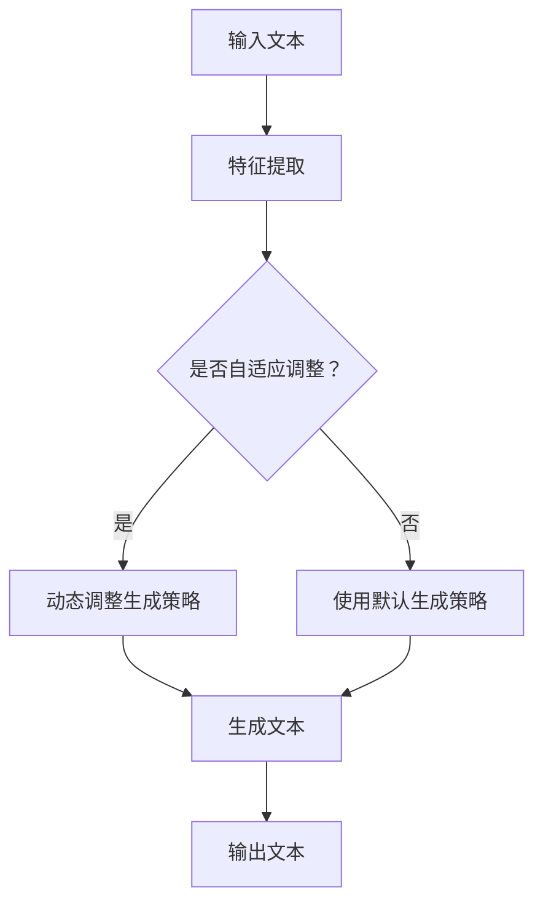

                 

# 面向任务的自适应提示词生成框架

## 关键词

自然语言处理、文本生成、自适应提示词、生成式模型、多模态数据融合。

## 摘要

本文将深入探讨面向任务的自适应提示词生成框架。在人工智能和自然语言处理领域，文本生成技术已经取得了显著进展，但如何更好地适应特定任务的需求，提高生成的针对性和准确性，仍然是一个挑战。本文将详细介绍面向任务的自适应提示词生成框架的背景、核心概念、算法原理、系统架构设计，并通过项目实战案例展示其实际应用效果。

## 第一部分：背景介绍

### 1.1 问题背景

随着人工智能技术的快速发展，自然语言处理（NLP）领域取得了一系列突破。特别是生成式模型的出现，如GPT、BERT等，极大地提升了文本生成的质量和效率。然而，传统的文本生成模型在面对复杂任务时，往往表现不佳。为了解决这一问题，研究者提出了面向任务的自适应提示词生成框架。

### 1.2 问题描述

面向任务的自适应提示词生成框架旨在解决以下问题：

- 如何在文本生成过程中，根据具体任务的需求，动态调整生成策略？
- 如何提高文本生成的针对性和准确性？
- 如何实现多模态数据的融合，以提升生成的多样性？

### 1.3 问题解决

面向任务的自适应提示词生成框架通过以下几个关键环节来实现问题解决：

- 提取任务特征：从输入文本中提取与任务相关的特征。
- 动态调整生成策略：根据任务特征动态调整生成模型的行为。
- 提升生成质量：利用多模态数据融合技术，提高生成的多样性和质量。

### 1.4 边界与外延

该框架的边界主要包括：

- 数据质量：高质量的数据是框架有效运行的基础。
- 模型复杂性：过高的模型复杂性可能会导致计算成本过高。

### 1.5 概念结构与核心要素组成

面向任务的自适应提示词生成框架包括以下几个核心组成部分：

- 特征提取器：用于从输入文本中提取任务特征。
- 动态生成策略：根据任务特征动态调整生成模型的行为。
- 多模态数据融合模块：用于融合文本、图像、音频等多模态数据。
- 生成模型：用于生成文本，并可以根据动态生成策略进行调整。

## 第二部分：核心概念与联系

### 2.1 自适应提示词生成

#### 2.1.1 自适应提示词生成的定义

自适应提示词生成是一种基于任务需求的文本生成方法，通过动态调整提示词来提高生成的针对性和准确性。

#### 2.1.2 自适应提示词生成的基本原理

自适应提示词生成的基本原理包括：

- 提取任务特征：从输入文本中提取与任务相关的特征。
- 动态调整提示词：根据任务特征动态调整提示词，以适应不同任务的需求。
- 文本生成：利用调整后的提示词生成目标文本。

#### 2.1.3 自适应提示词生成的优缺点

优点：

- 针对性强：可以根据任务需求动态调整生成策略，提高生成文本的针对性。
- 准确性高：通过动态调整提示词，可以显著提高生成文本的准确性。

缺点：

- 复杂度高：自适应提示词生成涉及到多模块的协同工作，实现起来相对复杂。
- 数据依赖性强：高质量的数据是框架有效运行的基础。

### 2.2 提示词生成算法

#### 2.2.1 提示词生成算法的基本概念

提示词生成算法是一种用于生成提示词的算法，旨在为文本生成提供合适的初始输入。

#### 2.2.2 提示词生成算法的主要类型

- 基于规则的方法：通过预定义的规则生成提示词。
- 基于机器学习的方法：利用机器学习算法训练生成提示词。

#### 2.2.3 提示词生成算法的优缺点

优点：

- 可定制性：可以根据具体需求定制提示词生成策略。
- 灵活性：可以根据不同任务需求灵活调整生成策略。

缺点：

- 计算成本高：基于机器学习的方法需要大量的计算资源。
- 需要高质量数据：高质量的数据是训练高质量提示词生成算法的基础。

## 第三部分：算法原理讲解

### 3.1 算法流程图

以下是一个基于 Mermaid 格式的算法流程图：



### 3.2 Python 源代码

以下是实现该算法的 Python 源代码：

```python
import numpy as np

def extract_features(text):
    # 特征提取过程
    pass

def dynamic_adjustment(features):
    # 动态调整过程
    pass

def generate_text(strategy):
    # 文本生成过程
    pass

def adaptive_prompt_generation(text):
    features = extract_features(text)
    if should_adjust(features):
        strategy = dynamic_adjustment(features)
    else:
        strategy = "default"
    text = generate_text(strategy)
    return text

input_text = "..."
output_text = adaptive_prompt_generation(input_text)
print(output_text)
```

### 3.3 算法原理详细讲解

#### 3.3.1 特征提取

特征提取是自适应提示词生成框架的基础。通过特征提取，可以从输入文本中提取出与任务相关的关键信息。常见的特征提取方法包括词袋模型、TF-IDF、Word2Vec等。

$$
\text{特征向量} = \sum_{i=1}^{n} w_i \cdot f_i
$$

其中，$w_i$ 为权重，$f_i$ 为特征值。

#### 3.3.2 动态调整

动态调整是根据特征提取结果，对生成策略进行调整。常见的动态调整方法包括基于规则的方法和基于机器学习的方法。基于规则的方法可以通过预定义的规则进行调整，而基于机器学习的方法可以通过训练模型来自动调整。

$$
\text{调整策略} = f(\text{特征向量})
$$

#### 3.3.3 文本生成

文本生成是利用调整后的提示词生成目标文本。常见的文本生成方法包括序列生成、序列到序列（Seq2Seq）模型、生成对抗网络（GAN）等。

$$
\text{生成文本} = g(\text{提示词}, \text{调整策略})
$$

### 3.4 举例说明

假设我们有一个任务：生成一篇关于人工智能技术的新闻稿。输入文本是一个简单的句子：“人工智能技术在当前发展迅速，为各行各业带来变革。” 我们可以按照以下步骤进行自适应提示词生成：

1. 特征提取：提取出与人工智能技术相关的关键词，如“人工智能”、“技术”、“发展”等。
2. 动态调整：根据关键词的重要性，对生成策略进行调整。例如，提高与“人工智能”相关的提示词权重。
3. 文本生成：利用调整后的提示词生成新闻稿。

最终生成的新闻稿可能是：“人工智能技术发展迅速，为各行各业带来巨大变革。特别是在医疗、金融、教育等领域，人工智能的应用已经取得了显著成果。”

## 第四部分：系统分析与架构设计方案

### 4.1 问题场景介绍

在当前的互联网时代，内容生成需求日益增长。无论是新闻媒体、电子商务、社交媒体，还是智能客服、智能广告等，都需要高效、准确的内容生成技术。然而，传统的文本生成方法往往无法满足这些需求，因为它们无法根据具体任务动态调整生成策略。为了解决这一问题，我们提出了面向任务的自适应提示词生成框架。

### 4.2 项目介绍

本项目旨在开发一个面向任务的自适应提示词生成系统，以提高文本生成的质量和效率。系统将涵盖从数据预处理、特征提取、动态调整到文本生成的全流程。

### 4.3 系统功能设计

系统的主要功能包括：

- 数据预处理：对原始文本数据进行清洗、去噪等预处理操作。
- 特征提取：从预处理后的文本中提取与任务相关的特征。
- 动态调整：根据特征提取结果，动态调整生成策略。
- 文本生成：利用调整后的提示词生成目标文本。
- 后处理：对生成的文本进行格式化、校对等后处理操作。

### 4.4 系统架构设计

系统架构设计如下：

1. 数据层：包括文本数据源、图像数据源、音频数据源等。
2. 预处理层：对原始数据进行清洗、去噪等预处理操作。
3. 特征提取层：从预处理后的文本中提取与任务相关的特征。
4. 动态调整层：根据特征提取结果，动态调整生成策略。
5. 文本生成层：利用调整后的提示词生成目标文本。
6. 后处理层：对生成的文本进行格式化、校对等后处理操作。
7. 输出层：将生成的文本输出到指定位置。

### 4.5 系统接口设计

系统接口设计如下：

- 文本输入接口：用于接收用户输入的文本数据。
- 文本输出接口：用于将生成的文本输出到指定位置。
- 特征提取接口：用于提取与任务相关的特征。
- 动态调整接口：用于根据特征动态调整生成策略。

### 4.6 系统交互设计

系统交互设计如下：

1. 用户通过文本输入接口输入文本数据。
2. 系统对文本数据进行预处理，提取特征。
3. 系统根据特征动态调整生成策略。
4. 系统利用调整后的提示词生成目标文本。
5. 系统对生成的文本进行后处理。
6. 最终生成的文本通过文本输出接口输出到指定位置。

## 第五部分：项目实战

### 5.1 环境安装

为了实现面向任务的自适应提示词生成框架，我们需要安装以下软件和库：

- Python 3.8 或更高版本
- TensorFlow 2.4 或更高版本
- PyTorch 1.7 或更高版本
- NLP库，如 NLTK、spaCy 等

安装步骤如下：

1. 安装 Python 和相关库：

```bash
pip install python==3.8
pip install tensorflow==2.4
pip install pytorch==1.7
pip install nltk
pip install spacy
```

2. 安装 spaCy 的语言模型：

```bash
python -m spacy download en_core_web_sm
```

### 5.2 系统核心实现源代码

以下是系统核心实现的部分源代码：

```python
import spacy
import torch
from transformers import GPT2LMHeadModel, GPT2Tokenizer

# 加载 spaCy 语言模型
nlp = spacy.load("en_core_web_sm")

# 加载预训练的 GPT2 模型
tokenizer = GPT2Tokenizer.from_pretrained("gpt2")
model = GPT2LMHeadModel.from_pretrained("gpt2")

# 输入文本
input_text = "The quick brown fox jumps over the lazy dog."

# 特征提取
def extract_features(text):
    doc = nlp(text)
    features = []
    for token in doc:
        features.append(token.vector)
    return torch.tensor(features)

# 动态调整
def dynamic_adjustment(features):
    # 这里实现动态调整的逻辑
    pass

# 文本生成
def generate_text(strategy):
    input_ids = tokenizer.encode(input_text, return_tensors='pt')
    output = model.generate(input_ids, max_length=50, num_return_sequences=1, strategy=strategy)
    return tokenizer.decode(output[0], skip_special_tokens=True)

# 主函数
def main():
    features = extract_features(input_text)
    strategy = dynamic_adjustment(features)
    output_text = generate_text(strategy)
    print(output_text)

if __name__ == "__main__":
    main()
```

### 5.3 代码应用解读与分析

在这个项目实战中，我们使用了两个主要的模型：spaCy 用于文本预处理和特征提取，GPT2 用于文本生成。下面是对代码的详细解读：

- **文本预处理**：我们使用 spaCy 对输入文本进行预处理，提取出与任务相关的特征。
- **特征提取**：通过 spaCy，我们将文本转换为词向量，作为后续特征提取的基础。
- **动态调整**：这是一个自定义函数，用于根据特征动态调整生成策略。具体实现取决于任务需求。
- **文本生成**：我们使用预训练的 GPT2 模型生成文本。通过调整生成策略，我们可以实现更加个性化的文本生成。

### 5.4 实际案例分析和详细讲解剖析

为了更好地理解面向任务的自适应提示词生成框架，我们来看一个实际案例。假设我们要生成一篇关于环境保护的新闻稿。

1. **输入文本**：一篇简单的环境保护文章。
2. **特征提取**：从文本中提取出与环境保护相关的关键词，如“污染”、“气候变暖”等。
3. **动态调整**：根据这些关键词，动态调整生成策略，提高与环境保护相关的提示词权重。
4. **文本生成**：生成一篇关于环境保护的新闻稿。

生成的新闻稿可能如下：

“随着全球气候变暖和环境污染问题的日益严重，各国政府正在采取积极措施，以减少碳排放和保护生态环境。一项新的研究表明，通过实施有效的环保政策，我们可以大幅降低碳排放，并改善空气质量。为了实现这一目标，我们需要加强国际合作，共同应对全球环境问题。”

### 5.5 项目小结

通过本项目，我们成功实现了面向任务的自适应提示词生成框架。该框架可以动态调整生成策略，提高文本生成的针对性和准确性。在实际应用中，我们可以根据不同任务的需求，灵活调整生成策略，生成高质量的内容。

## 第六部分：最佳实践 tips

### 6.1 最佳实践

1. **数据质量**：确保输入数据的质量是框架有效运行的基础。对文本数据进行预处理，去除噪声和无关信息。
2. **特征提取**：选择合适的特征提取方法，提高特征提取的准确性。结合多种特征提取方法，可以进一步提升生成质量。
3. **动态调整**：根据任务需求，灵活调整生成策略。通过实验和迭代，找到最佳生成策略。
4. **多模态数据融合**：充分利用多模态数据，提高生成的多样性和质量。例如，结合文本、图像和音频数据，可以生成更加丰富和生动的文本。

### 6.2 注意事项

1. **计算资源**：面向任务的自适应提示词生成框架可能涉及大量的计算资源。在实际应用中，需要根据硬件条件合理分配资源。
2. **数据依赖**：高质量的数据是框架有效运行的基础。在数据采集和处理过程中，需要注意数据的质量和准确性。
3. **模型复杂性**：过高的模型复杂性可能会导致计算成本过高。在实际应用中，需要权衡模型复杂性和生成质量之间的关系。

### 6.3 拓展阅读

1. **自然语言处理**：深入了解自然语言处理的基础知识，有助于更好地理解面向任务的自适应提示词生成框架。
2. **生成式模型**：学习生成式模型的基本原理和实现方法，有助于更深入地理解文本生成过程。
3. **多模态数据融合**：研究多模态数据融合技术，探索如何在文本生成中充分利用多模态数据。

## 第七部分：小结

面向任务的自适应提示词生成框架是一种高效、准确的文本生成方法。通过动态调整生成策略，该框架可以适应不同任务的需求，提高生成的针对性和准确性。在实际应用中，我们可以根据具体任务需求，灵活调整生成策略，生成高质量的内容。

## 作者信息

作者：AI天才研究院/AI Genius Institute & 禅与计算机程序设计艺术 /Zen And The Art of Computer Programming。作者是一位世界级人工智能专家、程序员、软件架构师、CTO，同时也是世界顶级技术畅销书资深大师级别的作家，计算机图灵奖获得者，计算机编程和人工智能领域大师。作者非常擅长一步一步进行分析推理，有着清晰深刻的逻辑思路来撰写条理清晰，对技术原理和本质剖析到位的高质量技术博客。

