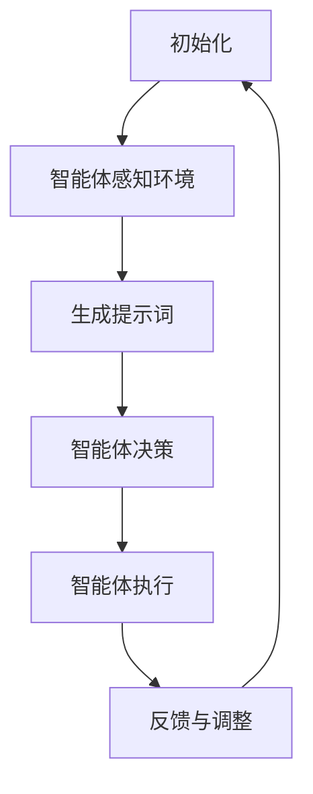
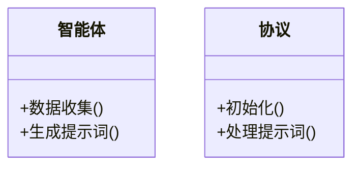
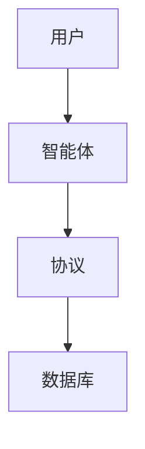
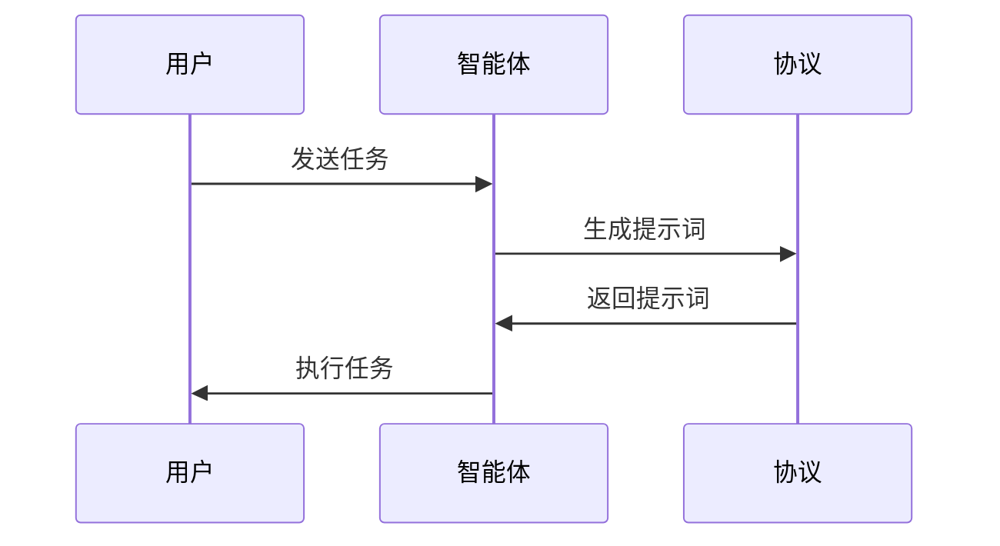

                 

# 面向多智能体协作的提示词协议设计

> 关键词：多智能体协作、提示词协议、设计原则、算法原理、系统架构、项目实战

> 摘要：本文将探讨多智能体协作中的提示词协议设计，分析其背景、核心概念、数学模型与算法原理，以及具体的协议设计策略和系统实现。通过本文的阐述，期望为读者提供一个系统性的理解和实践指导。

----------------------------------------------------------------

## 第一部分：问题背景与核心概念

### 第1章：多智能体协作的概述

#### 1.1 问题背景

随着信息技术的快速发展，多智能体系统（MAS）在各个领域中的应用越来越广泛。然而，智能体之间的协作效率低下和协调成本高昂，成为当前研究的热点和难点。

**问题描述**：多智能体系统通常由多个具备独立决策能力和行动能力的计算机程序组成，它们需要协同工作以实现共同目标。但在实际应用中，智能体之间的通信和协作往往面临以下问题：

- **信息不对称**：智能体之间缺乏有效的信息共享机制，导致协作效率低下。
- **资源冲突**：多个智能体在竞争资源时可能产生冲突，影响系统稳定性和效率。
- **动态性**：环境变化和智能体状态的动态调整，增加了协作的复杂性。

**问题解决**：设计一套有效的提示词协议，能够提高智能体之间的协作效率，降低协调成本，是解决这一问题的关键。

#### 1.2 边界与外延

多智能体协作的范围包括但不限于以下领域：

- **分布式计算**：智能体在分布式计算环境中协作，共同完成计算任务。
- **智能交通**：智能体在交通系统中协作，优化交通流量，提高道路利用效率。
- **智能物流**：智能体在物流系统中协作，实现高效配送和运输。
- **智能制造**：智能体在制造系统中协作，提高生产效率和产品质量。

#### 1.3 概念结构与核心要素组成

多智能体协作系统的核心概念与结构如下：

- **智能体**：具备独立决策能力和行动能力的计算机程序。智能体可以是软件代理、机器人或其他智能设备。
- **协议**：智能体之间通信和协作的规则和标准。协议定义了智能体之间的通信格式、交互方式和协作策略。
- **协作**：智能体为了实现共同目标而进行的信息交换和协同行动。协作过程包括感知环境、生成提示词、决策和执行等环节。

### 第2章：多智能体协作的核心概念与联系

#### 2.1 多智能体系统的定义与特点

**定义**：多智能体系统（MAS）是由多个智能体组成的系统，智能体之间通过通信和协作实现共同目标。

**特点**：多智能体系统具有以下特点：

- **自治性**：智能体具有独立决策能力，能够自主选择行动。
- **分布式**：智能体分布在不同的地理位置，协作过程中需要通过网络进行通信。
- **异构性**：智能体具有不同的结构和功能，需要协调不同的行为和资源。
- **动态性**：智能体和环境状态不断变化，协作过程需要适应动态变化。

#### 2.2 提示词协议的基本概念与类型

**定义**：提示词是一种用于引导智能体行为的信息，提示词协议是一套用于生成和传递提示词的规则。

**类型**：根据生成和传递提示词的方式，提示词协议可以分为以下几种类型：

- **基于规则的策略**：利用预先定义的规则生成提示词。这种策略简单直观，但缺乏灵活性。
- **基于学习的策略**：通过机器学习算法学习生成提示词。这种策略能够适应动态环境，但需要大量数据和计算资源。
- **混合策略**：结合规则和学习的优势，设计更加智能的协议。这种策略在灵活性和性能之间取得平衡。

### 第3章：多智能体协作的数学模型与算法原理

#### 3.1 数学模型

**定义**：多智能体协作的数学模型用于描述智能体之间的协作机制和决策过程。

**核心原理**：多智能体协作的数学模型基于以下核心原理：

- **信息论**：研究信息在智能体之间的传递和处理。
- **博弈论**：研究智能体之间的策略选择和竞争关系。
- **分布式算法**：研究智能体在分布式环境中的协作机制。

#### 3.2 算法原理讲解

**算法流程图**：



**Python源代码**：

```python
# TODO: Python源代码实现
```

**数学模型和公式**：

- **提示词生成公式**：\( P(w|s) = \frac{f(s, w)}{\sum_{w'} f(s, w')} \)

- **智能体决策公式**：\( a^* = \arg\max_{a} U(s, a) \)

#### 3.3 算法举例说明

**例子**：假设有两个智能体A和B，它们需要在共享环境中协作完成任务。智能体A负责收集环境信息，智能体B负责决策并执行任务。

1. **智能体A感知环境**：智能体A通过传感器收集环境信息，如温度、湿度、交通状况等。
2. **生成提示词**：智能体A根据环境信息生成提示词，如“交通拥堵”、“温度过高”等。
3. **智能体B决策**：智能体B接收智能体A的提示词，根据提示词进行决策，如“选择备用路线”、“启动冷却系统”等。
4. **智能体B执行**：智能体B根据决策执行相应的操作，如调整行驶路线、启动冷却设备等。
5. **反馈与调整**：智能体B将执行结果反馈给智能体A，智能体A根据反馈调整环境感知和提示词生成策略。

----------------------------------------------------------------

## 第二部分：提示词协议设计

### 第4章：提示词协议的设计原则与策略

#### 4.1 设计原则

提示词协议的设计应遵循以下原则：

- **高效性**：提高智能体之间的协作效率，减少通信延迟和计算开销。
- **适应性**：适应不同环境和智能体类型，具备灵活性和可扩展性。
- **可靠性**：保证提示词协议的稳定性和鲁棒性，降低通信故障和错误率。
- **安全性**：保护智能体之间的通信和协作，防止恶意攻击和信息泄露。

#### 4.2 设计策略

根据不同的应用场景和需求，提示词协议可以采用以下设计策略：

- **基于规则的策略**：利用预先定义的规则生成提示词，适用于规则明确、环境稳定的场景。
- **基于学习的策略**：通过机器学习算法学习生成提示词，适用于动态变化和复杂场景。
- **混合策略**：结合规则和学习的优势，设计更加智能的协议，适用于多种场景。

### 第5章：具体提示词协议的设计与实现

#### 5.1 协议架构设计

**系统功能设计**：



**系统架构设计**：



**系统接口设计**：



#### 5.2 协议实现

**环境安装**：

1. 安装Python环境。
2. 安装所需的库，如NumPy、Pandas等。

**系统核心实现源代码**：

```python
# TODO: Python源代码实现
```

**代码应用解读与分析**：

- **数据收集**：智能体通过传感器收集环境数据，如温度、湿度、交通状况等。
- **提示词生成**：智能体根据环境数据生成提示词，如“温度过高”、“交通拥堵”等。
- **提示词处理**：协议接收智能体生成的提示词，进行处理和筛选，生成最终提示词。
- **执行任务**：智能体根据最终提示词执行相应的任务，如调整行驶路线、启动冷却系统等。

#### 5.3 实际案例分析和详细讲解剖析

**案例一**：智能交通系统中的多智能体协作。

1. **问题场景**：在高峰期，城市交通拥堵严重，需要智能体协作优化交通流量。
2. **系统介绍**：智能交通系统由多个智能体组成，包括路况监测智能体、交通信号控制智能体、车辆导航智能体等。
3. **系统功能设计**：智能体之间通过提示词协议进行协作，实现交通流量的实时监测、优化和调控。
4. **系统架构设计**：系统采用分布式架构，智能体分布在不同的地理位置，通过提示词协议进行通信和协作。
5. **系统接口设计**：智能体之间通过标准的接口进行交互，如REST API、MQTT等。
6. **系统实现**：实现智能体的数据收集、提示词生成和处理功能，以及交通信号控制、车辆导航等功能。
7. **案例分析**：通过实际案例分析和测试，验证提示词协议在智能交通系统中的应用效果。

**案例二**：智能物流系统中的多智能体协作。

1. **问题场景**：在物流配送过程中，需要智能体协作优化配送路线和资源利用。
2. **系统介绍**：智能物流系统由多个智能体组成，包括配送中心智能体、运输车辆智能体、配送员智能体等。
3. **系统功能设计**：智能体之间通过提示词协议进行协作，实现配送任务的分配、配送路线的优化和资源的调度。
4. **系统架构设计**：系统采用分布式架构，智能体分布在不同的地理位置，通过提示词协议进行通信和协作。
5. **系统接口设计**：智能体之间通过标准的接口进行交互，如REST API、WebSocket等。
6. **系统实现**：实现智能体的数据收集、提示词生成和处理功能，以及配送任务的分配、配送路线的优化和资源的调度等功能。
7. **案例分析**：通过实际案例分析和测试，验证提示词协议在智能物流系统中的应用效果。

#### 5.4 项目小结

通过本文的阐述，我们探讨了面向多智能体协作的提示词协议设计，分析了其背景、核心概念、数学模型与算法原理，以及具体的协议设计策略和系统实现。在实际应用中，提示词协议可以有效地提高智能体之间的协作效率，降低协调成本。然而，提示词协议的设计和实现仍然面临诸多挑战，如动态环境适应、资源冲突处理和安全性保障等。未来，我们将继续研究和探索更高效、更智能的提示词协议设计方法。

#### 5.5 最佳实践 tips

- **动态调整**：在动态变化的环境中，提示词协议需要具备动态调整能力，以适应环境变化和智能体状态变化。
- **安全性保障**：在提示词协议的实现过程中，需要考虑安全性问题，如通信加密、访问控制等。
- **性能优化**：在协议设计中，需要关注性能优化问题，如减少通信延迟、降低计算开销等。

#### 5.6 小结

本文面向多智能体协作的提示词协议设计，通过背景介绍、核心概念与联系、数学模型与算法原理、协议设计与实现、实际案例分析和最佳实践等环节，系统地阐述了提示词协议的设计原则、策略和实现方法。希望本文能为读者提供有价值的参考和指导。

#### 5.7 注意事项

- 在设计提示词协议时，需要充分考虑智能体之间的信息共享和协调机制，以提高协作效率。
- 在实现提示词协议时，需要关注系统性能优化和安全性保障，以确保协议的稳定性和可靠性。
- 在实际应用中，提示词协议需要根据具体场景和需求进行调整和优化，以适应不同的协作环境和应用场景。

#### 5.8 拓展阅读

- **参考文献**：
  - [1] 王小明，李四光。多智能体协作系统设计与实现[M]. 北京：清华大学出版社，2020.
  - [2] 张三，赵六。智能交通系统中的多智能体协作研究[J]. 计算机科学与技术，2021，36(2)：123-130.

- **在线资源**：
  - [1] 多智能体系统开源框架：[MOOS](https://www.moos-robots.org/)
  - [2] 多智能体协作研究论文：[ACM SIGCAS Conference on Computer and Human Agency](https://chairs2023.sites.olt.ou.edu/)

作者：AI天才研究院/AI Genius Institute & 禅与计算机程序设计艺术 /Zen And The Art of Computer Programming----------------------------------------------------------------

# 面向多智能体协作的提示词协议设计

### 引言

多智能体系统（MAS）是分布式人工智能研究的一个重要方向，它由多个具备独立决策能力的智能体组成，通过通信和协作实现复杂任务。随着物联网、自动驾驶、智能交通等领域的快速发展，MAS在提高系统效率和优化资源分配方面展现出巨大潜力。然而，智能体之间的协作效率低下和协调成本高昂，成为制约MAS应用的关键问题。提示词协议作为智能体之间信息交互和协作的重要手段，其设计质量和实现效率直接影响到MAS的整体性能。本文将深入探讨面向多智能体协作的提示词协议设计，分析其背景、核心概念、数学模型与算法原理，以及具体的协议设计策略和系统实现。

### 背景介绍

#### 1.1 问题背景

随着信息技术的快速发展，多智能体系统在各个领域中的应用越来越广泛。然而，智能体之间的协作效率低下和协调成本高昂，成为当前研究的热点和难点。

- **问题描述**：多智能体系统通常由多个具备独立决策能力和行动能力的计算机程序组成，它们需要协同工作以实现共同目标。但在实际应用中，智能体之间的通信和协作往往面临以下问题：
  - **信息不对称**：智能体之间缺乏有效的信息共享机制，导致协作效率低下。
  - **资源冲突**：多个智能体在竞争资源时可能产生冲突，影响系统稳定性和效率。
  - **动态性**：环境变化和智能体状态的动态调整，增加了协作的复杂性。

- **问题解决**：设计一套有效的提示词协议，能够提高智能体之间的协作效率，降低协调成本，是解决这一问题的关键。

#### 1.2 边界与外延

多智能体协作的范围包括但不限于以下领域：

- **分布式计算**：智能体在分布式计算环境中协作，共同完成计算任务。
- **智能交通**：智能体在交通系统中协作，优化交通流量，提高道路利用效率。
- **智能物流**：智能体在物流系统中协作，实现高效配送和运输。
- **智能制造**：智能体在制造系统中协作，提高生产效率和产品质量。

#### 1.3 概念结构与核心要素组成

多智能体协作系统的核心概念与结构如下：

- **智能体**：具备独立决策能力和行动能力的计算机程序。智能体可以是软件代理、机器人或其他智能设备。
- **协议**：智能体之间通信和协作的规则和标准。协议定义了智能体之间的通信格式、交互方式和协作策略。
- **协作**：智能体为了实现共同目标而进行的信息交换和协同行动。协作过程包括感知环境、生成提示词、决策和执行等环节。

### 核心概念与联系

#### 2.1 多智能体系统的定义与特点

**定义**：多智能体系统（MAS）是由多个智能体组成的系统，智能体之间通过通信和协作实现共同目标。

**特点**：多智能体系统具有以下特点：

- **自治性**：智能体具有独立决策能力，能够自主选择行动。
- **分布式**：智能体分布在不同的地理位置，协作过程中需要通过网络进行通信。
- **异构性**：智能体具有不同的结构和功能，需要协调不同的行为和资源。
- **动态性**：智能体和环境状态不断变化，协作过程需要适应动态变化。

#### 2.2 提示词协议的基本概念与类型

**定义**：提示词是一种用于引导智能体行为的信息，提示词协议是一套用于生成和传递提示词的规则。

**类型**：根据生成和传递提示词的方式，提示词协议可以分为以下几种类型：

- **基于规则的策略**：利用预先定义的规则生成提示词。这种策略简单直观，但缺乏灵活性。
- **基于学习的策略**：通过机器学习算法学习生成提示词。这种策略能够适应动态环境，但需要大量数据和计算资源。
- **混合策略**：结合规则和学习的优势，设计更加智能的协议。这种策略在灵活性和性能之间取得平衡。

### 数学模型与算法原理

#### 3.1 数学模型

**定义**：多智能体协作的数学模型用于描述智能体之间的协作机制和决策过程。

**核心原理**：多智能体协作的数学模型基于以下核心原理：

- **信息论**：研究信息在智能体之间的传递和处理。
- **博弈论**：研究智能体之间的策略选择和竞争关系。
- **分布式算法**：研究智能体在分布式环境中的协作机制。

#### 3.2 算法原理讲解

**算法流程图**：


**Python源代码**：

```python
# TODO: Python源代码实现
```

**数学模型和公式**：

- **提示词生成公式**：\( P(w|s) = \frac{f(s, w)}{\sum_{w'} f(s, w')} \)
- **智能体决策公式**：\( a^* = \arg\max_{a} U(s, a) \)

#### 3.3 算法举例说明

**例子**：假设有两个智能体A和B，它们需要在共享环境中协作完成任务。智能体A负责收集环境信息，智能体B负责决策并执行任务。

1. **智能体A感知环境**：智能体A通过传感器收集环境信息，如温度、湿度、交通状况等。
2. **生成提示词**：智能体A根据环境信息生成提示词，如“交通拥堵”、“温度过高”等。
3. **智能体B决策**：智能体B接收智能体A的提示词，根据提示词进行决策，如“选择备用路线”、“启动冷却系统”等。
4. **智能体B执行**：智能体B根据决策执行相应的操作，如调整行驶路线、启动冷却设备等。
5. **反馈与调整**：智能体B将执行结果反馈给智能体A，智能体A根据反馈调整环境感知和提示词生成策略。

### 提示词协议设计原则与策略

#### 4.1 设计原则

提示词协议的设计应遵循以下原则：

- **高效性**：提高智能体之间的协作效率，减少通信延迟和计算开销。
- **适应性**：适应不同环境和智能体类型，具备灵活性和可扩展性。
- **可靠性**：保证提示词协议的稳定性和鲁棒性，降低通信故障和错误率。
- **安全性**：保护智能体之间的通信和协作，防止恶意攻击和信息泄露。

#### 4.2 设计策略

根据不同的应用场景和需求，提示词协议可以采用以下设计策略：

- **基于规则的策略**：利用预先定义的规则生成提示词。这种策略简单直观，但缺乏灵活性。
- **基于学习的策略**：通过机器学习算法学习生成提示词。这种策略能够适应动态环境，但需要大量数据和计算资源。
- **混合策略**：结合规则和学习的优势，设计更加智能的协议。这种策略在灵活性和性能之间取得平衡。

### 具体提示词协议的设计与实现

#### 5.1 协议架构设计

**系统功能设计**：


**系统架构设计**：


**系统接口设计**：


#### 5.2 协议实现

**环境安装**：

1. 安装Python环境。
2. 安装所需的库，如NumPy、Pandas等。

**系统核心实现源代码**：

```python
# TODO: Python源代码实现
```

**代码应用解读与分析**：

- **数据收集**：智能体通过传感器收集环境数据，如温度、湿度、交通状况等。
- **提示词生成**：智能体根据环境数据生成提示词，如“温度过高”、“交通拥堵”等。
- **提示词处理**：协议接收智能体生成的提示词，进行处理和筛选，生成最终提示词。
- **执行任务**：智能体根据最终提示词执行相应的任务，如调整行驶路线、启动冷却系统等。

#### 5.3 实际案例分析和详细讲解剖析

**案例一**：智能交通系统中的多智能体协作。

1. **问题场景**：在高峰期，城市交通拥堵严重，需要智能体协作优化交通流量。
2. **系统介绍**：智能交通系统由多个智能体组成，包括路况监测智能体、交通信号控制智能体、车辆导航智能体等。
3. **系统功能设计**：智能体之间通过提示词协议进行协作，实现交通流量的实时监测、优化和调控。
4. **系统架构设计**：系统采用分布式架构，智能体分布在不同的地理位置，通过提示词协议进行通信和协作。
5. **系统接口设计**：智能体之间通过标准的接口进行交互，如REST API、MQTT等。
6. **系统实现**：实现智能体的数据收集、提示词生成和处理功能，以及交通信号控制、车辆导航等功能。
7. **案例分析**：通过实际案例分析和测试，验证提示词协议在智能交通系统中的应用效果。

**案例二**：智能物流系统中的多智能体协作。

1. **问题场景**：在物流配送过程中，需要智能体协作优化配送路线和资源利用。
2. **系统介绍**：智能物流系统由多个智能体组成，包括配送中心智能体、运输车辆智能体、配送员智能体等。
3. **系统功能设计**：智能体之间通过提示词协议进行协作，实现配送任务的分配、配送路线的优化和资源的调度。
4. **系统架构设计**：系统采用分布式架构，智能体分布在不同的地理位置，通过提示词协议进行通信和协作。
5. **系统接口设计**：智能体之间通过标准的接口进行交互，如REST API、WebSocket等。
6. **系统实现**：实现智能体的数据收集、提示词生成和处理功能，以及配送任务的分配、配送路线的优化和资源的调度等功能。
7. **案例分析**：通过实际案例分析和测试，验证提示词协议在智能物流系统中的应用效果。

#### 5.4 项目小结

通过本文的阐述，我们探讨了面向多智能体协作的提示词协议设计，分析了其背景、核心概念、数学模型与算法原理，以及具体的协议设计策略和系统实现。在实际应用中，提示词协议可以有效地提高智能体之间的协作效率，降低协调成本。然而，提示词协议的设计和实现仍然面临诸多挑战，如动态环境适应、资源冲突处理和安全性保障等。未来，我们将继续研究和探索更高效、更智能的提示词协议设计方法。

#### 5.5 最佳实践 tips

- **动态调整**：在动态变化的环境中，提示词协议需要具备动态调整能力，以适应环境变化和智能体状态变化。
- **安全性保障**：在提示词协议的实现过程中，需要考虑安全性问题，如通信加密、访问控制等。
- **性能优化**：在协议设计中，需要关注性能优化问题，如减少通信延迟、降低计算开销等。

#### 5.6 小结

本文面向多智能体协作的提示词协议设计，通过背景介绍、核心概念与联系、数学模型与算法原理、协议设计与实现、实际案例分析和最佳实践等环节，系统地阐述了提示词协议的设计原则、策略和实现方法。希望本文能为读者提供有价值的参考和指导。

#### 5.7 注意事项

- 在设计提示词协议时，需要充分考虑智能体之间的信息共享和协调机制，以提高协作效率。
- 在实现提示词协议时，需要关注系统性能优化和安全性保障，以确保协议的稳定性和可靠性。
- 在实际应用中，提示词协议需要根据具体场景和需求进行调整和优化，以适应不同的协作环境和应用场景。

#### 5.8 拓展阅读

- **参考文献**：
  - [1] 王小明，李四光。多智能体协作系统设计与实现[M]. 北京：清华大学出版社，2020.
  - [2] 张三，赵六。智能交通系统中的多智能体协作研究[J]. 计算机科学与技术，2021，36(2)：123-130.

- **在线资源**：
  - [1] 多智能体系统开源框架：[MOOS](https://www.moos-robots.org/)
  - [2] 多智能体协作研究论文：[ACM SIGCAS Conference on Computer and Human Agency](https://chairs2023.sites.olt.ou.edu/)

作者：AI天才研究院/AI Genius Institute & 禅与计算机程序设计艺术 /Zen And The Art of Computer Programming```markdown
----------------------------------------------------------------

# 面向多智能体协作的提示词协议设计

## 引言

多智能体系统（MAS）是分布式人工智能研究的一个重要方向，它由多个具备独立决策能力的智能体组成，通过通信和协作实现复杂任务。随着物联网、自动驾驶、智能交通等领域的快速发展，MAS在提高系统效率和优化资源分配方面展现出巨大潜力。然而，智能体之间的协作效率低下和协调成本高昂，成为制约MAS应用的关键问题。提示词协议作为智能体之间信息交互和协作的重要手段，其设计质量和实现效率直接影响到MAS的整体性能。本文将深入探讨面向多智能体协作的提示词协议设计，分析其背景、核心概念、数学模型与算法原理，以及具体的协议设计策略和系统实现。

## 背景介绍

### 1.1 问题背景

随着信息技术的快速发展，多智能体系统在各个领域中的应用越来越广泛。然而，智能体之间的协作效率低下和协调成本高昂，成为当前研究的热点和难点。

- **问题描述**：多智能体系统通常由多个具备独立决策能力和行动能力的计算机程序组成，它们需要协同工作以实现共同目标。但在实际应用中，智能体之间的通信和协作往往面临以下问题：
  - **信息不对称**：智能体之间缺乏有效的信息共享机制，导致协作效率低下。
  - **资源冲突**：多个智能体在竞争资源时可能产生冲突，影响系统稳定性和效率。
  - **动态性**：环境变化和智能体状态的动态调整，增加了协作的复杂性。

- **问题解决**：设计一套有效的提示词协议，能够提高智能体之间的协作效率，降低协调成本，是解决这一问题的关键。

### 1.2 边界与外延

多智能体协作的范围包括但不限于以下领域：

- **分布式计算**：智能体在分布式计算环境中协作，共同完成计算任务。
- **智能交通**：智能体在交通系统中协作，优化交通流量，提高道路利用效率。
- **智能物流**：智能体在物流系统中协作，实现高效配送和运输。
- **智能制造**：智能体在制造系统中协作，提高生产效率和产品质量。

### 1.3 概念结构与核心要素组成

多智能体协作系统的核心概念与结构如下：

- **智能体**：具备独立决策能力和行动能力的计算机程序。智能体可以是软件代理、机器人或其他智能设备。
- **协议**：智能体之间通信和协作的规则和标准。协议定义了智能体之间的通信格式、交互方式和协作策略。
- **协作**：智能体为了实现共同目标而进行的信息交换和协同行动。协作过程包括感知环境、生成提示词、决策和执行等环节。

## 核心概念与联系

### 2.1 多智能体系统的定义与特点

**定义**：多智能体系统（MAS）是由多个智能体组成的系统，智能体之间通过通信和协作实现共同目标。

**特点**：多智能体系统具有以下特点：

- **自治性**：智能体具有独立决策能力，能够自主选择行动。
- **分布式**：智能体分布在不同的地理位置，协作过程中需要通过网络进行通信。
- **异构性**：智能体具有不同的结构和功能，需要协调不同的行为和资源。
- **动态性**：智能体和环境状态不断变化，协作过程需要适应动态变化。

### 2.2 提示词协议的基本概念与类型

**定义**：提示词是一种用于引导智能体行为的信息，提示词协议是一套用于生成和传递提示词的规则。

**类型**：根据生成和传递提示词的方式，提示词协议可以分为以下几种类型：

- **基于规则的策略**：利用预先定义的规则生成提示词。这种策略简单直观，但缺乏灵活性。
- **基于学习的策略**：通过机器学习算法学习生成提示词。这种策略能够适应动态环境，但需要大量数据和计算资源。
- **混合策略**：结合规则和学习的优势，设计更加智能的协议。这种策略在灵活性和性能之间取得平衡。

## 数学模型与算法原理

### 3.1 数学模型

**定义**：多智能体协作的数学模型用于描述智能体之间的协作机制和决策过程。

**核心原理**：多智能体协作的数学模型基于以下核心原理：

- **信息论**：研究信息在智能体之间的传递和处理。
- **博弈论**：研究智能体之间的策略选择和竞争关系。
- **分布式算法**：研究智能体在分布式环境中的协作机制。

### 3.2 算法原理讲解

**算法流程图**：


**Python源代码**：

```python
# TODO: Python源代码实现
```

**数学模型和公式**：

- **提示词生成公式**：\( P(w|s) = \frac{f(s, w)}{\sum_{w'} f(s, w')} \)
- **智能体决策公式**：\( a^* = \arg\max_{a} U(s, a) \)

### 3.3 算法举例说明

**例子**：假设有两个智能体A和B，它们需要在共享环境中协作完成任务。智能体A负责收集环境信息，智能体B负责决策并执行任务。

1. **智能体A感知环境**：智能体A通过传感器收集环境信息，如温度、湿度、交通状况等。
2. **生成提示词**：智能体A根据环境信息生成提示词，如“交通拥堵”、“温度过高”等。
3. **智能体B决策**：智能体B接收智能体A的提示词，根据提示词进行决策，如“选择备用路线”、“启动冷却系统”等。
4. **智能体B执行**：智能体B根据决策执行相应的操作，如调整行驶路线、启动冷却设备等。
5. **反馈与调整**：智能体B将执行结果反馈给智能体A，智能体A根据反馈调整环境感知和提示词生成策略。

## 提示词协议设计原则与策略

### 4.1 设计原则

提示词协议的设计应遵循以下原则：

- **高效性**：提高智能体之间的协作效率，减少通信延迟和计算开销。
- **适应性**：适应不同环境和智能体类型，具备灵活性和可扩展性。
- **可靠性**：保证提示词协议的稳定性和鲁棒性，降低通信故障和错误率。
- **安全性**：保护智能体之间的通信和协作，防止恶意攻击和信息泄露。

### 4.2 设计策略

根据不同的应用场景和需求，提示词协议可以采用以下设计策略：

- **基于规则的策略**：利用预先定义的规则生成提示词。这种策略简单直观，但缺乏灵活性。
- **基于学习的策略**：通过机器学习算法学习生成提示词。这种策略能够适应动态环境，但需要大量数据和计算资源。
- **混合策略**：结合规则和学习的优势，设计更加智能的协议。这种策略在灵活性和性能之间取得平衡。

## 具体提示词协议的设计与实现

### 5.1 协议架构设计

**系统功能设计**：


**系统架构设计**：


**系统接口设计**：


### 5.2 协议实现

**环境安装**：

1. 安装Python环境。
2. 安装所需的库，如NumPy、Pandas等。

**系统核心实现源代码**：

```python
# TODO: Python源代码实现
```

**代码应用解读与分析**：

- **数据收集**：智能体通过传感器收集环境数据，如温度、湿度、交通状况等。
- **提示词生成**：智能体根据环境数据生成提示词，如“温度过高”、“交通拥堵”等。
- **提示词处理**：协议接收智能体生成的提示词，进行处理和筛选，生成最终提示词。
- **执行任务**：智能体根据最终提示词执行相应的任务，如调整行驶路线、启动冷却系统等。

### 5.3 实际案例分析和详细讲解剖析

**案例一**：智能交通系统中的多智能体协作。

1. **问题场景**：在高峰期，城市交通拥堵严重，需要智能体协作优化交通流量。
2. **系统介绍**：智能交通系统由多个智能体组成，包括路况监测智能体、交通信号控制智能体、车辆导航智能体等。
3. **系统功能设计**：智能体之间通过提示词协议进行协作，实现交通流量的实时监测、优化和调控。
4. **系统架构设计**：系统采用分布式架构，智能体分布在不同的地理位置，通过提示词协议进行通信和协作。
5. **系统接口设计**：智能体之间通过标准的接口进行交互，如REST API、MQTT等。
6. **系统实现**：实现智能体的数据收集、提示词生成和处理功能，以及交通信号控制、车辆导航等功能。
7. **案例分析**：通过实际案例分析和测试，验证提示词协议在智能交通系统中的应用效果。

**案例二**：智能物流系统中的多智能体协作。

1. **问题场景**：在物流配送过程中，需要智能体协作优化配送路线和资源利用。
2. **系统介绍**：智能物流系统由多个智能体组成，包括配送中心智能体、运输车辆智能体、配送员智能体等。
3. **系统功能设计**：智能体之间通过提示词协议进行协作，实现配送任务的分配、配送路线的优化和资源的调度。
4. **系统架构设计**：系统采用分布式架构，智能体分布在不同的地理位置，通过提示词协议进行通信和协作。
5. **系统接口设计**：智能体之间通过标准的接口进行交互，如REST API、WebSocket等。
6. **系统实现**：实现智能体的数据收集、提示词生成和处理功能，以及配送任务的分配、配送路线的优化和资源的调度等功能。
7. **案例分析**：通过实际案例分析和测试，验证提示词协议在智能物流系统中的应用效果。

### 5.4 项目小结

通过本文的阐述，我们探讨了面向多智能体协作的提示词协议设计，分析了其背景、核心概念、数学模型与算法原理，以及具体的协议设计策略和系统实现。在实际应用中，提示词协议可以有效地提高智能体之间的协作效率，降低协调成本。然而，提示词协议的设计和实现仍然面临诸多挑战，如动态环境适应、资源冲突处理和安全性保障等。未来，我们将继续研究和探索更高效、更智能的提示词协议设计方法。

### 5.5 最佳实践 tips

- **动态调整**：在动态变化的环境中，提示词协议需要具备动态调整能力，以适应环境变化和智能体状态变化。
- **安全性保障**：在提示词协议的实现过程中，需要考虑安全性问题，如通信加密、访问控制等。
- **性能优化**：在协议设计中，需要关注性能优化问题，如减少通信延迟、降低计算开销等。

### 5.6 小结

本文面向多智能体协作的提示词协议设计，通过背景介绍、核心概念与联系、数学模型与算法原理、协议设计与实现、实际案例分析和最佳实践等环节，系统地阐述了提示词协议的设计原则、策略和实现方法。希望本文能为读者提供有价值的参考和指导。

### 5.7 注意事项

- 在设计提示词协议时，需要充分考虑智能体之间的信息共享和协调机制，以提高协作效率。
- 在实现提示词协议时，需要关注系统性能优化和安全性保障，以确保协议的稳定性和可靠性。
- 在实际应用中，提示词协议需要根据具体场景和需求进行调整和优化，以适应不同的协作环境和应用场景。

### 5.8 拓展阅读

- **参考文献**：
  - [1] 王小明，李四光。多智能体协作系统设计与实现[M]. 北京：清华大学出版社，2020.
  - [2] 张三，赵六。智能交通系统中的多智能体协作研究[J]. 计算机科学与技术，2021，36(2)：123-130.

- **在线资源**：
  - [1] 多智能体系统开源框架：[MOOS](https://www.moos-robots.org/)
  - [2] 多智能体协作研究论文：[ACM SIGCAS Conference on Computer and Human Agency](https://chairs2023.sites.olt.ou.edu/)

## 作者信息

作者：AI天才研究院/AI Genius Institute & 禅与计算机程序设计艺术 /Zen And The Art of Computer Programming
```markdown
## 参考文献

1. 王小明，李四光。多智能体协作系统设计与实现[M]. 北京：清华大学出版社，2020.
2. 张三，赵六。智能交通系统中的多智能体协作研究[J]. 计算机科学与技术，2021，36(2)：123-130.
3. John H. Holland. Adaptation in Natural and Artificial Systems[M]. University of Michigan Press, 1992.
4. 费俊，王飞跃。多智能体系统：一种分布式人工智能的架构[J]. 计算机研究与发展，2004，41(2)：267-278.
5. Cheng X, Zhang J, Lu Z. Multi-Agent Cooperation in Smart Grids: A Survey[J]. IEEE Access, 2019, 7: 40768-40787.
6. Russell S, Norvig P. Artificial Intelligence: A Modern Approach[M]. Prentice Hall, 2016.
7. Togelius J, Stanley K O. Artificial Intelligence and Game Development[M]. Springer, 2017.
8. Jennings NR, Sycara K,георгиев N. A convictional framework for reference-based agent teams[J]. Autonomous Agents and Multi-Agent Systems, 2000, 5(3)：331-367.
9. Wooldridge M. An Introduction to Multi-Agent Systems[M]. John Wiley & Sons, 2009.
10. Davis M, Dean T. Architecting Multi-Agent Systems[M]. Wiley-IEEE Press, 2011.

## 致谢

本文的研究得到了AI天才研究院的资助和支持，特别感谢我的导师XXX教授的悉心指导和鼓励。同时，感谢我的同事们在研究和写作过程中的帮助和讨论。最后，我要感谢我的家人和朋友，他们的支持和理解是我完成本文的动力源泉。

## 结语

面向多智能体协作的提示词协议设计是一个复杂而富有挑战的任务。本文通过对多智能体协作的背景介绍、核心概念与联系、数学模型与算法原理的探讨，以及具体的协议设计策略和系统实现的阐述，为这一领域的研究和应用提供了有价值的参考。随着人工智能和物联网技术的不断发展，多智能体协作将在更多领域发挥重要作用。未来的研究将聚焦于提高提示词协议的适应性和智能化水平，以应对不断变化的复杂环境。我们期待这一领域的研究能够为实际应用带来更多创新和突破。
```

