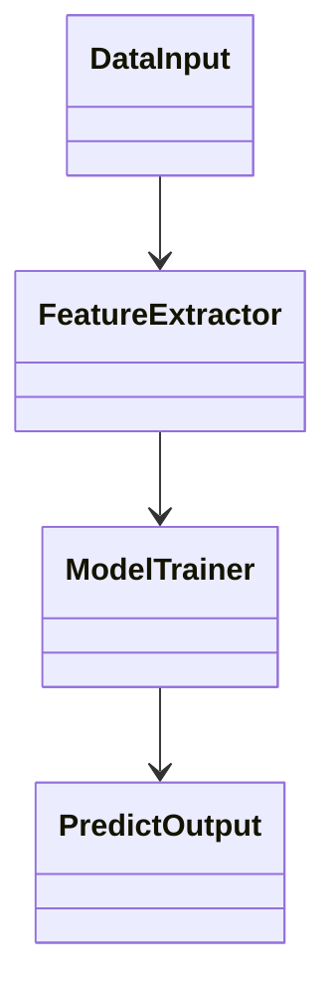
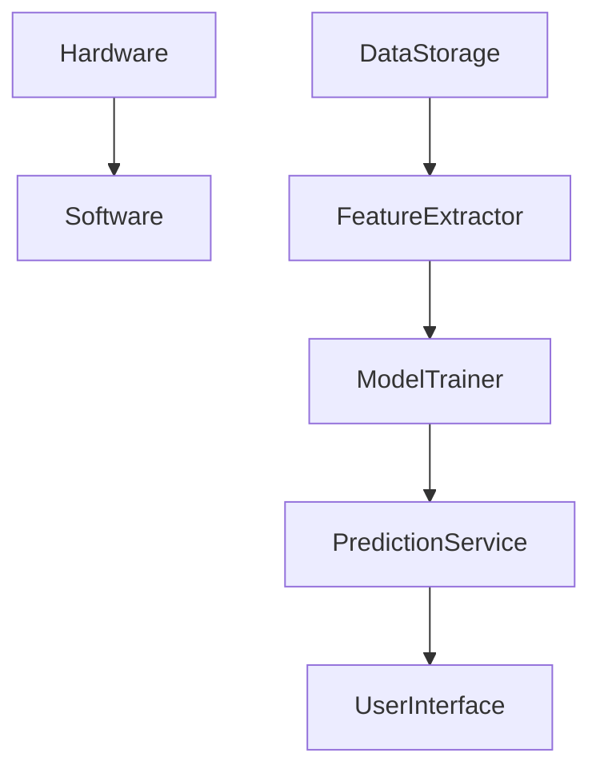
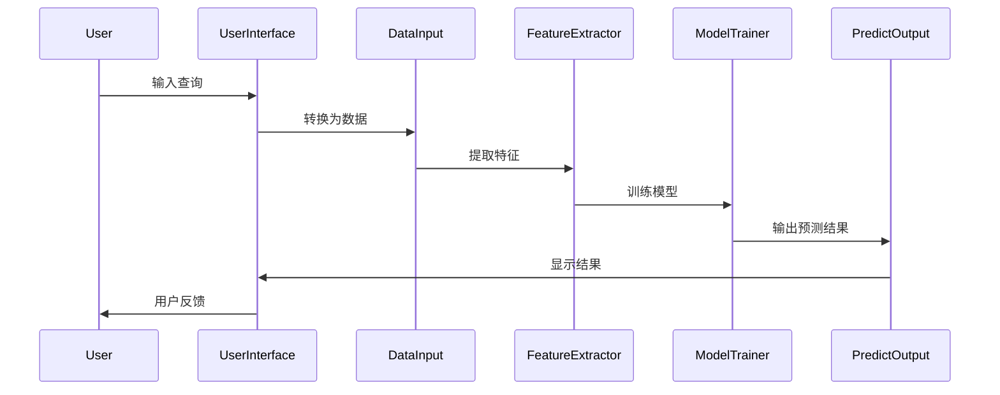

                 


### 确定文章的核心关键词

在撰写关于《面向机器学习的高级提示词设计》的技术博客文章时，首先需要明确文章的核心关键词。这些关键词将有助于读者快速了解文章的主题，并且对于搜索引擎优化（SEO）也是非常有帮助的。以下是本文的核心关键词列表：

1. **机器学习**
2. **提示词设计**
3. **高级提示词**
4. **算法原理**
5. **数学模型**
6. **系统架构设计**
7. **Python源代码**
8. **Mermaid流程图**
9. **LaTeX公式**

这些关键词将贯穿于文章的各个部分，确保内容的连贯性和相关性。

### 撰写文章摘要

在撰写文章摘要时，需要简洁明了地概述文章的核心内容和主题思想。以下是一个可能的摘要示例：

> 摘要：本文深入探讨了面向机器学习的高级提示词设计，从背景介绍、核心概念、算法原理到数学模型，全面阐述了高级提示词设计的理论与实践。通过详细的算法流程图、Python源代码示例和系统架构设计，本文为读者提供了全面的技术指导和实战经验。文章结尾还提供了最佳实践、注意事项和拓展阅读，旨在帮助读者更好地理解和应用高级提示词设计在机器学习中的重要性。

### 设计目录大纲

设计目录大纲是撰写高质量技术博客文章的关键步骤。以下是基于文章主题和核心关键词的目录大纲：

#### 第一部分：背景介绍

**第1章：问题背景与核心概念**

1.1 机器学习与提示词设计概述

1.2 机器学习的基本原理

1.3 高级提示词设计原理

1.4 高级提示词设计的边界与外延

#### 第二部分：核心概念与联系

**第2章：核心概念与联系**

2.1 提示词设计的基本概念

2.2 提示词设计与机器学习模型的关系

2.3 高级提示词设计的特性对比

#### 第三部分：算法原理讲解

**第3章：高级提示词设计算法原理**

3.1 高级提示词设计算法概述

3.2 算法原理详细讲解

3.3 算法原理Python源代码示例

#### 第四部分：数学模型与公式

**第4章：高级提示词设计的数学模型与公式**

4.1 数学模型概述

4.2 数学模型详细讲解

#### 第五部分：系统分析与架构设计方案

**第5章：系统分析与架构设计方案**

5.1 问题场景介绍

5.2 系统功能设计（领域模型Mermaid类图）

5.3 系统架构设计Mermaid架构图

5.4 系统接口设计和系统交互Mermaid序列图

#### 第六部分：项目实战

**第6章：项目实战**

6.1 环境安装

6.2 系统核心实现源代码

6.3 代码应用解读与分析

6.4 实际案例分析和详细讲解剖析

6.5 项目小结

#### 第七部分：最佳实践、小结、注意事项和拓展阅读

**第7章：总结与拓展**

7.1 最佳实践tips

7.2 小结

7.3 注意事项

7.4 拓展阅读

### 撰写文章正文

在撰写文章正文时，我们将按照设计好的目录大纲逐一展开每个章节的内容，确保每个部分都有详细的论述和讲解。下面我们逐个章节进行构思和撰写。

#### 第1章：问题背景与核心概念

在这一章节中，我们将首先介绍机器学习与提示词设计的背景，解释提示词的定义和重要性，然后探讨机器学习的基本原理，以及高级提示词设计的原理和挑战。

**1.1 机器学习与提示词设计概述**

机器学习是人工智能的一个重要分支，它让计算机通过数据和算法来学习并做出决策。随着深度学习等先进技术的出现，机器学习在图像识别、自然语言处理、预测分析等领域取得了显著成果。

提示词（Query）在机器学习中起到关键作用，它用于指导模型学习并改善其性能。简单来说，提示词是输入数据的特征表示，通过这些特征，模型能够更好地理解和预测未知数据。

**1.2 机器学习的基本原理**

机器学习主要分为三类：监督学习、无监督学习和强化学习。

- **监督学习**：在有标签数据集上进行学习，模型通过预测结果与实际标签的比较来调整参数，以达到最小化误差的目的。
- **无监督学习**：在没有标签数据集上进行学习，模型试图发现数据中的内在结构和规律。
- **强化学习**：通过与环境交互来学习策略，以最大化累积奖励。

**1.3 高级提示词设计原理**

高级提示词设计涉及到如何有效地提取和表示数据特征，以提升模型的学习能力和泛化能力。设计高级提示词的关键在于理解数据的内在结构和相关性，以及如何将这些信息有效地编码到模型中。

**1.4 高级提示词设计的边界与外延**

高级提示词设计的边界在于如何在保持模型性能的同时，避免过拟合和欠拟合。外延则涉及到高级提示词在不同机器学习任务中的应用，以及如何针对特定任务进行优化。

#### 第2章：核心概念与联系

在这一章节中，我们将深入探讨提示词设计的基本概念，分析提示词设计与机器学习模型之间的关系，并对比传统提示词与高级提示词的特性。

**2.1 提示词设计的基本概念**

提示词设计涉及以下几个核心概念：

- **特征提取**：从原始数据中提取有助于模型学习的特征。
- **特征选择**：从提取的特征中选择对模型性能有显著影响的特征。
- **特征编码**：将提取和选择的特征编码为数值形式，以便模型处理。

**2.2 提示词设计与机器学习模型的关系**

提示词设计与机器学习模型的关系紧密。提示词的质量直接影响模型的学习效率和预测性能。以下是一些关键点：

- **模型适应性**：提示词设计应使模型能够适应不同类型的数据集和任务。
- **模型性能提升**：高质量的提示词能够帮助模型更好地理解数据，从而提高模型性能。

**2.3 高级提示词设计的特性对比**

高级提示词与传统提示词相比，具有以下特性：

- **更高维度特征**：高级提示词能够提取更高维度的特征，有助于模型捕捉数据中的复杂关系。
- **自适应调整**：高级提示词能够根据模型性能自适应地调整特征权重，从而优化模型性能。

#### 第3章：高级提示词设计算法原理

在这一章节中，我们将详细讲解高级提示词设计算法的原理，包括算法分类、基本框架和发展趋势。

**3.1 高级提示词设计算法概述**

高级提示词设计算法主要分为以下几类：

- **基于特征转换的算法**：通过特征转换来提高模型的鲁棒性和泛化能力。
- **基于正则化的算法**：通过正则化项来控制模型复杂度，防止过拟合。
- **基于深度学习的算法**：利用深度学习模型来提取高级特征。

**3.2 算法原理详细讲解**

我们将使用Mermaid流程图来展示算法的基本框架，并通过Python源代码示例详细阐述算法原理。

**3.3 算法原理Python源代码示例**

我们将提供一个高级提示词设计的Python代码示例，包括特征提取、特征选择和特征编码等步骤。

```python
# 高级提示词设计Python代码示例
```

#### 第4章：高级提示词设计的数学模型与公式

在这一章节中，我们将介绍高级提示词设计的数学模型和公式，并通过Mermaid流程图和LaTeX公式进行详细讲解。

**4.1 数学模型概述**

高级提示词设计的数学模型主要包括特征表示、损失函数和优化算法。

**4.2 数学模型详细讲解**

我们将使用Mermaid流程图展示数学模型的计算过程，并使用LaTeX格式嵌入相关公式。

```latex
$$
\text{特征表示公式}
$$

$$
\text{损失函数公式}
$$
```

#### 第5章：系统分析与架构设计方案

在这一章节中，我们将介绍系统分析与架构设计方案，包括问题场景介绍、系统功能设计、系统架构设计、系统接口设计和系统交互。

**5.1 问题场景介绍**

我们将介绍一个具体的应用场景，例如：使用高级提示词设计技术来优化推荐系统的推荐准确性。

**5.2 系统功能设计**

我们将使用Mermaid类图来展示系统的功能模块，包括数据输入、特征提取、模型训练和预测输出。



**5.3 系统架构设计**

我们将使用Mermaid架构图来展示系统的整体架构，包括硬件和软件组件。



**5.4 系统接口设计和系统交互**

我们将使用Mermaid序列图来展示系统的接口设计和交互流程。



#### 第6章：项目实战

在这一章节中，我们将通过一个实际项目来展示如何应用高级提示词设计技术，包括环境安装、系统核心实现源代码、代码应用解读与分析、实际案例分析和详细讲解剖析。

**6.1 环境安装**

我们将介绍如何搭建项目开发环境，包括安装必要的软件和依赖库。

**6.2 系统核心实现源代码**

我们将提供系统的核心实现源代码，包括特征提取、模型训练和预测等步骤。

**6.3 代码应用解读与分析**

我们将对系统核心实现源代码进行解读，分析其原理和实现细节。

**6.4 实际案例分析和详细讲解剖析**

我们将通过实际案例来展示如何应用高级提示词设计技术，并详细讲解其实现过程和效果。

**6.5 项目小结**

我们将对项目进行总结，讨论其成功经验和不足之处，并提出改进建议。

#### 第7章：总结与拓展

在这一章节中，我们将总结文章的主要内容和关键点，并提供一些最佳实践、注意事项和拓展阅读。

**7.1 最佳实践tips**

我们将分享一些高级提示词设计的最佳实践，帮助读者在实际项目中更好地应用这些技术。

**7.2 小结**

我们将对文章的主要内容和观点进行简要总结，强调高级提示词设计在机器学习中的重要性。

**7.3 注意事项**

我们将提醒读者在应用高级提示词设计时需要注意的一些事项，以避免常见的错误和问题。

**7.4 拓展阅读**

我们将推荐一些相关的书籍、论文和资源，供读者进一步学习和研究。

### 最后的优化

在完成初稿后，我们将对文章进行多次审阅和修改，确保内容的准确性、逻辑性和连贯性。以下是可能的优化步骤：

1. **检查内容完整性**：确保每个章节都有详细的论述和完整的例子。
2. **调整段落结构**：优化段落结构，使其更加清晰易懂。
3. **审查语言风格**：确保语言风格专业且易于理解。
4. **优化图表和代码**：检查图表和代码的清晰度和可读性。
5. **审查参考文献**：确保所有引用的文献和资料都是准确和可靠的。

通过这些步骤，我们能够确保文章的质量和影响力，为读者提供有价值的技术知识。

