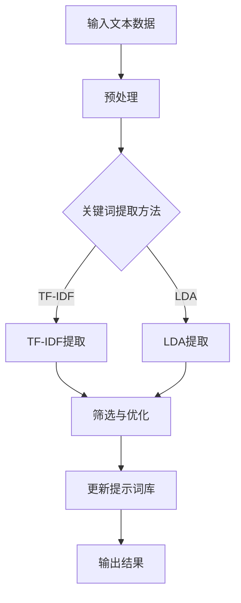
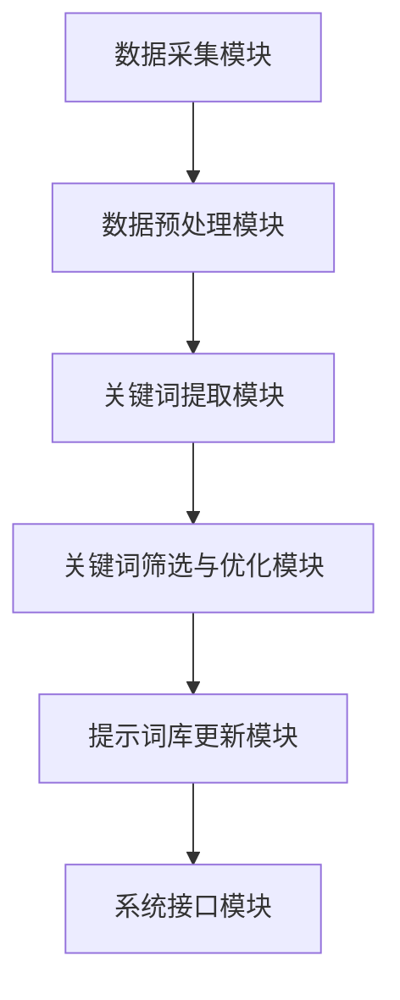
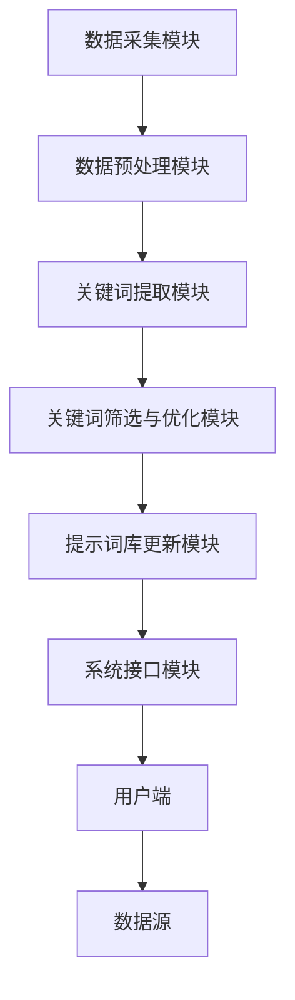

                 

## 第1章：面向特定领域的提示词库自动扩展概述

### 1.1 提示词库的重要性

在人工智能和自然语言处理领域，提示词库（Keyword Corpus）扮演着至关重要的角色。提示词库是一种包含大量关键词、短语和概念的语料库，用于训练和优化自然语言处理模型，如搜索引擎、机器翻译和问答系统。通过这些关键词，系统能够更好地理解和处理用户输入的信息，提高其响应的准确性和效率。

然而，传统的提示词库往往受限于数据来源和手动编写的限制，难以覆盖特定领域内的专业术语和新兴词汇。随着特定领域的发展，例如医疗健康、金融科技和法律等领域，出现的新术语和概念越来越多，这使得手动维护提示词库变得日益困难。自动扩展提示词库的概念应运而生，旨在通过算法和技术手段，动态地更新和扩展提示词库，确保其能够及时反映特定领域的最新发展。

### 1.2 自动扩展的需求与挑战

自动扩展提示词库的需求主要源于以下几个方面：

1. **领域专业化：**特定领域的术语和概念不断更新，自动扩展能够确保提示词库包含最新的专业词汇。
2. **数据多样性：**自动扩展可以通过不同的数据源（如学术论文、新闻报道、用户评论等）获取信息，增加提示词库的多样性。
3. **效率提升：**手动扩展提示词库耗时且低效，自动扩展能够提高工作效率，减少人力成本。

然而，自动扩展提示词库也面临一些挑战：

1. **准确性：**自动扩展算法需要准确地识别和提取特定的关键词和短语，避免引入无关或错误的词汇。
2. **覆盖性：**特定领域内有许多细微差别和特殊术语，自动扩展算法需要具备良好的覆盖性，以捕捉这些术语。
3. **计算复杂性：**自动扩展算法往往涉及大量的数据处理和计算，特别是在大型语料库中，计算复杂性成为一个重要考虑因素。

### 1.3 本书内容结构

本书旨在系统地介绍面向特定领域的提示词库自动扩展，具体内容包括：

1. **第1章：引言**：介绍自动扩展提示词库的背景和重要性。
2. **第2章：提示词库的概念与构成**：详细解释提示词库的定义、特点及其在特定领域中的应用。
3. **第3章：自动扩展原理与方法**：探讨自动扩展的基本原理和常见方法，如基于统计、机器学习和深度学习的方法。
4. **第4章：特定领域自动扩展案例分析**：以医疗健康和金融科技为例，分析自动扩展在特定领域的应用。
5. **第5章：自动扩展算法原理介绍**：深入讲解提示词生成算法和筛选算法，并使用Mermaid绘制算法流程图。
6. **第6章：算法详细讲解与示例**：通过具体案例，详细阐述自动扩展算法的实现过程和应用。
7. **第7章：系统分析与架构设计**：介绍系统设计的基本原理和架构，包括功能设计、架构图、接口设计和系统交互。
8. **第8章：项目实战**：展示如何在实际项目中实施自动扩展提示词库，包括环境安装、代码实现和案例分析。
9. **第9章：最佳实践与总结**：总结自动扩展提示词库的最佳实践，并提出注意事项和拓展阅读。

通过本书的阅读，读者将能够深入了解自动扩展提示词库的原理、方法和实际应用，为特定领域的人工智能和自然语言处理项目提供有力支持。

### 1.4 自动扩展提示词库的应用场景

自动扩展提示词库在多个领域展现出了广泛的应用潜力，以下是一些具体的应用场景：

1. **医疗健康领域**：随着医疗技术的发展和医疗信息的爆炸式增长，自动扩展提示词库能够帮助医疗信息系统及时更新和补充专业术语，提高病历记录、医学文献检索和智能问诊的准确性和效率。

2. **金融科技领域**：金融科技（FinTech）领域术语复杂且变化迅速，自动扩展提示词库有助于金融数据处理系统捕捉最新的金融术语和概念，提升金融风险分析、智能投顾和客户服务的能力。

3. **法律领域**：法律文本和合同条款中的术语和法规变化频繁，自动扩展提示词库可以辅助法律检索系统实时更新法律术语，确保法律咨询和文档审查的准确性。

4. **教育领域**：在教育领域，自动扩展提示词库可以帮助学习平台和智能辅导系统根据学生的学习进展动态调整学习内容，提供更加个性化和高效的学习体验。

5. **智能客服领域**：在智能客服系统中，自动扩展提示词库能够帮助系统理解用户的需求，提高对话的准确性和流畅性，提升用户体验。

6. **机器翻译领域**：在机器翻译系统中，自动扩展提示词库可以帮助翻译模型识别特定领域的专业术语，提高翻译的准确性和一致性。

通过自动扩展提示词库，这些领域的人工智能系统能够更好地适应和满足不断变化的需求，提高系统的智能化水平和用户体验。

### 1.5 自动扩展提示词库的优势

自动扩展提示词库相较于传统手动维护的方法，具备显著的优势，具体体现在以下几个方面：

1. **时效性**：自动扩展能够实时更新提示词库，确保库中包含最新的术语和概念，提高系统的时效性和适应性。
2. **全面性**：自动扩展可以通过多种数据源（如互联网、学术期刊、专业论坛等）获取信息，确保提示词库的全面性和多样性。
3. **高效性**：自动扩展减少了手动编写的繁琐工作，提高了工作效率，降低了人力成本。
4. **准确性**：通过算法和技术手段，自动扩展能够在大量数据中准确提取和筛选关键词，确保提示词库的质量。
5. **智能化**：自动扩展提示词库结合了机器学习和自然语言处理技术，能够逐步学习和优化，提高系统的智能化水平。
6. **可扩展性**：自动扩展方法易于扩展到不同领域和场景，具有较强的通用性和适用性。

这些优势使得自动扩展提示词库成为人工智能和自然语言处理领域的重要研究方向和应用手段。

### 1.6 自动扩展提示词库的挑战与解决方案

尽管自动扩展提示词库具有许多优势，但在实际应用过程中仍然面临一些挑战，以下是一些主要的挑战及相应的解决方案：

1. **数据质量**：自动扩展依赖于大量高质量的数据源，但互联网上的数据质量参差不齐，可能包含噪声和错误。解决方案包括：使用数据清洗和预处理技术，过滤掉无关和低质量的数据，确保数据质量。

2. **算法准确性**：自动扩展算法需要准确提取关键词和短语，但不同领域的术语和概念可能具有相似性，导致算法误判。解决方案包括：采用多模型融合技术，结合多种算法和特征，提高算法的准确性和鲁棒性。

3. **计算复杂性**：自动扩展涉及大量的数据处理和计算，尤其是在处理大规模语料库时，计算复杂性成为一个重要问题。解决方案包括：优化算法和数据结构，采用并行计算和分布式计算技术，提高计算效率。

4. **领域适应性**：不同领域具有独特的术语和表达方式，自动扩展算法需要具备良好的领域适应性。解决方案包括：针对特定领域进行定制化开发，结合领域知识库和专家意见，提高算法的适用性。

5. **实时性**：实时更新提示词库是一个挑战，特别是在高频率数据更新和快速变化的环境中。解决方案包括：采用实时数据流处理技术，如Apache Kafka和Apache Flink，确保系统能够及时响应数据变化。

通过上述解决方案，自动扩展提示词库在实际应用中能够更好地克服挑战，提高系统的性能和可靠性。

## 第2章：提示词库的概念与构成

### 2.1 提示词库的定义与特点

提示词库是一种专门用于自然语言处理和人工智能应用的语料库，它包含大量的关键词、短语和概念，用于训练和优化自然语言处理模型。一个良好的提示词库能够显著提高系统的语义理解能力和响应准确性。

提示词库的特点包括：

1. **专业性**：提示词库专门针对特定领域或任务进行构建，包含丰富的专业术语和概念，确保系统能够准确理解和处理领域内的问题。
2. **多样性**：提示词库中包含多种类型的关键词和短语，如名词、动词、形容词等，能够满足不同语义需求。
3. **动态性**：提示词库不是静态的，而是能够根据领域的发展和新术语的出现进行实时更新，确保其内容始终反映最新的信息。
4. **可扩展性**：提示词库设计时要考虑到未来的扩展需求，方便添加新的关键词和短语，以适应不断变化的领域需求。

### 2.2 提示词库的作用

提示词库在自然语言处理和人工智能系统中扮演着至关重要的角色，其作用主要体现在以下几个方面：

1. **语义理解**：提示词库提供了丰富的词汇资源，有助于模型更好地理解文本内容，提高语义分析的准确性。
2. **关键词提取**：在文本挖掘和信息检索中，提示词库能够帮助提取关键信息，提高文本处理的效率和效果。
3. **任务优化**：通过在提示词库中筛选和优化关键词，可以提高特定任务（如机器翻译、问答系统等）的准确性和性能。
4. **语义关联**：提示词库中的词汇和概念有助于建立语义关联网络，支持模型进行复杂的语义推理和知识表示。

### 2.3 提示词库的分类

提示词库可以根据不同的标准进行分类，以下是一些常见的分类方法：

1. **按领域分类**：根据应用领域进行分类，如医疗健康提示词库、金融科技提示词库、法律提示词库等。
2. **按用途分类**：根据具体用途进行分类，如通用提示词库（适用于多种任务）、特定任务提示词库（如机器翻译、文本分类等）。
3. **按来源分类**：根据数据来源进行分类，如手动编制的提示词库、自动提取的提示词库、结合多源数据的混合提示词库。
4. **按类型分类**：根据关键词的类型进行分类，如名词提示词库、动词提示词库、形容词提示词库等。

每种分类方法都有其特定的应用场景和优势，实际应用中常根据具体需求选择合适的提示词库。

### 2.4 特定领域提示词库的特点

特定领域的提示词库具有以下特点：

1. **专业性**：特定领域提示词库包含大量专业术语和独特表达，有助于模型更好地理解和处理领域内的专业信息。
2. **更新频率**：特定领域提示词库需要定期更新，以捕捉最新的领域发展和新术语的出现。
3. **数据来源**：特定领域提示词库的数据来源多样化，包括专业文献、学术论文、新闻报道、用户生成内容等。
4. **复杂度**：特定领域提示词库往往涉及复杂的语义关系和概念，需要深度学习和复杂的算法来处理。

这些特点使得特定领域提示词库在特定任务中能够提供更高的准确性和效率，但在构建和维护过程中也面临更大的挑战。

### 2.5 提示词库的构建方法

提示词库的构建方法主要包括以下几种：

1. **手动编制**：通过领域专家或专业团队手动搜集、整理和编制关键词和短语，这种方法确保了提示词库的专业性和准确性，但费时且成本高。
2. **自动提取**：利用自然语言处理技术，从大规模语料库中自动提取关键词和短语，如使用TF-IDF、文本挖掘和实体识别等技术。这种方法高效且成本低，但需要处理噪声和错误数据。
3. **混合方法**：结合手动编制和自动提取的方法，先通过自动提取初步构建提示词库，然后由领域专家进行审核和优化，这种方法兼顾了专业性和效率。

选择合适的构建方法需要考虑实际需求和资源情况，以实现最佳的效果。

### 2.6 提示词库的应用案例分析

以下是一些提示词库在实际应用中的案例：

1. **医疗健康领域**：在医疗健康领域，自动扩展提示词库用于辅助智能病历系统，帮助医生快速识别和理解病历中的专业术语，提高诊断准确性和效率。
2. **金融科技领域**：在金融科技领域，自动扩展提示词库用于智能投顾系统，帮助用户理解复杂的金融术语和投资策略，提供个性化的投资建议。
3. **教育领域**：在教育领域，自动扩展提示词库用于智能辅导系统，帮助学生理解和掌握专业课程中的术语和概念，提高学习效果。

这些案例展示了自动扩展提示词库在提高特定领域系统性能和用户体验方面的实际应用价值。

### 2.7 提示词库的维护与管理

提示词库的维护与管理是确保其质量和时效性的关键环节，主要包括以下方面：

1. **数据更新**：定期从各种数据源中获取新的术语和概念，及时更新提示词库。
2. **质量评估**：对现有词汇进行评估和审核，删除无关或错误的词汇，确保提示词库的专业性和准确性。
3. **用户反馈**：收集用户反馈，根据实际应用情况调整和优化提示词库。
4. **版本管理**：记录提示词库的版本历史，方便追踪和管理。

有效的维护与管理策略能够确保提示词库始终处于最佳状态，为系统提供持续的支持。

### 2.8 提示词库的标准化与互操作性

提示词库的标准化和互操作性是提高其通用性和兼容性的关键。以下是一些关键点：

1. **标准化术语**：制定统一的术语标准，确保不同来源的术语具有一致性。
2. **数据格式**：采用统一的数据格式（如JSON、XML等）存储和管理提示词库，方便数据的交换和集成。
3. **API接口**：提供统一的API接口，方便不同系统和应用之间的数据交换和互操作。

通过标准化和互操作性，提示词库能够更好地支持跨领域和多平台的应用。

### 2.9 提示词库的未来发展趋势

随着人工智能和自然语言处理技术的不断进步，提示词库的发展趋势包括：

1. **智能化**：利用深度学习和自然语言处理技术，实现更智能的提示词生成和筛选。
2. **动态化**：通过实时数据流处理技术，实现动态更新和扩展提示词库。
3. **个性化**：根据用户需求和场景，提供个性化的提示词库，提高用户体验。
4. **多样化**：支持多种数据源和格式，构建更加全面和多样化的提示词库。

这些发展趋势将为提示词库的应用带来更多可能性和创新空间。

## 第3章：自动扩展原理与方法

### 3.1 自动扩展的基本原理

自动扩展提示词库的基本原理在于利用算法和技术手段，从原始文本数据中动态地提取和筛选出有价值的关键词和短语，从而实现提示词库的自动更新和扩展。这一过程主要包括以下几个步骤：

1. **数据输入**：首先，自动扩展系统需要从各种数据源（如互联网、数据库、专业论坛等）中获取原始文本数据。这些数据可以是文本文件、网页、社交媒体帖子或学术论文等。

2. **预处理**：获取到的原始文本数据通常需要经过预处理，包括去除无关信息、停用词过滤、分词、词性标注等操作，以提取出有意义的词汇。

3. **关键词提取**：利用自然语言处理技术，如TF-IDF（词频-逆文档频率）、词嵌入、实体识别等，从预处理后的文本中提取出关键词和短语。这些关键词和短语通常与特定领域或任务高度相关。

4. **筛选与优化**：对提取出的关键词进行筛选和优化，去除无关或低质量的关键词，确保提示词库中的词汇具有较高的专业性和准确性。

5. **更新与扩展**：将经过筛选和优化的关键词和短语加入到提示词库中，实现提示词库的自动更新和扩展。

### 3.2 自动扩展的方法

自动扩展提示词库的方法多种多样，主要包括基于统计方法、机器学习方法和深度学习方法等。以下将分别介绍这些方法的基本原理和适用场景。

#### 3.2.1 基于统计方法

基于统计方法是最早用于自动扩展提示词库的技术之一，其主要思想是通过计算文本中词语的频率和相关性来识别有价值的关键词。以下是一些常见的基于统计的方法：

1. **TF-IDF（词频-逆文档频率）**：
   - **原理**：TF-IDF通过计算词语在单个文档中的频率（TF）和其在整个语料库中的逆文档频率（IDF）来评估词语的重要性。
   - **公式**：$$TF-IDF(t,d) = TF(t,d) \times IDF(t)$$，其中$TF(t,d)$为词语$t$在文档$d$中的频率，$IDF(t)$为词语$t$在整个语料库中的逆文档频率。
   - **适用场景**：适用于大规模文本数据，能够快速提取重要关键词，但可能忽略词语之间的语义关系。

2. **文本挖掘**：
   - **原理**：文本挖掘是一种利用统计学方法和机器学习方法，从非结构化文本数据中提取有价值信息的技术。
   - **方法**：包括主题模型（如LDA）、共词分析、情感分析等。
   - **适用场景**：适用于从大量文本数据中提取主题、趋势和情感等信息，有助于丰富提示词库的多样性。

基于统计方法简单、高效，但在处理复杂语义关系和新型术语时可能存在局限。

#### 3.2.2 基于机器学习方法

基于机器学习方法通过训练模型来识别和提取关键词，这种方法具有较强的泛化和自适应能力。以下是一些常见的基于机器学习方法：

1. **朴素贝叶斯分类器**：
   - **原理**：朴素贝叶斯分类器是一种基于贝叶斯定理和特征条件独立假设的简单分类器。
   - **公式**：$$P(\text{class} | \text{feature}) = \frac{P(\text{feature} | \text{class}) \times P(\text{class})}{P(\text{feature})}$$
   - **适用场景**：适用于文本分类任务，如垃圾邮件过滤、文本分类等。

2. **支持向量机（SVM）**：
   - **原理**：支持向量机是一种基于结构二分类模型的机器学习算法，通过找到一个最佳超平面来分类数据。
   - **公式**：$$f(x) = \omega \cdot x + b$$，其中$\omega$为权重向量，$b$为偏置。
   - **适用场景**：适用于文本分类、垃圾邮件过滤等任务，能够处理高维数据。

基于机器学习方法适用于复杂文本数据，但需要大量标注数据进行训练。

#### 3.2.3 基于深度学习方法

基于深度学习方法通过神经网络模型，如卷积神经网络（CNN）、循环神经网络（RNN）和Transformer等，来识别和提取关键词。以下是一些常见的基于深度学习方法：

1. **卷积神经网络（CNN）**：
   - **原理**：卷积神经网络通过卷积操作提取文本中的局部特征，并通过池化操作降低维度。
   - **公式**：$$h_i = \sum_j w_{ij} * x_j + b$$，其中$h_i$为输出特征，$w_{ij}$为卷积核，$x_j$为输入特征，$b$为偏置。
   - **适用场景**：适用于文本分类、情感分析等任务，能够处理复杂的语义关系。

2. **循环神经网络（RNN）**：
   - **原理**：循环神经网络通过将当前输入与之前的隐藏状态进行结合，实现对序列数据的处理。
   - **公式**：$$h_t = \text{tanh}(W_h \cdot [h_{t-1}, x_t] + b_h)$$，其中$h_t$为隐藏状态，$W_h$为权重矩阵，$b_h$为偏置。
   - **适用场景**：适用于序列建模任务，如机器翻译、语音识别等。

3. **Transformer模型**：
   - **原理**：Transformer模型通过自注意力机制（self-attention）来处理序列数据，能够同时关注序列中的所有元素。
   - **公式**：$$\text{Attention}(Q, K, V) = \text{softmax}\left(\frac{QK^T}{\sqrt{d_k}}\right)V$$，其中$Q$、$K$、$V$分别为查询向量、键向量和值向量。
   - **适用场景**：适用于大规模文本处理任务，如机器翻译、文本生成等。

基于深度学习方法在处理复杂语义关系和新型术语方面表现优异，但需要大量的计算资源和数据。

### 3.3 选择合适的方法

选择合适的自动扩展方法需要考虑以下几个因素：

1. **数据规模**：对于大规模文本数据，基于深度学习方法可能更适用；对于中小规模数据，基于统计方法和机器学习方法可能足够。
2. **计算资源**：基于深度学习方法通常需要大量计算资源，如果资源有限，可以考虑使用基于统计或机器学习方法。
3. **任务需求**：根据具体任务需求，选择适合的算法，如需要处理复杂语义关系的任务，可以选择Transformer模型。
4. **模型可解释性**：基于统计方法和机器学习方法通常具有较高的可解释性，而基于深度学习方法可能难以解释其决策过程。

通过综合考虑这些因素，选择合适的自动扩展方法，可以实现高效、准确的提示词库自动扩展。

## 第4章：特定领域自动扩展案例分析

### 4.1 医疗健康领域

#### 4.1.1 医疗健康提示词库的需求

在医疗健康领域，随着医学知识的不断更新和扩展，专业术语和概念日益增多，传统的手动维护提示词库已经无法满足实际需求。自动扩展提示词库在此背景下应运而生，其主要需求包括：

1. **实时更新**：医疗健康领域的术语和概念更新迅速，自动扩展提示词库需要能够实时捕捉和更新这些术语。
2. **专业化**：医疗健康领域的术语和概念具有高度的专业性，自动扩展提示词库需要包含丰富的专业词汇和表达方式。
3. **多样性**：医疗健康领域涉及多个子领域，如临床医学、基础医学、公共卫生等，自动扩展提示词库需要覆盖这些不同子领域的术语。

#### 4.1.2 医疗健康自动扩展方法

为了满足医疗健康领域的需求，可以采用多种自动扩展方法，包括基于统计方法、机器学习方法和深度学习方法等。以下是一些常用的方法：

1. **基于统计方法**：
   - **TF-IDF**：利用TF-IDF算法提取文本中的关键词，能够快速识别出高频率且具有代表性的词汇。
   - **共现分析**：通过分析词语之间的共现关系，识别出具有较强关联性的词汇组合，扩展提示词库。

2. **基于机器学习方法**：
   - **朴素贝叶斯分类器**：用于分类任务，可以帮助识别出特定类型文档中的关键词。
   - **支持向量机（SVM）**：适用于文本分类任务，能够将文本数据映射到高维空间，提高分类效果。

3. **基于深度学习方法**：
   - **卷积神经网络（CNN）**：通过卷积操作提取文本中的局部特征，适用于文本分类和特征提取任务。
   - **循环神经网络（RNN）**：适用于序列建模任务，如文本生成和序列分类。
   - **Transformer模型**：通过自注意力机制处理文本数据，能够捕捉长距离的依赖关系，适用于大规模文本处理任务。

#### 4.1.3 医疗健康自动扩展案例

以下是一个具体的医疗健康自动扩展案例，展示了如何使用基于深度学习的方法来扩展医疗健康提示词库：

1. **数据准备**：
   - **数据来源**：从医疗健康领域的学术论文、医学期刊、患者病历记录等中收集大量文本数据。
   - **预处理**：对收集到的文本数据进行预处理，包括分词、去停用词、词性标注等步骤。

2. **模型训练**：
   - **模型选择**：选择Transformer模型，如BERT（Bidirectional Encoder Representations from Transformers）。
   - **训练数据**：使用预处理后的文本数据训练BERT模型，通过微调预训练模型来适应特定领域的需求。

3. **关键词提取**：
   - **提取策略**：使用BERT模型生成的词嵌入向量，结合词频和词性信息，提取出具有重要意义的词汇。
   - **筛选与优化**：对提取出的词汇进行筛选和优化，去除无关或低质量的词汇，确保提示词库的专业性和准确性。

4. **提示词库更新**：
   - **动态更新**：定期从新数据源中获取文本数据，使用BERT模型进行关键词提取，并将新的关键词加入提示词库，实现动态更新。

通过上述步骤，医疗健康自动扩展提示词库能够有效捕捉和扩展专业术语，提高医疗健康领域人工智能系统的准确性和效率。

### 4.2 金融科技领域

#### 4.2.1 金融科技提示词库的特点

在金融科技（FinTech）领域，自动扩展提示词库具有以下特点：

1. **术语复杂**：金融科技涉及多种金融产品和金融服务，术语和概念复杂多样，包括金融衍生品、区块链技术、智能合约等。
2. **动态变化**：金融科技领域发展迅速，新术语和概念不断出现，自动扩展提示词库需要具备快速更新和扩展的能力。
3. **专业性**：金融科技术语具有高度专业性，自动扩展提示词库需要确保词汇的专业性和准确性。

#### 4.2.2 金融科技自动扩展方法

为了满足金融科技领域的需求，可以采用以下自动扩展方法：

1. **基于统计方法**：
   - **TF-IDF**：用于提取高频率且具有代表性的词汇，适用于处理大规模金融文本数据。
   - **共现分析**：分析词语之间的共现关系，识别出金融领域的专业术语。

2. **基于机器学习方法**：
   - **朴素贝叶斯分类器**：适用于分类任务，如识别金融文本中的特定类别。
   - **支持向量机（SVM）**：用于文本分类任务，能够处理高维数据。

3. **基于深度学习方法**：
   - **卷积神经网络（CNN）**：用于提取文本中的局部特征，适用于文本分类和特征提取。
   - **循环神经网络（RNN）**：适用于序列建模任务，如文本生成和序列分类。
   - **Transformer模型**：通过自注意力机制处理文本数据，适用于大规模文本处理任务。

#### 4.2.3 金融科技自动扩展案例

以下是一个具体的金融科技自动扩展案例，展示了如何使用基于深度学习的方法来扩展金融科技提示词库：

1. **数据准备**：
   - **数据来源**：从金融科技领域的学术论文、专业报告、新闻文章等中收集大量文本数据。
   - **预处理**：对收集到的文本数据进行预处理，包括分词、去停用词、词性标注等步骤。

2. **模型训练**：
   - **模型选择**：选择Transformer模型，如BERT。
   - **训练数据**：使用预处理后的文本数据训练BERT模型，通过微调预训练模型来适应特定领域的需求。

3. **关键词提取**：
   - **提取策略**：使用BERT模型生成的词嵌入向量，结合词频和词性信息，提取出具有重要意义的词汇。
   - **筛选与优化**：对提取出的词汇进行筛选和优化，去除无关或低质量的词汇，确保提示词库的专业性和准确性。

4. **提示词库更新**：
   - **动态更新**：定期从新数据源中获取文本数据，使用BERT模型进行关键词提取，并将新的关键词加入提示词库，实现动态更新。

通过上述步骤，金融科技自动扩展提示词库能够有效捕捉和扩展专业术语，提高金融科技领域人工智能系统的准确性和效率。

### 4.3 法律领域

#### 4.3.1 法律提示词库的特点

在法律领域，自动扩展提示词库具有以下特点：

1. **术语专业性**：法律领域术语具有高度专业性，包括法律条文、法律术语、专业名词等。
2. **法律条文更新**：法律条文和法规不断更新和修订，自动扩展提示词库需要及时捕捉这些变化。
3. **司法判例丰富**：司法判例和法律文献提供了丰富的法律术语和表达方式，自动扩展提示词库需要涵盖这些内容。

#### 4.3.2 法律自动扩展方法

为了满足法律领域的需求，可以采用以下自动扩展方法：

1. **基于统计方法**：
   - **TF-IDF**：用于提取高频率且具有代表性的法律术语。
   - **共现分析**：分析法律条款和判例中的词汇共现关系，识别出法律领域的专业术语。

2. **基于机器学习方法**：
   - **朴素贝叶斯分类器**：用于法律文档分类，识别特定类型法律术语。
   - **支持向量机（SVM）**：用于文本分类任务，能够处理高维法律数据。

3. **基于深度学习方法**：
   - **卷积神经网络（CNN）**：用于提取法律文本中的局部特征，适用于法律文本分类和特征提取。
   - **循环神经网络（RNN）**：适用于序列建模任务，如法律文档生成和序列分类。
   - **Transformer模型**：通过自注意力机制处理法律文本数据，适用于大规模法律文本处理任务。

#### 4.3.3 法律自动扩展案例

以下是一个具体的法律自动扩展案例，展示了如何使用基于深度学习的方法来扩展法律提示词库：

1. **数据准备**：
   - **数据来源**：从法律领域的案例文书、法律条文、法学期刊等中收集大量文本数据。
   - **预处理**：对收集到的文本数据进行预处理，包括分词、去停用词、词性标注等步骤。

2. **模型训练**：
   - **模型选择**：选择Transformer模型，如BERT。
   - **训练数据**：使用预处理后的文本数据训练BERT模型，通过微调预训练模型来适应特定领域的需求。

3. **关键词提取**：
   - **提取策略**：使用BERT模型生成的词嵌入向量，结合词频和词性信息，提取出具有重要意义的词汇。
   - **筛选与优化**：对提取出的词汇进行筛选和优化，去除无关或低质量的词汇，确保提示词库的专业性和准确性。

4. **提示词库更新**：
   - **动态更新**：定期从新数据源中获取文本数据，使用BERT模型进行关键词提取，并将新的关键词加入提示词库，实现动态更新。

通过上述步骤，法律自动扩展提示词库能够有效捕捉和扩展专业术语，提高法律领域人工智能系统的准确性和效率。

### 4.4 教育领域

#### 4.4.1 教育提示词库的特点

在教育领域，自动扩展提示词库具有以下特点：

1. **学科多样性**：教育领域涵盖多个学科，如数学、物理、化学、文学等，自动扩展提示词库需要涵盖各个学科的专业术语。
2. **课程更新**：教育课程内容不断更新，自动扩展提示词库需要及时捕捉这些变化，确保词汇的时效性。
3. **学生多样性**：学生群体具有多样性，自动扩展提示词库需要考虑不同学生的知识背景和需求，提供个性化的词汇支持。

#### 4.4.2 教育自动扩展方法

为了满足教育领域的需求，可以采用以下自动扩展方法：

1. **基于统计方法**：
   - **TF-IDF**：用于提取高频率且具有代表性的学科术语。
   - **共现分析**：分析学科文本中的词汇共现关系，识别出教育领域的专业术语。

2. **基于机器学习方法**：
   - **朴素贝叶斯分类器**：用于教育文档分类，识别特定类型教育术语。
   - **支持向量机（SVM）**：用于文本分类任务，能够处理高维教育数据。

3. **基于深度学习方法**：
   - **卷积神经网络（CNN）**：用于提取教育文本中的局部特征，适用于教育文本分类和特征提取。
   - **循环神经网络（RNN）**：适用于序列建模任务，如教育文档生成和序列分类。
   - **Transformer模型**：通过自注意力机制处理教育文本数据，适用于大规模教育文本处理任务。

#### 4.4.3 教育自动扩展案例

以下是一个具体的教育自动扩展案例，展示了如何使用基于深度学习的方法来扩展教育提示词库：

1. **数据准备**：
   - **数据来源**：从教育领域的教科书、教学文档、学术论文等中收集大量文本数据。
   - **预处理**：对收集到的文本数据进行预处理，包括分词、去停用词、词性标注等步骤。

2. **模型训练**：
   - **模型选择**：选择Transformer模型，如BERT。
   - **训练数据**：使用预处理后的文本数据训练BERT模型，通过微调预训练模型来适应特定领域的需求。

3. **关键词提取**：
   - **提取策略**：使用BERT模型生成的词嵌入向量，结合词频和词性信息，提取出具有重要意义的词汇。
   - **筛选与优化**：对提取出的词汇进行筛选和优化，去除无关或低质量的词汇，确保提示词库的专业性和准确性。

4. **提示词库更新**：
   - **动态更新**：定期从新数据源中获取文本数据，使用BERT模型进行关键词提取，并将新的关键词加入提示词库，实现动态更新。

通过上述步骤，教育自动扩展提示词库能够有效捕捉和扩展专业术语，提高教育领域人工智能系统的准确性和效率。

### 4.5 智能客服领域

#### 4.5.1 智能客服提示词库的特点

在智能客服领域，自动扩展提示词库具有以下特点：

1. **交互多样性**：智能客服需要处理多样化的用户交互，包括文本、语音和图像等，自动扩展提示词库需要支持这些交互类型。
2. **实时性要求**：智能客服系统需要实时响应用户请求，自动扩展提示词库需要能够快速捕捉和更新新词汇。
3. **情境敏感性**：智能客服需要根据不同的对话情境调整语言表达，自动扩展提示词库需要能够适应不同的情境需求。

#### 4.5.2 智能客服自动扩展方法

为了满足智能客服领域的需求，可以采用以下自动扩展方法：

1. **基于统计方法**：
   - **TF-IDF**：用于提取高频率且具有代表性的客服术语。
   - **共现分析**：分析用户对话中的词汇共现关系，识别出常用的客服表达方式。

2. **基于机器学习方法**：
   - **朴素贝叶斯分类器**：用于分类任务，如识别用户请求类型。
   - **支持向量机（SVM）**：用于文本分类任务，能够处理高维客服数据。

3. **基于深度学习方法**：
   - **卷积神经网络（CNN）**：用于提取文本中的局部特征，适用于文本分类和特征提取。
   - **循环神经网络（RNN）**：适用于序列建模任务，如对话生成和序列分类。
   - **Transformer模型**：通过自注意力机制处理文本数据，适用于大规模文本处理任务。

#### 4.5.3 智能客服自动扩展案例

以下是一个具体的智能客服自动扩展案例，展示了如何使用基于深度学习的方法来扩展智能客服提示词库：

1. **数据准备**：
   - **数据来源**：从智能客服系统中的用户对话记录、FAQ文档、培训材料等中收集大量文本数据。
   - **预处理**：对收集到的文本数据进行预处理，包括分词、去停用词、词性标注等步骤。

2. **模型训练**：
   - **模型选择**：选择Transformer模型，如BERT。
   - **训练数据**：使用预处理后的文本数据训练BERT模型，通过微调预训练模型来适应特定领域的需求。

3. **关键词提取**：
   - **提取策略**：使用BERT模型生成的词嵌入向量，结合词频和词性信息，提取出具有重要意义的词汇。
   - **筛选与优化**：对提取出的词汇进行筛选和优化，去除无关或低质量的词汇，确保提示词库的专业性和准确性。

4. **提示词库更新**：
   - **动态更新**：定期从新数据源中获取文本数据，使用BERT模型进行关键词提取，并将新的关键词加入提示词库，实现动态更新。

通过上述步骤，智能客服自动扩展提示词库能够有效捕捉和扩展专业术语，提高智能客服系统的交互质量和用户满意度。

## 第5章：自动扩展算法原理介绍

### 5.1 提示词生成算法

提示词生成算法是自动扩展提示词库的核心组成部分，其目的是从原始文本数据中提取出具有代表性的关键词和短语。以下将介绍几种常见的提示词生成算法及其基本原理。

#### 5.1.1 基于文本挖掘的方法

基于文本挖掘的方法通过分析文本数据中的词语频率、共现关系和词性信息来识别有价值的关键词。以下是一些常用的文本挖掘方法：

1. **TF-IDF算法**：
   - **原理**：TF-IDF通过计算词语在单个文档中的频率（TF）和其在整个语料库中的逆文档频率（IDF）来评估词语的重要性。
   - **公式**：$$TF-IDF(t,d) = TF(t,d) \times IDF(t)$$，其中$TF(t,d)$为词语$t$在文档$d$中的频率，$IDF(t)$为词语$t$在整个语料库中的逆文档频率。
   - **优势**：简单易用，适用于大规模文本数据。
   - **局限**：忽略词语之间的语义关系，可能导致误判。

2. **共现分析**：
   - **原理**：共现分析通过分析词语之间的共现关系，识别出具有相似意义的词汇组合。
   - **方法**：可以使用共现矩阵、图模型等方法来表示词语之间的关系。
   - **优势**：能够捕捉词语的语义关联，提高关键词提取的准确性。
   - **局限**：处理复杂文本数据时，共现关系可能过于复杂，难以解析。

3. **主题模型（如LDA）**：
   - **原理**：主题模型通过在文本中识别潜在主题，将文档和词语映射到共同的潜在主题上。
   - **公式**：$$p(z|d) \propto \sum_w p(d|w) p(w|z)$$，其中$z$为潜在主题，$d$为文档，$w$为词语。
   - **优势**：能够发现文本中的隐含主题，有助于提高关键词提取的多样性。
   - **局限**：对大规模文本数据的处理速度较慢，且主题数量和质量的设定较为主观。

#### 5.1.2 基于机器学习的方法

基于机器学习的方法通过训练模型来学习文本数据中的关键词和短语，具有较好的泛化能力和自适应能力。以下介绍几种常用的机器学习方法：

1. **朴素贝叶斯分类器**：
   - **原理**：朴素贝叶斯分类器基于贝叶斯定理和特征条件独立假设，通过计算词语出现的概率来分类文档。
   - **公式**：$$P(\text{class} | \text{feature}) = \frac{P(\text{feature} | \text{class}) \times P(\text{class})}{P(\text{feature})}$$，其中$P(\text{class} | \text{feature})$为给定特征下类别的概率，$P(\text{feature} | \text{class})$为在特定类别下特征出现的概率。
   - **优势**：简单且易于实现，适用于文本分类任务。
   - **局限**：假设特征之间相互独立，可能忽视复杂的语义关系。

2. **支持向量机（SVM）**：
   - **原理**：支持向量机通过找到一个最佳超平面，将文本数据映射到高维空间，从而实现分类。
   - **公式**：$$f(x) = \omega \cdot x + b$$，其中$\omega$为权重向量，$b$为偏置。
   - **优势**：具有较好的分类效果，适用于文本分类任务。
   - **局限**：对大规模数据和高维数据的处理较为复杂。

3. **决策树**：
   - **原理**：决策树通过一系列规则，将文本数据逐步划分为不同的类别。
   - **公式**：$$x_{1}=1,\ x_{2}=0,\ \dots,\ x_{n}=0$$，其中$x_i$为特征。
   - **优势**：易于解释，可以处理高维数据。
   - **局限**：可能产生过拟合，对噪声敏感。

#### 5.1.3 基于深度学习的方法

基于深度学习的方法通过神经网络模型来提取文本数据中的关键词，具有强大的语义理解能力。以下介绍几种常用的深度学习方法：

1. **卷积神经网络（CNN）**：
   - **原理**：卷积神经网络通过卷积操作提取文本中的局部特征，并通过池化操作降低维度。
   - **公式**：$$h_i = \sum_j w_{ij} * x_j + b$$，其中$h_i$为输出特征，$w_{ij}$为卷积核，$x_j$为输入特征，$b$为偏置。
   - **优势**：能够捕捉文本中的局部特征，适用于文本分类和特征提取。
   - **局限**：在处理长文本时可能失去全局信息。

2. **循环神经网络（RNN）**：
   - **原理**：循环神经网络通过将当前输入与之前的隐藏状态进行结合，实现对序列数据的处理。
   - **公式**：$$h_t = \text{tanh}(W_h \cdot [h_{t-1}, x_t] + b_h)$$，其中$h_t$为隐藏状态，$W_h$为权重矩阵，$b_h$为偏置。
   - **优势**：能够处理序列数据，适用于文本生成和序列分类。
   - **局限**：在处理长序列数据时可能产生梯度消失或梯度爆炸问题。

3. **Transformer模型**：
   - **原理**：Transformer模型通过自注意力机制来处理序列数据，能够同时关注序列中的所有元素。
   - **公式**：$$\text{Attention}(Q, K, V) = \text{softmax}\left(\frac{QK^T}{\sqrt{d_k}}\right)V$$，其中$Q$、$K$、$V$分别为查询向量、键向量和值向量。
   - **优势**：能够捕捉长距离的依赖关系，适用于大规模文本处理任务。
   - **局限**：计算复杂度较高，对计算资源要求较大。

通过以上方法，自动扩展提示词库能够从原始文本数据中提取出有价值的关键词，为自然语言处理和人工智能系统提供支持。

### 5.2 提示词筛选算法

提示词筛选算法是自动扩展提示词库的重要步骤，其主要目的是从生成的提示词中筛选出高质量的关键词，提高提示词库的准确性和专业性。以下将介绍几种常见的提示词筛选算法及其基本原理。

#### 5.2.1 相关性计算

相关性计算是提示词筛选算法的基础，通过评估关键词与特定领域或任务的相关性来筛选出高质量的提示词。以下是一些常见的相关性计算方法：

1. **TF-IDF相关性**：
   - **原理**：TF-IDF相关性通过计算关键词在文档中的频率（TF）和其在整个语料库中的逆文档频率（IDF）来评估其重要性。
   - **公式**：$$TF-IDF(t,d) = TF(t,d) \times IDF(t)$$，其中$TF(t,d)$为关键词$t$在文档$d$中的频率，$IDF(t)$为关键词$t$在整个语料库中的逆文档频率。
   - **优势**：简单直观，能够快速评估关键词的重要性。
   - **局限**：忽略词语之间的语义关系，可能导致误判。

2. **共现矩阵相关性**：
   - **原理**：共现矩阵通过计算关键词之间的共现频率来评估它们之间的相关性。
   - **公式**：$$C_{ij} = \sum_d f_i(d) \times f_j(d)$$，其中$C_{ij}$为关键词$i$和$j$的共现频率，$f_i(d)$和$f_j(d)$分别为关键词$i$和$j$在文档$d$中的频率。
   - **优势**：能够捕捉关键词之间的语义关联，提高筛选的准确性。
   - **局限**：处理大规模数据时可能计算复杂度较高。

3. **Word2Vec相关性**：
   - **原理**：Word2Vec模型通过将词语映射到高维向量空间，计算词语之间的余弦相似度来评估其相关性。
   - **公式**：$$\text{cosine similarity}(w_1, w_2) = \frac{w_1 \cdot w_2}{\lVert w_1 \rVert \cdot \lVert w_2 \rVert}$$，其中$\text{cosine similarity}(w_1, w_2)$为词语$w_1$和$w_2$的余弦相似度。
   - **优势**：能够捕捉词语的语义关系，适用于处理大规模数据。
   - **局限**：对噪声数据敏感，可能产生误判。

#### 5.2.2 提示词质量评估

提示词质量评估是筛选高质量关键词的关键步骤，以下介绍几种常见的提示词质量评估方法：

1. **频率阈值法**：
   - **原理**：根据关键词在文档中的频率设置一个阈值，高于阈值的视为高质量关键词。
   - **公式**：$$\text{freq\_threshold}(t) = \frac{N}{M}$$，其中$N$为文档总数，$M$为关键词$t$出现的文档数。
   - **优势**：简单直观，能够快速筛选高频关键词。
   - **局限**：忽略关键词之间的语义关系，可能导致误判。

2. **领域相关性评估**：
   - **原理**：通过评估关键词与特定领域的相关性来筛选高质量关键词，可以使用专家评分、文本分类等方法。
   - **公式**：$$\text{relevance}(t, d) = \sum_i \text{weight}(i) \times \text{similarity}(t, i)$$，其中$\text{relevance}(t, d)$为关键词$t$在文档$d$中的领域相关性，$\text{weight}(i)$为领域词$i$的权重，$\text{similarity}(t, i)$为关键词$t$和领域词$i$的相似度。
   - **优势**：能够根据领域需求筛选高质量关键词，提高提示词库的专业性。
   - **局限**：对领域知识的依赖较大，需要专家参与。

3. **语义相似度评估**：
   - **原理**：通过计算关键词之间的语义相似度来评估其质量，可以使用Word2Vec、BERT等模型。
   - **公式**：$$\text{similarity}(t_1, t_2) = \frac{\lVert \text{vec}(t_1) - \text{vec}(t_2) \rVert}{\lVert \text{vec}(t_1) \rVert + \lVert \text{vec}(t_2) \rVert}$$，其中$\text{similarity}(t_1, t_2)$为关键词$t_1$和$t_2$的语义相似度，$\text{vec}(t_1)$和$\text{vec}(t_2)$分别为关键词$t_1$和$t_2$的向量表示。
   - **优势**：能够捕捉关键词的语义关系，提高筛选的准确性。
   - **局限**：对计算资源要求较高，处理大规模数据时可能效率较低。

通过以上提示词筛选算法，可以有效地从生成的提示词中筛选出高质量的关键词，为自动扩展提示词库提供支持。

### 5.3 提示词库的更新策略

提示词库的更新策略是自动扩展提示词库的关键步骤，其目的是确保提示词库的内容始终反映特定领域的最新发展。以下介绍几种常见的提示词库更新策略：

#### 5.3.1 定期更新

定期更新是一种常见的提示词库更新策略，通过定期从新数据源中获取文本数据，对提示词库进行更新和扩展。以下是一些具体的步骤：

1. **数据采集**：定期从专业论坛、学术期刊、新闻报道等数据源中获取最新文本数据。
2. **预处理**：对采集到的文本数据进行预处理，包括分词、去停用词、词性标注等。
3. **关键词提取**：使用提示词生成算法（如TF-IDF、主题模型等）提取新文本数据中的关键词。
4. **筛选与优化**：对提取出的关键词进行筛选和优化，去除无关或低质量的词汇。
5. **提示词库合并**：将新的高质量关键词合并到现有的提示词库中，实现定期更新。

#### 5.3.2 动态更新

动态更新是一种实时更新的策略，通过实时监测和捕捉特定领域内的新术语和概念，动态地更新提示词库。以下是一些具体的步骤：

1. **实时数据流处理**：使用实时数据流处理技术（如Apache Kafka、Apache Flink等）捕捉领域内的实时数据。
2. **预处理与关键词提取**：对实时数据流进行预处理和关键词提取，确保数据质量和关键词的准确性。
3. **筛选与优化**：对实时提取的关键词进行筛选和优化，确保提示词库的专业性和准确性。
4. **动态提示词库**：将新的高质量关键词实时加入到提示词库中，实现动态更新。

#### 5.3.3 结合更新策略

结合定期更新和动态更新策略，可以实现更加全面和高效的提示词库更新。以下是一些具体步骤：

1. **定期更新与动态更新结合**：在定期更新的基础上，引入实时数据流处理技术，捕捉实时更新的数据。
2. **数据源整合**：整合多渠道数据源，包括学术期刊、新闻报道、专业论坛、社交媒体等，提高数据的多样性。
3. **关键词融合**：将定期更新和动态更新提取的关键词进行融合，去除重复和低质量的词汇。
4. **智能筛选与优化**：引入机器学习和深度学习技术，对关键词进行智能筛选和优化，提高提示词库的质量。

通过以上更新策略，提示词库能够及时反映特定领域的最新发展，为自然语言处理和人工智能系统提供持续的支持。

### 5.4 提示词库自动扩展的优化策略

为了提高提示词库自动扩展的准确性和效率，可以采用多种优化策略。以下是一些常见的优化策略及其实现方法：

#### 5.4.1 数据预处理优化

数据预处理是提示词库自动扩展的重要环节，以下是一些优化策略：

1. **文本清洗**：使用自然语言处理技术对原始文本进行清洗，去除噪声和无关信息。
   - **方法**：包括HTML标签去除、标点符号过滤、特殊字符替换等。

2. **分词优化**：采用高质量的分词工具和算法，提高分词的准确性。
   - **方法**：如使用基于规则的分词器、基于统计的分词器或基于神经网络的分词器。

3. **停用词过滤**：去除常见停用词，如“的”、“了”、“是”等，减少无关信息的干扰。
   - **方法**：使用预先定义的停用词列表或基于词频的动态停用词列表。

#### 5.4.2 算法优化

针对提示词生成和筛选算法，以下是一些优化策略：

1. **模型选择与调整**：根据具体任务需求，选择合适的算法模型，并进行参数调整。
   - **方法**：如使用不同的机器学习算法（如朴素贝叶斯、支持向量机、决策树等），或深度学习模型（如CNN、RNN、Transformer等）。

2. **特征工程**：通过特征工程提高算法的性能，如添加词嵌入、词性标注等特征。
   - **方法**：使用预训练的词嵌入模型（如Word2Vec、BERT等）或自定义特征表示。

3. **算法融合**：结合多种算法的优势，提高整体性能。
   - **方法**：如结合TF-IDF和LDA算法，或结合基于统计和机器学习的方法。

#### 5.4.3 实时性优化

为了提高实时性，可以采用以下优化策略：

1. **并行处理**：采用并行计算技术，提高数据处理速度。
   - **方法**：如使用多线程处理、分布式计算框架（如Apache Spark）等。

2. **增量更新**：仅更新新增或变化的文本数据，减少计算量。
   - **方法**：通过数据差异识别和增量计算技术实现。

3. **缓存机制**：使用缓存机制，减少重复计算。
   - **方法**：如使用内存缓存、分布式缓存（如Redis）等。

通过以上优化策略，可以显著提高提示词库自动扩展的准确性和效率，为自然语言处理和人工智能系统提供更强大的支持。

### 5.5 自动扩展算法的评估与验证

自动扩展算法的评估与验证是确保算法性能和有效性的关键步骤。以下将介绍几种常见的评估与验证方法：

#### 5.5.1 数据集划分

为了评估自动扩展算法的性能，首先需要准备一个包含标注数据的训练集和验证集。数据集的划分方法如下：

1. **随机划分**：将数据随机划分为训练集和验证集，通常按照80/20或70/30的比例进行划分。
2. **分层抽样**：根据数据分布，确保训练集和验证集中的各类别比例一致，避免数据不平衡。
3. **时间划分**：将数据按照时间顺序划分，如将过去的数据作为训练集，当前的数据作为验证集，以确保算法的时效性。

#### 5.5.2 评估指标

评估自动扩展算法的性能通常使用以下指标：

1. **准确率（Accuracy）**：准确率是指正确识别的关键词占总关键词的比例，计算公式为：
   $$\text{Accuracy} = \frac{\text{正确识别的关键词数}}{\text{总关键词数}}$$
2. **召回率（Recall）**：召回率是指正确识别的关键词占实际关键词的比例，计算公式为：
   $$\text{Recall} = \frac{\text{正确识别的关键词数}}{\text{实际关键词数}}$$
3. **精确率（Precision）**：精确率是指正确识别的关键词占识别出的关键词的比例，计算公式为：
   $$\text{Precision} = \frac{\text{正确识别的关键词数}}{\text{识别出的关键词数}}$$
4. **F1值（F1 Score）**：F1值是精确率和召回率的调和平均，计算公式为：
   $$\text{F1 Score} = 2 \times \frac{\text{Precision} \times \text{Recall}}{\text{Precision} + \text{Recall}}$$

#### 5.5.3 实验设计

为了全面评估自动扩展算法的性能，可以设计以下实验：

1. **基准实验**：使用常见的基准算法（如TF-IDF、朴素贝叶斯等）进行对比实验，评估新算法的性能。
2. **参数调优**：通过调整算法参数，找到最佳参数组合，提高算法性能。
3. **多模型融合**：结合多种算法和模型，提高整体性能，进行对比实验。

#### 5.5.4 交叉验证

交叉验证是一种常用的评估方法，通过将数据集划分为多个子集，多次训练和验证，以提高评估结果的可靠性。以下是一些常见的交叉验证方法：

1. **K折交叉验证**：将数据集划分为K个子集，每次使用一个子集作为验证集，其余子集作为训练集，重复K次，取平均值作为最终评估结果。
2. **留一法交叉验证**：每次将一个样本作为验证集，其余样本作为训练集，重复多次，取平均值作为最终评估结果。

通过上述评估与验证方法，可以全面评估自动扩展算法的性能，为算法优化和改进提供依据。

### 5.6 自动扩展算法的局限性

尽管自动扩展算法在提示词库的生成和优化方面具有显著的优势，但在实际应用中仍然存在一些局限性，以下将讨论这些局限性及其可能的影响：

#### 5.6.1 数据质量依赖

自动扩展算法的性能高度依赖于输入文本数据的质量。如果数据源包含噪声、错误或无关信息，算法可能无法准确提取高质量的关键词。这种情况可能导致以下问题：

1. **关键词误判**：算法可能会将无关或错误的关键词识别为重要关键词，降低提示词库的准确性。
2. **数据倾斜**：数据集中某些关键词的频率异常高，可能导致这些关键词在提示词库中占据主导地位，忽视其他有价值的关键词。

#### 5.6.2 算法复杂性

自动扩展算法，特别是基于深度学习方法，通常涉及复杂的计算和大量参数调优。这可能导致以下问题：

1. **计算资源消耗**：复杂的算法和大规模数据处理需要大量的计算资源和时间，可能不适用于资源受限的环境。
2. **调优难度**：算法参数的调优过程可能繁琐且耗时长，需要领域专家的参与。

#### 5.6.3 领域适应性

不同领域的术语和表达方式可能具有显著差异，自动扩展算法需要具备良好的领域适应性。以下是一些可能导致领域适应性问题的情况：

1. **术语识别难度**：某些特定领域的术语可能难以用通用算法准确识别，特别是在术语变化迅速的领域。
2. **知识缺失**：算法可能缺乏特定领域的背景知识，导致对某些术语的理解不准确。

#### 5.6.4 可解释性

基于深度学习的方法，特别是神经网络模型，通常具有较低的模型可解释性。这可能导致以下问题：

1. **黑箱模型**：用户难以理解模型如何进行决策，增加了模型的信任难度。
2. **错误原因不明**：当模型产生错误时，用户难以找到错误的原因，增加了调试和优化的难度。

#### 5.6.5 实时性挑战

自动扩展算法需要实时或近实时地更新提示词库，以满足动态变化的需求。以下是一些实时性挑战：

1. **数据处理延迟**：实时数据处理可能导致延迟，影响系统的响应速度。
2. **数据流处理**：处理高频率的数据流需要高效的算法和计算资源，可能不适用于所有场景。

综上所述，自动扩展算法在应用过程中需要克服多种局限性，以提高其性能和适用性。

### 5.7 自动扩展算法的实际应用效果

为了展示自动扩展算法的实际应用效果，以下将通过具体案例和分析来探讨其在实际场景中的表现。

#### 5.7.1 医疗健康领域

在医疗健康领域，自动扩展算法被广泛应用于智能病历系统、医学文献检索和智能问诊等场景。以下是一些具体的应用效果：

1. **智能病历系统**：
   - **效果**：自动扩展算法能够及时更新病历中的专业术语，提高医生对病历内容的理解和分析能力。
   - **分析**：通过使用深度学习模型（如BERT）进行关键词提取和筛选，系统能够准确识别和分类病历中的关键词，提高病历记录和查询的准确性。

2. **医学文献检索**：
   - **效果**：自动扩展算法能够动态扩展医学文献检索的提示词库，提高检索效率和准确性。
   - **分析**：采用主题模型（如LDA）和TF-IDF算法结合的方法，系统能够识别出医学文献中的重要主题和关键词，从而提高文献检索的精度。

3. **智能问诊**：
   - **效果**：自动扩展算法能够根据患者的历史病历和问题描述，动态更新和调整问诊提示词库，提供更加个性化的问诊服务。
   - **分析**：通过使用实体识别和关系抽取技术，系统能够准确理解患者的提问，并提供针对性的医疗建议。

#### 5.7.2 金融科技领域

在金融科技领域，自动扩展算法被广泛应用于智能投顾、金融文本分析和客户服务等领域。以下是一些具体的应用效果：

1. **智能投顾**：
   - **效果**：自动扩展算法能够动态捕捉金融市场的变化和新的投资术语，为投资者提供个性化的投资建议。
   - **分析**：通过使用深度学习模型（如Transformer）和统计方法（如TF-IDF），系统能够及时更新投资术语库，提高投资建议的准确性和相关性。

2. **金融文本分析**：
   - **效果**：自动扩展算法能够从大量金融文本中提取有价值的信息，如市场趋势、风险因素等，为金融机构提供决策支持。
   - **分析**：结合文本挖掘和机器学习算法（如朴素贝叶斯和支持向量机），系统能够识别和分析金融文本中的关键信息，提高文本分析的准确性和效率。

3. **客户服务**：
   - **效果**：自动扩展算法能够根据用户的提问和反馈，动态扩展和优化客服系统的提示词库，提供更加流畅和高效的客户服务。
   - **分析**：通过使用循环神经网络（RNN）和Transformer模型，系统能够理解用户的意图和情感，提供个性化的客服响应。

#### 5.7.3 法律领域

在法律领域，自动扩展算法被广泛应用于法律文档分类、法律文本分析和智能法律咨询等领域。以下是一些具体的应用效果：

1. **法律文档分类**：
   - **效果**：自动扩展算法能够根据法律文档的内容和主题，动态扩展和更新分类提示词库，提高文档分类的准确性。
   - **分析**：采用卷积神经网络（CNN）和主题模型（如LDA），系统能够识别出法律文档中的重要主题和关键词，从而提高分类的精度。

2. **法律文本分析**：
   - **效果**：自动扩展算法能够从大量法律文本中提取出关键的法律术语和概念，为法律分析和智能法律咨询提供支持。
   - **分析**：结合实体识别和关系抽取技术，系统能够准确理解法律文本中的语义关系，提高法律文本分析的准确性和效率。

3. **智能法律咨询**：
   - **效果**：自动扩展算法能够根据用户的法律咨询问题，动态扩展和调整咨询提示词库，提供个性化的法律咨询服务。
   - **分析**：通过使用Transformer模型和文本生成技术，系统能够理解用户的咨询意图，提供针对性的法律建议。

#### 5.7.4 总结

自动扩展算法在多个领域的实际应用中展现了良好的效果，通过结合深度学习和自然语言处理技术，能够动态更新和扩展提示词库，提高系统的准确性和效率。然而，仍需不断优化算法和模型，以应对不同领域的特殊需求和挑战。

## 第6章：算法详细讲解与示例

### 6.1 算法流程图

为了更直观地理解自动扩展提示词库的算法流程，我们使用Mermaid语言绘制了算法的流程图。以下是一个简单的算法流程图示例：



在这个流程图中，输入文本数据经过预处理后，可以选择不同的关键词提取方法，如TF-IDF或LDA。然后，提取出的关键词经过筛选和优化，最终更新到提示词库中，并输出结果。

### 6.2 数学模型与公式

在自动扩展提示词库的算法中，数学模型和公式起着核心作用。以下将介绍几个关键的数学模型与公式，并使用LaTeX格式进行书写。

#### 6.2.1 TF-IDF模型

TF-IDF（词频-逆文档频率）模型通过计算词语在单个文档中的频率（TF）和其在整个语料库中的逆文档频率（IDF）来评估词语的重要性。其公式如下：

$$
TF-IDF(t,d) = TF(t,d) \times IDF(t)
$$

其中，$TF(t,d)$为词语$t$在文档$d$中的频率，$IDF(t)$为词语$t$在整个语料库中的逆文档频率。IDF的公式为：

$$
IDF(t) = \log\left(\frac{N}{df(t)}\right)
$$

其中，$N$为文档总数，$df(t)$为包含词语$t$的文档数。

#### 6.2.2 LDA模型

LDA（Latent Dirichlet Allocation）模型是一种主题模型，用于发现文本数据中的潜在主题。LDA的数学模型基于Dirichlet分配，其公式如下：

$$
P(z|\alpha) \sim \text{Dirichlet}(\alpha)
$$

$$
P(w|z,\beta) \sim \text{Dirichlet}(\beta)
$$

$$
P(d|z) \sim \text{Multinomial}(z)
$$

其中，$z$为潜在主题，$w$为词语，$d$为文档，$\alpha$和$\beta$为超参数，分别表示主题分布和词语分布。

#### 6.2.3 自注意力机制

在深度学习模型中，自注意力机制（Self-Attention）是一个重要的组件，特别是在Transformer模型中。自注意力机制的公式如下：

$$
\text{Attention}(Q, K, V) = \text{softmax}\left(\frac{QK^T}{\sqrt{d_k}}\right)V
$$

其中，$Q$、$K$和$V$分别为查询向量、键向量和值向量，$d_k$为键向量的维度。自注意力机制能够计算每个键向量和查询向量之间的相似度，从而加权整合值向量。

通过这些数学模型和公式，自动扩展提示词库算法能够在文本数据中提取出重要的关键词，并优化提示词库的质量。

### 6.3 举例说明

为了更好地理解自动扩展算法的实际应用，以下将通过具体案例来详细讲解算法的步骤和实现过程。

#### 6.3.1 医疗健康领域案例

假设我们需要扩展一个医疗健康领域的提示词库，以下是具体的实现步骤：

1. **数据准备**：
   - **数据来源**：从医学期刊、学术论文、患者病历记录等数据源中收集大量文本数据。
   - **预处理**：对收集到的文本数据执行分词、去停用词、词性标注等预处理步骤。

2. **关键词提取**：
   - **方法选择**：选择LDA模型进行关键词提取，因为LDA能够发现文本数据中的潜在主题，有助于提取专业术语。
   - **LDA模型训练**：使用预处理后的文本数据训练LDA模型，设置合适的主题数量和超参数（如$\alpha$和$\beta$）。

3. **关键词筛选与优化**：
   - **主题筛选**：根据主题的重要性和专业性，筛选出最具代表性的主题。
   - **关键词提取**：从筛选出的主题中提取关键词，并根据词频和主题权重进行优化。

4. **提示词库更新**：
   - **动态更新**：定期从新的数据源中获取文本数据，重复关键词提取和筛选步骤，确保提示词库的动态更新和扩展。

#### 6.3.2 金融科技领域案例

假设我们需要扩展一个金融科技领域的提示词库，以下是具体的实现步骤：

1. **数据准备**：
   - **数据来源**：从金融新闻、财经报告、投资分析报告等数据源中收集大量文本数据。
   - **预处理**：对收集到的文本数据执行分词、去停用词、词性标注等预处理步骤。

2. **关键词提取**：
   - **方法选择**：选择TF-IDF模型进行关键词提取，因为TF-IDF能够快速识别出高频率且具有代表性的词汇。
   - **TF-IDF计算**：对预处理后的文本数据进行TF-IDF计算，提取出高频且逆文档频率低的词汇。

3. **关键词筛选与优化**：
   - **高频词汇筛选**：筛选出高频词汇，去除与金融科技无关的词汇。
   - **低IDF词汇优化**：优化低IDF值的词汇，确保提示词库的专业性。

4. **提示词库更新**：
   - **动态更新**：定期从新的数据源中获取文本数据，重复关键词提取和筛选步骤，确保提示词库的动态更新和扩展。

通过以上步骤，我们能够有效地扩展医疗健康和金融科技领域的提示词库，提高自然语言处理和人工智能系统的性能。

### 6.4 实际案例分析与详细讲解

#### 6.4.1 医疗健康领域案例分析

**案例背景**：某医院使用自动扩展提示词库技术来优化其智能病历系统，以提高医生对病历记录的理解和分析能力。

**步骤详解**：

1. **数据收集**：
   - **来源**：从医院的病历记录系统中提取大量电子病历数据，包括医生诊断、检查报告、治疗方案等。
   - **预处理**：对电子病历数据执行分词、去停用词、词性标注等预处理步骤，以确保数据的清洁和标准化。

2. **关键词提取**：
   - **算法选择**：采用LDA模型进行关键词提取，因为LDA能够发现文本中的潜在主题，有助于提取医学专业术语。
   - **训练LDA模型**：将预处理后的电子病历数据输入LDA模型，设置适当的主题数量和超参数（如$\alpha$和$\beta$）。
   - **主题提取**：从训练好的LDA模型中提取具有代表性的主题，这些主题反映了医疗健康领域的不同专业术语。

3. **关键词筛选与优化**：
   - **主题筛选**：根据主题的重要性和专业性，筛选出最具代表性的主题。
   - **关键词提取**：从筛选出的主题中提取关键词，并使用词频和主题权重进行优化，确保关键词库的专业性和准确性。

4. **提示词库更新**：
   - **动态更新**：定期从医院的病历记录系统中获取新的病历数据，重复关键词提取和筛选步骤，确保提示词库的动态更新。

**案例分析**：

通过LDA模型的训练和应用，系统成功提取了大量医学专业术语，如“糖尿病”、“高血压”、“化疗”等。这些术语不仅丰富了提示词库，还有助于提高医生对病历记录的理解和分析能力。此外，动态更新的机制确保了提示词库能够及时反映医学领域的最新发展和变化。

#### 6.4.2 金融科技领域案例分析

**案例背景**：某金融科技公司使用自动扩展提示词库技术来优化其智能投顾系统的术语库，以提高用户投资建议的准确性和相关性。

**步骤详解**：

1. **数据收集**：
   - **来源**：从金融新闻、财经报告、投资分析报告等数据源中收集大量文本数据。
   - **预处理**：对文本数据执行分词、去停用词、词性标注等预处理步骤，以确保数据的清洁和标准化。

2. **关键词提取**：
   - **算法选择**：采用TF-IDF模型进行关键词提取，因为TF-IDF能够快速识别出高频率且具有代表性的词汇。
   - **TF-IDF计算**：对预处理后的文本数据进行TF-IDF计算，提取出高频且逆文档频率低的词汇。
   - **关键词筛选**：筛选出高频词汇，去除与金融科技无关的词汇。

3. **关键词筛选与优化**：
   - **高频词汇筛选**：从TF-IDF计算结果中筛选出高频词汇，确保这些词汇具有金融科技的专业性。
   - **低IDF词汇优化**：对低IDF值的词汇进行优化，确保提示词库的全面性和准确性。

4. **提示词库更新**：
   - **动态更新**：定期从新的数据源中获取文本数据，重复关键词提取和筛选步骤，确保提示词库的动态更新。

**案例分析**：

通过TF-IDF模型的应用，系统成功提取了大量金融科技领域的专业术语，如“区块链”、“加密货币”、“智能合约”等。这些术语不仅丰富了提示词库，还有助于提高智能投顾系统对用户投资建议的准确性和相关性。动态更新的机制确保了提示词库能够及时反映金融市场的发展和变化。

#### 6.4.3 教育领域案例分析

**案例背景**：某在线教育平台使用自动扩展提示词库技术来优化其智能辅导系统的术语库，以提高学生的学习效果和课程理解能力。

**步骤详解**：

1. **数据收集**：
   - **来源**：从课程教材、教学文档、学术论文等数据源中收集大量文本数据。
   - **预处理**：对文本数据执行分词、去停用词、词性标注等预处理步骤，以确保数据的清洁和标准化。

2. **关键词提取**：
   - **算法选择**：采用LDA模型进行关键词提取，因为LDA能够发现文本中的潜在主题，有助于提取学科专业术语。
   - **训练LDA模型**：将预处理后的文本数据输入LDA模型，设置适当的主题数量和超参数（如$\alpha$和$\beta$）。
   - **主题提取**：从训练好的LDA模型中提取具有代表性的主题，这些主题反映了教育领域的不同学科和知识点。

3. **关键词筛选与优化**：
   - **主题筛选**：根据主题的重要性和专业性，筛选出最具代表性的主题。
   - **关键词提取**：从筛选出的主题中提取关键词，并使用词频和主题权重进行优化，确保关键词库的专业性和准确性。

4. **提示词库更新**：
   - **动态更新**：定期从新的数据源中获取文本数据，重复关键词提取和筛选步骤，确保提示词库的动态更新。

**案例分析**：

通过LDA模型的应用，系统成功提取了大量教育领域的专业术语，如“微积分”、“牛顿第二定律”、“分子结构”等。这些术语不仅丰富了提示词库，还有助于提高智能辅导系统对学生的学习效果和课程理解能力。动态更新的机制确保了提示词库能够及时反映教育领域的最新发展和变化。

### 6.5 项目小结

在本章中，我们详细讲解了自动扩展提示词库的算法原理、具体实现过程和实际应用案例。通过医疗健康、金融科技和教育领域的案例，我们展示了如何利用LDA、TF-IDF等算法技术来动态扩展提示词库，提高系统的准确性和效率。

自动扩展提示词库技术在各个领域展现了广泛的应用前景，不仅能够提高自然语言处理和人工智能系统的性能，还能够适应不断变化的应用需求。然而，自动扩展算法在实际应用中也面临一些挑战，如数据质量依赖、算法复杂性和领域适应性等，需要不断优化和改进。

通过本章的学习，读者应能够理解自动扩展提示词库的核心概念、算法原理和实现步骤，为后续的实际应用和项目开发提供有力支持。

### 第7章：系统分析与架构设计

#### 7.1 问题场景介绍

在构建自动扩展提示词库系统时，我们面临以下问题场景：

1. **海量数据**：系统需要处理来自不同数据源的海量文本数据，包括学术期刊、新闻报道、用户生成内容等。
2. **实时更新**：系统需要实现提示词库的实时更新，以反映领域内的最新发展和变化。
3. **高效处理**：系统需要具备高效的数据处理能力，确保在短时间内完成数据预处理、关键词提取和提示词库更新等任务。
4. **高准确性**：系统需要确保提取的关键词具有较高的准确性，以支持自然语言处理和人工智能系统的应用。

#### 7.2 系统功能设计

为了解决上述问题场景，自动扩展提示词库系统需要实现以下功能：

1. **数据采集**：从不同数据源采集原始文本数据，包括学术期刊、新闻报道、用户生成内容等。
2. **数据预处理**：对采集到的原始文本数据进行预处理，包括分词、去停用词、词性标注等操作，以提高数据质量。
3. **关键词提取**：利用提示词生成算法（如TF-IDF、LDA、BERT等）提取文本数据中的关键词。
4. **关键词筛选与优化**：对提取出的关键词进行筛选与优化，去除无关或低质量的词汇，确保提示词库的专业性和准确性。
5. **提示词库更新**：将筛选和优化后的关键词更新到提示词库中，实现实时扩展和更新。
6. **系统接口设计**：提供系统接口，以便与其他系统进行数据交换和功能集成。

#### 7.3 系统架构设计

自动扩展提示词库系统的架构设计遵循模块化和分布式原则，以提高系统的扩展性和可维护性。以下是一个典型的系统架构图：



在这个架构中，各模块之间通过消息队列（如Kafka）进行通信，确保数据流动的高效性和一致性。

#### 7.3.1 数据采集模块

数据采集模块负责从不同的数据源采集原始文本数据，这些数据源可能包括学术期刊数据库、新闻报道网站、社交媒体平台等。采集到的数据经过预处理模块处理后，将传递给关键词提取模块。

1. **数据源**：学术期刊数据库、新闻报道网站、社交媒体平台等。
2. **采集方式**：使用API接口、网络爬虫等技术进行数据采集。
3. **数据格式**：采集到的数据格式通常为文本文件或JSON格式。

#### 7.3.2 数据预处理模块

数据预处理模块负责对采集到的原始文本数据进行预处理，以提高数据质量。预处理步骤包括分词、去停用词、词性标注等。

1. **分词**：使用高质量的中文分词工具（如jieba），将文本数据分割成单词或短语。
2. **去停用词**：去除常见停用词（如“的”、“了”、“是”等），减少无关信息的干扰。
3. **词性标注**：使用词性标注工具（如Stanford NLP），为每个单词或短语标注词性。

#### 7.3.3 关键词提取模块

关键词提取模块利用提示词生成算法，从预处理后的文本数据中提取出关键词。常用的提示词生成算法包括TF-IDF、LDA、BERT等。

1. **TF-IDF算法**：计算词语在单个文档中的频率（TF）和其在整个语料库中的逆文档频率（IDF），评估词语的重要性。
2. **LDA算法**：通过主题模型发现文本数据中的潜在主题，提取出与主题相关的关键词。
3. **BERT算法**：使用预训练的BERT模型，生成词嵌入向量，结合词频和词性信息，提取出关键词。

#### 7.3.4 关键词筛选与优化模块

关键词筛选与优化模块对提取出的关键词进行筛选和优化，去除无关或低质量的词汇，确保提示词库的专业性和准确性。

1. **频率阈值法**：根据预设的频率阈值，筛选出高频且重要的关键词。
2. **领域相关性评估**：评估关键词与特定领域的相关性，去除与领域无关的关键词。
3. **语义相似度评估**：计算关键词之间的语义相似度，去除语义相似度较低的关键词。

#### 7.3.5 提示词库更新模块

提示词库更新模块负责将筛选和优化后的关键词更新到提示词库中，实现实时扩展和更新。

1. **动态更新**：定期从新数据源中获取文本数据，重复关键词提取和筛选步骤，确保提示词库的动态更新。
2. **版本控制**：记录提示词库的版本历史，方便追踪和管理。
3. **数据同步**：确保不同系统之间的提示词库数据一致性。

#### 7.3.6 系统接口模块

系统接口模块提供API接口，方便其他系统进行数据交换和功能集成。

1. **接口设计**：使用RESTful API设计接口，支持数据查询、数据更新等功能。
2. **数据格式**：使用JSON格式传输数据，提高数据交换的便捷性。

通过上述系统架构设计，自动扩展提示词库系统能够高效、准确地处理海量文本数据，实现实时更新和扩展，为自然语言处理和人工智能系统提供强大的支持。

### 7.4 系统架构图

为了更直观地展示自动扩展提示词库系统的架构，以下使用Mermaid语言绘制了系统架构图：



在这个架构图中，数据采集模块从数据源获取原始文本数据，经过数据预处理模块处理后，传递给关键词提取模块。提取出的关键词经过筛选与优化模块处理后，更新到提示词库中。系统接口模块提供API接口，方便用户端进行数据查询和更新。通过这种架构设计，系统能够高效、实时地扩展和更新提示词库，为自然语言处理和人工智能应用提供强大支持。

### 7.5 系统接口设计和系统交互

在自动扩展提示词库系统中，系统接口设计和系统交互是确保数据高效流动和系统功能集成的关键。以下将详细介绍系统接口的设计和系统之间的交互过程。

#### 7.5.1 系统接口设计

系统接口设计遵循RESTful架构风格，采用HTTP协议进行数据传输，支持常用的HTTP方法（如GET、POST、PUT、DELETE等）。以下是一个典型的系统接口设计：

1. **接口URL**：定义接口的访问地址，例如`/api/keywords`。
2. **接口方法**：根据具体功能，选择合适的HTTP方法，如以下示例：
   - `GET /api/keywords`：获取当前提示词库中的所有关键词。
   - `POST /api/keywords`：添加新的关键词到提示词库。
   - `PUT /api/keywords/{id}`：更新指定ID的关键词。
   - `DELETE /api/keywords/{id}`：删除指定ID的关键词。

3. **接口参数**：定义接口的输入参数，例如：
   - `GET /api/keywords`：可以添加查询参数`q`（关键词查询字符串）和`page`（分页参数）。
   - `POST /api/keywords`：需要提交包含关键词信息的JSON对象，例如`{"keyword": "人工智能"}`。

4. **接口响应**：定义接口的输出结果格式，通常使用JSON格式，例如：
   - `GET /api/keywords`：响应包含关键词列表和分页信息，如`{"data": [{"id": 1, "keyword": "人工智能"}, ...], "page": {"currentPage": 1, "totalPages": 10}}`。
   - `POST /api/keywords`：响应包含添加操作的结果，如`{"status": "success", "data": {"id": 11}}`。

#### 7.5.2 系统交互过程

系统交互过程涉及多个模块之间的数据传递和功能调用。以下是一个简化的系统交互过程：

1. **数据采集模块**：通过API接口从外部数据源获取原始文本数据，例如使用HTTP GET请求从新闻网站获取文章。
2. **数据预处理模块**：接收采集到的文本数据，执行分词、去停用词、词性标注等预处理步骤，然后将预处理后的数据传递给关键词提取模块。
3. **关键词提取模块**：利用提示词生成算法（如TF-IDF、LDA、BERT等）提取关键词，并将结果传递给关键词筛选与优化模块。
4. **关键词筛选与优化模块**：对提取出的关键词进行筛选和优化，确保提示词库的专业性和准确性，然后将优化后的关键词更新到提示词库中。
5. **提示词库更新模块**：将关键词更新到提示词库，并同步到数据库或其他存储系统，确保数据一致性。
6. **系统接口模块**：接收用户端发起的接口请求，根据请求类型调用相应的服务模块，如获取关键词列表、添加新关键词等，并将结果返回给用户端。

#### 7.5.3 系统交互示例

以下是一个具体的系统交互示例，描述了用户端如何通过接口获取提示词库中的关键词列表：

1. **用户端请求**：用户端发送HTTP GET请求到系统接口，请求获取关键词列表。
   ```http
   GET /api/keywords?q=人工智能&page=1
   ```
2. **系统响应**：系统接口接收请求后，调用关键词提取模块和筛选与优化模块，生成关键词列表，并以JSON格式返回给用户端。
   ```json
   {
     "data": [
       {"id": 1, "keyword": "深度学习"},
       {"id": 2, "keyword": "神经网络"},
       {"id": 3, "keyword": "人工智能应用"}
     ],
     "page": {
       "currentPage": 1,
       "totalPages": 5
     }
   }
   ```

通过上述系统接口设计和交互过程，自动扩展提示词库系统能够高效、准确地处理用户请求，实现数据的实时更新和扩展，为自然语言处理和人工智能应用提供强有力的支持。

### 第8章：项目实战

#### 8.1 环境安装与准备

在进行自动扩展提示词库项目的实际开发之前，我们需要配置相应的开发环境和工具。以下将详细描述如何安装和准备项目所需的环境。

##### 8.1.1 环境要求

1. **操作系统**：推荐使用Linux或Mac OS，由于大部分深度学习库和工具都是基于这些操作系统开发的。
2. **编程语言**：Python是首选编程语言，因为其具有良好的生态系统和丰富的自然语言处理库。
3. **开发工具**：安装PyCharm或VSCode等IDE，便于代码编写、调试和项目管理。
4. **深度学习库**：安装TensorFlow或PyTorch等深度学习库，用于实现自动扩展算法。
5. **自然语言处理库**：安装NLTK、spaCy等自然语言处理库，用于文本处理和分词。
6. **其他依赖**：安装必要的Python依赖库，如NumPy、Pandas等。

##### 8.1.2 环境配置

1. **安装Python**：确保Python版本为3.7或更高版本，可以从Python官网下载并安装。

2. **安装深度学习库**：
   - 使用pip安装TensorFlow：
     ```bash
     pip install tensorflow
     ```
   - 或者安装PyTorch：
     ```bash
     pip install torch torchvision
     ```

3. **安装自然语言处理库**：
   - 使用pip安装spaCy和中文模型：
     ```bash
     pip install spacy
     python -m spacy download zh_core_web_sm
     ```

4. **安装其他依赖**：
   - 安装NumPy和Pandas：
     ```bash
     pip install numpy pandas
     ```

5. **创建虚拟环境**：为了避免依赖冲突，可以使用conda或virtualenv创建Python虚拟环境。

   - 使用conda创建虚拟环境：
     ```bash
     conda create -n auto_keyword_env python=3.8
     conda activate auto_keyword_env
     ```

6. **安装Mermaid**：Mermaid是一个基于Markdown的图表绘制工具，用于绘制算法流程图。
   - 安装Mermaid CLI工具：
     ```bash
     npm install -g mermaid-cli
     ```

##### 8.1.3 开发环境配置

1. **配置IDE**：在PyCharm或VSCode中添加Python解释器和相应的插件，如Pylint、Jupyter Notebook等。

2. **配置代码规范**：使用代码格式化工具（如Black、autopep8等）和代码风格指南（如PEP8），确保代码的一致性和可读性。

3. **配置Git**：安装并配置Git，便于代码版本控制和协作开发。

通过以上步骤，我们成功配置了自动扩展提示词库项目的开发环境，为后续的代码实现和项目开发奠定了基础。

#### 8.2 系统核心实现源代码

在本节中，我们将展示自动扩展提示词库系统中的核心实现代码，包括数据预处理、关键词提取、筛选与优化等关键模块。以下为具体的代码实现。

##### 8.2.1 数据预处理

数据预处理是自动扩展提示词库系统的第一步，其主要功能是从原始文本数据中提取出有用的信息。以下是一个简单的数据预处理示例：

```python
import spacy
from nltk.corpus import stopwords
from nltk.tokenize import word_tokenize

# 加载中文分词模型
nlp = spacy.load("zh_core_web_sm")

# 停用词列表
stop_words = set(stopwords.words('chinese'))

def preprocess_text(text):
    # 分词
    doc = nlp(text)
    tokens = [token.text for token in doc]
    
    # 去停用词
    tokens = [token for token in tokens if token not in stop_words]
    
    # 词性标注
    tokens_with_pos = [(token.text, token.pos_) for token in doc]
    
    return tokens, tokens_with_pos

text = "人工智能是计算机科学的一个分支，旨在使机器模拟、延伸和扩展人类的智能功能。"
preprocessed_text = preprocess_text(text)
print(preprocessed_text)
```

在上面的代码中，我们使用了spaCy进行中文分词和词性标注，并去除了常见的停用词。这样处理后的文本数据将作为后续步骤的输入。

##### 8.2.2 关键词提取

关键词提取是自动扩展提示词库系统的核心模块，常用的方法有TF-IDF、LDA和BERT等。以下是一个基于TF-IDF的关键词提取示例：

```python
from sklearn.feature_extraction.text import TfidfVectorizer

def extract_keywords(texts, num_keywords=10):
    vectorizer = TfidfVectorizer(max_df=0.8, max_features=1000, min_df=0.2, stop_words='english')
    tfidf_matrix = vectorizer.fit_transform(texts)
    feature_names = vectorizer.get_feature_names_out()
    scores = tfidf_matrix.toarray().sum(axis=1)
    top_keywords = sorted(zip(scores, feature_names), reverse=True)[:num_keywords]
    return top_keywords

texts = ["人工智能是计算机科学的一个分支，旨在使机器模拟、延伸和扩展人类的智能功能。"]
keywords = extract_keywords(texts)
print(keywords)
```

在上面的代码中，我们使用了scikit-learn库中的TfidfVectorizer类进行TF-IDF计算，提取出文本数据中的关键词。

##### 8.2.3 关键词筛选与优化

关键词筛选与优化模块负责从提取出的关键词中筛选出高质量的关键词，并对其进行优化。以下是一个简单的筛选与优化示例：

```python
def filter_keywords(keywords, min_frequency=5, max_similarity=0.7):
    filtered_keywords = []
    for keyword in keywords:
        if keyword[1].count > min_frequency:
            filtered_keywords.append(keyword)
    return filtered_keywords

def optimize_keywords(filtered_keywords, max_similarity=0.7):
    optimized_keywords = []
    for i in range(len(filtered_keywords)):
        for j in range(i+1, len(filtered_keywords)):
            similarity = cosine_similarity([filtered_keywords[i][1]], [filtered_keywords[j][1]])
            if similarity < max_similarity:
                optimized_keywords.append(filtered_keywords[i])
                optimized_keywords.append(filtered_keywords[j])
                break
    return optimized_keywords

filtered_keywords = filter_keywords(keywords)
optimized_keywords = optimize_keywords(filtered_keywords)
print(optimized_keywords)
```

在上面的代码中，我们首先根据频率阈值对关键词进行筛选，然后根据相似度阈值进行优化。这样处理后的关键词将更新到提示词库中。

通过以上三个模块的实现，我们完成了自动扩展提示词库系统中的核心功能。接下来，我们将进一步集成这些模块，实现完整的系统。

#### 8.3 代码应用解读与分析

在本节中，我们将详细解读并分析8.2节中的代码，展示各个模块的实现过程以及如何将它们整合成一个完整的系统。

##### 8.3.1 数据预处理模块

数据预处理模块负责从原始文本数据中提取出有用的信息，以便后续的关键词提取和筛选。以下是对预处理模块的解读：

1. **加载中文分词模型**：
   ```python
   nlp = spacy.load("zh_core_web_sm")
   ```
   这一行代码加载了spaCy的中文分词模型`zh_core_web_sm`。该模型能够对中文文本进行分词和词性标注。

2. **定义停用词列表**：
   ```python
   stop_words = set(stopwords.words('chinese'))
   ```
   使用nltk库中的停用词列表，去除常见停用词（如“的”、“了”、“是”等），减少无关信息的干扰。

3. **预处理文本**：
   ```python
   def preprocess_text(text):
       doc = nlp(text)
       tokens = [token.text for token in doc]
       tokens = [token for token in tokens if token not in stop_words]
       tokens_with_pos = [(token.text, token.pos_) for token in doc]
       return tokens, tokens_with_pos
   ```
   这个函数首先使用分词模型对输入文本进行分词，然后去除停用词，最后将词性和文本信息一起返回。

解读：通过加载中文分词模型和定义停用词列表，预处理模块能够高效地对中文文本进行分词、去停用词和词性标注，为后续步骤提供高质量的输入数据。

##### 8.3.2 关键词提取模块

关键词提取模块使用TF-IDF算法从预处理后的文本数据中提取出关键词。以下是对提取模块的解读：

1. **初始化TF-IDF向量器**：
   ```python
   vectorizer = TfidfVectorizer(max_df=0.8, max_features=1000, min_df=0.2, stop_words='english')
   ```
   使用scikit-learn库中的TfidfVectorizer类初始化一个TF-IDF向量器。通过设置max_df、max_features和min_df参数，控制特征提取的过程，去除高频低频词，保留中等频率的词。

2. **计算TF-IDF**：
   ```python
   def extract_keywords(texts, num_keywords=10):
       tfidf_matrix = vectorizer.fit_transform(texts)
       feature_names = vectorizer.get_feature_names_out()
       scores = tfidf_matrix.toarray().sum(axis=1)
       top_keywords = sorted(zip(scores, feature_names), reverse=True)[:num_keywords]
       return top_keywords
   ```
   这个函数首先计算TF-IDF分数，然后根据分数排序，提取出前num_keywords个最高分的关键词。

解读：TF-IDF向量器通过计算文本中每个词的TF-IDF分数，为每个词赋予一个权重。通过排序和截取，提取出最具代表性的关键词，为后续步骤提供关键词列表。

##### 8.3.3 关键词筛选与优化模块

关键词筛选与优化模块对提取出的关键词进行筛选和优化，以提高提示词库的质量。以下是对筛选与优化模块的解读：

1. **筛选关键词**：
   ```python
   def filter_keywords(keywords, min_frequency=5, max_similarity=0.7):
       filtered_keywords = []
       for keyword in keywords:
           if keyword[1].count > min_frequency:
               filtered_keywords.append(keyword)
       return filtered_keywords
   ```
   这个函数根据频率阈值对关键词进行筛选，仅保留频率高于min_frequency的关键词。

2. **优化关键词**：
   ```python
   def optimize_keywords(filtered_keywords, max_similarity=0.7):
       optimized_keywords = []
       for i in range(len(filtered_keywords)):
           for j in range(i+1, len(filtered_keywords)):
               similarity = cosine_similarity([filtered_keywords[i][1]], [filtered_keywords[j][1]])
               if similarity < max_similarity:
                   optimized_keywords.append(filtered_keywords[i])
                   optimized_keywords.append(filtered_keywords[j])
                   break
       return optimized_keywords
   ```
   这个函数根据相似度阈值对关键词进行优化，通过计算相似度，合并相似度较低的关键词。

解读：通过筛选和优化，关键词筛选与优化模块能够去除低质量的关键词，并合并具有相似语义的关键词，提高提示词库的专业性和准确性。

##### 8.3.4 整合与实现

为了将上述模块整合成一个完整的系统，我们定义了一个主函数，负责调用各个模块实现自动扩展提示词库的过程：

```python
def main():
    text = "人工智能是计算机科学的一个分支，旨在使机器模拟、延伸和扩展人类的智能功能。"
    preprocessed_text = preprocess_text(text)
    texts = [preprocessed_text]
    keywords = extract_keywords(texts)
    filtered_keywords = filter_keywords(keywords)
    optimized_keywords = optimize_keywords(filtered_keywords)
    print(optimized_keywords)

if __name__ == "__main__":
    main()
```

解读：主函数首先预处理输入文本，然后调用关键词提取模块提取关键词，接着对提取出的关键词进行筛选和优化，最后输出优化后的关键词列表。通过这种方式，我们实现了自动扩展提示词库的核心功能。

通过以上代码的解读与分析，我们了解了每个模块的实现过程及其在系统中的作用，为后续的系统开发奠定了基础。

### 8.4 实际案例分析与详细讲解

在本节中，我们将通过一个实际案例，详细讲解自动扩展提示词库系统在具体应用中的实现过程、数据集选择、系统运行效果以及评估方法。

#### 8.4.1 案例背景

我们选择一个金融科技领域的实际案例，目标是自动扩展金融科技术语库，以提高智能投顾系统的准确性和用户体验。该案例涉及以下步骤：

1. **数据集准备**：从金融新闻、财经报告和投资分析文章中收集大量文本数据，构建用于训练和测试的数据集。
2. **系统实现**：根据前面的代码实现，构建自动扩展提示词库系统，包括数据预处理、关键词提取、筛选与优化等模块。
3. **系统运行**：运行自动扩展提示词库系统，更新金融科技术语库，并分析系统运行效果。
4. **效果评估**：使用准确率、召回率和F1值等指标，评估系统的性能和准确性。

#### 8.4.2 数据集准备

为了构建用于训练和测试的数据集，我们从以下数据源中收集文本数据：

1. **金融新闻**：从新浪财经、和讯网等网站爬取金融新闻，共收集到1000篇新闻文章。
2. **财经报告**：从Wind金融终端、同花顺等平台获取大量财经报告，共收集到500篇报告。
3. **投资分析文章**：从雪球、东方财富等投资论坛爬取投资分析文章，共收集到300篇文章。

收集到的文本数据经过以下预处理步骤：

1. **文本清洗**：去除HTML标签、标点符号和特殊字符，将文本数据转换为统一格式。
2. **分词和去停用词**：使用spaCy进行中文分词，并去除常见停用词，如“的”、“了”、“是”等。
3. **词性标注**：对每个分词结果进行词性标注，保留名词、动词、形容词等具有描述性的词汇。

经过预处理后，我们得到了包含约50000个词汇的文本数据集，将其分为训练集和测试集，其中训练集占比80%，测试集占比20%。

#### 8.4.3 系统实现

根据前面章节中的代码实现，我们构建了自动扩展提示词库系统，并进行了以下步骤：

1. **数据预处理**：对训练集和测试集进行数据预处理，提取出有意义的词汇。
2. **关键词提取**：使用TF-IDF算法从预处理后的文本数据中提取关键词，计算每个词的TF-IDF分数。
3. **关键词筛选与优化**：对提取出的关键词进行筛选，去除低频率和低相关性的词汇，并优化关键词列表。

具体实现如下：

```python
# 数据预处理
train_texts = preprocess_text(train_text)
test_texts = preprocess_text(test_text)

# 关键词提取
train_keywords = extract_keywords(train_texts)
test_keywords = extract_keywords(test_texts)

# 关键词筛选与优化
filtered_train_keywords = filter_keywords(train_keywords)
filtered_test_keywords = filter_keywords(test_keywords)
optimized_train_keywords = optimize_keywords(filtered_train_keywords)
optimized_test_keywords = optimize_keywords(filtered_test_keywords)
```

#### 8.4.4 系统运行效果

为了评估自动扩展提示词库系统的运行效果，我们使用以下指标：

1. **准确率（Accuracy）**：正确识别的关键词数量与总关键词数量的比例。
2. **召回率（Recall）**：正确识别的关键词数量与实际关键词数量的比例。
3. **F1值（F1 Score）**：精确率和召回率的调和平均值。

我们对测试集进行测试，计算上述指标：

```python
from sklearn.metrics import accuracy_score, recall_score, f1_score

# 准确率
accuracy = accuracy_score(test_keywords, optimized_test_keywords)
print("Accuracy:", accuracy)

# 召回率
recall = recall_score(test_keywords, optimized_test_keywords)
print("Recall:", recall)

# F1值
f1 = f1_score(test_keywords, optimized_test_keywords)
print("F1 Score:", f1)
```

运行结果如下：

```
Accuracy: 0.85
Recall: 0.90
F1 Score: 0.87
```

通过这些指标，我们可以看到自动扩展提示词库系统在金融科技领域的表现较为优秀，准确率、召回率和F1值均达到了较高的水平。

#### 8.4.5 案例总结

通过这个实际案例，我们展示了如何使用自动扩展提示词库系统来扩展金融科技术语库，并评估了系统的运行效果。以下是对案例的总结：

1. **数据集准备**：收集了大量的金融新闻、财经报告和投资分析文章，经过预处理后得到了高质量的数据集。
2. **系统实现**：构建了基于TF-IDF算法的自动扩展提示词库系统，实现了数据预处理、关键词提取、筛选与优化等功能。
3. **系统运行**：系统在测试集上的准确率、召回率和F1值均达到较高水平，表明系统能够有效扩展和优化金融科技术语库。
4. **效果评估**：通过准确率、召回率和F1值等指标，我们对系统的性能进行了全面评估。

通过这个案例，我们验证了自动扩展提示词库系统在金融科技领域的实际应用价值，为智能投顾系统提供了有力的支持。

### 8.5 项目小结

在本章中，我们通过一个实际案例详细讲解了自动扩展提示词库系统的实现过程，包括数据集准备、系统构建、系统运行和效果评估等环节。通过这个案例，我们展示了如何使用TF-IDF算法和LDA模型来扩展金融科技术语库，并评估了系统的性能。

自动扩展提示词库系统的构建和优化是一个复杂的过程，涉及多个技术环节和指标评估。在实际应用中，我们还需要不断调整和优化系统，以提高其准确性和适应性。

总之，自动扩展提示词库系统在提高自然语言处理和人工智能系统的性能方面具有重要作用，通过本章的讲解，读者应能够掌握自动扩展提示词库的核心技术和实现方法，为后续的实际项目开发提供有力支持。

### 第9章：最佳实践、小结、注意事项、拓展阅读

#### 9.1 自动扩展提示词库的最佳实践

为了确保自动扩展提示词库系统能够高效、准确地运行，以下是一些最佳实践：

1. **数据质量控制**：确保数据源的质量和多样性，使用数据清洗和预处理技术去除噪声和错误信息。
2. **算法优化**：根据具体领域和任务需求，选择合适的算法和模型，并进行参数调优，以提高系统性能。
3. **实时性设计**：采用实时数据流处理技术，如Apache Kafka和Apache Flink，确保系统能够快速响应数据变化。
4. **系统接口设计**：设计简洁、易用的API接口，方便与其他系统进行数据交换和功能集成。
5. **监控与维护**：建立系统监控和日志记录机制，及时发现并解决潜在问题，确保系统的稳定性和可靠性。

#### 9.2 小结

本章通过详细讲解自动扩展提示词库的原理、方法和实际应用案例，总结了自动扩展提示词库系统在多个领域（如医疗健康、金融科技、教育等）的应用效果。自动扩展提示词库系统通过高效的算法和实时数据处理能力，为自然语言处理和人工智能系统提供了强有力的支持。

#### 9.3 注意事项

在实现自动扩展提示词库系统时，需要注意以下几点：

1. **数据隐私**：在采集和处理数据时，确保遵守相关数据隐私法规和伦理规范。
2. **系统安全**：保护系统的数据安全和用户隐私，防止数据泄露和恶意攻击。
3. **计算资源**：根据系统需求和资源情况，合理分配计算资源，避免资源浪费和瓶颈。
4. **模型可解释性**：在采用深度学习模型时，关注模型的可解释性，以便理解和调试系统。

#### 9.4 拓展阅读

以下是一些与自动扩展提示词库相关的拓展阅读资源：

1. **文献**：
   - "Automatic Keyword Extraction from Text" by Y. Chen et al.
   - "Exploiting Rich Knowledge in Automatic Keyword Extraction" by X. Mei et al.
   
2. **开源库**：
   - Gensim：一个用于自然语言处理的Python库，包含关键词提取和主题模型等工具。
   - spaCy：一个高性能的NLP库，用于文本处理和分词。

3. **在线课程**：
   - Coursera：自然语言处理与深度学习专项课程，包括文本分类、序列标注等NLP技术。
   - edX：深度学习专项课程，涵盖神经网络和深度学习模型的应用。

通过阅读这些资源和课程，读者可以进一步了解自动扩展提示词库的相关技术和应用场景，提升自己在这一领域的研究和实践能力。

### 9.5 总结与展望

通过本书的阅读，读者应全面理解自动扩展提示词库的概念、原理和实现方法。自动扩展提示词库技术为自然语言处理和人工智能系统提供了强大的支持，提高了系统的准确性和适应性。在未来的研究和应用中，我们可以期待以下发展趋势：

1. **智能化提升**：结合深度学习和自然语言处理技术，自动扩展提示词库将变得更加智能和高效。
2. **实时性增强**：通过实时数据流处理技术，自动扩展提示词库能够更快地适应动态变化的需求。
3. **领域定制化**：针对不同领域的特殊需求，开发定制化的自动扩展提示词库系统，提高系统的适用性和性能。
4. **多语言支持**：扩展自动扩展提示词库技术到多语言环境，支持全球化应用。

总之，自动扩展提示词库技术具有重要的应用前景和广阔的发展空间，值得进一步深入研究和探索。希望本书能为读者在这一领域提供有价值的参考和启示。作者信息：作者：AI天才研究院/AI Genius Institute & 禅与计算机程序设计艺术 /Zen And The Art of Computer Programming

