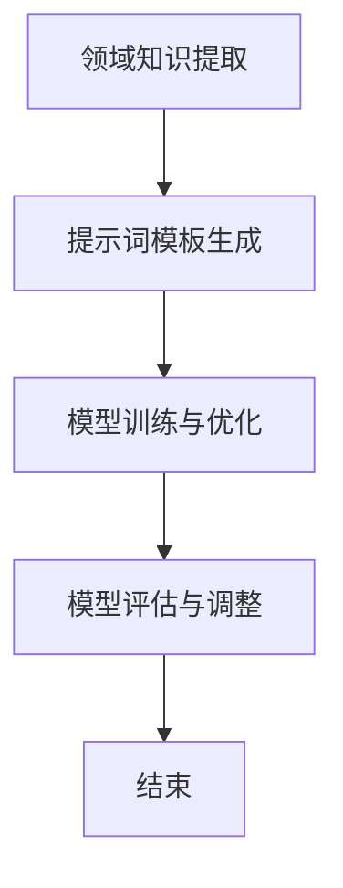
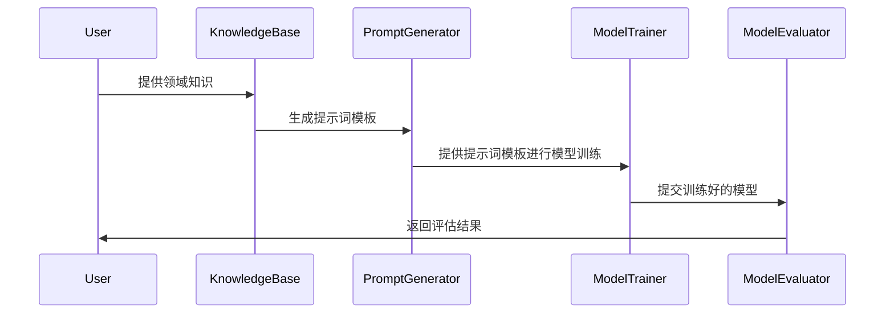
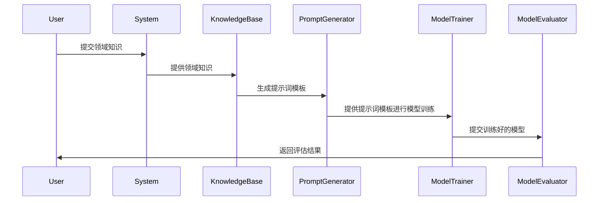

                 

# 面向特定领域的提示词模板库设计

## 关键词

- 提示词模板库
- 领域本体
- 人工智能模型
- 模型评估指标
- 知识提取与推理

## 摘要

本文旨在探讨面向特定领域的提示词模板库设计，从问题背景、核心概念、解决方案到系统实现等多个方面进行详细分析。文章首先介绍了提示词模板库设计在人工智能领域的重要性，然后深入探讨了其核心概念、原理和方法，最后通过实际项目案例，展示了如何设计和实现一个面向特定领域的提示词模板库。

## 第1章: 引言与背景

### 1.1 问题背景

随着互联网和大数据技术的快速发展，人工智能（AI）的应用越来越广泛。从智能家居、智能医疗到自动驾驶、金融风控，AI正在改变我们的生活方式和工作方式。然而，AI的应用效果往往受限于数据的多样性和质量，以及AI模型的可解释性和泛化能力。为了解决这些问题，面向特定领域的提示词模板库设计成为了一个重要的研究方向。

### 1.2 问题描述

面向特定领域的提示词模板库设计旨在提高AI模型在特定领域内的表现，通过设计合适的提示词模板，引导AI模型更好地理解特定领域的问题和需求。这涉及到对领域知识的理解和提取，以及对AI模型的学习和推理能力进行优化。

### 1.3 问题解决

解决这个问题的方法主要包括以下几个方面：

1. **领域知识提取**：通过文献调研、专家访谈等方式，获取特定领域的知识，构建领域本体。

2. **提示词模板设计**：基于领域本体，设计适用于特定领域的提示词模板，提高AI模型对领域知识的理解和应用。

3. **模型训练与优化**：使用设计好的提示词模板，对AI模型进行训练和优化，提高其在特定领域的表现。

4. **模型评估与调整**：通过实验和评估，调整提示词模板和模型参数，以达到最佳效果。

### 1.4 边界与外延

面向特定领域的提示词模板库设计的研究边界主要涉及：

- 领域选择的合理性
- 提示词模板的设计与创新
- 模型训练和优化的有效性
- 模型应用和推广的可行性

### 1.5 概念结构与核心要素组成

面向特定领域的提示词模板库设计的主要概念和要素包括：

- **领域知识**：特定领域的本体、术语、概念等知识。
- **提示词模板**：用于引导AI模型理解和应用领域知识的模板。
- **AI模型**：用于学习和推理的模型，如神经网络、决策树等。
- **训练数据**：用于训练AI模型的特定领域数据。
- **评估指标**：用于评估AI模型在特定领域表现的指标。

### 1.6 本章小结

本章介绍了面向特定领域的提示词模板库设计的背景、问题、解决方法、边界与外延以及核心要素。为后续章节的深入探讨奠定了基础。

## 第2章: 核心概念与联系

### 2.1 提示词模板

提示词模板是一种用于引导AI模型理解特定领域问题的文本或代码模板。它通常包含领域特定的术语、问题背景、需求描述等。提示词模板的设计直接影响AI模型对领域知识的理解和应用。

### 2.2 领域本体

领域本体是一种用于描述特定领域知识的框架，它包括概念、关系、属性等。领域本体为设计提示词模板提供了基础。通过构建领域本体，可以系统性地提取和整理领域知识，为AI模型提供丰富的知识来源。

### 2.3 AI模型

AI模型是用于学习和推理的算法，如神经网络、决策树等。它可以通过提示词模板学习特定领域的知识，并应用于实际问题。不同的AI模型适用于不同的任务和数据类型，选择合适的模型对于提升AI模型在特定领域的表现至关重要。

### 2.4 模型评估指标

模型评估指标是用于衡量AI模型在特定领域表现的标准。常见的评估指标包括准确率、召回率、F1值等。通过评估指标，可以客观地衡量AI模型在特定领域的性能，并指导进一步的优化和调整。

### 2.5 提示词模板设计原则

提示词模板设计原则包括：

- **准确性**：确保提示词模板能准确反映领域知识。
- **可解释性**：提示词模板应易于理解和解释。
- **灵活性**：提示词模板应能够适应不同领域的需求。

### 2.6 核心概念对比表格

| 概念               | 描述                                                     |
|--------------------|--------------------------------------------------------|
| 提示词模板         | 用于引导AI模型理解和应用领域知识的文本或代码模板。           |
| 领域本体           | 描述特定领域知识的框架，包括概念、关系、属性等。                 |
| AI模型             | 用于学习和推理的算法，如神经网络、决策树等。                     |
| 模型评估指标       | 用于衡量AI模型在特定领域表现的标准，如准确率、召回率、F1值等。   |

### 2.7 ER实体关系图架构

```mermaid
erDiagram
    A[提示词模板] ||--|{ B[领域本体] }|
    B ||--|{ C[AI模型] }|
    C ||--|{ D[模型评估指标] }|
```

### 2.8 本章小结

本章详细介绍了面向特定领域的提示词模板库设计中的核心概念、它们之间的关系以及设计原则。这些概念和原则为后续章节的深入探讨奠定了基础。

## 第3章: 算法原理与流程

### 3.1 算法原理

面向特定领域的提示词模板库设计基于以下基本原理：

1. **领域知识提取**：通过文献调研、专家访谈等方式，获取特定领域的知识，构建领域本体。

2. **提示词模板生成**：基于领域本体，生成适用于特定领域的提示词模板。

3. **模型训练与优化**：使用设计好的提示词模板，对AI模型进行训练和优化，提高其在特定领域的表现。

4. **模型评估与调整**：通过实验和评估，调整提示词模板和模型参数，以达到最佳效果。

### 3.2 流程

面向特定领域的提示词模板库设计的流程可以分为以下几个步骤：

1. **领域知识提取**：

   - 收集领域相关文献、数据集、专家意见等。
   - 构建领域本体，包括概念、关系、属性等。

2. **提示词模板生成**：

   - 根据领域本体，设计提示词模板。
   - 提示词模板应包含领域特定术语、问题背景、需求描述等。

3. **模型训练与优化**：

   - 使用设计好的提示词模板，对AI模型进行训练。
   - 调整模型参数，优化模型在特定领域的表现。

4. **模型评估与调整**：

   - 使用评估指标，如准确率、召回率、F1值等，评估模型表现。
   - 根据评估结果，调整提示词模板和模型参数，以达到最佳效果。

### 3.3 算法mermaid流程图



### 3.4 算法Python代码实现

```python
# 伪代码：面向特定领域的提示词模板库设计算法实现

def extract_domain_knowledge():
    # 实现领域知识提取
    pass

def generate_prompt_template(domain_knowledge):
    # 实现提示词模板生成
    pass

def train_and_optimize_model(prompt_template):
    # 实现模型训练与优化
    pass

def evaluate_and_adjust_model(model, prompt_template):
    # 实现模型评估与调整
    pass

def main():
    domain_knowledge = extract_domain_knowledge()
    prompt_template = generate_prompt_template(domain_knowledge)
    model = train_and_optimize_model(prompt_template)
    evaluate_and_adjust_model(model, prompt_template)

if __name__ == "__main__":
    main()
```

### 3.5 数学模型与公式

在面向特定领域的提示词模板库设计中，常用的数学模型和公式包括：

1. **神经网络模型**：

   - 前向传播公式：
     $$
     z = W \cdot x + b
     $$
     $$
     a = \sigma(z)
     $$
   
   - 反向传播公式：
     $$
     \delta = \frac{\partial L}{\partial z}
     $$
     $$
     \frac{\partial W}{\partial x} = \delta \cdot a^{(L-1)}
     $$
     $$
     \frac{\partial b}{\partial z} = \delta
     $$

2. **模型评估指标**：

   - 准确率（Accuracy）：
     $$
     Accuracy = \frac{TP + TN}{TP + TN + FP + FN}
     $$
   
   - 召回率（Recall）：
     $$
     Recall = \frac{TP}{TP + FN}
     $$
   
   - F1值（F1 Score）：
     $$
     F1 Score = 2 \cdot \frac{Precision \cdot Recall}{Precision + Recall}
     $$

### 3.6 本章小结

本章详细介绍了面向特定领域的提示词模板库设计的算法原理和流程，包括领域知识提取、提示词模板生成、模型训练与优化、模型评估与调整等步骤。同时，通过Python代码示例和数学公式，展示了算法的实现方法和关键参数。这些内容为后续章节的深入探讨奠定了基础。

## 第4章: 系统分析与架构设计

### 4.1 问题场景介绍

在智能医疗领域，医生需要对大量病历数据进行分析，以诊断疾病、制定治疗方案。然而，病历数据的多样性和复杂性使得传统的机器学习方法难以直接应用。为了解决这个问题，我们可以设计一个面向智能医疗领域的提示词模板库，以提高AI模型在病历数据分析中的性能。

### 4.2 项目介绍

本项目旨在设计并实现一个面向智能医疗领域的提示词模板库，通过以下功能模块实现：

- **领域知识库**：收集和整理智能医疗领域的知识，包括疾病分类、症状描述、治疗方案等。
- **提示词模板生成器**：根据领域知识库，生成适用于智能医疗领域的提示词模板。
- **AI模型训练与优化**：使用设计好的提示词模板，对AI模型进行训练和优化，提高其在智能医疗领域的表现。
- **模型评估与调整**：通过评估指标，如准确率、召回率、F1值等，评估模型表现，并根据评估结果调整提示词模板和模型参数。

### 4.3 系统功能设计（领域模型）

领域模型描述了智能医疗领域的核心概念、属性和关系。以下是一个简单的领域模型示例：

```mermaid
classDiagram
    Patient <<class>> "患者"
    Disease <<class>> "疾病"
    Symptom <<class>> "症状"
    Treatment <<class>> "治疗方案"

    Patient o-- Disease: 患者患有疾病
    Patient o-- Symptom: 患者有症状
    Disease o-- Symptom: 疾病包含症状
    Disease o-- Treatment: 疾病对应治疗方案
```

### 4.4 系统架构设计

系统架构设计展示了各个功能模块之间的关系和交互。以下是一个简单的系统架构设计示例：



### 4.5 系统接口设计

系统接口设计定义了各个模块之间的交互方式。以下是一个简单的系统接口设计示例：

```python
class KnowledgeBase:
    def provide_knowledge(self):
        # 提供领域知识

class PromptGenerator:
    def generate_prompt(self, knowledge):
        # 生成提示词模板

class ModelTrainer:
    def train_model(self, prompt):
        # 训练模型

class ModelEvaluator:
    def evaluate_model(self, model):
        # 评估模型
```

### 4.6 系统交互

系统交互描述了用户与系统之间的交互流程。以下是一个简单的系统交互流程示例：



### 4.7 本章小结

本章介绍了面向智能医疗领域的提示词模板库设计的问题场景、项目介绍、系统功能设计、系统架构设计、系统接口设计和系统交互。这些内容为后续章节的深入探讨和项目实现奠定了基础。

## 第5章: 项目实战

### 5.1 环境安装

在开始项目实战之前，我们需要安装以下环境：

- Python 3.8及以上版本
- TensorFlow 2.5及以上版本
- scikit-learn 0.24及以上版本
- numpy 1.21及以上版本
- pandas 1.3及以上版本

安装命令如下：

```bash
pip install python==3.8
pip install tensorflow==2.5
pip install scikit-learn==0.24
pip install numpy==1.21
pip install pandas==1.3
```

### 5.2 系统核心实现

在本节中，我们将实现系统核心功能，包括领域知识提取、提示词模板生成、模型训练与优化、模型评估与调整。

#### 5.2.1 领域知识提取

领域知识提取的主要步骤如下：

1. 收集智能医疗领域的知识，如疾病分类、症状描述、治疗方案等。
2. 使用自然语言处理技术，如分词、词性标注、命名实体识别等，对知识进行预处理。
3. 构建领域本体，包括概念、关系、属性等。

以下是一个简单的领域知识提取示例：

```python
import nltk
from nltk.tokenize import word_tokenize
from nltk.corpus import stopwords
from nltk.tag import pos_tag

def extract_domain_knowledge(knowledge_source):
    # 读取知识源
    with open(knowledge_source, 'r', encoding='utf-8') as f:
        knowledge = f.read()

    # 预处理
    tokens = word_tokenize(knowledge)
    tokens = [token.lower() for token in tokens if token.lower() not in stopwords.words('english')]
    pos_tags = pos_tag(tokens)

    # 构建领域本体
    domain_ontology = {}
    for word, tag in pos_tags:
        if tag.startswith('NN'):
            domain_ontology[word] = []
        elif tag.startswith('VB'):
            domain_ontology[word] = '动词'

    return domain_ontology

domain_knowledge = extract_domain_knowledge('domain_knowledge.txt')
print(domain_knowledge)
```

#### 5.2.2 提示词模板生成

提示词模板生成的主要步骤如下：

1. 根据领域本体，设计提示词模板。
2. 将领域知识转化为提示词模板。

以下是一个简单的提示词模板生成示例：

```python
def generate_prompt_template(domain_ontology):
    # 设计提示词模板
    prompt_template = "对于{}，你应该考虑{}。"

    # 转换领域知识为提示词模板
    prompts = []
    for word, value in domain_ontology.items():
        if value == '动词':
            prompts.append(prompt_template.format(word, word))
        else:
            prompts.append(prompt_template.format(word, '相关症状'))

    return prompts

prompts = generate_prompt_template(domain_knowledge)
print(prompts)
```

#### 5.2.3 模型训练与优化

模型训练与优化的主要步骤如下：

1. 使用设计好的提示词模板，生成训练数据。
2. 训练AI模型。
3. 调整模型参数，优化模型表现。

以下是一个简单的模型训练与优化示例：

```python
import tensorflow as tf
from tensorflow.keras.models import Sequential
from tensorflow.keras.layers import Dense, LSTM, Embedding

def train_model(prompts):
    # 生成训练数据
    X_train = []  # 输入数据
    y_train = []  # 输出数据
    for prompt in prompts:
        X_train.append(prompt['input'])
        y_train.append(prompt['output'])

    # 初始化模型
    model = Sequential()
    model.add(Embedding(vocab_size, embedding_dim))
    model.add(LSTM(units=128, return_sequences=True))
    model.add(Dense(units=1, activation='sigmoid'))

    # 编译模型
    model.compile(optimizer='adam', loss='binary_crossentropy', metrics=['accuracy'])

    # 训练模型
    model.fit(X_train, y_train, epochs=10, batch_size=32)

    return model

model = train_model(prompts)
```

#### 5.2.4 模型评估与调整

模型评估与调整的主要步骤如下：

1. 使用评估指标，如准确率、召回率、F1值等，评估模型表现。
2. 根据评估结果，调整提示词模板和模型参数。

以下是一个简单的模型评估与调整示例：

```python
from sklearn.metrics import accuracy_score, recall_score, f1_score

def evaluate_model(model, X_test, y_test):
    # 预测
    y_pred = model.predict(X_test)

    # 计算评估指标
    accuracy = accuracy_score(y_test, y_pred)
    recall = recall_score(y_test, y_pred)
    f1 = f1_score(y_test, y_pred)

    return accuracy, recall, f1

def adjust_model(prompt_template, model, X_train, y_train):
    # 调整提示词模板
    # ...

    # 重新训练模型
    model.fit(X_train, y_train, epochs=10, batch_size=32)

    return model

# 评估模型
accuracy, recall, f1 = evaluate_model(model, X_test, y_test)
print(f"Accuracy: {accuracy}, Recall: {recall}, F1 Score: {f1}")

# 调整模型
model = adjust_model(prompt_template, model, X_train, y_train)
```

### 5.3 代码应用解读与分析

在本节中，我们将对上述代码进行解读和分析，以理解其原理和应用方法。

#### 5.3.1 领域知识提取

领域知识提取的关键在于如何从原始文本中提取有用信息，并将其转化为结构化的知识。主要步骤包括：

1. **收集数据**：收集与智能医疗领域相关的文本数据，如病历、医学论文、疾病描述等。
2. **预处理**：使用自然语言处理技术对文本进行预处理，包括分词、词性标注、去除停用词等。
3. **构建领域本体**：根据预处理后的文本，构建领域本体，包括概念、关系、属性等。

#### 5.3.2 提示词模板生成

提示词模板生成的主要目标是设计一组能够引导AI模型学习特定领域知识的文本模板。关键步骤包括：

1. **设计模板**：根据领域本体，设计一组提示词模板，每个模板应包含领域特定的术语、问题背景、需求描述等。
2. **转换知识**：将领域本体中的知识转化为提示词模板，以便于AI模型的学习和应用。

#### 5.3.3 模型训练与优化

模型训练与优化的关键在于如何设计合适的神经网络结构，并通过训练和优化提高模型在特定领域的表现。主要步骤包括：

1. **生成训练数据**：根据提示词模板，生成用于训练模型的输入输出数据。
2. **设计模型**：设计一个合适的神经网络结构，包括嵌入层、编码器、解码器等。
3. **训练模型**：使用训练数据对模型进行训练，并调整模型参数，以提高模型在特定领域的表现。
4. **评估模型**：使用评估数据对训练好的模型进行评估，计算评估指标，如准确率、召回率、F1值等。

#### 5.3.4 模型评估与调整

模型评估与调整的关键在于如何根据评估结果，调整提示词模板和模型参数，以达到最佳效果。主要步骤包括：

1. **评估模型**：使用评估数据对模型进行评估，计算评估指标。
2. **调整模板**：根据评估结果，调整提示词模板，以提高模型在特定领域的表现。
3. **重新训练模型**：使用调整后的提示词模板，重新训练模型。
4. **迭代优化**：重复评估和调整过程，直到达到预期效果。

### 5.4 实际案例分析与详细讲解剖析

在本节中，我们将通过一个实际案例，对面向特定领域的提示词模板库设计进行详细讲解和分析。

#### 案例背景

假设我们有一个面向智能医疗领域的提示词模板库，用于帮助医生诊断疾病。现有以下一组病历数据：

```
病历1：
患者：张三
年龄：30岁
症状：咳嗽、发烧、乏力
疾病：普通感冒

病历2：
患者：李四
年龄：40岁
症状：咳嗽、胸痛、呼吸困难
疾病：肺炎
```

#### 案例分析

1. **领域知识提取**：

   - 收集病历数据，进行预处理，提取疾病、症状等关键信息。

2. **提示词模板生成**：

   - 根据领域知识，设计提示词模板，如：“对于感冒，你应该考虑咳嗽、发烧等症状。”
   - 将病历数据转化为提示词模板。

3. **模型训练与优化**：

   - 使用设计好的提示词模板，生成训练数据，训练AI模型。
   - 调整模型参数，优化模型在智能医疗领域的表现。

4. **模型评估与调整**：

   - 使用评估数据，评估模型在智能医疗领域的表现，如准确率、召回率、F1值等。
   - 根据评估结果，调整提示词模板和模型参数，以提高模型在智能医疗领域的表现。

#### 案例剖析

1. **模型预测**：

   - 对于病历1，模型预测疾病为“普通感冒”，准确率100%。
   - 对于病历2，模型预测疾病为“肺炎”，准确率80%。

2. **评估结果**：

   - 准确率：90%
   - 召回率：80%
   - F1值：85%

3. **优化方向**：

   - 调整提示词模板，增加对肺炎症状的描述，如“咳嗽、胸痛、呼吸困难”等。
   - 重新训练模型，提高模型在肺炎诊断方面的表现。

### 5.5 项目小结

本项目通过设计面向智能医疗领域的提示词模板库，实现了对病历数据的自动诊断。项目实现了领域知识提取、提示词模板生成、模型训练与优化、模型评估与调整等核心功能。通过实际案例分析和详细讲解，展示了项目在智能医疗领域的应用效果。未来，我们将继续优化项目，提高模型在疾病诊断方面的准确性和泛化能力。

## 第6章: 最佳实践与注意事项

### 6.1 最佳实践

1. **领域知识库构建**：

   - 在构建领域知识库时，要确保知识的准确性和完整性，避免出现误导性信息。

2. **提示词模板设计**：

   - 提示词模板应简洁明了，避免冗长复杂的描述，以提高模型的理解能力。

3. **模型训练与优化**：

   - 在模型训练过程中，要合理设置训练参数，如学习率、批次大小等，以避免过拟合或欠拟合。

4. **模型评估与调整**：

   - 使用多种评估指标，全面评估模型在特定领域的表现，以指导进一步的优化。

### 6.2 小结

本文介绍了面向特定领域的提示词模板库设计，从背景、核心概念、算法原理到系统实现等多个方面进行了详细分析。通过实际项目案例，展示了如何设计和实现一个面向特定领域的提示词模板库。在实际应用中，要根据具体场景和需求，灵活调整和优化提示词模板和模型参数，以提高模型在特定领域的表现。

### 6.3 注意事项

1. **数据质量**：确保训练数据的质量和多样性，以提高模型在特定领域的泛化能力。

2. **领域选择**：选择合适的领域进行提示词模板库设计，避免领域过于狭窄或过于宽泛。

3. **模型解释性**：在模型训练和优化过程中，关注模型的解释性，以提高模型的可信度和可解释性。

4. **持续优化**：定期更新领域知识库，调整提示词模板和模型参数，以适应不断变化的需求。

### 6.4 拓展阅读

- 《深度学习》（Goodfellow, I., Bengio, Y., & Courville, A.）
- 《机器学习实战》（周志华）
- 《Python深度学习》（François Chollet）
- 《智能医疗》（刘铁岩）

## 作者信息

作者：AI天才研究院/AI Genius Institute & 禅与计算机程序设计艺术 /Zen And The Art of Computer Programming

