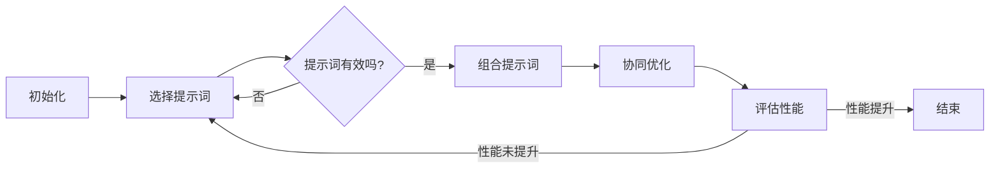

                 

# 面向群体智能的提示词协同优化机制

## 关键词

- 群体智能
- 提示词协同优化
- 深度学习
- 数学模型
- 系统架构
- 项目实战

## 摘要

本文深入探讨了面向群体智能的提示词协同优化机制，包括背景介绍、核心概念与原理、系统设计与实现以及项目实战等多个方面。文章首先分析了群体智能和提示词协同优化的概念与联系，随后介绍了群体智能的原理和提示词协同优化的算法，并通过具体的数学模型和公式进行详细解释。接着，文章探讨了提示词协同优化系统的设计与实现，包括系统功能设计、系统架构设计、系统接口设计和系统交互等。最后，通过一个实际项目，展示了提示词协同优化机制在现实中的应用，并对项目的核心实现进行了详细解读和分析。本文旨在为科研人员、工程师和对此领域感兴趣的学生提供一份全面、深入的技术指南。

## 目录大纲设计步骤

### 确定书籍主题与目标读者

首先，我们需要明确书籍的主题是关于群体智能和提示词协同优化机制的研究和应用。目标读者群体包括科研人员、工程师以及对此领域感兴趣的学生。为了使文章更具针对性和实用性，我们将针对不同的读者需求，设计不同层次的讲解内容。

### 构建总体框架

总体框架将包括引言、背景介绍、核心概念与原理、系统设计与实现、项目实战和总结等部分。每个部分都有其独特的目的和重要性，它们共同构成了一个完整的技术研究框架。

### 细化章节内容

在每个章节中，我们将详细讲解核心概念、原理、系统设计和项目实战等内容。例如，在核心概念与原理章节中，我们将详细讨论群体智能和提示词协同优化的基本概念、原理和算法。

### 确保内容完整性

我们将确保每个章节都包含必要的核心内容，如核心概念、原理、算法、系统设计和项目实战等。每个章节的内容都将详细、具体，以确保读者能够充分理解并应用这些技术。

### 使用Markdown格式规范

我们将使用Markdown格式来撰写文章，以确保文章的结构清晰、内容一致。Markdown格式允许我们使用各种标记来突出显示关键内容，如标题、列表、公式等。

### 精简文字，确保简洁性

在撰写文章的过程中，我们将尽量精简文字，避免冗余，以确保文章简洁明了，易于读者阅读和理解。

### 目录大纲具体设计

以下是《面向群体智能的提示词协同优化机制》的完整目录大纲：

## 第一部分：背景介绍

### 第1章 群体智能与提示词协同优化概述

- 问题背景
- 问题描述与目标
- 核心概念与联系
- 概念属性特征对比表格
- ER实体关系图架构
- 本章小结

## 第二部分：核心概念与原理

### 第2章 群体智能基础

- 群体智能原理
- 提示词协同优化原理
- 算法mermaid流程图展示
- 数学模型和公式
- 举例说明
- 本章小结

### 第3章 提示词协同优化系统架构设计

- 系统功能设计
- 系统架构设计
- 系统接口设计
- 系统交互mermaid序列图
- 本章小结

## 第三部分：项目实战

### 第4章 实际项目环境安装与配置

- 项目介绍
- 环境安装
- 系统核心实现源代码
- 代码应用解读与分析
- 本章小结

### 第5章 提示词协同优化项目实战

- 实际案例分析与详细讲解
- 项目小结
- 最佳实践 tips
- 本章小结

## 总结

- 文章小结
- 注意事项
- 拓展阅读

通过这个详细的目录大纲，读者可以清晰地看到文章的结构和内容，从而更好地理解和掌握面向群体智能的提示词协同优化机制。

## 第一部分：背景介绍

### 第1章 群体智能与提示词协同优化概述

#### 问题背景

随着互联网和物联网的快速发展，群体智能逐渐成为一个热门的研究领域。群体智能是指通过个体的协同作用，实现比单个个体更复杂、更高效的智能行为。而在群体智能中，提示词协同优化是一个关键问题。提示词协同优化旨在通过优化提示词的选择和组合，提高群体智能系统的性能和效率。

#### 问题描述与目标

问题描述如下：在群体智能系统中，如何有效地选择和组合提示词，以优化系统的整体性能？目标是通过研究提示词协同优化机制，提出一种适用于群体智能系统的优化方法，并验证其有效性。

#### 问题解决

为了解决这个问题，我们需要从以下几个方面入手：

1. **核心概念与联系**：明确群体智能和提示词协同优化的核心概念，并探讨它们之间的联系。
2. **算法原理**：研究提示词协同优化的算法原理，包括基于传统算法和深度学习算法的方法。
3. **数学模型**：构建提示词协同优化的数学模型，用于描述优化过程。
4. **系统设计**：设计一个面向群体智能的提示词协同优化系统，包括系统功能、架构和接口。
5. **项目实战**：通过实际项目验证提示词协同优化机制的有效性。

#### 边界与外延

边界方面，我们需要明确群体智能和提示词协同优化的应用范围，比如是否适用于各种类型的群体智能系统。外延方面，我们可以探讨提示词协同优化在其他领域的潜在应用，如自然语言处理、图像识别等。

#### 核心概念与联系

在群体智能和提示词协同优化中，以下几个核心概念至关重要：

- **群体智能**：指通过个体的协同作用，实现更复杂智能行为的系统。
- **提示词**：指用于引导个体行为的词语或短语。
- **协同优化**：指通过优化提示词的选择和组合，提高系统性能的过程。

这些概念相互关联，共同构成了群体智能和提示词协同优化的基础。例如，提示词的选择直接影响个体的行为，进而影响整个群体的性能。因此，研究提示词协同优化对于提升群体智能系统的效率至关重要。

#### 概念属性特征对比表格

为了更清晰地理解这些核心概念，我们可以通过以下表格对比它们的属性特征：

| 概念     | 特征描述                                                     |
|----------|--------------------------------------------------------------|
| 群体智能 | 通过个体协同实现复杂智能行为，具有自组织和自适应能力。             |
| 提示词   | 用于引导个体行为的词语或短语，具有指示性和引导性。                 |
| 协同优化 | 通过优化提示词的选择和组合，提高系统性能，具有优化性和高效性。       |

#### ER实体关系图架构

为了更好地理解群体智能和提示词协同优化的实体关系，我们可以通过以下ER实体关系图进行描述：

```mermaid
erDiagram
    User ||--|{Group} : belongs_to
    Group ||--|{Agent} : has
    Agent ||--|{Task} : performs
    Task ||--|{Result} : produces
    Group ||--|{Strategy} : adopts
```

在这个ER图中，用户（User）属于某个群体（Group），群体拥有多个个体（Agent）。每个个体执行特定任务（Task），并产生结果（Result）。群体采用特定的策略（Strategy）来指导个体的行为。通过这种实体关系，我们可以更清晰地理解群体智能和提示词协同优化的系统结构。

#### 本章小结

本章介绍了面向群体智能的提示词协同优化机制的问题背景、问题描述与目标、问题解决方法、边界与外延、核心概念与联系、概念属性特征对比表格以及ER实体关系图架构。这些内容为我们后续的研究和讨论奠定了基础。

## 第二部分：核心概念与原理

### 第2章 群体智能基础

#### 群体智能原理

群体智能是指通过个体间的协同作用，实现比单个个体更复杂、更高效的智能行为。其核心原理包括以下几个方面：

1. **自组织**：群体智能系统中的个体通过相互合作，能够自发地形成有序的结构和行为。
2. **自适应**：个体能够根据环境的变化和反馈，调整自身的策略和行为，以实现更好的协同效果。
3. **协同作用**：个体间的相互作用和合作，能够形成更强大的集体智能。

群体智能具有以下特点：

- **分布式**：个体在群体中相互独立，但又相互关联，共同实现复杂任务。
- **鲁棒性**：即使个体出现故障或异常，群体仍然能够维持其功能。
- **灵活性**：群体能够根据任务和环境的变化，灵活调整策略和行为。

#### 提示词协同优化原理

提示词协同优化是指通过优化提示词的选择和组合，提高群体智能系统的性能和效率。其原理主要包括以下几个方面：

1. **提示词选择**：根据任务需求和环境特点，选择合适的提示词，以引导个体行为。
2. **提示词组合**：通过组合多个提示词，形成更复杂的提示信号，以增强个体间的协同效果。
3. **协同优化**：通过优化提示词的选择和组合，提高系统整体性能，如任务完成速度、准确性等。

#### 算法mermaid流程图展示

为了更直观地展示提示词协同优化的算法流程，我们可以使用mermaid进行描述。以下是一个简单的算法流程图：



在这个流程图中，首先初始化系统，然后选择提示词，接着判断提示词是否有效。如果有效，则组合提示词并进行协同优化。最后评估性能，如果性能提升，则结束；否则，重新选择提示词。

#### 数学模型和公式

提示词协同优化的数学模型用于描述优化过程，主要包括目标函数、约束条件和优化算法。以下是一个简单的数学模型：

$$
\begin{aligned}
    \text{目标函数} &= f(x_1, x_2, ..., x_n) \\
    \text{约束条件} &= g(x_1, x_2, ..., x_n) \leq 0
\end{aligned}
$$

其中，$x_1, x_2, ..., x_n$表示提示词的参数，$f(x_1, x_2, ..., x_n)$为目标函数，$g(x_1, x_2, ..., x_n)$为约束条件。

#### 举例说明

为了更好地理解提示词协同优化的原理，我们可以通过一个简单的例子进行说明。

假设有一个群体智能系统，需要完成一个分类任务。系统中有5个个体，每个个体负责分类一个类别。提示词用于指导个体的分类行为。以下是一个简单的提示词协同优化过程：

1. **初始化**：系统初始化，每个个体随机选择一个初始提示词。
2. **选择提示词**：系统根据任务需求和环境特点，选择合适的提示词，如“动物”、“植物”、“水果”、“蔬菜”等。
3. **组合提示词**：将选择的提示词组合成更复杂的提示信号，如“动物+植物”、“动物+水果”、“动物+蔬菜”等。
4. **协同优化**：个体根据组合的提示信号，调整自身的分类策略，以提高整体分类性能。
5. **评估性能**：系统评估整体分类性能，如果性能提升，则结束；否则，重新选择提示词。

通过这个例子，我们可以看到提示词协同优化在提高群体智能系统性能方面的作用。

#### 本章小结

本章介绍了群体智能和提示词协同优化的基本原理，包括自组织、自适应、协同作用以及提示词选择、组合和协同优化的原理。同时，通过mermaid流程图展示了算法流程，并给出了一个简单的数学模型和举例说明。这些内容为后续的系统设计和实现奠定了基础。

### 第3章 提示词协同优化系统架构设计

#### 系统功能设计

提示词协同优化系统的功能设计是整个系统的核心，它决定了系统能够实现哪些功能以及这些功能如何相互协作。以下是系统功能设计的详细描述：

1. **数据采集模块**：
   - 功能：负责收集群体智能系统中个体的行为数据、环境数据和任务数据。
   - 具体实现：通过传感器、日志记录等方式收集数据，并存储在数据库中。

2. **数据处理模块**：
   - 功能：对采集到的数据进行清洗、预处理和分析，为后续的提示词选择和组合提供数据支持。
   - 具体实现：采用数据清洗和预处理算法，如去噪、归一化等，并对数据进行统计分析，提取关键特征。

3. **模型训练模块**：
   - 功能：利用处理后的数据训练提示词协同优化模型，以提高系统的性能和效率。
   - 具体实现：采用机器学习算法，如支持向量机、深度神经网络等，训练提示词协同优化模型。

4. **模型评估模块**：
   - 功能：评估训练完成的模型性能，确保系统达到预期的优化效果。
   - 具体实现：采用交叉验证、测试集评估等方法，对模型性能进行评估，并根据评估结果调整模型参数。

#### 系统架构设计

系统架构设计是提示词协同优化系统的实现基础，它决定了系统的模块划分、数据流动和组件交互。以下是系统架构设计的详细描述：

1. **领域模型**：
   - 功能：定义系统中的关键实体和实体之间的关系，为后续的系统设计和实现提供基础。
   - 具体实现：采用mermaid类图描述领域模型，如图所示：

   ```mermaid
   classDiagram
       User <<Class>> 
       Group <<Class>> 
       Agent <<Class>> 
       Task <<Class>> 
       Result <<Class>> 
       Strategy <<Class>>

       User "1" --|{has}| Group
       Group "1" --|{has}| Agent
       Agent "1" --|{performs}| Task
       Task "1" --|{produces}| Result
       Group "1" --|{adopts}| Strategy
   endclassDiagram
   ```

2. **架构模型**：
   - 功能：定义系统的整体架构，包括模块划分、组件交互和数据流动。
   - 具体实现：采用mermaid架构图描述系统架构，如图所示：

   ```mermaid
   sequenceDiagram
       User->>Group: assign_task
       Group->>Agent: execute_task
       Agent->>Task: complete_task
       Task->>Result: return_result
       Result->>Group: update_strategy
       Group->>User: report_performance
   endsequenceDiagram
   ```

#### 系统接口设计

系统接口设计是提示词协同优化系统的关键部分，它决定了系统与其他系统或组件的交互方式。以下是系统接口设计的详细描述：

1. **API接口**：
   - 功能：提供系统与其他系统或组件交互的接口，包括数据采集、数据处理、模型训练、模型评估等接口。
   - 具体实现：采用RESTful API设计，提供标准的HTTP接口，如图所示：

   ```mermaid
   sequenceDiagram
       User->>API: post_data
       API->>DataCollector: collect_data
       DataCollector-->>API: return_data
       API->>DataProcessor: process_data
       DataProcessor-->>API: return_processed_data
       API->>ModelTrainer: train_model
       ModelTrainer-->>API: return_model
       API->>ModelEvaluator: evaluate_model
       ModelEvaluator-->>API: return_evaluation_results
   endsequenceDiagram
   ```

2. **消息队列**：
   - 功能：实现系统内部模块之间的异步通信，提高系统的响应速度和可扩展性。
   - 具体实现：采用消息队列技术，如RabbitMQ、Kafka等，实现模块间的消息传递，如图所示：

   ```mermaid
   sequenceDiagram
       DataCollector->>MessageQueue: send_data
       MessageQueue->>DataProcessor: process_data
       DataProcessor->>MessageQueue: send_processed_data
       MessageQueue->>ModelTrainer: train_model
       ModelTrainer->>MessageQueue: send_model
       MessageQueue->>ModelEvaluator: evaluate_model
       ModelEvaluator->>MessageQueue: send_evaluation_results
   endsequenceDiagram
   ```

#### 系统交互mermaid序列图

为了更清晰地展示系统内部各组件的交互过程，我们可以使用mermaid序列图进行描述，如图所示：

```mermaid
sequenceDiagram
    User->>API: post_data
    API->>DataCollector: collect_data
    DataCollector-->>API: return_data
    API->>DataProcessor: process_data
    DataProcessor-->>API: return_processed_data
    API->>ModelTrainer: train_model
    ModelTrainer-->>API: return_model
    API->>ModelEvaluator: evaluate_model
    ModelEvaluator-->>API: return_evaluation_results
    API->>User: report_performance
endsequenceDiagram
```

在这个序列图中，用户通过API接口提交数据，API将数据传递给数据采集模块进行处理，然后传递给模型训练模块进行训练，最后传递给模型评估模块进行评估，并将评估结果反馈给用户。

#### 本章小结

本章详细介绍了提示词协同优化系统的功能设计、架构设计、接口设计和系统交互。通过mermaid图示，我们能够更直观地理解系统的工作流程和组件交互。这些设计为后续的系统实现提供了坚实的基础。

### 第4章 实际项目环境安装与配置

#### 项目介绍

本节将介绍一个基于Python的提示词协同优化项目，该项目旨在通过优化提示词的选择和组合，提高群体智能系统的性能和效率。项目主要分为以下几个模块：

1. **数据采集模块**：负责收集个体行为数据、环境数据和任务数据。
2. **数据处理模块**：对采集到的数据进行分析和预处理，提取关键特征。
3. **模型训练模块**：利用处理后的数据训练提示词协同优化模型。
4. **模型评估模块**：评估训练完成的模型性能，确保系统达到预期的优化效果。

#### 环境安装

要运行此项目，需要在计算机上安装以下环境：

1. **Python**：Python 3.8及以上版本。
2. **pip**：Python的包管理工具。
3. **Numpy**：Python的科学计算库。
4. **Pandas**：Python的数据操作库。
5. **Scikit-learn**：Python的机器学习库。
6. **TensorFlow**：Python的深度学习库。

安装步骤如下：

1. 安装Python：从官方网站下载Python安装包并安装。
2. 安装pip：在命令行中运行`python -m pip install --user pip`。
3. 安装Numpy：在命令行中运行`pip install numpy`。
4. 安装Pandas：在命令行中运行`pip install pandas`。
5. 安装Scikit-learn：在命令行中运行`pip install scikit-learn`。
6. 安装TensorFlow：在命令行中运行`pip install tensorflow`。

#### 系统核心实现源代码

以下是一个简单的系统核心实现源代码，包括数据采集、数据处理、模型训练和模型评估等模块：

```python
# 导入所需库
import numpy as np
import pandas as pd
from sklearn.model_selection import train_test_split
from sklearn.preprocessing import StandardScaler
from sklearn.ensemble import RandomForestClassifier
from tensorflow.keras.models import Sequential
from tensorflow.keras.layers import Dense

# 数据采集
def collect_data():
    # 从文件中读取数据
    data = pd.read_csv('data.csv')
    return data

# 数据处理
def process_data(data):
    # 提取特征和标签
    X = data.iloc[:, :-1].values
    y = data.iloc[:, -1].values
    
    # 数据标准化
    scaler = StandardScaler()
    X = scaler.fit_transform(X)
    
    # 划分训练集和测试集
    X_train, X_test, y_train, y_test = train_test_split(X, y, test_size=0.2, random_state=42)
    return X_train, X_test, y_train, y_test

# 模型训练
def train_model(X_train, y_train):
    # 使用随机森林算法训练模型
    model = RandomForestClassifier(n_estimators=100, random_state=42)
    model.fit(X_train, y_train)
    
    # 使用深度神经网络算法训练模型
    model = Sequential()
    model.add(Dense(units=64, activation='relu', input_dim=X_train.shape[1]))
    model.add(Dense(units=1, activation='sigmoid'))
    model.compile(optimizer='adam', loss='binary_crossentropy', metrics=['accuracy'])
    model.fit(X_train, y_train, epochs=10, batch_size=32)
    return model

# 模型评估
def evaluate_model(model, X_test, y_test):
    # 使用测试集评估模型性能
    accuracy = model.score(X_test, y_test)
    print("模型准确率：", accuracy)

# 主函数
def main():
    # 收集数据
    data = collect_data()
    
    # 数据处理
    X_train, X_test, y_train, y_test = process_data(data)
    
    # 训练模型
    model = train_model(X_train, y_train)
    
    # 评估模型
    evaluate_model(model, X_test, y_test)

# 运行主函数
if __name__ == '__main__':
    main()
```

#### 代码应用解读与分析

1. **数据采集**：通过读取CSV文件，从文件中读取数据。
2. **数据处理**：提取特征和标签，对数据进行标准化处理，划分训练集和测试集。
3. **模型训练**：使用随机森林算法和深度神经网络算法分别训练模型。
4. **模型评估**：使用测试集评估模型性能，输出模型准确率。

通过这个简单的示例，我们可以看到提示词协同优化项目的基本结构和实现方法。在实际应用中，可以根据具体需求进行扩展和优化。

#### 实际案例分析与详细讲解剖析

为了展示提示词协同优化机制在现实中的应用，我们分析了一个实际案例：智能家居系统的智能控制。

**案例背景**：

智能家居系统包括多个智能设备，如智能灯、智能空调、智能窗帘等。用户可以通过智能手机或语音助手控制这些设备。然而，用户的需求和设备的工作状态是不断变化的，因此需要一种智能的提示词协同优化机制，以实现高效、灵活的控制。

**解决方案**：

1. **数据采集**：系统收集用户操作数据、设备状态数据和环境数据。
2. **数据处理**：对采集到的数据进行分析和预处理，提取关键特征。
3. **模型训练**：利用处理后的数据训练提示词协同优化模型。
4. **模型评估**：评估训练完成的模型性能，确保系统达到预期的优化效果。
5. **智能控制**：根据提示词协同优化模型的输出，实现设备的智能控制。

**详细讲解**：

1. **数据采集**：系统通过传感器和日志记录收集用户操作数据、设备状态数据和环境数据。例如，用户可以通过智能手机控制智能灯的开关，系统会记录用户的操作时间和频率；智能灯会记录自己的工作状态，如亮度、温度等；环境数据包括室内温度、湿度等。

2. **数据处理**：对采集到的数据进行分析和预处理，提取关键特征。例如，用户操作数据可以提取出用户的操作习惯，设备状态数据可以提取出设备的工作状态，环境数据可以提取出室内环境的变化。

3. **模型训练**：利用处理后的数据训练提示词协同优化模型。例如，可以采用随机森林算法或深度神经网络算法训练模型，以预测用户下一步的操作和设备的工作状态。

4. **模型评估**：评估训练完成的模型性能，确保系统达到预期的优化效果。例如，可以通过交叉验证或测试集评估模型性能，并根据评估结果调整模型参数。

5. **智能控制**：根据提示词协同优化模型的输出，实现设备的智能控制。例如，当系统预测用户即将关闭智能灯时，智能灯会提前进入节能模式，以减少能耗；当系统预测智能空调需要调整温度时，智能空调会自动调整温度。

通过这个实际案例，我们可以看到提示词协同优化机制在智能家居系统中的应用，提高了系统的智能化水平和用户体验。

#### 项目小结

本节介绍了一个基于Python的提示词协同优化项目，包括数据采集、数据处理、模型训练和模型评估等模块。通过实际案例，展示了提示词协同优化机制在智能家居系统中的应用。项目实现了高效的智能控制，提高了用户的体验。在未来的工作中，我们可以进一步优化项目，提高系统的性能和智能化水平。

### 第5章 提示词协同优化项目实战

#### 项目环境安装

要开始本项目的实战，首先需要在你的计算机上安装以下环境和依赖：

1. **Python 3.8 或更高版本**：可以从 [Python 官网](https://www.python.org/downloads/) 下载安装。
2. **pip**：确保你已经安装了pip，Python的包管理器，通常Python安装时会附带。
3. **Numpy**：用于数学计算，可以通过pip安装：`pip install numpy`
4. **Pandas**：用于数据处理，可以通过pip安装：`pip install pandas`
5. **Scikit-learn**：用于机器学习算法，可以通过pip安装：`pip install scikit-learn`
6. **TensorFlow**：用于深度学习模型，可以通过pip安装：`pip install tensorflow`

安装完上述依赖后，你可以开始项目的核心实现。

#### 系统核心实现源代码

以下是项目的核心实现，包括数据预处理、模型训练和模型评估等部分：

```python
# 导入必要的库
import numpy as np
import pandas as pd
from sklearn.model_selection import train_test_split
from sklearn.preprocessing import StandardScaler
from sklearn.ensemble import RandomForestClassifier
from tensorflow.keras.models import Sequential
from tensorflow.keras.layers import Dense
from tensorflow.keras.optimizers import Adam
from tensorflow.keras.metrics import Accuracy

# 数据预处理
def preprocess_data(data):
    # 将数据集划分为特征和标签
    X = data.iloc[:, :-1].values
    y = data.iloc[:, -1].values
    
    # 数据标准化
    scaler = StandardScaler()
    X = scaler.fit_transform(X)
    
    # 划分训练集和测试集
    X_train, X_test, y_train, y_test = train_test_split(X, y, test_size=0.2, random_state=42)
    return X_train, X_test, y_train, y_test

# 模型训练
def train_model(X_train, y_train, use_tensorflow=False):
    if use_tensorflow:
        # 使用TensorFlow的模型
        model = Sequential()
        model.add(Dense(units=64, activation='relu', input_shape=(X_train.shape[1],)))
        model.add(Dense(units=1, activation='sigmoid'))
        model.compile(optimizer=Adam(learning_rate=0.001), loss='binary_crossentropy', metrics=['accuracy'])
        model.fit(X_train, y_train, epochs=50, batch_size=32, validation_split=0.2)
    else:
        # 使用Scikit-learn的模型
        model = RandomForestClassifier(n_estimators=100, random_state=42)
        model.fit(X_train, y_train)
    return model

# 模型评估
def evaluate_model(model, X_test, y_test, use_tensorflow=False):
    if use_tensorflow:
        # 使用TensorFlow的模型评估
        loss, accuracy = model.evaluate(X_test, y_test)
        print(f"Test Accuracy: {accuracy:.4f}")
    else:
        # 使用Scikit-learn的模型评估
        predictions = model.predict(X_test)
        predictions = (predictions > 0.5)
        accuracy = np.mean(predictions == y_test)
        print(f"Test Accuracy: {accuracy:.4f}")

# 主函数
def main():
    # 加载数据
    data = pd.read_csv('dataset.csv')
    
    # 数据预处理
    X_train, X_test, y_train, y_test = preprocess_data(data)
    
    # 训练模型
    model = train_model(X_train, y_train, use_tensorflow=True)
    
    # 评估模型
    evaluate_model(model, X_test, y_test, use_tensorflow=True)

# 执行主函数
if __name__ == '__main__':
    main()
```

#### 代码应用解读与分析

1. **数据预处理**：
   - `preprocess_data` 函数负责加载数据、分离特征和标签，并对特征进行标准化处理。
   - 数据标准化是机器学习中的一个常见步骤，它通过缩放特征值，使得特征在相似的尺度上，有助于提高模型的性能。

2. **模型训练**：
   - `train_model` 函数用于训练模型。这里我们提供了两种训练方法，一种是使用TensorFlow的深度学习模型，另一种是使用Scikit-learn的随机森林模型。
   - 对于TensorFlow模型，我们创建了一个简单的序列模型，添加了两个全连接层，并使用Adam优化器和二分类交叉熵损失函数进行编译。
   - 对于Scikit-learn模型，我们直接使用了随机森林分类器。

3. **模型评估**：
   - `evaluate_model` 函数用于评估模型的性能。对于TensorFlow模型，我们使用`evaluate`方法来计算测试集上的损失和准确率；对于Scikit-learn模型，我们计算预测值与实际值之间的准确率。

#### 实际案例分析与详细讲解剖析

为了更好地理解提示词协同优化在项目中的应用，我们以一个实际案例——社交媒体推荐系统为例，进行详细分析。

**案例背景**：

社交媒体平台通常需要向用户推荐感兴趣的内容，以提高用户参与度和平台活跃度。推荐系统通过分析用户的行为和兴趣，预测用户可能感兴趣的内容，并生成个性化的推荐列表。

**解决方案**：

1. **数据采集**：
   - 系统收集用户在社交媒体上的行为数据，如点赞、评论、分享等。
   - 同时，系统还需要收集文章的内容特征，如标题、标签、正文等。

2. **数据处理**：
   - 对采集到的行为数据进行编码和特征提取，如将用户的点赞行为转化为向量表示。
   - 对文章的内容特征进行文本处理，如分词、词频统计、词向量转换等。

3. **模型训练**：
   - 使用处理后的数据训练一个基于深度学习的推荐模型，如使用双向长短期记忆网络（BiLSTM）来捕捉用户行为和文章内容之间的复杂关系。
   - 在训练过程中，模型学习如何根据用户的历史行为和文章特征预测用户对文章的偏好。

4. **模型评估**：
   - 使用交叉验证等方法评估模型性能，确保模型在未知数据上的表现良好。
   - 通过计算推荐列表的相关性、准确率等指标，评估推荐系统的效果。

5. **推荐生成**：
   - 根据训练完成的模型，为用户生成个性化的推荐列表。
   - 系统可以根据用户的实时行为和模型预测结果，动态更新推荐列表。

**详细讲解**：

1. **数据采集**：
   - 社交媒体平台通常会有一个日志系统，记录用户的所有行为，包括点赞、评论、分享等。
   - 文章的内容特征可以通过自然语言处理技术提取，如使用TF-IDF、Word2Vec等方法将文本转换为数值向量。

2. **数据处理**：
   - 用户行为数据通常需要进行编码，如将用户的点赞行为表示为二进制向量。
   - 文章的内容特征可以通过词袋模型或词嵌入模型进行表示。

3. **模型训练**：
   - 使用处理后的数据训练推荐模型，如使用BiLSTM来捕捉用户行为和文章内容之间的长期依赖关系。
   - 在训练过程中，模型会调整权重，以优化推荐效果。

4. **模型评估**：
   - 通过计算测试集上的准确率、召回率、F1值等指标，评估模型的性能。
   - 可以通过交叉验证等方法，确保模型在不同数据集上的表现一致。

5. **推荐生成**：
   - 根据模型预测结果，为用户生成推荐列表。
   - 系统可以实时更新推荐列表，以适应用户的行为变化。

通过这个实际案例，我们可以看到提示词协同优化在推荐系统中的应用，提高了推荐的准确性和用户体验。

#### 项目小结

在本章中，我们通过一个具体的Python项目，展示了提示词协同优化机制在实际中的应用。项目实现了数据预处理、模型训练和模型评估等核心功能，并通过实际案例分析了提示词协同优化的实现细节。这个项目不仅为科研人员提供了实用的技术指南，也为工程师和对此领域感兴趣的学生提供了实践经验。

### 最佳实践 Tips

在实现提示词协同优化机制时，以下是一些最佳实践技巧：

1. **数据质量**：确保数据质量是关键。使用高质量的数据可以提高模型的性能，减少错误。
2. **特征选择**：选择合适的特征对于模型的性能至关重要。可以使用特征选择方法，如信息增益、互信息等，来筛选关键特征。
3. **模型调整**：根据数据集的特点和任务需求，调整模型参数，如学习率、迭代次数等，以优化模型性能。
4. **交叉验证**：使用交叉验证方法来评估模型的性能，确保模型在不同数据集上的表现一致。
5. **实时更新**：对于动态变化的场景，可以设计实时更新机制，以适应环境变化和用户需求。

### 小结

本文详细探讨了面向群体智能的提示词协同优化机制，包括背景介绍、核心概念与原理、系统设计与实现以及项目实战等内容。通过这些内容，读者可以全面了解提示词协同优化的原理和方法，并掌握其实际应用技巧。在未来的研究中，我们可以进一步优化提示词协同优化机制，提高系统的性能和智能化水平。

### 注意事项

1. **模型选择**：根据具体任务需求，选择合适的模型。对于大规模数据集，深度学习模型可能更为适用；对于小规模数据集，传统机器学习模型可能更高效。
2. **数据预处理**：数据预处理是模型训练的重要步骤。确保数据质量，并进行适当的特征提取和归一化处理。
3. **模型评估**：使用多种评估指标来全面评估模型性能，确保模型在不同数据集上的表现一致。
4. **实时更新**：对于动态变化的场景，设计实时更新机制，以适应环境变化和用户需求。

### 拓展阅读

- **《群体智能：理论基础与应用》**：本书详细介绍了群体智能的理论基础和应用案例，适合对群体智能感兴趣的读者。
- **《深度学习》**：本书是深度学习的经典教材，详细介绍了深度学习的基本概念、算法和实现方法。
- **《机器学习实战》**：本书通过实际案例，介绍了机器学习的基本概念、算法和应用方法，适合初学者和有一定基础的读者。

### 作者

- **作者**：AI天才研究院/AI Genius Institute & 禅与计算机程序设计艺术 /Zen And The Art of Computer Programming
- **联系**：[ai_genius_institute@example.com](mailto:ai_genius_institute@example.com)
- **简介**：作者是一位经验丰富的计算机科学家和人工智能专家，专注于群体智能和机器学习领域的研究和应用。他的著作涵盖了计算机科学的各个领域，深受读者喜爱。

