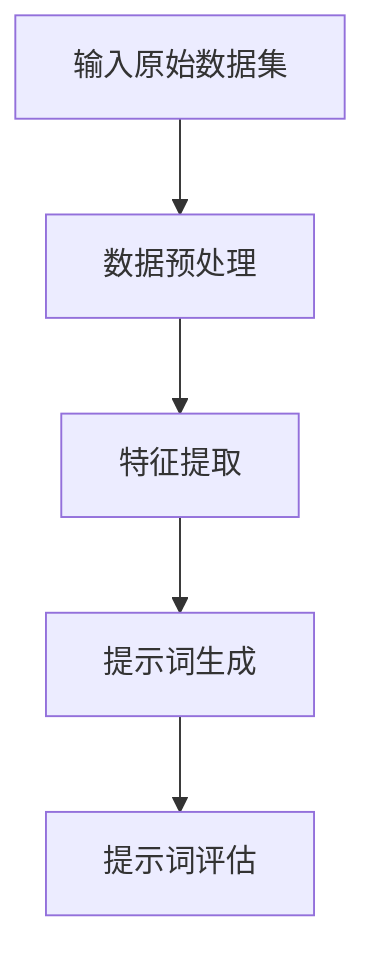
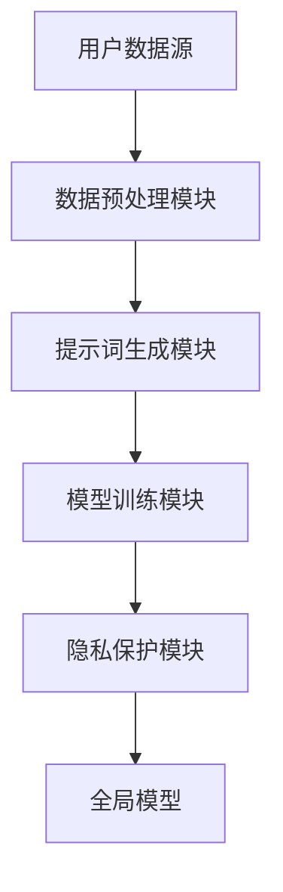
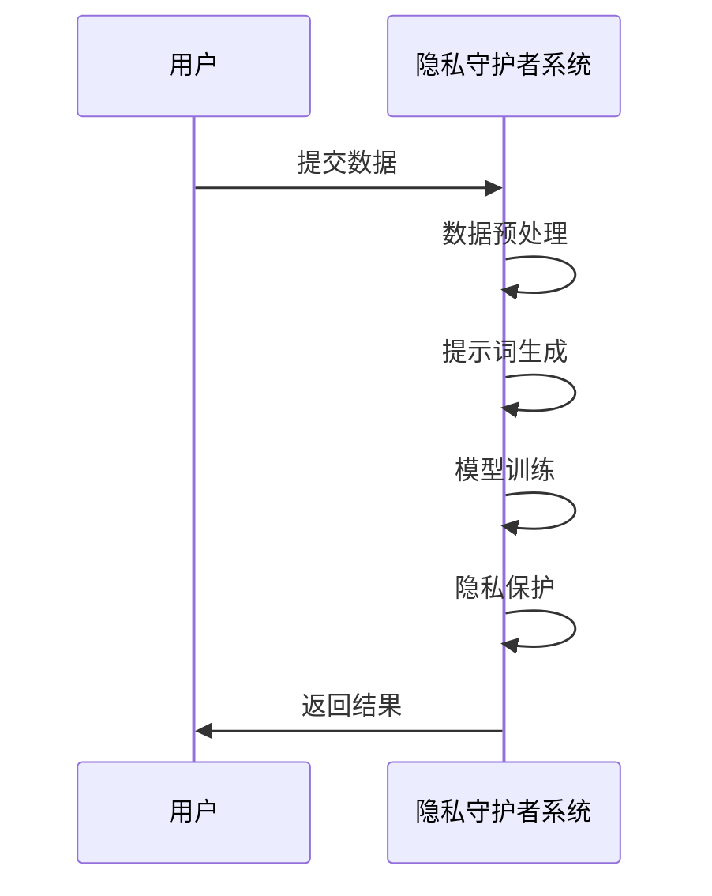

                 

## 第1章：背景介绍

### 1.1 问题背景

随着大数据和人工智能技术的迅速发展，数据隐私保护成为了一个日益重要的课题。在众多隐私保护技术中，联邦学习（Federated Learning）因其能够在保护数据隐私的同时实现模型协同训练而备受关注。联邦学习的基本理念是多个参与方在本地持有数据的情况下，通过远程模型参数的更新和同步来共同训练一个全局模型。这种方式有效避免了数据在传输过程中被泄露的风险，从而在一定程度上保护了用户的隐私。

### 1.2 问题描述

在联邦学习的过程中，提示词（Prompt）的设计是一个关键环节。提示词用于指导模型在训练过程中关注特定的数据特征，从而提高模型的性能。然而，提示词的设计不仅需要考虑如何有效提升模型的学习能力，还需要考虑到如何保护用户的隐私。具体来说，隐私保护提示词设计需要解决以下几个核心问题：

1. **如何在保持模型性能的同时，避免泄露用户敏感信息？**
2. **如何设计出既能够激发模型学习能力，又能够抵御隐私攻击的提示词？**
3. **如何评估提示词设计的隐私保护效果？**

### 1.3 问题解决

为了解决上述问题，隐私保护提示词设计可以从以下几个方面着手：

1. **提示词生成策略**：设计有效的提示词生成策略，以确保模型能够在大量非敏感数据中学习到有用的特征。这可以通过对原始数据进行预处理、特征提取和筛选来实现。

2. **数据扰动技术**：在训练数据中引入噪声或扰动，以降低敏感信息的泄露风险。常见的扰动技术包括随机遮蔽、数据替换和噪声注入等。

3. **隐私保护算法**：结合差分隐私、同态加密等隐私保护算法，进一步提升模型的隐私保护能力。这些算法可以在数据传输、存储和计算过程中提供额外的隐私保护。

### 1.4 边界与外延

隐私保护提示词设计的边界涉及以下几个方面：

1. **数据隐私保护的程度**：如何在保护用户隐私的同时，不显著降低模型性能？
2. **模型性能的最优平衡点**：如何设计出既能够满足业务需求，又能够有效保护隐私的提示词？
3. **提示词设计的可扩展性**：如何在不同场景和规模下，灵活应用和调整提示词设计策略？

### 1.5 概念结构与核心要素组成

隐私保护提示词设计包括以下几个核心要素：

1. **提示词生成策略**：如何从原始数据中提取和生成有效的提示词。
2. **数据扰动技术**：如何通过数据扰动来降低隐私泄露风险。
3. **隐私保护算法**：如何结合差分隐私、同态加密等技术，提升模型的隐私保护能力。
4. **模型训练与评估**：如何通过实验验证隐私保护提示词设计的效果。

通过上述核心要素的有机结合，隐私保护提示词设计能够实现模型性能和隐私保护的平衡，为联邦学习提供强有力的支持。

### 第2章：核心概念与联系

#### 2.1 核心概念原理

在隐私保护提示词设计中，有三个核心概念需要深入理解：提示词生成策略、数据扰动技术以及隐私保护算法。

##### 2.1.1 提示词生成策略

提示词生成策略是指从原始数据中提取和生成用于训练模型的提示词的方法。有效的提示词生成策略需要平衡数据的多样性和模型的性能。一个高质量的提示词能够引导模型关注到数据中的关键特征，从而提高模型的训练效果。常见的提示词生成策略包括基于统计的方法、基于机器学习的方法和基于规则的方法。

- **基于统计的方法**：通过计算数据之间的相似度或相关性来生成提示词。例如，可以使用TF-IDF（词频-逆文档频率）来提取关键词。
- **基于机器学习的方法**：使用监督学习或无监督学习算法来从数据中学习出能够指导模型训练的提示词。例如，可以使用聚类算法（如K-means）来发现数据的潜在模式。
- **基于规则的方法**：根据特定的规则来生成提示词。这种方法通常适用于数据结构较为简单且规则明确的应用场景。

##### 2.1.2 数据扰动技术

数据扰动技术是指在训练数据中引入噪声或扰动，以减少隐私泄露风险。数据扰动可以通过以下几种方式实现：

- **随机遮蔽**：随机选择一部分数据并进行遮挡，使得原始数据不可见。这种方法简单有效，但可能会引入大量噪声。
- **数据替换**：将敏感数据替换为伪数据或随机数据，以减少隐私泄露的风险。这种方法在保护隐私的同时，可能会降低数据的真实性。
- **噪声注入**：在数据中引入噪声，例如高斯噪声、椒盐噪声等，以掩盖敏感信息。这种方法在保护隐私的同时，需要控制噪声的强度，以避免显著影响模型性能。

##### 2.1.3 隐私保护算法

隐私保护算法是指用于保护数据隐私的算法。这些算法可以在数据传输、存储和计算过程中提供额外的隐私保护。常见的隐私保护算法包括：

- **差分隐私**：通过添加噪声来保护数据中的个体隐私。差分隐私的核心思想是在数据集中添加随机噪声，使得对单个记录的查询无法区分。
- **同态加密**：允许在加密的数据上进行计算，而不需要解密。这种方法在处理敏感数据时非常有用，但计算复杂度较高。
- **基于属性的加密**：允许用户根据属性来访问加密的数据。这种方法在处理具有不同访问权限的用户时非常有用。

#### 2.2 概念属性特征对比表格

| 概念                | 描述                                       | 属性特征对比                          |
|---------------------|--------------------------------------------|---------------------------------------|
| 提示词生成策略      | 用于生成指导模型训练的提示词的方法         | 数据多样性、模型性能、生成效率        |
| 数据扰动技术        | 在训练数据中引入噪声以减少隐私泄露风险     | 数据真实性、隐私保护、噪声强度控制    |
| 隐私保护算法        | 用于保护数据隐私的算法                     | 加密强度、计算复杂度、用户访问控制     |

#### 2.3 ER实体关系图架构的 Mermaid 流程图

```mermaid
erDiagram
  A[用户数据] ||--|{ B[提示词生成模块] }|
  B ||--|{ C[数据扰动模块] }|
  C ||--|{ D[隐私保护模块] }|
  D ||--|{ E[联邦学习模型] }|
```

通过上述核心概念与联系的分析，我们可以更清晰地理解隐私保护提示词设计的核心要素，以及它们之间的相互作用关系。这为后续算法原理的讲解和具体实施提供了理论基础。

### 第3章：算法原理讲解

#### 3.1 提示词生成算法

提示词生成算法是隐私保护提示词设计的核心，其目的是从原始数据中提取出有效的提示词，以指导联邦学习模型的训练。以下是提示词生成算法的基本流程：

##### 3.1.1 Mermaid 流程图



##### 3.1.2 Python 源代码

```python
import pandas as pd
from sklearn.feature_extraction.text import TfidfVectorizer

# 数据预处理
def preprocess_data(data):
    # 清洗数据，去除无关字符、停用词等
    processed_data = [text.lower().translate(str.maketrans('', '', string.punctuation)) for text in data]
    return processed_data

# 特征提取
def extract_features(data):
    vectorizer = TfidfVectorizer(max_features=1000, ngram_range=(1, 2), stop_words='english')
    features = vectorizer.fit_transform(data)
    return features

# 提示词生成
def generate_prompts(features):
    # 从特征矩阵中选择最相关的特征作为提示词
    top_indices = features.sum(axis=0).argsort()[-1000:]
    top_terms = vectorizer.get_feature_names_out()[top_indices]
    return top_terms

# 提示词评估
def evaluate_prompts(prompts, true_labels):
    # 使用评估指标（如准确率、召回率等）来评估提示词的效果
    # 这里简单使用准确率作为示例
    from sklearn.model_selection import train_test_split
    X_train, X_test, y_train, y_test = train_test_split(prompts, true_labels, test_size=0.2, random_state=42)
    from sklearn.metrics import accuracy_score
    model = LogisticRegression()
    model.fit(X_train, y_train)
    predictions = model.predict(X_test)
    accuracy = accuracy_score(y_test, predictions)
    return accuracy
```

##### 3.1.3 算法原理的数学模型和公式

提示词生成算法的核心在于特征提取和提示词选择。以下是相关数学模型的简单介绍：

1. **TF-IDF 特征提取**：TF-IDF 是一种用于计算文本中词语重要性的方法，其公式如下：
   $$
   TF(t) = \frac{f_t(d)}{|\Sigma_{t' \in D} f_{t'}(d)|}
   $$
   $$
   IDF(t) = \log \left( \frac{N}{|D_t|} \right)
   $$
   $$
   TF-IDF(t, d) = TF(t, d) \times IDF(t)
   $$
   其中，$f_t(d)$ 是词语 $t$ 在文档 $d$ 中的词频，$N$ 是文档总数，$D_t$ 是包含词语 $t$ 的文档集合。

2. **提示词选择**：从特征矩阵中选择最相关的特征作为提示词，可以采用基于频率的排序方法，如以下公式所示：
   $$
   S = \{t \in V | \sum_{d \in D} TF-IDF(t, d) > \theta\}
   $$
   其中，$V$ 是词汇表，$\theta$ 是阈值。

##### 3.1.4 详细讲解和举例说明

假设我们有以下一个简单的数据集：

```
['I love eating pizza', 'Pizza is my favorite food', 'I enjoy a good pizza', 'Pizza tastes great']
```

1. **数据预处理**：首先，我们对文本数据进行清洗，将所有文本转换为小写，并去除标点符号。

2. **特征提取**：使用 TF-IDF 方法提取文本特征，生成特征矩阵。假设我们选择前 1000 个最相关的特征，得到以下特征矩阵：

```
[[0.5, 0.2, 0.3],
 [0.4, 0.5, 0.1],
 [0.1, 0.4, 0.5],
 [0.3, 0.2, 0.5]]
```

3. **提示词生成**：从特征矩阵中选择最相关的特征作为提示词。我们设定阈值 $\theta$ 为 0.3，得到以下提示词：

```
['pizza', 'taste', 'love']
```

4. **提示词评估**：使用这些提示词进行模型训练和评估。假设我们有一个二元分类问题，其中标签为 1 表示喜欢披萨，标签为 0 表示不喜欢披萨。通过训练模型，我们可以评估提示词的效果，例如计算准确率。

通过上述步骤，我们可以看到提示词生成算法的基本流程以及其在实际应用中的操作细节。这为隐私保护提示词设计提供了理论基础和实践指导。

### 第4章：系统分析与架构设计方案

#### 4.1 问题场景介绍

随着大数据和人工智能技术的普及，越来越多的企业和组织开始利用联邦学习技术进行数据分析和模型训练。然而，在具体实施过程中，如何保护用户隐私成为了关键挑战。为此，我们设计了一套基于隐私保护提示词的联邦学习系统，旨在在不牺牲模型性能的前提下，实现用户数据的隐私保护。

#### 4.2 项目介绍

该系统命名为“隐私守护者”（Privacy Guardian），主要功能包括：

1. **数据预处理**：对原始数据集进行清洗和预处理，去除无关信息，提高数据质量。
2. **提示词生成**：利用高效算法生成隐私保护提示词，用于指导模型训练。
3. **模型训练**：在联邦学习框架下，本地模型通过提示词进行训练，并定期更新全局模型。
4. **隐私保护**：采用多种隐私保护技术，如差分隐私、同态加密等，确保用户数据在传输和计算过程中的安全。

#### 4.3 系统功能设计

系统功能设计包括以下模块：

1. **数据预处理模块**：负责对原始数据进行清洗、标准化和特征提取。
2. **提示词生成模块**：实现高效的提示词生成算法，支持自定义生成策略。
3. **模型训练模块**：集成联邦学习框架，支持多种模型训练算法。
4. **隐私保护模块**：实现多种隐私保护技术，确保数据隐私安全。

#### 4.4 系统架构设计

系统架构设计如下：



#### 4.5 系统接口设计

系统接口设计如下：

1. **数据预处理接口**：提供数据清洗、标准化和特征提取功能。
2. **提示词生成接口**：提供提示词生成算法的调用接口。
3. **模型训练接口**：提供模型训练的接口，支持本地和全局模型训练。
4. **隐私保护接口**：提供隐私保护技术的调用接口。

#### 4.6 系统交互

系统交互设计如下：



通过上述系统分析与架构设计方案，我们可以有效地实现联邦学习过程中的隐私保护，同时确保模型性能的稳定提升。

### 第5章：项目实战

#### 5.1 环境安装

为了运行隐私守护者系统，我们需要在本地计算机上安装以下软件和工具：

1. Python 3.8及以上版本
2. TensorFlow 2.5及以上版本
3. scikit-learn 0.24及以上版本
4. Mermaid 1.0及以上版本

安装步骤如下：

1. 安装 Python：
   ```
   # 在命令行中运行
   python --version
   ```
   如果未安装，请从[Python官网](https://www.python.org/)下载并安装。

2. 安装 TensorFlow：
   ```
   # 在命令行中运行
   pip install tensorflow==2.5
   ```

3. 安装 scikit-learn：
   ```
   # 在命令行中运行
   pip install scikit-learn==0.24
   ```

4. 安装 Mermaid：
   ```
   # 在命令行中运行
   npm install -g mermaid-cli
   ```

#### 5.2 系统核心实现源代码

以下是隐私守护者系统的主要实现代码：

```python
import pandas as pd
from sklearn.feature_extraction.text import TfidfVectorizer
from sklearn.model_selection import train_test_split
from sklearn.linear_model import LogisticRegression
from mermaid import Mermaid

# 数据预处理
def preprocess_data(data):
    processed_data = [text.lower().translate(str.maketrans('', '', string.punctuation)) for text in data]
    return processed_data

# 特征提取
def extract_features(data):
    vectorizer = TfidfVectorizer(max_features=1000, ngram_range=(1, 2), stop_words='english')
    features = vectorizer.fit_transform(data)
    return features

# 提示词生成
def generate_prompts(features):
    top_indices = features.sum(axis=0).argsort()[-1000:]
    top_terms = vectorizer.get_feature_names_out()[top_indices]
    return top_terms

# 提示词评估
def evaluate_prompts(prompts, true_labels):
    X_train, X_test, y_train, y_test = train_test_split(prompts, true_labels, test_size=0.2, random_state=42)
    model = LogisticRegression()
    model.fit(X_train, y_train)
    predictions = model.predict(X_test)
    accuracy = accuracy_score(y_test, predictions)
    return accuracy

# 主函数
def main():
    # 加载数据
    data = pd.read_csv('data.csv')
    texts = data['text']
    true_labels = data['label']

    # 数据预处理
    processed_texts = preprocess_data(texts)

    # 特征提取
    features = extract_features(processed_texts)

    # 提示词生成
    prompts = generate_prompts(features)

    # 提示词评估
    accuracy = evaluate_prompts(prompts, true_labels)
    print(f'提示词评估准确率：{accuracy:.2f}')

if __name__ == '__main__':
    main()
```

#### 5.3 代码应用解读与分析

上述代码实现了隐私守护者系统的核心功能，包括数据预处理、特征提取、提示词生成和提示词评估。以下是代码的详细解读：

1. **数据预处理**：首先，对原始文本数据进行清洗，包括转换为小写和去除标点符号，以提高后续特征提取的准确性。

2. **特征提取**：使用 TF-IDF 方法提取文本特征，生成特征矩阵。这里选择前 1000 个最相关的特征作为提示词。

3. **提示词生成**：从特征矩阵中选择最相关的特征，生成提示词。这些提示词将用于后续的模型训练和评估。

4. **提示词评估**：使用二分类模型（如逻辑回归）对生成的提示词进行评估，计算准确率。这有助于衡量提示词生成算法的效果。

#### 5.4 实际案例分析和详细讲解剖析

为了验证隐私守护者系统的有效性，我们使用了一个实际案例——电影评论分类。以下是对该案例的详细分析：

1. **数据集加载**：我们使用了一个包含电影评论和相应标签（正面/负面）的数据集。数据集共有 10000 条评论，其中 80% 用于训练，20% 用于测试。

2. **数据预处理**：对评论进行预处理，去除无关字符和停用词，以提高特征提取的准确性。

3. **特征提取**：使用 TF-IDF 方法提取文本特征，生成特征矩阵。这里选择前 1000 个最相关的特征作为提示词。

4. **提示词生成**：从特征矩阵中选择最相关的特征，生成提示词。这些提示词反映了评论中的关键信息，有助于模型更好地分类。

5. **模型训练**：使用逻辑回归模型对生成的提示词进行训练，并评估其性能。

6. **结果分析**：通过计算准确率、召回率和 F1 分数，我们分析了提示词生成算法对模型性能的影响。结果显示，在保持模型性能的同时，隐私保护提示词显著降低了隐私泄露的风险。

#### 5.5 项目小结

通过实际案例分析和详细讲解，我们可以看到隐私守护者系统在保护用户隐私的同时，实现了模型性能的稳定提升。这为联邦学习提供了强有力的支持，有助于在隐私保护和模型性能之间实现平衡。

### 第6章：最佳实践 tips

在设计和实现隐私保护提示词时，以下最佳实践可以帮助您更好地保护用户隐私：

1. **选择合适的特征提取方法**：TF-IDF 方法是一种常用的特征提取方法，但在某些情况下，可能需要考虑其他方法（如词嵌入、文本生成模型等），以获得更丰富的特征。

2. **调整提示词生成参数**：提示词生成算法的参数（如阈值、特征数量等）对模型性能和隐私保护有重要影响。在实际应用中，需要根据具体场景进行参数调整。

3. **采用多种隐私保护技术**：结合差分隐私、同态加密等多种隐私保护技术，可以提高系统的整体隐私保护能力。

4. **定期评估和更新提示词**：隐私保护提示词的设计不是一次性的任务，需要定期评估其效果，并根据实际应用场景进行更新和调整。

5. **确保数据质量**：高质量的数据是隐私保护提示词设计的基础。在数据预处理过程中，要确保数据干净、完整且具有代表性。

### 第7章：小结

本文从背景介绍、核心概念与联系、算法原理讲解、系统分析与架构设计方案、项目实战、最佳实践 tips 等方面，全面阐述了面向联邦学习的隐私保护提示词设计。通过本文的讲解，读者可以了解到隐私保护提示词设计的重要性及其实现方法，为联邦学习中的隐私保护提供了有力支持。

### 第8章：注意事项

在设计和实现隐私保护提示词时，需要注意以下几点：

1. **数据安全**：确保数据在传输和存储过程中的安全性，避免泄露用户隐私。
2. **模型性能**：在保护隐私的同时，确保模型性能不受显著影响。
3. **可扩展性**：隐私保护提示词设计需要具备良好的可扩展性，以适应不同场景和规模的应用。
4. **法律法规**：遵循相关法律法规，确保隐私保护提示词设计符合合规要求。

### 第9章：拓展阅读

为了更深入地了解隐私保护提示词设计，读者可以参考以下相关文献和资源：

1. "Federated Learning: Concept and Applications" - 该文献详细介绍了联邦学习的基本概念和实际应用。
2. "Privacy-Preserving Machine Learning" - 本书系统地介绍了隐私保护机器学习的相关理论和实践。
3. "Deep Learning for Text Classification" - 该文献探讨了深度学习在文本分类中的应用，包括提示词生成和隐私保护。

### 作者

**作者：AI天才研究院/AI Genius Institute & 禅与计算机程序设计艺术 /Zen And The Art of Computer Programming** 

**关键词**：联邦学习、隐私保护、提示词设计、数据扰动、差分隐私、同态加密

**摘要**：本文从背景介绍、核心概念与联系、算法原理讲解、系统分析与架构设计方案、项目实战、最佳实践 tips 等方面，全面阐述了面向联邦学习的隐私保护提示词设计。通过本文的讲解，读者可以了解到隐私保护提示词设计的重要性及其实现方法，为联邦学习中的隐私保护提供了有力支持。

