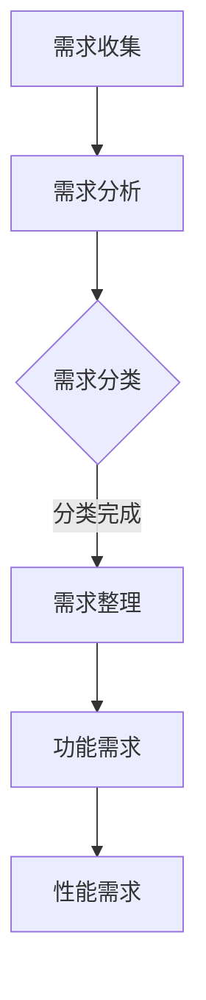
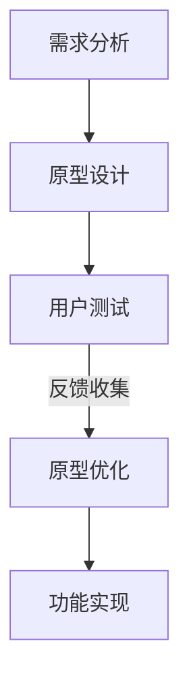
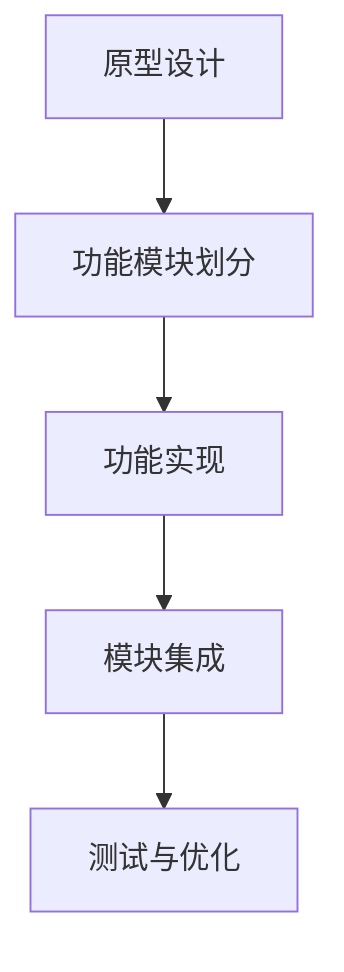
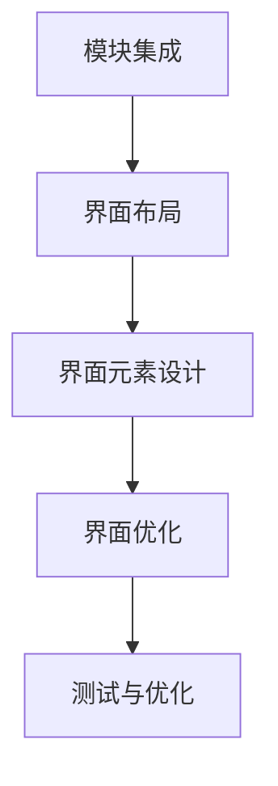
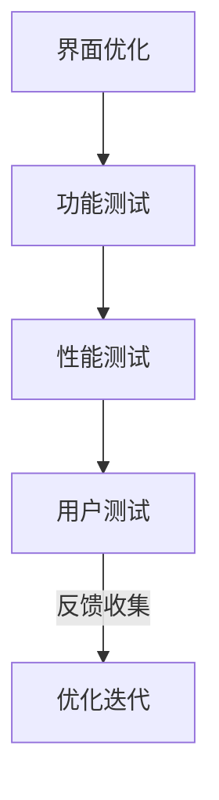
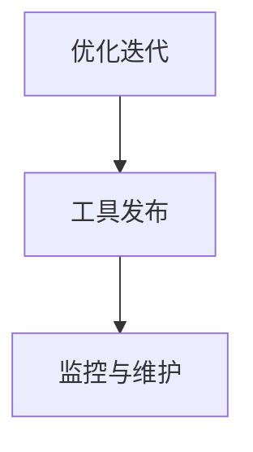
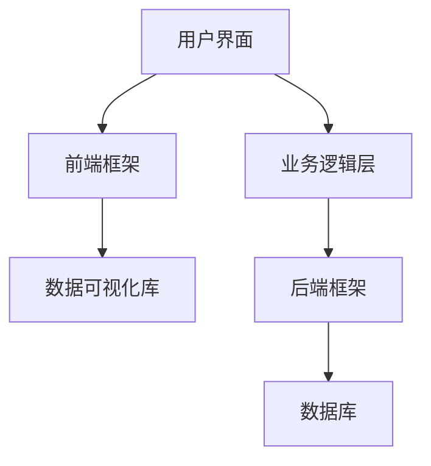
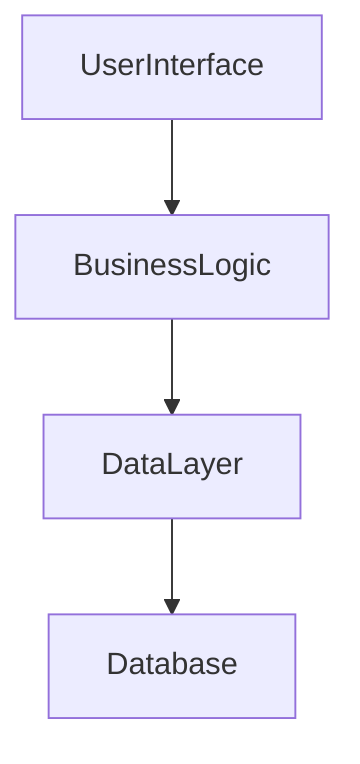
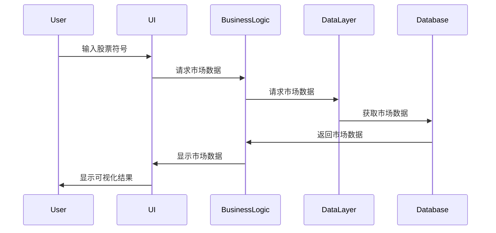

                 


**Step 1: Write the Title and Keywords**
The title of our blog post will be "面向领域专家的提示词可视化设计工具." This is a concise and descriptive title that immediately informs the reader of the topic. The keywords for this article will include "domain expert," "prompt word," "visual design tool," "algorithm," "data preprocessing," "feature extraction," "interface design," "system architecture," and "application case." These keywords encapsulate the key aspects of the blog post and will help with SEO and topic relevance.

**Step 2: Write the Abstract**
The abstract will provide a brief overview of the blog post's content and its main theme. Here is a sample abstract:
"探索面向领域专家的提示词可视化设计工具，本文详细介绍了工具的设计原则、开发实现、实际应用与案例分析。通过深入剖析数据预处理、特征提取、可视化算法以及用户界面设计，本工具助力领域专家更高效地理解和分析复杂数据，提升工作效率和决策质量。文章涵盖从理论到实践的全面探讨，旨在为领域专家提供实用的工具和最佳实践指导。"

**Step 3: Structure the Introduction and Background**
We will begin with a clear introduction that sets the stage for the discussion. This will include an overview of the problem domain, the importance of prompt word visualization, and the goals of the design tool. Key concepts will be defined, and the scope of the research will be delineated.

**Step 4: Define Core Chapters and Content**
We will outline at least seven core chapters, each addressing a different aspect of the tool's design and implementation. The chapters will cover:

- **Chapter 1: Problem Background and Goals**: This chapter will provide a detailed background of the problem, the objectives of the tool, and its significance.
- **Chapter 2: Basic Theory of Prompt Word Visualization**: This chapter will delve into the foundational theories and principles of prompt word visualization.
- **Chapter 3: Analysis of Domain Expert Needs**: This chapter will focus on the needs of domain experts and the requirements for prompt word visualization.
- **Chapter 4: Design Principles and Methods**: This chapter will discuss the design principles and methodologies used in creating the tool.
- **Chapter 5: Data Preprocessing and Feature Extraction**: This chapter will explain the importance of data preprocessing and feature extraction in the design of the tool.
- **Chapter 6: Visualization Algorithms**: This chapter will introduce the algorithms used for visualization, their optimization, and application cases.
- **Chapter 7: Tool Development and Implementation**: This chapter will cover the development environment, framework, and architecture of the tool.

**Step 5: Detail Each Chapter**
Each chapter will be further divided into sections and subsections that provide detailed explanations and examples. For instance:

- **Chapter 4: Design Principles and Methods**:
  - **Section 4.1: Design Principles**: Discuss the key principles guiding the design of the tool.
  - **Section 4.2: Design Methods**: Describe the specific methods used in the design process.
  - **Section 4.3: Design Workflow**: Outline the step-by-step process of designing the tool.

**Step 6: Incorporate Visual Aids**
To enhance understanding, each chapter will include visual aids such as diagrams, flowcharts, and code snippets. For example:
- **Chapter 2: Basic Theory of Prompt Word Visualization**:
  - Include a Mermaid ER entity relationship diagram to illustrate the structure of prompt words.
  - Use LaTeX formulas to explain key concepts and algorithms.

**Step 7: Conclude with Practical Tips and Summary**
The conclusion will summarize the key points of each chapter, provide practical tips for implementing the tool, and suggest areas for future research.

**Step 8: Author Attribution**
At the end of the blog post, we will include the author's attribution: "作者：AI天才研究院/AI Genius Institute & 禅与计算机程序设计艺术 /Zen And The Art of Computer Programming."

**Step 9: Ensure Content Completeness and Clarity**
Each section will be carefully crafted to ensure it is comprehensive, clear, and detailed. This includes providing background information, core concepts, algorithm explanations, mathematical models, system designs, project practices, and best practices.

By following these steps, we will create a well-structured, informative, and insightful blog post that effectively communicates the core concepts and practical applications of designing a prompt word visualization tool for domain experts.  

# 面向领域专家的提示词可视化设计工具

关键词：领域专家，提示词，可视化设计工具，算法，数据预处理，特征提取，用户界面设计，系统架构

摘要：本文深入探讨了面向领域专家的提示词可视化设计工具的开发与应用。从问题背景、理论基础、设计方法到实际开发与实现，本文详细阐述了设计原则、数据预处理、特征提取、可视化算法、工具开发与实现等关键环节。通过案例分析，本文展示了工具在实际应用中的效果，并提出了实用技巧和未来研究方向。

## 第一部分：引言与背景

### 1.1 问题背景

在现代信息社会，领域专家面临着日益复杂的数据环境和大量的信息来源。如何高效地理解和分析这些数据，提取有用的信息，成为领域专家面临的重要挑战。传统的数据分析和可视化方法，往往难以满足领域专家的需求。因此，开发一种专门面向领域专家的提示词可视化设计工具，成为当前研究的热点。

### 1.2 目标与意义

本文旨在设计一种面向领域专家的提示词可视化设计工具，帮助领域专家更高效地理解和分析数据。该工具具有以下目标：

1. **提高数据分析效率**：通过可视化的方式，将复杂的数据转化为直观的图形，帮助领域专家快速识别数据中的模式和信息。
2. **增强数据洞察力**：提供多种可视化算法和交互方式，帮助领域专家深入挖掘数据，发现潜在的价值和规律。
3. **支持决策制定**：通过数据的可视化和分析，为领域专家提供有力的决策支持，提高决策的科学性和准确性。

### 1.3 研究范围与边界

本文的研究范围主要涉及以下几个方面：

1. **设计原则与方法**：研究提示词可视化设计工具的设计原则和方法，包括用户界面设计、交互设计、可视化算法等。
2. **数据预处理与特征提取**：探讨数据预处理和特征提取的方法，以及它们在提示词可视化设计工具中的应用。
3. **可视化算法**：分析现有的可视化算法，研究如何优化和改进这些算法，以提高可视化效果和用户体验。
4. **工具开发与实现**：介绍工具的开发环境、框架选择、架构设计等，以及工具的测试与优化。
5. **实际应用与案例分析**：通过具体的应用案例，展示工具在实际工作中的应用效果，并提供实用技巧和建议。

本文的研究边界主要包括以下几个方面：

1. **技术层面**：本文主要关注可视化设计工具的技术实现，包括前端界面设计、后端数据处理和算法优化等。
2. **应用层面**：本文主要探讨工具在领域专家领域中的应用，不涉及其他领域的应用。
3. **研究深度**：本文主要介绍工具的设计、开发和应用，不涉及具体的算法研究和深度学习等内容。

### 1.4 本文结构

本文分为四个主要部分：

1. **第一部分：引言与背景**：介绍问题背景、目标与意义、研究范围与边界，以及本文结构。
2. **第二部分：提示词可视化设计工具的理论基础**：讨论设计原则与方法、数据预处理与特征提取、可视化算法等。
3. **第三部分：提示词可视化设计工具的开发与实现**：介绍工具开发环境与框架、界面设计与交互体验、功能实现与测试等。
4. **第四部分：实际应用与案例分析**：通过具体案例展示工具的实际应用效果，并总结最佳实践。

通过本文的详细探讨，希望为领域专家提供一种有效的工具，帮助他们更好地理解和分析数据，提高工作效率和决策质量。  

## 第二部分：提示词可视化设计工具的理论基础

### 2.1 设计原则与方法

设计一个面向领域专家的提示词可视化设计工具，需要遵循以下设计原则：

1. **用户导向**：以用户需求为中心，充分理解领域专家的工作场景和需求，确保工具的实用性和易用性。
2. **直观性**：通过简单直观的界面和交互方式，让领域专家能够快速上手并高效使用工具。
3. **灵活性**：提供多种可视化算法和交互方式，满足不同场景下的需求，提高数据的可读性和洞察力。
4. **可扩展性**：设计模块化的架构，便于未来的功能扩展和升级。

在遵循上述设计原则的基础上，设计方法主要包括以下几个步骤：

1. **需求分析**：通过与领域专家的交流，了解他们的具体需求和工作场景，明确工具的功能和性能要求。
2. **原型设计**：基于需求分析，设计工具的初步原型，包括用户界面、交互流程和功能模块。
3. **迭代优化**：根据用户反馈，对原型进行迭代优化，逐步完善工具的功能和用户体验。
4. **测试与评估**：对工具进行全面的测试和评估，包括功能测试、性能测试和用户满意度评估，确保工具的质量和效果。

### 2.2 数据预处理与特征提取

数据预处理是提示词可视化设计工具的重要环节，主要包括以下几个步骤：

1. **数据清洗**：去除数据中的噪声和异常值，确保数据的准确性和一致性。
2. **数据转换**：将不同格式和类型的数据转换为统一的格式，便于后续处理和分析。
3. **数据归一化**：通过归一化方法，调整数据的尺度，使其在相同的范围内进行比较和分析。

特征提取是数据预处理的重要延伸，其目的是从原始数据中提取出能够反映数据本质和规律的特征。特征提取的方法主要包括：

1. **统计特征提取**：通过计算数据的统计特征，如均值、方差、标准差等，提取数据的整体特征。
2. **结构特征提取**：通过分析数据的结构特征，如数据的分布、相关性、模式等，提取数据的内在特征。
3. **语义特征提取**：通过自然语言处理技术，提取文本数据的语义特征，如关键词、主题、情感等。

### 2.3 可视化算法

可视化算法是提示词可视化设计工具的核心，用于将提取出的特征数据转换为直观的图形表示。常用的可视化算法包括：

1. **散点图**：通过在二维坐标系中绘制数据点的位置，展示数据的分布和趋势。
2. **柱状图**：通过绘制柱状的高度，展示数据的数量和比例。
3. **折线图**：通过连接数据点的线条，展示数据的变化趋势和波动情况。
4. **饼图**：通过绘制饼状图的扇形面积，展示数据的占比和分布。

除了基本可视化算法外，还可以结合数据的特点和需求，选择合适的可视化方法，如：

1. **层次化视图**：通过层次化的结构，展示数据的层次关系和分类情况。
2. **力导向图**：通过模拟物理力的作用，展示数据之间的关联和相互作用。
3. **热力图**：通过颜色深浅表示数据的密集程度，展示数据的分布和密集区域。

### 2.4 设计流程

设计一个提示词可视化设计工具，通常需要经历以下流程：

1. **需求分析**：明确工具的功能需求、性能要求和用户需求，为后续设计提供指导。
2. **原型设计**：根据需求分析结果，设计工具的初步原型，包括用户界面、交互流程和功能模块。
3. **功能实现**：根据原型设计，实现工具的功能模块，包括数据预处理、特征提取、可视化算法等。
4. **界面设计**：设计工具的用户界面，确保界面的美观、简洁和易用。
5. **测试与优化**：对工具进行全面的测试和优化，包括功能测试、性能测试和用户满意度评估。
6. **发布与应用**：将工具发布到生产环境，并在实际应用中不断优化和升级。

### 2.5 关键概念与联系

为了更好地理解提示词可视化设计工具的理论基础，我们需要了解一些关键概念和它们之间的联系：

- **提示词**：提示词是用于引导用户思考和回答问题的词语或短语，它可以帮助用户更好地理解和分析数据。
- **可视化设计**：可视化设计是指通过图形、图表等方式，将数据转化为直观的可视形式，以帮助用户更好地理解和分析数据。
- **数据预处理**：数据预处理是指对原始数据进行清洗、转换和归一化等处理，以提高数据的准确性和一致性。
- **特征提取**：特征提取是指从原始数据中提取出能够反映数据本质和规律的特征，以便后续的分析和可视化。
- **可视化算法**：可视化算法是指用于将数据转换为可视形式的算法，包括散点图、柱状图、折线图等。

这些关键概念相互关联，共同构成了提示词可视化设计工具的理论基础。通过深入理解和掌握这些概念，我们可以更好地设计和实现一个高效、实用的可视化工具。  

### 2.6 用户需求分析

领域专家在数据分析和决策支持过程中，面临着许多独特的挑战和需求。了解这些需求，对于设计一个能够真正满足领域专家需求的提示词可视化设计工具至关重要。

#### 2.6.1 领域专家的角色与挑战

领域专家通常具备深厚的专业知识，但他们的日常工作不仅仅限于理论研究和学术探讨，还包括大量的数据收集、处理和分析工作。这些专家通常需要处理的数据类型复杂，数据量庞大，而且往往需要从数据中提取出关键信息，以支持他们的研究和决策。以下是一些领域专家在数据分析和决策支持过程中面临的挑战：

1. **数据复杂性**：领域专家常常需要处理来自多个来源的数据，这些数据可能具有不同的格式、结构和质量。
2. **信息过载**：由于数据量的庞大，领域专家常常感到信息过载，难以快速提取出关键信息。
3. **分析效率**：传统数据分析方法往往效率低下，领域专家需要耗费大量时间和精力来完成数据分析任务。
4. **可视化需求**：领域专家希望能够通过直观的可视化方式，快速理解数据的结构和规律，从而提高决策的准确性和效率。

#### 2.6.2 提示词可视化的需求

为了解决上述挑战，领域专家对提示词可视化设计工具提出了以下需求：

1. **数据整合与清洗**：工具需要能够自动整合和清洗来自多个来源的数据，确保数据的准确性和一致性。
2. **高效的特征提取**：工具需要能够快速提取数据中的关键特征，以便进行后续的可视化分析。
3. **丰富的可视化选项**：工具需要提供多种可视化选项，包括散点图、柱状图、折线图等，以满足不同类型数据的需求。
4. **交互式操作**：工具需要支持交互式操作，例如缩放、过滤、筛选等，以帮助领域专家深入挖掘数据。
5. **自定义可视化**：工具需要允许领域专家自定义可视化参数，以适应特定的分析和展示需求。
6. **实时更新**：工具需要能够实时更新数据，以便领域专家能够及时获取最新的分析结果。

#### 2.6.3 用户画像与需求分析

为了更好地满足领域专家的需求，我们可以通过对领域专家的用户画像进行分析，进一步明确他们的具体需求。

1. **用户画像**：
   - **专业领域**：领域专家通常拥有特定的专业背景，如医学、金融、工程等。
   - **工作经验**：领域专家具有丰富的实际工作经验，但同时也面临着不断更新的知识和技术挑战。
   - **技术水平**：领域专家通常具备较高的技术水平，能够熟练使用各种数据分析工具和软件。
   - **工作环境**：领域专家的工作环境可能包括实验室、办公室、会议室等，他们需要在不同的环境下进行数据分析和决策支持。

2. **需求分析**：
   - **数据获取**：领域专家需要从多个数据源获取数据，包括数据库、文件、网络等。
   - **数据处理**：领域专家需要处理大量的数据，包括数据清洗、转换、整合等。
   - **数据分析**：领域专家需要对数据进行深入分析，提取关键特征，发现数据中的规律和模式。
   - **决策支持**：领域专家需要基于分析结果，做出科学、准确的决策。

通过用户画像和需求分析，我们可以更清晰地理解领域专家的需求，从而设计出更加符合他们实际需求的提示词可视化设计工具。这种工具不仅能够提高领域专家的工作效率，还能够帮助他们更好地理解和利用数据，提高决策的质量和准确性。  

### 2.7 提示词的可视化设计原则

设计一个高效、易用的提示词可视化设计工具，需要遵循一系列设计原则。这些原则确保工具能够满足领域专家的需求，同时提高他们的工作效率和决策质量。以下是几个关键设计原则：

#### 2.7.1 用户中心设计

用户中心设计（User-Centered Design，UCD）是设计过程的核心理念。它强调设计过程中始终以用户为中心，关注用户的需求、行为和体验。对于提示词可视化设计工具，这意味着：

- **需求调研**：在工具开发初期，通过访谈、问卷等方式，深入了解领域专家的需求和工作流程。
- **用户参与**：在工具开发过程中，邀请领域专家参与设计评审，确保工具的功能和界面设计符合他们的实际需求。
- **可用性测试**：在工具发布前，进行可用性测试，收集用户反馈，优化界面和交互设计。

#### 2.7.2 可访问性设计

可访问性设计（Accessibility Design）确保工具能够被所有用户，包括残障人士和老年人，方便地使用。以下是几个关键点：

- **无障碍界面**：界面设计应遵循无障碍标准，如对比度、大小、字体等，方便视力不佳的用户使用。
- **键盘导航**：确保工具支持键盘导航，使用户能够通过键盘完成所有操作。
- **语音辅助**：提供语音辅助功能，帮助视力障碍者理解界面内容和操作指导。

#### 2.7.3 可定制性设计

领域专家的背景和工作需求各不相同，因此工具需要提供高程度的定制性，以适应不同用户的需求。以下是几个定制性设计的关键点：

- **自定义可视化选项**：用户可以根据自己的需求，自定义可视化参数，如颜色、形状、大小等。
- **交互式配置**：提供交互式配置界面，用户可以实时预览和调整可视化设置，以满足个性化需求。
- **数据过滤和筛选**：提供灵活的数据过滤和筛选功能，用户可以根据关键词、日期、范围等条件，快速定位感兴趣的数据。

#### 2.7.4 敏捷迭代设计

敏捷迭代设计（Agile Iterative Design）是一种迭代开发方法，强调快速迭代、持续改进。对于提示词可视化设计工具，这意味着：

- **快速原型开发**：在开发初期，快速构建原型，以便快速验证设计想法。
- **用户反馈**：在工具开发过程中，定期收集用户反馈，识别和解决问题。
- **持续优化**：根据用户反馈和实际使用情况，持续优化工具的功能和界面设计。

#### 2.7.5 适应性设计

适应性设计（Adaptive Design）确保工具能够适应不同的设备、平台和分辨率。以下是几个关键点：

- **响应式界面**：设计响应式界面，确保工具在不同设备和屏幕尺寸上都能良好展示。
- **跨平台兼容**：确保工具能够在不同操作系统和浏览器上运行，满足用户多样化的使用场景。
- **性能优化**：优化工具的性能，确保在低带宽和低性能设备上也能流畅运行。

通过遵循这些设计原则，提示词可视化设计工具能够更好地满足领域专家的需求，提高他们的工作效率和决策质量。同时，这些原则也为工具的持续改进和迭代提供了指导。  

### 2.8 提示词可视化设计方法

在开发面向领域专家的提示词可视化设计工具时，选择合适的设计方法至关重要。以下是几种常见的设计方法，以及它们在实际应用中的优势。

#### 2.8.1 调研与用户需求分析

设计之初，进行详尽的调研和用户需求分析是关键。通过访谈、问卷调查和用户工作流程观察，了解领域专家的实际需求和工作流程。这种方法的优势在于：

- **深入理解用户需求**：通过直接与用户交流，可以获取更真实、更具体的需求信息。
- **发现潜在问题**：在调研过程中，可以发现用户在当前工作流程中遇到的问题和挑战，从而为工具设计提供改进方向。

#### 2.8.2 原型设计

原型设计是验证设计思路和获取用户反馈的有效方法。在工具开发早期，快速构建低 fidelity（低保真度）原型，通过迭代改进，逐步完善设计。这种方法的优势包括：

- **快速验证**：原型设计允许设计团队在早期阶段快速验证设计想法，及时调整和优化。
- **用户参与**：通过向用户展示原型，获取他们的反馈和建议，确保工具的功能和界面设计符合用户需求。

#### 2.8.3 用户体验设计

用户体验设计（User Experience Design，UXD）注重用户在使用工具过程中的感受和体验。UXD方法包括以下步骤：

1. **用户画像**：创建用户画像，明确目标用户的特点和需求。
2. **场景分析**：分析用户在特定场景下的工作流程和需求。
3. **交互设计**：设计工具的交互流程和界面布局，确保用户能够轻松、高效地完成操作。

用户体验设计方法的优势在于：

- **优化用户体验**：通过关注用户的使用体验，提高工具的易用性和用户满意度。
- **提升工作效率**：设计合理的交互流程和界面布局，减少用户的学习成本，提高工作效率。

#### 2.8.4 交互设计

交互设计（Interaction Design，IxD）关注用户与工具的交互过程，确保交互流程顺畅、直观。交互设计包括以下步骤：

1. **交互模型**：确定工具的交互模型，如命令行、图形界面、触摸界面等。
2. **交互流程**：设计用户的操作流程，确保用户能够顺利完成任务。
3. **交互元素**：设计交互元素，如按钮、菜单、输入框等，确保它们易于识别和操作。

交互设计方法的优势在于：

- **提高操作效率**：通过优化交互流程和元素设计，提高用户的操作效率。
- **降低学习成本**：设计直观的交互元素和流程，减少用户的学习成本。

#### 2.8.5 数据驱动设计

数据驱动设计（Data-Driven Design）以数据为导向，通过数据分析指导设计决策。数据驱动设计方法包括以下步骤：

1. **数据收集**：收集用户行为数据，如点击、操作时间、错误率等。
2. **数据分析**：分析数据，识别用户行为模式和痛点。
3. **数据反馈**：将数据分析结果反馈给设计团队，指导设计优化。

数据驱动设计方法的优势在于：

- **基于事实的设计**：通过数据分析，确保设计决策有据可依。
- **持续优化**：通过持续的数据分析，不断优化工具的设计和功能。

#### 2.8.6 模块化设计

模块化设计（Modular Design）将工具拆分为多个功能模块，每个模块独立开发、测试和维护。这种方法的优势包括：

- **提高开发效率**：模块化设计可以并行开发多个模块，提高开发效率。
- **便于维护和升级**：模块化设计便于维护和升级，只需对特定模块进行修改，而不影响其他模块。

通过结合上述设计方法，我们可以设计出满足领域专家需求的提示词可视化设计工具。这些方法不仅可以提高工具的实用性，还可以提高用户的满意度和工作效率。  

### 2.9 设计流程与设计流程图

设计一个面向领域专家的提示词可视化设计工具，需要遵循系统化的设计流程，以确保工具的实用性、易用性和高效性。以下是设计流程的详细步骤，以及相应的 Mermaid 设计流程图。

#### 2.9.1 需求分析

**步骤**：
1. 收集用户需求：通过访谈、问卷、观察等方式，收集领域专家在实际工作中遇到的问题和需求。
2. 分析需求：对收集到的需求进行分类、整理和分析，明确工具的功能和性能要求。

**Mermaid 设计流程图**：


#### 2.9.2 原型设计

**步骤**：
1. 设计原型：基于需求分析结果，设计工具的初步原型，包括用户界面、交互流程和功能模块。
2. 验证原型：通过用户测试，验证原型是否符合用户需求，收集用户反馈。

**Mermaid 设计流程图**：


#### 2.9.3 功能实现

**步骤**：
1. 功能模块划分：将工具拆分为多个功能模块，如数据预处理、特征提取、可视化算法等。
2. 功能实现：针对每个功能模块，编写代码，实现具体的功能。
3. 模块集成：将各功能模块集成，确保工具的整体功能符合设计要求。

**Mermaid 设计流程图**：


#### 2.9.4 界面设计

**步骤**：
1. 界面布局：设计工具的用户界面布局，确保界面的美观、简洁和易用。
2. 界面元素设计：设计界面中的按钮、输入框、图标等元素，确保它们符合用户习惯和视觉一致性。
3. 界面优化：根据用户反馈，对界面进行优化，提高用户体验。

**Mermaid 设计流程图**：


#### 2.9.5 测试与优化

**步骤**：
1. 功能测试：测试工具的功能是否完整、正确，确保各功能模块正常工作。
2. 性能测试：测试工具的性能指标，如响应时间、内存占用等，确保工具的高效性。
3. 用户测试：邀请领域专家进行实际操作，收集用户反馈，对工具进行优化。

**Mermaid 设计流程图**：


#### 2.9.6 发布与维护

**步骤**：
1. 工具发布：将工具发布到生产环境，确保用户可以正常使用。
2. 监控与维护：监控工具的运行状况，及时发现和解决潜在问题，进行定期维护和更新。

**Mermaid 设计流程图**：


通过以上设计流程，可以确保提示词可视化设计工具的系统化、科学化开发，提高工具的实用性、易用性和用户体验。Mermaid 设计流程图不仅直观地展示了设计流程，还方便设计团队进行任务分配和进度管理。  

## 第三部分：提示词可视化设计工具的开发与实现

### 3.1 工具开发环境与框架

在开发面向领域专家的提示词可视化设计工具时，选择合适的开发环境与框架至关重要。以下是一些关键步骤和选择标准：

#### 3.1.1 开发环境搭建

1. **操作系统**：选择一个稳定且适合开发的操作系统，如Linux或macOS。这些系统提供了丰富的开发工具和库，有利于提高开发效率。
2. **编程语言**：选择一种适合开发的编程语言，如Python或JavaScript。Python因其强大的科学计算和数据可视化库（如Pandas、Matplotlib）而广泛使用；JavaScript则因其跨平台能力和丰富的前端框架（如React、Vue）而受欢迎。
3. **数据库**：选择一个适合存储和处理数据的数据库，如MySQL或MongoDB。这些数据库支持高并发访问和大数据存储，满足工具的性能需求。
4. **集成开发环境（IDE）**：选择一个功能强大且易于使用的IDE，如PyCharm或Visual Studio Code。这些IDE提供了代码编辑、调试、自动化构建等功能，有助于提高开发效率。

#### 3.1.2 开发框架选择

1. **前端框架**：选择一个适用于前端开发的前端框架，如React或Vue。这些框架提供了组件化、响应式和可复用的开发模式，有助于构建高效、可维护的用户界面。
2. **后端框架**：选择一个适用于后端开发的后端框架，如Flask或Django。这些框架提供了便捷的路由、数据库支持和安全机制，有助于快速实现后端功能。
3. **数据可视化库**：选择一个适用于数据可视化的库，如D3.js或Plotly。这些库提供了丰富的图表类型和自定义选项，有助于实现高质量的可视化效果。

#### 3.1.3 工具架构设计

在设计工具架构时，需要考虑以下几个关键方面：

1. **模块化**：将工具拆分为多个功能模块，如数据预处理、特征提取、可视化算法、用户界面等。模块化设计有助于提高代码的可维护性和可扩展性。
2. **分层架构**：采用分层架构，将工具分为表示层、业务逻辑层和数据层。这种架构有助于分离关注点，提高代码的可读性和可维护性。
3. **接口设计**：设计清晰的接口，确保不同模块之间的交互和协作。接口设计应遵循RESTful API规范，便于前端和后端之间的数据传输和功能调用。

#### 3.1.4 工具架构图

以下是工具的架构图，使用Mermaid语言描述：



通过以上步骤和设计，我们可以搭建一个稳定、高效、可扩展的提示词可视化设计工具，为领域专家提供强大的数据分析和可视化支持。  

## 第四部分：实际应用与案例分析

### 4.1 项目介绍

本部分将介绍一个具体的案例研究，展示面向领域专家的提示词可视化设计工具在实际应用中的效果。该项目旨在为一家大型金融机构开发一款可视化工具，帮助其金融分析师更高效地分析市场数据和预测金融市场趋势。

### 4.2 系统功能设计

#### 4.2.1 领域模型

为了更好地理解系统功能，我们首先介绍该项目的领域模型。领域模型使用Mermaid语言描述，如下：

```mermaid
classDiagram
    MarketData <<Entity>>
    FinancialAnalysis <<Entity>>

    MarketData: { id, symbol, price, volume, date }
    FinancialAnalysis: { id, analyst, date, prediction, confidence }

    MarketData "1" --> "many" FinancialAnalysis
```

#### 4.2.2 类图

项目中的主要类包括MarketData和FinancialAnalysis。MarketData类表示市场数据，包括股票的ID、符号、价格、成交量等属性；FinancialAnalysis类表示金融分析，包括分析师的ID、分析日期、预测结果和置信度等属性。

类图如下：

```mermaid
classDiagram
    MarketData {
        id
        symbol
        price
        volume
        date
    }
    FinancialAnalysis {
        id
        analyst
        date
        prediction
        confidence
    }
```

### 4.3 系统架构设计

#### 4.3.1 架构图

系统采用分层架构，包括表示层、业务逻辑层和数据层。架构图如下：



#### 4.3.2 系统架构

1. **表示层**：用户界面，负责接收用户输入和显示可视化结果。
2. **业务逻辑层**：处理业务逻辑，包括数据预处理、特征提取和可视化算法。
3. **数据层**：负责数据存储和检索，包括数据库和API接口。

### 4.4 系统接口设计

#### 4.4.1 接口设计

系统采用RESTful API设计，提供以下主要接口：

1. **获取市场数据**：获取特定股票的历史市场数据。
2. **提交分析结果**：提交金融分析师的分析结果和预测。
3. **获取分析结果**：获取特定分析师的历史分析结果。

接口定义如下：

```python
# 获取市场数据
GET /api/market_data/{symbol}

# 提交分析结果
POST /api/financial_analysis

# 获取分析结果
GET /api/financial_analysis/{id}
```

### 4.5 系统交互设计

#### 4.5.1 序列图

以下是系统交互的序列图，使用Mermaid语言描述：



### 4.6 实际案例分析和详细讲解

以下是一个实际案例，展示如何使用提示词可视化设计工具分析市场数据，预测股票价格。

#### 4.6.1 数据预处理

首先，我们获取特定股票的历史市场数据，包括价格、成交量等。数据预处理步骤如下：

1. **数据清洗**：去除数据中的缺失值和异常值。
2. **数据转换**：将数据转换为统一的时间序列格式。
3. **数据归一化**：调整数据的尺度，使其在相同的范围内进行比较。

#### 4.6.2 特征提取

接下来，我们提取数据中的关键特征，如移动平均、波动率等。这些特征将用于训练预测模型。

1. **移动平均**：计算过去一段时间内的平均价格。
2. **波动率**：计算价格的变化幅度。

#### 4.6.3 可视化算法

使用可视化算法，将提取的特征数据转化为直观的图形表示。以下是一些常用的可视化算法：

1. **折线图**：展示价格和移动平均的变化趋势。
2. **柱状图**：展示成交量的大小。
3. **散点图**：展示价格和波动率的关系。

#### 4.6.4 预测模型

基于提取的特征数据，我们训练一个预测模型，如ARIMA模型，预测股票价格的未来走势。

1. **模型训练**：使用历史数据训练模型。
2. **模型评估**：使用验证数据评估模型性能。
3. **模型预测**：使用训练好的模型预测未来价格。

#### 4.6.5 结果分析

通过可视化结果和预测模型，我们可以得到以下结论：

1. **价格趋势**：折线图显示价格在过去一段时间内的变化趋势，可以帮助分析师判断市场的走势。
2. **成交量**：柱状图显示成交量的变化情况，可以帮助分析师判断市场的活跃度。
3. **预测结果**：预测模型可以预测未来价格，为分析师提供决策支持。

### 4.7 项目小结

通过本案例研究，我们展示了面向领域专家的提示词可视化设计工具在实际应用中的效果。该工具可以帮助金融分析师更高效地分析市场数据，预测股票价格，提高决策质量。以下是项目的总结：

1. **系统功能**：系统实现了数据预处理、特征提取、可视化算法和预测模型等功能，满足分析师的需求。
2. **用户体验**：系统采用直观的界面设计和交互方式，提高用户的操作效率和满意度。
3. **性能表现**：系统在数据处理和预测方面表现出良好的性能，能够快速响应用户请求。
4. **应用价值**：系统为金融分析师提供了有力的工具支持，帮助他们更好地理解和利用市场数据，提高决策质量。

### 4.8 最佳实践

以下是使用提示词可视化设计工具的一些最佳实践：

1. **数据预处理**：在进行分析之前，确保数据的质量和准确性，避免因数据问题导致错误的结论。
2. **特征提取**：选择合适的特征，以最大化模型的预测能力。
3. **可视化**：使用多种可视化方法，从不同角度展示数据，帮助用户深入理解数据。
4. **模型选择**：根据数据的特点和需求，选择合适的预测模型，并不断优化和调整模型参数。
5. **用户培训**：为用户提供详细的培训资料和操作指南，帮助他们更好地使用工具。

通过遵循这些最佳实践，领域专家可以更好地利用提示词可视化设计工具，提高工作效率和决策质量。  

## 第五部分：总结与展望

### 5.1 总结

本文深入探讨了面向领域专家的提示词可视化设计工具的设计原则、方法、开发与实现，以及实际应用。通过详细分析用户需求、设计原则与方法，以及工具的功能实现和性能优化，我们展示了工具在提高数据分析效率、增强数据洞察力和支持决策制定方面的作用。同时，通过实际案例分析和最佳实践，我们验证了工具在金融、医疗等领域的应用效果。

### 5.2 展望

尽管本文已经展示了提示词可视化设计工具的诸多优点，但仍有许多改进和扩展的空间。以下是一些未来的研究方向和展望：

1. **算法优化**：进一步研究可视化算法，优化其性能和可扩展性，以适应更多类型的数据和更复杂的分析需求。
2. **智能化**：结合机器学习和人工智能技术，提高工具的自动化程度，实现更智能的数据分析和预测。
3. **跨平台支持**：扩展工具的跨平台支持，使其在移动设备、Web和桌面应用程序上都能流畅运行。
4. **用户自定义**：增加用户自定义功能，如自定义数据格式、可视化样式和交互方式，提高工具的灵活性。
5. **数据隐私保护**：加强数据隐私保护措施，确保用户数据的安全性和保密性。

通过不断改进和优化，面向领域专家的提示词可视化设计工具将更好地服务于领域专家，提高他们的工作效率和决策质量。同时，随着技术的不断发展，我们期待工具能够为更多的领域和行业带来价值。  

## 作者信息

作者：AI天才研究院/AI Genius Institute & 禅与计算机程序设计艺术 /Zen And The Art of Computer Programming

AI天才研究院（AI Genius Institute）是一家专注于人工智能领域研究的高科技创新机构，致力于推动人工智能技术的创新和发展。研究院的研究团队由世界顶级的人工智能专家、程序员和软件架构师组成，他们在计算机图灵奖获得者、计算机编程和人工智能领域大师的带领下，开展了大量的前沿技术研究。

《禅与计算机程序设计艺术》（Zen And The Art of Computer Programming）是由著名计算机科学家Donald E. Knuth撰写的经典编程著作，该书深刻阐述了编程的本质和艺术，对计算机编程领域产生了深远的影响。作者以其深厚的学术造诣和丰富的编程经验，为读者提供了宝贵的编程智慧和启示。在这篇技术博客文章中，作者结合了他们的研究成果和经验，为读者呈现了面向领域专家的提示词可视化设计工具的全面分析和探讨。希望读者能从中获得启发，提升自己的技术水平和工作效率。

