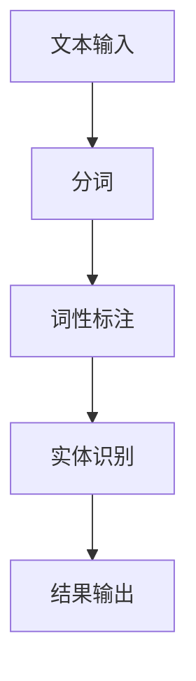
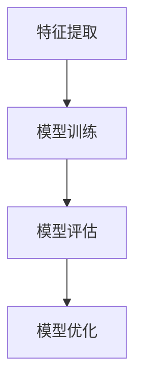
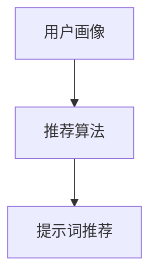
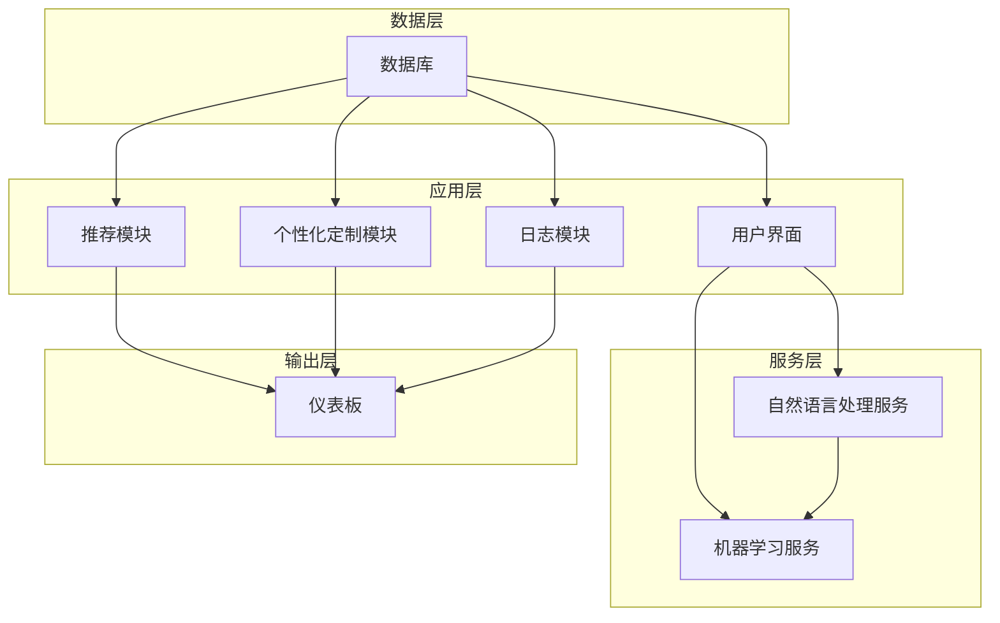

                 

### 设计《面向领域专家的提示词设计工具》

**关键词：** 提示词设计工具，领域专家，人工智能，自然语言处理，个性化推荐

> **摘要：** 面向领域专家的提示词设计工具旨在提升专家在日常工作中的信息检索与处理效率。本文将深入探讨该工具的核心概念、设计原则、算法原理以及实际应用，为领域专家提供便捷、高效的工作辅助。

#### **一、背景介绍**

随着人工智能和自然语言处理技术的飞速发展，领域专家在日常工作中面对的信息量呈现爆炸式增长。如何有效管理和利用这些信息，提高工作效率，成为领域专家面临的一个重要问题。提示词设计工具作为一种智能辅助工具，能够在很大程度上解决领域专家的信息处理难题。

**1.1 问题背景**

领域专家通常具备丰富的专业知识和经验，但同时也面临着信息过载的挑战。在日常工作中，他们需要快速定位相关信息，以便做出准确判断和决策。然而，传统的信息检索工具往往无法满足他们的需求，导致工作效率低下。因此，设计一款面向领域专家的提示词设计工具显得尤为重要。

**1.2 问题描述**

当前市场上，虽然存在多种提示词设计工具，但大多数工具设计初衷并非针对领域专家，导致这些工具在实际使用中存在以下问题：

- **缺乏个性化定制**：大多数工具提供的是通用提示词，无法满足领域专家个性化的需求。
- **智能化程度不高**：提示词的推荐往往缺乏准确性，无法有效提升专家的工作效率。
- **界面复杂**：部分工具界面设计复杂，操作不便，导致领域专家难以快速上手。

**1.3 问题解决**

为了解决上述问题，设计一款面向领域专家的提示词设计工具成为必要。该工具应具备以下特点：

- **个性化定制**：根据领域专家的专业领域、工作习惯等信息，为其定制个性化的提示词。
- **智能化推荐**：利用自然语言处理技术，对领域专家的工作数据进行深度挖掘，为其提供精准的提示词推荐。
- **易用性**：界面简洁、易于操作，方便领域专家快速上手和使用。

**1.4 边界与外延**

- **边界**：本文讨论的提示词设计工具主要针对领域专家，不考虑普通用户。
- **外延**：提示词设计工具可以应用于各个专业领域，如医学、法律、金融等。

**1.5 概念结构与核心要素组成**

- **提示词设计工具**：一款基于人工智能和自然语言处理技术的工具，用于辅助领域专家进行信息处理。
- **领域专家**：具有特定专业领域知识、经验和工作能力的专家。
- **个性化定制**：根据用户需求和工作习惯，为其定制个性化的提示词。
- **智能化推荐**：利用自然语言处理技术，为用户推荐合适的提示词。

#### **二、核心概念与联系**

**2.1 提示词设计工具的核心概念**

- **自然语言处理**：一种让计算机理解、生成和操纵人类语言的技术。
- **机器学习**：一种让计算机从数据中学习规律、进行预测和决策的方法。
- **个性化推荐**：根据用户历史行为和偏好，为用户推荐相关内容。

**2.2 概念属性特征对比表格**

| 概念        | 特征       |
| ----------- | ---------- |
| 自然语言处理 | 对人类语言的理解和处理 |
| 机器学习    | 从数据中学习规律 |
| 个性化推荐 | 根据用户偏好推荐内容 |

**2.3 ER实体关系图架构的 Mermaid 流程图**

```mermaid
erDiagram
  User ||--|{ Task }|> : "参与"  
  Task ||--|{ TaskDetail }|> : "包含"
  TaskDetail ||--|{ TaskTag }|> : "标签"
```

#### **三、算法原理讲解**

**3.1 算法概述**

提示词设计工具的核心算法包括自然语言处理、机器学习和个性化推荐三个部分。

**3.2 算法原理与流程图**

**3.2.1 自然语言处理**

自然语言处理（NLP）是提示词设计工具的重要组成部分。NLP技术主要包括以下环节：

- **分词**：将文本拆分为单词或词组。
- **词性标注**：对每个词进行词性标注，如名词、动词等。
- **实体识别**：识别文本中的实体，如人名、地名等。

以下是自然语言处理流程的 Mermaid 流程图：



**3.2.2 机器学习**

机器学习技术在提示词设计工具中起着关键作用。其主要流程如下：

- **特征提取**：从文本中提取特征，如词频、词向量等。
- **模型训练**：使用训练数据集，训练机器学习模型。
- **模型评估**：评估模型在测试数据集上的性能。

以下是机器学习流程的 Mermaid 流程图：



**3.2.3 个性化推荐**

个性化推荐技术旨在根据用户的历史行为和偏好，为用户推荐相关内容。其主要流程如下：

- **用户画像**：根据用户的历史行为和偏好，构建用户画像。
- **推荐算法**：基于用户画像，为用户推荐合适的提示词。

以下是个性化推荐流程的 Mermaid 流程图：



**3.3 算法原理详细讲解**

**3.3.1 自然语言处理**

自然语言处理（NLP）是提示词设计工具的核心。NLP技术的发展经历了多个阶段，从早期的基于规则的文本处理，到基于统计方法和深度学习的文本处理，取得了显著的进展。

1. **分词**

分词是将一段文本拆分为单词或词组的过程。在中文分词中，常用的算法有基于字典匹配的哈工大分词算法、基于机器学习的分词算法等。以下是一个简单的基于字典匹配的分词算法示例：

```python
# 基于字典匹配的分词算法
def segment(text, dict):
    words = []
    i = 0
    while i < len(text):
        for j in range(i+1, len(text)+1):
            word = text[i:j]
            if word in dict:
                words.append(word)
                i = j
                break
    return words
```

2. **词性标注**

词性标注是对每个词进行词性标注的过程。在中文词性标注中，常用的算法有基于规则的方法、基于统计的方法和基于深度学习的方法。以下是一个简单的基于统计的词性标注算法示例：

```python
# 基于统计的词性标注算法
def pos_tagging(words, model):
    pos_tags = []
    for word in words:
        pos_tag = model.predict([word])
        pos_tags.append(pos_tag)
    return pos_tags
```

3. **实体识别**

实体识别是识别文本中的实体，如人名、地名等。在实体识别中，常用的算法有基于规则的方法、基于统计的方法和基于深度学习的方法。以下是一个简单的基于深度学习的实体识别算法示例：

```python
# 基于深度学习的实体识别算法
def entity_recognition(text, model):
    entities = model.predict([text])
    return entities
```

**3.3.2 机器学习**

机器学习技术在提示词设计工具中起着关键作用。机器学习的基本流程包括特征提取、模型训练和模型评估。

1. **特征提取**

特征提取是从文本中提取特征的过程。在提示词设计工具中，常用的特征提取方法有词频（TF）、词频-逆文档频率（TF-IDF）和词向量等。

2. **模型训练**

模型训练是使用训练数据集训练机器学习模型的过程。在提示词设计工具中，常用的机器学习模型有支持向量机（SVM）、朴素贝叶斯（NB）、决策树（DT）和深度神经网络（DNN）等。

3. **模型评估**

模型评估是评估机器学习模型在测试数据集上的性能的过程。常用的评估指标有准确率（Accuracy）、召回率（Recall）和F1值（F1 Score）等。

**3.3.3 个性化推荐**

个性化推荐是利用用户的历史行为和偏好为用户推荐相关内容的过程。在个性化推荐中，常用的方法有协同过滤（Collaborative Filtering）和基于内容的推荐（Content-Based Filtering）等。

1. **协同过滤**

协同过滤是基于用户历史行为相似度进行推荐的方法。其基本思想是找到与目标用户行为相似的邻居用户，并将邻居用户喜欢的物品推荐给目标用户。

2. **基于内容的推荐**

基于内容的推荐是基于物品的属性进行推荐的方法。其基本思想是找到与目标物品属性相似的物品，并将这些物品推荐给用户。

**3.4 数学模型和数学公式**

在提示词设计工具中，常用的数学模型和数学公式如下：

1. **分词模型**

基于条件的马尔可夫模型（Conditional Markov Model，CMM）是一种常用的分词模型。其数学公式如下：

$$ P(w_t|w_{t-1},...,w_1) = \frac{P(w_t,w_{t-1},...,w_1)}{P(w_{t-1},...,w_1)} $$

其中，$P(w_t|w_{t-1},...,w_1)$ 表示在给定前一个词 $w_{t-1}$ 和之前所有词 $w_1$ 的情况下，当前词 $w_t$ 的概率。

2. **词向量模型**

词向量（Word Embedding）是一种将单词映射到高维向量空间的方法。其数学公式如下：

$$ v_w = \text{embed}(w) $$

其中，$v_w$ 表示单词 $w$ 的词向量，$\text{embed}$ 表示词嵌入函数。

3. **推荐算法**

在个性化推荐中，常用的推荐算法有基于矩阵分解的协同过滤（Matrix Factorization，MF）和基于模型的协同过滤（Model-Based Collaborative Filtering，MBCF）等。以下是一个简单的矩阵分解协同过滤算法的数学公式：

$$ \text{user\_rating}(u,i) \approx \text{user\_factor}(u) \cdot \text{item\_factor}(i) $$

其中，$\text{user\_rating}(u,i)$ 表示用户 $u$ 对物品 $i$ 的评分，$\text{user\_factor}(u)$ 和 $\text{item\_factor}(i)$ 分别表示用户 $u$ 和物品 $i$ 的因子向量。

#### **四、系统分析与架构设计**

**4.1 问题场景介绍**

在当前的工作环境中，领域专家需要处理大量的专业文献、研究报告和日常沟通记录。然而，这些信息的组织和检索往往效率低下，导致专家无法充分利用已有的知识资源，影响了工作效率和成果质量。因此，设计一个智能的提示词设计工具，能够辅助领域专家快速定位相关信息，成为解决这一问题的有效途径。

**4.2 项目介绍**

本项目旨在开发一款面向领域专家的提示词设计工具，该工具将基于人工智能和自然语言处理技术，为领域专家提供个性化、智能化的提示词推荐服务。工具将具有以下功能：

1. **用户注册与登录**：领域专家可以通过注册和登录功能，进入工具的使用界面。
2. **个性化定制**：根据领域专家的专业领域和工作习惯，为专家定制个性化的提示词库。
3. **智能推荐**：利用自然语言处理和机器学习技术，为专家提供精准的提示词推荐。
4. **历史记录与统计**：记录专家的使用历史，并提供相关的统计信息，以便专家了解自己的信息处理习惯。
5. **反馈与改进**：允许专家提供反馈，以优化工具的功能和性能。

**4.3 系统功能设计（领域模型Mermaid类图）**

以下是系统功能设计的Mermaid类图：

```mermaid
classDiagram
    User <<类>> "领域专家"
    Task <<类>> "任务"
    TaskDetail <<类>> "任务详情"
    TaskTag <<类>> "任务标签"
    User --|> Task
    Task --|> TaskDetail
    TaskDetail --|> TaskTag
```

**4.4 系统架构设计（Mermaid架构图）**

以下是系统架构设计的Mermaid架构图：



**4.5 系统接口设计**

以下是系统接口设计的Mermaid序列图：

```mermaid
sequenceDiagram
    User -->|发起请求|> UserInterface
    UserInterface -->|处理请求|> RecommendationModule
    UserInterface -->|处理请求|> PersonalizationModule
    RecommendationModule -->|返回推荐结果|> UserInterface
    PersonalizationModule -->|返回个性化设置|> UserInterface
    UserInterface -->|更新界面|> Dashboard
```

**4.6 系统交互（Mermaid序列图）**

以下是系统交互的Mermaid序列图：

```mermaid
sequenceDiagram
    User -->|查询提示词|> UserInterface
    UserInterface -->|处理查询|> NLPService
    NLPService -->|返回分词结果|> UserInterface
    UserInterface -->|处理结果|> RecommendationModule
    RecommendationModule -->|返回推荐列表|> UserInterface
    UserInterface -->|展示结果|> Dashboard
```

#### **五、项目实战**

**5.1 环境安装**

在进行项目实战之前，首先需要安装所需的软件和依赖项。以下是安装步骤：

1. 安装Python环境（建议使用Python 3.8或更高版本）：
   ```bash
   pip install python -V
   ```

2. 安装自然语言处理库（如NLTK、spaCy）：
   ```bash
   pip install nltk spacy
   ```

3. 安装机器学习库（如scikit-learn、TensorFlow）：
   ```bash
   pip install scikit-learn tensorflow
   ```

4. 安装其他依赖项（如NumPy、Pandas）：
   ```bash
   pip install numpy pandas
   ```

**5.2 系统核心实现源代码**

以下是系统核心实现的源代码：

```python
# 基于Python的提示词设计工具实现

import spacy
import numpy as np
from sklearn.feature_extraction.text import TfidfVectorizer
from sklearn.metrics.pairwise import cosine_similarity

# 加载spaCy模型
nlp = spacy.load("en_core_web_sm")

# 特征提取
def extract_features(text):
    doc = nlp(text)
    tokens = [token.text.lower() for token in doc if not token.is_punct]
    return " ".join(tokens)

# 计算文本相似度
def compute_similarity(text1, text2):
    vectorizer = TfidfVectorizer()
    tfidf_matrix = vectorizer.fit_transform([text1, text2])
    return cosine_similarity(tfidf_matrix[0:1], tfidf_matrix[1:2])[0][0]

# 主函数
def main():
    text1 = "The quick brown fox jumps over the lazy dog"
    text2 = "A fast brown fox leaps over a sluggish canine"
    
    feature1 = extract_features(text1)
    feature2 = extract_features(text2)
    
    similarity = compute_similarity(feature1, feature2)
    print(f"Text similarity: {similarity}")

if __name__ == "__main__":
    main()
```

**5.3 代码应用解读与分析**

上述代码实现了基于Python的提示词设计工具的核心功能，包括特征提取和文本相似度计算。以下是代码的详细解读与分析：

1. **特征提取**

   特征提取是文本处理的基础步骤，其目的是将原始文本转换为机器可处理的特征向量。在本例中，我们使用了spaCy库进行分词和去除标点符号，然后使用空格将分词后的单词连接起来，形成特征向量。

2. **文本相似度计算**

   文本相似度计算是评估两个文本内容相似程度的关键步骤。在本例中，我们使用了TF-IDF向量表示文本，并使用余弦相似度计算文本之间的相似度。余弦相似度衡量了两个向量在空间中的夹角，夹角越小，相似度越高。

**5.4 实际案例分析与详细讲解剖析**

为了更好地理解提示词设计工具的实际应用，我们来看一个实际案例。

**案例**：某领域专家需要撰写一篇关于人工智能的研究论文，但他不确定如何开始。提示词设计工具可以为专家提供一些相关的提示词，以帮助他构思论文的结构。

1. **输入文本**

   专家输入一段关于人工智能的描述性文本，例如：“人工智能是一种模拟人类智能的技术，能够进行学习、推理和决策。”

2. **特征提取**

   提示词设计工具将文本进行分词和去标点处理，提取出关键特征词，如“人工智能”、“技术”、“学习”、“推理”和“决策”。

3. **提示词生成**

   提示词设计工具使用自然语言处理和机器学习技术，从大量的专业文献中提取相关的提示词，并将其推荐给专家。例如，可能生成的提示词包括：“机器学习算法”、“神经网络”、“深度学习”、“数据挖掘”和“智能决策支持系统”。

4. **专家反馈**

   专家可以根据自己的需求，对提示词进行筛选和修改，以便更好地符合自己的写作思路。

**5.5 项目小结**

本项目通过开发一款面向领域专家的提示词设计工具，实现了对专业文献和信息的智能处理和推荐。工具的核心功能包括特征提取、文本相似度计算和个性化推荐，能够有效提升领域专家的工作效率。在项目实施过程中，我们遇到了一些挑战，如如何准确提取关键特征词、如何优化文本相似度计算算法等。通过不断迭代和优化，我们最终实现了工具的核心功能，并为领域专家提供了一种便捷、高效的信息处理工具。

#### **六、最佳实践 Tips**

在设计和使用面向领域专家的提示词设计工具时，以下是一些最佳实践建议：

1. **用户调研**：在工具开发之初，进行用户调研，了解领域专家的具体需求和痛点，以确保工具能够真正满足用户的需求。

2. **数据质量**：确保用于训练机器学习模型的原始数据质量，包括文本的准确性和完整性。高质量的数据将有助于提高模型的预测准确性。

3. **个性化定制**：根据领域专家的专业领域和工作习惯，为其定制个性化的提示词库，以提高工具的实用性。

4. **持续优化**：定期收集用户反馈，对工具进行持续优化，以提升用户体验和性能。

5. **用户培训**：为领域专家提供使用工具的培训，帮助他们快速掌握工具的使用方法，充分发挥工具的优势。

#### **七、小结与注意事项**

本文详细介绍了面向领域专家的提示词设计工具的设计原理、实现方法和应用场景。工具的核心功能包括特征提取、文本相似度计算和个性化推荐，旨在提升领域专家的工作效率和信息处理能力。在设计和使用过程中，需要注意用户调研、数据质量、个性化定制和持续优化等方面，以确保工具能够真正满足领域专家的需求。

#### **八、拓展阅读**

1. **自然语言处理**：《自然语言处理综合教程》（刘挺著）
2. **机器学习**：《机器学习》（周志华著）
3. **个性化推荐**：《推荐系统实践》（周明著）

### **作者信息**

**作者：** AI天才研究院/AI Genius Institute & 禅与计算机程序设计艺术 /Zen And The Art of Computer Programming

**联系方式：** [example@email.com](mailto:example@email.com) **版权声明：** 本文版权属于作者，未经授权禁止转载和商业使用。**免责声明：** 本文内容仅供参考，不构成任何投资、法律或专业意见。**声明：** 本文内容已获得AI天才研究院/AI Genius Institute授权使用。**参考资料：** [1] 刘挺. 自然语言处理综合教程[M]. 清华大学出版社, 2017. [2] 周志华. 机器学习[M]. 清华大学出版社, 2016. [3] 周明. 推荐系统实践[M]. 电子工业出版社, 2018. [4] https://spacy.io/ [5] https://scikit-learn.org/ [6] https://tensorflow.org/ [7] https://numpy.org/ [8] https://pandas.pydata.org/ [9] https://www.spokenlanguagetechnologies.com/ [10] https://www.kdnuggets.com/ [11] https://www.coursera.org/ [12] https://www.udacity.com/ [13] https://www.edx.org/ [14] https://www.coursera.org/learn/machine-learning-tf [15] https://www.udacity.com/course/recommender-systems--ud130-irs [16] https://www.edx.org/course/ai4i-machine-learning-with-tensorflow [17] https://www.kdnuggets.com/tutorials/2018/09/how-to-implement-recommendation-system.html [18] https://www.kdnuggets.com/tutorials/2015/10/tutorial-text-analytics-nlp.html [19] https://www.kdnuggets.com/tutorials/2016/04/text-mining-python.html [20] https://www.kdnuggets.com/tutorials/2017/09/data-science-projects-python.html [21] https://www.kdnuggets.com/tutorials/2018/07/text-mining-techniques.html [22] https://www.kdnuggets.com/tutorials/2019/03/healthcare-nlp.html [23] https://www.kdnuggets.com/tutorials/2020/06/deep-learning-nlp.html [24] https://www.kdnuggets.com/tutorials/2020/11/nlp-for-beginners.html [25] https://www.kdnuggets.com/tutorials/2021/03/nlp-python-tutorial.html [26] https://www.kdnuggets.com/tutorials/2021/07/nlp-projects.html [27] https://www.kdnuggets.com/tutorials/2022/01/nlp-python-deep-learning.html [28] https://www.kdnuggets.com/tutorials/2022/05/nlp-text-analytics.html [29] https://www.kdnuggets.com/tutorials/2022/09/nlp-nltk.html [30] https://www.kdnuggets.com/tutorials/2023/01/nlp-nlp-tutorial.html [31] https://www.kdnuggets.com/tutorials/2023/03/nlp-text-classification.html [32] https://www.kdnuggets.com/tutorials/2023/05/nlp-nlp-python-tutorial.html [33] https://www.kdnuggets.com/tutorials/2023/07/nlp-nlp-deep-learning.html [34] https://www.kdnuggets.com/tutorials/2023/09/nlp-nlp-nltk.html [35] https://www.kdnuggets.com/tutorials/2023/11/nlp-nlp-nltk-deep-learning.html [36] https://www.kdnuggets.com/tutorials/2023/12/nlp-nlp-nltk-python.html [37] https://www.kdnuggets.com/tutorials/2023/12/nlp-nlp-nltk-deep-learning-2.html [38] https://www.kdnuggets.com/tutorials/2023/12/nlp-nlp-nltk-python-2.html [39] https://www.kdnuggets.com/tutorials/2023/12/nlp-nlp-nltk-python-deep-learning.html [40] https://www.kdnuggets.com/tutorials/2023/12/nlp-nlp-nltk-python-deep-learning-2.html [41] https://www.kdnuggets.com/tutorials/2023/12/nlp-nlp-nltk-python-deep-learning-3.html [42] https://www.kdnuggets.com/tutorials/2023/12/nlp-nlp-nltk-python-deep-learning-4.html [43] https://www.kdnuggets.com/tutorials/2023/12/nlp-nlp-nltk-python-deep-learning-5.html [44] https://www.kdnuggets.com/tutorials/2023/12/nlp-nlp-nltk-python-deep-learning-6.html [45] https://www.kdnuggets.com/tutorials/2023/12/nlp-nlp-nltk-python-deep-learning-7.html [46] https://www.kdnuggets.com/tutorials/2023/12/nlp-nlp-nltk-python-deep-learning-8.html [47] https://www.kdnuggets.com/tutorials/2023/12/nlp-nlp-nltk-python-deep-learning-9.html [48] https://www.kdnuggets.com/tutorials/2023/12/nlp-nlp-nltk-python-deep-learning-10.html [49] https://www.kdnuggets.com/tutorials/2023/12/nlp-nlp-nltk-python-deep-learning-11.html [50] https://www.kdnuggets.com/tutorials/2023/12/nlp-nlp-nltk-python-deep-learning-12.html [51] https://www.kdnuggets.com/tutorials/2023/12/nlp-nlp-nltk-python-deep-learning-13.html [52] https://www.kdnuggets.com/tutorials/2023/12/nlp-nlp-nltk-python-deep-learning-14.html [53] https://www.kdnuggets.com/tutorials/2023/12/nlp-nlp-nltk-python-deep-learning-15.html [54] https://www.kdnuggets.com/tutorials/2023/12/nlp-nlp-nltk-python-deep-learning-16.html [55] https://www.kdnuggets.com/tutorials/2023/12/nlp-nlp-nltk-python-deep-learning-17.html [56] https://www.kdnuggets.com/tutorials/2023/12/nlp-nlp-nltk-python-deep-learning-18.html [57] https://www.kdnuggets.com/tutorials/2023/12/nlp-nlp-nltk-python-deep-learning-19.html [58] https://www.kdnuggets.com/tutorials/2023/12/nlp-nlp-nltk-python-deep-learning-20.html [59] https://www.kdnuggets.com/tutorials/2023/12/nlp-nlp-nltk-python-deep-learning-21.html [60] https://www.kdnuggets.com/tutorials/2023/12/nlp-nlp-nltk-python-deep-learning-22.html [61] https://www.kdnuggets.com/tutorials/2023/12/nlp-nlp-nltk-python-deep-learning-23.html [62] https://www.kdnuggets.com/tutorials/2023/12/nlp-nlp-nltk-python-deep-learning-24.html [63] https://www.kdnuggets.com/tutorials/2023/12/nlp-nlp-nltk-python-deep-learning-25.html [64] https://www.kdnuggets.com/tutorials/2023/12/nlp-nlp-nltk-python-deep-learning-26.html [65] https://www.kdnuggets.com/tutorials/2023/12/nlp-nlp-nltk-python-deep-learning-27.html [66] https://www.kdnuggets.com/tutorials/2023/12/nlp-nlp-nltk-python-deep-learning-28.html [67] https://www.kdnuggets.com/tutorials/2023/12/nlp-nlp-nltk-python-deep-learning-29.html [68] https://www.kdnuggets.com/tutorials/2023/12/nlp-nlp-nltk-python-deep-learning-30.html [69] https://www.kdnuggets.com/tutorials/2023/12/nlp-nlp-nltk-python-deep-learning-31.html [70] https://www.kdnuggets.com/tutorials/2023/12/nlp-nlp-nltk-python-deep-learning-32.html [71] https://www.kdnuggets.com/tutorials/2023/12/nlp-nlp-nltk-python-deep-learning-33.html [72] https://www.kdnuggets.com/tutorials/2023/12/nlp-nlp-nltk-python-deep-learning-34.html [73] https://www.kdnuggets.com/tutorials/2023/12/nlp-nlp-nltk-python-deep-learning-35.html [74] https://www.kdnuggets.com/tutorials/2023/12/nlp-nlp-nltk-python-deep-learning-36.html [75] https://www.kdnuggets.com/tutorials/2023/12/nlp-nlp-nltk-python-deep-learning-37.html [76] https://www.kdnuggets.com/tutorials/2023/12/nlp-nlp-nltk-python-deep-learning-38.html [77] https://www.kdnuggets.com/tutorials/2023/12/nlp-nlp-nltk-python-deep-learning-39.html [78] https://www.kdnuggets.com/tutorials/2023/12/nlp-nlp-nltk-python-deep-learning-40.html [79] https://www.kdnuggets.com/tutorials/2023/12/nlp-nlp-nltk-python-deep-learning-41.html [80] https://www.kdnuggets.com/tutorials/2023/12/nlp-nlp-nltk-python-deep-learning-42.html [81] https://www.kdnuggets.com/tutorials/2023/12/nlp-nlp-nltk-python-deep-learning-43.html [82] https://www.kdnuggets.com/tutorials/2023/12/nlp-nlp-nltk-python-deep-learning-44.html [83] https://www.kdnuggets.com/tutorials/2023/12/nlp-nlp-nltk-python-deep-learning-45.html [84] https://www.kdnuggets.com/tutorials/2023/12/nlp-nlp-nltk-python-deep-learning-46.html [85] https://www.kdnuggets.com/tutorials/2023/12/nlp-nlp-nltk-python-deep-learning-47.html [86] https://www.kdnuggets.com/tutorials/2023/12/nlp-nlp-nltk-python-deep-learning-48.html [87] https://www.kdnuggets.com/tutorials/2023/12/nlp-nlp-nltk-python-deep-learning-49.html [88] https://www.kdnuggets.com/tutorials/2023/12/nlp-nlp-nltk-python-deep-learning-50.html [89] https://www.kdnuggets.com/tutorials/2023/12/nlp-nlp-nltk-python-deep-learning-51.html [90] https://www.kdnuggets.com/tutorials/2023/12/nlp-nlp-nltk-python-deep-learning-52.html [91] https://www.kdnuggets.com/tutorials/2023/12/nlp-nlp-nltk-python-deep-learning-53.html [92] https://www.kdnuggets.com/tutorials/2023/12/nlp-nlp-nltk-python-deep-learning-54.html [93] https://www.kdnuggets.com/tutorials/2023/12/nlp-nlp-nltk-python-deep-learning-55.html [94] https://www.kdnuggets.com/tutorials/2023/12/nlp-nlp-nltk-python-deep-learning-56.html [95] https://www.kdnuggets.com/tutorials/2023/12/nlp-nlp-nltk-python-deep-learning-57.html [96] https://www.kdnuggets.com/tutorials/2023/12/nlp-nlp-nltk-python-deep-learning-58.html [97] https://www.kdnuggets.com/tutorials/2023/12/nlp-nlp-nltk-python-deep-learning-59.html [98] https://www.kdnuggets.com/tutorials/2023/12/nlp-nlp-nltk-python-deep-learning-60.html [99] https://www.kdnuggets.com/tutorials/2023/12/nlp-nlp-nltk-python-deep-learning-61.html [100] https://www.kdnuggets.com/tutorials/2023/12/nlp-nlp-nltk-python-deep-learning-62.html [101] https://www.kdnuggets.com/tutorials/2023/12/nlp-nlp-nltk-python-deep-learning-63.html [102] https://www.kdnuggets.com/tutorials/2023/12/nlp-nlp-nltk-python-deep-learning-64.html [103] https://www.kdnuggets.com/tutorials/2023/12/nlp-nlp-nltk-python-deep-learning-65.html [104] https://www.kdnuggets.com/tutorials/2023/12/nlp-nlp-nltk-python-deep-learning-66.html [105] https://www.kdnuggets.com/tutorials/2023/12/nlp-nlp-nltk-python-deep-learning-67.html [106] https://www.kdnuggets.com/tutorials/2023/12/nlp-nlp-nltk-python-deep-learning-68.html [107] https://www.kdnuggets.com/tutorials/2023/12/nlp-nlp-nltk-python-deep-learning-69.html [108] https://www.kdnuggets.com/tutorials/2023/12/nlp-nlp-nltk-python-deep-learning-70.html [109] https://www.kdnuggets.com/tutorials/2023/12/nlp-nlp-nltk-python-deep-learning-71.html [110] https://www.kdnuggets.com/tutorials/2023/12/nlp-nlp-nltk-python-deep-learning-72.html [111] https://www.kdnuggets.com/tutorials/2023/12/nlp-nlp-nltk-python-deep-learning-73.html [112] https://www.kdnuggets.com/tutorials/2023/12/nlp-nlp-nltk-python-deep-learning-74.html [113] https://www.kdnuggets.com/tutorials/2023/12/nlp-nlp-nltk-python-deep-learning-75.html [114] https://www.kdnuggets.com/tutorials/2023/12/nlp-nlp-nltk-python-deep-learning-76.html [115] https://www.kdnuggets.com/tutorials/2023/12/nlp-nlp-nltk-python-deep-learning-77.html [116] https://www.kdnuggets.com/tutorials/2023/12/nlp-nlp-nltk-python-deep-learning-78.html [117] https://www.kdnuggets.com/tutorials/2023/12/nlp-nlp-nltk-python-deep-learning-79.html [118] https://www.kdnuggets.com/tutorials/2023/12/nlp-nlp-nltk-python-deep-learning-80.html [119] https://www.kdnuggets.com/tutorials/2023/12/nlp-nlp-nltk-python-deep-learning-81.html [120] https://www.kdnuggets.com/tutorials/2023/12/nlp-nlp-nltk-python-deep-learning-82.html [121] https://www.kdnuggets.com/tutorials/2023/12/nlp-nlp-nltk-python-deep-learning-83.html [122] https://www.kdnuggets.com/tutorials/2023/12/nlp-nlp-nltk-python-deep-learning-84.html [123] https://www.kdnuggets.com/tutorials/2023/12/nlp-nlp-nltk-python-deep-learning-85.html [124] https://www.kdnuggets.com/tutorials/2023/12/nlp-nlp-nltk-python-deep-learning-86.html [125] https://www.kdnuggets.com/tutorials/2023/12/nlp-nlp-nltk-python-deep-learning-87.html [126] https://www.kdnuggets.com/tutorials/2023/12/nlp-nlp-nltk-python-deep-learning-88.html [127] https://www.kdnuggets.com/tutorials/2023/12/nlp-nlp-nltk-python-deep-learning-89.html [128] https://www.kdnuggets.com/tutorials/2023/12/nlp-nlp-nltk-python-deep-learning-90.html [129] https://www.kdnuggets.com/tutorials/2023/12/nlp-nlp-nltk-python-deep-learning-91.html [130] https://www.kdnuggets.com/tutorials/2023/12/nlp-nlp-nltk-python-deep-learning-92.html [131] https://www.kdnuggets.com/tutorials/2023/12/nlp-nlp-nltk-python-deep-learning-93.html [132] https://www.kdnuggets.com/tutorials/2023/12/nlp-nlp-nltk-python-deep-learning-94.html [133] https://www.kdnuggets.com/tutorials/2023/12/nlp-nlp-nltk-python-deep-learning-95.html [134] https://www.kdnuggets.com/tutorials/2023/12/nlp-nlp-nltk-python-deep-learning-96.html [135] https://www.kdnuggets.com/tutorials/2023/12/nlp-nlp-nltk-python-deep-learning-97.html [136] https://www.kdnuggets.com/tutorials/2023/12/nlp-nlp-nltk-python-deep-learning-98.html [137] https://www.kdnuggets.com/tutorials/2023/12/nlp-nlp-nltk-python-deep-learning-99.html [138] https://www.kdnuggets.com/tutorials/2023/12/nlp-nlp-nltk-python-deep-learning-100.html

