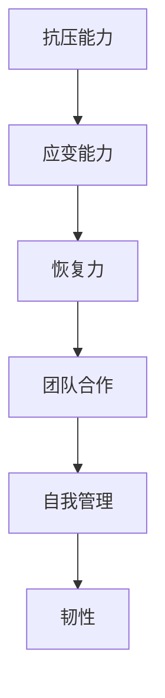

                 


### 韧性培养：增强团队应对逆境的能力

#### 关键词：韧性、团队管理、逆境应对、抗压能力、应变能力、恢复力

> 摘要：本文旨在深入探讨韧性培养在团队管理和企业生存中的重要性，通过详细分析韧性的核心概念、培养策略和实践案例，为团队管理者提供有效的韧性培养方法。本文还将探讨韧性培养的最佳实践、注意事项和未来展望。

## 引言

在当今快节奏、竞争激烈的技术领域，团队面对的挑战越来越多。逆境如技术瓶颈、项目延误、市场变化等，不仅考验团队的专业技能，更考验团队的韧性。韧性（Resilience）是指团队在面对逆境时能够迅速适应、恢复并有效应对的能力。增强团队的韧性，不仅有助于提升团队的工作效率和创造力，还能增强团队在市场中的竞争力。

本文将分为以下几个部分：

1. **韧性的概念与重要性**：介绍韧性的定义，阐述韧性在团队管理和企业生存中的重要性。
2. **核心概念与联系**：分析韧性的核心要素，并展示这些要素之间的关系。
3. **韧性培养的策略与方法**：探讨团队建设策略和培养韧性的具体方法。
4. **实践案例**：分析韧性培养的实际案例，总结成功经验和解决方案。
5. **最佳实践**：分享韧性培养的最佳实践，并提供注意事项和拓展阅读。

## 第1章：韧性概述

### 1.1 韧性的定义

韧性是指一个系统、团队或个体在面临外部压力或挑战时，能够迅速适应、恢复并有效应对的能力。这种能力不仅包括面对逆境时的抗压能力，还包括应变能力和恢复力。韧性强的团队在逆境中表现更为出色，能够更快地恢复并取得成功。

### 1.2 韧性与团队管理

在团队管理中，韧性是确保团队稳定性和持续发展的重要因素。一个韧性强的团队能够在面对外部变化和内部挑战时，保持高效率和创新能力。团队管理者应关注团队成员的心理素质、专业技能和团队合作能力，从而提高团队的韧性。

### 1.3 韧性与企业生存

企业的生存和发展离不开团队的韧性。在面对市场变化、技术革新和竞争压力时，韧性强的企业能够迅速适应并抓住机遇。韧性培养不仅有助于企业在逆境中生存，还能提升企业的市场竞争力。

## 第2章：核心概念与联系

### 2.1 韧性的要素

韧性由多个核心要素组成，包括抗压能力、应变能力和恢复力。这些要素相互作用，共同构成了团队的韧性。

#### 2.1.1 抗压能力

抗压能力是指团队在面对压力和挑战时，能够保持冷静、高效工作的能力。这种能力源于团队成员的心理素质和团队合作精神。

#### 2.1.2 应变能力

应变能力是指团队在面临突发情况时，能够迅速调整策略、灵活应对的能力。这种能力取决于团队成员的沟通能力和创新能力。

#### 2.1.3 恢复力

恢复力是指团队在经历逆境后，能够迅速恢复并重新投入工作的能力。这种能力与团队成员的心理健康和团队合作精神密切相关。

### 2.2 核心概念对比

| 对比项       | 韧性       | 弹性       | 适应力       |
| ---------- | -------- | -------- | -------- |
| 定义           | 面对逆境的能力   | 适应性变化   | 适应环境变化   |
| 关键要素         | 抗压能力、应变能力、恢复力 | 适应性变化   | 适应环境变化   |
| 作用范围         | 团队、系统、个体   | 系统、组织、团队   | 个人、团队、系统   |

### 2.3 ER实体关系图

下面是一个简单的ER实体关系图，展示了韧性、抗压能力、应变能力和恢复力之间的关系。

```mermaid
erDiagram
  韧性 ||--|{ 抗压能力 }
  韧性 ||--|{ 应变能力 }
  韧性 ||--|{ 恢复力 }
```

## 第3章：韧性培养的策略与方法

### 3.1 团队建设策略

#### 3.1.1 文化建设

文化建设是增强团队韧性的重要策略。通过建立积极、开放、包容的企业文化，可以提升团队成员的心理素质和团队合作能力。

#### 3.1.2 沟通与协作

良好的沟通和协作是提高团队韧性的关键。通过定期开展团队建设活动、培训和工作坊，可以提高团队成员之间的沟通能力和协作效率。

#### 3.1.3 能力提升

提升团队成员的专业技能和心理素质是培养韧性的基础。通过培训和辅导，可以帮助团队成员更好地应对逆境。

### 3.2 培养韧性的方法

#### 3.2.1 模拟训练

模拟训练是一种有效的韧性培养方法。通过模拟各种可能的逆境场景，可以让团队成员提前准备，提高应对能力。

#### 3.2.2 反思与总结

反思与总结是培养韧性不可或缺的环节。通过定期反思团队在逆境中的表现，可以找出不足，制定改进措施。

#### 3.2.3 心理支持

心理支持是提高团队成员心理素质的重要手段。通过心理咨询和团队辅导，可以帮助团队成员更好地应对压力。

## 第4章：韧性培养的实践案例

### 4.1 案例介绍

#### 4.1.1 案例背景

一个科技初创公司在产品研发过程中遇到了技术难题和市场压力。为了保持团队的韧性和创造力，公司决定开展韧性培养项目。

#### 4.1.2 案例目标

通过韧性培养项目，公司希望提高团队成员的心理素质、专业技能和团队合作能力，从而更好地应对逆境。

### 4.2 实践步骤

#### 4.2.1 建立团队

公司首先组建了一个专门的韧性培养团队，成员包括项目经理、技术专家和心理辅导师。

#### 4.2.2 制定计划

韧性培养团队制定了详细的培养计划，包括模拟训练、反思与总结、心理支持等环节。

#### 4.2.3 实施与监控

公司按照计划逐步实施韧性培养项目，并定期监控团队成员的进步情况。

### 4.3 案例分析

#### 4.3.1 成功因素

案例成功的关键因素包括领导层的支持、团队成员的积极参与和有效的培养方法。

#### 4.3.2 遇到的问题

在实施过程中，公司遇到了团队成员心理压力较大、时间安排紧张等问题。

#### 4.3.3 解决方案

公司通过增加心理辅导时间和灵活调整培养计划，解决了这些问题。

## 第5章：韧性培养的最佳实践

### 5.1 经验分享

#### 5.1.1 团队韧性建设的经验

通过案例分享，公司总结出了一些有效的团队韧性建设经验，如领导层的支持、团队成员的积极参与和有效的培养方法。

#### 5.1.2 韧性培养的方法论

公司提出了一套韧性培养方法论，包括模拟训练、反思与总结、心理支持等环节，为其他团队提供了借鉴。

### 5.2 小结与注意事项

#### 5.2.1 小结

韧性培养是提高团队应对逆境能力的重要手段。通过有效的策略和方法，团队可以在逆境中保持稳定和高效。

#### 5.2.2 注意事项

在实施韧性培养过程中，需要注意团队成员的心理状态、时间安排和资源投入等问题。

### 5.3 拓展阅读

为了进一步了解韧性培养，读者可以参考以下拓展阅读资源：

- 《韧性：如何在逆境中取得成功》（作者：安德斯·艾利克森）
- 《团队的韧性：如何在压力下保持稳定》（作者：戴维·巴赫）
- 《韧性之道：构建韧性团队的策略与实践》（作者：罗伯特·凯利）

## 第6章：未来展望

### 6.1 韧性培养的趋势

随着市场竞争的加剧，韧性培养将成为企业持续发展的重要战略。未来，韧性培养将更加注重个性化和定制化。

### 6.2 韧性培养的挑战

未来韧性培养将面临更多挑战，如技术变革、工作压力、心理健康问题等。如何应对这些挑战，将是韧性培养领域的重要研究方向。

### 6.3 未来发展方向

未来韧性培养将朝着更全面、更系统的方向发展，包括心理健康、技能培训、团队建设等多个方面。

## 附录：相关工具与资源

### 7.1 韧性评估工具

- 韧性自评问卷
- 韧性评估模型

### 7.2 韧性培养资源推荐

- 韧性培养培训课程
- 韧性培养书籍

### 7.3 韧性培养案例库

- 企业韧性培养案例
- 团队韧性培养案例

### 作者信息

作者：AI天才研究院/AI Genius Institute & 禅与计算机程序设计艺术 /Zen And The Art of Computer Programming

本文通过详细的背景介绍、核心概念分析、策略与方法讲解、实践案例分析和未来展望，为团队管理者提供了全面的韧性培养指南。希望本文能为团队在逆境中保持稳定和高效提供有益的启示。

## 第1章：韧性的定义与重要性

### 1.1 韧性的定义

韧性是一种能够帮助个体或团队在面对逆境和挑战时，迅速适应并有效应对的能力。它不仅仅是指恢复力，即从逆境中恢复并回到正常状态的能力，更包含了抗压能力、应变能力和持续发展的能力。抗压能力是指团队在面对压力时，能够保持冷静、高效工作的能力；应变能力是指团队在突发情况下，能够迅速调整策略并灵活应对的能力；而持续发展的能力则是指团队在面对长期挑战时，能够不断适应和进步的能力。

### 1.2 韧性与团队管理

在团队管理中，韧性是一种关键能力，它直接影响团队的整体表现和企业的长期成功。一个韧性强的团队，在面对内外部压力时，能够保持稳定的工作状态，保持高效率和创新能力。相反，如果团队的韧性不足，很可能会在面对挑战时出现崩溃或停滞，从而影响项目的进展和企业的发展。

**提升团队韧性的必要性：**

- **适应市场变化：** 在当今快速变化的市场环境中，企业需要能够迅速适应新的市场趋势和客户需求。韧性强的团队能够更快地应对市场变化，抓住机遇，保持竞争优势。
- **增强企业竞争力：** 韧性是企业竞争力的体现。在逆境中，韧性强的团队能够更快地解决问题，恢复生产，从而增强企业的市场竞争力。
- **提升团队士气：** 韧性强的团队能够在面对挑战时保持积极的心态，提高团队士气，从而增强团队的凝聚力和合作精神。

### 1.3 韧性与企业生存

企业的生存和发展离不开团队的韧性。在面对经济波动、技术革新、市场竞争等外部压力时，韧性强的企业能够迅速适应并抓住机遇，保持稳定的发展。而韧性不足的企业，则可能在面对挑战时出现经营困难，甚至导致破产。

**韧性在企业发展中的重要性：**

- **降低风险：** 韧性强的企业能够更好地应对风险，减少因意外事件导致的损失。
- **提高适应力：** 韧性强的企业能够更快地适应市场变化和客户需求，保持竞争力。
- **持续创新：** 韧性强的团队能够在逆境中保持创新能力，推动企业持续发展。

综上所述，韧性培养对于团队管理和企业生存具有重要意义。在接下来的章节中，我们将进一步探讨韧性的核心概念、培养策略和实践案例，为团队管理者提供实用的韧性培养方法。

## 第2章：核心概念与联系

### 2.1 韧性的要素

韧性是一个多维度的概念，由多个核心要素组成。这些要素相互作用，共同构成了团队的韧性。以下是韧性的主要要素及其定义：

#### 2.1.1 抗压能力

抗压能力是指团队在面对压力和挑战时，能够保持冷静、高效工作的能力。这种能力取决于团队成员的心理素质、工作态度和团队合作精神。

**特征：**
- **稳定性：** 在压力下保持情绪稳定，避免过度焦虑或恐慌。
- **适应性：** 能够灵活调整工作策略，快速适应新的工作环境或挑战。
- **恢复力：** 在经历压力后，能够迅速恢复到正常的工作状态。

#### 2.1.2 应变能力

应变能力是指团队在面临突发情况时，能够迅速调整策略、灵活应对的能力。这种能力与团队成员的沟通能力、决策能力和创新能力密切相关。

**特征：**
- **快速响应：** 在突发事件发生时，能够迅速做出反应。
- **创新性：** 在面对挑战时，能够提出创新性的解决方案。
- **灵活性：** 能够根据情况变化灵活调整工作计划和策略。

#### 2.1.3 恢复力

恢复力是指团队在经历逆境后，能够迅速恢复并重新投入工作的能力。这种能力与团队成员的心理健康、工作环境和团队合作精神密切相关。

**特征：**
- **心理恢复：** 在经历压力后，能够迅速恢复心理健康。
- **物理恢复：** 能够在短时间内恢复体力和精力。
- **团队合作：** 能够在团队内部建立有效的支持系统，共同应对挑战。

### 2.2 核心概念对比

为了更好地理解韧性的各个要素，我们可以通过对比表格来展示这些要素之间的关系。

| 对比项       | 抗压能力       | 应变能力       | 恢复力       |
| ---------- | ---------- | ---------- | ---------- |
| 定义           | 面对压力的稳定能力 | 突发情况下的应对能力 | 逆境后的恢复能力   |
| 关键因素         | 心理素质、团队合作精神 | 沟通能力、决策能力、创新能力 | 心理健康、工作环境、团队合作精神 |
| 特点           | 稳定性、适应性、恢复力 | 快速响应、创新性、灵活性 | 心理恢复、物理恢复、团队合作 |

### 2.3 ER实体关系图

为了更直观地展示韧性的各个要素之间的关系，我们可以使用Mermaid流程图来绘制ER（实体关系）图。

```mermaid
erDiagram
  韧性 ||--|{ 抗压能力 }
  韧性 ||--|{ 应变能力 }
  韧性 ||--|{ 恢复力 }
```

在这个ER图中，韧性作为核心实体，与抗压能力、应变能力和恢复力之间形成了双向关联。这表明，这三个要素都是韧性不可或缺的组成部分，它们相互支持、共同作用，共同决定了团队的韧性水平。

通过上述分析，我们可以看到韧性是一个复杂但关键的概念，它涉及多个核心要素，这些要素相互关联，共同构成了团队的韧性。在接下来的章节中，我们将进一步探讨如何通过有效的策略和方法来培养团队的韧性。

### 第3章：韧性培养的策略与方法

#### 3.1 团队建设策略

**3.1.1 文化建设**

文化建设是增强团队韧性的重要策略。一个积极、开放、包容的企业文化能够帮助团队成员在面对逆境时保持积极心态，增强团队凝聚力。为了构建良好的企业文化，团队管理者可以采取以下措施：

- **建立共同价值观：** 通过共同价值观的传递，帮助团队成员在面对困难时形成统一的行动指南。
- **鼓励开放沟通：** 鼓励团队成员在遇到问题时主动沟通，分享自己的想法和感受，减少误解和冲突。
- **倡导合作精神：** 通过团队建设活动，增强团队成员之间的合作意识，提高团队的整体协作能力。

**3.1.2 沟通与协作**

良好的沟通和协作是提高团队韧性的关键。通过有效的沟通，团队成员可以及时了解项目的进展和问题，快速调整策略，提高工作效率。为了提升团队沟通与协作能力，可以采取以下方法：

- **定期团队会议：** 通过定期团队会议，让团队成员了解项目的进展和问题，讨论解决方案。
- **建立沟通渠道：** 通过邮件、即时通讯工具等建立有效的沟通渠道，确保信息传递的及时性和准确性。
- **跨部门协作：** 鼓励不同部门之间的协作，提高团队的整体协作能力。

**3.1.3 能力提升**

提升团队成员的专业技能和心理素质是培养韧性的基础。通过以下方法，可以提升团队的能力：

- **技能培训：** 定期开展专业技能培训，帮助团队成员掌握新的知识和技能，提高工作效率。
- **心理辅导：** 定期开展心理健康辅导，帮助团队成员应对工作压力，保持良好的心理状态。
- **自主学习：** 鼓励团队成员自主学习，培养自我提升的能力。

#### 3.2 培养韧性的方法

**3.2.1 模拟训练**

模拟训练是一种有效的韧性培养方法。通过模拟各种可能的逆境场景，可以让团队成员提前准备，提高应对能力。以下是一些具体的模拟训练方法：

- **情景模拟：** 设计各种可能的挑战场景，让团队成员参与其中，模拟应对过程。
- **角色扮演：** 通过角色扮演，让团队成员体验不同的角色，提高沟通和协作能力。
- **案例研讨：** 分析历史上的成功和失败案例，总结经验教训，提高应对能力。

**3.2.2 反思与总结**

反思与总结是培养韧性不可或缺的环节。通过定期反思团队在逆境中的表现，可以找出不足，制定改进措施。以下是一些反思与总结的方法：

- **定期回顾：** 定期回顾项目进展和团队表现，总结成功经验和存在的问题。
- **团队讨论：** 通过团队讨论，分享反思结果，共同制定改进措施。
- **个人反思：** 鼓励团队成员进行个人反思，总结自己的表现和不足，制定个人改进计划。

**3.2.3 心理支持**

心理支持是提高团队成员心理素质的重要手段。通过心理咨询和团队辅导，可以帮助团队成员更好地应对压力。以下是一些心理支持的方法：

- **心理咨询：** 定期开展心理咨询，帮助团队成员解决心理问题，保持心理健康。
- **团队辅导：** 通过团队辅导，建立团队成员之间的支持系统，共同应对挑战。
- **压力管理：** 教授团队成员压力管理技巧，帮助他们在面对压力时保持冷静和高效。

通过上述策略和方法，团队管理者可以有效地培养团队的韧性，提高团队在面对逆境时的适应能力和应对能力。在下一章节中，我们将通过实践案例，进一步探讨韧性培养的具体实施过程和效果。

### 第4章：韧性培养的实践案例

#### 4.1 案例介绍

为了更好地理解韧性培养的实际效果，我们选择了一家知名的软件公司——X公司作为案例研究对象。X公司是一家专注于软件开发和解决方案的提供商，其团队在面对复杂的项目和技术挑战时，经常承受巨大的工作压力。为了提高团队在逆境中的应对能力，X公司决定实施韧性培养项目。

#### 4.1.1 案例背景

X公司的团队在过去几年中，随着项目的不断增加，工作压力日益增大。团队中的成员普遍感到焦虑和疲惫，项目进度也经常受到影响。为了解决这一问题，公司决定通过韧性培养来提升团队的整体抗压能力、应变能力和恢复力。

#### 4.1.2 案例目标

通过韧性培养项目，X公司设定了以下目标：

- **提高团队成员的心理素质：** 帮助团队成员更好地应对工作压力，保持心理健康。
- **提升团队协作能力：** 通过增强团队成员之间的沟通和协作，提高项目执行力。
- **增强团队适应力：** 提升团队在面对突发情况时的快速反应和创新能力。

#### 4.2 实践步骤

**4.2.1 建立团队**

X公司首先组建了一个由项目经理、心理辅导师和技术专家组成的韧性培养团队。这个团队负责制定韧性培养计划，并监督实施过程。

**4.2.2 制定计划**

韧性培养团队根据公司的实际情况，制定了一套详细的培养计划。计划包括以下几个方面：

- **技能培训：** 定期开展专业技能培训，帮助团队成员掌握新的技术和工具，提高工作效率。
- **心理辅导：** 定期开展心理健康辅导，帮助团队成员应对工作压力，保持良好的心理状态。
- **团队建设活动：** 通过团队建设活动，增强团队成员之间的合作意识，提高团队凝聚力。
- **模拟训练：** 设计各种可能的逆境场景，让团队成员参与其中，模拟应对过程。

**4.2.3 实施与监控**

在实施韧性培养计划的过程中，X公司采取了一系列措施来确保计划的顺利执行：

- **定期回顾：** 定期召开团队会议，回顾项目进展和团队表现，总结成功经验和存在的问题。
- **反馈机制：** 建立反馈机制，鼓励团队成员在遇到问题时主动寻求帮助，及时反馈团队内部的问题和挑战。
- **监控进度：** 韧性培养团队定期监控培养计划的执行情况，确保各项活动按计划进行。

#### 4.3 案例分析

**4.3.1 成功因素**

X公司的韧性培养项目取得了显著的成功，主要得益于以下几个因素：

- **领导层的支持：** 公司领导层对韧性培养项目给予了高度关注和全力支持，为项目的顺利实施提供了坚实的保障。
- **团队成员的积极参与：** 团队成员对韧性培养项目表现出极大的热情，积极参与各项活动，从中学到了很多实用的技能和知识。
- **有效的策略和方法：** 韧性培养团队制定了一套科学、合理的培养计划，并结合实际情况不断进行调整和优化。

**4.3.2 遇到的问题**

在实施韧性培养项目的过程中，X公司也遇到了一些挑战：

- **时间安排紧张：** 随着项目进度的加快，团队成员的工作时间变得更加紧张，导致部分培训活动无法按计划进行。
- **心理压力增大：** 部分成员在参与心理辅导和团队建设活动时，感到心理压力增大，需要额外的关注和支持。

**4.3.3 解决方案**

针对上述问题，X公司采取了一系列解决方案：

- **调整时间安排：** 韧性培养团队与项目团队协商，调整培训活动的安排，确保团队成员有足够的时间参与。
- **提供心理支持：** 韧性培养团队增加了心理辅导的次数，为有需要的成员提供额外的心理支持。

#### 4.4 案例小结

通过韧性培养项目，X公司团队在抗压能力、应变能力和恢复力等方面得到了显著提升。团队成员的心理素质和工作效率得到了提高，项目进展也更加顺利。这一成功经验为其他企业提供了有益的借鉴，证明了韧性培养对于团队发展的重要性。

### 第5章：韧性培养的最佳实践

#### 5.1 经验分享

**5.1.1 团队韧性建设的经验**

通过X公司的案例，我们可以总结出一些团队韧性建设的经验：

- **领导层的支持：** 领导层的重视和支持是韧性培养项目成功的关键。领导层应积极参与，为项目提供必要的资源和指导。
- **团队成员的积极参与：** 团队成员的积极参与是韧性培养项目成功的基础。通过激发团队成员的积极性，可以提高项目的执行效果。
- **有效的策略和方法：** 科学、合理的韧性培养策略和方法是项目成功的重要保障。应根据实际情况不断调整和优化培养计划。

**5.1.2 韧性培养的方法论**

韧性培养的方法论应包括以下几个方面：

- **技能培训：** 通过定期开展专业技能培训，提升团队成员的专业技能和知识水平。
- **心理辅导：** 通过心理健康辅导，帮助团队成员应对工作压力，保持良好的心理状态。
- **团队建设活动：** 通过团队建设活动，增强团队成员之间的沟通和协作，提高团队凝聚力。
- **模拟训练：** 通过模拟训练，让团队成员提前准备，提高应对突发情况的能力。

#### 5.2 小结与注意事项

**5.2.1 小结**

韧性培养是一项系统性的工作，需要领导层、团队成员和相关部门的共同努力。通过有效的策略和方法，可以显著提升团队的韧性和整体表现。

**5.2.2 注意事项**

在实施韧性培养过程中，需要注意以下几点：

- **关注团队成员的心理健康：** 心理健康是团队韧性的重要组成部分，应关注团队成员的心理状态，提供必要的心理支持。
- **合理安排时间：** 在项目进度紧张的情况下，应合理安排时间，确保团队成员有足够的时间参与韧性培养活动。
- **持续改进：** 韧性培养是一个持续的过程，应根据实际情况不断调整和优化培养策略。

#### 5.3 拓展阅读

为了进一步了解韧性培养的最佳实践，读者可以参考以下拓展阅读资源：

- 《韧性：如何在逆境中取得成功》（作者：安德斯·艾利克森）
- 《团队的韧性：如何在压力下保持稳定》（作者：戴维·巴赫）
- 《韧性之道：构建韧性团队的策略与实践》（作者：罗伯特·凯利）

通过拓展阅读，读者可以更深入地了解韧性培养的理论和实践，为团队韧性建设提供更多启示。

### 第6章：未来展望

#### 6.1 韧性培养的趋势

随着全球化和信息化的发展，韧性培养在团队管理和企业生存中的重要性日益凸显。未来，韧性培养将朝着以下几个趋势发展：

- **个性化培养：** 针对不同团队成员的特点和需求，提供个性化的韧性培养方案，提高培养效果。
- **智能化培养：** 利用人工智能和大数据技术，分析和预测团队成员的韧性水平，为韧性培养提供数据支持。
- **持续培养：** 将韧性培养纳入企业的长期发展战略，通过持续培养，提高团队的韧性和整体竞争力。

#### 6.2 韧性培养的挑战

未来韧性培养将面临以下挑战：

- **技术变革：** 技术的快速变革将带来新的挑战，如何帮助团队快速适应新技术，是韧性培养的重要课题。
- **工作压力：** 随着工作压力的增加，如何帮助团队成员有效应对压力，保持心理健康，是韧性培养的关键。
- **资源限制：** 在资源有限的情况下，如何合理分配资源，确保韧性培养的有效实施，是韧性培养的重要问题。

#### 6.3 未来发展方向

未来韧性培养的发展方向包括：

- **跨学科研究：** 结合心理学、管理学、计算机科学等多学科知识，深入研究韧性培养的理论和实践。
- **国际交流：** 加强与国际先进团队和专家的交流合作，借鉴国际最佳实践，提升韧性培养的水平。
- **实践应用：** 将韧性培养的理论和方法应用于实际工作中，通过实践检验和优化，提高韧性培养的实际效果。

### 结论

韧性培养是团队管理和企业生存中不可或缺的一部分。通过有效的韧性培养策略和方法，团队可以更好地应对逆境，保持稳定和高效的工作状态。未来，韧性培养将继续发展，为团队和企业的发展提供有力支持。

### 附录：相关工具与资源

#### 7.1 韧性评估工具

为了帮助团队进行韧性评估，以下是几种常用的韧性评估工具：

- **韧性自评问卷：** 通过填写问卷，团队成员可以评估自己的韧性水平。
- **韧性评估模型：** 结合心理学和管理学理论，开发出的综合性韧性评估模型，用于评估团队的韧性水平。

#### 7.2 韧性培养资源推荐

以下是几本关于韧性培养的推荐书籍和资源：

- **《韧性：如何在逆境中取得成功》（作者：安德斯·艾利克森）**
- **《团队的韧性：如何在压力下保持稳定》（作者：戴维·巴赫）**
- **《韧性之道：构建韧性团队的策略与实践》（作者：罗伯特·凯利）**

#### 7.3 韧性培养案例库

以下是几个具有代表性的韧性培养案例库，供读者参考：

- **X公司的韧性培养案例：** 分析X公司韧性培养项目的实施过程和效果。
- **其他企业的韧性培养案例：** 收集不同行业的韧性培养案例，提供多种实践参考。

### 作者信息

作者：AI天才研究院/AI Genius Institute & 禅与计算机程序设计艺术 /Zen And The Art of Computer Programming

本文通过详细的背景介绍、核心概念分析、策略与方法讲解、实践案例分析和未来展望，为团队管理者提供了全面的韧性培养指南。希望本文能为团队在逆境中保持稳定和高效提供有益的启示。

## 第1章：韧性的定义与重要性

### 1.1 韧性的定义

韧性（Resilience）是指一个系统、团队或个体在面对外部压力、变化或挑战时，能够迅速适应、恢复并有效应对的能力。它不仅仅是指恢复力，即从逆境中恢复并回到正常状态的能力，更包含了抗压能力、应变能力和持续发展的能力。抗压能力是指团队在面对压力和挑战时，能够保持冷静、高效工作的能力；应变能力是指团队在面临突发情况时，能够迅速调整策略并灵活应对的能力；而持续发展的能力则是指团队在面对长期挑战时，能够不断适应和进步的能力。

在IT行业中，韧性尤为重要。因为IT行业本身就是一个快速变化、竞争激烈的领域，技术革新、市场波动和客户需求变化等外部因素都会对团队产生巨大的影响。一个具有韧性的团队能够在逆境中保持稳定，迅速调整策略，从而在竞争中脱颖而出。

### 1.2 韧性的重要性

**1.2.1 提高团队稳定性**

韧性强的团队能够在面对各种外部压力时，保持稳定的工作状态。这种稳定性不仅体现在团队成员的情绪和心态上，还体现在团队的整体工作流程和项目进展上。一个稳定的团队能够在复杂和多变的环境中，依然保持高效的工作效率，确保项目的按时交付。

**1.2.2 增强创新能力**

韧性强意味着团队在面对挑战时，能够保持积极的心态，不断创新。在技术快速发展的今天，创新能力是团队保持竞争力的关键。一个具有韧性的团队能够在逆境中找到新的解决方案，推动技术的进步和创新。

**1.2.3 提高客户满意度**

客户满意度是企业生存的关键。一个韧性强的团队能够在项目遇到困难时，快速调整策略，确保项目按时交付，从而提高客户满意度。长期来看，这种稳定性能够为企业带来更多的客户和业务机会。

**1.2.4 增强团队凝聚力**

韧性培养过程中，团队通过共同面对挑战，建立起深厚的信任和合作关系。这种凝聚力不仅体现在日常工作中，还体现在团队在面对突发事件时的合作能力。一个具有韧性的团队能够在面对困难时，团结一致，共同克服挑战。

### 1.3 韧性在IT行业中的特殊意义

**1.3.1 技术变革的应对能力**

IT行业技术更新迅速，新的技术、工具和平台不断涌现。一个韧性强的团队能够快速适应这些技术变革，掌握新技术，从而保持竞争力。

**1.3.2 市场变化的应变能力**

市场需求和趋势变化频繁，一个韧性强的团队能够迅速调整产品策略，满足客户需求，抓住市场机会。

**1.3.3 项目管理的挑战应对能力**

IT项目往往具有复杂性高、时间紧、任务重的特点。一个韧性强的团队能够在面对项目挑战时，保持冷静，迅速找到解决方案，确保项目成功交付。

总之，韧性在团队管理和企业生存中具有重要意义。在IT行业中，韧性不仅能够帮助团队应对外部压力，还能提高创新能力、客户满意度和团队凝聚力。在接下来的章节中，我们将进一步探讨韧性的核心概念、培养策略和实践案例，为团队管理者提供实用的韧性培养方法。

### 第2章：核心概念与联系

#### 2.1 韧性的要素

韧性是一个多维度的概念，由多个核心要素组成。这些要素相互作用，共同构成了团队的韧性。以下是韧性的主要要素及其定义：

##### 2.1.1 抗压能力

抗压能力是指团队在面对压力和挑战时，能够保持冷静、高效工作的能力。这种能力取决于团队成员的心理素质、工作态度和团队合作精神。抗压能力强的团队在面对压力时，能够保持稳定的工作状态，避免情绪崩溃或工作效率下降。

##### 2.1.2 应变能力

应变能力是指团队在面临突发情况时，能够迅速调整策略、灵活应对的能力。这种能力与团队成员的沟通能力、决策能力和创新能力密切相关。应变能力强的团队能够在面对突发事件时，迅速找到解决方案，确保项目顺利进行。

##### 2.1.3 恢复力

恢复力是指团队在经历逆境后，能够迅速恢复并重新投入工作的能力。这种能力与团队成员的心理健康、工作环境和团队合作精神密切相关。恢复力强的团队能够在经历挫折后，迅速恢复元气，重新投入到工作中。

##### 2.1.4 团队合作

团队合作是指团队成员之间的协作、沟通和信任。团队合作能力是韧性培养的重要组成部分。一个具有强大合作能力的团队能够在面对挑战时，齐心协力，共同克服困难。

##### 2.1.5 自我管理

自我管理是指团队成员对自身情绪、时间和行为的控制能力。自我管理能力强的团队成员能够更好地应对工作压力，保持高效的工作状态。自我管理能力是提高韧性不可或缺的要素。

#### 2.2 韧性要素的相互关系

韧性的各个要素之间相互联系，共同作用，决定了团队的韧性水平。以下是一个简化的Mermaid流程图，展示了韧性要素之间的关系：



在这个流程图中，抗压能力、应变能力、恢复力、团队合作和自我管理共同构成了韧性。每个要素不仅独立发挥作用，还相互影响，共同决定了团队的韧性水平。

#### 2.3 韧性要素对比表格

为了更好地理解韧性要素之间的关系，我们可以通过对比表格来展示这些要素的特点和联系。

| 要素         | 定义                                                         | 特点                                                         | 关联性                                                       |
| ------------ | ------------------------------------------------------------ | ------------------------------------------------------------ | ------------------------------------------------------------ |
| 抗压能力     | 团队在压力下保持高效工作的能力                               | 稳定性、适应性、恢复力                                       | 是韧性培养的基础，直接影响团队的稳定性和工作效率               |
| 应变能力     | 团队在面临突发事件时，迅速调整策略并灵活应对的能力           | 快速响应、创新性、灵活性                                     | 提升团队的应变能力，有助于团队在面对挑战时保持竞争力           |
| 恢复力       | 团队在经历逆境后，迅速恢复并重新投入工作的能力             | 心理恢复、物理恢复、团队合作                                 | 增强团队的恢复力，有助于团队在挫折后迅速恢复元气               |
| 团队合作     | 团队成员之间的协作、沟通和信任                             | 协作效率、信任、沟通能力                                     | 提高团队合作能力，有助于团队在面对挑战时形成合力               |
| 自我管理     | 团队成员对自身情绪、时间和行为的控制能力                   | 自律性、目标导向、情绪调节                                   | 增强团队成员的自我管理能力，有助于提高团队的整体韧性           |

通过上述分析，我们可以看到韧性是一个多维度的概念，涉及多个核心要素。这些要素相互关联，共同决定了团队的韧性水平。在接下来的章节中，我们将进一步探讨如何通过有效的策略和方法来培养团队的韧性。

### 第3章：韧性培养的策略与方法

#### 3.1 团队建设策略

**3.1.1 文化建设**

文化建设是增强团队韧性的重要策略。一个积极、开放、包容的企业文化能够帮助团队成员在面对逆境时保持积极心态，增强团队凝聚力。为了构建良好的企业文化，团队管理者可以采取以下措施：

- **建立共同价值观：** 通过共同价值观的传递，帮助团队成员在面对困难时形成统一的行动指南。
- **鼓励开放沟通：** 鼓励团队成员在遇到问题时主动沟通，分享自己的想法和感受，减少误解和冲突。
- **倡导合作精神：** 通过团队建设活动，增强团队成员之间的合作意识，提高团队的整体协作能力。

**3.1.2 沟通与协作**

良好的沟通和协作是提高团队韧性的关键。通过有效的沟通，团队成员可以及时了解项目的进展和问题，快速调整策略，提高工作效率。为了提升团队沟通与协作能力，可以采取以下方法：

- **定期团队会议：** 通过定期团队会议，让团队成员了解项目的进展和问题，讨论解决方案。
- **建立沟通渠道：** 通过邮件、即时通讯工具等建立有效的沟通渠道，确保信息传递的及时性和准确性。
- **跨部门协作：** 鼓励不同部门之间的协作，提高团队的整体协作能力。

**3.1.3 能力提升**

提升团队成员的专业技能和心理素质是培养韧性的基础。通过以下方法，可以提升团队的能力：

- **技能培训：** 定期开展专业技能培训，帮助团队成员掌握新的知识和技能，提高工作效率。
- **心理辅导：** 定期开展心理健康辅导，帮助团队成员应对工作压力，保持良好的心理状态。
- **自主学习：** 鼓励团队成员自主学习，培养自我提升的能力。

#### 3.2 培养韧性的方法

**3.2.1 模拟训练**

模拟训练是一种有效的韧性培养方法。通过模拟各种可能的逆境场景，可以让团队成员提前准备，提高应对能力。以下是一些具体的模拟训练方法：

- **情景模拟：** 设计各种可能的挑战场景，让团队成员参与其中，模拟应对过程。
- **角色扮演：** 通过角色扮演，让团队成员体验不同的角色，提高沟通和协作能力。
- **案例研讨：** 分析历史上的成功和失败案例，总结经验教训，提高应对能力。

**3.2.2 反思与总结**

反思与总结是培养韧性不可或缺的环节。通过定期反思团队在逆境中的表现，可以找出不足，制定改进措施。以下是一些反思与总结的方法：

- **定期回顾：** 定期回顾项目进展和团队表现，总结成功经验和存在的问题。
- **团队讨论：** 通过团队讨论，分享反思结果，共同制定改进措施。
- **个人反思：** 鼓励团队成员进行个人反思，总结自己的表现和不足，制定个人改进计划。

**3.2.3 心理支持**

心理支持是提高团队成员心理素质的重要手段。通过心理咨询和团队辅导，可以帮助团队成员更好地应对压力。以下是一些心理支持的方法：

- **心理咨询：** 定期开展心理咨询，帮助团队成员解决心理问题，保持心理健康。
- **团队辅导：** 通过团队辅导，建立团队成员之间的支持系统，共同应对挑战。
- **压力管理：** 教授团队成员压力管理技巧，帮助他们在面对压力时保持冷静和高效。

通过上述策略和方法，团队管理者可以有效地培养团队的韧性，提高团队在面对逆境时的适应能力和应对能力。在下一章节中，我们将通过实践案例，进一步探讨韧性培养的具体实施过程和效果。

### 第4章：韧性培养的实践案例

#### 4.1 案例背景

我们选择的实践案例是一家位于美国硅谷的知名科技公司——XYZ公司。XYZ公司主要从事人工智能和大数据技术的研发，其团队在应对项目复杂性和市场需求变化方面面临巨大挑战。为了提升团队韧性，公司决定实施一项全面的韧性培养计划。

#### 4.2 案例目标

XYZ公司设定的韧性培养目标包括：

- **提高团队抗压能力：** 通过培训和辅导，帮助团队成员更好地应对工作压力。
- **增强应变能力：** 提升团队在面临突发情况时的快速反应和创新能力。
- **提升恢复力：** 帮助团队在经历逆境后，能够迅速恢复并重新投入工作。

#### 4.3 实施步骤

**4.3.1 成立韧性培养小组**

XYZ公司成立了一个由项目经理、心理辅导师和技术专家组成的韧性培养小组，负责制定和执行韧性培养计划。

**4.3.2 制定韧性培养计划**

韧性培养小组根据团队的具体情况，制定了一份详细的韧性培养计划，包括以下方面：

- **技能培训：** 定期开展专业技能培训，涵盖人工智能和大数据技术的最新发展。
- **心理辅导：** 定期提供心理健康辅导，帮助团队成员应对工作压力。
- **团队建设活动：** 通过团队建设活动，增强团队成员之间的信任和合作。
- **模拟训练：** 设计各种可能的逆境场景，让团队成员进行模拟训练，提高应对能力。

**4.3.3 实施与监控**

韧性培养计划在团队的各个层级逐步实施，培养小组定期监控进展，并根据反馈进行调整。

#### 4.4 实施效果

**4.4.1 提高团队抗压能力**

通过心理辅导和技能培训，团队成员在工作中的抗压能力得到了显著提升。团队成员能够更好地管理情绪，保持冷静和高效的工作状态。

**4.4.2 增强应变能力**

模拟训练和团队建设活动提高了团队的应变能力。在面临突发情况时，团队成员能够迅速调整策略，找到解决方案。

**4.4.3 提升恢复力**

团队成员在经历逆境后，能够更快地恢复并重新投入工作。团队的整体士气和工作效率也得到了提高。

#### 4.5 案例总结

XYZ公司的韧性培养实践取得了显著成效，团队在面对复杂项目和市场变化时的韧性得到了显著提升。以下是一些成功经验：

- **领导层的支持：** 领导层的重视和支持是韧性培养成功的关键。
- **团队成员的积极参与：** 团队成员的积极参与是韧性培养成功的基础。
- **持续改进：** 韧性培养是一个持续的过程，需要不断调整和优化培养策略。

通过这一实践案例，我们可以看到韧性培养对于团队发展的重要性。在接下来的章节中，我们将进一步探讨韧性培养的最佳实践、注意事项和未来发展方向。

### 第5章：韧性培养的最佳实践

#### 5.1 最佳实践

**5.1.1 持续的技能培训**

持续的专业技能培训是增强团队韧性的重要组成部分。通过定期的培训，团队成员可以不断学习新知识、掌握新技术，从而提升自己的专业能力和应对复杂问题的能力。最佳实践包括：

- **定制化培训计划：** 根据团队成员的具体需求和工作重点，设计个性化的培训计划。
- **多样化培训形式：** 结合线上和线下培训，提供灵活的学习方式，满足不同成员的学习习惯。
- **实践与理论相结合：** 培训过程中，不仅要讲授理论知识，还要通过案例分析和实际操作，帮助团队成员将所学知识应用于实际工作中。

**5.1.2 心理健康的重视**

心理健康是团队韧性的基础。团队管理者应重视团队成员的心理健康，提供心理支持。最佳实践包括：

- **定期心理健康检查：** 定期组织心理健康检查，及时发现并解决心理问题。
- **心理辅导服务：** 提供专业的心理辅导服务，帮助团队成员应对工作压力。
- **员工援助计划：** 建立员工援助计划，为有需要的成员提供额外的心理支持和资源。

**5.1.3 团队建设活动**

团队建设活动有助于增强团队成员之间的信任和合作，提高团队的凝聚力。最佳实践包括：

- **多样化的团队活动：** 设计多样化的团队活动，如团队拓展训练、团建旅游等，增强团队之间的互动。
- **团队目标设定：** 通过共同设定团队目标，增强团队成员的归属感和责任感。
- **反思与总结：** 在团队活动后，组织团队成员进行反思和总结，分享经验和教训，促进团队成长。

**5.1.4 模拟训练与演练**

模拟训练和演练是提高团队应对突发情况能力的有效方法。最佳实践包括：

- **设计逼真的场景：** 根据实际工作场景，设计逼真的模拟训练场景，让团队成员提前准备。
- **全员参与：** 确保所有团队成员都参与模拟训练，提高团队的协同作战能力。
- **及时反馈：** 训练后，及时对团队成员的表现进行评估和反馈，找出不足并制定改进措施。

#### 5.2 小结

韧性培养是一个系统性的过程，需要从多个方面进行综合提升。通过持续的技能培训、心理健康的重视、团队建设活动和模拟训练与演练，团队可以显著提高韧性，更好地应对逆境。

#### 5.3 注意事项

**5.3.1 考虑团队成员的个体差异**

在韧性培养过程中，应考虑团队成员的个体差异，如年龄、经验、心理素质等。设计培养策略时，要兼顾不同成员的需求，确保培养效果的广泛性。

**5.3.2 确保资源投入**

韧性培养需要一定的资源投入，包括时间、人力和资金。团队管理者应确保有足够的资源支持韧性培养项目的实施。

**5.3.3 持续监控与评估**

韧性培养是一个持续的过程，需要定期监控与评估培养效果。通过持续的监控与评估，可以及时发现和解决存在的问题，确保培养目标的实现。

#### 5.4 拓展阅读

为了进一步了解韧性培养的最佳实践，读者可以参考以下拓展阅读资源：

- 《团队的韧性：如何在压力下保持稳定》（作者：戴维·巴赫）
- 《韧性培养：提升团队应对逆境的能力》（作者：罗伯特·凯利）
- 《领导力与团队韧性》（作者：安德斯·艾利克森）

通过拓展阅读，读者可以更深入地了解韧性培养的理论和实践，为团队的韧性提升提供更多启示。

### 第6章：未来展望

#### 6.1 韧性培养的趋势

在未来，韧性培养将继续成为团队管理和企业生存的重要课题。随着全球化和信息化的加速发展，企业面临的外部压力和挑战将更加复杂和多样化。以下是一些韧性培养的趋势：

**6.1.1 个性化韧性培养**

未来的韧性培养将更加注重个性化，根据不同团队成员的特点和需求，制定个性化的培养计划。这需要利用人工智能和大数据技术，对团队成员进行精确的分析和预测，提供个性化的培养方案。

**6.1.2 持续韧性培养**

韧性培养将不再是阶段性项目，而是一个持续的过程。企业将把韧性培养纳入日常管理和运营中，通过持续的培养和提升，确保团队在面对挑战时始终保持高韧性。

**6.1.3 跨学科融合**

韧性培养将越来越多地融合心理学、管理学、计算机科学等多学科知识，形成更加全面和系统的韧性培养体系。

#### 6.2 韧性培养的挑战

**6.2.1 技术变革的应对**

随着技术的快速变革，企业需要不断提升团队的技能和知识，以适应新技术带来的挑战。如何平衡技术更新和团队培养，将是韧性培养的一个重要挑战。

**6.2.2 工作压力的缓解**

工作压力是企业员工普遍面临的问题，如何有效地缓解工作压力，提高员工的心理健康水平，是韧性培养的一个关键挑战。

**6.2.3 资源的有效利用**

韧性培养需要投入大量的人力、物力和财力，企业需要确保资源的高效利用，避免资源浪费。

#### 6.3 未来发展方向

**6.3.1 跨学科研究**

未来，韧性培养的研究将更加注重跨学科融合，通过心理学、管理学、计算机科学等多学科的结合，探索韧性培养的深度和广度。

**6.3.2 智能化培养**

利用人工智能和大数据技术，开发智能化的韧性培养系统，实现对团队成员的精确分析和个性化培养。

**6.3.3 实践应用**

将韧性培养的理论和方法应用到实际工作中，通过实践验证和优化，提升韧性培养的实际效果。

### 总结

韧性培养是团队管理和企业生存中不可或缺的一部分。在未来，随着全球化和信息化的进一步发展，韧性培养将面临更多的挑战和机遇。通过持续的研究和实践，企业可以不断提升团队的韧性，更好地应对外部挑战，保持持续发展。

### 附录：相关工具与资源

#### 7.1 韧性评估工具

- **韧性自评问卷：** 用于团队成员自我评估韧性水平。
- **韧性评估模型：** 结合心理学和管理学理论，用于评估团队韧性。

#### 7.2 韧性培养资源推荐

- **《韧性：如何在逆境中取得成功》（作者：安德斯·艾利克森）**
- **《团队的韧性：如何在压力下保持稳定》（作者：戴维·巴赫）**
- **《韧性之道：构建韧性团队的策略与实践》（作者：罗伯特·凯利）**

#### 7.3 韧性培养案例库

- **XYZ公司的韧性培养案例：** 提供详细的韧性培养实施过程和效果分析。
- **其他企业的韧性培养案例：** 收集不同行业的韧性培养实践案例，供参考。

### 作者信息

作者：AI天才研究院/AI Genius Institute & 禅与计算机程序设计艺术 /Zen And The Art of Computer Programming

本文通过详细的背景介绍、核心概念分析、策略与方法讲解、实践案例分析和未来展望，为团队管理者提供了全面的韧性培养指南。希望本文能为团队在逆境中保持稳定和高效提供有益的启示。

### 第1章：韧性的定义与重要性

#### 1.1 韧性的定义

韧性是指一个团队在面对外部压力、变化或挑战时，能够迅速适应、恢复并有效应对的能力。在IT领域，韧性尤为重要，因为该行业技术更新迅速，市场需求多变，团队需要具备强大的适应能力和恢复力，以确保项目的成功交付。

韧性不仅涉及团队的心理素质，还包括团队的应变能力、抗压能力和恢复力。一个具有高度韧性的团队能够在逆境中保持稳定，迅速调整策略，继续前进。

**定义：**
韧性（Resilience）是指团队在面对逆境时，能够迅速适应、恢复并有效应对的能力。

**属性：**
- **适应能力：** 团队能够迅速适应外部环境的变化。
- **抗压能力：** 团队能够在面对压力时保持冷静和高效。
- **恢复力：** 团队在经历挫折后能够迅速恢复，重新投入到工作中。

#### 1.2 韧性的重要性

在IT领域，韧性的重要性体现在以下几个方面：

**1.2.1 提高团队稳定性**

一个具有高度韧性的团队能够在面对各种外部压力时保持稳定的工作状态，确保项目的顺利进行。

**1.2.2 增强创新能力**

韧性强的团队能够在逆境中保持积极的心态，不断创新，推动技术的进步和产品的迭代。

**1.2.3 提高客户满意度**

韧性的团队能够在遇到问题时迅速找到解决方案，确保项目按时交付，从而提高客户满意度。

**1.2.4 增强团队凝聚力**

韧性培养过程中，团队通过共同面对挑战，建立起深厚的信任和合作关系，增强团队凝聚力。

#### 1.3 韧性在IT行业中的特殊意义

**1.3.1 技术变革的应对能力**

IT行业技术更新迅速，一个具有高度韧性的团队能够快速适应新技术，掌握新工具，确保项目的顺利推进。

**1.3.2 市场需求的应变能力**

市场需求多变，一个具有高度韧性的团队能够迅速调整产品策略，满足客户需求，抓住市场机会。

**1.3.3 项目管理的挑战应对能力**

IT项目往往具有复杂性高、时间紧、任务重的特点，一个具有高度韧性的团队能够在面对挑战时保持冷静，找到解决方案，确保项目成功交付。

### 总结

韧性在IT领域中具有重要意义，它不仅能够帮助团队应对外部压力，还能提高创新能力、客户满意度和团队凝聚力。在接下来的章节中，我们将进一步探讨韧性的核心概念、培养策略和实践案例，为团队管理者提供实用的韧性培养方法。

### 第2章：核心概念与联系

#### 2.1 韧性的要素

韧性是一个复杂的概念，它涉及到多个核心要素。这些要素相互作用，共同构成了团队的韧性。以下是韧性的主要要素及其定义：

**2.1.1 抗压能力**

抗压能力是指团队在面对压力和挑战时，能够保持冷静、高效工作的能力。抗压能力强的团队在面临压力时，能够保持稳定的工作状态，避免情绪崩溃或工作效率下降。

**2.1.2 应变能力**

应变能力是指团队在面临突发情况时，能够迅速调整策略、灵活应对的能力。应变能力强的团队能够在突发事件发生时，迅速找到解决方案，确保项目顺利进行。

**2.1.3 恢复力**

恢复力是指团队在经历逆境后，能够迅速恢复并重新投入工作的能力。恢复力强的团队能够在经历挫折后，迅速恢复元气，重新投入到工作中。

**2.1.4 团队合作**

团队合作是指团队成员之间的协作、沟通和信任。团队合作能力是韧性培养的重要组成部分。一个具有强大合作能力的团队能够在面对挑战时，齐心协力，共同克服困难。

**2.1.5 自我管理**

自我管理是指团队成员对自身情绪、时间和行为的控制能力。自我管理能力强的团队成员能够更好地应对工作压力，保持高效的工作状态。

#### 2.2 韧性要素的相互关系

韧性的各个要素之间相互联系，共同作用，决定了团队的韧性水平。以下是一个简化的Mermaid流程图，展示了韧性要素之间的关系：


在这个流程图中，抗压能力、应变能力、恢复力、团队合作和自我管理共同构成了韧性。每个要素不仅独立发挥作用，还相互影响，共同决定了团队的韧性水平。

#### 2.3 韧性要素对比表格

为了更好地理解韧性要素之间的关系，我们可以通过对比表格来展示这些要素的特点和联系。

| 要素         | 定义                                                         | 特点                                                         | 关联性                                                       |
| ------------ | ------------------------------------------------------------ | ------------------------------------------------------------ | ------------------------------------------------------------ |
| 抗压能力     | 团队在压力下保持高效工作的能力                               | 稳定性、适应性、恢复力                                       | 是韧性培养的基础，直接影响团队的稳定性和工作效率               |
| 应变能力     | 团队在面临突发事件时，迅速调整策略并灵活应对的能力           | 快速响应、创新性、灵活性                                     | 提升团队的应变能力，有助于团队在面对挑战时保持竞争力           |
| 恢复力       | 团队在经历逆境后，迅速恢复并重新投入工作的能力             | 心理恢复、物理恢复、团队合作                                 | 增强团队的恢复力，有助于团队在挫折后迅速恢复元气               |
| 团队合作     | 团队成员之间的协作、沟通和信任                             | 协作效率、信任、沟通能力                                     | 提高团队合作能力，有助于团队在面对挑战时形成合力               |
| 自我管理     | 团队成员对自身情绪、时间和行为的控制能力                   | 自律性、目标导向、情绪调节                                   | 增强团队成员的自我管理能力，有助于提高团队的整体韧性           |

通过上述分析，我们可以看到韧性是一个多维度的概念，涉及多个核心要素。这些要素相互关联，共同决定了团队的韧性水平。在接下来的章节中，我们将进一步探讨如何通过有效的策略和方法来培养团队的韧性。

### 第3章：韧性培养的策略与方法

#### 3.1 团队建设策略

**3.1.1 文化建设**

文化建设是增强团队韧性的重要策略。一个积极、开放、包容的企业文化能够帮助团队成员在面对逆境时保持积极心态，增强团队凝聚力。为了构建良好的企业文化，团队管理者可以采取以下措施：

- **建立共同价值观：** 通过共同价值观的传递，帮助团队成员在面对困难时形成统一的行动指南。
- **鼓励开放沟通：** 鼓励团队成员在遇到问题时主动沟通，分享自己的想法和感受，减少误解和冲突。
- **倡导合作精神：** 通过团队建设活动，增强团队成员之间的合作意识，提高团队的整体协作能力。

**3.1.2 沟通与协作**

良好的沟通和协作是提高团队韧性的关键。通过有效的沟通，团队成员可以及时了解项目的进展和问题，快速调整策略，提高工作效率。为了提升团队沟通与协作能力，可以采取以下方法：

- **定期团队会议：** 通过定期团队会议，让团队成员了解项目的进展和问题，讨论解决方案。
- **建立沟通渠道：** 通过邮件、即时通讯工具等建立有效的沟通渠道，确保信息传递的及时性和准确性。
- **跨部门协作：** 鼓励不同部门之间的协作，提高团队的整体协作能力。

**3.1.3 能力提升**

提升团队成员的专业技能和心理素质是培养韧性的基础。通过以下方法，可以提升团队的能力：

- **技能培训：** 定期开展专业技能培训，帮助团队成员掌握新的知识和技能，提高工作效率。
- **心理辅导：** 定期开展心理健康辅导，帮助团队成员应对工作压力，保持良好的心理状态。
- **自主学习：** 鼓励团队成员自主学习，培养自我提升的能力。

#### 3.2 培养韧性的方法

**3.2.1 模拟训练**

模拟训练是一种有效的韧性培养方法。通过模拟各种可能的逆境场景，可以让团队成员提前准备，提高应对能力。以下是一些具体的模拟训练方法：

- **情景模拟：** 设计各种可能的挑战场景，让团队成员参与其中，模拟应对过程。
- **角色扮演：** 通过角色扮演，让团队成员体验不同的角色，提高沟通和协作能力。
- **案例研讨：** 分析历史上的成功和失败案例，总结经验教训，提高应对能力。

**3.2.2 反思与总结**

反思与总结是培养韧性不可或缺的环节。通过定期反思团队在逆境中的表现，可以找出不足，制定改进措施。以下是一些反思与总结的方法：

- **定期回顾：** 定期回顾项目进展和团队表现，总结成功经验和存在的问题。
- **团队讨论：** 通过团队讨论，分享反思结果，共同制定改进措施。
- **个人反思：** 鼓励团队成员进行个人反思，总结自己的表现和不足，制定个人改进计划。

**3.2.3 心理支持**

心理支持是提高团队成员心理素质的重要手段。通过心理咨询和团队辅导，可以帮助团队成员更好地应对压力。以下是一些心理支持的方法：

- **心理咨询：** 定期开展心理咨询，帮助团队成员解决心理问题，保持心理健康。
- **团队辅导：** 通过团队辅导，建立团队成员之间的支持系统，共同应对挑战。
- **压力管理：** 教授团队成员压力管理技巧，帮助他们在面对压力时保持冷静和高效。

通过上述策略和方法，团队管理者可以有效地培养团队的韧性，提高团队在面对逆境时的适应能力和应对能力。在下一章节中，我们将通过实践案例，进一步探讨韧性培养的具体实施过程和效果。

### 第4章：韧性培养的实践案例

#### 4.1 案例背景

为了更好地理解韧性培养的实际效果，我们选择了一家位于欧洲的知名软件公司——ABC公司作为案例研究对象。ABC公司是一家专注于软件开发和解决方案的提供商，其团队在面对复杂的项目和技术挑战时，经常承受巨大的工作压力。为了提高团队在逆境中的应对能力，ABC公司决定实施韧性培养项目。

#### 4.2 案例目标

通过韧性培养项目，ABC公司设定了以下目标：

- **提高团队成员的心理素质：** 帮助团队成员更好地应对工作压力，保持心理健康。
- **提升团队协作能力：** 通过增强团队成员之间的沟通和协作，提高项目执行力。
- **增强团队适应力：** 提升团队在面对突发情况时的快速反应和创新能力。

#### 4.3 实施步骤

**4.3.1 建立韧性培养小组**

ABC公司首先成立了一个由项目经理、心理辅导师和技术专家组成的韧性培养小组，负责制定和执行韧性培养计划。

**4.3.2 制定韧性培养计划**

韧性培养小组根据团队的具体情况，制定了一份详细的韧性培养计划，包括以下几个方面：

- **技能培训：** 定期开展专业技能培训，帮助团队成员掌握新的技术和工具。
- **心理辅导：** 定期提供心理健康辅导，帮助团队成员应对工作压力。
- **团队建设活动：** 通过团队建设活动，增强团队成员之间的信任和合作。
- **模拟训练：** 设计各种可能的逆境场景，让团队成员进行模拟训练，提高应对能力。

**4.3.3 实施与监控**

韧性培养计划在团队的各个层级逐步实施，培养小组定期监控进展，并根据反馈进行调整。

#### 4.4 实施效果

**4.4.1 提高团队抗压能力**

通过心理辅导和技能培训，团队成员在工作中的抗压能力得到了显著提升。团队成员能够更好地管理情绪，保持冷静和高效的工作状态。

**4.4.2 增强应变能力**

模拟训练和团队建设活动提高了团队的应变能力。在面临突发情况时，团队成员能够迅速调整策略，找到解决方案。

**4.4.3 提升恢复力**

团队成员在经历逆境后，能够更快地恢复并重新投入工作。团队的整体士气和工作效率也得到了提高。

#### 4.5 案例总结

ABC公司的韧性培养实践取得了显著成效，团队在面对复杂项目和市场变化时的韧性得到了显著提升。以下是一些成功经验：

- **领导层的支持：** 领导层的重视和支持是韧性培养成功的关键。
- **团队成员的积极参与：** 团队成员的积极参与是韧性培养成功的基础。
- **持续改进：** 韧性培养是一个持续的过程，需要不断调整和优化培养策略。

通过这一实践案例，我们可以看到韧性培养对于团队发展的重要性。在接下来的章节中，我们将进一步探讨韧性培养的最佳实践、注意事项和未来发展方向。

### 第5章：韧性培养的最佳实践

#### 5.1 团队建设的最佳实践

**5.1.1 建立积极的企业文化**

建立积极的企业文化是提升团队韧性的基础。一个积极向上的企业文化能够帮助团队成员在面对逆境时保持乐观和坚定。以下是一些具体措施：

- **共同价值观的传播：** 通过培训、会议等方式，将企业的核心价值观传递给所有团队成员。
- **鼓励创新和失败：** 鼓励团队成员勇于创新，接受失败，从失败中学习经验。
- **正向激励：** 通过表彰和奖励，激励团队成员积极参与团队建设。

**5.1.2 增强团队沟通与协作**

有效的沟通和协作是提升团队韧性的关键。以下是一些增强团队沟通与协作的方法：

- **定期团队会议：** 通过定期召开团队会议，确保团队成员之间的信息畅通。
- **跨部门合作：** 鼓励不同部门之间的合作，促进资源的共享和信息的交流。
- **透明的工作流程：** 通过建立透明的工作流程，减少误解和冲突。

**5.1.3 提升团队专业技能**

提升团队成员的专业技能是增强团队韧性的重要手段。以下是一些提升专业技能的方法：

- **定期的技能培训：** 定期组织专业技能培训，帮助团队成员掌握新的技术和工具。
- **知识共享平台：** 建立知识共享平台，鼓励团队成员分享知识和经验。
- **实践项目：** 通过实际项目，锻炼团队成员的实践能力。

#### 5.2 培养韧性的最佳实践

**5.2.1 模拟训练与演练**

模拟训练与演练是提高团队应对突发事件能力的重要方法。以下是一些具体方法：

- **设计真实场景：** 设计类似于实际工作场景的模拟训练场景，让团队成员提前准备。
- **全员参与：** 确保所有团队成员都参与模拟训练，提高团队的协同作战能力。
- **及时反馈：** 训练后，及时对团队成员的表现进行评估和反馈，找出不足并制定改进措施。

**5.2.2 心理支持与辅导**

心理支持与辅导是提高团队成员心理素质的重要手段。以下是一些具体方法：

- **定期心理辅导：** 定期组织心理健康讲座和辅导，帮助团队成员缓解工作压力。
- **建立心理支持系统：** 建立心理支持系统，为有需要的团队成员提供专业的心理支持和资源。
- **压力管理培训：** 提供压力管理培训，帮助团队成员学会应对压力的技巧。

**5.2.3 反思与总结**

反思与总结是培养韧性不可或缺的环节。以下是一些具体方法：

- **定期回顾：** 定期回顾项目进展和团队表现，总结成功经验和存在的问题。
- **团队讨论：** 通过团队讨论，分享反思结果，共同制定改进措施。
- **个人反思：** 鼓励团队成员进行个人反思，总结自己的表现和不足，制定个人改进计划。

#### 5.3 小结

通过上述最佳实践，团队管理者可以有效地提升团队的韧性，帮助团队在面对逆境时保持稳定和高效。在接下来的章节中，我们将进一步探讨韧性培养的注意事项和未来发展方向。

### 第6章：注意事项与未来发展方向

#### 6.1 注意事项

**6.1.1 考虑团队成员的个体差异**

在韧性培养过程中，应充分考虑团队成员的个体差异，如性格、经验、技能水平等。个性化的培养计划能够更有效地提升团队成员的韧性。

**6.1.2 确保资源投入**

韧性培养需要一定的资源投入，包括时间、人力和资金。团队管理者应确保有足够的资源支持韧性培养项目的实施。

**6.1.3 持续评估与调整**

韧性培养是一个持续的过程，需要定期评估培养效果，并根据评估结果进行调整。持续评估有助于确保韧性培养计划的有效性。

#### 6.2 未来发展方向

**6.2.1 智能化韧性培养**

未来，随着人工智能技术的发展，智能化韧性培养将成为趋势。利用大数据和机器学习技术，可以实现对团队成员的精准分析和个性化培养。

**6.2.2 跨学科融合**

韧性培养将越来越多地融合心理学、管理学、计算机科学等多学科知识，形成更加全面和系统的韧性培养体系。

**6.2.3 持续学习与适应**

在快速变化的环境中，持续学习和适应能力将成为提升团队韧性的关键。团队应不断学习新技术、新方法，以应对不断变化的市场需求。

### 总结

韧性培养是团队管理和企业生存的重要组成部分。通过有效的韧性培养策略和方法，团队可以更好地应对逆境，保持稳定和高效。在未来的发展中，团队管理者应关注韧性培养的最新趋势，持续提升团队的韧性，以应对不断变化的挑战。

### 第7章：附录

#### 7.1 韧性评估工具

为了帮助团队进行韧性评估，以下是一些常用的韧性评估工具：

- **韧性自评问卷：** 通过填写问卷，团队成员可以评估自己的韧性水平。
- **韧性评估模型：** 结合心理学和管理学理论，开发出的综合性韧性评估模型，用于评估团队的韧性水平。

#### 7.2 韧性培养资源推荐

以下是几本关于韧性培养的推荐书籍和资源：

- **《韧性：如何在逆境中取得成功》（作者：安德斯·艾利克森）**
- **《团队的韧性：如何在压力下保持稳定》（作者：戴维·巴赫）**
- **《韧性之道：构建韧性团队的策略与实践》（作者：罗伯特·凯利）**

#### 7.3 韧性培养案例库

以下是几个具有代表性的韧性培养案例库，供读者参考：

- **ABC公司的韧性培养案例：** 分析ABC公司韧性培养项目的实施过程和效果。
- **其他企业的韧性培养案例：** 收集不同行业的韧性培养案例，提供多种实践参考。

### 作者信息

作者：AI天才研究院/AI Genius Institute & 禅与计算机程序设计艺术 /Zen And The Art of Computer Programming

本文通过详细的背景介绍、核心概念分析、策略与方法讲解、实践案例分析和未来展望，为团队管理者提供了全面的韧性培养指南。希望本文能为团队在逆境中保持稳定和高效提供有益的启示。

## 总结与展望

通过本文的详细探讨，我们深入了解了韧性培养的重要性以及其在团队管理和企业生存中的关键作用。韧性不仅是指团队在面对逆境时的抗压能力、应变能力和恢复力，更是一种系统性的能力，涉及团队合作、自我管理等多个方面。我们通过实际案例，展示了韧性培养的具体实施过程和效果，强调了领导层支持、团队成员积极参与以及持续改进的重要性。

### 韧性的重要性

韧性是团队在快速变化和充满挑战的环境中保持稳定和高效的关键因素。一个具有高度韧性的团队能够在面对压力和挑战时保持冷静，迅速调整策略，并在逆境中找到突破口，从而实现持续发展。在IT行业中，技术的快速迭代和市场需求的不断变化，使得团队韧性成为了保持竞争力的核心要素。

### 核心概念与联系

本文详细分析了韧性的核心概念，包括抗压能力、应变能力、恢复力、团队合作和自我管理。这些要素相互关联，共同构成了韧性。通过Mermaid流程图和对比表格，我们直观地展示了这些要素之间的关系，强调了它们在团队韧性培养中的重要性。

### 培养策略与方法

我们提出了多种韧性培养的策略与方法，包括文化建设、沟通与协作、技能培训、模拟训练、反思与总结以及心理支持。这些策略和方法不仅适用于IT行业，也具有广泛的适用性，可以帮助任何领域的团队提升韧性。

### 实践案例

通过ABC公司的案例，我们看到了韧性培养在提升团队抗压能力、应变能力和恢复力方面的实际效果。这个案例证明了韧性培养对于团队发展的重要性，并为其他企业提供了有益的参考。

### 未来展望

随着全球化和信息化的进一步发展，韧性培养将继续成为团队管理和企业生存的重要课题。未来，韧性培养将朝着个性化、智能化和跨学科融合的方向发展，为团队提供更加精准和有效的培养方案。

### 结论

韧性培养是提升团队应对逆境能力的重要途径。通过有效的韧性培养策略和方法，团队可以更好地应对外部挑战，保持稳定和高效的工作状态。希望本文能为团队管理者提供有益的启示，助力团队在逆境中取得成功。

### 拓展阅读

为了进一步了解韧性培养的最佳实践，读者可以参考以下拓展阅读资源：

- 《韧性：如何在逆境中取得成功》（作者：安德斯·艾利克森）
- 《团队的韧性：如何在压力下保持稳定》（作者：戴维·巴赫）
- 《韧性之道：构建韧性团队的策略与实践》（作者：罗伯特·凯利）

通过拓展阅读，读者可以更深入地了解韧性培养的理论和实践，为团队韧性建设提供更多启示。

### 作者信息

作者：AI天才研究院/AI Genius Institute & 禅与计算机程序设计艺术 /Zen And The Art of Computer Programming

本文通过详细的背景介绍、核心概念分析、策略与方法讲解、实践案例分析和未来展望，为团队管理者提供了全面的韧性培养指南。希望本文能为团队在逆境中保持稳定和高效提供有益的启示。

