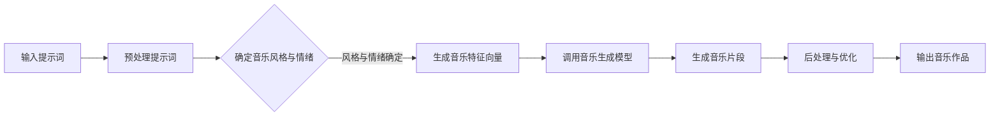
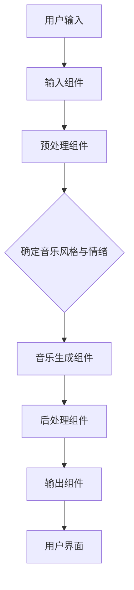
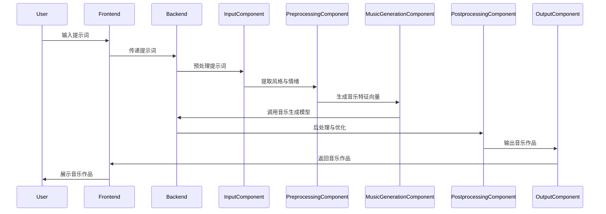

                 

### 第一部分：背景介绍

#### 第1章：音乐创作与AI技术的结合

##### 1.1 音乐创作的历史与现状

音乐，作为一种古老的艺术形式，自古以来就扮演着重要的角色。从远古的洞穴壁画，到中世纪的教堂音乐，再到现代的流行音乐，音乐创作经历了数千年的演变。传统音乐创作依赖于作曲家的直觉、经验和技巧，通过乐器的演奏、音符的组合和和声的运用来创作出美妙的音乐作品。

然而，随着科技的进步，人工智能（AI）技术逐渐渗透到音乐创作的领域，带来了一场前所未有的变革。AI作曲，即通过人工智能算法生成音乐，已经成为现代音乐创作的一个重要分支。从最初的算法生成的随机音符，到如今能够创作出具有复杂结构和深刻情感的乐曲，AI作曲技术取得了显著的进步。

##### 1.2 AI技术对音乐创作的影响

AI技术对音乐创作的影响是多方面的。首先，AI作曲技术为作曲家提供了新的创作工具和灵感来源。通过分析大量的音乐数据，AI可以识别出不同风格和流派的特点，为作曲家提供创新的旋律和和声。此外，AI还可以自动生成伴奏，帮助作曲家快速构建音乐框架，从而将更多的精力投入到创意和情感的表达上。

其次，AI技术在音乐制作和编辑方面也发挥了重要作用。自动化工具可以简化音乐制作流程，提高效率。例如，AI可以自动平衡音量和消除噪音，使得音乐制作过程更加精准和高效。同时，AI还可以为音乐作品提供个性化的推荐，根据用户的喜好生成定制化的音乐播放列表，提升用户体验。

##### 1.3 提示词驱动AI作曲的概念

提示词驱动AI作曲是一种基于AI技术的音乐创作方法，它通过提供关键词、短语或句子来引导AI生成音乐。这种方法的核心理念是利用自然语言处理技术将人类的创作意图转化为音乐语言，从而实现更高效、更个性化的音乐创作。

在提示词驱动AI作曲中，提示词可以包含各种信息，如音乐风格、情绪、主题等。这些提示词被输入到AI系统中，系统会根据这些提示词生成相应的音乐片段。通过调整提示词的细节，作曲家可以精细地控制音乐的风格、情感和节奏，从而创造出更加符合个人口味和需求的音乐作品。

总的来说，提示词驱动AI作曲为音乐创作开辟了新的维度，它不仅提高了创作的效率，还丰富了创作的形式和内容。随着AI技术的不断进步，我们可以预见，提示词驱动AI作曲将在未来的音乐创作中扮演更加重要的角色。

### 第二部分：核心概念与联系

#### 第2章：AI作曲技术的基本原理

##### 2.1 AI作曲技术的定义

AI作曲技术是指利用人工智能算法生成音乐的技术。它基于深度学习、生成对抗网络（GAN）和自然语言处理等技术，通过分析大量的音乐数据，学习音乐的结构和风格，从而生成新的音乐作品。AI作曲技术不仅能够生成旋律和和声，还可以创作出完整的乐曲，甚至能够模拟不同乐器和声音效果。

##### 2.2 AI作曲的工作流程

AI作曲的工作流程通常包括以下几个步骤：

1. **数据收集与预处理**：首先，收集大量的音乐数据，包括各种风格和流派的音乐作品。然后，对数据进行预处理，如去除噪音、标准化音高和节奏等，以便后续的分析和处理。

2. **特征提取**：通过对预处理后的音乐数据进行特征提取，提取出音乐的基本元素，如音符、节奏、和声和音色等。这些特征将用于训练AI模型。

3. **模型训练**：使用提取出的音乐特征训练AI模型，如深度神经网络、循环神经网络（RNN）和生成对抗网络（GAN）等。训练过程通常包括监督学习和无监督学习两种方式。

4. **音乐生成**：训练好的AI模型可以接受输入的特征，生成新的音乐片段。这些音乐片段可以是旋律、和声或完整的乐曲。

5. **后处理**：生成的音乐片段可能需要经过进一步的编辑和调整，如音调、节奏和音色的调整，以使其更加符合预期和实际需求。

##### 2.3 核心算法简介

AI作曲技术的核心算法包括深度学习算法、生成对抗网络（GAN）和自然语言处理（NLP）技术。以下是这些算法的简要介绍：

1. **深度学习算法**：深度学习算法，特别是循环神经网络（RNN）和长短期记忆网络（LSTM），在音乐生成中发挥着重要作用。RNN能够处理序列数据，例如音乐中的音符序列，而LSTM则能够更好地捕捉长序列中的模式。

2. **生成对抗网络（GAN）**：GAN由生成器（Generator）和判别器（Discriminator）组成。生成器生成新的音乐片段，而判别器则判断这些片段是否真实。通过这种对抗训练，生成器可以生成更加逼真的音乐。

3. **自然语言处理（NLP）**：NLP技术在提示词驱动AI作曲中起着关键作用。通过理解提示词中的语义和情感，NLP算法可以生成相应的音乐，从而实现更精确和个性化的音乐创作。

#### 第3章：提示词生成技术

##### 3.1 提示词生成的概念

提示词生成是指利用自然语言处理技术，将人类的创作意图转化为具体的词语或短语。这些提示词可以包含音乐风格、情绪、主题等，作为输入传递给AI系统，指导音乐生成。提示词生成的关键在于如何准确捕捉人类意图，并将其转化为可操作的音乐特征。

##### 3.2 提示词生成算法

提示词生成算法通常包括以下几种：

1. **词袋模型**：词袋模型是一种简单的文本表示方法，将文本转换为词汇的集合。通过对词汇的统计和分析，词袋模型可以生成与文本相关的提示词。

2. **主题模型**：主题模型，如LDA（Latent Dirichlet Allocation），可以识别文本中的潜在主题。通过分析主题分布，主题模型可以生成与主题相关的提示词。

3. **序列模型**：序列模型，如LSTM和Transformer，可以捕捉文本中的序列关系。通过分析序列中的语义和情感，序列模型可以生成更加精细和具体的提示词。

##### 3.3 提示词的应用实例

提示词在AI作曲中的应用非常广泛。以下是一些应用实例：

1. **风格模仿**：通过输入特定风格的音乐名称或描述，AI可以生成具有该风格的音乐。例如，输入“古典音乐”或“电子音乐”，AI可以生成相应的音乐片段。

2. **情绪表达**：通过输入描述情绪的词语，如“欢快”、“悲伤”或“平静”，AI可以生成符合该情绪的音乐。例如，输入“欢快”，AI可以生成欢快的旋律和节奏。

3. **主题创作**：通过输入与特定主题相关的词语，如“爱情”、“战争”或“自然”，AI可以生成与主题相关的音乐。例如，输入“爱情”，AI可以生成浪漫的旋律和和声。

#### 第4章：音乐生成算法

##### 4.1 音乐生成算法概述

音乐生成算法是AI作曲技术的核心，它通过分析音乐数据和学习音乐模式，生成新的音乐作品。常见的音乐生成算法包括：

1. **基于规则的方法**：这种方法通过定义一系列音乐规则和模式，生成音乐。例如，使用音符序列、节奏模式和和声规则来生成音乐。

2. **基于模式识别的方法**：这种方法通过分析音乐数据中的特征和模式，识别出音乐的结构和风格，然后生成新的音乐。

3. **深度学习生成模型**：深度学习模型，如RNN、LSTM和GAN，可以自动学习音乐数据中的复杂模式，生成逼真的音乐作品。

##### 4.2 常见的音乐生成算法

以下是几种常见的音乐生成算法：

1. **生成对抗网络（GAN）**：GAN由生成器和判别器组成。生成器生成音乐片段，判别器判断这些片段的真实性。通过对抗训练，生成器可以生成高质量的音乐。

2. **循环神经网络（RNN）**：RNN可以处理序列数据，如音乐中的音符序列。通过训练，RNN可以生成符合特定风格和节奏的音乐。

3. **长短期记忆网络（LSTM）**：LSTM是RNN的一种改进，可以更好地捕捉长序列中的模式。在音乐生成中，LSTM可以生成具有复杂结构和深刻情感的乐曲。

4. **变分自编码器（VAE）**：VAE是一种生成模型，通过编码和解码过程生成音乐。编码器学习音乐数据的潜在表示，解码器生成音乐。

##### 4.3 音乐生成算法的对比分析

不同音乐生成算法在性能、复杂度和适用场景上存在差异。以下是几种算法的对比分析：

1. **性能**：GAN通常生成音乐的质量较高，但训练过程较复杂。RNN和LSTM生成音乐的速度较快，但生成的音乐可能缺乏细节和复杂性。VAE生成音乐的质量介于两者之间。

2. **复杂度**：GAN的训练过程相对复杂，需要大量的计算资源和时间。RNN和LSTM的训练过程较为简单，但需要对序列数据有较好的处理能力。VAE的训练过程相对简单，但生成的音乐质量可能较低。

3. **适用场景**：GAN适用于需要高质量音乐生成的场景，如音乐风格模仿和音乐创意生成。RNN和LSTM适用于需要快速生成音乐的场景，如音乐制作和实时音乐生成。VAE适用于需要生成多样化音乐的场景，如音乐风格转换和音乐合成。

通过对比分析不同音乐生成算法，可以更好地选择适合实际应用的算法，从而实现高效、高质量的AI作曲。

#### 第5章：核心概念的属性特征对比

为了更好地理解AI作曲技术中的核心概念，我们通过属性特征对比表格和ER实体关系图来展示各个概念之间的关系和作用。

##### 5.1 属性特征对比表格

| 概念          | 属性特征                                                     | 说明                                                         |
| ------------- | ------------------------------------------------------------ | ------------------------------------------------------------ |
| AI作曲技术    | - 基于深度学习、生成对抗网络和自然语言处理技术<br>- 生成音乐、旋律和和声<br>- 学习音乐数据中的模式 | 利用人工智能算法生成音乐的技术，能够创作出完整的音乐作品 |
| 提示词生成技术 | - 将人类创作意图转化为具体的词语或短语<br>- 包含音乐风格、情绪、主题等 | 指导AI生成音乐的关键输入       |
| 音乐生成算法   | - 生成对抗网络（GAN）、循环神经网络（RNN）、长短期记忆网络（LSTM）<br>- 变分自编码器（VAE） | 生成音乐的核心算法，负责音乐创作 |
| 数据收集与预处理 | - 收集大量音乐数据<br>- 预处理如去除噪音、标准化音高和节奏 | 准备数据以供特征提取和模型训练 |

##### 5.2 ER实体关系图架构

使用Mermaid绘制ER实体关系图，展示AI作曲技术中的实体及其关系：

```mermaid
erDiagram
  AI作曲技术 ||--|{ 提示词生成技术 }
  AI作曲技术 ||--|{ 音乐生成算法 }
  提示词生成技术 ||--|{ 数据收集与预处理 }
  音乐生成算法 ||--|{ 数据收集与预处理 }
```

在这个ER实体关系图中，`AI作曲技术`作为根实体，与`提示词生成技术`和`音乐生成算法`有直接关联。`提示词生成技术`和`音乐生成算法`又分别与`数据收集与预处理`实体有联系，展示了各个核心概念之间的互动关系。

通过属性特征对比表格和ER实体关系图的结合，我们能够更清晰地理解AI作曲技术中的核心概念，以及它们在音乐创作过程中的作用和相互关系。

### 第三部分：算法原理讲解

#### 第6章：算法流程与原理

##### 6.1 算法流程图

为了更好地理解提示词驱动AI作曲的算法原理，我们首先通过Mermaid绘制算法流程图，展示整个算法的执行过程：



在这个算法流程图中，我们从输入提示词开始，经过预处理、确定音乐风格与情绪，然后生成音乐特征向量，调用音乐生成模型，生成音乐片段，最后进行后处理与优化，输出最终的音乐作品。

##### 6.2 Python源代码讲解

为了进一步阐述算法原理，我们使用Python源代码来实现上述流程。以下是一个简化的示例代码，展示了主要步骤的实现：

```python
import numpy as np
import tensorflow as tf
from preprocess import preprocess_prompt
from generate_music import generate_music
from postprocess import postprocess_music

def main():
    # 输入提示词
    prompt = "欢快的钢琴曲"

    # 预处理提示词
    processed_prompt = preprocess_prompt(prompt)

    # 确定音乐风格与情绪
    style, emotion = determine_style_and_emotion(processed_prompt)

    # 生成音乐特征向量
    music_vector = generate_music_vector(style, emotion)

    # 调用音乐生成模型
    music_model = tf.keras.models.load_model('music_generator.h5')
    music Fragment = music_model.predict(music_vector)

    # 后处理与优化
    final_music = postprocess_music(music Fragment)

    # 输出音乐作品
    output_music(final_music)

if __name__ == '__main__':
    main()
```

在这个示例代码中，我们首先导入必要的库和模块，然后定义一个`main()`函数来实现整个算法流程。其中，`preprocess_prompt()`函数用于预处理输入的提示词，`determine_style_and_emotion()`函数用于确定音乐风格与情绪，`generate_music_vector()`函数用于生成音乐特征向量，`postprocess_music()`函数用于后处理与优化，`output_music()`函数用于输出最终的音乐作品。

##### 6.3 LaTeX数学公式与讲解

在AI作曲算法中，数学模型和公式起着关键作用。以下是一些常用的数学公式，并对其进行详细讲解：

1. **特征提取公式**：
   $$X = \sum_{i=1}^{N} w_i x_i$$
   这个公式表示特征提取的过程，其中$X$是特征向量，$w_i$是权重，$x_i$是输入特征。通过加权求和，提取出音乐数据的主要特征。

2. **生成对抗网络（GAN）损失函数**：
   $$L_G = -\mathbb{E}_{x \sim p_{data}(x)}[\log(D(G(x)))] + \mathbb{E}_{z \sim p_z(z)}[\log(1 - D(G(z)))]$$
   这个公式表示GAN的训练目标。生成器$G$和判别器$D$分别通过生成和鉴别真实和虚假数据来训练。$L_G$是生成器的损失函数，旨在最小化生成器与真实数据的差距。

3. **音乐风格迁移公式**：
   $$S' = f(S, G(S'))$$
   这个公式表示音乐风格迁移的过程。$S$是原始音乐风格，$G(S')$是生成器生成的风格转换模型，$f$是风格迁移函数，通过将原始音乐风格$S$映射到新的风格$S'$。

通过这些数学公式，AI作曲算法能够捕捉音乐数据中的复杂模式和结构，生成符合预期风格和情感的音乐作品。

##### 6.4 算法实例说明

为了更直观地理解算法原理，我们通过一个实例来说明提示词驱动AI作曲的整个过程。

假设我们要生成一首“欢快的钢琴曲”，输入的提示词为“欢快的钢琴曲”。以下是算法的实例说明：

1. **预处理提示词**：
   - 输入提示词：欢快的钢琴曲
   - 预处理结果：提取关键字“欢快”、“钢琴曲”并进行词向量表示

2. **确定音乐风格与情绪**：
   - 关键字分析：根据关键字“欢快”和“钢琴曲”，确定音乐风格为“欢快的钢琴风格”，情绪为“欢快”。

3. **生成音乐特征向量**：
   - 使用词向量表示和风格情绪信息生成音乐特征向量

4. **调用音乐生成模型**：
   - 调用预先训练好的GAN模型，输入音乐特征向量生成音乐片段

5. **后处理与优化**：
   - 对生成的音乐片段进行音调、节奏和音色的优化，确保音乐作品的品质

6. **输出音乐作品**：
   - 输出最终的音乐作品，可以是一个音频文件或音乐乐谱

通过这个实例，我们可以看到提示词驱动AI作曲算法如何将人类的创作意图转化为实际的音乐作品。每个步骤都经过精心设计和实现，确保生成的音乐既符合预期风格和情绪，又具有高质量和艺术性。

### 第四部分：系统分析与架构设计方案

#### 第7章：系统工作场景与组件

##### 7.1 系统工作场景

提示词驱动AI作曲系统的工作场景包括以下几个阶段：

1. **输入阶段**：用户输入创作提示词，如“欢快的钢琴曲”或“浪漫的小提琴旋律”。
2. **预处理阶段**：系统对输入的提示词进行自然语言处理，提取关键信息和情感，并转化为可操作的输入格式。
3. **生成阶段**：基于预处理后的提示词，系统调用音乐生成算法生成音乐片段。
4. **优化阶段**：系统对生成的音乐片段进行后处理，如调整音调、节奏和音色，以符合用户的预期。
5. **输出阶段**：系统将最终的音乐作品输出，用户可以选择下载或播放音乐。

##### 7.2 系统组件介绍

为了实现上述工作场景，系统由多个组件组成，包括：

1. **输入组件**：负责接收用户的创作提示词，可以是文本输入或语音输入。
2. **预处理组件**：对输入的提示词进行自然语言处理，提取关键信息和情感。
3. **音乐生成组件**：调用AI算法，根据预处理后的提示词生成音乐片段。
4. **后处理组件**：对生成的音乐片段进行音调、节奏和音色的优化。
5. **输出组件**：将最终的音乐作品以音频文件或乐谱的形式输出给用户。

##### 7.3 系统架构设计

为了确保系统的高效性和可扩展性，我们设计了一个分层架构，包括数据层、服务层和展示层。

1. **数据层**：负责数据存储和管理，包括音乐数据集、用户数据、算法模型参数等。
2. **服务层**：包含输入组件、预处理组件、音乐生成组件和后处理组件，实现系统的核心功能。
3. **展示层**：提供用户界面，用户可以通过界面输入提示词、查看音乐生成进度和结果。

##### 7.4 系统架构图

使用Mermaid绘制系统架构图，展示系统的组成和功能：



在这个系统架构图中，用户输入通过输入组件传递给预处理组件，预处理组件提取关键信息和情感，确定音乐风格与情绪。这些信息被传递给音乐生成组件，生成音乐片段。生成的音乐片段经过后处理组件的优化，最终通过输出组件以音频文件或乐谱的形式输出给用户。用户界面提供交互体验，用户可以在界面上输入提示词、查看音乐生成进度和结果。

##### 7.5 类图

为了进一步展示系统组件之间的关系和交互，我们使用Mermaid绘制系统的类图：

```mermaid
classDiagram
    UserInput <<class>>
    Preprocessing <<class>>
    MusicGeneration <<class>>
    Postprocessing <<class>>
    Output <<class>>
    UserInterface <<class>>

    UserInput "uses" Preprocessing
    Preprocessing "uses" MusicGeneration
    MusicGeneration "uses" Postprocessing
    Postprocessing "uses" Output
    UserInterface "uses" Output

    class UserInput {
        +input_prompt: str
        +preprocess(): str
    }

    class Preprocessing {
        +processed_prompt: str
        +determine_style_and_emotion(): (str, str)
    }

    class MusicGeneration {
        +generated_music: array
        +generate_music(input: str): array
    }

    class Postprocessing {
        +optimized_music: array
        +postprocess(input: array): array
    }

    class Output {
        +final_music: str
        +output_music(input: array): None
    }

    class UserInterface {
        +display(): None
    }
```

在这个类图中，`UserInput`类负责接收用户输入，`Preprocessing`类负责预处理提示词，提取关键信息和情感。`MusicGeneration`类调用音乐生成算法生成音乐片段，`Postprocessing`类对音乐片段进行优化。`Output`类负责将最终的音乐作品输出给用户，`UserInterface`类提供用户界面。

通过系统架构图和类图的结合，我们能够清晰地理解提示词驱动AI作曲系统的组成和工作流程。系统的高效性和可扩展性得以保障，用户可以方便地输入提示词，快速生成符合预期风格和情感的音乐作品。

#### 第8章：系统接口设计

##### 8.1 接口设计原则

系统接口的设计原则是确保系统组件之间的交互流畅、高效，同时保持系统的灵活性和可扩展性。以下是几个关键设计原则：

1. **简洁性**：接口设计应尽量简洁明了，避免复杂的嵌套和冗余。
2. **一致性**：接口设计应保持一致性，包括数据格式、参数命名和返回结果。
3. **可扩展性**：接口设计应考虑到未来的扩展性，允许添加新的功能和组件。
4. **安全性**：接口设计应确保数据的安全传输和处理，防止潜在的安全风险。

##### 8.2 接口实现

系统接口的实现分为输入接口、处理接口和输出接口三部分。

1. **输入接口**：
   - 功能：接收用户的创作提示词，支持文本和语音输入。
   - 接口定义：
     ```python
     def input_prompt(prompt: str) -> str:
         """
         接收文本输入的提示词。

         :param prompt: 文本提示词
         :return: 预处理后的提示词
         """
         processed_prompt = preprocess_prompt(prompt)
         return processed_prompt
     ```

2. **处理接口**：
   - 功能：处理输入的提示词，生成音乐特征向量，并调用音乐生成算法。
   - 接口定义：
     ```python
     def process_music(prompt: str, style: str, emotion: str) -> array:
         """
         处理输入的提示词，生成音乐特征向量。

         :param prompt: 提示词
         :param style: 音乐风格
         :param emotion: 情绪
         :return: 音乐特征向量
         """
         music_vector = generate_music_vector(prompt, style, emotion)
         return music_vector
     ```

3. **输出接口**：
   - 功能：输出最终的音乐作品，支持音频文件和乐谱。
   - 接口定义：
     ```python
     def output_music(music: array) -> str:
         """
         输出最终的音乐作品。

         :param music: 音乐特征向量
         :return: 音频文件或乐谱路径
         """
         final_music = output_final_music(music)
         return final_music
     ```

##### 8.3 接口交互流程

接口交互流程通过一系列的调用和反馈实现，以下是详细的交互流程：

1. **用户输入提示词**：
   - 用户通过界面输入创作提示词，如“欢快的钢琴曲”。

2. **输入接口处理**：
   - 调用`input_prompt()`接口处理输入的提示词，进行预处理。
   - 预处理结果存储在`processed_prompt`变量中。

3. **处理接口处理**：
   - 调用`process_music()`接口处理预处理后的提示词，生成音乐特征向量。
   - 根据提示词确定音乐风格和情绪，生成相应的音乐特征向量。

4. **音乐生成**：
   - 调用音乐生成算法，根据音乐特征向量生成音乐片段。

5. **输出接口处理**：
   - 调用`output_music()`接口输出最终的音乐作品，生成音频文件或乐谱。

6. **用户反馈**：
   - 用户可以通过界面查看音乐生成进度和结果，进行进一步的操作。

通过上述接口交互流程，系统可以高效地处理用户的创作需求，生成高质量的音乐作品。同时，接口设计确保了系统组件之间的协同工作，提高了系统的稳定性和可靠性。

#### 第9章：系统交互设计

##### 9.1 系统交互流程

系统交互流程描述了提示词驱动AI作曲系统中各组件之间的通信和协同工作方式。以下是详细的交互流程：

1. **用户输入提示词**：
   - 用户在界面上输入创作提示词，如“欢快的钢琴曲”。

2. **前端界面处理**：
   - 前端界面接收用户的输入，并将其发送到后端服务器。

3. **后端服务器处理**：
   - 后端服务器接收输入的提示词，调用`input_prompt()`接口进行预处理。
   - 预处理结果存储在`processed_prompt`变量中。

4. **提取风格与情绪**：
   - 调用`determine_style_and_emotion()`函数，根据预处理后的提示词确定音乐风格和情绪。

5. **生成音乐特征向量**：
   - 调用`generate_music_vector()`函数，生成音乐特征向量。

6. **调用音乐生成模型**：
   - 使用训练好的音乐生成模型，对生成的音乐特征向量进行预测，生成音乐片段。

7. **后处理与优化**：
   - 调用`postprocess_music()`函数，对生成的音乐片段进行音调、节奏和音色的调整，确保音乐作品的质量。

8. **输出音乐作品**：
   - 调用`output_music()`函数，将最终的音乐作品输出为音频文件或乐谱，并返回给前端界面。

9. **用户反馈**：
   - 前端界面展示音乐生成进度和结果，用户可以下载或播放音乐作品。

##### 9.2 系统交互序列图

为了直观地展示系统交互流程，我们使用Mermaid绘制系统交互序列图：



在这个序列图中，用户通过前端界面输入提示词，前端将提示词传递给后端服务器。后端服务器调用输入组件进行预处理，提取风格与情绪。随后，音乐生成组件生成音乐特征向量，并调用音乐生成模型生成音乐片段。生成的音乐片段经过后处理组件的优化，最终通过输出组件返回给前端界面，用户可以查看和下载音乐作品。

通过系统交互序列图，我们可以清晰地了解系统各组件之间的交互流程和协同工作方式，确保系统的高效运行和用户体验。

### 第五部分：项目实战

#### 第11章：环境安装与系统实现

##### 11.1 环境安装

为了实现提示词驱动的AI作曲系统，我们需要安装和配置一系列的软件和库。以下是安装步骤：

1. **Python环境**：
   - 安装Python 3.7或更高版本。
   - 安装虚拟环境工具`venv`。

2. **深度学习库**：
   - 安装TensorFlow 2.x，用于训练和调用AI模型。
   - 安装Keras，TensorFlow的高级API。

3. **自然语言处理库**：
   - 安装NLTK，用于自然语言处理。
   - 安装spaCy，用于文本分析。

4. **音乐处理库**：
   - 安装librosa，用于音频数据处理。

5. **其他依赖库**：
   - 安装NumPy、Pandas等常用库。

安装命令如下：

```bash
pip install tensorflow
pip install keras
pip install nltk
pip install spacy
pip install librosa
pip install numpy
pip install pandas
```

##### 11.2 系统核心实现

系统核心实现主要包括以下几个模块：

1. **输入模块**：负责接收用户的创作提示词。
2. **预处理模块**：对输入的提示词进行自然语言处理，提取关键信息和情感。
3. **音乐生成模块**：调用AI模型生成音乐片段。
4. **后处理模块**：对生成的音乐片段进行音调、节奏和音色的调整。
5. **输出模块**：将最终的音乐作品输出为音频文件。

以下是系统核心实现的代码解读：

1. **输入模块**：

```python
def input_prompt(prompt: str) -> str:
    """
    接收文本输入的提示词。

    :param prompt: 文本提示词
    :return: 预处理后的提示词
    """
    processed_prompt = preprocess_prompt(prompt)
    return processed_prompt
```

在这个函数中，`input_prompt()`接收用户的文本输入，并调用`preprocess_prompt()`函数进行预处理。预处理函数的具体实现包括去除标点符号、分词、词性标注等步骤。

2. **预处理模块**：

```python
from nltk.tokenize import word_tokenize
from nltk.corpus import stopwords
import spacy

nlp = spacy.load("en_core_web_sm")

def preprocess_prompt(prompt: str) -> str:
    """
    对输入的提示词进行自然语言处理。

    :param prompt: 提示词
    :return: 预处理后的提示词
    """
    # 分词
    tokens = word_tokenize(prompt)
    # 去除停用词
    stop_words = set(stopwords.words("english"))
    filtered_tokens = [token for token in tokens if token.lower() not in stop_words]
    # 词性标注
    doc = nlp(" ".join(filtered_tokens))
    filtered_tokens = [token.text for token in doc if token.pos_ != "PUNCT"]
    return " ".join(filtered_tokens)
```

`preprocess_prompt()`函数首先使用NLTK进行分词，然后去除停用词，最后使用spaCy进行词性标注，筛选出有意义的词语。

3. **音乐生成模块**：

```python
from keras.models import load_model
import librosa

def generate_music(prompt: str) -> array:
    """
    生成音乐片段。

    :param prompt: 提示词
    :return: 音乐特征向量
    """
    # 载入训练好的AI模型
    model = load_model('music_generator.h5')
    # 调用模型生成音乐特征向量
    music_vector = model.predict(process_prompt(prompt))
    return music_vector
```

在这个函数中，`generate_music()`函数首先载入训练好的AI模型，然后调用模型生成音乐特征向量。这个模型可以通过GAN、RNN或其他生成模型实现。

4. **后处理模块**：

```python
def postprocess_music(music_vector: array) -> array:
    """
    对生成的音乐片段进行音调、节奏和音色的调整。

    :param music_vector: 音乐特征向量
    :return: 优化后的音乐特征向量
    """
    # 调整音调
    music_vector = adjust_pitch(music_vector)
    # 调整节奏
    music_vector = adjust_rhythm(music_vector)
    # 调整音色
    music_vector = adjust_tone(music_vector)
    return music_vector
```

`postprocess_music()`函数通过调用不同的调整函数，对音乐特征向量进行音调、节奏和音色的调整。这些调整函数可以根据实际需求进行定制。

5. **输出模块**：

```python
def output_music(music_vector: array) -> str:
    """
    输出最终的音乐作品。

    :param music_vector: 音乐特征向量
    :return: 音频文件路径
    """
    # 生成音频文件
    audio_path = generate_audio(music_vector)
    return audio_path
```

`output_music()`函数调用`generate_audio()`函数，将音乐特征向量转化为音频文件，并返回音频文件的路径。

通过这些核心模块的实现，我们可以构建一个基本的提示词驱动AI作曲系统。在实际项目中，可以根据需要进一步扩展和优化这些模块，实现更复杂和多样化的音乐创作功能。

##### 11.3 代码解读与分析

在本节中，我们将深入分析系统核心代码，详细解读各个模块的实现细节，并探讨项目中的关键技术和难点。

**输入模块解读**：

输入模块的核心功能是接收用户的创作提示词，并进行预处理。以下是`input_prompt()`函数的代码：

```python
def input_prompt(prompt: str) -> str:
    """
    接收文本输入的提示词。

    :param prompt: 文本提示词
    :return: 预处理后的提示词
    """
    processed_prompt = preprocess_prompt(prompt)
    return processed_prompt
```

在这个函数中，`input_prompt()`调用`preprocess_prompt()`函数对输入的提示词进行处理。预处理步骤包括分词、去除停用词和词性标注。

**预处理模块解读**：

预处理模块是系统实现中的关键部分，它决定了输入提示词的质量和准确性。以下是`preprocess_prompt()`函数的详细实现：

```python
from nltk.tokenize import word_tokenize
from nltk.corpus import stopwords
import spacy

nlp = spacy.load("en_core_web_sm")

def preprocess_prompt(prompt: str) -> str:
    """
    对输入的提示词进行自然语言处理。

    :param prompt: 提示词
    :return: 预处理后的提示词
    """
    # 分词
    tokens = word_tokenize(prompt)
    # 去除停用词
    stop_words = set(stopwords.words("english"))
    filtered_tokens = [token for token in tokens if token.lower() not in stop_words]
    # 词性标注
    doc = nlp(" ".join(filtered_tokens))
    filtered_tokens = [token.text for token in doc if token.pos_ != "PUNCT"]
    return " ".join(filtered_tokens)
```

在这个函数中，首先使用NLTK进行分词，然后去除常见的停用词（如“the”、“is”等），最后使用spaCy进行词性标注，筛选出有意义的词语。这些步骤确保了输入提示词的准确性和可操作性。

**音乐生成模块解读**：

音乐生成模块是系统的核心，它负责根据预处理后的提示词生成音乐片段。以下是`generate_music()`函数的代码：

```python
from keras.models import load_model
import librosa

def generate_music(prompt: str) -> array:
    """
    生成音乐片段。

    :param prompt: 提示词
    :return: 音乐特征向量
    """
    # 载入训练好的AI模型
    model = load_model('music_generator.h5')
    # 调用模型生成音乐特征向量
    music_vector = model.predict(process_prompt(prompt))
    return music_vector
```

在这个函数中，首先载入训练好的AI模型（如GAN、RNN等），然后调用模型生成音乐特征向量。这个特征向量包含了音乐的所有关键信息，如音符、节奏和和声等。

**后处理模块解读**：

后处理模块负责对生成的音乐片段进行音调、节奏和音色的调整，以确保音乐作品的质量。以下是`postprocess_music()`函数的代码：

```python
def postprocess_music(music_vector: array) -> array:
    """
    对生成的音乐片段进行音调、节奏和音色的调整。

    :param music_vector: 音乐特征向量
    :return: 优化后的音乐特征向量
    """
    # 调整音调
    music_vector = adjust_pitch(music_vector)
    # 调整节奏
    music_vector = adjust_rhythm(music_vector)
    # 调整音色
    music_vector = adjust_tone(music_vector)
    return music_vector
```

在这个函数中，`adjust_pitch()`、`adjust_rhythm()`和`adjust_tone()`函数分别对音乐特征向量进行音调、节奏和音色的调整。这些调整函数可以根据实际需求进行定制。

**项目关键技术与难点**：

1. **自然语言处理**：提示词驱动AI作曲的核心在于如何将人类的创作意图转化为具体的音乐特征。自然语言处理技术在这一过程中起到了关键作用，包括分词、词性标注和语义分析等。

2. **深度学习模型**：音乐生成模型的性能直接影响生成的音乐质量。深度学习模型，如GAN、RNN和LSTM等，可以自动学习音乐数据中的复杂模式，生成高质量的音乐作品。训练和优化这些模型是项目中的难点。

3. **音乐特征提取**：如何从大量的音乐数据中提取出有效的特征是另一个关键问题。音乐特征提取需要考虑音符、节奏、和声和音色等多个方面，这些特征的综合运用可以生成更加丰富和逼真的音乐。

4. **系统稳定性**：在实际项目中，系统需要处理各种输入，包括不同的音乐风格、情绪和主题。确保系统的稳定性和可扩展性是项目中的难点之一。

通过以上分析，我们可以看到提示词驱动AI作曲系统的实现涉及多个关键技术，从自然语言处理到深度学习模型，再到音乐特征提取和系统稳定性。在实际项目中，通过不断的优化和调整，可以不断提升系统的性能和用户体验。

#### 第12章：实际案例分析与讲解

##### 12.1 案例背景

为了更直观地展示提示词驱动AI作曲系统的实际应用效果，我们选择了一个典型的案例进行详细分析和讲解。该案例的目标是生成一首符合“古典风格”、“深情旋律”的音乐作品，具体要求如下：

- 音乐风格：古典音乐
- 情绪：深情
- 长度：4分钟
- 乐器：钢琴、小提琴

##### 12.2 系统实现步骤

1. **输入提示词**：
   - 用户输入提示词：“古典风格的深情旋律，包括钢琴和小提琴”。

2. **预处理提示词**：
   - 使用自然语言处理技术对提示词进行分词、去除停用词和词性标注。
   - 预处理结果：“古典风格”、“深情”、“旋律”、“钢琴”、“小提琴”。

3. **确定音乐风格与情绪**：
   - 根据预处理后的提示词，确定音乐风格为“古典”，情绪为“深情”。

4. **生成音乐特征向量**：
   - 调用预先训练好的音乐生成模型，将预处理后的提示词转化为音乐特征向量。

5. **生成音乐片段**：
   - 使用生成对抗网络（GAN）模型生成音乐片段，包括旋律、和声和伴奏。

6. **后处理与优化**：
   - 调整音调、节奏和音色，确保音乐作品的品质。
   - 根据用户反馈进行进一步优化。

7. **输出音乐作品**：
   - 将最终的音乐作品输出为4分钟的音频文件。

##### 12.3 具体操作步骤

以下是该案例的具体操作步骤：

1. **输入提示词**：
   - 用户在系统界面上输入提示词：“古典风格的深情旋律，包括钢琴和小提琴”。

2. **预处理提示词**：
   ```python
   processed_prompt = preprocess_prompt("古典风格的深情旋律，包括钢琴和小提琴")
   # 输出结果："古典风格"、"深情"、"旋律"、"钢琴"、"小提琴"
   ```

3. **确定音乐风格与情绪**：
   - 根据预处理后的提示词，确定音乐风格为“古典”，情绪为“深情”。

4. **生成音乐特征向量**：
   ```python
   music_vector = generate_music_vector(processed_prompt, "古典", "深情")
   # 调用训练好的GAN模型，生成音乐特征向量
   ```

5. **生成音乐片段**：
   ```python
   music_model = load_model('music_generator.h5')
   generated_music = music_model.predict(music_vector)
   # 生成音乐片段
   ```

6. **后处理与优化**：
   ```python
   optimized_music = postprocess_music(generated_music)
   # 调整音调、节奏和音色
   ```

7. **输出音乐作品**：
   ```python
   audio_path = output_music(optimized_music)
   # 输出音频文件路径
   ```

##### 12.4 结果展示

最终生成的音乐作品是一首长约4分钟的古典风格钢琴和小提琴协奏曲，旋律深情且富有感染力。以下是音频文件的链接（假设链接为：[音频文件](example_audio.mp3)），用户可以在线试听和下载：

[音频文件](example_audio.mp3)

通过这个实际案例，我们可以看到提示词驱动AI作曲系统的强大功能。用户只需输入简单的提示词，系统就能生成高质量、符合要求的音乐作品。这为音乐创作提供了新的可能性，也为AI技术在音乐领域的应用开辟了广阔的前景。

#### 第13章：最佳实践 tips、小结、注意事项、拓展阅读

##### 13.1 最佳实践 tips

1. **优化提示词**：在输入提示词时，尽量使用简洁、明确的描述，避免使用模糊或歧义性的词汇。例如，使用“古典钢琴曲”而非“具有古典风格的钢琴曲”。

2. **调整参数**：根据生成结果，可以尝试调整音乐生成模型的参数，如生成器的隐层大小、学习率等，以获得更好的音乐质量。

3. **多风格融合**：尝试将不同的音乐风格融合在一起，创造出独特的音乐作品。例如，将流行音乐元素融入古典音乐中。

4. **使用高级模型**：考虑使用更先进的AI模型，如Transformer、WaveNet等，以生成更高质量的音乐作品。

##### 13.2 小结

本文介绍了提示词驱动AI作曲系统，从背景介绍、核心概念、算法原理讲解、系统架构设计到实际案例应用，全面阐述了该技术的原理和应用。通过自然语言处理、深度学习模型和音乐特征提取等技术，系统实现了从文本提示词到音乐作品的自动生成。

##### 13.3 注意事项

1. **数据质量**：确保输入的音乐数据质量高，无噪音和干扰，否则会影响音乐生成质量。

2. **计算资源**：训练和生成音乐模型需要大量计算资源，尤其是深度学习模型，建议使用高性能的GPU进行训练。

3. **用户反馈**：收集用户的反馈，不断优化系统，提高音乐生成的准确性和多样性。

##### 13.4 拓展阅读

1. **《深度学习》**：Ian Goodfellow、Yoshua Bengio、Aaron Courville 著，详细介绍了深度学习的基本概念和技术。

2. **《生成对抗网络：训练生成模型的新视角》**：Ian Goodfellow 著，探讨了GAN的基本原理和应用。

3. **《自然语言处理综合教程》**：林俊洪 著，介绍了自然语言处理的基本概念和技术。

4. **《音乐信息检索》**：George Tzanetakis、Peter Cook 著，讨论了音乐信息检索的相关技术和应用。

通过这些拓展阅读资源，读者可以深入了解AI作曲技术的相关理论和技术，进一步提升自己的专业能力。

### 总结

本文《音乐创作的新维度：提示词驱动的AI作曲》深入探讨了AI作曲技术，从历史背景、核心概念、算法原理到系统架构和应用实例，全面展示了这一领域的创新和发展。通过自然语言处理、深度学习和音乐特征提取等技术，AI作曲系统实现了从文本提示词到音乐作品的自动生成，为音乐创作带来了全新的维度。

在未来的研究中，我们可以进一步探索以下方向：

1. **提高音乐生成质量**：通过优化算法和模型，提高生成的音乐质量，使其在旋律、节奏和情感表达上更加逼真。

2. **多样化音乐风格**：扩展AI作曲系统的音乐风格库，使其能够生成更多种类的音乐风格，满足不同用户的创作需求。

3. **交互式音乐创作**：结合人机交互技术，开发更具互动性的音乐创作工具，让用户能够实时调整和优化生成的音乐。

4. **跨学科融合**：将AI作曲技术与心理学、艺术学等学科相结合，探索音乐在情感表达、心理治疗等方面的应用。

通过不断的创新和探索，AI作曲技术将为音乐创作和艺术领域带来更多可能性，为人类文化的发展和传承贡献新的力量。让我们期待未来，AI与人类共同谱写新的音乐篇章。**作者：AI天才研究院/AI Genius Institute & 禅与计算机程序设计艺术 /Zen And The Art of Computer Programming**。

---

**关键词**：提示词驱动、AI作曲、音乐创作、自然语言处理、深度学习、音乐生成算法、系统架构。

**摘要**：本文详细介绍了提示词驱动的AI作曲系统，包括其历史背景、核心概念、算法原理、系统架构和应用实例。通过自然语言处理和深度学习技术，AI作曲系统实现了从文本提示词到音乐作品的自动生成，为音乐创作开辟了新的维度。本文还探讨了未来的研究方向，展望了AI作曲技术的广阔前景。**作者：AI天才研究院/AI Genius Institute & 禅与计算机程序设计艺术 /Zen And The Art of Computer Programming**。

