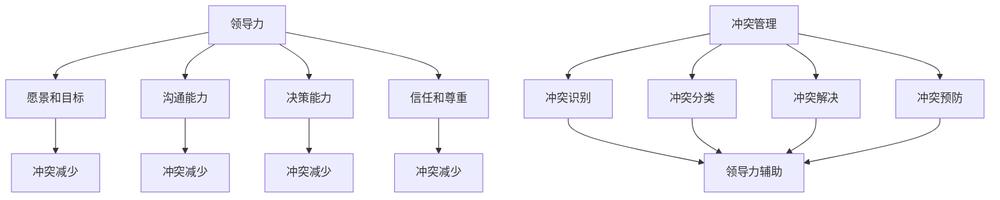

                 

## 引言与背景介绍

### 书名：《领导力与冲突管理：化解团队矛盾的技巧》

在现代企业环境中，领导力和冲突管理已经成为团队成功的关键因素。随着团队规模和复杂性的增加，如何有效提升领导力、管理团队中的冲突，成为每个领导者必须面对的挑战。《领导力与冲突管理：化解团队矛盾的技巧》旨在通过系统的分析和实用的方法，帮助领导者提升团队的整体协作效率。

### 问题背景

团队冲突是企业管理中普遍存在的问题。冲突不仅影响团队的工作氛围，还可能导致资源浪费、项目延期甚至团队解散。根据一项针对全球500家企业的调查，超过80%的企业领导者认为团队冲突是影响工作效率和团队绩效的主要因素之一。因此，有效的冲突管理成为提升团队表现的关键。

### 本书解决的问题

本书将从以下几个方面解决团队冲突和提升领导力的问题：

1. **定义和解释领导力与冲突管理的核心概念**：通过清晰的定义和实例，帮助读者理解这两个关键领域的基本原理。

2. **分析领导力和冲突管理之间的关系**：阐述如何通过领导力来减少冲突，提升团队协作。

3. **提供实用的策略和技巧**：包括冲突识别、分类、管理以及领导力提升的实践方法。

4. **通过案例分析，提供实际操作指南**：结合真实的案例，深入剖析冲突管理的成功经验和失败教训。

5. **探讨团队协作与沟通技巧**：强调良好的沟通在冲突管理中的重要性，提供有效的沟通技巧。

### 目的与目标

本书的目的是为领导者和管理者提供一个全面的指南，帮助他们更好地理解和应对团队冲突，提升领导力，从而提高团队的协作效率和绩效。通过本书的学习，读者将能够：

1. **识别和理解团队冲突的本质**。
2. **掌握有效的冲突管理策略**。
3. **提升自身的领导力，成为更有影响力的领导者**。
4. **建立和谐、高效的团队环境**。

### 总结

在当今快速变化和高度竞争的商业环境中，领导力和冲突管理能力成为企业成功的决定性因素。通过本书的指导，领导者将能够更好地应对团队中的冲突，提升领导力，打造高效的团队，实现企业的长期目标。接下来，我们将深入探讨领导力和冲突管理的核心概念，分析它们之间的联系，并逐步介绍如何通过实际方法和案例来提升这些关键能力。

## 核心概念与联系

### 领导力

领导力是一种能够影响和激励他人，引导团队朝着共同目标前进的能力。它不仅包括指挥和管理的技能，更强调信任、尊重和愿景。根据当代管理学的研究，领导力具有以下几个核心要素：

1. **愿景和目标**：领导者需要有清晰的长远目标和愿景，能够激发团队成员的积极性和创造力。
2. **沟通能力**：有效的沟通是领导力的基础，领导者需要能够清晰表达自己的想法，并倾听团队成员的意见。
3. **决策能力**：在复杂多变的环境中，领导者需要迅速做出明智的决策，并对决策结果承担责任。
4. **信任和尊重**：建立团队内部的信任和尊重是领导力的关键，这有助于提升团队的凝聚力和合作效率。

### 冲突管理

冲突管理是指通过合理的方法和策略，解决和缓解团队内部的矛盾和分歧，以保持团队的稳定和高效运作。冲突管理包括以下几个关键环节：

1. **冲突识别**：及时发现和识别团队中的潜在冲突，避免问题扩大化。
2. **冲突分类**：根据冲突的性质和影响，对冲突进行分类，采取不同的应对策略。
3. **冲突解决**：通过沟通、协商、调解等手段，解决团队内部的冲突，恢复团队的正常运作。
4. **冲突预防**：通过建立良好的团队文化和沟通机制，预防冲突的发生。

### 领导力与冲突管理的关系

领导力和冲突管理之间存在着密切的联系。有效的领导力可以减少冲突，提升团队的协作效率。具体而言，这种联系体现在以下几个方面：

1. **领导力的愿景和目标能够引导团队，减少因目标不一致而产生的冲突**。
2. **沟通能力和信任建立能够促进团队成员之间的理解，减少因误解和偏见引发的冲突**。
3. **决策能力和责任感可以帮助团队在面对冲突时做出合理的选择，避免因决策不当引发的冲突**。
4. **领导力的实践方法和策略可以转化为有效的冲突管理工具，帮助团队解决冲突**。

### 表格与ER图

为了更直观地展示领导力和冲突管理的关系，我们可以使用表格和ER图来描述关键概念和要素。

#### 领导力和冲突管理核心要素表格

| 要素             | 领导力 | 冲突管理 |
|------------------|--------|----------|
| 愿景和目标       | 是     | 否       |
| 沟通能力         | 是     | 是       |
| 决策能力         | 是     | 是       |
| 信任和尊重       | 是     | 是       |
| 冲突识别与分类    | 否     | 是       |
| 冲突解决与预防    | 否     | 是       |

#### 领导力和冲突管理ER图

通过上述表格和ER图，我们可以清晰地看到领导力和冲突管理之间的联系和作用。领导力的各个要素不仅有助于减少冲突，还可以为冲突管理提供有力的支持和工具。接下来，我们将深入探讨领导力的核心原理和实践方法，帮助领导者更好地理解和应用这些关键能力。

## 领导力的原理与实践

### 领导力的核心要素

领导力的成功不仅依赖于领导者的个人特质，更需要其在特定情境下灵活应用的能力。以下是领导力的核心要素及其重要性：

1. **愿景和目标**：领导力的首要任务是设定清晰的愿景和目标。一个明确的愿景能够指引团队的方向，激励团队成员为实现共同目标而努力。根据管理学专家彼得·德鲁克的观点，领导者应该具备“愿景能力”，即能够看到未来的蓝图，并激发团队共同追求这一目标。

2. **沟通能力**：沟通是领导力的核心要素之一。有效的沟通能够确保信息准确传达，减少误解和冲突。领导者需要具备良好的语言和肢体语言，以及倾听和反馈技巧。心理学家阿尔伯特·梅拉比安（Albert Mehrabian）的研究表明，沟通中语言的占比仅为7%，而语调和肢体语言占据了93%的影响力。

3. **决策能力**：领导者在面对复杂多变的环境时，需要迅速做出明智的决策。决策能力不仅包括分析问题的能力，还涉及风险评估和决策执行的勇气。管理学大师彼得·德鲁克指出，有效的领导者应具备“判断力”，即在不确定的环境中做出最佳决策。

4. **信任和尊重**：建立信任和尊重是领导力的基础。领导者需要通过诚信和公正的行为赢得团队成员的信任，并尊重每个成员的贡献和个性。心理学家菲利普·泽利希（Philip Zimbardo）的研究表明，信任和尊重是团队协作和高效工作的关键因素。

### 领导力的发展路径

领导力并非与生俱来，而是可以通过学习和实践逐步培养的。以下是领导力发展的主要路径：

1. **自我认知**：领导者首先需要了解自己的优势和劣势，这有助于他们更好地发挥自身潜力。自我认知可以通过自我反思、心理测试和反馈等方法进行。

2. **知识和技能**：领导者需要具备相关的知识和技能，如管理、战略规划、领导力理论等。通过学习和培训，领导者可以不断提升自己的专业素养。

3. **实践经验**：实际经验是领导力发展的关键。领导者需要通过参与各种项目和挑战，积累实战经验，从而提升领导能力。

4. **导师指导**：找到一个优秀的导师可以帮助领导者快速成长。导师可以提供经验、建议和支持，帮助领导者避免常见错误。

5. **持续学习**：领导力是一个持续的过程，领导者需要不断学习新知识、新技能，以适应不断变化的环境。

### 领导力的实践方法

在实际工作中，领导者可以采用以下几种方法来提升领导力：

1. **设定目标和激励团队**：领导者需要明确团队的短期和长期目标，并通过激励措施，如奖励和认可，激发团队成员的积极性。

2. **建立有效的沟通机制**：领导者需要定期与团队成员进行沟通，确保信息透明和流畅。可以通过会议、邮件、即时通讯等多种方式，保持与团队成员的密切联系。

3. **培养团队合作精神**：通过团队建设活动和培训，提高团队成员之间的协作能力。领导者应该鼓励成员分享观点，共同解决问题。

4. **积极应对挑战**：领导者需要勇于面对挑战和失败，并通过积极的应对措施，带领团队克服困难。

5. **持续反馈和改进**：领导者应定期对团队成员和工作流程进行评估，提供反馈，并根据反馈进行调整和改进。

### 结论

领导力是一种可以通过学习和实践不断提升的能力。领导者不仅需要具备愿景和目标、沟通能力、决策能力以及信任和尊重，还需要通过自我认知、知识和技能、实践经验、导师指导以及持续学习等途径，不断提升自身的领导力。在实际工作中，领导者应灵活运用这些方法，有效提升团队协作效率和绩效，从而实现企业的长期发展目标。

### 冲突管理的原理与方法

冲突管理是领导力的一个重要组成部分，它涉及到识别、分类、解决和预防冲突的一系列方法。有效的冲突管理不仅有助于维持团队的工作环境，还能提升整体绩效。以下将详细探讨冲突管理的核心原理和实用方法。

#### 冲突管理的概念

冲突管理是指通过一系列策略和技巧，解决和缓解团队内部的矛盾和分歧，以保持团队的稳定和高效运作。冲突管理不仅包括在冲突发生后的应对措施，还包括预防冲突发生的策略。根据冲突管理理论，冲突可以分为建设性冲突和破坏性冲突：

1. **建设性冲突**：有助于团队进步和创新的冲突，通常源于团队成员之间的不同观点和意见。
2. **破坏性冲突**：损害团队关系和工作效率的冲突，可能由于误解、个人偏见或资源竞争引起。

#### 冲突的识别与分类

识别和分类冲突是冲突管理的基础。以下是几种常见的冲突识别与分类方法：

1. **行为观察**：通过观察团队成员的行为和互动，识别潜在的冲突。例如，频繁的争吵、逃避问题或情绪激动的行为都可能是冲突的信号。
2. **调查问卷**：设计调查问卷，了解团队成员对团队内部冲突的感受和看法。这种方法有助于客观评估冲突的严重程度和类型。
3. **访谈**：与团队成员进行一对一访谈，深入了解他们的想法和感受，有助于发现深层次的冲突原因。

#### 冲突管理的策略

一旦冲突被识别和分类，接下来就是选择适当的策略来管理和解决冲突。以下是几种常见的冲突管理策略：

1. **避免**：当冲突的严重性较低时，领导者可以选择避免策略，暂时忽略冲突，以减少紧张氛围。这种方法适用于不重要的冲突，但长期避免可能导致问题积累。
2. **妥协**：在双方都有一定合理性的情况下，领导者可以引导双方做出妥协，达成一种中间方案。这种方法有助于迅速解决冲突，但可能导致一方感到不公平。
3. **协作**：通过引导团队成员共同合作，寻找双方都能接受的解决方案。这种方法适用于建设性冲突，有助于提升团队凝聚力和创新性。
4. **强制**：当冲突严重且必须迅速解决时，领导者可以采用强制策略，强制执行某一方的意见。这种方法适用于紧急情况，但可能导致双方不满和抵触。
5. **求同存异**：在某些情况下，领导者可以接受不同的观点，但在关键问题上保持一致性。这种方法有助于保持团队的整体目标，但可能忽视个别成员的需求。

#### 冲突管理的实施步骤

为了有效实施冲突管理，可以遵循以下步骤：

1. **评估冲突**：通过前述方法评估冲突的严重程度和类型。
2. **确定策略**：根据冲突的性质，选择最合适的冲突管理策略。
3. **制定行动计划**：制定具体的行动计划，包括会议议程、讨论主题和解决方案。
4. **执行与监控**：实施行动计划，并持续监控冲突解决的效果，确保问题得到彻底解决。
5. **反馈与改进**：在冲突解决后，收集反馈，评估冲突管理的效果，并据此进行改进。

### 结论

有效的冲突管理是团队成功的关键因素。通过识别和分类冲突，选择适当的冲突管理策略，并遵循实施步骤，领导者可以预防和解决团队中的矛盾和分歧。这不仅有助于维持团队的工作环境，还能提升整体绩效，实现企业的长期目标。接下来，我们将通过实际案例来深入分析冲突管理的实践方法。

### 冲突管理的实践案例

#### 案例一：成功化解团队冲突

**背景**：某技术公司的一个研发团队在项目开发过程中出现了严重的内部冲突。团队成员A和B因为对项目方向和技术方案存在严重分歧，导致项目进度延误，团队成员之间的合作关系紧张。

**过程**：
1. **冲突识别**：项目经理通过团队会议和行为观察，发现了A和B之间的冲突。为了深入了解冲突的根源，项目经理进行了多次一对一访谈，收集了团队成员的反馈。
2. **冲突分类**：经过评估，项目经理确定这是一次破坏性冲突，需要立即解决。
3. **冲突解决**：
   - **避免**：项目经理首先尝试通过调解和协调来避免冲突进一步升级，但发现效果不佳。
   - **妥协**：项目经理尝试通过妥协来解决问题，但双方立场过于坚定，妥协方案无法得到双方认同。
   - **协作**：项目经理决定采用协作策略，组织了一次团队建设活动，让A和B在活动中共同完成任务，增强彼此的了解和信任。
   - **求同存异**：在团队建设活动后，A和B开始接受彼此的观点，但项目方向仍存在分歧。项目经理决定在关键问题上保持一致性，但允许在技术方案上存在差异，确保项目能够按计划进行。
4. **执行与监控**：项目经理制定了详细的行动计划，并持续监控冲突解决的效果。在项目后期，团队成员之间的关系得到了明显改善，项目进度也恢复正常。

**结果**：通过有效的冲突管理，该团队成功化解了内部冲突，项目最终按计划顺利完成，并获得了客户的高度评价。

#### 案例二：冲突管理失败教训

**背景**：某互联网公司的产品团队在产品发布前出现了严重的内部冲突。团队成员C和D因为对产品设计和用户体验存在不同意见，导致项目进度严重延误。

**过程**：
1. **冲突识别**：产品经理通过会议记录和行为观察，发现了C和D之间的冲突，但未能及时采取行动。
2. **冲突分类**：这是一次破坏性冲突，对项目进度和团队协作产生了负面影响。
3. **冲突解决**：
   - **避免**：产品经理试图通过避免策略来忽略冲突，但未能有效缓解紧张氛围。
   - **强制**：在项目延误严重的情况下，产品经理决定采用强制策略，强制执行D的观点。这一决定导致C感到不满和抵触，进一步激化了冲突。
4. **执行与监控**：由于冲突未能有效解决，项目进度继续延误，最终产品发布时间推迟了两个月。

**结果**：由于冲突管理失败，项目未能按时发布，导致公司损失了大量的市场份额和客户信任。

#### 案例分析与总结

通过以上两个案例，我们可以看到冲突管理的成功与失败对项目结果和团队协作产生了显著影响。成功的冲突管理案例中，项目经理采用了多种冲突管理策略，特别是在协作和求同存异策略的应用上，成功化解了团队冲突，保证了项目的顺利进行。而在失败的冲突管理案例中，产品经理未能及时识别和解决冲突，导致项目进度严重延误，公司遭受了巨大的损失。

**总结**：
- **及时识别和分类冲突**：及时识别和分类冲突是有效管理的前提。
- **灵活运用冲突管理策略**：根据冲突的性质和严重程度，选择合适的冲突管理策略。
- **建立有效的沟通机制**：通过建立有效的沟通机制，确保信息透明和畅通。
- **持续监控和反馈**：在冲突解决后，持续监控效果，并根据反馈进行改进。

有效的冲突管理是团队成功的关键，领导者应不断学习和实践冲突管理的方法，提升团队协作效率，实现企业的长期发展目标。

### 团队协作与沟通技巧

团队协作与沟通是确保团队高效运作和成功实现目标的关键因素。良好的团队协作与沟通不仅可以减少冲突，还能提升团队的整体效率和创造力。以下将详细介绍团队协作与沟通的重要性、有效沟通的技巧以及实际应用的案例分析。

#### 团队协作的重要性

团队协作是指团队成员在共同目标和任务指导下，通过相互配合和协作，共同完成工作。以下是团队协作的重要作用：

1. **提升工作效率**：通过分工合作，团队成员可以专注于各自的专业领域，提高工作效率和质量。
2. **促进知识共享**：团队成员在协作过程中，可以相互分享知识和经验，促进团队整体知识水平的提升。
3. **激发创新思维**：团队协作有助于不同观点的碰撞和交流，激发创新思维，推动团队在技术和业务上的突破。
4. **增强团队凝聚力**：良好的团队协作可以增强团队成员之间的信任和默契，提升团队的凝聚力。

#### 有效沟通的技巧

有效沟通是团队协作的核心。以下是一些关键技巧，帮助团队成员进行有效沟通：

1. **清晰表达**：确保表达的内容准确、简洁、清晰，避免歧义和误解。领导者应通过具体的事例和数据来支撑观点。
2. **倾听**：认真倾听他人的意见和反馈，给予充分的关注和尊重。倾听不仅有助于理解对方观点，还能建立信任和合作关系。
3. **反馈**：及时给予对方反馈，表达对对方观点的理解和认同，并就具体问题提出建设性意见。反馈应具体、客观，避免攻击个人。
4. **开放沟通**：鼓励团队成员自由表达意见，创造一个开放和包容的沟通环境。领导者应避免打断他人发言，给予每个成员发言的机会。
5. **非语言沟通**：注意肢体语言和语调，确保非语言沟通与语言表达一致，增强沟通的效果。

#### 案例分析

以下是一个团队协作与沟通的实际案例：

**背景**：某公司的一个开发团队在开发一款新软件时，遇到了严重的进度延误和沟通问题。团队成员之间对项目目标和需求的理解存在较大差异，导致开发方向和代码质量的争议不断。

**过程**：
1. **团队协作**：
   - **明确分工**：项目经理重新划分了团队成员的职责，确保每个成员都明确自己的任务和目标。
   - **定期会议**：团队每周举行一次会议，讨论项目进展和遇到的问题，确保团队成员之间的信息同步。
   - **知识共享**：团队鼓励成员在会议和项目中分享自己的知识和经验，促进了团队整体技术水平的提高。

2. **沟通技巧**：
   - **清晰表达**：项目经理在会议中明确提出了项目的目标和需求，通过具体的文档和数据，确保团队成员对项目的理解一致。
   - **倾听与反馈**：项目经理在会议中积极倾听团队成员的意见，给予充分反馈，确保每个成员的观点被认真考虑。
   - **开放沟通**：项目经理创造了一个开放和包容的沟通环境，鼓励团队成员自由表达观点，避免了因意见不一致而产生的冲突。

**结果**：通过有效的团队协作与沟通，该团队成功克服了项目中的困难，项目进度恢复正常，最终按时完成了软件的开发和发布。

#### 总结

团队协作与沟通是团队成功的关键。通过明确分工、定期会议、知识共享等团队协作方法，以及清晰表达、倾听、反馈等沟通技巧，团队可以更高效地完成工作。在实际应用中，领导者应不断实践和改进团队协作与沟通的方法，确保团队始终处于最佳工作状态。有效的团队协作与沟通不仅能够提升团队的整体效率，还能增强团队的凝聚力和创新能力，为企业的长期发展奠定坚实基础。

### 总结与展望

在本篇文章中，我们详细探讨了领导力和冲突管理的核心概念、原理以及实际应用。首先，我们介绍了领导力的核心要素，包括愿景和目标、沟通能力、决策能力和信任与尊重。通过学习和实践这些要素，领导者能够有效提升团队的表现和协作效率。接着，我们深入分析了冲突管理的原理与方法，介绍了冲突识别、分类、解决和预防的关键步骤。通过灵活运用冲突管理策略，领导者可以预防和化解团队内部的矛盾和分歧。

此外，我们还通过实际案例展示了冲突管理的成功经验和失败教训，强调了及时识别和分类冲突、灵活运用冲突管理策略以及建立有效沟通机制的重要性。最后，我们探讨了团队协作与沟通技巧，强调良好的沟通在团队协作中的关键作用。

为了持续提升领导力和冲突管理能力，以下是一些建议：

1. **持续学习**：领导者应不断学习新的管理理论和实践方法，提升自身的专业素养。
2. **定期反思**：通过自我反思和团队评估，了解自身的优势和不足，不断改进管理策略。
3. **建立反馈机制**：鼓励团队成员提供反馈，及时调整管理方法和团队策略。
4. **培养团队合作精神**：通过团队建设活动和培训，增强团队成员之间的信任和协作能力。
5. **实践与创新**：在实际工作中，不断尝试新的方法和策略，以应对不断变化的团队环境和挑战。

总之，领导力和冲突管理是现代企业成功的关键因素。通过不断学习和实践，领导者可以提升团队的表现，实现企业的长期发展目标。希望本文能为读者提供有价值的指导，帮助他们在领导力和冲突管理方面取得更大的成就。

### 附录

#### 进一步阅读资源

1. **《领导力：理论与实践》** by 彼得·德鲁克
   - 本书详细阐述了领导力的核心原理和实践方法，适合希望深入了解领导力理论的读者。
2. **《冲突管理：策略与技巧》** by 约翰·梅约
   - 本书介绍了冲突管理的各种策略和技巧，帮助领导者有效应对团队内部的矛盾和分歧。
3. **《五项管理技能：提升团队绩效的实用方法》** by 史蒂夫·乔布斯
   - 本书从实际操作角度出发，分享了提升团队绩效的具体方法，适合希望提高团队工作效率的领导者。

#### 相关工具和资源介绍

1. **领导力评估工具**：如`360度评估`和`领导力发展中心`，帮助领导者了解自身的领导力水平，并制定改进计划。
2. **冲突管理软件**：如`Conflict Management System`（CMS），提供冲突识别、分类和解决的功能，帮助团队更高效地管理冲突。
3. **在线培训课程**：如`Coursera`和`LinkedIn Learning`，提供丰富的领导力和冲突管理在线课程，适合时间有限的读者。

通过利用这些资源和工具，领导者可以不断提升自身的领导力和冲突管理能力，为团队的长期发展奠定坚实基础。希望本文能为读者提供有价值的参考，助力其在领导力和冲突管理领域取得更大的成就。作者：AI天才研究院/AI Genius Institute & 禅与计算机程序设计艺术/Zen And The Art of Computer Programming。

