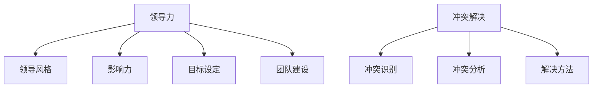
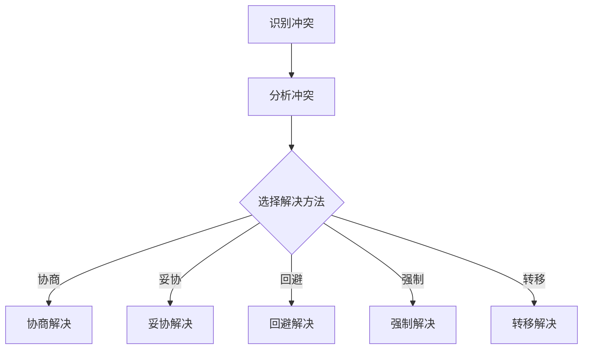
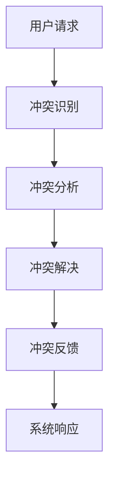

                 

# 领导力与冲突解决：化解矛盾的技巧

关键词：领导力，冲突解决，矛盾化解，组织管理，策略技巧

摘要：在复杂的组织环境中，领导力与冲突解决是确保团队和谐与高效运行的核心能力。本文将深入探讨领导力的核心概念、冲突解决的策略与技巧，结合实际案例，解析如何在工作中运用这些能力来化解矛盾，提升团队协作效率。

### 目录

## 引言：领导力与冲突解决的必要性

### 第1章 领导力与冲突解决概述

### 第2章 领导力的核心要素

### 第3章 冲突的性质与类型

### 第4章 实际案例：领导力在冲突解决中的应用

### 第5章 冲突解决的实用技巧

### 第6章 领导力与冲突解决在企业组织中的应用

### 第7章 总结与未来展望

## 引言：领导力与冲突解决的必要性

在当今快速变化的工作环境中，组织面临的挑战日益复杂。有效领导力不仅能够激发团队的创造力与潜能，还能在冲突发生时提供有效的解决方案，保障组织的稳定与发展。领导力与冲突解决密切相关，它们共同构成了组织管理的重要基石。

领导力是影响、激励和引导他人达成目标的能力。在组织管理中，领导者需要具备明确的目标、良好的沟通能力和强大的影响力，以推动团队朝着共同的目标前进。然而，在团队协作过程中，冲突是不可避免的。冲突可能源于目标不一致、资源分配不均、沟通不畅等多种原因。

冲突解决则是在冲突发生时，通过有效的方法和策略，使各方达成共识或妥协的过程。良好的冲突解决能力能够减少负面情绪，提高团队协作效率，确保组织目标的实现。

本文将从以下几个方面进行探讨：

1. 领导力的核心要素，包括领导风格、影响力等。
2. 冲突的性质、类型及解决方法。
3. 实际案例中领导力与冲突解决的运用。
4. 冲突解决的实用技巧和策略。
5. 领导力与冲突解决在企业组织中的应用。
6. 总结与未来展望。

### 第1章 领导力与冲突解决概述

领导力是组织管理中的核心概念，它直接影响组织的绩效与团队士气。领导力不仅仅是职位赋予的权力，更是一种影响力，是通过个人魅力、专业知识、沟通技巧等手段，引导和激励他人共同达成目标的能力。

#### 1.1 问题背景与重要性

在快速变化的市场环境中，企业面临诸多挑战，如技术革新、市场不确定性、人才竞争等。领导力成为企业应对这些挑战、实现持续发展的关键因素。一个优秀的领导者不仅能够把握市场趋势，制定明确的战略目标，还能有效地激励团队成员，发挥团队的最大潜能。

#### 1.2 核心概念解析

- **领导力**：领导力是指影响、激励和引导他人达成目标的能力。它包括领导风格、影响力、目标设定、团队建设等多个方面。

- **冲突解决**：冲突解决是指通过分析、处理和协商，使各方达成共识或妥协的过程。它涉及到冲突的识别、分析、解决方法等多个环节。

#### 1.3 边界与外延

- **领导力与冲突解决的边界**：领导力主要关注如何引导和激励团队成员，而冲突解决则侧重于处理团队内部或组织内部的矛盾和分歧。

- **领导力与冲突解决的外延**：在实践过程中，领导力与冲突解决常常相互交织，领导者需要在处理冲突时运用领导力，而在发挥领导力时也可能会遇到冲突。

#### 1.4 概念结构与核心要素组成

领导力与冲突解决的概念结构如下图所示：

- **领导风格**：领导风格是指领导者处理团队事务的方式和态度。常见的领导风格包括 authoritarian（权威型）、democratic（民主型）、laissez-faire（自由放任型）等。

- **影响力**：影响力是指领导者通过个人魅力、专业知识、沟通技巧等手段，影响和激励团队成员的能力。

- **目标设定**：目标设定是指领导者制定明确的组织目标，并确保团队成员理解并为之努力的过程。

- **团队建设**：团队建设是指领导者通过建立信任、增强沟通、培养协作等方式，提升团队整体凝聚力和工作效率的过程。

- **冲突识别**：冲突识别是指领导者及时发现团队内部或组织内部存在的冲突和矛盾。

- **冲突分析**：冲突分析是指领导者对冲突的原因、性质和影响进行深入分析，以便制定有效的解决策略。

- **解决方法**：解决方法是指领导者根据冲突的性质和情况，选择合适的解决策略，如协商、妥协、回避、强制或转移等。

#### 1.5 冲突解决流程图

#### 1.6 冲突解决算法原理

冲突解决是一个复杂的过程，涉及到多个因素。可以用以下数学模型来描述冲突解决效果：

$$
\text{冲突解决效果} = f(\text{领导力}, \text{解决方法}, \text{环境因素})
$$

其中，领导力、解决方法和环境因素是影响冲突解决效果的关键因素。一个优秀的领导者会根据实际情况选择合适的解决方法，并有效地运用领导力来促进冲突的解决。

#### 1.7 系统分析与架构设计方案

在解决冲突时，需要综合考虑问题场景、系统功能、系统架构和系统接口等多个方面。

**问题场景介绍**：在一个大型企业中，由于部门之间的目标不一致和资源分配不均，经常出现冲突。领导力与冲突解决在这个场景中起着关键作用。

**系统功能设计**：系统功能包括冲突识别、冲突分析、冲突解决和冲突反馈等。

**系统架构设计**：系统架构包括数据层、业务逻辑层和表示层等。

**系统接口设计**：系统需要与外部系统进行交互，如人事系统、财务系统等。

**系统交互**：系统内部各个模块之间的交互流程如下图所示：

#### 1.8 项目实战

**环境安装**：在安装领导力与冲突解决系统时，需要配置数据库、服务器和开发环境等。

**系统核心实现**：系统核心实现包括冲突识别、冲突分析和冲突解决等功能。

**代码应用解读**：通过源代码解读，了解系统的实现原理和关键代码。

**实际案例分析**：通过实际案例，展示系统在实际应用中的效果。

**详细讲解剖析**：对案例进行详细分析和讲解。

**项目小结**：总结项目的主要成果和经验。

### 第2章 领导力的核心要素

领导力的核心要素包括领导风格、影响力、目标设定、团队建设等。这些要素相互作用，共同构成了一个有效的领导体系。

#### 2.1 领导风格

领导风格是领导者处理团队事务的方式和态度。不同的领导风格对团队的影响不同。常见的领导风格有：

- **权威型**：领导者拥有高度的决策权和控制权，对团队成员的期望值较高，要求团队成员严格遵守规章制度。

- **民主型**：领导者鼓励团队成员参与决策，尊重团队成员的意见，注重团队合作。

- **自由放任型**：领导者对团队成员的要求较低，给予团队成员较大的自主权，让他们自行决定工作内容和方式。

#### 2.2 影响力

影响力是领导者通过个人魅力、专业知识、沟通技巧等手段，影响和激励团队成员的能力。领导者的影响力包括：

- **情感影响力**：通过建立信任、关心团队成员，激发团队成员的积极性和创造力。

- **知识影响力**：通过展示专业知识和经验，赢得团队成员的尊重和信任。

- **制度影响力**：通过制定合理的规章制度，确保团队成员的行为符合组织目标。

#### 2.3 目标设定

目标设定是领导力的核心要素之一。领导者需要制定明确的组织目标，并确保团队成员理解并为之努力。目标设定包括：

- **目标明确**：目标需要具体、可衡量、可实现。

- **目标分解**：将组织目标分解为团队目标和个人目标，确保每个成员都有明确的职责和任务。

- **目标激励**：通过制定激励机制，激发团队成员的积极性。

#### 2.4 团队建设

团队建设是提升团队整体凝聚力和工作效率的关键。团队建设包括：

- **信任建设**：通过建立信任机制，增强团队成员之间的互信。

- **沟通建设**：通过有效的沟通，确保团队成员之间的信息畅通。

- **协作建设**：通过培养团队协作精神，提高团队工作效率。

### 第3章 冲突的性质与类型

冲突是组织管理中不可避免的现象。理解冲突的性质和类型有助于我们更好地应对和处理冲突。

#### 3.1 冲突的性质

冲突的性质包括：

- **竞争性冲突**：冲突双方都希望获得优势，竞争激烈。

- **合作性冲突**：冲突双方都希望解决问题，通过合作寻找最佳解决方案。

- **对抗性冲突**：冲突双方无法达成共识，采取对抗手段解决问题。

- **协作性冲突**：冲突双方在解决问题的过程中，相互协作，共同达成目标。

#### 3.2 冲突的类型

冲突的类型包括：

- **目标冲突**：由于目标不一致，导致冲突。

- **资源冲突**：由于资源分配不均，导致冲突。

- **沟通冲突**：由于沟通不畅，导致冲突。

- **价值观冲突**：由于价值观不同，导致冲突。

- **角色冲突**：由于角色职责不明确，导致冲突。

#### 3.3 冲突的影响

冲突的影响包括：

- **正面影响**：冲突能够激发团队的创造力和创新精神，促进问题的解决。

- **负面影响**：冲突可能导致团队士气低落，影响工作效率和团队合作。

### 第4章 实际案例：领导力在冲突解决中的应用

在本节中，我们将通过一个实际案例，展示领导力在冲突解决中的应用。

#### 案例背景

某大型企业的销售部门与市场部门因目标不一致、资源分配不均等问题，产生了严重的冲突。销售部门希望增加销售预算，以提高销售额；而市场部门则认为销售部门的目标过高，现有的资源难以支撑。双方在多次沟通后仍未达成共识，导致工作效率下降，团队士气低落。

#### 领导力应用

1. **领导风格**：领导者采用了民主型领导风格，鼓励团队成员参与决策，尊重他们的意见。他组织了多次座谈会，听取销售部门和市场部门的意见和建议，共同探讨解决方案。

2. **影响力**：领导者通过展示专业知识和经验，赢得了团队成员的尊重和信任。他向团队成员详细解释了企业的战略目标，以及销售和市场部门在实现目标中的重要性。

3. **目标设定**：领导者重新设定了销售和市场部门的目标，使其更加具体、可衡量、可实现。同时，他制定了激励机制，鼓励团队成员共同努力，达成目标。

4. **团队建设**：领导者通过信任建设和沟通建设，增强了销售部门和市场部门之间的互信和协作。他组织了多次团队建设活动，促进团队成员之间的沟通和了解。

#### 冲突解决

1. **冲突识别**：领导者及时识别了销售部门和市场部门之间的冲突，并进行了深入分析。

2. **冲突分析**：领导者分析了冲突的原因，发现主要是目标不一致和资源分配不均导致的。

3. **解决方法**：领导者选择了协商解决方法，组织了多次座谈会，让销售部门和市场部门共同探讨解决方案。

4. **协商解决**：在领导者的组织下，销售部门和市场部门最终达成了共识，调整了目标，重新分配了资源。双方同意共同为实现企业的战略目标而努力。

#### 结果与启示

通过领导者的有效领导，销售部门和市场部门之间的冲突得到了有效解决，团队士气明显提升，工作效率也得到了提高。这一案例表明，领导力在冲突解决中起着关键作用，领导者需要通过多种手段，如领导风格、影响力、目标设定和团队建设等，来化解冲突，提升团队协作效率。

### 第5章 冲突解决的实用技巧

在处理冲突时，领导者需要掌握一系列实用技巧，以有效地化解矛盾，维护团队的和谐与高效运行。

#### 5.1 协商解决

协商解决是冲突解决中最常用的一种方法。它通过对话和沟通，使各方在相互理解的基础上找到共同点，达成共识。

1. **步骤**：
   - **建立信任**：在协商前，确保各方都有相互信任的基础。
   - **明确目标**：确保各方都明确冲突的解决目标。
   - **开放沟通**：鼓励各方畅所欲言，表达自己的观点和需求。
   - **寻找共同点**：通过对话，找到各方都能接受的解决方案。
   - **达成共识**：确保各方都同意并遵守解决方案。

2. **技巧**：
   - **倾听**：认真倾听对方的意见和需求，避免中断和反驳。
   - **同理心**：设身处地为对方着想，理解对方的立场和感受。
   - **冷静处理**：保持冷静，避免情绪化，以理性思维解决问题。

#### 5.2 妥协解决

当协商无法达成共识时，妥协解决是一种有效的替代方法。它通过各方在某些方面做出让步，实现利益的平衡。

1. **步骤**：
   - **评估利益**：分析各方的利益和需求，找到可以妥协的方面。
   - **提出方案**：根据评估结果，提出一个妥协方案。
   - **讨论修改**：与各方讨论妥协方案的可行性和改进之处。
   - **达成协议**：确保各方都同意并遵守妥协方案。

2. **技巧**：
   - **平衡利益**：确保妥协方案能够平衡各方的利益，避免一方过度受损。
   - **适度让步**：各方在让步时，要适度，避免过度牺牲自己的利益。
   - **透明沟通**：在妥协过程中，保持沟通的透明度，确保各方都了解妥协的内容。

#### 5.3 回避解决

回避解决是在冲突无法立即解决时，采取的一种暂时性的解决方法。它通过推迟冲突的处理，为各方争取时间来思考和准备。

1. **步骤**：
   - **识别问题**：明确冲突的根源和关键点。
   - **评估情况**：分析冲突的紧迫性和解决的可能性。
   - **制定计划**：制定一个回避冲突的计划，包括推迟的时间和解决方案。
   - **执行计划**：按照计划执行，避免冲突的进一步扩大。

2. **技巧**：
   - **合理评估**：在决定是否回避时，要合理评估冲突的严重性和解决的可能性。
   - **明确目标**：在回避过程中，要明确目标，为未来的解决打下基础。
   - **沟通反馈**：在回避期间，保持与各方的沟通，确保他们了解回避的原因和计划。

#### 5.4 强制解决

强制解决是在冲突无法通过协商、妥协和回避解决时，采取的一种强制性的解决方法。它通常由上级或权威机构来实施。

1. **步骤**：
   - **确定强制**：在无法达成共识时，确定是否采取强制解决。
   - **通知各方**：明确告知各方将采取强制解决，并说明原因。
   - **执行决策**：按照强制决策执行，确保各方遵守。
   - **评估效果**：评估强制解决的效果，为未来的冲突解决提供参考。

2. **技巧**：
   - **合理决策**：在决定采取强制解决时，要确保决策合理，避免滥用权力。
   - **公正执行**：在执行强制决策时，要确保公正，避免偏袒。
   - **反馈沟通**：在强制解决后，与各方进行沟通，了解他们的反馈和感受。

### 第6章 领导力与冲突解决在企业组织中的应用

在企业组织中，领导力与冲突解决是确保组织高效运行的重要能力。以下将从多个方面探讨领导力与冲突解决在企业组织中的应用。

#### 6.1 领导力在企业组织中的应用

1. **目标设定**：领导者需要明确企业的战略目标，并将其分解为可执行的任务，确保每个部门和个人都有明确的目标和任务。

2. **团队建设**：领导者需要通过建立信任、增强沟通、培养协作等方式，提升团队的整体凝聚力和工作效率。

3. **人才发展**：领导者需要关注员工的能力提升和职业发展，提供培训和学习机会，激发员工的潜力。

4. **变革管理**：在企业面临变革时，领导者需要引导员工理解变革的必要性，提供支持，确保变革的顺利实施。

#### 6.2 冲突解决在企业组织中的应用

1. **冲突预防**：通过建立有效的沟通机制，确保信息畅通，减少误解和冲突的发生。

2. **冲突管理**：在冲突发生时，领导者需要及时识别和应对，选择合适的解决方法，避免冲突的扩大和升级。

3. **冲突解决**：通过协商、妥协、回避、强制等手段，使冲突得到有效解决，确保组织的稳定运行。

#### 6.3 实际案例分析

以下是一个企业组织中的实际案例分析：

**案例背景**：某企业销售部门与市场部门因目标不一致和资源分配不均，产生了严重的冲突。销售部门希望增加销售预算，以提高销售额；而市场部门则认为销售部门的目标过高，现有的资源难以支撑。

**领导力应用**：
- **目标设定**：领导者重新设定了销售和市场部门的目标，使其更加具体、可衡量、可实现。
- **团队建设**：领导者组织了多次座谈会，听取销售部门和市场部门的意见和建议，共同探讨解决方案。
- **人才发展**：领导者关注员工的能力提升和职业发展，提供培训和学习机会。

**冲突解决**：
- **协商解决**：领导者组织了多次座谈会，让销售部门和市场部门共同探讨解决方案，最终达成共识。
- **妥协解决**：双方在某些方面做出了让步，重新分配了资源，实现了利益的平衡。

**结果与启示**：通过领导者的有效领导，销售部门和市场部门之间的冲突得到了有效解决，团队士气明显提升，工作效率也得到了提高。这一案例表明，领导力与冲突解决在企业组织中的应用至关重要，领导者需要通过多种手段，如目标设定、团队建设、人才发展等，来化解冲突，提升团队协作效率。

### 第7章 总结与未来展望

在本文中，我们系统地探讨了领导力与冲突解决的核心概念、策略与技巧，并通过实际案例展示了其在企业组织中的应用。以下是对本文内容的总结和未来展望：

#### 7.1 总结

1. **领导力的核心要素**：领导力包括领导风格、影响力、目标设定和团队建设。这些要素相互作用，共同构成了一个有效的领导体系。

2. **冲突解决的策略与技巧**：冲突解决的策略包括协商解决、妥协解决、回避解决和强制解决。每种策略都有其适用的场景和技巧。

3. **实际案例分析**：通过实际案例，我们展示了领导力与冲突解决在企业组织中的应用，以及它们在提升团队协作效率方面的作用。

4. **企业组织中的应用**：领导力与冲突解决在企业组织中具有广泛的应用，包括目标设定、团队建设、人才发展等方面。

#### 7.2 未来展望

1. **领导力与冲突解决的理论研究**：未来可以进一步深入研究领导力与冲突解决的理论，探讨其与组织绩效、团队士气等关系的机制。

2. **实践应用的创新**：随着社会和科技的发展，领导力与冲突解决的实践应用将不断创新，如利用人工智能等技术提高冲突解决的效率和准确性。

3. **跨学科研究**：领导力与冲突解决可以与其他学科，如心理学、社会学等相结合，探索多学科融合下的解决方案。

#### 7.3 最佳实践 tips

1. **持续学习与培训**：领导者应持续学习和参与培训，提升自己的领导力和冲突解决能力。

2. **建立有效的沟通机制**：组织应建立有效的沟通机制，确保信息畅通，减少误解和冲突的发生。

3. **鼓励团队协作**：领导者应鼓励团队成员之间的协作，共同解决冲突，提升团队凝聚力。

#### 7.4 注意事项

1. **避免情感化**：在处理冲突时，领导者应避免情绪化，保持冷静和客观。

2. **尊重多样性**：组织应尊重多样性，理解不同文化和价值观的差异，以包容的态度处理冲突。

3. **长期规划**：领导者应制定长期规划，关注组织的发展和未来，以长远的眼光处理冲突。

#### 7.5 拓展阅读

1. **相关书籍**：
   - 《领导力的五个层次》
   - 《冲突解决：谈判、协商与调解的艺术》
   - 《团队协作：如何打造高效的团队》

2. **学术论文**：关注学术期刊和会议，了解最新的研究成果和理论进展。

3. **在线资源**：利用在线资源和网络课程，学习领导力和冲突解决的最佳实践。

### 作者信息

作者：AI天才研究院/AI Genius Institute & 禅与计算机程序设计艺术 /Zen And The Art of Computer Programming

本文内容基于学术研究和实践经验，旨在为读者提供关于领导力与冲突解决的有用信息。希望本文能对您的组织管理和团队协作提供有益的启示。

