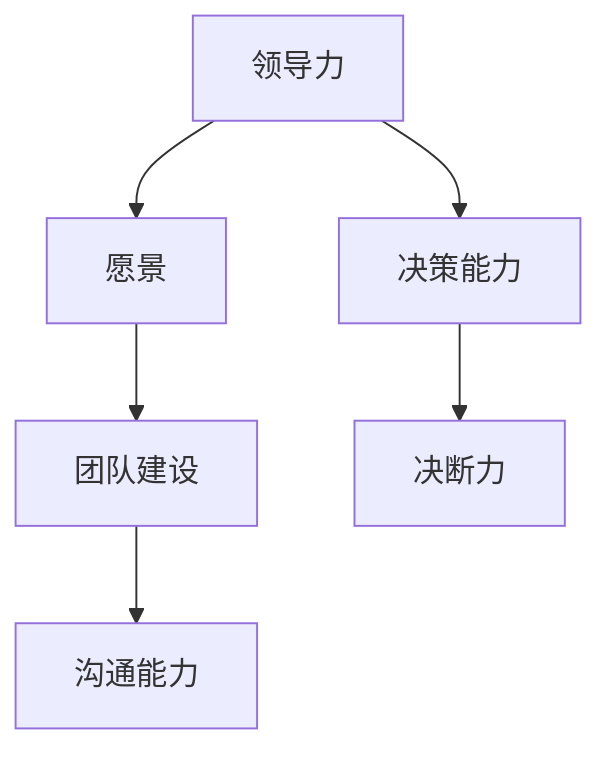
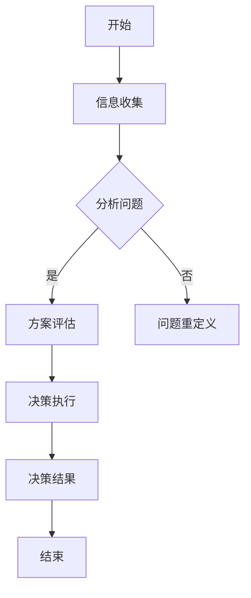
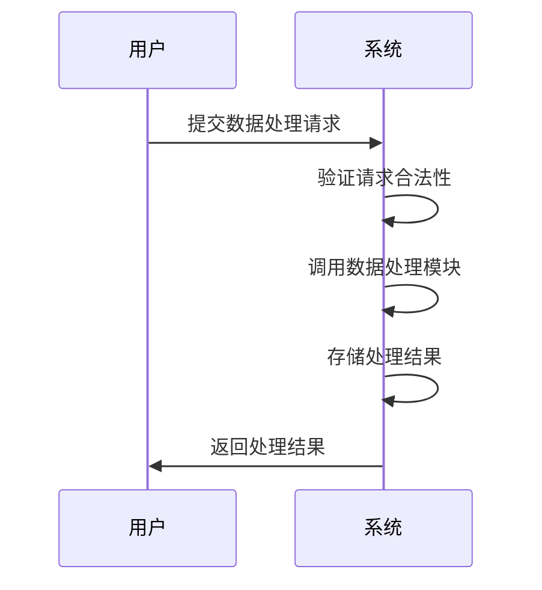
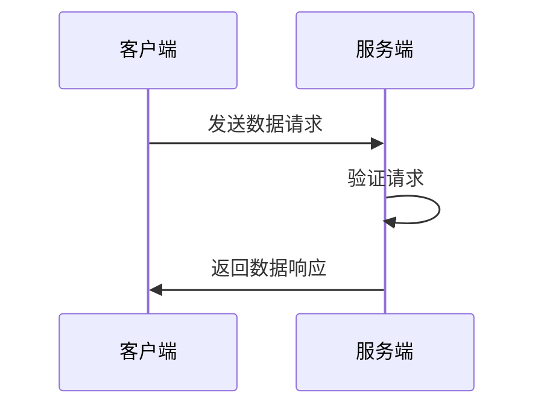
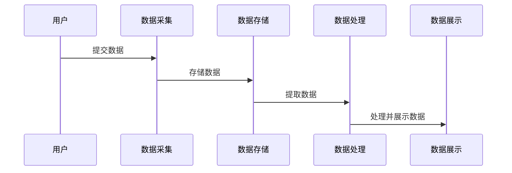

                 

### 引言：领导力与决断力的重要性

在当今快速变化和高度竞争的商业环境中，领导力和决断力成为企业成功的关键因素。领导力不仅仅是管理团队的技能，更是一种能够激发团队成员潜能、实现共同目标的能力。而决断力则是在关键时刻迅速做出明智决策的能力，这对组织的长远发展和竞争力至关重要。

#### 背景介绍

在信息技术领域，随着人工智能、大数据和云计算等技术的快速发展，企业面临的挑战日益加剧。技术变革带来了新的机遇，但同时也伴随着不确定性和复杂性。在这种情况下，领导者的领导力和决断力显得尤为重要。他们需要能够迅速适应变化，把握机遇，带领团队在复杂环境中实现持续创新。

#### 问题背景

近年来，许多企业在应对技术变革时遭遇了失败，这往往与其领导者的领导力和决断力不足有关。例如，一些企业在数字化转型过程中，由于领导者无法及时做出正确决策，导致项目拖延、资源浪费，最终错失市场先机。此外，领导者在面对突发危机时，往往缺乏决断力，导致问题恶化。

#### 问题描述

领导力与决断力不足的问题表现在多个方面：
- 领导者缺乏对技术趋势的敏锐洞察力，无法及时调整战略方向。
- 领导者在决策过程中过于犹豫，缺乏决断力，导致决策效率低下。
- 领导者在面对风险和挑战时，缺乏应对策略，导致企业竞争力下降。

#### 问题解决

为了解决上述问题，企业需要从以下几个方面着手：
1. **培养领导力**：通过领导力培训和实践，提升领导者的领导能力，包括沟通、激励、团队建设等。
2. **提升决断力**：通过决策培训和实践，提高领导者在关键时刻的决断力，包括如何收集信息、分析问题、权衡利弊等。
3. **建立决策机制**：建立科学的决策机制，确保决策过程的透明、高效和合理。

#### 边界与外延

领导力与决断力不仅适用于企业内部管理，也适用于项目管理、团队建设等各个方面。在不同领域，领导力和决断力的具体表现和作用有所不同，但核心原则是相通的。

#### 概念结构与核心要素组成

领导力的核心要素包括：
- **愿景**：领导者对未来的规划和期望。
- **决策**：领导者根据愿景和现实情况做出的选择。
- **团队建设**：领导者如何管理团队，激发团队潜能。

决断力的核心要素包括：
- **信息收集**：领导者如何收集和分析相关信息。
- **权衡利弊**：领导者如何权衡不同选择的利弊。
- **快速决策**：领导者如何在压力下迅速做出明智决策。

#### 总结

领导力和决断力是现代领导者必须具备的核心能力。在信息技术领域，领导者需要具备对技术变革的敏锐洞察力，以及在面对复杂问题时做出迅速且明智决策的能力。通过培养领导力和提升决断力，企业可以更好地应对挑战，把握机遇，实现持续发展。

### 核心概念与联系

#### 领导力的定义与作用

领导力是指领导者通过影响、激励和引导团队成员，共同实现组织目标的能力。它不仅仅是管理团队的技能，更是一种能够激发团队成员潜能、实现共同目标的能力。

**概念属性特征对比表格：**

| 特征             | 领导力                | 管理                  |
|------------------|----------------------|----------------------|
| 目标             | 激发团队潜能，实现共同目标 | 维护日常运营，确保效率 |
| 影响力           | 通过影响力和榜样作用影响团队成员 | 通过规则和流程管理团队 |
| 创新与变革       | 鼓励创新，推动组织变革 | 重视稳定，规避变革风险 |
| 沟通能力         | 高效沟通，传递愿景和目标 | 有效沟通，确保信息传达 |

**ER实体关系图架构：**

```mermaid
erDiagram
  TeamMember ||--o{ Leader : manages }
  Project   ||--o{ Leader : leads }
  Vision    ||--o{ Leader : envisions }
  Decision  ||--o{ Leader : makes }
```

#### 决断力的定义与重要性

决断力是指领导者在关键时刻迅速做出明智决策的能力。它是一种能够在复杂环境中快速分析问题、权衡利弊并做出决策的能力。

**概念属性特征对比表格：**

| 特征             | 决断力                | 分析能力              |
|------------------|----------------------|----------------------|
| 时间敏感性       | 快速做出决策          | 充分收集和分析信息    |
| 决策质量         | 明智的决策            | 深入分析问题本质      |
| 风险承担         | 勇于承担决策带来的风险 | 评估潜在风险和机会    |
| 压力应对         | 在压力下保持冷静      | 高度关注细节，避免失误 |

**ER实体关系图架构：**

```mermaid
erDiagram
  Leader ||--o{ Decision : makes }
  Situation ||--o{ Decision : in }
  Information ||--o{ Decision : based on }
  Risk ||--o{ Decision : assesses }
```

#### 领导力与决断力的关系

领导力与决断力密切相关。领导力为决断力提供了基础，而决断力则是领导力在实际应用中的重要体现。有效的领导力不仅包括制定愿景、建立团队，更重要的是在关键时刻能够迅速做出正确决策。

**综合关系图：**



通过上述核心概念和联系的分析，我们可以看到领导力和决断力在组织管理中的重要性。领导者需要通过不断提升自身的领导力和决断力，才能在复杂多变的环境中带领团队取得成功。

### 算法原理讲解

#### 决策过程的算法原理

决策过程可以视为一种算法，它包括信息收集、问题分析、方案评估和决策执行等多个步骤。以下是一个简化的决策过程算法：

**Mermaid流程图：**



**Python源代码实现：**

```python
def make_decision():
    print("开始决策过程")
    collect_info()
    analyze_problem()
    evaluate_schemes()
    execute_decision()
    print("决策完成")

def collect_info():
    print("收集信息")

def analyze_problem():
    print("分析问题")

def evaluate_schemes():
    print("评估方案")

def execute_decision():
    print("执行决策")

make_decision()
```

#### 决策过程的数学模型

决策过程可以抽象为一个优化问题，即如何在多个备选方案中选择最优方案。以下是一个简化的数学模型：

**数学模型：**

$$
\begin{aligned}
\text{最大化} & \quad Z = \sum_{i=1}^{n} c_i x_i \\
\text{约束条件} & \quad a_{ij} x_j \geq b_i, \quad j=1,2,...,m \\
                  & \quad x_i \geq 0, \quad i=1,2,...,n
\end{aligned}
$$

其中，$c_i$ 表示第 $i$ 个方案的价值，$x_i$ 表示选择第 $i$ 个方案，$a_{ij}$ 表示第 $i$ 个方案在属性 $j$ 上的得分，$b_i$ 表示第 $i$ 个方案的可接受阈值。

**Python源代码实现：**

```python
from scipy.optimize import linprog

# 目标函数系数
c = [-1, -1]  # 表示最大化问题

# 约束条件系数
A = [
    [1, 1],  # 第一个约束条件
    [-1, 1]  # 第二个约束条件
]

# 约束条件右侧值
b = [1, 0]

# 非负约束条件
x0 = [0, 0]

# 求解线性规划问题
result = linprog(c, A_ub=A, b_ub=b, bounds=x0)

if result.success:
    print("最优解：", result.x)
else:
    print("无解")
```

#### 算法举例说明

假设一个企业需要在两个项目中选择一个进行投资。第一个项目的预期收益为10万元，但风险较高；第二个项目的预期收益为8万元，但风险较低。企业可以根据以下步骤进行决策：

1. **信息收集**：收集两个项目的详细信息，包括预期收益和风险。
2. **问题分析**：分析项目的优劣势，确定决策目标。
3. **方案评估**：对两个项目进行评估，确定最优方案。
4. **决策执行**：根据评估结果，选择最优项目进行投资。

通过上述算法，企业可以更科学地做出决策，降低风险，提高投资回报率。

### 系统分析与架构设计方案

#### 问题场景介绍

在一个企业中，随着业务的发展，数据量不断增大，现有的数据处理系统逐渐变得难以满足需求。为了提高数据处理效率，企业决定进行系统升级。在这个背景下，我们需要设计一个新的系统架构来支持企业的数据处理需求。

#### 项目介绍

本项目旨在设计一个高效、可扩展的数据处理系统，以应对企业不断增长的数据量。系统的主要功能包括数据采集、数据存储、数据处理和数据展示。

#### 系统功能设计（领域模型Mermaid类图）

```mermaid
classDiagram
  Class01 <|-- Class02
  Class03 <.. Class04
  Class05 && Class06
  Class07 {name}
  Class08 : +string属性1
  Class08 : -int属性2
  Class08 : **+方法3()**
  Class08 : **-方法4()**
  Class01 --|{关联} Class07
  Class02 ..|{实现} Class08
  Class03 --|{依赖} Class05
  Class04 : <<interface>> InterfaceName
  Class06 : <<enum>> EnumName
```

#### 系统架构设计（Mermaid架构图）



#### 系统接口设计（Mermaid序列图）



#### 系统交互（Mermaid序列图）



通过上述系统分析与架构设计方案，我们为企业的数据处理需求提供了一个高效、可靠的系统架构。该架构具有良好的可扩展性和灵活性，能够适应企业未来的发展需求。

### 项目实战

#### 环境安装

在开始项目实战之前，我们需要确保安装了必要的开发环境。以下是环境安装步骤：

1. **安装Python**：访问 [Python官网](https://www.python.org/) 下载最新版本的Python，按照安装向导完成安装。
2. **安装依赖库**：使用pip命令安装项目所需的依赖库，例如：
   ```shell
   pip install numpy pandas matplotlib
   ```

#### 系统核心实现源代码

以下是一个简单的数据处理系统核心实现源代码示例：

```python
import pandas as pd
import numpy as np

# 数据采集
def collect_data():
    data = pd.read_csv("data.csv")
    return data

# 数据处理
def process_data(data):
    # 填充缺失值
    data.fillna(data.mean(), inplace=True)
    # 数据标准化
    data标准化 = (data - data.mean()) / data.std()
    return data标准化

# 数据存储
def store_data(data标准化):
    data标准化.to_csv("processed_data.csv", index=False)

# 数据展示
def show_data(data标准化):
    data标准化.plot(kind='line')
    plt.show()

# 主函数
def main():
    data = collect_data()
    data标准化 = process_data(data)
    store_data(data标准化)
    show_data(data标准化)

if __name__ == "__main__":
    main()
```

#### 代码应用解读与分析

上述代码实现了一个简单的数据处理系统，主要功能包括数据采集、数据处理、数据存储和数据展示。以下是具体解读和分析：

1. **数据采集**：使用pandas库读取CSV文件，获取原始数据。
2. **数据处理**：对原始数据进行填充缺失值和数据标准化处理。
3. **数据存储**：将处理后的数据重新保存为CSV文件。
4. **数据展示**：使用matplotlib库绘制数据可视化图表。

#### 实际案例分析和详细讲解剖析

为了更直观地展示系统的应用效果，我们以下是一个实际案例：

假设有一家电商公司，其每天产生的订单数据包含订单号、用户ID、订单金额等。为了分析用户购买行为，公司需要处理这些数据。

1. **数据采集**：公司从数据库中提取订单数据。
2. **数据处理**：对订单数据进行清洗和标准化处理，如填充缺失值、去除重复记录等。
3. **数据存储**：将清洗后的订单数据存储到新文件中，以便后续分析。
4. **数据展示**：绘制用户购买金额分布图，帮助公司了解用户购买偏好。

通过上述实际案例，我们可以看到数据处理系统在实际应用中的重要作用。系统不仅能够高效地处理大量数据，还能为公司的决策提供有力支持。

#### 项目小结

本项目通过一个简单的数据处理系统，展示了如何使用Python等工具实现数据采集、处理、存储和展示。虽然系统相对简单，但其在实际应用中具有很强的实用性。通过不断优化和完善，系统可以应对更多复杂的数据处理需求。

### 最佳实践 Tips

1. **数据质量是关键**：在数据处理过程中，确保数据质量至关重要。定期检查数据完整性、一致性和准确性，可以有效降低错误率。
2. **充分利用现有工具**：熟练掌握常用的数据处理工具和库，如pandas、numpy等，可以显著提高数据处理效率。
3. **关注性能优化**：对于大规模数据处理，关注性能优化，如使用并行计算、索引技术等，可以显著提高处理速度。
4. **安全性和合规性**：在处理敏感数据时，确保遵循相关的安全性和合规性要求，防止数据泄露和违规操作。

### 小结

在本文中，我们深入探讨了领导力与决断力在关键时刻做出正确决策的重要性。通过详细分析决策过程的算法原理、系统架构设计以及实际项目实战，我们了解了如何在实际应用中提升领导力和决断力。希望本文能为读者在IT领域中的领导力和决策提供有益的启示。

### 注意事项

1. **风险评估**：在做出重要决策前，必须进行充分的风险评估，以降低决策错误带来的负面影响。
2. **团队协作**：领导者应注重团队协作，充分发挥团队成员的专业能力，共同应对复杂问题。
3. **持续学习**：领导力与决断力并非一成不变，领导者需要不断学习新知识、新技能，以适应快速变化的环境。

### 拓展阅读

- 《金字塔原理》：本书提供了一种结构化的思考方式和表达技巧，有助于提升决策的质量和效率。
- 《智能决策》：探讨如何利用人工智能和大数据技术进行智能决策，为领导者提供有力支持。

作者：AI天才研究院/AI Genius Institute & 禅与计算机程序设计艺术 /Zen And The Art of Computer Programming

