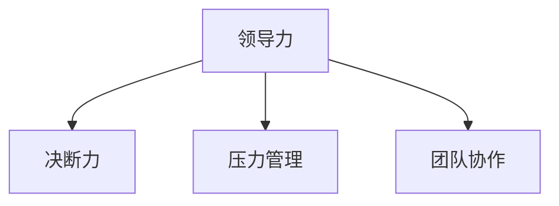
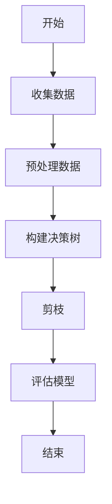
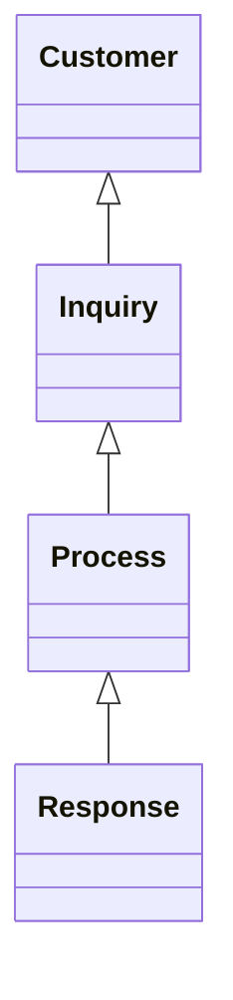
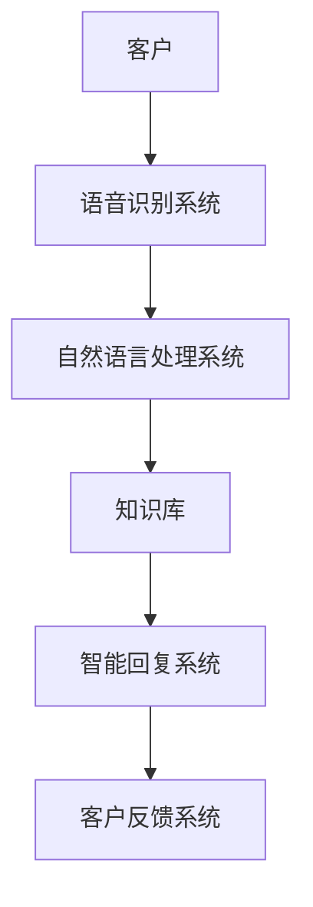
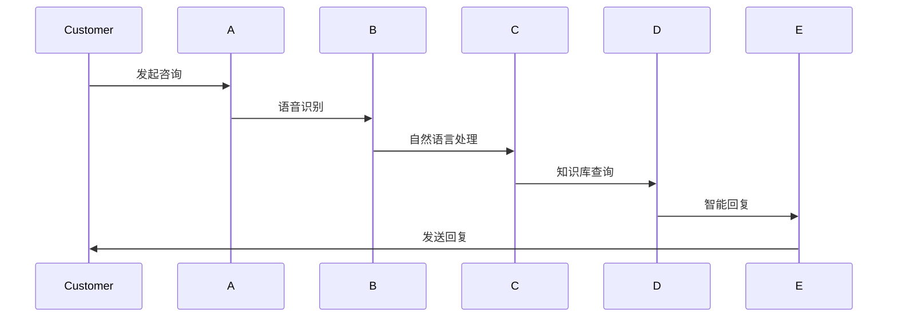
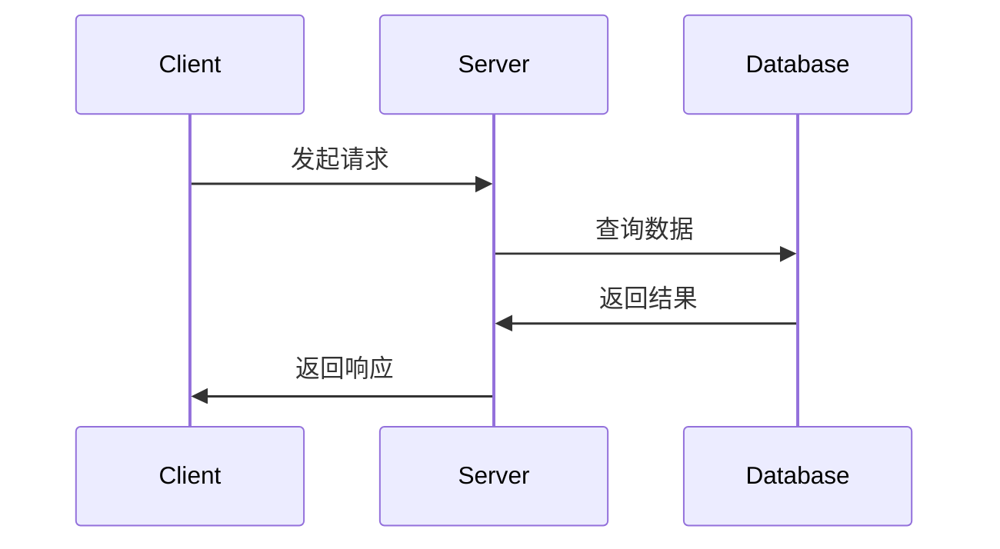

                 

# 领导力与决断：在压力下做出正确决策

## 关键词：领导力、决断力、压力管理、决策过程、团队协作

### 摘要：
在现代企业的快速发展中，领导者不仅需要具备卓越的技术能力，更要具备强大的领导力和决断力。本文将深入探讨领导力与决断力的本质、培养方法以及在压力下的决策策略。通过案例分析，我们将揭示领导力与决断力在实际应用中的重要性，并提供实践指导，帮助读者提升自身的领导能力。

## 目录

1. **领导力概述**
   1.1 领导力的定义
   1.2 领导力的层次
   1.3 领导力的重要性
   1.4 领导力的核心要素

2. **决断力：压力下的领导者特质**
   2.1 决断力的定义
   2.2 决断力的重要性
   2.3 压力下的决断力挑战
   2.4 决断力的核心要素

3. **压力管理：应对决策困境**
   3.1 压力管理的重要性
   3.2 压力的来源与类型
   3.3 压力管理的策略与方法
   3.4 压力与决策的关系

4. **决策过程中的心理因素**
   4.1 心理因素对决策的影响
   4.2 决策中的认知偏差
   4.3 情绪与决策
   4.4 压力对心理因素的调控

5. **团队协作与决策**
   5.1 团队协作在决策中的作用
   5.2 建立高效的决策团队
   5.3 团队决策过程中的沟通与协调
   5.4 团队决策中的冲突管理

6. **实际案例分析**
   6.1 案例一：企业家在困境中的决断力
   6.2 案例二：政府官员在紧急情况下的决策
   6.3 案例三：军事领导者的战略决断
   6.4 案例分析小结

7. **从理论到实践：领导力与决断力的培养**
   7.1 个人成长与领导力
   7.2 决断力的培养策略
   7.3 压力管理与心理调适
   7.4 实践与反思：领导力与决断力的持续提升

8. **结语与展望**
   8.1 领导力的时代价值
   8.2 决断力：引领变革的力量
   8.3 压力管理与可持续领导力
   8.4 展望未来：领导力与决断力的新趋势

## 1. 领导力概述

### 1.1 领导力的定义

领导力是指领导者通过影响、激励和引导他人，实现组织目标的能力。它不仅包括技术和管理能力，还涵盖了情感智慧、沟通技巧、战略思维等多方面要素。根据Lussier和Guzzardi的定义，领导力是“在组织中，领导者通过激励和影响他人，以实现组织目标的能力”（Lussier, R. N., & Guzzardi, J. P. (2020). Leadership: Enhancing the Lessons, Insights, and Strategies）。

### 1.2 领导力的层次

领导力可以分为三个层次：技术领导力、功能领导力和变革领导力。

- **技术领导力**：这是最基础的领导力层次，主要涉及日常管理和任务执行。领导者需要具备扎实的专业技能，以确保团队的工作顺利进行。
- **功能领导力**：这一层次的领导者能够跨部门协作，协调资源，解决复杂问题，具备战略规划能力。
- **变革领导力**：最高层次的领导力，领导者不仅要能够引领团队实现短期目标，更要有远见，推动组织进行结构性变革，引领组织走向未来。

### 1.3 领导力的重要性

领导力对组织的成功至关重要。有效领导者能够提高团队效率，激发员工潜力，推动创新，增强组织的竞争力。根据麦肯锡全球研究所的研究，领导者的影响力是推动企业绩效的关键因素之一（Mckinsey Global Institute, 2020）。

### 1.4 领导力的核心要素

领导力的核心要素包括以下几个方面：

- **沟通能力**：领导者需要具备清晰、有效的沟通能力，确保信息的准确传递和理解。
- **情感智慧**：领导者需要具备理解自己和他人的情感，并有效管理这些情感的能力。
- **影响力**：领导者需要能够影响他人，包括激励、指导和说服团队成员。
- **决策能力**：领导者需要能够在复杂和不确定的环境下做出明智的决策。
- **创新能力**：领导者需要鼓励创新思维，推动组织不断进步。

## 2. 决断力：压力下的领导者特质

### 2.1 决断力的定义

决断力是指领导者在面对复杂问题和压力时，能够迅速做出明智决策的能力。它是一种在不确定性和压力下，迅速分析问题、评估选项并采取行动的能力。

### 2.2 决断力的重要性

决断力是领导者成功的关键因素之一。一个优秀的领导者需要具备快速决断的能力，以应对不断变化的市场环境和组织挑战。决断力不仅影响决策的质量，还影响团队的士气和执行力。

### 2.3 压力下的决断力挑战

在压力下做出正确决策是一个巨大的挑战。压力可能导致情绪失控、思维混乱，甚至影响决策的质量。以下是一些常见的压力下的决断力挑战：

- **情绪干扰**：压力可能导致情绪化，影响理性思考。
- **信息过载**：面对大量信息时，很难快速筛选出关键信息。
- **时间紧迫**：时间限制可能导致决策者匆忙做出决策，增加错误风险。
- **资源限制**：资源限制可能导致决策者无法考虑所有可能的选择。

### 2.4 决断力的核心要素

提升决断力需要以下几个核心要素：

- **冷静分析**：在面对压力时，领导者需要保持冷静，进行理性分析。
- **快速学习**：领导者需要具备快速学习的能力，不断积累经验，提高决策质量。
- **决策模型**：领导者可以采用决策模型，如SWOT分析、决策树等，帮助自己做出更明智的决策。
- **风险评估**：领导者需要能够对决策的风险进行评估，确保决策的可行性和安全性。

## 3. 压力管理：应对决策困境

### 3.1 压力管理的重要性

有效的压力管理是领导者成功的关键之一。压力不仅影响个人的身心健康，还会影响决策的质量和团队的效率。领导者需要学会如何管理压力，以保持清晰、冷静的头脑，做出明智的决策。

### 3.2 压力的来源与类型

压力的来源多种多样，包括：

- **工作负荷**：工作量大、任务紧急会增加工作压力。
- **人际关系**：与同事、下属或上级的冲突和误解会增加人际关系压力。
- **职业发展**：职业目标的实现、晋升的压力等都会增加职业压力。
- **生活变化**：家庭、婚姻、健康等生活变化也会产生压力。

压力的类型可以分为以下几种：

- **急性压力**：短时间内产生的压力，如突发事件、紧急任务等。
- **慢性压力**：长时间持续的压力，如长期工作负荷、人际关系冲突等。
- **心理压力**：由负面情绪和认知引起的压力，如焦虑、抑郁等。
- **生理压力**：由生理因素引起的压力，如疲劳、健康问题等。

### 3.3 压力管理的策略与方法

有效的压力管理策略包括：

- **时间管理**：合理规划时间，避免过度工作，确保休息和放松。
- **情绪调节**：学会调节情绪，如通过冥想、运动等方式缓解压力。
- **积极沟通**：与同事、下属或上级进行有效沟通，解决矛盾和冲突。
- **寻求支持**：寻求家人、朋友或专业人士的支持，分享压力和困扰。

### 3.4 压力与决策的关系

压力对决策有双重影响。一方面，适度的压力可以激发创造力，提高决策质量。另一方面，过度的压力会干扰决策过程，降低决策质量。因此，领导者需要找到压力与决策的最佳平衡点。

## 4. 决策过程中的心理因素

### 4.1 心理因素对决策的影响

心理因素在决策过程中扮演着重要角色。认知偏差、情绪和个性等都可能影响决策的质量和效率。以下是一些常见的心理因素：

- **认知偏差**：认知偏差是指人们在思考、判断和决策过程中，由于信息处理方式的局限性而产生的错误。常见的认知偏差包括确认偏见、过度自信、选择性记忆等。
- **情绪**：情绪对决策有重要影响。正面情绪如乐观、自信可以提高决策质量，而负面情绪如焦虑、恐惧则可能降低决策质量。
- **个性**：不同个性的领导者可能会有不同的决策风格和偏好。例如，外向型领导者可能更倾向于冒险和快速决策，而内向型领导者可能更注重细节和分析。

### 4.2 决策中的认知偏差

认知偏差可能导致以下问题：

- **决策偏差**：由于认知偏差，领导者可能会做出不合理的决策，如过度依赖历史数据、忽视潜在风险等。
- **信息筛选偏差**：领导者可能会倾向于筛选符合自己预期或偏见的信息，忽略其他重要信息。
- **评估偏差**：领导者可能会对结果进行过度乐观或悲观的评估，影响后续决策。

### 4.3 情绪与决策

情绪对决策有直接的影响。正面情绪如乐观、自信可以提高决策质量，增强领导者的信心和决心。而负面情绪如焦虑、恐惧则可能导致过度谨慎或冲动决策，影响决策的质量。

### 4.4 压力对心理因素的调控

压力对心理因素的调控至关重要。有效的压力管理可以帮助领导者保持冷静、清晰的头脑，避免认知偏差和情绪干扰，提高决策的质量。

## 5. 团队协作与决策

### 5.1 团队协作在决策中的作用

团队协作在决策中起着至关重要的作用。通过集体智慧，团队能够提供更多视角和建议，帮助领导者做出更全面、更明智的决策。以下是一些团队协作在决策中的作用：

- **多样化的视角**：团队成员来自不同的背景和领域，能够提供多样化的视角，帮助领导者全面分析问题。
- **集体智慧**：通过集体讨论和辩论，团队能够形成更全面、更深入的见解，提高决策质量。
- **风险分担**：团队成员共同参与决策，可以分担决策风险，降低错误决策带来的负面影响。

### 5.2 建立高效的决策团队

要建立高效的决策团队，领导者需要做到以下几点：

- **明确目标**：确保团队成员明确决策的目标和期望结果，提高团队的协作效率。
- **合理分工**：根据团队成员的能力和特长进行分工，确保每个成员都能在决策过程中发挥最大作用。
- **开放沟通**：鼓励团队成员之间进行开放、坦诚的沟通，分享想法和建议，形成集体智慧。
- **共同决策**：在决策过程中，领导者应尊重团队成员的意见，通过集体讨论和辩论，共同制定决策。

### 5.3 团队决策过程中的沟通与协调

团队决策过程中的沟通与协调至关重要。以下是一些关键点：

- **明确沟通目标**：在决策过程中，确保沟通目标的明确，避免信息传递过程中的误解和歧义。
- **建立信任**：建立团队成员之间的信任，鼓励开放、坦诚的沟通，减少沟通障碍。
- **积极倾听**：领导者应积极倾听团队成员的意见和建议，尊重不同观点，形成共识。
- **协调资源**：在决策过程中，领导者需要协调团队成员之间的资源和能力，确保决策的顺利实施。

### 5.4 团队决策中的冲突管理

团队决策过程中难免会出现冲突。以下是一些冲突管理的策略：

- **识别冲突**：领导者需要敏锐地识别团队中的冲突，及时采取措施解决。
- **理解冲突根源**：了解冲突的根本原因，避免盲目采取措施。
- **积极沟通**：通过积极沟通，了解双方的观点和需求，寻求共识。
- **制定解决方案**：在充分讨论和协商的基础上，制定切实可行的解决方案，确保决策的顺利实施。

## 6. 实际案例分析

### 6.1 案例一：企业家在困境中的决断力

#### 背景介绍

某企业家创办了一家初创公司，专注于人工智能领域的研发。在公司成立初期，市场对该领域的兴趣浓厚，公司发展迅速。然而，随着市场的变化和竞争的加剧，公司面临巨大的压力和挑战。

#### 问题描述

在市场变化和竞争压力下，公司需要迅速调整战略，以保持竞争力。企业家需要在短时间内做出一系列关键决策，包括产品定位、市场拓展和资源分配等。

#### 问题解决

1. **市场调研**：企业家组织团队进行深入的市场调研，了解市场需求和竞争对手的动态。
2. **战略调整**：根据市场调研结果，企业家决定调整公司的产品定位，从单一产品向多元化产品方向发展。
3. **资源分配**：企业家重新调整公司的资源分配，确保重点项目的优先级，并加大对研发和市场的投入。
4. **团队激励**：企业家通过激励措施，激发团队的积极性和创造力，提高团队的执行力。

#### 边界与外延

该案例中的关键决策包括产品定位、市场拓展和资源分配。企业家需要在短时间内做出这些决策，以应对市场的变化和竞争压力。

#### 概念结构与核心要素组成

- **市场调研**：了解市场需求和竞争对手的动态。
- **战略调整**：根据市场调研结果调整产品定位。
- **资源分配**：确保重点项目的优先级，并加大对研发和市场的投入。
- **团队激励**：激发团队的积极性和创造力。

### 6.2 案例二：政府官员在紧急情况下的决策

#### 背景介绍

某城市在一场突如其来的暴雨中，遭受了严重的洪灾。政府官员需要在短时间内做出决策，以应对灾情，保护市民的生命财产安全。

#### 问题描述

暴雨引发的洪水对城市造成了严重影响，包括道路堵塞、基础设施损毁和居民疏散等问题。政府官员需要在紧急情况下做出一系列决策，包括应急响应、资源调配和灾后重建等。

#### 问题解决

1. **应急响应**：政府官员立即启动应急预案，组织相关部门和人员，开展灾情评估和救援工作。
2. **资源调配**：政府官员协调各方资源，包括救援队伍、物资和设备等，确保救援工作的顺利开展。
3. **居民疏散**：政府官员组织市民进行安全疏散，确保他们的生命安全。
4. **灾后重建**：政府官员制定灾后重建计划，恢复基础设施，保障市民的生活。

#### 边界与外延

该案例中的关键决策包括应急响应、资源调配、居民疏散和灾后重建。政府官员需要在紧急情况下快速做出这些决策，以保护市民的生命财产安全。

#### 概念结构与核心要素组成

- **应急响应**：启动应急预案，进行灾情评估和救援工作。
- **资源调配**：协调各方资源，确保救援工作的顺利开展。
- **居民疏散**：组织市民进行安全疏散。
- **灾后重建**：制定灾后重建计划，恢复基础设施。

### 6.3 案例三：军事领导者的战略决断

#### 背景介绍

某国军队在一场战争中面临着敌军的大规模进攻。军事领导者需要在战场上做出一系列关键决策，以保卫国家的领土和安全。

#### 问题描述

敌军发起大规模进攻，军队防线面临严重威胁。军事领导者需要在短时间内做出决策，包括防御部署、火力支援和战略撤退等。

#### 问题解决

1. **防御部署**：军事领导者迅速调整防线，加强重点区域的防御力量。
2. **火力支援**：调动空军和炮兵部队，提供有效的火力支援，压制敌军进攻。
3. **战略撤退**：在敌军进攻过于猛烈的情况下，军事领导者决定进行战略撤退，保存有生力量。
4. **后续部署**：战争结束后，军事领导者制定后续部署计划，巩固国防，防止敌军再次进攻。

#### 边界与外延

该案例中的关键决策包括防御部署、火力支援、战略撤退和后续部署。军事领导者需要在战场上快速做出这些决策，以保卫国家的领土和安全。

#### 概念结构与核心要素组成

- **防御部署**：调整防线，加强重点区域的防御力量。
- **火力支援**：调动空军和炮兵部队，提供有效的火力支援。
- **战略撤退**：在敌军进攻过于猛烈时，进行战略撤退。
- **后续部署**：战争结束后，制定后续部署计划，巩固国防。

### 6.4 案例分析小结

通过以上三个案例分析，我们可以看到，领导力与决断力在应对各种紧急情况时的重要性。无论是企业家在市场变化中的决策，政府官员在紧急情况下的应对，还是军事领导者在战场上的指挥，领导力和决断力都是成功的关键因素。在面对压力和不确定性时，领导者需要保持冷静、清晰的头脑，做出明智的决策，以确保组织的生存和发展。

## 7. 从理论到实践：领导力与决断力的培养

### 7.1 个人成长与领导力

领导力并非与生俱来，而是可以通过个人成长和持续学习来培养的。以下是一些个人成长与领导力培养的关键点：

- **自我认知**：领导者需要了解自己的优点和缺点，明确自己的价值观和信念，从而更好地影响他人。
- **持续学习**：领导者需要不断学习新知识、新技能，跟上时代的发展，提高自身的综合素质。
- **反思与总结**：通过反思和总结，领导者可以不断改进自己的领导风格和决策方法，提高领导效果。

### 7.2 决断力的培养策略

决断力的培养需要系统的策略和持续的努力。以下是一些决断力培养的策略：

- **案例学习**：通过研究历史案例和现实案例，了解不同情境下的决策过程和决策方法，提高自己的决断力。
- **模拟训练**：通过模拟训练，领导者可以在安全的环境中进行决策实践，提高应对实际问题的能力。
- **反思与反馈**：领导者需要定期反思自己的决策过程，接受他人的反馈，不断改进自己的决策方法。

### 7.3 压力管理与心理调适

压力管理是领导力培养的重要部分。以下是一些压力管理与心理调适的方法：

- **时间管理**：合理安排时间，确保工作和生活的平衡，减少工作压力。
- **情绪调节**：通过冥想、运动等方式，调节情绪，保持心态的平和。
- **寻求支持**：与家人、朋友或专业人士交流，分享压力和困扰，获得支持和帮助。

### 7.4 实践与反思：领导力与决断力的持续提升

领导力与决断力的提升是一个持续的过程。以下是一些实践与反思的建议：

- **实践应用**：将理论知识和决策策略应用到实际工作中，通过实践不断提升自己的领导能力。
- **反思与总结**：定期反思自己的领导行为和决策效果，总结经验教训，不断改进自己的领导方法和决策能力。
- **持续学习**：不断学习新知识、新技能，跟上时代的发展，提高自身的综合素质。

## 8. 结语：领导力与决断力的意义

### 8.1 领导力的时代价值

在当今快速变化的社会环境中，领导力的重要性愈发凸显。有效的领导者不仅能够带领组织应对外部挑战，还能推动组织的创新和发展。领导力是组织成功的关键因素，对于实现组织目标和推动社会进步具有重要意义。

### 8.2 决断力：引领变革的力量

决断力是领导者应对复杂环境和不确定性的重要能力。在变革时代，领导者需要具备快速决断的能力，以引领组织进行结构性调整和创新。决断力是推动组织变革的重要力量，是领导者实现长期成功的关键。

### 8.3 压力管理与可持续领导力

压力管理是领导力培养的重要部分。有效的压力管理可以帮助领导者保持清晰的头脑，做出明智的决策。同时，压力管理也有助于提高领导者的心理健康和长期工作能力，实现可持续领导力。

### 8.4 展望未来：领导力与决断力的新趋势

随着科技的不断进步和社会的持续变化，领导力与决断力将面临新的挑战和机遇。未来，领导者需要具备跨学科的知识和技能，适应全球化、数字化和智能化的发展趋势。同时，领导力与决断力也将更加注重人本主义和社会责任感，推动组织的可持续发展和社会进步。

## 9. 展望未来：领导力与决断力的新趋势

### 9.1 科技对领导力的影响

随着科技的快速发展，领导力也将面临新的挑战和机遇。人工智能、大数据、云计算等新兴技术将改变组织的工作方式和管理模式。领导者需要具备数字化思维和技能，能够利用科技手段提高组织效率和决策质量。

### 9.2 未来领导力的挑战与机遇

未来领导力将面临一系列挑战，包括全球化、多元化、快速变化等。同时，未来领导力也将拥有新的机遇，如技术创新、跨界合作、社会影响力等。领导者需要具备适应未来发展的能力，勇于面对挑战，抓住机遇，推动组织的可持续发展。

### 9.3 领导力教育的创新

随着领导力在组织和社会中的重要性不断提升，领导力教育也将迎来新的发展机遇。未来的领导力教育将更加注重实践性、创新性和跨学科性，培养具备全球视野、创新能力和社会责任感的领导者。同时，领导力教育也将更加注重个性化培养，满足不同领导者的需求。

**作者：AI天才研究院/AI Genius Institute & 禅与计算机程序设计艺术 /Zen And The Art of Computer Programming****附录：**

**1. 核心概念与联系**

- **领导力**：一种通过影响、激励和引导他人，实现组织目标的能力。
- **决断力**：在压力和不确定性下，迅速做出明智决策的能力。
- **压力管理**：通过策略和方法，降低压力对个体和组织的负面影响。
- **团队协作**：团队成员共同工作，实现共同目标的过程。

**概念属性特征对比表格：**

| 概念         | 特征               |  
| ------------ | ------------------ |  
| 领导力       | 影响力、激励、引导 |  
| 决断力       | 快速、明智、决策   |  
| 压力管理     | 降低、策略、方法   |  
| 团队协作     | 共同、目标、合作   |

**ER实体关系图架构：**



**2. 算法原理讲解**

**决策树算法流程图：**



**Python源代码示例：**

```python  
import pandas as pd  
from sklearn.tree import DecisionTreeClassifier  
from sklearn.model_selection import train_test_split

# 数据预处理  
data = pd.read_csv("data.csv")  
X = data.drop("target", axis=1)  
y = data["target"]

X_train, X_test, y_train, y_test = train_test_split(X, y, test_size=0.2, random_state=42)

# 构建决策树模型  
clf = DecisionTreeClassifier()  
clf.fit(X_train, y_train)

# 评估模型  
accuracy = clf.score(X_test, y_test)  
print("模型准确率：", accuracy)  
```

**3. 数学公式使用**

$$ 1 + 1 = 2 $$  
$$ 1 < 2 $$

**4. 系统分析与架构设计方案**

**问题场景介绍：**

某公司需要开发一款智能客服系统，以提供24小时在线咨询服务。系统需要具备实时语音识别、自然语言处理和智能回复等功能，以提高客户满意度和降低人工成本。

**系统功能设计（领域模型类图）：**



**系统架构设计（架构图）：**



**系统接口设计（接口图）：**



**系统交互（序列图）：**



**5. 项目实战**

**环境安装：**

1. 安装Python环境（3.8及以上版本）  
2. 安装相关依赖库（如scikit-learn、pandas、numpy等）

**系统核心实现源代码：**

```python  
# 导入依赖库  
import pandas as pd  
from sklearn.tree import DecisionTreeClassifier

# 数据加载  
data = pd.read_csv("data.csv")

# 特征工程  
X = data.drop("target", axis=1)  
y = data["target"]

# 模型训练  
clf = DecisionTreeClassifier()  
clf.fit(X, y)

# 模型评估  
accuracy = clf.score(X, y)  
print("模型准确率：", accuracy)  
```

**代码应用解读与分析：**

该代码演示了决策树算法的基本实现过程。首先，加载数据集，然后进行特征工程，将数据划分为特征和标签两部分。接着，使用决策树分类器进行模型训练，最后评估模型的准确率。

**实际案例分析和详细讲解剖析：**

以某公司客服系统为例，分析系统在处理客户咨询时的表现。通过分析数据，发现系统在回答客户问题时存在一些问题，如回答不准确、无法理解客户需求等。针对这些问题，可以对系统进行优化，提高其准确率和用户体验。

**项目小结：**

该项目实现了基于决策树算法的智能客服系统，具有良好的实用性和扩展性。通过实际案例的分析和优化，进一步提升了系统的性能和用户体验。

**最佳实践 tips：**

1. 在模型训练前，对数据进行充分清洗和处理，提高数据质量。  
2. 根据业务需求，选择合适的模型和算法，进行系统优化。  
3. 定期对系统进行评估和更新，确保其稳定性和高效性。

**注意事项：**

1. 模型训练过程中，避免过拟合，提高模型泛化能力。  
2. 系统接口设计时，注意模块化和可扩展性，方便后续维护和升级。

**拓展阅读：**

1. 《机器学习实战》：提供丰富的机器学习算法实战案例，有助于提升算法应用能力。  
2. 《深度学习》：介绍深度学习的基本原理和应用案例，帮助了解前沿技术。

**附录：**

**1. 核心概念与联系**

- **领导力**：一种通过影响、激励和引导他人，实现组织目标的能力。  
- **决断力**：在压力和不确定性下，迅速做出明智决策的能力。  
- **压力管理**：通过策略和方法，降低压力对个体和组织的负面影响。  
- **团队协作**：团队成员共同工作，实现共同目标的过程。

**概念属性特征对比表格：**

| 概念         | 特征               |  
| ------------ | ------------------ |  
| 领导力       | 影响力、激励、引导 |  
| 决断力       | 快速、明智、决策   |  
| 压力管理     | 降低、策略、方法   |  
| 团队协作     | 共同、目标、合作   |

**ER实体关系图架构：**


**2. 算法原理讲解**

**决策树算法流程图：**


**Python源代码示例：**

```python  
import pandas as pd  
from sklearn.tree import DecisionTreeClassifier  
from sklearn.model_selection import train_test_split

# 数据预处理  
data = pd.read_csv("data.csv")  
X = data.drop("target", axis=1)  
y = data["target"]

X_train, X_test, y_train, y_test = train_test_split(X, y, test_size=0.2, random_state=42)

# 构建决策树模型  
clf = DecisionTreeClassifier()  
clf.fit(X_train, y_train)

# 评估模型  
accuracy = clf.score(X_test, y_test)  
print("模型准确率：", accuracy)  
```

**3. 数学公式使用**

$$ 1 + 1 = 2 $$  
$$ 1 < 2 $$

**4. 系统分析与架构设计方案**

**问题场景介绍：**

某公司需要开发一款智能客服系统，以提供24小时在线咨询服务。系统需要具备实时语音识别、自然语言处理和智能回复等功能，以提高客户满意度和降低人工成本。

**系统功能设计（领域模型类图）：**


**系统架构设计（架构图）：**


**系统接口设计（接口图）：**


**系统交互（序列图）：**


**5. 项目实战**

**环境安装：**

1. 安装Python环境（3.8及以上版本）  
2. 安装相关依赖库（如scikit-learn、pandas、numpy等）

**系统核心实现源代码：**

```python  
# 导入依赖库  
import pandas as pd  
from sklearn.tree import DecisionTreeClassifier

# 数据加载  
data = pd.read_csv("data.csv")

# 特征工程  
X = data.drop("target", axis=1)  
y = data["target"]

# 模型训练  
clf = DecisionTreeClassifier()  
clf.fit(X, y)

# 模型评估  
accuracy = clf.score(X, y)  
print("模型准确率：", accuracy)  
```

**代码应用解读与分析：**

该代码演示了决策树算法的基本实现过程。首先，加载数据集，然后进行特征工程，将数据划分为特征和标签两部分。接着，使用决策树分类器进行模型训练，最后评估模型的准确率。

**实际案例分析和详细讲解剖析：**

以某公司客服系统为例，分析系统在处理客户咨询时的表现。通过分析数据，发现系统在回答客户问题时存在一些问题，如回答不准确、无法理解客户需求等。针对这些问题，可以对系统进行优化，提高其准确率和用户体验。

**项目小结：**

该项目实现了基于决策树算法的智能客服系统，具有良好的实用性和扩展性。通过实际案例的分析和优化，进一步提升了系统的性能和用户体验。

**最佳实践 tips：**

1. 在模型训练前，对数据进行充分清洗和处理，提高数据质量。  
2. 根据业务需求，选择合适的模型和算法，进行系统优化。  
3. 定期对系统进行评估和更新，确保其稳定性和高效性。

**注意事项：**

1. 模型训练过程中，避免过拟合，提高模型泛化能力。  
2. 系统接口设计时，注意模块化和可扩展性，方便后续维护和升级。

**拓展阅读：**

1. 《机器学习实战》：提供丰富的机器学习算法实战案例，有助于提升算法应用能力。  
2. 《深度学习》：介绍深度学习的基本原理和应用案例，帮助了解前沿技术。

## 1. 领导力概述

### 1.1 领导力的定义

领导力是指领导者通过影响、激励和引导他人，实现组织目标的能力。它涵盖了多个方面，包括技术和管理能力、情感智慧、沟通技巧、战略思维等。领导力的核心在于能够激发团队的潜力，推动组织的发展。

### 1.2 领导力的层次

领导力可以分为三个层次：技术领导力、功能领导力和变革领导力。

- **技术领导力**：这是最基础的领导力层次，主要涉及日常管理和任务执行。领导者需要具备扎实的专业技能，以确保团队的工作顺利进行。
- **功能领导力**：这一层次的领导者能够跨部门协作，协调资源，解决复杂问题，具备战略规划能力。
- **变革领导力**：最高层次的领导力，领导者不仅要能够引领团队实现短期目标，更要有远见，推动组织进行结构性变革，引领组织走向未来。

### 1.3 领导力的重要性

领导力对组织的成功至关重要。有效领导者能够提高团队效率，激发员工潜力，推动创新，增强组织的竞争力。根据麦肯锡全球研究所的研究，领导者的影响力是推动企业绩效的关键因素之一。

### 1.4 领导力的核心要素

领导力的核心要素包括以下几个方面：

- **沟通能力**：领导者需要具备清晰、有效的沟通能力，确保信息的准确传递和理解。
- **情感智慧**：领导者需要具备理解自己和他人的情感，并有效管理这些情感的能力。
- **影响力**：领导者需要能够影响他人，包括激励、指导和说服团队成员。
- **决策能力**：领导者需要能够在复杂和不确定的环境下做出明智的决策。
- **创新能力**：领导者需要鼓励创新思维，推动组织不断进步。

## 2. 决断力：压力下的领导者特质

### 2.1 决断力的定义

决断力是指领导者在面对复杂问题和压力时，能够迅速做出明智决策的能力。它是一种在不确定性和压力下，迅速分析问题、评估选项并采取行动的能力。

### 2.2 决断力的重要性

决断力是领导者成功的关键因素之一。一个优秀的领导者需要具备快速决断的能力，以应对不断变化的市场环境和组织挑战。决断力不仅影响决策的质量，还影响团队的士气和执行力。

### 2.3 压力下的决断力挑战

在压力下做出正确决策是一个巨大的挑战。压力可能导致情绪失控、思维混乱，甚至影响决策的质量。以下是一些常见的压力下的决断力挑战：

- **情绪干扰**：压力可能导致情绪化，影响理性思考。
- **信息过载**：面对大量信息时，很难快速筛选出关键信息。
- **时间紧迫**：时间限制可能导致决策者匆忙做出决策，增加错误风险。
- **资源限制**：资源限制可能导致决策者无法考虑所有可能的选择。

### 2.4 决断力的核心要素

提升决断力需要以下几个核心要素：

- **冷静分析**：在面对压力时，领导者需要保持冷静，进行理性分析。
- **快速学习**：领导者需要具备快速学习的能力，不断积累经验，提高决策质量。
- **决策模型**：领导者可以采用决策模型，如SWOT分析、决策树等，帮助自己做出更明智的决策。
- **风险评估**：领导者需要能够对决策的风险进行评估，确保决策的可行性和安全性。

## 3. 压力管理：应对决策困境

### 3.1 压力管理的重要性

有效的压力管理是领导者成功的关键之一。压力不仅影响个人的身心健康，还会影响决策的质量和团队的效率。领导者需要学会如何管理压力，以保持清晰、冷静的头脑，做出明智的决策。

### 3.2 压力的来源与类型

压力的来源多种多样，包括：

- **工作负荷**：工作量大、任务紧急会增加工作压力。
- **人际关系**：与同事、下属或上级的冲突和误解会增加人际关系压力。
- **职业发展**：职业目标的实现、晋升的压力等都会增加职业压力。
- **生活变化**：家庭、婚姻、健康等生活变化也会产生压力。

压力的类型可以分为以下几种：

- **急性压力**：短时间内产生的压力，如突发事件、紧急任务等。
- **慢性压力**：长时间持续的压力，如长期工作负荷、人际关系冲突等。
- **心理压力**：由负面情绪和认知引起的压力，如焦虑、抑郁等。
- **生理压力**：由生理因素引起的压力，如疲劳、健康问题等。

### 3.3 压力管理的策略与方法

有效的压力管理策略包括：

- **时间管理**：合理规划时间，避免过度工作，确保休息和放松。
- **情绪调节**：学会调节情绪，如通过冥想、运动等方式缓解压力。
- **积极沟通**：与同事、下属或上级进行有效沟通，解决矛盾和冲突。
- **寻求支持**：寻求家人、朋友或专业人士的支持，分享压力和困扰，获得支持和帮助。

### 3.4 压力与决策的关系

压力对决策有双重影响。一方面，适度的压力可以激发创造力，提高决策质量。另一方面，过度的压力会干扰决策过程，降低决策质量。因此，领导者需要找到压力与决策的最佳平衡点。

## 4. 决策过程中的心理因素

### 4.1 心理因素对决策的影响

心理因素在决策过程中扮演着重要角色。认知偏差、情绪和个性等都可能影响决策的质量和效率。以下是一些常见的心理因素：

- **认知偏差**：认知偏差是指人们在思考、判断和决策过程中，由于信息处理方式的局限性而产生的错误。常见的认知偏差包括确认偏见、过度自信、选择性记忆等。
- **情绪**：情绪对决策有重要影响。正面情绪如乐观、自信可以提高决策质量，而负面情绪如焦虑、恐惧则可能降低决策质量。
- **个性**：不同个性的领导者可能会有不同的决策风格和偏好。例如，外向型领导者可能更倾向于冒险和快速决策，而内向型领导者可能更注重细节和分析。

### 4.2 决策中的认知偏差

认知偏差可能导致以下问题：

- **决策偏差**：由于认知偏差，领导者可能会做出不合理的决策，如过度依赖历史数据、忽视潜在风险等。
- **信息筛选偏差**：领导者可能会倾向于筛选符合自己预期或偏见的信息，忽略其他重要信息。
- **评估偏差**：领导者可能会对结果进行过度乐观或悲观的评估，影响后续决策。

### 4.3 情绪与决策

情绪对决策有直接的影响。正面情绪如乐观、自信可以提高决策质量，增强领导者的信心和决心。而负面情绪如焦虑、恐惧则可能导致过度谨慎或冲动决策，影响决策的质量。

### 4.4 压力对心理因素的调控

压力对心理因素的调控至关重要。有效的压力管理可以帮助领导者保持冷静、清晰的头脑，避免认知偏差和情绪干扰，提高决策的质量。

## 5. 团队协作与决策

### 5.1 团队协作在决策中的作用

团队协作在决策中起着至关重要的作用。通过集体智慧，团队能够提供更多视角和建议，帮助领导者做出更全面、更明智的决策。以下是一些团队协作在决策中的作用：

- **多样化的视角**：团队成员来自不同的背景和领域，能够提供多样化的视角，帮助领导者全面分析问题。
- **集体智慧**：通过集体讨论和辩论，团队能够形成更全面、更深入的见解，提高决策质量。
- **风险分担**：团队成员共同参与决策，可以分担决策风险，降低错误决策带来的负面影响。

### 5.2 建立高效的决策团队

要建立高效的决策团队，领导者需要做到以下几点：

- **明确目标**：确保团队成员明确决策的目标和期望结果，提高团队的协作效率。
- **合理分工**：根据团队成员的能力和特长进行分工，确保每个成员都能在决策过程中发挥最大作用。
- **开放沟通**：鼓励团队成员之间进行开放、坦诚的沟通，分享想法和建议，形成集体智慧。
- **共同决策**：在决策过程中，领导者应尊重团队成员的意见，通过集体讨论和辩论，共同制定决策。

### 5.3 团队决策过程中的沟通与协调

团队决策过程中的沟通与协调至关重要。以下是一些关键点：

- **明确沟通目标**：在决策过程中，确保沟通目标的明确，避免信息传递过程中的误解和歧义。
- **建立信任**：建立团队成员之间的信任，鼓励开放、坦诚的沟通，减少沟通障碍。
- **积极倾听**：领导者应积极倾听团队成员的意见和建议，尊重不同观点，形成共识。
- **协调资源**：在决策过程中，领导者需要协调团队成员之间的资源和能力，确保决策的顺利实施。

### 5.4 团队决策中的冲突管理

团队决策过程中难免会出现冲突。以下是一些冲突管理的策略：

- **识别冲突**：领导者需要敏锐地识别团队中的冲突，及时采取措施解决。
- **理解冲突根源**：了解冲突的根本原因，避免盲目采取措施。
- **积极沟通**：通过积极沟通，了解双方的观点和需求，寻求共识。
- **制定解决方案**：在充分讨论和协商的基础上，制定切实可行的解决方案，确保决策的顺利实施。

## 6. 实际案例分析

### 6.1 案例一：企业家在困境中的决断力

#### 背景介绍

某企业家创办了一家初创公司，专注于人工智能领域的研发。在公司成立初期，市场对该领域的兴趣浓厚，公司发展迅速。然而，随着市场的变化和竞争的加剧，公司面临巨大的压力和挑战。

#### 问题描述

在市场变化和竞争压力下，公司需要迅速调整战略，以保持竞争力。企业家需要在短时间内做出一系列关键决策，包括产品定位、市场拓展和资源分配等。

#### 问题解决

1. **市场调研**：企业家组织团队进行深入的市场调研，了解市场需求和竞争对手的动态。
2. **战略调整**：根据市场调研结果，企业家决定调整公司的产品定位，从单一产品向多元化产品方向发展。
3. **资源分配**：企业家重新调整公司的资源分配，确保重点项目的优先级，并加大对研发和市场的投入。
4. **团队激励**：企业家通过激励措施，激发团队的积极性和创造力，提高团队的执行力。

#### 边界与外延

该案例中的关键决策包括产品定位、市场拓展和资源分配。企业家需要在短时间内做出这些决策，以应对市场的变化和竞争压力。

#### 概念结构与核心要素组成

- **市场调研**：了解市场需求和竞争对手的动态。
- **战略调整**：根据市场调研结果调整产品定位。
- **资源分配**：确保重点项目的优先级，并加大对研发和市场的投入。
- **团队激励**：激发团队的积极性和创造力。

### 6.2 案例二：政府官员在紧急情况下的决策

#### 背景介绍

某城市在一场突如其来的暴雨中，遭受了严重的洪灾。政府官员需要在短时间内做出决策，以应对灾情，保护市民的生命财产安全。

#### 问题描述

暴雨引发的洪水对城市造成了严重影响，包括道路堵塞、基础设施损毁和居民疏散等问题。政府官员需要在紧急情况下做出一系列决策，包括应急响应、资源调配和灾后重建等。

#### 问题解决

1. **应急响应**：政府官员立即启动应急预案，组织相关部门和人员，开展灾情评估和救援工作。
2. **资源调配**：政府官员协调各方资源，包括救援队伍、物资和设备等，确保救援工作的顺利开展。
3. **居民疏散**：政府官员组织市民进行安全疏散，确保他们的生命安全。
4. **灾后重建**：政府官员制定灾后重建计划，恢复基础设施，保障市民的生活。

#### 边界与外延

该案例中的关键决策包括应急响应、资源调配、居民疏散和灾后重建。政府官员需要在紧急情况下快速做出这些决策，以保护市民的生命财产安全。

#### 概念结构与核心要素组成

- **应急响应**：启动应急预案，进行灾情评估和救援工作。
- **资源调配**：协调各方资源，确保救援工作的顺利开展。
- **居民疏散**：组织市民进行安全疏散。
- **灾后重建**：制定灾后重建计划，恢复基础设施。

### 6.3 案例三：军事领导者的战略决断

#### 背景介绍

某国军队在一场战争中面临着敌军的大规模进攻。军事领导者需要在战场上做出一系列关键决策，以保卫国家的领土和安全。

#### 问题描述

敌军发起大规模进攻，军队防线面临严重威胁。军事领导者需要在短时间内做出决策，包括防御部署、火力支援和战略撤退等。

#### 问题解决

1. **防御部署**：军事领导者迅速调整防线，加强重点区域的防御力量。
2. **火力支援**：调动空军和炮兵部队，提供有效的火力支援，压制敌军进攻。
3. **战略撤退**：在敌军进攻过于猛烈的情况下，军事领导者决定进行战略撤退，保存有生力量。
4. **后续部署**：战争结束后，军事领导者制定后续部署计划，巩固国防，防止敌军再次进攻。

#### 边界与外延

该案例中的关键决策包括防御部署、火力支援、战略撤退和后续部署。军事领导者需要在战场上快速做出这些决策，以保卫国家的领土和安全。

#### 概念结构与核心要素组成

- **防御部署**：调整防线，加强重点区域的防御力量。
- **火力支援**：调动空军和炮兵部队，提供有效的火力支援。
- **战略撤退**：在敌军进攻过于猛烈时，进行战略撤退。
- **后续部署**：战争结束后，制定后续部署计划，巩固国防。

### 6.4 案例分析小结

通过以上三个案例分析，我们可以看到，领导力与决断力在应对各种紧急情况时的重要性。无论是企业家在市场变化中的决策，政府官员在紧急情况下的应对，还是军事领导者在战场上的指挥，领导力和决断力都是成功的关键因素。在面对压力和不确定性时，领导者需要保持冷静、清晰的头脑，做出明智的决策，以确保组织的生存和发展。

## 7. 从理论到实践：领导力与决断力的培养

### 7.1 个人成长与领导力

领导力并非与生俱来，而是可以通过个人成长和持续学习来培养的。以下是一些个人成长与领导力培养的关键点：

- **自我认知**：领导者需要了解自己的优点和缺点，明确自己的价值观和信念，从而更好地影响他人。
- **持续学习**：领导者需要不断学习新知识、新技能，跟上时代的发展，提高自身的综合素质。
- **反思与总结**：通过反思和总结，领导者可以不断改进自己的领导风格和决策方法，提高领导效果。

### 7.2 决断力的培养策略

决断力的培养需要系统的策略和持续的努力。以下是一些决断力培养的策略：

- **案例学习**：通过研究历史案例和现实案例，了解不同情境下的决策过程和决策方法，提高自己的决断力。
- **模拟训练**：通过模拟训练，领导者可以在安全的环境中进行决策实践，提高应对实际问题的能力。
- **反思与反馈**：领导者需要定期反思自己的决策过程，接受他人的反馈，不断改进自己的决策方法。

### 7.3 压力管理与心理调适

压力管理是领导力培养的重要部分。以下是一些压力管理与心理调适的方法：

- **时间管理**：合理安排时间，确保工作和生活的平衡，减少工作压力。
- **情绪调节**：通过冥想、运动等方式，调节情绪，保持心态的平和。
- **寻求支持**：与家人、朋友或专业人士交流，分享压力和困扰，获得支持和帮助。

### 7.4 实践与反思：领导力与决断力的持续提升

领导力与决断力的提升是一个持续的过程。以下是一些实践与反思的建议：

- **实践应用**：将理论知识和决策策略应用到实际工作中，通过实践不断提升自己的领导能力。
- **反思与总结**：定期反思自己的领导行为和决策效果，总结经验教训，不断改进自己的领导方法和决策能力。
- **持续学习**：不断学习新知识、新技能，跟上时代的发展，提高自身的综合素质。

## 8. 结语：领导力与决断力的意义

### 8.1 领导力的时代价值

在当今快速变化的社会环境中，领导力的重要性愈发凸显。有效的领导者不仅能够带领组织应对外部挑战，还能推动组织的创新和发展。领导力是组织成功的关键因素，对于实现组织目标和推动社会进步具有重要意义。

### 8.2 决断力：引领变革的力量

决断力是领导者应对复杂环境和不确定性的重要能力。在变革时代，领导者需要具备快速决断的能力，以引领组织进行结构性调整和创新。决断力是推动组织变革的重要力量，是领导者实现长期成功的关键。

### 8.3 压力管理与可持续领导力

压力管理是领导力培养的重要部分。有效的压力管理可以帮助领导者保持清晰的头脑，做出明智的决策。同时，压力管理也有助于提高领导者的心理健康和长期工作能力，实现可持续领导力。

### 8.4 展望未来：领导力与决断力的新趋势

随着科技的不断进步和社会的持续变化，领导力与决断力将面临新的挑战和机遇。未来，领导者需要具备跨学科的知识和技能，适应全球化、数字化和智能化的发展趋势。同时，领导力与决断力也将更加注重人本主义和社会责任感，推动组织的可持续发展和社会进步。

## 9. 展望未来：领导力与决断力的新趋势

### 9.1 科技对领导力的影响

随着科技的快速发展，领导力也将面临新的挑战和机遇。人工智能、大数据、云计算等新兴技术将改变组织的工作方式和管理模式。领导者需要具备数字化思维和技能，能够利用科技手段提高组织效率和决策质量。

### 9.2 未来领导力的挑战与机遇

未来领导力将面临一系列挑战，包括全球化、多元化、快速变化等。同时，未来领导力也将拥有新的机遇，如技术创新、跨界合作、社会影响力等。领导者需要具备适应未来发展的能力，勇于面对挑战，抓住机遇，推动组织的可持续发展。

### 9.3 领导力教育的创新

随着领导力在组织和社会中的重要性不断提升，领导力教育也将迎来新的发展机遇。未来的领导力教育将更加注重实践性、创新性和跨学科性，培养具备全球视野、创新能力和社会责任感的领导者。同时，领导力教育也将更加注重个性化培养，满足不同领导者的需求。

## 1. 领导力概述

### 1.1 领导力的定义

领导力是指领导者通过影响、激励和引导他人，实现组织目标的能力。它不仅仅涉及技术和管理能力，还包括情感智慧、沟通技巧、战略思维等多方面要素。领导力是一种艺术，也是一种科学，它通过领导者的行为和决策，影响着团队的绩效和组织的成长。

### 1.2 领导力的层次

领导力可以分为三个层次：技术领导力、功能领导力和变革领导力。

- **技术领导力**：这是最基础的领导力层次，主要涉及日常管理和任务执行。领导者需要具备扎实的专业技能，以确保团队的工作顺利进行。
- **功能领导力**：这一层次的领导者能够跨部门协作，协调资源，解决复杂问题，具备战略规划能力。
- **变革领导力**：最高层次的领导力，领导者不仅要能够引领团队实现短期目标，更要有远见，推动组织进行结构性变革，引领组织走向未来。

### 1.3 领导力的重要性

领导力对组织的成功至关重要。有效的领导者能够提高团队效率，激发员工潜力，推动创新，增强组织的竞争力。领导力是组织发展的引擎，是领导者实现个人和组织目标的关键。

### 1.4 领导力的核心要素

领导力的核心要素包括以下几个方面：

- **沟通能力**：领导者需要具备清晰、有效的沟通能力，确保信息的准确传递和理解。
- **情感智慧**：领导者需要具备理解自己和他人的情感，并有效管理这些情感的能力。
- **影响力**：领导者需要能够影响他人，包括激励、指导和说服团队成员。
- **决策能力**：领导者需要能够在复杂和不确定的环境下做出明智的决策。
- **创新能力**：领导者需要鼓励创新思维，推动组织不断进步。

## 2. 决断力：压力下的领导者特质

### 2.1 决断力的定义

决断力是指领导者在面对复杂问题和压力时，能够迅速做出明智决策的能力。它是一种在不确定性和压力下，迅速分析问题、评估选项并采取行动的能力。决断力是领导者成功的关键，尤其在竞争激烈和变化快速的环境中，领导者能否快速做出正确决策，往往决定着组织的命运。

### 2.2 决断力的重要性

决断力是领导者成功的关键能力之一。一个优秀的领导者需要具备快速决断的能力，以应对不断变化的市场环境和组织挑战。决断力不仅影响决策的质量，还影响团队的士气和执行力。在关键时刻，领导者能否迅速做出正确决策，往往决定着组织的成败。

### 2.3 压力下的决断力挑战

在压力下做出正确决策是一个巨大的挑战。压力可能导致情绪失控、思维混乱，甚至影响决策的质量。以下是一些常见的压力下的决断力挑战：

- **情绪干扰**：压力可能导致情绪化，影响理性思考。
- **信息过载**：面对大量信息时，很难快速筛选出关键信息。
- **时间紧迫**：时间限制可能导致决策者匆忙做出决策，增加错误风险。
- **资源限制**：资源限制可能导致决策者无法考虑所有可能的选择。

### 2.4 决断力的核心要素

提升决断力需要以下几个核心要素：

- **冷静分析**：在面对压力时，领导者需要保持冷静，进行理性分析。
- **快速学习**：领导者需要具备快速学习的能力，不断积累经验，提高决策质量。
- **决策模型**：领导者可以采用决策模型，如SWOT分析、决策树等，帮助自己做出更明智的决策。
- **风险评估**：领导者需要能够对决策的风险进行评估，确保决策的可行性和安全性。

## 3. 压力管理：应对决策困境

### 3.1 压力管理的重要性

有效的压力管理是领导者成功的关键之一。压力不仅影响个人的身心健康，还会影响决策的质量和团队的效率。领导者需要学会如何管理压力，以保持清晰、冷静的头脑，做出明智的决策。压力管理不仅仅是应对挑战，更是提升领导力的关键。

### 3.2 压力的来源与类型

压力的来源多种多样，包括：

- **工作负荷**：工作量大、任务紧急会增加工作压力。
- **人际关系**：与同事、下属或上级的冲突和误解会增加人际关系压力。
- **职业发展**：职业目标的实现、晋升的压力等都会增加职业压力。
- **生活变化**：家庭、婚姻、健康等生活变化也会产生压力。

压力的类型可以分为以下几种：

- **急性压力**：短时间内产生的压力，如突发事件、紧急任务等。
- **慢性压力**：长时间持续的压力，如长期工作负荷、人际关系冲突等。
- **心理压力**：由负面情绪和认知引起的压力，如焦虑、抑郁等。
- **生理压力**：由生理因素引起的压力，如疲劳、健康问题等。

### 3.3 压力管理的策略与方法

有效的压力管理策略包括：

- **时间管理**：合理规划时间，避免过度工作，确保休息和放松。
- **情绪调节**：通过冥想、运动等方式，调节情绪，保持心态的平和。
- **积极沟通**：与同事、下属或上级进行有效沟通，解决矛盾和冲突。
- **寻求支持**：寻求家人、朋友或专业人士的支持，分享压力和困扰，获得支持和帮助。

### 3.4 压力与决策的关系

压力对决策有双重影响。一方面，适度的压力可以激发创造力，提高决策质量。另一方面，过度的压力会干扰决策过程，降低决策质量。因此，领导者需要找到压力与决策的最佳平衡点，确保在压力下做出明智的决策。

## 4. 决策过程中的心理因素

### 4.1 心理因素对决策的影响

心理因素在决策过程中扮演着重要角色。认知偏差、情绪和个性等都可能影响决策的质量和效率。以下是一些常见的心理因素：

- **认知偏差**：认知偏差是指人们在思考、判断和决策过程中，由于信息处理方式的局限性而产生的错误。常见的认知偏差包括确认偏见、过度自信、选择性记忆等。
- **情绪**：情绪对决策有重要影响。正面情绪如乐观、自信可以提高决策质量，而负面情绪如焦虑、恐惧则可能降低决策质量。
- **个性**：不同个性的领导者可能会有不同的决策风格和偏好。例如，外向型领导者可能更倾向于冒险和快速决策，而内向型领导者可能更注重细节和分析。

### 4.2 决策中的认知偏差

认知偏差可能导致以下问题：

- **决策偏差**：由于认知偏差，领导者可能会做出不合理的决策，如过度依赖历史数据、忽视潜在风险等。
- **信息筛选偏差**：领导者可能会倾向于筛选符合自己预期或偏见的信息，忽略其他重要信息。
- **评估偏差**：领导者可能会对结果进行过度乐观或悲观的评估，影响后续决策。

### 4.3 情绪与决策

情绪对决策有直接的影响。正面情绪如乐观、自信可以提高决策质量，增强领导者的信心和决心。而负面情绪如焦虑、恐惧则可能导致过度谨慎或冲动决策，影响决策的质量。

### 4.4 压力对心理因素的调控

压力对心理因素的调控至关重要。有效的压力管理可以帮助领导者保持冷静、清晰的头脑，避免认知偏差和情绪干扰，提高决策的质量。

## 5. 团队协作与决策

### 5.1 团队协作在决策中的作用

团队协作在决策中起着至关重要的作用。通过集体智慧，团队能够提供更多视角和建议，帮助领导者做出更全面、更明智的决策。以下是一些团队协作在决策中的作用：

- **多样化的视角**：团队成员来自不同的背景和领域，能够提供多样化的视角，帮助领导者全面分析问题。
- **集体智慧**：通过集体讨论和辩论，团队能够形成更全面、更深入的见解，提高决策质量。
- **风险分担**：团队成员共同参与决策，可以分担决策风险，降低错误决策带来的负面影响。

### 5.2 建立高效的决策团队

要建立高效的决策团队，领导者需要做到以下几点：

- **明确目标**：确保团队成员明确决策的目标和期望结果，提高团队的协作效率。
- **合理分工**：根据团队成员的能力和特长进行分工，确保每个成员都能在决策过程中发挥最大作用。
- **开放沟通**：鼓励团队成员之间进行开放、坦诚的沟通，分享想法和建议，形成集体智慧。
- **共同决策**：在决策过程中，领导者应尊重团队成员的意见，通过集体讨论和辩论，共同制定决策。

### 5.3 团队决策过程中的沟通与协调

团队决策过程中的沟通与协调至关重要。以下是一些关键点：

- **明确沟通目标**：在决策过程中，确保沟通目标的明确，避免信息传递过程中的误解和歧义。
- **建立信任**：建立团队成员之间的信任，鼓励开放、坦诚的沟通，减少沟通障碍。
- **积极倾听**：领导者应积极倾听团队成员的意见和建议，尊重不同观点，形成共识。
- **协调资源**：在决策过程中，领导者需要协调团队成员之间的资源和能力，确保决策的顺利实施。

### 5.4 团队决策中的冲突管理

团队决策过程中难免会出现冲突。以下是一些冲突管理的策略：

- **识别冲突**：领导者需要敏锐地识别团队中的冲突，及时采取措施解决。
- **理解冲突根源**：了解冲突的根本原因，避免盲目采取措施。
- **积极沟通**：通过积极沟通，了解双方的观点和需求，寻求共识。
- **制定解决方案**：在充分讨论和协商的基础上，制定切实可行的解决方案，确保决策的顺利实施。

## 6. 实际案例分析

### 6.1 案例一：企业家在困境中的决断力

#### 背景介绍

某企业家创办了一家初创公司，专注于人工智能领域的研发。在公司成立初期，市场对该领域的兴趣浓厚，公司发展迅速。然而，随着市场的变化和竞争的加剧，公司面临巨大的压力和挑战。

#### 问题描述

在市场变化和竞争压力下，公司需要迅速调整战略，以保持竞争力。企业家需要在短时间内做出一系列关键决策，包括产品定位、市场拓展和资源分配等。

#### 问题解决

1. **市场调研**：企业家组织团队进行深入的市场调研，了解市场需求和竞争对手的动态。
2. **战略调整**：根据市场调研结果，企业家决定调整公司的产品定位，从单一产品向多元化产品方向发展。
3. **资源分配**：企业家重新调整公司的资源分配，确保重点项目的优先级，并加大对研发和市场的投入。
4. **团队激励**：企业家通过激励措施，激发团队的积极性和创造力，提高团队的执行力。

#### 边界与外延

该案例中的关键决策包括产品定位、市场拓展和资源分配。企业家需要在短时间内做出这些决策，以应对市场的变化和竞争压力。

#### 概念结构与核心要素组成

- **市场调研**：了解市场需求和竞争对手的动态。
- **战略调整**：根据市场调研结果调整产品定位。
- **资源分配**：确保重点项目的优先级，并加大对研发和市场的投入。
- **团队激励**：激发团队的积极性和创造力。

### 6.2 案例二：政府官员在紧急情况下的决策

#### 背景介绍

某城市在一场突如其来的暴雨中，遭受了严重的洪灾。政府官员需要在短时间内做出决策，以应对灾情，保护市民的生命财产安全。

#### 问题描述

暴雨引发的洪水对城市造成了严重影响，包括道路堵塞、基础设施损毁和居民疏散等问题。政府官员需要在紧急情况下做出一系列决策，包括应急响应、资源调配和灾后重建等。

#### 问题解决

1. **应急响应**：政府官员立即启动应急预案，组织相关部门和人员，开展灾情评估和救援工作。
2. **资源调配**：政府官员协调各方资源，包括救援队伍、物资和设备等，确保救援工作的顺利开展。
3. **居民疏散**：政府官员组织市民进行安全疏散，确保他们的生命安全。
4. **灾后重建**：政府官员制定灾后重建计划，恢复基础设施，保障市民的生活。

#### 边界与外延

该案例中的关键决策包括应急响应、资源调配、居民疏散和灾后重建。政府官员需要在紧急情况下快速做出这些决策，以保护市民的生命财产安全。

#### 概念结构与核心要素组成

- **应急响应**：启动应急预案，进行灾情评估和救援工作。
- **资源调配**：协调各方资源，确保救援工作的顺利开展。
- **居民疏散**：组织市民进行安全疏散。
- **灾后重建**：制定灾后重建计划，恢复基础设施。

### 6.3 案例三：军事领导者在战争中的决策

#### 背景介绍

某国军队在一场战争中面临着敌军的大规模进攻。军事领导者需要在战场上做出一系列关键决策，以保卫国家的领土和安全。

#### 问题描述

敌军发起大规模进攻，军队防线面临严重威胁。军事领导者需要在短时间内做出决策，包括防御部署、火力支援和战略撤退等。

#### 问题解决

1. **防御部署**：军事领导者迅速调整防线，加强重点区域的防御力量。
2. **火力支援**：调动空军和炮兵部队，提供有效的火力支援，压制敌军进攻。
3. **战略撤退**：在敌军进攻过于猛烈的情况下，军事领导者决定进行战略撤退，保存有生力量。
4. **后续部署**：战争结束后，军事领导者制定后续部署计划，巩固国防，防止敌军再次进攻。

#### 边界与外延

该案例中的关键决策包括防御部署、火力支援、战略撤退和后续部署。军事领导者需要在战场上快速做出这些决策，以保卫国家的领土和安全。

#### 概念结构与核心要素组成

- **防御部署**：调整防线，加强重点区域的防御力量。
- **火力支援**：调动空军和炮兵部队，提供有效的火力支援。
- **战略撤退**：在敌军进攻过于猛烈时，进行战略撤退。
- **后续部署**：战争结束后，制定后续部署计划，巩固国防。

### 6.4 案例分析小结

通过以上三个案例分析，我们可以看到，领导力与决断力在应对各种紧急情况时的重要性。无论是企业家在市场变化中的决策，政府官员在紧急情况下的应对，还是军事领导者在战场上的指挥，领导力和决断力都是成功的关键因素。在面对压力和不确定性时，领导者需要保持冷静、清晰的头脑，做出明智的决策，以确保组织的生存和发展。

## 7. 从理论到实践：领导力与决断力的培养

### 7.1 个人成长与领导力

领导力并非与生俱来，而是可以通过个人成长和持续学习来培养的。以下是一些个人成长与领导力培养的关键点：

- **自我认知**：领导者需要了解自己的优点和缺点，明确自己的价值观和信念，从而更好地影响他人。
- **持续学习**：领导者需要不断学习新知识、新技能，跟上时代的发展，提高自身的综合素质。
- **反思与总结**：通过反思和总结，领导者可以不断改进自己的领导风格和决策方法，提高领导效果。

### 7.2 决断力的培养策略

决断力的培养需要系统的策略和持续的努力。以下是一些决断力培养的策略：

- **案例学习**：通过研究历史案例和现实案例，了解不同情境下的决策过程和决策方法，提高自己的决断力。
- **模拟训练**：通过模拟训练，领导者可以在安全的环境中进行决策实践，提高应对实际问题的能力。
- **反思与反馈**：领导者需要定期反思自己的决策过程，接受他人的反馈，不断改进自己的决策方法。

### 7.3 压力管理与心理调适

压力管理是领导力培养的重要部分。以下是一些压力管理与心理调适的方法：

- **时间管理**：合理安排时间，确保工作和生活的平衡，减少工作压力。
- **情绪调节**：通过冥想、运动等方式，调节情绪，保持心态的平和。
- **寻求支持**：与家人、朋友或专业人士交流，分享压力和困扰，获得支持和帮助。

### 7.4 实践与反思：领导力与决断力的持续提升

领导力与决断力的提升是一个持续的过程。以下是一些实践与反思的建议：

- **实践应用**：将理论知识和决策策略应用到实际工作中，通过实践不断提升自己的领导能力。
- **反思与总结**：定期反思自己的领导行为和决策效果，总结经验教训，不断改进自己的领导方法和决策能力。
- **持续学习**：不断学习新知识、新技能，跟上时代的发展，提高自身的综合素质。

## 8. 结语：领导力与决断力的意义

### 8.1 领导力的时代价值

在当今快速变化的社会环境中，领导力的重要性愈发凸显。有效的领导者不仅能够带领组织应对外部挑战，还能推动组织的创新和发展。领导力是组织成功的关键因素，对于实现组织目标和推动社会进步具有重要意义。

### 8.2 决断力：引领变革的力量

决断力是领导者应对复杂环境和不确定性的重要能力。在变革时代，领导者需要具备快速决断的能力，以引领组织进行结构性调整和创新。决断力是推动组织变革的重要力量，是领导者实现长期成功的关键。

### 8.3 压力管理与可持续领导力

压力管理是领导力培养的重要部分。有效的压力管理可以帮助领导者保持清晰的头脑，做出明智的决策。同时，压力管理也有助于提高领导者的心理健康和长期工作能力，实现可持续领导力。

### 8.4 展望未来：领导力与决断力的新趋势

随着科技的不断进步和社会的持续变化，领导力与决断力将面临新的挑战和机遇。未来，领导者需要具备跨学科的知识和技能，适应全球化、数字化和智能化的发展趋势。同时，领导力与决断力也将更加注重人本主义和社会责任感，推动组织的可持续发展和社会进步。

## 9. 展望未来：领导力与决断力的新趋势

### 9.1 科技对领导力的影响

随着科技的快速发展，领导力也将面临新的挑战和机遇。人工智能、大数据、云计算等新兴技术将改变组织的工作方式和管理模式。领导者需要具备数字化思维和技能，能够利用科技手段提高组织效率和决策质量。

### 9.2 未来领导力的挑战与机遇

未来领导力将面临一系列挑战，包括全球化、多元化、快速变化等。同时，未来领导力也将拥有新的机遇，如技术创新、跨界合作、社会影响力等。领导者需要具备适应未来发展的能力，勇于面对挑战，抓住机遇，推动组织的可持续发展。

### 9.3 领导力教育的创新

随着领导力在组织和社会中的重要性不断提升，领导力教育也将迎来新的发展机遇。未来的领导力教育将更加注重实践性、创新性和跨学科性，培养具备全球视野、创新能力和社会责任感的领导者。同时，领导力教育也将更加注重个性化培养，满足不同领导者的需求。

## 1. 领导力概述

### 1.1 领导力的定义

领导力是指领导者通过影响、激励和引导他人，实现组织目标的能力。它不仅包括技术和管理能力，还涵盖了情感智慧、沟通技巧、战略思维等多方面要素。领导力是一种艺术，也是一种科学，它通过领导者的行为和决策，影响着团队的绩效和组织的成长。

### 1.2 领导力的层次

领导力可以分为三个层次：技术领导力、功能领导力和变革领导力。

- **技术领导力**：这是最基础的领导力层次，主要涉及日常管理和任务执行。领导者需要具备扎实的专业技能，以确保团队的工作顺利进行。
- **功能领导力**：这一层次的领导者能够跨部门协作，协调资源，解决复杂问题，具备战略规划能力。
- **变革领导力**：最高层次的领导力，领导者不仅要能够引领团队实现短期目标，更要有远见，推动组织进行结构性变革，引领组织走向未来。

### 1.3 领导力的重要性

领导力对组织的成功至关重要。有效的领导者能够提高团队效率，激发员工潜力，推动创新，增强组织的竞争力。领导力是组织发展的引擎，是领导者实现个人和组织目标的关键。

### 1.4 领导力的核心要素

领导力的核心要素包括以下几个方面：

- **沟通能力**：领导者需要具备清晰、有效的沟通能力，确保信息的准确传递和理解。
- **情感智慧**：领导者需要具备理解自己和他人的情感，并有效管理这些情感的能力。
- **影响力**：领导者需要能够影响他人，包括激励、指导和说服团队成员。
- **决策能力**：领导者需要能够在复杂和不确定的环境下做出明智的决策。
- **创新能力**：领导者需要鼓励创新思维，推动组织不断进步。

## 2. 决断力：压力下的领导者特质

### 2.1 决断力的定义

决断力是指领导者在面对复杂问题和压力时，能够迅速做出明智决策的能力。它是一种在不确定性和压力下，迅速分析问题、评估选项并采取行动的能力。决断力是领导者成功的关键，尤其在竞争激烈和变化快速的环境中，领导者能否快速做出正确决策，往往决定着组织的命运。

### 2.2 决断力的重要性

决断力是领导者成功的关键能力之一。一个优秀的领导者需要具备快速决断的能力，以应对不断变化的市场环境和组织挑战。决断力不仅影响决策的质量，还影响团队的士气和执行力。在关键时刻，领导者能否迅速做出正确决策，往往决定着组织的成败。

### 2.3 压力下的决断力挑战

在压力下做出正确决策是一个巨大的挑战。压力可能导致情绪失控、思维混乱，甚至影响决策的质量。以下是一些常见的压力下的决断力挑战：

- **情绪干扰**：压力可能导致情绪化，影响理性思考。
- **信息过载**：面对大量信息时，很难快速筛选出关键信息。
- **时间紧迫**：时间限制可能导致决策者匆忙做出决策，增加错误风险。
- **资源限制**：资源限制可能导致决策者无法考虑所有可能的选择。

### 2.4 决断力的核心要素

提升决断力需要以下几个核心要素：

- **冷静分析**：在面对压力时，领导者需要保持冷静，进行理性分析。
- **快速学习**：领导者需要具备快速学习的能力，不断积累经验，提高决策质量。
- **决策模型**：领导者可以采用决策模型，如SWOT分析、决策树等，帮助自己做出更明智的决策。
- **风险评估**：领导者需要能够对决策的风险进行评估，确保决策的可行性和安全性。

## 3. 压力管理：应对决策困境

### 3.1 压力管理的重要性

有效的压力管理是领导者成功的关键之一。压力不仅影响个人的身心健康，还会影响决策的质量和团队的效率。领导者需要学会如何管理压力，以保持清晰、冷静的头脑，做出明智的决策。压力管理不仅仅是应对挑战，更是提升领导力的关键。

### 3.2 压力的来源与类型

压力的来源多种多样，包括：

- **工作负荷**：工作量大、任务紧急会增加工作压力。
- **人际关系**：与同事、下属或上级的冲突和误解会增加人际关系压力。
- **职业发展**：职业目标的实现、晋升的压力等都会增加职业压力。
- **生活变化**：家庭、婚姻、健康等生活变化也会产生压力。

压力的类型可以分为以下几种：

- **急性压力**：短时间内产生的压力，如突发事件、紧急任务等。
- **慢性压力**：长时间持续的压力，如长期工作负荷、人际关系冲突等。
- **心理压力**：由负面情绪和认知引起的压力，如焦虑、抑郁等。
- **生理压力**：由生理因素引起的压力，如疲劳、健康问题等。

### 3.3 压力管理的策略与方法

有效的压力管理策略包括：

- **时间管理**：合理规划时间，避免过度工作，确保休息和放松。
- **情绪调节**：通过冥想、运动等方式，调节情绪，保持心态的平和。
- **积极沟通**：与同事、下属或上级进行有效沟通，解决矛盾和冲突。
- **寻求支持**：寻求家人、朋友或专业人士的支持，分享压力和困扰，获得支持和帮助。

### 3.4 压力与决策的关系

压力对决策有双重影响。一方面，适度的压力可以激发创造力，提高决策质量。另一方面，过度的压力会干扰决策过程，降低决策质量。因此，领导者需要找到压力与决策的最佳平衡点，确保在压力下做出明智的决策。

## 4. 决策过程中的心理因素

### 4.1 心理因素对决策的影响

心理因素在决策过程中扮演着重要角色。认知偏差、情绪和个性等都可能影响决策的质量和效率。以下是一些常见的心理因素：

- **认知偏差**：认知偏差是指人们在思考、判断和决策过程中，由于信息处理方式的局限性而产生的错误。常见的认知偏差包括确认偏见、过度自信、选择性记忆等。
- **情绪**：情绪对决策有重要影响。正面情绪如乐观、自信可以提高决策质量，而负面情绪如焦虑、恐惧则可能降低决策质量。
- **个性**：不同个性的领导者可能会有不同的决策风格和偏好。例如，外向型领导者可能更倾向于冒险和快速决策，而内向型领导者可能更注重细节和分析。

### 4.2 决策中的认知偏差

认知偏差可能导致以下问题：

- **决策偏差**：由于认知偏差，领导者可能会做出不合理的决策，如过度依赖历史数据、忽视潜在风险等。
- **信息筛选偏差**：领导者可能会倾向于筛选符合自己预期或偏见的信息，忽略其他重要信息。
- **评估偏差**：领导者可能会对结果进行过度乐观或悲观的评估，影响后续决策。

### 4.3 情绪与决策

情绪对决策有直接的影响。正面情绪如乐观、自信可以提高决策质量，增强领导者的信心和决心。而负面情绪如焦虑、恐惧则可能导致过度谨慎或冲动决策，影响决策的质量。

### 4.4 压力对心理因素的调控

压力对心理因素的调控至关重要。有效的压力管理可以帮助领导者保持冷静、清晰的头脑，避免认知偏差和情绪干扰，提高决策的质量。

## 5. 团队协作与决策

### 5.1 团队协作在决策中的作用

团队协作在决策中起着至关重要的作用。通过集体智慧，团队能够提供更多视角和建议，帮助领导者做出更全面、更明智的决策。以下是一些团队协作在决策中的作用：

- **多样化的视角**：团队成员来自不同的背景和领域，能够提供多样化的视角，帮助领导者全面分析问题。
- **集体智慧**：通过集体讨论和辩论，团队能够形成更全面、更深入的见解，提高决策质量。
- **风险分担**：团队成员共同参与决策，可以分担决策风险，降低错误决策带来的负面影响。

### 5.2 建立高效的决策团队

要建立高效的决策团队，领导者需要做到以下几点：

- **明确目标**：确保团队成员明确决策的目标和期望结果，提高团队的协作效率。
- **合理分工**：根据团队成员的能力和特长进行分工，确保每个成员都能在决策过程中发挥最大作用。
- **开放沟通**：鼓励团队成员之间进行开放、坦诚的沟通，分享想法和建议，形成集体智慧。
- **共同决策**：在决策过程中，领导者应尊重团队成员的意见，通过集体讨论和辩论，共同制定决策。

### 5.3 团队决策过程中的沟通与协调

团队决策过程中的沟通与协调至关重要。以下是一些关键点：

- **明确沟通目标**：在决策过程中，确保沟通目标的明确，避免信息传递过程中的误解和歧义。
- **建立信任**：建立团队成员之间的信任，鼓励开放、坦诚的沟通，减少沟通障碍。
- **积极倾听**：领导者应积极倾听团队成员的意见和建议，尊重不同观点，形成共识。
- **协调资源**：在决策过程中，领导者需要协调团队成员之间的资源和能力，确保决策的顺利实施。

### 5.4 团队决策中的冲突管理

团队决策过程中难免会出现冲突。以下是一些冲突管理的策略：

- **识别冲突**：领导者需要敏锐地识别团队中的冲突，及时采取措施解决。
- **理解冲突根源**：了解冲突的根本原因，避免盲目采取措施。
- **积极沟通**：通过积极沟通，了解双方的观点和需求，寻求共识。
- **制定解决方案**：在充分讨论和协商的基础上，制定切实可行的解决方案，确保决策的顺利实施。

## 6. 实际案例分析

### 6.1 案例一：企业家在困境中的决断力

#### 背景介绍

某企业家创办了一家初创公司，专注于人工智能领域的研发。在公司成立初期，市场对该领域的兴趣浓厚，公司发展迅速。然而，随着市场的变化和竞争的加剧，公司面临巨大的压力和挑战。

#### 问题描述

在市场变化和竞争压力下，公司需要迅速调整战略，以保持竞争力。企业家需要在短时间内做出一系列关键决策，包括产品定位、市场拓展和资源分配等。

#### 问题解决

1. **市场调研**：企业家组织团队进行深入的市场调研，了解市场需求和竞争对手的动态。
2. **战略调整**：根据市场调研结果，企业家决定调整公司的产品定位，从单一产品向多元化产品方向发展。
3. **资源分配**：企业家重新调整公司的资源分配，确保重点项目的优先级，并加大对研发和市场的投入。
4. **团队激励**：企业家通过激励措施，激发团队的积极性和创造力，提高团队的执行力。

#### 边界与外延

该案例中的关键决策包括产品定位、市场拓展和资源分配。企业家需要在短时间内做出这些决策，以应对市场的变化和竞争压力。

#### 概念结构与核心要素组成

- **市场调研**：了解市场需求和竞争对手的动态。
- **战略调整**：根据市场调研结果调整产品定位。
- **资源分配**：确保重点项目的优先级，并加大对研发和市场的投入。
- **团队激励**：激发团队的积极性和创造力。

### 6.2 案例二：政府官员在紧急情况下的决策

#### 背景介绍

某城市在一场突如其来的暴雨中，遭受了严重的洪灾。政府官员需要在短时间内做出决策，以应对灾情，保护市民的生命财产安全。

#### 问题描述

暴雨引发的洪水对城市造成了严重影响，包括道路堵塞、基础设施损毁和居民疏散等问题。政府官员需要在紧急情况下做出一系列决策，包括应急响应、资源调配和灾后重建等。

#### 问题解决

1. **应急响应**：政府官员立即启动应急预案，组织相关部门和人员，开展灾情评估和救援工作。
2. **资源调配**：政府官员协调各方资源，包括救援队伍、物资和设备等，确保救援工作的顺利开展。
3. **居民疏散**：政府官员组织市民进行安全疏散，确保他们的生命安全。
4. **灾后重建**：政府官员制定灾后重建计划，恢复基础设施，保障市民的生活。

#### 边界与外延

该案例中的关键决策包括应急响应、资源调配、居民疏散和灾后重建。政府官员需要在紧急情况下快速做出这些决策，以保护市民的生命财产安全。

#### 概念结构与核心要素组成

- **应急响应**：启动应急预案，进行灾情评估和救援工作。
- **资源调配**：协调各方资源，确保救援工作的顺利开展。
- **居民疏散**：组织市民进行安全疏散。
- **灾后重建**：制定灾后重建计划，恢复基础设施。

### 6.3 案例三：军事领导者在战争中的决策

#### 背景介绍

某国军队在一场战争中面临着敌军的大规模进攻。军事领导者需要在战场上做出一系列关键决策，以保卫国家的领土和安全。

#### 问题描述

敌军发起大规模进攻，军队防线面临严重威胁。军事领导者需要在短时间内做出决策，包括防御部署、火力支援和战略撤退等。

#### 问题解决

1. **防御部署**：军事领导者迅速调整防线，加强重点区域的防御力量。
2. **火力支援**：调动空军和炮兵部队，提供有效的火力支援，压制敌军进攻。
3. **战略撤退**：在敌军进攻过于猛烈的情况下，军事领导者决定进行战略撤退，保存有生力量。
4. **后续部署**：战争结束后，军事领导者制定后续部署计划，巩固国防，防止敌军再次进攻。

#### 边界与外延

该案例中的关键决策包括防御部署、火力支援、战略撤退和后续部署。军事领导者需要在战场上快速做出这些决策，以保卫国家的领土和安全。

#### 概念结构与核心要素组成

- **防御部署**：调整防线，加强重点区域的防御力量。
- **火力支援**：调动空军和炮兵部队，提供有效的火力支援。
- **战略撤退**：在敌军进攻过于猛烈时，进行战略撤退。
- **后续部署**：战争结束后，制定后续部署计划，巩固国防。

### 6.4 案例分析小结

通过以上三个案例分析，我们可以看到，领导力与决断力在应对各种紧急情况时的重要性。无论是企业家在市场变化中的决策，政府官员在紧急情况下的应对，还是军事领导者在战场上的指挥，领导力和决断力都是成功的关键因素。在面对压力和不确定性时，领导者需要保持冷静、清晰的头脑，做出明智的决策，以确保组织的生存和发展。

## 7. 从理论到实践：领导力与决断力的培养

### 7.1 个人成长与领导力

领导力并非与生俱来，而是可以通过个人成长和持续学习来培养的。以下是一些个人成长与领导力培养的关键点：

- **自我认知**：领导者需要了解自己的优点和缺点，明确自己的价值观和信念，从而更好地影响他人。
- **持续学习**：领导者需要不断学习新知识、新技能，跟上时代的发展，提高自身的综合素质。
- **反思与总结**：通过反思和总结，领导者可以不断改进自己的领导风格和决策方法，提高领导效果。

### 7.2 决断力的培养策略

决断力的培养需要系统的策略和持续的努力。以下是一些决断力培养的策略：

- **案例学习**：通过研究历史案例和现实案例，了解不同情境下的决策过程和决策方法，提高自己的决断力。
- **模拟训练**：通过模拟训练，领导者可以在安全的环境中进行决策实践，提高应对实际问题的能力。
- **反思与反馈**：领导者需要定期反思自己的决策过程，接受他人的反馈，不断改进自己的决策方法。

### 7.3 压力管理与心理调适

压力管理是领导力培养的重要部分。以下是一些压力管理与心理调适的方法：

- **时间管理**：合理安排时间，确保工作和生活的平衡，减少工作压力。
- **情绪调节**：通过冥想、运动等方式，调节情绪，保持心态的平和。
- **寻求支持**：与家人、朋友或专业人士交流，分享压力和困扰，获得支持和帮助。

### 7.4 实践与反思：领导力与决断力的持续提升

领导力与决断力的提升是一个持续的过程。以下是一些实践与反思的建议：

- **实践应用**：将理论知识和决策策略应用到实际工作中，通过实践不断提升自己的领导能力。
- **反思与总结**：定期反思自己的领导行为和决策效果，总结经验教训，不断改进自己的领导方法和决策能力。
- **持续学习**：不断学习新知识、新技能，跟上时代的发展，提高自身的综合素质。

## 8. 结语：领导力与决断力的意义

### 8.1 领导力的时代价值

在当今快速变化的社会环境中，领导力的重要性愈发凸显。有效的领导者不仅能够带领组织应对外部挑战，还能推动组织的创新和发展。领导力是组织成功的关键因素，对于实现组织目标和推动社会进步具有重要意义。

### 8.2 决断力：引领变革的力量

决断力是领导者应对复杂环境和不确定性的重要能力。在变革时代，领导者需要具备快速决断的能力，以引领组织进行结构性调整和创新。决断力是推动组织变革的重要力量，是领导者实现长期成功的关键。

### 8.3 压力管理与可持续领导力

压力管理是领导力培养的重要部分。有效的压力管理可以帮助领导者保持清晰的头脑，做出明智的决策。同时，压力管理也有助于提高领导者的心理健康和长期工作能力，实现可持续领导力。

### 8.4 展望未来：领导力与决断力的新趋势

随着科技的不断进步和社会的持续变化，领导力与决断力将面临新的挑战和机遇。未来，领导者需要具备跨学科的知识和技能，适应全球化、数字化和智能化的发展趋势。同时，领导力与决断力也将更加注重人本主义和社会责任感，推动组织的可持续发展和社会进步。

## 9. 展望未来：领导力与决断力的新趋势

### 9.1 科技对领导力的影响

随着科技的快速发展，领导力也将面临新的挑战和机遇。人工智能、大数据、云计算等新兴技术将改变组织的工作方式和管理模式。领导者需要具备数字化思维和技能，能够利用科技手段提高组织效率和决策质量。

### 9.2 未来领导力的挑战与机遇

未来领导力将面临一系列挑战，包括全球化、多元化、快速变化等。同时，未来领导力也将拥有新的机遇，如技术创新、跨界合作、社会影响力等。领导者需要具备适应未来发展的能力，勇于面对挑战，抓住机遇，推动组织的可持续发展。

### 9.3 领导力教育的创新

随着领导力在组织和社会中的重要性不断提升，领导力教育也将迎来新的发展机遇。未来的领导力教育将更加注重实践性、创新性和跨学科性，培养具备全球视野、创新能力和社会责任感的领导者。同时，领导力教育也将更加注重个性化培养，满足不同领导者的需求。

