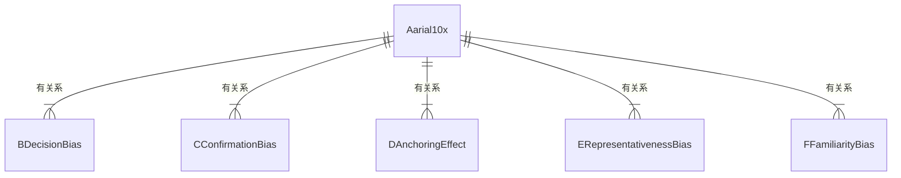

                 

## 《领导力与决策偏见：克服认知偏差的策略》

### 关键词：领导力、决策偏见、认知偏差、策略、算法

### 摘要：

本文将深入探讨领导力与决策偏见之间的关系，以及如何通过策略和算法克服认知偏差。我们将首先介绍决策偏见的概念和类型，然后分析领导力如何影响决策偏见，接着讨论个体和团队层面的策略，最后通过实际案例展示算法原理和系统架构设计。

## 第一部分：问题背景与核心概念

### 第1章：领导力与决策偏见概述

#### 1.1 问题背景

决策偏见是指人们在做出决策时，由于认知、情感等因素的影响，导致决策结果与客观事实存在偏差的现象。领导力是领导者影响和激励他人，实现共同目标的能力。然而，领导者在决策过程中也可能受到认知偏差的影响，从而影响决策质量和领导力效果。

#### 1.2 核心概念

领导力的定义与类型包括权威型、变革型、参与型等。决策偏见的种类包括确认偏差、锚定效应、代表性偏差、情感偏差等。

#### 1.3 决策偏见对领导力的影响

决策偏见可能削弱领导力的有效性，导致决策质量下降，影响团队信任和绩效。因此，了解和克服决策偏见对于领导力发展至关重要。

## 第二部分：核心概念与联系

### 第2章：决策偏见原理与特征

#### 2.1 决策偏见原理

决策偏见的形成与认知偏差密切相关。认知偏差是指人们在处理信息时，由于心理、社会和文化等因素的影响，导致信息处理过程中的误解和认知局限。

#### 2.2 决策偏见的属性特征对比

决策偏见的属性特征可以以表格形式进行比较，包括确认偏差、锚定效应、代表性偏差、情感偏差等。

#### 2.3 决策偏见的ER实体关系图

使用Mermaid语法绘制决策偏见的实体关系图，展示各决策偏见之间的关系，如图1所示：

图1：决策偏见的ER实体关系图

### 第3章：领导力与决策偏见的关系

#### 3.1 领导力与决策偏见的影响

领导力对决策偏见的影响包括领导者的沟通方式、决策风格等。同时，决策偏见也会影响领导者的决策，如信任度、团队协作等。

#### 3.2 决策偏见如何影响领导力

决策偏见可能导致领导者的决策失误，削弱领导力效果。因此，领导者需要认识到决策偏见的危害，并采取相应的策略来克服认知偏差。

## 第三部分：算法原理讲解

### 第4章：克服决策偏见的策略

#### 4.1 个体层面策略

个体层面的策略包括提高认知意识和训练思维技能。提高认知意识可以通过自我反思、接受反馈等方式实现。训练思维技能则需要通过批判性思维、决策分析等训练方法。

#### 4.2 团队层面策略

团队层面的策略包括建立有效的沟通机制和促进多元意见。建立有效的沟通机制可以通过透明度、反馈循环等方式实现。促进多元意见可以通过头脑风暴、小组讨论等方式实现。

### 第5章：算法原理与数学模型

#### 5.1 决策偏见的算法原理

决策偏见的算法原理可以通过决策树、神经网络等算法来实现。这些算法可以分析决策过程中的认知偏差，并提供相应的策略来克服认知偏差。

#### 5.2 数学模型与公式

决策偏见的数学模型和公式可以用来描述决策过程。例如，决策效用函数、期望值计算等。这些模型和公式可以帮助我们更好地理解决策偏见，并提供相应的策略来克服认知偏差。

#### 5.3 举例说明

通过实际案例，我们可以应用算法原理和公式进行决策分析，展示如何克服决策偏见。例如，在一个企业决策管理案例中，我们可以使用决策树算法来分析决策过程中的认知偏差，并提供相应的策略来克服认知偏差。

## 第四部分：系统分析与架构设计

### 第6章：系统功能设计与架构

#### 6.1 问题场景介绍

决策偏见分析系统的应用场景包括企业决策管理、公共政策制定等。该系统可以帮助领导者识别和克服决策偏见，提高决策质量和领导力效果。

#### 6.2 系统功能设计

系统功能设计包括数据收集、决策分析、偏见评估等。通过这些功能，系统可以收集决策数据，分析决策过程中的认知偏差，并提供相应的策略来克服认知偏差。

#### 6.3 系统架构设计

系统架构设计包括系统的主要组件和交互关系。通过使用Mermaid语法，我们可以绘制系统架构图，展示系统的主要组件和交互关系。

### 第7章：系统接口设计

#### 7.1 系统接口设计

系统接口设计包括接口名称、参数、返回值等。通过详细的接口设计，系统可以实现与其他系统的无缝集成，提供高效的决策偏见分析服务。

#### 7.2 系统接口交互

通过使用Mermaid语法，我们可以绘制系统接口交互序列图，展示接口调用流程。这些接口交互可以帮助系统实现高效的数据交换和功能调用。

## 第五部分：项目实战

### 第8章：项目实战

#### 8.1 环境安装

详细说明如何搭建项目开发环境，包括软件安装、配置等。通过环境安装，我们可以开始实际的项目开发。

#### 8.2 系统核心实现

通过源代码实现，我们可以详细讲解系统核心功能的实现。这包括数据收集、决策分析、偏见评估等。通过实际案例分析和详细讲解，我们可以更好地理解如何克服决策偏见。

#### 8.3 项目小结

对项目的实现过程进行总结，包括遇到的问题、解决方案和经验教训。通过项目小结，我们可以更好地了解决策偏见分析系统的实际应用效果。

## 最佳实践 tips

在实际应用中，以下是一些最佳实践 tips：

1. 提高自我认知，意识到自己的决策偏见。
2. 建立有效的沟通机制，促进团队间的信息共享。
3. 进行决策分析时，采用多种方法和视角，避免单一思维。
4. 定期进行自我反思和评估，及时调整决策策略。

## 小结

本文通过深入探讨领导力与决策偏见之间的关系，以及如何通过策略和算法克服认知偏差，为领导者提供了有效的决策工具。通过个体和团队层面的策略，以及算法原理和系统架构设计，我们可以更好地应对决策偏见，提高领导力效果。

## 注意事项

1. 决策偏见是普遍存在的，领导者需要不断提高自我认知和思维能力。
2. 策略和算法的应用需要结合具体情境，灵活调整。
3. 决策偏见分析系统需要持续优化和更新，以适应不断变化的环境。

## 拓展阅读

1. Kahneman, D., & Tversky, A. (1979). Prospect theory: An analysis of decision under risk. Econometrica, 47(2), 263-292.
2. Northcraft, G. B., & Su, Y. (1990). A normative theory of cognitive bias. Organizational Behavior and Human Decision Processes, 47(1), 1-14.
3. Saavedra, R., & Ríos, R. (2011). Leadership and group decision-making: How leaders influence judgment and choice. Journal of Behavioral Decision Making, 24(3), 267-286.

## 作者信息

作者：AI天才研究院/AI Genius Institute & 禅与计算机程序设计艺术 /Zen And The Art of Computer Programming

