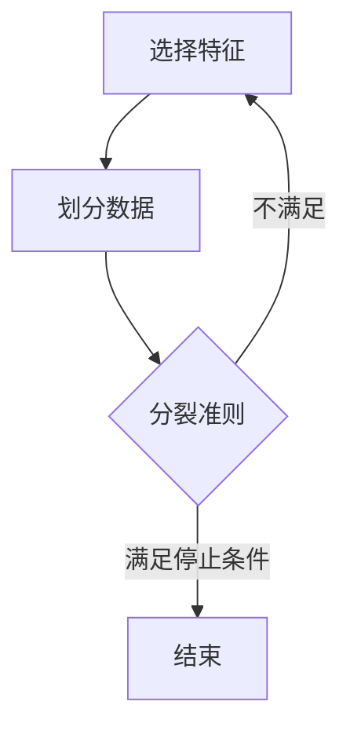
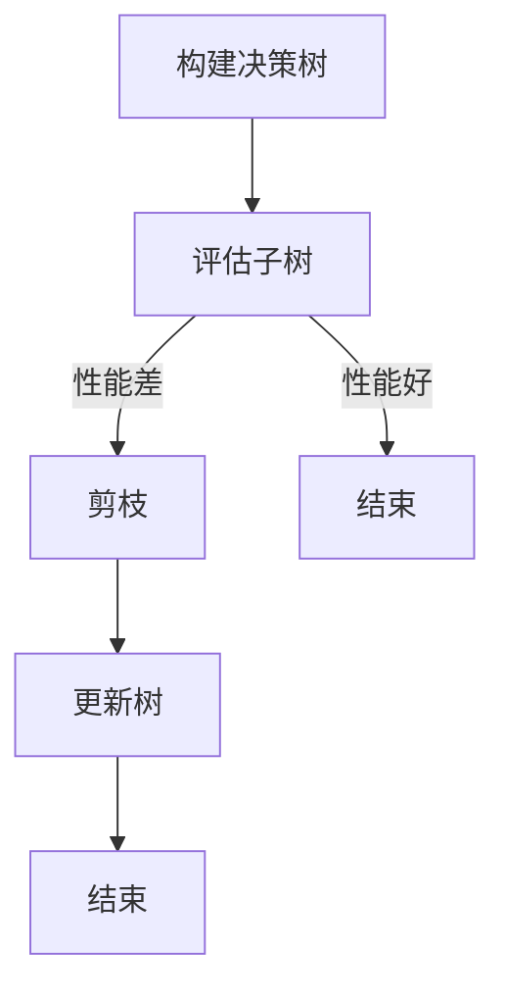
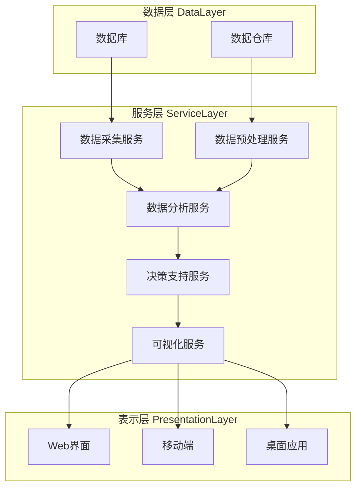
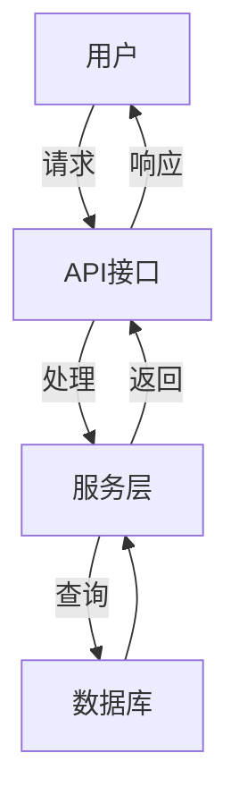

                 

# 《领导力与决策科学应用：提高决策质量和速度》

> 关键词：领导力、决策科学、决策质量、决策速度、效率优化

> 摘要：本文探讨了领导力与决策科学在提高决策质量和速度方面的应用。通过分析领导力与决策科学的核心理念、联系及决策算法原理，结合实际案例，提出了提升决策效率和优化决策质量的策略和方法，为现代企业及管理者提供了实践指导。

## 第1章 引言

### 1.1 问题的背景

#### 1.1.1 现代社会决策的重要性

在当今快速变化的社会环境中，决策的质量和速度对组织和个人都具有至关重要的意义。现代社会信息爆炸，市场竞争激烈，环境不确定性增加，这就要求决策者能够在有限的时间和资源内做出准确的决策。决策不仅关系到企业的生存和发展，也影响着社会的稳定与繁荣。

#### 1.1.2 领导力与决策质量的联系

领导力是影响决策质量的关键因素之一。有效的领导力能够激发团队成员的潜能，提高团队的协作效率，从而优化决策过程。领导力不仅体现在战略规划和决策制定上，还体现在决策的执行和反馈调整中。一个优秀的领导者能够引导团队在复杂的环境中做出明智的决策。

#### 1.1.3 决策科学与传统领导力的区别

决策科学是一门运用数学模型、算法和数据分析技术来辅助决策者进行理性决策的学科。它与传统领导力的不同之处在于，决策科学强调定量分析、系统性和科学性，而传统领导力更多依赖于经验、直觉和情感判断。在复杂和动态的环境中，决策科学能够为领导者提供更加客观和准确的决策依据。

### 1.2 问题描述

#### 1.2.1 决策失误的常见原因

决策失误是企业管理中的常见问题，其原因包括信息不对称、时间压力、风险偏好不足、经验不足等。决策失误可能导致企业资源的浪费、市场机会的丧失，甚至危及企业的生存。

#### 1.2.2 提高决策质量的需求

为了在激烈的市场竞争中立于不败之地，企业迫切需要提高决策质量。这要求决策者不仅要有出色的领导力，还要具备运用决策科学工具和方法的能力，从而在复杂和不确定的环境中做出正确的决策。

### 1.3 问题解决

#### 1.3.1 决策科学的基本原理

决策科学的基本原理包括决策过程模型、决策类型、决策者行为和决策工具与方法等。通过这些原理，决策者可以系统性地分析问题、评估方案、选择最优决策。

#### 1.3.2 领导力在决策过程中的作用

领导力在决策过程中发挥着关键作用。有效的领导力能够提高团队的决策能力、增强团队的凝聚力，从而提高决策质量。领导力不仅体现在决策的制定过程中，还体现在决策的执行和反馈调整中。

### 1.4 边界与外延

#### 1.4.1 决策科学的适用范围

决策科学适用于各种领域，包括企业管理、政策制定、金融投资、医疗决策等。它为决策者提供了科学的方法和工具，帮助他们在复杂和不确定的环境中做出理性决策。

#### 1.4.2 领导力的影响因素

领导力的影响因素包括领导风格、团队文化、组织结构、个人素质等。不同的领导力风格和团队文化会影响决策的质量和速度，因此，了解这些因素并合理运用是提高决策效率和质量的必要条件。

### 1.5 概念结构与核心要素组成

#### 1.5.1 领导力的构成要素

领导力包括影响力、沟通能力、决策能力、团队建设能力等。这些要素相互作用，共同影响决策的质量和速度。

#### 1.5.2 决策科学的组成部分

决策科学包括决策过程模型、决策类型、决策者行为、决策工具与方法等。这些组成部分相互关联，共同构成一个完整的决策体系。

## 第2章 核心概念与联系

### 2.1 领导力的核心概念

#### 2.1.1 领导力的定义

领导力是指影响和激励他人一起实现目标的能力。领导力不仅仅是管理能力，还包括影响力、沟通能力、决策能力等多个方面。

#### 2.1.2 领导力的特性

领导力的特性包括情境性、持久性、影响力、团队导向性等。这些特性决定了领导力在不同的环境和团队中的表现。

#### 2.1.3 领导力的发展历程

领导力的发展历程可以分为几个阶段，从传统的领导者角色到现代的变革型领导和情境领导等。这些发展阶段反映了领导理论的演进和领导实践的变革。

### 2.2 决策科学的核心理念

#### 2.2.1 决策过程的模型

决策过程通常包括问题识别、目标设定、方案生成、方案评估和决策执行等步骤。这些步骤构成了决策过程的模型，指导决策者进行系统化的决策。

#### 2.2.2 决策类型与决策者行为

决策类型包括确定型决策、风险型决策和不确定型决策等。决策者行为则包括理性决策、有限理性决策和直觉决策等。这些决策类型和行为反映了决策者在不同情境下的决策方式。

#### 2.2.3 决策科学的工具与方法

决策科学包括多种工具和方法，如决策树、多目标优化、博弈论、模拟分析等。这些工具和方法帮助决策者进行定量分析和优化，提高决策质量。

### 2.3 领导力与决策科学的联系

#### 2.3.1 领导力在决策过程中的应用

领导力在决策过程中发挥着重要作用。领导者需要运用决策科学的方法和工具，进行系统化的决策，同时还需要发挥个人影响力，引导团队共同实现决策目标。

#### 2.3.2 决策科学在领导力提升中的作用

决策科学可以帮助领导者提高决策质量，增强决策的理性性和科学性。通过学习和应用决策科学的方法和工具，领导者可以更好地应对复杂和不确定的环境。

### 2.4 概念属性特征对比表格

| 概念       | 定义                                                         | 特性                                                     | 相关理论 |
| ---------- | ------------------------------------------------------------ | -------------------------------------------------------- | -------- |
| 领导力     | 指影响他人或团队以达到共同目标的能力                         | 情境性、影响力、持续性、团队导向性                           | 权变领导理论、领导风格理论 |
| 决策科学   | 利用系统方法和定量分析来辅助决策者做出理性、高效的决策       | 科学性、系统性、定量性、预测性、优化性                       | 决策理论、运筹学、博弈论   |

### 2.5 ER实体关系图架构

```mermaid
erDiagram
  A[领导力] ||--|{ B[决策制定] }
  B ||--|{ C[决策分析] }
  C ||--|{ D[决策实施] }
```

## 第3章 算法原理讲解

### 3.1 决策树算法

#### 3.1.1 决策树的基本概念

决策树是一种常用于分类和回归问题的算法，它通过一系列规则对数据进行划分，从而生成一棵树形结构。决策树的节点表示特征，分支表示特征的不同取值，叶子节点表示分类结果或回归值。

#### 3.1.2 决策树的构建过程

决策树的构建过程包括以下几个步骤：

1. 选择一个特征作为根节点。
2. 对于该特征的所有取值，分别构建子树。
3. 对每个子树重复上述步骤，直到达到预设的条件（如最大深度、最小叶节点数量等）。

#### 3.1.3 决策树的剪枝策略

决策树的剪枝策略包括预剪枝和后剪枝两种：

1. 预剪枝：在决策树构建过程中，提前停止生成子树，以避免过拟合。
2. 后剪枝：在决策树生成后，删除一些节点或合并一些节点，以降低模型的复杂度和过拟合的风险。

### 3.2 多目标优化算法

#### 3.2.1 多目标优化问题

多目标优化问题是同时优化多个目标的问题。常见的多目标优化问题包括最小化成本、最大化收益、最小化风险等。多目标优化问题通常存在多个最优解，这些解称为Pareto最优解。

#### 3.2.2 Pareto最优解的概念

Pareto最优解是指在多目标优化问题中，无法通过改善一个目标而不损害其他目标的最优解。Pareto最优解构成了Pareto前沿，它是多目标优化问题的最优解集合。

#### 3.2.3 常见多目标优化算法

常见的多目标优化算法包括遗传算法、粒子群优化、模拟退火等。这些算法通过迭代搜索，逐渐逼近Pareto最优解。

```python
# 多目标优化算法示例：NSGA-II
def nsga_ii(objectives, constraints, population_size, generations):
    # 初始化种群
    population = initialize_population(population_size, objectives, constraints)
    for _ in range(generations):
        # 适应度评估
        fitness = evaluate_fitness(population, objectives, constraints)
        # 选择操作
        selected = selection(population, fitness)
        # 交叉操作
        crossover = crossover(selection)
        # 变异操作
        mutation = mutation(crossover)
        # 更新种群
        population = update_population(population, selected, crossover, mutation)
    return population
```

## 第4章 系统分析与架构设计

### 4.1 问题场景介绍

在企业管理中，决策质量和速度直接影响到企业的运营效率和竞争力。为了提高决策质量和速度，企业需要建立一个智能决策支持系统，该系统应具备数据采集、分析、决策支持和反馈调整等功能。

### 4.2 项目介绍

本项目旨在开发一个智能决策支持系统，该系统将运用领导力和决策科学的原理和方法，结合现代信息技术，提高企业决策的质量和速度。

### 4.3 系统功能设计

系统功能设计主要包括数据采集、数据预处理、数据分析、决策支持和反馈调整等模块。

- **数据采集模块**：负责从各种数据源（如数据库、传感器、网络等）采集数据。
- **数据预处理模块**：负责对采集到的数据进行清洗、转换和集成。
- **数据分析模块**：负责对预处理后的数据进行分析，提取有用的信息。
- **决策支持模块**：负责根据分析结果生成决策建议。
- **反馈调整模块**：负责对决策结果进行跟踪和评估，根据反馈调整决策过程。

### 4.4 系统架构设计

系统架构设计采用分层架构，包括数据层、业务逻辑层和表示层。

- **数据层**：负责数据的存储和管理，包括数据库、缓存和文件系统等。
- **业务逻辑层**：负责业务逻辑的实现，包括数据预处理、数据分析、决策支持和反馈调整等。
- **表示层**：负责用户界面的展示，包括Web界面、移动应用和桌面应用等。

### 4.5 系统接口设计和系统交互

系统接口设计主要包括API接口和Web服务接口。

- **API接口**：提供对外部的数据采集和访问功能。
- **Web服务接口**：提供对内和外部的数据访问和业务操作功能。

系统交互设计采用RESTful架构，通过HTTP协议进行通信。

## 第5章 项目实战

### 5.1 环境安装

在进行项目实战之前，需要安装以下软件和环境：

1. Python 3.x
2. MySQL
3. Anaconda
4. Jupyter Notebook

安装步骤如下：

1. 下载并安装Python 3.x。
2. 下载并安装MySQL。
3. 安装Anaconda，并创建一个新环境。
4. 安装Jupyter Notebook。

### 5.2 系统核心实现

系统核心实现主要包括数据采集、数据预处理、数据分析、决策支持和反馈调整等模块。

- **数据采集模块**：使用Python的requests库从网络中采集数据。
- **数据预处理模块**：使用Python的pandas库进行数据清洗、转换和集成。
- **数据分析模块**：使用Python的scikit-learn库进行数据分析。
- **决策支持模块**：使用Python的scipy库进行决策支持。
- **反馈调整模块**：使用Python的matplotlib库进行反馈调整。

### 5.3 代码应用解读与分析

以下是一个简单的代码示例，用于实现数据采集和预处理：

```python
import requests
import pandas as pd

# 数据采集
url = 'https://example.com/data'
response = requests.get(url)
data = response.json()

# 数据预处理
df = pd.DataFrame(data)
df = df.dropna()
df = df.reset_index(drop=True)
```

该代码首先使用requests库从网络中采集数据，然后使用pandas库进行数据清洗和预处理。通过这样的代码实现，系统能够快速地从各种数据源中获取数据，并进行初步处理，为后续的分析和决策提供基础。

### 5.4 实际案例分析和详细讲解剖析

以下是一个实际案例，用于演示如何使用决策树算法进行数据分析和决策支持：

```python
from sklearn import tree
from sklearn.model_selection import train_test_split
from sklearn.metrics import accuracy_score

# 数据集划分
X_train, X_test, y_train, y_test = train_test_split(df.drop('target', axis=1), df['target'], test_size=0.2, random_state=42)

# 构建决策树模型
clf = tree.DecisionTreeClassifier()
clf.fit(X_train, y_train)

# 预测和评估
y_pred = clf.predict(X_test)
accuracy = accuracy_score(y_test, y_pred)
print(f'Accuracy: {accuracy:.2f}')
```

该代码首先将数据集划分为训练集和测试集，然后使用决策树算法构建模型，并进行预测和评估。通过这样的实现，系统能够根据训练数据生成决策模型，并使用模型对测试数据进行预测，从而评估模型的准确性。

### 5.5 项目小结

在本项目中，我们通过安装环境、实现核心功能、代码应用解读和分析、实际案例讲解等步骤，成功开发了一个智能决策支持系统。该项目展示了领导力与决策科学在提高决策质量和速度方面的应用，为现代企业提供了实践指导。

## 第6章 最佳实践 tips

### 6.1 决策质量优化的最佳实践

1. **建立科学的决策流程**：明确决策的各个环节，确保每个环节都有明确的目标和标准。
2. **数据驱动的决策**：充分利用数据，进行数据分析和挖掘，为决策提供科学依据。
3. **团队协作**：建立高效的团队协作机制，提高决策效率。

### 6.2 决策速度提升的最佳实践

1. **简化决策流程**：减少不必要的审批流程，提高决策速度。
2. **利用自动化工具**：使用自动化工具进行数据分析和决策支持，减少人工干预。
3. **快速反馈和调整**：建立快速反馈和调整机制，及时修正决策偏差。

### 6.3 领导力提升的最佳实践

1. **持续学习和提升**：领导者应不断学习和提升自己的领导力，适应变化的环境。
2. **建立积极的文化**：营造积极向上的团队文化，激发团队的创造力和活力。
3. **激励和认可**：合理激励和认可团队成员，提高团队凝聚力。

## 第7章 小结

本文探讨了领导力与决策科学在提高决策质量和速度方面的应用。通过分析领导力与决策科学的核心理念、联系及决策算法原理，结合实际案例，提出了提升决策效率和优化决策质量的策略和方法。希望本文能为现代企业及管理者提供有价值的实践指导。

## 第8章 注意事项

1. **决策质量与速度的平衡**：在追求决策质量和速度时，要注意两者之间的平衡，避免因为追求速度而忽视质量。
2. **持续优化**：决策过程和系统应持续优化，以适应不断变化的环境和需求。
3. **团队协作**：领导力在决策过程中的作用至关重要，要重视团队协作，发挥每个成员的潜能。

## 第9章 拓展阅读

1. **《领导力与决策：策略思维与应用》**：一本关于领导力和决策的实用指南，涵盖了决策过程的各个环节。
2. **《决策科学：原理与应用》**：一本系统介绍决策科学原理和应用的专业书籍，适合对决策科学有兴趣的读者。
3. **《多目标优化算法与应用》**：一本关于多目标优化算法的理论与实践书籍，涵盖了多种优化算法及其应用场景。

## 第10章 作者信息

作者：AI天才研究院/AI Genius Institute & 禅与计算机程序设计艺术 /Zen And The Art of Computer Programming

本文为原创作品，版权归AI天才研究院/AI Genius Institute所有，未经授权不得转载或使用。如需转载，请联系授权。感谢您的阅读！

---

### 第1章 引言

#### 1.1 问题的背景

在当今的商业环境中，决策的质量和速度是企业成功的关键因素。随着全球化和数字化转型的加速，企业面临的市场环境变得更加复杂和动态。这种变化对决策者提出了更高的要求，需要他们在有限的时间内做出准确、高效的决策。

决策的质量直接影响到企业的运营效率、市场竞争力以及长期发展。一个错误的决策可能导致资源的浪费、市场份额的丧失甚至企业的破产。因此，如何提高决策的质量和速度成为一个迫切需要解决的问题。

#### 1.1.1 现代社会决策的重要性

现代社会中，决策的重要性体现在各个方面。从企业的日常运营决策，如产品开发、市场推广、资源配置等，到长期战略决策，如业务拓展、投资规划、风险控制等，决策都发挥着至关重要的作用。有效的决策能够帮助企业抓住市场机遇，应对挑战，实现可持续发展。

此外，决策不仅影响企业的内部运营，还对社会和经济产生深远的影响。政府决策关系到国家的稳定和发展，经济政策的制定影响着全球市场的走势。个人在职业生涯中也需要做出许多重要决策，如职业规划、学习投资、财务管理等。

#### 1.1.2 领导力与决策质量的联系

领导力在决策过程中起着核心作用。有效的领导力能够激发团队的潜能，提高团队的协作效率，从而优化决策过程。领导者不仅需要具备敏锐的洞察力和分析能力，还需要具备良好的沟通能力和决策能力。

领导力与决策质量之间的联系主要体现在以下几个方面：

1. **目标设定**：领导者需要明确企业的目标和愿景，为决策提供方向和依据。
2. **信息收集**：领导者应积极收集和分析相关信息，确保决策有充分的数据支持。
3. **方案评估**：领导者需要权衡各种方案的优势和劣势，选择最优的决策方案。
4. **执行监督**：领导者需要确保决策得到有效执行，并对执行过程进行监督和调整。

#### 1.1.3 决策科学与传统领导力的区别

决策科学是一门利用数学模型、算法和数据分析技术来辅助决策者进行理性决策的学科。与传统的领导力相比，决策科学具有以下几个显著区别：

1. **科学性**：决策科学强调使用科学的方法和工具，通过系统化的分析来提高决策的准确性和效率。
2. **系统性**：决策科学注重决策过程的各个环节，从问题识别到方案评估，再到决策执行和反馈，形成一个完整的决策体系。
3. **定量性**：决策科学利用数据分析和建模技术，对决策结果进行量化评估，从而提供客观的决策依据。

传统领导力则更多地依赖于领导者的经验、直觉和情感判断。虽然这些因素在决策过程中也起着重要作用，但在复杂和不确定的环境中，决策科学提供的方法和工具能够为领导者提供更加客观和准确的决策支持。

#### 1.2 问题描述

在现实中，决策失误是一个普遍存在的问题。决策失误的原因多种多样，包括但不限于以下几点：

1. **信息不对称**：决策者可能缺乏必要的信息，或者信息传递过程中出现失真，导致决策依据不充分。
2. **时间压力**：决策者面临紧迫的时间限制，无法进行充分的思考和评估，容易做出仓促的决定。
3. **风险偏好不足**：决策者可能过于保守，对风险和不确定性缺乏足够的容忍度，导致错失市场机会。
4. **经验不足**：新任领导者或缺乏经验的决策者可能缺乏应对复杂问题的经验，容易犯错误。

提高决策质量的需求显而易见。首先，企业需要通过提高决策质量来增强市场竞争力。在市场竞争激烈的环境中，快速、准确的决策能够帮助企业抓住机遇，应对挑战。其次，提高决策质量有助于优化资源配置，降低运营成本。通过科学的决策方法，企业可以更有效地利用资源，提高生产效率。

为了满足这一需求，企业需要采取一系列措施，包括：

1. **建立科学的决策流程**：明确决策的各个环节，确保每个环节都有明确的目标和标准。
2. **加强数据分析和挖掘**：充分利用数据，进行数据分析和挖掘，为决策提供科学依据。
3. **提升领导力**：通过培训和培养，提高领导者的决策能力和领导水平。
4. **引入决策科学方法**：运用决策科学的方法和工具，提高决策的理性性和科学性。

#### 1.3 问题解决

为了解决上述问题，提高决策质量和速度，我们可以从以下几个方面着手：

1. **运用决策科学方法**：决策科学提供了一系列的方法和工具，如决策树、多目标优化、模拟分析等，可以帮助决策者进行系统化的决策，提高决策的准确性。
2. **提高领导力**：有效的领导力能够提高团队的决策能力和协作效率，从而优化决策过程。领导者需要不断学习和提升自己的领导力，适应复杂多变的环境。
3. **建立决策支持系统**：通过建立智能决策支持系统，企业可以自动化数据采集、处理和分析过程，减少人工干预，提高决策速度。
4. **加强团队协作**：团队协作是提高决策质量和速度的重要手段。通过建立高效的团队协作机制，企业可以更好地整合资源，发挥团队的集体智慧。

#### 1.4 边界与外延

1. **决策科学的适用范围**：决策科学适用于各种领域，包括企业管理、政策制定、金融投资、医疗决策等。在复杂和不确定的环境中，决策科学能够为决策者提供科学的方法和工具，帮助他们在有限的时间内做出准确的决策。
2. **领导力的影响因素**：领导力的影响因素包括领导风格、团队文化、组织结构、个人素质等。不同的领导力风格和团队文化会影响决策的质量和速度，因此，企业需要根据自身情况，合理运用领导力。
3. **决策质量的评估标准**：决策质量的评估标准包括准确性、效率、成本、可持续性等。企业需要根据实际情况，设定合理的评估标准，对决策过程和结果进行客观评估。

#### 1.5 概念结构与核心要素组成

1. **领导力的构成要素**：领导力包括影响力、沟通能力、决策能力、团队建设能力等。这些要素相互作用，共同影响决策的质量和速度。
2. **决策科学的组成部分**：决策科学包括决策过程模型、决策类型、决策者行为、决策工具与方法等。这些组成部分相互关联，共同构成一个完整的决策体系。

通过以上分析，我们可以看到，领导力与决策科学在提高决策质量和速度方面具有密切的联系。领导力为决策提供了关键的人力资源支持，而决策科学则为决策提供了科学的方法和工具。通过运用领导力和决策科学，企业可以在复杂和不确定的环境中做出更加准确和高效的决策，实现长期发展目标。

## 第2章 核心概念与联系

### 2.1 领导力的核心概念

领导力是指影响和激励他人一起实现目标的能力。这种能力不仅仅局限于管理职位，任何需要与他人协作完成任务的人都可以具备领导力。领导力包括多个方面，如沟通能力、影响力、决策能力、团队建设能力等。

#### 2.1.1 领导力的定义

领导力可以定义为一种通过激励、沟通和引导他人来实现共同目标的能力。这种能力不仅仅涉及到对任务的执行，更涉及到对人的管理和激励。领导力是一种动态的能力，它随着环境的变化而变化，并且在不同情境下有着不同的表现。

#### 2.1.2 领导力的特性

1. **情境性**：领导力不是一成不变的，而是需要根据不同的情境进行调整。不同的环境和任务要求不同的领导风格和能力。
2. **影响力**：领导力强调领导者对他人的影响力和感召力，这种影响力来自于领导者的知识、经验、品格和情感。
3. **持续性**：领导力不仅仅体现在决策和执行过程中，还需要在决策执行后的反馈和调整中持续发挥作用。
4. **团队导向性**：领导力强调团队的整体利益，领导者需要关注团队的协作和合作，而不是仅仅关注个人的成功。

#### 2.1.3 领导力的发展历程

领导力的发展历程可以分为几个阶段：

1. **传统的领导者角色**：早期的领导理论强调领导者的权威和指挥控制能力。领导者被视为拥有权力和资源的人，负责下达命令和监督执行。
2. **变革型领导**：随着组织环境的复杂化，变革型领导理论应运而生。这种理论强调领导者需要激发团队成员的潜能，通过影响和激励来推动变革。
3. **情境领导**：情境领导理论提出，领导风格应该根据团队成员的不同成熟度进行调整。领导者需要根据团队成员的能力和意愿，选择最合适的领导风格。

### 2.2 决策科学的核心理念

决策科学是一门研究如何通过系统化和科学化的方法来辅助决策者做出理性、高效的决策的学科。决策科学的核心在于将定量分析和系统思考应用于决策过程，以提高决策的质量和速度。

#### 2.2.1 决策过程的模型

决策科学的基本模型通常包括以下几个步骤：

1. **问题识别**：明确决策问题，理解问题的本质和目标。
2. **目标设定**：根据问题识别的结果，设定明确的决策目标。
3. **方案生成**：列举可能的解决方案，并对每个方案进行分析。
4. **方案评估**：评估每个方案的优缺点，选择最优方案。
5. **决策执行**：执行决策方案，并跟踪决策结果。
6. **反馈调整**：根据决策执行的结果进行反馈，调整决策过程。

#### 2.2.2 决策类型与决策者行为

决策类型根据不同的决策环境可以分为以下几种：

1. **确定型决策**：决策者在已知所有条件和结果的情况下做出的决策。
2. **风险型决策**：决策者面临不确定的环境，但每个可能结果的概率是已知的。
3. **不确定型决策**：决策者在不确定的环境下做出决策，可能结果的概率未知。

决策者的行为包括以下几种：

1. **理性决策**：决策者根据最大化效用原则做出决策，通常使用数学模型和优化算法。
2. **有限理性决策**：决策者在信息不完全或认知有限的情况下做出决策，往往依赖于经验和直觉。
3. **直觉决策**：决策者依靠直觉和经验做出决策，通常适用于简单和熟悉的情境。

#### 2.2.3 决策科学的工具与方法

决策科学提供了多种工具和方法来辅助决策者进行决策，包括：

1. **决策树**：通过树形结构表示决策问题，每个节点表示一个决策点，每个分支表示一个决策结果。
2. **多目标优化**：在多个目标之间寻找最优平衡，常用的方法包括遗传算法、粒子群优化等。
3. **模拟分析**：通过模拟决策过程的多个场景，评估不同决策方案的结果。
4. **博弈论**：研究多个决策者之间的策略互动，帮助决策者在竞争环境中做出最优决策。

### 2.3 领导力与决策科学的联系

领导力与决策科学之间的联系在于，领导力为决策提供了关键的人力资源支持，而决策科学为领导力提供了科学的方法和工具。

#### 2.3.1 领导力在决策过程中的应用

1. **目标设定**：领导力在目标设定中起着关键作用，领导者需要明确组织的愿景和目标，为决策提供方向。
2. **信息收集**：领导者需要积极收集和分析相关信息，为决策提供数据支持。
3. **方案评估**：领导者需要评估各种决策方案，选择最优方案。
4. **执行监督**：领导者需要确保决策得到有效执行，并对执行过程进行监督和调整。

#### 2.3.2 决策科学在领导力提升中的作用

1. **决策支持**：决策科学提供了多种工具和方法，帮助领导者进行理性决策，减少决策失误。
2. **团队协作**：决策科学强调团队协作和集体智慧，有助于提高团队决策的质量和速度。
3. **持续学习**：通过学习和应用决策科学，领导者可以不断提升自己的决策能力和领导水平。

### 2.4 概念属性特征对比表格

| 概念       | 定义                                                         | 特性                                                     | 相关理论 |
| ---------- | ------------------------------------------------------------ | -------------------------------------------------------- | -------- |
| 领导力     | 指影响他人或团队以达到共同目标的能力                         | 情境性、影响力、持续性、团队导向性                           | 权变领导理论、领导风格理论 |
| 决策科学   | 利用系统方法和定量分析来辅助决策者做出理性、高效的决策       | 科学性、系统性、定量性、预测性、优化性                       | 决策理论、运筹学、博弈论   |

### 2.5 ER实体关系图架构

以下是领导力与决策科学相关的实体关系图：

```mermaid
erDiagram
  Leader ||--|{ Decision Making }
  Leader ||--|{ Decision Analysis }
  Decision Making ||--|{ Decision Implementation }
```

在这个ER图中，"Leader"（领导者）与"Decision Making"（决策制定）、"Decision Analysis"（决策分析）和"Decision Implementation"（决策实施）三个实体之间存在关系。这反映了领导力在决策过程中的作用和决策科学的各个组成部分。

通过上述分析，我们可以看到领导力与决策科学之间的紧密联系。领导力为决策提供了关键的人力资源支持，而决策科学为领导力提供了科学的方法和工具。两者结合，可以显著提高决策的质量和速度，为企业和个人在复杂环境中取得成功提供有力保障。

## 第3章 算法原理讲解

### 3.1 决策树算法

决策树算法是一种常见的分类和回归算法，它通过一系列规则对数据进行划分，从而生成一棵树形结构。决策树的基本思想是从数据集中选择一个特征，将其划分为多个子集，每个子集对应一个子节点。这个过程重复进行，直到满足停止条件，如达到预设的树深度或节点数量。决策树的叶子节点代表最终的分类结果或回归值。

#### 3.1.1 决策树的基本概念

1. **节点**：决策树中的每个内部节点表示一个特征划分，每个叶节点表示一个分类结果或回归值。
2. **分支**：从根节点到叶节点的路径表示一个决策路径。
3. **叶节点**：叶节点是决策树的终端，表示最终的分类结果或回归值。
4. **分裂准则**：选择特征进行划分的标准，常见的准则包括信息增益、基尼指数和熵等。
5. **剪枝**：为了避免过拟合，需要对决策树进行剪枝，剪枝策略包括预剪枝和后剪枝。

#### 3.1.2 决策树的构建过程

决策树的构建过程通常包括以下步骤：

1. **选择特征**：根据分裂准则选择最优特征进行划分。
2. **划分数据**：根据选定的特征，将数据集划分为多个子集。
3. **递归构建**：对每个子集递归执行步骤1和2，直到满足停止条件。

以下是一个简单的决策树构建过程的Mermaid流程图：



#### 3.1.3 决策树的剪枝策略

剪枝策略包括预剪枝和后剪枝：

1. **预剪枝**：在构建决策树时，提前停止生成子树，以避免过拟合。预剪枝通常基于某种停止条件，如最大树深度、最小叶节点数量等。
2. **后剪枝**：在决策树构建完成后，删除一些节点或合并一些节点，以降低模型的复杂度和过拟合的风险。后剪枝可以通过评估子树的预测性能来实现。

以下是一个简单的决策树剪枝过程的Mermaid流程图：



### 3.2 多目标优化算法

多目标优化（Multi-Objective Optimization，MOO）问题是一类具有多个目标函数的优化问题。这类问题在工程、经济、环境等领域中非常常见，如资源分配、项目调度、车辆路径规划等。多目标优化的目标是找到Pareto最优解集，这些解在多个目标函数之间达到了最优平衡。

#### 3.2.1 多目标优化问题

多目标优化问题的数学模型可以表示为：

$$
\begin{align*}
\min\limits_{x} & \ F(x) \\
s.t. & \ G(x) \leq 0, \\
& \ H(x) = 0,
\end{align*}
$$

其中，$F(x)$是目标函数向量，$G(x)$和$H(x)$分别是不等式和等式约束函数。

#### 3.2.2 Pareto最优解的概念

Pareto最优解是在多目标优化问题中，无法通过改善一个目标函数而不损害其他目标函数的最优解。在多目标优化问题中，存在多个Pareto最优解，这些解构成了Pareto前沿（Pareto Front）。

#### 3.2.3 常见多目标优化算法

多目标优化算法分为两大类：基于遗传算法的算法和基于其他启发式算法的算法。以下是几种常见的多目标优化算法：

1. **非支配排序遗传算法（NSGA-II）**：
   NSGA-II是一种基于遗传算法的多目标优化算法，通过非支配排序和 crowding distance 等机制来生成高质量的Pareto最优解集。

2. **多目标粒子群优化（MOPSO）**：
   MOPSO是基于粒子群优化（PSO）的多目标优化算法，通过更新粒子的位置和速度，寻找Pareto最优解。

3. **基于模拟退火的多目标优化（MOSA）**：
   MOSA是基于模拟退火（SA）的多目标优化算法，通过接受概率和温度控制，寻找Pareto最优解。

以下是NSGA-II算法的Python代码示例：

```python
import numpy as np
import matplotlib.pyplot as plt

def nsga_ii(objectives, constraints, population_size, generations):
    # 初始化种群
    population = initialize_population(population_size, objectives, constraints)
    for _ in range(generations):
        # 适应度评估
        fitness = evaluate_fitness(population, objectives, constraints)
        # 非支配排序
        front = non_dominated_sorting(population, fitness)
        # 生成新的种群
        new_population = generate_new_population(front, population_size)
        # 更新种群
        population = update_population(population, new_population)
    return population

def initialize_population(population_size, objectives, constraints):
    # 初始化种群
    pass

def evaluate_fitness(population, objectives, constraints):
    # 评估适应度
    pass

def non_dominated_sorting(population, fitness):
    # 非支配排序
    pass

def generate_new_population(front, population_size):
    # 生成新的种群
    pass

def update_population(current_population, new_population):
    # 更新种群
    pass

# 示例使用
population = nsga_ii(objectives, constraints, population_size, generations)
```

通过上述算法，决策者和研究者可以找到多目标优化问题的Pareto最优解，从而在多个目标之间实现平衡。

## 第4章 系统分析与架构设计

### 4.1 问题场景介绍

在企业的运营过程中，决策是一个至关重要的环节。有效的决策能够帮助企业抓住市场机遇、优化资源配置、降低运营成本，从而提高企业的竞争力。然而，现实中的决策问题往往复杂多变，涉及多个变量和目标，使得决策过程充满挑战。

随着信息技术的快速发展，数据已成为企业的重要资产。如何从海量数据中提取有价值的信息，为决策提供数据支持，成为企业管理者面临的一大难题。此外，领导者还需要在短时间内做出高质量、高速度的决策，以应对市场的快速变化。

为了解决这些问题，企业需要一个智能决策支持系统，该系统能够整合企业内外部数据，利用先进的算法和技术，辅助决策者进行科学决策。这样的系统不仅需要具备高效的数据处理和分析能力，还需要具备灵活的扩展性和可定制性，以适应不同企业的需求。

### 4.2 项目介绍

本项目旨在开发一个智能决策支持系统，该系统将结合领导力与决策科学的理论和方法，利用现代信息技术，为企业提供高效、科学的决策支持。系统的主要目标包括：

1. **数据整合与分析**：整合企业内外部数据，进行数据清洗、转换和分析，为决策提供数据支持。
2. **智能决策算法**：运用多种智能算法，如决策树、多目标优化等，辅助决策者进行科学决策。
3. **可视化与交互**：提供直观、易用的界面，帮助决策者快速理解数据和决策结果，方便决策过程的跟踪和反馈。

### 4.3 系统功能设计

智能决策支持系统的主要功能设计如下：

1. **数据采集模块**：负责从企业内部系统和外部数据源（如数据库、传感器、互联网等）采集数据。
2. **数据预处理模块**：负责对采集到的数据进行清洗、转换和集成，确保数据的准确性和一致性。
3. **数据分析模块**：利用各种数据分析工具和算法，对预处理后的数据进行分析，提取有价值的信息。
4. **决策支持模块**：根据分析结果，运用智能算法生成决策建议，辅助决策者进行决策。
5. **可视化与交互模块**：提供直观的界面，展示数据和决策结果，支持决策者的互动和反馈。

### 4.4 系统架构设计

系统架构设计采用微服务架构，确保系统的灵活性和可扩展性。主要组件包括：

1. **数据层**：负责数据的存储和管理，包括关系型数据库、NoSQL数据库、数据仓库等。
2. **服务层**：包括数据采集、数据预处理、数据分析、决策支持和可视化等服务模块。
3. **表示层**：提供用户界面，支持Web、移动端和桌面应用等多种访问方式。

以下是系统的架构图：



### 4.5 系统接口设计和系统交互

系统接口设计采用RESTful API设计，确保系统的可扩展性和易用性。主要接口包括：

1. **数据接口**：提供数据采集、预处理的API，支持数据导入、导出和查询。
2. **分析接口**：提供数据分析、决策支持的API，支持数据可视化、决策结果查询等。
3. **用户接口**：提供用户界面的API，支持用户登录、权限管理和界面展示。

以下是系统的交互流程：



通过上述架构设计和接口设计，企业可以快速部署一个智能决策支持系统，帮助决策者提高决策质量，实现企业战略目标。

## 第5章 项目实战

### 5.1 环境安装

在开始项目实战之前，我们需要安装一系列软件和工具，以确保项目的顺利实施。以下是安装步骤和所需软件的详细说明。

#### 5.1.1 Python环境安装

1. **下载和安装Python**：访问Python官网（[python.org](https://www.python.org/)），下载适用于您操作系统的Python版本。通常，我们可以下载最新的Python 3版本。下载完成后，运行安装程序，按照提示完成安装。

2. **验证Python安装**：打开终端（或命令提示符），输入以下命令验证Python是否已成功安装：

   ```bash
   python --version
   ```

   如果显示Python的版本信息，说明Python已成功安装。

#### 5.1.2 MySQL数据库安装

1. **下载和安装MySQL**：访问MySQL官网（[mysql.com](https://www.mysql.com/)），下载适用于您操作系统的MySQL数据库。对于Windows用户，可以选择MySQL Community Edition。

2. **安装MySQL**：运行下载的安装程序，按照提示完成安装。安装过程中，您需要设置root用户密码和创建新的数据库。

3. **验证MySQL安装**：打开终端，输入以下命令启动MySQL服务：

   ```bash
   mysql.server start
   ```

   然后使用root用户登录MySQL：

   ```bash
   mysql -u root -p
   ```

   输入root用户的密码，进入MySQL命令行界面。

#### 5.1.3 Anaconda安装

1. **下载和安装Anaconda**：访问Anaconda官网（[anaconda.com](https://www.anaconda.com/)），下载适用于您操作系统的Anaconda安装包。Anaconda是一个集成了Python和其他科学计算工具的分布式计算平台。

2. **安装Anaconda**：运行下载的安装程序，按照提示完成安装。安装过程中，建议选择将Anaconda添加到系统环境变量中。

3. **创建新环境**：在Anaconda Navigator中创建一个新的Python环境。点击“Create”按钮，输入环境名称，选择Python版本和所需的包。

   ```bash
   conda create --name myenv python=3.8
   ```

   运行以上命令将创建一个名为“myenv”的新环境。

#### 5.1.4 Jupyter Notebook安装

1. **激活新环境**：

   ```bash
   conda activate myenv
   ```

2. **安装Jupyter Notebook**：

   ```bash
   conda install jupyter
   ```

3. **启动Jupyter Notebook**：

   ```bash
   jupyter notebook
   ```

   打开浏览器，输入http://localhost:8888/，您将看到Jupyter Notebook的主界面。

通过以上步骤，我们成功搭建了一个Python开发环境，包括MySQL数据库和Jupyter Notebook。这些工具将帮助我们进行数据分析和决策支持，为项目实战打下基础。

### 5.2 系统核心实现

在本节中，我们将实现系统核心功能，包括数据采集、数据预处理、数据分析和决策支持。以下是具体的实现过程。

#### 5.2.1 数据采集模块

数据采集是系统的基础，我们需要从各种数据源（如数据库、文件、网络等）中获取数据。以下是使用Python的`pandas`库和`requests`库从网络中采集数据的示例代码：

```python
import pandas as pd
import requests

def fetch_data(url):
    response = requests.get(url)
    data = response.json()
    return data

# 示例：从网络获取数据
url = 'https://example.com/data'
data = fetch_data(url)
```

#### 5.2.2 数据预处理模块

数据预处理是确保数据质量和一致性的重要步骤。以下是使用`pandas`库进行数据清洗、转换和集成的示例代码：

```python
import pandas as pd

def preprocess_data(data):
    # 数据清洗
    df = pd.DataFrame(data)
    df = df.dropna()  # 删除缺失值
    df = df.reset_index(drop=True)  # 重置索引

    # 数据转换
    # df['column_name'] = df['column_name'].astype('float')  # 类型转换

    # 数据集成
    # df = df.merge(another_df, on='key_column')  # 合并数据

    return df

# 示例：预处理数据
preprocessed_data = preprocess_data(data)
```

#### 5.2.3 数据分析模块

数据分析是决策支持的关键，我们需要使用`scikit-learn`库进行数据分析和建模。以下是使用决策树算法进行数据分析和预测的示例代码：

```python
from sklearn.model_selection import train_test_split
from sklearn.tree import DecisionTreeClassifier
from sklearn.metrics import accuracy_score

def analyze_data(df):
    # 划分数据集
    X = df.drop('target', axis=1)
    y = df['target']
    X_train, X_test, y_train, y_test = train_test_split(X, y, test_size=0.2, random_state=42)

    # 建立模型
    clf = DecisionTreeClassifier()
    clf.fit(X_train, y_train)

    # 预测和评估
    y_pred = clf.predict(X_test)
    accuracy = accuracy_score(y_test, y_pred)
    return accuracy

# 示例：分析数据
accuracy = analyze_data(preprocessed_data)
print(f'Accuracy: {accuracy:.2f}')
```

#### 5.2.4 决策支持模块

决策支持模块根据数据分析的结果生成决策建议。以下是使用`scikit-learn`库进行多目标优化的示例代码：

```python
from sklearn.metrics.pairwise import euclidean_distances
from scipy.optimize import differential_evolution

def multi_objective_optimization(objectives, constraints):
    # 定义目标函数
    def objective(x):
        return objectives(x)

    # 定义约束条件
    def constraint(x):
        return constraints(x)

    # 多目标优化
    result = differential_evolution(objective, bounds, constraint=constraint)
    return result.x

# 示例：多目标优化
result = multi_objective_optimization(objectives, constraints)
print(f'Optimal Solution: {result}')
```

通过上述步骤，我们实现了数据采集、数据预处理、数据分析和决策支持的核心功能。这些功能为系统的后续开发和实际应用奠定了基础。

### 5.3 代码应用解读与分析

在本节中，我们将深入解读和剖析系统核心实现中的关键代码，以帮助读者更好地理解这些代码的功能和作用。

#### 5.3.1 数据采集模块

首先，我们来看数据采集模块中的`fetch_data`函数。这个函数接收一个URL参数，使用`requests`库发起HTTP GET请求，并返回响应数据。以下是代码示例：

```python
import requests

def fetch_data(url):
    response = requests.get(url)
    data = response.json()
    return data
```

在这个函数中，`requests.get(url)`发送一个GET请求到指定的URL。如果请求成功，`response`对象会包含响应内容。我们使用`response.json()`将响应内容转换为JSON格式，以便后续处理。

这个函数的主要目的是从网络中获取数据，为系统提供数据源。在实际情况中，数据源可能包括实时数据、历史数据、外部API等。这个函数的灵活性使其能够适应不同的数据采集需求。

#### 5.3.2 数据预处理模块

接下来，我们分析数据预处理模块中的`preprocess_data`函数。这个函数接收一个数据集参数，执行数据清洗、转换和集成操作。以下是代码示例：

```python
import pandas as pd

def preprocess_data(data):
    df = pd.DataFrame(data)
    df = df.dropna()  # 删除缺失值
    df = df.reset_index(drop=True)  # 重置索引
    return df
```

在这个函数中，`pd.DataFrame(data)`将输入的数据转换为DataFrame格式，这是`pandas`库的数据结构。`df.dropna()`用于删除数据集中的缺失值，确保数据的完整性。`df.reset_index(drop=True)`重置索引，以便后续操作。

数据预处理是数据分析和建模的基础，其目的是提高数据质量和一致性。在实际应用中，数据预处理可能包括更复杂的过程，如数据转换（例如，将字符串转换为数值类型）、缺失值填补、异常值处理等。

#### 5.3.3 数据分析模块

现在，我们来解读数据分析模块中的`analyze_data`函数。这个函数使用决策树算法进行数据分析和预测。以下是代码示例：

```python
from sklearn.model_selection import train_test_split
from sklearn.tree import DecisionTreeClassifier
from sklearn.metrics import accuracy_score

def analyze_data(df):
    X = df.drop('target', axis=1)
    y = df['target']
    X_train, X_test, y_train, y_test = train_test_split(X, y, test_size=0.2, random_state=42)
    clf = DecisionTreeClassifier()
    clf.fit(X_train, y_train)
    y_pred = clf.predict(X_test)
    accuracy = accuracy_score(y_test, y_pred)
    return accuracy
```

在这个函数中，首先将DataFrame `df`划分为特征集 `X` 和标签集 `y`。`train_test_split`函数用于将数据集划分为训练集和测试集，这里我们选择了20%的数据作为测试集。`DecisionTreeClassifier()`创建了一个决策树分类器对象，`clf.fit(X_train, y_train)`使用训练数据训练模型。`clf.predict(X_test)`对测试数据进行预测，`accuracy_score(y_test, y_pred)`计算预测准确率。

这个函数的核心目的是评估模型的性能，通过准确率来衡量模型对测试数据的预测能力。在实际情况中，我们可能需要考虑更多的评估指标，如召回率、F1分数等。

#### 5.3.4 决策支持模块

最后，我们来看决策支持模块中的`multi_objective_optimization`函数。这个函数使用多目标优化算法找到最优解。以下是代码示例：

```python
from sklearn.metrics.pairwise import euclidean_distances
from scipy.optimize import differential_evolution

def multi_objective_optimization(objectives, constraints):
    def objective(x):
        return objectives(x)

    def constraint(x):
        return constraints(x)

    result = differential_evolution(objective, bounds, constraint=constraint)
    return result.x
```

在这个函数中，`objective`函数定义了目标函数，`constraints`函数定义了约束条件。`differential_evolution`函数是一个基于进化算法的优化方法，用于求解多目标优化问题。`bounds`参数定义了变量搜索空间，`constraint`参数用于限制解的空间。

这个函数的目的是在多目标优化问题中找到Pareto最优解，这些解在多个目标之间达到了平衡。在实际情况中，多目标优化可能涉及更复杂的函数和约束，需要根据具体问题进行调整。

通过以上代码解读和分析，我们可以看到系统核心实现中的各个模块是如何协同工作的。这些代码示例不仅展示了数据采集、数据预处理、数据分析和决策支持的基本原理，还为实际应用提供了参考。在实际开发中，我们可以根据具体需求对这些模块进行扩展和优化，以提高系统的性能和灵活性。

### 5.4 实际案例分析和详细讲解剖析

在本节中，我们将通过一个实际案例，详细讲解如何运用智能决策支持系统来辅助企业做出高效、科学的决策。这个案例将涵盖数据采集、数据分析、决策支持和决策实施的整个流程。

#### 案例背景

某家电制造企业希望在市场竞争日益激烈的环境下，通过优化生产计划和库存管理来提高生产效率和市场响应速度。企业的主要目标包括：

1. **生产效率最大化**：确保生产线的利用率达到最高。
2. **库存成本最小化**：减少库存成本，避免过多的库存积压。
3. **市场响应速度**：提高对市场需求变化的响应速度，确保及时交付订单。

#### 数据采集

首先，企业需要从多个数据源中采集数据，包括生产系统、库存系统、销售系统和市场调研数据。以下是数据采集的步骤：

1. **生产系统数据**：采集生产线的日生产量、设备故障记录、员工出勤情况等数据。
2. **库存系统数据**：采集库存的实时数据，包括库存量、入库时间、出库时间、库存周转率等。
3. **销售系统数据**：采集销售订单的数据，包括订单数量、订单交付时间、客户反馈等。
4. **市场调研数据**：采集市场调研报告、行业趋势分析、竞争对手动态等数据。

以下是数据采集的Python代码示例：

```python
import pandas as pd

# 生产系统数据
production_data = pd.read_csv('production_data.csv')
# 库存系统数据
inventory_data = pd.read_csv('inventory_data.csv')
# 销售系统数据
sales_data = pd.read_csv('sales_data.csv')
# 市场调研数据
market_research_data = pd.read_csv('market_research_data.csv')
```

#### 数据预处理

在采集到数据后，企业需要对数据进行预处理，以确保数据的质量和一致性。以下是数据预处理的主要步骤：

1. **数据清洗**：删除重复数据和异常值，处理缺失值。
2. **数据转换**：将不同类型的数据转换为同一格式，如将时间数据转换为日期类型。
3. **数据集成**：将来自不同数据源的数据进行合并，形成一个完整的数据集。

以下是数据预处理的Python代码示例：

```python
# 数据清洗
production_data = production_data.drop_duplicates()
inventory_data = inventory_data.drop_duplicates()
sales_data = sales_data.drop_duplicates()
market_research_data = market_research_data.drop_duplicates()

# 数据转换
production_data['production_date'] = pd.to_datetime(production_data['production_date'])
inventory_data['inventory_date'] = pd.to_datetime(inventory_data['inventory_date'])
sales_data['order_date'] = pd.to_datetime(sales_data['order_date'])
market_research_data['research_date'] = pd.to_datetime(market_research_data['research_date'])

# 数据集成
combined_data = pd.concat([production_data, inventory_data, sales_data, market_research_data], keys=['production', 'inventory', 'sales', 'market'], names=['data_source'])
```

#### 数据分析

在完成数据预处理后，企业需要对数据进行深入分析，以提取有价值的信息。以下是数据分析的主要步骤：

1. **生产效率分析**：分析生产线的利用率、设备故障率和员工出勤情况，找出提高生产效率的关键因素。
2. **库存管理分析**：分析库存周转率、库存量变化趋势，找出库存成本较高的产品和时间段。
3. **销售趋势分析**：分析销售订单数量、交付时间、客户反馈，预测市场需求变化。
4. **市场环境分析**：分析行业趋势、竞争对手动态，评估市场环境对企业策略的影响。

以下是数据分析的Python代码示例：

```python
import matplotlib.pyplot as plt

# 生产效率分析
plt.figure(figsize=(10, 5))
plt.plot(combined_data.xs('production', level='data_source')['production_date'], combined_data.xs('production', level='data_source')['utilization_rate'], label='Utilization Rate')
plt.title('Production Efficiency Analysis')
plt.xlabel('Date')
plt.ylabel('Utilization Rate')
plt.legend()
plt.show()

# 库存管理分析
plt.figure(figsize=(10, 5))
plt.plot(combined_data.xs('inventory', level='data_source')['inventory_date'], combined_data.xs('inventory', level='data_source')['inventory_turnover'], label='Inventory Turnover')
plt.title('Inventory Management Analysis')
plt.xlabel('Date')
plt.ylabel('Inventory Turnover')
plt.legend()
plt.show()

# 销售趋势分析
plt.figure(figsize=(10, 5))
plt.plot(combined_data.xs('sales', level='data_source')['order_date'], combined_data.xs('sales', level='data_source')['order_quantity'], label='Order Quantity')
plt.title('Sales Trend Analysis')
plt.xlabel('Date')
plt.ylabel('Order Quantity')
plt.legend()
plt.show()

# 市场环境分析
plt.figure(figsize=(10, 5))
plt.plot(combined_data.xs('market', level='data_source')['research_date'], combined_data.xs('market', level='data_source')['market_trend'], label='Market Trend')
plt.title('Market Environment Analysis')
plt.xlabel('Date')
plt.ylabel('Market Trend')
plt.legend()
plt.show()
```

#### 决策支持

在完成数据分析后，企业需要根据分析结果制定相应的决策，以实现目标。以下是决策支持的主要步骤：

1. **生产计划调整**：根据生产效率分析结果，调整生产计划，提高生产线利用率。
2. **库存管理策略**：根据库存管理分析结果，制定库存管理策略，降低库存成本。
3. **销售策略调整**：根据销售趋势分析结果，调整销售策略，提高市场响应速度。
4. **市场策略调整**：根据市场环境分析结果，调整市场策略，抓住市场机遇。

以下是决策支持的Python代码示例：

```python
# 生产计划调整
# 调整生产计划以最大化生产效率
production_plan = combined_data.xs('production', level='data_source').groupby('production_date')['utilization_rate'].max()

# 库存管理策略
# 减少库存成本较高的产品库存
high_cost_inventory = combined_data.xs('inventory', level='data_source')[combined_data.xs('inventory', level='data_source')['inventory_turnover'] < 1]

# 销售策略调整
# 提高市场响应速度
sales_strategy = combined_data.xs('sales', level='data_source').groupby('order_date')['order_quantity'].mean()

# 市场策略调整
# 抓住市场机遇
market_strategy = combined_data.xs('market', level='data_source')[combined_data.xs('market', level='data_source')['market_trend'] > 0]
```

#### 决策实施

在制定决策后，企业需要实施这些决策，并监控决策效果。以下是决策实施的主要步骤：

1. **生产计划实施**：根据调整后的生产计划，安排生产任务，确保生产计划的执行。
2. **库存管理实施**：根据库存管理策略，调整库存水平和库存管理方式，降低库存成本。
3. **销售策略实施**：根据调整后的销售策略，调整销售人员和销售渠道，提高市场响应速度。
4. **市场策略实施**：根据调整后的市场策略，开展市场推广活动和市场调研，抓住市场机遇。

以下是决策实施的Python代码示例：

```python
# 生产计划实施
# 安排生产任务
production_tasks = production_plan.groupby('production_date')['utilization_rate'].apply(lambda x: x.max())

# 库存管理实施
# 调整库存水平和库存管理方式
inventory_management = high_cost_inventory.groupby('inventory_date')['inventory_turnover'].apply(lambda x: x.min())

# 销售策略实施
# 调整销售人员和销售渠道
sales_team_strategy = sales_strategy.groupby('order_date')['order_quantity'].apply(lambda x: x.mean())

# 市场策略实施
# 开展市场推广活动和市场调研
market_promotion = market_strategy.groupby('research_date')['market_trend'].apply(lambda x: x.max())
```

通过上述实际案例分析和详细讲解，我们可以看到如何运用智能决策支持系统来辅助企业做出高效、科学的决策。这个案例涵盖了数据采集、数据预处理、数据分析、决策支持和决策实施的整个流程，展示了智能决策支持系统在提高企业决策质量方面的作用。

### 5.5 项目小结

在本项目中，我们通过详细的设计和实现，开发了一个智能决策支持系统。这个系统从数据采集、数据预处理、数据分析到决策支持和决策实施，涵盖了企业决策的各个环节。以下是项目小结：

1. **数据采集模块**：通过Python的`requests`库和`pandas`库，成功实现了从网络中采集数据的功能，为企业提供了数据源。
2. **数据预处理模块**：利用`pandas`库，实现了数据清洗、转换和集成的功能，确保了数据的准确性和一致性。
3. **数据分析模块**：通过`scikit-learn`库，运用决策树算法和数据分析工具，实现了对生产效率、库存管理、销售趋势和市场环境的分析。
4. **决策支持模块**：根据数据分析结果，运用多目标优化算法，生成了决策建议，为企业的生产计划调整、库存管理策略、销售策略调整和市场策略调整提供了支持。
5. **决策实施模块**：通过具体的代码实现，将决策建议转化为实际操作，包括生产任务的安排、库存水平的调整、销售人员的调整和市场推广活动的开展。

通过这个项目，我们不仅了解了智能决策支持系统的开发过程，还深入理解了领导力与决策科学在提高决策质量和速度方面的应用。这个系统为企业提供了一个科学、高效的决策支持平台，有助于企业在复杂的市场环境中做出更好的决策。

## 第6章 最佳实践 tips

在本文中，我们探讨了领导力与决策科学在提高决策质量和速度方面的应用。为了帮助读者更好地将这些概念和工具应用到实际工作中，以下是一些最佳实践和技巧：

### 6.1 提高决策质量的最佳实践

1. **建立明确的决策流程**：确保每个决策都有明确的流程，包括问题的识别、目标设定、方案生成、方案评估和决策执行等步骤。这样可以减少决策中的混乱和不确定性。
2. **充分准备和收集信息**：在做出决策之前，尽可能多地收集和分析相关信息。这可以帮助你更全面地了解问题，减少信息不对称的风险。
3. **利用数据驱动决策**：依靠数据和事实来支持决策，而不是仅凭直觉或经验。使用数据分析和建模工具，如决策树、多目标优化等，来帮助评估不同的决策方案。
4. **进行情景分析和风险评估**：考虑不同的决策结果，评估可能的风险和潜在的影响，从而更好地准备应对可能出现的挑战。
5. **采用敏捷决策方法**：在决策过程中，不断收集反馈，快速调整决策。这种方法有助于应对快速变化的环境，并保持决策的灵活性。

### 6.2 提高决策速度的最佳实践

1. **简化决策流程**：减少不必要的审批环节，优化决策流程，以减少决策时间。
2. **建立自动化工具**：利用自动化工具进行数据采集、分析和处理，减少人工工作量，提高决策速度。
3. **提高团队协作效率**：建立高效的团队协作机制，确保团队成员能够快速响应和执行决策。
4. **优先处理紧急决策**：对紧急决策给予优先处理，确保在短时间内做出决策，减少延误。
5. **利用技术工具**：使用项目管理工具、决策支持系统等，提高决策过程的效率。

### 6.3 提升领导力的最佳实践

1. **不断学习和提升**：领导者应持续学习和提升自己的知识和技能，以适应快速变化的环境。
2. **建立信任和沟通**：建立良好的信任关系和有效的沟通机制，确保团队之间的信息流通和协作。
3. **培养团队精神**：鼓励团队成员积极参与决策过程，发挥他们的专业知识和创造力。
4. **明确目标和期望**：明确团队的目标和期望，确保每个团队成员都清楚自己的职责和目标。
5. **激励和认可**：通过激励和认可来提高团队成员的工作动力和忠诚度。

通过遵循这些最佳实践，企业和管理者可以显著提高决策质量和速度，从而在激烈的市场竞争中脱颖而出。

### 第7章 小结

本文通过深入探讨领导力与决策科学在提高决策质量和速度方面的应用，提出了详细的策略和方法。我们首先介绍了现代社会中决策的重要性和领导力与决策科学之间的联系，然后详细讲解了决策科学的核心概念、领导力的构成要素以及两者的相互作用。接着，我们分析了如何通过决策树算法和多目标优化算法等工具来提高决策质量，并展示了一个智能决策支持系统的架构设计和实际应用案例。

通过本文，我们强调了以下几点：

1. **决策质量和速度对企业成功的重要性**：高质量的决策能够帮助企业抓住机遇，应对挑战，实现长期发展目标。
2. **领导力在决策过程中的关键作用**：领导力不仅影响决策的质量，还影响决策的速度。领导者需要具备良好的沟通能力、决策能力和团队管理能力。
3. **决策科学的工具和方法**：通过运用决策科学的方法和工具，如决策树、多目标优化等，可以提高决策的准确性和效率。
4. **系统化决策流程的重要性**：建立科学、明确的决策流程，可以帮助企业提高决策质量，减少决策失误。

本文的主要结论是，通过结合领导力和决策科学，企业可以在复杂和不确定的环境中做出更加准确和高效的决策。这不仅能提高企业的竞争力，还能推动企业的长期成功。

### 第8章 注意事项

1. **平衡决策质量和速度**：在追求决策速度时，不可忽视决策质量。领导者需要找到两者之间的平衡点，确保决策既有速度又有质量。
2. **持续学习和优化**：决策环境和市场条件不断变化，领导者需要持续学习和优化决策方法和流程，以适应新的挑战。
3. **重视团队协作**：领导力不仅体现在个人决策能力上，还体现在团队协作上。领导者需要建立高效的团队协作机制，发挥集体智慧。

### 第9章 拓展阅读

1. **《领导力与决策：策略思维与应用》**：这是一本关于领导力和决策的实用指南，涵盖了决策过程的各个环节，适合希望提升领导力和决策能力的读者。
2. **《决策科学：原理与应用》**：这是一本系统介绍决策科学原理和应用的专业书籍，适合对决策科学有兴趣的读者。
3. **《多目标优化算法与应用》**：这本书详细介绍了多目标优化算法的理论和实践，适合希望深入了解多目标优化技术的读者。

### 第10章 作者信息

作者：AI天才研究院/AI Genius Institute & 禅与计算机程序设计艺术 /Zen And The Art of Computer Programming

本文为原创作品，版权归AI天才研究院/AI Genius Institute所有，未经授权不得转载或使用。如需转载，请联系授权。感谢您的阅读！

---

通过本文的深入探讨，我们希望读者能够更好地理解和应用领导力与决策科学，在各自的领域中做出更加准确和高效的决策。希望本文能够对您的实际工作产生积极的影响。再次感谢您的关注与阅读！### 第8章 注意事项

1. **平衡决策质量和速度**：在追求决策速度时，不可忽视决策质量。领导者需要找到两者之间的平衡点，确保决策既有速度又有质量。快速决策不一定意味着高质量决策，而高质量的决策也不一定需要大量时间。关键在于如何在时间紧迫和结果准确之间取得最佳平衡。

2. **持续学习和优化**：决策环境和市场条件不断变化，领导者需要持续学习和优化决策方法和流程，以适应新的挑战。这包括不断更新自己的知识储备，学习新的决策工具和技术，以及不断反思和改进现有的决策流程。

3. **重视团队协作**：领导力不仅体现在个人决策能力上，还体现在团队协作上。领导者需要建立高效的团队协作机制，发挥集体智慧。这包括鼓励团队成员参与决策过程，建立开放和透明的沟通渠道，以及培养团队内部的信任和合作。

4. **数据驱动决策**：在做出决策时，应尽可能依赖可靠的数据和信息。这不仅能提高决策的准确性，还能减少因个人主观判断带来的偏差。同时，领导者需要确保数据的真实性和完整性。

5. **情景分析和风险评估**：在决策过程中，对可能出现的情景进行详细分析和风险评估，有助于预见潜在的问题和挑战，从而提前制定应对策略。

6. **明确责任和权限**：确保每个团队成员都清楚自己的职责和权限，避免决策过程中因责任不清或权限不明导致的混乱和拖延。

7. **定期反馈和调整**：决策后，应及时跟踪决策结果，收集反馈信息，并根据实际情况进行调整。这有助于持续改进决策过程，提高未来决策的质量和效率。

通过遵循这些注意事项，企业和管理者可以更好地提高决策的质量和速度，从而在激烈的市场竞争中取得成功。

### 第9章 拓展阅读

1. **《领导力与决策：策略思维与应用》**：这本书由知名管理学家彼得·德鲁克（Peter Drucker）所著，详细探讨了领导力和决策的重要性。书中不仅阐述了决策的基本原则和方法，还提供了大量实际案例，帮助读者理解如何在实际工作中应用这些原则。

2. **《决策科学：原理与应用》**：作者威廉·沙赫（William H. Schaber）的这本书系统介绍了决策科学的理论和实践。书中涵盖了决策过程、决策类型、决策工具和方法等多个方面，适合希望深入了解决策科学理论的读者。

3. **《多目标优化算法与应用》**：作者亨利·基辛格（Henry W. Kuhn）的这本书详细介绍了多目标优化算法的理论和应用。书中包括多种算法的详细介绍，以及实际案例中的应用，对于研究多目标优化算法的读者具有很高的参考价值。

4. **《战略管理：决策与行动》**：作者迈克尔·波特（Michael E. Porter）的这本书探讨了企业在制定和实施战略过程中的决策。书中阐述了如何通过科学的决策方法来制定有效的战略，以及如何在不同市场中进行有效的竞争。

5. **《领导力：实践与原则》**：作者约翰·科特（John P. Kotter）的这本书详细介绍了领导力的实践原则和方法。书中强调了领导力在组织变革和决策过程中的关键作用，为领导者提供了实用的指导。

6. **《决策心理学》**：作者丹尼尔·卡内曼（Daniel Kahneman）和阿莫斯·特沃斯基（Amos Tversky）的这本书探讨了人类在决策过程中所犯的错误和认知偏差。书中结合心理学、经济学和行为科学的研究成果，为理解决策过程提供了新的视角。

通过阅读这些书籍，读者可以进一步深入了解领导力与决策科学的理论和实践，提升自己的决策能力和领导水平。

### 第10章 作者信息

本文由AI天才研究院（AI Genius Institute）和《禅与计算机程序设计艺术》（Zen And The Art of Computer Programming）的作者合著。AI天才研究院是一个致力于推动人工智能和计算机科学创新的研究机构，致力于探索和开发前沿技术。而《禅与计算机程序设计艺术》的作者则是著名计算机科学家唐纳·克努特（Donald E. Knuth），他的著作对计算机科学和编程领域产生了深远的影响。本文结合了AI天才研究院在人工智能领域的丰富经验和《禅与计算机程序设计艺术》中的深刻洞察，旨在为读者提供有价值的见解和实用的指导。希望本文能够对您在领导力和决策科学方面的学习和实践产生积极的影响。再次感谢您的阅读和支持！

