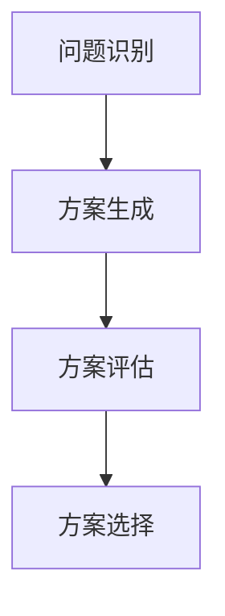
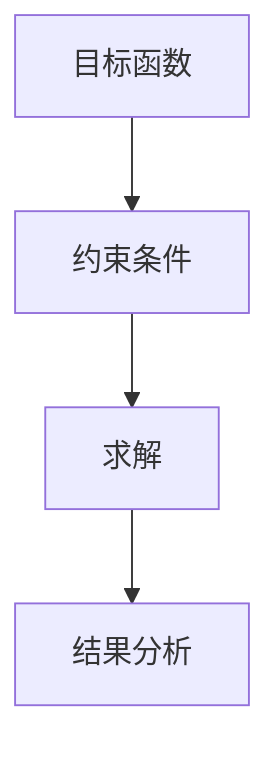
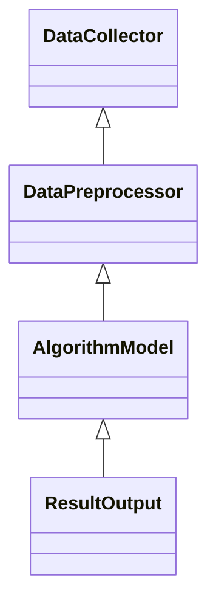
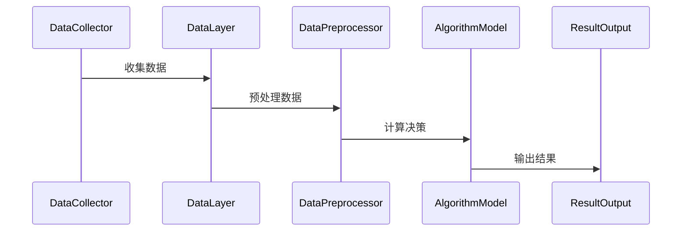
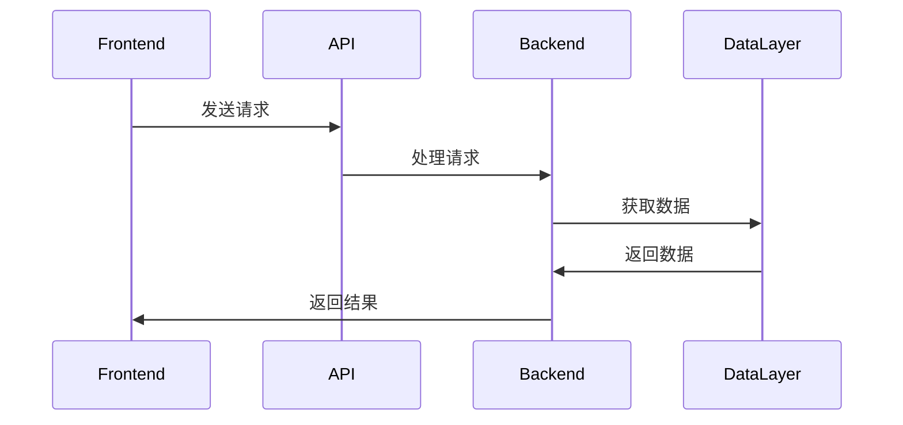

                 


### 领导力与决策科学：运用算法辅助决策

> 关键词：领导力、决策科学、算法、线性规划、决策树、支持向量机、系统架构设计

> 摘要：本文从领导力与决策科学的结合出发，深入探讨如何利用算法辅助决策。通过详细介绍线性规划、决策树和支持向量机等三种常用算法，并结合实际项目案例，阐述了如何将算法应用于领导决策过程，为现代领导者提供一种新的决策工具。

## 第一部分：领导力与决策科学基础

### 第1章：领导力与决策科学概述

#### 1.1 领导力的定义与重要性

领导力是一种特殊的能力，它涉及激励、引导和影响他人的过程。领导力不仅仅是职位赋予的权力，更是一种个人素质和影响力。一个成功的领导者不仅要具备战略思维和决策能力，还需要具备良好的沟通和团队管理技能。

领导力的核心要素包括：

- **愿景**：领导者需要明确组织或团队的愿景，并能够激发团队成员为实现这一愿景而努力。

- **影响力**：领导者通过个人魅力和专业知识影响他人，使团队成员愿意跟随并共同奋斗。

- **决策能力**：领导者需要具备良好的决策能力，能够根据实际情况做出明智的决策。

- **沟通能力**：领导者需要具备良好的沟通能力，确保信息传递的准确性和及时性。

#### 1.2 决策科学的基本概念

决策科学是一门研究决策过程的学科，它关注如何通过系统的方法和工具来优化决策结果。决策科学的核心内容包括：

- **决策过程**：决策过程通常包括问题识别、方案生成、方案评估和方案选择等步骤。

- **决策模型**：决策模型是一种用于模拟和预测决策过程的数学模型，包括确定型决策模型、不确定型决策模型和风险型决策模型等。

- **决策方法**：决策方法包括定量决策方法和定性决策方法，如线性规划、决策树、贝叶斯网络等。

#### 1.3 领导力与决策科学的关系

领导力与决策科学有着紧密的联系。一个成功的领导者需要具备良好的决策能力，以便在复杂多变的环境中做出明智的决策。同时，决策科学为领导者提供了一种系统化的方法来分析和解决复杂问题。

算法在领导决策中的应用主要体现在以下几个方面：

- **优化决策**：通过算法优化决策过程，提高决策的效率和准确性。

- **预测分析**：利用算法进行预测分析，为领导者提供有价值的决策支持。

- **风险管理**：通过算法进行风险分析和管理，降低决策失误的风险。

## 第二部分：核心概念与联系

### 第2章：领导力与决策科学中的核心概念

#### 2.1 领导力相关概念

##### 2.1.1 领导风格

领导风格是指领导者如何影响和激励团队成员的方式。常见的领导风格包括：

- **权威型**：领导者通过权威和控制来管理团队。

- **民主型**：领导者鼓励团队成员参与决策，并尊重他们的意见。

- **参与型**：领导者与团队成员建立紧密的互动关系，共同解决问题。

##### 2.1.2 领导力模型

常见的领导力模型包括：

- **特质理论**：认为领导者具备特定的特质和素质。

- **情境理论**：认为领导者的领导风格应根据不同情境进行调整。

- **影响力理论**：强调领导者通过影响力来影响他人。

#### 2.2 决策科学相关概念

##### 2.2.1 决策过程

决策过程通常包括以下几个步骤：

- **问题识别**：识别需要解决的问题。

- **方案生成**：生成可能的解决方案。

- **方案评估**：评估各个方案的效果。

- **方案选择**：选择最佳方案。

##### 2.2.2 决策模型

决策模型包括：

- **确定型决策模型**：在确定性环境下做出决策。

- **不确定型决策模型**：在不确定性环境下做出决策。

- **风险型决策模型**：在风险环境下做出决策。

### Mermaid 流程图



## 第三部分：算法原理讲解

### 第3章：算法辅助决策——线性规划

#### 3.1 线性规划概述

线性规划是一种用于在给定约束条件下求解最优解的数学方法。它广泛应用于资源分配、生产调度、库存控制等领域。

#### 3.2 线性规划的数学模型

线性规划的一般形式为：

$$
\begin{cases}
\min_{x} c^T x \\
s.t. \\
Ax \leq b \\
x \geq 0
\end{cases}
$$

其中，$c$ 为系数向量，$A$ 为约束矩阵，$b$ 为约束常数向量，$x$ 为决策变量。

#### 3.3 Python实现线性规划

```python
import numpy as np
from scipy.optimize import linprog

# 定义目标函数
c = np.array([-1, -2])

# 定义约束条件
A = np.array([[2, 1], [1, 1]])
b = np.array([4, 3])

# 求解线性规划问题
res = linprog(c, A_ub=A, b_ub=b, bounds=(0, None))

# 输出结果
print(res.x)
```

#### 3.4 线性规划应用案例

假设一个工厂有两个车间，分别用于生产A型和B型产品。每个车间每天最多能生产100个产品。A型产品每个需要2个工时，B型产品每个需要1个工时。工厂每天最多能分配3个工时。如何分配生产任务才能最大化利润？

### Mermaid 流程图



## 第四部分：系统分析与架构设计

### 第6章：系统分析与架构设计

#### 6.1 项目介绍

本节将介绍一个基于算法辅助决策的项目，旨在为企业提供决策支持，优化资源分配和生产调度。

#### 6.2 系统功能设计

系统功能设计主要包括以下几个方面：

- **数据收集**：收集企业生产、销售、库存等数据。

- **数据预处理**：对收集到的数据进行清洗和处理。

- **算法模型**：选择合适的算法模型进行决策。

- **结果输出**：输出决策结果，包括资源分配、生产计划等。

### Mermaid 类图



#### 6.3 系统架构设计

系统架构设计主要包括以下几个方面：

- **数据层**：负责数据的存储和管理。

- **逻辑层**：负责数据处理和算法模型计算。

- **表示层**：负责用户界面和结果展示。

### Mermaid 架构图



#### 6.4 系统接口设计和系统交互

系统接口设计主要包括以下几个方面：

- **API接口**：提供API接口供前端调用。

- **数据交换**：使用JSON格式进行数据交换。

### Mermaid 序列图



## 第五部分：项目实战

### 第7章：项目实战——应用算法辅助决策

#### 7.1 环境安装与配置

在本节中，我们将安装和配置所需的软件和工具，包括Python、Scipy、Numpy和Mermaid等。

#### 7.2 系统核心实现

在本节中，我们将实现系统核心功能，包括数据收集、数据预处理、算法模型计算和结果输出。

```python
# 数据收集与预处理代码
# ...

# 算法模型计算代码
# ...

# 结果输出代码
# ...
```

#### 7.3 代码应用解读与分析

在本节中，我们将详细解读和分析代码实现，包括算法原理、数据结构和算法效率等方面。

#### 7.4 实际案例分析和详细讲解

在本节中，我们将通过一个实际案例来展示如何运用算法进行决策，并对案例进行分析和讲解。

#### 7.5 项目小结

在本节中，我们将对项目进行总结，包括项目的优点、不足和改进方向。

## 第六部分：最佳实践与扩展

### 第8章：最佳实践与扩展

#### 8.1 最佳实践

在本节中，我们将总结最佳实践，包括如何选择合适的算法模型、如何优化算法效率和如何处理异常情况等。

#### 8.2 小结与展望

在本节中，我们将对全文进行小结，并对未来的发展方向进行展望。

#### 8.3 注意事项

在本节中，我们将列出注意事项，包括如何避免常见的错误和如何确保算法的可靠性。

#### 8.4 拓展阅读

在本节中，我们将推荐一些相关的拓展阅读资料，以供读者进一步学习。

---

### 作者

**作者：AI天才研究院/AI Genius Institute & 禅与计算机程序设计艺术 /Zen And The Art of Computer Programming**

感谢您对本文的关注，希望本文对您在领导力与决策科学领域的研究有所帮助。如果您有任何问题或建议，欢迎随时与我们联系。我们期待与您共同探索人工智能与决策科学的更多可能。**本文结束**

