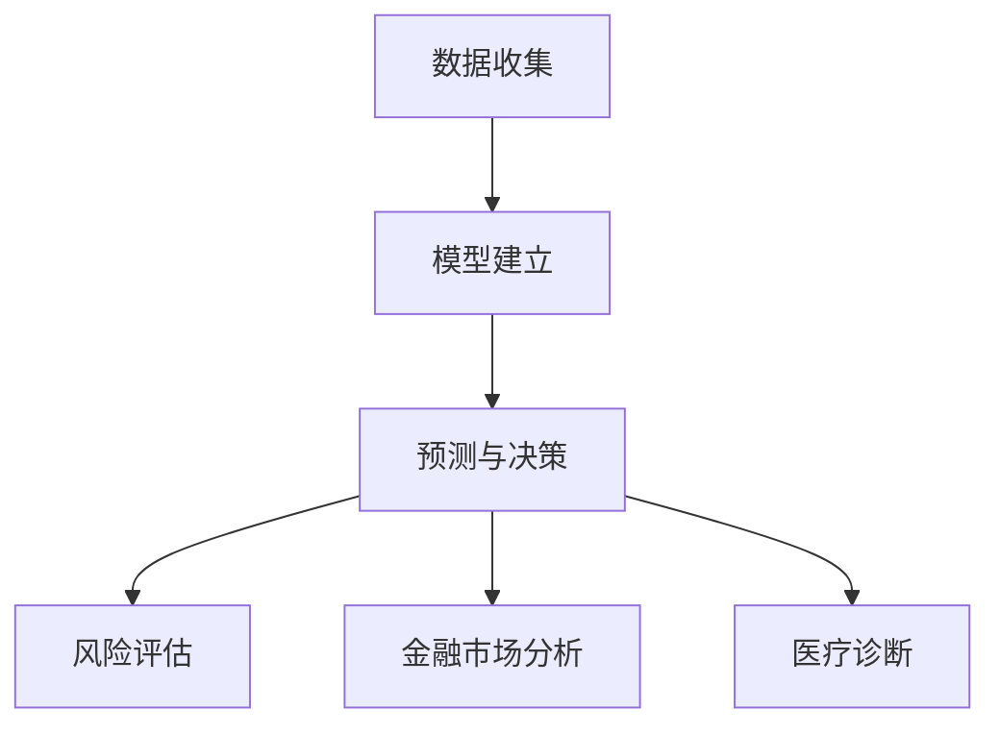
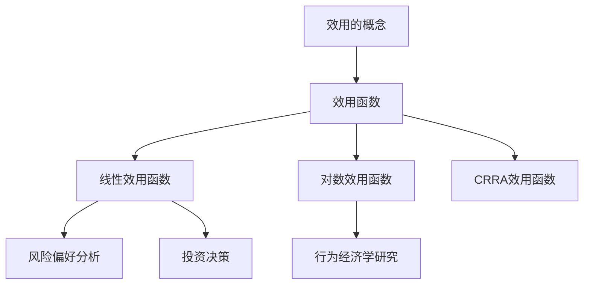
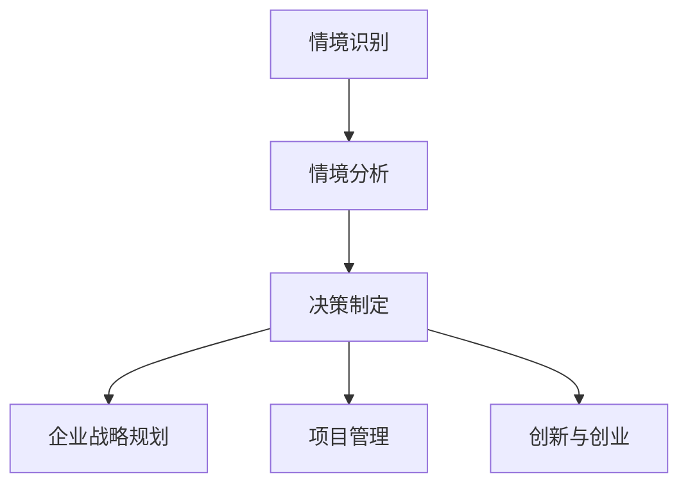

                 

# 领导力与决策：在不确定性中把握方向

> 关键词：领导力、决策、不确定性、人工智能、贝叶斯决策模型、效用理论、情境决策

> 摘要：在高度不确定性的环境中，领导力和决策的重要性尤为突出。本文将探讨领导力和决策的核心概念及其在不确定性环境中的应用，通过详细的分析和实例讲解，帮助读者理解如何在复杂、不确定的情境中做出明智的决策。文章将涵盖贝叶斯决策模型、效用理论以及基于情境的决策方法，并使用Mermaid和Python代码进行详细阐述。

## 第1章：引言

### 1.1 问题背景

在现代社会的快速变化和复杂环境中，领导力和决策能力成为了组织和个人成功的关键因素。领导力不仅仅是管理团队和组织资源的能力，更体现在如何在不确定性中把握方向，引领团队实现目标。决策则是领导力的核心组成部分，它涉及到选择正确的行动方案，以应对不断变化的环境和挑战。

在不确定性环境中，领导力和决策面临的挑战尤为显著。首先，信息的不足和不确定性使得决策变得更加复杂。其次，快速变化的环境要求领导者和决策者具备敏捷的思维和决策能力。此外，组织内部的沟通和协作也变得更加重要，因为只有通过有效的沟通和协作，才能确保决策的有效实施。

本文将首先介绍领导力和决策的基本概念，然后探讨它们在不确定性环境中的重要性，并通过具体的算法和模型，如贝叶斯决策模型、效用理论以及基于情境的决策方法，来展示如何在实际问题中应用这些概念。文章还将通过一个具体的项目实战，详细讲解从环境安装到系统核心实现的各个环节。

### 1.2 领导力的核心概念

领导力是一个多维度的概念，它包括多个方面，如领导风格、领导能力和领导行为。每一个维度都有其特定的作用和表现形式。

**领导风格**是指领导者处理团队和下属的方式。常见的领导风格包括权威式、民主式和放任式。权威式领导强调集中决策和控制，民主式领导注重团队参与和共识达成，放任式领导则给予团队高度自主权。

**领导能力**是指领导者具备的技能和知识，包括沟通能力、团队管理能力、决策能力和变革管理能力。这些能力使领导者能够有效地应对各种挑战和变化。

**领导行为**是指领导者在实际工作中表现出的行为和行动。这些行为可以包括激励团队、提供反馈、解决冲突等。

### 1.3 决策的核心概念

决策是领导力的核心组成部分，它涉及到选择正确的行动方案。决策可以分为以下几类：

**风险决策**是在已知概率的情况下进行的选择，例如赌博和投资决策。

**不确定性决策**是在概率未知的情况下进行的选择，这类决策更具挑战性。

**预测性决策**是基于对未来的预测做出当前的选择，例如市场预测和战略规划。

### 1.4 概念对比与联系

领导力和决策既有联系又有区别。领导力侧重于如何引导和激励团队，而决策则侧重于选择正确的行动方案。领导力为决策提供了方向和基础，而决策则为领导力的实施提供了具体的行动路径。

### 1.5 背景知识

为了更好地理解领导力和决策，我们还需要了解一些相关的理论。这些理论包括：

**权变理论**：认为领导风格应根据具体情境灵活调整。

**交换理论**：认为领导者和下属之间的互动是基于互惠交换的。

**权力理论**：研究领导者和下属之间的权力关系。

### 1.6 ER实体关系图

在了解领导力和决策的基本概念后，我们可以通过ER实体关系图来更直观地理解这些概念之间的关系。

#### 领导力实体关系图

```mermaid
erDiagram
    Leader ||--|{ Style }
    Leader ||--|{ Ability }
    Leader ||--|{ Behavior }
    Style ||--|{ Authoritative }
    Style ||--|{ Democratic }
    Style ||--|{ Autonomous }
    Ability ||--|{ Communication }
    Ability ||--|{ Management }
    Ability ||--|{ Decision }
    Ability ||--|{ Change }
    Behavior ||--|{ Motivate }
    Behavior ||--|{ Feedback }
    Behavior ||--|{ Conflict }
```

#### 决策实体关系图

```mermaid
erDiagram
    Decision ||--|{ Type }
    Decision ||--|{ Model }
    Type ||--|{ Risk }
    Type ||--|{ Uncertainty }
    Type ||--|{ Predictive }
    Model ||--|{ Bayesian }
    Model ||--|{ Utility }
    Model ||--|{ Contextual }
```

### 1.7 本章小结

本章介绍了领导力和决策的基本概念，探讨了它们在不确定性环境中的重要性。通过ER实体关系图，我们更直观地理解了这些概念之间的关系。在接下来的章节中，我们将深入探讨贝叶斯决策模型、效用理论和基于情境的决策方法，并通过具体案例来展示如何在实际问题中应用这些理论。

----------------------------------------------------------------

### 第2章：算法原理讲解

在领导力和决策的实践中，算法的应用至关重要。本章将详细讲解几种关键的算法原理，包括贝叶斯决策模型、效用理论以及基于情境的决策方法。通过这些算法，我们可以更好地理解和应对不确定性环境中的挑战。

#### 2.1 贝叶斯决策模型

贝叶斯决策模型是一种基于概率论的决策方法，它通过计算后验概率来做出最优决策。贝叶斯决策模型的核心原理如下：

1. **贝叶斯定理**：贝叶斯定理是贝叶斯决策模型的基础。它描述了在给定先验概率和条件概率的情况下，如何计算后验概率。

   $$ P(A|B) = \frac{P(B|A)P(A)}{P(B)} $$

   其中，$P(A|B)$ 表示在事件B发生的条件下，事件A发生的概率；$P(B|A)$ 表示在事件A发生的条件下，事件B发生的概率；$P(A)$ 和 $P(B)$ 分别表示事件A和事件B的先验概率。

2. **后验概率**：后验概率是在已知部分证据的情况下，对事件概率的重新评估。通过贝叶斯定理，我们可以根据先验概率和观察到的证据来计算后验概率。

3. **预测与决策**：贝叶斯决策模型通过最大化后验概率来预测未来的事件，并根据预测结果做出最优决策。

   $$ \text{最佳决策} = \arg\max_{A} P(A|D) $$

   其中，$D$ 表示观察到的证据。

#### 2.1.1 贝叶斯决策的流程

贝叶斯决策的流程通常包括以下几个步骤：

1. **数据收集**：收集与决策相关的数据，包括先验概率、条件概率和观察到的证据。

2. **模型建立**：根据收集到的数据，建立贝叶斯模型，包括先验分布和条件分布。

3. **预测与决策**：使用贝叶斯模型进行预测，并基于预测结果做出最优决策。

#### 2.1.2 贝叶斯决策的应用

贝叶斯决策模型在多个领域都有广泛应用，例如：

1. **风险评估**：通过贝叶斯决策模型，可以对各种风险进行评估，并做出最优的风险管理决策。

2. **金融市场分析**：贝叶斯决策模型可以帮助投资者在不确定的市场环境中做出最优的投资决策。

3. **医疗诊断**：在医疗领域，贝叶斯决策模型可以用于疾病诊断，通过分析患者的症状和医学检查结果，预测疾病的发生概率，并做出诊断决策。

#### 2.2 效用理论

效用理论是决策理论的重要组成部分，它通过量化个体对各种结果的偏好来指导决策。效用理论的核心概念如下：

1. **效用的数学定义**：效用是一种量化个体对结果偏好的数值。它可以通过概率论和决策理论来定义。

2. **效用的心理测量**：效用的测量需要考虑个体的主观感受和偏好。心理学研究提供了一些方法来测量效用，如主观概率和决策实验。

3. **效用函数**：效用函数是一种数学模型，用于描述个体对不同结果的偏好。常见的效用函数包括线性效用函数、对数效用函数和常相对风险厌恶（CRRA）效用函数。

   - **线性效用函数**：线性效用函数是最简单的效用函数，它假设个体对结果的偏好是线性的。

     $$ u(x) = ax + b $$

     其中，$x$ 表示结果，$a$ 和 $b$ 是常数。

   - **对数效用函数**：对数效用函数用于描述个体对结果的对数偏好。

     $$ u(x) = \ln(x) $$

   - **常相对风险厌恶（CRRA）效用函数**：CRRA效用函数用于描述个体对结果的风险偏好。

     $$ u(x) = \frac{1}{1+\beta r} $$

     其中，$r$ 表示结果，$\beta$ 是风险厌恶系数。

4. **效用理论的应用**：效用理论在多个领域都有广泛应用，例如：

   - **风险偏好分析**：通过效用理论，可以分析个体对风险的态度和偏好。

   - **投资决策**：效用理论可以帮助投资者在不确定的市场环境中做出最优的投资决策。

   - **行为经济学研究**：效用理论是行为经济学研究的重要工具，用于理解个体在不确定环境中的决策行为。

#### 2.3 基于情境的决策方法

基于情境的决策方法是一种针对特定情境进行决策的方法。它通过分析情境的特点和需求，制定最优的决策方案。基于情境的决策方法的核心概念如下：

1. **情境与决策**：情境是决策的背景和基础，决策需要在特定的情境下进行。

2. **情境评估**：情境评估是决策过程中的第一步，它通过对情境的特点和需求进行分析，确定决策的目标和约束条件。

3. **决策选择**：在情境评估的基础上，通过比较不同的决策方案，选择最优的决策。

   $$ \text{最佳决策} = \arg\max_{A} U(A) $$

   其中，$U(A)$ 表示决策方案A的效用。

4. **决策流程**：基于情境的决策流程通常包括以下几个步骤：

   - **情境识别**：识别当前面临的情境。
   - **情境分析**：分析情境的特点和需求。
   - **决策制定**：根据情境分析结果，制定决策方案。

5. **情境决策的应用**：基于情境的决策方法在多个领域都有广泛应用，例如：

   - **企业战略规划**：通过分析市场环境和竞争态势，制定最优的企业战略规划。
   - **项目管理**：通过分析项目特点和需求，制定最优的项目管理方案。
   - **创新与创业**：通过分析市场环境和竞争态势，制定最优的创新和创业方案。

#### 2.4 算法Mermaid流程图

为了更直观地展示算法的流程，我们可以使用Mermaid绘制算法的流程图。以下是贝叶斯决策模型、效用理论和基于情境的决策方法的Mermaid流程图。

##### 贝叶斯决策模型



##### 效用理论



##### 基于情境的决策方法



#### 2.5 Python代码实现与讲解

为了更好地理解算法的原理和应用，我们可以使用Python代码来实现这些算法，并对关键代码进行详细讲解。以下是贝叶斯决策模型、效用理论和基于情境的决策方法的Python代码示例。

##### 贝叶斯决策模型

```python
import numpy as np

# 贝叶斯定理
def bayes_theorem(prior, likelihood, evidence):
    return (likelihood * prior) / evidence

# 计算后验概率
def posterior_probability(prior, likelihood):
    evidence = np.sum(likelihood * prior)
    return bayes_theorem(prior, likelihood, evidence)

# 示例：疾病诊断
prior = [0.5, 0.5]  # 先验概率
likelihood = [0.8, 0.2]  # 条件概率
posterior = posterior_probability(prior, likelihood)
print("后验概率：", posterior)
```

##### 效用理论

```python
import numpy as np

# 线性效用函数
def linear_utility(x, a, b):
    return a * x + b

# 对数效用函数
def logarithmic_utility(x):
    return np.log(x)

# CRRA效用函数
def crra_utility(x, beta):
    return 1 / (1 + beta * np.log(x))

# 示例：投资决策
x = 1000  # 结果
a = 0.1  # 线性系数
b = 10  # 常数
beta = 0.5  # 风险厌恶系数

# 线性效用函数
linear_u = linear_utility(x, a, b)
print("线性效用：", linear_u)

# 对数效用函数
log_u = logarithmic_utility(x)
print("对数效用：", log_u)

# CRRA效用函数
crra_u = crra_utility(x, beta)
print("CRRA效用：", crra_u)
```

##### 基于情境的决策方法

```python
# 情境识别
def identify_context():
    context = input("请输入当前情境：")
    return context

# 情境分析
def analyze_context(context):
    # 根据情境进行具体分析
    print("分析结果：", context)

# 决策制定
def make_decision(context):
    # 根据情境分析结果制定决策
    print("决策：", context)

# 示例：企业战略规划
context = identify_context()
analyze_context(context)
make_decision(context)
```

#### 2.6 算法原理详细讲解

在本章中，我们详细介绍了贝叶斯决策模型、效用理论和基于情境的决策方法。贝叶斯决策模型通过计算后验概率来做出最优决策，效用理论通过量化个体对结果的偏好来指导决策，基于情境的决策方法通过分析情境的特点和需求来制定最优决策。

贝叶斯决策模型的核心是贝叶斯定理，它描述了在给定先验概率和条件概率的情况下，如何计算后验概率。后验概率是决策的关键，它帮助我们预测未来的事件并做出最优决策。贝叶斯决策模型在风险评估、金融市场分析和医疗诊断等领域有广泛应用。

效用理论通过量化个体对结果的偏好来指导决策。效用函数是效用理论的核心，它描述了个体对不同结果的偏好。常见的效用函数包括线性效用函数、对数效用函数和常相对风险厌恶（CRRA）效用函数。效用理论在风险偏好分析、投资决策和行为经济学研究等领域有广泛应用。

基于情境的决策方法是一种针对特定情境进行决策的方法。它通过分析情境的特点和需求，制定最优的决策方案。基于情境的决策方法在

