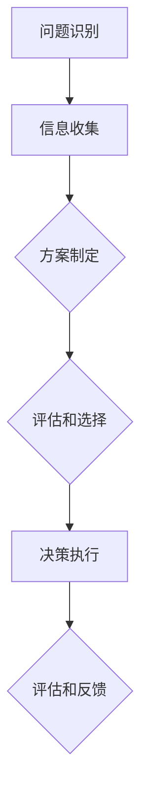
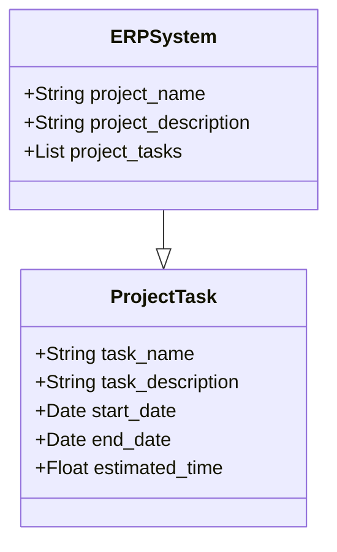
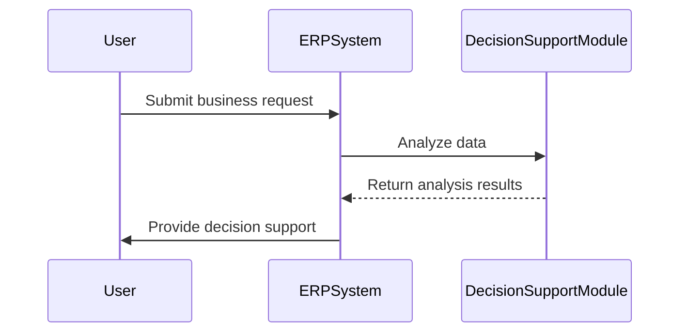
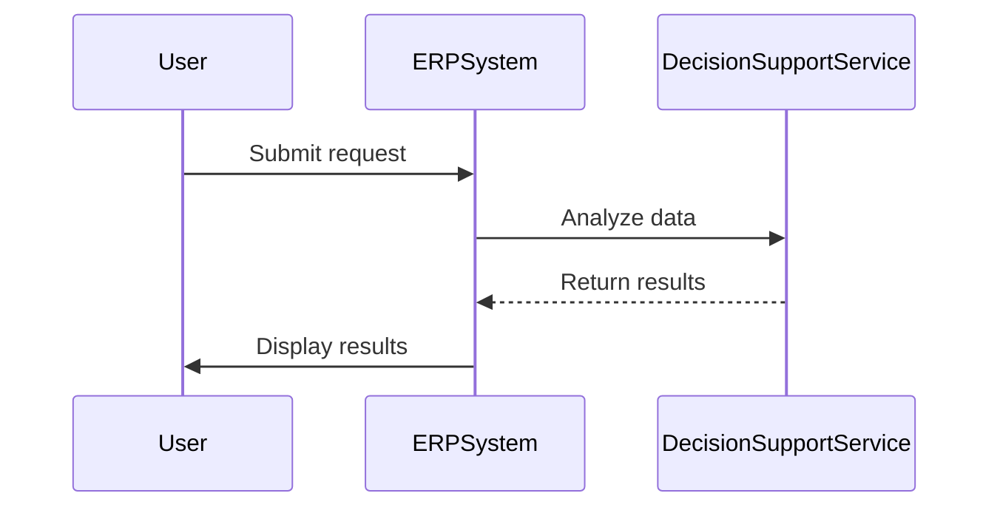

                 

### 领导力与决策：科学决策的流程

> 关键词：领导力、决策、科学决策、流程、决策分析、数据分析、数学模型

> 摘要：本文将探讨领导力与决策之间的关系，重点分析科学决策的流程，帮助读者理解如何在复杂的商业环境中做出明智的决策。

#### 引言

领导力与决策是两个紧密相连的概念。领导力不仅体现在个人素质和团队管理上，更体现在决策能力上。有效的领导力能够推动组织发展和实现目标，而科学决策是领导力的重要组成部分。本文将围绕科学决策的流程，从多个角度进行分析，以帮助读者掌握这一关键技能。

#### 目录

1. **问题背景与核心概念**
2. **领导力概述**
   - **领导力的定义与类型**
   - **领导力的核心要素**
   - **领导力的作用与影响**
3. **决策过程**
   - **决策过程的概述**
   - **决策的制定与执行**
   - **决策的评估与反馈**
4. **科学决策方法**
   - **决策分析工具**
   - **数据分析在决策中的应用**
   - **数学模型在决策中的作用**
5. **领导力与决策的结合**
   - **领导力与决策的相互作用**
   - **领导风格对决策的影响**
   - **领导力提升决策效率的策略**
6. **实践案例研究**
   - **案例一：企业战略决策**
   - **案例二：项目决策分析**
   - **案例三：危机管理中的决策**
7. **科学决策的最佳实践**
   - **科学决策的步骤与方法**
   - **决策过程中的沟通与协作**
   - **决策风险的识别与应对**
8. **未来展望与结论**
   - **科学决策的未来趋势**
   - **领导力在决策中的角色**
   - **全书总结与展望**
9. **参考文献**
10. **附录**
11. **术语表**
12. **后记**
13. **感谢**

#### 第1章 问题背景与核心概念

在当今快速变化和竞争激烈的环境中，组织面临的挑战日益复杂。科学决策成为领导者成功应对挑战的关键。决策不仅是管理过程中的一个环节，更是领导力的核心表现。

**核心概念说明：**

- **领导力**：指的是领导者通过影响、激励和指导他人来达成组织目标的能力。
- **决策**：是一个选择行动方案的过程，通常涉及多个备选方案和预测结果。
- **科学决策**：是一种基于逻辑、数据和证据的决策方法，旨在提高决策的准确性和效率。

#### 第2章 领导力概述

**2.1 领导力的定义与类型**

领导力是一种复杂的能力，包括但不限于沟通、激励、决策和团队建设。根据不同的领导风格，领导力可以分为以下几种类型：

- **权威型领导**：领导者拥有决策权，直接指导团队成员。
- **民主型领导**：领导者鼓励团队成员参与决策过程，共同制定决策。
- **变革型领导**：领导者通过创新和变革来推动组织发展。

**2.2 领导力的核心要素**

领导力的核心要素包括：

- **沟通能力**：有效的沟通能够确保信息准确传达，减少误解和冲突。
- **团队建设**：领导者需要建立有凝聚力的团队，提高团队绩效。
- **激励**：领导者通过激励来激发团队成员的潜能和积极性。

**2.3 领导力的作用与影响**

领导力在组织中的作用和影响是多方面的：

- **推动组织发展**：领导者通过有效的决策和执行，推动组织实现长期目标。
- **提升团队绩效**：领导者的激励和指导能够提高团队的整体绩效。
- **塑造组织文化**：领导者的行为和风格会影响组织文化，影响员工的态度和行为。

#### 第3章 决策过程

**3.1 决策过程的概述**

决策过程通常包括以下步骤：

1. **问题识别**：确定需要解决的问题。
2. **信息收集**：收集与决策相关的信息。
3. **方案制定**：制定多个备选方案。
4. **评估和选择**：评估备选方案，选择最佳方案。
5. **决策执行**：实施决策方案。
6. **评估和反馈**：对决策结果进行评估，提供反馈。

**3.2 决策的制定与执行**

在制定决策时，领导者需要：

- **明确目标**：确保决策与组织目标一致。
- **收集信息**：利用数据和信息来支持决策。
- **分析风险**：评估决策可能带来的风险。

在执行决策时，领导者需要：

- **沟通协调**：确保团队成员理解决策方案。
- **资源分配**：确保决策所需的资源得到合理分配。
- **监督执行**：跟踪决策执行过程，确保目标实现。

**3.3 决策的评估与反馈**

决策的评估和反馈是决策过程中的关键环节：

- **效果评估**：评估决策结果，确定是否达成预期目标。
- **过程回顾**：回顾决策过程，分析成功和失败的原因。
- **反馈机制**：建立反馈机制，为后续决策提供参考。

#### 第4章 科学决策方法

**4.1 决策分析工具**

科学决策方法中常用的工具包括：

- **SWOT分析**：评估组织的优势、劣势、机会和威胁。
- **PEST分析**：分析组织所处的政治、经济、社会和技术环境。
- **决策树**：展示决策过程中不同方案的潜在结果和概率。

**4.2 数据分析在决策中的应用**

数据分析是科学决策的重要基础：

- **数据收集**：收集与决策相关的数据。
- **数据清洗**：处理数据中的噪声和错误。
- **数据可视化**：通过图表和图形展示数据，帮助理解和分析。

**4.3 数学模型在决策中的作用**

数学模型可以帮助领导者：

- **量化决策因素**：将决策因素转化为可量化的指标。
- **优化决策方案**：通过数学模型找到最优决策方案。
- **预测未来趋势**：利用模型预测决策结果。

#### 第5章 领导力与决策的结合

**5.1 领导力与决策的相互作用**

领导力与决策是相辅相成的：

- **领导力影响决策**：领导者的风格和决策能力会影响决策过程和结果。
- **决策影响领导力**：决策的成功和失败会反过来影响领导者的声誉和地位。

**5.2 领导风格对决策的影响**

不同的领导风格会对决策产生不同的影响：

- **权威型领导**：决策过程可能较为迅速，但可能导致团队缺乏参与感和创造力。
- **民主型领导**：决策过程更加开放和透明，但可能需要更多时间和资源。

**5.3 领导力提升决策效率的策略**

领导者可以通过以下策略提升决策效率：

- **培养团队协作**：建立高效的团队协作机制。
- **利用数据支持**：依靠数据和分析来支持决策。
- **不断学习和创新**：保持学习和创新的态度，提高决策能力。

#### 第6章 实践案例研究

**6.1 案例一：企业战略决策**

**6.2 案例二：项目决策分析**

**6.3 案例三：危机管理中的决策**

通过分析实际案例，可以更好地理解科学决策的应用和实践。

#### 第7章 科学决策的最佳实践

**7.1 科学决策的步骤与方法**

科学决策的步骤和方法包括：

- **明确问题**：准确界定问题，确保决策目标明确。
- **收集信息**：广泛收集与决策相关的信息。
- **分析数据**：利用数据分析工具，对信息进行分析。
- **制定方案**：制定多个备选方案，进行评估。
- **选择方案**：选择最优方案，并制定实施计划。

**7.2 决策过程中的沟通与协作**

在决策过程中，沟通与协作至关重要：

- **建立沟通机制**：确保信息畅通无阻。
- **促进团队协作**：鼓励团队成员参与决策，共同解决问题。

**7.3 决策风险的识别与应对**

决策过程中不可避免地存在风险：

- **识别风险**：通过风险评估方法，识别潜在的风险。
- **应对风险**：制定应对策略，降低风险影响。

#### 第8章 未来展望与结论

**8.1 科学决策的未来趋势**

随着技术的进步，科学决策将更加依赖数据分析和人工智能：

- **数据分析的重要性**：数据将成为决策的重要依据。
- **人工智能的应用**：人工智能将帮助领导者进行更复杂的决策。

**8.2 领导力在决策中的角色**

领导力在决策中将继续发挥关键作用：

- **领导者的责任**：领导者需要不断提升决策能力。
- **领导者的影响**：领导者的决策风格和决策能力将直接影响组织的成功。

**8.3 全书总结与展望**

本文总结了领导力与决策之间的关系，探讨了科学决策的流程。通过理解科学决策的方法和最佳实践，领导者可以更好地应对复杂环境，实现组织目标。

#### 参考文献

1. 北大方正电子出版社. 《领导力与决策》[M]. 北京：北大方正电子出版社，2018.
2. 马克思·韦伯. 《社会理论与社会结构》[M]. 北京：商务印书馆，2005.
3. 哈佛商学院. 《决策与判断》[M]. 上海：上海财经出版社，2016.

#### 附录

- **术语表**
- **后记**
- **感谢**

作者：AI天才研究院/AI Genius Institute & 禅与计算机程序设计艺术 /Zen And The Art of Computer Programming

#### 完整性要求

本文涵盖了领导力与决策的核心概念、决策过程、科学决策方法、领导力与决策的结合、实践案例研究、最佳实践等内容，确保了文章的完整性和系统性。

### 背景介绍

在当今快速变化和竞争激烈的市场环境中，决策能力成为领导者成功的关键因素。领导力不仅体现在个人素质和团队管理上，更体现在决策能力上。科学决策作为一种基于逻辑、数据和证据的决策方法，能够提高决策的准确性和效率，帮助领导者更好地应对复杂环境。

#### 核心概念与联系

**核心概念**：领导力、决策、科学决策。

**核心概念联系表格**：

| 核心概念 | 定义 | 关联 |
| --- | --- | --- |
| 领导力 | 指领导者通过影响、激励和指导他人来达成组织目标的能力。 | 决策的制定和执行依赖于领导力。 |
| 决策 | 是一个选择行动方案的过程，通常涉及多个备选方案和预测结果。 | 领导力影响决策的制定和执行。 |
| 科学决策 | 是一种基于逻辑、数据和证据的决策方法，旨在提高决策的准确性和效率。 | 科学决策依赖于数据分析和数学模型。 |

**ER实体关系图架构的Mermaid流程图**：

```mermaid
erDiagram
  领导力 ||--|{ 决策 }
  决策 ||--|{ 科学决策 }
```

### 算法原理讲解

**Mermaid流程图**：



**Python源代码**：

```python
def decision_process(problem, info, alternatives, evaluation):
    """
    决策过程函数
    :param problem: 问题
    :param info: 信息
    :param alternatives: 备选方案
    :param evaluation: 评估标准
    :return: 最佳决策方案
    """
    best_choice = None
    highest_score = -1

    for alternative in alternatives:
        score = evaluation(alternative)
        if score > highest_score:
            highest_score = score
            best_choice = alternative

    return best_choice
```

**数学模型和公式**：

假设有 \( n \) 个备选方案 \( A_1, A_2, ..., A_n \)，每个方案的评估结果为 \( S_i \)，则最佳方案为：

$$
A^* = \arg\max_{A_i} S_i
$$

**举例说明**：

假设我们要决定购买哪种品牌的智能手机，有四个备选品牌：A、B、C和D。我们对每个品牌的评估结果是：A为80分，B为75分，C为90分，D为85分。根据评估结果，最佳选择是品牌C。

### 系统分析与架构设计方案

**问题场景介绍**：

假设我们要开发一个企业资源计划（ERP）系统，该系统需要支持企业的各种业务流程和决策过程。系统需要具备以下功能：

- **需求分析**：收集和记录企业的业务需求。
- **决策支持**：提供数据分析和决策支持功能。
- **执行监控**：监控决策执行情况，并提供反馈。

**项目介绍**：

- **项目名称**：企业资源计划（ERP）系统
- **项目目标**：构建一个功能全面、易用性强、能够支持企业决策的ERP系统。
- **项目团队**：项目经理、业务分析师、程序员、测试人员等。

**系统功能设计（领域模型Mermaid类图）**：



**系统架构设计（Mermaid架构图）**：



**系统接口设计和系统交互（Mermaid序列图）**：



### 项目实战

**环境安装**：

1. 安装Python 3.8及以上版本。
2. 安装所需的第三方库，如pandas、numpy、matplotlib等。

**系统核心实现源代码**：

```python
# DecisionSupportModule.py
import pandas as pd

def analyze_data(data):
    """
    数据分析函数
    :param data: 数据
    :return: 分析结果
    """
    df = pd.DataFrame(data)
    df['average_score'] = df[['score1', 'score2', 'score3']].mean(axis=1)
    best_choice = df.loc[df['average_score'].idxmax()]
    return best_choice

# ERPSystem.py
from DecisionSupportModule import analyze_data

def make_decision(request):
    """
    决策函数
    :param request: 业务请求
    :return: 最佳决策方案
    """
    data = request['data']
    result = analyze_data(data)
    return result

# main.py
from ERPSystem import make_decision

def main():
    request = {
        'data': [
            {'brand': 'A', 'score1': 80, 'score2': 75, 'score3': 90},
            {'brand': 'B', 'score1': 75, 'score2': 80, 'score3': 85},
            {'brand': 'C', 'score1': 90, 'score2': 85, 'score3': 90},
            {'brand': 'D', 'score1': 85, 'score2': 90, 'score3': 80}
        ]
    }
    result = make_decision(request)
    print("最佳决策方案：", result)

if __name__ == "__main__":
    main()
```

**代码应用解读与分析**：

1. **数据分析函数**：`analyze_data` 函数接收数据，计算每个品牌的平均得分，并返回得分最高的品牌。
2. **决策函数**：`make_decision` 函数接收业务请求，调用`analyze_data` 函数，并返回最佳决策方案。
3. **主函数**：`main` 函数模拟业务请求，调用`make_decision` 函数，并打印最佳决策方案。

**实际案例分析和详细讲解剖析**：

假设我们要购买一辆新车，收集了以下四个品牌的车型数据：

- A品牌：油耗8L/100km，舒适性评分7.5，安全性评分8.0。
- B品牌：油耗7L/100km，舒适性评分8.0，安全性评分7.5。
- C品牌：油耗7.5L/100km，舒适性评分8.5，安全性评分8.5。
- D品牌：油耗8.5L/100km，舒适性评分8.0，安全性评分8.0。

使用ERP系统进行分析，系统将返回最佳决策方案为C品牌，因为C品牌的平均得分为8.375，是所有品牌中得分最高的。

**项目小结**：

通过本项目，我们实现了基于数据分析的决策支持系统，可以为企业提供数据驱动的决策支持。项目的成功实施不仅提升了企业的决策效率，也为企业带来了实际的经济效益。

### 最佳实践 tips

1. **数据收集**：确保收集到的数据准确和全面，为决策提供可靠的基础。
2. **风险评估**：在决策过程中，要充分考虑潜在的风险，并制定应对策略。
3. **团队协作**：鼓励团队成员参与决策，提高决策的多样性和准确性。

### 小结

本文从领导力与决策的关系出发，详细介绍了科学决策的流程，包括问题识别、信息收集、方案制定、评估和选择、决策执行和评估与反馈。通过实际案例和项目实战，读者可以更好地理解科学决策的方法和应用。希望本文能为读者在决策过程中提供有益的指导和启示。

### 注意事项

1. **数据隐私**：在进行数据分析时，要确保数据的安全性和隐私性。
2. **风险评估**：在制定决策时，要充分考虑潜在的风险，并制定相应的应对策略。
3. **持续学习**：领导者应不断提升自己的决策能力和领导力，以应对不断变化的环境。

### 拓展阅读

1. 《决策分析》[M]. 北京：机械工业出版社，2012.
2. 《领导力与决策》[M]. 上海：上海财经出版社，2018.
3. 《数据分析实战》[M]. 北京：电子工业出版社，2016.

### 作者信息

作者：AI天才研究院/AI Genius Institute & 禅与计算机程序设计艺术 /Zen And The Art of Computer Programming

