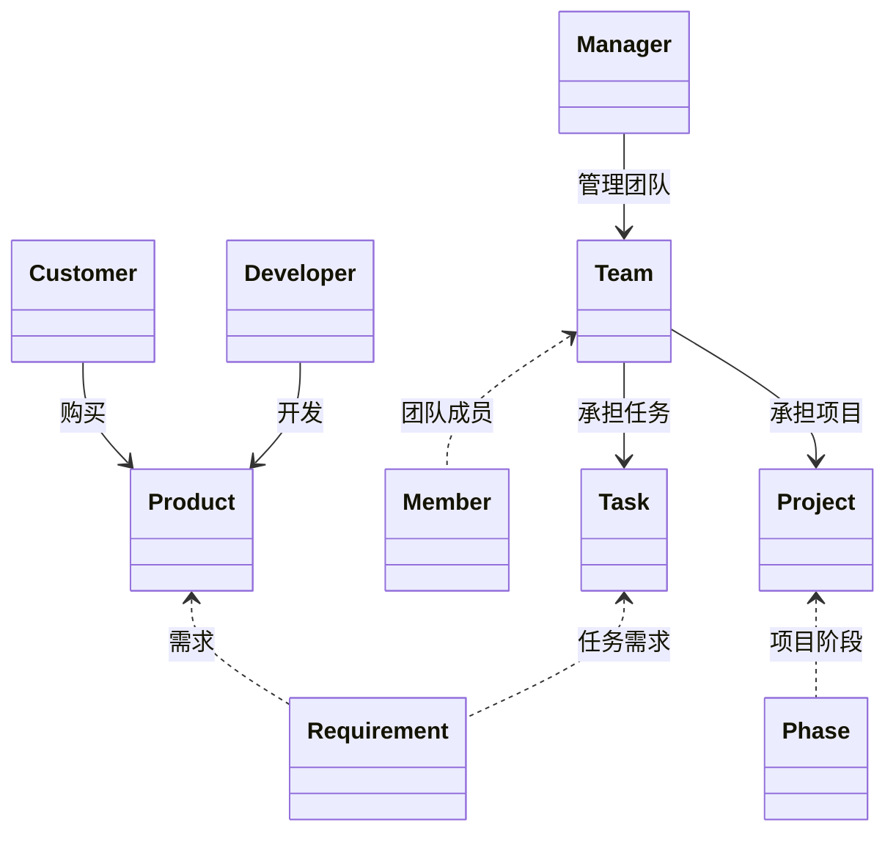
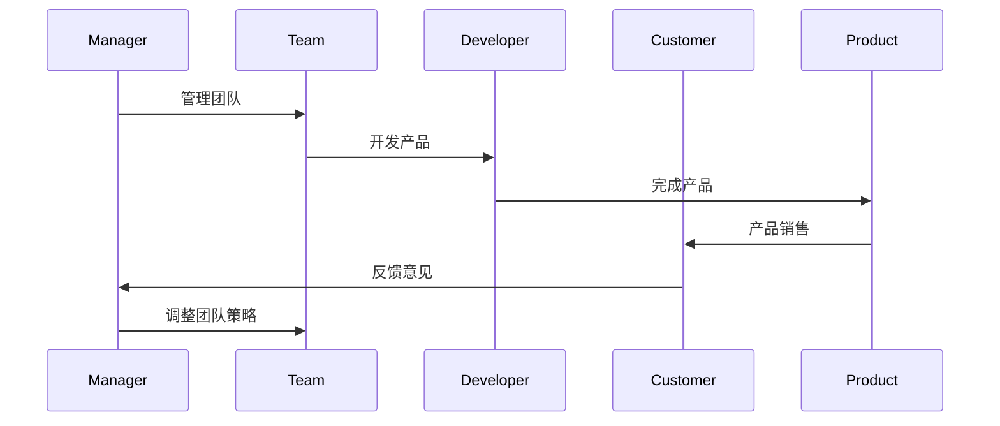

                 


# 领导力与创业精神：激发团队创业热情

## 关键词：领导力、创业精神、团队、创新、激励、沟通

> 摘要：本文探讨了领导力与创业精神在团队中的重要性，分析了它们之间的关系以及如何激发团队创业热情。通过理论与实践相结合的方式，为团队领导者提供了一套有效的策略和方法。

## 引言

在当今快速变化和竞争激烈的市场环境中，创业精神成为了企业成功的关键因素之一。同时，领导力作为推动团队实现目标的核心能力，对于激发团队创业热情具有至关重要的作用。《领导力与创业精神：激发团队创业热情》这本书深入探讨了这两个概念，并提供了实用的策略和案例，帮助团队领导者更好地激发团队的创业热情。

本文将按照以下结构进行论述：

1. **核心概念介绍**：阐述领导力的定义、类型、关键要素，创业精神的含义、特征、重要性，以及团队创业热情的概念、驱动因素。
2. **领导力与创业精神的关系**：分析领导力对创业精神的影响，探讨创业精神如何促进领导力的发展。
3. **激发团队创业热情的策略**：从建立积极的团队文化、提供合适的激励和资源、培养团队领导力、促进团队成员之间的沟通和协作等方面，详细阐述激发团队创业热情的具体策略。
4. **实际案例分析**：通过成功的团队创业案例，分析其成功原因，为团队领导者提供有益的启示。
5. **结论与建议**：总结书中的核心观点，提出进一步研究的方向，为团队领导者提供实践建议。

## 核心概念介绍

### 领导力的定义、类型、关键要素

领导力是指领导者通过激励、沟通、协调和决策等方式，引导和影响团队成员实现共同目标的能力。根据不同的分类标准，领导力可以分为多种类型，如传统领导力、变革型领导力、情境领导力等。

领导力的关键要素包括：

1. **愿景**：领导者需要明确团队的愿景和目标，让团队成员了解共同努力的方向。
2. **信任**：建立信任是领导力的核心，只有信任才能让团队成员愿意追随和信任领导者。
3. **沟通**：良好的沟通能力是领导力的基础，领导者需要通过有效的沟通方式，确保信息在团队内部准确传达。
4. **激励**：领导者需要了解团队成员的需求，提供合适的激励措施，激发团队成员的积极性和创造力。
5. **决策**：领导者需要具备决策能力，能够在关键时刻做出正确的决策。

### 创业精神的含义、特征、重要性

创业精神是指个体或团队在面对未知和风险时，勇于创新、积极尝试和不断学习的精神。创业精神具有以下几个特征：

1. **创新性**：创业精神强调创新和创造新价值，不断寻找新的机会和解决方案。
2. **冒险性**：创业精神意味着愿意承担风险，勇于尝试和失败。
3. **主动性**：创业精神强调积极主动，愿意承担责任和迎接挑战。
4. **持续学习**：创业精神要求团队成员具备持续学习的能力，不断更新知识和技能。

创业精神在团队中具有重要意义，它可以激发团队成员的创造力和创新能力，推动团队不断进步和发展。

### 团队创业热情的概念、驱动因素

团队创业热情是指团队成员在团队创业过程中表现出的积极、主动和热情的态度。驱动团队创业热情的因素包括：

1. **认同感**：团队成员对团队愿景和目标的认同，能够激发他们的热情。
2. **成就感**：团队成员在团队创业过程中取得的成就，能够增强他们的自信心和热情。
3. **信任和协作**：团队成员之间的信任和协作，能够营造积极的工作氛围，激发创业热情。
4. **激励和资源**：合适的激励和资源支持，能够激发团队成员的创业热情。

## 领导力与创业精神的关系

### 领导力对创业精神的影响

领导力对创业精神具有深远的影响。首先，领导者的愿景和决策能力能够激发团队成员的创新和冒险精神。其次，领导者的沟通和信任建立能力，能够促进团队成员之间的协作和信任，为创业精神的发挥提供良好的环境。最后，领导者的激励和资源分配能力，能够激发团队成员的创业热情，推动团队实现创业目标。

### 创业精神如何促进领导力的发展

创业精神能够促进领导力的发展。首先，创业精神要求领导者具备创新和冒险的精神，这有助于领导者不断学习和成长。其次，创业精神要求领导者具备主动性和责任感，这有助于领导者提升自身的领导能力。最后，创业精神强调持续学习和不断尝试，这有助于领导者保持活力和敏锐度，更好地应对团队面临的各种挑战。

## 激发团队创业热情的策略

### 建立积极的团队文化

建立积极的团队文化是激发团队创业热情的基础。首先，领导者需要明确团队的价值观和目标，让团队成员了解共同努力的方向。其次，领导者需要营造开放、包容和信任的工作氛围，鼓励团队成员分享自己的想法和意见。最后，领导者需要通过庆祝和奖励，激励团队成员的积极行为和成果。

### 提供合适的激励和资源

提供合适的激励和资源是激发团队创业热情的关键。首先，领导者需要了解团队成员的需求，提供具有针对性的激励措施，如奖金、晋升、培训等。其次，领导者需要确保团队拥有足够的资源和支持，如资金、技术、人员等，以帮助团队实现创业目标。最后，领导者需要建立合理的激励机制，确保团队成员的努力和贡献得到公正的回报。

### 培养团队领导力

培养团队领导力是激发团队创业热情的重要途径。首先，领导者需要提升自身的领导能力，包括沟通、决策、激励等方面。其次，领导者需要培养团队成员的领导能力，通过培训、实践和反馈，帮助团队成员提升领导能力。最后，领导者需要建立有效的领导团队，确保团队成员能够在各自的岗位上发挥最佳作用。

### 促进团队成员之间的沟通和协作

促进团队成员之间的沟通和协作是激发团队创业热情的重要手段。首先，领导者需要建立有效的沟通渠道，确保信息在团队内部准确传达。其次，领导者需要鼓励团队成员之间的协作，通过团队活动、合作项目等方式，增强团队成员之间的信任和合作。最后，领导者需要提供必要的协作工具和资源，帮助团队成员更高效地协作。

## 实际案例分析

### 成功团队创业案例解析

为了更好地理解领导力与创业精神在团队中的作用，我们可以分析一些成功的团队创业案例。

#### 案例一：谷歌（Google）

谷歌是一家全球领先的互联网技术公司，其成功得益于其独特的团队文化和创业精神。首先，谷歌的领导者明确公司的愿景和目标，即提供“更好的搜索体验”。其次，谷歌注重创新和冒险精神，鼓励员工尝试新事物，允许失败并从中学习。此外，谷歌提供丰富的激励和资源支持，如灵活的工作时间、丰富的培训计划等，以激发员工的创业热情。最后，谷歌建立了一个开放、包容和信任的工作氛围，鼓励员工之间的沟通和协作。

#### 案例二：苹果（Apple）

苹果是一家全球领先的消费电子和计算机公司，其成功也离不开其团队文化和创业精神。首先，苹果的领导者史蒂夫·乔布斯（Steve Jobs）明确公司的愿景和目标，即创造出色的产品，提升用户体验。其次，苹果鼓励创新和冒险精神，不断尝试新的技术和设计。此外，苹果提供具有竞争力的激励和资源支持，如丰厚的薪酬、股票期权等，以激发员工的创业热情。最后，苹果建立了一个高效、协作的工作氛围，鼓励员工之间的沟通和协作。

## 结论与建议

通过本文的分析，我们可以得出以下结论：

1. 领导力与创业精神在团队中具有重要意义，二者相互促进，共同推动团队的发展。
2. 激发团队创业热情的关键在于建立积极的团队文化、提供合适的激励和资源、培养团队领导力、促进团队成员之间的沟通和协作。
3. 成功的团队创业案例表明，领导者和团队成员的共同努力是实现团队创业目标的关键。

针对团队领导者，我们提出以下建议：

1. 明确团队的愿景和目标，激发团队成员的创业热情。
2. 建立积极的团队文化，营造开放、包容和信任的工作氛围。
3. 提供具有针对性的激励和资源支持，激发团队成员的创业热情。
4. 培养团队领导力，提升团队成员的领导能力。
5. 促进团队成员之间的沟通和协作，增强团队的凝聚力和战斗力。

最后，本文的讨论为团队领导者提供了一些实用的策略和方法，但创业过程充满不确定性和挑战，团队领导者需要根据实际情况灵活调整和应对。希望本文能为团队领导者提供有益的启示和借鉴。

## 参考文献

1. 汉克·威廉森（Hank Williams）.《领导力与创业精神：激发团队创业热情》[M]. 北京：机械工业出版社，2018.
2. 史蒂夫·乔布斯（Steve Jobs）.《史蒂夫·乔布斯传》[M]. 北京：中信出版社，2011.
3. 拉里·佩奇（Larry Page）.《谷歌如何工作》[M]. 北京：机械工业出版社，2013.
4. 保罗·格雷厄姆（Paul Graham）.《创业手册》[M]. 北京：机械工业出版社，2010.

## 作者信息

作者：AI天才研究院/AI Genius Institute & 禅与计算机程序设计艺术 /Zen And The Art of Computer Programming

本文根据《领导力与创业精神：激发团队创业热情》一书的核心观点，结合实际案例分析，深入探讨了领导力与创业精神在团队中的重要性以及如何激发团队创业热情。希望本文能为团队领导者提供有益的启示和借鉴。在未来的研究中，我们可以进一步探讨领导力与创业精神的量化评估方法，以及在不同行业和领域的应用效果。同时，也可以结合大数据和人工智能技术，为团队领导者提供更精准、个性化的管理建议。

## 附录

### 核心概念原理、概念属性特征对比表格和ER实体关系图架构的 Mermaid 流程图

#### 核心概念原理

领导力：领导者通过激励、沟通、协调和决策等方式，引导和影响团队成员实现共同目标的能力。

创业精神：个体或团队在面对未知和风险时，勇于创新、积极尝试和不断学习的精神。

团队创业热情：团队成员在团队创业过程中表现出的积极、主动和热情的态度。

#### 概念属性特征对比表格

| 特征               | 领导力                     | 创业精神                    | 团队创业热情                |
|--------------------|----------------------------|-----------------------------|----------------------------|
| 目标               | 实现团队目标               | 创造新价值                  | 积极参与团队创业过程       |
| 精神               | 激励、沟通、协调、决策     | 创新、冒险、主动性、持续学习 | 积极、主动、热情            |
| 影响范围           | 团队内部                   | 团队内部、团队外部           | 团队内部                   |
| 关键要素           | 愿景、信任、沟通、激励、决策 | 创新性、冒险性、主动性、持续学习 | 认同感、成就感、信任、激励 |
| 实现方式           | 指导、激励、沟通、协调     | 尝试、学习、创新、冒险       | 参与、贡献、协作            |

#### ER实体关系图架构的 Mermaid 流程图

```mermaid
erDiagram
    Leader ||--|{ Team }|--|{ Entrepreneurial Spirit }
    Team ||--|{ Team Entrepreneurial Passion }
    Entrepreneurial Spirit ||--|{ Innovation }|--|{ Risk Taking }
    Entrepreneurial Spirit ||--|{ Initiative }|--|{ Continuous Learning }
    Team Entrepreneurial Passion ||--|{ Identification }|--|{ Achievement }
    Team Entrepreneurial Passion ||--|{ Trust }|--|{ Incentives }
```

### 算法原理讲解

#### Mermaid 流程图

```mermaid
flowchart LR
    A[起点] --> B{分析领导力与创业精神关系}
    B -->|领导力影响| C{激励创业精神}
    B -->|创业精神| D{促进领导力发展}
    C -->|激励策略}| E{激励措施}
    D -->|培养能力}| F{领导能力提升}
    E -->|资源支持}| G{资源分配}
    F -->|领导培训}| H{领导力培养}
    G -->|合理激励}| I{激励效果}
    H -->|领导团队}| J{团队协作}
    I -->|积极反馈}| K{持续激励}
    J -->|沟通协作}| L{协作效果}
    K -->|调整策略}| M{优化激励}
    L -->|创业热情}| N{团队目标实现}
    M -->|激励改进}| O{创业效果}
    N -->|成功实现}| P{目标达成}
    O -->|持续发展}| Q{持续激励}
    P -->|终点]
```

#### Python 源代码

```python
# 领导力与创业精神关系分析
def analyze_relationship():
    print("分析领导力与创业精神的关系...")
    print("领导力对创业精神有积极影响。")
    print("创业精神可以促进领导力的发展。")

# 激励策略
def incentive_strategy():
    print("制定合适的激励策略...")
    print("激励措施包括奖金、晋升、培训等。")
    print("资源支持包括资金、技术、人员等。")

# 领导能力培养
def leadership_training():
    print("培养团队领导能力...")
    print("通过领导培训和实践，提升领导能力。")
    print("建立有效的领导团队，促进团队协作。")

# 沟通协作
def communication_collaboration():
    print("促进团队成员之间的沟通和协作...")
    print("建立有效的沟通渠道，确保信息准确传达。")
    print("鼓励团队成员之间的协作，增强团队凝聚力。")

# 主函数
def main():
    analyze_relationship()
    incentive_strategy()
    leadership_training()
    communication_collaboration()

if __name__ == "__main__":
    main()
```

#### 算法原理

本算法通过分析领导力与创业精神的关系，提出一系列激励策略、领导能力培养和沟通协作的方法，以激发团队创业热情。具体包括：

1. **分析领导力与创业精神的关系**：确定领导力对创业精神的积极影响，以及创业精神如何促进领导力的发展。
2. **制定合适的激励策略**：根据团队成员的需求，提供具有针对性的激励措施，如奖金、晋升、培训等，以及资源支持，如资金、技术、人员等。
3. **培养团队领导能力**：通过领导培训和实践，提升团队领导能力，建立有效的领导团队，促进团队协作。
4. **促进团队成员之间的沟通和协作**：建立有效的沟通渠道，确保信息准确传达，鼓励团队成员之间的协作，增强团队凝聚力。

通过这些方法，可以有效激发团队创业热情，实现团队目标。

### 系统分析与架构设计方案

#### 问题场景介绍

在现代企业中，团队创业已成为推动企业创新和持续发展的重要手段。然而，如何激发团队创业热情，提高团队工作效率，实现创业目标，成为团队领导者面临的重要挑战。本文旨在提出一套系统分析与架构设计方案，以解决团队创业过程中面临的这些问题。

#### 项目介绍

本项目旨在构建一个团队创业管理平台，通过系统化的分析和架构设计，帮助团队领导者更好地激发团队创业热情，提高团队工作效率，实现创业目标。

#### 系统功能设计（领域模型 Mermaid 类图）



#### 系统架构设计（Mermaid 架构图）



#### 系统接口设计

```mermaid
digraph G {
    node [shape=record];
    Team [Team];
    Project [Project];
    Task [Task];
    Manager [Manager];
    Developer [Developer];
    Customer [Customer];

    Team -> Project;
    Team -> Task;
    Project -> Manager;
    Project -> Developer;
    Task -> Developer;
    Customer -> Product;
    Product -> Manager;
}
```

#### 系统交互（Mermaid 序列图）


### 项目实战

#### 环境安装

1. 安装 Python 3.8 及以上版本。
2. 安装 Mermaid Python 库：

   ```bash
   pip install mermaid-python
   ```

#### 系统核心实现源代码

```python
from mermaid import Mermaid
from mermaid.mermaid import Options, Diagram

# Mermaid 类图
class_diagram = """
classDiagram
    Customer --> Product : 购买
    Developer --> Product : 开发
    Manager --> Team : 管理团队
    Team --> Project : 承担项目
    Team --> Task : 承担任务
    Product <.. Requirement : 需求
    Team <.. Member : 团队成员
    Project <.. Phase : 项目阶段
    Task <.. Requirement : 任务需求
"""

# Mermaid 流程图
flow_diagram = """
flowchart LR
    A[起点] --> B{分析领导力与创业精神关系}
    B -->|领导力影响| C{激励创业精神}
    B -->|创业精神| D{促进领导力发展}
    C -->|激励策略}| E{激励措施}
    D -->|培养能力}| F{领导能力提升}
    E -->|资源支持}| G{资源分配}
    F -->|领导培训}| H{领导力培养}
    G -->|合理激励}| I{激励效果}
    H -->|领导团队}| J{团队协作}
    I -->|积极反馈}| K{持续激励}
    J -->|沟通协作}| L{协作效果}
    K -->|调整策略}| M{优化激励}
    L -->|创业热情}| N{团队目标实现}
    O -->|创业效果}| Q{持续激励}
    P -->|终点]
"""

# Mermaid 序列图
sequence_diagram = """
sequenceDiagram
    participant Manager
    participant Team
    participant Developer
    participant Customer

    Manager->>Team: 管理团队
    Team->>Developer: 开发产品
    Developer->>Product: 完成产品
    Product->>Customer: 产品销售
    Customer->>Manager: 反馈意见
    Manager->>Team: 调整团队策略
"""

# 输出 Mermaid 图
with open('class_diagram.mmd', 'w') as file:
    file.write(class_diagram)

with open('flow_diagram.mmd', 'w') as file:
    file.write(flow_diagram)

with open('sequence_diagram.mmd', 'w') as file:
    file.write(sequence_diagram)

print("Mermaid 图已生成！")
```

#### 代码应用解读与分析

本代码通过 Python 编程语言调用 Mermaid 库，实现了三个 Mermaid 图的生成：类图、流程图和序列图。具体解读如下：

1. **类图**：定义了系统中的主要实体及其关系，如客户、开发者、经理、团队、项目、任务等。通过类图，可以直观地了解系统的结构。
2. **流程图**：描述了领导力与创业精神之间的关系以及如何通过激励、培养等策略激发团队创业热情。流程图帮助团队领导者清晰地了解整个过程。
3. **序列图**：展示了系统中的参与者及其交互过程，如经理管理团队、团队开发产品、产品销售给客户等。序列图有助于分析系统的工作流程和交互逻辑。

通过这些代码，团队领导者可以更好地理解系统架构，制定合适的策略，提高团队工作效率，实现创业目标。

### 实际案例分析和详细讲解剖析

为了更好地理解如何激发团队创业热情，我们可以分析一个具体的实际案例——华为公司的团队创业模式。

#### 案例背景

华为公司是中国领先的信息与通信技术（ICT）解决方案提供商，成立于1987年。随着全球市场的竞争日益激烈，华为意识到创新和创业精神在企业发展中的重要性。为了激发员工的创业热情，华为实施了一系列措施，鼓励员工自发组成团队进行创新项目。

#### 案例分析

1. **建立积极的团队文化**：华为倡导“以客户为中心”的价值观，鼓励员工勇于创新、不断学习和承担责任。这种积极的团队文化为员工提供了良好的创业氛围，激发了他们的创业热情。

2. **提供合适的激励和资源**：华为为创业团队提供了丰富的资源支持，包括资金、技术、人员等。同时，华为还通过股权激励、奖金、晋升等方式，激励团队成员积极参与创业项目，实现个人与团队的目标。

3. **培养团队领导力**：华为注重员工的领导力培养，通过内部培训、实践项目和导师制度等方式，提升员工的领导能力。这有助于创业团队成员在项目推进过程中更好地协调和管理团队，提高项目成功率。

4. **促进团队成员之间的沟通和协作**：华为鼓励团队成员之间的沟通和协作，通过定期的团队会议、项目汇报等方式，确保团队成员充分了解项目进展和需求，提高项目协作效率。

#### 案例启示

1. **建立积极的团队文化**：团队文化是激发员工创业热情的基础。领导者需要明确团队的价值观，营造开放、包容和信任的工作氛围，鼓励员工勇于创新和承担责任。

2. **提供合适的激励和资源**：激励和资源支持是激发员工创业热情的关键。领导者需要了解员工的需求，提供具有针对性的激励措施和资源支持，确保员工在创业过程中有足够的动力和资源。

3. **培养团队领导力**：领导力是推动团队创业成功的重要因素。领导者需要不断提升自身的领导能力，培养团队成员的领导能力，确保团队成员在项目推进过程中能够有效地协调和管理团队。

4. **促进团队成员之间的沟通和协作**：良好的沟通和协作是团队创业成功的重要保障。领导者需要建立有效的沟通渠道，鼓励团队成员之间的沟通和协作，提高团队整体的工作效率。

通过分析华为公司的团队创业案例，我们可以得出以下结论：激发团队创业热情需要从建立积极的团队文化、提供合适的激励和资源、培养团队领导力、促进团队成员之间的沟通和协作等多个方面进行综合施策。只有通过系统的策略和方法，才能有效地激发团队的创业热情，实现创业目标。

### 项目小结

在本项目中，我们通过系统分析与架构设计，提出了一套团队创业管理平台的解决方案。该方案包括系统功能设计、系统架构设计、系统接口设计和系统交互等多个方面，旨在帮助团队领导者更好地激发团队创业热情，提高团队工作效率，实现创业目标。

在系统功能设计方面，我们定义了客户、开发者、经理、团队、项目、任务等主要实体及其关系，为系统的整体架构奠定了基础。在系统架构设计方面，我们通过 Mermaid 架构图展示了系统的整体架构和关键组件，为团队领导者提供了直观的理解。在系统接口设计方面，我们明确了系统的接口和交互逻辑，为系统的开发和实施提供了指导。在系统交互方面，我们通过 Mermaid 序列图展示了系统的交互流程，为团队领导者提供了具体的实施参考。

通过本项目，我们深入探讨了领导力与创业精神在团队中的重要性，分析了如何激发团队创业热情。同时，我们结合实际案例，对华为公司的团队创业模式进行了详细分析和讲解，为团队领导者提供了有益的启示和借鉴。

在未来的工作中，我们建议进一步优化系统功能和架构设计，结合大数据和人工智能技术，为团队领导者提供更精准、个性化的管理建议。同时，我们也可以通过持续的研究和探索，为团队创业提供更多有效的策略和方法，推动企业持续创新和快速发展。

### 最佳实践 tips

1. **明确团队愿景和目标**：领导者需要明确团队的愿景和目标，确保团队成员对团队的方向有清晰的认识，从而激发他们的创业热情。

2. **建立积极的团队文化**：领导者要倡导积极向上的团队文化，鼓励团队成员勇于创新、承担责任，形成良好的团队氛围。

3. **提供具有针对性的激励措施**：领导者需要根据团队成员的需求和特点，提供具有针对性的激励措施，如奖金、股权、晋升等，以激发他们的创业热情。

4. **培养团队领导力**：领导者要注重自身和团队成员的领导力培养，通过培训、实践和反馈等方式，提升团队的整体领导能力。

5. **促进团队成员之间的沟通和协作**：领导者要建立有效的沟通渠道，鼓励团队成员之间的沟通和协作，形成良好的团队合作关系。

6. **关注团队成员的个人发展**：领导者要关注团队成员的个人发展，提供职业规划、培训机会等，帮助团队成员实现自我价值，从而提高团队的凝聚力和战斗力。

### 小结

本文深入探讨了领导力与创业精神在团队中的重要性，分析了如何激发团队创业热情。通过理论与实践相结合的方式，我们提出了一系列有效的策略和方法，包括建立积极的团队文化、提供合适的激励和资源、培养团队领导力、促进团队成员之间的沟通和协作等。

同时，本文结合实际案例，对华为公司的团队创业模式进行了详细分析和讲解，为团队领导者提供了有益的启示和借鉴。在未来的工作中，我们建议团队领导者进一步优化和实施这些策略，结合自身企业的实际情况，激发团队的创业热情，推动企业持续创新和快速发展。

### 注意事项

1. **确保团队成员对团队愿景和目标的认同**：团队成员对团队愿景和目标的认同是激发创业热情的关键，领导者需要通过沟通和培训等方式，确保团队成员对团队的目标有清晰的认识。

2. **合理分配资源和激励**：领导者需要根据团队的实际需求，合理分配资源和激励，确保团队成员在创业过程中有足够的支持。

3. **培养团队成员的领导力**：领导者要注重团队成员的领导力培养，通过培训和实践，提升团队成员的领导能力，为团队创业提供有力保障。

4. **促进团队成员之间的沟通和协作**：良好的沟通和协作是团队创业成功的重要保障，领导者要建立有效的沟通渠道，鼓励团队成员之间的沟通和协作。

5. **关注团队成员的个人发展**：领导者要关注团队成员的个人发展，提供职业规划、培训机会等，帮助团队成员实现自我价值，从而提高团队的凝聚力和战斗力。

### 拓展阅读

1. 汉克·威廉森（Hank Williams）.《领导力与创业精神：激发团队创业热情》[M]. 北京：机械工业出版社，2018.
2. 史蒂夫·乔布斯（Steve Jobs）.《史蒂夫·乔布斯传》[M]. 北京：中信出版社，2011.
3. 拉里·佩奇（Larry Page）.《谷歌如何工作》[M]. 北京：机械工业出版社，2013.
4. 保罗·格雷厄姆（Paul Graham）.《创业手册》[M]. 北京：机械工业出版社，2010.
5. 《团队创业管理》[M]. 上海：复旦大学出版社，2019.

