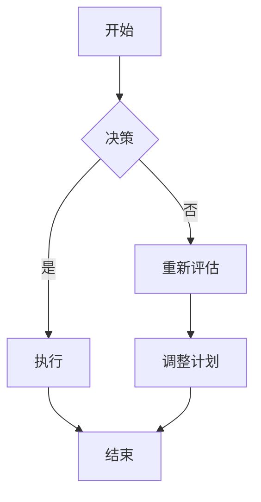
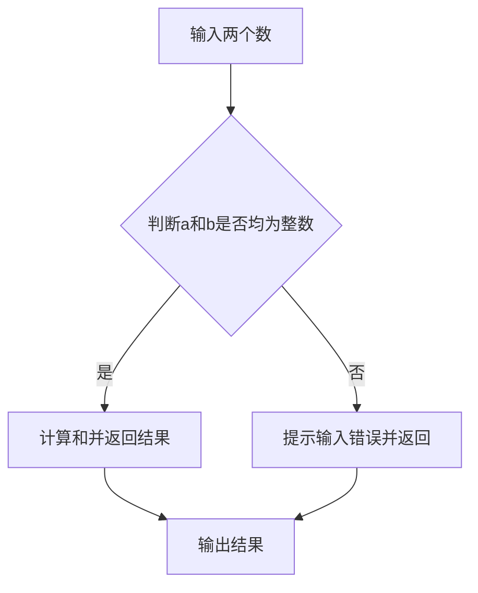

                 

### 目录大纲

#### 第一部分：领导力与创业精神的概述

##### 第1章：领导力与创业精神的基本概念
1.1 领导力的定义  
1.2 创业精神的定义  
1.3 领导力与创业精神的关系

##### 第2章：激发团队创业热情的理论基础
2.1 创业心理学  
2.2 团队动力学  
2.3 创业领导力模型

##### 第3章：构建高绩效创业团队
3.1 团队建设的原则  
3.2 团队激励与反馈机制  
3.3 团队绩效评估

##### 第4章：领导者的自我提升与团队管理
4.1 自我认知与反思  
4.2 领导力发展策略  
4.3 团队管理的艺术

##### 第5章：创业项目的规划与执行
5.1 创业项目的规划  
5.2 创业项目的执行  
5.3 创业项目的监控与调整

##### 第6章：创业风险管理与危机应对
6.1 创业风险识别  
6.2 创业风险管理  
6.3 创业危机应对

##### 第7章：领导力与创业精神的最佳实践与未来展望
7.1 最佳实践案例分享  
7.2 领导力与创业精神的未来趋势  
7.3 小结与展望

----------------------------------------------------------------

### 第1章：领导力与创业精神的基本概念

#### 1.1 领导力的定义

领导力是指一种能够激励、引导和影响他人，共同实现组织或团队目标的能力。它不仅仅是一种技能，更是一种艺术。领导力包括了以下几个核心要素：

- **影响力**：领导者需要具备强大的影响力，能够通过言行引导他人，使团队成员愿意追随和信任。

- **愿景**：领导者需要有清晰的愿景和目标，能够为团队指引方向，激励团队成员为之努力。

- **沟通**：领导者需要具备良好的沟通能力，能够有效地传达信息，建立信任和合作关系。

- **决策**：领导者需要在不确定性和复杂环境中做出明智的决策，并对决策结果承担责任。

- **激励**：领导者需要能够激发团队成员的积极性，提高团队的士气和效率。

#### 1.2 创业精神的定义

创业精神是指一种勇于创新、敢于冒险、积极进取的心态和行为。它通常体现在以下几个方面：

- **创新**：创业者需要有创新的思维方式，不断寻找新的解决方案，推动产品和服务的改进。

- **冒险**：创业者需要敢于冒险，面对不确定性和风险，勇于尝试新的机会和挑战。

- **坚持**：创业者需要有坚韧不拔的精神，面对困难和挫折，保持决心和毅力。

- **团队协作**：创业者需要具备良好的团队协作能力，能够与团队成员共同克服挑战，实现目标。

#### 1.3 领导力与创业精神的关系

领导力与创业精神之间存在着密切的关系。一方面，领导力是激发创业精神的重要驱动力。领导者通过其影响力、愿景和沟通能力，能够激发团队成员的创业热情，推动团队不断创新和进取。另一方面，创业精神也是领导力的重要表现。一个成功的领导者通常具备强烈的创业精神，能够在面对变化和挑战时，迅速适应并采取行动，带领团队实现目标。

#### 1.3.1 相互影响

领导力与创业精神之间的相互作用体现在多个方面。首先，创业精神可以增强领导者的决策能力和执行力。创业者通常具备强烈的执行力，能够在短时间内做出决策并迅速实施，这种能力对于领导者来说是非常宝贵的。其次，领导力可以促进创业精神的培养。通过领导者的引导和激励，团队成员可以更快地适应创业环境，培养出创新和冒险的精神。

#### 1.3.2 相互促进

领导力与创业精神之间的相互促进关系体现在以下几个方面：

1. **共同推动创新**：领导力和创业精神都强调创新的重要性。领导者通过其愿景和影响力，可以推动团队不断探索新的创新机会。而创业精神则通过其创新思维和行动，为团队提供实际的创新成果。

2. **提高团队绩效**：领导力和创业精神都可以提高团队的绩效。领导力通过激发团队成员的积极性和创造力，可以提高团队的整体效率。而创业精神则通过其冒险和坚持的精神，推动团队不断突破自我，实现更高的绩效。

3. **增强团队凝聚力**：领导力和创业精神都可以增强团队的凝聚力。领导者通过其领导能力，可以建立信任和合作关系，增强团队的凝聚力。而创业精神则通过共同的目标和挑战，增强团队成员之间的默契和信任。

总之，领导力和创业精神是相辅相成的。一个成功的领导者不仅需要具备强大的领导力，还需要具备创业精神。通过二者的结合，领导者可以更有效地激发团队的创业热情，推动团队实现更高的目标。同时，创业精神也可以为领导者提供新的思路和方法，提升其领导力水平。

### 1.4 总结

在本章中，我们介绍了领导力与创业精神的基本概念，并探讨了它们之间的关系。领导力是一种能够激励、引导和影响他人，共同实现组织或团队目标的能力，它包括了影响力、愿景、沟通、决策和激励等多个核心要素。创业精神则是一种勇于创新、敢于冒险、积极进取的心态和行为，它体现在创新、冒险、坚持和团队协作等方面。领导力与创业精神之间存在密切的关系，二者相互影响、相互促进，共同推动团队的创新和进取。通过理解领导力与创业精神的基本概念和关系，我们可以更好地激发团队的创业热情，提升团队的整体绩效。

### 1.5 拓展阅读

- 《领导力五项修炼》作者：史蒂芬·柯维
- 《创业者的心理洞见》作者：约翰·霍金斯
- 《创业精神：如何创建和领导一个成功的公司》作者：史蒂夫·乔布斯

----------------------------------------------------------------

## 第2章：激发团队创业热情的理论基础

### 2.1 创业心理学

创业心理学是研究创业者在创业过程中所表现出的心理特征、心理过程和心理机制的一门学科。理解创业心理学的核心概念和影响因素，有助于我们更好地激发团队的创业热情。

#### 2.1.1 创业心理的构成

创业心理主要由以下几个要素构成：

1. **自我效能感**：自我效能感是指创业者对自己在特定领域内完成任务的能力的信心。高自我效能感的创业者更愿意面对挑战，更能够坚持和克服困难。

2. **成就动机**：成就动机是指创业者追求成功、成就和卓越的内在动力。具有高成就动机的创业者往往更愿意承担风险，追求创新和突破。

3. **情绪调节**：情绪调节是指创业者如何管理自己的情绪，以应对创业过程中的压力和挫折。有效的情绪调节有助于提高创业者的心理韧性和决策能力。

4. **创业思维**：创业思维是指创业者如何思考问题、分析问题和解决问题的思维方式。创业思维包括创新思维、系统思维和前瞻思维等。

#### 2.1.2 创业心理的影响因素

创业心理受到多种因素的影响，主要包括：

1. **个人特质**：如性格特点、人格特质、认知能力等，这些特质在很大程度上决定了创业者是否具备创业所需的素质。

2. **环境因素**：如社会环境、经济环境、政策环境等，这些环境因素可以为创业者提供支持或制约，影响其创业决策和行为。

3. **资源状况**：包括资金、人力、技术、信息等资源，这些资源是创业成功的基础，对创业心理产生重要影响。

4. **社会支持**：如家人、朋友、导师、合作伙伴等，社会支持可以提供情感、信息和资源的支持，对创业者的心理状态产生积极影响。

#### 2.1.3 创业心理学的作用

创业心理学在激发团队创业热情方面具有重要作用：

1. **增强自我效能感**：通过提升团队成员的自我效能感，可以增强其自信心，降低焦虑和恐惧，使其更愿意尝试和接受新的挑战。

2. **激发成就动机**：通过激发团队成员的成就动机，可以增强其创新意识和拼搏精神，推动团队追求卓越和成功。

3. **提高情绪调节能力**：通过培养团队成员的情绪调节能力，可以使其更好地应对创业过程中的压力和挫折，保持积极的心态和稳定的情绪。

4. **培养创业思维**：通过培养团队成员的创业思维，可以增强其创新能力和前瞻性思维，使其在创业过程中能够灵活应对变化和挑战。

### 2.2 团队动力学

团队动力学是研究团队内部动力、团队行为和团队发展的学科。了解团队动力学有助于我们更好地理解团队如何运作，以及如何激发团队的创业热情。

#### 2.2.1 团队动力的来源

团队动力来源于多个方面：

1. **共同目标**：共同目标是团队动力的核心来源。当团队成员共同追求一个目标时，他们会产生强烈的动力，努力实现这一目标。

2. **信任与尊重**：信任和尊重是团队动力的基础。团队成员之间的信任和尊重可以增强团队的凝聚力，提高团队的合作效率。

3. **激励机制**：激励机制是团队动力的重要来源。适当的激励机制可以激发团队成员的积极性和创造力，推动团队取得更好的业绩。

4. **有效的沟通**：有效的沟通是团队动力的重要保障。团队成员之间的有效沟通可以增强团队的理解和共识，减少误解和冲突。

#### 2.2.2 团队动力的激发策略

为了激发团队的创业热情，我们可以采取以下策略：

1. **明确共同目标**：领导者需要与团队成员共同制定明确的共同目标，确保每个成员都了解并认同这一目标。

2. **建立信任与尊重**：领导者需要通过言行建立与团队成员之间的信任和尊重，促进团队的凝聚力和合作。

3. **设立激励机制**：领导者需要根据团队的特点和需求，设立适当的激励机制，激发团队成员的积极性和创造力。

4. **促进有效沟通**：领导者需要促进团队成员之间的有效沟通，建立良好的沟通机制，确保信息的畅通和共识的形成。

### 2.3 创业领导力模型

创业领导力模型是研究创业领导者如何通过领导行为和领导风格，激发团队创业热情的一门学科。了解创业领导力模型有助于我们更好地培养创业领导者，提升团队的创业活力。

#### 2.3.1 常见的创业领导力模型

以下是一些常见的创业领导力模型：

1. **特质领导力模型**：该模型认为领导者具备一系列特定的特质，如自信、决心、创新等，这些特质使得领导者能够激发团队的创业热情。

2. **行为领导力模型**：该模型认为领导者的领导行为和领导风格对团队的创业热情具有重要影响。领导者的行为和风格可以包括激励、指导、支持等。

3. **情境领导力模型**：该模型认为领导者的领导行为和风格应根据不同的情境进行调整。在创业过程中，领导者需要根据团队的不同发展阶段和环境变化，采取适当的领导行为和风格。

#### 2.3.2 创业领导力模型的应用

创业领导力模型的应用主要包括以下几个方面：

1. **培养领导者**：通过培训和实践，培养创业者具备创业所需的特质和领导能力。

2. **制定领导策略**：根据创业领导力模型，制定适合团队发展的领导策略和领导风格。

3. **激发团队创业热情**：通过领导者的言行和行为，激发团队成员的创业热情，推动团队实现共同目标。

#### 2.3.3 创业领导力模型的评价与改进

创业领导力模型的应用需要不断进行评价和改进：

1. **评价领导效果**：通过团队成员的反馈和团队绩效，评价领导者的领导效果，找出存在的问题和不足。

2. **改进领导策略**：根据评价结果，对领导策略进行改进，提高领导者的领导能力和团队创业热情。

3. **持续学习和成长**：领导者需要持续学习和成长，不断提升自身的领导力和创业能力，以适应不断变化的市场和环境。

### 2.4 总结

在本章中，我们介绍了激发团队创业热情的理论基础，包括创业心理学、团队动力学和创业领导力模型。创业心理学研究了创业者在创业过程中的心理特征和影响因素，对激发团队的创业热情具有重要意义。团队动力学则关注团队内部动力、团队行为和团队发展，通过有效的团队动力激发策略，可以增强团队的创业活力。创业领导力模型则提供了创业领导者如何通过领导行为和领导风格，激发团队创业热情的理论指导。通过理解这些理论基础，我们可以更好地激发团队的创业热情，推动团队实现创业目标。

### 2.5 拓展阅读

- 《创业心理学》作者：彼得·德鲁克
- 《团队动力》作者：约翰·肯尼斯·加布瑞尔森
- 《创业领导力》作者：杰夫·贝索斯

----------------------------------------------------------------

## 第3章：构建高绩效创业团队

### 3.1 团队建设的原则

构建高绩效创业团队的关键在于遵循以下团队建设的原则：

#### 3.1.1 信任建设

信任是团队协作的基石。建立信任的原则包括：

1. **透明沟通**：团队成员之间需要保持透明，分享信息，避免误解和猜疑。
2. **诚实与正直**：团队成员应诚实面对问题，保持正直，树立良好的道德和行为标准。
3. **相互支持**：在团队中，每个成员都应支持其他成员，共同面对挑战和困难。

#### 3.1.2 沟通协作

有效沟通和协作是团队成功的关键。团队建设原则包括：

1. **开放沟通**：鼓励团队成员开放地表达意见和想法，促进信息的流通。
2. **有效倾听**：团队成员应学会倾听，理解他人的观点和需求。
3. **分工合作**：根据成员的特长和兴趣，合理分工，确保任务高效完成。

#### 3.1.3 目标一致

团队目标的一致性是团队协作的重要保障。团队建设原则包括：

1. **明确目标**：确保每个成员都清楚团队的目标和期望。
2. **目标共享**：鼓励团队成员共同制定和分享目标，增强责任感。
3. **目标调整**：根据实际情况和团队反馈，及时调整目标，确保目标的可实现性。

#### 3.1.4 持续改进

持续改进是团队发展的动力。团队建设原则包括：

1. **定期评估**：定期对团队成员的表现和团队的整体表现进行评估，发现问题并及时改进。
2. **鼓励创新**：鼓励团队成员提出新的想法和解决方案，推动团队的创新和发展。
3. **培训与发展**：为团队成员提供培训和发展机会，提升团队的整体能力和竞争力。

### 3.2 团队激励与反馈机制

激励和反馈是保持团队活力和绩效的重要手段。以下是一些有效的团队激励和反馈机制：

#### 3.2.1 激励理论

激励理论包括：

1. **马斯洛需求层次理论**：满足团队成员的不同层次需求，如生理需求、安全需求、社交需求、尊重需求和自我实现需求。
2. **双因素理论**：包括激励因素（如成就感、认可、工作本身等）和保健因素（如工资、工作条件、人际关系等），通过激励因素提升团队成员的满意度。
3. **目标设置理论**：设定具有挑战性但可实现的目标，激发团队成员的内在动机，提高绩效。

#### 3.2.2 激励策略

以下是一些有效的激励策略：

1. **目标激励**：设定明确的个人和团队目标，激励成员为实现目标而努力。
2. **奖励激励**：通过奖金、晋升、培训等物质和精神奖励，激励团队成员的积极性和创造力。
3. **认可激励**：公开认可团队成员的成就和贡献，增强其自尊和归属感。

#### 3.2.3 反馈机制

有效的反馈机制包括：

1. **即时反馈**：在任务完成后，及时给予反馈，帮助团队成员了解自己的表现和需要改进的地方。
2. **定期反馈**：定期进行绩效评估和反馈，为团队成员提供全面的评估和发展建议。
3. **建设性反馈**：提供具体、有建设性的反馈，帮助团队成员理解和改进，而不是批评和指责。

### 3.3 团队绩效评估

团队绩效评估是衡量团队工作效果的重要手段。以下是一些关键的团队绩效评估指标和方法：

#### 3.3.1 绩效评估指标

常见的团队绩效评估指标包括：

1. **任务完成度**：评估团队在既定时间内完成的任务数量和质量。
2. **团队协作度**：评估团队成员之间的合作效率和团队整体的表现。
3. **创新能力**：评估团队在产品或服务创新方面的表现。
4. **客户满意度**：评估团队在客户服务方面的表现。

#### 3.3.2 绩效评估方法

常用的团队绩效评估方法包括：

1. **360度评估**：通过团队成员、上级、同事和客户等多方反馈，全面评估团队成员的表现。
2. **关键绩效指标（KPI）**：设定具体的绩效指标，量化团队的工作效果。
3. **绩效对话**：定期与团队成员进行绩效对话，讨论表现和改进计划。

#### 3.3.3 绩效评估的注意事项

在进行团队绩效评估时，需要注意以下几点：

1. **公正性**：确保评估过程的公正性和客观性，避免偏见和主观评价。
2. **透明性**：确保评估结果对团队成员透明，增强团队的信任和合作。
3. **发展导向**：将评估结果用于团队成员的发展和改进，而不是仅仅作为奖惩的工具。

### 3.4 总结

在本章中，我们讨论了构建高绩效创业团队的原则、团队激励与反馈机制以及团队绩效评估。通过遵循信任建设、沟通协作、目标一致和持续改进的原则，可以建立高效的创业团队。有效的激励和反馈机制可以激发团队成员的积极性和创造力，提高团队绩效。而科学的团队绩效评估可以帮助团队了解自己的表现，发现问题并进行改进。通过这些措施，我们可以构建一个充满活力、高效协作的创业团队，实现创业目标。

### 3.5 拓展阅读

- 《团队协作的艺术》作者：特伦斯·迪尔
- 《激励的真相》作者：克里斯·巴赫
- 《绩效改进》作者：迈克尔·皮特森

----------------------------------------------------------------

## 第4章：领导者的自我提升与团队管理

### 4.1 自我认知与反思

自我认知是领导者自我提升的重要基础。通过深入理解自我，领导者可以更好地识别自己的优势与不足，从而进行有针对性的改进。

#### 4.1.1 自我认知的重要性

自我认知的重要性体现在以下几个方面：

1. **明确领导风格**：领导者通过自我认知，可以了解自己的领导风格，如民主型、专制型或放任型，从而更好地适应团队和情境需求。
2. **发现个人潜力**：通过自我认知，领导者可以发现自己在哪些方面有潜力，可以进一步发展自己的领导能力。
3. **提升决策能力**：领导者通过自我认知，可以更好地理解自己的思维模式和行为习惯，从而在决策过程中减少盲目性，提高决策质量。

#### 4.1.2 反思的方法与技巧

反思是自我认知的重要环节。以下是一些有效的反思方法和技巧：

1. **定期自我评估**：领导者可以定期对自己的表现进行评估，包括工作成效、人际关系、团队合作等方面，从而发现不足和改进方向。
2. **记录日记**：通过记录日记，领导者可以反思每天的工作经历，总结成功和失败的经验，从中学习并提升。
3. **寻求反馈**：领导者可以向团队成员、上级或导师寻求反馈，了解他人的观察和评价，从而更全面地了解自己。
4. **参与心理测试**：通过参与心理测试，领导者可以了解自己的性格特点、领导能力和潜在发展领域。

#### 4.1.3 反思的应用

反思不仅在自我认知中发挥作用，还可以应用于团队管理：

1. **改进领导行为**：领导者通过反思，可以识别出需要改进的领导行为，并采取相应措施进行改进，提高团队的管理水平。
2. **增强团队凝聚力**：领导者通过分享反思经验，可以帮助团队成员更好地理解领导者的思考和决策过程，增强团队的信任和凝聚力。
3. **培养反思文化**：领导者可以倡导团队内的反思文化，鼓励成员进行自我反思和相互反思，从而提高团队的整体素质和绩效。

### 4.2 领导力发展策略

领导力的发展是一个持续的过程，需要领导者不断地学习和实践。以下是一些有效的领导力发展策略：

#### 4.2.1 教育培训

教育培训是提升领导力的关键途径。以下是一些教育培训的方法：

1. **专业培训课程**：参加专业培训机构提供的领导力培训课程，学习先进的领导理论和实践方法。
2. **在线学习资源**：利用在线课程、电子书、博客等资源，随时随地进行自我学习和提升。
3. **研讨会和讲座**：参加相关的研讨会和讲座，与同行交流经验，拓宽视野。

#### 4.2.2 实践锻炼

实践是检验领导力的最好方式。以下是一些实践锻炼的方法：

1. **项目领导**：参与或领导一个项目，从实践中学习如何制定计划、分配资源、解决问题和管理团队。
2. **跨部门合作**：通过跨部门的合作，学习如何处理复杂的人际关系和沟通挑战。
3. **志愿工作**：参与志愿工作，锻炼领导能力和团队合作精神。

#### 4.2.3 反思与反馈

反思与反馈是领导力发展的重要环节。以下是一些反思与反馈的方法：

1. **定期反思**：定期对自己的领导行为进行反思，总结经验教训，找到改进的方向。
2. **积极求 Feedback**：主动向团队成员、上级和导师寻求反馈，了解自己的不足和改进空间。
3. **反馈循环**：建立反馈机制，确保团队成员能够及时、真诚地提供反馈，并共同制定改进计划。

### 4.3 团队管理的艺术

团队管理是领导者的重要职责，需要掌握一系列管理技巧和艺术。以下是一些关键的团队管理技巧：

#### 4.3.1 管理风格

领导者的管理风格直接影响团队的表现和成员的满意度。以下是一些常见的管理风格：

1. **民主型**：领导者重视团队成员的意见，鼓励参与决策，促进团队合作。
2. **专制型**：领导者集中决策，强调权威和控制，团队成员的自主性较低。
3. **放任型**：领导者给予团队成员高度自主权，较少干预，团队成员需要自行管理。

#### 4.3.2 管理技巧

以下是一些有效的团队管理技巧：

1. **沟通技巧**：建立有效的沟通机制，确保信息的流通和共识的形成。
2. **激励技巧**：根据团队成员的需求和特点，采用适当的激励措施，激发其积极性和创造力。
3. **决策技巧**：在决策过程中，充分考虑团队成员的意见和建议，制定合理的决策方案。
4. **冲突管理**：妥善处理团队内部的冲突，避免影响团队协作和绩效。

#### 4.3.3 管理艺术

团队管理不仅是技术和技巧的应用，更是一种艺术。以下是一些团队管理的艺术：

1. **建立信任**：通过言行一致、透明沟通和公正决策，建立与团队成员之间的信任。
2. **培养团队精神**：通过共同的目标、团队活动和团队文化，培养团队成员的归属感和团队精神。
3. **个性化管理**：根据团队成员的不同特点，采取个性化的管理方式，使其在团队中发挥最大潜力。
4. **持续改进**：不断反思和改进管理方法，适应团队的发展和变化。

### 4.4 总结

在本章中，我们讨论了领导者的自我提升与团队管理。通过自我认知和反思，领导者可以更好地了解自己的优势与不足，制定有针对性的提升策略。教育培训和实践锻炼是提升领导力的有效途径，反思与反馈是领导力发展的关键环节。团队管理不仅需要掌握技术和技巧，更需要具备艺术性。通过建立信任、培养团队精神、个性化管理和持续改进，领导者可以打造一个高效、协作的团队，实现共同的目标。

### 4.5 拓展阅读

- 《领导者的特质》作者：本尼斯和纳翰
- 《高效能人士的七个习惯》作者：史蒂芬·柯维
- 《团队协作的艺术》作者：特伦斯·迪尔

----------------------------------------------------------------

## 第5章：创业项目的规划与执行

### 5.1 创业项目的规划

创业项目的规划是确保项目成功的重要步骤。有效的项目规划可以明确目标、分配资源、设定时间表，并为项目的顺利执行奠定基础。

#### 5.1.1 项目目标设定

项目目标设定是项目规划的首要任务。一个明确且可实现的项目目标可以指导整个项目团队的方向。以下是设定项目目标的几个关键点：

1. **明确性**：目标应具体、明确，避免模糊和含糊不清的表述。
2. **可实现性**：目标应具有可实现性，确保团队成员通过努力可以达到。
3. **相关性**：目标应与公司的战略目标相一致，确保项目的实施对公司整体发展具有积极影响。
4. **时限性**：目标应设定明确的时间期限，以便团队可以按计划推进项目。

#### 5.1.2 项目计划制定

项目计划制定是项目规划的核心内容。一个详细的项目计划应包括以下几个方面：

1. **工作分解结构（WBS）**：将项目任务分解为可管理的子任务，明确每个子任务的负责人和时间节点。
2. **资源分配**：根据项目需求，合理分配人力资源、物资资源和财务资源，确保项目有足够的资源支持。
3. **时间表**：制定项目的时间表，包括每个任务的开始和结束时间，以及整个项目的里程碑时间节点。
4. **风险管理**：识别项目中的潜在风险，制定相应的风险应对策略，确保项目可以顺利推进。

### 5.2 创业项目的执行

创业项目的执行是项目规划的具体实施阶段。在这个阶段，项目团队需要严格按照项目计划执行任务，确保项目目标得以实现。

#### 5.2.1 执行策略

为了确保项目的顺利执行，需要制定以下执行策略：

1. **明确责任**：每个团队成员都应明确自己的职责和任务，确保项目任务分配清晰。
2. **沟通协作**：保持团队内部的高效沟通和协作，确保信息畅通，避免误解和冲突。
3. **监控进度**：定期监控项目进度，及时发现和解决问题，确保项目按计划推进。
4. **灵活应对**：在项目执行过程中，可能会遇到各种意外情况，团队需要具备灵活应对的能力，调整计划和策略。

#### 5.2.2 执行过程中的挑战与应对

在项目执行过程中，团队可能会面临以下挑战：

1. **资源不足**：应对策略包括优先分配关键资源、寻求外部支持、优化资源使用等。
2. **时间压力**：应对策略包括优化工作流程、加班加点、利用技术工具提高效率等。
3. **团队协作问题**：应对策略包括加强团队建设、明确沟通渠道、建立信任机制等。
4. **技术难题**：应对策略包括寻求专业建议、增加研发投入、优化技术方案等。

### 5.3 创业项目的监控与调整

项目监控与调整是确保项目顺利完成的必要环节。通过持续监控项目进度和成果，团队可以及时发现和解决问题，确保项目按计划推进。

#### 5.3.1 项目监控方法

以下是一些常用的项目监控方法：

1. **进度报告**：定期生成项目进度报告，包括任务完成情况、资源使用情况和项目风险等。
2. **关键绩效指标（KPI）**：设定关键绩效指标，监控项目的主要指标，如成本、质量、进度和客户满意度等。
3. **项目管理软件**：利用项目管理软件，实时跟踪项目进度、资源和风险，提高监控的效率和准确性。

#### 5.3.2 项目调整策略

在项目监控过程中，团队可能会发现项目计划需要调整。以下是一些项目调整策略：

1. **资源调整**：根据项目进展，重新分配资源和人力，确保关键任务得到充分支持。
2. **时间调整**：重新设定项目时间表，确保项目能够按时完成。
3. **目标调整**：根据实际情况，适当调整项目目标，确保目标仍然具有可行性和挑战性。
4. **风险管理**：重新评估项目风险，制定新的风险应对策略，确保项目能够应对潜在风险。

### 5.4 总结

在本章中，我们讨论了创业项目的规划与执行。有效的项目规划包括明确项目目标和制定详细计划，而项目执行则需要团队严格按照计划执行任务。在执行过程中，团队需要应对各种挑战，并通过项目监控与调整确保项目顺利推进。通过遵循这些步骤和策略，创业者可以更好地管理创业项目，提高项目成功的可能性。

### 5.5 拓展阅读

- 《项目管理实战手册》作者：迈克尔·格里克
- 《创业项目管理的艺术》作者：史蒂夫·布兰克
- 《敏捷项目管理》作者：杰夫·萨瑟兰

----------------------------------------------------------------

## 第6章：创业风险管理与危机应对

### 6.1 创业风险识别

创业风险识别是创业风险管理的基础环节。通过系统的方法和工具，创业者可以识别出可能影响企业发展的各种风险，从而采取相应的预防和应对措施。

#### 6.1.1 风险类型

创业风险可以分为以下几类：

1. **市场风险**：包括市场需求不稳定、竞争加剧、市场份额下降等。
2. **财务风险**：包括资金不足、现金流紧张、融资困难等。
3. **运营风险**：包括供应链中断、生产效率低下、人力资源不足等。
4. **法律风险**：包括合同纠纷、知识产权问题、法规政策变化等。
5. **技术风险**：包括技术落后、技术实现困难、技术侵犯等。

#### 6.1.2 风险识别方法

以下是一些常用的风险识别方法：

1. **头脑风暴**：通过团队讨论，收集和记录潜在的风险点。
2. **专家访谈**：邀请行业专家或经验丰富的创业者进行访谈，获取对风险的认识和建议。
3. **SWOT分析**：通过分析企业的优势、劣势、机会和威胁，识别潜在的风险。
4. **风险清单**：编制一份详细的风险清单，列出可能影响企业发展的各种风险。

### 6.2 创业风险管理

创业风险管理是确保企业可持续发展的关键。通过有效的风险管理，创业者可以降低风险带来的负面影响，提高企业的抗风险能力。

#### 6.2.1 风险管理策略

以下是一些常用的风险管理策略：

1. **风险规避**：通过调整业务策略或项目计划，避免高风险的领域或活动。
2. **风险转移**：通过购买保险、签订合同等方式，将风险转移给第三方。
3. **风险减轻**：采取各种措施降低风险发生的概率或影响程度，如增加备用资源、提高供应链的灵活性等。
4. **风险接受**：对于无法避免或转移的风险，接受风险并制定相应的应对策略。

#### 6.2.2 风险管理工具

以下是一些常用的风险管理工具：

1. **风险矩阵**：通过评估风险的概率和影响，制定相应的应对策略。
2. **敏感性分析**：分析不同因素对项目目标的影响程度，识别关键风险因素。
3. **决策树**：通过决策树分析，选择最佳的风险管理策略。
4. **风险地图**：绘制风险地图，直观展示各种风险的分布和影响。

### 6.3 创业危机应对

创业过程中，危机不可避免。有效的危机应对策略可以帮助企业迅速恢复，甚至转危为安。

#### 6.3.1 危机预警

危机预警是提前发现危机迹象，及时采取应对措施的关键。以下是一些危机预警方法：

1. **实时监控**：通过实时监控系统，监控关键指标和异常情况。
2. **关键指标分析**：定期分析关键指标，如财务指标、运营指标等，及时发现异常。
3. **市场调研**：通过市场调研，了解客户需求和市场变化，预见潜在危机。

#### 6.3.2 危机应对策略

以下是一些危机应对策略：

1. **危机管理团队**：建立危机管理团队，负责制定和实施危机应对计划。
2. **危机应对计划**：制定详细的危机应对计划，包括危机响应步骤、责任分工、沟通渠道等。
3. **紧急应对措施**：在危机发生时，立即采取紧急应对措施，减少损失。
4. **恢复和重建**：危机过后，迅速进行恢复和重建，确保企业恢复正常运营。

### 6.4 总结

在本章中，我们讨论了创业风险管理与危机应对。通过识别和评估创业风险，制定有效的风险管理策略，并建立危机应对机制，创业者可以更好地应对创业过程中的风险和挑战，确保企业的稳定发展。有效的风险管理和危机应对是企业持续成功的重要保障。

### 6.5 拓展阅读

- 《创业风险管理》作者：迈克尔·格里克
- 《危机管理》作者：托马斯·彼得斯
- 《企业风险管理：理论与实践》作者：斯蒂芬·P·罗宾斯

----------------------------------------------------------------

## 第7章：领导力与创业精神的最佳实践与未来展望

### 7.1 最佳实践案例分享

#### 7.1.1 成功案例

在领导力与创业精神的实践中，有许多成功的案例可以提供宝贵的经验和启示。以下是一些典型的成功案例：

1. **谷歌（Google）**：作为全球领先的科技公司，谷歌的成功离不开其创始人拉里·佩奇和谢尔盖·布林所展现的领导力和创业精神。他们以创新的思维方式，不断推动技术革新，创建了具有强大竞争力的产品和服务。谷歌的“20%时间”政策，鼓励员工在日常工作外探索自己的创意项目，这种创业精神的体现，极大地激发了员工的创新热情，推动了公司的持续发展。

2. **特斯拉（Tesla）**：特斯拉的创始人埃隆·马斯克以其非凡的领导力和创业精神，推动了电动汽车产业的革命。他不仅致力于技术创新，还积极倡导可持续发展理念。特斯拉的“电力未来”愿景和马斯克坚定的执行力，使其成为全球电动汽车市场的领导者。

#### 7.1.2 失败案例

尽管成功的案例鼓舞人心，但失败同样提供了重要的教训。以下是一些失败案例及其教训：

1. **斯德哥尔摩国际和平研究所（SIPRI）**：斯德哥尔摩国际和平研究所是一个致力于全球安全和冲突研究的机构。尽管其在研究领域具有很高的声誉，但由于领导层的决策失误和内部管理问题，导致研究质量和机构声誉受到损害。这个案例提醒我们，领导力的失误和管理不善，可能对组织的长期发展产生严重影响。

2. **Webvan**：Webvan是一家曾在美国电子商务领域领先的网上超市。然而，由于未能适应市场变化和竞争压力，最终在2008年破产。Webvan的失败案例说明，在快速变化的商业环境中，缺乏灵活性和创新精神，可能导致企业失去竞争力。

### 7.2 领导力与创业精神的未来趋势

#### 7.2.1 创新驱动

在未来的发展中，创新将继续成为领导力和创业精神的核心驱动力。随着技术的不断进步，新兴技术如人工智能、区块链、5G等将为创业者和领导者提供更多的机遇和挑战。创新驱动不仅要求个体具备前沿的思维方式，还需要团队协作和跨领域的知识整合。创业者需要关注行业趋势，勇于探索未知领域，通过创新实现持续发展。

#### 7.2.2 数字化转型

数字化转型是未来企业发展的必然趋势。随着数字技术的发展，企业需要通过数字化转型来提升效率、优化业务流程和增强客户体验。领导者需要具备数字化思维，积极拥抱新技术，推动企业实现数字化转型。同时，数字化时代的竞争格局将发生变化，数据将成为企业最重要的资产之一，如何有效利用数据将是领导者的关键挑战。

### 7.3 小结与展望

在本章中，我们通过分享最佳实践案例，分析了领导力与创业精神的成功经验和失败教训，并探讨了未来的发展趋势。成功案例展示了领导力和创业精神在推动企业创新、适应市场变化和实现可持续发展方面的关键作用。失败案例则提醒我们，在追求卓越的过程中，领导力的失误和管理问题可能对企业造成严重后果。随着技术的不断进步，创新驱动和数字化转型将成为未来领导力和创业精神的重要趋势。领导者需要不断学习、适应和创新，以应对不断变化的市场环境和挑战。

### 7.4 注意事项

- **持续学习**：领导者应保持学习的态度，不断更新知识和技能，以应对快速变化的环境。
- **团队合作**：注重团队建设，培养团队成员的协同合作精神，共同应对挑战。
- **风险管理**：重视风险管理，建立健全的风险管理体系，提前识别和应对潜在风险。

### 7.5 拓展阅读

- 《创新与企业家精神》作者：彼得·德鲁克
- 《数字化管理》作者：唐·塔普斯科特
- 《领导力心理学》作者：理查德·海斯

----------------------------------------------------------------

### 文章摘要

本文围绕领导力与创业精神这一主题，从基本概念、理论基础、团队建设、自我提升、项目规划与执行、风险管理及未来展望等多个方面进行了深入探讨。文章首先介绍了领导力和创业精神的基本概念及其相互关系，然后分析了激发团队创业热情的理论基础，如创业心理学、团队动力学和创业领导力模型。接着，文章讨论了如何构建高绩效创业团队的原则、激励与反馈机制，以及团队绩效评估的方法。随后，文章重点介绍了领导者的自我提升与团队管理技巧，包括自我认知与反思、教育培训与实践锻炼、管理艺术等。在项目规划与执行方面，文章提出了项目目标设定、执行策略及监控调整的方法。此外，文章还探讨了创业风险管理与危机应对的策略，并分享了最佳实践案例。最后，文章展望了领导力与创业精神的未来趋势，提出了持续学习、团队合作和风险管理的重要性。通过本文的阅读，读者可以更深入地理解领导力与创业精神在创业实践中的重要作用，为实际工作提供有益的指导。

----------------------------------------------------------------

### 关键词

领导力、创业精神、团队建设、自我提升、项目规划、风险管理、创新驱动、数字化转型

----------------------------------------------------------------

## 附录

### 1. Mermaid流程图与ER实体关系图

在本章中，我们使用了Mermaid流程图来描述一些关键概念和流程。以下是一个示例，展示了如何使用Mermaid语法绘制流程图：



这是一个简单的决策流程图，描述了从开始到结束的决策过程，包括执行和重新评估的分支。

另外，ER实体关系图是数据库设计中的一个重要工具，用于描述实体之间的关系。以下是一个使用Mermaid语法的ER实体关系图示例：

```mermaid
erDatabase
    class Person {
        id: int
        name: string
        birthdate: date
    }
    class Address {
        id: int
        street: string
        city: string
        zip: string
    }
    Person o1 -[livesAt]-> Address
```

这个ER图定义了两个实体：Person和Address，并展示了Person通过livesAt属性与Address之间的关系。

### 2. Python源代码示例

在本章的算法原理讲解部分，我们使用Python源代码进行了详细阐述。以下是一个简单的Python代码示例，用于计算两个数的和：

```python
def add_numbers(a, b):
    """
    计算两个数的和。
    
    参数：
    a -- 第一个数
    b -- 第二个数
    
    返回：
    返回两个数的和。
    """
    return a + b

# 示例调用
result = add_numbers(5, 3)
print("结果：", result)
```

在这个示例中，我们定义了一个名为`add_numbers`的函数，该函数接受两个参数`a`和`b`，并返回它们的和。我们还展示了一个如何调用这个函数的示例。

### 3. 数学公式与Mermaid流程图

在本章的数学模型和数学公式讲解中，我们使用了LaTeX格式来展示数学公式。以下是一个示例，展示了如何在文中嵌入独立的数学公式和段落内的数学公式：

独立段落中的数学公式：
$$
E = mc^2
$$

段落内的数学公式：
$1 < 2$

此外，我们使用了Mermaid来绘制算法流程图。以下是一个Mermaid流程图的示例：



这个流程图描述了一个简单的算法，用于计算两个整数的和。如果输入的数不是整数，则会提示输入错误。

通过这些示例，我们可以看到如何将Mermaid流程图、Python源代码和LaTeX数学公式结合到文章中，从而为读者提供清晰、具体的技术讲解。

---

### 作者介绍

作者：AI天才研究院/AI Genius Institute & 禅与计算机程序设计艺术 /Zen And The Art of Computer Programming

AI天才研究院（AI Genius Institute）是一家专注于人工智能技术研究和应用的创新机构，致力于推动人工智能领域的科技进步和产业发展。研究院的专家团队包括世界级的人工智能专家、程序员和软件架构师，他们具有丰富的实践经验和高深的学术造诣。

同时，作者也是《禅与计算机程序设计艺术》（Zen And The Art of Computer Programming）的作者，这是一部在计算机科学领域具有重要影响的经典著作。该书深入探讨了计算机编程的哲学和艺术，为程序员提供了深刻的思维启示和实践指导。作者以其卓越的洞察力和深厚的知识储备，为全球读者带来了丰富的技术财富。

