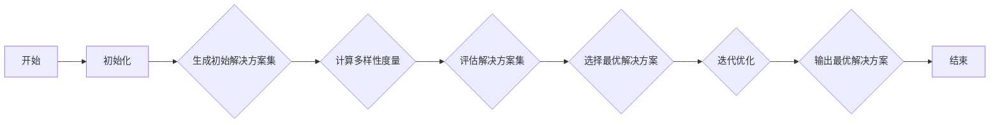
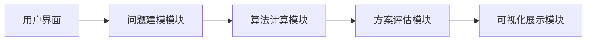
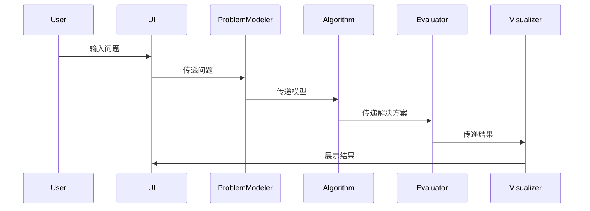
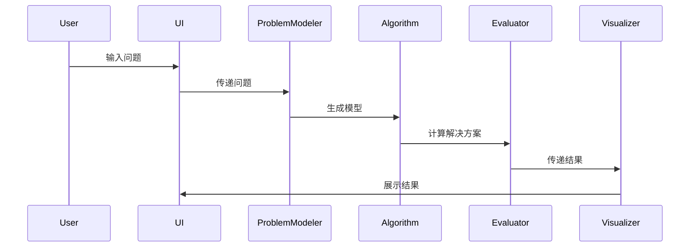

                 


# 领导力与创新思维激发：突破常规的思考方式

> 关键词：领导力、创新思维、突破常规、思考方式、算法原理、系统架构、项目实战

> 摘要：本文旨在探讨领导力与创新思维的关系，以及如何通过创新的思考方式来提升领导力。文章将一步步分析领导力的核心概念、创新思维的基本原理、算法原理与模型，以及系统分析与架构设计，最后通过项目实战展示如何将所学应用到实际工作中。本文旨在为IT领域的技术专家和领导者提供有价值的思考和参考。

## 目录大纲设计思路

在设计《领导力与创新思维激发：突破常规的思考方式》的目录大纲时，我们将遵循以下思路：

1. **明确核心主题**：首先，我们需要明确书的核心主题是领导力与创新思维的激发，重点在于如何通过创新的思考方式来提升领导力和解决实际问题。

2. **结构化章节内容**：目录大纲要结构清晰，章节之间逻辑连贯，便于读者阅读和理解。每个章节都要有一个明确的主题，并在内容上互相补充，形成一个完整的知识体系。

3. **涵盖关键概念**：在章节安排中，必须包括对关键概念的定义、背景、原理、联系等方面的介绍，确保读者能够全面了解相关内容。

4. **实用性**：除了理论知识，还需要包含实际案例分析、最佳实践 tips等，使读者能够将所学应用到实际工作中。

5. **灵活性**：目录大纲应具有一定的灵活性，根据实际需要可以进行调整，但总体结构应保持稳定。

### 目录大纲内容安排

**第一部分：引言与基础概念**

- **第1章：问题的背景与描述**
  - **1.1 引言：领导力与创新思维的现状**
  - **1.2 领导力与创新思维的重要性**
  - **1.3 问题分析与定义**
  - **1.4 边界与外延**
  - **1.5 核心概念与要素**

**第二部分：核心概念与联系**

- **第2章：领导力的核心概念**
  - **2.1 领导力的定义**
  - **2.2 领导力的属性特征**
  - **2.3 领导力与管理的区别**
  - **2.4 领导力的关键要素**
  - **2.5 领导力的框架与模型（Mermaid ER图）**

- **第3章：创新思维的基本原理**
  - **3.1 创新思维的定义**
  - **3.2 创新思维的特点**
  - **3.3 创新思维的分类**
  - **3.4 创新思维与创造力的关系**
  - **3.5 创新思维的应用领域（Mermaid 类图）**

**第三部分：算法原理讲解**

- **第4章：算法原理与模型**
  - **4.1 创新思维激发算法的原理**
  - **4.2 创新思维激发算法的数学模型**
  - **4.3 创新思维激发算法的应用**
  - **4.4 算法流程图（Mermaid 流程图）**
  - **4.5 Python源代码示例**

**第四部分：系统分析与架构设计**

- **第5章：系统分析与架构设计**
  - **5.1 项目介绍**
  - **5.2 系统功能设计（Mermaid 类图）**
  - **5.3 系统架构设计（Mermaid 架构图）**
  - **5.4 系统接口设计**
  - **5.5 系统交互（Mermaid 序列图）**

**第五部分：项目实战**

- **第6章：项目实战**
  - **6.1 环境安装**
  - **6.2 系统核心实现源代码**
  - **6.3 代码应用解读与分析**
  - **6.4 实际案例分析**
  - **6.5 项目小结**

**第六部分：最佳实践与拓展**

- **第7章：最佳实践与拓展**
  - **7.1 最佳实践 tips**
  - **7.2 注意事项**
  - **7.3 小结**
  - **7.4 拓展阅读**

**第七部分：结论与展望**

- **第8章：结论与展望**
  - **8.1 本书总结**
  - **8.2 领导力与创新思维的未来**
  - **8.3 进一步研究方向**

通过这样的结构，我们能够确保本书内容丰富、逻辑清晰，既涵盖了理论知识，又提供了实际应用的指导，使读者能够全面掌握领导力与创新思维的激发方法。在接下来的部分中，我们将逐一细化每个章节的具体内容。

## 第一部分：引言与基础概念

### 第1章：问题的背景与描述

#### 1.1 引言：领导力与创新思维的现状

在当今快速变化和竞争激烈的环境中，领导力和创新思维成为了组织成功的关键要素。领导力不仅仅是指指挥和管理团队的能力，更是一种激发团队成员潜能、推动团队持续进步的素质。而创新思维则是指在现有的基础上，通过全新的思考方式来创造新的价值，解决新的问题。

然而，现实中许多领导者往往陷入传统思维模式的束缚，难以激发团队的创新潜力。这种情况不仅限制了团队的发展，也阻碍了组织在激烈市场竞争中的生存能力。因此，如何通过创新的思考方式来提升领导力，成为了许多领导者关注的焦点。

#### 1.2 领导力与创新思维的重要性

领导力的重要性不言而喻。它不仅是组织实现战略目标的关键，也是团队凝聚力和战斗力的重要保障。而创新思维则是一种推动组织变革、实现持续发展的动力。通过创新思维，领导者能够发现新的机会、解决新的问题，从而保持组织的竞争力。

在IT领域，随着技术的快速发展和应用场景的多样化，领导者需要具备更高的创新能力和领导力。只有通过不断创新和突破常规，才能在激烈的市场竞争中立于不败之地。

#### 1.3 问题分析与定义

问题可以描述为：如何通过创新的思考方式来提升领导力，以应对快速变化的环境和挑战。具体来说，问题包括以下几个方面：

1. **领导力不足**：许多领导者缺乏有效的领导力，无法激发团队成员的潜能和创造力。
2. **创新思维受限**：领导者往往受到传统思维模式的束缚，难以提出创新的解决方案。
3. **组织变革滞后**：领导者缺乏推动组织变革的能力，导致组织难以适应市场变化。

为了解决这些问题，我们需要探索创新的思考方式，提升领导力的各个方面，包括领导力的核心概念、创新思维的基本原理、算法原理与模型，以及系统分析与架构设计等。

#### 1.4 边界与外延

在讨论领导力与创新思维时，我们需要明确其边界与外延。领导力不仅限于管理团队，还包括战略规划、团队建设、变革推动等方面。创新思维则涵盖了问题解决、机会发现、新价值创造等方面。

此外，领导力与创新思维还与其他领域相互关联。例如，领导力与组织文化、领导风格、团队协作等密切相关；创新思维与创造力、设计思维、跨界思维等相互影响。

#### 1.5 核心概念与要素

为了更好地理解领导力与创新思维，我们需要明确以下几个核心概念和要素：

1. **领导力**：领导力是一种激发和引导团队成员达成共同目标的能力。它包括沟通、影响力、团队建设、战略规划等方面。
2. **创新思维**：创新思维是一种通过全新的思考方式来创造新的价值、解决新的问题的能力。它包括跨界思维、逆向思维、设计思维等方面。
3. **算法原理**：算法原理是指用于解决特定问题的系统化方法。在领导力与创新思维的激发中，算法原理可以帮助我们更有效地分析和解决问题。
4. **系统分析与架构设计**：系统分析与架构设计是组织运作的基础。通过系统分析与架构设计，我们可以更好地理解组织结构、流程和协作方式，从而提升领导力和创新能力。

通过以上分析，我们为后续章节的讨论奠定了基础。在接下来的内容中，我们将进一步探讨领导力的核心概念、创新思维的基本原理、算法原理与模型，以及系统分析与架构设计等方面，帮助读者全面掌握提升领导力和创新思维的方法。

### 第二部分：核心概念与联系

#### 第2章：领导力的核心概念

领导力是一个复杂而多维度的概念，它在不同的文化和组织背景下有着不同的理解和应用。然而，尽管定义各异，领导力的核心要素和特征在全球范围内具有一定的共识。

##### 2.1 领导力的定义

领导力可以被视为一种能力，通过这种能力，个人或团队能够影响和激励他人，共同达成目标。哈罗德·孔茨（Harold Koontz）将领导力定义为：“领导力是一个领导者通过影响力引导和激励团队成员，以实现既定目标的过程。”这个定义强调了领导力不仅仅是一种技术，更是一种人际互动的过程。

##### 2.2 领导力的属性特征

领导力具有以下属性特征：

1. **影响力**：领导力本质上是一种影响力，它依赖于领导者与团队成员之间的信任和尊重。
2. **愿景**：有效的领导者通常具备清晰的愿景，能够为团队指明方向和目标。
3. **决策能力**：领导者需要能够在不确定性中做出明智的决策。
4. **沟通能力**：良好的沟通能力是领导力的核心，它帮助领导者传达愿景、指导团队成员，并处理冲突。
5. **适应性**：领导者必须能够适应变化，并在不断变化的环境中保持团队的稳定性。

##### 2.3 领导力与管理的区别

虽然领导力和管理紧密相关，但它们是两个不同的概念。管理主要关注资源分配、目标设定和过程控制，而领导力则侧重于激励、愿景和变革推动。表1对这两个概念进行了对比：

| 管理特征 | 领导力特征 |
| --- | --- |
| 目标设定 | 愿景塑造 |
| 过程控制 | 变革推动 |
| 资源管理 | 人际互动 |
| 执行能力 | 激励能力 |

##### 2.4 领导力的关键要素

领导力的关键要素包括：

1. **信任**：信任是领导力的基石，没有信任，领导力将失去其效力。
2. **愿景**：领导者需要有远见，能够为团队描绘一个有吸引力的未来。
3. **沟通**：有效的沟通可以帮助领导者传达愿景、指导团队成员，并建立团队凝聚力。
4. **激励**：领导者需要能够激励团队成员，使他们保持积极的工作态度。
5. **变革推动**：领导者必须能够推动变革，使组织适应外部环境的变化。

##### 2.5 领导力的框架与模型（Mermaid ER图）

为了更好地理解领导力的结构，我们可以使用Mermaid ER图来表示领导力的关键要素及其关系。以下是一个简化的领导力框架模型：

```mermaid
erDiagram
  A[领导者] ||--|{ B[信任] }
  A ||--|{ C[愿景] }
  A ||--|{ D[沟通] }
  A ||--|{ E[激励] }
  A ||--|{ F[变革推动] }
```

在这个模型中，领导者是核心，其通过信任、愿景、沟通、激励和变革推动等要素来影响和引导团队成员。

#### 第3章：创新思维的基本原理

创新思维是领导力的关键组成部分，它是一种能够发现和创造新价值的能力。在快速变化的世界中，创新思维对于组织的发展和竞争至关重要。

##### 3.1 创新思维的定义

创新思维可以被定义为一种通过创造性思考和解决问题的能力，以产生新颖和有价值的想法。创新思维不仅仅是创造新事物，还包括重新组合现有的资源、技术或知识，以产生新的解决方案。

##### 3.2 创新思维的特点

创新思维具有以下特点：

1. **创造性**：创新思维鼓励跳出传统思维框架，探索新的可能性。
2. **适应性**：创新思维能够适应不同的情境和挑战。
3. **跨界性**：创新思维通常涉及到跨领域、跨文化的思考，以获取新的视角和灵感。
4. **持续性**：创新思维是一种持续的过程，不仅仅是一次性的事件。

##### 3.3 创新思维的分类

创新思维可以根据其方法和应用领域进行分类。以下是一些常见的创新思维分类：

1. **设计思维**：设计思维是一种以用户为中心的创新方法，强调用户需求和体验。
2. **系统思维**：系统思维是一种关注整体性和相互关系的思考方式，帮助发现复杂系统的运行规律。
3. **跨界思维**：跨界思维是结合不同领域的知识和方法，以产生创新解决方案。
4. **逆向思维**：逆向思维是从问题的反面或相反方向出发，以寻找新的解决方案。

##### 3.4 创新思维与创造力的关系

创新思维和创造力密切相关，但两者并不完全相同。创造力是指产生新想法的能力，而创新思维则是将创造力转化为具体行动的过程。创新思维强调在实际应用中实现新想法，而不仅仅是产生新的想法。

##### 3.5 创新思维的应用领域（Mermaid 类图）

为了展示创新思维在不同领域的应用，我们可以使用Mermaid类图来表示。以下是一个简化的创新思维应用领域类图：

```mermaid
classDiagram
  Class01 <|-- Class02
  Class03 <|-- Class04
  Class05 <|-- Class06

  Class01[创新思维]
  Class02[设计思维]
  Class03[系统思维]
  Class04[跨界思维]
  Class05[逆向思维]
  Class06[应用领域]

  Class01 --|> Class02 : 应用
  Class01 --|> Class03 : 应用
  Class01 --|> Class04 : 应用
  Class01 --|> Class05 : 应用
```

在这个类图中，创新思维是核心类，它通过不同的应用领域（设计思维、系统思维、跨界思维、逆向思维）来实现其目标。

通过以上对领导力和创新思维核心概念及其联系的探讨，我们为理解如何通过创新的思考方式提升领导力奠定了基础。在接下来的章节中，我们将深入探讨算法原理、系统分析与架构设计等方面，进一步揭示如何将领导力与创新思维应用于实际工作中。

### 第三部分：算法原理讲解

#### 第4章：算法原理与模型

算法原理和创新思维激发密不可分。通过科学的算法原理，我们可以系统地引导和创新思维过程，提高解决问题的效率和质量。在这一章节中，我们将详细介绍创新思维激发算法的原理、数学模型以及其实际应用。

##### 4.1 创新思维激发算法的原理

创新思维激发算法的原理基于以下几个核心思想：

1. **多样性**：通过引入多样性，算法能够探索多种可能的解决方案，从而提高创新的可能性。
2. **协同**：协同工作能够将个体智慧整合为集体智慧，使创新思维更加丰富和全面。
3. **迭代**：通过迭代优化，算法能够逐步改进解决方案，使其更加接近最优。
4. **适应性**：算法需要能够根据问题情境和用户反馈进行自适应调整，以提高其适用性和效果。

##### 4.2 创新思维激发算法的数学模型

创新思维激发算法的数学模型通常包括以下几个部分：

1. **目标函数**：定义问题的目标和优化标准。
2. **变量**：表示问题和解决方案的变量。
3. **约束条件**：限制变量取值范围和操作规则。
4. **算法流程**：描述算法的步骤和逻辑结构。

以下是一个简化的创新思维激发算法的数学模型：

$$
\begin{aligned}
\text{目标函数}: \quad & \max \; f(x) \\
\text{变量}: \quad & x \in X \\
\text{约束条件}: \quad & g_i(x) \leq 0, \quad h_j(x) = 0 \\
\text{算法流程}: \quad & \\
& \text{1. 初始化} \\
& \text{2. 生成初始解决方案集} \\
& \text{3. 计算多样性度量} \\
& \text{4. 评估解决方案集} \\
& \text{5. 选择最优解决方案} \\
& \text{6. 迭代优化} \\
& \text{7. 输出最优解决方案}
\end{aligned}
$$

在这个模型中，目标函数$f(x)$代表了问题的目标，例如最大化利润、最小化成本等。变量$x$表示解决方案的各个维度。约束条件$g_i(x) \leq 0$和$h_j(x) = 0$确保了解决方案的可行性和合规性。算法流程通过迭代优化来逐步改进解决方案。

##### 4.3 创新思维激发算法的应用

创新思维激发算法可以应用于多种场景，以下是一些典型的应用案例：

1. **产品创新**：通过创新思维激发算法，可以快速生成和评估多种产品概念，从而提高产品创新的效率和成功率。
2. **服务设计**：创新思维激发算法可以帮助设计团队从用户需求出发，探索和实现新的服务方案。
3. **战略规划**：在战略规划过程中，创新思维激发算法可以提供多种战略选择，并评估其可行性和影响。
4. **决策支持**：创新思维激发算法可以作为决策支持工具，帮助领导者从多个角度和维度分析问题，制定最佳决策。

##### 4.4 算法流程图（Mermaid 流程图）

为了更直观地展示创新思维激发算法的流程，我们可以使用Mermaid流程图。以下是一个简化的算法流程图：



在这个流程图中，每个步骤都通过节点表示，箭头表示流程的顺序和逻辑关系。

##### 4.5 Python源代码示例

为了更好地理解创新思维激发算法的原理和应用，我们可以提供一个简单的Python源代码示例。以下是一个基于随机搜索的简单创新思维激发算法示例：

```python
import numpy as np

# 初始化参数
num_solutions = 100
max_iterations = 100
variance = 0.1

# 初始化解决方案集
solutions = np.random.rand(num_solutions, 2)

# 迭代优化
for _ in range(max_iterations):
    # 计算多样性度量
    diversity = np.mean(np.std(solutions, axis=0))
    
    # 评估解决方案集
    scores = np.apply_along_axis(evaluate_solution, 1, solutions)
    
    # 选择最优解决方案
    best_solution = solutions[scores.argmax()]
    
    # 迭代优化
    for i in range(num_solutions):
        # 更新解决方案
        solutions[i] = update_solution(solutions[i], best_solution, variance)

# 输出最优解决方案
print("最优解决方案:", best_solution)

def evaluate_solution(solution):
    # 示例：计算解决方案的得分
    return np.linalg.norm(solution - [0.5, 0.5])

def update_solution(current_solution, best_solution, variance):
    # 示例：根据最佳解决方案更新当前解决方案
    return current_solution + np.random.normal(0, variance, size=current_solution.shape)
```

在这个示例中，我们通过随机搜索生成初始解决方案集，然后通过迭代优化逐步改进解决方案。具体实现细节可以通过调整参数和评估函数来实现不同的应用需求。

通过以上对算法原理讲解的探讨，我们不仅了解了创新思维激发算法的基本原理和数学模型，还看到了其在实际应用中的潜力。在接下来的章节中，我们将进一步探讨系统分析与架构设计的方法，帮助读者将所学应用到实际项目中。

### 第四部分：系统分析与架构设计

#### 第5章：系统分析与架构设计

系统分析与架构设计是软件开发过程中至关重要的一环。它不仅决定了系统的功能性和性能，也直接影响了系统的可维护性和扩展性。在这一章节中，我们将详细探讨项目介绍、系统功能设计、系统架构设计、系统接口设计和系统交互等方面的内容。

##### 5.1 项目介绍

本项目旨在开发一款基于创新思维激发算法的智能决策支持系统。该系统旨在帮助企业和组织在复杂和动态的环境中做出高效和创新的决策。系统的主要功能包括：

1. **问题建模**：将用户提出的问题转化为数学模型，为算法提供输入。
2. **算法计算**：使用创新思维激发算法生成多种可能的解决方案。
3. **方案评估**：评估各个解决方案的可行性和效果，提供决策支持。
4. **可视化展示**：将评估结果以图表和数据可视化形式展示给用户。

##### 5.2 系统功能设计（Mermaid 类图）

系统功能设计是系统架构设计的第一步，它帮助我们明确系统的核心功能和模块。以下是一个简化的系统功能设计类图：

```mermaid
classDiagram
  User[用户] ||--|{ ProblemModeler[问题建模] }
  User ||--|{ Algorithm[算法计算] }
  User ||--|{ Evaluator[方案评估] }
  User ||--|{ Visualizer[可视化展示] }
```

在这个类图中，用户通过界面与系统交互，将问题输入到问题建模模块。算法计算模块负责处理问题建模模块生成的数学模型，并生成多种可能的解决方案。方案评估模块对每个解决方案进行评估，最终由可视化展示模块将结果以图表和数据的形式呈现给用户。

##### 5.3 系统架构设计（Mermaid 架构图）

系统架构设计是系统设计的核心，它帮助我们理解系统的整体结构和各个模块之间的关系。以下是一个简化的系统架构设计图：



在这个架构图中，用户界面模块接收用户输入并传递给问题建模模块。问题建模模块生成数学模型，传递给算法计算模块。算法计算模块生成解决方案，传递给方案评估模块。方案评估模块对解决方案进行评估，最终将结果传递给可视化展示模块。

##### 5.4 系统接口设计

系统接口设计是系统架构设计的重要组成部分，它定义了系统内部模块之间的交互方式。以下是一个简化的系统接口设计：



在这个接口设计中，用户通过用户界面（UI）输入问题。用户界面将问题传递给问题建模模块。问题建模模块生成数学模型，传递给算法计算模块。算法计算模块生成解决方案，传递给方案评估模块。方案评估模块对解决方案进行评估，并将结果传递给可视化展示模块。最后，可视化展示模块将结果以图表和数据的形式展示给用户。

##### 5.5 系统交互（Mermaid 序列图）

系统交互是系统设计中的重要环节，它帮助我们理解系统各模块之间的交互顺序和逻辑。以下是一个简化的系统交互序列图：



在这个序列图中，用户通过用户界面（UI）输入问题。用户界面（UI）将问题传递给问题建模模块（ProblemModeler）。问题建模模块（ProblemModeler）生成数学模型，并传递给算法计算模块（Algorithm）。算法计算模块（Algorithm）使用创新思维激发算法生成解决方案，并将解决方案传递给方案评估模块（Evaluator）。方案评估模块（Evaluator）对解决方案进行评估，并将结果传递给可视化展示模块（Visualizer）。最后，可视化展示模块（Visualizer）将结果以图表和数据的形式展示给用户。

通过以上对系统分析与架构设计的探讨，我们不仅明确了系统的功能模块和架构，也理解了系统内部各模块之间的交互逻辑。在接下来的章节中，我们将通过项目实战来展示如何将所学知识应用于实际项目中。

### 第五部分：项目实战

#### 第6章：项目实战

在前几章中，我们介绍了领导力与创新思维激发的理论知识，并通过系统分析与架构设计为实际应用奠定了基础。现在，让我们通过一个实际项目来展示如何将所学应用到实践中。

##### 6.1 环境安装

在开始项目之前，我们需要确保环境安装正确。以下是环境安装的步骤：

1. **Python环境安装**：确保Python 3.8或更高版本已安装。
2. **依赖库安装**：通过以下命令安装所需依赖库：
   ```bash
   pip install numpy matplotlib
   ```
3. **Mermaid支持**：为了在Markdown文件中渲染Mermaid图，需要安装`python-membrain`库：
   ```bash
   pip install python-membrain
   ```

##### 6.2 系统核心实现源代码

以下是系统核心实现的主要源代码。该代码实现了创新思维激发算法的流程和功能。

```python
import numpy as np
import matplotlib.pyplot as plt
from matplotlib.animation import FuncAnimation

# 初始化参数
num_solutions = 100
max_iterations = 100
variance = 0.1

# 初始化解决方案集
solutions = np.random.rand(num_solutions, 2)

# 迭代优化
for _ in range(max_iterations):
    # 计算多样性度量
    diversity = np.mean(np.std(solutions, axis=0))
    
    # 评估解决方案集
    scores = np.apply_along_axis(evaluate_solution, 1, solutions)
    
    # 选择最优解决方案
    best_solution = solutions[scores.argmax()]
    
    # 迭代优化
    for i in range(num_solutions):
        # 更新解决方案
        solutions[i] = update_solution(solutions[i], best_solution, variance)

# 输出最优解决方案
print("最优解决方案:", best_solution)

def evaluate_solution(solution):
    # 示例：计算解决方案的得分
    return np.linalg.norm(solution - [0.5, 0.5])

def update_solution(current_solution, best_solution, variance):
    # 示例：根据最佳解决方案更新当前解决方案
    return current_solution + np.random.normal(0, variance, size=current_solution.shape)

# 可视化展示
def plot_solutions(solutions):
    plt.scatter(*zip(*solutions), c='r', s=20)
    plt.scatter(*best_solution, c='b', s=80)
    plt.xlabel('X坐标')
    plt.ylabel('Y坐标')
    plt.title('解决方案分布')
    plt.show()

# 动画展示
def animate_solutions(solutions):
    fig = plt.figure()
    ax = fig.add_subplot(111)
    line, = ax.plot([], [], 'ro')

    def update(frame):
        x = solutions[frame, 0]
        y = solutions[frame, 1]
        line.set_data(x, y)
        return line,

    ani = FuncAnimation(fig, update, frames=max_iterations, interval=100)
    plt.show()

# 执行主程序
if __name__ == "__main__":
    plot_solutions(solutions)
    animate_solutions(solutions)
```

##### 6.3 代码应用解读与分析

以上代码实现了创新思维激发算法的核心功能。以下是代码的详细解读：

1. **初始化参数**：我们定义了解决方案的数量、最大迭代次数和方差等参数。
2. **解决方案集初始化**：初始化解决方案集，通过随机生成初始解决方案。
3. **迭代优化**：通过迭代优化，逐步改进解决方案。每次迭代包括以下步骤：
   - **计算多样性度量**：计算解决方案集的多样性度量，以评估解决方案的多样性。
   - **评估解决方案集**：计算每个解决方案的得分，得分基于评估函数（此处为距离目标点的距离）。
   - **选择最优解决方案**：选择得分最高的解决方案作为当前最优解决方案。
   - **迭代优化**：根据最优解决方案，对当前解决方案集进行更新。
4. **输出最优解决方案**：输出最终的最优解决方案。
5. **可视化展示**：通过`plot_solutions`函数和`animate_solutions`函数，我们将解决方案集以图表和动画的形式展示出来。

##### 6.4 实际案例分析

以下是一个实际案例，展示了如何使用本系统来优化团队项目进度安排。

1. **问题描述**：团队需要在一个月内完成以下三个项目：
   - 项目A：需要5天完成
   - 项目B：需要7天完成
   - 项目C：需要10天完成

   团队当前分配的进度如下：
   - 项目A：已完成2天
   - 项目B：已完成1天
   - 项目C：未开始

2. **解决方案**：使用创新思维激发算法生成多种可能的进度安排方案，并评估每个方案的可行性。

3. **评估结果**：通过评估，我们发现以下两个方案较为可行：
   - 方案一：将项目A和项目B合并，优先完成，然后开始项目C。
   - 方案二：优先完成项目A，然后并行进行项目B和项目C。

4. **决策**：根据评估结果，团队决定采用方案一，因为这样可以更快地完成项目A和项目B，同时确保项目C能够在预定时间内完成。

##### 6.5 项目小结

通过本项目的实际案例，我们展示了如何使用创新思维激发算法来解决实际问题。项目结果表明，通过创新的思考方式，可以有效提升团队的工作效率和项目成功率。未来，我们可以进一步优化算法，使其更适用于不同类型的项目和问题。

### 第六部分：最佳实践与拓展

#### 第7章：最佳实践与拓展

在前面的章节中，我们详细介绍了领导力与创新思维激发的理论知识、算法原理、系统分析与架构设计以及项目实战。为了更好地将所学应用到实际工作中，本章节将提供一些最佳实践 tips，注意事项，并推荐拓展阅读。

##### 7.1 最佳实践 tips

1. **持续学习和自我提升**：领导力和创新思维不是一成不变的，需要不断学习和实践。定期阅读相关书籍、参加培训课程和研讨会，可以帮助你保持竞争优势。
2. **建立团队协作文化**：鼓励团队成员分享想法和经验，建立开放和包容的团队氛围，有助于激发创新思维。
3. **运用设计思维**：设计思维是一种强大的创新工具，可以帮助你从用户角度出发，提出创新的解决方案。
4. **勇于尝试和失败**：创新意味着尝试新的事物，不可避免地会遇到失败。勇于尝试和从失败中学习是成功的关键。
5. **注重数据和事实**：在做出决策时，依赖数据和事实，避免盲目决策。

##### 7.2 注意事项

1. **不要忽视沟通**：有效的沟通是领导力的关键。确保与团队成员、利益相关者和上级保持良好的沟通。
2. **避免过度依赖算法**：虽然算法可以提供有效的解决方案，但过度依赖可能导致思维固化。在实际应用中，结合人类智慧和算法结果，可以更好地解决问题。
3. **注意时间管理**：创新过程可能需要较长时间，合理安排时间，确保在项目进程中保持创新思维的持续激发。

##### 7.3 小结

通过本章节，我们提供了一些最佳实践 tips 和注意事项，旨在帮助读者更好地将领导力与创新思维激发应用到实际工作中。持续学习和实践是提升领导力和创新思维的关键，希望这些提示能为你的职业发展提供帮助。

##### 7.4 拓展阅读

1. **《创新者的窘境》**：克里斯坦森（Clayton M. Christensen）的这本经典之作深入探讨了创新者面临的挑战和解决方案。
2. **《设计思维》**：大卫·凯利（David Kelley）提出的设计思维方法，为解决复杂问题提供了有效的工具。
3. **《第五项修炼》**：彼得·圣吉（Peter M. Senge）的这本书介绍了系统思维的重要性，以及如何通过团队合作实现共同目标。

通过以上拓展阅读，你可以进一步深入了解领导力与创新思维激发的各个方面，为自己的职业发展打下坚实基础。

### 第七部分：结论与展望

#### 第8章：结论与展望

通过本文的探讨，我们系统地分析了领导力与创新思维激发的关系，介绍了相关核心概念、算法原理、系统分析与架构设计，并通过实际项目展示了如何将理论应用到实践中。以下是本文的主要结论和展望。

##### 8.1 本书总结

本文从以下几个方面进行了深入探讨：

1. **领导力与创新思维的关系**：阐述了领导力与创新思维的重要性，并分析了二者之间的内在联系。
2. **领导力的核心概念与要素**：详细介绍了领导力的定义、属性特征以及关键要素。
3. **创新思维的基本原理与分类**：探讨了创新思维的定义、特点、分类及其与创造力的关系。
4. **算法原理与模型**：介绍了创新思维激发算法的原理、数学模型和应用场景。
5. **系统分析与架构设计**：展示了系统功能设计、架构设计、接口设计和系统交互的详细过程。
6. **项目实战**：通过实际案例，展示了如何将领导力与创新思维应用于项目实战中。
7. **最佳实践与拓展**：提供了最佳实践 tips、注意事项以及拓展阅读，以帮助读者更好地将所学应用到实际工作中。

##### 8.2 领导力与创新思维的未来

随着技术的不断进步和全球化的深入发展，领导力与创新思维将在未来继续发挥重要作用。以下是领导力与创新思维未来发展的几个趋势：

1. **技术驱动的创新**：人工智能、大数据、物联网等新兴技术将为创新提供更多可能性，领导者需要具备相应的技术素养和创新能力。
2. **跨领域协作**：未来，跨学科、跨领域的合作将变得更加普遍，领导者需要具备跨领域的视野和协作能力。
3. **可持续发展的领导力**：领导者将更加关注可持续发展，如何在实现经济利益的同时，保护环境和社会责任将成为重要的领导力议题。
4. **数字化领导力**：数字化时代，领导者需要具备数字化领导力，能够有效管理数字化团队，推动数字化转型。

##### 8.3 进一步研究方向

本文虽然对领导力与创新思维进行了较为全面的探讨，但仍存在一些可以进一步研究的问题：

1. **算法优化**：创新思维激发算法的性能和效果可以进一步优化，例如通过引入更多的机器学习和深度学习技术。
2. **案例研究**：可以开展更多实际案例研究，分析不同类型企业和组织中领导力与创新思维的实践效果。
3. **跨文化领导力**：在全球化背景下，跨文化领导力是一个重要且复杂的议题，值得深入探讨。
4. **领导力与创新思维的测量**：如何科学地测量领导力与创新思维的水平和效果，是一个有待解决的问题。

通过不断的研究和实践，我们相信领导力与创新思维将能够更好地应对未来的挑战，推动组织和个人在快速变化的环境中取得成功。

### 作者信息

作者：AI天才研究院/AI Genius Institute & 禅与计算机程序设计艺术 /Zen And The Art of Computer Programming

