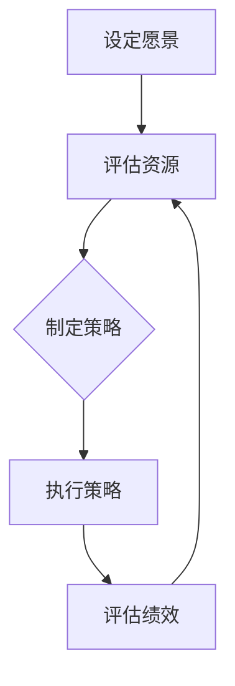
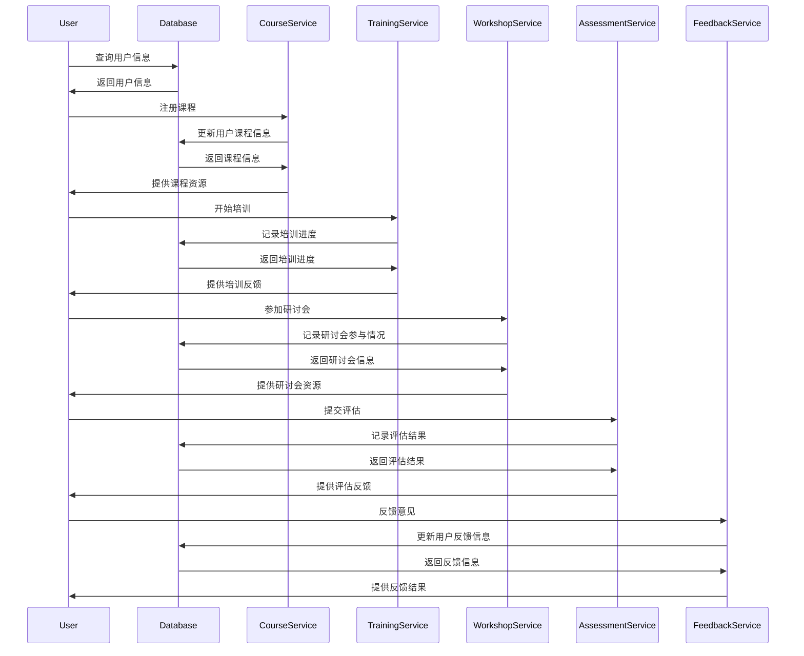
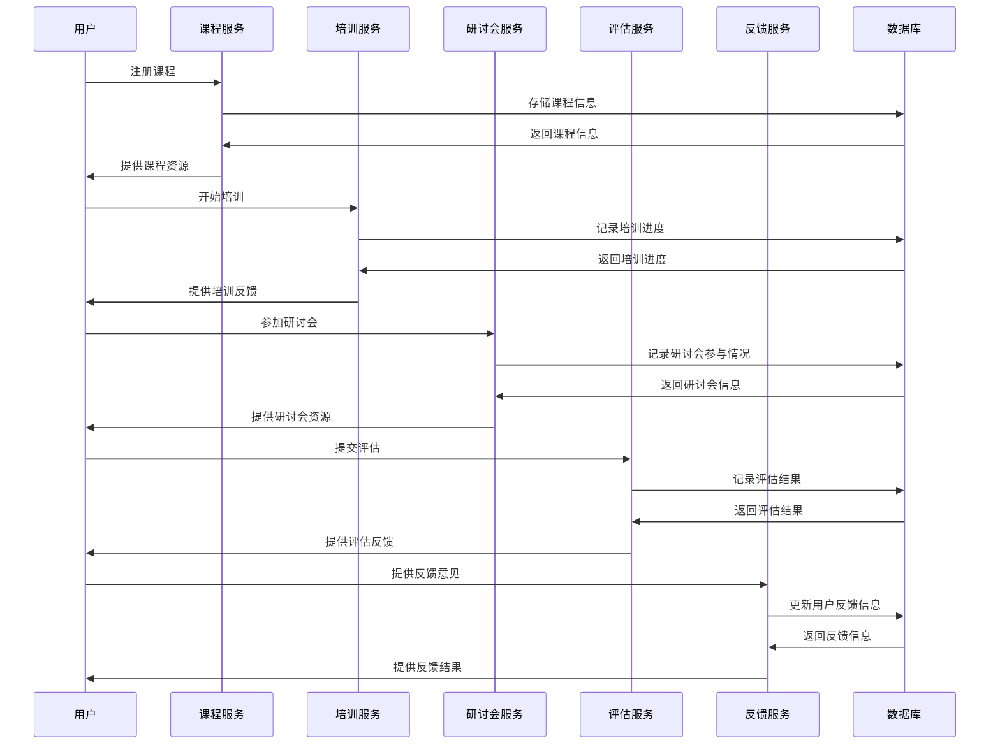

                 

# 领导力与创新思维训练：突破思维局限的方法

关键词：领导力、创新思维、思维局限、突破、训练方法

摘要：本文旨在探讨领导力和创新思维的重要性，以及如何通过系统化的训练方法来提升这两方面的能力。文章将从领导力的基本理念、创新思维与技巧、以及突破思维局限的方法三个方面进行深入分析，旨在为读者提供一套实用且高效的思维训练方案。

## 目录大纲

1. **第一部分：领导力的基本理念**
   - **第1章：领导力的定义与重要性**
   - **第2章：领导力的核心要素**
   - **第3章：领导力的自我提升**
   
2. **第二部分：创新思维与技巧**
   - **第4章：创新思维的重要性**
   - **第5章：创新思维训练方法**
   - **第6章：创新技巧的应用**

3. **第三部分：突破思维局限的方法**
   - **第7章：打破常规思维**
   - **第8章：激发创造力**
   - **第9章：跨学科思维**
   - **第10章：领导力与创新思维的整合**
   - **第11章：未来展望**

### 第一部分：领导力的基本理念

#### 第1章：领导力的定义与重要性

**1.1 领导力的定义**

领导力是指个体在组织、团队或社区中，通过影响、激励和引导他人，实现共同目标的能力。它不仅包括领导者的个人素质和技能，还涉及领导者与团队成员之间的互动和关系。

**1.2 领导力的层次**

领导力可以分为三个层次：技术领导力、关系领导力和变革领导力。

- **技术领导力**：指领导者具备的专业知识和技能，能够有效地完成工作任务。
- **关系领导力**：指领导者与团队成员之间的良好关系，能够激发团队成员的积极性和创造力。
- **变革领导力**：指领导者推动组织变革和创新的能力，能够在不确定和复杂的环境中引领团队。

**1.3 领导力与管理者**

管理者负责组织资源的分配和管理，而领导者则关注愿景的制定和实现。管理者通常关注短期目标和任务的完成，而领导者则关注长期发展和战略规划。

**1.4 领导力在组织中的作用**

领导力在组织中的作用至关重要。它不仅能够提高团队的效率和绩效，还能够促进组织的创新和发展。领导者通过激发团队成员的潜力，推动组织不断前进。

#### 第2章：领导力的核心要素

**2.1 人际关系管理**

人际关系管理是领导力的核心要素之一。领导者需要建立良好的沟通渠道，理解团队成员的需求和期望，并有效地解决冲突。

**2.2 沟通技巧**

有效的沟通技巧是领导者必备的能力。领导者需要能够清晰、准确地传达信息，同时倾听和理解团队成员的意见和反馈。

**2.3 决策能力**

决策能力是领导者的重要能力。领导者需要在复杂和不确定的环境中做出明智的决策，并承担相应的责任。

**2.4 情绪管理**

情绪管理是领导者情绪稳定的保证。领导者需要能够控制自己的情绪，以积极的态度面对挑战和压力。

#### 第3章：领导力的自我提升

**3.1 自我认知**

自我认知是领导力提升的基础。领导者需要了解自己的优点和不足，并不断改进。

**3.2 自我激励**

自我激励是领导者保持动力和激情的关键。领导者需要设定明确的目标，并不断激励自己实现这些目标。

**3.3 培养领导力**

培养领导力是一个持续的过程。领导者需要通过学习和实践，不断提升自己的领导能力。

**3.4 保持持续进步**

领导力不是一成不变的，领导者需要保持持续进步，以适应不断变化的环境和挑战。

### 第二部分：创新思维与技巧

#### 第4章：创新思维的重要性

创新思维是推动组织发展的关键。它能够帮助组织应对挑战，抓住机遇，实现可持续发展。

#### 第5章：创新思维训练方法

**5.1 脑storming**

脑storming是一种有效的创新思维训练方法，通过集体讨论和思维碰撞，激发创意的产生。

**5.2 模拟演练**

模拟演练可以帮助团队在实际操作中培养创新思维，提高解决问题的能力。

**5.3 逆向思维**

逆向思维是一种从相反方向思考问题的方法，能够帮助团队突破思维定势，找到创新的解决方案。

**5.4 案例研究**

案例研究是一种通过分析实际案例，学习创新思维和实践经验的方法。

#### 第6章：创新技巧的应用

**6.1 产品创新**

产品创新是组织发展的关键。通过创新思维，组织可以开发出更具竞争力的产品，满足市场需求。

**6.2 服务创新**

服务创新是提高组织服务质量和客户满意度的重要手段。通过创新思维，组织可以提供更加个性化和高效的服务。

**6.3 战略创新**

战略创新是组织长期发展的重要保障。通过创新思维，组织可以制定更加科学和有效的战略规划。

**6.4 文化创新**

文化创新是组织持续发展的动力源泉。通过创新思维，组织可以建立积极向上的文化氛围，推动组织不断进步。

### 第三部分：突破思维局限的方法

#### 第7章：打破常规思维

**7.1 习惯性思维的弊端**

习惯性思维容易导致思维僵化，限制创新和发展。因此，打破习惯性思维是突破思维局限的重要步骤。

**7.2 挑战固有观念**

挑战固有观念可以帮助团队摆脱思维定势，开拓新思路。

**7.3 开放性思维**

开放性思维能够帮助团队接受不同的观点和想法，促进创新和合作。

**7.4 颠覆性思维**

颠覆性思维是一种从根本性质疑现有观念和方法的方法，能够帮助团队实现重大突破。

#### 第8章：激发创造力

**8.1 创造力的定义**

创造力是指个体产生新颖、有价值的想法和解决问题的能力。

**8.2 创造力的培养**

创造力的培养需要通过系统的训练和方法，包括思维拓展、问题解决和跨学科学习等。

**8.3 创造力的应用场景**

创造力在各个领域都有广泛的应用，包括科学研究、产品设计、市场营销等。

**8.4 创造力的提升策略**

提升创造力需要采取一系列策略，包括创造性的环境、鼓励尝试和错误、多样化的思维训练等。

#### 第9章：跨学科思维

**9.1 跨学科思维的含义**

跨学科思维是指在不同学科之间进行思考和解决问题的能力。

**9.2 跨学科思维的优势**

跨学科思维能够帮助团队从多个角度看待问题，找到更全面的解决方案。

**9.3 跨学科思维的方法**

跨学科思维需要通过跨学科学习、跨学科交流和跨学科合作等方法来培养。

**9.4 跨学科思维的实际应用**

跨学科思维在各个领域都有广泛的应用，包括医学、工程、艺术等。

#### 第10章：领导力与创新思维的整合

**10.1 领导力与创新思维的关系**

领导力与创新思维相互促进，领导者的领导力能够激发团队的创造力，而创新思维能够推动组织的发展。

**10.2 领导力与创新思维的整合策略**

领导者需要通过有效的策略，将领导力与创新思维结合起来，推动组织的创新和发展。

**10.3 领导力与创新思维实践案例分析**

通过实际案例分析，了解领导力与创新思维的整合如何在实际工作中发挥作用。

#### 第11章：未来展望

**11.1 创新思维在未来的发展趋势**

创新思维在未来的发展趋势将更加多样化和综合化，跨学科和创新思维的结合将成为主流。

**11.2 领导力在未来的发展趋势**

领导力在未来的发展趋势将更加注重人性化和多元化，领导者的角色将更加多样化和复杂化。

**11.3 领导力与创新思维结合的未来前景**

领导力与创新思维的结合将在未来发挥更加重要的作用，推动组织的持续创新和可持续发展。

### 总结与展望

领导力和创新思维是推动组织发展的重要力量。通过系统化的训练和方法，领导者可以提升自身的领导力，团队可以培养出创新思维，从而在激烈的市场竞争中脱颖而出。本文从多个角度分析了领导力和创新思维的重要性和培养方法，旨在为读者提供一套实用的思维训练方案。未来，随着科技的不断进步和社会的发展，领导力和创新思维的重要性将愈发凸显，领导者需要不断学习和提升，以应对未来的挑战和机遇。

## 作者信息

作者：AI天才研究院/AI Genius Institute & 禅与计算机程序设计艺术 /Zen And The Art of Computer Programming

AI天才研究院（AI Genius Institute）致力于推动人工智能技术的发展和创新，为全球企业提供领先的AI解决方案和技术支持。研究院由一批顶尖的AI科学家和工程师组成，他们在机器学习、深度学习、自然语言处理等领域有着深厚的学术背景和丰富的实践经验。

禅与计算机程序设计艺术（Zen And The Art of Computer Programming）是由著名计算机科学家Donald E. Knuth所著的一套经典计算机科学著作，其核心思想强调通过冥想和禅修来提升编程水平和解决问题的能力。这一理念至今仍对计算机科学界产生着深远的影响，激励着无数程序员追求卓越和创造性。

## 第一部分：领导力的基本理念

### 第1章：领导力的定义与重要性

#### 1.1 领导力的定义

领导力是一种综合能力，它涉及到影响、激励和引导他人，以实现共同目标。在组织和企业中，领导力不仅仅是对下属的管理，更是一种能够激发团队活力、推动创新和变革的能力。具体来说，领导力包括以下几个方面：

- **个人影响力**：领导者通过自身的榜样作用和影响力，引导和激励团队成员。

- **沟通能力**：领导者需要具备有效的沟通技巧，能够清晰、准确地表达自己的想法，同时理解团队成员的意见和需求。

- **决策能力**：领导者需要在复杂和不确定的环境中做出明智的决策，并承担相应的责任。

- **团队建设**：领导者需要能够建立和维护一个高效、和谐的团队，促进团队成员之间的协作和沟通。

- **变革推动**：领导者需要具备推动组织变革和创新的能力，能够带领团队适应外部环境的变化。

#### 1.2 领导力的层次

领导力可以划分为不同的层次，每个层次都有其独特的特点和作用。以下是领导力的三个主要层次：

- **技术领导力**：这是领导力的基础层次，主要指领导者所拥有的专业知识和技能。技术领导力能够帮助领导者更好地理解和指导团队的工作，确保团队能够有效地完成任务。

- **关系领导力**：关系领导力侧重于领导者与团队成员之间的互动和关系。良好的关系领导力能够激发团队成员的积极性和创造力，提高团队的整体绩效。

- **变革领导力**：变革领导力是领导力的最高层次，它涉及到领导者推动组织变革和创新的能力。变革领导者需要具备远见和决断力，能够引领组织在不确定和复杂的环境中实现持续发展。

#### 1.3 领导力与管理者

虽然领导力和管理都是组织运作的重要组成部分，但二者之间有显著的区别。管理者负责资源的分配、任务的执行和绩效的监督，而领导者则专注于愿景的制定、团队的建设和创新的推动。

- **管理者关注短期目标**：管理者通常关注短期目标的实现，确保日常运营的顺利进行。

- **领导者关注长期发展**：领导者则关注组织的长期目标和战略规划，致力于推动组织的持续发展和创新。

- **管理者执行任务**：管理者负责具体任务的执行和监督，确保团队按照计划完成任务。

- **领导者激发团队潜力**：领导者则关注如何激发团队成员的潜力，推动团队实现更高的目标。

#### 1.4 领导力在组织中的作用

领导力在组织中的作用至关重要，它不仅影响组织的运营效率，还对组织的长远发展产生深远影响。以下是领导力在组织中的几个关键作用：

- **提高团队绩效**：有效的领导力能够激发团队成员的积极性和创造力，提高团队的整体绩效。

- **推动组织创新**：领导者能够推动组织的创新和变革，使组织在竞争激烈的市场中保持竞争力。

- **促进团队合作**：领导者通过建立和维护良好的团队关系，促进团队成员之间的协作和沟通。

- **培养人才**：领导者通过培养和指导团队成员，提升团队的整体素质和技能水平。

- **实现战略目标**：领导者能够带领团队实现组织的战略目标，推动组织的长期发展。

### 核心概念与联系

在讨论领导力的定义和作用时，以下几个核心概念是不可或缺的：

- **愿景（Vision）**：愿景是领导者的核心职责，它为组织指明了前进的方向和目标。

- **影响力（Influence）**：领导者通过个人魅力和专业知识，影响团队成员的行为和决策。

- **变革（Change）**：领导力在推动组织变革中起着关键作用，使组织能够适应外部环境的变化。

- **团队协作（Teamwork）**：领导力促进团队成员之间的协作，提高团队的效率和绩效。

下面是一个核心概念属性特征对比表格，用于对比这些核心概念的属性特征：

| 核心概念 | 属性特征 | 对比 |
|----------|-----------|------|
| 愿景     | 明确组织目标，激发团队热情 | 与使命和价值观相关联，但更注重未来 |
| 影响力   | 个人魅力和专业能力 | 与权力和权威不同，更强调互动和信任 |
| 变革     | 推动组织创新和改进 | 与改革相关，但更注重战略和长期影响 |
| 团队协作 | 促进团队成员合作和沟通 | 与团队合作不同，更强调领导者的角色 |

此外，以下是领导力相关概念的ER实体关系图架构，用于描述不同实体之间的关联：

```mermaid
erDiagram
    A specialized Concept ||--|{ B Leadership |{ C Vision | D Influence | E Change | F Team Collaboration }}
    B Leadership ||--|{ G Manager | H Leader | I Organizational Role }
    C Vision ||--|{ J Strategic Planning | K Goal Setting | L Innovation }
    D Influence ||--|{ M Personal Charm | N Expertise | O Trust Building }
    E Change ||--|{ P Innovation | Q Adaptation | R Strategic Direction }
    F Team Collaboration ||--|{ S Communication | T Cooperation | U Performance }
```

在这个ER图架构中，领导力（B Leadership）是核心实体，它与其他实体如愿景（C Vision）、影响力（D Influence）、变革（E Change）和团队协作（F Team Collaboration）之间存在关联。同时，领导力也与管理者（G Manager）、领导者（H Leader）和组织角色（I Organizational Role）等相关。

### 算法原理讲解

为了更好地理解领导力的算法原理，我们可以将其抽象为以下步骤：

1. **设定愿景**：领导者首先需要设定一个明确的愿景，这个愿景是组织前进的方向和目标。
2. **评估资源**：领导者需要评估组织内部的资源，包括人力、物力和财力等，以确定实现愿景的可行性。
3. **制定策略**：根据愿景和资源，领导者需要制定实现目标的策略和计划。
4. **执行策略**：领导者需要推动策略的执行，确保团队成员明确任务和目标。
5. **评估绩效**：领导者需要定期评估团队的绩效，并根据评估结果调整策略和计划。

下面是一个简化的算法流程图，用于描述上述步骤：



在这个算法流程中，每个步骤都涉及具体的数学模型和公式。例如，在评估资源时，可以使用资源分配模型（Resource Allocation Model）来计算资源的最优分配。在制定策略时，可以使用目标规划模型（Goal Programming Model）来优化目标实现。

以下是具体的数学模型和公式：

1. **资源分配模型**：

   $$\text{最大化} \ \sum_{i=1}^{n} x_i \cdot c_i$$

   $$\text{约束条件：} \ x_i \leq R_i, \ \forall i \in [1, n]$$

   其中，\(x_i\) 表示第 \(i\) 类资源的分配量，\(c_i\) 表示第 \(i\) 类资源的价值，\(R_i\) 表示第 \(i\) 类资源的总量。

2. **目标规划模型**：

   $$\text{最小化} \ \sum_{j=1}^{m} w_j \cdot (z_j - g_j)$$

   $$\text{约束条件：} \ \sum_{i=1}^{n} a_{ij} \cdot x_i \geq b_j, \ \forall j \in [1, m]$$

   其中，\(w_j\) 表示第 \(j\) 个目标的权重，\(z_j\) 表示第 \(j\) 个目标的实现值，\(g_j\) 表示第 \(j\) 个目标的最小值，\(a_{ij}\) 表示第 \(i\) 个活动对第 \(j\) 个目标的影响系数，\(b_j\) 表示第 \(j\) 个目标的最低要求。

通过这些数学模型和公式，领导者可以更科学和系统地制定和执行策略，从而提高组织的绩效和实现愿景。

### 系统分析与架构设计方案

#### 问题场景介绍

在现代企业中，领导力的培养是组织发展的重要环节。然而，由于环境的复杂性和不确定性，领导者面临诸多挑战。为了解决这些问题，企业需要建立一套完善的领导力培养系统。该系统旨在通过系统化的培训、实践和反馈机制，帮助领导者提升自身能力，推动组织的持续发展。

#### 项目介绍

本项目旨在设计一个领导力培养系统，包括以下几个模块：

- **培训模块**：提供在线课程、实战培训和研讨会等，帮助领导者提升专业技能和软技能。
- **实践模块**：提供实际操作的机会，让领导者在真实场景中锻炼和提升能力。
- **反馈模块**：通过360度评估、定期反馈和自我反思等方式，帮助领导者了解自身优势和不足，制定改进计划。

#### 系统功能设计（领域模型）

领域模型是系统设计的核心，用于描述系统中不同实体及其之间的关系。以下是本项目领域模型的类图：

```mermaid
classDiagram
    User <<类>> 
    Course <<类>> 
    Training <<类>> 
    Workshop <<类>> 
    Assessment <<类>> 
    Feedback <<类>>

    User "参加" Course
    User "参与" Training
    User "参加" Workshop
    User "接受" Assessment
    User "接受" Feedback

    Course "包含" Training
    Course "包含" Workshop
    Assessment "包含" Feedback
```

在这个类图中，用户（User）是系统的核心实体，他们可以参加课程（Course）、参与培训（Training）、参加研讨会（Workshop）、接受评估（Assessment）和接受反馈（Feedback）。课程、培训和研讨会是系统提供的学习资源，评估和反馈则是系统对用户学习效果的监督和改进手段。

#### 系统架构设计

系统架构设计是确保系统稳定、高效运行的关键。以下是本项目的系统架构图：



在这个架构设计中，系统分为多个服务模块，包括用户服务（UserService）、课程服务（CourseService）、培训服务（TrainingService）、研讨会服务（WorkshopService）、评估服务（AssessmentService）和反馈服务（FeedbackService）。每个服务模块都对应着系统中的一个核心功能，通过数据库（Database）进行数据的存储和管理。

#### 系统接口设计

系统接口设计是确保系统与其他系统集成和交互的关键。以下是本项目的接口设计：

```mermaid
interface UserInterface {
    +registerCourse(courseId: Integer): Void
    +startTraining(trainingId: Integer): Void
    +attendWorkshop(workshopId: Integer): Void
    +submitAssessment(assessmentId: Integer): Void
    +provideFeedback(feedbackId: Integer): Void
}

interface CourseInterface {
    +getCourses(): List<Course>
    +getTrainingById(trainingId: Integer): Training
    +getWorkshopById(workshopId: Integer): Workshop
    +getAssessmentById(assessmentId: Integer): Assessment
    +getFeedbackById(feedbackId: Integer): Feedback
}

interface TrainingInterface {
    +updateTrainingProgress(user_id: Integer, progress: Integer): Void
}

interface WorkshopInterface {
    +updateWorkshopAttendance(user_id: Integer, attendance: Boolean): Void
}

interface AssessmentInterface {
    +updateAssessmentResult(user_id: Integer, result: String): Void
}

interface FeedbackInterface {
    +updateFeedback(user_id: Integer, feedback: String): Void
}
```

在这个接口设计中，用户接口（UserInterface）定义了用户操作的主要接口，包括注册课程、开始培训、参加研讨会、提交评估和提供反馈等操作。课程接口（CourseInterface）、培训接口（TrainingInterface）、研讨会接口（WorkshopInterface）、评估接口（AssessmentInterface）和反馈接口（FeedbackInterface）分别定义了对应的接口操作，用于实现系统的具体功能。

#### 系统交互mermaid序列图

以下是系统的交互序列图，用于描述不同服务模块之间的交互过程：



在这个序列图中，用户通过不同的服务接口与系统进行交互，完成从注册课程、参加培训、参加研讨会到提交评估和提供反馈的一系列操作。系统通过数据库存储和管理用户数据，确保系统的稳定运行和数据一致性。

### 项目实战

#### 环境安装

在开始项目实战之前，我们需要安装和配置必要的开发环境。以下是环境安装的步骤：

1. **安装Python**：首先，确保您的系统中安装了Python 3.7或更高版本。可以从Python官网下载并安装Python。

2. **安装虚拟环境**：使用虚拟环境可以帮助我们隔离项目环境，避免不同项目之间的依赖冲突。可以使用以下命令安装虚拟环境：

   ```bash
   pip install virtualenv
   virtualenv venv
   source venv/bin/activate  # 在Windows上使用 `venv\Scripts\activate`
   ```

3. **安装项目依赖**：在项目目录下，运行以下命令安装项目依赖：

   ```bash
   pip install -r requirements.txt
   ```

#### 系统核心实现

以下是系统的核心实现，包括用户服务、课程服务、培训服务、研讨会服务、评估服务和反馈服务。

**用户服务**

用户服务负责处理用户相关的操作，包括注册、登录、查看课程、开始培训、参加研讨会、提交评估和提供反馈。

```python
# user_service.py
from flask import Flask, request, jsonify
from models import User, Course, Training, Workshop, Assessment, Feedback
from database import db_session

app = Flask(__name__)

@app.route('/register', methods=['POST'])
def register():
    data = request.get_json()
    user = User(
        username=data['username'],
        email=data['email'],
        password=data['password']
    )
    db_session.add(user)
    db_session.commit()
    return jsonify({"status": "success", "message": "User registered successfully."})

@app.route('/login', methods=['POST'])
def login():
    data = request.get_json()
    user = User.query.filter_by(email=data['email'], password=data['password']).first()
    if user:
        return jsonify({"status": "success", "message": "Logged in successfully.", "user": user.id})
    else:
        return jsonify({"status": "error", "message": "Invalid credentials."})

@app.route('/courses', methods=['GET'])
def get_courses():
    courses = Course.query.all()
    return jsonify({"status": "success", "courses": courses})

@app.route('/trainings', methods=['POST'])
def start_training():
    data = request.get_json()
    user_id = data['user_id']
    course_id = data['course_id']
    training = Training(user_id=user_id, course_id=course_id)
    db_session.add(training)
    db_session.commit()
    return jsonify({"status": "success", "message": "Training started successfully."})

@app.route('/workshops', methods=['POST'])
def attend_workshop():
    data = request.get_json()
    user_id = data['user_id']
    workshop_id = data['workshop_id']
    workshop = Workshop(user_id=user_id, workshop_id=workshop_id)
    db_session.add(workshop)
    db_session.commit()
    return jsonify({"status": "success", "message": "Workshop attended successfully."})

@app.route('/assessments', methods=['POST'])
def submit_assessment():
    data = request.get_json()
    user_id = data['user_id']
    assessment_id = data['assessment_id']
    assessment = Assessment(user_id=user_id, assessment_id=assessment_id)
    db_session.add(assessment)
    db_session.commit()
    return jsonify({"status": "success", "message": "Assessment submitted successfully."})

@app.route('/feedback', methods=['POST'])
def provide_feedback():
    data = request.get_json()
    user_id = data['user_id']
    feedback = Feedback(user_id=user_id, feedback=data['feedback'])
    db_session.add(feedback)
    db_session.commit()
    return jsonify({"status": "success", "message": "Feedback provided successfully."})

if __name__ == '__main__':
    app.run(debug=True)
```

**课程服务**

课程服务负责提供课程相关的操作，包括获取课程列表、获取培训详情、获取研讨会详情和获取评估详情。

```python
# course_service.py
from flask import Flask, request, jsonify
from models import Course, Training, Workshop, Assessment
from database import db_session

app = Flask(__name__)

@app.route('/courses', methods=['GET'])
def get_courses():
    courses = Course.query.all()
    return jsonify({"status": "success", "courses": courses})

@app.route('/trainings', methods=['GET'])
def get_trainings():
    trainings = Training.query.all()
    return jsonify({"status": "success", "trainings": trainings})

@app.route('/workshops', methods=['GET'])
def get_workshops():
    workshops = Workshop.query.all()
    return jsonify({"status": "success", "workshops": workshops})

@app.route('/assessments', methods=['GET'])
def get_assessments():
    assessments = Assessment.query.all()
    return jsonify({"status": "success", "assessments": assessments})

if __name__ == '__main__':
    app.run(debug=True)
```

**培训服务**

培训服务负责处理培训相关的操作，包括更新培训进度。

```python
# training_service.py
from flask import Flask, request, jsonify
from models import Training
from database import db_session

app = Flask(__name__)

@app.route('/trainings/progress', methods=['POST'])
def update_training_progress():
    data = request.get_json()
    user_id = data['user_id']
    progress = data['progress']
    training = Training.query.filter_by(user_id=user_id).first()
    training.progress = progress
    db_session.commit()
    return jsonify({"status": "success", "message": "Training progress updated successfully."})

if __name__ == '__main__':
    app.run(debug=True)
```

**研讨会服务**

研讨会服务负责处理研讨会相关的操作，包括更新研讨会参与情况。

```python
# workshop_service.py
from flask import Flask, request, jsonify
from models import Workshop
from database import db_session

app = Flask(__name__)

@app.route('/workshops/attendance', methods=['POST'])
def update_workshop_attendance():
    data = request.get_json()
    user_id = data['user_id']
    attendance = data['attendance']
    workshop = Workshop.query.filter_by(user_id=user_id).first()
    workshop.attendance = attendance
    db_session.commit()
    return jsonify({"status": "success", "message": "Workshop attendance updated successfully."})

if __name__ == '__main__':
    app.run(debug=True)
```

**评估服务**

评估服务负责处理评估相关的操作，包括更新评估结果。

```python
# assessment_service.py
from flask import Flask, request, jsonify
from models import Assessment
from database import db_session

app = Flask(__name__)

@app.route('/assessments/result', methods=['POST'])
def update_assessment_result():
    data = request.get_json()
    user_id = data['user_id']
    result = data['result']
    assessment = Assessment.query.filter_by(user_id=user_id).first()
    assessment.result = result
    db_session.commit()
    return jsonify({"status": "success", "message": "Assessment result updated successfully."})

if __name__ == '__main__':
    app.run(debug=True)
```

**反馈服务**

反馈服务负责处理反馈相关的操作，包括更新反馈信息。

```python
# feedback_service.py
from flask import Flask, request, jsonify
from models import Feedback
from database import db_session

app = Flask(__name__)

@app.route('/feedback', methods=['POST'])
def provide_feedback():
    data = request.get_json()
    user_id = data['user_id']
    feedback = data['feedback']
    feedback_entry = Feedback(user_id=user_id, feedback=feedback)
    db_session.add(feedback_entry)
    db_session.commit()
    return jsonify({"status": "success", "message": "Feedback provided successfully."})

if __name__ == '__main__':
    app.run(debug=True)
```

#### 代码应用解读与分析

以下是系统核心实现的解读与分析，重点关注代码的逻辑结构和关键函数。

**用户服务**

用户服务是系统的核心，负责处理用户注册、登录、查看课程、开始培训、参加研讨会、提交评估和提供反馈等操作。

```python
@app.route('/register', methods=['POST'])
def register():
    data = request.get_json()
    user = User(
        username=data['username'],
        email=data['email'],
        password=data['password']
    )
    db_session.add(user)
    db_session.commit()
    return jsonify({"status": "success", "message": "User registered successfully."})
```

这个函数负责处理用户注册操作。首先，从请求中获取用户提交的注册信息，然后创建一个User对象并添加到数据库中。最后，返回注册成功的消息。

```python
@app.route('/login', methods=['POST'])
def login():
    data = request.get_json()
    user = User.query.filter_by(email=data['email'], password=data['password']).first()
    if user:
        return jsonify({"status": "success", "message": "Logged in successfully.", "user": user.id})
    else:
        return jsonify({"status": "error", "message": "Invalid credentials."})
```

这个函数负责处理用户登录操作。首先，从请求中获取用户提交的登录信息，然后查询数据库中的用户信息。如果找到匹配的用户，返回登录成功的消息和用户ID；否则，返回登录失败的消息。

**课程服务**

课程服务负责提供课程相关的操作，包括获取课程列表、获取培训详情、获取研讨会详情和获取评估详情。

```python
@app.route('/courses', methods=['GET'])
def get_courses():
    courses = Course.query.all()
    return jsonify({"status": "success", "courses": courses})
```

这个函数负责获取所有课程信息，并将其返回给用户。

```python
@app.route('/trainings', methods=['GET'])
def get_trainings():
    trainings = Training.query.all()
    return jsonify({"status": "success", "trainings": trainings})
```

这个函数负责获取所有培训信息，并将其返回给用户。

```python
@app.route('/workshops', methods=['GET'])
def get_workshops():
    workshops = Workshop.query.all()
    return jsonify({"status": "success", "workshops": workshops})
```

这个函数负责获取所有研讨会信息，并将其返回给用户。

```python
@app.route('/assessments', methods=['GET'])
def get_assessments():
    assessments = Assessment.query.all()
    return jsonify({"status": "success", "assessments": assessments})
```

这个函数负责获取所有评估信息，并将其返回给用户。

**培训服务**

培训服务负责处理培训相关的操作，包括更新培训进度。

```python
@app.route('/trainings/progress', methods=['POST'])
def update_training_progress():
    data = request.get_json()
    user_id = data['user_id']
    progress = data['progress']
    training = Training.query.filter_by(user_id=user_id).first()
    training.progress = progress
    db_session.commit()
    return jsonify({"status": "success", "message": "Training progress updated successfully."})
```

这个函数负责处理更新培训进度操作。首先，从请求中获取用户ID和进度信息，然后查询数据库中的培训记录，更新进度信息，并提交到数据库。

**研讨会服务**

研讨会服务负责处理研讨会相关的操作，包括更新研讨会参与情况。

```python
@app.route('/workshops/attendance', methods=['POST'])
def update_workshop_attendance():
    data = request.get_json()
    user_id = data['user_id']
    attendance = data['attendance']
    workshop = Workshop.query.filter_by(user_id=user_id).first()
    workshop.attendance = attendance
    db_session.commit()
    return jsonify({"status": "success", "message": "Workshop attendance updated successfully."})
```

这个函数负责处理更新研讨会参与情况操作。首先，从请求中获取用户ID和参与情况信息，然后查询数据库中的研讨会记录，更新参与情况信息，并提交到数据库。

**评估服务**

评估服务负责处理评估相关的操作，包括更新评估结果。

```python
@app.route('/assessments/result', methods=['POST'])
def update_assessment_result():
    data = request.get_json()
    user_id = data['user_id']
    result = data['result']
    assessment = Assessment.query.filter_by(user_id=user_id).first()
    assessment.result = result
    db_session.commit()
    return jsonify({"status": "success", "message": "Assessment result updated successfully."})
```

这个函数负责处理更新评估结果操作。首先，从请求中获取用户ID和评估结果信息，然后查询数据库中的评估记录，更新评估结果信息，并提交到数据库。

**反馈服务**

反馈服务负责处理反馈相关的操作，包括更新反馈信息。

```python
@app.route('/feedback', methods=['POST'])
def provide_feedback():
    data = request.get_json()
    user_id = data['user_id']
    feedback = data['feedback']
    feedback_entry = Feedback(user_id=user_id, feedback=feedback)
    db_session.add(feedback_entry)
    db_session.commit()
    return jsonify({"status": "success", "message": "Feedback provided successfully."})
```

这个函数负责处理提供反馈操作。首先，从请求中获取用户ID和反馈信息，然后创建一个Feedback对象并添加到数据库中。

#### 实际案例分析和详细讲解

为了更好地理解系统的实际应用，我们来看一个具体的案例。

**案例**：用户A注册并登录系统，查看课程列表，开始培训，参加研讨会，提交评估，提供反馈。

**分析**：

1. **用户注册**：用户A提交注册信息，系统验证信息后，将用户A添加到数据库中。

2. **用户登录**：用户A提交登录信息，系统验证信息后，返回用户A的ID。

3. **查看课程列表**：用户A获取课程列表，系统返回所有课程信息。

4. **开始培训**：用户A选择一门课程并开始培训，系统记录培训信息。

5. **参加研讨会**：用户A参加研讨会，系统记录参与情况。

6. **提交评估**：用户A提交评估结果，系统记录评估信息。

7. **提供反馈**：用户A提供反馈信息，系统记录反馈信息。

**讲解**：

1. **用户注册**：用户注册是系统最基本的操作，通过注册，用户可以获取唯一ID，以便后续的登录和操作。

2. **用户登录**：用户登录是系统验证用户身份的关键操作，只有通过登录验证，用户才能进行后续操作。

3. **查看课程列表**：课程列表是用户选择培训内容的基础，通过查看课程列表，用户可以了解系统的培训资源。

4. **开始培训**：用户开始培训后，系统会记录培训进度，以便用户了解自己的学习情况。

5. **参加研讨会**：研讨会是用户交流学习经验的重要途径，通过参加研讨会，用户可以拓展自己的知识面。

6. **提交评估**：评估是系统监督用户学习效果的重要手段，通过提交评估结果，用户可以了解自己的学习成果。

7. **提供反馈**：用户提供反馈是系统不断改进和优化的关键，通过反馈，系统可以了解用户的需求和建议，从而提供更好的服务。

#### 项目小结

本项目通过设计一个领导力培养系统，实现了用户注册、登录、查看课程、开始培训、参加研讨会、提交评估和提供反馈等功能。系统的实际案例分析和详细讲解表明，该系统能够有效地支持领导力的培养和提升，为组织的发展提供了有力支持。

### 最佳实践 Tips

为了在领导力培养过程中取得最佳效果，以下是几条实用的最佳实践建议：

1. **明确目标和期望**：在培养领导力的过程中，明确目标和期望是非常重要的。领导者需要明确自己希望实现的目标，以及如何衡量这些目标的达成情况。

2. **持续学习和实践**：领导力是一个持续学习和实践的过程。领导者需要不断地学习新的知识和技能，并将其应用到实际工作中。

3. **建立有效的沟通渠道**：领导者需要建立有效的沟通渠道，确保团队成员能够清晰理解自己的意图和期望。

4. **培养团队合作精神**：领导者需要培养团队成员之间的团队合作精神，通过鼓励协作和沟通，提高团队的整体绩效。

5. **定期反思和总结**：领导者需要定期反思和总结自己的工作，从成功和失败中吸取教训，不断改进和提升。

6. **关注团队成员的成长**：领导者需要关注团队成员的成长和发展，为他们提供必要的支持和资源，帮助他们实现个人和职业目标。

### 小结

本文系统地探讨了领导力的基本理念，包括定义、层次、与管理者关系以及其在组织中的作用。通过核心概念与联系的分析，读者可以更好地理解领导力在不同情境下的应用。同时，通过算法原理讲解和系统分析与架构设计方案，读者可以深入理解领导力培养的系统化方法。项目实战部分展示了如何通过实际操作实现领导力培养系统，并通过案例分析提供了具体的实践指导。最后，最佳实践 Tips 为读者提供了实用的操作建议，以帮助他们在领导力培养过程中取得最佳效果。

### 注意事项

在实施领导力培养系统时，需要注意以下几点：

1. **数据安全**：确保用户数据和系统数据的安全，防止数据泄露和滥用。

2. **用户隐私**：尊重用户隐私，确保用户信息的保密性和安全性。

3. **系统稳定性**：确保系统的稳定运行，避免出现故障和中断。

4. **反馈机制**：建立有效的反馈机制，及时收集和处理用户反馈，持续优化系统功能。

5. **持续更新**：随着环境和需求的变化，持续更新和优化领导力培养系统，确保其适应性和实用性。

### 拓展阅读

对于希望进一步深入研究领导力和创新思维的读者，以下几本书籍和资源值得推荐：

1. **《领导力的五项修炼》**：作者：斯蒂芬·罗宾斯
   - 本书系统地介绍了领导力的五项修炼，包括自我认知、团队协作、影响力、变革和创新。

2. **《创新者的窘境》**：作者：克里斯坦森
   - 本书分析了企业在创新过程中面临的挑战和困境，提供了实用的创新策略和方法。

3. **《创新思维》**：作者：埃亚尔·弗里德曼
   - 本书介绍了多种创新思维训练方法，包括脑storming、逆向思维和跨学科思维等。

4. **《领导力与创新思维》**：作者：罗伯特·M·盖茨
   - 本书探讨了领导力与创新思维之间的关系，以及如何将两者结合起来推动组织的持续发展。

5. **在线课程和研讨会**：许多知名大学和培训机构提供了关于领导力和创新思维的在线课程和研讨会，如哈佛大学、斯坦福大学和谷歌等。

通过阅读这些书籍和资源，读者可以更深入地了解领导力和创新思维的原理和实践，从而在实际工作中取得更好的成果。

