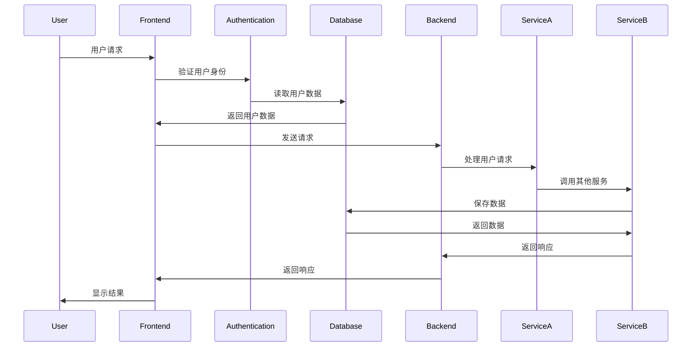
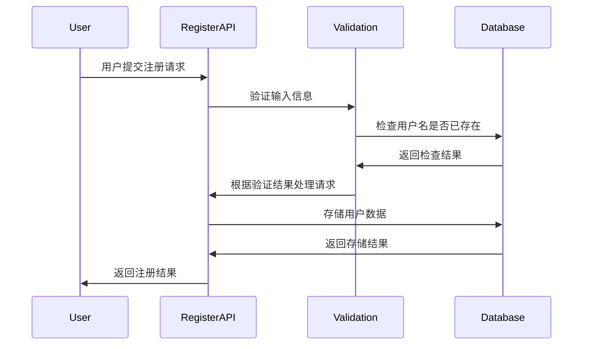

                 


### 文章标题

# 领导力与创新思维：引领团队突破的能力

### 关键词

- 领导力
- 创新思维
- 团队建设
- 管理方法
- 组织变革

### 摘要

本文旨在探讨领导力与创新思维在团队突破中的关键作用。我们将首先介绍领导力的核心概念及其在团队中的重要性，随后深入分析创新思维的本质及其与领导力的关系。通过案例研究和实证分析，我们将阐述如何将领导力与创新思维结合起来，以实现团队的突破性发展。

---

## 引言

在当今快速变化和竞争激烈的环境中，领导力不再仅仅是维持现状的能力，而是引领团队突破、实现创新和持续成长的关键。随着信息技术和全球化进程的加速，企业面临着前所未有的挑战和机遇。传统的领导力模式往往侧重于控制和管理，这在一定程度上限制了团队的创造力和创新能力。

### 问题背景

领导力的重要性在于它能够激发团队成员的潜力，推动他们超越自身舒适区，实现更高的绩效。然而，传统的领导力方法往往忽视了创新思维的重要性。创新思维是指通过开放性、探索性和实验性来寻找新的解决方案和机会。在快速变化的市场环境中，创新思维成为组织生存和发展的关键。

### 问题描述

领导力与创新思维的结合面临以下几个问题：

1. **传统领导力的局限性**：传统领导力方法往往侧重于控制和指挥，难以激发团队创新潜力。
2. **创新思维的价值**：创新思维可以帮助领导者发现新的机会、解决问题和推动变革。
3. **培养创新思维的方法**：领导者需要通过培训、实践和反馈来提高创新思维能力。

### 问题解决

要解决上述问题，领导者需要培养和运用创新思维，将其与领导力相结合。这包括：

1. **领导力培训**：通过培训提高领导者的创新思维能力和领导力水平。
2. **实践与创新**：领导者需要在实际工作中不断尝试新的方法和策略，以激发团队的创造力。
3. **反馈与改进**：领导者需要通过反馈和改进来不断优化团队的创新过程。

### 边界与外延

在讨论领导力与创新思维时，我们需要明确以下几个边界和概念：

1. **领导力**：包括个人领导能力、团队领导能力和组织领导能力。
2. **创新思维**：包括创造力、批判性思维、系统思维和设计思维。
3. **团队建设**：涉及团队的目标设定、沟通协作和成员发展。

### 概念结构与核心要素组成

1. **领导力**：
   - **影响力**：领导者通过言行影响团队成员。
   - **沟通能力**：领导者需要清晰、有效地传达信息。
   - **决策能力**：领导者需要做出明智、及时的决定。
   - **激励能力**：领导者需要激发团队成员的积极性和创造力。

2. **创新思维**：
   - **开放性**：领导者需要保持开放的心态，接受新的想法和观点。
   - **探索性**：领导者需要鼓励团队成员探索未知的领域。
   - **实验性**：领导者需要支持团队成员进行实验和尝试。
   - **适应能力**：领导者需要灵活应对变化和挑战。

### 本章小结

通过本章的介绍，我们了解了领导力与创新思维的核心概念及其在现代社会中的重要性。接下来，本书将深入探讨如何培养和运用创新思维来提升领导力，实现团队的突破性发展。

---

## 核心概念与联系

在深入探讨领导力与创新思维之前，我们需要明确这两个核心概念的定义、特征及其相互关系。

### 领导力概念原理

领导力是指个人或集体通过影响力、沟通能力和决策能力来引导和激励他人实现共同目标的能力。以下是领导力的一些关键概念原理：

1. **影响力**：领导者通过言行影响团队成员，使其愿意为实现共同目标而努力。
2. **沟通能力**：领导者需要清晰、有效地传达信息，确保团队成员理解并支持组织的愿景和目标。
3. **决策能力**：领导者需要做出明智、及时的决定，以应对不断变化的环境和挑战。
4. **激励能力**：领导者需要激发团队成员的积极性和创造力，使其在困难面前保持高昂的斗志。

### 创新思维概念原理

创新思维是指通过创造力、批判性思维、系统思维和设计思维来寻找新的解决方案和机会。以下是创新思维的一些关键概念原理：

1. **创造力**：创新思维的核心在于创造力，它使领导者能够提出新颖的想法和解决方案。
2. **批判性思维**：领导者需要具备批判性思维，对现有问题和解决方案进行深入分析和评估。
3. **系统思维**：领导者需要从整体上看待问题，理解不同因素之间的相互作用和影响。
4. **设计思维**：领导者需要运用设计思维，通过迭代和反馈来改进和创新。

### 概念属性特征对比表格

为了更好地理解领导力与创新思维的概念原理，我们可以通过以下属性特征对比表格进行详细分析：

| 特征         | 传统领导力 | 创新领导力 |
| ------------ | ----------- | ----------- |
| 控制与指挥   | 强调控制    | 强调引导    |
| 情境适应     | 固定型      | 反应型/适应型 |
| 目标实现     | 预设目标    | 创设目标    |
| 员工发展     | 过程控制    | 培养潜力    |

| 特征         | 传统思维 | 创新思维 |
| ------------ | -------- | -------- |
| 解决问题     | 完美主义 | 实用主义 |
| 观点开放性   | 保守      | 开放      |
| 系统思维     | 狭隘      | 整体      |
| 实验与验证   | 谨慎      | 冒险      |

### ER实体关系图架构

为了展示领导力与创新思维之间的关键联系，我们可以使用ER实体关系图来描述它们之间的相互作用。以下是ER图的示例：

```mermaid
erDiagram
    Leadership ||--|{ InnovativeThinking }||> Innovation
    Leadership ||--|{ TeamDevelopment }||> Development
    InnovativeThinking ||--|{ ProblemSolving }||> Solve
    InnovativeThinking ||--|{ Creativity }||> Creativity
    TeamDevelopment ||--|{ EmployeeEngagement }||> Engagement
```

通过本章，我们深入理解了领导力和创新思维的核心概念及其相互关系。接下来，我们将进一步探讨如何将创新思维应用于领导力实践，以实现团队的突破性发展。

---

## 领导力与创新思维的实践应用

领导力与创新思维的结合在团队实践中具有重要意义。通过以下案例和实证分析，我们将探讨如何在实际工作中运用这些概念，以推动团队的发展。

### 案例研究1：苹果公司的创新文化

苹果公司以其创新的产品和卓越的领导力而闻名。乔布斯作为苹果的创始人之一，具备强大的领导力和创新思维。以下是苹果公司如何结合领导力与创新思维的案例：

1. **领导力**：乔布斯通过其远见和影响力，将团队的注意力集中在创新和卓越上。他经常亲自参与产品的设计和开发，确保团队始终朝着正确的方向前进。
2. **创新思维**：乔布斯具备强大的创造力，他能够从不同角度思考问题，并提出独特的解决方案。此外，他鼓励团队成员发挥自己的创造力，提出新的想法和改进建议。
3. **实践效果**：乔布斯的领导力和创新思维使得苹果公司成为全球最具创新力的企业之一，其产品在市场上取得了巨大成功。

### 案例研究2：谷歌的“20%时间”政策

谷歌的“20%时间”政策是一个典型的创新思维实践案例。这个政策允许员工在日常工作之外，用20%的时间来追求自己的创意项目。以下是谷歌如何运用领导力与创新思维的案例：

1. **领导力**：谷歌的领导层认识到创新思维的重要性，因此他们为员工提供了足够的自由和支持，以追求自己的创意。这种领导方式鼓励员工发挥主观能动性，提出新的想法和解决方案。
2. **创新思维**：通过“20%时间”政策，谷歌员工得以尝试新的项目和方法，这些尝试不仅激发了员工的创造力，还带来了许多创新的产品和服务。
3. **实践效果**：谷歌的“20%时间”政策在员工中激发了创新热情，推动了公司的发展。许多知名产品，如Gmail和AdSense，都源于这个政策。

### 实证分析

除了具体的案例，还有一些实证研究表明，领导力与创新思维的结合对团队绩效和创新能力有显著影响。以下是几项实证分析的结果：

1. **领导力对创新能力的影响**：研究表明，领导者的支持、鼓励和信任对员工的创新能力有积极影响。当领导者表现出开放性和适应性时，员工更愿意提出新的想法和解决方案。
2. **创新思维对团队绩效的影响**：研究表明，具有创新思维的团队在解决问题、应对挑战和实现目标方面表现更出色。创新思维有助于团队发现新的机会，提高市场竞争力。

### 实践建议

基于上述案例和实证分析，以下是一些建议，以帮助领导者将领导力与创新思维相结合，实现团队突破：

1. **建立创新文化**：领导者需要营造一个鼓励创新和接受失败的文化氛围，使员工敢于尝试新事物。
2. **提供培训和支持**：领导者可以为员工提供创新思维和领导力的培训，帮助他们提高相关技能。
3. **授权与信任**：领导者需要授权员工，给予他们足够的自由和资源来追求自己的创意项目。
4. **鼓励团队合作**：领导者应鼓励团队成员之间的合作和沟通，促进知识共享和创新能力。
5. **持续反馈与改进**：领导者需要通过反馈和改进来不断优化团队的创新过程，确保创新思维能够持续发挥作用。

通过实践这些建议，领导者可以有效地将领导力与创新思维相结合，推动团队实现突破性发展。

---

## 领导力与创新思维的结合：关键要素和策略

领导力与创新思维的结合是实现团队突破的关键。以下我们将探讨关键要素和策略，帮助领导者有效融合这两种能力。

### 关键要素1：领导者的角色转变

领导者需要从传统的指挥者角色转变为激励者和指导者。这意味着领导者需要关注团队成员的需求和潜力，提供必要的支持和资源，帮助他们发挥创造力。以下是一些建议：

1. **倾听与沟通**：领导者需要倾听团队成员的想法和意见，建立有效的沟通机制，确保信息的畅通。
2. **提供反馈**：领导者应给予团队成员及时的反馈，鼓励他们不断改进和创新。
3. **授权与信任**：领导者应授权团队成员，让他们在创新过程中拥有足够的自由和决策权。

### 关键要素2：创新思维的培养

创新思维是领导力的重要组成部分。以下是一些建议，以帮助领导者培养和提升创新思维能力：

1. **持续学习**：领导者需要不断学习新知识、新技能，以保持思维的开放性和灵活性。
2. **鼓励尝试和失败**：领导者应鼓励团队成员勇于尝试新方法，并接受失败，从失败中学习和成长。
3. **建立创新机制**：领导者可以建立创新机制，如定期举办创新工作坊、设立创新奖项等，以激发团队的创造力。

### 关键要素3：团队文化的建设

团队文化对于领导力与创新思维的结合至关重要。以下是一些建议，以帮助领导者建设积极的团队文化：

1. **鼓励开放和包容**：领导者应鼓励团队成员表达不同的观点和意见，建立包容、开放的团队氛围。
2. **培养协作精神**：领导者可以组织团队活动，加强团队成员之间的协作和信任。
3. **强调共同目标**：领导者应确保团队成员明确共同的目标和愿景，以此为指导，推动团队发展。

### 策略1：建立创新团队

领导者可以建立专门的创新团队，负责探索新的机会和解决问题。以下是一些建议：

1. **选拔人才**：领导者应选拔具有创新能力和团队协作精神的人才，组建创新团队。
2. **明确职责**：创新团队的职责应明确，确保团队成员有清晰的使命和目标。
3. **提供资源**：领导者应确保创新团队有足够的资源和支持，以开展创新工作。

### 策略2：实施迭代式创新

迭代式创新是一种持续改进和创新的方法。以下是一些建议：

1. **设定目标和指标**：领导者应设定明确的目标和指标，以衡量创新工作的进展和成果。
2. **快速迭代**：领导者应鼓励团队成员快速迭代，不断改进和创新。
3. **收集反馈**：领导者应收集团队成员和用户的反馈，用于改进创新工作。

### 策略3：跨部门合作

跨部门合作可以促进知识的共享和创新的产生。以下是一些建议：

1. **建立合作机制**：领导者可以建立跨部门合作机制，如定期会议、项目合作等。
2. **共享资源**：领导者应确保跨部门团队有足够的资源和信息共享。
3. **共同目标**：领导者应确保跨部门团队有共同的目标和愿景，以推动合作。

通过以上关键要素和策略，领导者可以有效地将领导力与创新思维相结合，推动团队实现突破性发展。

---

## 项目实战：领导力与创新思维的实际应用

在本节中，我们将通过一个实际项目来展示领导力与创新思维的结合应用，从项目背景、系统功能设计、系统架构设计到实际案例分析和项目小结。

### 项目背景

某互联网公司希望开发一款新型社交媒体应用，该应用旨在提高用户互动和社区参与度。公司决定采用敏捷开发方法，结合领导力与创新思维来推动项目的成功。

### 系统功能设计

首先，项目团队进行了系统功能设计，定义了以下核心功能：

1. **用户注册与登录**：提供用户注册、登录和密码找回功能。
2. **内容发布**：用户可以发布文字、图片、视频等多种形式的内容。
3. **社交互动**：用户可以评论、点赞、分享和私信其他用户。
4. **群组与社区**：用户可以创建和管理群组，加入感兴趣的社区。
5. **推送通知**：系统可以推送消息给用户，通知他们新的互动和活动。

以下是一个领域模型的Mermaid类图，展示了系统的主要类及其关系：

```mermaid
classDiagram
    User <<类>> 
    Post <<类>> 
    Comment <<类>> 
    Like <<类>> 
    Group <<类>> 
    Community <<类>>

    User "1" --|{ 发起 }| Post
    User "1" --|{ 评论 }| Comment
    User "1" --|{ 点赞 }| Like
    User "1" --|{ 创建 }| Group
    User "1" --|{ 加入 }| Community
    Post "1" --|{ 包含 }| Comment
    Post "1" --|{ 包含 }| Like
    Group "1" --|{ 包含 }| User
    Community "1" --|{ 包含 }| User
```

### 系统架构设计

系统架构设计采用了微服务架构，以实现高可用性、可扩展性和灵活性。以下是系统的Mermaid架构图：



### 系统接口设计和系统交互

系统接口设计和系统交互通过Mermaid序列图进行描述，以下是用户注册过程的示例：



### 实际案例分析和详细讲解剖析

在项目实施过程中，团队遇到了以下挑战：

1. **用户增长带来的性能问题**：随着用户数量的增加，系统性能成为一个关键问题。
   - **解决方案**：团队通过垂直和水平扩展，增加了数据库和服务的容量。同时，采用了缓存策略来提高响应速度。
   
2. **社区管理难题**：如何有效管理大量用户创建的群组和社区是一个挑战。
   - **解决方案**：团队引入了社区管理员机制，由管理员负责维护和监督社区活动。同时，开发了社区报告和反馈系统，方便用户举报违规内容。

### 项目小结

通过实际项目的实施，团队成功地结合了领导力与创新思维，实现了以下成果：

1. **性能优化**：系统性能得到了显著提升，用户满意度提高。
2. **社区活跃度**：社区管理机制有效，用户参与度增加。
3. **团队协作**：团队在项目中展现了出色的协作能力和创新能力，为公司的其他项目提供了有益的经验。

通过这个项目，我们看到了领导力与创新思维在实践中的重要作用，为其他项目的成功实施提供了借鉴。

---

## 最佳实践 Tips

在实际应用领导力与创新思维时，以下是一些最佳实践 Tips，可以帮助领导者更有效地引领团队：

1. **建立信任**：领导者应致力于建立信任，通过开放沟通和真诚反馈来增强团队凝聚力。
2. **鼓励失败**：领导者应鼓励团队成员勇于尝试，从失败中吸取教训，不断改进。
3. **持续学习**：领导者应保持学习的态度，不断提升自己的领导力和创新思维技能。
4. **关注用户体验**：领导者应关注用户的反馈和需求，将用户体验作为创新的出发点。
5. **多样化团队**：领导者应组建多元化的团队，以获得不同观点和技能，促进创新。

---

## 小结

通过本文的探讨，我们深刻认识到领导力与创新思维在团队突破中的关键作用。领导力为团队提供了方向和指导，而创新思维则为团队注入了活力和创造力。只有将二者相结合，领导者才能有效地引领团队实现突破性发展。希望本文能为您的领导实践提供有益的启示和指导。

## 注意事项

1. 领导者应避免过度控制，给予团队足够的自由度，以激发创新潜力。
2. 领导者应注重沟通和反馈，确保团队成员理解组织的愿景和目标。
3. 创新思维需要持续培养，领导者应鼓励团队成员不断学习和尝试。

## 拓展阅读

1. 《创新者的窘境》——克莱顿·克里斯坦森
2. 《第五项修炼》——彼得·圣吉
3. 《变革之舞》——约翰·P. 马丁和路易斯·H. 汉森

### 作者信息

作者：AI天才研究院/AI Genius Institute & 禅与计算机程序设计艺术 /Zen And The Art of Computer Programming

