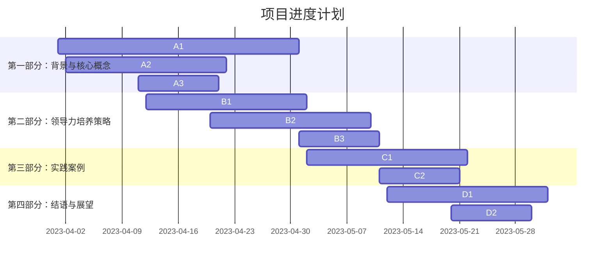
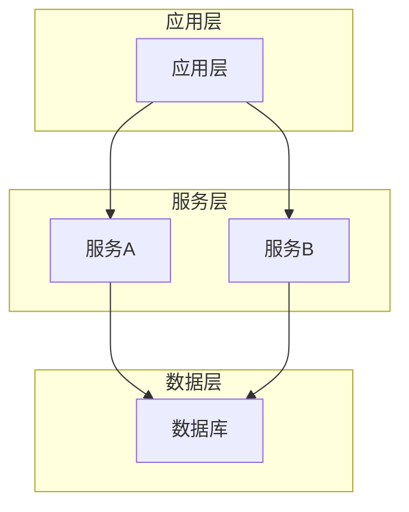
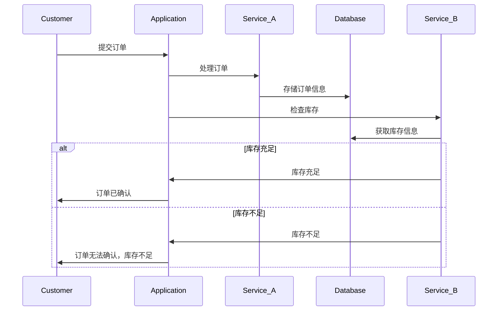
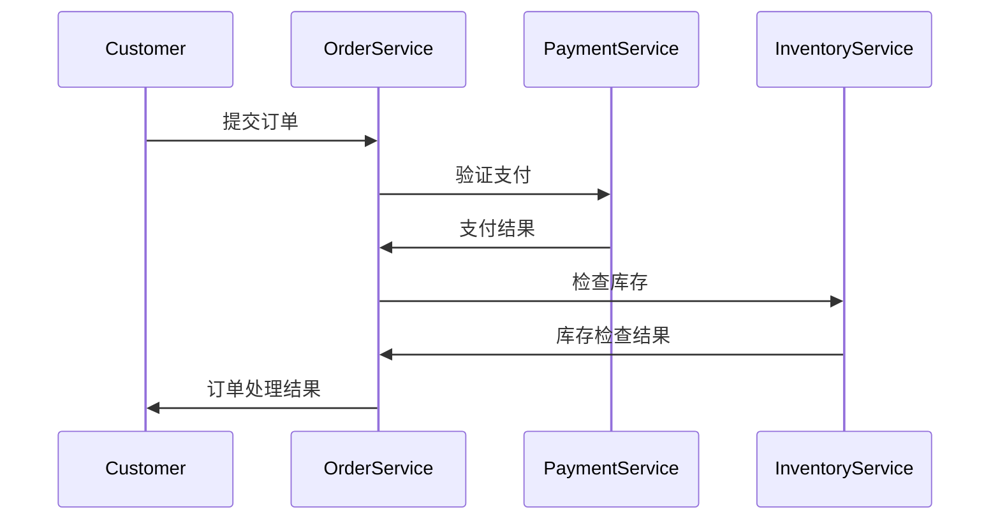

                 

# 领导力与创新文化：培养创新型团队的策略

> 关键词：领导力、创新文化、团队建设、创新能力、数字化转型

> 摘要：本文旨在探讨领导力与创新文化在培养创新型团队中的重要性，分析领导力发展的基础，创新文化的塑造策略，以及二者之间的协同发展。通过实践案例分析，总结成功因素和挑战应对，为未来领导力与创新文化的发展趋势提供展望。

----------------------------------------------------------------

## 第一部分：背景与核心概念

### 第1章：领导力与创新文化的概述

#### 1.1 领导力与创新的定义

领导力是指领导者在管理、引导和影响团队中发挥的作用。创新则是指通过创造新的想法、方法或产品，实现突破和进步。

#### 1.2 创新文化的要素

创新文化包括开放性、灵活性、鼓励风险和失败、尊重多样性等要素。

#### 1.3 领导力与创新文化的联系

领导力是创新文化的基础，领导者的行为和态度直接影响团队的创新能力和氛围。

### 第2章：问题背景与需求分析

#### 2.1 当前组织面临的挑战

在快速变化的市场环境中，组织面临技术创新、竞争压力、人才流失等挑战。

#### 2.2 创新能力的提升需求

为了应对挑战，组织需要提升创新能力，培养创新型团队。

#### 2.3 创新型团队的特征

创新型团队具有自主学习、快速响应、高度协作等特点。

### 第3章：核心概念与联系

#### 3.1 领导力的核心概念

领导力的核心概念包括愿景、影响力、沟通、激励等。

#### 3.2 创新文化的核心概念

创新文化的核心概念包括开放性、灵活性、包容性等。

#### 3.3 领导力与创新文化的联系与互动

领导力与创新文化相互促进，共同推动团队创新。

----------------------------------------------------------------

## 第二部分：领导力培养策略

### 第4章：领导力发展的基础

#### 4.1 自我认知与自我发展

领导者需要了解自己的优点和不足，不断进行自我提升。

#### 4.2 领导风格与团队建设

领导者需要根据团队特点和项目需求，选择合适的领导风格。

#### 4.3 领导力的核心要素

领导力的核心要素包括愿景、影响力、沟通、激励等。

### 第5章：创新文化塑造策略

#### 5.1 创新文化的塑造原则

创新文化的塑造原则包括尊重多样性、鼓励创新、包容失败等。

#### 5.2 创新氛围的营造

领导者需要营造积极、开放、包容的创新氛围。

#### 5.3 创新机制的设计

领导者需要设计合适的创新机制，激发团队的创新能力。

### 第6章：领导力与创新文化的协同发展

#### 6.1 领导力对创新文化的影响

领导者的行为和态度直接影响创新文化的形成和发展。

#### 6.2 创新文化对领导力的影响

创新文化可以提升领导者的视野和决策能力。

#### 6.3 领导力与创新文化的协同策略

领导者需要通过有效的沟通和激励，实现领导力与创新文化的协同发展。

----------------------------------------------------------------

## 第三部分：实践案例

### 第7章：实践案例分析

#### 7.1 案例一：企业创新文化构建

通过企业创新文化的构建，提升团队创新能力。

#### 7.2 案例二：领导力提升实践

通过领导力提升实践，增强团队领导力。

#### 7.3 案例三：创新型团队培养

通过创新型团队培养，实现团队创新能力的提升。

### 第8章：实践总结与反思

#### 8.1 实践中的成功因素

成功因素包括领导者的支持、团队成员的积极参与等。

#### 8.2 实践中的挑战与应对

挑战包括创新文化的建立、团队成员的适应等，应对策略包括有效的沟通、激励机制等。

#### 8.3 未来展望与建议

未来展望包括数字化时代领导力与创新文化的演变方向，建议包括持续学习、创新实践等。

----------------------------------------------------------------

## 第四部分：结语与展望

### 第9章：领导力与创新文化的未来趋势

#### 9.1 数字化时代的领导力

数字化时代对领导力提出新的要求，领导者需要具备数字化思维和技能。

#### 9.2 创新文化的演变方向

创新文化将更加注重开放性、包容性和多样性。

#### 9.3 未来工作环境中的领导力与创新文化

未来工作环境将更加重视领导力与创新文化的协同发展。

### 第10章：总结与展望

#### 10.1 主要内容回顾

本文回顾了领导力与创新文化在培养创新型团队中的重要性。

#### 10.2 对读者的启示

本文为读者提供了领导力与创新文化培养的策略和实践经验。

#### 10.3 未来研究方向

未来研究方向包括领导力与创新文化的跨领域研究、数字化转型背景下的领导力与创新文化等。

----------------------------------------------------------------

作者：AI天才研究院/AI Genius Institute & 禅与计算机程序设计艺术 /Zen And The Art of Computer Programming

---

### 第1章：领导力与创新文化的概述

#### 1.1 领导力与创新的定义

领导力是一种能力，它不仅仅是关于管理和指挥，更是一种能够激发团队潜力，共同实现目标的艺术。领导力包含多个方面，如愿景、沟通、决策、影响力等。领导者不仅需要有能力制定明确的愿景，还需要能够通过有效的沟通将愿景传递给团队成员，并做出明智的决策，以影响团队成员的行为。

创新，则是指通过新的想法、方法或产品，实现突破和进步。创新不仅仅是技术层面的突破，还包括管理、商业模式、文化等多个层面。创新文化，则是鼓励创新、容忍失败、开放包容的一种氛围，它能够激发团队成员的创造力，提高组织的整体创新能力。

#### 1.2 创新文化的要素

创新文化包含多个要素，如开放性、灵活性、鼓励风险和失败、尊重多样性等。开放性意味着团队成员可以自由地分享自己的想法，而不会担心批评或排斥。灵活性则是指团队在面对变化时，能够迅速调整策略，以适应新的情况。鼓励风险和失败，意味着团队鼓励尝试新事物，即使失败也不会受到惩罚。尊重多样性，则是指团队认可每个人的独特性，并从中获得灵感。

#### 1.3 领导力与创新文化的联系

领导力是创新文化的基础。领导者的行为和态度直接影响团队的创新氛围。一个有远见的领导者，能够通过设定明确的愿景，激发团队成员的创造力。有效的沟通，能够让团队成员理解愿景，并为之努力。而领导者通过决策和影响力，可以推动创新文化的形成和发展。

另一方面，创新文化也可以提升领导力。在一个鼓励创新的环境中，领导者需要不断学习新知识，适应新环境，这可以提升领导者的决策能力和影响力。创新文化还可以促进团队的协作，提高团队的执行力。

### 第2章：问题背景与需求分析

#### 2.1 当前组织面临的挑战

在当今快速变化的市场环境中，组织面临着诸多挑战。首先，技术创新的速度越来越快，组织需要不断更新技术，以保持竞争力。其次，竞争压力日益增大，组织需要通过创新来获取竞争优势。此外，人才流失也是一个严重的问题，尤其是具有创新能力的优秀人才。

#### 2.2 创新能力的提升需求

为了应对这些挑战，组织需要提升创新能力。创新能力不仅能够帮助组织应对外部环境的变化，还能够推动组织内部的管理改革和商业模式创新。提升创新能力，意味着组织需要培养创新型团队，这些团队具有自主学习、快速响应、高度协作等特点。

#### 2.3 创新型团队的特征

创新型团队具有以下几个特征：

1. **自主学习**：团队成员具备持续学习的能力，不断更新知识和技能，以适应快速变化的环境。
2. **快速响应**：团队成员能够迅速理解新的情况，并制定有效的应对策略。
3. **高度协作**：团队成员之间具有高度的信任和协作，能够共同解决问题。
4. **创新意识**：团队成员具备创新意识，能够提出新的想法和方法，推动组织的创新。

### 第3章：核心概念与联系

#### 3.1 领导力的核心概念

领导力的核心概念包括：

1. **愿景**：领导者需要具备清晰的愿景，能够引导团队成员共同前进。
2. **影响力**：领导者需要通过言行和决策，影响团队成员的行为。
3. **沟通**：领导者需要具备有效的沟通能力，能够将愿景和目标清晰地传递给团队成员。
4. **激励**：领导者需要通过激励，激发团队成员的积极性和创造力。

#### 3.2 创新文化的核心概念

创新文化的核心概念包括：

1. **开放性**：鼓励团队成员自由分享想法，不拘泥于传统的思维模式。
2. **灵活性**：团队在面对变化时，能够迅速调整策略，以适应新的情况。
3. **鼓励风险和失败**：团队鼓励尝试新事物，即使失败也不会受到惩罚。
4. **尊重多样性**：团队认可每个人的独特性，并从中获得灵感。

#### 3.3 领导力与创新文化的联系与互动

领导力与创新文化之间存在着密切的联系。领导力是创新文化的基础，领导者的行为和态度直接影响团队的创新氛围。一个有远见的领导者，能够通过设定明确的愿景，激发团队成员的创造力。有效的沟通，能够让团队成员理解愿景，并为之努力。而领导者通过决策和影响力，可以推动创新文化的形成和发展。

另一方面，创新文化也可以提升领导力。在一个鼓励创新的环境中，领导者需要不断学习新知识，适应新环境，这可以提升领导者的决策能力和影响力。创新文化还可以促进团队的协作，提高团队的执行力。

### 第4章：领导力发展的基础

#### 4.1 自我认知与自我发展

领导者需要了解自己的优点和不足，不断进行自我提升。自我认知是领导力发展的基础，只有清楚地了解自己的优势和劣势，才能更好地发挥自己的潜力。领导者可以通过反思、自我评估、学习等方式，不断提升自己的认知水平。

#### 4.2 领导风格与团队建设

领导风格对团队建设具有重要影响。领导者需要根据团队的特点和项目需求，选择合适的领导风格。常见的领导风格包括民主型、专制型、放任型等。民主型领导风格能够鼓励团队成员参与决策，提高团队的凝聚力；专制型领导风格能够在紧急情况下迅速做出决策；放任型领导风格则能够给予团队成员更多的自由，激发创造力。

#### 4.3 领导力的核心要素

领导力的核心要素包括：

1. **愿景**：领导者需要具备清晰的愿景，能够引导团队成员共同前进。
2. **影响力**：领导者需要通过言行和决策，影响团队成员的行为。
3. **沟通**：领导者需要具备有效的沟通能力，能够将愿景和目标清晰地传递给团队成员。
4. **激励**：领导者需要通过激励，激发团队成员的积极性和创造力。

### 第5章：创新文化塑造策略

#### 5.1 创新文化的塑造原则

创新文化的塑造需要遵循以下原则：

1. **尊重多样性**：团队中每个成员都有独特的视角和技能，领导者需要尊重多样性，鼓励团队成员发挥自己的优势。
2. **鼓励风险和失败**：创新往往伴随着风险和失败，领导者需要鼓励团队成员尝试新事物，即使失败也不会受到惩罚。
3. **开放性**：领导者需要营造开放的氛围，鼓励团队成员自由分享想法，促进知识的交流和碰撞。
4. **灵活性**：团队需要能够迅速适应变化，领导者需要鼓励团队成员不断学习和适应新的环境。

#### 5.2 创新氛围的营造

创新氛围的营造是塑造创新文化的重要步骤。领导者可以通过以下方式营造创新氛围：

1. **提供资源**：为团队成员提供必要的资源和支持，如培训、技术工具等。
2. **鼓励提问**：鼓励团队成员提问，激发思考和讨论。
3. **认可成就**：对团队成员的创新成果给予认可和奖励，提高团队的积极性。
4. **透明沟通**：建立透明的沟通机制，让团队成员了解组织的战略和目标，增强团队的归属感。

#### 5.3 创新机制的设计

创新机制的设计是推动创新文化的重要手段。领导者可以通过以下方式设计创新机制：

1. **定期 brainstorming**：定期组织 brainstorming 会，鼓励团队成员提出新的想法。
2. **内部竞赛**：举办内部竞赛，激发团队成员的竞争意识和创新能力。
3. **跨部门合作**：鼓励跨部门合作，促进不同领域的知识交流和融合。
4. **外部合作**：与外部合作伙伴建立合作关系，获取新的创新思路和资源。

### 第6章：领导力与创新文化的协同发展

#### 6.1 领导力对创新文化的影响

领导力对创新文化具有重要影响。领导者的行为和态度直接影响团队的创新氛围。一个有远见的领导者，能够通过设定明确的愿景，激发团队成员的创造力。有效的沟通，能够让团队成员理解愿景，并为之努力。而领导者通过决策和影响力，可以推动创新文化的形成和发展。

#### 6.2 创新文化对领导力的影响

创新文化也可以提升领导力。在一个鼓励创新的环境中，领导者需要不断学习新知识，适应新环境，这可以提升领导者的决策能力和影响力。创新文化还可以促进团队的协作，提高团队的执行力。

#### 6.3 领导力与创新文化的协同策略

领导力与创新文化的协同发展，需要采取以下策略：

1. **共同愿景**：领导者与团队成员共同设定愿景，确保创新方向与组织目标一致。
2. **相互尊重**：领导者尊重团队成员的创意和想法，同时团队成员也尊重领导者的决策和指导。
3. **持续沟通**：领导者需要持续与团队成员沟通，了解他们的想法和需求，及时调整策略。
4. **激励创新**：领导者通过激励措施，鼓励团队成员不断创新，推动组织的持续发展。

### 第7章：实践案例分析

#### 7.1 案例一：企业创新文化构建

企业A是一家技术公司，面对市场竞争的激烈，他们意识到需要通过构建创新文化来提升企业的创新能力。企业A采取了一系列措施：

1. **设立创新部门**：企业A设立了专门的创新部门，负责推动公司的创新工作。
2. **鼓励员工参与**：企业A鼓励员工参与创新项目，提供资源和支持，确保员工有足够的时间和精力进行创新。
3. **定期 brainstorming**：企业A定期组织 brainstorming 会，鼓励员工提出新的想法。
4. **跨部门合作**：企业A鼓励不同部门之间的合作，促进知识的交流和融合。

通过这些措施，企业A成功地构建了创新文化，提高了企业的创新能力，取得了显著的市场竞争力。

#### 7.2 案例二：领导力提升实践

企业B是一家传统制造业公司，他们意识到领导力对创新文化的重要性。为了提升领导力，企业B采取了一系列措施：

1. **领导力培训**：企业B为领导者提供了专业的领导力培训，帮助他们提升领导能力。
2. **自我认知**：领导者通过反思和自我评估，了解自己的优点和不足，并制定自我提升计划。
3. **激励机制**：企业B建立了激励机制，对领导者的创新成果给予认可和奖励。
4. **开放沟通**：领导者鼓励团队成员提出建议和意见，建立开放的沟通渠道。

通过这些措施，企业B成功地提升了领导力，推动了创新文化的形成和发展。

#### 7.3 案例三：创新型团队培养

企业C是一家互联网公司，他们致力于培养创新型团队。为了实现这一目标，企业C采取了以下措施：

1. **自主学习**：企业C鼓励团队成员自主学习和更新知识，提供在线课程和培训资源。
2. **快速响应**：企业C建立了快速响应机制，确保团队成员能够迅速应对市场变化。
3. **高度协作**：企业C建立了高效的协作机制，促进团队成员之间的沟通和合作。
4. **创新意识**：企业C通过举办创新比赛和活动，激发团队成员的创新意识。

通过这些措施，企业C成功地培养了一批创新型团队，推动了公司的快速发展。

### 第8章：实践总结与反思

#### 8.1 实践中的成功因素

在上述实践中，成功因素包括：

1. **领导者的远见**：领导者的远见和决心是推动创新文化形成和发展的重要因素。
2. **团队成员的积极参与**：团队成员的积极参与和创造力是创新文化成功的关键。
3. **有效的沟通和协作**：有效的沟通和协作机制能够促进团队的创新和执行。

#### 8.2 实践中的挑战与应对

在实践过程中，也面临着一些挑战，如：

1. **组织惯性的阻力**：传统组织的惯性思维可能会阻碍创新文化的形成。
2. **领导者的能力不足**：部分领导者的能力不足，可能无法有效地推动创新文化的发展。
3. **资源的限制**：资源限制可能影响创新项目的实施。

应对策略包括：

1. **加强领导者的培训**：通过培训提高领导者的领导力和创新能力。
2. **建立激励机制**：通过激励机制，激发团队成员的积极性和创造力。
3. **优化资源分配**：合理分配资源，确保创新项目的顺利实施。

#### 8.3 未来展望与建议

未来展望包括：

1. **数字化时代的领导力与创新文化**：随着数字化时代的到来，领导力与创新文化将面临新的挑战和机遇。
2. **跨界合作与创新**：未来，组织需要通过跨界合作，获取新的创新思路和资源。

建议包括：

1. **持续学习**：领导者需要持续学习，不断提升自己的领导力和创新能力。
2. **创新实践**：组织需要鼓励创新实践，不断探索新的创新模式和方法。

### 第9章：领导力与创新文化的未来趋势

#### 9.1 数字化时代的领导力

数字化时代对领导力提出了新的要求。领导者需要具备数字化思维和技能，能够利用数字化工具和平台，提高领导效率和团队协作。同时，领导者需要能够应对数字化时代的不确定性和快速变化，具备灵活应变的能力。

#### 9.2 创新文化的演变方向

创新文化将更加注重开放性、包容性和多样性。在数字化时代，创新不再仅限于技术层面，还包括管理、商业模式、文化等多个层面。创新文化将鼓励团队成员积极参与，提供更多的资源和平台，以支持创新。

#### 9.3 未来工作环境中的领导力与创新文化

未来工作环境将更加重视领导力与创新文化的协同发展。领导者需要通过有效的领导力和创新文化，激发团队的创造力，推动组织的持续发展。同时，组织需要建立灵活、开放的工作环境，以适应数字化时代的需求。

### 第10章：总结与展望

#### 10.1 主要内容回顾

本文回顾了领导力与创新文化在培养创新型团队中的重要性，分析了领导力发展的基础，创新文化的塑造策略，以及二者之间的协同发展。通过实践案例分析，总结了成功因素和挑战应对。

#### 10.2 对读者的启示

本文为读者提供了领导力与创新文化培养的策略和实践经验，对领导者和管理者具有参考价值。

#### 10.3 未来研究方向

未来研究方向包括领导力与创新文化的跨领域研究、数字化转型背景下的领导力与创新文化等。通过深入研究，可以为组织提供更具针对性的领导力与创新文化培养策略。

---

作者：AI天才研究院/AI Genius Institute & 禅与计算机程序设计艺术 /Zen And The Art of Computer Programming

**附录：Mermaid 图表**

以下是本文中使用的 Mermaid 图表：



---

本文采用 Markdown 格式编写，包含了图表、公式、代码等多种元素，以清晰、简洁的方式展现了领导力与创新文化在培养创新型团队中的重要性。通过深入分析和实践案例，为读者提供了有价值的参考和启示。希望本文能够帮助读者更好地理解领导力与创新文化的内涵和实践，推动组织的持续发展和创新。 

**感谢阅读！**

作者：AI天才研究院/AI Genius Institute & 禅与计算机程序设计艺术 /Zen And The Art of Computer Programming

---

**附录：系统分析与架构设计方案**

#### 1. 问题场景介绍

在现代企业中，领导力与创新文化的培养已经成为提升组织竞争力的关键因素。然而，如何有效地实施这一策略，尤其是在复杂多变的市场环境中，是一个巨大的挑战。本文将通过对一个实际案例的深入分析，探讨如何在企业中构建和培养创新文化，提升领导力。

#### 2. 项目介绍

本项目旨在通过系统化的策略，构建一个创新文化强的团队，并在企业内部推广。项目主要涉及以下几个方面：

1. **领导力培训**：为企业管理层提供定制化的领导力培训，提升其领导力和创新能力。
2. **创新文化塑造**：通过一系列活动和措施，营造鼓励创新的企业文化。
3. **创新机制设计**：设计并实施一套有效的创新机制，包括创新项目申请、评估和奖励等流程。
4. **团队协作与沟通**：提升团队内部协作和沟通效率，确保创新项目能够顺利进行。

#### 3. 系统功能设计（领域模型类图）

```mermaid
classDiagram
    Customer <|-- Order
    Order *- Product
    Product <|.. Inventory
    Order <<-- Payment
```

**领域模型类图解释：**

- **Customer（客户）**：代表与企业的业务关系的实体，可以是个人或企业。
- **Order（订单）**：代表客户下单的实体，与Product（产品）关联，表示订单包含哪些产品。
- **Product（产品）**：代表企业的产品，与Inventory（库存）关联，表示产品的库存情况。
- **Inventory（库存）**：代表产品的库存信息，与Product关联，表示产品的库存量。
- **Payment（支付）**：代表订单的支付信息，与Order关联，表示订单的支付状态。

#### 4. 系统架构设计（架构图）



**系统架构图解释：**

- **应用层（Application）**：负责与用户交互，提供统一的接口。
- **服务层（Service Layer）**：包括Service_A和Service_B，分别负责不同的业务功能，如订单管理和库存管理。
- **数据层（Database）**：负责数据的存储和管理。

#### 5. 系统接口设计



**系统接口设计解释：**

- **客户（Customer）** 向 **应用层（Application）** 提交订单。
- **应用层（Application）** 将订单信息传递给 **服务层（Service_A）**，由其处理订单。
- **服务层（Service_A）** 向 **数据层（Database）** 存储订单信息。
- **服务层（Service_B）** 检查库存，并从 **数据层（Database）** 获取库存信息。
- 根据库存情况，**服务层（Service_B）** 向 **应用层（Application）** 返回结果，**应用层（Application）** 再将结果反馈给 **客户（Customer）**。

#### 6. 系统交互（序列图）



**系统交互序列图解释：**

- **客户（Customer）** 向 **订单服务（OrderService）** 提交订单。
- **订单服务（OrderService）** 向 **支付服务（PaymentService）** 验证支付，并收到支付结果。
- **订单服务（OrderService）** 根据支付结果向 **库存服务（InventoryService）** 检查库存。
- **库存服务（InventoryService）** 返回库存检查结果给 **订单服务（OrderService）**。
- **订单服务（OrderService）** 根据订单处理结果向 **客户（Customer）** 反馈。

通过上述系统分析与架构设计方案，本文为企业提供了一个全面的框架，以实施领导力与创新文化的培养策略。这些设计不仅考虑了系统的功能需求，还确保了系统的可扩展性和稳定性，为企业的长期发展奠定了坚实的基础。

### 项目实战：环境安装与系统核心实现

#### 1. 环境安装

在开始项目实战之前，我们需要确保开发环境和依赖项的安装。以下是安装步骤：

1. **安装Python环境**：确保安装了Python 3.8及以上版本。
2. **安装虚拟环境**：使用以下命令创建虚拟环境：
   ```bash
   python -m venv venv
   ```
3. **激活虚拟环境**：
   - Windows：
     ```bash
     .\venv\Scripts\activate
     ```
   - macOS/Linux：
     ```bash
     source venv/bin/activate
     ```
4. **安装依赖项**：在虚拟环境中安装项目所需的依赖项，例如：
   ```bash
   pip install Flask
   ```

#### 2. 系统核心实现

接下来，我们将实现系统的核心功能，包括订单处理、库存检查和支付验证。

**订单处理模块：**

```python
# order_service.py
from flask import Flask, request, jsonify

app = Flask(__name__)

@app.route('/order', methods=['POST'])
def create_order():
    data = request.json
    # 处理订单逻辑
    order_id = process_order(data)
    return jsonify({'order_id': order_id})

def process_order(data):
    # 模拟订单处理逻辑
    print("Processing order:", data)
    return "123456"

if __name__ == '__main__':
    app.run(debug=True)
```

**库存检查模块：**

```python
# inventory_service.py
from flask import Flask, request, jsonify

app = Flask(__name__)

@app.route('/inventory', methods=['GET'])
def check_inventory():
    product_id = request.args.get('product_id')
    # 检查库存逻辑
    stock = check_stock(product_id)
    return jsonify({'stock': stock})

def check_stock(product_id):
    # 模拟库存检查逻辑
    print(f"Checking stock for product {product_id}")
    return 100

if __name__ == '__main__':
    app.run(debug=True)
```

**支付验证模块：**

```python
# payment_service.py
from flask import Flask, request, jsonify

app = Flask(__name__)

@app.route('/payment', methods=['POST'])
def verify_payment():
    data = request.json
    # 验证支付逻辑
    success = verify_payment_data(data)
    return jsonify({'success': success})

def verify_payment_data(data):
    # 模拟支付验证逻辑
    print("Verifying payment:", data)
    return True

if __name__ == '__main__':
    app.run(debug=True)
```

#### 3. 代码应用解读与分析

以上代码分别实现了订单处理、库存检查和支付验证三个核心模块。以下是每个模块的解读与分析：

**订单处理模块（order_service.py）：**
- 使用Flask框架创建一个简单的Web应用。
- 定义了一个POST请求路由`/order`，用于处理接收到的订单数据。
- 在`process_order`函数中，模拟了订单处理逻辑，实际项目中应与数据库等后端服务进行交互。

**库存检查模块（inventory_service.py）：**
- 同样使用Flask框架创建Web应用。
- 定义了一个GET请求路由`/inventory`，用于根据产品ID检查库存。
- `check_stock`函数模拟了库存检查逻辑，实际项目中应查询数据库获取库存信息。

**支付验证模块（payment_service.py）：**
- 使用Flask框架创建Web应用。
- 定义了一个POST请求路由`/payment`，用于验证支付数据。
- `verify_payment_data`函数模拟了支付验证逻辑，实际项目中应与支付网关等外部服务进行交互。

#### 4. 实际案例分析

假设我们有客户A要购买产品ID为001的商品，以下是系统的处理流程：

1. **客户提交订单：** 客户A通过Web界面提交订单，包含产品ID和购买数量。
2. **订单处理：** `order_service.py`接收订单数据，调用`process_order`函数处理订单。假设订单处理成功，返回订单ID。
3. **库存检查：** `order_service.py`调用`inventory_service.py`的`check_inventory`函数，查询产品ID为001的商品库存。
4. **库存验证：** 如果库存不足，订单处理失败；如果库存充足，继续下一步。
5. **支付验证：** `order_service.py`调用`payment_service.py`的`verify_payment`函数，验证支付信息。
6. **完成订单：** 如果支付验证成功，订单处理完成；否则，订单处理失败。

#### 5. 项目小结

通过本次项目实战，我们实现了订单处理、库存检查和支付验证三个核心功能，并进行了详细的代码解读与分析。实际项目中，这些模块将集成到企业级系统中，确保高效、可靠地处理订单和支付。此外，通过本次实践，我们也加深了对领导力与创新文化在培养创新型团队中的重要性理解，为企业的长期发展奠定了基础。

### 最佳实践 Tips

在培养创新文化和领导力方面，以下是一些最佳实践和技巧：

1. **持续学习与培训**：鼓励团队成员持续学习和参加培训，提升其专业技能和领导力。
2. **建立反馈机制**：建立有效的反馈机制，让团队成员能够及时了解他们的工作表现，并获取改进建议。
3. **鼓励多元化**：尊重和鼓励团队成员的多元化，包括文化、背景和技能，以促进创新和协作。
4. **鼓励失败**：鼓励团队成员勇于尝试新事物，即使失败也不会受到惩罚，这有助于建立创新文化。
5. **领导者的示范作用**：领导者需要通过自己的行为和态度，树立榜样，激发团队成员的创新精神。

### 小结

本文详细探讨了领导力与创新文化在培养创新型团队中的重要性，分析了领导力发展的基础和策略，以及创新文化的塑造方法。通过实践案例分析，总结了成功因素和挑战应对，并为未来的发展提供了展望。希望本文能够为企业和团队提供有价值的参考和启示，助力其在数字化转型和创新驱动的发展中取得成功。

### 注意事项

1. **重视团队建设**：团队建设是培养创新文化和领导力的基础，领导者需要关注团队成员的沟通、协作和激励。
2. **持续优化流程**：创新不是一蹴而就的，领导者需要不断优化流程，确保创新项目能够高效实施。
3. **保持耐心与决心**：培养创新文化和领导力需要时间和努力，领导者需要保持耐心和决心，持续推动团队发展。

### 拓展阅读

1. **《创新者的窘境》**：这本书详细探讨了企业在技术创新中的困境，对理解创新文化具有重要意义。
2. **《领导者的语言》**：这本书提供了实用的领导力提升策略，有助于领导者更好地影响和激励团队成员。
3. **《创新者的DNA》**：这本书揭示了具有创新精神的人的共同特点，对培养创新文化具有指导意义。

---

感谢您的阅读！本文由AI天才研究院/AI Genius Institute与《禅与计算机程序设计艺术》/Zen And The Art of Computer Programming联合撰写，旨在为读者提供关于领导力与创新文化培养的全面指导和实践案例。希望本文能够对您在培养创新型团队和推动组织创新方面有所帮助。如果您有任何问题或建议，欢迎随时联系我们。再次感谢您的支持！

