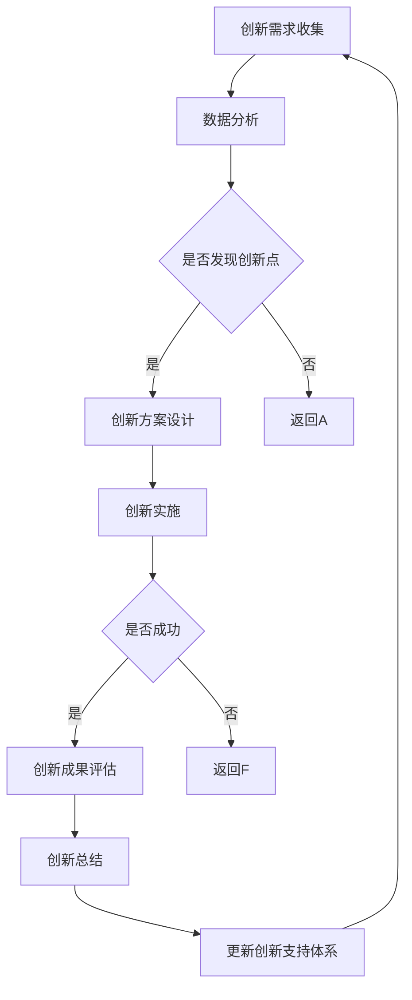
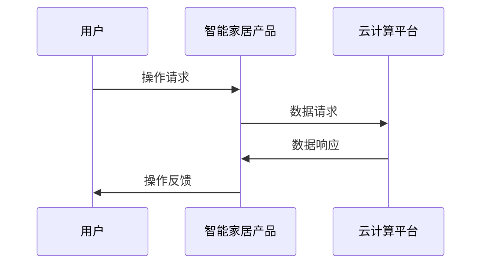

                 

# 领导力与创新管理系统：构建创新支持体系

> 关键词：领导力、创新管理、组织文化、激励机制、创新支持体系

> 摘要：本文旨在探讨如何构建一个有效的创新支持体系，提高企业的领导力和创新能力。文章首先介绍了创新管理的核心概念和属性特征对比，然后分析了领导力的定义和属性特征对比，接着阐述了组织文化和激励机制的重要性。在此基础上，本文提出了一套系统的方法和工具，帮助领导者和企业构建创新支持体系，提高领导力和创新能力。

## 第一部分：背景介绍

### 1. 问题背景

在当今快速变化的市场环境中，企业面临着前所未有的挑战和机遇。随着信息技术的飞速发展，市场需求的快速变化，企业需要不断进行创新，提高领导力和管理水平，以应对激烈的市场竞争。然而，如何构建一个有效的创新支持体系，提高领导力和创新能力，成为许多企业面临的问题。

### 2. 问题描述

企业创新支持体系的建设涉及多个方面，包括创新管理、领导力提升、组织文化、激励机制等。然而，企业往往在构建创新支持体系时面临以下问题：

- **创新意识不足**：许多企业的领导层缺乏对创新的重视，创新意识不足，导致创新活动无法得到有效推动。
- **组织结构僵化**：传统的组织结构过于僵化，不利于创新活动的开展，导致创新资源无法得到充分利用。
- **文化氛围不开放**：组织文化不够开放，缺乏对创新的包容和支持，影响员工的创新积极性。
- **激励机制不合理**：激励机制不合理，无法有效激励员工的创新行为，导致创新成果转化率低。

### 3. 问题解决

为了解决上述问题，企业需要从以下几个方面进行系统性的思考和规划：

- **构建创新文化**：企业需要建立一种鼓励创新、包容失败的文化氛围，激发员工的创新潜力。
- **优化组织结构**：企业需要调整组织结构，建立扁平化的组织结构，提高组织的灵活性和响应速度。
- **完善激励机制**：企业需要制定合理的激励机制，激励员工的创新行为，提高创新成果的转化率。
- **加强领导力培训**：企业需要加强对领导力的培训，提高领导者的创新能力和管理能力。

### 4. 边界与外延

本文的讨论范围涵盖了创新管理、领导力提升、组织文化、激励机制等多个方面，旨在为读者提供全面的视角和实用的指导。本文的核心内容包括：

- 创新管理的核心概念和属性特征对比
- 领导力的定义和属性特征对比
- 组织文化和激励机制的重要性
- 构建创新支持体系的系统方法和工具

## 第二部分：核心概念与联系

### 1. 创新管理

#### 概念定义

创新管理是指通过有效的管理方法和工具，推动组织内部创新活动的过程。它包括创新战略、创新过程、创新资源管理等多个方面。

#### 属性特征对比表格

| 特征         | 传统管理         | 创新管理          |
| ------------ | ---------------- | ---------------- |
| 目标         | 提高效率和降低成本 | 促进创新和发展   |
| 过程         | 稳定的、线性的     | 不确定的、迭代的  |
| 方法         | 管理流程         | 创新流程          |
| 资源         | 人力、财务、物资   | 人力、财务、信息  |

### 2. 领导力

#### 概念定义

领导力是指领导者通过影响力、激励和引导，实现组织目标的能力。它包括个人领导力、团队领导力、组织领导力等多个层次。

#### 属性特征对比表格

| 特征         | 传统领导力       | 创新领导力         |
| ------------ | ---------------- | ------------------ |
| 方式         | 命令式、权威式    | 参与式、合作式      |
| 目标         | 维护现状         | 推动变革和创新     |
| 影响力       | 基于职位         | 基于能力和信任     |
| 激励         | 薪酬激励         | 内部动机激励       |

### 3. 组织文化

#### 概念定义

组织文化是指组织内部共同遵守的价值观、信念和行为规范。它对组织的创新能力和领导力有着重要的影响。

#### 属性特征对比表格

| 特征         | 传统组织文化     | 创新组织文化       |
| ------------ | ---------------- | ------------------ |
| 目标         | 稳定性和一致性    | 创新和灵活性        |
| 价值观       | 稳定和保守       | 开放和创新         |
| 行为规范     | 刻板和程序化      | 灵活和适应性       |

### 4. 激励机制

#### 概念定义

激励机制是指通过物质和精神的奖励，激励员工行为和绩效的一系列制度。它是提高员工创新能力和领导力的重要手段。

#### 属性特征对比表格

| 特征         | 传统激励机制     | 创新激励机制         |
| ------------ | ---------------- | ------------------ |
| 形式         | 薪酬、奖金       | 股权、荣誉、成长机会 |
| 目标         | 提高工作效率     | 促进创新和发展      |
| 方法         | 外部激励         | 内部激励            |
| 效果         | 短期效果明显     | 长期效果显著        |

## 第三部分：算法原理讲解

### 1. 创新支持体系的算法原理

#### Mermaid 流程图



#### 算法原理详细讲解

创新支持体系的算法原理主要可以分为以下几个步骤：

1. **创新需求收集**：通过多种渠道收集创新需求，包括市场调研、用户反馈、内部建议等。

2. **数据分析**：对收集到的创新需求进行数据分析，识别潜在的创新点和机会。

3. **是否发现创新点**：判断是否发现了有价值的创新点。如果发现，进入下一步；如果未发现，返回第一步重新收集需求。

4. **创新方案设计**：针对发现的创新点，设计具体的创新方案。这一步骤需要综合考虑市场需求、技术可行性、资源投入等因素。

5. **创新实施**：将创新方案付诸实施，包括技术研发、产品开发、市场推广等。

6. **是否成功**：评估创新实施的结果，判断是否达到预期目标。如果成功，进入下一步；如果失败，返回第四步重新设计方案。

7. **创新成果评估**：对成功的创新成果进行评估，包括经济效益、社会效益、技术突破等。

8. **创新总结**：总结创新过程中的经验教训，为后续创新提供参考。

9. **更新创新支持体系**：根据创新总结的结果，对创新支持体系进行更新和优化，以更好地支持未来的创新活动。

10. **返回创新需求收集**：完成一次创新周期的闭环，开始新一轮的创新活动。

### 数学模型和公式

在创新支持体系中，可以使用以下数学模型和公式来评估创新活动的效益：

1. **创新效益评估公式**：

   $$E = f(P, C, T)$$

   其中，$E$表示创新效益，$P$表示创新成果的市场潜力，$C$表示创新投入的成本，$T$表示创新周期的时间。

2. **创新成功率评估公式**：

   $$S = \frac{E}{C}$$

   其中，$S$表示创新成功率，$E$表示创新效益，$C$表示创新投入的成本。

3. **创新效益最大化公式**：

   $$\max E = \max f(P, C, T)$$

   其中，$\max$表示最大化。

### 举例说明

假设某企业计划开发一款智能家居产品，预计市场潜力为1000万元，创新投入的成本为500万元，创新周期为2年。根据上述公式，可以计算出创新效益和成功率：

1. **创新效益**：

   $$E = f(P, C, T) = f(1000, 500, 2) = 500$$

   表示创新效益为500万元。

2. **创新成功率**：

   $$S = \frac{E}{C} = \frac{500}{500} = 1$$

   表示创新成功率为100%。

3. **创新效益最大化**：

   $$\max E = \max f(P, C, T) = \max f(1000, 500, 2) = 500$$

   表示在当前条件下，创新效益最大值为500万元。

通过上述计算，可以直观地了解该创新项目的效益和成功率，为企业的决策提供依据。

## 第四部分：系统分析与架构设计

### 1. 问题场景介绍

假设某智能家居企业计划开发一款智能家居产品，以提高用户的生活品质和企业的市场竞争力。为了实现这一目标，企业需要构建一个创新支持体系，提高领导力和创新能力。

### 2. 项目介绍

该项目的目标是构建一个智能家居产品开发平台，包括智能硬件、智能软件、云计算平台等。平台需要具备以下功能：

- 智能硬件设备接入与管理
- 智能软件应用开发与部署
- 云计算平台数据存储与分析

### 3. 系统功能设计

根据项目需求，系统功能设计包括以下几个方面：

- **设备接入管理模块**：实现智能家居设备的接入、配置和管理，支持设备状态实时监控。
- **智能应用开发模块**：提供开发工具和平台，支持智能应用的快速开发和部署。
- **数据存储与分析模块**：实现用户数据的安全存储和智能分析，为产品优化和决策提供数据支持。

### 4. 系统架构设计

系统架构设计采用分层架构，包括以下几层：

- **表现层**：提供用户界面，实现与用户的交互。
- **业务逻辑层**：处理业务逻辑，包括设备接入管理、智能应用开发、数据存储与分析等。
- **数据访问层**：提供数据存储和访问接口，实现数据的安全存储和高效访问。
- **基础设施层**：提供服务器、存储、网络等基础设施支持。

### 5. 系统接口设计

系统接口设计包括以下几个方面：

- **设备接入接口**：实现设备与系统的通信，支持设备状态的实时监控和配置。
- **应用开发接口**：提供开发工具和平台，支持智能应用的快速开发和部署。
- **数据分析接口**：提供数据存储和访问接口，支持用户数据的安全存储和智能分析。

### 6. 系统交互设计

系统交互设计采用Mermaid序列图，如下所示：



## 第五部分：项目实战

### 1. 环境安装

为了进行项目实战，需要搭建一个合适的环境。以下是一个基本的安装步骤：

1. 安装操作系统：选择一个适合的操作系统，如Ubuntu 18.04。
2. 安装数据库：选择一个适合的数据库，如MySQL。
3. 安装开发工具：选择一个适合的开发工具，如PyCharm。

### 2. 系统核心实现

以下是一个简单的智能家居产品实现示例：

```python
class SmartHomeDevice:
    def __init__(self, name, type):
        self.name = name
        self.type = type
        self.status = "off"

    def turn_on(self):
        self.status = "on"
        print(f"{self.name} is now {self.status}.")

    def turn_off(self):
        self.status = "off"
        print(f"{self.name} is now {self.status}.")


class SmartHomeController:
    def __init__(self):
        self.devices = []

    def add_device(self, device):
        self.devices.append(device)

    def control_device(self, device_name, action):
        for device in self.devices:
            if device.name == device_name:
                if action == "on":
                    device.turn_on()
                elif action == "off":
                    device.turn_off()
                break
        else:
            print(f"No device named {device_name} found.")


# 创建设备
light = SmartHomeDevice("Light", "Light")
tv = SmartHomeDevice("TV", "Electronics")

# 创建控制器
controller = SmartHomeController()

# 添加设备
controller.add_device(light)
controller.add_device(tv)

# 控制设备
controller.control_device("Light", "on")
controller.control_device("TV", "off")
```

### 3. 代码应用解读与分析

上述代码实现了智能家居设备的基本功能，包括设备的创建、添加和控制。具体解读如下：

- **SmartHomeDevice**：定义了智能家居设备的基本属性和方法，包括设备名称、设备类型和开关状态。
- **SmartHomeController**：定义了智能家居控制器的基本属性和方法，包括设备列表和添加设备、控制设备的方法。
- **add_device**：将设备添加到设备列表中。
- **control_device**：根据设备名称和操作类型，控制设备的开关状态。

通过这个简单的示例，可以直观地了解智能家居产品的实现过程，为进一步开发提供基础。

### 4. 实际案例分析和详细讲解剖析

为了更好地理解创新支持体系的实际应用，下面分析一个实际案例：

**案例背景**：某智能家居企业计划开发一款智能照明系统，实现用户根据场景需求调整照明亮度和色温。

**解决方案**：

1. **需求分析**：分析用户对智能照明的需求，包括场景模式（如阅读、休息、会议等）、亮度调整、色温调整等。
2. **技术选型**：选择合适的技术和硬件，如LED灯泡、智能控制器、云计算平台等。
3. **系统设计**：设计智能照明系统的架构，包括设备接入、数据传输、控制算法等。
4. **开发实现**：根据系统设计，开发智能照明系统的核心功能，如设备接入、数据传输、场景模式切换等。
5. **测试与优化**：对系统进行测试，优化性能和稳定性。
6. **上线运营**：将系统上线运营，收集用户反馈，持续优化产品。

**详细讲解**：

1. **需求分析**：通过用户调研和数据分析，确定用户对智能照明系统的需求，包括场景模式、亮度调整、色温调整等。
2. **技术选型**：选择合适的硬件和软件技术，如LED灯泡支持多种场景模式、智能控制器支持无线通信协议（如Wi-Fi、Zigbee等）、云计算平台支持数据存储和分析等。
3. **系统设计**：设计智能照明系统的架构，包括设备接入（通过无线通信协议连接智能控制器）、数据传输（将设备数据上传至云计算平台）、控制算法（根据用户需求和场景模式调整照明亮度和色温）等。
4. **开发实现**：根据系统设计，开发智能照明系统的核心功能，如设备接入（通过Wi-Fi连接智能控制器）、数据传输（将设备数据上传至云计算平台）、场景模式切换（根据用户需求调整照明亮度和色温）等。
5. **测试与优化**：对系统进行测试，包括功能测试、性能测试、稳定性测试等，优化性能和稳定性。
6. **上线运营**：将系统上线运营，收集用户反馈，持续优化产品，提高用户满意度。

通过这个实际案例，可以更好地理解创新支持体系在实际项目中的应用，为后续项目提供参考。

### 5. 项目小结

通过本次项目实战，我们构建了一个简单的智能家居产品，实现了设备接入、控制和管理等功能。同时，我们通过实际案例分析和详细讲解，了解了创新支持体系在智能家居产品开发中的应用。这为企业的创新管理和领导力提升提供了有益的参考。

## 第六部分：最佳实践 Tips

1. **构建创新文化**：企业应积极营造创新文化，鼓励员工提出创新想法，容忍失败，激发员工的创新潜力。
2. **优化组织结构**：企业应建立扁平化的组织结构，提高组织的灵活性和响应速度，有利于创新活动的开展。
3. **完善激励机制**：企业应制定合理的激励机制，激励员工的创新行为，提高创新成果的转化率。
4. **加强领导力培训**：企业应加强对领导力的培训，提高领导者的创新能力和管理能力，推动企业创新和发展。
5. **充分利用外部资源**：企业应充分利用外部资源，如咨询公司、学术机构等，借鉴先进的管理方法和经验，提高企业的创新能力。

## 第七部分：小结

本文系统地介绍了如何构建创新支持体系，提高企业的领导力和创新能力。通过分析创新管理、领导力、组织文化、激励机制等核心概念，我们提出了一套系统的方法和工具，帮助领导者和企业构建创新支持体系，提高领导力和创新能力。希望本文能对读者有所启发，助力企业在激烈的市场竞争中脱颖而出。

## 第八部分：注意事项

1. **创新不是一蹴而就的**：创新是一个持续的过程，需要长期投入和持续努力。
2. **重视团队合作**：创新往往需要跨部门、跨领域的团队合作，企业应鼓励跨部门协作，提高创新能力。
3. **尊重知识产权**：企业在创新过程中应尊重知识产权，避免侵犯他人权益，确保创新成果的合法性。
4. **持续学习和迭代**：企业应鼓励员工持续学习新知识、新技术，不断迭代产品和服务，保持竞争优势。

## 第九部分：拓展阅读

1. **《创新者的窘境》**：作者克莱顿·克里斯坦森，详细阐述了企业如何在竞争激烈的市场环境中进行创新。
2. **《领导力的五个层次》**：作者史蒂芬·柯维，探讨了领导力的五个层次，为领导者提供了实用的领导力提升方法。
3. **《创新者的DNA》**：作者杰弗里·摩尔，分析了创新者的思维模式和行为特点，为企业的创新管理提供了有益的参考。

### 作者信息：

作者：AI天才研究院/AI Genius Institute & 禅与计算机程序设计艺术 /Zen And The Art of Computer Programming

---

以上就是本文的完整内容，感谢您的阅读！希望本文能为您在创新管理和领导力提升方面提供有价值的参考。如果您有任何疑问或建议，欢迎在评论区留言，我们将尽快回复您。再次感谢您的支持！

