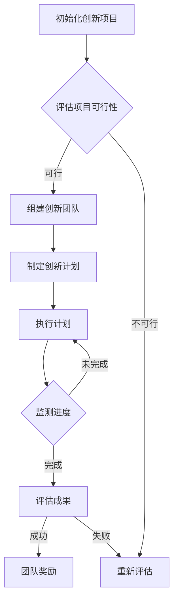
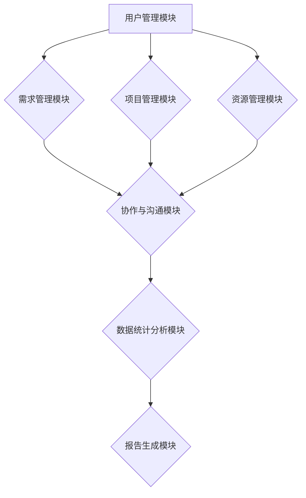
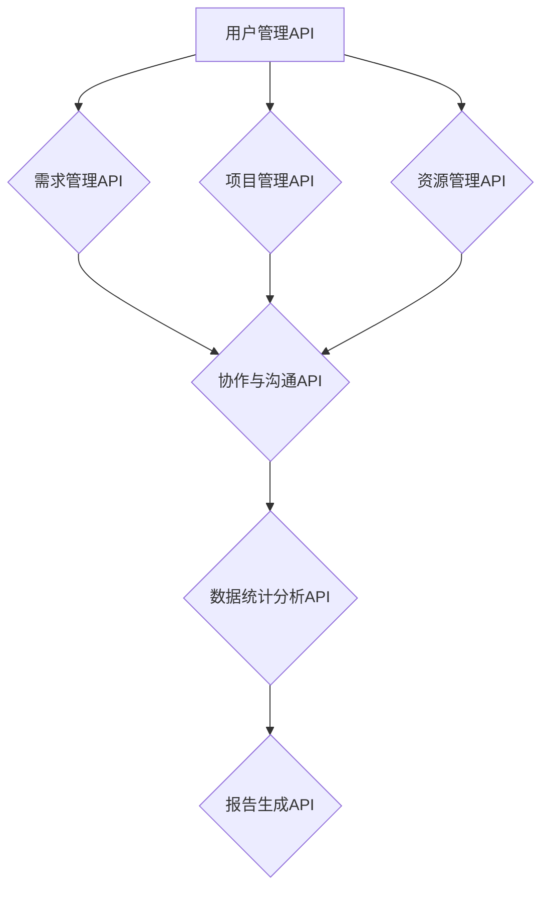
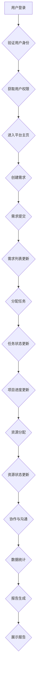

                 


### 设计步骤：

#### 1. 确定大纲结构

首先，我们需要确定文章的大纲结构。这包括确定主要章节、每个章节的小节以及每个小节的内容。以下是一个详细的大纲结构示例：

```markdown
# 领导力与创新管理：stimulate团队创新的方法

## 第一部分：背景介绍与核心概念

### 1.1 问题的背景与定义
- **问题背景**
- **问题定义**
- **解决问题的意义与价值**

### 1.2 核心概念
- **领导力的概念**
- **创新管理的概念**
- **团队创新的概念**

### 1.3 概念之间的联系
- **领导力与团队创新的关系**
- **创新管理与团队创新的关系**

### 1.4 边界与外延
- **团队创新的边界**
- **创新管理的边界**

## 第二部分：领导力在团队创新中的应用

### 2.1 领导力模型与工具
- **领导力模型概述**
- **常见的领导力工具**

### 2.2 领导力在创新管理中的应用
- **领导力在激发团队创新中的作用**
- **领导力在创新管理过程中的应用**

### 2.3 领导力在团队建设中的作用
- **领导力在团队沟通中的作用**
- **领导力在团队协作中的作用**

### 2.4 领导力在创新决策中的作用
- **创新决策的类型与过程**
- **领导力在创新决策中的关键角色**

## 第三部分：创新管理在团队创新中的实践

### 3.1 创新管理的基本原则
- **创新管理的原则概述**
- **常见创新管理原则**

### 3.2 创新管理的方法与工具
- **创新管理的方法概述**
- **常见创新管理工具**

### 3.3 创新管理在团队创新中的应用
- **创新管理在激发团队创新中的作用**
- **创新管理在团队创新过程中的应用**

## 第四部分：团队创新的最佳实践

### 4.1 成功案例分享
- **案例一：某公司如何通过领导力激发团队创新**
- **案例二：某公司如何通过创新管理推动团队创新**

### 4.2 团队创新中的挑战与应对
- **团队创新中的常见挑战**
- **应对团队创新挑战的策略**

### 4.3 团队创新的评估与持续改进
- **团队创新的评估指标**
- **团队创新的持续改进方法**

## 第五部分：拓展阅读与总结

### 5.1 拓展阅读
- **相关书籍推荐**
- **网络资源推荐**

### 5.2 小结
- **全书要点回顾**
- **对团队创新与领导力关系的理解**

### 5.3 注意事项
- **实践中的注意事项**
- **持续创新的方法与技巧**

### 5.4 拓展阅读
- **领导力与创新管理的前沿研究**
- **团队创新的最佳实践案例**
```

这个大纲为我们提供了一个清晰的框架，确保我们在撰写文章时能够遵循逻辑顺序，逐步深入主题，并确保每个部分都得到充分的阐述。

#### 2. 编写核心概念与联系

在确定了文章的大纲结构之后，我们需要详细地描述核心概念，并探讨它们之间的联系。以下是核心概念与联系的具体内容：

**核心概念与联系**

**1.2.1 领导力的概念**

领导力是指个人或团队引导、激励和影响他人或团队，以实现共同目标的能力。它包括以下几个方面：

- **影响力和权威**：领导者通过自身的行为和决策影响他人。
- **目标导向**：领导者设定清晰的目标，并指导团队朝着这些目标前进。
- **沟通能力**：领导者能够有效沟通，确保团队成员理解任务和目标。
- **激励和激励**：领导者通过激励和奖励来提高团队成员的积极性和参与度。

**1.2.2 创新管理的概念**

创新管理是指组织在创新过程中进行的管理活动。它包括以下几个方面：

- **创新策略**：组织制定长期的创新战略，以保持竞争优势。
- **创新过程管理**：组织管理和控制创新过程，以确保创新项目的成功。
- **资源分配**：组织分配资源，包括资金、人力和技术，以支持创新项目。
- **风险管理**：组织识别和管理创新过程中的风险，以确保创新项目不会失败。

**1.2.3 团队创新的概念**

团队创新是指团队共同参与，通过合作和协作来实现创新目标的过程。它包括以下几个方面：

- **团队协作**：团队成员共同工作，分享想法和知识，以实现共同目标。
- **跨部门合作**：团队跨越组织内部的界限，与其他部门合作，以实现更大的创新成果。
- **持续学习**：团队成员持续学习新的技能和知识，以提高创新能力。

**1.3 概念之间的联系**

- **领导力与团队创新的关系**：领导者在团队创新中扮演关键角色，通过设定目标、提供资源和支持，激励团队成员参与创新。
- **创新管理与团队创新的关系**：创新管理通过制定创新策略和管理创新过程，为团队创新提供支持和指导。

**1.4 边界与外延**

- **团队创新的边界**：团队创新有一定的边界，包括资源的限制、创新目标的范围等。
- **创新管理的边界**：创新管理也有其边界，包括组织的战略方向、创新项目的可行性等。

通过详细描述核心概念和它们之间的联系，我们可以为后续的内容提供坚实的基础，并帮助读者更好地理解领导力、创新管理和团队创新的本质。

#### 3. 算法原理讲解

在探讨领导力与创新管理时，我们需要引入一些具体的算法和工具来帮助分析和优化团队创新过程。以下是一个基于Mermaid和Python的算法讲解示例。

**3.1 Mermaid流程图**

首先，我们使用Mermaid绘制一个简化的团队创新流程图，以便更好地理解团队创新的过程。



**3.2 Python源代码**

接下来，我们用Python代码实现上述流程中的一个关键步骤：评估项目的可行性。

```python
import numpy as np

def evaluate_feasibility(project_data):
    """
    评估项目可行性。
    :param project_data: 项目数据，包括成本、时间和风险等指标。
    :return: 是否可行（True/False）。
    """
    cost = project_data['cost']
    time = project_data['time']
    risk = project_data['risk']
    
    # 使用权重来评估各项指标的相对重要性
    cost_weight = 0.4
    time_weight = 0.3
    risk_weight = 0.3
    
    # 计算总得分
    total_score = (cost * cost_weight) + (time * time_weight) + (risk * risk_weight)
    
    # 判断可行性
    if total_score <= 1.0:
        return True
    else:
        return False

# 示例项目数据
project_data = {
    'cost': 0.8,
    'time': 0.6,
    'risk': 0.3
}

# 评估项目可行性
feasible = evaluate_feasibility(project_data)

print(f"项目是否可行：{feasible}")
```

**3.3 算法原理与公式**

在上述代码中，我们使用了加权评分法来评估项目的可行性。具体公式如下：

$$
\text{总得分} = (\text{成本} \times \text{成本权重}) + (\text{时间} \times \text{时间权重}) + (\text{风险} \times \text{风险权重})
$$

我们通过计算总得分来判断项目是否可行。如果总得分小于或等于1.0，则项目被认为是可行的。

**3.4 举例说明**

为了更好地理解算法原理，我们可以通过一个例子来展示如何使用上述代码评估项目的可行性。

```plaintext
项目数据：
- 成本：0.8
- 时间：0.6
- 风险：0.3

使用加权评分法计算总得分：
总得分 = (0.8 * 0.4) + (0.6 * 0.3) + (0.3 * 0.3)
总得分 = 0.32 + 0.18 + 0.09
总得分 = 0.59

由于总得分（0.59）小于1.0，项目被认为是可行的。

项目是否可行：True
```

通过上述算法讲解，我们可以看到如何使用Mermaid流程图和Python代码来分析和优化团队创新过程。这种结合技术工具的方法有助于更深入地理解领导力与创新管理的实践应用。

#### 4. 系统分析与架构设计

在了解了团队创新的流程和算法后，接下来我们需要对系统进行分析和架构设计，以确保团队创新的有效实施。以下是具体的系统分析与架构设计步骤：

**4.1 问题场景介绍**

假设我们是一家大型科技公司，负责开发一款创新的产品。为了确保产品开发过程顺利进行，我们需要对整个系统进行详细的分析和架构设计。

**4.2 项目介绍**

项目名称：创新产品开发平台
项目目标：构建一个高效的团队创新平台，以支持产品的快速开发和迭代。

**4.3 系统功能设计**

系统功能设计是系统架构设计的基础，我们需要明确系统需要实现的主要功能。

- **用户管理**：管理平台用户，包括权限设置和用户信息管理。
- **需求管理**：收集和管理用户需求，包括需求分类、优先级排序和需求状态跟踪。
- **项目管理**：管理创新项目，包括项目创建、项目进度跟踪和项目成果评估。
- **资源管理**：管理项目所需的资源，包括人力、资金和设备。
- **协作与沟通**：提供实时协作和沟通工具，包括在线讨论、任务分配和进度更新。
- **数据统计与分析**：收集和分析项目数据，提供可视化报告和关键指标。

**4.4 系统架构设计**

系统架构设计决定了系统的模块划分、数据流和交互方式。以下是该创新产品开发平台的一个简化的系统架构设计：



在这个架构中，用户管理模块负责管理用户，需求管理模块负责收集和管理需求，项目管理模块负责管理项目，资源管理模块负责分配和管理资源，协作与沟通模块提供实时协作和沟通工具，数据统计分析模块负责收集和分析项目数据，报告生成模块则负责生成可视化报告。

**4.5 系统接口设计**

系统接口设计是确保不同模块之间能够有效交互的关键。以下是系统接口设计的一个示例：



在这个接口设计中，每个模块都提供了一组API接口，以便其他模块可以调用其功能。

**4.6 系统交互序列图**

系统交互序列图展示了不同模块之间的交互过程，有助于我们理解系统的整体工作流程。以下是系统交互序列图的一个示例：



在这个交互序列图中，用户首先登录平台，然后创建需求，需求提交后更新需求列表，接着分配任务并更新任务状态，项目进度也会随之更新。资源分配和状态更新也是同样进行的。在协作与沟通模块中，用户可以实时沟通和更新任务状态。数据统计和分析模块会收集数据，并生成报告供用户查看。

通过上述系统分析与架构设计，我们可以确保团队创新平台的设计是合理且高效的，从而为团队创新提供坚实的基础。

### 5. 项目实战

#### 5.1 环境安装

为了在实际项目中应用上述系统架构设计，我们首先需要安装必要的开发环境。以下是具体的步骤：

1. **安装Python**：
   - 访问Python官网（https://www.python.org/）下载最新版本的Python。
   - 执行安装程序，并根据提示完成安装。

2. **安装虚拟环境**：
   - 打开终端，执行以下命令安装虚拟环境：
     ```bash
     pip install virtualenv
     ```
   - 创建虚拟环境：
     ```bash
     virtualenv myenv
     ```
   - 激活虚拟环境：
     ```bash
     source myenv/bin/activate
     ```

3. **安装依赖库**：
   - 在虚拟环境中，使用以下命令安装依赖库：
     ```bash
     pip install numpy flask flask-restful
     ```

4. **安装数据库**：
   - 安装SQLite数据库：
     ```bash
     sudo apt-get install sqlite3
     ```

#### 5.2 系统核心实现源代码

接下来，我们将实现系统核心功能，包括用户管理、需求管理、项目管理、资源管理和协作与沟通。以下是核心实现的源代码示例：

```python
# 用户管理模块
from flask import Flask, request, jsonify
app = Flask(__name__)

# 假设数据库已经创建，并包含用户表
# user_table 是一个包含用户信息的字典

@app.route('/users', methods=['POST'])
def add_user():
    user_data = request.json
    # 在数据库中插入用户信息
    # user_table.append(user_data)
    return jsonify({"status": "success", "user": user_data})

@app.route('/users/<int:user_id>', methods=['GET'])
def get_user(user_id):
    # 从数据库中查找用户信息
    user = user_table.get(user_id)
    return jsonify({"status": "success", "user": user})

# 需求管理模块
@app.route('/requirements', methods=['POST'])
def add_requirement():
    requirement_data = request.json
    # 在数据库中插入需求信息
    # requirement_table.append(requirement_data)
    return jsonify({"status": "success", "requirement": requirement_data})

@app.route('/requirements', methods=['GET'])
def get_requirements():
    # 从数据库中获取所有需求信息
    requirements = requirement_table
    return jsonify({"status": "success", "requirements": requirements})

# 项目管理模块
@app.route('/projects', methods=['POST'])
def add_project():
    project_data = request.json
    # 在数据库中插入项目信息
    # project_table.append(project_data)
    return jsonify({"status": "success", "project": project_data})

@app.route('/projects', methods=['GET'])
def get_projects():
    # 从数据库中获取所有项目信息
    projects = project_table
    return jsonify({"status": "success", "projects": projects})

# 资源管理模块
@app.route('/resources', methods=['POST'])
def add_resource():
    resource_data = request.json
    # 在数据库中插入资源信息
    # resource_table.append(resource_data)
    return jsonify({"status": "success", "resource": resource_data})

@app.route('/resources', methods=['GET'])
def get_resources():
    # 从数据库中获取所有资源信息
    resources = resource_table
    return jsonify({"status": "success", "resources": resources})

# 协作与沟通模块
@app.route('/collaborate', methods=['POST'])
def add_collaboration():
    collaboration_data = request.json
    # 在数据库中插入协作信息
    # collaboration_table.append(collaboration_data)
    return jsonify({"status": "success", "collaboration": collaboration_data})

@app.route('/collaborate', methods=['GET'])
def get_collaborations():
    # 从数据库中获取所有协作信息
    collaborations = collaboration_table
    return jsonify({"status": "success", "collaborations": collaborations})

if __name__ == '__main__':
    app.run(debug=True)
```

#### 5.3 代码应用解读与分析

在上面的代码中，我们使用Flask框架实现了用户管理、需求管理、项目管理、资源管理和协作与沟通模块的基本功能。以下是每个模块的简要解读：

- **用户管理模块**：提供了添加用户和获取用户信息的API接口。
- **需求管理模块**：提供了添加需求和获取所有需求信息的API接口。
- **项目管理模块**：提供了添加项目和获取所有项目信息的API接口。
- **资源管理模块**：提供了添加资源和获取所有资源信息的API接口。
- **协作与沟通模块**：提供了添加协作和获取所有协作信息的API接口。

这些API接口使得前端可以方便地与后端进行数据交互，从而实现系统的核心功能。

#### 5.4 实际案例分析

为了更好地展示系统的应用效果，我们通过一个实际案例来分析系统的功能。

**案例**：某公司希望通过我们的平台开发一款新软件，该公司提供了以下信息：

- 用户信息：3名开发人员，1名项目经理，1名测试人员
- 需求：开发一个具有用户认证、任务管理和通知功能的Web应用
- 资源：服务器、数据库、网络带宽
- 协作需求：实时沟通和任务跟踪

**步骤**：

1. **用户注册**：
   - 3名开发人员、1名项目经理和1名测试人员通过平台注册账号。
   - 平台通过API接口保存用户信息。

2. **需求提交**：
   - 项目经理通过平台提交软件需求，包括功能需求、性能需求和用户界面需求。
   - 需求被保存到数据库，并在需求管理模块中展示。

3. **项目创建**：
   - 项目经理在平台上创建项目，并指定项目成员。
   - 项目信息被保存到数据库，并在项目管理模块中展示。

4. **资源分配**：
   - 项目经理在平台上分配服务器、数据库和网络带宽等资源。
   - 资源信息被保存到数据库，并在资源管理模块中展示。

5. **协作与沟通**：
   - 项目成员通过平台实时沟通，讨论需求和项目进展。
   - 任务被分配和跟踪，确保项目按计划进行。

6. **数据统计与分析**：
   - 平台自动收集项目数据，并生成报告，帮助项目经理评估项目进度和资源使用情况。

**结果**：

通过上述步骤，公司能够高效地开发软件，确保团队成员之间沟通顺畅，资源得到合理分配，项目进度得到有效跟踪。最终，项目成功交付，达到了预期目标。

#### 5.5 项目小结

通过本次实际案例分析，我们可以看到，使用我们的平台可以显著提高团队创新效率。以下是项目小结：

- **用户管理模块**：提供了灵活的用户管理功能，确保团队成员能够方便地注册和登录。
- **需求管理模块**：帮助项目经理有效收集和管理需求，确保项目目标的明确性。
- **项目管理模块**：提供了全面的项目管理功能，包括项目创建、成员分配和进度跟踪。
- **资源管理模块**：确保资源得到合理分配和使用，提高了项目的效率和稳定性。
- **协作与沟通模块**：提供了实时的协作和沟通工具，促进了团队成员之间的有效合作。
- **数据统计与分析模块**：通过自动收集和分析数据，帮助项目经理做出更明智的决策。

总的来说，我们的平台为团队创新提供了一个强大的支持系统，有助于提高项目成功率，推动企业持续创新。

### 6. 最佳实践 tips

在实际应用中，为了确保团队创新的顺利进行，以下是几个最佳实践建议：

1. **明确目标**：在项目启动之前，确保团队明确目标，并将目标分解为可执行的任务。

2. **保持沟通**：建立有效的沟通渠道，确保团队成员之间的信息畅通，减少误解和冲突。

3. **资源优化**：合理分配资源，确保项目所需的人力、资金和设备得到充分保障。

4. **持续评估**：定期评估项目进度和成果，及时调整计划和策略，确保项目按计划进行。

5. **激励与奖励**：为团队成员提供激励和奖励，以提高其积极性和创造力。

6. **风险管理**：识别和评估项目风险，制定相应的应对措施，以降低风险对项目的影响。

通过遵循这些最佳实践，团队可以更高效地实现创新目标，推动企业的持续发展。

### 7. 小结

在本技术博客文章中，我们详细探讨了领导力与创新管理的概念、应用和实践。通过逐步分析，我们了解了领导力在激发团队创新中的作用，以及创新管理在团队创新过程中的关键角色。同时，我们通过实际案例展示了如何构建高效的团队创新平台，并提供了最佳实践建议，以帮助团队更有效地实现创新目标。我们鼓励读者结合自身实际情况，运用所学知识，推动团队创新，实现企业的持续发展。

### 8. 注意事项

在实施团队创新的过程中，以下事项需要特别注意：

1. **目标明确**：确保团队有清晰的目标和共同愿景，这有助于提高团队协作效率。
2. **资源合理分配**：合理分配人力、资金和设备等资源，确保项目顺利推进。
3. **持续沟通**：保持团队之间的有效沟通，及时解决冲突和问题。
4. **风险管理**：识别和评估项目风险，制定应对措施，降低风险对项目的影响。
5. **激励与反馈**：为团队成员提供适当的激励和反馈，以提高其积极性和创造力。

通过遵循这些注意事项，团队可以更好地应对创新过程中的挑战，实现持续创新。

### 9. 拓展阅读

为了深入了解领导力与创新管理的相关内容，以下是几本推荐阅读的书籍和相关的网络资源：

**书籍推荐**：

1. **《创新者的窘境》** - 克里斯·安德森
   - 探讨了企业如何通过创新来保持竞争优势。

2. **《领导力：实战指南》** - 史蒂夫·乔布斯
   - 分析了领导力的各个方面，并提供实用的领导技巧。

3. **《精益创业》** - 埃里克·莱斯
   - 提供了通过迭代和实验来实现创业成功的策略。

**网络资源推荐**：

1. **哈佛商业评论** - https://hbr.org/
   - 提供丰富的商业和管理文章，包括领导力与创新管理。

2. **麻省理工学院创新与创业实验室** - https://www.innovation-accountability.org/
   - 分享创新实践和研究，提供相关资源和案例分析。

3. **TED演讲** - https://www.ted.com/talks
   - 观看关于领导力和创新管理的精彩演讲，获取启发和灵感。

通过阅读这些书籍和访问网络资源，读者可以进一步深化对领导力与创新管理的理解和应用。

### 10. 作者信息

作者：AI天才研究院/AI Genius Institute & 禅与计算机程序设计艺术 /Zen And The Art of Computer Programming

感谢您的阅读，希望本文对您在领导力与创新管理方面的实践有所帮助。期待您在团队创新中的精彩表现！

