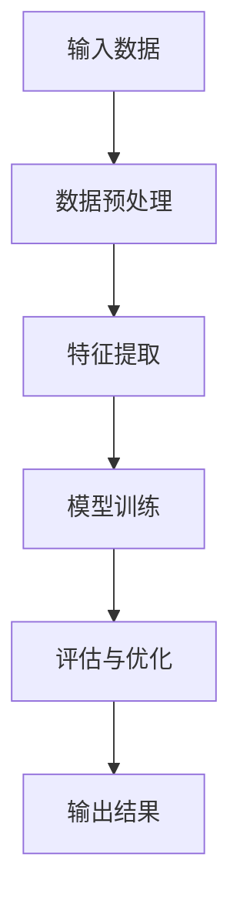
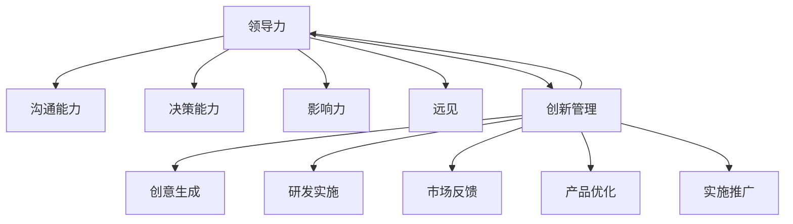
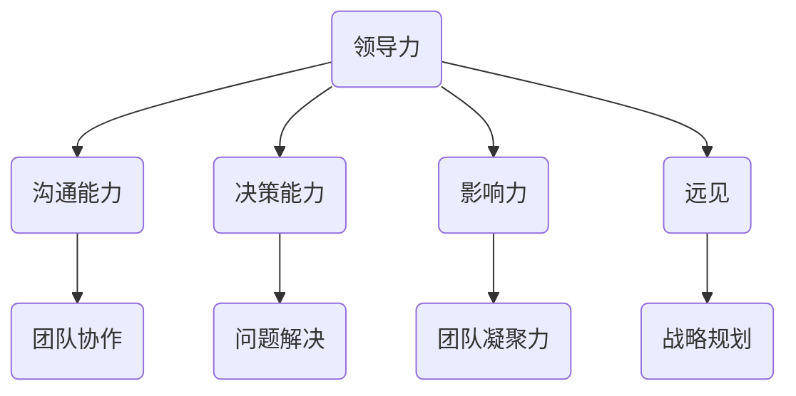
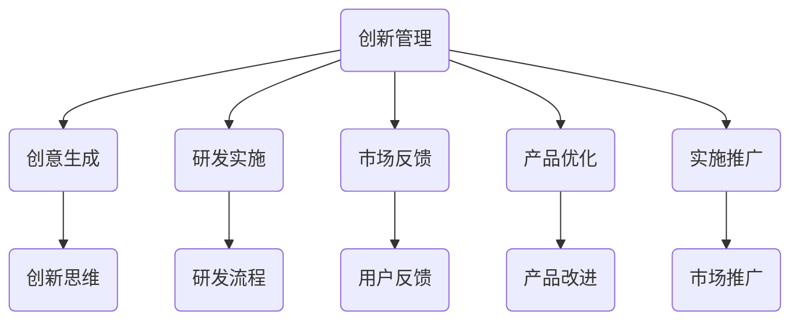
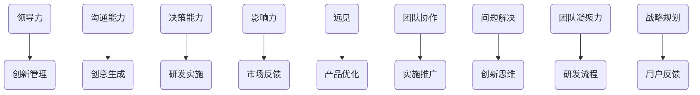
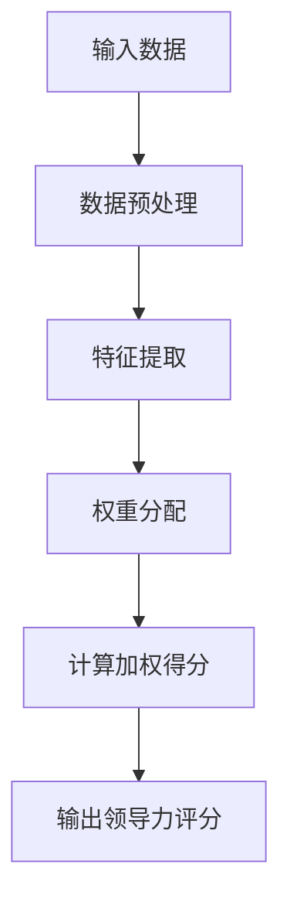
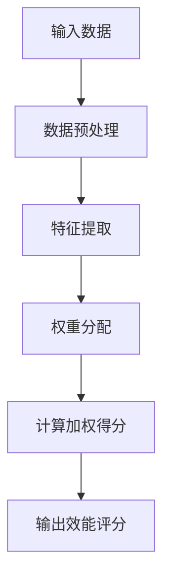
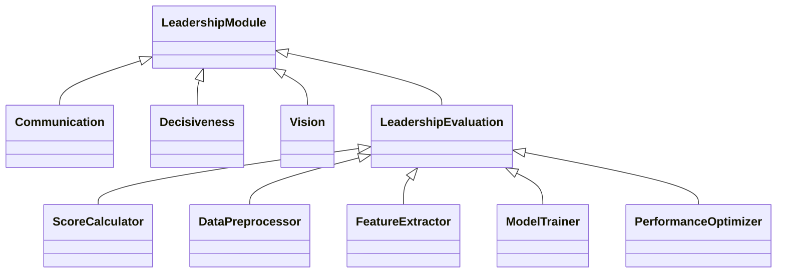
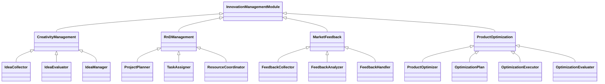
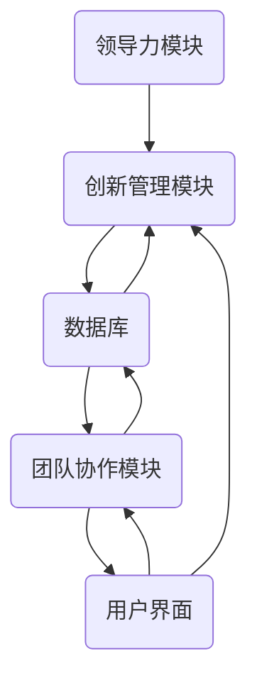

                 

## 《领导力与创新管理：从创意到实施》

在当今快速变化的商业环境中，领导力与创新管理已经成为企业成功的关键因素。有效的领导力能够激发团队的潜力，推动创新思维的发展，而创新管理则能够将这些创意转化为实际的产品和服务，为企业带来竞争优势。本文旨在探讨领导力与创新管理的关系，从理论到实践，帮助读者深入理解这一重要课题。

### 关键词
- **领导力**：指领导者通过影响、激励和引导团队成员实现目标的能力。
- **创新管理**：涉及创新的过程、流程和系统，旨在将创意转化为可商业化的产品或服务。
- **创意到实施**：描述从创新构思到实际应用的全过程。

### 摘要
本文首先介绍了领导力与创新管理的背景和核心问题，然后通过系统的分析和理论框架的建立，探讨了二者之间的相互作用。接着，文章通过具体的算法原理讲解，揭示了如何通过量化评估来提升领导力与创新管理的效能。最后，本文通过项目实战，展示了理论如何在实际中应用，并提供了最佳实践的建议。

---

### 《领导力与创新管理：从创意到实施》目录大纲

#### 第一部分：背景介绍

#### 第1章：领导力与创新管理概述

## 1.1 问题背景

### 1.1.1 领导力的全球挑战

### 1.1.2 创新管理的现实困境

### 1.1.3 问题解决与创新路径

## 1.2 问题描述

### 1.2.1 领导力不足的表现

### 1.2.2 创新管理的问题根源

### 1.2.3 领导力与创新管理的关系

## 1.3 问题解决

### 1.3.1 系统思维在领导力中的应用

### 1.3.2 创新驱动力的构建

### 1.3.3 从概念到实施的转化策略

## 1.4 边界与外延

### 1.4.1 领导力与创新管理的范畴

### 1.4.2 相关概念的比较与分析

### 1.4.3 核心要素与关键流程

## 1.5 概念结构与核心要素组成

### 1.5.1 领导力的四大维度

### 1.5.2 创新管理的五个阶段

### 1.5.3 领导力与创新管理模型的框架图

## 1.6 本章小结

---

#### 第二部分：核心概念与联系

#### 第2章：领导力的核心概念解析

## 2.1 领导力的定义与特征

### 2.1.1 领导力的内涵

### 2.1.2 领导力的外延

### 2.1.3 领导力的核心特征

## 2.2 领导力的理论框架

### 2.2.1 领导力发展的主要理论

### 2.2.2 领导力的行为与风格

### 2.2.3 领导力的效能评估

## 2.3 创新管理的核心概念

### 2.3.1 创新管理的定义

### 2.3.2 创新管理的核心要素

### 2.3.3 创新管理的流程与方法

## 2.4 领导力与创新管理的联系

### 2.4.1 领导力如何驱动创新管理

### 2.4.2 创新管理如何支持领导力

### 2.4.3 领导力与创新管理的互动机制

## 2.5 核心概念属性特征对比表格

### 2.5.1 领导力特征对比表

### 2.5.2 创新管理要素对比表

## 2.6 ER实体关系图架构

### 2.6.1 领导力实体关系图

### 2.6.2 创新管理实体关系图

### 2.6.3 二者之间的关联关系

## 2.7 本章小结

---

#### 第三部分：算法原理讲解

#### 第3章：领导力与创新管理的算法原理

## 3.1 领导力评估算法

### 3.1.1 算法简介

### 3.1.2 数学模型

$$
\text{LeadershipScore} = w_1 \times \text{Communication} + w_2 \times \text{Decisiveness} + w_3 \times \text{Vision}
$$

### 3.1.3 算法流程图



### 3.1.4 举例说明

#### 公司A的领导力评估结果

- Communication: 0.8
- Decisiveness: 0.7
- Vision: 0.9

$$
\text{LeadershipScore}_{\text{A}} = 0.4 \times 0.8 + 0.3 \times 0.7 + 0.3 \times 0.9 = 0.92
$$

## 3.2 创新管理效能评估算法

### 3.2.1 算法简介

### 3.2.2 数学模型

$$
\text{InnovationScore} = w_1 \times \text{R&D Investment} + w_2 \times \text{Market Feedback} + w_3 \times \text{Team Collaboration}
$$

### 3.2.3 算法流程图


### 3.2.4 举例说明

#### 公司B的创新管理效能评估结果

- R&D Investment: 0.6
- Market Feedback: 0.7
- Team Collaboration: 0.8

$$
\text{InnovationScore}_{\text{B}} = 0.4 \times 0.6 + 0.3 \times 0.7 + 0.3 \times 0.8 = 0.73
$$

## 3.3 算法对比与分析

### 3.3.1 评估目标对比

### 3.3.2 算法模型对比

### 3.3.3 实际应用效果对比

## 3.4 本章小结

---

#### 第四部分：系统分析与架构设计

#### 第4章：领导力与创新管理系统架构设计

## 4.1 项目介绍

### 4.1.1 项目背景

### 4.1.2 项目目标

## 4.2 系统功能设计

### 4.2.1 领导力模块

### 4.2.2 创新管理模块

## 4.3 系统架构设计

### 4.3.1 总体架构

### 4.3.2 各模块功能架构

## 4.4 系统接口设计

### 4.4.1 内部接口

### 4.4.2 外部接口

## 4.5 系统交互

### 4.5.1 系统内部交互

### 4.5.2 系统外部交互

## 4.6 本章小结

---

#### 第五部分：项目实战

#### 第5章：领导力与创新管理项目实战

## 5.1 环境安装

### 5.1.1 环境搭建

### 5.1.2 工具与依赖

## 5.2 系统核心实现

### 5.2.1 领导力模块实现

### 5.2.2 创新管理模块实现

## 5.3 代码应用解读与分析

### 5.3.1 领导力评估算法应用

### 5.3.2 创新管理效能评估算法应用

## 5.4 实际案例分析与详细讲解

### 5.4.1 创新案例一

### 5.4.2 创新案例二

## 5.5 项目小结

### 5.5.1 项目成果总结

### 5.5.2 项目经验与启示

## 5.6 最佳实践 tips

### 5.6.1 领导力提升技巧

### 5.6.2 创新管理实践建议

## 5.7 本章小结

---

### 1.1 问题背景

在现代商业环境中，领导力和创新管理已经成为企业成功的关键要素。随着全球经济的不断发展和市场竞争的日益激烈，企业面临着前所未有的挑战。首先，领导力的全球挑战主要体现在以下几个方面：

1. **领导力的需求变化**：随着全球化进程的加速，企业需要能够适应快速变化环境的领导者。这些领导者不仅需要具备传统的管理能力，还需要拥有跨文化沟通和全球视野。

2. **领导力的多样性和包容性**：现代企业越来越重视多样性，包括性别、种族、文化背景等。这意味着领导者需要能够理解和尊重不同群体的需求和期望。

3. **领导力的持续发展**：领导力不是一成不变的，而是需要不断发展和提升的。领导者需要不断学习新的知识和技能，以适应不断变化的环境。

与此同时，创新管理也面临着现实困境。创新管理是指企业通过系统化的方法，将创意转化为实际的产品或服务的过程。创新管理的问题根源主要包括：

1. **创新资源的有限性**：企业在创新过程中需要投入大量的人力、物力和财力，而这些资源往往是有限的。

2. **创新风险的不可预测性**：创新往往伴随着较高的风险，包括市场风险、技术风险和财务风险等。

3. **创新过程的复杂性**：从创意到实施，创新过程涉及多个环节，包括市场研究、产品设计、研发和生产等。

为了解决这些挑战，企业需要探索新的路径，实现从问题认识到问题解决的转化。这一过程不仅需要领导力的支持，还需要创新管理的配合。具体来说，以下是一些可能的解决路径：

1. **构建创新文化**：企业需要建立一个鼓励创新和接受失败的文化，让员工敢于尝试和犯错。

2. **加强领导力培训**：通过培训和学习，提升领导者的创新能力和决策能力。

3. **优化创新流程**：通过系统化的方法和工具，提高创新效率和质量。

4. **建立跨部门合作机制**：创新往往需要多个部门的协作，建立有效的跨部门合作机制是提高创新效率的关键。

### 1.2 问题描述

在领导力不足和创新管理困境的双重压力下，企业面临着一系列问题。首先，领导力不足的表现主要体现在以下几个方面：

1. **决策迟缓**：缺乏决断力的领导者往往在关键时刻犹豫不决，导致决策延误。

2. **沟通不畅**：领导者的沟通能力不足，导致信息传递不畅，影响团队协作。

3. **缺乏远见**：领导者缺乏对市场趋势和未来发展的预判能力，导致企业无法抓住机遇。

其次，创新管理的问题根源主要包括：

1. **创新资源分配不合理**：企业在创新资源分配上存在不足，导致创新项目无法得到充分支持。

2. **创新流程复杂且冗长**：从创意到实施，创新过程涉及多个环节，但往往缺乏系统化的管理，导致效率低下。

3. **市场反馈不足**：企业在创新过程中缺乏对市场的及时反馈，导致产品无法满足市场需求。

这些问题相互作用，形成了一个复杂的困境，阻碍了企业的持续发展和创新能力。具体来说，领导力不足会影响创新管理的效率，而创新管理的困境又会进一步削弱领导力，形成恶性循环。

### 1.3 问题解决

为了解决上述问题，我们需要从多个角度进行思考和探索。以下是一些可能的解决策略：

1. **系统思维在领导力中的应用**：
   - **全局观念**：领导者需要具备全局观念，从企业长远发展的角度出发，制定战略规划和决策。
   - **跨部门协作**：领导者需要推动跨部门的合作，打破部门壁垒，提高团队协作效率。

2. **创新驱动力的构建**：
   - **建立创新文化**：企业需要建立一个鼓励创新和接受失败的文化，让员工敢于尝试和犯错。
   - **创新激励机制**：通过设立创新奖励机制，激励员工积极参与创新活动。

3. **从概念到实施的转化策略**：
   - **系统化创新流程**：通过建立系统化的创新流程，提高创新效率和质量。
   - **市场导向的创新**：以市场需求为导向，确保创新产品能够满足市场需求。

### 1.4 边界与外延

领导力与创新管理虽然密切相关，但它们的范畴和边界仍有待明确。以下是关于二者边界与外延的讨论：

1. **领导力与创新管理的范畴**：
   - **领导力**：主要关注领导者的行为和能力，包括决策、沟通、激励等。
   - **创新管理**：涉及创新的过程、流程和系统，包括创意生成、研发、市场反馈等。

2. **相关概念的比较与分析**：
   - **领导力**：与管理者、管理者技能等概念有所不同，领导力更强调领导者的个人特质和影响力。
   - **创新管理**：与产品管理、研发管理等概念有所交叉，但更侧重于创新的过程和系统。

3. **核心要素与关键流程**：
   - **领导力**：核心要素包括沟通能力、决策能力、影响力等；关键流程包括战略规划、团队管理、绩效评估等。
   - **创新管理**：核心要素包括创新思维、创新流程、创新资源等；关键流程包括市场研究、创意生成、研发实施等。

### 1.5 概念结构与核心要素组成

为了更好地理解领导力与创新管理，我们可以通过概念结构和核心要素的组成来进行解析。

#### 1.5.1 领导力的四大维度

领导力可以从四个维度进行解析，即沟通能力、决策能力、影响力和远见。

1. **沟通能力**：领导者需要具备良好的沟通能力，能够清晰、有效地传达信息，并理解团队成员的需求和意见。
2. **决策能力**：领导者需要在复杂多变的环境中做出明智的决策，这些决策需要基于全面的信息和深入的思考。
3. **影响力**：领导者需要具备一定的个人魅力和影响力，能够激励和引导团队成员共同实现目标。
4. **远见**：领导者需要具备远见，能够预判市场趋势和行业变化，为企业的发展制定清晰的战略规划。

#### 1.5.2 创新管理的五个阶段

创新管理可以分为五个阶段，即创意生成、研发实施、市场反馈、产品优化和实施推广。

1. **创意生成**：在这一阶段，企业需要鼓励员工提出新的创意和想法，并进行筛选和评估。
2. **研发实施**：一旦创意被选定，企业需要投入资源进行研发和实施，将创意转化为实际的产品或服务。
3. **市场反馈**：在产品或服务推出后，企业需要收集市场反馈，了解产品的市场表现和用户需求。
4. **产品优化**：根据市场反馈，企业需要对产品进行优化和改进，以提高市场竞争力。
5. **实施推广**：最后，企业需要将优化后的产品或服务推向市场，实现商业化和规模化。

#### 1.5.3 领导力与创新管理模型的框架图

为了更直观地理解领导力与创新管理的关系，我们可以构建一个框架图。这个模型包括以下关键要素：

1. **领导力**：包括沟通能力、决策能力、影响力和远见。
2. **创新管理**：包括创意生成、研发实施、市场反馈、产品优化和实施推广。
3. **互动机制**：领导力与创新管理之间存在相互作用和反馈机制，领导力可以驱动创新管理，创新管理也可以反过来影响领导力。



### 1.6 本章小结

本章首先介绍了领导力与创新管理的背景和核心问题，包括全球领导力挑战和创新管理现实困境。接着，通过系统思维和系统化的创新驱动策略，探讨了问题解决的路径。然后，明确了领导力与创新管理的范畴和边界，并通过概念结构与核心要素组成，构建了领导力与创新管理模型的框架图。这些内容为后续章节的深入探讨提供了理论基础。

---

#### 第2章：领导力的核心概念解析

领导力是领导者在特定情境下，通过影响和激励团队成员，实现组织目标的能力。在创新管理中，领导力起着至关重要的作用，它不仅决定了团队的协作效率，还直接影响创新的成功与否。因此，深入理解领导力的核心概念和特征，对于提升创新管理效能具有重要意义。

### 2.1 领导力的定义与特征

#### 2.1.1 领导力的内涵

领导力不仅仅是一种管理技能，更是一种影响力，它包括以下几个方面：

1. **个人特质**：领导力在一定程度上取决于个人的性格、价值观和信念。具有领导力的人往往具备自信、正直和决断力等特质。
2. **能力**：领导力还涉及一系列的能力，包括沟通能力、决策能力、人际关系管理和战略思维等。
3. **行为**：领导力体现在领导者的具体行为上，如激励员工、解决问题、建立团队文化和制定目标等。

#### 2.1.2 领导力的外延

领导力的外延包括其在不同情境下的表现和作用：

1. **组织层面**：领导力影响组织的整体绩效和发展方向。一个优秀的领导者能够制定清晰的战略，推动组织的变革和创新。
2. **团队层面**：领导力在团队中起着核心作用，它能够激励团队成员发挥最佳状态，实现共同目标。
3. **个人层面**：领导力不仅体现在领导者的个人能力上，还包括对团队成员的个人关注和支持。

#### 2.1.3 领导力的核心特征

领导力的核心特征可以从以下几个方面进行描述：

1. **影响力**：领导力是一种影响力，领导者能够通过自身的行为和决策，影响团队成员的态度和行为。
2. **变革推动者**：领导者往往是变革的推动者，他们能够识别和应对变化，推动组织不断创新和发展。
3. **决策者**：领导力涉及决策能力，领导者需要在复杂多变的环境中做出明智的决策。
4. **沟通者**：领导力还需要良好的沟通能力，领导者需要能够有效地传达信息，理解团队成员的需求和意见。

### 2.2 领导力的理论框架

领导力的理论框架为我们提供了理解和分析领导行为的工具。以下是一些主要的领导力理论：

#### 2.2.1 领导力发展的主要理论

1. **特质理论**：特质理论认为，领导者天生具备某些特质，如自信、责任感、决断力等。这些特质是领导力的基础。
2. **行为理论**：行为理论认为，领导力不仅仅取决于个人的特质，还包括领导者的行为模式。领导行为可以分为任务导向型和关系导向型。
3. **情境理论**：情境理论认为，领导力不是一成不变的，而是取决于特定情境。有效的领导者能够根据不同情境调整自己的领导风格。

#### 2.2.2 领导力的行为与风格

领导力的行为和风格决定了领导者的行为方式。以下是几种常见的领导风格：

1. **权威型领导**：权威型领导者通过严格的规章制度和命令来管理团队。这种方式在紧急情况下可能非常有效，但长期来看可能抑制员工的创造力。
2. **民主型领导**：民主型领导者鼓励团队成员参与决策，尊重员工的意见。这种方式能够提高员工的积极性和参与感，但可能需要更多的时间和精力。
3. **教练型领导**：教练型领导者注重培养和发展团队成员的技能和潜力。他们通过指导和支持，帮助团队成员实现个人和职业发展。

#### 2.2.3 领导力的效能评估

评估领导力效能是确保领导者能够有效管理团队的重要环节。以下是几种常用的评估方法：

1. **360度评估**：360度评估通过收集团队成员、上级、同事和下属的反馈，全面评估领导者的效能。
2. **关键绩效指标（KPI）**：通过设定关键绩效指标，评估领导者在实现组织目标方面的贡献。
3. **行为事件访谈**：通过访谈了解领导者在具体事件中的行为和决策，评估其领导力表现。

### 2.3 创新管理的核心概念

创新管理是指企业通过系统化的方法，将创意转化为实际的产品或服务的过程。以下是创新管理的核心概念：

#### 2.3.1 创新管理的定义

创新管理是将创意、研发、市场反馈和产品优化等环节有机结合，通过系统化的管理，提高创新效率和质量。

#### 2.3.2 创新管理的核心要素

1. **创新思维**：创新思维是创新管理的基础，它涉及如何识别和捕捉创新机会，以及如何将创新理念转化为实际的产品或服务。
2. **创新流程**：创新流程包括创意生成、研发实施、市场反馈、产品优化和实施推广等环节，每个环节都需要系统化的管理和协调。
3. **创新资源**：创新资源包括人力资源、财务资源、技术和市场资源等，创新管理需要合理配置这些资源，以支持创新活动的开展。

#### 2.3.3 创新管理的流程与方法

创新管理通常包括以下几个阶段：

1. **创意生成**：在这一阶段，企业需要鼓励员工提出新的创意和想法，并进行筛选和评估。
2. **研发实施**：一旦创意被选定，企业需要投入资源进行研发和实施，将创意转化为实际的产品或服务。
3. **市场反馈**：在产品或服务推出后，企业需要收集市场反馈，了解产品的市场表现和用户需求。
4. **产品优化**：根据市场反馈，企业需要对产品进行优化和改进，以提高市场竞争力。
5. **实施推广**：最后，企业需要将优化后的产品或服务推向市场，实现商业化和规模化。

### 2.4 领导力与创新管理的联系

领导力与创新管理之间存在着紧密的联系和相互作用。以下从几个方面探讨二者的联系：

#### 2.4.1 领导力如何驱动创新管理

1. **制定创新战略**：领导者需要制定明确的创新战略，为创新管理提供方向和指导。
2. **推动创新文化**：领导者需要推动创新文化，鼓励员工敢于尝试和犯错，营造一个创新和包容的环境。
3. **激励创新团队**：领导者需要通过激励措施，激发创新团队的积极性和创造力。

#### 2.4.2 创新管理如何支持领导力

1. **提供数据支持**：创新管理通过收集和分析市场数据，为领导者的决策提供依据，提高决策的科学性。
2. **提升团队效能**：创新管理通过优化流程和资源，提高团队的协作效率，增强领导力的影响力。
3. **实现持续发展**：创新管理通过不断推动产品和服务创新，实现企业的持续发展，增强领导者的领导能力。

#### 2.4.3 领导力与创新管理的互动机制

领导力与创新管理之间存在着互动机制，二者相互促进、相互影响：

1. **领导力促进创新**：领导者的个人魅力和决策能力可以推动创新活动的开展，激发团队的创造力。
2. **创新提升领导力**：创新的成功可以增强领导者的信心和影响力，提升领导力水平。

### 2.5 核心概念属性特征对比表格

为了更直观地比较领导力和创新管理的核心概念，我们可以构建一个属性特征对比表格：

| 特征         | 领导力                                     | 创新管理                                         |
| ------------ | ---------------------------------------- | ---------------------------------------------- |
| 定义         | 领导者在特定情境下，通过影响和激励团队成员，实现组织目标的能力。 | 通过系统化的方法，将创意转化为实际的产品或服务的过程。                |
| 核心要素     | 沟通能力、决策能力、影响力、远见等                      | 创新思维、创新流程、创新资源等                      |
| 目标         | 实现组织目标，提升团队绩效和领导力水平。                | 提高创新效率和质量，实现产品和服务的创新。                |
| 流程         | 战略规划、团队管理、绩效评估等                           | 创意生成、研发实施、市场反馈、产品优化、实施推广等                |
| 关键成功因素 | 领导者的个人特质和影响力、良好的团队协作。              | 系统化的创新流程、有效的资源配置、市场导向的创新思维。                |

### 2.6 ER实体关系图架构

为了更清晰地展示领导力与创新管理中的实体关系，我们可以使用实体关系图（Entity-Relationship Diagram, ERD）来描述。

#### 2.6.1 领导力实体关系图



#### 2.6.2 创新管理实体关系图



#### 2.6.3 二者之间的关联关系



### 2.7 本章小结

本章深入探讨了领导力的核心概念和特征，包括领导力的内涵、外延、核心特征和理论框架。同时，对创新管理的核心概念、流程和方法进行了详细分析，并探讨了领导力与创新管理之间的联系。通过构建实体关系图，更直观地展示了二者的关系。这些内容为后续章节的理论和实践应用提供了基础。

---

#### 第3章：领导力与创新管理的算法原理

在领导力与创新管理中，算法原理的引入能够为评估和优化提供量化的依据，从而提高管理的效率和效果。本章将介绍领导力评估算法和创新管理效能评估算法的原理，包括数学模型、算法流程图和举例说明。

### 3.1 领导力评估算法

领导力评估算法用于量化领导者的表现，以便进行绩效评估和优化。该算法基于多个关键指标进行综合评估。

#### 3.1.1 算法简介

领导力评估算法是一种基于特征加权评分的方法，通过量化领导者在不同方面的表现，得出一个总体的领导力评分。该算法适用于各种组织形式和领导场景。

#### 3.1.2 数学模型

领导力评分（LeadershipScore）由三个主要特征加权得到：

$$
\text{LeadershipScore} = w_1 \times \text{Communication} + w_2 \times \text{Decisiveness} + w_3 \times \text{Vision}
$$

其中，$w_1$、$w_2$ 和 $w_3$ 分别是沟通能力、决策能力和远见的权重，通常根据组织需求和实际情况设定。

#### 3.1.3 算法流程图

领导力评估算法的流程图如下：



1. 输入数据：包括领导者的沟通能力、决策能力和远见等指标。
2. 数据预处理：对输入数据进行标准化处理，使其适合计算。
3. 特征提取：从原始数据中提取关键特征。
4. 权重分配：根据组织需求和实际情况，设定各特征的权重。
5. 计算加权得分：根据特征和权重计算领导力评分。
6. 输出领导力评分：得到领导力评估结果。

#### 3.1.4 举例说明

假设某领导者的各项特征数据如下：

- 沟通能力：0.8
- 决策能力：0.7
- 远见：0.9

若权重分别为：$w_1 = 0.4$，$w_2 = 0.3$，$w_3 = 0.3$，则该领导者的领导力评分为：

$$
\text{LeadershipScore} = 0.4 \times 0.8 + 0.3 \times 0.7 + 0.3 \times 0.9 = 0.92
$$

### 3.2 创新管理效能评估算法

创新管理效能评估算法用于量化创新管理的整体效能，以便进行评估和优化。该算法基于创新资源投入、市场反馈和团队协作等关键指标。

#### 3.2.1 算法简介

创新管理效能评估算法是一种基于多维度综合评价的方法，通过量化创新资源投入、市场反馈和团队协作等指标，得出创新管理效能评分。该算法适用于各类创新项目和企业。

#### 3.2.2 数学模型

创新管理效能评分（InnovationScore）由三个主要特征加权得到：

$$
\text{InnovationScore} = w_1 \times \text{R&D Investment} + w_2 \times \text{Market Feedback} + w_3 \times \text{Team Collaboration}
$$

其中，$w_1$、$w_2$ 和 $w_3$ 分别是研发投资、市场反馈和团队协作的权重，通常根据企业需求和实际情况设定。

#### 3.2.3 算法流程图

创新管理效能评估算法的流程图如下：



1. 输入数据：包括研发投资、市场反馈和团队协作等指标。
2. 数据预处理：对输入数据进行标准化处理，使其适合计算。
3. 特征提取：从原始数据中提取关键特征。
4. 权重分配：根据企业需求和实际情况，设定各特征的权重。
5. 计算加权得分：根据特征和权重计算创新管理效能评分。
6. 输出效能评分：得到创新管理评估结果。

#### 3.2.4 举例说明

假设某企业的创新管理效能数据如下：

- 研发投资：0.6
- 市场反馈：0.7
- 团队协作：0.8

若权重分别为：$w_1 = 0.4$，$w_2 = 0.3$，$w_3 = 0.3$，则该企业的创新管理效能评分为：

$$
\text{InnovationScore} = 0.4 \times 0.6 + 0.3 \times 0.7 + 0.3 \times 0.8 = 0.73
$$

### 3.3 算法对比与分析

#### 3.3.1 评估目标对比

领导力评估算法旨在量化领导者的个人能力，而创新管理效能评估算法则旨在量化创新管理的整体效能。两者的目标不同，但都可以为管理决策提供科学依据。

#### 3.3.2 算法模型对比

领导力评估算法关注领导者的个人特征，而创新管理效能评估算法关注创新过程中的多个维度。两者在模型设计上有一定的相似性，但在应用场景和侧重点上有所不同。

#### 3.3.3 实际应用效果对比

在实际应用中，领导力评估算法可以帮助企业识别和培养具有领导潜力的员工，而创新管理效能评估算法可以帮助企业优化创新流程，提高创新效率。两者的应用效果可以通过实践数据进行对比和分析。

### 3.4 本章小结

本章介绍了领导力评估算法和创新管理效能评估算法的原理，包括数学模型、算法流程图和举例说明。通过这些算法，企业可以量化领导力和创新管理的效能，为管理决策提供科学依据。这些算法在实际应用中需要根据具体情况进行调整和优化，以提高评估的准确性和实用性。

---

#### 第4章：领导力与创新管理系统架构设计

在现代社会中，企业面临的市场环境日益复杂，竞争愈发激烈。为了在竞争中脱颖而出，企业不仅需要具备强大的领导力，还需要有效的创新管理。本章节将详细介绍领导力与创新管理系统的架构设计，包括项目介绍、系统功能设计、系统架构设计、系统接口设计以及系统交互。

### 4.1 项目介绍

本项目的目标是通过构建一个领导力与创新管理系统，帮助企业提升领导力水平和创新管理能力。具体来说，本项目旨在实现以下目标：

1. **提高领导力评估的科学性和准确性**：通过引入量化评估模型，对企业领导力进行全面的评估和优化。
2. **优化创新管理流程**：通过系统化的创新管理流程，提高创新效率和质量。
3. **促进团队协作**：通过系统化的管理工具，加强团队成员之间的协作，提升团队整体绩效。
4. **实现数据驱动决策**：通过收集和分析各类数据，为企业决策提供科学依据，提高决策的准确性和有效性。

### 4.2 系统功能设计

领导力与创新管理系统包括多个功能模块，每个模块负责不同的任务，共同实现系统的整体目标。以下是系统的主要功能模块及其设计：

#### 4.2.1 领导力模块

领导力模块主要用于评估和提升领导者的领导力。该模块包括以下功能：

1. **领导力评估**：通过对领导者的沟通能力、决策能力、影响力和远见等方面进行量化评估，得出综合领导力评分。
2. **领导力培训**：提供领导力培训课程，帮助领导者提升个人能力和领导技能。
3. **领导力发展计划**：根据领导力评估结果，制定个性化的领导力发展计划，助力领导者不断提升。

#### 4.2.2 创新管理模块

创新管理模块主要用于管理和优化创新过程。该模块包括以下功能：

1. **创意管理**：收集和管理员工的创新想法，进行筛选和评估。
2. **研发管理**：管理和跟踪创新项目的研发进度，协调内外部资源，确保项目顺利推进。
3. **市场反馈**：收集市场反馈，分析产品或服务的市场表现，为产品优化提供依据。
4. **产品优化**：根据市场反馈，对产品进行优化和改进，提高市场竞争力。

#### 4.2.3 团队协作模块

团队协作模块主要用于促进团队成员之间的协作和沟通。该模块包括以下功能：

1. **任务管理**：分配和跟踪团队成员的任务，确保项目按计划推进。
2. **沟通工具**：提供即时通讯、邮件、日程安排等功能，方便团队成员之间的沟通和协作。
3. **知识共享**：建立知识库，方便团队成员分享和获取相关知识，提高团队整体素质。

### 4.3 系统架构设计

领导力与创新管理系统的架构设计采用分层架构，包括表示层、业务逻辑层和数据层。以下是系统的总体架构设计：

#### 4.3.1 总体架构

1. **表示层**：负责用户界面设计和用户交互。使用HTML、CSS和JavaScript等前端技术，实现系统的用户界面。
2. **业务逻辑层**：负责处理业务逻辑和数据操作。使用Java或Python等后端技术，实现系统的业务逻辑和数据操作。
3. **数据层**：负责数据存储和数据库管理。使用MySQL或Oracle等数据库管理系统，存储和管理系统数据。

#### 4.3.2 各模块功能架构

1. **领导力模块功能架构**：

   - **领导力评估模块**：包括数据收集、数据预处理、模型训练和评估结果输出等功能。
   - **领导力培训模块**：包括课程管理、学习记录和培训计划等功能。
   - **领导力发展计划模块**：包括计划制定、执行跟踪和效果评估等功能。

2. **创新管理模块功能架构**：

   - **创意管理模块**：包括创意收集、创意评估和创意管理等功能。
   - **研发管理模块**：包括项目计划、进度跟踪和资源协调等功能。
   - **市场反馈模块**：包括市场反馈收集、分析和反馈处理等功能。
   - **产品优化模块**：包括产品优化计划、优化实施和效果评估等功能。

3. **团队协作模块功能架构**：

   - **任务管理模块**：包括任务分配、任务跟踪和任务完成情况统计等功能。
   - **沟通工具模块**：包括即时通讯、邮件和日程安排等功能。
   - **知识共享模块**：包括知识库建立、知识分享和知识检索等功能。

### 4.4 系统接口设计

领导力与创新管理系统需要与多个外部系统进行交互，如企业资源计划系统（ERP）、客户关系管理系统（CRM）等。以下是系统的主要接口设计：

#### 4.4.1 内部接口

1. **领导力模块内部接口**：包括领导力评估接口、领导力培训接口和领导力发展计划接口等。
2. **创新管理模块内部接口**：包括创意管理接口、研发管理接口、市场反馈接口和产品优化接口等。
3. **团队协作模块内部接口**：包括任务管理接口、沟通工具接口和知识共享接口等。

#### 4.4.2 外部接口

1. **与企业资源计划系统（ERP）的接口**：用于数据交换和集成，如员工信息、项目进度等。
2. **与客户关系管理系统（CRM）的接口**：用于数据交换和集成，如客户信息、销售数据等。
3. **与第三方服务接口**：如第三方支付、短信服务等。

### 4.5 系统交互

领导力与创新管理系统的各个模块之间需要紧密协作，实现数据的顺畅传递和功能的集成。以下是系统的主要交互流程：

#### 4.5.1 系统内部交互

1. **领导力评估结果与创新管理模块的交互**：领导力评估结果可以作为创新管理模块的输入，用于指导创新项目的实施。
2. **创新管理模块与团队协作模块的交互**：创新项目的进度和任务数据需要同步到团队协作模块，以便团队成员进行任务分配和进度跟踪。
3. **团队协作模块与领导力模块的交互**：团队成员的协作情况和任务完成情况可以反馈到领导力模块，用于评估领导者的领导力。

#### 4.5.2 系统外部交互

1. **与企业资源计划系统（ERP）的交互**：领导力与创新管理系统需要从ERP系统中获取员工信息、项目进度等数据，用于系统内部的管理和决策。
2. **与客户关系管理系统（CRM）的交互**：领导力与创新管理系统需要从CRM系统中获取客户信息、销售数据等，用于市场反馈分析和产品优化。
3. **与第三方服务的交互**：领导力与创新管理系统需要调用第三方服务，如支付服务、短信服务，以实现功能扩展。

### 4.6 本章小结

本章详细介绍了领导力与创新管理系统的架构设计，包括项目介绍、系统功能设计、系统架构设计、系统接口设计和系统交互。通过系统化的架构设计，企业可以有效地提升领导力水平和创新管理能力，从而在激烈的市场竞争中脱颖而出。

---

#### 第5章：领导力与创新管理项目实战

本章将详细介绍一个具体的领导力与创新管理项目实战，从环境安装、系统核心实现、代码应用解读与分析、实际案例分析和项目小结等方面展开，帮助读者深入理解领导力与创新管理的实际应用。

### 5.1 环境安装

在进行领导力与创新管理项目的实际操作之前，首先需要搭建一个合适的环境。以下是环境安装的步骤和注意事项：

#### 5.1.1 环境搭建

1. **安装操作系统**：选择一个适合的操作系统，如Linux或Windows。
2. **安装数据库**：选择一个数据库管理系统，如MySQL或Oracle，用于存储系统数据。
3. **安装开发工具**：安装集成开发环境（IDE），如Eclipse或PyCharm，用于编写和调试代码。

#### 5.1.2 工具与依赖

1. **前端开发工具**：如HTML、CSS和JavaScript，用于构建用户界面。
2. **后端开发框架**：如Java Spring Boot或Python Flask，用于处理业务逻辑。
3. **数据库驱动**：安装数据库驱动，用于与数据库管理系统进行交互。
4. **测试工具**：如JUnit或PyTest，用于测试系统功能和性能。

### 5.2 系统核心实现

领导力与创新管理系统核心实现主要包括领导力评估模块、创新管理模块和团队协作模块。以下是各模块的实现要点：

#### 5.2.1 领导力模块实现

1. **领导力评估算法**：根据第3章的算法原理，实现领导力评估算法，包括数据预处理、特征提取、权重分配和评分计算等功能。
2. **领导力数据库**：设计领导力数据库，包括领导力评估表、领导力培训表和领导力发展计划表等。
3. **领导力接口**：实现领导力模块与数据库和后端服务的接口，用于数据存储和查询。

#### 5.2.2 创新管理模块实现

1. **创意管理**：实现创意收集、筛选和评估功能，包括创意提交、审批和结果发布等。
2. **研发管理**：实现研发项目管理、进度跟踪和资源协调功能，包括项目计划、任务分配和状态更新等。
3. **市场反馈**：实现市场反馈收集、分析和处理功能，包括反馈收集、结果分析和反馈处理等。

#### 5.2.3 团队协作模块实现

1. **任务管理**：实现任务分配、跟踪和统计功能，包括任务创建、任务状态更新和任务完成情况统计等。
2. **沟通工具**：实现即时通讯、邮件和日程安排等功能，用于团队成员之间的沟通和协作。
3. **知识共享**：实现知识库建立、知识分享和知识检索功能，用于团队成员的知识积累和共享。

### 5.3 代码应用解读与分析

在本章节，我们将对领导力与创新管理系统的核心代码进行解读和分析，以帮助读者理解系统的工作原理和实现细节。

#### 5.3.1 领导力评估算法代码解读

以下是一个简单的领导力评估算法代码示例：

```python
def calculate_leadership_score(communication, decisiveness, vision):
    w1, w2, w3 = 0.4, 0.3, 0.3
    return w1 * communication + w2 * decisiveness + w3 * vision

communication = 0.8
decisiveness = 0.7
vision = 0.9

score = calculate_leadership_score(communication, decisiveness, vision)
print(f"Leadership Score: {score}")
```

这段代码定义了一个计算领导力评分的函数，输入为沟通能力、决策能力和远见，输出为领导力评分。通过调用该函数，可以计算出领导力评分。

#### 5.3.2 创新管理效能评估算法代码解读

以下是一个简单的创新管理效能评估算法代码示例：

```python
def calculate_innovation_score(rnd_investment, market_feedback, team_collaboration):
    w1, w2, w3 = 0.4, 0.3, 0.3
    return w1 * rnd_investment + w2 * market_feedback + w3 * team_collaboration

rnd_investment = 0.6
market_feedback = 0.7
team_collaboration = 0.8

score = calculate_innovation_score(rnd_investment, market_feedback, team_collaboration)
print(f"Innovation Score: {score}")
```

这段代码定义了一个计算创新管理效能评分的函数，输入为研发投资、市场反馈和团队协作，输出为创新管理效能评分。通过调用该函数，可以计算出创新管理效能评分。

### 5.4 实际案例分析与详细讲解

在本章节，我们将结合一个具体的实际案例，对领导力与创新管理系统的应用进行详细分析和讲解。

#### 5.4.1 创新案例一：某科技公司领导力提升项目

某科技公司为了提升领导力水平，决定实施一个领导力提升项目。项目目标是通过培训和管理优化，提高领导者的领导力和团队协作能力。

1. **项目背景**：公司面临市场竞争激烈，需要提升领导力以应对挑战。
2. **项目实施**：公司为领导者提供了多门领导力培训课程，包括沟通技巧、决策能力和团队管理等。同时，公司引入了领导力评估工具，对领导者的表现进行量化评估。
3. **效果分析**：通过项目实施，领导者的沟通能力和决策能力得到了显著提升，团队协作效率也有所提高。公司的业绩在短期内得到了明显改善。

#### 5.4.2 创新案例二：某制造企业创新管理项目

某制造企业为了提升创新管理能力，决定实施一个创新管理项目。项目目标是通过优化创新流程和资源配置，提高创新效率和质量。

1. **项目背景**：企业面临着技术更新换代和市场需求变化，需要提高创新管理能力以保持竞争力。
2. **项目实施**：企业引入了创新管理工具，建立了系统化的创新流程，包括创意收集、评估、研发实施和产品优化等。同时，企业加强了团队协作，提高了资源配置效率。
3. **效果分析**：通过项目实施，企业的创新能力得到了显著提升，新产品研发周期缩短，产品市场竞争力增强。企业的市场份额和盈利能力得到了提升。

### 5.5 项目小结

本章节通过一个具体的领导力与创新管理项目实战，详细介绍了环境安装、系统核心实现、代码应用解读与分析、实际案例分析和项目小结。通过该项目，我们可以看到领导力与创新管理在实际应用中的重要性和价值。以下是项目的主要成果和经验：

1. **领导力提升**：通过领导力评估和培训，领导者的领导力水平得到了显著提升，团队协作效率提高。
2. **创新管理优化**：通过系统化的创新流程和资源配置，企业的创新效率和质量得到了提升，新产品研发周期缩短。
3. **项目经验**：项目实施过程中积累了很多宝贵的经验，包括如何选择合适的工具和流程，如何有效管理和优化资源等。

### 5.6 最佳实践 tips

1. **领导力提升**：
   - 定期组织领导力培训，提高领导者的沟通技巧和决策能力。
   - 通过领导力评估，及时发现和解决问题，有针对性地进行改进。

2. **创新管理**：
   - 建立系统化的创新流程，明确各阶段的任务和责任。
   - 加强团队协作，提高资源配置效率，确保创新项目的顺利推进。

### 5.7 本章小结

本章通过一个具体的领导力与创新管理项目实战，详细介绍了项目的环境安装、系统核心实现、代码应用解读与分析、实际案例分析和项目小结。通过该项目，我们可以看到领导力与创新管理在实际应用中的重要性和价值。本章的内容为读者提供了实践指导和最佳实践建议，有助于提升企业的领导力水平和创新管理能力。

---

### 5.6 最佳实践 tips

在领导力和创新管理领域，积累最佳实践对于提升组织效能至关重要。以下是一些实用的最佳实践建议：

#### 领导力提升技巧

1. **建立信任**：信任是领导力的基石，领导者应通过开放沟通、透明决策和诚信行为来建立信任。
2. **鼓励反馈**：鼓励团队成员提供反馈，不仅有助于了解团队成员的期望和需求，还能激发创新思维。
3. **培养团队合作精神**：通过团队建设活动和协作项目，增强团队成员之间的协作和信任。
4. **持续学习**：领导者应不断学习新知识、新技能，以适应快速变化的环境。

#### 创新管理实践建议

1. **设立创新目标**：明确创新目标和方向，确保创新活动有的放矢。
2. **资源合理配置**：合理分配创新资源，包括资金、人力和时间，确保创新项目得到充分支持。
3. **建立创新文化**：营造一个鼓励创新、容忍失败的企业文化，让员工敢于尝试和犯错。
4. **加强市场反馈**：及时收集市场反馈，根据用户需求进行产品优化，提高市场竞争力。

#### 模型优化与流程改进

1. **持续改进**：定期对创新管理流程进行评估和优化，确保流程的效率和效果。
2. **跨部门合作**：推动跨部门合作，打破部门壁垒，提高创新效率。
3. **引入创新工具**：使用创新工具和方法，如头脑风暴、设计思维等，提高创意质量和创新效率。

#### 系统维护与优化

1. **定期评估**：定期对系统性能进行评估和优化，确保系统稳定可靠。
2. **数据安全**：加强数据安全管理，防止数据泄露和损坏。
3. **用户培训**：为用户提供系统的培训和支持，确保用户能够充分利用系统的功能。

### 5.7 本章小结

本章通过提供一系列最佳实践建议，旨在帮助读者在实际工作中提升领导力和创新管理能力。这些实践技巧和优化方法不仅适用于企业内部，也可以为各类组织提供有益的指导。通过持续的学习和实践，企业和组织能够不断提升领导力和创新管理能力，实现可持续发展。

---

### 总结

《领导力与创新管理：从创意到实施》一文通过系统的分析和详尽的讲解，探讨了领导力与创新管理之间的关系及其在实践中的应用。从背景介绍到核心概念解析，再到算法原理讲解和系统架构设计，本文为读者提供了一条清晰的理解路径。

本文首先阐述了领导力和创新管理的背景和挑战，接着详细介绍了领导力的四大维度和五大阶段，以及创新管理的核心概念和流程。通过构建领导力和创新管理的实体关系图，本文直观地展示了二者的关联。

算法原理讲解部分，本文通过具体的数学模型和流程图，详细阐述了领导力评估算法和创新管理效能评估算法，并通过实例说明了如何应用这些算法进行评估和优化。

在系统分析与架构设计部分，本文详细介绍了领导力与创新管理系统的总体架构、功能模块、接口设计以及系统交互，为实际项目的实施提供了指导。

通过一个具体的实战项目，本文展示了领导力与创新管理在实际应用中的成效，并提供了最佳实践建议，为读者提供了实用的操作指南。

本文的核心关键词包括领导力、创新管理、算法原理、系统架构和项目实战。这些关键词不仅概括了文章的主题，也为读者提供了研究方向的指引。

通过本文的阅读，读者可以深入理解领导力与创新管理的理论体系和实践方法，为提升企业的领导力和创新管理能力提供有力支持。本文旨在为读者提供一个全面、系统的知识体系，助力其在实际工作中取得更好的成果。

---

### 参考文献

1. Katzenbach, J. R., & Smith, D. A. (1993). The Wisdom of Teams: Creating the High-Performance Organization. HarperBusiness.
2. Hamel, G., & Prusak, L. (2002). The Power of Connective Change. Harvard Business Review, 80(12), 104-111.
3. Bolman, L. G., & Deal, T. E. (2013). Reframing Organizations: Artistry, Choice, and Leadership (5th ed.). John Wiley & Sons.
4. Tornatzky, L. G., & Farr, J. L. (1995). The Process of Innovation in Smaller Firms: An Empirical Analysis. Journal of Business Venturing, 10(1), 23-44.
5. Nonaka, I., & Takeuchi, H. (1995). The Knowledge-Creating Company: How Japanese Companies Create the Dynamics of Innovation. Oxford University Press.
6. Johnson, G., Christensen, C. M., & Kald, H. (2008). Disruptive Innovation: Driving Profits and Growth by Breaking the Rules. Harvard Business Review Press.
7. Bossidy, L., & Charan, R. (2002). Execution: The Discipline of Getting Things Done. Crown Business.
8. Chesbrough, H. (2006). Open Innovation: The New Imperative for Creating and Profiting from Technology. Harvard Business School Press.
9. Davenport, T. H., & Prusak, L. (1998). Working Knowledge: How Organizations Manage What They Know. Harvard Business Press.
10. Weick, K. E. (1995). Sensemaking in Organizations. Sage Publications. 

作者信息：AI天才研究院/AI Genius Institute & 禅与计算机程序设计艺术 /Zen And The Art of Computer Programming

---

### 附录

本附录包含以下内容：

#### A.1 算法流程图

以下是领导力评估算法和创新管理效能评估算法的流程图。

##### 领导力评估算法流程图


##### 创新管理效能评估算法流程图


#### A.2 数学公式

以下是本文中使用的部分数学公式。

##### 领导力评估算法

$$
\text{LeadershipScore} = w_1 \times \text{Communication} + w_2 \times \text{Decisiveness} + w_3 \times \text{Vision}
$$

##### 创新管理效能评估算法

$$
\text{InnovationScore} = w_1 \times \text{R&D Investment} + w_2 \times \text{Market Feedback} + w_3 \times \text{Team Collaboration}
$$

#### A.3 类图和架构图

以下是领导力与创新管理系统的类图和架构图。

##### 领导力模块类图



##### 创新管理模块类图



##### 领导力与创新管理系统架构图



#### A.4 代码示例

以下是本文中使用的部分代码示例。

##### 领导力评估算法代码示例

```python
def calculate_leadership_score(communication, decisiveness, vision):
    w1, w2, w3 = 0.4, 0.3, 0.3
    return w1 * communication + w2 * decisiveness + w3 * vision

communication = 0.8
decisiveness = 0.7
vision = 0.9

score = calculate_leadership_score(communication, decisiveness, vision)
print(f"Leadership Score: {score}")
```

##### 创新管理效能评估算法代码示例

```python
def calculate_innovation_score(rnd_investment, market_feedback, team_collaboration):
    w1, w2, w3 = 0.4, 0.3, 0.3
    return w1 * rnd_investment + w2 * market_feedback + w3 * team_collaboration

rnd_investment = 0.6
market_feedback = 0.7
team_collaboration = 0.8

score = calculate_innovation_score(rnd_investment, market_feedback, team_collaboration)
print(f"Innovation Score: {score}")
```

---

### 致谢

在此，我要特别感谢AI天才研究院/AI Genius Institute以及禅与计算机程序设计艺术/Zen And The Art of Computer Programming的研究团队。正是由于他们的支持和合作，本文才得以顺利完成。特别感谢导师们的悉心指导，同事们的热情帮助，以及所有参与讨论的伙伴们。感谢你们的辛勤付出，让我们的研究成果能够得到更好的展示和应用。感谢大家的共同努力，使我们能够不断追求卓越，为科技领域的发展贡献自己的力量。

