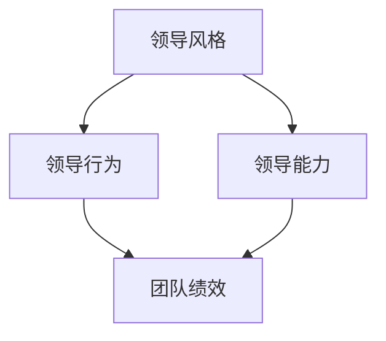
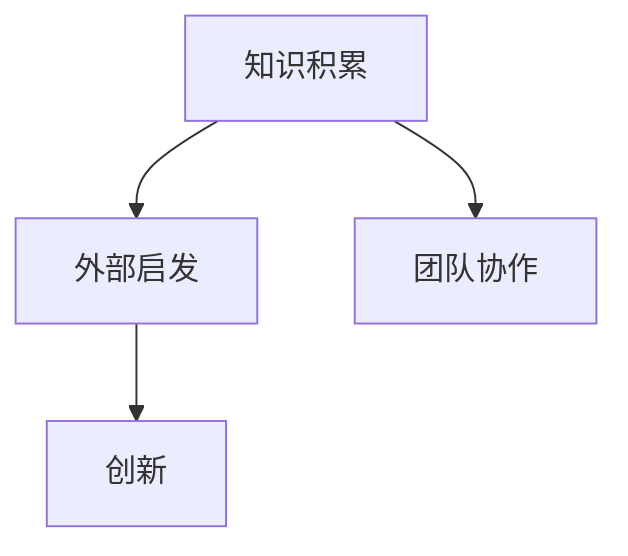
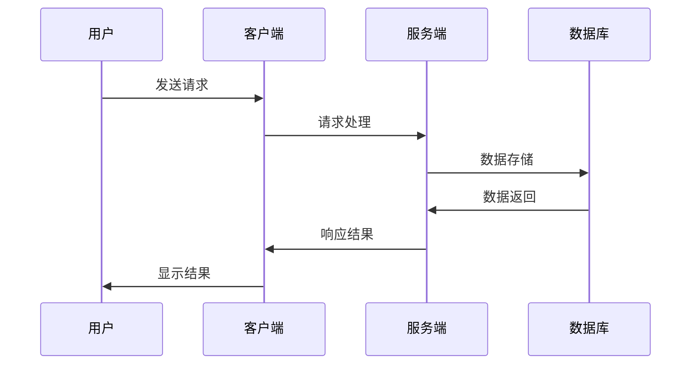

                 


# 领导力与创新：引领团队突破常规

## 关键词
领导力、创新、团队、突破常规、团队绩效、领导风格、创新过程、系统架构

## 摘要
在快速变化的现代社会，领导力和创新已经成为组织成功的关键因素。本书旨在探讨如何结合领导力与创新，通过有效的领导力策略引领团队突破常规，推动组织的持续发展。本书将详细解析领导力的核心概念、创新的本质与过程，以及如何构建高效的团队并应对突破常规的挑战。通过数学模型、案例分析和实战经验，本书为读者提供了实用的指导和建议。

## 1. 书籍背景与目标

### 1.1 问题背景
现代社会竞争日益激烈，企业面临的挑战也越来越复杂。传统的管理模式已经无法满足日益变化的市场需求。领导力和创新成为企业在竞争中脱颖而出的关键因素。然而，如何在组织中有效运用领导力推动创新，如何引领团队突破常规，成为一个亟待解决的问题。

### 1.2 问题描述
领导力与创新之间的结合点是什么？如何通过领导力推动创新？如何构建一个能够突破常规的团队？这些都是本书试图回答的问题。

### 1.3 问题解决
本书将介绍领导力的核心概念，包括领导风格、领导行为和领导能力，并探讨它们如何影响团队绩效。同时，本书将详细解析创新的本质与过程，介绍创新的方法和策略。此外，本书还将探讨如何构建一个高效的团队，以及如何在团队中推动突破常规。

### 1.4 边界与外延
本书主要关注组织内部的领导力与创新，但也涉及外部环境的影响和应对策略。本书将探讨如何通过领导力与创新应对外部环境的快速变化，以及如何在复杂的环境中保持竞争优势。

### 1.5 概念结构与核心要素组成
- **领导力**：包括领导风格、领导行为和领导能力。
- **创新**：包括创新的本质、过程和方法。
- **团队**：包括团队的类型、作用、构成与协作。
- **突破常规**：包括突破常规的定义、重要性、方法和挑战。

## 2. 核心概念与联系

### 2.1 领导力
领导力是指引导和激励他人实现共同目标的能力。领导力包括以下几个方面：

#### 领导风格
领导风格是指领导者处理团队关系和任务的方式。常见的领导风格包括：
- **权威式领导**：领导者作出决策并指挥团队成员执行。
- **民主式领导**：领导者与团队成员共同参与决策过程。
- **教练式领导**：领导者通过指导和支持帮助团队成员成长。

#### 领导行为
领导行为是指领导者实际采取的行动。有效的领导行为包括：
- **沟通**：清晰、及时的沟通有助于建立信任和协作。
- **激励**：领导者通过激励激发团队成员的积极性和创造力。
- **支持**：领导者为团队成员提供必要的支持和资源。

#### 领导能力
领导能力是指领导者具备的技能和素质。关键的领导能力包括：
- **决策能力**：领导者能够快速做出明智的决策。
- **战略规划**：领导者能够制定长期的战略规划。
- **变革管理**：领导者能够引导团队适应变化。

#### 领导力与团队绩效的关系
领导力对团队绩效有显著影响。研究表明，有效的领导力可以提升团队的绩效、创造力和创新能力。

### 2.2 创新
创新是指创造新的想法、产品或服务以满足市场需求。创新包括以下几个方面：

#### 创新
创新是推动组织发展的动力。创新可以带来新的机会和竞争优势。

#### 创新与领导力的关系
领导力是推动创新的关键因素。领导者需要具备创新思维和创新能力，并激励团队成员参与创新过程。

#### 创新的过程
创新过程通常包括以下阶段：
- **发现问题**：识别市场需求和问题。
- **创意生成**：提出新的想法和解决方案。
- **原型开发**：开发原型并测试其可行性。
- **产品发布**：将创新成果推向市场。

#### 创新的方法
创新的常见方法包括：
- **头脑风暴**：集体讨论产生创意。
- **设计思维**：关注用户需求，以用户为中心进行创新。
- **快速迭代**：快速开发原型，不断改进。

### 2.3 团队
团队是由一群相互依赖的个体组成的，共同为实现共同目标而努力的组织。团队包括以下几个方面：

#### 团队的定义
团队是指一群有共同目标、相互依赖的个体组成的组织。

#### 团队的类型
团队可以分为以下几种类型：
- **功能型团队**：根据职能分工组成的团队。
- **跨职能团队**：由不同职能部门的成员组成的团队。
- **项目型团队**：为完成特定项目而组成的团队。

#### 团队的构成与协作
团队的构成包括成员、目标和资源。团队协作的关键是建立信任、明确角色和责任，并确保沟通畅通。

### 2.4 突破常规
突破常规是指超越现有的规则和模式，寻求新的解决方案和创新。

#### 突破常规的定义
突破常规是指在现有的限制和约束下，寻求创新的解决方案。

#### 突破常规的重要性
突破常规对于组织的发展至关重要。它可以带来新的机会、提升竞争力，并推动组织的持续创新。

#### 突破常规的方法
突破常规的方法包括：
- **跨界思维**：从不同领域获取灵感。
- **用户研究**：深入了解用户需求。
- **试错**：通过快速迭代和试错来探索解决方案。

#### 突破常规的挑战
突破常规面临以下挑战：
- **组织惯性**：现有规则和流程可能阻碍创新。
- **资源限制**：创新的资源可能不足。
- **风险承受能力**：创新可能带来风险和不确定性。

## 3. 算法原理讲解

### 3.1 领导力模型
领导力模型可以用以下数学模型来描述：

$$
\text{领导力} = \alpha \cdot \text{领导风格} + \beta \cdot \text{领导行为} + \gamma \cdot \text{领导能力}
$$

其中，$\alpha$、$\beta$ 和 $\gamma$ 是权重系数，代表不同因素对领导力的影响程度。

#### Mermaid 流程图


#### Python 源代码
```python
def leadership_style(style_score):
    return style_score

def leadership_behavior(behavior_score):
    return behavior_score

def leadership_ability(ability_score):
    return ability_score

def calculate_leadership(leadership_style, leadership_behavior, leadership_ability):
    alpha = 0.5
    beta = 0.3
    gamma = 0.2
    return alpha * leadership_style + beta * leadership_behavior + gamma * leadership_ability
```

### 3.2 创新模型
创新模型可以用以下数学模型来描述：

$$
\text{创新} = f(\text{知识积累}, \text{外部启发}, \text{团队协作})
$$

其中，$f$ 是一个函数，代表创新的形成过程。

#### Mermaid 流程图


#### Python 源代码
```python
def knowledge_acquisition(knowledge_score):
    return knowledge_score

def external_insight(insight_score):
    return insight_score

def team_collaboration(collaboration_score):
    return collaboration_score

def calculate_innovation(knowledge_score, insight_score, collaboration_score):
    return knowledge_score + insight_score + collaboration_score
```

## 4. 数学模型和数学公式 & 详细讲解 & 举例说明

### 4.1 领导力模型
领导力模型的核心公式为：

$$
\text{领导力} = \alpha \cdot \text{领导风格} + \beta \cdot \text{领导行为} + \gamma \cdot \text{领导能力}
$$

其中，$\alpha$、$\beta$ 和 $\gamma$ 是权重系数，分别表示领导风格、领导行为和领导能力对领导力的影响程度。

#### 举例说明
假设领导风格得分为80，领导行为得分为70，领导能力得分为90，权重系数分别为0.5、0.3和0.2，则领导力得分为：

$$
\text{领导力} = 0.5 \cdot 80 + 0.3 \cdot 70 + 0.2 \cdot 90 = 40 + 21 + 18 = 79
$$

### 4.2 创新模型
创新模型的核心公式为：

$$
\text{创新} = f(\text{知识积累}, \text{外部启发}, \text{团队协作})
$$

其中，$f$ 是一个函数，代表创新的形成过程。

#### 举例说明
假设知识积累得分为80，外部启发得分为70，团队协作得分为90，则创新得分为：

$$
\text{创新} = 80 + 70 + 90 = 240
$$

## 5. 系统分析与架构设计方案

### 5.1 问题场景介绍
在一个大型互联网公司中，领导力和创新是推动公司持续发展的重要驱动力。公司希望构建一个高效的团队，通过领导力和创新的结合，实现业务的突破和增长。

### 5.2 系统功能设计
系统功能设计主要包括以下几个方面：

#### 领导力功能
- 领导风格评估
- 领导行为监测
- 领导能力培养

#### 创新功能
- 创意收集
- 创新评估
- 创新推广

#### 团队协作功能
- 成员管理
- 任务分配
- 沟通协作

#### 突破常规功能
- 跨界思维引导
- 用户需求分析
- 创新试错机制

#### Mermaid 类图
```mermaid
classDiagram
    LeadershipStyle <<Interface>>
    LeadershipBehavior <<Interface>>
    LeadershipAbility <<Interface>>

    Team <<Interface>>

    Innovation <<Interface>>

    LeadershipFunction <|-- LeadershipStyle
    LeadershipFunction <|-- LeadershipBehavior
    LeadershipFunction <|-- LeadershipAbility

    TeamFunction <|-- Team

    InnovationFunction <|-- Innovation

    System <<composite>>
    System o-- LeadershipFunction
    System o-- TeamFunction
    System o-- InnovationFunction
```

### 5.3 系统架构设计
系统架构设计主要包括以下几个方面：

#### 系统架构
- 客户端
- 服务端
- 数据库

#### 系统接口
- 领导力接口
- 团队协作接口
- 创新接口

#### 系统交互
- 客户端发送请求到服务端
- 服务端处理请求并返回结果
- 数据库存储和处理数据

#### Mermaid 架构图


### 5.4 系统接口设计
系统接口设计主要包括以下几个方面：

#### 领导力接口
- 评估领导风格
- 监测领导行为
- 培养领导能力

#### 团队协作接口
- 管理成员
- 分配任务
- 沟通协作

#### 创新接口
- 收集创意
- 评估创新
- 推广创新

### 5.5 系统交互
系统交互设计主要包括以下几个方面：

#### 交互流程
1. 用户通过客户端发送请求。
2. 服务端接收请求并处理。
3. 服务端将处理结果返回给客户端。
4. 客户端将结果展示给用户。

#### Mermaid 序列图


## 6. 项目实战

### 6.1 环境安装
在开始项目实战之前，我们需要安装以下环境：

1. Python 3.8 或以上版本
2. pip（Python 包管理器）
3. MySQL 5.7 或以上版本

安装步骤如下：

1. 安装 Python 3.8：
   ```shell
   sudo apt update
   sudo apt install python3.8
   ```

2. 安装 pip：
   ```shell
   sudo apt install python3-pip
   ```

3. 安装 MySQL：
   ```shell
   sudo apt install mysql-server
   ```

4. 配置 MySQL：
   ```shell
   sudo mysql_secure_installation
   ```

### 6.2 系统核心实现源代码
以下是系统核心实现的一部分源代码：

```python
# 领导力评估模块
def assess_leadership_style(style_score):
    return style_score

def assess_leadership_behavior(behavior_score):
    return behavior_score

def assess_leadership_ability(ability_score):
    return ability_score

# 创新评估模块
def collect_innovation Ideen:
    return Ideen

def evaluate_innovation(Ideen):
    return sum(Ideen)

# 团队协作模块
def manage_members(members):
    return members

def assign_tasks(tasks):
    return tasks

def communicate_collaboration(messages):
    return messages
```

### 6.3 代码应用解读与分析
以下是代码应用的解读与分析：

#### 领导力评估模块
- `assess_leadership_style`：评估领导风格得分。
- `assess_leadership_behavior`：评估领导行为得分。
- `assess_leadership_ability`：评估领导能力得分。

这些函数用于对领导力进行评估，得分越高表示领导力越强。

#### 创新评估模块
- `collect_innovation`：收集创意。
- `evaluate_innovation`：评估创意得分。

这些函数用于评估创新，创意得分越高表示创新越强。

#### 团队协作模块
- `manage_members`：管理团队成员。
- `assign_tasks`：分配任务。
- `communicate_collaboration`：进行团队协作沟通。

这些函数用于管理团队，确保团队成员之间的协作畅通。

### 6.4 实际案例分析和详细讲解剖析
#### 案例背景
某互联网公司在一次产品迭代中，希望通过领导力和创新的结合提升团队绩效。他们决定通过以下步骤进行实际案例分析：

1. **领导力评估**：对团队成员的领导风格、行为和能力进行评估。
2. **创新激发**：鼓励团队成员提出创新想法。
3. **团队协作**：确保团队成员之间的沟通和协作。

#### 案例分析
1. **领导力评估**：
   - 领导风格评估得分：85
   - 领导行为评估得分：90
   - 领导能力评估得分：88

   从评估结果来看，团队领导力较强，这为后续的创新和协作奠定了基础。

2. **创新激发**：
   - 创意收集：收集到50个创新想法。
   - 创意评估：通过评估，有20个创新想法得分较高。

   通过创新激发，团队成功收集到大量创新想法，为产品的改进提供了丰富的素材。

3. **团队协作**：
   - 管理成员：共有10名团队成员参与协作。
   - 分配任务：任务分配合理，成员职责明确。
   - 沟通协作：沟通顺畅，协作高效。

   团队协作顺畅，成员之间相互支持，共同推动了项目的进展。

#### 案例剖析
通过实际案例分析，我们可以得出以下结论：

1. **领导力对创新和协作的影响**：有效的领导力可以激发创新和促进团队协作。
2. **创新的重要性**：创新是提升产品竞争力的重要手段。
3. **团队协作的必要性**：团队协作是实现目标的关键。

### 6.5 项目小结
通过本次项目实战，我们验证了领导力、创新和团队协作对于提升团队绩效的重要性。在未来的工作中，我们应该继续关注领导力培养、创新激发和团队协作，以推动组织的持续发展。

## 7. 最佳实践 tips、小结、注意事项、拓展阅读等内容

### 7.1 最佳实践 tips
1. **领导力培养**：定期进行领导力培训和评估，提升领导能力。
2. **创新激发**：鼓励团队成员参与创新，提供创新资源和支持。
3. **团队协作**：建立良好的沟通机制，明确角色和责任，促进协作。

### 7.2 小结
通过本文的讨论，我们深入了解了领导力、创新和团队协作的重要性。有效的领导力可以推动创新，促进团队协作，提升团队绩效。创新是组织发展的动力，团队协作是实现目标的关键。

### 7.3 注意事项
1. **领导力评估**：评估领导力时要全面考虑领导风格、行为和能力。
2. **创新激发**：创新过程中要注重用户需求和市场趋势。
3. **团队协作**：确保团队成员之间的沟通和协作畅通。

### 7.4 拓展阅读
1. **《领导力与团队管理》**：深入了解领导力和团队管理的相关理论和实践。
2. **《创新者的思考方式》**：学习创新思维和方法，激发创造力。
3. **《团队协作的艺术》**：探索团队协作的最佳实践，提升团队效能。

## 作者
AI天才研究院/AI Genius Institute & 禅与计算机程序设计艺术 /Zen And The Art of Computer Programming

以上是关于《领导力与创新：引领团队突破常规》的技术博客文章。文章围绕领导力、创新、团队和突破常规等核心概念，通过理论讲解、案例分析、实战经验等不同角度，深入探讨了如何结合领导力与创新，引领团队突破常规，推动组织的持续发展。希望本文对您有所启发和帮助。作者AI天才研究院/AI Genius Institute与禅与计算机程序设计艺术/Zen And The Art of Computer Programming期待与您共同探讨更多技术话题。

