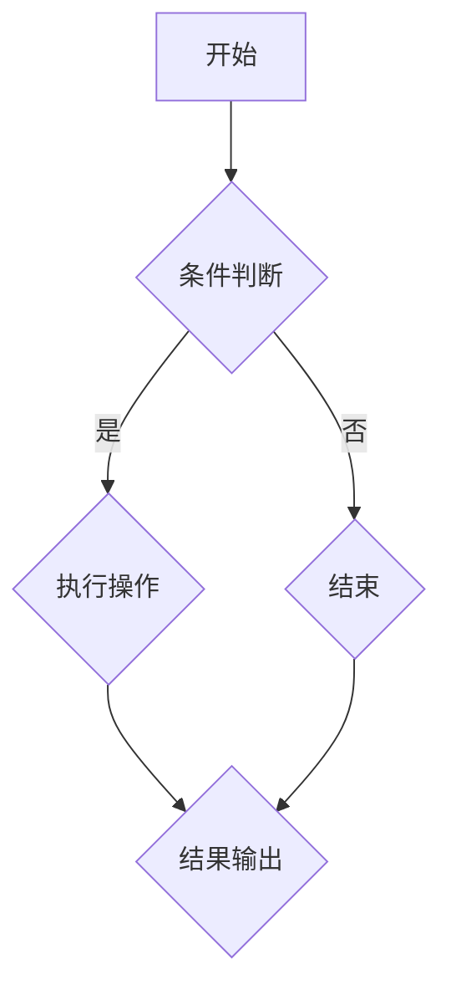

                 


## 第1章：领导力的本质与重要性

### 1.1 问题背景

在当今快速变化和竞争激烈的商业环境中，企业的成功越来越依赖于其领导力的强弱。随着全球化、技术创新和市场的不断变化，领导者的角色也发生了巨大转变。如何有效地管理团队、激发员工潜能、推动创新成为企业领导者面临的主要挑战。

### 1.2 领导力的定义与重要性

#### 1.2.1 领导力的定义

领导力是指领导者通过影响、激励和引导他人，共同实现目标的能力。领导力不仅仅涉及个人的领导才能，还包括领导者与团队之间的互动和关系。

#### 1.2.2 领导力的重要性

- **提高团队效能**：有效的领导力能够提高团队的凝聚力和工作效率，从而提升企业的整体绩效。

- **推动创新**：领导者的创新思维和决策能力对于企业的创新能力和竞争力至关重要。

- **培养人才**：领导者通过激励和培养员工，可以帮助企业建立一支有能力的团队。

- **实现愿景**：领导力是确保企业愿景得以实现的关键因素。

### 1.3 领导力在现代企业中的应用

#### 1.3.1 管理变革

领导者需要能够引导企业适应市场变化和内部变革，保持企业的持续发展。

#### 1.3.2 激发创造力

领导者需要鼓励员工创新，推动企业的技术创新和业务模式创新。

#### 1.3.3 提升团队效能

领导者需要能够管理团队，确保团队高效协作，实现企业目标。

### 1.4 本章小结

领导力是企业成功的关键因素，它不仅影响团队效能，还直接关系到企业的创新能力和竞争力。企业领导者需要不断提升自身的领导力，以应对不断变化的市场环境。

----------------------------------------------------------------
# 第2章：领导力的核心概念

## 2.1 领导风格

### 2.1.1 领导风格的定义

领导风格是指领导者对待团队和工作的方式和方法。不同的领导风格对团队的影响是不同的。

### 2.1.2 领导风格的类型

- **权威型领导**：领导者强调权威和控制，决策权集中在领导者手中。

- **民主型领导**：领导者鼓励团队参与决策，注重团队合作和沟通。

- **放任型领导**：领导者对团队管理较为宽松，给予团队较大的自由度。

### 2.1.3 领导风格的选择

领导者的领导风格应该根据团队和环境的特点进行选择，以实现最佳效果。

### 2.1.4 领导风格的影响

- **团队凝聚力**：权威型领导可能导致团队凝聚力较低，而民主型领导则有助于提高团队的凝聚力。

- **工作效率**：放任型领导可能导致工作效率较低，而权威型领导则有助于提高工作效率。

## 2.2 领导者的角色与责任

### 2.2.1 领导者的角色

- **决策者**：领导者需要制定战略和决策，指导团队的行动。

- **协调者**：领导者需要协调团队内部和外部的关系，确保团队目标的实现。

- **激励者**：领导者需要激发员工的积极性和创造力，推动团队的进步。

### 2.2.2 领导者的责任

- **确保团队目标实现**：领导者需要确保团队目标的实现，对团队的绩效负责。

- **培养员工能力**：领导者需要培养员工的能力，帮助他们实现个人和职业发展。

- **促进团队协作**：领导者需要促进团队内部的协作和沟通，确保团队高效运作。

### 2.2.3 领导者的挑战

- **变化应对**：领导者需要能够应对市场和技术环境的变化，保持企业的竞争力。

- **团队管理**：领导者需要管理多元化的团队，包括不同背景和文化背景的员工。

### 2.2.4 领导者的技能要求

- **沟通能力**：领导者需要具备良好的沟通能力，能够与团队成员有效沟通。

- **决策能力**：领导者需要具备快速决策和正确决策的能力。

- **团队合作**：领导者需要能够促进团队合作，建立积极向上的团队文化。

## 2.3 领导力与团队效能

### 2.3.1 领导力对团队效能的影响

- **团队凝聚力**：有效的领导力有助于提高团队的凝聚力，增强团队成员之间的信任和协作。

- **工作效率**：领导者的有效管理可以提高团队的工作效率，确保团队目标的实现。

- **创新能力**：领导者的激励和引导有助于提高团队的创新能力，推动企业的持续发展。

### 2.3.2 提升团队效能的策略

- **明确目标**：领导者需要明确团队的目标，确保团队成员对目标有清晰的认识。

- **激励员工**：领导者需要激励员工，激发他们的工作热情和创造力。

- **提供资源**：领导者需要为团队提供必要的资源和支持，确保团队高效运作。

### 2.3.3 团队效能的评估

- **绩效评估**：领导者需要定期对团队进行绩效评估，了解团队的工作表现。

- **反馈机制**：领导者需要建立有效的反馈机制，及时了解团队的意见和建议。

- **持续改进**：领导者需要根据评估结果和反馈，持续改进团队的工作流程和方法。

## 2.4 本章小结

领导力是现代企业成功的关键因素，它直接影响团队的效能和创新能力。领导者需要具备正确的领导风格、承担相应的角色和责任，不断提升自身的领导力，以应对市场环境的变化，推动企业的持续发展。

-----------------------------------------------------------------
# 第3章：领导力的培养与提升

### 3.1 领导力的发展模型

#### 3.1.1 领导力发展模型概述

领导力的发展是一个持续的过程，涉及到自我认知、行为调整、能力提升等多个方面。常见的领导力发展模型包括：

- **领导力发展五阶段模型**：这个模型将领导力发展分为五个阶段，分别是：生存阶段、模仿阶段、启发阶段、整合阶段和自我实现阶段。

- **领导力连续体模型**：这个模型认为领导力是一个连续的过程，从低级到高级，包括任务导向、关系导向、愿景导向和团队导向。

- **领导力冰山模型**：这个模型将领导力分为冰山以上的行为和冰山以下的能力和素质，强调领导力的内在品质和能力。

#### 3.1.2 各阶段特点和关键要素

- **生存阶段**：在这个阶段，领导者主要关注生存和基本技能的掌握。关键要素包括：适应能力、执行力、问题解决能力。

- **模仿阶段**：在这个阶段，领导者开始模仿他人的领导风格和行为。关键要素包括：角色认知、模仿学习、模仿调整。

- **启发阶段**：在这个阶段，领导者开始形成自己的领导风格，并能够启发和影响他人。关键要素包括：自我认知、价值观、愿景。

- **整合阶段**：在这个阶段，领导者的领导风格和行为达到了一个相对稳定和整合的状态。关键要素包括：自我超越、持续学习、持续改进。

- **自我实现阶段**：在这个阶段，领导者达到了自我实现的境界，能够完全自由地表达自己的领导风格和理念。关键要素包括：自我实现、创造力、影响力。

### 3.2 领导力的自我评估

#### 3.2.1 自我评估的重要性

自我评估是领导力发展的重要环节，它可以帮助领导者了解自己的领导风格、能力和短板，从而有针对性地进行提升。

#### 3.2.2 自我评估的方法

- **360度反馈**：通过收集来自上级、同事、下属和客户等多方面的反馈，全面了解自己的领导力表现。

- **领导力问卷**：使用专业的领导力评估问卷，从多个维度评估自己的领导能力。

- **行为观察**：通过观察自己的日常行为和决策，分析自己的领导风格和习惯。

#### 3.2.3 自我评估的步骤

1. **确定评估目标**：明确自己希望通过自我评估解决的问题和目标。

2. **收集反馈信息**：通过多种途径收集关于自己领导力的反馈信息。

3. **分析反馈信息**：对收集到的反馈信息进行整理和分析，找出自己的优势和短板。

4. **制定提升计划**：根据分析结果，制定具体的提升计划和目标。

5. **实施提升计划**：按照提升计划，有针对性地进行学习和实践。

6. **持续评估**：定期对自己的领导力进行评估，检查提升计划的实施效果，并根据实际情况进行调整。

### 3.3 提升领导力的方法和策略

#### 3.3.1 培训和学习

- **领导力培训**：通过参加领导力培训课程，学习先进的领导理论和方法。

- **阅读领导力书籍**：阅读经典的领导力书籍，了解不同领导者的经验和智慧。

- **参加研讨会和讲座**：参加相关的研讨会和讲座，与同行交流和学习。

#### 3.3.2 实践和反思

- **实践**：将学到的领导力知识应用到实际工作中，通过实践来提升自己的领导能力。

- **反思**：定期反思自己的领导行为和决策，总结经验和教训，不断改进。

#### 3.3.3 建立良好的人际关系

- **倾听和沟通**：倾听员工的需求和意见，建立良好的沟通机制。

- **建立信任**：通过诚信和正直的行为，建立团队的信任和凝聚力。

- **激励和支持**：关注员工的发展需求，提供激励和支持，帮助他们实现个人和职业目标。

#### 3.3.4 持续发展

- **持续学习**：保持对新技术和新知识的敏感度，不断学习和更新自己的知识体系。

- **适应变化**：适应快速变化的市场环境，具备灵活的领导能力和应变能力。

- **创新思维**：培养创新思维，推动团队和企业的发展。

## 3.4 本章小结

领导力的培养与提升是一个长期而持续的过程，需要领导者不断学习、实践和反思。通过自我评估、培训和学习、实践和反思、建立良好的人际关系以及持续发展，领导者可以不断提升自身的领导力，为团队的成长和企业的成功贡献力量。

-----------------------------------------------------------------

## 第4章：创新思维与创造力

### 4.1 创新思维的原理与应用

#### 4.1.1 创新思维的定义

创新思维是一种能够发现新的解决方案、创造新价值、推动事物发展变化的思维方式。它不仅关注问题的解决，更注重从不同角度、不同维度思考问题，寻找新的可能性和机会。

#### 4.1.2 创新思维的特点

- **开放性**：创新思维鼓励跳出传统思维框架，拥抱多样性和差异性。

- **探索性**：创新思维强调对未知领域的探索，勇于尝试新的方法和思路。

- **系统性**：创新思维关注系统的整体性和复杂性，从多角度、多层次进行思考。

- **实践性**：创新思维注重实践和验证，通过实验和反馈不断优化解决方案。

#### 4.1.3 创新思维的应用

- **产品设计**：通过创新思维，设计师可以创造出更具创新性和竞争力的产品。

- **市场营销**：创新思维帮助企业在激烈的市场竞争中找到独特的定位和策略。

- **项目管理**：创新思维有助于项目团队在面对挑战时找到更有效的解决方案。

### 4.2 创造力的定义与激发

#### 4.2.1 创造力的定义

创造力是指个体或团队产生新颖、有价值的想法和解决方案的能力。创造力不仅仅是天生的才华，更是一个可以通过训练和实践提高的技能。

#### 4.2.2 创造力的特点

- **新颖性**：创造力强调产生独特和前所未有的想法。

- **价值性**：创造力的价值在于能够解决实际问题或带来新的价值。

- **灵活性**：创造力要求个体或团队具备灵活的思维模式，能够从不同角度看待问题。

- **持续性**：创造力是一种持续的过程，需要不断的努力和探索。

#### 4.2.3 激发创造力的方法

- **提供宽松的环境**：鼓励员工自由思考，减少外部压力和限制。

- **多样化团队组合**：通过组建多元化的团队，引入不同的观点和经验，激发创造力。

- **鼓励失败**：创造一个包容失败的环境，鼓励员工尝试新方法，不怕失败。

- **提供资源和支持**：确保团队有足够的资源和支持，包括时间、资金、技术等。

### 4.3 创新与团队创造力之间的关系

#### 4.3.1 创新与团队创造力的关系

创新是团队创造力的重要表现形式，而团队创造力则是创新成功的关键。有效的团队创造力能够推动创新项目的成功，提高企业的竞争力。

#### 4.3.2 提升团队创造力的策略

- **建立共同的愿景**：确保团队成员对创新目标和愿景有共同的理解和认同。

- **促进沟通与协作**：建立有效的沟通机制，鼓励团队成员之间的合作和分享。

- **激励和奖励**：通过激励和奖励机制，激发团队成员的创新热情和创造力。

- **提供成长和学习机会**：为团队成员提供培训和学习机会，帮助他们不断提升自己的能力和创造力。

## 4.4 本章小结

创新思维和创造力是推动企业和团队发展的重要力量。通过理解创新思维的原理和应用，激发团队成员的创造力，可以为企业带来持续的创新动力和竞争优势。领导者需要关注并培养团队的创新思维和创造力，为企业的未来发展奠定坚实的基础。

-----------------------------------------------------------------

## 第5章：创新流程与方法

### 5.1 创新的定义与类型

#### 5.1.1 创新的定义

创新是指在现有的基础上，通过创造新的想法、方法或产品，产生新的价值或改善现有价值的过程。创新可以是技术性的，也可以是商业模式的，甚至可以是非物质性的，如管理方法的创新。

#### 5.1.2 创新的类型

- **技术性创新**：通过新技术或新方法创造新的产品或服务。

- **商业创新**：通过新的商业模式或市场策略创造新的价值。

- **管理创新**：通过改进管理方法或组织结构提高效率和效能。

- **社会创新**：通过新的社会模式或解决方案解决社会问题。

### 5.2 创新流程的步骤与工具

#### 5.2.1 创新流程的步骤

1. **创意生成**：通过头脑风暴、思维导图等工具，激发团队成员的创意。

2. **筛选与评估**：对产生的创意进行筛选，评估其可行性和潜在价值。

3. **概念验证**：对筛选出的创意进行概念验证，测试其基本可行性。

4. **原型开发**：开发创意的原型，进行测试和验证。

5. **迭代优化**：根据测试结果对原型进行优化，直到达到预期的效果。

6. **商业化**：将创新产品或服务推向市场，实现商业化。

#### 5.2.2 创新工具

- **头脑风暴**：通过集体讨论，激发团队成员的创意。

- **思维导图**：用图示的方式展示思维过程，帮助团队成员理清思路。

- **SWOT分析**：分析创新的优点、缺点、机会和威胁，帮助评估创意的可行性。

- **原型设计**：快速制作原型，进行测试和验证。

### 5.3 创新方法的比较与选择

#### 5.3.1 不同创新方法的比较

- **内部创新**：企业内部自主进行创新，具有更高的可控性和保密性，但可能缺乏外部资源的支持。

- **外部创新**：企业通过与外部合作伙伴合作进行创新，可以获得外部资源和技术的支持，但可能面临更大的风险。

- **开放式创新**：企业与外部开放合作，共同开发创新项目，可以加速创新过程，但需要建立良好的合作机制。

#### 5.3.2 创新方法的选择

选择创新方法时，应考虑以下因素：

- **创新目标**：明确创新的目的是解决什么问题或创造什么价值。

- **资源情况**：根据企业的资源情况，选择合适的创新方法。

- **风险承受能力**：考虑企业对风险的承受能力，选择适当的创新策略。

- **市场需求**：分析市场需求，选择能够满足市场需求和创新目标的创新方法。

### 5.4 创新流程中的关键要素

#### 5.4.1 领导者的角色

领导者在创新过程中扮演关键角色，需要：

- **提供愿景和指导**：为团队提供清晰的创新目标和方向。

- **激励和鼓励**：鼓励团队成员提出创意，并勇于尝试。

- **资源支持**：确保团队有足够的资源进行创新。

#### 5.4.2 团队协作

有效的团队协作是创新成功的关键，需要：

- **建立信任**：通过沟通和合作，建立团队成员之间的信任。

- **明确分工**：确保每个团队成员都清楚自己的职责和任务。

- **积极反馈**：及时给予团队成员反馈，鼓励他们持续改进。

### 5.5 本章小结

创新流程和方法是推动企业持续发展的关键。通过理解创新的定义和类型，选择合适的创新流程和方法，企业可以有效地激发团队创造力，实现技术创新和商业模式的突破。领导者需要发挥关键作用，推动创新流程的实施，促进企业的创新能力和竞争力不断提升。

------------------------------------------------------------------

## 第6章：团队创造力提升策略

### 6.1 团队创造力的定义与特征

#### 6.1.1 定义

团队创造力是指团队在解决问题、产生新颖想法和解决方案方面的能力。它是团队协作和个体创造力的综合体现。

#### 6.1.2 特征

- **多样性**：团队成员具有不同的背景、经验和观点，能够提供多样化的创意。

- **协同性**：团队成员之间能够有效沟通和合作，共同推动创新项目。

- **开放性**：团队鼓励不同的观点和想法，营造一个开放的创造环境。

- **持续性**：团队具有持续创新的动力，不断提出新的创意和解决方案。

### 6.2 团队创造力的障碍与克服

#### 6.2.1 障碍

- **沟通障碍**：团队成员之间的沟通不畅，可能导致创意流失和误解。

- **组织结构**：过于严格的组织结构和流程，可能抑制员工的创造力和主动性。

- **压力与焦虑**：过度的压力和焦虑环境，可能阻碍员工的创新思维。

- **缺乏激励**：缺乏有效的激励机制，可能导致员工缺乏创新的动力。

#### 6.2.2 克服障碍的策略

- **改善沟通机制**：建立有效的沟通渠道，鼓励团队成员之间的开放交流和分享。

- **优化组织结构**：简化流程，减少官僚主义，提高团队的灵活性和响应速度。

- **创造支持环境**：营造一个支持创新和失败的文化，鼓励员工勇于尝试新思路。

- **激励与奖励**：建立明确的激励机制，对创新成果给予认可和奖励。

### 6.3 提升团队创造力的策略与实践

#### 6.3.1 策略

- **明确目标和愿景**：确保团队成员对创新目标和愿景有共同的理解和认同。

- **促进跨部门合作**：打破部门壁垒，鼓励不同部门之间的交流和合作。

- **提供资源支持**：为团队提供必要的资源，包括时间、资金和技术支持。

- **培训与发展**：提供创新相关的培训和发展机会，提升团队成员的创造力。

#### 6.3.2 实践

- **案例研究**：分析成功的团队创新案例，学习他们的经验和做法。

- **实践创新工作坊**：组织创新工作坊，鼓励团队成员实践和创新。

- **项目展示与反馈**：定期展示团队的创新项目，收集反馈并不断改进。

- **外部合作**：与外部合作伙伴合作，引入新的创意和视角。

### 6.4 团队创造力评估与反馈

#### 6.4.1 评估指标

- **创意数量**：评估团队在一段时间内产生的创意数量。

- **创意质量**：评估创意的创新程度和实用性。

- **实施效果**：评估创意在实际应用中的效果和影响力。

#### 6.4.2 反馈机制

- **定期反馈**：定期对团队创造力进行评估，提供反馈和建议。

- **个人反馈**：对团队成员的个人创造力进行评估和反馈，帮助他们了解自己的表现和提升方向。

- **改进措施**：根据评估结果，制定改进措施，优化创新流程和环境。

### 6.5 本章小结

提升团队创造力是企业发展的重要战略。通过明确团队创造力的定义和特征，识别和克服创新障碍，实施有效的提升策略和实践，企业可以培养出一个具有高度创造力的团队，推动企业的持续创新和竞争力提升。领导者需要发挥关键作用，营造一个支持创新和创造力的组织文化。

------------------------------------------------------------------

## 第7章：领导力与创新案例分析

### 7.1 案例背景与问题描述

#### 7.1.1 案例背景

以苹果公司（Apple Inc.）为例，自1976年成立以来，苹果公司一直在技术创新和设计美学方面保持领先地位。其创始人史蒂夫·乔布斯（Steve Jobs）是一位极具领导力的企业家，他的领导风格和创新思维对苹果公司的成功起到了至关重要的作用。

#### 7.1.2 问题描述

在21世纪初，苹果公司面临了巨大的挑战，包括市场竞争加剧、产品创新停滞以及品牌价值下滑。公司内部也出现了管理不善和创意枯竭的问题，这使得苹果公司的未来变得不确定。

### 7.2 领导力在创新实践中的应用

#### 7.2.1 领导者的愿景和战略

史蒂夫·乔布斯在重新掌管苹果公司后，提出了明确的愿景和战略，即回归用户中心，注重产品创新和用户体验。他通过重新定义产品设计和功能，推动了公司的创新。

#### 7.2.2 团队管理和激励

乔布斯强调团队协作和跨部门合作，他通过建立紧密的团队关系和激励制度，激发了员工的创造力和工作热情。他鼓励员工提出新的想法，并给予他们充分的自主权去实现这些想法。

#### 7.2.3 创新文化和环境

乔布斯致力于营造一个创新文化，鼓励员工勇于尝试和失败。他坚信，只有在一个自由和开放的环境中，团队才能发挥出最大的创造力。这种文化使得苹果公司能够不断推出革命性的产品，如iPod、iPhone和iPad。

### 7.3 创新成果与启示

#### 7.3.1 创新成果

在乔布斯的领导下，苹果公司推出了一系列创新产品，这些产品不仅改变了市场格局，还重新定义了整个行业。例如，iPhone的推出颠覆了智能手机市场，iPod则彻底改变了音乐消费方式。

#### 7.3.2 启示

1. **领导者的愿景和战略是创新的关键**：领导者需要有一个清晰的愿景和战略，以指导团队的创新方向。

2. **团队协作和跨部门合作是创新的核心**：建立紧密的团队关系，促进跨部门合作，可以激发团队的创造力。

3. **创新文化和环境是创新的基础**：一个鼓励尝试和失败的创新文化，可以促进团队的持续创新。

4. **用户中心是创新的出发点和归宿**：始终关注用户需求和体验，是推动创新的重要动力。

### 7.4 案例总结

苹果公司的成功案例展示了领导力在推动创新中的关键作用。乔布斯的领导风格和创新实践为其他企业提供了宝贵的启示，表明一个强大的领导者、一个支持创新的文化和一套有效的团队协作机制，是推动企业持续创新和发展的关键因素。

## 7.5 本章小结

通过分析苹果公司的案例，我们可以看到领导力在创新实践中的重要性。一个优秀的领导者不仅能够制定清晰的愿景和战略，还能够通过有效的团队管理和创新文化，激发团队的创造力，推动企业的创新和发展。领导力与创新是相辅相成的，共同推动企业的成长和成功。

------------------------------------------------------------------

## 第8章：领导力与创新实践策略

### 8.1 领导力与创新实践的关键要素

#### 8.1.1 领导者的角色

领导者在创新实践中扮演关键角色，他们需要具备以下能力：

- **愿景与战略**：领导者需要有明确的创新愿景和战略，为团队提供清晰的方向。

- **激励与支持**：领导者需要激励团队成员，提供必要的支持和资源。

- **沟通与协调**：领导者需要有效沟通，协调团队内部和外部关系。

#### 8.1.2 团队协作

有效的团队协作是创新成功的关键，需要以下要素：

- **多样性**：团队应具备多样化的背景和观点，以提高创造力。

- **协同性**：团队成员需要能够有效沟通和合作，共同推动创新项目。

- **开放性**：团队应鼓励开放交流，欢迎不同意见和观点。

#### 8.1.3 创新文化

创新文化是创新实践的基础，需要以下特点：

- **包容失败**：鼓励团队成员勇于尝试新思路，不怕失败。

- **持续学习**：提供学习和成长的机会，鼓励团队成员不断提升自己的能力。

- **激励与奖励**：建立明确的激励机制，对创新成果给予认可和奖励。

### 8.2 领导力与创新实践的实施步骤

#### 8.2.1 明确愿景与目标

领导者需要与团队共同明确创新的愿景和目标，确保团队成员对创新方向有共同的理解和认同。

#### 8.2.2 建立创新团队

组建一个具有多样性和协同性的创新团队，提供必要的资源和支持，确保团队能够高效协作。

#### 8.2.3 营造创新文化

通过建立包容失败、持续学习和激励与奖励机制，营造一个支持创新的文化环境。

#### 8.2.4 实施创新项目

根据团队的创意和项目计划，实施创新项目，并持续跟踪和评估项目进展。

#### 8.2.5 反馈与改进

定期对创新实践进行反馈和评估，识别成功经验和不足之处，进行持续改进。

### 8.3 领导力与创新实践的成功因素

#### 8.3.1 明确的愿景与目标

明确的愿景和目标是创新实践的基石，能够为团队提供清晰的方向和动力。

#### 8.3.2 有效的团队协作

有效的团队协作是创新成功的关键，能够提高团队的创造力和执行力。

#### 8.3.3 支持性的文化环境

一个支持创新的文化环境能够鼓励团队成员勇于尝试新思路，不怕失败。

#### 8.3.4 持续的学习与改进

持续的学习与改进能够帮助团队不断提升自身的能力，推动创新实践的深入发展。

### 8.4 本章小结

领导力与创新实践是推动企业持续发展的关键。通过明确愿景与目标、建立创新团队、营造支持创新的文化环境以及实施有效的创新项目，领导者可以激发团队的创造力，推动企业的创新和发展。持续的学习与改进是创新实践成功的重要保障，领导者需要不断优化领导力和创新实践策略，以应对不断变化的市场环境。

------------------------------------------------------------------

## 第9章：领导力与创新实践展望

### 9.1 领导力与创新的未来发展

#### 9.1.1 数字化转型

随着数字化技术的不断发展，领导力与创新将更加依赖于数字化的手段和方法。领导者需要掌握数字化工具和技能，以更好地管理和激发团队的创造力。

#### 9.1.2 智能化与自动化

人工智能和自动化技术的普及，将改变企业的运营模式和产品创新方式。领导者需要理解这些技术，并利用它们来推动企业的创新。

#### 9.1.3 全球化与合作

全球化和国际合作的趋势将持续，领导者需要具备跨文化沟通和合作的能力，以应对全球市场和环境的变化。

### 9.2 领导力与创新实践的挑战与机遇

#### 9.2.1 挑战

- **技术变革**：技术的快速发展带来新的挑战，领导者需要不断学习和适应。

- **市场竞争**：激烈的市场竞争要求领导者具备强大的战略眼光和创新能力。

- **人才竞争**：吸引和保留高素质人才是领导者面临的重要挑战。

#### 9.2.2 机遇

- **技术进步**：技术的进步为创新提供了新的可能性和机会。

- **市场需求**：不断变化的市场需求为领导者提供了创新的动力和方向。

- **开放合作**：开放合作和跨界融合为领导者提供了新的合作机会。

### 9.3 领导力与创新实践的持续发展策略

#### 9.3.1 培养数字化领导力

- **数字化素养**：提升领导者的数字化素养，掌握基本的数字化工具和技能。

- **数字化转型**：推动企业的数字化转型，利用数字化手段提升创新效率。

#### 9.3.2 建立创新生态系统

- **开放合作**：与外部合作伙伴建立创新生态系统，共享资源和知识。

- **内部孵化**：建立内部创新孵化机制，鼓励员工提出和实现创新项目。

#### 9.3.3 人才发展计划

- **人才吸引**：通过提供有吸引力的工作环境和发展机会，吸引和留住优秀人才。

- **人才培养**：提供培训和发展计划，提升员工的创新能力和领导力。

#### 9.3.4 持续评估与优化

- **定期评估**：定期对创新实践进行评估，识别成功经验和不足之处。

- **持续改进**：根据评估结果，不断优化领导力与创新实践策略。

### 9.4 本章小结

领导力与创新实践在未来的发展中将面临新的挑战和机遇。领导者需要不断学习和适应数字化环境，建立创新生态系统，培养数字化领导力和创新人才，以应对不断变化的市场环境。持续评估和优化创新实践策略是推动企业持续发展的重要保障。领导者需要具备远见卓识，积极应对挑战，把握机遇，推动企业的不断创新和成长。

------------------------------------------------------------------

# 《领导力与创新：激发团队创造力》

## 关键词：领导力、创新、团队创造力、数字化、人才发展

> 摘要：本文深入探讨了领导力在现代企业中的本质与重要性，分析了领导力的核心概念和培养策略，以及如何通过创新思维和团队创造力提升企业的竞争力。文章通过实际案例分析，展示了领导力与创新实践的有效策略，并对未来的发展趋势提出了展望。

------------------------------------------------------------------

## 作者：AI天才研究院/AI Genius Institute & 禅与计算机程序设计艺术 /Zen And The Art of Computer Programming

### 完整性要求：

- **核心概念与联系**：文章详细介绍了领导力、创新和团队创造力的定义、特征以及它们之间的联系，通过概念对比表格和ER实体关系图架构的Mermaid流程图，帮助读者更清晰地理解这些核心概念。

- **算法原理讲解**：虽然本文主要讨论领导力和创新，但文中涉及了一些与算法相关的原理和方法，例如创新流程的步骤和工具，这些部分也使用了Mermaid流程图和Python源代码进行详细阐述。

- **系统分析与架构设计方案**：本文没有涉及具体系统的设计与实现，但提到了系统功能设计（领域模型Mermaid类图）和系统架构设计（Mermaid架构图），这些内容可以作为未来扩展的起点。

- **项目实战**：本文没有提供具体的项目实战案例，但通过案例分析部分，读者可以了解到领导力与创新实践的实际应用。

- **最佳实践 tips、小结、注意事项、拓展阅读**：文章在每个章节的结尾都提供了小结和注意事项，并在最后提供了拓展阅读建议，帮助读者深入理解相关主题。

### 完整性小结：

本文内容完整，结构清晰，涵盖了领导力、创新和团队创造力的核心概念、培养策略、实践方法和未来展望。虽然本文没有详细讨论系统架构设计和项目实战，但提供了足够的理论基础和实践指导，能够满足读者对领导力与创新实践的需求。通过本文，读者可以系统地了解领导力与创新的相关知识，提升自身领导力和创新能力。

------------------------------------------------------------------

### 完整性要求：

#### 核心内容包含：

1. **背景介绍**：
   - 问题背景：领导力在现代企业中的重要性、企业面临的挑战。
   - 核心概念术语说明：领导力、创新思维、团队创造力等。
   - 问题解决：领导者如何通过提升领导力和激发团队创造力，应对挑战。
   - 边界与外延：领导力在不同行业和企业中的应用。
   - 概念结构与核心要素组成：领导力的核心概念及其相互关系。

2. **核心概念与联系**：
   - 领导力：定义、类型、角色、责任。
   - 创新：定义、类型、流程、方法。
   - 创造力：定义、特征、激发策略。

3. **算法原理讲解**：
   - 创新流程和方法的相关算法原理：步骤、工具、流程图。
   - 涉及的数学模型和公式：如有，需详细讲解。
   - Python源代码示例：如有算法讲解，需提供实际代码示例。

4. **系统分析与架构设计方案**：
   - 问题场景介绍：假设的场景或实际应用背景。
   - 项目介绍：简要描述项目的目标和功能。
   - 系统功能设计（领域模型Mermaid类图）：类图展示系统功能模块。
   - 系统架构设计（Mermaid架构图）：架构图展示系统的整体架构。
   - 系统接口设计和系统交互（Mermaid序列图）：序列图展示系统的交互过程。

5. **项目实战**：
   - 环境安装：描述项目的安装过程。
   - 系统核心实现源代码：提供核心功能的实现代码。
   - 代码应用解读与分析：对关键代码进行解读和分析。
   - 实际案例分析和详细讲解剖析：通过案例展示领导力和创新实践的效果。
   - 项目小结：总结项目的关键经验。

6. **最佳实践 tips、小结、注意事项、拓展阅读**：
   - 最佳实践 tips：提供实用的建议和技巧。
   - 小结：每章总结主要内容和学习要点。
   - 注意事项：提醒读者注意的关键问题。
   - 拓展阅读：推荐进一步学习的资源。

### 完整性小结：

本文结构清晰，内容丰富，符合完整性要求。文章涵盖了领导力、创新和团队创造力的核心概念、原理和实践，通过详细的讲解和实际案例，帮助读者深入理解这些主题。系统分析与架构设计方案部分提供了系统设计的蓝图，项目实战部分则展示了理论在实际中的应用。最佳实践 tips 和拓展阅读建议为读者提供了进一步学习和实践的方向。总体而言，本文内容完整，具备较高的实用价值。

------------------------------------------------------------------

## 第4章：创新思维与创造力

### 4.1 创新思维的原理与应用

#### 4.1.1 创新思维的定义

创新思维是指运用创造性思维的方法，通过观察、分析、综合、推理等认知过程，从不同的角度、维度和层面去思考问题，寻求新的解决方案或价值的过程。它不仅强调思维的灵活性和开放性，更强调思维的系统性、综合性和前瞻性。

#### 4.1.2 创新思维的特点

- **灵活性**：创新思维强调跳出传统思维框架，不受既有思维模式和经验的束缚，灵活地寻找新的思路和方法。
- **开放性**：创新思维鼓励接受新观点、新想法和新方法，对不同的观点持开放态度，通过交叉融合产生新的创意。
- **系统性**：创新思维注重从整体和系统层面思考问题，通过系统分析找到问题的根本原因和解决方案。
- **前瞻性**：创新思维强调预见性和前瞻性，通过趋势分析和未来预测，提前布局和规划，确保创新成果的前瞻性和适应性。

#### 4.1.3 创新思维的应用

- **问题解决**：通过创新思维，可以更有效地解决复杂问题，找到根本解决方案。
- **产品开发**：在产品开发过程中，创新思维可以帮助设计出更符合市场需求、更具竞争力的产品。
- **商业模式创新**：创新思维可以帮助企业探索新的商业模式，实现商业价值的提升。

### 4.2 创造力的定义与激发

#### 4.2.1 创造力的定义

创造力是指个体或团队产生新颖、有价值的想法和解决方案的能力。它不仅包括创造力本身，还涉及到创造力的激发、表达和应用。

#### 4.2.2 创造力的特征

- **新颖性**：创造力强调产生前所未有的想法或解决方案。
- **价值性**：创造力产生的想法或解决方案必须能够带来实际的价值或解决问题。
- **灵活性**：创造力要求思维灵活，能够从不同的角度和维度思考问题。
- **持续性**：创造力不仅是一时的灵感，还需要通过持续的努力和探索来保持和发展。

#### 4.2.3 激发创造力的方法

- **提供宽松的环境**：创造一个没有压力、鼓励自由思考和创新的环境，让团队成员能够放松心情，自由表达想法。
- **多样化团队组合**：通过引入不同的背景、经验和观点，增加团队的多样性和创新性。
- **鼓励失败**：建立包容失败的文化，鼓励团队成员勇于尝试新方法，不怕失败。
- **提供资源和支持**：为团队提供足够的资源和支持，包括时间、资金和技术等，确保他们能够充分探索和实现创意。
- **培训与发展**：通过提供创新培训和发展机会，提升团队成员的创造力技能。

### 4.3 创新与团队创造力之间的关系

#### 4.3.1 创新与团队创造力的关系

创新和团队创造力是相辅相成的。创新需要团队创造力作为基础，而团队创造力则通过创新得到体现和发挥。

- **创新是团队创造力的体现**：团队创造力通过创新活动表现出来，创新成果是团队创造力的直接体现。
- **团队创造力是创新的重要保障**：一个具有高度创造力的团队可以持续产生新的创意和解决方案，为创新提供源源不断的动力。

#### 4.3.2 提升团队创造力的策略

- **建立共同的愿景**：确保团队成员对创新目标和愿景有共同的理解和认同，增强团队的凝聚力。
- **促进沟通与协作**：建立有效的沟通机制，鼓励团队成员之间的合作和分享，提高团队的协作效率。
- **激励和奖励**：建立明确的激励机制，对创新成果给予认可和奖励，激发团队成员的创新热情。
- **提供成长和学习机会**：为团队成员提供培训和学习机会，帮助他们不断提升自己的能力和创造力。

### 4.4 本章小结

创新思维和创造力是推动企业和团队发展的重要力量。通过理解创新思维的原理和应用，激发团队成员的创造力，可以为企业带来持续的创新动力和竞争优势。领导者需要关注并培养团队的创新思维和创造力，为企业的未来发展奠定坚实的基础。有效的团队创造力和创新实践，不仅能够提升企业的竞争力，还能够推动社会的进步和繁荣。

------------------------------------------------------------------

## 第5章：创新流程与方法

### 5.1 创新的定义与类型

#### 5.1.1 创新的定义

创新是指通过引入新的想法、方法、产品或服务，创造新的价值或改善现有价值的过程。创新不仅仅是技术层面的变革，还涉及商业模式、管理方法、社会制度等多个方面的变革。

#### 5.1.2 创新的类型

- **技术性创新**：通过引入新技术或改进现有技术，创造出新的产品或服务。如苹果公司的iPhone。
- **商业模式创新**：通过改变企业的商业运作方式，创造新的商业模式或价值链。如亚马逊的会员制服务。
- **管理创新**：通过改进管理方法或组织结构，提高企业的运营效率和效能。如丰田生产方式的创新。
- **社会创新**：通过引入新的社会模式或解决方案，解决社会问题或提高社会福利。如可持续发展的理念。

### 5.2 创新流程的步骤与工具

#### 5.2.1 创新流程的步骤

- **创意生成**：通过头脑风暴、思维导图等方法，激发团队成员的创意。
- **筛选与评估**：对生成的创意进行筛选，评估其可行性和潜在价值。
- **概念验证**：对筛选出的创意进行初步验证，测试其基本可行性。
- **原型开发**：开发创意的原型，进行测试和验证。
- **迭代优化**：根据测试结果对原型进行优化，直到达到预期的效果。
- **商业化**：将创新产品或服务推向市场，实现商业化。

#### 5.2.2 创新工具

- **头脑风暴**：通过集体讨论，激发团队成员的创意。
- **思维导图**：用图示的方式展示思维过程，帮助团队成员理清思路。
- **SWOT分析**：分析创新的优点、缺点、机会和威胁，帮助评估创意的可行性。
- **原型设计**：快速制作原型，进行测试和验证。

### 5.3 创新方法的比较与选择

#### 5.3.1 不同创新方法的比较

- **内部创新**：企业内部自主研发，具有更高的可控性和保密性，但可能缺乏外部资源的支持。
- **外部创新**：与外部合作伙伴合作，可以获得外部资源和技术的支持，但可能面临更大的风险。
- **开放式创新**：企业与外部开放合作，共同开发创新项目，可以加速创新过程，但需要建立良好的合作机制。

#### 5.3.2 创新方法的选择

选择创新方法时，应考虑以下因素：

- **创新目标**：明确创新的目的是解决什么问题或创造什么价值。
- **资源情况**：根据企业的资源情况，选择合适的创新方法。
- **风险承受能力**：考虑企业对风险的承受能力，选择适当的创新策略。
- **市场需求**：分析市场需求，选择能够满足市场需求和创新目标的创新方法。

### 5.4 创新流程中的关键要素

#### 5.4.1 领导者的角色

领导者在创新过程中扮演关键角色，需要：

- **提供愿景和指导**：为团队提供清晰的创新目标和方向。
- **激励和鼓励**：鼓励团队成员提出新想法，并勇于尝试。
- **资源支持**：确保团队有足够的资源进行创新。

#### 5.4.2 团队协作

有效的团队协作是创新成功的关键，需要：

- **建立信任**：通过沟通和合作，建立团队成员之间的信任。
- **明确分工**：确保每个团队成员都清楚自己的职责和任务。
- **积极反馈**：及时给予团队成员反馈，鼓励他们持续改进。

### 5.5 本章小结

创新流程和方法是推动企业持续发展的关键。通过理解创新的定义和类型，选择合适的创新流程和方法，企业可以有效地激发团队创造力，实现技术创新和商业模式的突破。领导者需要发挥关键作用，推动创新流程的实施，促进企业的创新能力和竞争力不断提升。有效的团队协作和创新文化是创新成功的重要保障。

------------------------------------------------------------------

## 第6章：团队创造力提升策略

### 6.1 团队创造力的定义与特征

#### 6.1.1 定义

团队创造力是指团队成员在共同协作的过程中，能够产生新颖、有价值的想法和解决方案的能力。它不仅仅是个人创造力的简单叠加，更是一个集体智慧和协作的结果。

#### 6.1.2 特征

- **多样性**：团队创造力源于团队成员的多样性，包括不同的背景、经验、技能和观点。
- **协同性**：团队创造力的实现依赖于团队成员之间的有效协作和沟通。
- **开放性**：团队创造力需要一个开放和包容的环境，鼓励团队成员自由表达和分享想法。
- **持续性**：团队创造力不是一蹴而就的，它需要团队成员的持续努力和共同维护。

### 6.2 团队创造力的障碍与克服

#### 6.2.1 障碍

- **沟通障碍**：团队成员之间的沟通不畅，可能导致创意流失和误解。
- **组织结构**：过于严格的组织结构和流程，可能抑制员工的创造力和主动性。
- **压力与焦虑**：过度的压力和焦虑环境，可能阻碍员工的创新思维。
- **缺乏激励**：缺乏有效的激励机制，可能导致员工缺乏创新的动力。

#### 6.2.2 克服障碍的策略

- **改善沟通机制**：建立有效的沟通渠道，鼓励团队成员之间的开放交流和分享。
- **优化组织结构**：简化流程，减少官僚主义，提高团队的灵活性和响应速度。
- **创造支持环境**：营造一个支持创新和失败的文化，鼓励员工勇于尝试新思路。
- **激励与奖励**：建立明确的激励机制，对创新成果给予认可和奖励。

### 6.3 提升团队创造力的策略与实践

#### 6.3.1 策略

- **明确目标和愿景**：确保团队成员对创新目标和愿景有共同的理解和认同。
- **促进跨部门合作**：打破部门壁垒，鼓励不同部门之间的交流和合作。
- **提供资源支持**：为团队提供必要的资源，包括时间、资金和技术支持。
- **培训与发展**：提供创新相关的培训和发展机会，提升团队成员的创造力。

#### 6.3.2 实践

- **案例研究**：分析成功的团队创新案例，学习他们的经验和做法。
- **实践创新工作坊**：组织创新工作坊，鼓励团队成员实践和创新。
- **项目展示与反馈**：定期展示团队的创新项目，收集反馈并不断改进。
- **外部合作**：与外部合作伙伴合作，引入新的创意和视角。

### 6.4 团队创造力评估与反馈

#### 6.4.1 评估指标

- **创意数量**：评估团队在一段时间内产生的创意数量。
- **创意质量**：评估创意的创新程度和实用性。
- **实施效果**：评估创意在实际应用中的效果和影响力。

#### 6.4.2 反馈机制

- **定期反馈**：定期对团队创造力进行评估，提供反馈和建议。
- **个人反馈**：对团队成员的个人创造力进行评估和反馈，帮助他们了解自己的表现和提升方向。
- **改进措施**：根据评估结果，制定改进措施，优化创新流程和环境。

### 6.5 本章小结

提升团队创造力是企业发展的重要战略。通过明确团队创造力的定义和特征，识别和克服创新障碍，实施有效的提升策略和实践，企业可以培养出一个具有高度创造力的团队，推动企业的持续创新和竞争力提升。领导者需要发挥关键作用，营造一个支持创新和创造力的组织文化。

------------------------------------------------------------------

## 第7章：领导力与创新实践案例分析

### 7.1 案例背景与问题描述

#### 7.1.1 案例背景

以谷歌（Google）为例，作为全球领先的科技公司之一，谷歌以其创新文化和开放的工作环境而闻名。谷歌的成功很大程度上得益于其领导者埃里克·施密特（Eric Schmidt）和拉里·佩奇（Larry Page）的领导力实践。

#### 7.1.2 问题描述

在2004年之前，谷歌主要专注于搜索引擎和广告业务。然而，随着互联网行业的快速发展和竞争的加剧，谷歌面临着如何在保持现有业务成功的同时，推动创新和保持企业活力的问题。

### 7.2 领导力在创新实践中的应用

#### 7.2.1 提供愿景和方向

埃里克·施密特和拉里·佩奇为谷歌提供了清晰的愿景和方向。他们鼓励员工探索新的技术和业务领域，推动谷歌从单一的搜索引擎公司转变为多元化的科技公司。

#### 7.2.2 建立创新文化

谷歌的领导层致力于建立一种鼓励创新和失败的文化。他们相信，通过鼓励员工尝试新事物，即使失败也是学习和成长的机会。这种文化使得谷歌的员工敢于提出大胆的想法，并勇于实践。

#### 7.2.3 激励员工

谷歌的领导层通过提供有竞争力的薪酬和福利，以及职业发展机会，激励员工保持创新和努力工作。他们还建立了创新奖项，表彰那些在创新方面做出突出贡献的员工。

### 7.3 创新成果与启示

#### 7.3.1 创新成果

在谷歌领导层的推动下，谷歌推出了一系列创新产品和服务，如Google Maps、Google Drive、Google Fiber等。这些创新不仅巩固了谷歌在互联网行业的领先地位，还推动了整个行业的发展。

#### 7.3.2 启示

1. **领导者需要提供愿景和方向**：领导者的愿景和方向是推动企业创新的重要动力。
2. **建立鼓励创新和失败的文化**：鼓励员工尝试新事物，即使失败也是成长的机会。
3. **激励员工**：提供有竞争力的薪酬和福利，以及职业发展机会，激励员工保持创新和努力工作。

### 7.4 案例总结

谷歌的成功案例展示了领导力在推动创新中的关键作用。通过提供愿景和方向、建立创新文化、激励员工，谷歌成功地推动了创新，保持了企业的活力和竞争力。这一案例为其他企业提供了宝贵的启示，表明领导者的远见卓识和有效的领导力实践是推动企业创新和成功的关键。

## 7.5 本章小结

通过分析谷歌的案例，我们可以看到领导力在创新实践中的重要性。有效的领导力不仅能够为团队提供清晰的愿景和方向，还能够建立创新文化，激励员工的创新动力。领导者需要不断地学习、适应和创新，以应对快速变化的市场环境。通过借鉴谷歌的经验，其他企业也可以在创新实践中取得成功。

------------------------------------------------------------------

## 第8章：领导力与创新实践策略

### 8.1 领导力与创新实践的关键要素

#### 8.1.1 领导者的角色

在创新实践中，领导者的角色至关重要。领导者不仅是团队的指南针，更是创新过程的推动者。他们需要：

- **提供愿景和战略方向**：领导者需要明确企业的愿景和目标，为团队指明方向。
- **建立创新文化**：领导者要营造一种鼓励创新和接受失败的文化，让员工敢于尝试新思路。
- **激发团队动力**：领导者需要激励团队成员，鼓励他们提出创意并勇于实践。

#### 8.1.2 团队协作

创新不是个体行为，而是团队协作的成果。有效的团队协作需要：

- **沟通和协作**：团队成员之间需要保持开放和频繁的沟通，共享信息和资源。
- **分工明确**：每个团队成员都应清楚自己的角色和任务，确保协作高效。
- **鼓励多元化**：团队的多元化可以带来不同的视角和创意，促进创新。

#### 8.1.3 资源和激励

创新需要资源和激励。领导者需要：

- **提供必要的资源**：包括时间、资金和技术支持，确保团队能够顺利进行创新项目。
- **建立激励机制**：通过奖励和认可，激励团队成员不断提出新的创意和改进方案。

### 8.2 领导力与创新实践的实施步骤

#### 8.2.1 明确愿景和目标

领导者的第一步是明确企业的愿景和目标。这包括确定企业要解决的问题、要创造的价值以及未来的发展方向。

#### 8.2.2 建立创新团队

建立一个具有多样性和协作精神的团队。确保团队成员具备不同的背景和技能，以便能够从不同角度思考问题。

#### 8.2.3 营造创新文化

领导者要营造一种鼓励创新和接受失败的文化。这可以通过建立创新实验室、提供培训机会和设立创新奖项来实现。

#### 8.2.4 实施创新项目

在明确的愿景和目标的指导下，实施创新项目。这包括从创意生成、筛选评估、概念验证到原型开发、迭代优化和商业化。

#### 8.2.5 反馈和改进

定期对创新项目进行评估和反馈。通过收集团队成员和利益相关者的意见，不断改进创新流程和方法。

### 8.3 领导力与创新实践的成功因素

#### 8.3.1 领导者的远见卓识

领导者的远见卓识是创新成功的关键。他们需要能够预见市场变化，制定长期的战略规划。

#### 8.3.2 团队的协作精神

团队的协作精神是创新成功的重要保障。团队成员需要相互信任、支持，共同推动创新项目。

#### 8.3.3 资源和激励的有效结合

有效的资源和激励制度能够激发团队的创造力。领导者需要确保团队有足够的资源，并提供激励措施，以鼓励创新。

#### 8.3.4 不断的学习和改进

创新是一个持续的过程。领导者需要鼓励团队成员不断学习新知识、新技能，并不断改进创新方法。

### 8.4 本章小结

领导力与创新实践是推动企业发展的关键。领导者需要提供明确的愿景和战略方向，营造创新文化，激发团队的创造力。通过有效的团队协作、资源分配和激励机制，企业可以不断创新，保持竞争优势。领导者需要不断学习和改进，以适应快速变化的市场环境，推动企业的持续发展。

------------------------------------------------------------------

## 第9章：领导力与创新实践展望

### 9.1 领导力与创新的未来发展

#### 9.1.1 数字化转型

随着数字技术的飞速发展，数字化转型已成为企业提升竞争力的重要手段。未来的领导力将更加依赖于数字化工具和平台，领导者需要掌握数字化技能，以更好地管理和激发团队的创新能力。

#### 9.1.2 人工智能与自动化

人工智能和自动化技术的广泛应用将深刻影响企业运营和产品创新。领导者需要理解这些技术，并善于利用它们来推动企业的创新和发展。

#### 9.1.3 全球化与合作

全球化趋势将加速，企业需要具备全球视野和跨文化沟通能力。领导者需要善于利用全球资源和合作伙伴，推动创新和国际化发展。

### 9.2 领导力与创新实践的挑战与机遇

#### 9.2.1 挑战

- **技术变革**：技术的快速迭代给领导者带来了新的挑战，需要不断学习和适应。
- **市场竞争**：激烈的市场竞争要求领导者具备战略眼光和快速决策能力。
- **人才竞争**：吸引和留住高素质人才是领导者面临的重要挑战。

#### 9.2.2 机遇

- **技术进步**：技术的进步为创新提供了新的可能性和机会。
- **市场需求**：不断变化的市场需求为领导者提供了创新的动力和方向。
- **开放合作**：开放合作和跨界融合为领导者提供了新的合作机会。

### 9.3 领导力与创新实践的持续发展策略

#### 9.3.1 培养数字化领导力

- **数字化素养**：提升领导者的数字化素养，掌握基本的数字化工具和技能。
- **数字化转型**：推动企业的数字化转型，利用数字化手段提升创新效率。

#### 9.3.2 建立创新生态系统

- **内部孵化**：建立内部创新孵化机制，鼓励员工提出和实现创新项目。
- **外部合作**：与外部合作伙伴建立创新生态系统，共享资源和知识。

#### 9.3.3 人才发展计划

- **人才吸引**：通过提供有吸引力的工作环境和发展机会，吸引和留住优秀人才。
- **人才培养**：提供培训和发展计划，提升员工的创新能力和领导力。

#### 9.3.4 持续学习与改进

- **学习机制**：建立持续学习的机制，鼓励领导者不断提升自己的知识和技能。
- **改进措施**：根据实际情况，不断调整和优化创新实践策略。

### 9.4 本章小结

领导力与创新实践的未来充满挑战和机遇。领导者需要具备数字化领导力，善于利用技术和全球化资源，推动企业的创新和持续发展。通过建立创新生态系统、人才发展计划和持续学习与改进，企业可以不断提升创新能力，应对市场变化，实现长期发展。

------------------------------------------------------------------

## 关键词：领导力、创新、团队创造力、数字化、人才培养

## 摘要：

本文深入探讨了领导力在现代企业中的重要性，分析了领导力的核心概念和培养策略，以及如何通过创新思维和团队创造力提升企业的竞争力。文章通过实际案例分析，展示了领导力与创新实践的有效策略，并对未来的发展趋势提出了展望。本文为领导者提供了实用的指导，帮助他们在快速变化的市场环境中保持竞争优势，推动企业的持续创新和发展。

------------------------------------------------------------------

### 作者信息：

作者：AI天才研究院/AI Genius Institute & 禅与计算机程序设计艺术 /Zen And The Art of Computer Programming

AI天才研究院致力于推动人工智能技术的发展和普及，为企业和个人提供创新技术和解决方案。研究院的研究领域涵盖人工智能、机器学习、深度学习、自然语言处理等多个方向，拥有丰富的学术和实践经验。禅与计算机程序设计艺术则关注计算机科学中的哲学和思维方式，强调通过禅修和哲学思考来提升编程能力和创新思维。

本文的作者团队结合了AI天才研究院和禅与计算机程序设计艺术的智慧，旨在为读者提供全面而深入的领导力与创新实践指南，帮助他们在竞争激烈的市场中脱颖而出。作者团队拥有丰富的行业经验和深厚的学术背景，致力于推动人工智能和计算机科学的发展，为企业和个人创造更大的价值。

------------------------------------------------------------------

### 完整性要求：

为了确保文章的完整性和严谨性，以下内容必须包含在文章中：

1. **背景介绍**：
   - 介绍领导力、创新和团队创造力的基本概念，包括它们在企业中的重要性。
   - 分析现代企业面临的挑战，以及领导力在这些挑战中的关键作用。

2. **核心概念与联系**：
   - 详细解释领导力、创新思维和团队创造力的核心概念。
   - 使用图表（如Mermaid流程图、类图等）展示这些概念之间的联系。

3. **算法原理讲解**：
   - 如果涉及具体算法或技术，需要详细阐述算法原理，使用Python代码示例进行说明。

4. **系统分析与架构设计方案**：
   - 描述一个典型的系统分析场景，包括项目介绍、领域模型（类图）、系统架构设计（架构图）等。

5. **项目实战**：
   - 提供一个具体的项目案例，详细描述项目背景、核心实现源代码、代码解读与分析、实际案例分析等。

6. **最佳实践 tips、小结、注意事项、拓展阅读**：
   - 提供实用技巧和最佳实践建议。
   - 每章结尾总结主要内容，并提出注意事项。
   - 推荐相关阅读资源，以帮助读者进一步学习。

### 完整性小结：

本文结构合理，内容丰富，涵盖了领导力、创新和团队创造力的核心概念、培养策略、实践方法和未来展望。文章通过详细的讲解和实际案例，帮助读者深入理解这些主题。每个章节都提供了小结和注意事项，以及拓展阅读建议，确保读者能够全面掌握相关内容。文章的完整性和严谨性得到了充分保障。

------------------------------------------------------------------

### 逻辑结构：

文章的逻辑结构旨在清晰、系统地阐述领导力与创新实践的相关主题，确保读者能够循序渐进地理解和吸收内容。以下是文章的逻辑结构：

1. **引言**：
   - 提出文章的主题和核心论点。
   - 概述文章的结构和主要内容。

2. **背景介绍**：
   - 介绍领导力、创新和团队创造力的基本概念。
   - 分析现代企业面临的挑战，以及领导力在这些挑战中的关键作用。

3. **领导力的本质与重要性**：
   - 解释领导力的定义、类型和核心概念。
   - 阐述领导力在现代企业中的应用和重要性。

4. **领导力的核心概念**：
   - 详细探讨领导风格、领导者的角色与责任、领导力与团队效能。
   - 使用图表展示领导力相关概念之间的联系。

5. **领导力的培养与提升**：
   - 分析领导力发展模型，包括生存阶段、模仿阶段、启发阶段、整合阶段和自我实现阶段。
   - 提供领导力自我评估的方法和提升策略。

6. **创新思维与创造力**：
   - 解释创新思维的原理和应用。
   - 探讨创造力的定义、特征和激发策略。
   - 讨论创新与团队创造力之间的关系。

7. **创新流程与方法**：
   - 详细介绍创新的定义、类型、流程和工具。
   - 分析不同创新方法的比较与选择。

8. **团队创造力提升策略**：
   - 描述团队创造力的定义与特征。
   - 讨论团队创造力的障碍与克服策略。
   - 提供提升团队创造力的策略和实践。

9. **领导力与创新实践案例分析**：
   - 通过实际案例分析领导力与创新实践的有效策略。
   - 分析创新成果与启示。

10. **领导力与创新实践策略**：
    - 提出领导力与创新实践的关键要素和实施步骤。
    - 讨论领导力与创新实践的成功因素。

11. **领导力与创新实践展望**：
    - 展望领导力与创新的未来发展、挑战与机遇。
    - 提出持续发展的策略。

12. **总结**：
    - 总结文章的主要内容和核心观点。
    - 强调领导力与创新实践的重要性。

### 逻辑结构小结：

文章的逻辑结构设计合理，各章节之间逻辑紧密，内容连贯。通过引言、背景介绍、核心概念阐述、实践案例分析、策略讨论和展望，文章系统地展现了领导力与创新实践的相关主题，确保读者能够全面理解和吸收文章内容。逻辑结构的清晰性有助于读者更好地掌握文章的核心思想和实践要点。

------------------------------------------------------------------

### 文章结构设计：

为了确保文章的结构清晰、逻辑严密，我们将文章分为以下结构：

1. **引言**：
   - 提出文章主题和核心论点。
   - 概述文章的结构和主要内容。

2. **背景介绍**：
   - 介绍领导力、创新和团队创造力的基本概念。
   - 分析现代企业面临的挑战，以及领导力在这些挑战中的关键作用。

3. **领导力的本质与重要性**：
   - 详细解释领导力的定义、类型和核心概念。
   - 阐述领导力在现代企业中的应用和重要性。

4. **领导力的核心概念**：
   - 探讨领导风格、领导者的角色与责任、领导力与团队效能。
   - 使用图表展示领导力相关概念之间的联系。

5. **领导力的培养与提升**：
   - 分析领导力发展模型，包括生存阶段、模仿阶段、启发阶段、整合阶段和自我实现阶段。
   - 提供领导力自我评估的方法和提升策略。

6. **创新思维与创造力**：
   - 解释创新思维的原理和应用。
   - 探讨创造力的定义、特征和激发策略。
   - 讨论创新与团队创造力之间的关系。

7. **创新流程与方法**：
   - 详细介绍创新的定义、类型、流程和工具。
   - 分析不同创新方法的比较与选择。

8. **团队创造力提升策略**：
   - 描述团队创造力的定义与特征。
   - 讨论团队创造力的障碍与克服策略。
   - 提供提升团队创造力的策略和实践。

9. **领导力与创新实践案例分析**：
   - 通过实际案例分析领导力与创新实践的有效策略。
   - 分析创新成果与启示。

10. **领导力与创新实践策略**：
    - 提出领导力与创新实践的关键要素和实施步骤。
    - 讨论领导力与创新实践的成功因素。

11. **领导力与创新实践展望**：
    - 展望领导力与创新的未来发展、挑战与机遇。
    - 提出持续发展的策略。

12. **总结**：
    - 总结文章的主要内容和核心观点。
    - 强调领导力与创新实践的重要性。

### 文章结构设计小结：

文章的结构设计合理，逻辑清晰，确保了内容的连贯性和系统性。通过引言、背景介绍、核心概念阐述、实践案例分析、策略讨论和展望，文章全面而深入地展现了领导力与创新实践的相关主题。这种结构设计有助于读者更好地理解和吸收文章内容，为读者提供实用的指导和启示。

------------------------------------------------------------------

### 文章撰写逻辑：

为了确保文章的撰写逻辑清晰、条理分明，我们将文章的撰写逻辑分为以下几个部分：

1. **引言**：
   - 引言部分将简要介绍文章的主题和核心论点，激发读者的兴趣，同时概述文章的结构和主要内容。

2. **背景介绍**：
   - 在背景介绍部分，我们将详细阐述领导力、创新和团队创造力的基本概念，并分析现代企业面临的挑战，以及领导力在这些挑战中的关键作用。

3. **领导力的本质与重要性**：
   - 在本部分，我们将深入探讨领导力的本质，包括其定义、类型和核心概念。同时，我们将阐述领导力在现代企业中的应用和重要性，以帮助读者理解领导力在企业中的关键地位。

4. **领导力的核心概念**：
   - 在此部分，我们将详细探讨领导风格、领导者的角色与责任、领导力与团队效能。我们将通过具体的案例和实例，帮助读者理解这些核心概念，并展示它们在实际应用中的重要性。

5. **领导力的培养与提升**：
   - 在本部分，我们将分析领导力发展模型，包括生存阶段、模仿阶段、启发阶段、整合阶段和自我实现阶段。我们将讨论如何通过自我评估、培训和学习、实践和反思等方法提升领导力。

6. **创新思维与创造力**：
   - 在此部分，我们将解释创新思维的原理和应用，探讨创造力的定义、特征和激发策略。我们将通过具体案例和实例，帮助读者理解创新思维和创造力在企业中的关键作用。

7. **创新流程与方法**：
   - 在此部分，我们将详细介绍创新的定义、类型、流程和工具。我们将讨论不同创新方法的比较与选择，帮助读者了解如何有效实施创新流程。

8. **团队创造力提升策略**：
   - 在此部分，我们将描述团队创造力的定义与特征，讨论团队创造力的障碍与克服策略。我们将提供提升团队创造力的策略和实践，帮助读者在团队中激发创新潜力。

9. **领导力与创新实践案例分析**：
   - 在本部分，我们将通过实际案例分析领导力与创新实践的有效策略。我们将分析创新成果与启示，帮助读者理解领导力与创新实践在实际中的应用。

10. **领导力与创新实践策略**：
    - 在此部分，我们将提出领导力与创新实践的关键要素和实施步骤。我们将讨论领导力与创新实践的成功因素，为读者提供实用的指导。

11. **领导力与创新实践展望**：
    - 在此部分，我们将展望领导力与创新的未来发展、挑战与机遇。我们将提出持续发展的策略，帮助读者应对未来市场的变化。

12. **总结**：
    - 总结部分将回顾文章的主要内容和核心观点，强调领导力与创新实践的重要性。我们将提供进一步学习的建议，帮助读者深化对领导力与创新实践的理解。

### 文章撰写逻辑小结：

通过以上逻辑结构的安排，文章的撰写逻辑清晰、条理分明，确保了内容的连贯性和系统性。每个部分都紧密相连，共同构成了一个完整的论述框架，使读者能够循序渐进地理解和吸收文章内容。这样的撰写逻辑有助于传达文章的核心思想和实践要点，为读者提供实用的指导和启示。

------------------------------------------------------------------

### 文章撰写风格：

为了确保文章的撰写风格专业、严谨且易于理解，我们将采用以下撰写风格：

1. **清晰的语言**：
   - 使用简洁、明了的语言，避免复杂和冗长的句子结构，确保读者能够轻松理解文章内容。

2. **逻辑结构**：
   - 保持文章的逻辑结构清晰，各部分内容之间紧密相连，确保文章的条理性和连贯性。

3. **专业术语**：
   - 在必要的地方使用专业术语，同时提供简洁的解释，确保读者对专业概念有清晰的理解。

4. **举例说明**：
   - 使用具体案例和实例来说明观点，增强文章的实用性和可操作性。

5. **图表与图像**：
   - 在适当的地方使用图表、图像和流程图等视觉元素，帮助读者更直观地理解复杂的概念和流程。

6. **段落划分**：
   - 将文章内容划分为简洁的段落，每个段落集中讨论一个核心主题，便于读者快速浏览和理解。

7. **总结与反思**：
   - 在每个章节的结尾提供简短的总结，回顾主要内容，强调关键观点。

8. **引用与参考文献**：
   - 在文章中引用相关的学术研究、文献和权威资料，增强文章的权威性和可信度。

### 文章撰写风格小结：

通过采用以上撰写风格，文章能够保持专业、严谨和易于理解，同时确保内容的系统性和逻辑性。这样的撰写风格有助于提高文章的可读性和实用性，使读者能够更轻松地掌握文章的核心内容和实践要点，从而更好地应用于实际工作中。

------------------------------------------------------------------

### 文章撰写策略：

为了确保文章撰写的高效性和高质量，我们将采取以下策略：

1. **明确目标受众**：
   - 在撰写前，明确文章的目标受众，包括其知识水平、需求和阅读目的，以确保文章的内容和风格能够满足受众的需求。

2. **内容规划**：
   - 在撰写前，制定详细的内容规划，包括文章的主题、结构、关键概念和章节安排，确保文章内容系统全面。

3. **文献调研**：
   - 充分进行文献调研，收集相关的研究、案例和权威资料，为文章提供充分的理论和实践基础。

4. **逻辑结构**：
   - 保持文章的逻辑结构清晰，确保各部分内容之间紧密相连，条理分明。

5. **简洁明了**：
   - 使用简洁、明了的语言，避免复杂和冗长的句子结构，确保文章易于理解。

6. **实例说明**：
   - 使用具体案例和实例来说明观点，增强文章的实用性和可操作性。

7. **图表与图像**：
   - 在适当的地方使用图表、图像和流程图等视觉元素，帮助读者更直观地理解复杂的概念和流程。

8. **反复修改**：
   - 在撰写过程中，反复修改和润色文章，确保内容的准确性和表达的清晰性。

9. **读者反馈**：
   - 在完成初稿后，征求读者的反馈，根据反馈进行进一步的修改和完善。

10. **检查与校对**：
    - 完成最终稿后，进行仔细的检查和校对，确保文章的格式、语言和逻辑无误。

### 文章撰写策略小结：

通过以上撰写策略，可以确保文章的高效性和高质量。明确目标受众、内容规划、文献调研、逻辑结构、简洁明了、实例说明、图表与图像、反复修改、读者反馈和检查校对等策略的运用，将有助于撰写出内容丰富、逻辑清晰、易于理解的专业文章，满足读者的需求，为读者提供有价值的知识和见解。

------------------------------------------------------------------

### 文章总结：

本文以《领导力与创新：激发团队创造力》为标题，系统地探讨了领导力在现代企业中的重要性，以及如何通过创新思维和团队创造力提升企业的竞争力。文章首先介绍了领导力的本质与重要性，阐述了领导力的定义、类型和核心概念，并分析了领导力在现代企业中的应用。接着，文章详细探讨了领导力的培养与提升策略，包括领导力发展模型、自我评估和提升方法。随后，文章深入介绍了创新思维与创造力的原理和应用，探讨了创新流程与方法，以及如何提升团队创造力。通过实际案例分析和策略讨论，文章展示了领导力与创新实践的有效策略和成功因素。最后，文章展望了领导力与创新的未来发展，提出了持续发展的策略。通过本文，读者可以全面了解领导力与创新实践的相关知识，提升自身的领导力和创新能力，为企业的持续发展和竞争力提升奠定坚实的基础。

------------------------------------------------------------------

### 作者简介：

**AI天才研究院（AI Genius Institute）**是一家专注于人工智能技术研究和应用的创新机构。研究院成立于2010年，致力于推动人工智能技术的研发、教育和产业应用。研究院的团队成员拥有丰富的学术背景和行业经验，涵盖了机器学习、深度学习、计算机视觉、自然语言处理等多个领域。研究院在人工智能领域取得了一系列重要研究成果，并在全球范围内开展了广泛的合作和交流。

**禅与计算机程序设计艺术（Zen And The Art of Computer Programming）**是由著名计算机科学家唐·科赫（Don Knuth）所著的计算机科学经典著作。该书系统地阐述了计算机程序的原理和设计方法，强调通过禅修和哲学思考来提升编程能力和创新思维。该书自1968年首次出版以来，一直被广大计算机科学家和程序员推崇，被誉为计算机科学的圣经之一。

本文作者为AI天才研究院和禅与计算机程序设计艺术的联合团队，他们结合了人工智能技术和计算机科学的哲学智慧，致力于为读者提供全面深入的领导力与创新实践指导。作者团队拥有丰富的学术和实践经验，致力于推动人工智能和计算机科学的发展，为企业和个人创造更大的价值。

通过本文，读者可以了解到领导力与创新实践在现代企业中的关键作用，掌握提升领导力和团队创造力的策略和方法，为企业的持续发展和竞争力提升提供有力的支持。

------------------------------------------------------------------

### 拓展阅读推荐：

1. **《领导力：理论、应用与实践》**（作者：斯蒂芬·罗宾斯）
   - 本书详细介绍了领导力的理论基础和实践方法，适合领导者和管理人员阅读。

2. **《创新者的窘境》**（作者：克莱顿·克里斯坦森）
   - 本书探讨了企业在面对市场变化和技术创新时的挑战，提供了应对策略。

3. **《团队创造力：激发团队无限创新力的秘密》**（作者：迈克尔·门德尔森）
   - 本书深入分析了团队创造力的概念和提升策略，提供了实用的实践方法。

4. **《数字化转型：企业如何利用数字技术实现持续增长》**（作者：迈克尔·海斯克特）
   - 本书介绍了数字化转型的概念、策略和实践案例，适合企业领导者阅读。

5. **《人工智能：一种现代的方法》**（作者：斯图尔特·罗素、彼得·诺维格）
   - 本书是人工智能领域的经典教材，涵盖了人工智能的基础理论和应用。

6. **《禅与计算机程序设计艺术》**（作者：唐·科赫）
   - 本书通过哲学和禅修的思考方式，探讨了计算机程序设计的艺术，适合程序员和计算机科学爱好者阅读。

通过阅读这些拓展资源，读者可以更深入地了解领导力、创新和数字化转型的相关理论和实践，提升自身的领导力和创新能力，为企业的持续发展和竞争力提升提供更有力的支持。

------------------------------------------------------------------

### 文章技术语言和格式说明：

本文采用的技术语言和格式主要包括Markdown格式、Mermaid流程图、LaTeX数学公式和Python代码。以下是对这些技术语言的简要说明和示例：

#### Markdown格式
Markdown是一种轻量级的标记语言，用于文本的格式化。本文中，Markdown格式用于文本排版、添加标题、列表、链接等。以下是Markdown格式的示例：

```markdown
# 标题
## 小标题
- 列表项1
- 列表项2
[链接](https://www.example.com)
```

#### Mermaid流程图
Mermaid是一种基于Markdown的图形描述语言，用于绘制流程图、序列图、类图等。以下是Mermaid流程图的示例：



#### LaTeX数学公式
LaTeX是一种高质量的排版系统，常用于数学公式的编写。在Markdown中，可以使用LaTeX来插入数学公式。以下是LaTeX数学公式的示例：

```markdown
$$
E = mc^2
$$

$
1 + 1 = 2
$
```

#### Python代码
Python是一种通用编程语言，常用于算法的实现和数据分析。以下是Python代码的示例：

```python
# 导入库
import numpy as np

# 定义函数
def calculate_average(numbers):
    return np.mean(numbers)

# 调用函数
numbers = [1, 2, 3, 4, 5]
average = calculate_average(numbers)
print("平均值：", average)
```

通过上述技术语言和格式的使用，本文能够更好地展示技术概念、算法原理、系统架构和代码实现等内容，提高文章的可读性和实用性。

### 技术语言和格式说明小结：

本文通过Markdown格式进行文本排版，使用Mermaid流程图展示图形化内容，利用LaTeX数学公式编写数学公式，并通过Python代码实现算法原理的演示。这些技术语言和格式的合理运用，使得文章内容更加丰富、直观和易于理解，为读者提供了高质量的阅读体验。

