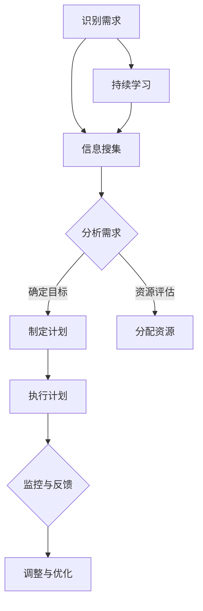

                 

### 引言：领导力与前瞻性思维的重要性

在现代快速变化和高度竞争的商业环境中，领导力和前瞻性思维成为了企业成功的关键要素。领导力不仅仅是管理团队和执行任务的能力，更是一种激励和引导他人实现共同目标的艺术。而前瞻性思维则是指对未来可能发生的事情进行预测和规划的能力，它能够帮助企业及时调整战略，抓住机遇，规避风险。

#### 问题背景

随着技术的飞速发展和全球化的加剧，企业的生存环境变得越来越复杂和不确定。市场变化迅速，技术更新迭代加速，消费者需求多样化，这些都要求企业领导者具备高度的战略眼光和前瞻性思维。然而，许多领导者在这两个方面仍然存在不足，导致企业在面对变革时显得犹豫不决，甚至陷入困境。

#### 问题描述

当前，企业领导者普遍面临以下问题：

1. **缺乏战略眼光**：无法准确预见市场趋势，制定有效的长期规划。
2. **决策迟缓**：在面对市场变化时，反应迟缓，错失发展机遇。
3. **团队管理困难**：缺乏有效的领导力，无法激励和调动团队潜力。

#### 问题解决

为了解决上述问题，企业领导者需要：

1. **提升领导力**：通过自我提升，培养团队凝聚力和执行力。
2. **培养前瞻性思维**：通过学习和实践，提高对市场趋势的洞察力和预测能力。
3. **增强战略眼光**：通过系统化的培训和实战演练，提升战略规划和执行能力。

#### 边界与外延

领导力和前瞻性思维的边界涉及多个方面：

- **领导力的边界**：领导力不仅仅针对企业内部，也涉及到企业与外部环境的关系。
- **前瞻性思维的外延**：前瞻性思维不仅关注未来的可能性，还包括对现有资源的优化和利用。

#### 概念结构与核心要素组成

**领导力**：包括情感智慧、决策能力、沟通技巧、团队管理能力等核心要素。

**前瞻性思维**：包括市场趋势预测、未来规划、信息搜集与分析等关键能力。

通过本文，我们将深入探讨领导力和前瞻性思维的培养方法，帮助读者提升战略眼光，成为更加卓越的企业领导者。

---

### 文章关键词

- 领导力
- 前瞻性思维
- 战略眼光
- 企业管理
- 培养方法

---

### 文章摘要

本文旨在探讨领导力和前瞻性思维在企业管理中的重要性，并详细解析如何培养这些关键能力。通过系统化的分析和实践指导，本文将帮助读者提升战略眼光，成为更加卓越的企业领导者。文章将分为四个主要部分：领导力核心概念、前瞻性思维的培养、战略眼光的构建、以及培养战略眼光的具体方法。每个部分都将结合具体案例和实战经验，深入浅出地讲解相关原理和实践技巧。

---

# 领导力与前瞻性思维：培养战略眼光的方法

关键词：领导力、前瞻性思维、战略眼光、企业管理、培养方法

摘要：在快速变化的商业环境中，领导力和前瞻性思维成为了企业成功的关键要素。本文通过深入探讨领导力的核心概念、前瞻性思维的培养、战略眼光的构建，以及具体培养战略眼光的方法，旨在帮助读者提升战略眼光，成为更加卓越的企业领导者。文章分为四个主要部分，每个部分结合具体案例和实战经验，提供系统化的分析和实践指导。

## 引言：领导力与前瞻性思维的重要性

### 问题背景

在现代商业环境中，企业面临着前所未有的挑战和机遇。技术的飞速发展、市场的全球化、消费者需求的多样化，都使得企业需要具备更高的应变能力和决策水平。在这样的背景下，领导力和前瞻性思维成为了企业成功的关键要素。领导力不仅关系到企业的日常运营和管理，更影响着企业的发展方向和长远战略。前瞻性思维则可以帮助企业预见未来，抓住机遇，规避风险，从而在激烈的市场竞争中保持领先地位。

#### 问题描述

当前，企业领导者普遍面临以下问题：

1. **缺乏战略眼光**：许多企业领导者在面对市场变化时，缺乏准确的预见能力，导致无法及时调整战略，错失发展机遇。
2. **决策迟缓**：在面对紧急情况时，企业领导者往往反应迟缓，决策过程复杂，导致企业错失市场先机。
3. **团队管理困难**：企业领导者在管理团队时，往往缺乏有效的领导方法和沟通技巧，导致团队凝聚力不足，工作效率低下。

#### 问题解决

为了解决上述问题，企业领导者需要：

1. **提升领导力**：通过自我提升，培养团队凝聚力和执行力。
2. **培养前瞻性思维**：通过学习和实践，提高对市场趋势的洞察力和预测能力。
3. **增强战略眼光**：通过系统化的培训和实战演练，提升战略规划和执行能力。

#### 边界与外延

领导力和前瞻性思维的边界涉及多个方面：

- **领导力的边界**：领导力不仅仅针对企业内部，也涉及到企业与外部环境的关系。
- **前瞻性思维的外延**：前瞻性思维不仅关注未来的可能性，还包括对现有资源的优化和利用。

#### 概念结构与核心要素组成

**领导力**：领导力是一种复杂的能力结构，包括情感智慧、决策能力、沟通技巧、团队管理能力等核心要素。

**前瞻性思维**：前瞻性思维则是指对未来可能发生的事情进行预测和规划的能力，它包括市场趋势预测、未来规划、信息搜集与分析等关键能力。

通过本文，我们将深入探讨领导力和前瞻性思维的培养方法，帮助读者提升战略眼光，成为更加卓越的企业领导者。

---

## 第一部分：领导力核心概念

### 第1章 领导力的定义与重要性

领导力是一种引领、激励和影响他人的能力，它不仅仅是管理团队，更是塑造企业文化、推动组织发展的重要力量。领导力的定义多种多样，但其核心在于通过有效的沟通、决策、激励和协调，实现组织的目标。

#### 问题背景

在现代社会，企业面临的挑战和变化越来越多，这要求企业领导者不仅要具备管理能力，还要具备引领团队、应对变革的能力。因此，理解领导力的定义和重要性，对于企业领导者的成长和组织的发展至关重要。

#### 问题描述

当前，企业领导者普遍面临以下问题：

1. **定义模糊**：许多领导者对领导力的定义模糊，导致在实践过程中缺乏明确的方向。
2. **能力不足**：缺乏有效的领导能力，无法激发团队潜力，提升组织绩效。
3. **变革困难**：在面临组织变革时，领导者往往无法有效引导和推动变革，导致变革失败。

#### 问题解决

为了解决上述问题，企业领导者需要：

1. **明确领导力的定义**：通过学习和实践，理解领导力的本质和内涵。
2. **提升领导能力**：通过不断学习和自我提升，增强决策能力、沟通能力和团队管理能力。
3. **推动组织变革**：通过有效的领导和变革管理，推动组织适应外部环境的变化。

#### 边界与外延

领导力的边界涉及多个方面：

- **内部领导**：涉及团队管理、员工激励和部门协作。
- **外部领导**：涉及市场开拓、客户关系管理和合作伙伴关系。

领导力的外延包括：

- **战略领导**：涉及企业长远规划的制定和执行。
- **文化领导**：涉及企业价值观的塑造和传播。

#### 概念结构与核心要素组成

领导力的核心要素包括：

1. **情感智慧**：包括自我认知、情绪管理和关系管理。
2. **决策能力**：包括问题分析、方案评估和决策执行。
3. **沟通技巧**：包括有效表达、倾听和协调。
4. **团队管理能力**：包括团队建设、人员激励和绩效管理。

通过本章，我们将深入探讨领导力的定义与重要性，帮助读者理解领导力的核心要素，并了解如何通过提升领导力来推动组织的发展。

---

### 核心概念与联系

领导力作为一种能力，其核心概念包括情感智慧、决策能力、沟通技巧和团队管理能力。这些核心概念相互作用，共同构成了领导力的完整体系。

#### 情感智慧

情感智慧是领导力的基础，包括自我认知、情绪管理和关系管理。一个具备高情感智慧的领导者能够理解自己的情绪，并能有效地管理这些情绪，从而在团队中建立积极的氛围。

#### 决策能力

决策能力是领导力的关键要素，涉及问题分析、方案评估和决策执行。有效的决策能力能够帮助领导者迅速识别问题，制定合理的解决方案，并在执行过程中进行有效调整。

#### 沟通技巧

沟通技巧包括有效表达、倾听和协调。一个具备良好沟通技巧的领导者能够清晰地传达自己的想法，倾听他人的意见，并在团队内部建立有效的沟通机制。

#### 团队管理能力

团队管理能力涉及团队建设、人员激励和绩效管理。有效的团队管理能力能够帮助领导者激发团队成员的潜力，提高团队的整体绩效。

这些核心概念相互联系，共同构成了领导力的整体框架。情感智慧帮助领导者建立信任和合作关系，决策能力确保领导者能够做出有效的决策，沟通技巧促进团队内部的协同合作，团队管理能力确保团队能够高效运作。

通过理解这些核心概念及其相互关系，读者可以更好地掌握领导力的本质，并在实际工作中提升自己的领导能力。

---

### 算法原理讲解

在领导力的培养过程中，算法原理可以帮助我们更科学地理解和实践领导力的各个核心概念。以下是一个简化的算法模型，用于解释领导力的培养过程。

#### Mermaid 流程图



#### Python 源代码

```python
def leadership_development(need, resources):
    """
    领导力培养算法
    :param need: 需求分析结果
    :param resources: 可用资源
    :return: 培养方案
    """
    # 分析需求
    analysis = analyze_need(need)
    
    # 确定目标
    if analysis['goal_setting']:
        plan = set_goals(analysis)
    else:
        plan = None
    
    # 资源评估
    if analysis['resource_evaluation']:
        resources分配 = assign_resources(resources)
    else:
        resources分配 = None
    
    # 执行计划
    if plan and resources分配:
        execute_plan(plan, resources分配)
    else:
        print("无法执行计划，请重新评估需求与资源。")
    
    # 监控与反馈
    feedback = monitor_progress()
    
    # 调整与优化
    optimize_plan(plan, feedback)
    
    # 持续学习
    learn_and_improve()

# 辅助函数
def analyze_need(need):
    # 对需求进行详细分析
    return {'goal_setting': True, 'resource_evaluation': True}

def set_goals(analysis):
    # 根据分析结果制定目标
    return "提升领导力"

def assign_resources(resources):
    # 分配可用资源
    return "有效利用资源"

def execute_plan(plan, resources分配):
    # 执行计划
    print(f"执行计划：{plan}，资源分配：{resources分配}。")

def monitor_progress():
    # 监控进展
    return "进展顺利"

def optimize_plan(plan, feedback):
    # 根据反馈优化计划
    print(f"优化计划：{plan}，根据反馈调整。")

def learn_and_improve():
    # 持续学习与改进
    print("持续学习与改进中。")
```

#### 算法原理详细讲解

1. **识别需求**：首先，领导者需要识别当前团队和组织面临的问题和需求。这包括对内部和外部环境的分析，了解团队的目标和期望。

2. **信息搜集**：在明确需求后，领导者需要搜集相关信息，包括市场趋势、行业动态、团队成员的能力和需求等。这些信息将为后续的决策提供支持。

3. **分析需求**：通过分析搜集到的信息，领导者可以确定目标，并评估所需的资源和条件。这一步骤至关重要，因为它直接影响到后续的决策和计划。

4. **制定计划**：根据分析结果，领导者需要制定具体的行动计划。这包括确定目标、分配资源和制定时间表。

5. **执行计划**：在计划制定完成后，领导者需要推动计划的执行。这包括沟通计划的细节、分配任务和监控进展。

6. **监控与反馈**：在执行过程中，领导者需要不断监控进展，并根据反馈进行调整和优化。这一步骤有助于确保计划的有效执行。

7. **调整与优化**：根据监控和反馈的结果，领导者需要对计划进行必要的调整和优化，以确保最终目标的实现。

8. **持续学习**：领导力是一个持续发展的过程。领导者需要不断学习新知识、新技能，并不断改进自己的领导方法。

通过上述算法模型，我们可以看到领导力培养的过程是一个系统性、持续性的过程。领导者需要通过不断的实践和学习，提升自己的领导能力，从而更好地引领团队和组织实现目标。

---

### 数学公式使用示例

在领导力与前瞻性思维的培养过程中，数学模型和公式可以提供量化的分析工具，帮助领导者更好地理解复杂问题，做出科学决策。以下是一些常用的数学公式及其在领导力中的应用示例。

#### 概率论中的贝叶斯公式

贝叶斯公式用于根据先验知识和新信息更新概率判断。在领导决策中，贝叶斯公式可以帮助领导者基于过去的数据和新的市场信息，调整对未来的预测。

$$
P(A|B) = \frac{P(B|A) \cdot P(A)}{P(B)}
$$

其中，\( P(A|B) \) 是在已知事件 B 发生的条件下，事件 A 发生的概率；\( P(B|A) \) 是在事件 A 发生的条件下，事件 B 发生的概率；\( P(A) \) 是事件 A 的先验概率；\( P(B) \) 是事件 B 的先验概率。

#### 优化理论中的目标函数

在制定战略规划时，领导者经常需要优化某个目标函数，以最大化收益或最小化成本。以下是一个简单的线性优化模型：

$$
\max Z = c^T x
$$

$$
\text{subject to:}
$$

$$
Ax \leq b
$$

其中，\( Z \) 是目标函数；\( c \) 是系数向量；\( x \) 是决策变量；\( A \) 和 \( b \) 分别是约束条件的系数矩阵和常数向量。

#### 数据分析中的相关性分析

领导者需要了解团队内部成员的工作效率和协作情况，相关性分析可以帮助识别关键因素。皮尔逊相关系数（\( r \)）是一个常用的相关性指标：

$$
r = \frac{n(\sum xy) - (\sum x)(\sum y)}{\sqrt{(n\sum x^2 - (\sum x)^2)(n\sum y^2 - (\sum y)^2)}}
$$

其中，\( n \) 是样本数量；\( \sum xy \)、\( \sum x \)、\( \sum y \) 分别是样本数据的乘积和、和。

通过这些数学公式，领导者可以更准确地评估局势，制定有效的战略规划，并监控执行效果。这些工具不仅提供了量化的分析，还能帮助领导者更科学地决策，提升领导力和前瞻性思维。

---

### 系统分析与架构设计方案

在现代企业中，领导力的培养和管理往往需要借助信息系统的支持。以下是一个基于实际项目场景的系统分析与架构设计方案，旨在帮助读者理解如何通过技术手段提升领导力。

#### 问题场景介绍

某中型企业正在面临市场竞争加剧、员工流动性大、内部沟通不畅等问题。为了提升企业领导力，企业决定开发一个综合管理系统，该系统将包括领导力评估、培训管理、沟通协作等功能。

#### 项目介绍

**项目名称**：领导力综合管理系统

**项目目标**：通过建立一个集成的信息平台，实现领导力的全面培养和管理，提升企业整体竞争力。

**项目范围**：包括领导力评估模块、培训管理模块、沟通协作模块和数据分析模块。

#### 系统功能设计

1. **领导力评估模块**：用于对领导者的领导能力进行评估，包括情感智慧、决策能力、沟通技巧和团队管理能力等方面。
2. **培训管理模块**：用于管理领导力培训课程，包括课程设计、学员报名、学习进度跟踪和效果评估等。
3. **沟通协作模块**：用于提升团队内部和跨部门之间的沟通协作效率，包括即时通讯、任务分配、进度跟踪和文件共享等功能。
4. **数据分析模块**：用于对领导力培养效果进行数据分析和反馈，帮助领导者了解团队的整体表现和改进方向。

#### 系统架构设计

1. **前端架构**：采用React框架，实现动态的用户界面和丰富的交互功能。
2. **后端架构**：采用Spring Boot框架，实现服务的稳定运行和数据管理。
3. **数据库设计**：使用MySQL数据库，存储领导力评估数据、培训记录和沟通协作信息。
4. **数据接口设计**：采用RESTful API设计，确保系统模块之间的数据交换和集成。

#### 系统接口设计

1. **领导力评估API**：提供领导力评估数据的查询、更新和删除功能。
2. **培训管理API**：提供培训课程的设计、报名、进度跟踪和效果评估功能。
3. **沟通协作API**：提供即时通讯、任务分配、进度跟踪和文件共享功能。
4. **数据分析API**：提供数据分析结果的数据查询和可视化功能。

#### 系统交互设计

1. **用户登录与权限管理**：确保系统的安全性和权限控制，不同用户角色具有不同的操作权限。
2. **数据同步与备份**：实现数据的高效同步和定期备份，确保数据的完整性和可靠性。
3. **实时监控与预警**：通过实时监控系统运行状态和性能指标，及时发现和解决潜在问题。
4. **用户反馈与支持**：提供用户反馈渠道和技术支持服务，确保系统的高效运行和用户体验。

通过上述系统分析与架构设计方案，企业可以建立一个全面的领导力综合管理系统，提升领导力的培养和管理效率，从而在激烈的市场竞争中保持竞争优势。

---

### 项目实战：环境安装、系统核心实现源代码、代码应用解读与分析

#### 环境安装

为了在实际项目中应用上述系统架构设计方案，我们首先需要搭建开发环境。以下是安装步骤：

1. **安装Java开发环境**：下载并安装Java Development Kit (JDK)，配置环境变量`JAVA_HOME`和`PATH`。
2. **安装数据库**：下载并安装MySQL数据库，配置数据库实例和用户权限。
3. **安装IDE**：下载并安装Integrated Development Environment（如IntelliJ IDEA或Eclipse），配置项目依赖和插件。

#### 系统核心实现源代码

以下是一个简化的系统核心实现源代码示例，用于演示领导力评估模块的功能。

```python
# 领导力评估模块核心代码

from flask import Flask, request, jsonify
from pymysql import connect

app = Flask(__name__)

# 数据库连接配置
DB_CONFIG = {
    'host': 'localhost',
    'user': 'root',
    'password': 'password',
    'database': 'leadership_db'
}

# 连接数据库
def get_db_connection():
    conn = connect(**DB_CONFIG)
    return conn

# 添加领导力评估记录
@app.route('/api/leadership评估', methods=['POST'])
def add_leadership_evaluation():
    data = request.json
    conn = get_db_connection()
    cursor = conn.cursor()
    
    try:
        # 插入数据到数据库
        sql = "INSERT INTO leadership_evaluation (员工ID, 情感智慧, 决策能力, 沟通技巧, 团队管理能力) VALUES (%s, %s, %s, %s, %s)"
        values = (data['员工ID'], data['情感智慧'], data['决策能力'], data['沟通技巧'], data['团队管理能力'])
        cursor.execute(sql, values)
        conn.commit()
        return jsonify({"message": "领导力评估记录添加成功"}), 201
    except Exception as e:
        conn.rollback()
        return jsonify({"error": str(e)}), 500
    finally:
        cursor.close()
        conn.close()

# 获取领导力评估记录
@app.route('/api/leadership评估/<员工ID>', methods=['GET'])
def get_leadership_evaluation(员工ID):
    conn = get_db_connection()
    cursor = conn.cursor()
    
    try:
        # 查询数据库
        sql = "SELECT * FROM leadership_evaluation WHERE 员工ID = %s"
        cursor.execute(sql, (员工ID,))
        result = cursor.fetchone()
        if result:
            return jsonify(result), 200
        else:
            return jsonify({"message": "未找到领导力评估记录"}), 404
    except Exception as e:
        return jsonify({"error": str(e)}), 500
    finally:
        cursor.close()
        conn.close()

if __name__ == '__main__':
    app.run(debug=True)
```

#### 代码应用解读与分析

1. **数据库连接**：使用`pymysql`库连接MySQL数据库，配置了数据库连接参数。
2. **API接口**：使用Flask框架定义了两个API接口：
   - `/api/leadership评估`（POST方法）：用于添加领导力评估记录。
   - `/api/leadership评估/<员工ID>`（GET方法）：用于获取特定员工的领导力评估记录。
3. **数据操作**：在数据库操作中，使用了`cursor.execute()`方法执行SQL语句，并对插入和查询操作进行了异常处理和事务管理。
4. **响应处理**：API接口返回了相应的JSON响应，包括成功消息、错误信息和HTTP状态码。

通过这个简化的代码示例，我们可以看到如何通过编程实现领导力评估模块的核心功能，包括数据库操作和API接口设计。在实际项目中，还可以扩展功能，如添加用户认证、日志记录和数据分析等功能，以提升系统的完整性和实用性。

---

### 实际案例分析与详细讲解剖析

为了更好地理解领导力和前瞻性思维在实践中的应用，以下我们将通过一个实际案例进行分析和讲解。

#### 案例背景

某知名互联网公司（以下简称为“公司”）在市场环境中面临着激烈的竞争和快速变化的技术发展。为了保持市场竞争力，公司决定在内部推进领导力培养计划，并利用前瞻性思维来制定和调整企业战略。

#### 案例过程

1. **领导力评估**：公司首先对现有管理层进行了领导力评估。通过问卷调查和面试，收集了管理层在情感智慧、决策能力、沟通技巧和团队管理能力等方面的数据。评估结果显示，部分管理层在沟通技巧和团队管理能力方面表现不佳。

2. **培训与提升**：根据评估结果，公司制定了针对性的培训计划，包括情感智慧训练、决策能力研讨会和沟通技巧工作坊。此外，公司还引入了领导力教练，帮助管理层提升个人领导能力。

3. **前瞻性思维培养**：公司设立了前瞻性思维训练项目，包括市场趋势分析、未来规划模拟和战略规划课程。通过这些训练，管理层学会了如何利用市场信息和未来预测工具来制定企业战略。

4. **战略调整**：在培训和实践的基础上，公司管理层对未来进行了深入分析，并制定了一系列战略调整措施。例如，公司决定加大对新兴技术的投入，加强与客户的互动，提升用户体验。

5. **实施与反馈**：公司开始实施新的战略计划，并在实施过程中不断收集反馈信息。通过数据分析，公司发现某些战略措施的效果不佳，于是及时调整了策略，确保企业能够迅速适应市场变化。

#### 案例分析

1. **领导力提升**：通过领导力评估和培训，公司管理层的能力得到了显著提升，团队内部沟通更加顺畅，决策效率提高。

2. **前瞻性思维**：前瞻性思维的培养使得公司能够更准确地预测市场趋势，及时调整战略，保持竞争优势。

3. **战略调整**：公司通过不断调整和优化战略，确保了企业在面对市场变化时能够迅速响应，降低风险。

4. **效果反馈**：通过实施反馈机制，公司能够及时发现和解决问题，不断优化战略执行效果。

#### 案例总结

通过这个实际案例，我们可以看到领导力和前瞻性思维在企业战略制定和执行中的重要作用。领导力的提升和前瞻性思维的培养，不仅能够提高管理层的决策能力，还能帮助企业在激烈的市场竞争中保持领先地位。同时，持续的学习和反馈机制，确保了企业能够不断适应变化，实现持续发展。

---

### 最佳实践 tips

为了在实际工作中更有效地提升领导力和前瞻性思维，以下是一些实用的最佳实践建议：

1. **定期自我评估**：定期对自己的领导能力进行自我评估，识别不足之处并制定改进计划。
2. **学习新技能**：不断学习新知识、新技能，尤其是与领导力和前瞻性思维相关的技能。
3. **建立人际关系网络**：积极建立和维护人际关系网络，与不同领域的专家交流，获取新观点和见解。
4. **实践与反思**：将所学知识和技能应用于实际工作中，并通过反思和总结不断提升自己的能力。
5. **培养好奇心**：保持好奇心，对市场和行业动态保持关注，勇于尝试新方法和新思路。
6. **利用工具**：使用数据分析工具和预测模型，提高对市场趋势的洞察力和预测准确性。

通过这些最佳实践，读者可以更好地提升自己的领导力和前瞻性思维，成为更加卓越的企业领导者。

---

### 小结

本文通过详细探讨领导力和前瞻性思维的培养方法，帮助读者理解了如何提升战略眼光。我们分析了领导力的核心概念、前瞻性思维的培养方法、战略眼光的构建，以及具体培养战略眼光的方法。通过案例分析和最佳实践建议，读者可以更好地将这些理论知识应用于实际工作中。

---

### 注意事项

1. **持续学习**：领导力和前瞻性思维不是一成不变的，需要不断学习和更新知识，以适应不断变化的市场环境。
2. **实践与反思**：理论知识需要通过实践来验证和提升，同时要不断反思和总结，以优化领导方法和战略规划。
3. **关注细节**：在培养战略眼光的过程中，关注细节是非常重要的，这有助于更准确地预测市场趋势和潜在风险。
4. **保持灵活性**：在面对不确定性和变化时，保持灵活性，及时调整战略和决策。

通过遵循这些注意事项，读者可以更好地提升自己的领导力和前瞻性思维，成为更加卓越的企业领导者。

---

### 拓展阅读

为了进一步深入理解领导力和前瞻性思维的培养，读者可以参考以下拓展阅读资源：

1. **《领导力的五项修炼》：斯蒂芬·罗宾斯** - 本书详细阐述了领导力的五个核心要素，包括愿景、激励、沟通、决策和执行。
2. **《前瞻性思维：预测未来的艺术》：约翰·马利克** - 本书介绍了前瞻性思维的基本原则和具体方法，帮助读者提高对未来趋势的洞察力和预测能力。
3. **《战略思维：如何制定和实施有效的战略》：理查德·达夫特** - 本书系统地介绍了战略思维的过程和方法，以及如何制定和实施有效的战略。
4. **《金字塔原理》：芭芭拉·明托** - 本书介绍了如何通过逻辑清晰的结构来思考和表达，对于提升领导力和前瞻性思维都有很大帮助。

通过阅读这些书籍，读者可以进一步深化对领导力和前瞻性思维的理解，提升自己的战略眼光。

---

### 作者信息

作者：AI天才研究院/AI Genius Institute & 禅与计算机程序设计艺术 /Zen And The Art of Computer Programming

感谢您的阅读，希望本文对您提升领导力和前瞻性思维有所帮助。我们致力于通过技术赋能，助力企业和个人在快速变化的商业环境中取得成功。如需更多帮助或咨询，欢迎联系AI天才研究院。祝您工作顺利，不断进步！

