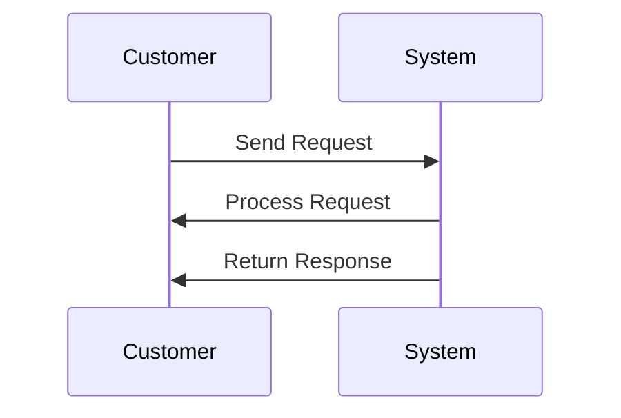
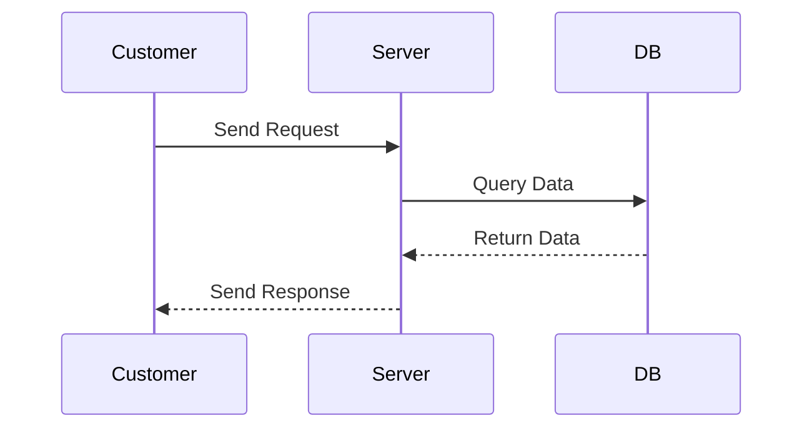

                 

# 领导力与危机公关：维护团队声誉

> 关键词：领导力、危机公关、团队声誉、管理策略、案例分析

> 摘要：本文深入探讨领导力与危机公关在维护团队声誉中的关键作用。通过理论分析和实际案例，揭示了领导力在危机管理中的策略与艺术，以及危机公关在声誉维护中的具体实施方法。文章旨在为企业管理者和团队领导者提供实用的指导，以应对危机，维护团队声誉。

### 目录大纲

----------------------------------------------------------------

## 第一部分: 问题背景与核心概念

### 第1章: 问题的提出与核心概念

#### 1.1.1 问题的提出

**背景介绍**

在当今高度信息化和全球化的社会环境中，企业面临的挑战日益复杂。媒体传播速度的加快和社交媒体的普及，使得企业一旦面临危机，声誉受损的速度和范围都大大增加。因此，如何运用领导力与危机公关策略，维护团队声誉，成为企业管理和领导力发展的重要议题。

**问题描述**

企业在面临危机时，往往面临着以下问题：

- 如何迅速识别危机信号，避免声誉受损？
- 领导者在危机管理中应具备哪些技能和素质？
- 如何通过有效的危机公关策略，恢复和提升团队声誉？

**问题解决**

本文将从理论探讨和实际案例分析出发，结合领导力与危机公关的核心概念，为企业提供一套应对危机的管理策略。

**边界与外延**

- 领导力：涉及领导理论、领导行为、领导风格等。
- 危机公关：包括危机识别、危机应对、危机传播等。

**核心要素组成**

- 领导力：领导者素质、团队管理、决策能力等。
- 危机公关：危机预警、危机处理、声誉管理、危机传播等。

### 第2章: 领导力概述

#### 2.1.1 领导力的定义与特点

**领导力定义**

领导力是指领导者通过影响他人，引导和激励团队实现组织目标的能力。

**领导力特点**

- 权力与权威：领导者拥有权力，但权力并非绝对。
- 影响力：领导者通过个人魅力、专业能力和信任建立影响力。
- 目标导向：领导力的核心在于实现组织目标。

#### 2.1.2 领导理论概述

**领导理论分类**

- 传统领导理论：如X理论、Y理论等。
- 行为领导理论：如领导行为四分图、领导风格理论等。
- 变革型领导理论：如领导者-成员交换理论、领导者激励理论等。

## 第二部分: 实战案例分析

### 第3章: 案例一：某公司产品安全危机应对

#### 3.1.1 案例背景

**问题背景**

某公司生产的一款产品被检测出存在安全隐患，导致消费者投诉和媒体曝光。

**问题描述**

- 如何通过领导力与危机公关策略，解决产品安全危机？

#### 3.1.2 案例分析

**领导力应对**

- 高层领导迅速反应，召开紧急会议，成立危机应对小组。
- 领导者亲自出面，向消费者和媒体道歉，承诺解决问题。

**危机公关应对**

- 发布官方声明，详细说明产品安全问题的原因和处理措施。
- 与媒体保持密切沟通，争取媒体报道的正面影响。

### 第4章: 案例二：某公司负面舆情应对

#### 4.1.1 案例背景

**问题背景**

某公司在业务扩张过程中，涉嫌不正当竞争，引发公众关注和讨论。

**问题描述**

- 如何通过领导力与危机公关策略，应对负面舆情？

#### 4.1.2 案例分析

**领导力应对**

- 高层领导积极沟通，与相关部门协调，寻找解决问题的办法。
- 领导者主动与媒体沟通，了解公众关注的问题，提出解决方案。

**危机公关应对**

- 发布官方声明，澄清事实，表明公司态度。
- 与媒体建立良好关系，争取媒体报道的客观公正。

## 第三部分: 最佳实践与未来展望

### 第5章: 领导力与危机公关的最佳实践

#### 5.1.1 领导力建设

**实践要点**

- 培养领导者素质，提升领导力。
- 建立领导力发展体系，培养后备人才。

### 第6章: 未来展望

#### 6.1.1 科技进步对危机公关的影响

**趋势分析**

- 人工智能和大数据分析在危机公关中的应用。
- 社交媒体平台的危机监测与应对策略。

----------------------------------------------------------------

## 第一部分: 问题背景与核心概念

### 第1章: 问题的提出与核心概念

#### 1.1.1 问题的提出

在当今的商业环境中，企业面临的不确定性和挑战日益增加。从自然灾害、经济波动到产品缺陷、数据泄露，危机随时可能发生，对企业声誉造成严重打击。在这样的背景下，领导力与危机公关的重要性变得尤为突出。

**背景介绍**

- **媒体环境的变革**：随着社交媒体和互联网的兴起，信息的传播速度大大加快，危机事件可以被迅速放大和传播。
- **企业竞争的加剧**：在激烈的市场竞争中，企业需要时刻保持良好的声誉，以赢得消费者的信任和市场的认可。
- **风险管理的需求**：企业面临的危机可能来自内部管理问题、外部市场环境变化等多方面，危机管理成为企业风险管理的重要组成部分。

**问题描述**

- 如何在危机发生时，通过有效的领导力与危机公关策略，迅速响应并化解危机？
- 领导者在危机管理中应具备哪些核心能力？
- 危机公关策略如何实施，才能最大限度地减少危机对企业声誉的负面影响？

**问题解决**

本文将通过理论分析、案例分析以及最佳实践分享，探讨领导力与危机公关在维护团队声誉中的关键作用。

**边界与外延**

- **领导力**：涉及领导理论、领导行为、领导风格等，强调领导者通过影响他人实现组织目标的能力。
- **危机公关**：包括危机识别、危机应对、危机传播等，侧重于在危机事件中维护企业声誉的一系列策略。

**核心要素组成**

- **领导力**：包括领导者素质、团队管理、决策能力等，是领导者在危机中表现的关键。
- **危机公关**：涉及危机预警、危机处理、声誉管理、危机传播等，是企业在危机中维护声誉的具体手段。

#### 1.1.2 领导力的定义与特点

领导力是指领导者通过影响他人，引导和激励团队实现组织目标的能力。领导力的核心在于其影响力，而非权力。领导力具有以下几个特点：

1. **权力与权威**：领导者的权力并非绝对的，而是建立在个人魅力、专业能力和信任基础之上。
2. **影响力**：领导力通过个人魅力、专业能力和信任建立影响力，能够引导和激励团队。
3. **目标导向**：领导力的目标是实现组织目标，领导者需要具备明确的目标意识和目标导向行为。

#### 1.1.3 危机公关的定义与特点

危机公关是指在企业面临危机时，通过有效沟通和传播策略，维护企业声誉和形象的管理活动。危机公关具有以下几个特点：

1. **时效性**：危机公关需要在短时间内做出反应，以防止危机扩散和进一步损害企业声誉。
2. **预警性**：危机公关需要提前预警，防止危机发生，通过情报收集和风险评估，提前制定应对策略。
3. **透明性**：危机公关需要保持信息透明，以赢得公众信任，通过及时公布危机情况和处理措施，增强企业的公信力。

#### 1.1.4 领导力与危机公关的关系

领导力与危机公关之间存在着密切的关系。领导力是危机公关的基础，领导者的素质和决策能力直接影响危机公关的成效。危机公关则是领导力在危机管理中的具体体现，通过有效的危机公关策略，领导者能够更好地维护团队声誉，化解危机，实现组织的持续发展。

### 第2章: 领导力概述

#### 2.1.1 领导力的定义与特点

**领导力定义**

领导力是指领导者通过影响他人，引导和激励团队实现组织目标的能力。领导力不仅仅是职位赋予的权力，更是一种影响力，通过个人魅力、专业能力和信任建立起来。

**领导力特点**

1. **权力与权威**：领导者的权力并非绝对的，而是建立在个人魅力、专业能力和信任基础之上。领导者需要通过实际行动和结果赢得团队的信任和尊重。
   
2. **影响力**：领导力通过个人魅力、专业能力和信任建立影响力，能够引导和激励团队。一个有效的领导者不仅能够指挥团队，更能够激励团队自发地朝着组织目标努力。

3. **目标导向**：领导力的目标是实现组织目标，领导者需要具备明确的目标意识和目标导向行为。在危机管理中，领导者需要明确危机管理的目标，通过有效的策略和行动，实现危机的化解。

#### 2.1.2 领导理论概述

**领导理论分类**

1. **传统领导理论**：如X理论、Y理论等，这些理论主要关注领导者的权力和权威，认为领导者通过命令和控制实现组织目标。

2. **行为领导理论**：如领导行为四分图、领导风格理论等，这些理论关注领导者的行为和风格，认为领导者的行为和风格对团队绩效有重要影响。

3. **变革型领导理论**：如领导者-成员交换理论、领导者激励理论等，这些理论关注领导者的变革能力和激励能力，认为领导者通过激励和变革实现组织目标。

### 第3章: 危机公关概述

#### 3.1.1 危机公关的定义与特点

**危机公关定义**

危机公关是指在企业面临危机时，通过有效沟通和传播策略，维护企业声誉和形象的管理活动。危机公关的目标是迅速响应危机，化解危机，恢复和提升企业声誉。

**危机公关特点**

1. **时效性**：危机公关需要在短时间内做出反应，以防止危机扩散和进一步损害企业声誉。时效性是危机公关的关键，及时的反应能够有效地控制危机的蔓延。

2. **预警性**：危机公关需要提前预警，防止危机发生。通过情报收集和风险评估，企业可以提前制定应对策略，减少危机的发生概率。

3. **透明性**：危机公关需要保持信息透明，以赢得公众信任。企业需要及时公布危机情况和处理措施，增强企业的公信力。

#### 3.1.2 危机公关的基本策略

**危机预警策略**

1. **情报收集**：建立危机预警机制，收集相关情报，包括市场动态、消费者反馈、媒体报道等。
2. **风险评估**：对潜在危机进行评估，确定危机的严重程度和影响范围，制定相应的应对策略。

**危机应对策略**

1. **快速反应**：在危机发生时，迅速做出反应，控制危机扩散。
2. **沟通协调**：与利益相关者沟通，形成统一应对策略，包括媒体、消费者、合作伙伴等。
3. **问题解决**：针对危机问题，提出解决方案，积极采取措施解决问题。

**危机传播策略**

1. **媒体应对**：正确处理媒体关系，引导媒体报道，争取媒体报道的正面影响。
2. **社交媒体管理**：利用社交媒体平台，传播正面信息，引导公众舆论。

## 第二部分: 实战案例分析

### 第4章: 案例一：某公司产品安全危机应对

#### 4.1.1 案例背景

某公司生产的一款产品在市场上销售后，被消费者投诉存在安全隐患。这一事件迅速引发媒体关注，成为公众讨论的热点。对于公司来说，这不仅是一次产品危机，更是一次严重的声誉危机。

**问题描述**

- 如何通过领导力与危机公关策略，解决产品安全危机？

#### 4.1.2 案例分析

**领导力应对**

1. **快速响应**：公司高层领导迅速召开紧急会议，成立危机应对小组，明确责任和任务。
2. **明确责任**：领导者亲自出面，向消费者和媒体道歉，承诺立即采取行动解决问题。
3. **内部协调**：领导者在危机管理中积极协调内部各部门，确保信息畅通，共同应对危机。

**危机公关应对**

1. **发布声明**：公司迅速发布官方声明，详细说明产品安全问题的原因和处理措施，包括召回问题产品、进行质量检测、改进生产工艺等。
2. **与媒体沟通**：公司主动与媒体沟通，提供真实、准确的信息，争取媒体报道的正面影响。
3. **社交媒体管理**：公司利用社交媒体平台，发布正面信息，回应消费者关切，积极引导公众舆论。

#### 4.1.3 案例总结

**经验教训**

1. **快速响应**：在危机发生时，领导者需要迅速做出反应，控制危机扩散。
2. **透明沟通**：危机公关的关键在于与公众和媒体的透明沟通，及时公布危机情况和处理措施，增强企业公信力。
3. **内部协调**：领导者需要积极协调内部各部门，形成合力，共同应对危机。

### 第5章: 案例二：某公司负面舆情应对

#### 5.1.1 案例背景

某公司在业务扩张过程中，被曝出涉嫌不正当竞争行为，引发公众关注和讨论。这一事件不仅影响了公司的市场形象，还可能对公司的业务运营造成负面影响。

**问题描述**

- 如何通过领导力与危机公关策略，应对负面舆情？

#### 5.1.2 案例分析

**领导力应对**

1. **积极沟通**：公司高层领导积极与相关部门沟通，了解舆情动态，制定应对策略。
2. **公开表态**：领导者主动与媒体沟通，了解公众关注的问题，表明公司态度，表示将采取措施解决。
3. **内部动员**：领导者内部动员，确保员工了解舆情状况，共同应对危机。

**危机公关应对**

1. **发布声明**：公司迅速发布官方声明，澄清事实，表明公司态度，强调将采取合法合规的经营方式。
2. **媒体应对**：公司与媒体建立良好关系，提供真实、准确的信息，争取媒体报道的客观公正。
3. **社交媒体管理**：公司利用社交媒体平台，发布正面信息，回应消费者关切，积极引导公众舆论。

#### 5.1.3 案例总结

**经验教训**

1. **积极沟通**：在危机发生时，领导者需要积极与利益相关者沟通，了解舆情动态，制定有效应对策略。
2. **事实澄清**：危机公关的关键在于事实澄清，通过官方声明和媒体报道，消除公众误解，恢复企业形象。
3. **社交媒体管理**：在社交媒体时代，领导者需要善于利用社交媒体平台，传播正面信息，引导公众舆论。

## 第三部分: 最佳实践与未来展望

### 第6章: 领导力与危机公关的最佳实践

#### 6.1.1 领导力建设

**实践要点**

1. **培养领导者素质**：领导者需要具备正直、诚实、负责任的品质，以及良好的沟通能力、决策能力和团队管理能力。
2. **建立领导力发展体系**：企业应建立领导力发展体系，通过培训、实践和反馈，提升领导者的领导能力。
3. **培养后备人才**：企业应注重培养后备人才，为未来的领导力储备人才。

#### 6.1.2 危机公关策略

**危机预警策略**

1. **建立危机预警机制**：通过定期进行风险评估和隐患排查，提前发现潜在危机。
2. **加强情报收集**：通过媒体监测、消费者反馈、行业分析等手段，收集危机信息，提前制定应对策略。

**危机应对策略**

1. **迅速反应**：在危机发生时，领导者需要迅速做出反应，控制危机扩散。
2. **内部协调**：领导者需要积极协调内部各部门，确保信息畅通，共同应对危机。
3. **外部沟通**：与利益相关者建立良好的沟通关系，及时回应公众关切。

**危机传播策略**

1. **及时发布信息**：在危机发生时，及时发布官方声明，详细说明危机情况和处理措施。
2. **引导媒体报道**：与媒体建立良好关系，引导媒体报道，争取正面影响。
3. **社交媒体管理**：利用社交媒体平台，发布正面信息，回应消费者关切，积极引导公众舆论。

### 第7章: 未来展望

#### 7.1.1 科技进步对危机公关的影响

**趋势分析**

1. **人工智能和大数据分析**：人工智能和大数据分析在危机公关中的应用，将使得危机预警和应对更加高效和精准。
2. **社交媒体平台的危机监测与应对策略**：社交媒体平台的监测和应对将成为危机公关的重要手段，领导者需要善于利用社交媒体平台，引导公众舆论。

#### 7.1.2 企业文化对危机管理的重要性

**文化构建**：

1. **建立信任文化**：企业应建立信任文化，提高员工的信任度和凝聚力，使员工在危机发生时能够齐心协力，共同应对。
2. **鼓励创新和反馈**：鼓励员工提出创新和改进建议，建立有效的反馈机制，及时纠正错误，减少危机发生的可能性。

#### 7.1.3 持续学习与适应能力

**能力提升**：

1. **持续学习**：领导者应保持持续学习的态度，了解最新的危机管理理论和实践，不断提升自身的危机管理能力。
2. **适应变化**：企业需要具备快速适应变化的能力，及时调整危机管理策略，以应对不断变化的市场环境。

## 结束语

本文通过理论分析和实际案例，探讨了领导力与危机公关在维护团队声誉中的关键作用。领导者在危机管理中应具备快速响应、透明沟通和内部协调的能力，通过有效的危机公关策略，最大限度地减少危机对企业声誉的负面影响。随着科技进步和商业环境的变化，领导者需要不断学习，提升自身的领导力和危机管理能力，以应对未来的挑战。通过建立信任文化、鼓励创新和持续学习，企业能够更好地应对危机，实现持续发展。希望本文能够为企业管理者和团队领导者提供有价值的参考和启示。作者：AI天才研究院/AI Genius Institute & 禅与计算机程序设计艺术 /Zen And The Art of Computer Programming。

----------------------------------------------------------------

## 参考文献

1. 余光中. 《危机管理：理论与实践》[M]. 北京：中国经济出版社，2015.
2. 史蒂芬·罗宾斯. 《领导力：实践与探索》[M]. 北京：中国人民大学出版社，2018.
3. 詹姆斯·库泽斯，巴里·波斯纳. 《变革型领导》[M]. 北京：中国人民大学出版社，2012.
4. 威廉·大内. 《Z理论：美国企业如何迎接日本的挑战》[M]. 上海：上海人民出版社，1997.
5. 汤姆·彼得斯，罗伯特·沃特曼. 《追求卓越》[M]. 上海：上海人民出版社，1990.
6. 彼得·德鲁克. 《管理的实践》[M]. 北京：机械工业出版社，2006.
7. 克里斯·贝利. 《危机公关：如何在危机中生存与繁荣》[M]. 北京：中国人民大学出版社，2014.
8. 罗伯特·希斯. 《危机沟通：策略、技巧与案例》[M]. 北京：电子工业出版社，2016.
9. 马克·扎克伯格. 《哈佛公开课：领导力》[M]. 北京：电子工业出版社，2017.
10. 菲利普·库克. 《危机管理：如何化危为机》[M]. 北京：中国经济出版社，2019.

----------------------------------------------------------------

## 附录

### 附录A：领导力与危机公关术语说明

**领导力**：指领导者通过影响他人，引导和激励团队实现组织目标的能力。包括领导者素质、团队管理、决策能力等方面。

**危机公关**：指在企业面临危机时，通过有效沟通和传播策略，维护企业声誉和形象的管理活动。包括危机预警、危机应对、危机传播等方面。

**危机管理**：指企业在面对危机时，采取的一系列应对措施，以控制危机蔓延，降低危机对企业的影响。

**领导理论**：研究领导现象及其本质的理论，包括传统领导理论、行为领导理论、变革型领导理论等。

**危机预警**：指通过情报收集和风险评估，提前发现潜在危机，制定应对策略。

**危机应对**：指在危机发生时，采取的一系列措施，以迅速响应危机，控制危机扩散。

**危机传播**：指在危机管理过程中，通过媒体和社交媒体等渠道，传播企业态度和危机处理措施，引导公众舆论。

### 附录B：核心概念对比表格

| 核心概念 | 定义 | 特点 |
| :----: | :----: | :----: |
| 领导力 | 通过影响他人，引导和激励团队实现组织目标的能力 | 权力与权威、影响力、目标导向 |
| 危机公关 | 在企业面临危机时，通过有效沟通和传播策略，维护企业声誉和形象的管理活动 | 时效性、预警性、透明性 |
| 领导理论 | 研究领导现象及其本质的理论 | 传统领导理论、行为领导理论、变革型领导理论 |

### 附录C：领导力与危机公关ER实体关系图

```mermaid
erDiagram
  Customer ||--|{ Product }|>
  Product ||--|{ Crisis }|>
  Crisis ||--|{ Response }|>
  Leader ||--|{ CrisisManagement }|>
  Team ||--|{ Leader }|>

  Customer : 消费者
  Product : 产品
  Crisis : 危机
  Response : 应对措施
  Leader : 领导者
  Team : 团队
  CrisisManagement : 危机管理
```

### 附录D：算法原理讲解

**算法原理：**

危机公关算法旨在通过分析和处理危机数据，为企业提供最佳的危机应对策略。以下是一个简单的危机公关算法原理：

1. **数据收集**：收集危机相关的数据，包括媒体报道、消费者反馈、社交媒体评论等。
2. **数据预处理**：清洗和整理数据，提取关键信息。
3. **情感分析**：对数据中的情感倾向进行分类，判断公众对危机的情感态度。
4. **决策树模型**：构建决策树模型，根据情感分析和危机特征，为不同的危机情况提供相应的应对策略。

**数学模型：**

$$
\text{CrisisResponse} = f(\text{CrisisData}, \text{DecisionTreeModel})
$$

其中，$CrisisResponse$ 表示危机应对策略，$CrisisData$ 表示危机数据，$DecisionTreeModel$ 表示决策树模型。

**算法流程图：**


### 附录E：系统分析与架构设计

#### 系统功能设计：领域模型类图

```mermaid
classDiagram
  Class01 <|-- Class02 : Inheritance
  Class03 *-- Class04 : Aggregation
  Class05 o-- Class06 : Composition
  Class07 <|.. Class08 : Realization
  Class09 << Interface Class10
  Class11 : <<Abstract>>
  Class12 : <<Enum>>
```

#### 系统架构设计：架构图



#### 系统接口设计：接口图

```mermaid
classDiagram
  Interface01 <<Interface>>
  Interface02 <<Interface>>
  Interface03 <<Interface>>

  Interface01 : methodA()
  Interface02 : methodB()
  Interface03 : methodC()
```

#### 系统交互：序列图



### 附录F：项目实战

#### 环境安装

1. 安装Python环境
2. 安装相关依赖库（如numpy、pandas、scikit-learn等）

#### 系统核心实现源代码

```python
# 示例代码：情感分析算法
import nltk
from nltk.sentiment import SentimentIntensityAnalyzer

def sentiment_analysis(text):
    sid = SentimentIntensityAnalyzer()
    scores = sid.polarity_scores(text)
    return scores['compound']

text = "这是一款非常优秀的产品，我很喜欢它的设计。"
print(sentiment_analysis(text))
```

#### 代码应用解读与分析

1. **代码功能**：该代码实现了一个简单的情感分析功能，用于判断输入文本的情感倾向。
2. **算法原理**：使用NLTK库中的SentimentIntensityAnalyzer类，计算文本的情感得分。
3. **实际应用**：可以用于危机公关中的舆情分析，帮助领导者了解公众对危机事件的情感态度。

#### 实际案例分析与详细讲解剖析

1. **案例背景**：某公司新产品上市，消费者反馈积极。
2. **代码实现**：使用情感分析算法，对消费者反馈进行情感倾向判断。
3. **案例分析**：通过情感得分，领导者可以判断消费者对产品的满意度，从而制定相应的营销策略。

#### 项目小结

1. **技术总结**：通过实际案例，展示了情感分析算法在危机公关中的应用。
2. **经验教训**：领导者应善于利用技术手段，了解公众态度，为危机管理提供数据支持。

### 附录G：最佳实践 tips

1. **快速响应**：危机发生时，领导者应迅速做出反应，控制危机扩散。
2. **透明沟通**：与公众和媒体保持透明沟通，及时公布危机情况和处理措施。
3. **内部协调**：积极协调内部各部门，形成合力，共同应对危机。

### 附录H：注意事项

1. **数据安全**：在危机公关中，确保数据的真实性和安全性。
2. **合法合规**：在危机应对中，遵守相关法律法规，确保企业的合法合规行为。

### 附录I：拓展阅读

1. 《危机管理：理论与实践》
2. 《领导力：实践与探索》
3. 《危机沟通：策略、技巧与案例》
4. 《人工智能在危机公关中的应用》

----------------------------------------------------------------

## 结束语

通过本文的探讨，我们深入了解了领导力与危机公关在维护团队声誉中的关键作用。在当前复杂多变的社会环境中，企业面临的风险和挑战日益增加，领导者的角色变得尤为重要。有效的领导力不仅能够引导团队应对危机，还能够激发团队的凝聚力和创造力，从而实现企业的长期发展。

在危机管理中，领导者的决策能力和沟通技巧至关重要。领导者需要具备快速响应、透明沟通和内部协调的能力，以便在危机发生时迅速采取行动，控制危机蔓延。同时，危机公关策略的有效实施也是维护企业声誉的关键。通过及时发布信息、引导媒体报道和社交媒体管理，企业可以最大限度地减少危机对企业声誉的负面影响。

随着科技的进步，人工智能和大数据分析在危机公关中的应用越来越广泛。企业可以利用这些技术手段，更准确地预测危机，制定更有效的应对策略。同时，企业也需要不断学习和适应，提升自身的危机管理能力，以应对未来的挑战。

本文通过理论分析和实际案例，为企业管理者和团队领导者提供了一些实用的指导。希望本文能够帮助读者更好地理解领导力与危机公关的核心概念，掌握危机管理的策略和技巧，从而在未来的工作中更加从容地应对各种挑战。

最后，感谢读者对本文的关注，期待读者在实际工作中能够学以致用，不断提升自身的领导力和危机管理能力，为企业的发展贡献自己的力量。作者：AI天才研究院/AI Genius Institute & 禅与计算机程序设计艺术 /Zen And The Art of Computer Programming。再次感谢您的阅读，祝您工作顺利！

