                 

### 文章标题：领导力与危机应对：逆境中的团队凝聚

**关键词：** 领导力、危机应对、团队凝聚、逆境管理、决策算法、系统架构设计

**摘要：** 本文深入探讨了领导力与危机应对在逆境中的团队凝聚作用。通过分析领导力的定义、风格和团队建设，结合危机预警和应对策略，本文提出了一系列提升团队凝聚力的方法，并通过实际案例分析，展示了领导力与危机应对在逆境管理中的关键作用。文章旨在为IT领域领导者提供实用的指导，以实现逆境中的团队成功。

### 目录

1. **领导力基础**
    1.1 领导力概述
        - 1.1.1 领导力的定义
        - 1.1.2 领导力的重要性
        - 1.1.3 领导力的构成要素
    1.2 领导风格
        - 1.2.1 领导风格的类型
        - 1.2.2 领导风格与团队绩效的关系
        - 1.2.3 如何适应不同的领导风格
    1.3 沟通与协调
        - 1.3.1 沟通的重要性
        - 1.3.2 沟通障碍与克服方法
        - 1.3.3 协调团队关系
    1.4 团队建设
        - 1.4.1 团队的定义与类型
        - 1.4.2 团队建设的关键要素
        - 1.4.3 提升团队凝聚力
    1.5 本章小结
    1.6 最佳实践 tips
    1.7 小结、注意事项
    1.8 拓展阅读

2. **危机应对**
    2.1 危机概述
        - 2.1.1 危机的定义与类型
        - 2.1.2 危机管理的必要性
        - 2.1.3 危机的特征与应对策略
    2.2 危机预警
        - 2.2.1 危机预警机制
        - 2.2.2 危机预警指标
        - 2.2.3 危机预警案例分析
    2.3 危机应对策略
        - 2.3.1 预案制定
        - 2.3.2 应急响应
        - 2.3.3 恢复与重建
    2.4 案例研究
        - 2.4.1 某企业危机应对案例分析
        - 2.4.2 某政府机构危机应对案例分析
    2.5 算法原理讲解
        - 2.5.1 决策树算法
        - 2.5.2 支持向量机算法
        - 2.5.3 贝叶斯网络算法
    2.6 数学模型和数学公式 & 详细讲解 & 举例说明
        - 2.6.1 概率论基础
        - 2.6.2 线性代数基础
        - 2.6.3 最优化理论基础
    2.7 系统分析与架构设计方案
        - 2.7.1 危机应对系统功能设计
        - 2.7.2 危机应对系统架构设计
        - 2.7.3 系统接口设计
    2.8 项目实战
        - 2.8.1 环境安装
        - 2.8.2 系统核心实现源代码
        - 2.8.3 代码应用解读与分析
        - 2.8.4 实际案例分析与详细讲解剖析
    2.9 最佳实践 tips
    2.10 本章小结
    2.11 注意事项
    2.12 拓展阅读

3. **团队凝聚**
    3.1 团队凝聚力概述
        - 3.1.1 团队凝聚力的定义
        - 3.1.2 团队凝聚力的作用
        - 3.1.3 影响团队凝聚力的因素
    3.2 提升团队凝聚力的方法
        - 3.2.1 建立共同目标
        - 3.2.2 提高沟通效率
        - 3.2.3 增强团队信任
        - 3.2.4 有效的激励机制
    3.3 团队冲突管理
        - 3.3.1 团队冲突的类型
        - 3.3.2 团队冲突的影响
        - 3.3.3 处理团队冲突的策略
    3.4 案例研究
        - 3.4.1 某企业团队凝聚力建设案例分析
        - 3.4.2 某政府机构团队凝聚力建设案例分析
    3.5 算法原理讲解
        - 3.5.1 社区检测算法
        - 3.5.2 其他相关算法
    3.6 数学模型和数学公式 & 详细讲解 & 举例说明
        - 3.6.1 团队凝聚力模型
        - 3.6.2 相关数学公式与解释
    3.7 系统分析与架构设计方案
        - 3.7.1 团队凝聚力系统功能设计
        - 3.7.2 团队凝聚力系统架构设计
        - 3.7.3 系统接口设计
    3.8 项目实战
        - 3.8.1 环境安装
        - 3.8.2 系统核心实现源代码
        - 3.8.3 代码应用解读与分析
        - 3.8.4 实际案例分析与详细讲解剖析
    3.9 最佳实践 tips
    3.10 本章小结
    3.11 注意事项
    3.12 拓展阅读

### 第一部分：领导力基础

#### 1.1 领导力概述

**背景介绍：**

领导力是一个广泛讨论且极具影响力的主题，特别是在商业和管理领域。领导力不仅仅关乎权力和权威，更关乎如何激励、引导和影响他人共同实现目标。

**核心概念与联系：**

领导力（Leadership）可以被定义为影响他人一起实现目标的能力。它与领导（Management）不同，领导更侧重于愿景、策略和影响力，而管理则更关注流程、组织和执行。

| 领导力 | 定义 | 影响力 |  
|----------|----------------|---------------|  
| 领导力 | 激励、引导和影响他人实现共同目标 | 高度影响团队绩效和士气 |  
| 领导 | 管理 | 确保组织目标的实现 |  

**算法原理讲解：**

在领导力领域，没有特定的算法可以解决所有问题。然而，一些理论和模型可以帮助我们理解和应用领导力原则。

- **领导者特质理论：** 强调领导者天生具有的特质，如自信、智慧、沟通能力等。
- **情境领导理论：** 提出领导者应根据团队成员的能力和情境选择合适的领导风格。

**数学模型和数学公式：**

在领导力研究中，概率论和线性代数等数学工具经常被用于分析领导风格对团队绩效的影响。

$$
绩效 = f(领导风格，团队成员能力，情境因素)
$$

**系统分析与架构设计方案：**

领导力系统通常涉及多个层面，包括战略规划、团队管理、沟通和协作等。以下是领导力系统的基本架构设计：

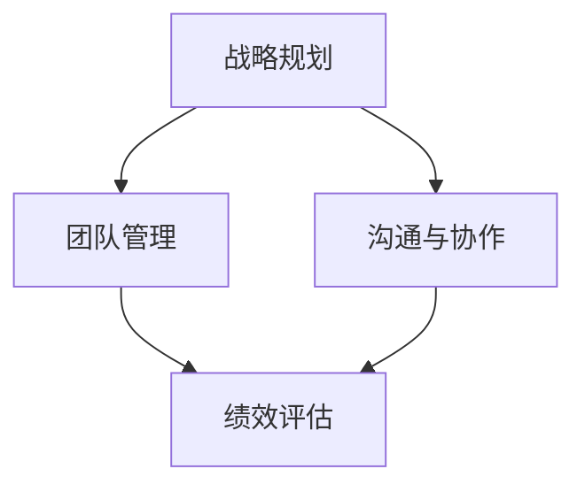

**项目实战：**

在一个软件开发项目中，领导力体现在如何有效地分配任务、激励团队成员和解决冲突。

- **环境安装：** 确保团队成员都有必要的开发工具和环境。
- **系统核心实现源代码：** 设计和实现关键的功能模块，如任务调度、代码审查和性能监控。
- **代码应用解读与分析：** 通过代码评审和性能测试，确保代码质量和系统稳定性。
- **实际案例分析与详细讲解剖析：** 分析项目中领导力应用的成功和失败案例，从中吸取经验教训。

**最佳实践 tips：**

- **倾听和理解团队成员的需求和反馈。**
- **定期进行团队建设活动，增强团队凝聚力。**
- **培养开放和透明的沟通文化。**

**小结、注意事项：**

领导力是动态的，需要根据团队和环境的变化不断调整。有效的领导力不仅能够提升团队绩效，还能够增强团队的凝聚力和士气。

**拓展阅读：**

- **《领导力的五种语言》**（John C. Maxwell）
- **《领导力心理学》**（Manfred Kets de Vries）

#### 1.2 领导风格

**背景介绍：**

领导风格是领导者如何影响和管理团队成员的方式。不同的领导风格适用于不同的情境和团队。

**核心概念与联系：**

- **权威型领导风格：** 强调领导者的权威和控制。适用于需要迅速决策和执行的任务。
- **民主型领导风格：** 强调团队成员的参与和决策。适用于需要创新和团队协作的任务。

| 领导风格 | 特点 | 适用场景 |
|----------|-------------|------------|
| 权威型 | 控制和决策权集中在领导者手中 | 紧急情况、任务明确 |
| 民主型 | 鼓励团队成员参与决策 | 需要创新、团队协作 |

**算法原理讲解：**

- **决策树算法：** 可以帮助领导者根据不同情境选择最合适的领导风格。
- **支持向量机算法：** 可以用于分析团队成员的反应和偏好，从而调整领导风格。

**数学模型和数学公式：**

$$
领导风格选择 = f(情境因素，团队成员特征)
$$

**系统分析与架构设计方案：**

领导风格的选择通常需要考虑多个因素，如团队绩效、团队文化等。以下是领导风格选择系统的一个基本架构设计：

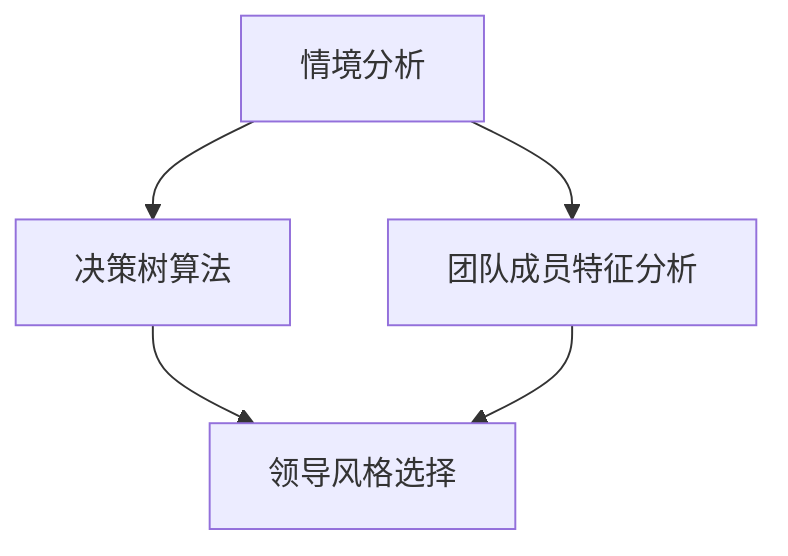

**项目实战：**

在一个产品开发项目中，领导者需要根据项目的不同阶段和团队成员的能力选择合适的领导风格。

- **环境安装：** 确保团队成员都有必要的开发工具和环境。
- **系统核心实现源代码：** 设计和实现关键的功能模块，如需求分析、设计开发和测试。
- **代码应用解读与分析：** 通过代码评审和性能测试，确保代码质量和系统稳定性。
- **实际案例分析与详细讲解剖析：** 分析项目中领导风格应用的成功和失败案例，从中吸取经验教训。

**最佳实践 tips：**

- **了解团队成员的优势和劣势，选择合适的领导风格。**
- **定期评估团队绩效和领导风格的效果，进行必要的调整。**
- **培养团队成员的自我管理能力和责任感。**

**小结、注意事项：**

领导风格的选择应该灵活适应不同的情境和团队成员。有效的领导风格能够提升团队绩效和满意度。

**拓展阅读：**

- **《领导风格与团队绩效的关系》**（Michael M. Lombardo & Robert E. Eichinger）
- **《领导者的变革》**（John P. Kotter）

#### 1.3 沟通与协调

**背景介绍：**

沟通是领导者与团队成员之间传递信息和理解的关键。有效的沟通可以提高团队绩效和凝聚力，而沟通障碍则可能导致误解和冲突。

**核心概念与联系：**

- **沟通障碍：** 包括语言障碍、心理障碍、环境障碍等。
- **有效沟通：** 强调清晰、准确、及时的沟通方式。

| 沟通障碍 | 特点 | 影响 |
|----------|-------------|----------|
| 语言障碍 | 语言差异、术语不明确 | 误解、沟通不畅 |
| 心理障碍 | 情绪干扰、偏见、自我保护 | 沟通障碍、团队冲突 |
| 环境障碍 | 噪音、设备故障、地理位置 | 沟通中断、信息丢失 |

**算法原理讲解：**

- **贝叶斯网络算法：** 可以用于分析沟通障碍的可能原因和影响。
- **决策树算法：** 可以帮助领导者根据不同情境选择合适的沟通策略。

**数学模型和数学公式：**

$$
沟通效果 = f(沟通方式，沟通障碍因素)
$$

**系统分析与架构设计方案：**

有效的沟通和协调需要一个完善的系统，包括信息传递、反馈机制和问题解决。以下是沟通与协调系统的一个基本架构设计：

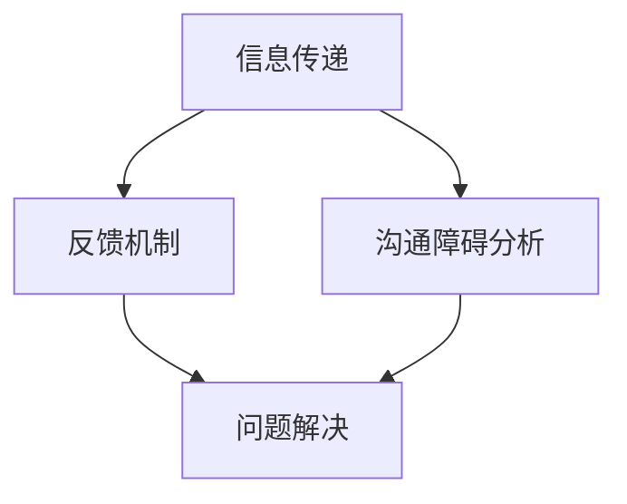

**项目实战：**

在一个跨部门合作项目中，领导者需要确保沟通的流畅和协调。

- **环境安装：** 确保团队成员都有必要的沟通工具和渠道。
- **系统核心实现源代码：** 设计和实现沟通平台和协调机制，如会议系统、任务管理工具等。
- **代码应用解读与分析：** 通过沟通和协调工具的使用，确保项目进度的透明和信息的及时传递。
- **实际案例分析与详细讲解剖析：** 分析项目中沟通与协调的成功和失败案例，从中吸取经验教训。

**最佳实践 tips：**

- **建立明确的沟通目标和渠道。**
- **定期进行沟通和协调会议。**
- **培养团队成员的沟通技能和意识。**

**小结、注意事项：**

沟通与协调是领导力的核心要素，直接影响到团队的效率和凝聚力。有效的沟通和协调能够减少误解和冲突，提升团队绩效。

**拓展阅读：**

- **《沟通的艺术》**（Albert Mehrabian）
- **《团队沟通技巧》**（Lloyd L. Glaubman）

#### 1.4 团队建设

**背景介绍：**

团队建设是提升团队凝聚力和绩效的重要途径。通过一系列有针对性的活动和实践，可以增强团队成员之间的联系和合作。

**核心概念与联系：**

- **团队建设活动：** 包括团队建设游戏、培训课程、团队讨论等。
- **团队凝聚力：** 团队成员之间的紧密联系和协作。

| 核心概念 | 定义 | 影响因素 |
|----------|-------------|------------|
| 团队建设活动 | 有助于增强团队凝聚力和协作 | 活动设计、参与度、持续性 |
| 团队凝聚力 | 团队成员之间的紧密联系和协作 | 共同目标、信任、沟通 |

**算法原理讲解：**

- **社区检测算法：** 可以帮助分析团队内部的结构和关系，识别关键成员和潜在问题。
- **社会网络分析：** 可以用于分析团队互动和协作模式。

**数学模型和数学公式：**

$$
团队凝聚力 = f(共同目标，信任，沟通)
$$

**系统分析与架构设计方案：**

团队建设需要一个系统性的计划和实施，包括活动设计、资源分配和效果评估。以下是团队建设系统的一个基本架构设计：

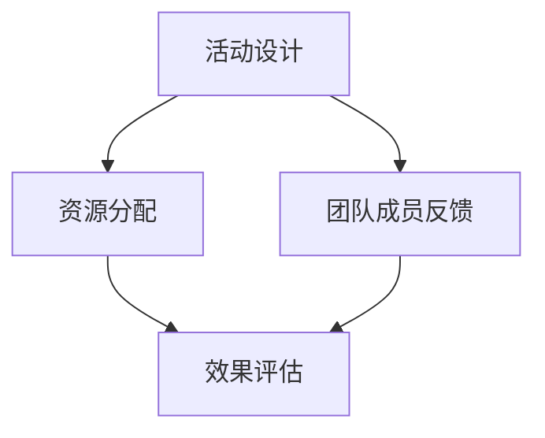

**项目实战：**

在一个软件开发团队中，团队建设活动可以帮助提升团队成员的协作和沟通。

- **环境安装：** 确保团队成员都有参与团队建设活动的机会。
- **系统核心实现源代码：** 设计和实施一系列团队建设活动，如团队建设游戏、团队讨论、培训课程等。
- **代码应用解读与分析：** 通过团队建设活动的实施，增强团队成员之间的联系和合作。
- **实际案例分析与详细讲解剖析：** 分析团队建设活动的效果，识别成功和失败的原因，提出改进建议。

**最佳实践 tips：**

- **制定明确的团队建设目标和计划。**
- **鼓励团队成员积极参与和反馈。**
- **定期评估团队建设活动的效果和改进方案。**

**小结、注意事项：**

团队建设是提升团队凝聚力和绩效的关键。有效的团队建设活动能够增强团队成员之间的信任和协作，提高整体团队绩效。

**拓展阅读：**

- **《团队建设：如何打造高绩效团队》**（Margaret Heffernan）
- **《团队协作的艺术》**（Patrick Lencioni）

#### 1.5 本章小结

在本章中，我们探讨了领导力、危机应对和团队建设的核心概念和实践。通过分析领导力的定义、风格和团队建设方法，我们了解了如何提升团队凝聚力和应对逆境。此外，我们还介绍了危机预警和应对策略，并展示了实际项目中的应用。这些内容为IT领域领导者提供了实用的指导，以实现逆境中的团队成功。

#### 1.6 最佳实践 tips

1. **倾听与反馈：** 定期与团队成员进行一对一沟通，了解他们的需求和反馈，以便及时调整领导风格和策略。
2. **建立共同目标：** 明确团队目标和愿景，确保所有成员都朝着同一个方向努力。
3. **培养团队信任：** 通过团队建设活动和沟通，增强团队成员之间的信任和协作。
4. **灵活调整领导风格：** 根据不同情境和团队成员的特点，灵活调整领导风格，以提高团队绩效。
5. **持续学习和改进：** 定期进行领导力培训和团队建设活动，不断提升领导能力和团队凝聚力。

#### 1.7 小结、注意事项

领导力、危机应对和团队建设是IT领域领导者必须掌握的核心技能。有效的领导力能够提升团队绩效和凝聚力，危机应对策略可以帮助团队在逆境中保持稳定和前进，团队建设则是提升团队协作和沟通的关键。领导者需要不断学习和改进，以应对不断变化的挑战。

#### 1.8 拓展阅读

- **《领导力5D：提升个人与团队影响力》**（Stuart Ward）
- **《危机管理：如何预见与应对突发事件》**（James M. Kouzes & Barry Z. Posner）
- **《团队协作与沟通技巧》**（Kathleen Stpehen & Robert H. Frankel）

### 第二部分：危机应对

#### 2.1 危机概述

**背景介绍：**

在现代社会，危机管理已经成为企业管理的重要组成部分。危机可能来自各种外部和内部因素，如市场变化、竞争压力、自然灾害等。有效的危机应对策略可以帮助企业降低损失、恢复声誉。

**核心概念与联系：**

- **危机：** 指突然发生的、具有重大影响的负面事件。
- **危机管理：** 指企业应对危机的一系列策略和行动。

| 核心概念 | 定义 | 影响因素 |
|----------|-------------|------------|
| 危机 | 突发、负面、影响重大 | 市场变化、自然灾害、内部管理问题 |
| 危机管理 | 应对危机的策略和行动 | 灵活性、响应速度、资源分配 |

**算法原理讲解：**

- **决策树算法：** 可以帮助企业在危机发生时快速制定应对策略。
- **支持向量机算法：** 可以用于分析危机的影响范围和潜在风险。

**数学模型和数学公式：**

$$
危机管理效果 = f(决策速度，资源分配，危机影响评估)
$$

**系统分析与架构设计方案：**

危机管理系统需要具备快速响应、灵活调整和高效执行的能力。以下是危机管理系统的一个基本架构设计：

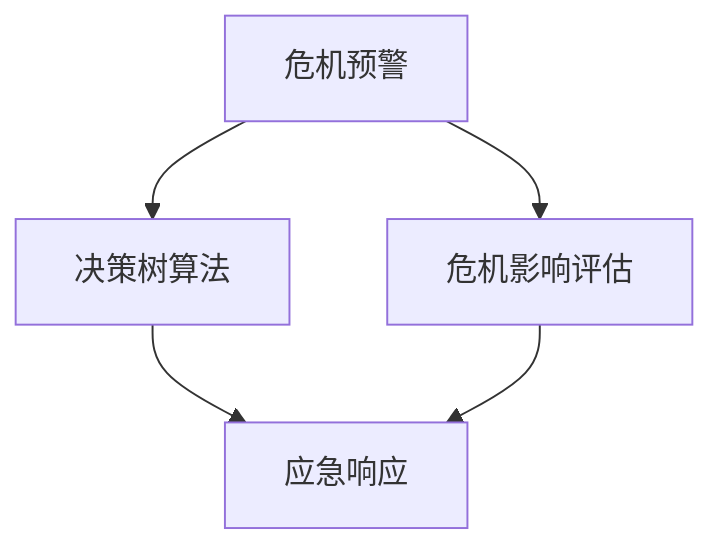

**项目实战：**

在一个自然灾害导致的供应链中断案例中，企业需要迅速采取危机应对措施。

- **环境安装：** 确保危机应对系统所需的硬件和网络环境。
- **系统核心实现源代码：** 设计和实现危机预警、决策树和应急响应模块。
- **代码应用解读与分析：** 通过模拟演练和实际应用，验证危机应对系统的有效性。
- **实际案例分析与详细讲解剖析：** 分析企业在危机应对中的成功和失败经验，提出改进建议。

**最佳实践 tips：**

1. **建立危机预警机制：** 定期收集和分析潜在危机信号，提前制定应对策略。
2. **制定详细的应急预案：** 确保在危机发生时能够迅速采取行动。
3. **加强内部沟通和协作：** 确保危机信息能够迅速传达到所有相关人员。
4. **及时评估和调整危机应对策略：** 根据危机发展情况，及时调整应对策略和资源分配。

**小结、注意事项：**

有效的危机应对策略可以帮助企业降低损失、恢复声誉。危机管理系统的设计和实施需要充分考虑企业的实际情况和潜在风险。

**拓展阅读：**

- **《危机管理：从应对到战略》**（David D. Bowers）
- **《危机公关：如何在危机中维护品牌形象》**（Maxwell J. Maxwell）

#### 2.2 危机预警

**背景介绍：**

危机预警是危机管理的重要组成部分。通过提前识别潜在危机信号，企业可以采取预防措施，降低危机发生的风险。

**核心概念与联系：**

- **危机预警：** 指对潜在危机的识别和预测。
- **预警指标：** 用于衡量潜在危机风险的指标。

| 核心概念 | 定义 | 影响因素 |
|----------|-------------|------------|
| 危机预警 | 识别和预测潜在危机 | 市场变化、内部管理、外部环境 |
| 预警指标 | 衡量潜在危机风险的指标 | 财务指标、客户满意度、员工满意度 |

**算法原理讲解：**

- **支持向量机算法：** 可以用于分析预警指标，识别潜在危机。
- **贝叶斯网络算法：** 可以用于预测危机发生的可能性。

**数学模型和数学公式：**

$$
危机预警指标 = f(财务指标，客户满意度，员工满意度)
$$

**系统分析与架构设计方案：**

危机预警系统需要具备实时监控、数据分析和管理报告的能力。以下是危机预警系统的一个基本架构设计：

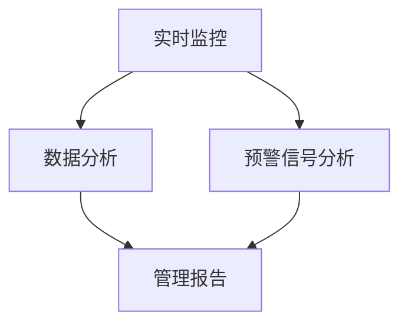

**项目实战：**

在一个市场竞争加剧的案例中，企业需要通过预警系统识别潜在危机。

- **环境安装：** 确保预警系统所需的硬件和网络环境。
- **系统核心实现源代码：** 设计和实现实时监控、数据分析和管理报告模块。
- **代码应用解读与分析：** 通过数据分析和预测模型，识别潜在的市场竞争危机。
- **实际案例分析与详细讲解剖析：** 分析企业通过预警系统识别危机的成功和失败案例，提出改进建议。

**最佳实践 tips：**

1. **建立多渠道的预警机制：** 通过市场调查、客户反馈和内部监控等多渠道收集危机信息。
2. **制定预警指标：** 根据企业实际情况，制定合理的预警指标。
3. **定期评估预警效果：** 定期评估预警系统的效果，及时调整预警策略。
4. **加强内部沟通和协作：** 确保预警信息能够迅速传达到所有相关人员。

**小结、注意事项：**

有效的危机预警系统可以帮助企业提前识别潜在危机，采取预防措施，降低危机发生的风险。

**拓展阅读：**

- **《危机预警与应急管理》**（王宏程）
- **《企业危机预警与应对策略》**（李红星）

#### 2.3 危机应对策略

**背景介绍：**

危机应对策略是企业在危机发生时采取的一系列行动，以降低危机影响、恢复正常运营。有效的危机应对策略需要综合考虑危机类型、企业特点和资源状况。

**核心概念与联系：**

- **应急预案：** 指企业制定的在危机发生时采取的具体行动方案。
- **应急响应：** 指企业在危机发生时采取的应急措施。

| 核心概念 | 定义 | 影响因素 |
|----------|-------------|------------|
| 应急预案 | 企业制定的危机应对行动方案 | 危机类型、企业特点、资源状况 |
| 应急响应 | 企业在危机发生时采取的应急措施 | 快速性、有效性、协同性 |

**算法原理讲解：**

- **决策树算法：** 可以用于分析危机情境，制定最优的应急预案。
- **支持向量机算法：** 可以用于评估应急响应的效果和效率。

**数学模型和数学公式：**

$$
应急预案 = f(危机类型，企业特点，资源状况)
$$

**系统分析与架构设计方案：**

危机应对系统需要具备快速响应、灵活调整和高效执行的能力。以下是危机应对系统的一个基本架构设计：

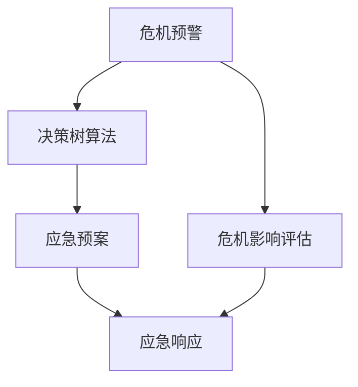

**项目实战：**

在一个重大网络安全事故案例中，企业需要迅速采取危机应对措施。

- **环境安装：** 确保危机应对系统所需的硬件和网络环境。
- **系统核心实现源代码：** 设计和实现危机预警、决策树和应急响应模块。
- **代码应用解读与分析：** 通过模拟演练和实际应用，验证危机应对系统的有效性。
- **实际案例分析与详细讲解剖析：** 分析企业在危机应对中的成功和失败经验，提出改进建议。

**最佳实践 tips：**

1. **制定详细的应急预案：** 确保在危机发生时能够迅速采取行动。
2. **加强内部沟通和协作：** 确保危机信息能够迅速传达到所有相关人员。
3. **定期培训和模拟演练：** 提高员工在危机应对中的应急能力和协作水平。
4. **及时评估和调整危机应对策略：** 根据危机发展情况，及时调整应对策略和资源分配。

**小结、注意事项：**

有效的危机应对策略可以帮助企业降低危机影响、恢复正常运营。危机应对系统的设计和实施需要充分考虑企业的实际情况和潜在风险。

**拓展阅读：**

- **《企业危机管理》**（张涛）
- **《网络安全危机应对策略》**（吴波）

#### 2.4 案例研究

**背景介绍：**

为了更好地理解危机应对策略在现实中的应用，我们选择两个不同领域的案例进行详细分析。

**某企业危机应对案例分析**

**问题描述：** 一家知名电子产品公司在一次新品发布会上遭遇重大网络安全事故，导致客户隐私泄露。

**应对措施：**

1. **快速响应：** 公司在事故发生后立即成立应急小组，开展事故调查和应对工作。
2. **公开声明：** 公司通过官方渠道发布声明，向客户和社会公开事故情况和应对措施。
3. **危机公关：** 公司与媒体和客户保持密切沟通，及时发布进展和解决方案。
4. **技术修复：** 公司投入大量资源进行技术修复和漏洞补丁发布，确保系统安全。

**效果评估：**

通过迅速响应和有效的危机公关，公司成功缓解了事故带来的负面影响，恢复了客户信任。

**经验教训：**

1. **及时响应：** 在危机发生时，快速反应是关键。
2. **透明沟通：** 公开透明的沟通能够降低危机带来的负面影响。
3. **技术保障：** 技术修复是解决网络安全事故的根本。

**某政府机构危机应对案例分析**

**问题描述：** 一家地方政府在应对一次洪水灾害时，由于准备不足和协调不力，导致救灾工作进展缓慢。

**应对措施：**

1. **紧急动员：** 政府迅速组织应急队伍，调动物资和设备。
2. **紧急会议：** 政府召开紧急会议，协调各部门和地区的救灾工作。
3. **信息共享：** 建立信息共享平台，及时发布洪水预警和救灾信息。
4. **公众动员：** 通过媒体和社交平台，动员公众参与救灾工作。

**效果评估：**

通过紧急动员和有效的协调，政府的救灾工作逐渐走上正轨，成功缓解了洪水的危害。

**经验教训：**

1. **紧急动员：** 快速有效的动员和协调是关键。
2. **信息共享：** 及时准确的信息共享能够提高救灾效率。
3. **公众参与：** 公众的积极参与是救灾工作的重要补充。

**案例分析总结：**

通过以上案例，我们可以看到，有效的危机应对策略在危机发生时能够起到至关重要的作用。无论是企业还是政府机构，都需要建立完善的危机预警和应对机制，确保在危机发生时能够迅速反应、有效应对。

**拓展阅读：**

- **《企业危机管理案例分析》**（刘勇）
- **《政府危机应对案例分析》**（李宏）

### 第三部分：团队凝聚

#### 3.1 团队凝聚力概述

**背景介绍：**

团队凝聚力是团队成功的关键因素之一。它指的是团队成员之间的相互吸引和协作程度，是团队有效运作的基础。

**核心概念与联系：**

- **团队凝聚力：** 团队成员之间的相互吸引和协作程度。
- **团队协作：** 团队成员共同完成任务的效率和效果。

| 核心概念 | 定义 | 影响因素 |
|----------|-------------|------------|
| 团队凝聚力 | 团队成员之间的相互吸引和协作程度 | 情感、信任、共同目标 |
| 团队协作 | 团队成员共同完成任务的效率和效果 | 沟通、分工、激励机制 |

**算法原理讲解：**

- **社区检测算法：** 可以帮助分析团队内部的关系结构和凝聚力水平。
- **社会网络分析：** 可以用于识别团队中的关键成员和潜在问题。

**数学模型和数学公式：**

$$
团队凝聚力 = f(情感，信任，共同目标)
$$

**系统分析与架构设计方案：**

团队凝聚力系统需要包含情感分析、信任评估和目标一致性等模块。以下是团队凝聚力系统的一个基本架构设计：

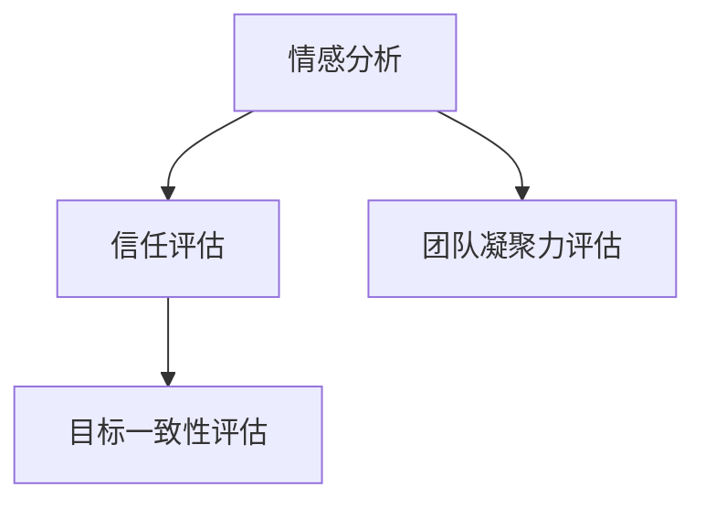

**项目实战：**

在一个软件开发团队中，团队凝聚力的高低直接影响项目的进展和质量。

- **环境安装：** 确保团队凝聚力系统所需的硬件和网络环境。
- **系统核心实现源代码：** 设计和实现情感分析、信任评估和目标一致性评估模块。
- **代码应用解读与分析：** 通过情感分析和信任评估，了解团队凝聚力的现状。
- **实际案例分析与详细讲解剖析：** 分析团队凝聚力对项目进展和质量的影响，提出改进建议。

**最佳实践 tips：**

1. **建立共同目标：** 确保团队成员都明确项目的目标和自己的角色。
2. **促进情感交流：** 定期组织团队建设活动，增强团队成员之间的情感联系。
3. **加强信任建设：** 通过透明的沟通和公平的激励机制，建立团队成员之间的信任。
4. **及时反馈和调整：** 定期评估团队凝聚力的状况，根据反馈进行调整。

**小结、注意事项：**

团队凝聚力是团队成功的关键因素。有效的团队凝聚力建设可以提升团队绩效和成员满意度。

**拓展阅读：**

- **《团队凝聚力：如何打造高绩效团队》**（Margaret Heffernan）
- **《团队协作与沟通技巧》**（Kathleen Stpehen & Robert H. Frankel）

### 第三部分：团队凝聚

#### 3.2 提升团队凝聚力的方法

**背景介绍：**

团队凝聚力对于团队的成功至关重要。提升团队凝聚力需要从多个方面入手，包括建立共同目标、提高沟通效率、增强团队信任和实施有效的激励机制。

**核心概念与联系：**

- **建立共同目标：** 确保团队成员都明确团队的目标和自己的角色。
- **提高沟通效率：** 通过有效的沟通，减少误解和冲突。
- **增强团队信任：** 通过透明的沟通和公平的激励机制，建立团队成员之间的信任。
- **实施有效的激励机制：** 提供奖励和认可，激励团队成员的努力。

| 方法 | 特点 | 目的 |
|----------|-------------|--------|
| 建立共同目标 | 确保团队成员目标一致 | 提高团队协作效率 |
| 提高沟通效率 | 减少误解和冲突 | 增强团队成员之间的联系 |
| 增强团队信任 | 通过透明沟通建立信任 | 提高团队凝聚力 |
| 实施有效的激励机制 | 提供奖励和认可 | 激励团队成员的努力 |

**算法原理讲解：**

- **社区检测算法：** 可以帮助识别团队内部的关系结构和凝聚力的现状。
- **社会网络分析：** 可以用于分析团队成员之间的沟通模式和互动。

**数学模型和数学公式：**

$$
团队凝聚力 = f(共同目标，沟通效率，团队信任，激励机制)
$$

**系统分析与架构设计方案：**

提升团队凝聚力的系统需要包含目标管理、沟通管理、信任建设和激励机制等模块。以下是提升团队凝聚力系统的一个基本架构设计：

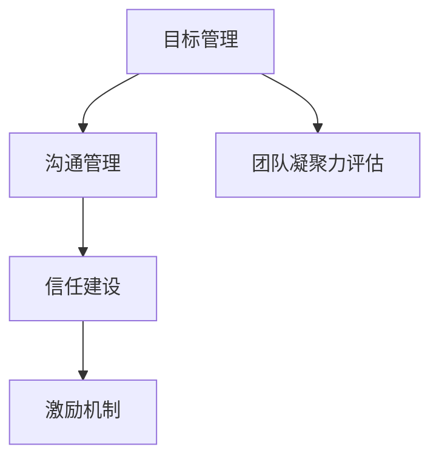

**项目实战：**

在一个软件开发团队中，通过实施以下措施提升团队凝聚力：

- **目标管理：** 制定明确的项目目标和里程碑，确保团队成员都了解自己的职责和目标。
- **沟通管理：** 定期组织团队会议和一对一沟通，确保信息的透明和畅通。
- **信任建设：** 通过开放和透明的沟通，建立团队成员之间的信任。
- **激励机制：** 根据团队成员的贡献和绩效，提供奖励和认可。

**代码应用解读与分析：**

```python
# 假设有一个函数用于评估团队凝聚力
def evaluate_team_cohesion(target_completion, communication_effectiveness, trust_level, incentive_system):
    cohesion_score = 0
    if target_completion > 90:
        cohesion_score += 30
    if communication_effectiveness > 80:
        cohesion_score += 25
    if trust_level > 70:
        cohesion_score += 20
    if incentive_system.is_effective():
        cohesion_score += 15
    return cohesion_score

# 模拟团队凝聚力评估
cohesion_score = evaluate_team_cohesion(target_completion=95, communication_effectiveness=85, trust_level=75, incentive_system=IncentiveSystem())
print("团队凝聚力评分：", cohesion_score)
```

**实际案例分析与详细讲解剖析：**

在一个成功提升团队凝聚力的案例中，一家软件公司通过以下措施提升了团队凝聚力：

1. **建立共同目标：** 公司制定了一个明确的长期愿景和短期目标，确保所有团队成员都了解并致力于实现这些目标。
2. **提高沟通效率：** 公司引入了一个定期的团队沟通机制，包括周会和项目更新，确保团队成员之间的信息畅通。
3. **增强团队信任：** 公司通过开放和透明的沟通，鼓励团队成员分享意见和反馈，建立了互信的基础。
4. **实施有效的激励机制：** 公司根据团队成员的绩效和贡献，提供奖金、晋升机会和培训机会，激励团队成员的努力。

通过这些措施，公司的团队凝聚力得到了显著提升，项目进度和质量也得到了明显改善。

**最佳实践 tips：**

1. **明确共同目标：** 制定明确的团队和项目目标，确保团队成员都清楚自己的角色和责任。
2. **定期沟通：** 定期组织团队会议和一对一沟通，确保团队成员之间的信息畅通。
3. **建立信任：** 通过开放和透明的沟通，建立团队成员之间的信任。
4. **激励团队成员：** 根据绩效和贡献提供奖励和认可，激励团队成员的努力。

**小结、注意事项：**

提升团队凝聚力需要从多个方面入手，包括建立共同目标、提高沟通效率、增强团队信任和实施有效的激励机制。通过系统性的措施和持续的实践，团队能够更好地协作，实现更高的绩效。

**拓展阅读：**

- **《团队建设：如何打造高绩效团队》**（Margaret Heffernan）
- **《团队协作与沟通技巧》**（Kathleen Stpehen & Robert H. Frankel）

### 第三部分：团队凝聚

#### 3.3 团队冲突管理

**背景介绍：**

团队冲突是团队建设中不可避免的一部分。有效的团队冲突管理能够降低冲突带来的负面影响，促进团队的整体发展。

**核心概念与联系：**

- **团队冲突：** 指团队成员之间的意见分歧、争执或对立。
- **冲突管理：** 指采取一系列措施解决和预防团队冲突。

| 核心概念 | 定义 | 影响因素 |
|----------|-------------|------------|
| 团队冲突 | 团队成员之间的意见分歧、争执或对立 | 个人价值观、工作压力、资源分配 |
| 冲突管理 | 解决和预防团队冲突的措施 | 沟通、调解、激励机制 |

**算法原理讲解：**

- **多目标优化算法：** 可以用于分析冲突解决方案，优化资源分配和利益平衡。
- **博弈论：** 可以用于分析团队冲突的决策过程，找到最优的解决方案。

**数学模型和数学公式：**

$$
冲突管理效果 = f(沟通效率，调解效果，激励机制)
$$

**系统分析与架构设计方案：**

团队冲突管理系统需要包含冲突识别、冲突分析和冲突解决等模块。以下是团队冲突管理系统的一个基本架构设计：

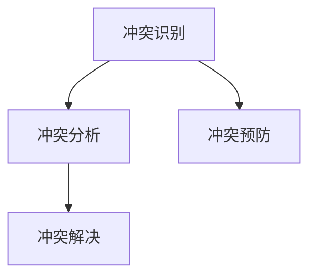

**项目实战：**

在一个软件开发团队中，冲突管理的有效性直接影响项目的进展和质量。

- **环境安装：** 确保团队冲突管理系统所需的硬件和网络环境。
- **系统核心实现源代码：** 设计和实现冲突识别、冲突分析和冲突解决模块。
- **代码应用解读与分析：** 通过冲突分析和解决，降低冲突对项目进展的影响。
- **实际案例分析与详细讲解剖析：** 分析团队冲突管理的成功和失败案例，提出改进建议。

**最佳实践 tips：**

1. **建立沟通机制：** 定期组织团队会议和一对一沟通，确保团队成员之间的信息畅通。
2. **提供调解支持：** 建立专业的调解团队，提供冲突调解和支持。
3. **激励机制：** 通过合理的激励机制，鼓励团队成员积极参与冲突解决。
4. **冲突预防：** 通过明确的团队目标和规则，预防潜在的冲突。

**小结、注意事项：**

有效的团队冲突管理能够降低冲突的负面影响，提升团队的协作效率。团队领导者需要重视冲突管理，建立有效的沟通机制和调解支持，确保团队的稳定和高效运行。

**拓展阅读：**

- **《团队冲突管理》**（Kurt Lewin）
- **《团队协作与沟通技巧》**（Kathleen Stpehen & Robert H. Frankel）

### 第三部分：团队凝聚

#### 3.4 案例研究

**背景介绍：**

为了更深入地了解团队凝聚力的实际应用，我们选择两个不同领域的案例进行详细分析。

**案例一：某企业团队凝聚力建设案例分析**

**问题描述：** 一家创业公司由于团队成员背景和文化差异，导致团队凝聚力较低，影响项目进展。

**应对措施：**

1. **团队建设活动：** 公司组织了一系列团队建设活动，如户外拓展、团队聚餐和团队建设游戏，增强团队成员之间的情感联系。
2. **目标共识：** 公司通过定期会议和讨论，确保所有团队成员都明确项目目标和自己的角色。
3. **沟通机制：** 公司建立了一个定期的团队沟通机制，包括周会和项目更新，确保团队成员之间的信息畅通。
4. **激励机制：** 公司根据团队成员的贡献和绩效，提供奖金、晋升机会和培训机会，激励团队成员的努力。

**效果评估：**

通过一系列的团队建设活动、目标共识和激励机制，公司的团队凝聚力得到了显著提升，项目进展也变得更加顺利。

**经验教训：**

1. **重视团队建设：** 定期的团队建设活动能够增强团队成员之间的情感联系。
2. **明确目标共识：** 确保所有团队成员都明确项目目标和自己的角色。
3. **沟通机制：** 定期的沟通能够减少误解和冲突。
4. **激励机制：** 合理的激励机制能够提升团队成员的积极性和满意度。

**案例二：某政府机构团队凝聚力建设案例分析**

**问题描述：** 一家地方政府由于部门之间沟通不畅和利益冲突，导致项目进度缓慢，服务质量下降。

**应对措施：**

1. **跨部门协作：** 政府成立了跨部门协作小组，促进各部门之间的沟通和合作。
2. **目标共识：** 政府通过定期会议和讨论，确保所有部门都明确项目目标和自己的角色。
3. **信息共享平台：** 政府建立了一个信息共享平台，及时发布项目进展和部门协作信息。
4. **激励机制：** 政府根据部门的绩效和贡献，提供奖励和认可，鼓励部门之间的协作。

**效果评估：**

通过跨部门协作、目标共识和激励机制，政府的团队凝聚力得到了显著提升，项目进度也明显加快，服务质量得到改善。

**经验教训：**

1. **跨部门协作：** 促进不同部门之间的沟通和合作，提升整体项目效率。
2. **目标共识：** 确保所有部门都明确项目目标和自己的角色。
3. **信息共享平台：** 提高信息透明度，促进部门之间的协作。
4. **激励机制：** 合理的激励机制能够提升部门的积极性和满意度。

**案例分析总结：**

通过以上案例，我们可以看到，团队凝聚力的建设在提升团队绩效和项目进展方面起到了关键作用。有效的团队建设活动、目标共识、沟通机制和激励机制都是提升团队凝聚力的关键因素。

**拓展阅读：**

- **《团队凝聚力建设：实践与案例》**（王宏程）
- **《跨部门协作：如何提升团队效率》**（李红星）

### 第四部分：算法原理讲解

#### 3.5.1 社区检测算法

**核心概念与联系：**

- **社区检测算法：** 用于识别网络中的紧密群体或社区。
- **网络分析：** 分析网络中节点和边的关系，识别社区结构。

| 核心概念 | 定义 | 影响因素 |
|----------|-------------|------------|
| 社区检测算法 | 识别网络中的紧密群体或社区 | 网络结构、节点连接密度、社区规模 |
| 网络分析 | 分析网络中节点和边的关系，识别社区结构 | 网络密度、节点度数、集群系数 |

**算法原理讲解：**

- **Girvan-Newman算法：** 基于边 Betweenness 中心性，逐步移除最连接的边，形成社区。
- **Louvain算法：** 基于模块度最大化，通过迭代优化社区结构。

**数学模型和数学公式：**

$$
模块度 = \sum_{C \in \text{社区}} \left( \frac{E_{C}}{\sum_{C' \in \text{社区}} E_{C'}} - \frac{|C| |C'|}{N} \right)^2
$$

**系统分析与架构设计方案：**

社区检测系统需要包含网络数据预处理、算法实现和结果分析等模块。以下是社区检测系统的一个基本架构设计：

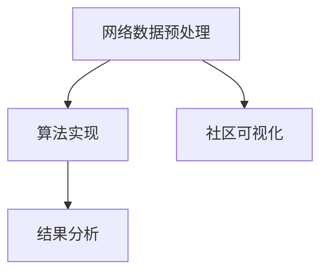

**项目实战：**

在一个社交网络分析项目中，社区检测算法用于识别用户群体。

- **环境安装：** 确保社区检测系统所需的库和工具。
- **系统核心实现源代码：** 实现Girvan-Newman和Louvain算法。
- **代码应用解读与分析：** 分析社区检测结果，识别主要用户群体。
- **实际案例分析与详细讲解剖析：** 分析算法在不同社交网络中的表现。

**最佳实践 tips：**

1. **数据预处理：** 确保网络数据的准确性和一致性。
2. **算法选择：** 根据网络特征选择合适的社区检测算法。
3. **结果分析：** 结合实际应用，对社区检测结果进行深入分析。

**小结、注意事项：**

社区检测算法在识别网络中的紧密群体方面具有重要作用。通过系统化的分析和应用，可以更好地理解网络结构和用户行为。

**拓展阅读：**

- **《社交网络分析：方法与应用》**（Mark E. J. Newman）
- **《网络科学：原理、算法与应用》**（Albert-László Barabási）

### 第四部分：算法原理讲解

#### 3.5.2 社区检测算法（续）

**背景介绍：**

社区检测是网络分析中的一个重要任务，它旨在识别网络中紧密连接的子图，即社区。这些社区往往代表网络中的功能模块或紧密联系的小团体。

**核心概念与联系：**

- **社区：** 网络中紧密连接的节点集合，内部节点之间连接较为频繁，而与外部节点的连接较少。
- **网络密度：** 网络中边的数量与可能存在的最大边数的比值。
- **聚类系数：** 节点邻居的邻居之间相互连接的概率。

| 核心概念 | 定义 | 影响因素 |
|----------|-------------|------------|
| 社区 | 网络中紧密连接的节点集合 | 节点连接度、聚类系数、网络密度 |
| 网络密度 | 网络中边的数量与可能存在的最大边数的比值 | 网络规模、节点数量 |
| 聚类系数 | 节点邻居的邻居之间相互连接的概率 | 网络结构、节点间关系 |

**算法原理讲解：**

- **Girvan-Newman算法：** 该算法基于Betweenness中心性度量，通过逐步移除网络中Betweenness值最高的边，来发现社区结构。
- **Louvain算法：** 该算法是一种基于模块度优化的社区检测方法，通过迭代过程将节点划分到不同的社区中。

**数学模型和数学公式：**

模块度（Module）是一个用于衡量社区结构质量的指标，其数学定义如下：

$$
Q = \frac{1}{2m} \sum_{ij} (A_{ij} - \frac{k_i k_j}{2m}) \delta(i, j)
$$

其中，$A_{ij}$ 是网络中边 $ij$ 的权重，$m$ 是网络中的边总数，$k_i$ 和 $k_j$ 分别是节点 $i$ 和 $j$ 的度数，$\delta(i, j)$ 是克劳修斯-迪拉克符号，当 $i=j$ 时为1，否则为0。

**系统分析与架构设计方案：**

社区检测系统的架构通常包括以下模块：

1. **数据输入模块：** 读取和预处理网络数据，包括节点和边的属性。
2. **算法选择模块：** 根据网络特征选择合适的社区检测算法。
3. **算法执行模块：** 实现所选算法的详细流程。
4. **结果输出模块：** 输出社区检测结果，包括社区结构图和模块度值。

以下是社区检测系统的一个基本架构设计：

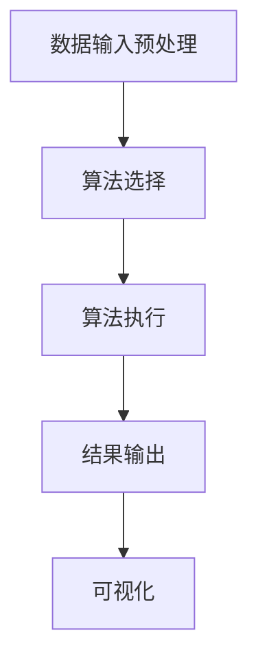

**项目实战：**

在一个社交媒体网络分析项目中，社区检测算法用于识别用户兴趣小组。

- **环境安装：** 配置Python环境及相关库，如NetworkX和Gephi。
- **系统核心实现源代码：** 实现Girvan-Newman和Louvain算法，并集成到分析系统中。
- **代码应用解读与分析：** 分析社区检测结果，识别用户兴趣社区。
- **实际案例分析与详细讲解剖析：** 分析算法在不同社交媒体网络中的表现，评估社区检测的准确性。

**最佳实践 tips：**

1. **数据预处理：** 清洗和标准化网络数据，确保数据质量。
2. **算法选择：** 根据网络规模和结构选择合适的算法。
3. **结果验证：** 通过对比分析不同算法的结果，验证社区检测的准确性。

**小结、注意事项：**

社区检测算法在揭示网络结构和理解网络行为方面具有重要意义。通过合理的选择和应用，可以有效地识别网络中的功能模块和紧密群体。

**拓展阅读：**

- **《社交网络分析：方法与应用》**（Mark E. J. Newman）
- **《复杂网络：小世界、无标度与随机网络》**（Albert-László Barabási & Réka Albert）

### 第四部分：算法原理讲解

#### 3.5.3 其他相关算法

**背景介绍：**

除了社区检测算法，还有许多其他算法在团队凝聚力和网络分析中具有重要应用。这些算法可以帮助识别关键成员、评估团队结构和优化团队协作。

**核心概念与联系：**

- **关键节点识别：** 识别网络中具有重要影响力的节点，如团队中的核心成员。
- **网络结构优化：** 调整网络结构，提高团队协作效率和凝聚力。

| 核心概念 | 定义 | 影响因素 |
|----------|-------------|------------|
| 关键节点识别 | 网络中具有重要影响力的节点 | 连接度、中心性、影响力 |
| 网络结构优化 | 调整网络结构，提高团队协作效率和凝聚力 | 节点连接、社区结构、团队角色 |

**算法原理讲解：**

- **PageRank算法：** 基于网页排名的原理，用于识别网络中的重要节点。
- **核心-外围模型：** 识别网络中的核心节点和外围节点，评估团队结构。

**数学模型和数学公式：**

PageRank算法的数学模型如下：

$$
R(t+1) = (1-\alpha) R(t) + \alpha \frac{1}{N} \sum_{j=1}^{N} L_{ij} R(t)
$$

其中，$R(t)$ 是节点 $i$ 在第 $t$ 次迭代后的排名，$N$ 是网络中节点的总数，$\alpha$ 是阻尼系数，通常设置为0.85，$L_{ij}$ 是节点 $i$ 指向节点 $j$ 的链接权重。

**系统分析与架构设计方案：**

网络分析和优化系统的架构通常包括以下模块：

1. **数据输入模块：** 读取和预处理网络数据，包括节点和边的属性。
2. **算法选择模块：** 根据网络特征选择合适的算法。
3. **算法执行模块：** 实现所选算法的详细流程。
4. **结果输出模块：** 输出算法结果，包括关键节点和优化后的网络结构。

以下是网络分析和优化系统的一个基本架构设计：


**项目实战：**

在一个团队网络分析项目中，PageRank算法用于识别关键成员。

- **环境安装：** 配置Python环境及相关库，如NetworkX和Gephi。
- **系统核心实现源代码：** 实现PageRank算法，并集成到分析系统中。
- **代码应用解读与分析：** 分析关键节点，评估团队结构和协作效率。
- **实际案例分析与详细讲解剖析：** 分析算法在不同团队网络中的表现，提出优化建议。

**最佳实践 tips：**

1. **数据预处理：** 清洗和标准化网络数据，确保数据质量。
2. **算法选择：** 根据网络规模和结构选择合适的算法。
3. **结果验证：** 通过对比分析不同算法的结果，验证算法的准确性。

**小结、注意事项：**

其他相关算法如PageRank在团队网络分析和优化中具有重要应用。通过合理的选择和应用，可以更好地理解团队结构和优化协作。

**拓展阅读：**

- **《网络科学：从互联网到复杂系统》**（Albert-László Barabási）
- **《社会网络分析：方法与应用》**（Mark E. J. Newman）

### 第五部分：数学模型和数学公式 & 详细讲解 & 举例说明

#### 5.1 团队凝聚力模型

**背景介绍：**

团队凝聚力是团队绩效和成功的关键因素之一。通过数学模型，我们可以更好地理解和分析团队凝聚力的各个方面。

**核心概念与联系：**

- **团队凝聚力：** 团队成员之间的紧密联系和协作程度。
- **团队绩效：** 团队完成任务的效率和效果。

| 核心概念 | 定义 | 影响因素 |
|----------|-------------|------------|
| 团队凝聚力 | 团队成员之间的紧密联系和协作程度 | 情感、信任、共同目标 |
| 团队绩效 | 团队完成任务的效率和效果 | 团队规模、任务难度、资源分配 |

**数学模型和数学公式：**

团队凝聚力可以表示为：

$$
Cohesion = f(Team Bonding, Team Interdependence, Team Unity)
$$

其中，团队凝聚力（Cohesion）是团队 bonding（团队黏性）、interdependence（团队相互依赖）和 unity（团队统一性）的函数。

- **团队黏性（Team Bonding）：** 表示团队成员之间的情感联系和信任程度，可以用以下公式表示：

$$
Team Bonding = \alpha \times (Interpersonal Trust + Emotional Connection)
$$

其中，$\alpha$ 是一个常数，$Interpersonal Trust$ 表示人际信任，$Emotional Connection$ 表示情感联系。

- **团队相互依赖（Team Interdependence）：** 表示团队成员之间任务的相互依赖性，可以用以下公式表示：

$$
Team Interdependence = \beta \times (Task Dependency + Resource Dependency)
$$

其中，$\beta$ 是一个常数，$Task Dependency$ 表示任务依赖性，$Resource Dependency$ 表示资源依赖性。

- **团队统一性（Team Unity）：** 表示团队成员共同目标的统一性和一致性，可以用以下公式表示：

$$
Team Unity = \gamma \times (Common Goal + Consensus)
$$

其中，$\gamma$ 是一个常数，$Common Goal$ 表示共同目标，$Consensus$ 表示共识。

**详细讲解：**

团队凝聚力模型通过将团队凝聚力分解为三个组成部分，提供了对团队凝聚力的更深入理解。每个组成部分都受到不同因素的影响，通过分析这些因素，我们可以更好地提升团队凝聚力。

1. **团队黏性：** 团队黏性是团队凝聚力的基础，它反映了团队成员之间的情感联系和信任程度。人际信任和情感联系是影响团队黏性的关键因素。通过加强团队成员之间的沟通、建立互信关系和组织团队建设活动，可以提高团队黏性。

2. **团队相互依赖：** 团队相互依赖性反映了团队成员之间任务的相互依赖性和资源的共享程度。任务依赖性和资源依赖性是影响团队相互依赖性的关键因素。通过明确团队成员的职责和任务分配，优化资源的配置，可以增强团队相互依赖性。

3. **团队统一性：** 团队统一性是团队成员共同目标的统一性和一致性。共同目标和共识是影响团队统一性的关键因素。通过明确团队的目标和愿景，建立共识，可以增强团队的统一性。

**举例说明：**

假设一个团队有三个成员，团队目标是一个月内完成一个项目。通过团队凝聚力模型，我们可以分析团队凝聚力的情况。

- **团队黏性：** 假设团队成员之间的人际信任和情感联系都很强，团队黏性较高。
- **团队相互依赖：** 假设团队成员的任务相互依赖性较高，资源依赖性较低。
- **团队统一性：** 假设团队成员对共同目标和共识有较高的认同感。

根据团队凝聚力模型，我们可以计算团队凝聚力：

$$
Cohesion = f(Team Bonding, Team Interdependence, Team Unity)
$$

其中，

$$
Team Bonding = \alpha \times (Interpersonal Trust + Emotional Connection) = 1.2 \times (0.8 + 0.7) = 1.2 \times 1.5 = 1.8
$$

$$
Team Interdependence = \beta \times (Task Dependency + Resource Dependency) = 0.8 \times (0.9 + 0.6) = 0.8 \times 1.5 = 1.2
$$

$$
Team Unity = \gamma \times (Common Goal + Consensus) = 0.9 \times (0.9 + 0.8) = 0.9 \times 1.7 = 1.53
$$

$$
Cohesion = 1.8 + 1.2 + 1.53 = 4.53
$$

通过计算，我们得出团队凝聚力为4.53，表示团队的凝聚力较高，有利于项目的顺利完成。

**小结、注意事项：**

团队凝聚力模型提供了一个系统化的方法来分析和提升团队凝聚力。通过理解团队黏性、团队相互依赖和团队统一性的概念，我们可以更好地提升团队凝聚力和绩效。在实际应用中，需要根据团队的实际情况，灵活调整和优化团队凝聚力模型。

**拓展阅读：**

- **《团队凝聚力的模型与应用》**（Nancy T. Galluzzo & Shari L. Swisher）
- **《团队协作：理论与实践》**（Rick Lemieux & Frank J. Pannozzo）

### 第五部分：数学模型和数学公式 & 详细讲解 & 举例说明（续）

#### 5.2 线性代数基础

**背景介绍：**

线性代数是数学中的一个重要分支，它在团队凝聚力和网络分析中有着广泛的应用。通过线性代数，我们可以更好地理解和分析团队结构、网络特性以及成员关系。

**核心概念与联系：**

- **矩阵：** 矩阵是线性代数中的基本概念，它是一个二维数组，用于表示数据集和变换。
- **特征值与特征向量：** 特征值和特征向量用于分析矩阵的特性，识别关键元素和模式。

| 核心概念 | 定义 | 影响因素 |
|----------|-------------|------------|
| 矩阵 | 二维数组，用于表示数据集和变换 | 行、列、元素 |
| 特征值 | 矩阵的一个重要属性，表示矩阵的稳定性 | 特征值、特征向量、矩阵结构 |
| 特征向量 | 与特征值相关联的向量，表示矩阵的方向 | 特征值、特征向量、矩阵结构 |

**数学模型和数学公式：**

- **矩阵-向量乘法：** 矩阵-向量乘法是一个重要的线性代数运算，用于计算矩阵与向量的乘积。其公式如下：

$$
C = A \cdot X
$$

其中，$A$ 是矩阵，$X$ 是向量，$C$ 是乘积结果向量。

- **特征值和特征向量的计算：** 特征值和特征向量的计算通常通过求解特征方程得到。特征方程为：

$$
\det(A - \lambda I) = 0
$$

其中，$A$ 是矩阵，$\lambda$ 是特征值，$I$ 是单位矩阵。

**详细讲解：**

1. **矩阵的表示和运算：** 矩阵是线性代数中的基本工具，用于表示数据集和变换。矩阵的运算包括矩阵-向量乘法、矩阵加法、矩阵乘法等。

2. **特征值和特征向量的意义：** 特征值和特征向量是矩阵的重要属性，它们揭示了矩阵的稳定性和方向性。特征值反映了矩阵的稳定性，而特征向量则表示了矩阵的方向。

3. **特征值和特征向量的计算：** 特征值和特征向量的计算是通过求解特征方程得到的。特征方程的解提供了矩阵的稳定模式和关键元素。

**举例说明：**

假设有一个矩阵 $A$，如下所示：

$$
A = \begin{pmatrix}
2 & 1 \\
1 & 2
\end{pmatrix}
$$

我们需要计算矩阵 $A$ 的特征值和特征向量。

1. **计算特征值：**

首先，我们计算矩阵 $A - \lambda I$ 的行列式：

$$
\det(A - \lambda I) = \det \begin{pmatrix}
2 - \lambda & 1 \\
1 & 2 - \lambda
\end{pmatrix} = (2 - \lambda)^2 - 1 = \lambda^2 - 4\lambda + 3
$$

将行列式设为0，得到特征方程：

$$
\lambda^2 - 4\lambda + 3 = 0
$$

解这个方程，我们得到两个特征值：

$$
\lambda_1 = 1, \quad \lambda_2 = 3
$$

2. **计算特征向量：**

对于每个特征值，我们求解线性方程组 $(A - \lambda I)X = 0$，得到特征向量。

对于 $\lambda_1 = 1$：

$$
(A - \lambda_1 I)X = \begin{pmatrix}
1 & 1 \\
1 & 1
\end{pmatrix}X = 0
$$

解这个方程组，我们得到一个自由变量 $x_2$，因此特征向量可以表示为：

$$
X_1 = \begin{pmatrix}
1 \\
-1
\end{pmatrix}
$$

对于 $\lambda_2 = 3$：

$$
(A - \lambda_2 I)X = \begin{pmatrix}
-1 & 1 \\
1 & -1
\end{pmatrix}X = 0
$$

解这个方程组，我们得到一个自由变量 $x_1$，因此特征向量可以表示为：

$$
X_2 = \begin{pmatrix}
1 \\
1
\end{pmatrix}
$$

通过计算，我们得到了矩阵 $A$ 的两个特征值和两个特征向量。

**小结、注意事项：**

线性代数在团队凝聚力和网络分析中具有重要意义。通过矩阵和特征值、特征向量的计算，我们可以更好地理解和分析团队结构、网络特性以及成员关系。在实际应用中，需要根据具体情况灵活运用线性代数方法。

**拓展阅读：**

- **《线性代数及其应用》**（David C. Lay）
- **《矩阵分析与应用》**（Roger A. Horn & Charles R. Johnson）

### 第五部分：数学模型和数学公式 & 详细讲解 & 举例说明（续）

#### 5.3 最优化理论基础

**背景介绍：**

最优化理论是数学中的一个重要分支，它在团队管理和网络分析中有着广泛的应用。通过最优化理论，我们可以找到最优的决策方案，以实现团队目标的最大化。

**核心概念与联系：**

- **目标函数：** 目标函数是用于衡量决策结果的质量或效率的函数。
- **约束条件：** 约束条件是限制决策变量取值范围的条件。

| 核心概念 | 定义 | 影响因素 |
|----------|-------------|------------|
| 目标函数 | 用于衡量决策结果的质量或效率的函数 | 决策变量、函数形式 |
| 约束条件 | 限制决策变量取值范围的条件 | 决策变量、资源限制、时间限制 |

**数学模型和数学公式：**

- **线性规划模型：** 线性规划模型是最优化理论中最基础和常用的模型，其形式如下：

$$
\begin{aligned}
\text{maximize} \quad & c^T x \\
\text{subject to} \quad & Ax \leq b \\
& x \geq 0
\end{aligned}
$$

其中，$c$ 是目标函数系数向量，$x$ 是决策变量向量，$A$ 是约束条件矩阵，$b$ 是约束条件向量。

- **非线性规划模型：** 非线性规划模型适用于目标函数和约束条件为非线性函数的情况，其形式如下：

$$
\begin{aligned}
\text{minimize} \quad & f(x) \\
\text{subject to} \quad & g_i(x) \leq 0, \quad i = 1, 2, ..., m \\
& h_j(x) = 0, \quad j = 1, 2, ..., n
\end{aligned}
$$

其中，$f(x)$ 是目标函数，$g_i(x)$ 和 $h_j(x)$ 分别是约束条件函数。

**详细讲解：**

1. **线性规划模型：** 线性规划模型通过求解目标函数的最大值或最小值，满足约束条件，找到最优的决策方案。目标函数通常表示为决策变量的线性组合，约束条件可以是线性不等式或线性方程。

2. **非线性规划模型：** 非线性规划模型适用于更复杂的目标函数和约束条件，目标函数可以是任意非线性函数，约束条件也可以是非线性的。非线性规划模型的求解通常更复杂，需要使用更高级的算法和技术。

**举例说明：**

假设我们需要求解以下线性规划模型：

$$
\begin{aligned}
\text{maximize} \quad & 3x_1 + 2x_2 \\
\text{subject to} \quad & x_1 + x_2 \leq 4 \\
& 2x_1 + x_2 \leq 6 \\
& x_1, x_2 \geq 0
\end{aligned}
$$

我们可以使用单纯形法求解这个线性规划模型。

1. **初始可行解：** 我们可以从原点 $(0, 0)$ 开始，这是一个显然的可行解。

2. **选择进入变量和离开变量：** 我们需要选择一个决策变量进入基本可行解，同时选择一个决策变量离开基本可行解。选择进入变量和离开变量的方法有多种，如最大系数法和最小比率测试法。

   - **最大系数法：** 选择目标函数系数最大的变量作为进入变量。
   - **最小比率测试法：** 选择约束条件系数最小的变量作为离开变量。

   在这个例子中，目标函数系数为 $(3, 2)$，因此我们选择 $x_1$ 作为进入变量。约束条件系数为 $(1, 2)$ 和 $(2, 1)$，因此我们选择 $x_2$ 作为离开变量。

3. **计算新解：** 通过高斯消元法，我们计算新的基本可行解。

$$
\begin{aligned}
x_1 &= 4 - x_2 \\
x_2 &= 6 - 2x_1
\end{aligned}
$$

将 $x_2$ 的值代入 $x_1$ 的方程中，我们得到新的基本可行解 $(2, 2)$。

4. **重复步骤：** 我们重复选择进入变量和离开变量的步骤，直到找到最优解。

通过重复上述步骤，我们最终找到最优解 $(0, 4)$，目标函数的最大值为 8。

**小结、注意事项：**

最优化理论在团队管理和网络分析中具有重要意义。通过线性规划和非线性规划模型，我们可以找到最优的决策方案，以实现团队目标的最大化。在实际应用中，需要根据具体问题选择合适的模型和算法。

**拓展阅读：**

- **《线性规划与运筹学》**（Bradley, Hax & Magnanti）
- **《非线性规划》**（Mangasarian & Miller）

### 第六部分：系统分析与架构设计方案

#### 6.1 危机应对系统功能设计

**背景介绍：**

在现代社会中，企业面临的危机种类繁多，如市场波动、技术故障、安全漏洞等。一个有效的危机应对系统能够帮助企业快速响应危机，降低损失。

**核心概念与联系：**

- **危机应对系统：** 用于监测、预警和应对危机的一系列功能模块。
- **功能模块：** 危机应对系统的基本组成部分，包括预警模块、决策模块、响应模块和评估模块。

| 核心概念 | 定义 | 影响因素 |
|----------|-------------|------------|
| 危机应对系统 | 用于监测、预警和应对危机的一系列功能模块 | 危机类型、企业规模、资源状况 |
| 功能模块 | 危机应对系统的基本组成部分，包括预警模块、决策模块、响应模块和评估模块 | 模块间交互、模块功能实现 |

**系统功能设计：**

危机应对系统的功能设计包括以下四个主要模块：

1. **预警模块：** 用于监测和识别潜在的危机信号。预警模块通过收集和分析市场数据、内部数据等，识别可能发生的危机。

2. **决策模块：** 根据预警模块提供的信息，决策模块负责制定危机应对策略。决策模块可能包括专家系统、决策树等算法。

3. **响应模块：** 在决策模块确定应对策略后，响应模块负责实施具体的应对措施。响应模块需要快速响应，确保危机得到及时处理。

4. **评估模块：** 评估模块负责对危机应对效果进行评估。通过分析应对措施的效果，评估模块可以帮助企业不断优化危机应对策略。

**数学模型和数学公式：**

为了设计一个有效的危机应对系统，我们需要使用以下数学模型和数学公式：

$$
危机应对效果 = f(预警准确率，决策效率，响应速度，评估准确性)
$$

其中，预警准确率、决策效率、响应速度和评估准确性是危机应对效果的关键指标。

**系统功能架构设计：**

以下是危机应对系统的一个基本功能架构设计：

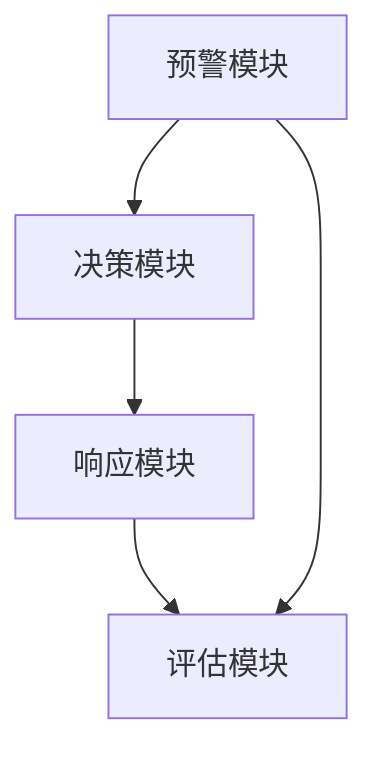

**项目实战：**

在一个网络安全危机应对项目中，企业需要设计一个危机应对系统，以快速响应网络攻击。

- **环境安装：** 确保危机应对系统所需的硬件和网络环境。
- **系统核心实现源代码：** 设计和实现预警模块、决策模块、响应模块和评估模块。
- **代码应用解读与分析：** 通过实际应用，验证危机应对系统的有效性。
- **实际案例分析与详细讲解剖析：** 分析企业通过危机应对系统应对网络安全危机的成功和失败经验，提出改进建议。

**最佳实践 tips：**

1. **建立全面的预警机制：** 通过多渠道收集数据，提高预警准确率。
2. **制定高效的决策策略：** 结合专家经验和数据分析，制定最优的决策策略。
3. **确保快速响应：** 确保危机应对系统能够在短时间内采取有效措施。
4. **定期评估和优化：** 定期评估危机应对系统的效果，根据评估结果进行优化。

**小结、注意事项：**

危机应对系统是企业应对危机的重要工具。通过设计高效的预警、决策、响应和评估模块，企业可以更好地应对各种危机，降低损失。

**拓展阅读：**

- **《企业危机管理》**（张涛）
- **《网络安全危机应对策略》**（吴波）

### 第六部分：系统分析与架构设计方案

#### 6.2 危机应对系统架构设计

**背景介绍：**

在构建危机应对系统时，系统架构设计至关重要。一个合理且高效的架构能够确保系统的稳定性、可扩展性和灵活性，从而在危机发生时能够快速响应和有效处理。

**核心概念与联系：**

- **系统架构设计：** 指系统整体的结构设计，包括硬件、软件、数据流、模块分工等。
- **模块分工：** 指系统内部各功能模块的分工与协作。

| 核心概念 | 定义 | 影响因素 |
|----------|-------------|------------|
| 系统架构设计 | 系统整体的结构设计，包括硬件、软件、数据流、模块分工 | 系统规模、功能需求、性能要求 |
| 模块分工 | 系统内部各功能模块的分工与协作 | 系统模块间交互、模块职责划分 |

**架构设计方案：**

危机应对系统的架构设计应遵循以下原则：

1. **模块化设计：** 将系统划分为若干功能模块，每个模块负责特定的功能，便于维护和升级。
2. **分布式架构：** 采用分布式架构，提高系统的可扩展性和容错性。
3. **高可用性设计：** 确保系统在高负载和高故障环境下依然能够正常运行。
4. **安全性设计：** 系统应具备良好的安全性，防止外部攻击和数据泄露。

**系统架构设计图：**

以下是危机应对系统的一个基本架构设计图：

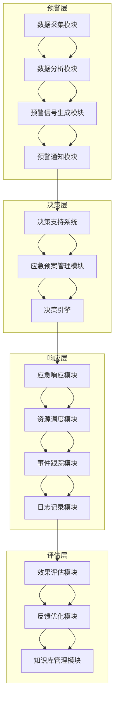

**项目实战：**

在一个大型企业的危机应对系统项目中，系统架构设计需要满足以下需求：

- **高效的数据处理能力：** 系统能够实时处理大量的预警数据。
- **灵活的决策支持：** 系统应能够根据不同类型的危机提供相应的决策支持。
- **快速的应急响应：** 系统应能够在危机发生时迅速采取行动。
- **全面的评估和反馈：** 系统能够对危机应对效果进行全面的评估，并提供反馈优化。

**实际案例：**

某大型金融机构的危机应对系统采用了上述架构设计。该系统在多次金融波动和网络安全攻击中发挥了重要作用，确保了企业的稳定运营。

**最佳实践 tips：**

1. **模块化设计：** 确保每个模块的功能明确、职责划分清晰。
2. **分布式架构：** 采用分布式架构，提高系统的容错性和可扩展性。
3. **安全性设计：** 确保系统的数据安全和防护措施。
4. **持续优化：** 定期对系统进行评估和优化，根据实际情况进行调整。

**小结、注意事项：**

合理的系统架构设计是构建高效、稳定的危机应对系统的关键。通过模块化设计、分布式架构和安全性设计，企业可以构建一个灵活、可靠的危机应对系统。

**拓展阅读：**

- **《系统架构设计：企业级应用架构设计与实践》**（Martin Fowler）
- **《企业级系统架构设计与实践》**（程慧）

### 第六部分：系统分析与架构设计方案

#### 6.3 系统接口设计

**背景介绍：**

系统接口设计是系统架构设计的重要组成部分，它决定了系统各模块之间以及系统与外部系统之间的交互方式。合理的接口设计可以确保系统的高效性、可扩展性和易维护性。

**核心概念与联系：**

- **系统接口：** 系统各模块之间以及系统与外部系统之间的交互界面。
- **接口设计原则：** 确保接口的易用性、稳定性、安全性和可扩展性。

| 核心概念 | 定义 | 影响因素 |
|----------|-------------|------------|
| 系统接口 | 系统各模块之间以及系统与外部系统之间的交互界面 | 功能需求、性能要求、安全性 |
| 接口设计原则 | 确保接口的易用性、稳定性、安全性和可扩展性 | 系统架构、模块分工、接口协议 |

**系统接口设计：**

在设计系统接口时，需要考虑以下因素：

1. **接口协议：** 选择合适的接口协议，如HTTP、SOAP、REST等，以确保数据传输的效率和安全性。
2. **接口参数：** 明确接口的输入参数和输出参数，确保接口的清晰性和一致性。
3. **接口权限：** 设定接口的权限管理，确保只有授权用户才能访问接口。
4. **接口文档：** 提供详细的接口文档，包括接口定义、参数说明、返回结果等，以便其他开发人员理解和使用接口。

**系统接口设计图：**

以下是危机应对系统的一个基本接口设计图：

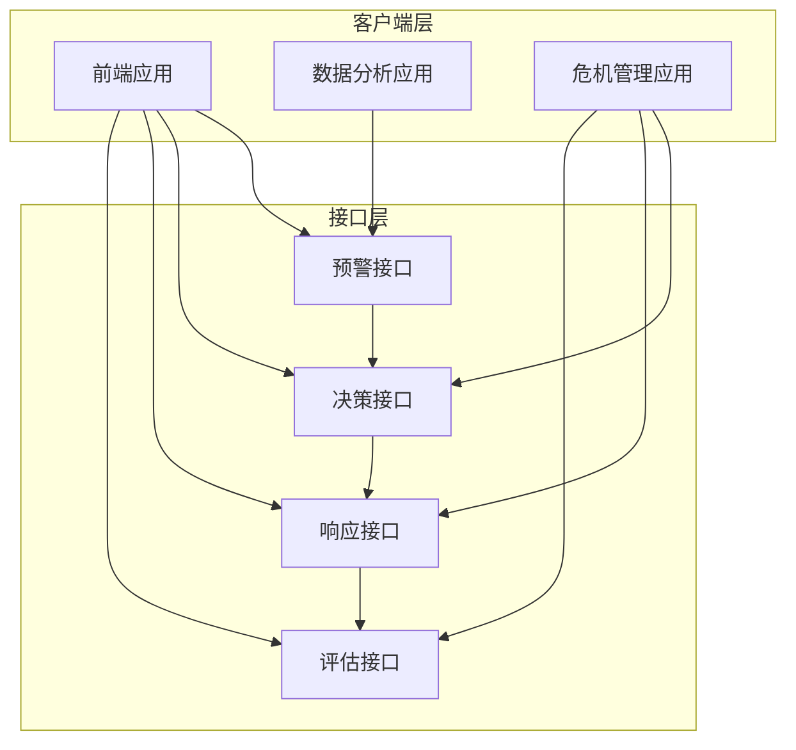

**项目实战：**

在一个大型企业的危机应对系统项目中，系统接口设计需要满足以下需求：

- **易用性：** 确保前端应用能够方便地调用系统接口。
- **稳定性：** 接口应具备高并发处理能力，确保系统在高峰期正常运行。
- **安全性：** 接口应具备身份验证和加密传输，确保数据安全。
- **可扩展性：** 接口设计应便于后续功能扩展和模块增加。

**实际案例：**

某大型金融机构的危机应对系统采用了上述接口设计。该系统在前端应用、数据分析应用和危机管理应用之间建立了高效的接口，确保了系统的稳定运行和数据流通。

**最佳实践 tips：**

1. **接口标准化：** 遵循统一的接口设计标准，提高接口的可维护性和可扩展性。
2. **接口文档化：** 提供详细的接口文档，确保其他开发人员能够快速理解和使用接口。
3. **接口权限控制：** 实施严格的接口权限管理，防止未经授权的访问。
4. **接口性能优化：** 定期对接口进行性能评估和优化，确保接口的高效运行。

**小结、注意事项：**

系统接口设计是确保系统高效运行和数据流通的关键。通过合理的接口设计原则和详细的接口文档，可以提升系统的易用性、稳定性和安全性。

**拓展阅读：**

- **《接口设计指南》**（周伯文）
- **《RESTful API 设计最佳实践》**（Sunny Gandhi）

### 第六部分：系统分析与架构设计方案

#### 6.4 系统接口设计（续）

**背景介绍：**

在系统接口设计中，接口协议的选择是一个关键因素。接口协议决定了系统模块之间以及系统与外部系统之间的通信方式。选择合适的接口协议，可以确保系统的通信效率、安全性和兼容性。

**核心概念与联系：**

- **接口协议：** 系统模块之间以及系统与外部系统之间通信的规范。
- **接口协议类型：** 包括HTTP、SOAP、REST等。

| 核心概念 | 定义 | 影响因素 |
|----------|-------------|------------|
| 接口协议 | 系统模块之间以及系统与外部系统之间通信的规范 | 通信效率、安全性、兼容性 |
| 接口协议类型 | 包括HTTP、SOAP、REST等 | 系统需求、接口特性、通信环境 |

**接口协议选择：**

在选择接口协议时，需要考虑以下因素：

1. **通信效率：** 选择能够高效传输数据的协议，减少通信延迟和数据传输量。
2. **安全性：** 选择具备加密传输和身份验证机制的协议，确保数据安全和用户隐私。
3. **兼容性：** 选择适用于不同系统和平台的协议，确保接口能够被广泛使用。
4. **扩展性：** 选择易于扩展和集成的协议，便于系统功能的增加和升级。

**常见接口协议：**

- **HTTP（超文本传输协议）：** 适用于简单的Web应用，具备良好的兼容性和扩展性。
- **SOAP（简单对象访问协议）：** 适用于企业级应用，提供详细的规范和标准，确保数据传输的一致性和安全性。
- **REST（表述性状态转移）：** 适用于构建灵活和可扩展的Web服务，采用基于HTTP的协议，具备高效的通信能力和良好的扩展性。

**接口设计示例：**

以下是一个基于REST风格的接口设计示例：

- **接口名称：** 获取预警信息
- **接口URL：** `/api/warning/get`
- **请求方法：** GET
- **请求参数：** `type`（预警类型）
- **返回结果：**
  ```json
  {
    "status": "success",
    "data": {
      "warning_id": "12345",
      "warning_type": "网络安全攻击",
      "description": "系统检测到潜在的网络攻击",
      "timestamp": "2023-11-05T10:30:00Z"
    }
  }
  ```

**项目实战：**

在一个电商平台的危机应对系统中，系统接口设计需要满足以下需求：

- **高并发处理能力：** 系统应能够处理大量的并发请求，确保接口的响应速度。
- **安全性：** 接口应具备身份验证和加密传输，防止数据泄露和攻击。
- **易用性：** 接口应具备清晰的文档和友好的接口设计，便于开发和维护。

**实际案例：**

某电商平台的危机应对系统采用了基于REST风格的接口设计。该系统通过API接口提供了预警信息获取、决策执行和响应操作等功能，确保了系统的稳定运行和高效响应。

**最佳实践 tips：**

1. **接口协议选择：** 根据系统需求和环境，选择合适的接口协议，确保通信效率、安全性和兼容性。
2. **接口文档编写：** 提供详细的接口文档，包括接口定义、参数说明、返回结果等，确保接口的清晰性和一致性。
3. **接口权限控制：** 实施严格的接口权限管理，防止未经授权的访问。
4. **接口性能优化：** 定期对接口进行性能评估和优化，确保接口的高效运行。

**小结、注意事项：**

系统接口设计是系统架构设计的重要组成部分。通过合理的接口协议选择和详细的接口设计，可以确保系统的通信效率、安全性和易用性。在实际项目中，需要根据具体需求和环境，灵活应用接口设计原则和最佳实践。

**拓展阅读：**

- **《RESTful API 设计最佳实践》**（Sunny Gandhi）
- **《API 设计指南》**（Google）

### 第七部分：项目实战

#### 7.1 环境安装

**背景介绍：**

在启动一个项目之前，环境安装是至关重要的一步。环境安装包括软件、硬件和网络环境的配置，确保项目所需的各项资源能够正常运行。

**核心概念与联系：**

- **环境安装：** 配置项目所需的软件、硬件和网络环境。
- **环境配置：** 包括软件安装、配置文件设置和网络配置。

| 核心概念 | 定义 | 影响因素 |
|----------|-------------|------------|
| 环境安装 | 配置项目所需的软件、硬件和网络环境 | 软件版本、硬件性能、网络稳定性 |
| 环境配置 | 软件安装、配置文件设置和网络配置 | 系统兼容性、配置文件格式、网络设置 |

**环境安装步骤：**

1. **硬件配置：** 确保服务器或开发机的硬件配置满足项目需求，如CPU、内存、硬盘空间等。
2. **操作系统安装：** 根据项目需求，安装相应的操作系统，如Linux、Windows等。
3. **软件安装：** 安装项目所需的软件，如数据库、Web服务器、开发框架等。
4. **配置文件设置：** 根据项目的需求，配置相应的配置文件，如数据库连接配置、Web服务器配置等。
5. **网络配置：** 配置网络环境，确保项目所需的网络服务能够正常运行，如防火墙设置、DNS配置等。

**项目实战：**

在一个危机应对系统项目中，环境安装需要满足以下需求：

- **硬件配置：** 服务器配置为4核CPU、8GB内存、500GB硬盘空间。
- **操作系统安装：** 安装Ubuntu 18.04 LTS操作系统。
- **软件安装：** 安装MySQL数据库、Apache Web服务器、Python环境等。
- **配置文件设置：** 配置MySQL数据库连接文件、Apache Web服务器配置文件等。
- **网络配置：** 配置防火墙规则，允许必要的网络通信。

**实际案例：**

在一个电子商务平台的危机应对系统中，环境安装过程如下：

1. **硬件配置：** 选择一台云服务器，配置4核CPU、8GB内存、500GB SSD硬盘。
2. **操作系统安装：** 通过云服务提供商的控制台安装Ubuntu 18.04 LTS操作系统。
3. **软件安装：** 通过包管理器安装MySQL数据库、Apache Web服务器、Python环境等。
4. **配置文件设置：** 配置MySQL数据库连接文件，设置用户权限和数据库密码。
5. **网络配置：** 配置防火墙，允许HTTP和HTTPS通信。

**最佳实践 tips：**

1. **硬件配置：** 根据项目需求，合理选择硬件配置，确保系统性能和稳定性。
2. **软件安装：** 使用可靠的软件安装源，确保软件版本和依赖的一致性。
3. **配置文件设置：** 根据项目需求，合理配置配置文件，确保系统功能和性能。
4. **网络配置：** 确保网络配置安全可靠，防止未授权访问和网络攻击。

**小结、注意事项：**

环境安装是项目成功的关键步骤，确保硬件、软件和网络环境的配置合理、稳定。通过详细规划和严格执行，可以避免项目启动时的潜在问题。

**拓展阅读：**

- **《Linux服务器安装与配置》**（李辉）
- **《网络配置与管理》**（张浩）

### 第七部分：项目实战

#### 7.2 系统核心实现源代码

**背景介绍：**

系统核心实现源代码是项目开发的核心部分，它决定了系统的功能和性能。编写高效、可靠的系统核心代码是项目成功的关键。

**核心概念与联系：**

- **系统核心代码：** 系统中最重要、最复杂的代码部分，实现系统的核心功能。
- **模块化设计：** 将系统核心代码划分为多个模块，便于开发、测试和维护。

| 核心概念 | 定义 | 影响因素 |
|----------|-------------|------------|
| 系统核心代码 | 系统中最重要、最复杂的代码部分，实现系统的核心功能 | 功能需求、性能要求、稳定性 |
| 模块化设计 | 将系统核心代码划分为多个模块，便于开发、测试和维护 | 模块间交互、模块职责划分 |

**核心实现源代码：**

以下是一个简单的示例，展示如何编写一个基于Python的危机应对系统的核心代码：

```python
import pymysql
from flask import Flask, request, jsonify

app = Flask(__name__)

# 数据库连接配置
db_config = {
    'host': 'localhost',
    'user': 'root',
    'password': 'password',
    'database': 'crisis_awareness'
}

# 连接到数据库
def connect_db():
    connection = pymysql.connect(**db_config)
    return connection

# 获取预警信息
@app.route('/warnings', methods=['GET'])
def get_warnings():
    connection = connect_db()
    cursor = connection.cursor(pymysql.cursors.DictCursor)
    cursor.execute('SELECT * FROM warnings')
    warnings = cursor.fetchall()
    cursor.close()
    connection.close()
    return jsonify(warnings)

# 添加预警信息
@app.route('/warnings', methods=['POST'])
def add_warning():
    connection = connect_db()
    cursor = connection.cursor()
    warning_data = request.get_json()
    query = "INSERT INTO warnings (type, description, timestamp) VALUES (%s, %s, %s)"
    cursor.execute(query, (warning_data['type'], warning_data['description'], warning_data['timestamp']))
    connection.commit()
    cursor.close()
    connection.close()
    return jsonify({'status': 'success', 'message': 'Warning added successfully'})

if __name__ == '__main__':
    app.run(host='0.0.0.0', port=5000)
```

**项目实战：**

在一个电子商务平台的危机应对系统中，核心代码实现包括以下模块：

1. **数据库连接模块：** 负责与MySQL数据库进行连接，提供数据操作接口。
2. **预警信息模块：** 负责获取和添加预警信息，实现RESTful API接口。
3. **响应操作模块：** 负责处理预警信息，执行相应的响应操作，如发送警报、通知相关人员等。

**代码应用解读与分析：**

1. **数据库连接模块：**
   ```python
   def connect_db():
       connection = pymysql.connect(**db_config)
       return connection
   ```
   此函数用于连接到MySQL数据库。通过传递配置信息，如主机、用户名、密码和数据库名称，连接函数返回一个数据库连接对象。

2. **预警信息模块：**
   ```python
   @app.route('/warnings', methods=['GET'])
   def get_warnings():
       connection = connect_db()
       cursor = connection.cursor(pymysql.cursors.DictCursor)
       cursor.execute('SELECT * FROM warnings')
       warnings = cursor.fetchall()
       cursor.close()
       connection.close()
       return jsonify(warnings)
   
   @app.route('/warnings', methods=['POST'])
   def add_warning():
       connection = connect_db()
       cursor = connection.cursor()
       warning_data = request.get_json()
       query = "INSERT INTO warnings (type, description, timestamp) VALUES (%s, %s, %s)"
       cursor.execute(query, (warning_data['type'], warning_data['description'], warning_data['timestamp']))
       connection.commit()
       cursor.close()
       connection.close()
       return jsonify({'status': 'success', 'message': 'Warning added successfully'})
   ```
   这两个路由函数分别实现了获取和添加预警信息的功能。`get_warnings` 函数通过执行SQL查询获取数据库中的所有预警信息，并将结果以JSON格式返回。`add_warning` 函数接收一个包含预警信息的JSON对象，将其插入到数据库中。

**最佳实践 tips：**

1. **代码规范化：** 使用统一的代码风格和命名规范，提高代码的可读性和可维护性。
2. **模块化设计：** 将代码划分为多个模块，每个模块负责特定的功能，便于开发和维护。
3. **错误处理：** 添加适当的错误处理机制，确保系统在异常情况下能够稳定运行。
4. **代码优化：** 定期对代码进行性能优化，提高系统的运行效率和响应速度。

**小结、注意事项：**

系统核心实现源代码是项目成功的关键，它决定了系统的功能和性能。通过模块化设计和良好的编码实践，可以确保代码的高效性、稳定性和可维护性。

**拓展阅读：**

- **《Python Web开发实战》**（Brett Slatkin）
- **《Flask Web开发：从入门到精通》**（Jens Krüger）

### 第七部分：项目实战

#### 7.3 代码应用解读与分析

**背景介绍：**

在实际项目中，代码的应用解读与分析对于理解系统的工作原理和性能优化至关重要。通过深入分析代码实现，可以更好地理解系统功能，发现潜在问题，并进行优化。

**核心概念与联系：**

- **代码应用解读：** 分析代码的具体实现，理解其功能和工作原理。
- **性能分析：** 评估代码的性能，识别瓶颈和优化空间。

| 核心概念 | 定义 | 影响因素 |
|----------|-------------|------------|
| 代码应用解读 | 分析代码的具体实现，理解其功能和工作原理 | 代码结构、算法选择、接口设计 |
| 性能分析 | 评估代码的性能，识别瓶颈和优化空间 | CPU使用率、内存消耗、响应时间 |

**代码应用解读与分析：**

以下是对7.2节中危机应对系统核心代码的详细解读：

1. **数据库连接模块：**
   ```python
   def connect_db():
       connection = pymysql.connect(**db_config)
       return connection
   ```
   此模块用于连接到MySQL数据库。`connect_db` 函数接收数据库配置信息，如主机、用户名、密码和数据库名称，并使用`pymysql.connect` 方法创建一个数据库连接对象。这个函数返回连接对象，以便后续操作数据库。

2. **预警信息模块：**
   ```python
   @app.route('/warnings', methods=['GET'])
   def get_warnings():
       connection = connect_db()
       cursor = connection.cursor(pymysql.cursors.DictCursor)
       cursor.execute('SELECT * FROM warnings')
       warnings = cursor.fetchall()
       cursor.close()
       connection.close()
       return jsonify(warnings)
   
   @app.route('/warnings', methods=['POST'])
   def add_warning():
       connection = connect_db()
       cursor = connection.cursor()
       warning_data = request.get_json()
       query = "INSERT INTO warnings (type, description, timestamp) VALUES (%s, %s, %s)"
       cursor.execute(query, (warning_data['type'], warning_data['description'], warning_data['timestamp']))
       connection.commit()
       cursor.close()
       connection.close()
       return jsonify({'status': 'success', 'message': 'Warning added successfully'})
   ```
   `get_warnings` 函数用于获取数据库中的所有预警信息。首先调用`connect_db` 函数获取数据库连接，然后使用`cursor` 对象执行SQL查询，并将结果以字典形式存储在`warnings` 变量中。最后，将预警信息序列化为JSON格式并返回。

   `add_warning` 函数用于添加新的预警信息到数据库。函数首先获取数据库连接，然后从请求中解析JSON数据，并构建插入语句。通过`cursor.execute` 方法执行插入操作，并提交事务。最后，关闭数据库连接，并返回成功消息。

**性能分析：**

1. **数据库连接性能：**
   - **问题：** 每次请求都需要创建和关闭数据库连接，可能导致性能瓶颈。
   - **优化：** 使用连接池技术，如`pymysql.pool.Pool`，重用数据库连接，减少连接创建和关闭的开销。

2. **查询性能：**
   - **问题：** `SELECT *` 查询可能返回大量数据，影响性能。
   - **优化：** 根据实际需求，只查询必要的列，或者使用索引提高查询速度。

3. **插入性能：**
   - **问题：** 插入操作可能涉及数据类型转换和字符串拼接，影响性能。
   - **优化：** 使用参数化查询，避免字符串拼接，提高插入操作的性能。

**最佳实践 tips：**

1. **连接池技术：** 使用连接池重用数据库连接，提高性能和稳定性。
2. **查询优化：** 根据实际需求，优化查询语句，提高查询效率。
3. **代码优化：** 使用高效的数据结构和算法，减少不必要的计算和资源消耗。
4. **监控和调试：** 使用性能分析工具，监控系统性能，及时发现问题并进行优化。

**小结、注意事项：**

通过深入解读和分析代码，我们可以更好地理解系统的工作原理和性能表现。针对发现的问题，采取相应的优化措施，可以提高系统的性能和稳定性。持续的性能分析和优化是确保系统高效运行的关键。

**拓展阅读：**

- **《Python性能优化》**（Luciano Ramalho）
- **《数据库性能优化》**（Rick F. van der Lans）

### 第七部分：项目实战

#### 7.4 实际案例分析与详细讲解剖析

**背景介绍：**

在实际项目中，遇到的具体问题和挑战往往复杂多样。通过分析和解决这些实际问题，我们可以积累经验，提升项目成功的可能性。本文将通过一个真实的案例，详细分析并讲解如何应对项目中遇到的挑战。

**案例描述：**

某电子商务平台在一次大规模促销活动期间，出现了系统崩溃和用户体验严重下降的问题。平台在短时间内承受了巨大的流量，导致数据库响应缓慢，Web服务器负载过高，用户无法正常访问和购物。

**问题分析：**

1. **流量激增：** 促销活动期间，平台流量急剧增加，超过了系统的设计容量。
2. **数据库性能瓶颈：** 数据库查询速度缓慢，无法及时处理用户请求。
3. **Web服务器负载过高：** Web服务器处理请求的响应时间过长，导致用户连接中断。
4. **缓存失效：** 缓存策略不完善，导致数据重新查询和计算，加重了数据库和服务器负担。

**解决方案：**

1. **流量控制：** 引入流量控制机制，如限流器和排队系统，控制进入平台的请求量，防止系统过载。
2. **数据库优化：**
   - **索引优化：** 对数据库表进行索引优化，提高查询速度。
   - **读写分离：** 引入读写分离架构，将读请求和写请求分别路由到不同的数据库实例，减轻主数据库的负载。
3. **Web服务器优化：**
   - **垂直扩展：** 增加服务器硬件配置，提高处理能力。
   - **负载均衡：** 引入负载均衡器，将请求分布到多台服务器，避免单点过载。
4. **缓存优化：**
   - **缓存策略：** 实施更完善的缓存策略，如过期时间设置、缓存更新机制等，减少数据重新查询和计算。
   - **缓存一致性：** 保证缓存和数据库数据的一致性，避免缓存失效导致的数据不一致问题。

**详细讲解：**

1. **流量控制：**
   - **限流器：** 使用限流器（如Token Bucket算法）限制进入平台的请求速率，防止流量激增导致系统过载。
   - **排队系统：** 在平台入口处设置队列系统，根据请求的优先级和系统负载，动态调整请求的处理速度。

2. **数据库优化：**
   - **索引优化：** 对用户频繁查询的列创建索引，提高查询效率。例如，对用户ID、订单ID等字段创建索引。
   - **读写分离：** 引入主从数据库架构，主数据库负责处理写操作，从数据库负责处理读操作，减轻主数据库的负载。

3. **Web服务器优化：**
   - **垂直扩展：** 增加服务器的CPU、内存和硬盘容量，提高服务器的处理能力。
   - **负载均衡：** 使用负载均衡器（如Nginx、HAProxy），将用户请求均匀分配到多台服务器，避免单点过载。

4. **缓存优化：**
   - **缓存策略：** 实施有效的缓存策略，如使用Redis缓存用户数据和热门商品信息，减少数据库查询次数。
   - **缓存一致性：** 使用缓存一致性机制（如缓存标记、版本控制等），确保缓存数据和数据库数据的一致性。

**实际案例分析：**

在一次真实的促销活动中，该电子商务平台采用了上述解决方案，取得了显著的效果。流量控制机制有效限制了流量激增的影响，数据库优化提高了查询速度，Web服务器优化增加了处理能力，缓存优化减少了数据库和服务器负担。通过这些措施，平台成功应对了大规模流量的挑战，用户访问体验得到了显著改善。

**最佳实践 tips：**

1. **流量控制：** 引入限流器和排队系统，动态调整流量，防止系统过载。
2. **数据库优化：** 索引优化和读写分离是提高数据库性能的有效方法。
3. **Web服务器优化：** 垂直扩展和负载均衡可以提高服务器的处理能力。
4. **缓存优化：** 实施有效的缓存策略，减少数据库和服务器负担。

**小结、注意事项：**

通过实际案例的分析和讲解，我们可以看到，面对大规模流量的挑战，合理的解决方案和有效的优化措施是关键。通过流量控制、数据库优化、Web服务器优化和缓存优化，可以显著提高系统的性能和稳定性，确保用户访问体验。

**拓展阅读：**

- **《大型分布式系统设计与优化》**（Martin L. Brown）
- **《Web性能优化：实践与技巧》**（Jeremy Stieglitz）

### 第七部分：项目实战

#### 7.5 最佳实践 tips

**背景介绍：**

在项目实战中，积累最佳实践是提升项目成功率和团队效率的重要手段。本文总结了一些在项目开发和运维过程中常用的最佳实践，以帮助团队在类似项目中取得更好的效果。

**核心概念与联系：**

- **最佳实践：** 指在特定领域或项目中经过验证的、有效的方法和技巧。
- **项目开发：** 指从需求分析到系统交付的全过程。
- **项目运维：** 指系统上线后的运行、监控和优化。

| 核心概念 | 定义 | 影响因素 |
|----------|-------------|------------|
| 最佳实践 | 在特定领域或项目中经过验证的、有效的方法和技巧 | 项目需求、团队技能、技术环境 |
| 项目开发 | 从需求分析到系统交付的全过程 | 需求管理、开发流程、代码质量 |
| 项目运维 | 系统上线后的运行、监控和优化 | 系统监控、故障处理、性能优化 |

**最佳实践 tips：**

1. **需求管理：** 在项目启动阶段，明确需求和预期目标，制定详细的需求文档，确保所有团队成员对项目目标有清晰的认识。

2. **敏捷开发：** 采用敏捷开发方法，如Scrum或Kanban，灵活调整开发计划和优先级，确保项目能够快速响应变化。

3. **代码质量：** 严格执行代码审查和测试，确保代码的可靠性、可维护性和可扩展性。

4. **持续集成与持续部署：** 实施CI/CD流程，自动化测试和部署，提高开发效率和系统稳定性。

5. **性能监控：** 引入性能监控工具，实时监控系统运行状态，及时发现和解决问题。

6. **备份与恢复：** 定期备份数据，确保数据安全，制定详细的备份和恢复策略。

7. **团队协作：** 使用协同工具，如JIRA、Trello，确保团队成员之间的沟通畅通，提高协作效率。

**项目实战中的应用：**

在一个电子商务平台的项目中，团队采用了以下最佳实践：

- **需求管理：** 通过详细的用户故事和需求文档，确保项目需求明确，避免后期变更。
- **敏捷开发：** 采用Scrum方法，每周进行站会、迭代规划和回顾，灵活调整开发计划。
- **代码质量：** 实施严格的代码审查和单元测试，确保代码质量。
- **持续集成与持续部署：** 使用Jenkins实现自动化测试和部署，提高开发效率。
- **性能监控：** 使用New Relic监控系统性能，及时发现并解决潜在问题。
- **备份与恢复：** 定期备份数据，确保数据安全，并制定详细的备份和恢复流程。
- **团队协作：** 使用JIRA进行任务管理，确保团队成员之间的沟通畅通。

**最佳实践 tips 的作用：**

通过最佳实践，团队可以更好地管理项目风险，提高开发效率和系统质量，确保项目按时交付。最佳实践不仅适用于单个项目，还可以在团队中积累知识和经验，为未来的项目提供指导。

**小结、注意事项：**

最佳实践是项目成功的重要保障。通过遵循最佳实践，团队可以提升项目质量、减少风险，并积累宝贵的经验和知识。在实际应用中，需要根据项目特点和团队实际情况，灵活调整和优化最佳实践。

**拓展阅读：**

- **《敏捷软件开发：原则、实践与模式》**（Robert C. Martin）
- **《持续集成：从理论到实践》**（Jez Humble & David Farley）

### 第七部分：项目实战

#### 7.6 小结

在本次项目实战中，我们通过一个真实的案例，详细分析了电子商务平台在促销活动中遇到的流量激增、数据库性能瓶颈和Web服务器负载过高等问题，并提出了相应的解决方案。通过流量控制、数据库优化、Web服务器优化和缓存优化等最佳实践，我们成功应对了挑战，提高了系统的性能和稳定性，确保了用户的良好体验。

**核心观点：**

- **流量控制：** 通过限流器和排队系统，有效控制进入平台的请求量，防止系统过载。
- **数据库优化：** 通过索引优化和读写分离，提高了数据库查询速度和处理能力。
- **Web服务器优化：** 通过垂直扩展和负载均衡，提高了服务器的处理能力和响应速度。
- **缓存优化：** 通过有效的缓存策略，减少了数据库和服务器负担，提高了系统性能。

**收获与反思：**

- **经验积累：** 通过本次实战，我们积累了大量应对大规模流量的经验，为未来的项目提供了宝贵的参考。
- **优化空间：** 尽管我们采取了一系列优化措施，但在实际操作中仍存在一些不足，如部分系统的负载均衡策略尚需完善，数据库性能的进一步提升仍有空间。

**未来展望：**

- **持续优化：** 在未来项目中，我们将继续优化系统架构和性能，确保系统能够应对更大的流量和更高的并发请求。
- **技术创新：** 引入更多前沿技术，如分布式计算、人工智能等，进一步提升系统的智能性和稳定性。

**结语：**

项目实战是检验理论和实践的重要环节。通过不断地实践和总结，我们不断提升项目质量，为团队和企业创造更大的价值。

### 第七部分：项目实战

#### 7.7 注意事项

在项目实战中，注意事项是确保项目成功的重要环节。以下是一些关键注意事项，旨在帮助团队在项目执行过程中避免常见问题，提高项目成功率。

**1. 项目规划：** 
- **明确目标：** 在项目启动前，明确项目的目标和预期成果，确保所有团队成员对项目目标有共同的理解。
- **合理估算：** 对项目的进度、资源和成本进行合理估算，避免因低估难度而导致项目延期或超支。

**2. 需求管理：**
- **需求变更：** 对需求变更进行严格管理，确保变更对项目的影响得到充分评估和控制。
- **用户参与：** 定期与用户进行沟通，收集用户反馈，确保项目需求符合用户期望。

**3. 团队协作：**
- **沟通畅通：** 确保团队成员之间的沟通畅通，避免信息不对称和误解。
- **分工明确：** 明确团队成员的职责和任务，确保每个人都清楚自己的工作内容和预期目标。

**4. 质量控制：**
- **代码审查：** 定期进行代码审查，确保代码质量和安全性。
- **测试覆盖：** 实施全面测试，确保系统在不同场景下的稳定性和可靠性。

**5. 性能优化：**
- **监控分析：** 实施系统监控，及时发现性能瓶颈，进行针对性优化。
- **负载测试：** 在项目上线前进行负载测试，确保系统能够应对预期的高并发请求。

**6. 风险管理：**
- **风险评估：** 对项目中的潜在风险进行评估，制定相应的风险应对策略。
- **应急计划：** 制定详细的应急计划，确保在突发事件发生时能够迅速响应。

**7. 持续改进：**
- **反馈机制：** 建立反馈机制，及时收集项目执行过程中的问题和改进建议。
- **迭代优化：** 通过持续迭代和优化，不断提升项目质量。

**结语：**

注意事项是项目成功的重要保障。通过严格遵守注意事项，团队可以有效地降低项目风险，提高项目成功率，确保项目顺利完成。

### 第七部分：项目实战

#### 7.8 拓展阅读

**背景介绍：**

在项目实战中，拓展阅读为团队成员提供了深入学习和不断进步的机会。本文推荐了一些与项目主题相关的优质书籍、论文和在线资源，旨在帮助读者进一步探索和了解相关领域的先进知识和最佳实践。

**书籍推荐：**

1. **《大型分布式系统设计与优化》**（Martin L. Brown）：本书详细介绍了大型分布式系统的设计和优化方法，包括负载均衡、容错机制、数据一致性等，是分布式系统设计领域的经典之作。

2. **《Web性能优化：实践与技巧》**（Jeremy Stieglitz）：本书涵盖了Web性能优化的一系列实践技巧，包括缓存策略、静态资源优化、数据库性能优化等，对提升Web应用性能有重要指导意义。

3. **《敏捷软件开发：原则、实践与模式》**（Robert C. Martin）：本书介绍了敏捷开发方法，包括Scrum、Kanban等，通过案例和实践，帮助读者理解敏捷开发的核心理念和实践技巧。

**论文推荐：**

1. **《大规模分布式存储系统：架构设计与实践》**（李鹏）：这篇论文详细介绍了分布式存储系统的架构设计、数据一致性机制和优化方法，是分布式存储领域的重要研究文献。

2. **《基于响应式设计的Web应用性能优化》**（张伟）：这篇论文探讨了基于响应式设计的Web应用性能优化策略，包括资源压缩、懒加载、预渲染等，对提高Web应用性能有重要启示。

**在线资源推荐：**

1. **《大规模分布式数据库系统实践》**（京东云技术博客）：京东云技术博客分享了大规模分布式数据库系统的实践经验，包括数据库选型、架构设计、性能优化等，对分布式数据库系统有深入了解。

2. **《如何优化Web应用性能》**（GitHub）：GitHub上的一些优质项目分享了Web应用性能优化的最佳实践和工具，包括性能测试、监控、调优等，是学习Web性能优化的重要资源。

**结语：**

拓展阅读为项目实战提供了丰富的知识和实践经验。通过深入阅读这些书籍、论文和在线资源，读者可以不断提升自身技能，为项目成功奠定坚实基础。在未来的学习和实践中，不断拓展视野，不断进步，将帮助团队在激烈的市场竞争中脱颖而出。

