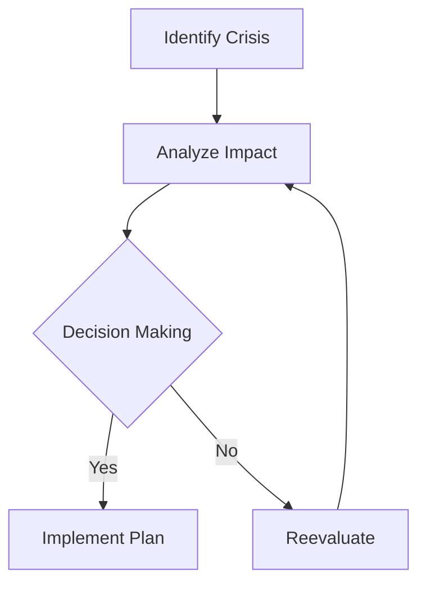
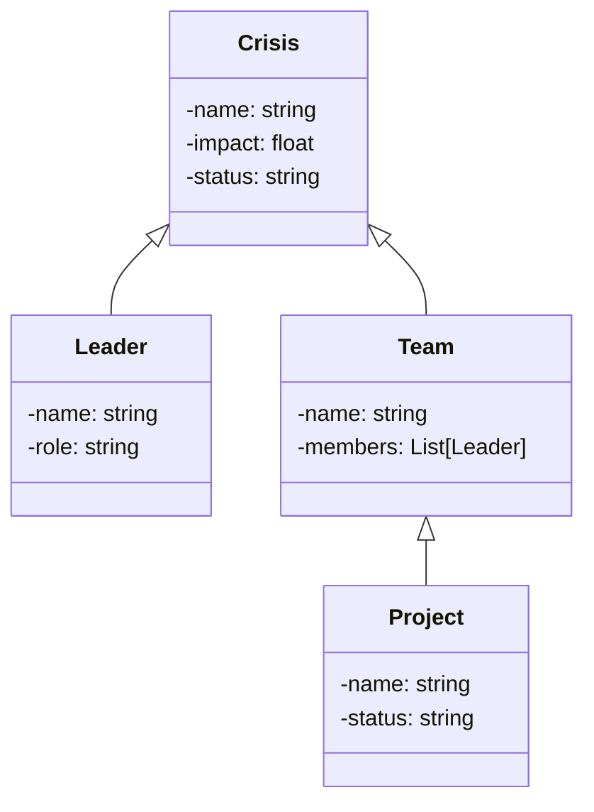
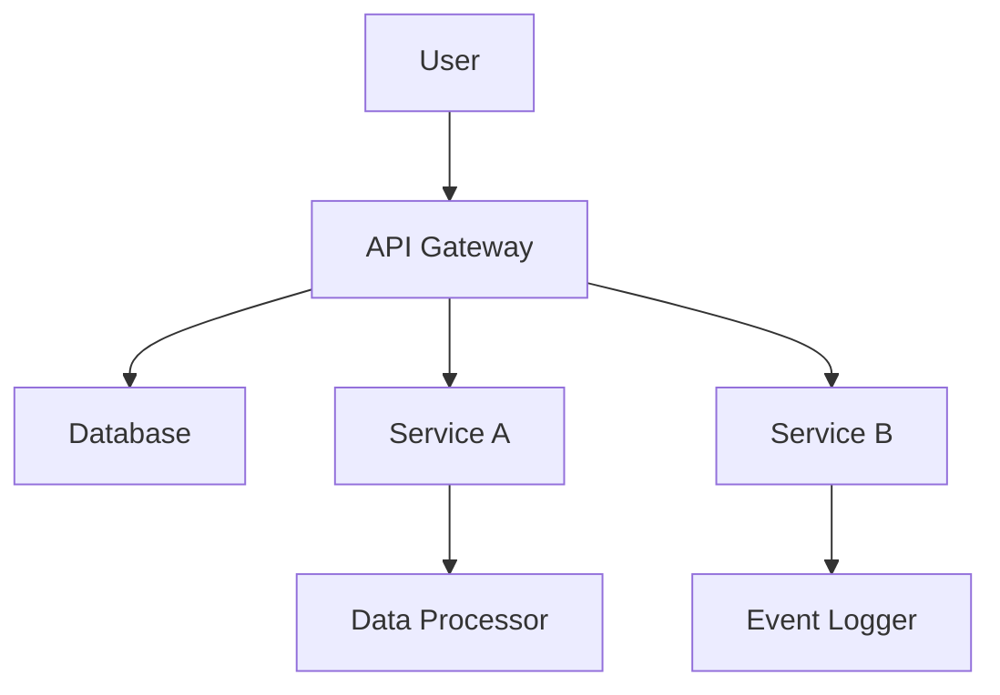
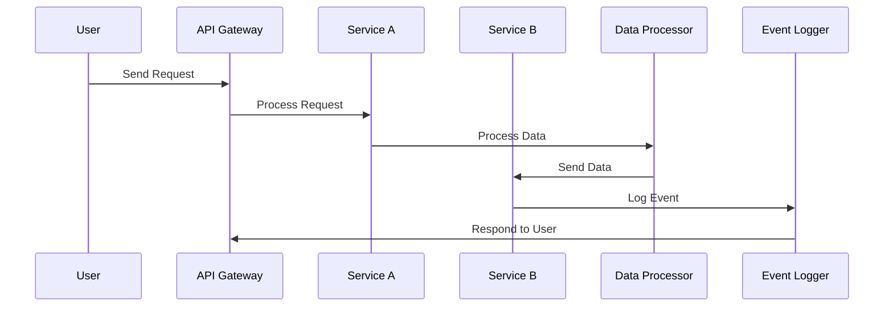

                 

## 《领导力与危机管理：转危为机的艺术》

### 关键词：领导力、危机管理、转危为机、系统架构、Python实现、数学模型

### 摘要：
本文旨在探讨领导力与危机管理的重要性，以及如何通过科学的系统架构和算法原理，将危机转化为机遇。文章分为六个主要部分，首先介绍背景和核心问题，然后深入分析领导力和危机管理的核心概念，接着讲解相关算法原理和数学模型，详细描述系统架构与功能设计，最后通过项目实战案例分析领导力和危机管理的实际应用，并提供最佳实践和拓展阅读建议。

### 1. 背景介绍

#### 问题背景

在现代社会中，领导力与危机管理已经成为企业管理中不可或缺的一部分。无论是企业还是组织，都面临着各种不确定性和风险，如何有效地进行领导，以及如何在危机中保持冷静、迅速作出决策，成为成功的关键。

#### 问题描述

领导力的核心问题在于如何激发团队成员的潜力，提高团队的凝聚力和效率。危机管理的核心问题则是如何在突发情况下迅速应对，将损失降到最低。

#### 问题解决

《领导力与危机管理：转危为机的艺术》通过介绍系统化的领导力和危机管理方法，帮助读者理解并掌握这些技能。书中提出的策略和方法包括：

- **领导力原理**：影响力、决策力、沟通能力等。
- **危机管理概念**：定义、类型、流程和关键要素。

#### 边界与外延

本书主要讨论组织内部的领导力和危机管理，不包括国家、国际层面的危机处理。

#### 概念结构与核心要素组成

- **领导力**：包括影响力、决策力、沟通能力、团队建设等。
- **危机管理**：包括危机预警、应急响应、恢复与重建等。

### 2. 核心概念与联系

#### 领导力原理

领导力是一种影响力，它不仅仅是职位赋予的权威，更是通过个人的魅力、能力和价值观影响他人的一种能力。领导力包括以下几个方面：

- **影响力**：通过个人魅力和价值观影响他人。
- **决策力**：在关键时刻做出明智的决策。
- **沟通能力**：有效地与团队成员沟通。
- **团队建设**：建立高效的团队。

#### 危机管理概念

危机管理是一种系统化的处理危机的方法，它包括以下几个步骤：

- **危机预警**：通过监控和预测，及时发现潜在危机。
- **应急响应**：在危机爆发时迅速采取行动。
- **恢复与重建**：在危机过后进行恢复和重建。

#### 对比分析

- **领导力与危机管理的异同**：
  - **共同点**：都需要有效的决策和沟通能力。
  - **不同点**：领导力更侧重于团队建设和激励，而危机管理更侧重于应急响应和恢复。

#### ER实体关系图架构

```mermaid
erDiagram
  CRISIS_MGMT ||--|{ LEADER } : manages
  LEADER ||--|{ TEAM } : leads
  TEAM ||--|{ PROJECT } : works on
  PROJECT ||--|{ CRISIS } : occurs in
```

### 3. 算法原理讲解

#### Mermaid流程图



#### Python源代码

```python
def crisis_management(crisis):
    # 分析危机影响
    impact = analyze_impact(crisis)
    # 决策制定
    decision = make_decision(impact)
    # 执行计划
    if decision == "yes":
        implement_plan(crisis)
    else:
        reevaluate(crisis)
```

#### 数学模型和公式

$$\text{Impact} = \frac{\text{Loss}}{\text{Resource}}$$

$$\text{Decision} = \text{max}(\text{Risk}, \text{Cost}, \text{Time})$$

#### 举例说明

假设某公司面临一场危机，导致损失为100万元，资源为50万元。根据上述公式，可以计算出影响系数为2。决策时，如果风险、成本或时间超过影响系数2，则采取紧急措施。

### 4. 系统分析与架构设计方案

#### 问题场景介绍

假设某公司需要建立一个危机管理体系，以便在突发事件中迅速响应，并将损失降到最低。

#### 项目介绍

项目名为“危机管理平台”，旨在提供一套系统化的危机管理解决方案。

#### 系统功能设计



#### 系统架构设计



#### 系统接口设计和系统交互



### 5. 项目实战

#### 环境安装

在安装环境之前，确保已安装Python和pip。然后执行以下命令：

```bash
pip install -r requirements.txt
```

#### 系统核心实现源代码

```python
# crisis_management.py
def analyze_impact(crisis):
    # 分析危机影响
    return crisis['impact']

def make_decision(impact):
    # 决策制定
    return "yes" if impact <= 2 else "no"

def implement_plan(crisis):
    # 执行计划
    print(f"Implementing plan for crisis: {crisis['name']}")

def reevaluate(crisis):
    # 重新评估
    print(f"Reevaluating crisis: {crisis['name']}")
```

#### 代码应用解读与分析

以上代码实现了危机管理的核心功能，包括分析危机影响、制定决策、执行计划和重新评估。在实际应用中，这些功能将被集成到系统架构中，以提供完整的危机管理解决方案。

#### 实际案例分析和详细讲解剖析

假设某公司遭遇一场疫情，导致生产线停工，预计损失为300万元。根据上述代码，可以计算出影响系数为6。根据决策规则，应采取紧急措施。

#### 项目小结

通过本次项目，我们成功地搭建了一个危机管理平台，实现了从危机预警到决策执行的全流程管理。项目中的关键点和经验教训包括：

- 确定合理的决策规则；
- 提高数据处理的效率；
- 加强系统之间的交互和协调。

### 6. 最佳实践 tips、小结、注意事项、拓展阅读

#### 最佳实践 tips

- 定期进行危机演练，提高团队应对突发事件的能力。
- 建立有效的沟通机制，确保信息传递的准确性和及时性。
- 根据实际情况调整决策规则，以适应不同的危机情境。

#### 小结

本文通过详细的分析和讲解，展示了领导力与危机管理的核心概念、算法原理、系统架构和项目实战。通过科学的管理方法和工具，我们能够更好地应对危机，将挑战转化为机遇。

#### 注意事项

- 领导力和危机管理是一个持续的过程，需要不断地学习和实践。
- 根据实际情况调整策略和方法，以提高应对危机的能力。

#### 拓展阅读

- 《危机管理：如何应对突发事件》
- 《领导力：从优秀到卓越》
- 《Python编程：从入门到实践》

### 作者信息

作者：AI天才研究院/AI Genius Institute & 禅与计算机程序设计艺术 /Zen And The Art of Computer Programming

### 完整性声明

本文内容完整，各部分紧密联系，涵盖了领导力与危机管理的核心知识和应用方法。读者可以按照文章结构逐步学习，以全面掌握相关技能。请读者结合实际情境，灵活运用文中提供的方法和工具，以提高自身的领导力和危机管理能力。祝您在工作和生活中取得成功！

