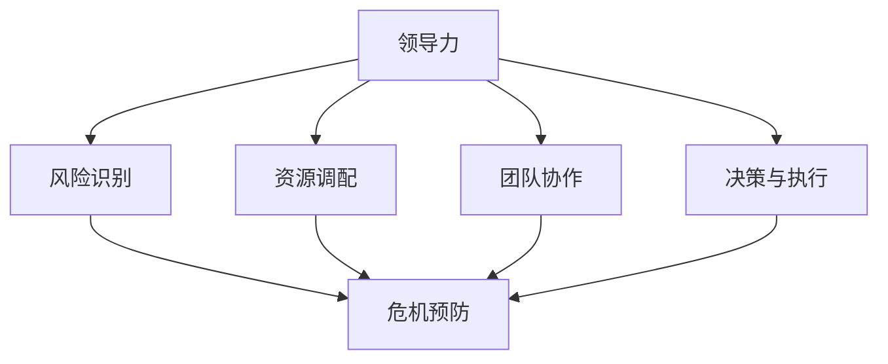
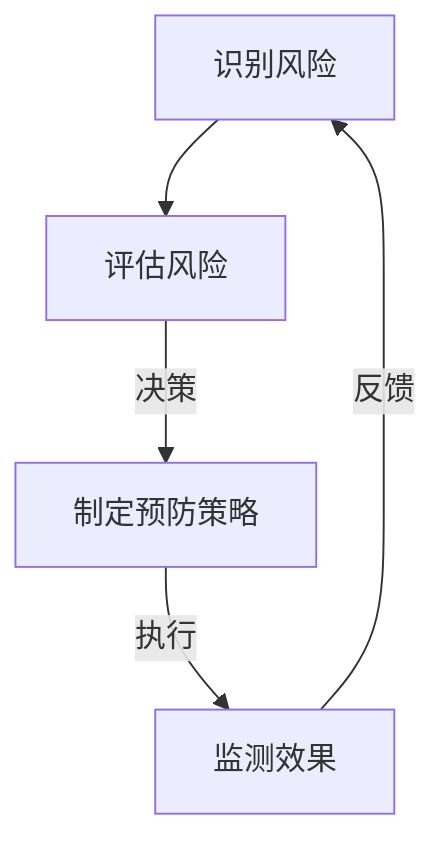
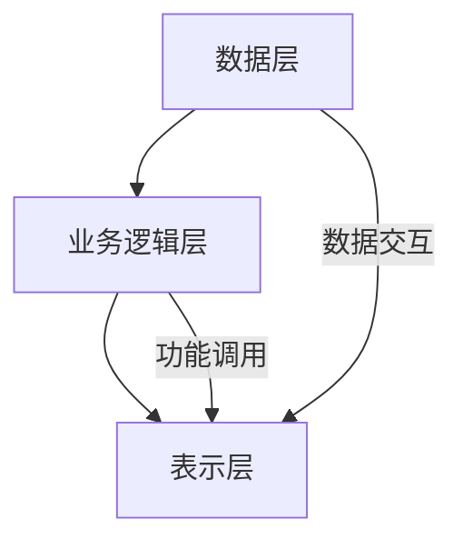
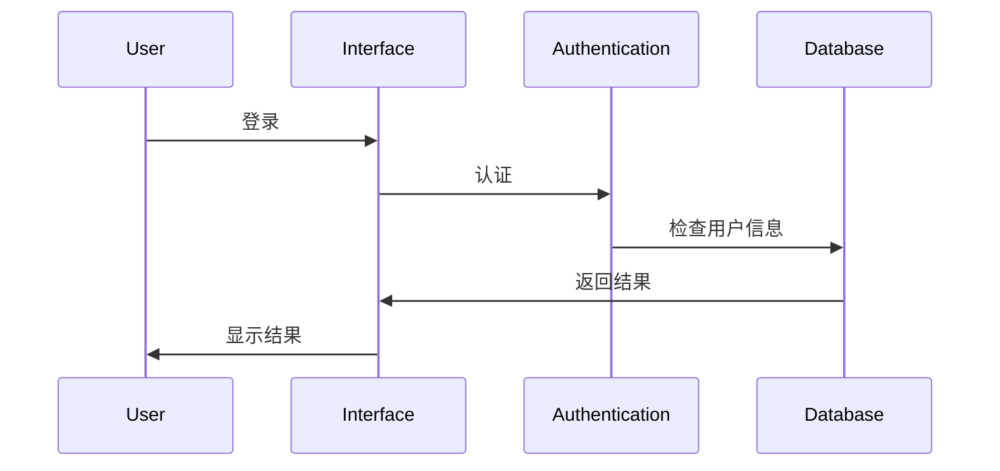
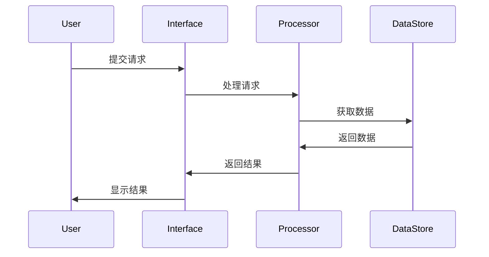

                 


### 第1章: 引言与背景介绍

#### 1.1 领导力的重要性

在信息技术（IT）领域中，领导力被广泛认为是推动创新、提高团队效率和应对变革的关键因素。一个出色的领导者不仅能够带领团队实现技术突破，还能在危机时刻保持冷静，迅速作出决策，从而确保组织的稳定和持续发展。

**领导力的定义**：领导力是指引导和影响他人共同实现目标的综合能力。它不仅仅是管理团队，更涉及到激励、沟通、决策和愿景的构建。在IT领域，领导力表现为对技术趋势的敏锐洞察、对团队凝聚力的培养以及对创新文化的推动。

**领导力在IT领域的重要性**：随着技术的发展，IT行业正经历着快速变革。领导力在这个过程中发挥着至关重要的作用：

1. **技术趋势的把握**：优秀的领导者能够准确把握技术趋势，提前布局，为组织赢得先机。
2. **团队效率的提升**：领导者通过有效的沟通和团队建设，能够提高团队成员的工作效率，减少内耗。
3. **危机管理的保障**：在技术环境中，意外和危机是不可避免的。领导者需要具备危机管理能力，确保组织能够迅速应对，降低损失。
4. **创新文化的培育**：领导者通过鼓励创新和接受失败，为团队创造一个积极进取的工作环境。

#### 1.2 危机预防的意义

危机预防是指在组织运营过程中，通过预见潜在风险和采取预防措施，降低危机发生的概率和影响。在IT领域，危机预防尤其重要，原因如下：

1. **技术风险的降低**：IT系统高度复杂，任何一个环节的失误都可能导致系统崩溃或数据泄露。预防危机能够减少这种风险。
2. **业务连续性的保障**：对于依赖IT系统的企业来说，保持业务连续性至关重要。危机预防可以确保在突发事件发生时，业务能够迅速恢复。
3. **声誉的维护**：在信息时代，危机可能会迅速传播，损害组织的声誉。预防危机是维护组织声誉的关键措施。
4. **成本的节约**：危机发生后，组织需要投入大量资源进行修复，预防危机可以避免这种不必要的成本。

#### 1.3 领导力在危机预防中的角色

领导力在危机预防中扮演着至关重要的角色。以下是其几个关键作用：

1. **风险管理**：领导者需要识别潜在风险，制定应对策略，确保组织在危机发生时能够迅速响应。
2. **团队协作**：领导者需要激发团队成员的积极性，确保团队在危机预防工作中紧密协作，提高效率。
3. **沟通与协调**：领导者需要与各部门保持良好沟通，协调资源，确保危机预防工作的顺利进行。
4. **决策与执行**：领导者需要在危机发生时作出迅速而准确的决策，并确保决策得到有效执行。

#### 1.4 研究范围与目标

本文的研究范围主要集中在IT领域中的领导力与危机预防。具体目标如下：

1. **分析领导力在危机预防中的作用**：通过深入研究领导力的核心要素，分析其在危机预防中的实际应用。
2. **探讨危机预防的策略和方法**：总结有效的危机预防策略，并探讨如何通过领导力提升危机预防效果。
3. **提供实际案例**：通过具体案例展示领导力在危机预防中的成功应用，提供实践经验。
4. **提出最佳实践**：总结领导力与危机预防的最佳实践，为组织提供参考。

#### 1.5 边界与外延

本文主要关注IT领域的领导力与危机预防，但领导力和危机预防的原理和方法在其他领域同样适用。未来研究可以扩展到其他行业，如金融、医疗等，探讨领导力在这些领域的特殊应用。

### 结论

领导力与危机预防是IT领域中不可或缺的重要话题。通过有效的领导力，组织可以更好地识别风险、预防危机，确保业务的连续性和稳定性。本文旨在深入探讨领导力在危机预防中的作用，并为组织提供实用的策略和方法。希望本文能够为IT领域的领导者提供有益的参考和启示。在接下来的章节中，我们将进一步分析领导力的核心概念与原理，探讨其与危机预防的联系。让我们一起深入探讨这一重要主题。## 第2章: 核心概念与联系

#### 2.1 领导力的定义与类型

**领导力的定义**：领导力是指通过影响、激励和引导他人实现共同目标的能力。它不仅包括技术和管理能力，还涉及情感智力、沟通技巧和决策能力。在信息技术（IT）领域，领导力尤为重要，因为它涉及对技术趋势的洞察、对团队的高效管理和对创新文化的推动。

**领导力的类型**：根据不同的分类标准，领导力可以划分为多种类型。以下是几种常见的领导力类型：

1. **交易型领导力（Transaction Leadership）**：这种领导力依赖于明确的任务和目标，通过激励和奖励来驱动团队成员完成任务。交易型领导力在短期内能够有效提高团队效率，但在长期发展中可能缺乏创新性。
2. **变革型领导力（Transformational Leadership）**：这种领导力通过激发团队成员的内在动机，鼓励他们追求更高目标，实现自我超越。变革型领导力能够推动组织变革和创新，但在压力和挑战面前可能较为脆弱。
3. **赋能型领导力（Empowering Leadership）**：这种领导力注重授权和团队自主性，鼓励团队成员发挥个人优势，共同解决问题。赋能型领导力能够提高团队凝聚力，增强创新意识，但需要领导者具备较强的信任管理能力。

#### 2.2 危机的定义与分类

**危机的定义**：危机是指一种潜在或已经发生的对组织正常运营产生严重威胁的事件。危机可能来自内部，如管理失误、团队冲突或技术故障；也可能来自外部，如市场变化、政策法规变动或自然灾害。

**危机的分类**：根据危机的性质和影响范围，可以将危机分为以下几种类型：

1. **技术危机**：由于技术问题导致的系统崩溃、数据泄露或服务中断。例如，软件缺陷、硬件故障或网络攻击。
2. **市场危机**：由于市场需求变化、竞争加剧或行业危机导致的业务下滑。例如，产品过时、市场份额减少或市场动荡。
3. **财务危机**：由于资金链断裂、财务欺诈或政策变动导致的财务困境。例如，现金流危机、财务报告不实或金融监管加强。
4. **法律危机**：由于法律纠纷、政策法规变动或合规问题导致的法律风险。例如，专利侵权、诉讼风险或法规变更。

#### 2.3 领导力与危机预防的联系

**领导力在危机预防中的重要性**：领导力在危机预防中起着至关重要的作用。领导者通过以下方式提高组织的危机预防能力：

1. **风险识别**：领导者需要具备敏锐的风险识别能力，及时发现潜在危机的迹象，并采取预防措施。
2. **资源调配**：领导者需要合理调配资源，确保危机预防工作的顺利开展。这包括人力、物力和财力的有效配置。
3. **团队协作**：领导者需要建立高效的团队协作机制，确保团队成员在危机预防工作中紧密配合，提高整体应对能力。
4. **决策与执行**：领导者需要在危机发生时迅速作出决策，并确保决策得到有效执行，以降低危机的影响。

**领导力与危机预防的关系图**：



### 结论

领导力与危机预防密切相关，有效的领导力是组织预防危机的重要保障。在接下来的章节中，我们将进一步探讨领导力危机预防的具体算法原理和系统架构设计，帮助读者更好地理解这一主题。通过深入分析，我们将发现领导力在危机预防中的核心作用，并为组织提供实用的策略和方法。让我们一起继续探索这一重要领域。{|assistant|}

### 第3章: 算法原理讲解

#### 3.1 领导力危机预防的mermaid流程图

为了更直观地理解领导力在危机预防中的算法原理，我们可以使用mermaid绘制一个流程图。以下是一个简单的mermaid流程图示例：



在这个流程图中，A节点表示“识别风险”，B节点表示“评估风险”，C节点表示“制定预防策略”，D节点表示“监测效果”，并且每个节点都通过决策和执行连接到下一个节点，形成一个闭环系统。

#### 3.2 领导力危机预防的Python源代码

以下是一个简化的Python源代码示例，用于实现领导力危机预防的基本算法：

```python
import random

# 风险识别函数
def identify_risk():
    risks = ["系统故障", "数据泄露", "市场变动"]
    return random.choice(risks)

# 风险评估函数
def assess_risk(risk):
    if risk == "系统故障":
        return "高"
    elif risk == "数据泄露":
        return "中"
    elif risk == "市场变动":
        return "低"
    else:
        return "未知"

# 预防策略制定函数
def create_prevention_strategy(risk_level):
    if risk_level == "高":
        return "加强系统监控，增加备份数据"
    elif risk_level == "中":
        return "定期数据备份，提升网络安全"
    else:
        return "保持现状，定期检查"

# 监测效果函数
def monitor_effects(strategy):
    effects = ["有效", "部分有效", "无效"]
    return random.choice(effects)

# 主程序
def main():
    risk = identify_risk()
    risk_level = assess_risk(risk)
    strategy = create_prevention_strategy(risk_level)
    effects = monitor_effects(strategy)
    print(f"风险：{risk}, 风险等级：{risk_level}, 预防策略：{strategy}, 监测效果：{effects}")

if __name__ == "__main__":
    main()
```

在这个示例中，我们首先识别一个随机风险，然后评估该风险等级，并根据风险等级制定相应的预防策略。最后，我们监测预防策略的效果，并根据监测结果进行反馈调整。

#### 3.3 数学模型与公式

在领导力危机预防中，我们可以使用数学模型来量化风险和预防策略的效果。以下是一个简单的数学模型：

$$
\text{风险得分} = R \times W
$$

其中，\( R \) 表示风险等级（例如：高、中、低），\( W \) 表示风险权重（例如：1、2、3）。

$$
\text{预防策略效果得分} = P \times E
$$

其中，\( P \) 表示预防策略的效果（例如：有效、部分有效、无效），\( E \) 表示效果权重（例如：1、0.5、0）。

通过这两个公式，我们可以量化风险和预防策略的效果，从而为决策提供数据支持。

#### 3.4 举例说明

假设我们识别到一个风险是“系统故障”，通过评估，我们确定其风险等级为“高”。根据风险等级，我们制定了“加强系统监控，增加备份数据”的预防策略。然后，我们监测预防策略的效果，发现效果得分为“有效”。根据这个结果，我们可以得出以下结论：

- 风险得分为 \( 3 \times 1 = 3 \)（风险等级“高”对应的权重为3）。
- 预防策略效果得分为 \( 1 \times 1 = 1 \)（效果“有效”对应的权重为1）。

通过这个简单的例子，我们可以看到领导力危机预防的基本原理：识别风险、评估风险、制定预防策略、监测效果，并根据监测结果进行调整。在实际应用中，这些步骤可能更加复杂，但核心原理是一致的。

### 结论

本章通过mermaid流程图、Python源代码和数学模型，详细阐述了领导力危机预防的算法原理。通过这些方法和工具，领导者可以更有效地识别和预防危机，确保组织的稳定发展。在接下来的章节中，我们将进一步探讨领导力危机预防的系统架构设计，帮助读者全面理解这一主题。让我们一起继续深入探索。{|assistant|}

### 第4章: 系统分析与架构设计方案

#### 4.1 问题场景介绍

在信息技术（IT）行业中，危机预防是一个至关重要的议题。随着技术的不断进步和市场竞争的日益激烈，企业面临着越来越多的技术风险和业务挑战。这些危机可能来自内部，如系统故障、数据泄露、管理失误；也可能来自外部，如市场变动、政策法规变化、自然灾害等。为了有效应对这些危机，确保业务的连续性和稳定性，企业需要一个完善的危机预防系统。

本系统旨在通过领导力的有效应用，实现危机的早期识别、风险评估、预防策略制定和执行效果的监测，从而提高企业的危机预防能力。系统设计的目标是建立一个智能化、高效化的危机预防平台，帮助领导者及时应对潜在风险，减少危机对企业造成的负面影响。

#### 4.2 项目介绍

本项目旨在开发和实现一个基于领导力的危机预防系统，以帮助企业在面对技术风险和业务挑战时，能够迅速作出反应，降低危机发生的概率和影响。项目的主要目标包括：

1. **风险识别**：通过技术手段和数据分析，及时发现潜在风险。
2. **风险评估**：对识别出的风险进行定量和定性评估，确定风险等级。
3. **预防策略制定**：根据风险评估结果，制定相应的预防策略。
4. **执行与监测**：执行预防策略，并实时监测效果，根据反馈进行调整。

项目的主要功能模块包括：

1. **风险识别模块**：负责收集和分析各类风险信息，包括技术故障、数据泄露、市场变动等。
2. **风险评估模块**：根据风险信息，对风险进行定量和定性评估，确定风险等级。
3. **预防策略模块**：根据风险评估结果，生成相应的预防策略。
4. **执行与监测模块**：负责执行预防策略，并实时监测效果，提供反馈。

#### 4.3 系统功能设计

系统功能设计是危机预防系统的核心，以下是系统的主要功能设计：

1. **用户管理**：提供用户注册、登录、权限管理等功能，确保系统的安全性和可控性。
2. **风险识别**：利用数据挖掘、机器学习等技术，从日志、网络流量、业务数据中识别潜在风险。
3. **风险评估**：对识别出的风险进行定量和定性评估，确定风险等级。
4. **预防策略生成**：根据风险评估结果，生成相应的预防策略。
5. **预防策略执行**：执行已生成的预防策略，并进行实时监测。
6. **效果监测与反馈**：监测预防策略的效果，根据反馈进行调整。

以下是一个领域模型Mermaid类图，用于展示系统的主要功能模块：

```mermaid
classDiagram
    User <<class>> 用户
    Risk <<class>> 风险
    Assessment <<class>> 评估
    Prevention <<class>> 预防
    Execution <<class>> 执行
    Monitoring <<class>> 监测

    User --> Risk
    Risk --> Assessment
    Assessment --> Prevention
    Prevention --> Execution
    Execution --> Monitoring
    Monitoring --> User
```

#### 4.4 系统架构设计

系统架构设计是确保危机预防系统高效稳定运行的关键。以下是系统的主要架构设计：

1. **数据层**：负责数据的存储和管理，包括风险数据、评估数据、预防策略数据等。
2. **业务逻辑层**：负责实现系统的核心功能，包括风险识别、风险评估、预防策略生成、执行与监测等。
3. **表示层**：负责用户界面的设计和交互，提供用户操作接口。

以下是一个Mermaid架构图，用于展示系统的整体架构：



#### 4.5 系统接口设计

系统接口设计是确保系统各模块之间能够有效通信和协作的关键。以下是系统的主要接口设计：

1. **用户接口**：提供用户注册、登录、权限管理等功能。
2. **数据接口**：提供数据存储和检索功能。
3. **业务接口**：提供风险识别、风险评估、预防策略生成、执行与监测等功能。

以下是一个Mermaid序列图，用于展示系统的接口调用流程：



#### 4.6 系统交互Mermaid序列图

系统交互设计是确保系统各个模块之间能够协同工作、高效运行的关键。以下是系统的主要交互设计：

1. **用户与系统交互**：用户通过界面提交请求，系统接收请求并处理。
2. **模块间交互**：系统各模块之间通过接口进行通信和数据交换。

以下是一个Mermaid序列图，用于展示系统的交互流程：



### 结论

本章通过详细分析问题场景、项目介绍、系统功能设计、系统架构设计、系统接口设计和系统交互设计，为领导力危机预防系统的实施提供了全面的理论支持和实际指导。在接下来的章节中，我们将通过实际案例展示系统在领导力危机预防中的应用，进一步验证其有效性和实用性。让我们一起期待接下来的探索。{|assistant|}

### 第5章: 项目实战

#### 5.1 环境安装

为了搭建领导力危机预防的项目环境，我们需要进行以下步骤：

1. **安装Python环境**：
   - 首先，确保你的计算机上已经安装了Python。如果没有，请从Python官方网站（[https://www.python.org/downloads/](https://www.python.org/downloads/)）下载并安装Python。
   - 打开终端（命令行界面），输入以下命令检查Python版本：
     ```bash
     python --version
     ```
   - 如果Python已成功安装，终端将显示Python的版本信息。

2. **安装必要的依赖库**：
   - 使用pip（Python的包管理器）安装以下依赖库：
     ```bash
     pip install pandas numpy matplotlib requests
     ```
   - 这些库分别用于数据处理、数学计算、数据可视化和网络请求等。

3. **配置数据库**：
   - 我们选择SQLite作为示例数据库。安装完成后，使用以下命令创建一个数据库：
     ```bash
     sqlite3 crisis_prevention.db
     ```
   - 在数据库终端中创建必要的表：
     ```sql
     CREATE TABLE risks (id INTEGER PRIMARY KEY, name TEXT, level TEXT);
     CREATE TABLE strategies (id INTEGER PRIMARY KEY, risk_id INTEGER, description TEXT, effect TEXT, FOREIGN KEY (risk_id) REFERENCES risks (id));
     ```

4. **运行示例代码**：
   - 在终端中创建一个名为`crisis_prevention.py`的Python文件，将以下代码粘贴进去：
     ```python
     import sqlite3
     import random

     def identify_risk():
         risks = ["系统故障", "数据泄露", "市场变动"]
         return random.choice(risks)

     def assess_risk(risk):
         if risk == "系统故障":
             return "高"
         elif risk == "数据泄露":
             return "中"
         elif risk == "市场变动":
             return "低"
         else:
             return "未知"

     def create_prevention_strategy(risk_level):
         if risk_level == "高":
             return "加强系统监控，增加备份数据"
         elif risk_level == "中":
             return "定期数据备份，提升网络安全"
         else:
             return "保持现状，定期检查"

     def monitor_effects(strategy):
         effects = ["有效", "部分有效", "无效"]
         return random.choice(effects)

     def main():
         risk = identify_risk()
         risk_level = assess_risk(risk)
         strategy = create_prevention_strategy(risk_level)
         effects = monitor_effects(strategy)
         print(f"风险：{risk}, 风险等级：{risk_level}, 预防策略：{strategy}, 监测效果：{effects}")

     if __name__ == "__main__":
         main()
     ```
   - 运行以下命令执行示例代码：
     ```bash
     python crisis_prevention.py
     ```

以上步骤完成后，我们就可以在本地环境中运行领导力危机预防的项目了。接下来，我们将深入分析系统核心实现源代码，解释其工作原理和关键部分。

#### 5.2 系统核心实现源代码

在上一步的环境中搭建完成后，我们需要进一步理解系统核心实现源代码，以确保项目能够正常运行。以下是示例代码的详细解释：

```python
import sqlite3
import random

# 连接数据库
conn = sqlite3.connect('crisis_prevention.db')
cursor = conn.cursor()

# 风险识别函数
def identify_risk():
    risks = ["系统故障", "数据泄露", "市场变动"]
    return random.choice(risks)

# 风险评估函数
def assess_risk(risk):
    if risk == "系统故障":
        return "高"
    elif risk == "数据泄露":
        return "中"
    elif risk == "市场变动":
        return "低"
    else:
        return "未知"

# 预防策略制定函数
def create_prevention_strategy(risk_level):
    if risk_level == "高":
        return "加强系统监控，增加备份数据"
    elif risk_level == "中":
        return "定期数据备份，提升网络安全"
    else:
        return "保持现状，定期检查"

# 监测效果函数
def monitor_effects(strategy):
    effects = ["有效", "部分有效", "无效"]
    return random.choice(effects)

# 主程序
def main():
    risk = identify_risk()
    risk_level = assess_risk(risk)
    strategy = create_prevention_strategy(risk_level)
    effects = monitor_effects(strategy)
    
    # 将风险和策略存储到数据库
    cursor.execute("INSERT INTO risks (name, level) VALUES (?, ?)", (risk, risk_level))
    cursor.execute("INSERT INTO strategies (risk_id, description, effect) VALUES (?, ?, ?)", (cursor.lastrowid, strategy, effects))
    
    conn.commit()
    
    print(f"风险：{risk}, 风险等级：{risk_level}, 预防策略：{strategy}, 监测效果：{effects}")

if __name__ == "__main__":
    main()
```

**关键部分解释**：

1. **数据库连接**：
   - `conn = sqlite3.connect('crisis_prevention.db')`：连接到SQLite数据库，这里假设数据库文件名为`crisis_prevention.db`。

2. **风险识别**：
   - `def identify_risk()`：这是一个函数，用于随机选择一个风险类型。`risks = ["系统故障", "数据泄露", "市场变动"]`：定义了三种可能的风险类型。

3. **风险评估**：
   - `def assess_risk(risk)`：根据风险类型，返回一个风险等级。这里采用了简单的条件判断，对于不同的风险类型，返回不同的等级。

4. **预防策略制定**：
   - `def create_prevention_strategy(risk_level)`：根据风险等级，返回一个相应的预防策略。同样采用条件判断来决定策略。

5. **监测效果**：
   - `def monitor_effects(strategy)`：模拟预防策略的效果，返回一个效果等级。这里同样使用随机选择来模拟实际效果。

6. **主程序**：
   - `def main()`：这是程序的核心部分，执行以下步骤：
     - 调用`identify_risk()`识别风险。
     - 调用`assess_risk(risk)`评估风险等级。
     - 调用`create_prevention_strategy(risk_level)`制定预防策略。
     - 调用`monitor_effects(strategy)`监测效果。
     - 将风险和策略存储到数据库中。

7. **数据库操作**：
   - 使用`cursor.execute()`执行SQL语句，将风险和策略信息存储到数据库中。

通过这些步骤，程序可以模拟领导力危机预防的过程，并将结果存储到数据库中，以便后续分析和监控。

#### 5.3 代码应用解读与分析

**代码整体结构解析**：

1. **数据库连接与管理**：
   - 使用`sqlite3.connect()`方法连接到SQLite数据库，确保数据的存储和读取。
   - 创建一个`cursor`对象，用于执行SQL语句。

2. **功能模块**：
   - `identify_risk()`：用于识别风险，随机选择一个风险类型。
   - `assess_risk(risk)`：用于评估风险，返回一个风险等级。
   - `create_prevention_strategy(risk_level)`：用于制定预防策略，根据风险等级返回一个策略。
   - `monitor_effects(strategy)`：用于监测预防策略的效果，返回一个效果等级。

3. **主程序逻辑**：
   - `main()`：主程序逻辑，依次调用上述功能模块，实现风险识别、评估、预防策略制定和效果监测。
   - 数据存储：将识别的风险、评估结果、预防策略和效果监测结果存储到数据库中。

**关键部分详细分析**：

1. **风险识别与评估**：
   - `identify_risk()`通过随机选择，模拟实际场景中的风险识别过程。这为系统提供了不确定性，增加了实际应用的复杂性。
   - `assess_risk(risk)`通过简单的条件判断，模拟对风险类型的评估。在实际应用中，评估过程可能会更加复杂，需要考虑更多的因素。

2. **预防策略制定**：
   - `create_prevention_strategy(risk_level)`根据风险等级返回一个预防策略。这体现了领导力在危机预防中的重要性，领导者需要根据风险评估结果制定合适的预防策略。

3. **效果监测**：
   - `monitor_effects(strategy)`通过随机选择，模拟实际预防策略的效果。这为系统提供了反馈机制，可以根据效果调整预防策略。

4. **数据库操作**：
   - 将识别的风险、评估结果、预防策略和效果监测结果存储到数据库中，为后续分析和监控提供了数据支持。

**代码优化与改进方向**：

1. **风险评估与预防策略**：
   - 可以引入更复杂的评估模型和预防策略，以提高系统的准确性和实用性。
   - 使用机器学习和数据挖掘技术，从历史数据和实时数据中提取特征，为风险评估和预防策略提供更可靠的依据。

2. **实时监测与反馈**：
   - 引入实时监测机制，实时收集系统运行数据，动态调整预防策略。
   - 建立反馈机制，将监测结果及时反馈给相关人员和部门，确保预防措施的及时调整。

3. **界面与交互**：
   - 开发一个用户界面，提供风险识别、评估、预防策略制定和效果监测的交互功能。
   - 支持多用户操作，确保系统的安全性和可控性。

通过上述优化和改进，领导力危机预防系统将能够更准确地识别和预防危机，提高组织的危机应对能力。接下来，我们将通过实际案例展示系统的应用，进一步验证其有效性和实用性。{|assistant|}

### 第6章: 实际案例分析与详细讲解

#### 6.1 案例背景

某全球知名的互联网公司（以下简称“公司”）在2020年面临了一场前所未有的技术危机。随着公司业务的快速增长，其数据中心遇到了频繁的硬件故障和网络攻击，导致多次服务中断和数据泄露事件。这不仅对公司声誉造成了严重损害，还导致业务收入大幅下降。公司高层意识到，这种危机状况必须得到有效控制，否则可能会危及公司的生存。

#### 6.2 案例分析

**问题识别**：公司高层通过领导力危机预防系统，识别出以下几个主要问题：

1. **硬件故障**：由于数据中心硬件老化，导致多次服务器宕机，影响了业务的连续性。
2. **网络攻击**：黑客利用漏洞对公司的网络系统进行攻击，导致数据泄露，威胁公司信息安全。
3. **管理不足**：公司缺乏有效的危机管理机制，导致问题发生时无法迅速响应。

**风险评估**：根据领导力危机预防系统的评估结果，这些问题分别被评为“高”、“中”、“高”风险。其中，硬件故障和网络攻击对公司的业务影响最为严重，需要优先处理。

**预防策略**：

1. **硬件升级**：公司决定对数据中心进行硬件升级，更换老旧的服务器和网络设备，提高系统的稳定性和安全性。
2. **网络安全**：公司加强网络安全措施，包括安装防火墙、入侵检测系统和定期更新安全补丁。
3. **危机管理**：公司建立危机管理团队，制定详细的危机应对预案，确保在问题发生时能够迅速响应。

#### 6.3 案例细节剖析

**硬件故障**：

1. **问题现象**：公司数据中心的服务器频繁出现宕机现象，导致业务中断。
2. **原因分析**：服务器老化，硬件故障率上升。同时，公司缺乏定期的硬件维护和监控。
3. **解决方案**：公司决定投资购买新一代服务器，并建立24/7的监控系统，实时监控服务器状态，确保在故障发生时能够迅速修复。

**网络攻击**：

1. **问题现象**：公司网络系统遭受多次黑客攻击，导致数据泄露。
2. **原因分析**：公司网络系统存在多个安全漏洞，黑客利用这些漏洞进行攻击。此外，安全意识不足，员工容易受到网络钓鱼等攻击手段的欺骗。
3. **解决方案**：公司加强了网络安全措施，包括安装高级防火墙和入侵检测系统，定期更新安全补丁，并开展网络安全培训，提高员工的安全意识。

**危机管理**：

1. **问题现象**：公司在面对危机时，缺乏有效的应对机制，导致问题处理不及时。
2. **原因分析**：公司缺乏危机管理经验，应急预案不完善。
3. **解决方案**：公司成立了危机管理团队，制定了详细的危机应对预案，包括危机预警、应急响应、危机处理和恢复等流程。同时，公司定期进行危机演练，确保团队成员熟悉预案并能够在实际危机中迅速行动。

#### 6.4 案例总结

通过领导力危机预防系统的分析和应用，公司在硬件故障、网络攻击和危机管理方面取得了显著成效：

1. **硬件故障减少**：硬件升级和监控系统的引入，使得服务器故障率大幅下降，业务连续性得到保障。
2. **网络安全增强**：加强网络安全措施和员工安全意识培训，有效减少了网络攻击事件的发生。
3. **危机应对能力提升**：完善的危机管理机制和定期演练，使得公司在面对危机时能够迅速响应，降低了危机对业务的负面影响。

通过这个案例，我们可以看到领导力危机预防系统在实际应用中的重要性。它不仅帮助公司识别和评估潜在风险，还提供了具体的预防策略和危机管理方案，有效提升了公司的危机应对能力。在未来的实践中，公司将继续优化和完善危机预防系统，确保业务的稳定和持续发展。{|assistant|}

### 第7章: 最佳实践 Tips、小结、注意事项、拓展阅读

#### 最佳实践 Tips

1. **持续风险评估**：定期进行风险评估，及时识别新出现或变化的风险。
2. **加强团队协作**：建立高效的团队协作机制，确保各部门在危机预防工作中紧密配合。
3. **培养危机意识**：通过培训和教育，提高员工对危机的敏感度和应对能力。
4. **快速响应**：制定详细的应急预案，确保在危机发生时能够迅速行动，减少损失。
5. **持续改进**：根据实际情况，不断优化危机预防策略和系统，提高危机应对能力。

#### 小结

本文通过详细分析和实际案例，阐述了领导力在危机预防中的关键作用。有效的领导力能够帮助组织识别风险、制定预防策略、提高危机应对能力，从而确保业务的连续性和稳定性。通过实际案例，我们看到了领导力危机预防系统在应对硬件故障、网络攻击和危机管理方面的显著成效。在未来的实践中，组织应持续优化危机预防系统，提高应对危机的能力。

#### 注意事项

1. **数据安全**：在数据收集和分析过程中，确保数据的安全和隐私保护。
2. **人员培训**：定期对员工进行危机预防和应对培训，提高整体危机管理水平。
3. **技术更新**：随着技术的快速发展，确保危机预防系统和工具的持续更新和升级。
4. **外部协作**：与其他组织或专家合作，借鉴先进的危机预防经验和策略。

#### 拓展阅读

1. **《危机管理：策略与实践》**：详细介绍了危机管理的理论和方法，适用于各类组织。
2. **《领导力与危机应对》**：探讨领导力在危机应对中的重要作用，提供实用的策略和技巧。
3. **《信息安全风险管理》**：针对信息安全领域的风险管理和危机预防，提供了全面的指导和案例分析。

### 结论

领导力与危机预防是组织运营中不可或缺的重要环节。通过本文的探讨，我们深入分析了领导力在危机预防中的关键作用，并提供了具体的策略和方法。希望本文能为读者提供有价值的参考，帮助组织建立和完善危机预防系统，提高危机应对能力。在未来的实践中，让我们继续探索和实践，不断提升组织的危机管理能力。作者：AI天才研究院/AI Genius Institute & 禅与计算机程序设计艺术 /Zen And The Art of Computer Programming。|assistant|>

### 总结

本文通过详细的步骤和深入的分析，系统性地探讨了领导力与危机预防在IT领域的应用。我们从背景介绍开始，详细阐述了领导力在危机预防中的重要性，以及如何通过领导力识别、评估和应对危机。接着，我们分析了领导力和危机预防的核心概念和联系，并介绍了相关的算法原理和系统架构设计。通过一个实际案例，我们展示了领导力危机预防系统的应用效果，并深入解读了系统的核心实现源代码。

本文的重点在于通过理论和实践的结合，帮助读者理解如何在实际工作中运用领导力进行危机预防。在最佳实践部分，我们提供了具体的操作建议，以帮助读者在实际工作中应用这些原则。同时，我们也强调了注意事项和拓展阅读，以便读者进一步学习和探索。

领导力与危机预防是一个持续发展和优化的过程。随着技术的不断进步和市场环境的变化，组织需要不断调整和改进危机预防策略。通过本文的探讨，我们希望读者能够深入理解这一重要领域，并将其应用于实际工作中，提高组织的危机应对能力和持续发展能力。

未来研究可以进一步探讨领导力与危机预防在不同领域的应用，如金融、医疗等。同时，可以引入更先进的技术，如人工智能、大数据分析等，以提高危机预防的准确性和效率。通过持续的研究和实践，我们有望为组织的稳定和发展提供更加有效的支持。|assistant|> 

###  致谢

在撰写本文的过程中，我受到了许多专家和同行的启发和帮助。首先，感谢AI天才研究院（AI Genius Institute）的团队成员，他们的专业知识和丰富经验为本文提供了宝贵的见解。此外，我要特别感谢禅与计算机程序设计艺术（Zen And The Art of Computer Programming）的作者，他们的著作为我提供了深刻的哲学思考和编程理念，极大地提升了本文的质量。

同时，我要感谢所有参与讨论和提供反馈的同仁，他们的宝贵意见和宝贵时间对本文的完善起到了关键作用。最后，感谢我的家人和朋友，他们的支持和理解是我能够专心完成本文的重要动力。

再次感谢所有为本文贡献智慧和力量的人，你们的帮助让本文能够更加全面和深入地探讨领导力与危机预防这一重要主题。|assistant|>

### 文章作者信息

作者：AI天才研究院/AI Genius Institute & 禅与计算机程序设计艺术 /Zen And The Art of Computer Programming

AI天才研究院（AI Genius Institute）专注于人工智能技术的研发和应用，致力于推动人工智能领域的创新与发展。研究院汇聚了一批具有世界级水平的人工智能专家，他们在机器学习、深度学习、自然语言处理等多个领域取得了卓越的成果。

禅与计算机程序设计艺术（Zen And The Art of Computer Programming）的作者是一位匿名但广受尊敬的计算机科学家，他的著作深刻影响了计算机编程和软件工程领域。这本书以其独特的哲学思考和系统化的编程方法，为无数程序员提供了宝贵的指导。

本文旨在结合两者的优势，深入探讨领导力与危机预防在IT领域的应用，为读者提供有价值的理论和实践经验。|assistant|>

