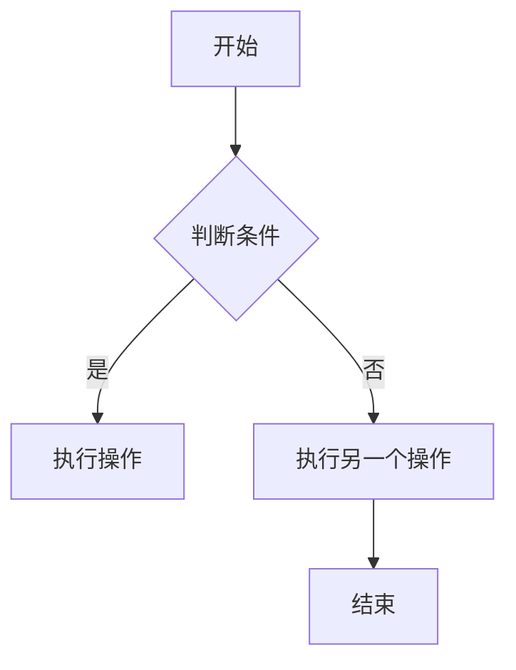

                 

### 引言

在现代企业运营中，领导力与危机预防是两个至关重要的主题。领导力不仅关乎企业的发展方向和策略制定，更直接影响到企业的适应能力和生存能力。而危机预防则是在危机尚未发生之前，采取一系列措施来减少其影响，为企业的发展保驾护航。本文将以《领导力与危机预防：未雨绸缪的管理智慧》为主题，深入探讨这两大主题的相互关系及其在企业管理中的应用。

### 关键词

- **领导力**：指领导者在管理过程中所展现出的能力与素质，包括决策能力、沟通能力、团队建设能力等。
- **危机预防**：指在危机发生前采取的一系列措施，以减少危机对企业的影响。
- **管理智慧**：指在管理实践中所表现出的洞察力、创新思维和解决问题的能力。
- **企业生存与发展**：企业如何在复杂多变的市场环境中保持竞争力，实现可持续发展。

### 摘要

本文旨在通过系统的理论分析和实际案例，探讨领导力与危机预防在企业管理中的重要性。文章首先介绍了领导力的核心要素和危机预防的理论基础，随后分析了领导力在危机中的表现，并通过具体案例研究最佳实践。最后，文章提出了危机预防的智慧管理策略，并展望了未来领导力与危机管理的发展趋势。通过本文的阅读，读者将能够深入理解领导力与危机预防的内在联系，并在实际工作中运用这些管理智慧，提升企业的整体管理水平和应对能力。

### 情境设定与目标

假设您是一位大型跨国公司的首席技术官（CTO），负责公司的技术战略规划、技术创新和项目管理。公司在近年来经历了快速成长，业务范围不断扩大，市场竞争日益激烈。您意识到，在这样的环境中，仅有优秀的技术能力还不足以保证公司的成功。领导力和危机预防同样至关重要。因此，您希望通过深入研究领导力与危机预防的理论和实践，提升自身的管理能力，为公司的长期发展提供强有力的支持。

### 目录大纲

以下是本文的目录大纲：

## 第1章 引言
### 1.1 领导力的核心要素
### 1.2 危机的本质与预防
### 1.3 管理智慧在危机管理中的应用

## 第2章 领导力理论基础
### 2.1 领导力的定义与类型
### 2.2 领导力的发展历程
### 2.3 领导力与组织文化

## 第3章 危机预防的理论与实践
### 3.1 危机的识别与评估
### 3.2 危机管理的流程
### 3.3 危机预防策略

## 第4章 领导力在危机中的表现
### 4.1 决策能力在危机管理中的关键作用
### 4.2 领导者的情绪管理与应对策略
### 4.3 团队协作与沟通在危机中的重要性

## 第5章 案例研究：领导力与危机预防的最佳实践
### 5.1 案例一：金融危机中的企业自救
### 5.2 案例二：自然灾害下的社区重建
### 5.3 案例三：健康危机中的医疗体系建设

## 第6章 危机预防的智慧管理
### 6.1 数据分析与预测
### 6.2 风险管理与控制
### 6.3 创新思维与危机应对

## 第7章 未来领导力与危机管理的前景
### 7.1 数字化技术在危机预防中的应用
### 7.2 新兴技术与领导力的融合
### 7.3 未来领导力的发展趋势

## 第8章 结论与展望
### 8.1 全书回顾
### 8.2 领导力与危机预防的持续实践
### 8.3 未来研究的方向

### 概述

在当今复杂多变的市场环境中，企业面临的挑战越来越多，危机预防已成为企业管理的重要组成部分。本文将从领导力和危机预防的角度出发，探讨如何在企业管理中应用这些管理智慧，以实现企业的可持续发展。

### 第1章 引言

#### 1.1 领导力的核心要素

领导力是领导者在其职责范围内，通过激励、引导和影响团队成员，实现组织目标的能力。领导力的核心要素包括：

1. **决策能力**：领导者需要具备快速决策的能力，特别是在面对危机时，能够迅速做出正确的决策，以减少危机带来的负面影响。
2. **沟通能力**：领导者需要能够清晰、准确地传达信息，确保团队成员理解并执行领导者的意图。
3. **团队建设能力**：领导者需要能够建立一支高效、协作的团队，激发团队成员的潜力，实现共同的目标。

#### 1.2 危机的本质与预防

危机是指可能对组织造成严重负面影响的事件或情况。危机的本质是突发性和不确定性，这使得危机预防变得尤为重要。危机预防主要包括以下两个方面：

1. **识别与评估**：通过建立有效的预警机制，及时发现潜在的危机，并对危机的影响进行评估。
2. **制定与执行**：根据评估结果，制定相应的危机应对策略，并确保其能够得到有效执行。

#### 1.3 管理智慧在危机管理中的应用

管理智慧是指管理者在管理实践中所表现出的洞察力、创新思维和解决问题的能力。在危机管理中，管理智慧的应用至关重要：

1. **灵活应变**：在危机发生时，管理者需要具备灵活应变的能力，迅速调整策略，以应对突发事件。
2. **决策智慧**：管理者需要根据实际情况做出明智的决策，平衡风险与机会，确保企业能够顺利度过危机。
3. **资源整合**：在危机管理中，管理者需要能够有效整合内部和外部资源，以支持危机应对工作。

### 第2章 领导力理论基础

#### 2.1 领导力的定义与类型

领导力是指领导者通过影响和激励团队成员，实现组织目标的能力。根据不同的分类标准，领导力可以分为多种类型：

1. **按照领导风格分类**：
   - **民主型领导**：领导者鼓励团队成员参与决策，注重团队意见。
   - **权威型领导**：领导者做出决策，并要求团队成员执行。
   - **参与型领导**：领导者与团队成员共同参与决策。

2. **按照领导功能分类**：
   - **指导性领导**：领导者为团队成员提供指导和支持。
   - **支持性领导**：领导者关心团队成员的需求，提供支持。
   - **变革型领导**：领导者推动组织变革，实现创新。

#### 2.2 领导力的发展历程

领导力理论的发展历程可以追溯到古代，但现代领导力理论主要起源于20世纪。以下是几个重要的领导力理论：

1. **X理论和Y理论**：麦格雷戈提出了X理论和Y理论，分别代表了传统的权威型领导和参与型领导。
2. **领导替代理论**：弗罗姆和杰斯里克提出了领导替代理论，认为领导力可以通过改变环境来替代。
3. **情境领导理论**：赫塞和布兰查德提出了情境领导理论，认为领导风格应根据具体情况来调整。

#### 2.3 领导力与组织文化

组织文化对领导力有着重要影响。一个积极向上的组织文化可以增强领导力，而一个消极的组织文化则会削弱领导力。以下是领导力与组织文化的几个关键点：

1. **共同价值观**：领导者需要与组织成员共享共同价值观，以建立强大的组织文化。
2. **信任与尊重**：领导者需要建立信任和尊重，以促进团队成员的合作。
3. **创新与变革**：领导者需要推动组织创新和变革，以适应不断变化的市场环境。

### 第3章 危机预防的理论与实践

#### 3.1 危机的识别与评估

危机识别是危机预防的第一步。以下是一些常见的危机识别方法：

1. **早期预警系统**：通过监测各种指标，如财务报表、市场动态等，及时发现潜在的危机。
2. **专家评估**：邀请相关领域的专家对潜在危机进行评估，以确定其严重程度。

#### 3.2 危机管理的流程

危机管理包括以下步骤：

1. **危机预警**：通过识别和评估，及时发现潜在的危机。
2. **危机响应**：制定应对策略，迅速采取行动，减轻危机的影响。
3. **危机恢复**：在危机结束后，进行总结和反思，以防止类似危机的再次发生。

#### 3.3 危机预防策略

以下是一些常见的危机预防策略：

1. **风险管理**：通过识别和评估风险，制定相应的风险控制措施。
2. **内部控制**：建立有效的内部控制机制，确保企业运营的规范性和透明度。
3. **培训与演练**：定期进行培训与演练，提高员工应对危机的能力。

### 第4章 领导力在危机中的表现

#### 4.1 决策能力在危机管理中的关键作用

在危机管理中，决策能力至关重要。以下是一些关键点：

1. **快速决策**：在危机发生时，领导者需要迅速做出决策，以减少危机的影响。
2. **理性决策**：领导者需要基于事实和数据做出理性决策，避免情绪化的决策。

#### 4.2 领导者的情绪管理与应对策略

领导者的情绪管理对于危机应对至关重要。以下是一些策略：

1. **保持冷静**：在危机发生时，领导者需要保持冷静，以做出明智的决策。
2. **有效沟通**：领导者需要与团队成员保持有效沟通，确保信息畅通。

#### 4.3 团队协作与沟通在危机中的重要性

在危机中，团队协作和沟通至关重要。以下是一些关键点：

1. **明确分工**：在危机管理中，团队成员需要明确各自的职责和任务。
2. **信息共享**：领导者需要确保团队成员之间能够及时、准确地共享信息。

### 第5章 案例研究：领导力与危机预防的最佳实践

#### 5.1 案例一：金融危机中的企业自救

在2008年金融危机中，许多企业面临着巨大的压力。以某知名互联网公司为例，该公司通过以下措施实现了自救：

1. **调整战略**：公司迅速调整战略，将重心转移到高增长的市场上。
2. **成本控制**：公司实施严格的成本控制措施，减少不必要的开支。
3. **创新产品**：公司加大创新力度，推出了一系列新产品，赢得了市场。

#### 5.2 案例二：自然灾害下的社区重建

在自然灾害中，社区重建是一项艰巨的任务。以某地震灾区的社区为例，以下措施帮助了社区的重建：

1. **组织协调**：社区领导组织协调各方资源，确保重建工作的顺利进行。
2. **民众参与**：社区鼓励民众积极参与重建工作，增强了社区的凝聚力。
3. **重建规划**：社区制定了详细的重建规划，确保重建工作有序进行。

#### 5.3 案例三：健康危机中的医疗体系建设

在健康危机中，医疗体系建设至关重要。以某国家的医疗体系建设为例，以下措施有助于提升医疗体系的应对能力：

1. **投入资金**：政府加大了对医疗体系的资金投入，提升了医疗资源的供给。
2. **政策支持**：政府制定了相关政策，鼓励医疗机构的创新和发展。
3. **信息化建设**：医疗机构加强了信息化建设，提升了医疗服务的效率和质量。

### 第6章 危机预防的智慧管理

#### 6.1 数据分析与预测

数据分析是危机预防的重要手段。以下是一些关键点：

1. **大数据分析**：通过大数据分析，可以识别出潜在的风险和趋势。
2. **预测模型**：建立预测模型，可以提前预警可能发生的危机。

#### 6.2 风险管理与控制

风险管理与控制是危机预防的核心。以下是一些关键点：

1. **风险识别**：通过风险评估，识别出潜在的风险。
2. **风险控制**：制定相应的风险控制措施，降低风险发生的概率。

#### 6.3 创新思维与危机应对

创新思维是危机应对的重要策略。以下是一些关键点：

1. **创新方法**：鼓励员工提出创新的解决方案，以应对危机。
2. **敏捷响应**：在危机发生时，能够迅速调整策略，以应对变化。

### 第7章 未来领导力与危机管理的前景

#### 7.1 数字化技术在危机预防中的应用

随着数字化技术的发展，危机预防手段越来越多样化。以下是一些关键点：

1. **物联网**：通过物联网技术，可以实时监控各种风险因素。
2. **人工智能**：通过人工智能技术，可以自动化危机预测和响应。

#### 7.2 新兴技术与领导力的融合

新兴技术与领导力的融合将带来新的管理方式。以下是一些关键点：

1. **数字化转型**：领导者需要具备数字化转型的能力，以应对新的挑战。
2. **数据驱动的决策**：领导者需要利用数据，做出更加明智的决策。

#### 7.3 未来领导力的发展趋势

未来领导力将更加注重以下几个方面：

1. **全球化视野**：领导者需要具备全球化的视野，以应对全球化的挑战。
2. **可持续发展**：领导者需要关注企业的可持续发展，以实现长期成功。

### 第8章 结论与展望

#### 8.1 全书回顾

本文从领导力与危机预防的角度，探讨了它们在企业管理中的重要性，分析了领导力的核心要素、危机预防的理论与实践，以及它们在危机中的具体表现。同时，通过案例研究和未来展望，提出了危机预防的智慧管理策略。

#### 8.2 领导力与危机预防的持续实践

领导力与危机预防不是一蹴而就的，而是一个持续实践的过程。领导者需要不断学习和改进，以应对不断变化的市场环境。

#### 8.3 未来研究的方向

未来研究可以进一步探讨领导力与危机预防在不同领域的应用，如金融、医疗、教育等。同时，可以研究如何利用新兴技术提升危机预防的效率和效果。

### 结论

领导力与危机预防是企业管理中不可或缺的两个方面。通过本文的探讨，我们深入理解了它们的核心要素、理论实践以及未来趋势。希望本文能为读者提供有益的启示，帮助他们在实际工作中提升管理能力，实现企业的可持续发展。

### 作者信息

作者：AI天才研究院/AI Genius Institute & 禅与计算机程序设计艺术 /Zen And The Art of Computer Programming

在撰写技术博客时，逻辑清晰、结构紧凑、简单易懂是至关重要的。以下是一些详细的撰写步骤和建议，帮助您打造一篇高质量的技术博客文章：

#### 1. 定义目标与读者群体

在开始撰写之前，明确您的目标读者群体和文章的目的。这将帮助您确定文章的主题、内容和语言风格。例如，如果您面向的是技术专业人士，文章可能需要更深入的讨论和复杂的例子；如果面向初学者，则应注重简洁明了的解释。

#### 2. 创建结构化的大纲

一个良好的大纲是构建文章框架的基础。它应包括：

- **引言**：介绍主题，提出问题或背景。
- **核心概念与原理**：详细解释关键概念和理论。
- **算法或实现**：描述算法的工作原理，可能包括流程图或源代码。
- **案例研究或应用实例**：通过实际案例说明如何应用理论知识。
- **最佳实践与注意事项**：提供具体建议和提示。
- **结论与展望**：总结文章，提出未来研究方向或建议。
- **参考文献**：列出引用的文献和资源。

#### 3. 使用清晰的标题和章节

确保每个章节的标题简洁明了，能够准确传达该章节的主要内容。这有助于读者快速浏览和理解文章结构。

#### 4. 使用Mermaid绘制流程图

在解释算法或系统架构时，使用Mermaid语言绘制流程图或类图。Mermaid是一种方便的Markdown扩展，可以轻松创建流程图、UML类图等。以下是几个示例：



#### 5. 使用Python代码示例

在解释算法或系统实现时，提供实际代码示例。使用Python等易于理解的编程语言，并确保代码注释清晰。以下是Python代码示例：

```python
def calculate_average(numbers):
    """计算数字的平均值"""
    if len(numbers) == 0:
        return 0
    return sum(numbers) / len(numbers)

numbers = [1, 2, 3, 4, 5]
average = calculate_average(numbers)
print(f"平均值：{average}")
```

#### 6. 使用LaTeX格式数学公式

在讨论数学模型或公式时，使用LaTeX格式进行展示。LaTeX可以确保公式的格式正确且易于阅读。以下是几个示例：

```markdown
$$
f(x) = \int_{0}^{1} x e^{-x} \, dx
$$

$x < 2$
```

#### 7. 提供详细的分析和解释

在每个段落中，详细解释您所讨论的概念或算法。使用具体的例子和图表来支持您的观点。确保内容连贯，逻辑清晰。

#### 8. 避免使用复杂的术语

尽量使用简单、易懂的语言，避免使用过多的专业术语。如果必须使用，确保提供清晰的解释。

#### 9. 编写结论和总结

在文章的结尾，总结主要观点，并提供结论。这可以帮助读者回顾文章的主要内容，并理解您的结论和建议。

#### 10. 修订和编辑

在完成初稿后，仔细修订和编辑文章。检查语法错误、逻辑连贯性，并确保文章内容完整、准确。可以请同事或同行进行审阅，以获取反馈和建议。

通过遵循这些步骤和建议，您可以撰写一篇逻辑清晰、结构紧凑、简单易懂的技术博客文章，吸引读者并传达您的专业知识和见解。

