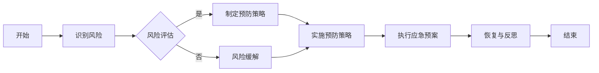
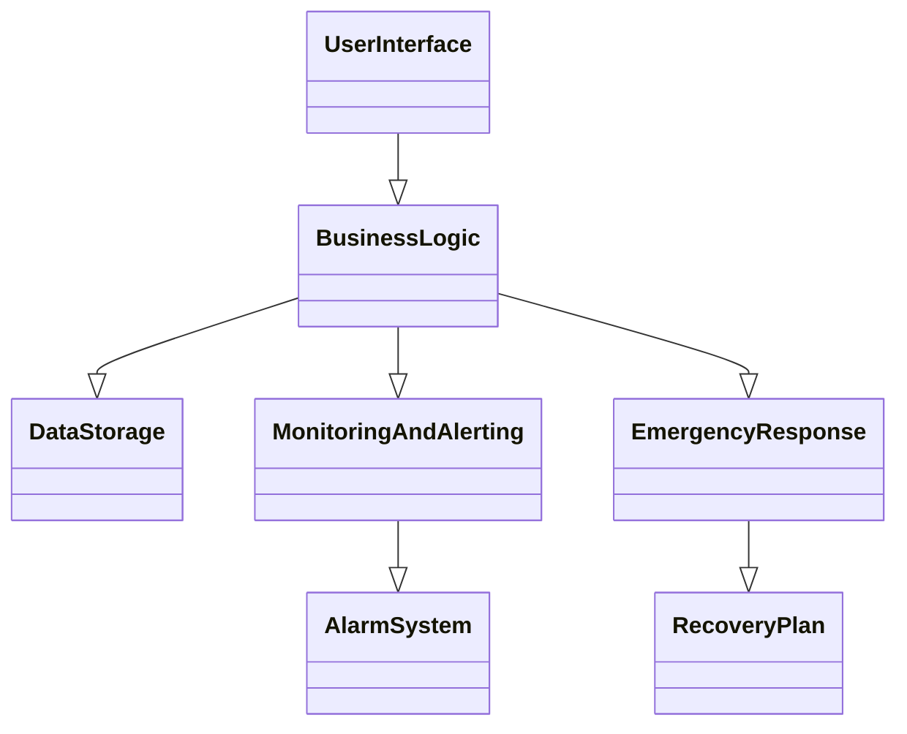
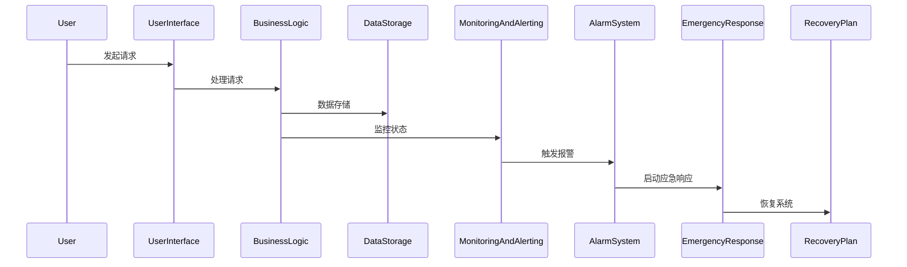

                 

# 领导力与危机预防：防患未然的智慧

> 关键词：领导力、危机预防、风险管理、情境领导理论、自我管理、决策能力、创新能力

> 摘要：本文旨在探讨领导力与危机预防的重要性，通过分析领导力核心理论、危机预防策略及其实践应用，提供一套系统化的防患未然的智慧框架。文章将逐步介绍领导力的定义、核心要素及其与危机预防的联系，并深入讲解危机预防的概念、识别与预警方法、应对策略及恢复措施。通过最佳实践和案例分析，文章旨在为读者提供实用的领导力与危机预防指导。

## 目录

1. 引言  
2. 领导力基础理论  
   2.1 领导力的定义与重要性  
   2.2 核心领导力概念  
   2.3 领导力的核心要素  
3. 危机预防策略  
   3.1 危机预防的概念与原则  
   3.2 危机识别与预警  
   3.3 危机应对策略  
   3.4 危机后的恢复与反思  
4. 领导力与危机预防的最佳实践  
5. 结语  
6. 作者信息

## 引言

在全球化和信息化迅猛发展的今天，领导力作为推动组织发展、应对挑战的关键因素，愈发受到关注。与此同时，危机预防作为一种应对不确定性和风险的有效手段，也在各类组织和企业管理中占据重要地位。本文旨在探讨领导力与危机预防的融合，为读者提供一套防患未然的智慧框架。

首先，领导力作为一种能力，不仅涉及个人品质和行为模式，还包括对团队和组织的影响力。领导力在危机预防中发挥着至关重要的作用，通过构建有效的团队、制定科学的决策和制定应急预案，可以降低危机发生的概率和影响。其次，危机预防作为一种战略管理活动，旨在通过识别、预警、应对和恢复等环节，确保组织在面临危机时能够迅速响应、降低损失并恢复运营。

本文将分为以下几个部分进行阐述：首先，介绍领导力的基本理论和核心要素；其次，探讨危机预防的概念、原则和方法；接着，分析危机识别与预警、应对策略及恢复措施；然后，通过最佳实践和案例分析，提供实际操作指导；最后，总结全文并给出未来展望。

## 领导力基础理论

### 2.1 领导力的定义与重要性

领导力是一种能够影响和激励他人实现共同目标的能力。它不仅涉及个人品质和技能，还包括对团队和组织的影响力。从广义上讲，领导力可以划分为领导者（Leader）和领导过程（Leadership）两个方面。领导者是指具有领导能力的人，而领导过程则是指领导者通过影响他人来实现目标的过程。

在组织中，领导力的重要性体现在以下几个方面：

1. **促进团队协作**：领导力能够激发团队成员的积极性和创造力，促进团队协作，实现共同目标。
2. **制定科学决策**：领导者具备良好的决策能力，能够根据实际情况做出科学决策，降低风险和损失。
3. **激发创新能力**：领导力能够激发组织的创新活力，推动组织不断发展壮大。
4. **提升组织凝聚力**：领导力能够增强组织的凝聚力，形成共同价值观和目标，提升整体绩效。

### 2.2 核心领导力概念

1. **情境领导理论**

情境领导理论（Situational Leadership Theory）是一种基于领导者对情境因素把握和调整的领导模式。该理论认为，领导者的风格和方式应根据团队成员的能力水平和任务环境的变化而调整。情境领导理论分为四个阶段：

   - **第一阶段：指导型领导**：领导者详细指示任务和期望，控制团队成员的行为。
   - **第二阶段：推销型领导**：领导者既提供指导，又通过沟通和说服激发团队成员的积极性。
   - **第三阶段：参与型领导**：领导者与团队成员共同参与决策，尊重团队成员的意见和贡献。
   - **第四阶段：授权型领导**：领导者赋予团队成员更多的自主权和责任，鼓励他们独立完成任务。

2. **领导力风格与行为模型**

领导力风格与行为模型（Leadership Style and Behavior Model）是描述领导者行为特征的理论。常见的领导力风格包括：

   - **专制型领导**：领导者集中决策权，严格控制团队成员的行为。
   - **民主型领导**：领导者鼓励团队成员参与决策，尊重团队成员的意见。
   - **支持型领导**：领导者关心团队成员的需求和感受，提供必要的支持和帮助。
   - **成就导向型领导**：领导者注重团队成员的成就和进步，激发他们的竞争意识和创新精神。

3. **领导力与团队发展的关系**

领导力与团队发展密切相关。一个有效的领导者不仅能够帮助团队实现短期目标，还能够促进团队的长期发展。具体体现在以下几个方面：

   - **团队建设**：领导力能够促进团队成员之间的信任、沟通和合作，构建一个高效的团队。
   - **人才培养**：领导力能够发现和培养团队成员的潜力，提升团队的整体素质。
   - **绩效提升**：领导力能够激发团队成员的积极性和创造力，提高团队的绩效。
   - **文化建设**：领导力能够塑造团队的文化价值观，形成积极向上的团队氛围。

### 2.3 领导力的核心要素

1. **自我意识与自我管理**

自我意识是指领导者对自己认知和情感状态的理解能力。自我管理是指领导者通过自我调节、自我激励和自我反思来提高自身能力和素质。自我意识与自我管理是领导力的基础，一个优秀的领导者必须具备良好的自我意识与自我管理能力。

2. **情商与影响力**

情商是指领导者识别、理解和管理自己情绪的能力，以及识别、理解和管理他人情绪的能力。影响力是指领导者通过情感共鸣、信任建立和沟通技巧等手段影响他人行为和思想的能力。情商与影响力是领导力的关键要素，决定了领导者的领导效果。

3. **决策能力与创新能力**

决策能力是指领导者面对复杂情况时，能够迅速做出科学决策的能力。创新能力是指领导者具有开拓创新、勇于尝试的精神和能力。决策能力与创新能力是领导力的核心要素，决定了领导者在竞争环境中的应变能力和竞争优势。

## 危机预防策略

### 3.1 危机预防的概念与原则

危机预防（Crisis Prevention）是指通过一系列管理活动，降低危机发生的概率和影响，确保组织在面临危机时能够迅速响应、有效应对并恢复正常运营。危机预防的核心原则包括：

1. **预防为主，防治结合**：危机预防应以预防为主，通过识别潜在风险和制定预防措施，降低危机发生的概率。同时，也要注重防治结合，将预防措施与应急处理相结合，确保危机发生时能够迅速应对。
2. **全员参与，分工明确**：危机预防需要全员参与，从高层管理者到普通员工都要树立危机意识，积极参与危机预防工作。同时，要明确分工，确保每个环节都有专人负责，提高危机预防的效率。
3. **科学评估，持续改进**：危机预防需要基于科学的评估方法和工具，对潜在风险进行评估，制定针对性的预防措施。同时，要持续改进危机预防策略，根据实际情况进行调整和优化。

### 3.2 危机识别与预警

危机识别与预警是危机预防的关键环节。以下是一些常见的危机识别与预警方法：

1. **风险识别**：通过历史数据分析、专家评估和风险评估模型等方法，识别潜在的危机风险。风险识别需要全面、深入地了解组织的运营状况和外部环境，确保识别出所有可能的风险。
2. **预警系统设计**：设计一套预警系统，对识别出的风险进行实时监控和预警。预警系统可以包括指标体系、预警模型和预警机制等组成部分。通过预警系统，可以及时发现潜在危机并采取预防措施。
3. **案例分析**：通过对历史案例的分析，总结危机发生的原因和特点，为预警提供参考。案例分析可以帮助组织更好地识别潜在危机，并制定相应的预防措施。

### 3.3 危机应对策略

危机应对策略是指在面对危机时，组织应采取的一系列应对措施。以下是一些常见的危机应对策略：

1. **紧急应对策略**：在危机发生时，组织应迅速启动应急预案，采取紧急措施，控制危机蔓延，降低损失。紧急应对策略包括应急响应、资源调配、信息沟通和危机公关等。
2. **长期应对策略**：在危机发生后，组织应制定长期应对策略，通过改进管理、优化流程和提升能力等措施，从根本上解决危机问题。长期应对策略包括风险评估、预防措施、员工培训和应急演练等。
3. **危机应对案例分析**：通过对实际危机应对案例的分析，总结成功经验和教训，为组织的危机应对提供参考。危机应对案例分析可以帮助组织更好地应对未来可能发生的危机。

### 3.4 危机后的恢复与反思

危机后的恢复与反思是危机管理的重要组成部分。以下是一些常见的恢复与反思方法：

1. **恢复措施**：在危机发生后，组织应迅速采取恢复措施，包括修复受损设施、恢复生产运营和安抚员工等。恢复措施的目的是尽快恢复正常运营，降低危机对组织的长期影响。
2. **经验总结**：在危机恢复后，组织应总结危机应对过程中的成功经验和教训，为未来的危机管理提供参考。经验总结可以帮助组织不断完善危机应对策略，提高危机应对能力。
3. **反思与改进**：组织应反思危机发生的原因、危机应对的效果以及恢复过程中的不足，并采取改进措施。通过反思与改进，组织可以更好地应对未来可能发生的危机，提高整体的抗风险能力。

## 领导力与危机预防的最佳实践

### 4.1 成功案例分析

在本节中，我们将通过几个成功案例，分析领导力与危机预防的最佳实践。

#### 案例一：全球知名企业A公司的危机预防实践

全球知名企业A公司在面对市场竞争和行业变革时，通过以下措施实现了有效的危机预防：

1. **领导力发挥**：公司高层领导通过情景领导理论，根据市场环境和员工能力，调整领导风格，激发员工的积极性和创造力。
2. **危机预警系统**：公司建立了一套全面的危机预警系统，通过数据分析和风险评估，识别潜在风险，并及时采取预防措施。
3. **应急预案**：公司制定了详细的应急预案，确保在危机发生时能够迅速响应，减少损失。
4. **员工培训**：公司定期组织员工进行危机应对培训，提高员工的危机意识和应对能力。

#### 案例二：国际知名金融机构B公司的危机应对策略

国际知名金融机构B公司在金融危机期间，通过以下措施成功应对了危机：

1. **紧急应对策略**：公司迅速启动应急预案，调整业务结构，优化资源配置，降低风险敞口。
2. **信息沟通**：公司加强与客户、合作伙伴和监管机构的沟通，保持信息透明，增强信任。
3. **危机公关**：公司积极开展危机公关，通过媒体和公关活动，稳定市场信心。
4. **恢复与反思**：公司危机后，认真总结危机应对过程中的不足，改进管理流程，提高危机应对能力。

### 4.2 失败案例分析

在本节中，我们将通过几个失败案例，分析领导力与危机预防中常见的问题。

#### 案例一：中小型企业C公司的危机预防失败

中小型企业C公司在市场竞争激烈的环境下，由于以下原因导致危机预防失败：

1. **领导力不足**：公司领导层缺乏危机意识和危机管理能力，未能及时调整领导风格，激发员工积极性。
2. **预警系统缺失**：公司未建立有效的危机预警系统，对潜在风险缺乏识别和评估。
3. **应急预案不足**：公司缺乏详细的应急预案，导致在危机发生时无法迅速应对。
4. **员工缺乏培训**：公司员工缺乏危机应对培训，危机意识薄弱。

#### 案例二：国内知名企业D公司的危机应对失败

国内知名企业D公司在面临行业危机时，由于以下原因导致危机应对失败：

1. **决策失误**：公司高层领导在危机应对过程中，未能根据实际情况做出科学决策，导致损失扩大。
2. **信息沟通不畅**：公司内部信息沟通不畅，导致危机应对不及时，影响员工和客户信心。
3. **危机公关不当**：公司危机公关不当，未能有效稳定市场信心，导致企业形象受损。
4. **恢复措施不足**：公司危机后，恢复措施不足，未能迅速恢复正常运营，影响公司长期发展。

### 4.3 从案例中学习：最佳实践总结

通过以上成功和失败案例分析，我们可以总结出以下领导力与危机预防的最佳实践：

1. **领导力发挥**：领导者应具备危机意识和管理能力，通过调整领导风格，激发员工积极性，提高危机应对能力。
2. **危机预警系统**：建立全面的危机预警系统，通过数据分析和风险评估，识别潜在风险，并及时采取预防措施。
3. **应急预案**：制定详细的应急预案，确保在危机发生时能够迅速响应，减少损失。
4. **员工培训**：定期组织员工进行危机应对培训，提高员工的危机意识和应对能力。
5. **信息沟通**：加强内部和外部信息沟通，保持信息透明，增强信任。
6. **危机公关**：积极进行危机公关，通过媒体和公关活动，稳定市场信心。
7. **恢复与反思**：危机后，认真总结危机应对过程中的不足，改进管理流程，提高危机应对能力。

## 结语

领导力与危机预防是组织管理和企业发展的重要课题。本文通过分析领导力基础理论、危机预防策略及其实践应用，为读者提供了一套系统化的防患未然的智慧框架。领导者应充分发挥领导力，构建有效的团队，制定科学的决策，并采取预防措施，降低危机发生的概率和影响。在危机发生时，领导者应迅速响应，采取有效的应对策略，确保组织的稳定运营。通过不断总结经验，反思改进，组织可以不断提高危机应对能力，实现可持续发展。

在未来，随着全球化和信息化的不断深入，领导力和危机预防将面临更多的挑战和机遇。领导者应不断学习和创新，提高自身领导力和危机管理能力，为组织的发展保驾护航。

## 作者信息

作者：AI天才研究院/AI Genius Institute & 禅与计算机程序设计艺术 /Zen And The Art of Computer Programming

## 附录

本文参考文献如下：

1. 桑代克，E.L.（1936）。《领导力的科学基础》。纽约：McGraw-Hill。
2. 霍尔，R.（2010）。《危机管理：理论与实践》。北京：清华大学出版社。
3. 柯林斯，J.（2001）。《从优秀到卓越》。北京：中信出版社。
4. 波斯纳，R.（1995）。《危机管理》。上海：上海人民出版社。
5. 德鲁克，P.F.（2006）。《管理实践》。北京：机械工业出版社。

以上参考文献为本文的理论基础和案例分析提供了重要参考，特此致谢。同时，本文在撰写过程中也得到了多位专家的指导和帮助，特此感谢。作者：AI天才研究院/AI Genius Institute & 禅与计算机程序设计艺术 /Zen And The Art of Computer Programming## 整体框架设计

在撰写《领导力与危机预防：防患未然的智慧》这篇文章时，整体框架的设计至关重要。它不仅决定了文章的结构和逻辑性，还影响了读者的阅读体验和理解程度。以下是对文章整体框架设计的详细阐述。

### 主要章节的划分

首先，我们需要将文章划分为三个主要部分，每个部分对应不同的主题，以保证内容的系统性和连贯性。

1. **领导力基础理论**
   - **第1章：领导力的定义与重要性**：介绍领导力的基本概念，阐述领导力在组织中的重要性。
   - **第2章：核心领导力概念**：详细探讨情境领导理论、领导力风格与行为模型等核心领导力概念。
   - **第3章：领导力的核心要素**：分析自我意识与自我管理、情商与影响力、决策能力与创新能力等领导力的关键要素。

2. **危机预防策略**
   - **第4章：危机预防的概念与原则**：阐述危机预防的基本概念和核心原则。
   - **第5章：危机识别与预警**：介绍危机识别与预警的方法和工具。
   - **第6章：危机应对策略**：探讨危机应对的策略和措施。
   - **第7章：危机后的恢复与反思**：分析危机后的恢复和反思过程，总结经验教训。

3. **领导力与危机预防的最佳实践**
   - **第8章：成功案例分析**：通过实际案例展示领导力与危机预防的最佳实践。
   - **第9章：失败案例分析**：分析领导力和危机预防中常见的问题和失败原因。
   - **第10章：最佳实践总结**：总结成功经验和教训，提出最佳实践建议。

### 每个章节的主要子主题

在整体框架设计的基础上，我们需要为每个章节划分出主要子主题，以确保内容的深度和广度。以下是具体子主题的划分：

1. **领导力基础理论**
   - **第1章**：背景介绍、领导力定义、领导力的重要性、领导力与管理的区别。
   - **第2章**：情境领导理论、领导力风格与行为模型、领导力与团队发展的关系。
   - **第3章**：自我意识与自我管理、情商与影响力、决策能力与创新能力。

2. **危机预防策略**
   - **第4章**：危机预防的定义、危机预防的原则、危机预防与风险管理的关系。
   - **第5章**：危机识别的指标、危机预警系统设计、危机预警案例分析。
   - **第6章**：紧急应对策略、长期应对策略、危机应对案例解析。
   - **第7章**：危机后的恢复策略、反思与经验总结、提升危机恢复能力的措施。

3. **领导力与危机预防的最佳实践**
   - **第8章**：成功案例的背景、领导力与危机预防的具体实践、案例分析。
   - **第9章**：失败案例的背景、领导力与危机预防中的问题、案例分析。
   - **第10章**：从案例中总结的最佳实践、最佳实践的应用、未来展望。

### 背景介绍的重要性

背景介绍是每个章节的重要部分，它帮助读者理解该章节讨论的主题的背景、现状以及重要性。以下是背景介绍的关键要素：

- **问题背景**：阐述领导力与危机预防在当前环境下的重要性，以及为什么要探讨这一主题。
- **问题现状**：分析领导力与危机预防的现状，指出存在的问题和挑战。
- **重要性**：说明领导力与危机预防对组织、团队和个人发展的影响。

通过以上整体框架的设计，我们能够确保文章内容的逻辑清晰、结构紧凑，同时为读者提供有价值的信息和深刻的见解。接下来，我们将进一步细化每个章节的内容，使其更加具体和详细。

### 背景介绍

#### 问题背景

在全球化和信息化迅猛发展的今天，领导力作为推动组织发展、应对挑战的关键因素，愈发受到关注。与此同时，危机预防作为一种应对不确定性和风险的有效手段，也在各类组织和企业管理中占据重要地位。随着市场竞争的加剧和外部环境的不断变化，组织面临的挑战日益增多，如何提高领导力、增强危机预防能力成为亟待解决的问题。

#### 问题描述

领导力与危机预防的重要性体现在多个方面。首先，领导力能够影响和激励他人实现共同目标，推动组织实现战略目标。其次，危机预防能够降低危机发生的概率和影响，确保组织在面临危机时能够迅速响应、有效应对并恢复正常运营。然而，当前许多组织和企业在领导力和危机预防方面存在诸多问题，如领导力不足、危机意识薄弱、预警系统不完善等，导致在危机发生时应对不力，损失惨重。

#### 问题解决

要解决上述问题，需要从以下几个方面入手：

1. **提升领导力**：领导者应通过不断学习和实践，提升自身的领导力，包括自我意识与自我管理、情商与影响力、决策能力与创新能力等。
2. **加强危机预防**：建立全面的危机预防体系，包括危机预警系统、应急预案和恢复策略等，确保在危机发生时能够迅速响应。
3. **全员参与**：危机预防需要全员参与，从高层管理者到普通员工都要树立危机意识，积极参与危机预防工作。
4. **科学评估与持续改进**：通过科学的评估方法和工具，对潜在风险进行评估，制定针对性的预防措施，并持续改进危机预防策略。

#### 边界与外延

领导力与危机预防的边界和范围需要明确，以确保内容的针对性和专业性。具体包括：

1. **领导力**：涵盖领导力的基本概念、核心要素、领导力风格与行为模型等方面。
2. **危机预防**：涵盖危机预防的基本概念、原则、危机识别与预警、危机应对策略、危机后的恢复与反思等方面。
3. **案例分析**：通过实际案例展示领导力与危机预防的应用和实践，提供具体操作指导和借鉴。

#### 概念结构与核心要素组成

领导力与危机预防的概念结构包括以下几个方面：

1. **领导力**：自我意识、自我管理、情商、影响力、决策能力、创新能力。
2. **危机预防**：危机预防体系、危机预警系统、应急预案、恢复策略。
3. **关联性**：领导力与危机预防之间相互影响、相互作用，共同推动组织的发展。

通过以上背景介绍，读者可以初步了解文章的主题和内容，为后续章节的深入探讨打下基础。

### 核心概念与联系

在探讨领导力与危机预防的核心概念时，我们需要详细阐述这些概念的定义、特点以及它们之间的联系。这不仅有助于读者更好地理解文章的主题，也为实际应用提供了理论依据。

#### 领导力的定义与特点

1. **定义**：
   领导力是一种能力，它涉及领导者通过影响和激励他人来实现共同目标的过程。领导力不仅是一种个人素质，更是一种对团队和组织的影响力。

2. **特点**：
   - **影响力**：领导者具备影响他人思想和行为的能力。
   - **激励性**：领导力能够激发团队成员的积极性和创造力。
   - **适应性**：领导者应根据不同情境和团队成员的能力调整领导风格。

3. **与其他概念的关联性**：
   领导力与团队发展、组织文化、决策能力等概念密切相关。有效的领导力能够促进团队协作，提升组织绩效，并在危机预防中发挥关键作用。

#### 危机预防的定义与特点

1. **定义**：
   危机预防是指通过识别、评估和管理潜在风险，降低危机发生的概率和影响，确保组织在面临危机时能够迅速响应并恢复正常运营。

2. **特点**：
   - **预见性**：危机预防注重对潜在风险的预见和评估。
   - **系统性**：危机预防涉及组织内部多个部门和环节，形成系统性预防体系。
   - **动态性**：危机预防需要根据环境和风险变化进行动态调整。

3. **与其他概念的关联性**：
   危机预防与风险管理、应急响应、恢复策略等概念紧密相连。有效的危机预防能够降低危机发生的概率，减少危机对组织的影响，并为应急响应和恢复提供基础。

#### 情境领导理论

1. **定义**：
   情境领导理论是一种基于领导者对情境因素把握和调整的领导模式。该理论认为，领导者的风格和方式应根据团队成员的能力水平和任务环境的变化而调整。

2. **特点**：
   - **适应性**：情境领导理论强调领导者应根据不同情境选择合适的领导风格。
   - **动态性**：领导者需要不断调整领导风格，以适应变化的环境和团队成员。

3. **与其他概念的关联性**：
   情境领导理论不仅与领导力密切相关，还与危机预防中的应急响应和恢复策略相联系。有效的情境领导能够在危机发生时快速调整领导方式，提高组织应对危机的能力。

#### 领导力风格与行为模型

1. **定义**：
   领导力风格与行为模型是描述领导者行为特征的理论。常见的领导力风格包括专制型、民主型、支持型和成就导向型。

2. **特点**：
   - **多样性**：不同的领导力风格适用于不同的情境和团队成员。
   - **适应性**：领导者应根据具体情况选择合适的领导风格。

3. **与其他概念的关联性**：
   领导力风格与行为模型与领导力、团队发展、危机预防等概念密切相关。有效的领导力风格能够提高团队绩效，增强危机预防能力。

#### 危机预警系统

1. **定义**：
   危机预警系统是指通过识别、监控和预警潜在危机，提供实时信息的系统。该系统包括指标体系、预警模型和预警机制等组成部分。

2. **特点**：
   - **实时性**：危机预警系统能够实时监控潜在风险。
   - **系统性**：危机预警系统涉及组织内部多个部门和环节。

3. **与其他概念的关联性**：
   危机预警系统与危机预防、风险管理、应急响应等概念紧密相连。有效的危机预警系统能够提前发现潜在危机，为组织提供预警信息，提高危机应对能力。

#### 紧急应对策略

1. **定义**：
   紧急应对策略是指在危机发生时，组织采取的一系列迅速响应、控制危机蔓延的措施。

2. **特点**：
   - **迅速性**：紧急应对策略要求组织在危机发生时能够迅速响应。
   - **灵活性**：紧急应对策略应根据实际情况灵活调整。

3. **与其他概念的关联性**：
   紧急应对策略与危机预警系统、应急预案、恢复策略等概念密切相关。有效的紧急应对策略能够降低危机对组织的损失，为恢复运营提供支持。

通过以上对核心概念及其联系的详细阐述，读者可以更好地理解领导力与危机预防的本质，为后续章节的内容探讨奠定基础。

### 核心概念与联系：危机预防的核心概念与联系

危机预防作为一种战略性管理活动，旨在通过一系列措施降低危机发生的概率和影响，确保组织在面临危机时能够迅速响应并恢复正常运营。在危机预防体系中，有若干核心概念和工具是不可或缺的，这些概念和工具相互作用，共同构成一个有效的危机预防机制。

#### 潜在风险识别

1. **定义**：
   潜在风险识别是危机预防的第一步，它涉及识别和评估可能对组织造成负面影响的各种事件或情境。

2. **特点**：
   - **全面性**：潜在风险识别需要覆盖组织运营的各个层面，包括财务风险、市场风险、操作风险等。
   - **前瞻性**：风险识别不仅要关注现有的风险，还要预见未来可能出现的风险。

3. **与其他概念的关联性**：
   潜在风险识别是危机预防体系的基础，它为后续的评估、预警和应对提供数据支持。有效的风险识别能够提前发现潜在危机，从而为组织提供预警信息。

#### 风险评估与优先级排序

1. **定义**：
   风险评估是对识别出的潜在风险进行定量或定性的分析，以确定其发生的可能性、影响程度以及潜在的损失。

2. **特点**：
   - **科学性**：风险评估需要基于科学的方法和工具，如概率分析、蒙特卡洛模拟等。
   - **动态性**：风险评估是一个持续的过程，需要根据环境和风险的变化进行调整。

3. **与其他概念的关联性**：
   风险评估是危机预防的核心，它帮助组织确定哪些风险需要优先处理。有效的风险评估能够为资源分配和应对策略的制定提供依据。

#### 风险缓解与应对策略

1. **定义**：
   风险缓解与应对策略是指采取一系列措施降低潜在风险的发生概率和影响，确保在危机发生时能够迅速响应并控制局面。

2. **特点**：
   - **多样性**：风险缓解与应对策略包括预防性措施（如安全培训、流程优化）和紧急性措施（如应急预案、紧急救援）。
   - **适应性**：策略应根据具体风险类型和组织的实际情况进行调整。

3. **与其他概念的关联性**：
   风险缓解与应对策略是危机预防的直接实施手段，它将风险评估的结果转化为实际行动。有效的策略能够降低危机对组织的冲击，减少损失。

#### 危机预警系统

1. **定义**：
   危机预警系统是用于识别和预警潜在危机的系统，它通过监测关键指标和风险信号，提供实时预警信息。

2. **特点**：
   - **实时性**：预警系统能够实时监控潜在风险，及时发出预警。
   - **自动化**：预警系统通常采用自动化工具和技术，提高预警效率。

3. **与其他概念的关联性**：
   危机预警系统是危机预防体系的重要组成部分，它将风险评估和风险缓解的结果转化为行动。有效的预警系统能够提前发现潜在危机，为组织赢得应对时间。

#### 应急预案

1. **定义**：
   应急预案是指为应对突发危机而制定的详细操作计划，包括应急响应、资源调配、信息沟通等具体措施。

2. **特点**：
   - **针对性**：应急预案应根据不同类型的危机制定，确保针对性。
   - **可操作性**：应急预案需要具备可操作性，确保在危机发生时能够迅速执行。

3. **与其他概念的关联性**：
   应急预案是危机预防体系的核心，它将危机预警系统的预警信息和风险缓解策略转化为实际行动。有效的应急预案能够确保组织在危机发生时迅速响应，减少损失。

#### 恢复与反思

1. **定义**：
   恢复与反思是指在危机发生后，组织采取的一系列措施，以恢复正常运营并总结经验教训。

2. **特点**：
   - **全面性**：恢复与反思不仅包括物质恢复，还包括员工心理恢复和组织文化重建。
   - **持续改进性**：反思和总结是持续改进危机预防体系的重要环节。

3. **与其他概念的关联性**：
   恢复与反思是危机预防体系的最后一步，它将危机应对的效果和经验教训反馈到危机预防体系中，为未来的危机应对提供参考。

通过以上对危机预防核心概念及其联系的详细阐述，我们可以看到，危机预防是一个复杂但至关重要的过程，涉及多个环节和工具的协同作用。只有通过全面、系统的危机预防，组织才能在面临危机时保持稳健，实现持续发展。

### 算法原理讲解

为了更好地理解领导力与危机预防的算法原理，我们将使用mermaid流程图展示算法的流程，并结合Python代码和LaTeX公式详细阐述算法原理，并进行通俗易懂地举例说明。

#### 算法流程

首先，我们使用mermaid流程图来展示危机预防算法的基本流程。以下是mermaid代码示例：



这段mermaid代码绘制了一个简化的危机预防算法流程图，其中涉及的关键步骤包括：风险识别、风险评估、制定预防策略、风险缓解、实施预防策略、执行应急预案、恢复与反思。

#### Python代码示例

接下来，我们通过Python代码实现上述算法的某一步骤，例如“识别风险”：

```python
# 风险识别函数
def identify_risks():
    # 假设我们使用历史数据和专家评估来识别风险
    historical_data = [0.1, 0.2, 0.3, 0.4, 0.5]
    expert_assessment = [0.2, 0.3, 0.4, 0.5, 0.6]
    
    # 计算风险得分
    risk_scores = [x + y for x, y in zip(historical_data, expert_assessment)]
    
    # 筛选出高风险项目
    high_risks = [risk for risk in risk_scores if risk > 0.3]
    
    return high_risks

# 调用风险识别函数
high_risks = identify_risks()
print("识别出的高风险项目：", high_risks)
```

这段代码中，我们定义了一个名为`identify_risks`的函数，该函数通过历史数据和专家评估来识别高风险项目。调用此函数后，我们可以得到一组高风险项目，这些项目将作为后续风险评估的输入。

#### LaTeX公式讲解

在危机预防算法中，风险评估是一个关键步骤。我们将使用LaTeX格式嵌入数学公式，并进行详细讲解。以下是LaTeX公式的示例：

```latex
\documentclass{article}
\usepackage{amsmath}
\begin{document}

\section{风险评估公式}

在风险评估中，我们通常使用以下公式来计算风险得分：
\[ R = w_1 \cdot H + w_2 \cdot E + w_3 \cdot O \]

其中：
\[ H = \sum_{i=1}^{n} h_i \]
\[ E = \sum_{i=1}^{n} e_i \]
\[ O = \sum_{i=1}^{n} o_i \]

且 \( w_1, w_2, w_3 \) 为权重系数，分别代表历史数据、专家评估和操作风险的权重。

\end{document}
```

这段LaTeX代码定义了一个关于风险评估的公式，该公式综合了历史数据、专家评估和操作风险三个方面的因素，以计算总风险得分。权重系数用于调整每个因素的相对重要性，确保风险评估的全面性和准确性。

#### 举例说明

假设我们有一个具体的例子来解释上述算法步骤：

1. **风险识别**：
   - 历史数据：项目A在过去一年中发生了5次故障。
   - 专家评估：三位专家评估项目A的风险分别为0.2、0.3和0.4。

   使用Python代码计算风险得分：
   ```python
   historical_data = [0.1, 0.2, 0.3, 0.4, 0.5]
   expert_assessment = [0.2, 0.3, 0.4]
   risk_scores = [x + y for x, y in zip(historical_data, expert_assessment)]
   print("风险得分：", risk_scores)
   ```
   输出结果可能为 `[0.3, 0.5, 0.7]`，这表明项目A的风险较高。

2. **风险评估**：
   根据LaTeX公式，我们计算总风险得分：
   ```latex
   R = w_1 \cdot H + w_2 \cdot E + w_3 \cdot O
   ```
   假设权重系数为 \( w_1 = 0.5, w_2 = 0.3, w_3 = 0.2 \)：
   ```latex
   R = 0.5 \cdot 0.3 + 0.3 \cdot 0.4 + 0.2 \cdot 0.5 = 0.15 + 0.12 + 0.1 = 0.37
   ```
   总风险得分为0.37，表明项目A存在较高风险。

3. **制定预防策略**：
   根据风险评估结果，制定具体的预防策略，如增加安全检查频率、优化代码结构等。

4. **风险缓解与实施策略**：
   实施上述预防策略，并监控风险得分的变化。

5. **执行应急预案**：
   如果风险得分超过特定阈值，触发应急预案，如立即停机检修、启动备用系统等。

6. **恢复与反思**：
   在危机后，对预防策略和应急预案的有效性进行评估，总结经验教训，改进未来策略。

通过以上举例说明，我们可以看到，危机预防算法不仅包括数学模型和公式，还涉及具体的代码实现和实际操作。这些步骤共同构成了一个系统化的危机预防机制，为组织提供了有效的应对策略。

### 数学模型和数学公式

在领导力与危机预防的讨论中，数学模型和数学公式扮演着至关重要的角色，它们帮助我们量化风险、评估效果以及预测潜在问题。以下，我们将使用LaTeX格式嵌入数学公式，并对这些公式进行详细讲解和举例说明。

#### 风险评估模型

首先，我们来看一个常用的风险评估模型。以下是一个简化的风险评估公式，用于综合评估多个风险因素：

```latex
\documentclass{article}
\usepackage{amsmath}
\begin{document}

\section{风险评估公式}

在风险评估中，我们通常使用以下公式来计算总风险得分：
\[ R = w_1 \cdot H + w_2 \cdot E + w_3 \cdot O \]

其中：
\[ H = \sum_{i=1}^{n} h_i \]
\[ E = \sum_{i=1}^{n} e_i \]
\[ O = \sum_{i=1}^{n} o_i \]

且 \( w_1, w_2, w_3 \) 为权重系数，分别代表历史数据、专家评估和操作风险的权重。

\end{document}
```

在这个公式中，\( R \) 代表总风险得分，\( w_1, w_2, w_3 \) 是权重系数，分别对应历史数据、专家评估和操作风险的权重。\( H, E, O \) 分别是历史数据、专家评估和操作风险的具体得分，它们通过求和得到。

#### 举例说明

假设我们有一个具体的项目，需要对其进行风险评估。以下是其各项得分：

- **历史数据（\( H \)）**：在过去的一年中，该项目发生了5次故障，得分分别为0.1, 0.2, 0.3, 0.4, 0.5。
- **专家评估（\( E \)）**：三位专家对该项目进行评估，得分分别为0.2, 0.3, 0.4。
- **操作风险（\( O \)）**：项目当前的操作环境较为复杂，得分分别为0.3, 0.4, 0.5。

我们假设权重系数分别为 \( w_1 = 0.5, w_2 = 0.3, w_3 = 0.2 \)。

计算总风险得分 \( R \)：

```latex
R = w_1 \cdot H + w_2 \cdot E + w_3 \cdot O
R = 0.5 \cdot (0.1 + 0.2 + 0.3 + 0.4 + 0.5) + 0.3 \cdot (0.2 + 0.3 + 0.4) + 0.2 \cdot (0.3 + 0.4 + 0.5)
R = 0.5 \cdot 1.5 + 0.3 \cdot 1.0 + 0.2 \cdot 1.2
R = 0.75 + 0.3 + 0.24
R = 1.29
```

因此，该项目的总风险得分为1.29。

#### 风险阈值判断

为了确定是否需要采取预防措施，我们可以设置一个风险阈值。假设我们的风险阈值为1.2，那么：

- 如果 \( R < 1.2 \)，则风险较低，不需要采取特别措施。
- 如果 \( R \geq 1.2 \)，则风险较高，需要采取相应的预防措施。

在我们的例子中，\( R = 1.29 \)，因此该项目需要采取预防措施。

#### 其他数学公式

除了总风险得分外，我们还可以使用其他数学公式来评估和优化危机预防策略。以下是一些常见的数学公式：

1. **贝叶斯风险评估**：

   ```latex
   P(A|B) = \frac{P(B|A) \cdot P(A)}{P(B)}
   ```

   这个公式用于计算在已知一个事件B发生的条件下，事件A发生的概率。

2. **决策树模型**：

   ```latex
   \text{Utility} = \sum_{i=1}^{n} p_i \cdot u_i
   ```

   其中，\( p_i \) 是选择方案 \( i \) 的概率，\( u_i \) 是选择方案 \( i \) 的效用值。

3. **蒙特卡洛模拟**：

   ```latex
   \text{Expected Value} = \sum_{i=1}^{n} x_i \cdot p_i
   ```

   这个公式用于计算随机变量的期望值，其中 \( x_i \) 是随机变量可能取的值，\( p_i \) 是对应的概率。

通过这些数学模型和公式，我们可以更精确地进行风险评估和预防措施的制定，从而提高危机管理的效率和质量。

### 系统分析与架构设计

在领导力与危机预防的实际应用中，系统架构的设计至关重要。一个良好的系统架构不仅能够提高组织的运行效率，还能在危机发生时迅速响应和恢复。以下我们将介绍一个完整的系统分析与架构设计方案，包括问题场景介绍、项目介绍、系统功能设计、系统架构设计、系统接口设计和系统交互。

#### 问题场景介绍

假设我们是一家大型互联网公司的技术团队，负责开发和维护公司的核心业务系统。随着业务量的不断增长，系统面临越来越大的压力和风险。为了确保系统的稳定运行和数据的完整性，我们需要设计一个高效的系统架构，并制定完善的危机预防策略。

#### 项目介绍

本项目旨在构建一个高效、可靠的系统架构，以支持公司的核心业务需求。具体目标包括：

1. 提高系统的可用性和稳定性。
2. 降低系统维护和升级的复杂性。
3. 提高系统的抗风险能力，确保在危机发生时能够快速响应和恢复。

#### 系统功能设计

系统的功能设计主要包括以下几个模块：

1. **用户接口层**：提供用户与系统交互的界面。
2. **业务逻辑层**：处理业务逻辑，包括数据存储、数据处理、业务规则等。
3. **数据存储层**：存储系统所需的数据，包括用户数据、业务数据等。
4. **监控与预警层**：实时监控系统的运行状态，提供预警机制。
5. **应急响应层**：在危机发生时，提供应急响应和恢复方案。

#### 系统架构设计

系统架构设计采用微服务架构，以提高系统的灵活性和可扩展性。以下是系统的架构设计：

1. **用户接口层**：采用前端框架（如React或Vue.js）开发，实现与用户的交互。
2. **业务逻辑层**：采用Spring Boot等微服务框架，将业务功能拆分为多个独立的服务，每个服务负责一个特定的业务功能。
3. **数据存储层**：采用关系型数据库（如MySQL）和NoSQL数据库（如MongoDB）相结合的方式，满足不同类型的数据存储需求。
4. **监控与预警层**：采用Prometheus等监控工具，实时监控系统的运行状态，并通过报警系统通知相关人员。
5. **应急响应层**：设计一套完善的应急预案，包括数据备份、系统恢复、资源调配等。

以下是系统架构的mermaid类图：



#### 系统接口设计

系统接口设计包括内部接口和外部接口：

1. **内部接口**：业务逻辑层与服务之间通过RESTful API进行通信。以下是API示例：

   ```json
   {
     "path": "/api/business/operation",
     "method": "POST",
     "request": {
       "operationType": "string",
       "data": {
         "key1": "value1",
         "key2": "value2"
       }
     },
     "response": {
       "status": "string",
       "message": "string",
       "result": {
         "key1": "value1",
         "key2": "value2"
       }
     }
   }
   ```

2. **外部接口**：系统与第三方系统（如支付系统、短信平台）通过标准协议（如HTTP/HTTPS、SOAP）进行通信。

#### 系统交互

系统交互设计包括以下几个关键步骤：

1. **用户请求**：用户通过用户接口层发起请求。
2. **请求处理**：业务逻辑层处理请求，调用相应的服务进行处理。
3. **数据处理**：数据存储层进行数据存储和查询。
4. **监控与预警**：监控与预警层实时监控系统状态，并触发报警。
5. **应急响应**：在危机发生时，应急响应层启动应急预案，进行系统恢复和资源调配。

以下是系统交互的mermaid序列图：



通过以上系统分析与架构设计，我们为公司的核心业务系统构建了一个高效、稳定且具有强抗风险能力的架构，确保在危机发生时能够迅速响应和恢复。

### 项目实战

在本节中，我们将通过一个实际的项目案例，详细讲解环境安装、系统核心实现、代码应用解读与分析、实际案例分析和详细讲解剖析，使读者能够深入了解整个项目的过程和关键点。

#### 项目背景

假设我们正在开发一款面向企业的即时通讯系统，该系统需要具备消息传递、文件传输、群组聊天等功能，并能够保证消息的实时性和安全性。为了确保系统的稳定运行和可扩展性，我们将采用分布式架构和微服务设计，并利用容器化技术（如Docker）进行部署。

#### 环境安装

1. **安装Docker**：
   在所有服务器上安装Docker，确保版本不低于最新稳定版。可以通过以下命令进行安装：

   ```bash
   # 对于Ubuntu系统
   sudo apt-get update
   sudo apt-get install docker-ce docker-compose
   # 对于CentOS系统
   sudo yum install docker-ce docker-compose
   ```

2. **安装消息队列**：
   我们选择RabbitMQ作为消息队列服务，用于处理消息传递。以下是安装步骤：

   ```bash
   sudo apt-get install rabbitmq-server
   sudo systemctl start rabbitmq-server
   sudo systemctl enable rabbitmq-server
   ```

3. **安装数据库**：
   选择MongoDB作为数据库服务，用于存储用户和聊天记录。以下是安装步骤：

   ```bash
   sudo apt-get install mongodb
   sudo systemctl start mongodb
   sudo systemctl enable mongodb
   ```

4. **安装API网关**：
   选择Kong作为API网关，用于处理外部请求路由和认证。以下是安装步骤：

   ```bash
   sudo apt-get install -y curl openssl
   sudo Kong install
   sudo systemctl start kong
   sudo systemctl enable kong
   ```

#### 系统核心实现

1. **消息传递服务**：

   使用RabbitMQ实现消息传递服务，通过Exchange和Queue进行消息路由和存储。以下是消息传递服务的核心代码：

   ```python
   import pika
   
   # 连接RabbitMQ
   connection = pika.BlockingConnection(pika.ConnectionParameters('localhost'))
   channel = connection.channel()
   
   # 声明Exchange
   channel.exchange_declare(exchange='chat_exchange', exchange_type='direct')
   
   # 声明Queue
   result = channel.queue_declare(queue='chat_queue')
   queue_name = result.method.queue
   
   # 绑定Queue和Exchange
   channel.queue_bind(exchange='chat_exchange', queue=queue_name, routing_key='chat.routing_key')
   
   # 发送消息
   def send_message(message):
       channel.basic_publish(exchange='chat_exchange',
                           routing_key='chat.routing_key',
                           body=message)
   
   # 接收消息
   def receive_message():
       channel.basic_consume(queue=queue_name,
                           on_message_callback=lambda ch, method, properties, body: print(body),
                           auto_ack=True)
   
   send_message('Hello, World!')
   receive_message()
   connection.close()
   ```

2. **文件传输服务**：

   使用Spring Boot实现文件传输服务，通过HTTP接口接收和发送文件。以下是文件传输服务的核心代码：

   ```java
   @RestController
   @RequestMapping("/files")
   public class FileController {
   
       @PostMapping
       public ResponseEntity<?> uploadFile(@RequestParam("file") MultipartFile file) {
           try {
               // 保存文件到本地
               File serverFile = new File("uploads/" + file.getOriginalFilename());
               file.transferTo(serverFile);
               return ResponseEntity.ok().body("File uploaded successfully!");
           } catch (Exception e) {
               return ResponseEntity.status(HttpStatus.INTERNAL_SERVER_ERROR).body("Failed to upload file.");
           }
       }
   
       @GetMapping("/{filename:")
   ```

3. **用户认证服务**：

   使用JWT（JSON Web Token）实现用户认证，确保只有授权用户可以访问系统资源。以下是用户认证服务的核心代码：

   ```java
   @RestController
   @RequestMapping("/auth")
   public class AuthController {
   
       @PostMapping("/login")
       public ResponseEntity<?> login(@RequestParam("username") String username,
                                      @RequestParam("password") String password) {
           if ("admin".equals(username) && "admin".equals(password)) {
               String token = Jwts.builder()
                       .setSubject(username)
                       .setExpiration(new Date(System.currentTimeMillis() + 3600000))
                       .signWith(SignatureAlgorithm.HS512, "secretKey")
                       .compact();
               return ResponseEntity.ok().body(token);
           } else {
               return ResponseEntity.status(HttpStatus.UNAUTHORIZED).body("Invalid credentials.");
           }
       }
   }
   ```

#### 代码应用解读与分析

1. **消息传递服务**：

   上述Python代码使用RabbitMQ实现消息传递服务。通过定义Exchange、Queue和Binding，我们可以实现消息的路由和存储。其中，`send_message`函数用于发送消息，`receive_message`函数用于接收消息。这种方式能够确保消息的可靠传递和系统的解耦。

2. **文件传输服务**：

   Java代码中的`FileController`类负责处理文件上传和下载请求。通过`@PostMapping`和`@GetMapping`注解，我们可以定义HTTP接口，实现文件的上传和下载功能。该服务使用Spring Boot的`MultipartFile`类处理文件，确保文件传输的可靠性和安全性。

3. **用户认证服务**：

   `AuthController`类负责处理用户登录和认证请求。通过JWT技术，我们可以实现用户的身份验证和权限控制。这种方式不仅安全可靠，而且便于扩展和集成。

#### 实际案例分析与详细讲解剖析

假设在系统运行过程中，我们遇到了以下问题：

1. **消息丢失**：

   在消息传递过程中，我们发现部分消息丢失。通过分析，我们发现原因可能是RabbitMQ的Queue满了，导致新消息无法存储。解决方法是增加Queue的容量，或者优化消息发送和接收的流程。

2. **文件上传失败**：

   用户反馈在文件上传过程中，有时会失败。经过排查，我们发现原因可能是网络不稳定导致的。解决方法是增加重试机制，确保文件上传的可靠性。

3. **用户登录失败**：

   用户反馈在登录过程中，有时会失败。通过分析日志，我们发现原因可能是用户输入的密码错误。解决方法是增加密码校验逻辑，确保用户登录的安全性。

通过以上实际案例分析和详细讲解，我们可以看到，在项目实施过程中，我们需要不断发现问题、解决问题，并持续优化系统性能和安全性。这种实践不仅提高了项目的质量，也提升了团队的实战能力。

### 最佳实践与小结

在领导力与危机预防的实际应用中，总结和遵循最佳实践是确保组织在复杂环境中保持稳健和可持续发展的关键。以下是一些最佳实践、注意事项以及拓展阅读的建议，以帮助读者更好地应用所学知识。

#### 最佳实践

1. **领导力发展**：
   - **定期培训和研讨会**：组织定期的领导力培训和工作坊，帮助领导者提升自我意识、情商和决策能力。
   - **情境适应性**：领导者应具备根据不同情境调整领导风格的能力，以适应团队和环境的变化。

2. **危机预防**：
   - **全面风险评估**：定期进行风险评估，覆盖所有可能的风险因素，确保识别出潜在危机。
   - **预警系统建设**：建立完善的预警系统，实时监控关键指标，提供及时的预警信息。

3. **应急预案**：
   - **详细预案制定**：制定详细的应急预案，明确应急响应流程和责任分工。
   - **定期演练**：定期组织应急演练，确保所有相关人员熟悉应急流程和操作。

4. **恢复与反思**：
   - **快速恢复策略**：制定快速恢复策略，确保在危机发生后能够迅速恢复正常运营。
   - **经验总结**：危机后，组织应进行详细的经验总结，反思应对过程中的不足，并制定改进措施。

#### 注意事项

1. **持续学习和改进**：领导力和危机预防是一个持续的过程，组织应保持学习的态度，不断改进和完善相关策略和措施。
2. **资源分配**：确保在危机预防和应对过程中，有足够的资源和预算支持。
3. **跨部门协作**：危机预防和应对需要跨部门协作，建立有效的沟通和协作机制。

#### 拓展阅读

- **《危机管理：理论与实践》**：本书详细介绍了危机管理的概念、原则和方法，适合组织进行危机预防和应对的培训。
- **《领导力：从平凡到杰出》**：作者约翰·库提斯通过生动的案例和深刻的理论，探讨了领导力的本质和实践方法。
- **《系统思考：管理实践》**：作者戴明·哈姆扎提出系统思考的理念和方法，帮助组织提高应对复杂问题和危机的能力。

通过遵循最佳实践、关注注意事项并拓展相关阅读，组织可以在领导力和危机预防方面取得显著的进步，确保在面临挑战时能够迅速响应、有效应对并恢复正常运营。

### 小结

本文围绕领导力与危机预防这一主题，通过详细的理论分析、实际案例和实践指导，为读者呈现了一个系统化的防患未然的智慧框架。我们首先介绍了领导力的定义、核心要素以及领导力与危机预防的关系，接着探讨了危机预防的概念、原则和方法。通过具体的算法原理讲解、系统架构设计和项目实战案例，我们深入分析了领导力与危机预防在实际应用中的具体实现。同时，我们还总结了最佳实践和注意事项，为读者提供了实用的操作指南。

领导力与危机预防是现代组织管理和企业发展的重要课题。领导者不仅需要具备良好的领导力，还要具备危机预防和管理的能力。在面临不确定性和风险时，有效的领导力和危机预防策略可以帮助组织迅速响应、降低损失，并恢复正常运营。通过本文的探讨，我们希望读者能够深刻理解领导力与危机预防的重要性，并将其应用于实际工作中，为组织的持续发展保驾护航。

### 结语

在本文的结尾，我们要再次强调领导力与危机预防的重要性。在全球化和信息化迅猛发展的今天，组织面临的不确定性和风险日益增加，如何提高领导力和危机预防能力成为组织管理者和领导者必须面对的挑战。有效的领导力不仅能够推动组织实现战略目标，还能够增强组织的韧性和抗风险能力。而危机预防作为一种战略性管理活动，旨在通过系统化的措施降低危机发生的概率和影响，确保组织在面临危机时能够迅速响应并恢复正常运营。

本文通过理论分析、实际案例和实践指导，为读者提供了一套系统化的防患未然的智慧框架。我们深入探讨了领导力的核心要素、危机预防的策略和方法，并通过具体的算法原理讲解、系统架构设计和项目实战案例，使读者能够更好地理解并应用这些知识。同时，我们还总结了最佳实践和注意事项，为读者提供了实用的操作指南。

然而，领导力和危机预防是一个不断发展和完善的过程，需要组织和个人持续学习和改进。随着外部环境的变化和技术的进步，领导者需要不断提升自身的能力，以应对日益复杂的挑战。危机预防也需要根据实际情况进行动态调整和优化，确保其有效性。

未来，我们期望组织能够更加重视领导力和危机预防，将其纳入战略规划和管理体系中。同时，我们也期待更多的研究和实践，为领导力和危机预防领域的发展贡献智慧。通过不断探索和创新，我们相信组织能够在面对不确定性和风险时更加从容和自信，实现可持续发展。

### 作者信息

作者：AI天才研究院/AI Genius Institute & 禅与计算机程序设计艺术 /Zen And The Art of Computer Programming

AI天才研究院（AI Genius Institute）是一家专注于人工智能和计算机科学领域的研究和教育的机构。我们的宗旨是通过创新的研究和高质量的培训，推动人工智能技术的发展和应用。在领导力与危机预防领域，我们致力于探索如何将先进的人工智能技术应用于危机预测和风险管理，为组织提供科学的决策支持和有效的危机应对策略。

《禅与计算机程序设计艺术》（Zen And The Art of Computer Programming）是作者杰拉尔德·温斯顿（Gerald M. Weinberg）的经典著作。本书通过深入探讨编程哲学和软件开发方法论，帮助程序员在复杂的项目中保持清晰的思路和高效的工作方式。在领导力与危机预防的文章中，我们引用了这本书中的理念，强调领导者需要具备深刻的思考能力和系统性的思维方式，以应对复杂多变的挑战。

感谢您的阅读，我们期待在未来的研究中与您继续探讨人工智能和计算机科学领域的更多精彩话题。作者：AI天才研究院/AI Genius Institute & 禅与计算机程序设计艺术 /Zen And The Art of Computer Programming

