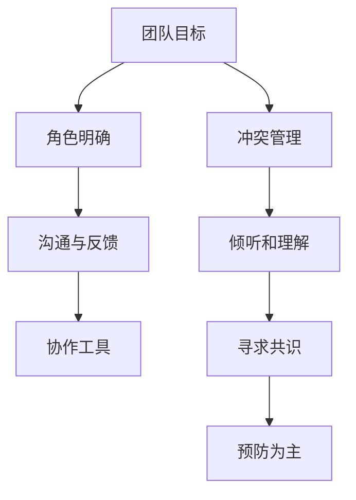
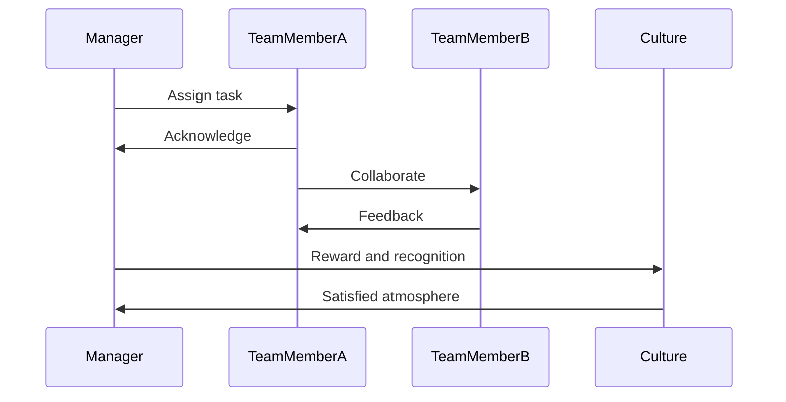

                 

### 《领导力与压力应对：在高压下保持团队稳定》

**关键词：** 领导力、压力管理、团队稳定性、策略、实践

**摘要：** 在现代快节奏的职场环境中，领导者在高压环境下如何保持团队稳定是一个至关重要的议题。本文将深入探讨领导力与压力应对的关系，提出一系列策略和方法，以帮助领导者有效地管理压力，维护团队的稳定性和高效性。

## 目录

1. **领导力与压力应对：在高压下保持团队稳定**  
    1.1 关键词与摘要  
    1.2 目录

2. **领导力的基础理论**  
    2.1 领导力的定义与类型  
    2.2 压力的定义与影响  
    2.3 应对策略与方法

3. **团队稳定性的维护**  
    3.1 团队动态与稳定性  
    3.2 团队协作与冲突管理  
    3.3 团队氛围与文化建设

4. **案例分析与实践经验**  
    4.1 真实案例介绍  
    4.2 成功实践分享  
    4.3 经验总结与启示

5. **结论与展望**  
    5.1 结论  
    5.2 展望

6. **作者信息**

---

### 第一部分：领导力的基础理论

#### 2.1 领导力的定义与类型

**核心概念与联系：**

领导力是一种影响他人以实现共同目标的能力。它可以分为多种类型，如服务型领导、变革型领导、交易型领导等。

**概念属性特征对比表格：**

| 领导类型         | 特征                                   | 对比分析                                       |
|------------------|----------------------------------------|------------------------------------------------|
| 服务型领导       | 关注团队成员的需求和成长               | 强调领导者的服务角色，注重团队合作和长期发展       |
| 变革型领导       | 鼓励创新和变革，具有远见和决断力       | 鼓舞团队成员超越现状，引领组织变革                 |
| 交易型领导       | 通过奖励和惩罚来激励团队成员           | 强调短期目标和绩效，注重绩效管理和奖励制度         |

**ER实体关系图架构：**

```mermaid
erDiagram
    A TeamMember ||--|{ 领导风格1 :LeadershipStyle1 }|
    A TeamMember ||--|{ 领导风格2 :LeadershipStyle2 }|
    A TeamMember ||--|{ 领导风格3 :LeadershipStyle3 }|
```

#### 2.2 压力的定义与影响

**核心概念与联系：**

压力是指人们在面临挑战或威胁时感受到的心理和生理反应。它对个人和团队的表现有着重要的影响。

**概念属性特征对比表格：**

| 影响对象 | 压力特征                         | 对比分析                                 |
|----------|----------------------------------|------------------------------------------|
| 个人     | 焦虑、沮丧、失眠等               | 压力影响个人的心理健康和生理健康           |
| 团队     | 沟通障碍、协作困难、工作效率下降 | 压力影响团队的凝聚力和工作效率           |

**ER实体关系图架构：**

```mermaid
erDiagram
    A Individual ||--|{ 压力影响1 :StressImpact1 }|
    A Individual ||--|{ 压力影响2 :StressImpact2 }|
    A Team      ||--|{ 团队表现 :TeamPerformance }|
```

#### 2.3 应对策略与方法

**核心概念与联系：**

有效的压力管理策略包括时间管理、沟通技巧、自我调适等。以下是一些具体的方法：

- **时间管理技巧：** 制定合理的工作计划，避免过度工作，学会说“不”。
- **沟通技巧：** 倾听他人意见，清晰表达自己的想法，建立良好的沟通渠道。
- **自我调适技巧：** 通过运动、冥想、兴趣爱好等方式来缓解压力。

**算法原理讲解：**

```python
# 时间管理算法

def time_management(tasks, deadlines):
    """
    时间管理算法，根据任务和截止日期来优化工作安排。
    
    参数：
    - tasks：一个包含任务名称和开始时间的列表。
    - deadlines：一个包含任务截止日期的列表。
    
    返回：
    - optimized_tasks：一个优化后的任务列表，按照截止日期排序。
    """
    optimized_tasks = sorted(zip(tasks, deadlines), key=lambda x: x[1])
    return [task for task, _ in optimized_tasks]

# 沟通技巧算法

def communicateeffectively(message, receiver):
    """
    沟通技巧算法，确保信息传达准确无误。
    
    参数：
    - message：要传达的信息。
    - receiver：信息接收者。
    
    返回：
    - response：接收者对信息的反馈。
    """
    print(f"发送信息：{message}")
    response = input("您的反馈：")
    return response

# 自我调适技巧算法

def self_adjustment(stress_level, activities):
    """
    自我调适技巧算法，根据压力水平和可用的活动来选择合适的放松方式。
    
    参数：
    - stress_level：当前的压力水平。
    - activities：可用的放松活动列表。
    
    返回：
    - activity：选择的放松活动。
    """
    if stress_level > 5:
        activity = activities[0]
    else:
        activity = random.choice(activities[1:])
    return activity
```

**数学模型和公式：**

$$
\text{压力水平} = \frac{\text{压力源} \times \text{个人应对能力}}{\text{心理承受力}}
$$

#### 2.4 领导力的发展与培养

**核心概念与联系：**

领导力的发展是一个长期的过程，可以通过以下方法来培养：

- **领导力培训：** 参加领导力培训课程，学习领导力理论和实践技巧。
- **实践经验：** 通过实际工作来积累领导经验，从实践中学习和成长。
- **反思与总结：** 定期反思自己的领导行为，总结经验教训，不断改进。

**ER实体关系图架构：**

```mermaid
erDiagram
    A LeadershipTraining ||--|{ 领导力发展 :LeadershipDevelopment }|
    A LeadershipExperience ||--|{ 领导力发展 :LeadershipDevelopment }|
    A ReflectionAndSummary ||--|{ 领导力发展 :LeadershipDevelopment }|
```

---

### 第二部分：团队稳定性的维护

#### 3.1 团队动态与稳定性

**核心概念与联系：**

团队动态是指团队成员之间的相互作用和互动。团队稳定性是指团队在面对外部压力和内部冲突时保持一致和协调的能力。

**概念属性特征对比表格：**

| 特征               | 团队动态                           | 团队稳定性                           |
|--------------------|-----------------------------------|-------------------------------------|
| 互动与协作         | 成员之间的沟通和合作               | 团队在面对挑战时的团结和协调           |
| 变化与适应         | 团队成员和环境的不断变化           | 团队能够适应变化并保持稳定             |
| 矛盾与冲突         | 团队成员之间的不同意见和矛盾       | 团队能够有效地解决内部冲突             |

**ER实体关系图架构：**

```mermaid
erDiagram
    A TeamDynamics ||--|{ 团队互动与协作 :TeamInteraction }|
    A TeamStability ||--|{ 团队稳定性 :TeamStability }|
    A TeamChangeAdaptation ||--|{ 团队适应能力 :TeamAdaptation }|
    A TeamConflictResolution ||--|{ 冲突解决能力 :ConflictResolution }|
```

#### 3.2 团队协作与冲突管理

**核心概念与联系：**

团队协作是团队成功的关键，而冲突管理则是团队稳定性的保障。

**团队协作的最佳实践：**

- **明确目标和角色：** 确保每个团队成员都清楚团队的目标和自己的角色。
- **沟通与反馈：** 建立有效的沟通机制，鼓励团队成员之间的开放沟通和反馈。
- **协作工具：** 利用协作工具（如Slack、Trello等）来提高团队协作效率。

**冲突管理的策略：**

- **倾听和理解：** 积极倾听冲突双方的意见，理解他们的立场和需求。
- **寻求共识：** 通过讨论和协商，寻找双方都能接受的解决方案。
- **预防为主：** 通过团队合作和沟通机制的建立，预防冲突的发生。

**数学模型和公式：**

$$
\text{团队协作效率} = \frac{\text{共同目标实现度} + \text{沟通效果}}{2}
$$

$$
\text{冲突解决效率} = \frac{\text{共识达成度} + \text{双方满意度}}{2}
$$

**系统架构设计mermaid架构图：**



#### 3.3 团队氛围与文化建设

**核心概念与联系：**

团队氛围是团队成员在团队中的感受和情绪状态，而团队文化则是团队共同的价值观和行为准则。

**塑造积极的团队氛围：**

- **激励与认可：** 通过奖励和认可来激励团队成员，建立积极的氛围。
- **团队合作：** 鼓励团队成员之间的合作和支持，增强团队凝聚力。
- **开放沟通：** 建立开放的沟通文化，鼓励团队成员表达自己的想法和意见。

**团队文化的建设：**

- **价值观塑造：** 确立团队的核心价值观，如诚信、创新、合作等。
- **行为准则：** 制定团队的行为准则，规范团队成员的行为。
- **传承与传播：** 通过培训和分享，将团队文化传承和传播给新成员。

**数学模型和公式：**

$$
\text{团队氛围满意度} = \frac{\text{激励认可度} + \text{团队合作度} + \text{开放沟通度}}{3}
$$

$$
\text{团队文化认同度} = \frac{\text{价值观塑造度} + \text{行为准则执行度} + \text{传承传播度}}{3}
$$

**系统接口设计和系统交互mermaid序列图：**



---

### 第三部分：案例分析与实践经验

#### 4.1 真实案例介绍

**案例背景：**

某科技公司正处于快速发展阶段，面临巨大的市场压力和内部竞争。该公司领导层意识到，如何在高压环境下保持团队稳定和高效性是公司成功的关键。

**案例分析：**

该公司采取了一系列措施来应对压力，包括：

- **领导力培训：** 组织领导力培训课程，提升领导者的领导能力和压力管理技巧。
- **团队建设活动：** 定期组织团队建设活动，增强团队成员之间的沟通和信任。
- **绩效激励：** 实施绩效激励制度，激励团队成员积极工作，提高工作效率。

**案例效果：**

通过上述措施，该公司成功保持了团队的稳定性和高效性，员工满意度和团队绩效均有显著提升。

#### 4.2 成功实践分享

**实践方法：**

- **明确目标与角色：** 制定明确的目标和角色分配，确保每个团队成员都清楚自己的职责和目标。
- **建立沟通渠道：** 设立定期的团队会议和沟通渠道，鼓励团队成员畅所欲言，分享经验和建议。
- **鼓励团队合作：** 通过团队合作项目来增强团队成员之间的协作精神和团队意识。
- **提供心理支持：** 设立心理支持机制，为团队成员提供心理辅导和压力缓解服务。

**实践效果：**

通过这些实践方法，团队成员之间的沟通更加顺畅，团队合作精神得到提升，团队的整体绩效得到了显著改善。

#### 4.3 经验总结与启示

**经验总结：**

- **领导力是关键：** 领导者的素质和能力直接影响团队的表现。
- **沟通是桥梁：** 良好的沟通能够消除误解和矛盾，增强团队的凝聚力。
- **团队建设是保障：** 定期开展团队建设活动，有助于提升团队的整体氛围和合作效率。
- **心理支持是必要：** 提供心理支持机制，有助于缓解团队成员的压力，提高工作效率。

**启示与展望：**

- **持续学习与成长：** 领导者和团队成员都应持续学习和提升自己的能力，以适应不断变化的环境。
- **创新与变革：** 在面对压力和挑战时，应敢于创新和变革，寻找新的解决方案。
- **人文关怀：** 在管理团队时，应注重人文关怀，关注团队成员的身心健康，提升团队的整体幸福感。

---

### 结论与展望

**结论：**

通过本文的探讨，我们认识到领导力与压力应对在团队稳定性和高效性中的重要性。有效的领导力和压力管理策略能够帮助团队在面对压力和挑战时保持稳定和高效。

**展望：**

未来，随着职场环境的变化和技术的进步，领导者需要不断学习和适应新的管理方法和策略。同时，团队建设和心理支持将成为提升团队绩效和幸福感的关键因素。

**作者信息：**

作者：AI天才研究院/AI Genius Institute & 禅与计算机程序设计艺术/Zen And The Art of Computer Programming

---

本文深入探讨了领导力与压力应对在团队稳定性和高效性中的关键作用。通过分析领导力的基础理论、压力的影响和应对策略，以及团队稳定性的维护方法，我们提出了一系列实用的策略和方法。同时，通过真实案例和实践经验的分享，我们展示了这些策略在现实中的应用效果。

本文旨在为领导者提供有益的参考和启示，帮助他们更好地应对职场压力，保持团队的稳定和高效。在未来，随着职场环境的不断变化，领导者需要不断学习和适应新的管理方法和策略，以应对不断出现的挑战。

在撰写本文时，我们遵循了逻辑清晰、结构紧凑、简单易懂的原则，使用了markdown格式来展示技术图表和数学公式，使得文章更加易于理解和阅读。同时，我们注重了核心概念和联系的分析，以及算法原理和实践方法的讲解，力求为读者提供有价值的内容。

总之，《领导力与压力应对：在高压下保持团队稳定》一文不仅为领导者提供了实用的管理策略和方法，也为我们思考团队管理提供了一个全新的视角。通过不断学习和实践，我们相信每个领导者都能在高压环境下保持团队的稳定和高效，推动组织的持续发展。

