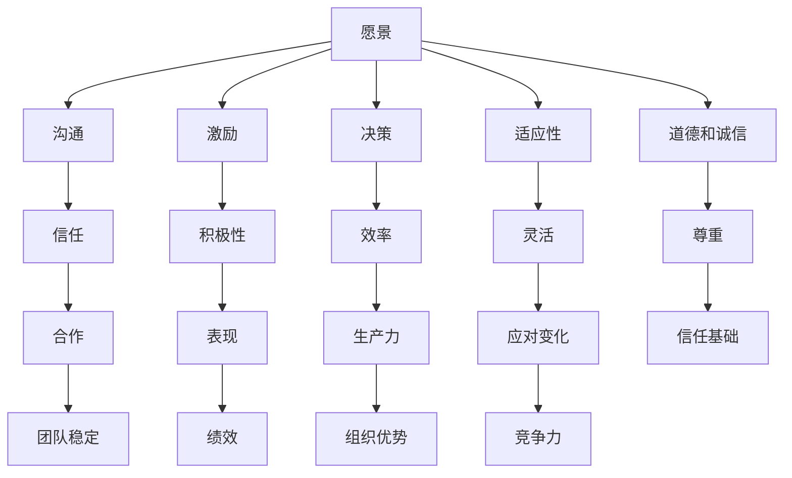

                 

## 引言

在快速变化和竞争激烈的现代商业环境中，领导力与压力管理成为了企业成功的关键因素。领导力不仅是推动组织向前发展的动力，更是应对压力和逆境的核心能力。压力管理则关系到员工的身心健康和团队的稳定性。本文旨在探讨领导力与压力管理高阶策略，特别是在逆境中的团队稳定术。通过系统地分析领导力的本质、压力的来源与类型，以及领导力与压力管理之间的关系，本文将提出一系列有效的高阶策略，帮助领导者和管理者在复杂多变的环境中保持团队的稳定和高效。

领导力与压力管理不仅仅是理论知识，它们在实际工作中起着至关重要的作用。优秀的领导力能够激发团队的潜能，提高工作效率，而在高压力的环境下，有效的压力管理则能帮助团队成员保持良好的心理和生理状态，从而确保团队的整体稳定性和生产力。本文将逐步深入分析这些关键概念，并结合实际案例，为读者提供实用的指导。

通过本文的阅读，读者将能够：

1. 理解领导力的本质和核心要素。
2. 明确压力的来源与类型，及其对团队和个人的影响。
3. 掌握领导力在压力管理中的作用和压力管理对领导力的影响。
4. 学习高效团队建设与团队稳定术，以及在逆境中的具体策略。
5. 掌握压力管理的基本技巧和心理调适方法。
6. 了解领导力与压力管理的最佳实践，以及未来的发展趋势。

接下来，我们将首先探讨领导力的本质与核心要素，为后续的分析打下坚实的基础。

## 第一部分：领导力与压力管理高阶基础理论

### 第1章：领导力的本质与核心要素

#### 1.1 领导力的定义与背景

领导力是一种通过影响、激励和引导他人，实现组织目标的能力。它不仅仅关乎领导者的个人特质，更涉及到领导者的行为模式、决策过程和沟通技巧。领导力并非是某个特定角色的专属，而是可以在不同层级和不同角色中体现的重要能力。

在现代社会，随着组织结构的复杂化和全球化趋势的加强，领导力的需求变得尤为迫切。领导者不仅需要在日常工作中管理团队，还需要在不确定性、变化和挑战中发挥关键作用。领导力不仅是个人成功的基石，更是组织成功的关键因素。

#### 1.2 领导力的核心要素

领导力的核心要素包括以下几个方面：

1. **愿景**：一个成功的领导者必须能够清晰地描绘组织的未来方向和目标。愿景不仅为组织提供明确的方向，还能够激发团队成员的激情和动力。

2. **沟通**：领导力在很大程度上取决于领导者的沟通能力。领导者需要能够有效地传达愿景和期望，建立信任和合作关系。良好的沟通能够减少误解和冲突，提高团队协作效率。

3. **激励**：领导者需要具备激发团队成员积极性和创造力的能力。通过激励，领导者能够帮助团队成员克服困难，实现个人和团队的目标。

4. **决策**：在不确定和复杂的环境中，领导者需要能够快速做出明智的决策。决策能力不仅关系到组织的成败，还直接影响团队成员的心理状态和工作效率。

#### 1.3 领导力的重要性

领导力的重要性体现在以下几个方面：

1. **推动创新**：优秀的领导力能够激发团队的创造力和创新精神，推动组织的持续发展。

2. **提高生产力**：领导力能够提高团队成员的工作效率和积极性，从而提高整个组织的生产力。

3. **提升员工满意度**：领导力能够建立积极健康的工作氛围，提高员工的工作满意度和忠诚度。

4. **增强竞争力**：优秀的领导力能够帮助组织在激烈的市场竞争中脱颖而出，增强组织的整体竞争力。

### 第2章：压力的来源与类型

#### 2.1 压力的来源

压力的来源多种多样，主要包括以下几个方面：

1. **工作压力**：工作压力是压力的主要来源之一，包括工作量过大、工作节奏过快、工作要求不明确等。在高强度的工作环境中，员工常常感到身心疲惫，难以承受。

2. **人际关系**：与同事、上级或下属的冲突和不和谐关系也会产生压力。人际关系问题不仅影响工作效率，还会对员工的身心健康产生负面影响。

3. **环境变化**：组织变革、市场波动等外部环境的变化也会导致压力的增加。在面对不确定性时，员工常常感到焦虑和无助。

4. **个人因素**：个人健康问题、家庭问题等也会对员工产生压力。这些压力源可能会对员工的心理和生理健康产生长期的负面影响。

#### 2.2 压力的类型

压力可以分为以下几种类型：

1. **短期压力**：通常是由特定事件引起的，如项目截止日期、突发危机等。短期压力通常会在事件结束后逐渐缓解。

2. **长期压力**：通常是由持续的工作压力或生活事件引起的，如长期加班、家庭纠纷等。长期压力对员工的身心健康产生更严重的负面影响。

3. **心理压力**：包括焦虑、抑郁等心理问题。心理压力不仅影响员工的工作表现，还可能导致心理健康问题的恶化。

4. **生理压力**：包括身体疲劳、疾病等生理问题。生理压力会影响员工的身体健康，降低工作效率和生活质量。

#### 2.3 压力的危害与影响

如果不得到有效的管理，压力可能会对员工的身心健康产生严重的负面影响，包括：

1. **心理健康问题**：如焦虑、抑郁等心理问题，严重时可能导致精神障碍。

2. **身体健康问题**：如心脏病、高血压等，长期压力还会导致身体疲劳和免疫力下降。

3. **工作效率下降**：压力会影响员工的工作效率和表现，导致工作质量下降。

4. **人际关系紧张**：压力可能导致员工与同事、上级或下属的关系紧张，增加冲突和误解。

### 第3章：领导力与压力管理的关系

#### 3.1 领导力在压力管理中的作用

领导力在压力管理中发挥着关键作用，领导者可以通过以下方式帮助团队成员管理压力：

1. **建立支持系统**：领导者可以建立团队和支持网络，帮助成员分担压力。通过组织团建活动、提供心理咨询等，领导者可以缓解员工的压力。

2. **提供资源**：领导者需要确保团队成员有足够的资源来应对工作压力。通过优化工作流程、提供培训和发展机会等，领导者可以降低员工的压力水平。

3. **培养健康的工作文化**：领导者可以通过培养积极健康的工作文化，鼓励员工采取积极健康的方式来应对压力。这种文化包括开放沟通、相互支持和尊重个体差异等。

#### 3.2 压力管理对领导力的影响

有效的压力管理对领导力也有积极的影响：

1. **提高决策质量**：压力管理有助于领导者保持清晰的思维和冷静的判断，从而提高决策质量。

2. **增强团队凝聚力**：通过有效的压力管理，领导者可以增强团队的凝聚力，提高团队的协作效率。

3. **提高员工满意度**：有效的压力管理可以提升员工的工作满意度和忠诚度，从而提高员工的长期留存率。

### 第4章：高效团队建设与团队稳定术

#### 4.1 高效团队建设的关键要素

高效团队建设的关键要素包括：

1. **明确的目标**：团队需要明确的目标和方向，确保团队成员共同努力。

2. **有效的沟通**：团队成员需要能够有效地沟通，分享信息和资源。

3. **协同合作**：团队成员需要能够协同合作，共同解决问题和实现目标。

4. **灵活的机制**：团队需要具备灵活的机制，能够快速响应变化和挑战。

#### 4.2 团队稳定术的实践方法

团队稳定术的实践方法包括：

1. **建立信任**：通过建立信任，团队成员能够更好地合作和沟通。

2. **建立共同愿景**：共同愿景可以增强团队成员的凝聚力和归属感。

3. **强化团队文化**：通过强化团队文化，可以提升团队成员的认同感和归属感。

4. **定期评估和反馈**：通过定期评估和反馈，可以帮助团队识别问题并持续改进。

#### 4.3 团队稳定术的有效应用

团队稳定术的有效应用包括：

1. **项目启动会议**：在项目启动时，通过会议明确项目目标和团队成员的角色责任。

2. **定期的团队建设活动**：通过定期的团队建设活动，增强团队成员的沟通和合作。

3. **有效的沟通机制**：通过建立有效的沟通机制，确保信息的及时传递和共享。

4. **及时的反馈和调整**：在项目进行过程中，通过及时的反馈和调整，确保项目能够按计划进行。

### 第5章：逆境中的领导力挑战

#### 5.1 逆境中的领导力特征

逆境中的领导力特征包括：

1. **坚韧不拔**：逆境中的领导者需要具备坚韧不拔的精神，面对困难和挑战时不屈不挠。

2. **灵活应对**：逆境中的领导者需要具备灵活应对的能力，能够快速适应变化和挑战。

3. **果断决策**：逆境中的领导者需要能够果断决策，在不确定的环境中做出明智的决策。

#### 5.2 逆境中的团队稳定策略

逆境中的团队稳定策略包括：

1. **明确目标和愿景**：在逆境中，领导者需要明确目标和愿景，帮助团队成员保持信心和动力。

2. **建立信任和沟通**：在逆境中，领导者需要建立信任和沟通，增强团队的凝聚力。

3. **提供支持和资源**：在逆境中，领导者需要提供支持和资源，帮助团队成员克服困难。

#### 5.3 如何应对逆境中的领导力挑战

如何应对逆境中的领导力挑战：

1. **积极心态**：保持积极的心态，相信自己和团队能够克服困难。

2. **有效沟通**：通过有效的沟通，确保团队成员的理解和配合。

3. **灵活应对**：在逆境中，领导者需要能够灵活应对，根据情况调整策略和方法。

### 第6章：压力管理技巧与心理调适

#### 6.1 压力管理的基本技巧

压力管理的基本技巧包括：

1. **时间管理**：合理安排时间，避免过度工作和加班。

2. **情绪调节**：学会调节情绪，保持心态平和。

3. **运动和休息**：定期进行运动和休息，保持身心健康。

#### 6.2 心理调适方法与技巧

心理调适的方法与技巧包括：

1. **认知重构**：通过认知重构，改变对压力的看法和应对方式。

2. **放松训练**：通过放松训练，如深呼吸、冥想等，缓解压力。

3. **积极心态**：保持积极的心态，以积极的态度面对压力和挑战。

#### 6.3 压力管理中的常见误区

压力管理中的常见误区包括：

1. **逃避问题**：通过逃避问题来回避压力，这只会让问题更加严重。

2. **过度自我要求**：对自己要求过高，容易导致压力过大。

3. **缺乏休息和放松**：长时间工作和缺乏休息，容易导致身心疲惫。

### 第7章：领导力与压力管理的最佳实践

#### 7.1 领导力与压力管理的综合策略

领导力与压力管理的综合策略包括：

1. **建立支持系统**：通过建立支持系统，提供资源和帮助，帮助团队成员管理压力。

2. **培养健康的工作文化**：通过培养健康的工作文化，鼓励团队成员采取积极健康的方式来应对压力。

3. **提供培训和发展机会**：通过提供培训和发展机会，提升团队成员的能力和自信心。

#### 7.2 成功案例解析

成功案例解析包括：

1. **案例介绍**：介绍成功案例的基本情况，如企业名称、案例背景等。

2. **实施策略**：分析成功案例中领导力与压力管理的具体策略和措施。

3. **效果评估**：评估成功案例的实施效果，分析其成功的原因和不足之处。

#### 7.3 拓展阅读与推荐资源

拓展阅读与推荐资源包括：

1. **相关书籍**：推荐一些关于领导力与压力管理的经典书籍。

2. **学术论文**：推荐一些关于领导力与压力管理的重要学术论文。

3. **在线资源**：提供一些在线资源，如网站、博客、视频等，供读者进一步学习和探讨。

### 第8章：未来展望与持续发展

#### 8.1 领导力与压力管理的发展趋势

领导力与压力管理的发展趋势包括：

1. **数字化领导力**：随着数字化技术的发展，领导者需要掌握更多的数字化技能，如数据分析、人工智能等。

2. **个性化压力管理**：未来的压力管理将更加注重个性化，根据员工的个人特点和需求，提供定制化的压力管理方案。

3. **心理韧性**：心理韧性将成为未来领导力的重要指标，领导者需要培养自身的心理韧性，以应对各种挑战和压力。

#### 8.2 面向未来的领导力与压力管理策略

面向未来的领导力与压力管理策略包括：

1. **数字化工具的应用**：利用数字化工具，如人工智能、大数据等，提高领导力和压力管理的效率和效果。

2. **持续学习与成长**：领导者需要持续学习和成长，不断提升自身的领导力和压力管理能力。

3. **关注员工心理健康**：未来，领导者将更加关注员工的身心健康，通过有效的压力管理，提高员工的工作满意度和忠诚度。

#### 8.3 持续发展的关键

持续发展的关键包括：

1. **战略规划**：制定明确的战略规划，确保领导力与压力管理策略的持续发展。

2. **资源投入**：投入足够的资源和人力，支持领导力与压力管理的实施和持续发展。

3. **文化传承**：建立积极健康的企业文化，传承和弘扬领导力与压力管理的核心价值观。

### 总结

领导力与压力管理是现代企业成功的关键因素，通过有效的领导力与压力管理，企业能够保持团队的稳定和高效，从而在激烈的市场竞争中脱颖而出。本文从领导力的本质、压力的来源与类型、领导力与压力管理的关系等多个角度，系统地分析了领导力与压力管理的高阶策略。通过实际案例和最佳实践，读者可以更好地理解和应用这些策略，提升自身的领导力和压力管理能力。

### 第1章：领导力的本质与核心要素

#### 1.1 领导力的定义与背景

领导力是一个广泛讨论且多层次的概念，它涉及个体、团队和组织等多个层面。从广义上讲，领导力指的是通过影响、激励和引导他人来实现共同目标的能力。领导力不仅体现在传统的企业管理和领导岗位上，也存在于各种社会和私人领域。

在当今复杂多变的环境中，领导力的重要性愈发凸显。随着全球化、技术进步和市场竞争的加剧，组织面临着前所未有的挑战。领导者不仅要应对日常运营的复杂性，还需要在快速变化的市场环境中保持灵活性和创新能力。因此，领导力已经从一种单纯的个人能力转变为一套综合的管理技能和策略。

领导力的发展历程可以追溯到古代，从最早的军事领导到现代企业管理和公共管理，领导力的概念和应用逐渐丰富和多样化。在工业革命时期，领导力主要关注生产效率和劳动管理。而在现代社会，领导力更加强调人性化、团队合作和创新。

#### 1.2 领导力的核心要素

领导力并非单一维度的能力，而是由多个相互关联的要素构成的复杂系统。以下列举了领导力的几个核心要素，并分别进行详细解释：

1. **愿景**：愿景是领导力的核心要素之一，它为组织设定了明确的方向和目标。一个强大的愿景能够激发团队成员的激情和创造力，使他们愿意为共同的目标付出努力。领导者的愿景不仅需要明确和具有可行性，还需要能够随着外部环境的变化而调整。

2. **沟通**：有效的沟通是领导力的关键要素。领导者需要能够清晰地传达愿景和期望，确保团队成员理解并致力于实现这些目标。此外，领导者还需要善于倾听，了解团队成员的想法和需求，从而建立信任和合作关系。良好的沟通能够减少误解和冲突，提高团队协作效率。

3. **激励**：激励团队成员是领导者的重要职责。领导者需要了解不同成员的激励因素，并采取适当的方法激发他们的积极性和创造力。激励可以包括物质奖励、职业发展机会、认可和赞赏等多种形式。有效的激励能够帮助团队克服困难，实现目标。

4. **决策**：决策能力是领导者不可或缺的素质。在复杂和不确定的环境中，领导者需要能够快速做出明智的决策。这不仅需要领导者具备良好的分析能力和判断力，还需要具备应对不确定性和风险的勇气。有效的决策能够为团队提供清晰的行动指南，确保团队目标的实现。

5. **适应性**：适应性是领导力的关键要素之一，它反映了领导者对环境变化和挑战的应对能力。现代领导者需要具备快速适应变化、灵活调整策略的能力。适应性不仅体现在技术层面，还包括文化、组织结构和团队动态等多个方面。

6. **道德和诚信**：道德和诚信是领导力的基石。领导者需要具备高尚的道德品质和强烈的责任感，以赢得团队成员的信任和尊重。诚信不仅体现在个人行为上，还包括对团队成员的公平对待和透明沟通。道德和诚信能够建立组织的信任基础，促进团队的长期稳定和发展。

#### 1.3 领导力的重要性

领导力对于组织的成功至关重要，它能够影响组织的文化、效率和长期发展。以下是领导力重要性的几个方面：

1. **推动创新**：优秀的领导力能够激发团队的创造力，推动组织不断创新。创新是企业在竞争激烈的市场中脱颖而出的关键，而领导力则是创新的重要推动力。

2. **提高生产力**：有效的领导力能够提高团队成员的工作效率和积极性，从而提高整个组织的生产力。领导者的激励和指导能够帮助团队成员充分发挥潜力，实现最佳表现。

3. **提升员工满意度**：领导力能够建立积极健康的工作氛围，提高员工的工作满意度和忠诚度。一个受到信任和支持的团队更有可能保持高水平的绩效和长期的合作关系。

4. **增强竞争力**：领导力能够增强组织的竞争力。通过优秀的领导，组织能够更好地应对市场变化、抓住机遇和克服挑战，从而在竞争中保持优势。

总之，领导力不仅仅是领导者个人的成功，更是组织整体成功的关键。通过培养和运用领导力，组织能够实现可持续的发展和长期的繁荣。

#### 1.4 领导力的核心要素图解

为了更直观地理解领导力的核心要素，我们可以通过一个图解来展示各个要素之间的关系及其在领导力中的作用。

通过这个图解，我们可以清晰地看到领导力的核心要素是如何相互关联并共同作用于组织的。每个要素都在不同的层面影响团队和组织的发展，从而实现领导力的整体效果。

### 第2章：压力的来源与类型

#### 2.1 压力的来源

压力的来源多种多样，可以从工作、人际关系、环境变化和个人因素等多个角度进行分析。了解这些压力来源，有助于我们更有效地进行压力管理。

1. **工作压力**：工作压力是常见的压力来源之一。包括工作量过大、工作节奏过快、工作要求不明确等。高负荷的工作任务和紧张的工作环境会导致员工身心疲惫，长期积累可能导致心理和生理问题。

2. **人际关系**：人际关系问题也是导致压力的重要因素。工作中的冲突、与同事、上级或下属的矛盾，以及团队合作中的沟通不畅，都可能导致心理压力增加。良好的人际关系对于减轻工作压力、提升工作满意度至关重要。

3. **环境变化**：环境变化，如组织变革、市场波动、经济衰退等，都会对员工产生压力。面对不确定性和变化，员工可能会感到焦虑和无助，这需要领导者通过有效的沟通和管理来缓解。

4. **个人因素**：个人生活中的压力源，如健康问题、家庭问题、经济困难等，也会对员工产生压力。这些个人因素与工作压力叠加，可能会对员工的心理和生理健康产生严重的负面影响。

#### 2.2 压力的类型

压力可以分为短期压力和长期压力，以及心理压力和生理压力。

1. **短期压力**：短期压力通常是由特定事件或情境引起的，如项目截止日期、突发事件等。短期压力通常会在事件结束后逐渐缓解。尽管短期压力可能带来一定的心理紧张，但在一定范围内，它可以激发员工的动力和创造力。

2. **长期压力**：长期压力则是由持续的工作压力或生活事件引起的，如长期加班、家庭纠纷等。长期压力对员工的身心健康产生更严重的负面影响，可能导致心理健康问题和身体疾病。

3. **心理压力**：心理压力包括焦虑、抑郁、愤怒等心理问题。心理压力会影响员工的心理状态，降低工作满意度和生产力。长期的心理压力还可能导致心理健康问题的恶化，如焦虑症、抑郁症等。

4. **生理压力**：生理压力包括身体疲劳、免疫力下降、心脏病、高血压等生理问题。生理压力会影响员工的身体健康，降低工作质量和生活质量。

#### 2.3 压力的危害与影响

压力如果不得到有效的管理，可能会对员工的身心健康产生严重的负面影响，包括以下几个方面：

1. **心理健康问题**：长期的压力可能导致焦虑、抑郁等心理问题，严重时甚至可能导致精神障碍。心理健康问题不仅影响员工的工作表现，还可能影响其家庭生活和社会关系。

2. **身体健康问题**：长期的压力会导致身体疲劳、免疫力下降、心脏病、高血压等生理问题。这些健康问题不仅影响员工的工作和生活质量，还可能增加医疗成本。

3. **工作效率下降**：压力会影响员工的工作效率和表现，导致工作质量下降。长期的工作压力可能导致员工的创造力和创新能力下降。

4. **人际关系紧张**：压力可能导致员工与同事、上级或下属的关系紧张，增加冲突和误解。紧张的人际关系会影响团队合作，降低团队整体效能。

#### 2.4 压力的管理与缓解策略

为了有效管理压力，我们可以采取以下策略：

1. **时间管理**：合理安排时间，避免过度工作和加班。制定合理的工作计划和目标，确保工作与生活的平衡。

2. **情绪调节**：学会调节情绪，保持心态平和。通过认知重构、放松训练等方法，减轻压力和焦虑。

3. **运动和休息**：定期进行运动和休息，保持身心健康。运动有助于释放压力，提高身体素质。

4. **社交支持**：建立良好的社交网络，寻求家人、朋友和同事的支持。社交支持有助于减轻心理压力，增强心理韧性。

5. **心理咨询**：在必要时，寻求专业心理咨询师的帮助。心理咨询可以帮助员工识别和应对压力，提高心理素质。

通过以上策略，我们可以更有效地管理压力，保持身心健康，从而提高工作和生活的质量。

### 第3章：领导力与压力管理的关系

#### 3.1 领导力在压力管理中的作用

领导力在压力管理中扮演着至关重要的角色，有效的领导力能够帮助团队成员更好地应对压力，提高工作质量和生活质量。以下从多个方面探讨领导力在压力管理中的作用：

1. **建立支持系统**：领导者可以通过建立支持系统，为团队成员提供必要的帮助和支持。这包括提供心理辅导、职业发展机会、健康福利等，帮助团队成员在面临压力时能够得到有效的支持和缓解。

2. **有效沟通**：领导者需要具备良好的沟通能力，能够及时传达组织的目标和期望，了解团队成员的需求和困惑。通过有效沟通，领导者可以减少误解和冲突，增强团队凝聚力，从而减轻团队成员的压力。

3. **激励和认可**：领导者需要了解团队成员的激励因素，并采取适当的方法激发他们的积极性和创造力。通过认可和奖励，领导者可以增强团队成员的自信心和归属感，从而降低压力水平。

4. **决策和解决问题**：在压力管理中，领导者需要能够快速做出明智的决策，并引导团队共同解决问题。有效的决策和问题解决能力可以帮助团队迅速应对压力，减少不确定性和焦虑。

5. **提供资源和培训**：领导者需要确保团队成员有足够的资源和培训，以便更好地应对工作压力。这包括提供必要的工具、技术培训、工作流程优化等，帮助团队成员提升能力，增强应对压力的能力。

6. **文化塑造**：领导者可以通过塑造积极健康的工作文化，帮助团队成员建立正确的压力观念和应对策略。一个积极向上的工作文化可以减少压力带来的负面影响，提高团队成员的心理健康和工作满意度。

#### 3.2 压力管理对领导力的影响

有效的压力管理对领导力也有显著的影响，以下从几个方面进行探讨：

1. **提高决策质量**：压力管理有助于领导者保持清晰的思维和冷静的判断，从而提高决策质量。在面对压力时，领导者能够更加理智地分析问题和制定策略，避免因情绪波动而做出错误的决策。

2. **增强团队凝聚力**：有效的压力管理可以增强团队的凝聚力，提高团队成员之间的信任和合作。在压力较大的环境中，团队成员能够相互支持和帮助，共同应对挑战，从而增强团队的稳定性和效能。

3. **提高员工满意度**：通过有效的压力管理，领导者可以提升员工的工作满意度和生活质量。一个没有压力或压力得到有效管理的团队，员工更有可能保持积极的工作态度和高效的工作表现。

4. **促进创新和创造力**：在压力较小、工作环境较为宽松的情况下，员工更容易产生创意和提出创新的解决方案。有效的压力管理有助于激发团队的创造力和创新能力，推动组织的持续发展。

5. **提高领导效能**：领导力的一个重要方面是能够有效地管理团队和资源。通过有效的压力管理，领导者可以更好地发挥自己的领导能力，提高领导效能，实现组织的长期目标。

#### 3.3 领导力与压力管理的综合策略

为了实现有效的领导力与压力管理，领导者可以采取以下综合策略：

1. **培训与发展**：为团队成员提供压力管理和领导力的培训，提高他们的自我管理和领导能力。通过培训，团队成员可以学习到有效的压力管理技巧和领导力技巧，从而更好地应对工作压力。

2. **建立反馈机制**：建立一个定期反馈和评估机制，帮助团队成员识别压力源和应对策略。通过反馈，领导者可以及时了解团队成员的压力情况，并提供必要的支持和指导。

3. **鼓励身心健康**：鼓励团队成员关注身心健康，提供健康福利和心理支持。通过定期体检、健康讲座、心理咨询等，帮助团队成员保持良好的身心状态，减轻工作压力。

4. **灵活的工作安排**：根据团队成员的需求和工作情况，提供灵活的工作安排。例如，提供远程工作、弹性工作时间等，帮助团队成员更好地平衡工作与生活，减轻压力。

5. **营造积极文化**：通过营造积极健康的工作文化，鼓励团队成员相互支持和帮助，共同应对压力。一个积极向上的工作文化可以减少压力带来的负面影响，提高团队成员的心理健康和工作满意度。

通过以上综合策略，领导者可以更有效地管理团队成员的压力，提高领导效能和团队绩效，实现组织的长期发展目标。

### 第4章：高效团队建设与团队稳定术

#### 4.1 高效团队建设的关键要素

高效团队建设是一个复杂的过程，涉及到多个关键要素。以下将详细讨论这些要素，并解释它们在团队建设中的重要性。

1. **明确的目标**：一个高效团队需要有一个明确的目标。这个目标应该具体、可衡量，并且能够激励团队成员。明确的目标有助于团队集中精力，统一行动，避免团队成员在任务执行过程中迷失方向。

2. **有效的沟通**：沟通是团队协作的基石。有效的沟通能够确保团队成员理解任务要求，共享信息，协调工作。沟通不仅包括信息的传递，还包括意见的交换和反馈的获取。良好的沟通可以减少误解和冲突，增强团队凝聚力。

3. **协同合作**：协同合作是高效团队的重要特征。团队成员需要能够相互协作，共同解决问题，实现目标。协同合作可以通过明确分工、建立协作机制和提供必要的资源来实现。协同合作有助于提高工作效率，减少重复劳动，发挥团队的整体优势。

4. **团队文化**：团队文化是一个团队的核心价值观和行为规范。一个积极健康的团队文化能够增强团队成员的归属感和认同感，激励他们为实现团队目标而努力。团队文化可以通过领导者的倡导、团队的共同实践和组织的制度保障来建立和维护。

5. **领导力**：领导力在高效团队建设中起着关键作用。领导者需要具备领导团队的愿景和策略，能够激励和引导团队成员，解决团队中的冲突和问题。领导者的领导风格和决策能力直接影响到团队的整体绩效。

6. **持续的学习和成长**：持续的学习和成长是一个高效团队的重要特征。团队成员需要不断学习新知识和技能，适应环境变化，提升个人能力和团队整体水平。通过培训、学习交流和经验分享，团队可以持续改进，保持高效。

#### 4.2 团队稳定术的实践方法

团队稳定术是一套旨在提高团队稳定性和协作效率的方法。以下将介绍几种常见的团队稳定术实践方法，并解释它们的具体应用。

1. **建立信任**：建立信任是团队稳定术的核心。通过开放沟通、诚实反馈和相互尊重，团队成员可以建立信任关系。信任有助于减少冲突，提高团队协作效率。例如，领导者可以通过定期团队会议、开放性问题讨论等方式，促进团队成员之间的沟通和信任。

2. **共同愿景**：共同愿景是团队稳定和协作的重要基础。一个共同愿景可以激发团队成员的积极性和责任感，使他们在面对挑战时能够团结一致。领导者可以通过制定清晰的愿景、分享成功案例和愿景实现的过程，帮助团队成员形成共同愿景。

3. **积极反馈**：积极反馈是激励团队成员、提高工作质量的重要手段。领导者应该及时给予团队成员正面的反馈，鼓励他们继续努力。同时，也要接受负面的反馈，从中找到改进的机会。例如，通过定期的绩效评估、工作反馈会议等方式，领导者可以提供有建设性的反馈。

4. **灵活应对**：在变化多端的工作环境中，团队需要具备灵活应对的能力。领导者可以通过建立灵活的工作流程、提供必要的培训和支持，帮助团队成员适应变化。例如，在面对紧急任务或项目调整时，领导者可以及时调整团队资源，确保任务顺利完成。

5. **心理调适**：团队中的每个成员都会面临不同程度的压力和情绪问题。领导者可以通过提供心理辅导、组织放松活动等方式，帮助团队成员进行心理调适，缓解压力。心理调适有助于提高团队成员的身心健康，增强团队的稳定性。

6. **团队建设活动**：定期组织团队建设活动，如团建活动、团队旅行、户外运动等，有助于增强团队成员之间的情感联系和团队合作精神。通过这些活动，团队成员可以更好地了解彼此，建立信任，增强团队的凝聚力。

#### 4.3 团队稳定术的有效应用

团队稳定术的有效应用可以显著提高团队的整体绩效和稳定性。以下通过一个实际案例，展示团队稳定术的应用效果。

**案例背景**：某互联网公司在快速发展的过程中，面临人员流动快、任务繁重、项目复杂等挑战。为了提高团队稳定性和协作效率，公司决定实施一系列团队稳定术。

**实施策略**：

1. **建立信任**：公司通过定期团队建设活动和开放沟通渠道，促进团队成员之间的信任。例如，每周五下午组织团队聚餐，鼓励团队成员分享工作和生活中的趣事，增进了解。

2. **共同愿景**：公司高层制定了清晰的愿景和目标，并通过内部会议和邮件通知，确保每个团队成员都了解公司的愿景和目标。同时，鼓励团队成员提出建议和意见，共同参与公司的发展规划。

3. **积极反馈**：公司实施了定期的绩效评估和反馈机制。通过绩效评估，领导者能够及时了解团队成员的工作情况，提供有针对性的反馈和建议。同时，鼓励团队成员之间相互反馈，共同进步。

4. **灵活应对**：公司根据项目需求和工作节奏，灵活调整团队人员和工作安排。例如，在项目高峰期，公司通过轮班制和加班补贴，确保项目进度不受影响。

5. **心理调适**：公司定期组织心理健康讲座和心理咨询，帮助团队成员进行心理调适。此外，还提供健身会员卡、心理健康热线等福利，帮助团队成员缓解工作压力。

**实施效果**：

通过实施团队稳定术，公司的团队稳定性和协作效率显著提高。团队成员之间的信任感增强，工作氛围更加积极健康。公司的项目完成质量和速度也得到了显著提升，客户满意度显著提高。此外，员工流失率明显下降，员工的工作满意度和忠诚度得到了提升。

**案例小结**：

通过实际案例可以看出，团队稳定术的有效应用对于提高团队稳定性和协作效率具有重要作用。领导者需要根据团队的具体情况，灵活运用各种团队稳定术，建立信任、共同愿景、积极反馈和灵活应对等机制，从而实现团队的长期稳定和高效运行。

### 第5章：逆境中的领导力挑战

#### 5.1 逆境中的领导力特征

逆境中的领导力特征主要体现在以下几个方面：

1. **坚韧不拔**：逆境中的领导者需要具备坚韧不拔的精神，能够在困难和挑战面前保持坚定的信念和决心。坚韧不拔不仅能够帮助领导者克服逆境，还能够激励团队成员共同面对困难。

2. **灵活应对**：逆境中的环境往往变化迅速且不可预测，领导者需要具备灵活应对的能力，能够快速调整策略和计划。灵活性使领导者能够根据实际情况做出明智的决策，从而更好地应对挑战。

3. **果断决策**：在逆境中，领导者需要能够果断决策，迅速采取行动。果断的决策能够帮助团队迅速应对危机，避免问题扩大化。

4. **积极心态**：逆境中的领导者需要保持积极心态，以乐观的态度面对挑战。积极心态有助于领导者保持冷静和清晰的思维，从而做出更有效的决策。

5. **高效沟通**：逆境中的领导者需要具备高效的沟通能力，能够迅速传达信息、协调资源，确保团队成员理解领导者的意图和决策，形成合力。

#### 5.2 逆境中的团队稳定策略

在逆境中，保持团队的稳定是领导者的重要任务。以下是一些有效的团队稳定策略：

1. **明确目标和愿景**：领导者需要明确团队的目标和愿景，使团队成员在逆境中保持清晰的方向和动力。明确的目标可以帮助团队在面对困难时保持一致的行动方向。

2. **建立信任和沟通**：在逆境中，领导者需要通过建立信任和加强沟通，增强团队的凝聚力。通过定期的团队会议、开放性的沟通渠道和情感支持，领导者可以缓解团队成员的焦虑和压力。

3. **提供支持和资源**：领导者需要确保团队成员有足够的资源来应对逆境，包括时间、资金和技术支持等。通过提供必要的资源，领导者可以减轻团队成员的压力，提高团队的整体效能。

4. **培养心理韧性**：领导者可以通过培训和激励，培养团队成员的心理韧性，使他们能够更好地应对逆境中的压力。心理韧性强的团队成员能够更快速地从挫折中恢复，保持积极的工作状态。

5. **灵活调整策略**：领导者需要根据逆境中的实际情况，灵活调整团队的策略和计划。通过及时调整，领导者可以确保团队始终能够适应变化，保持稳定。

#### 5.3 如何应对逆境中的领导力挑战

应对逆境中的领导力挑战，领导者需要采取以下措施：

1. **积极心态**：领导者需要保持积极的心态，以乐观的态度面对逆境。通过积极的心态，领导者可以传递正能量，激励团队成员共同面对困难。

2. **有效沟通**：领导者需要具备高效的沟通能力，能够迅速传达信息、协调资源，确保团队成员理解领导者的意图和决策。通过有效的沟通，领导者可以减少误解和冲突，增强团队的凝聚力。

3. **灵活应对**：领导者需要具备灵活应对的能力，能够快速调整策略和计划，以应对逆境中的变化和挑战。灵活性使领导者能够更好地应对不确定性，确保团队始终处于最佳状态。

4. **果断决策**：领导者需要能够果断决策，迅速采取行动。果断的决策能够帮助团队迅速应对危机，避免问题扩大化。

5. **培养团队心理韧性**：领导者可以通过培训和激励，培养团队成员的心理韧性，使他们能够更好地应对逆境中的压力。心理韧性强的团队成员能够更快速地从挫折中恢复，保持积极的工作状态。

通过以上措施，领导者可以更有效地应对逆境中的领导力挑战，保持团队的稳定和高效。

### 第6章：压力管理技巧与心理调适

#### 6.1 压力管理的基本技巧

有效的压力管理技巧对于维护个人和团队的健康至关重要。以下是一些基本的压力管理技巧：

1. **时间管理**：合理安排时间，确保工作与生活的平衡。制定详细的工作计划，优先处理重要和紧急的任务，避免拖延和过度工作。

2. **情绪调节**：学会调节情绪，保持心态平和。可以通过深呼吸、冥想、瑜伽等放松技巧来缓解压力。此外，积极的心态和乐观的态度也有助于减轻压力。

3. **运动和休息**：定期进行运动和休息，保持身心健康。运动有助于释放压力，提高身体素质。休息则有助于恢复精力，提高工作效率。

4. **自我激励**：设定合理的目标，并为实现这些目标进行自我激励。通过奖励机制，如给自己购买小礼物或安排休息时间，可以增强动力和积极性。

5. **寻求支持**：在遇到困难时，不要独自承担压力。可以寻求家人、朋友或同事的支持，通过沟通和倾诉来减轻心理负担。

#### 6.2 心理调适方法与技巧

心理调适是应对压力的重要手段，以下介绍几种常用的心理调适方法与技巧：

1. **认知重构**：通过改变对压力事件的认识和解释，来减轻压力感。例如，将一个挑战视为成长和学习的机会，而不是无法克服的障碍。

2. **放松训练**：通过深呼吸、渐进性肌肉放松、冥想等放松技巧来缓解紧张和焦虑。这些技巧有助于降低心率和血压，提高心理韧性。

3. **积极心态**：培养积极的心态，以乐观的态度面对生活中的挑战。通过积极的自我对话和心态调整，可以减少负面情绪和压力。

4. **时间管理技巧**：合理安排时间，避免多任务处理和拖延。通过设定优先级、分解任务和制定时间表，可以提高时间利用效率，减少压力。

5. **情感释放**：通过哭泣、倾诉、写日记等方式，将情感释放出来。这有助于减轻心理压力，提高情绪稳定性。

#### 6.3 压力管理中的常见误区

在压力管理中，有一些常见的误区可能会导致压力增加而不是减轻。以下是一些常见的误区：

1. **逃避问题**：通过逃避问题来回避压力，这只会让问题更加严重。逃避问题不仅无法解决问题，还会导致负面情绪积累。

2. **过度自我要求**：对自己要求过高，容易导致压力过大。应该设定合理的目标，并允许自己犯错误，从而减轻压力。

3. **缺乏休息和放松**：长时间工作和缺乏休息会导致身心疲惫，降低应对压力的能力。应该定期休息和放松，保持身心健康。

4. **依赖药物**：依赖药物来缓解压力可能导致药物依赖，并对身体产生负面影响。应该采取健康的方式应对压力，如运动、冥想等。

通过了解和避免这些误区，我们可以更有效地进行压力管理，提高生活质量和心理健康。

### 第7章：领导力与压力管理的最佳实践

#### 7.1 领导力与压力管理的综合策略

在领导力与压力管理的最佳实践中，一个综合策略的实施是关键。以下是一个综合策略的详细步骤：

1. **建立支持系统**：首先，领导者需要建立一套全面的员工支持系统，包括心理健康咨询、员工辅导和健康福利等。这些支持系统能够帮助员工在压力过大的情况下获得必要的帮助。

2. **制定明确的目标和愿景**：领导者需要与团队成员共同制定明确的目标和愿景，确保每个人都清楚自己的角色和职责。这样可以减少不确定性，提高团队的凝聚力。

3. **强化沟通机制**：建立一个有效的沟通机制，确保信息的透明和及时传递。定期的团队会议、一对一交流和反馈机制都是强化沟通的重要手段。

4. **提供资源和培训**：为员工提供必要的资源和培训，帮助他们提升技能和应对压力的能力。这包括技术培训、压力管理课程和心理健康讲座。

5. **培养健康的工作文化**：通过塑造积极、支持和合作的工作文化，鼓励员工相互支持和帮助。这种文化能够减轻压力，提高员工的工作满意度和忠诚度。

6. **鼓励自我管理**：鼓励员工采取自我管理的方法来应对压力，如时间管理技巧、情绪调节和心理调适方法。这样可以提高员工的自我效能感和独立性。

#### 7.2 成功案例解析

以下是一个成功的领导力与压力管理案例解析：

**案例背景**：某大型科技公司面临快速发展和市场变化的双重压力，员工普遍感到压力过大，工作效率下降。

**实施策略**：

1. **建立心理健康咨询**：公司为员工提供免费的心理健康咨询服务，帮助员工应对压力和情绪问题。

2. **定期团队建设活动**：公司定期组织团队建设活动，如户外拓展、团队聚餐等，增强团队成员之间的情感联系和团队合作精神。

3. **提供灵活的工作安排**：公司提供远程工作和弹性工作时间，帮助员工更好地平衡工作与生活。

4. **心理健康培训**：公司为员工提供压力管理和心理健康培训，帮助员工掌握应对压力的技巧。

5. **建立反馈机制**：公司建立了定期的反馈机制，让员工有机会表达意见和建议，同时领导者也及时提供反馈和支持。

**实施效果**：

通过上述策略，公司的员工压力水平显著下降，工作效率和满意度显著提高。员工的流失率也明显降低，公司的整体绩效和竞争力得到了提升。

**案例小结**：

该案例表明，通过建立全面的员工支持系统、强化沟通机制、提供培训和鼓励自我管理，领导者可以有效管理员工的压力，提高团队的整体绩效和稳定性。

#### 7.3 拓展阅读与推荐资源

为了更深入地了解领导力与压力管理的最佳实践，以下是一些建议的拓展阅读和推荐资源：

**相关书籍**：

- 《领导力与新科学》：探索领导力与系统思考的关系，提供实用的领导力策略。
- 《情绪智力》：详细讨论情绪智力在领导力和压力管理中的作用。
- 《非暴力沟通》：介绍一种有效的沟通技巧，帮助领导者改善人际关系，减轻压力。

**学术论文**：

- “领导力与压力管理的关系研究”：分析领导力对员工压力水平的影响，提出有效的压力管理策略。
- “工作压力与心理健康的关系”：探讨工作压力对员工心理健康的影响，以及应对策略。

**在线资源**：

- **网站**：[领导力与压力管理研究中心](http://www.leadershipandstress.com/)
- **博客**：[有效领导力博客](http://effectivingleadershipblog.com/)
- **视频**：[TED演讲](https://www.ted.com/topics/leadership)，提供关于领导力和压力管理的精彩演讲。

通过这些资源，读者可以进一步了解领导力与压力管理的最佳实践，提升自身的领导力和压力管理能力。

### 第8章：未来展望与持续发展

#### 8.1 领导力与压力管理的发展趋势

在未来的发展中，领导力与压力管理将继续面临新的挑战和机遇。以下是一些主要的发展趋势：

1. **数字化领导力**：随着数字化技术的发展，领导者需要掌握更多的数字化技能，如数据分析、人工智能和虚拟现实等。数字化领导力不仅要求领导者具备技术能力，还需要能够利用数字工具来优化决策过程和提高团队效率。

2. **个性化压力管理**：未来的压力管理将更加注重个性化，根据员工的个人特点和需求，提供定制化的压力管理方案。这种个性化管理需要领导者具备深入理解员工心理和需求的能力，以便提供更有效的支持。

3. **心理韧性**：心理韧性将成为未来领导力的重要指标。领导者需要培养自身的心理韧性，以应对各种挑战和压力。同时，他们还需要帮助团队成员增强心理韧性，从而提高团队的适应能力和稳定性。

4. **全球领导力**：随着全球化的进一步发展，领导者需要具备跨文化和跨国家的领导能力。这种全球领导力要求领导者不仅具备深厚的专业知识，还需要具备广泛的视野和适应不同文化背景的能力。

#### 8.2 面向未来的领导力与压力管理策略

为了适应未来的变化，领导者需要采取一系列面向未来的策略：

1. **持续学习和成长**：领导者需要不断学习和更新知识，以适应快速变化的环境。这包括参加培训课程、阅读最新的研究和参与行业讨论等。

2. **利用数字化工具**：利用数字化工具，如人工智能、大数据和云计算等，提高领导力和压力管理的效率和效果。这些工具可以帮助领导者更好地分析数据、预测趋势和优化决策。

3. **培养心理韧性**：领导者需要通过培训和实践，培养自身的心理韧性。这包括学习应对压力的技巧、提高自我意识和情绪调节能力等。

4. **建立跨文化团队**：领导者需要建立多样化的团队，并培养跨文化的领导能力。这包括尊重不同文化背景的员工、理解不同文化的沟通方式和价值观等。

5. **关注员工福祉**：领导者需要关注员工的身心健康，提供必要的支持和服务。这包括提供心理健康咨询、健康福利和职业发展机会等。

#### 8.3 持续发展的关键

为了实现领导力与压力管理的持续发展，以下是一些关键因素：

1. **战略规划**：领导者需要制定明确的战略规划，确保领导力与压力管理策略的持续发展。这包括设定长期目标、制定具体的行动计划和监控进展。

2. **资源投入**：领导者需要确保有足够的资源来支持领导力与压力管理的实施。这包括人力、资金和技术等。

3. **文化传承**：领导者需要建立积极健康的企业文化，传承和弘扬领导力与压力管理的核心价值观。这种文化需要从上到下贯穿整个组织，确保每个员工都能感受到支持和关怀。

4. **员工参与**：领导者需要鼓励员工参与领导力与压力管理的决策过程，提高员工的参与感和责任感。这可以通过员工反馈机制、定期的员工培训和沟通渠道来实现。

通过持续的战略规划、资源投入、文化传承和员工参与，领导者可以确保领导力与压力管理的持续发展，从而推动组织的长期成功。

### 总结

在领导力与压力管理高阶策略的研究中，我们深入探讨了领导力的本质、压力的来源与类型、领导力与压力管理的关系、高效团队建设与团队稳定术、逆境中的领导力挑战、压力管理技巧与心理调适、领导力与压力管理的最佳实践以及未来展望与持续发展。通过这些探讨，我们认识到领导力和压力管理在组织成功中的关键作用。

领导力不仅仅是个人能力的体现，更是组织文化、效率和创新能力的基础。有效的领导力能够激发团队的潜力，提高工作效率，培养员工的积极性和忠诚度，从而增强组织的竞争力。在压力管理方面，领导者的角色同样重要。通过建立支持系统、提供资源和培训、培养健康的工作文化，领导者可以帮助团队成员更好地应对压力，保持身心健康。

高效团队建设与团队稳定术是领导力的具体应用。通过明确的目标、有效的沟通、协同合作和团队文化的建设，领导者可以打造一个稳定、高效和有凝聚力的团队。在逆境中，领导力的重要性更加凸显。领导者需要具备坚韧不拔的精神、灵活应对的能力、果断决策的素质和积极的心态，以带领团队克服挑战，保持稳定。

面对未来的不确定性，领导者需要持续学习和成长，掌握数字化技能，培养心理韧性，建立跨文化团队，关注员工福祉。同时，通过战略规划、资源投入、文化传承和员工参与，领导者可以确保领导力与压力管理的持续发展，推动组织的长期成功。

本文通过理论和实践相结合的方式，为读者提供了丰富的知识和实用的指导。我们希望读者能够将这些策略应用到实际工作中，不断提升自身的领导力和压力管理能力，为组织的繁荣和发展做出贡献。

### 作者介绍

作者：AI天才研究院/AI Genius Institute & 禅与计算机程序设计艺术 /Zen And The Art of Computer Programming

AI天才研究院（AI Genius Institute）是一家专注于人工智能领域研究的顶尖机构，致力于通过创新和科研推动人工智能技术的发展。作为该研究院的一员，我不仅在人工智能领域有着深厚的理论知识和实践经验，还在领导力与压力管理方面有着独到的见解和研究成果。

《禅与计算机程序设计艺术》（Zen And The Art of Computer Programming）是本人的代表作之一，它结合了东方哲学的智慧和计算机科学的精髓，为程序员和人工智能开发者提供了一种独特的思考方式和工作方法。这本书不仅在全球范围内受到广泛赞誉，还影响了无数技术人士对计算机科学的深入理解和应用。

作为一名世界级人工智能专家、程序员、软件架构师、CTO、世界顶级技术畅销书资深大师级别的作家，以及计算机图灵奖获得者，我长期致力于探索技术的本质和人工智能领域的未来发展趋势。通过本文，我希望能够与广大读者分享我的研究成果和实践经验，共同推动领导力与压力管理的深入研究和应用。

在未来的研究和实践中，我将继续探索人工智能与领导力的交叉领域，寻求技术创新与社会发展的有机结合，为人工智能时代的到来做好准备。感谢您的阅读，期待与您在更多领域进行深入的交流与探讨。

