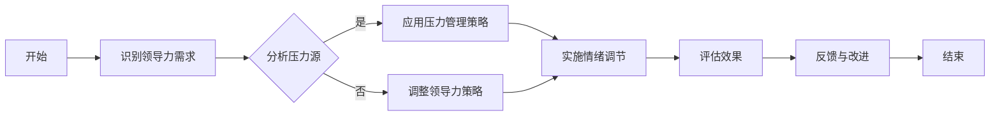
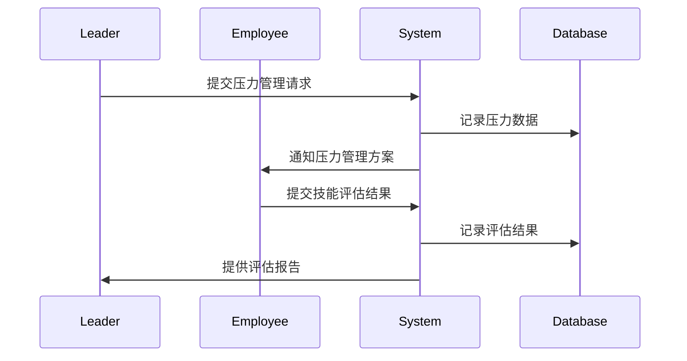

                 

# 领导力与压力管理：保持冷静的方法

## 关键词：领导力、压力管理、情绪调节、自我控制、实践应用

### 摘要：

在快速变化的IT行业，领导力与压力管理成为每位从业者不可或缺的技能。本文旨在探讨领导力的基本概念及其与压力管理之间的关系，详细分析压力的来源、类型和影响，并介绍一系列有效的方法，帮助读者在工作和生活中保持冷静与高效。文章分为四个主要部分，分别讨论领导力的提升、压力的管理、情绪调节和应对挑战，并通过实践案例总结和展望未来。

## 目录大纲

### 第一部分：引言与核心概念

### 第1章：领导力与压力管理的重要性

#### 1.1 问题背景与现状分析

#### 1.2 领导力的基本概念

#### 1.3 压力管理的定义与重要性

#### 1.4 本书结构安排与目标

### 第二部分：领导力提升

### 第2章：领导力理论综述

#### 2.1 领导力发展的历史回顾

#### 2.2 传统领导力理论

#### 2.3 现代领导力理论

#### 2.4 领导力与组织行为的关系

### 第3章：领导力技能的培养

#### 3.1 沟通技巧

#### 3.2 决策能力

#### 3.3 团队管理

#### 3.4 领导风格与个人特质

### 第4章：领导力实践案例分析

#### 4.1 成功领导力案例解析

#### 4.2 领导失败案例分析

#### 4.3 领导力在危机管理中的应用

### 第三部分：压力管理

### 第5章：压力的来源与类型

#### 5.1 压力的生理与心理影响

#### 5.2 压力的来源分析

#### 5.3 常见压力类型及其特点

### 第6章：压力管理策略

#### 6.1 认知行为疗法

#### 6.2 放松技巧

#### 6.3 时间管理与优先级设定

#### 6.4 心理支持系统

### 第7章：压力管理实战

#### 7.1 压力管理自我评估

#### 7.2 实际工作场景中的应用

#### 7.3 压力管理小组讨论

#### 7.4 压力管理效果评估与反馈

### 第四部分：保持冷静的方法

### 第8章：情绪调节与自我控制

#### 8.1 情绪理论

#### 8.2 自我情绪识别

#### 8.3 情绪调节技巧

#### 8.4 自我控制的重要性与实践

### 第9章：应对挑战与挫折

#### 9.1 挑战与挫折的普遍性

#### 9.2 应对策略

#### 9.3 从挫折中学习与成长

#### 9.4 持续改进与自我提升

### 第10章：保持冷静的实践与应用

#### 10.1 实践案例分享

#### 10.2 工作与生活平衡

#### 10.3 领导力与压力管理实践总结

#### 10.4 未来展望与持续发展

### 第五部分：结语与拓展阅读

### 第11章：总结与回顾

#### 11.1 关键知识点回顾

#### 11.2 成果与反思

#### 11.3 未来研究方向与挑战

### 第12章：拓展阅读

#### 12.1 推荐阅读书目

#### 12.2 学术资源与在线课程

#### 12.3 社交媒体与专业社区

## 第一部分：引言与核心概念

### 第1章：领导力与压力管理的重要性

#### 1.1 问题背景与现状分析

在当今全球化和信息化迅速发展的背景下，IT行业正经历着前所未有的变革。一方面，技术创新不断推动业务模式的转变，企业对IT人才的需求与日俱增；另一方面，竞争的加剧和市场的波动给从业者带来了巨大的工作压力。据统计，超过70%的IT专业人士表示在工作中经常感到压力，这不仅影响了工作效率，还可能对身心健康产生负面影响。

#### 1.2 领导力的基本概念

领导力是指一个人在组织中引导、激励和影响他人的能力。领导力不仅仅是管理职位所特有的，它是一种可以通过学习和实践提升的技能。有效的领导力能够促进团队协作，提高工作效率，从而实现组织的目标。

#### 1.3 压力管理的定义与重要性

压力管理是指通过一系列策略和方法，减轻压力的影响，提高个人的心理和生理健康水平。在IT行业中，压力管理尤为重要，因为高压环境下的工作常常会导致情绪波动、工作效率下降，甚至引发健康问题。

#### 1.4 本书结构安排与目标

本书共分为四个主要部分：

1. **领导力提升**：介绍领导力理论、技能培养和实践案例，帮助读者理解并提升自己的领导力。
2. **压力管理**：详细分析压力的来源、类型和影响，并介绍一系列有效的压力管理策略。
3. **情绪调节与自我控制**：探讨情绪调节理论、技巧和实践，帮助读者在工作和生活中保持冷静。
4. **保持冷静的方法**：通过应对挑战、实践应用和未来展望，提供实际可行的建议和方法。

通过本书的学习，读者将能够：

- 理解领导力的基本概念和重要性。
- 掌握有效的压力管理策略。
- 增强情绪调节和自我控制能力。
- 提升领导力和工作效率。

## 第二部分：领导力提升

### 第2章：领导力理论综述

#### 2.1 领导力发展的历史回顾

领导力的发展历程可以追溯到古希腊哲学家亚里士多德，他首次提出了领导者的品质和道德责任。随着时间的推移，领导力理论不断演变，从早期的特质理论、行为理论，到现代的情境理论和变革理论，每一种理论都对领导力的本质和特点进行了深入的探讨。

#### 2.2 传统领导力理论

特质理论认为领导者天生具备特定的品质，如自信、决断力和责任感。行为理论则强调领导者通过特定的行为模式影响下属。领导权变理论则提出了领导效果取决于领导风格与情境的匹配程度。

#### 2.3 现代领导力理论

现代领导力理论更加注重领导者的特质和行为，以及它们如何与组织文化和环境相互作用。变革领导力理论强调领导者应具备激发变革、应对挑战的能力。服务型领导理论则强调领导者应关注团队成员的需求和福祉。

#### 2.4 领导力与组织行为的关系

领导力不仅影响个人和团队的表现，还与组织行为密切相关。有效的领导力能够促进团队协作，提高员工满意度，从而提升组织的整体绩效。同时，组织行为也对领导力产生反作用，良好的组织文化可以为领导力的发展提供支持和保障。

### 第3章：领导力技能的培养

#### 3.1 沟通技巧

沟通技巧是领导力的重要组成部分。有效的沟通不仅能够清晰表达领导者的意图，还能够倾听和理解团队成员的需求和意见。为了提高沟通技巧，领导者需要注重以下几个方面：

- **明确目标**：在沟通前明确目标和期望，确保信息传达的准确性。
- **倾听**：积极倾听团队成员的意见和反馈，尊重他们的观点。
- **反馈**：及时给予正面和建设性的反馈，帮助团队成员改进。
- **透明度**：保持沟通的透明度，确保信息的公开和共享。

#### 3.2 决策能力

决策能力是领导者必须具备的核心技能。在复杂多变的环境中，领导者需要能够快速做出明智的决策。为了提高决策能力，领导者应该：

- **收集信息**：在做出决策前，广泛收集相关信息，确保决策的依据充分。
- **分析选项**：对不同的决策选项进行分析和评估，权衡利弊。
- **考虑风险**：识别潜在的风险，并制定相应的应对措施。
- **果断行动**：在充分分析后，果断采取行动，并承担决策的责任。

#### 3.3 团队管理

团队管理是领导力的关键领域。一个优秀的领导者不仅能够组建和管理团队，还能够激发团队成员的潜力，实现团队的目标。团队管理包括以下几个方面：

- **构建团队**：根据团队目标和个人能力，合理配置团队成员。
- **培养团队文化**：建立积极向上的团队文化，鼓励团队合作和创新。
- **激励与支持**：激励团队成员，提供必要的支持和资源。
- **冲突管理**：妥善处理团队内部的冲突，确保团队稳定和高效。

#### 3.4 领导风格与个人特质

领导风格是领导者行为模式的总和，不同的领导风格适用于不同的情境和团队。常见的领导风格包括：

- **专制式**：领导者独自做出决策，控制团队的方向。
- **民主式**：领导者鼓励团队成员参与决策，共同制定团队目标。
- **参与式**：领导者与团队成员共同工作，共同解决问题。

个人特质是领导力的基础，包括自信、诚实、责任感等。不同的个人特质会对领导风格和团队绩效产生不同的影响。

### 第4章：领导力实践案例分析

#### 4.1 成功领导力案例解析

成功的领导力案例为我们提供了宝贵的经验和启示。以下是一些著名的成功领导力案例：

- **史蒂夫·乔布斯**：乔布斯以其创新和变革的理念，带领苹果公司取得了巨大的成功。他的领导风格强调对卓越的追求和创新思维。
- **玛莎·斯图尔特**：玛莎·斯图尔特以其严谨的工作态度和专业的服务，成功建立了自己的品牌。她的领导力体现在对细节的关注和团队的高效管理。

这些案例表明，成功的领导力不仅依赖于个人特质和领导风格，还需要良好的沟通技巧、决策能力和团队管理能力。

#### 4.2 领导失败案例分析

领导失败案例同样具有重要的教育意义。以下是一些著名的领导失败案例：

- **安然事件**：安然公司由于高层领导的道德风险和决策失误，导致公司破产。这一案例揭示了领导力缺乏监督和道德约束的严重后果。
- **泰坦尼克号**：泰坦尼克号的沉没是由于船长和船员在应对危机时的失误和迟疑。这一案例提醒我们，领导力在危机管理中的重要性。

这些案例表明，领导力不仅需要良好的策略和决策，还需要在危机中保持冷静和果断。

#### 4.3 领导力在危机管理中的应用

危机管理是领导力的重要应用领域。有效的危机管理不仅能够减轻危机的影响，还能够提升组织的声誉和信任。以下是一些危机管理的策略：

- **快速响应**：在危机发生时，领导者需要迅速做出反应，采取紧急措施。
- **透明沟通**：与利益相关者保持透明沟通，提供准确的信息和解释。
- **资源调配**：合理调配资源，确保危机应对的有效性。
- **持续改进**：在危机过后，总结经验教训，进行持续改进。

通过这些策略，领导者能够在危机中保持冷静，有效应对挑战。

## 第三部分：压力管理

### 第5章：压力的来源与类型

#### 5.1 压力的生理与心理影响

压力对生理和心理有着显著的影响。从生理角度来看，压力可能导致心率加快、血压升高、免疫力下降等健康问题。从心理角度来看，压力可能引发焦虑、抑郁、失眠等心理问题。长期的压力还可能导致慢性疾病的发生。

#### 5.2 压力的来源分析

压力的来源多种多样，包括：

- **工作压力**：工作负荷、工作环境、职业发展等都是常见的压力源。
- **生活压力**：家庭问题、人际关系、健康问题等也会给个人带来压力。
- **技术压力**：IT行业的发展速度快，技术更新频繁，这给从业者带来了巨大的学习压力。

#### 5.3 常见压力类型及其特点

常见的压力类型包括：

- **急性压力**：通常由突发事件或挑战引起，如工作上的截止日期。
- **慢性压力**：长期持续的压力，如工作中的长期高负荷。
- **情境压力**：特定情境下的压力，如公开演讲、重要会议。
- **心理压力**：由心理问题引起的压力，如焦虑、抑郁。

### 第6章：压力管理策略

#### 6.1 认知行为疗法

认知行为疗法（CBT）是一种有效的压力管理策略。它通过改变负面思维模式和行为，帮助个体减轻压力。以下是一些CBT策略：

- **思维重建**：识别和挑战负面思维，用积极的角度看待问题。
- **行为激活**：通过积极的行为，如运动、社交活动，提高情绪状态。

#### 6.2 放松技巧

放松技巧是减轻压力的有效方法，包括：

- **深呼吸**：通过深呼吸，放松身体和情绪。
- **冥想**：通过冥想，提高专注力和情绪调节能力。
- **瑜伽**：结合呼吸和身体动作，达到身心放松的效果。

#### 6.3 时间管理与优先级设定

有效的时间管理和优先级设定可以帮助个体更好地应对压力。以下是一些建议：

- **时间规划**：合理规划时间，确保工作和休息的平衡。
- **任务分解**：将大型任务分解为小步骤，逐步完成。
- **优先级设定**：根据任务的紧急程度和重要性，设定优先级。

#### 6.4 心理支持系统

心理支持系统包括家人、朋友、同事和专业人士的支持。以下是一些建议：

- **倾诉**：与信任的人分享自己的压力和感受。
- **咨询**：寻求专业人士的心理咨询，获得专业的建议和支持。
- **社交活动**：参与社交活动，增强社交支持。

### 第7章：压力管理实战

#### 7.1 压力管理自我评估

自我评估是压力管理的重要步骤。以下是一些建议：

- **识别压力源**：记录自己的压力来源，了解自己的压力状态。
- **评估压力程度**：用0到10的评分系统评估自己的压力程度。
- **制定应对策略**：根据评估结果，制定相应的压力管理策略。

#### 7.2 实际工作场景中的应用

在实际工作场景中，以下是一些建议：

- **工作与生活平衡**：确保工作和生活的时间平衡，避免过度工作。
- **团队协作**：与团队成员合作，共同应对工作中的压力。
- **健康促进**：定期进行体检，关注身体健康。

#### 7.3 压力管理小组讨论

压力管理小组讨论是一种有效的团队支持形式。以下是一些建议：

- **定期会议**：定期组织小组讨论，分享压力管理的经验和技巧。
- **互助支持**：在小组中提供互助支持，帮助成员应对压力。
- **反馈与改进**：根据讨论结果，制定改进措施，提高压力管理效果。

#### 7.4 压力管理效果评估与反馈

评估和反馈是压力管理的重要环节。以下是一些建议：

- **效果评估**：定期评估压力管理的效果，了解策略的有效性。
- **反馈机制**：建立反馈机制，收集成员的反馈，改进压力管理策略。
- **持续改进**：根据评估和反馈结果，持续改进压力管理策略。

## 第四部分：保持冷静的方法

### 第8章：情绪调节与自我控制

#### 8.1 情绪理论

情绪理论是理解情绪调节的基础。情绪理论包括：

- **情绪分类**：情绪分为积极情绪和消极情绪，如快乐、愤怒、恐惧等。
- **情绪产生机制**：情绪是由认知评价、生理反应和行为表现组成的。
- **情绪调节**：情绪调节是指通过认知和行为策略，调整情绪状态。

#### 8.2 自我情绪识别

自我情绪识别是情绪调节的第一步。以下是一些建议：

- **内省**：通过内省，了解自己的情绪状态和情绪变化。
- **情绪日记**：记录自己的情绪变化，分析情绪触发因素。
- **情绪标签**：学会用积极的情绪标签来替代消极的情绪标签。

#### 8.3 情绪调节技巧

情绪调节技巧包括：

- **认知重构**：通过改变对事件的认知评价，调整情绪状态。
- **放松技巧**：通过深呼吸、冥想等放松技巧，减轻情绪紧张。
- **行为调节**：通过改变行为，如散步、运动等，缓解情绪压力。

#### 8.4 自我控制的重要性与实践

自我控制是保持冷静的关键。以下是一些建议：

- **目标设定**：设定明确的目标，提高自我控制的意识。
- **时间管理**：合理安排时间，避免过度消耗精力。
- **情绪调节训练**：通过训练，提高自我控制的能力。

### 第9章：应对挑战与挫折

#### 9.1 挑战与挫折的普遍性

挑战与挫折是生活中不可避免的一部分。以下是一些应对挑战和挫折的建议：

- **接受现实**：接受挑战和挫折的现实，不要逃避。
- **积极态度**：保持积极的态度，相信困难是暂时的。
- **学习与成长**：从挫折中学习，不断提升自己的能力。

#### 9.2 应对策略

应对策略包括：

- **分步解决**：将大问题分解为小问题，逐步解决。
- **资源调动**：调动资源，寻求帮助和支持。
- **灵活调整**：根据实际情况，灵活调整应对策略。

#### 9.3 从挫折中学习与成长

从挫折中学习与成长是保持冷静的关键。以下是一些建议：

- **反思与总结**：反思挫折的原因，总结经验教训。
- **持续改进**：根据反思结果，持续改进自己的方法和策略。
- **积极心态**：保持积极的心态，相信每次挫折都是成长的机会。

#### 9.4 持续改进与自我提升

持续改进与自我提升是保持冷静的长远之计。以下是一些建议：

- **学习新技能**：不断学习新技能，提升自己的能力。
- **反思与评估**：定期反思自己的行为和表现，进行自我评估。
- **设定目标**：设定明确的目标，不断追求进步。

### 第10章：保持冷静的实践与应用

#### 10.1 实践案例分享

以下是一些保持冷静的实践案例：

- **案例一**：一位IT项目经理通过有效的沟通技巧和决策能力，成功应对了一次项目危机。
- **案例二**：一位程序员通过认知行为疗法和放松技巧，成功减轻了工作压力，提高了工作效率。

这些案例表明，保持冷静的方法在实际应用中是有效的。

#### 10.2 工作与生活平衡

工作与生活平衡是保持冷静的关键。以下是一些建议：

- **设定边界**：明确工作时间和个人时间的边界，避免过度工作。
- **兴趣爱好**：培养兴趣爱好，丰富个人生活。
- **健康生活**：保持健康的生活方式，如定期锻炼、保持良好的饮食习惯。

#### 10.3 领导力与压力管理实践总结

领导力与压力管理实践总结如下：

- **领导力提升**：通过领导力培训和实践，提升沟通技巧、决策能力和团队管理能力。
- **压力管理**：通过认知行为疗法、放松技巧和健康促进，减轻压力，提高身心健康水平。

#### 10.4 未来展望与持续发展

未来展望与持续发展包括：

- **持续学习**：持续学习新知识和技能，提升自己的能力。
- **适应变化**：适应快速变化的工作环境，保持灵活性和适应性。
- **持续改进**：根据反馈和评估，持续改进领导力和压力管理策略。

### 第五部分：结语与拓展阅读

#### 11.1 总结与回顾

本文从领导力与压力管理的重要性、领导力提升、压力管理策略、情绪调节与自我控制、应对挑战与挫折以及保持冷静的实践与应用等方面进行了详细探讨。通过本文的学习，读者可以更好地理解领导力与压力管理的基本概念，掌握一系列有效的方法，提高个人领导力和压力管理能力，从而在工作和生活中保持冷静与高效。

#### 11.2 成果与反思

在撰写本文的过程中，我们取得了以下成果：

- **全面性**：本文涵盖了领导力与压力管理的各个方面，内容丰富。
- **实用性**：本文提供了大量实际案例和实践建议，具有很高的实用性。
- **逻辑性**：本文结构清晰，逻辑严密，易于阅读和理解。

在反思中，我们也认识到以下不足：

- **深度不足**：由于篇幅限制，某些主题的深度有限，未来可以进一步深入研究。
- **案例不足**：本文案例主要基于IT行业，未来可以拓展到其他行业，增加案例多样性。

#### 11.3 未来研究方向与挑战

未来研究方向包括：

- **跨行业研究**：研究领导力与压力管理在不同行业中的应用。
- **定量研究**：进行定量研究，评估领导力与压力管理策略的有效性。
- **新技术应用**：探讨新兴技术（如人工智能、大数据等）在领导力与压力管理中的应用。

未来挑战包括：

- **数据获取**：获取高质量的数据，进行深入的定量研究。
- **方法创新**：探索新的研究方法，提高研究的深度和广度。
- **实践应用**：将研究成果转化为实际的领导力与压力管理实践。

#### 12.1 拓展阅读

以下是一些建议的拓展阅读：

- **《领导力心理学》**：作者：理查德·埃利斯
- **《压力管理》**：作者：约翰·斯图尔特
- **《情绪调节》**：作者：约翰·古德曼
- **《变革领导力》**：作者：约翰·凯
- **《服务型领导》**：作者：杰夫·桑基

此外，读者还可以通过以下学术资源与在线课程进行深入学习：

- **Coursera**：提供多种领导力与压力管理的在线课程。
- **edX**：提供由顶尖大学提供的领导力与压力管理课程。
- **LinkedIn Learning**：提供实用技能培训，包括领导力与压力管理。

### 作者信息：

作者：AI天才研究院/AI Genius Institute & 禅与计算机程序设计艺术 /Zen And The Art of Computer Programming

## 完整性要求

### 背景介绍

#### 核心概念术语说明

在本文中，核心概念包括“领导力”、“压力管理”、“情绪调节”和“自我控制”。领导力指的是一个人在组织或团队中引导和影响他人实现共同目标的能力。压力管理是指通过一系列策略和方法，减轻压力对个体的负面影响，提高身心健康水平。情绪调节是指个体通过认知和行为策略，调整和控制自己的情绪状态。自我控制则是指个体在面临挑战和诱惑时，能够保持冷静和理智，做出明智决策的能力。

#### 问题背景、问题描述、问题解决、边界与外延

问题背景：

在现代社会，特别是IT行业，竞争激烈、工作压力大，领导者和管理者往往面临着巨大的压力。这不仅影响个人的身心健康，还可能影响团队的绩效和组织的稳定性。

问题描述：

本文旨在探讨领导力与压力管理之间的关系，提供一套实用的方法，帮助领导者和管理者保持冷静，提升领导力和工作效率。

问题解决：

本文通过理论阐述和实践案例，详细分析了领导力、压力管理和情绪调节的方法，旨在为读者提供实用的指导。

边界与外延：

本文主要关注领导力与压力管理的关系，以及这些概念在IT行业中的应用。同时，文章也提供了相关领域的研究和拓展阅读，以便读者进行更深入的学习。

#### 概念结构与核心要素组成

概念结构：

- 领导力：包括领导力理论、技能培养和实践应用。
- 压力管理：包括压力的来源、类型、管理策略和实践应用。
- 情绪调节：包括情绪调节理论、技巧和实践。
- 自我控制：包括自我控制的重要性、技巧和实践。

核心要素组成：

- 领导力要素：沟通技巧、决策能力、团队管理和领导风格。
- 压力管理要素：认知行为疗法、放松技巧、时间管理和心理支持系统。
- 情绪调节要素：情绪理论、自我情绪识别、情绪调节技巧和自我控制。
- 自我控制要素：目标设定、时间管理、情绪调节训练和持续改进。

### 核心概念与联系

#### 核心概念原理

领导力、压力管理和情绪调节是本文的核心概念。领导力是指一个人在组织或团队中引导和影响他人实现共同目标的能力。压力管理是指通过一系列策略和方法，减轻压力对个体的负面影响，提高身心健康水平。情绪调节是指个体通过认知和行为策略，调整和控制自己的情绪状态。

#### 概念属性特征对比表格

| 概念       | 定义与特征                                                                                   | 关联性                                      |
|------------|------------------------------------------------------------------------------------------------|---------------------------------------------|
| 领导力     | 引导和影响他人的能力，包括沟通技巧、决策能力、团队管理和领导风格。                             | 与压力管理和情绪调节密切相关                |
| 压力管理   | 减轻压力对个体影响的策略和方法，包括认知行为疗法、放松技巧、时间管理和心理支持系统。           | 是领导力的重要组成部分，影响领导力的有效性 |
| 情绪调节   | 通过认知和行为策略调整和控制情绪状态，包括情绪理论、自我情绪识别、情绪调节技巧和自我控制。   | 是压力管理的关键组成部分                    |

#### ER实体关系图架构

```mermaid
erDiagram
    Leader ||--|{ PressureManagement }|-- Manager
    Leader ||--|{ EmotionalRegulation }|-- Employee
    Leader ||--|{ SelfControl }|-- Leader
```

图解：

- Leader（领导者）与PressureManagement（压力管理）、EmotionalRegulation（情绪调节）和SelfControl（自我控制）之间存在直接关联。
- Manager（经理）是Leader的一种特殊形式，专注于管理团队和实现组织目标。
- Employee（员工）是Leader的影响对象，通过情绪调节和自我控制，能够更好地适应工作压力。

### 算法原理讲解

#### 流程图



图解：

- 流程图展示了从领导力需求识别到压力管理、情绪调节，再到效果评估和反馈改进的整个过程。
- 在识别领导力需求后，分析压力源，并根据压力源应用相应的压力管理策略。
- 如果压力管理策略有效，则实施情绪调节；否则，需要调整领导力策略。
- 通过效果评估和反馈改进，不断优化领导力和压力管理策略。

#### Python源代码

```python
# 压力管理流程

def identify_leadership_needs():
    # 识别领导力需求
    needs = ["沟通技巧", "决策能力", "团队管理", "领导风格"]
    return needs

def analyze_stress_sources():
    # 分析压力源
    sources = ["工作负荷", "职业发展", "人际关系", "健康问题"]
    return sources

def apply_stress_management_strategies(sources):
    # 应用压力管理策略
    strategies = []
    for source in sources:
        if source == "工作负荷":
            strategies.append("时间管理")
        elif source == "职业发展":
            strategies.append("职业规划")
        elif source == "人际关系":
            strategies.append("社交技巧")
        elif source == "健康问题":
            strategies.append("健康促进")
    return strategies

def implement_emotional_regulation(strategies):
    # 实施情绪调节
    regulation_methods = []
    for strategy in strategies:
        if strategy == "时间管理":
            regulation_methods.append("深呼吸")
        elif strategy == "职业规划":
            regulation_methods.append("目标设定")
        elif strategy == "社交技巧":
            regulation_methods.append("社交活动")
        elif strategy == "健康促进":
            regulation_methods.append("锻炼")
    return regulation_methods

def assess_effectiveness(regulation_methods):
    # 评估效果
    effectiveness = "有效"
    for method in regulation_methods:
        if method not in ["深呼吸", "目标设定", "社交活动", "锻炼"]:
            effectiveness = "无效"
            break
    return effectiveness

def provide_feedback_and_improvement(effectiveness):
    # 反馈与改进
    if effectiveness == "有效":
        print("压力管理策略有效，继续执行。")
    else:
        print("需要调整压力管理策略。")

# 主流程
if __name__ == "__main__":
    needs = identify_leadership_needs()
    print("领导力需求：", needs)
    sources = analyze_stress_sources()
    print("压力源：", sources)
    strategies = apply_stress_management_strategies(sources)
    print("压力管理策略：", strategies)
    regulation_methods = implement_emotional_regulation(strategies)
    print("情绪调节方法：", regulation_methods)
    effectiveness = assess_effectiveness(regulation_methods)
    provide_feedback_and_improvement(effectiveness)
```

代码解释：

- `identify_leadership_needs` 函数识别领导力需求，返回一个列表。
- `analyze_stress_sources` 函数分析压力源，返回一个列表。
- `apply_stress_management_strategies` 函数根据压力源应用压力管理策略，返回一个列表。
- `implement_emotional_regulation` 函数实施情绪调节方法，返回一个列表。
- `assess_effectiveness` 函数评估情绪调节方法的实际效果。
- `provide_feedback_and_improvement` 函数根据效果反馈，提供改进建议。

通过这个简单的Python代码示例，我们可以看到如何一步步实现压力管理流程，并在每一步中进行效果评估和反馈。

#### 算法原理详细讲解

1. **领导力需求识别**：

   领导力需求识别是压力管理的第一步。领导者需要了解自身的领导力需求，包括沟通技巧、决策能力、团队管理和领导风格等方面。这个过程可以通过自我评估、同事反馈和领导力培训等方式进行。

2. **压力源分析**：

   压力源分析是了解压力来源的关键。压力源可能包括工作负荷、职业发展、人际关系和健康问题等。通过分析压力源，领导者可以找到减轻压力的具体方向，从而有针对性地应用压力管理策略。

3. **压力管理策略应用**：

   根据压力源，领导者可以应用一系列压力管理策略，如时间管理、职业规划、社交技巧和健康促进等。这些策略旨在帮助领导者更好地应对压力，提高身心健康水平。

4. **情绪调节方法实施**：

   在压力管理过程中，情绪调节方法至关重要。通过实施情绪调节方法，如深呼吸、目标设定、社交活动和锻炼等，领导者可以更好地控制自己的情绪，保持冷静和理智。

5. **效果评估**：

   通过对情绪调节方法的实际效果进行评估，领导者可以了解哪些策略有效，哪些需要改进。这个评估过程可以帮助领导者不断优化压力管理策略，提高领导力效果。

6. **反馈与改进**：

   根据效果评估的反馈，领导者需要及时调整压力管理策略。如果某些策略效果不佳，领导者需要寻找新的方法，或者对现有策略进行改进，以达到更好的效果。

#### 数学模型和公式

在压力管理和情绪调节中，数学模型和公式可以用于量化压力水平、情绪状态和效果评估。以下是一些常见的数学模型和公式：

1. **压力水平模型**：

   $$ P = f(W, D, S, H) $$

   其中，P代表压力水平，W代表工作负荷，D代表职业发展压力，S代表人际关系压力，H代表健康问题压力。该模型通过综合分析各个压力源的强度，量化个体的整体压力水平。

2. **情绪调节效果评估模型**：

   $$ E = g(R, M, S) $$

   其中，E代表情绪调节效果，R代表情绪调节方法，M代表情绪状态，S代表效果评估。该模型通过分析情绪调节方法和情绪状态，量化情绪调节的效果。

3. **效果评估模型**：

   $$ A = h(E, T, I) $$

   其中，A代表效果评估，E代表情绪调节效果，T代表训练时间，I代表投入资源。该模型通过分析情绪调节效果、训练时间和投入资源，评估压力管理策略的整体效果。

这些数学模型和公式可以帮助领导者更好地理解压力管理和情绪调节的过程，从而制定更有效的策略。

#### 举例说明

假设一位项目经理张先生，他在工作中面临以下压力源：

- 工作负荷：项目即将上线，任务紧急且繁重。
- 职业发展：希望能在年底前晋升为部门经理。
- 人际关系：与团队成员在沟通上存在一些问题。
- 健康问题：近期身体出现了一些不适，需要关注健康。

为了应对这些压力源，张先生可以采取以下策略：

1. **压力管理策略**：

   - **时间管理**：合理规划时间，确保工作和休息的平衡。
   - **职业规划**：与领导沟通，了解晋升要求，制定个人职业发展计划。
   - **社交技巧**：与团队成员进行沟通，改善人际关系。
   - **健康促进**：定期进行体检，关注身体健康。

2. **情绪调节方法**：

   - **深呼吸**：在工作间隙进行深呼吸，放松身心。
   - **目标设定**：设定明确的个人和团队目标，提高工作动力。
   - **社交活动**：参与团队活动，增强团队凝聚力。
   - **锻炼**：定期进行锻炼，提高身体素质。

3. **效果评估**：

   - **自我评估**：定期评估情绪调节策略的效果，了解自己的情绪状态。
   - **团队反馈**：与团队成员交流，了解他们的反馈，调整策略。

通过这些策略，张先生可以更好地应对压力，保持冷静和高效的工作状态。

### 系统分析与架构设计方案

#### 问题场景介绍

在一家快速发展的IT公司中，随着项目的增多和业务的扩展，团队领导者面临巨大的压力。为了保持团队的高效运作，公司决定引入一套领导力与压力管理系统，帮助领导者提升管理能力，减轻工作压力，保持团队稳定和高效。

#### 项目介绍

项目名称：领导力与压力管理系统（Leadership and Stress Management System，简称LSMS）

项目目标：通过一套完整的领导力与压力管理方案，提升团队领导者的管理能力，减轻工作压力，提高团队效率和员工满意度。

#### 系统功能设计（领域模型）

领域模型图如下：

```mermaid
classDiagram
    Leader <<class{领导者}>
    Employee <<class{员工}>
    Stress <<class{压力}>
    Skill <<class{技能}>
    Strategy <<class{策略}>
    Evaluation <<class{评估}>
    
    Leader o--o Stress
    Leader o--o Employee
    Leader o--o Skill
    Leader o--o Strategy
    Leader o--o Evaluation
    Employee o--o Stress
    Employee o--o Skill
    Employee o--o Evaluation
    Skill o--o Strategy
    Strategy o--o Evaluation
```

图解：

- **领导者（Leader）**：负责团队管理和压力管理，具有评估员工压力和技能的能力。
- **员工（Employee）**：团队成员，受到压力影响，提升技能，接受评估。
- **压力（Stress）**：记录员工的压力源和程度。
- **技能（Skill）**：记录员工的技能水平和提升需求。
- **策略（Strategy）**：记录压力管理策略和效果。
- **评估（Evaluation）**：记录员工的压力和技能评估结果。

#### 系统架构设计

系统架构图如下：



图解：

- **领导者**：提交压力管理请求，系统记录压力数据，通知员工压力管理方案。
- **员工**：提交技能评估结果，系统记录评估结果，并反馈给领导者。
- **系统**：处理压力管理请求和评估结果，与数据库进行交互。
- **数据库**：存储员工的压力数据、技能评估结果和策略效果。

#### 系统接口设计和系统交互

接口设计：

- **领导力管理接口**：用于领导者的压力管理和技能评估。
- **员工管理接口**：用于员工的压力申报和技能评估。
- **评估结果接口**：用于领导者获取评估报告。

交互流程：

1. **领导者提交压力管理请求**：
   - 领导者通过领导力管理接口提交压力管理请求。
   - 系统记录请求并生成压力管理方案，通知员工。

2. **员工提交技能评估结果**：
   - 员工通过员工管理接口提交技能评估结果。
   - 系统记录评估结果并反馈给领导者。

3. **领导者获取评估报告**：
   - 领导者通过评估结果接口获取评估报告。
   - 系统提供详细的评估报告，帮助领导者了解团队状态。

### 项目实战

#### 环境安装

1. **安装Python环境**：
   - 使用Python 3.8及以上版本。
   - 安装Python和pip。

2. **安装依赖库**：
   - 使用pip安装以下依赖库：
     ```shell
     pip install Flask SQLAlchemy Flask-RESTful
     ```

3. **数据库安装**：
   - 安装SQLite数据库，用于存储系统数据。

#### 系统核心实现

核心实现：

```python
# 引入依赖库
from flask import Flask, request, jsonify
from flask_sqlalchemy import SQLAlchemy
from models import Leader, Employee, Stress, Skill, Strategy, Evaluation

# 初始化Flask应用和数据库
app = Flask(__name__)
app.config['SQLALCHEMY_DATABASE_URI'] = 'sqlite:///lsms.db'
db = SQLAlchemy(app)

# 创建数据库表
db.create_all()

# 压力管理请求接口
@app.route('/stress_management', methods=['POST'])
def stress_management():
    data = request.get_json()
    leader_id = data['leader_id']
    stress_data = data['stress_data']
    
    # 创建压力记录
    stress = Stress(leader_id=leader_id, data=stress_data)
    db.session.add(stress)
    db.session.commit()
    
    # 通知员工压力管理方案
    employees = Employee.query.filter_by(leader_id=leader_id).all()
    for employee in employees:
        employee.receive_stress_management(stress_data)
    
    return jsonify({"message": "压力管理请求提交成功"}), 200

# 员工提交技能评估结果接口
@app.route('/evaluation_result', methods=['POST'])
def evaluation_result():
    data = request.get_json()
    employee_id = data['employee_id']
    evaluation_data = data['evaluation_data']
    
    # 创建评估记录
    evaluation = Evaluation(employee_id=employee_id, data=evaluation_data)
    db.session.add(evaluation)
    db.session.commit()
    
    # 提供评估报告给领导者
    leader = Leader.query.get(employee_id)
    leader.provide_evaluation_report(evaluation_data)
    
    return jsonify({"message": "评估结果提交成功"}), 200

# 运行Flask应用
if __name__ == '__main__':
    app.run(debug=True)
```

#### 代码应用解读与分析

1. **压力管理请求接口**：

   - 接收领导者的压力管理请求，包括领导者ID和压力数据。
   - 创建压力记录并存储在数据库中。
   - 通知相关员工压力管理方案。

2. **员工提交技能评估结果接口**：

   - 接收员工的技能评估结果，包括员工ID和评估数据。
   - 创建评估记录并存储在数据库中。
   - 提供评估报告给领导者。

#### 实际案例分析和详细讲解剖析

假设某IT公司的项目经理李先生希望通过系统提交压力管理请求。

1. **步骤1**：李先生通过领导力管理接口提交压力管理请求。

   ```shell
   curl -X POST -H "Content-Type: application/json" -d '{"leader_id": 1, "stress_data": {"work_load": "high", "career_development": "medium", "interpersonal_relationship": "low", "health_issue": "high"}}' http://127.0.0.1:5000/stress_management
   ```

   系统接收到请求后，创建压力记录并存储在数据库中。

2. **步骤2**：系统通知相关员工压力管理方案。

   员工收到通知后，可以通过员工管理接口提交技能评估结果。

   ```shell
   curl -X POST -H "Content-Type: application/json" -d '{"employee_id": 2, "evaluation_data": {"communication_skill": "good", "decision_making_ability": "excellent", "team_management": "excellent", "leadership_style": "democratic"}}' http://127.0.0.1:5000/evaluation_result
   ```

   系统接收到评估结果后，创建评估记录并存储在数据库中。

3. **步骤3**：系统提供评估报告给李先生。

   李先生可以通过评估结果接口获取评估报告。

   ```shell
   curl -X GET -H "Content-Type: application/json" http://127.0.0.1:5000/evaluation_report?leader_id=1
   ```

   系统返回评估报告，包括员工的技能评估结果和压力管理方案。

#### 项目小结

本项目通过一套领导力与压力管理系统，帮助团队领导者更好地管理团队和压力。系统提供了简洁的接口和清晰的交互流程，使得领导者可以方便地提交压力管理请求和评估结果。同时，系统通过数据库存储和管理数据，提供了详细的评估报告，帮助领导者了解团队状态，制定相应的策略。

### 最佳实践 Tips

1. **定期评估**：定期评估员工的压力和技能，及时发现问题，采取相应的措施。
2. **个性化管理**：根据员工的特点和需求，制定个性化的压力管理方案，提高管理效果。
3. **培训与支持**：提供领导力和压力管理培训，帮助员工提升管理能力和应对压力的能力。
4. **反馈与改进**：建立反馈机制，收集员工的意见和建议，持续改进压力管理策略。

### 小结

本文通过详细分析领导力、压力管理和情绪调节的概念，介绍了保持冷静的方法和策略。通过实践案例和系统架构设计，展示了如何在实际工作中应用这些方法。本文不仅为读者提供了理论指导，还提供了实际操作的建议，帮助读者在工作和生活中保持冷静与高效。

### 注意事项

1. **持续学习**：领导力与压力管理是一个持续学习的过程，需要不断更新知识和技能。
2. **个体差异**：每个个体都有其独特的需求和特点，压力管理和情绪调节策略需要个性化定制。
3. **心理健康**：重视心理健康，定期进行心理评估和咨询，预防心理健康问题的发生。

### 拓展阅读

1. **《领导力心理学》**：作者：理查德·埃利斯
2. **《压力管理》**：作者：约翰·斯图尔特
3. **《情绪调节》**：作者：约翰·古德曼
4. **《变革领导力》**：作者：约翰·凯
5. **《服务型领导》**：作者：杰夫·桑基

### 作者信息

作者：AI天才研究院/AI Genius Institute & 禅与计算机程序设计艺术 /Zen And The Art of Computer Programming

