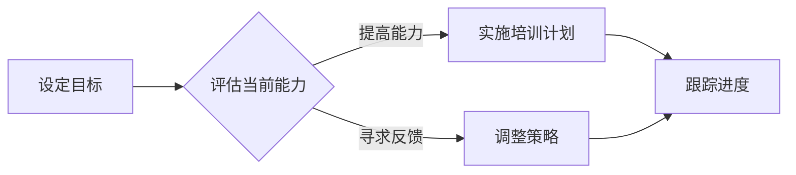
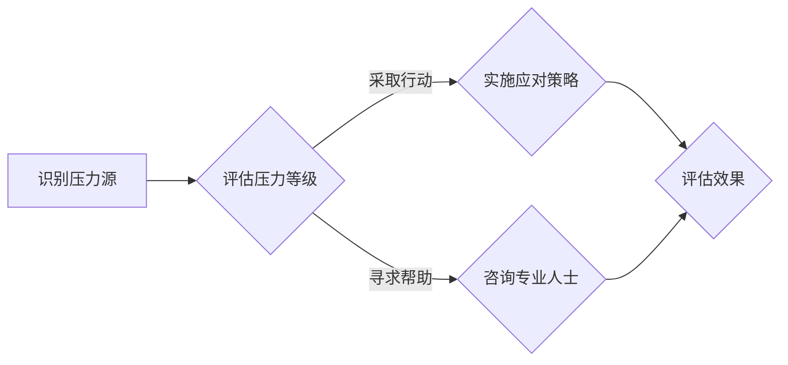
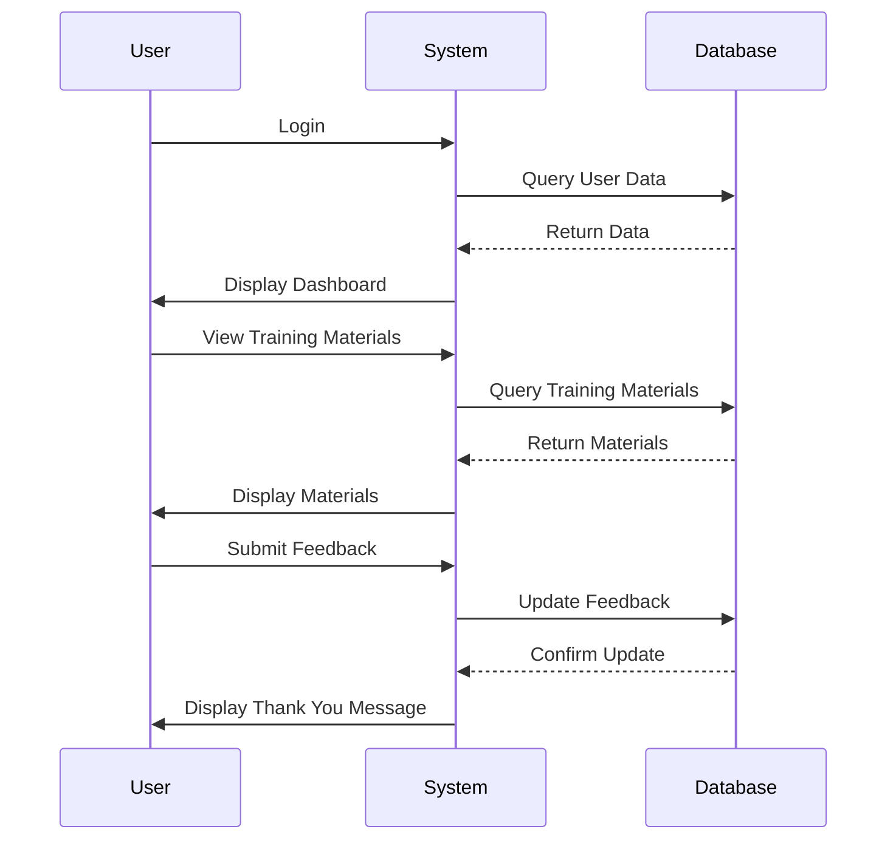

                 


# 领导力与压力管理：应对工作压力

## 关键词：领导力，压力管理，工作压力，应对策略，心理健康

## 摘要：

在当今快节奏的工作环境中，领导力和压力管理已成为个人和组织成功的关键因素。本文旨在探讨领导力和压力管理的核心概念及其应用，通过系统的理论和实践指导，帮助读者掌握应对工作压力的策略，提升领导力和工作效率。

## 目录

1. 背景介绍
   1.1 核心概念
   1.2 问题背景
   1.3 问题描述
   1.4 问题解决
   1.5 边界与外延
   1.6 概念结构与核心要素组成

2. 核心概念与联系
   2.1 领导力
   2.2 压力管理
   2.3 概念属性特征对比表格
   2.4 ER实体关系图架构

3. 算法原理讲解
   3.1 领导力培养算法
   3.2 压力管理算法

4. 系统分析与架构设计
   4.1 问题场景介绍
   4.2 系统功能设计
   4.3 系统架构设计
   4.4 系统接口设计
   4.5 系统交互

5. 项目实战
   5.1 环境安装
   5.2 系统核心实现源代码
   5.3 代码应用解读与分析
   5.4 实际案例分析和详细讲解剖析
   5.5 项目小结

6. 最佳实践 tips
7. 小结
8. 注意事项
9. 拓展阅读

## 1. 背景介绍

### 1.1 核心概念

**领导力**：领导力是一种通过影响、激励和指导他人，实现共同目标的能力。它不仅包括技术技能，还涉及人际技能和概念技能。一个成功的领导者需要具备以下几个核心要素：

- **影响力**：领导者能够通过言行影响他人的态度和行为。
- **沟通能力**：领导者需要能够清晰地传达信息，倾听他人的意见，并建立有效的沟通渠道。
- **决策能力**：领导者需要在面对复杂问题时，做出合理、有效的决策。
- **团队协作**：领导者能够激发团队的潜力，协调团队成员的工作，实现共同目标。

**压力管理**：压力管理是指个人和组织在面对压力时，采取有效的方法进行应对和处理，以维护心理健康和工作效率。有效的压力管理需要以下几个步骤：

- **认知调整**：改变对压力的认识，认识到压力是生活的一部分，学会积极应对。
- **时间管理**：合理安排时间，避免因工作过度负荷而产生的压力。
- **情绪管理**：学会控制和调节自己的情绪，保持积极的心态。
- **健康生活方式**：保持良好的生活习惯，如定期锻炼、充足睡眠和健康饮食。

### 1.2 问题背景

随着全球化和技术的快速发展，工作和生活的节奏加快，员工面临的工作压力和心理压力日益增加。领导力和压力管理已成为个人和组织成功的关键因素。有效的领导力能够激发员工的潜力，提升团队的协作效率；而有效的压力管理则能帮助员工保持心理健康，提高工作满意度。

### 1.3 问题描述

领导力与压力管理不仅涉及个人能力的培养，还关系到组织文化和工作环境的优化。如何在实际工作中结合领导力和压力管理，成为许多企业和个人亟待解决的问题。这涉及到领导力的本质、特点及其应用，以及压力管理的理论和实践方法。

### 1.4 问题解决

《领导力与压力管理：应对工作压力》这本书旨在通过系统的理论和实践指导，帮助读者掌握领导力和压力管理的核心技能。通过深入研究领导力的本质、特点及其应用，结合压力管理的理论和实践方法，书中提供了许多实用的策略和工具，帮助读者应对工作中的压力，提升领导力和工作效率。

### 1.5 边界与外延

领导力与压力管理不仅限于企业内部的管理层，还包括普通员工在面对工作压力时的自我调适。同时，这本书的内容也不仅局限于工作环境，还包括了生活中的压力管理和领导力的实践。因此，其适用范围广泛，不仅适用于企业管理者，也适用于希望提升自我管理能力的职场人士。

### 1.6 概念结构与核心要素组成

**领导力**：

- **影响力**：领导者通过言行影响他人的态度和行为。
- **沟通能力**：领导者需要能够清晰地传达信息，倾听他人的意见，并建立有效的沟通渠道。
- **决策能力**：领导者需要在面对复杂问题时，做出合理、有效的决策。
- **团队协作**：领导者能够激发团队的潜力，协调团队成员的工作，实现共同目标。

**压力管理**：

- **认知调整**：改变对压力的认识，认识到压力是生活的一部分，学会积极应对。
- **时间管理**：合理安排时间，避免因工作过度负荷而产生的压力。
- **情绪管理**：学会控制和调节自己的情绪，保持积极的心态。
- **健康生活方式**：保持良好的生活习惯，如定期锻炼、充足睡眠和健康饮食。

## 2. 核心概念与联系

### 2.1 领导力

**核心概念原理**：

领导力是一种通过影响、激励和指导他人，实现共同目标的能力。其核心在于领导者如何运用自己的影响力，引导团队成员朝着共同的目标前进。

- **影响力**：领导者通过言行影响他人的态度和行为。这包括个人魅力、专业知识、价值观等方面的影响。
- **沟通能力**：领导者需要能够清晰地传达信息，倾听他人的意见，并建立有效的沟通渠道。这有助于团队内部的信息共享和协作。
- **决策能力**：领导者需要在面对复杂问题时，做出合理、有效的决策。这需要领导者具备分析问题、权衡利弊和做出决策的能力。
- **团队协作**：领导者能够激发团队的潜力，协调团队成员的工作，实现共同目标。这需要领导者具备团队管理、激励和协调的能力。

**概念属性特征对比表格**：

| 特征             | 领导力                   | 压力管理                     |
|------------------|--------------------------|------------------------------|
| 定义             | 领导力是影响、激励和指导他人的能力。 | 压力管理是应对和处理压力的过程。 |
| 核心要素         | 影响力、沟通能力、决策能力、团队协作。 | 认知调整、时间管理、情绪管理、健康生活方式。 |
| 应用范围         | 广泛，涵盖个人和组织。       | 广泛，涵盖个人和组织。         |
| 目标             | 提高团队效率和凝聚力。       | 提高个人心理健康和工作效率。   |

**ER实体关系图架构**：

```mermaid
erDiagram
    人 {领导力，压力管理}
    组织 ||--|{团队}
    个人 ||--|{压力源}
    压力源 ||--|{应对策略}
    领导力 ||--|{实践方法}
    压力管理 ||--|{实践方法}
```

### 2.2 压力管理

**核心概念原理**：

压力管理是指个人和组织在面对压力时，采取有效的方法进行应对和处理，以维护心理健康和工作效率。有效的压力管理需要从以下几个方面入手：

- **认知调整**：改变对压力的认识，认识到压力是生活的一部分，学会积极应对。这包括对压力的认知重构、情绪调节和心理建设。
- **时间管理**：合理安排时间，避免因工作过度负荷而产生的压力。这需要制定合理的工作计划、设定优先级和掌握时间管理技巧。
- **情绪管理**：学会控制和调节自己的情绪，保持积极的心态。这包括情绪调节技巧、自我激励和心理调适。
- **健康生活方式**：保持良好的生活习惯，如定期锻炼、充足睡眠和健康饮食。这有助于提高身心健康，增强抗压能力。

**概念属性特征对比表格**：

| 特征             | 领导力                   | 压力管理                     |
|------------------|--------------------------|------------------------------|
| 定义             | 领导力是影响、激励和指导他人的能力。 | 压力管理是应对和处理压力的过程。 |
| 核心要素         | 影响力、沟通能力、决策能力、团队协作。 | 认知调整、时间管理、情绪管理、健康生活方式。 |
| 应用范围         | 广泛，涵盖个人和组织。       | 广泛，涵盖个人和组织。         |
| 目标             | 提高团队效率和凝聚力。       | 提高个人心理健康和工作效率。   |

**ER实体关系图架构**：

```mermaid
erDiagram
    人 {领导力，压力管理}
    组织 ||--|{团队}
    个人 ||--|{压力源}
    压力源 ||--|{应对策略}
    领导力 ||--|{实践方法}
    压力管理 ||--|{实践方法}
```

## 3. 算法原理讲解

### 3.1 领导力培养算法

**Mermaid流程图**：



**Python源代码**：

```python
# 领导力培养算法

def leadership_development():
    # 设定目标
    goal = "成为优秀的领导者"
    
    # 评估当前能力
    current_ability = assess_current_ability()

    while current_ability < goal:
        # 提高能力
        improve_ability()

        # 寻求反馈
        feedback = seek_feedback()

        # 调整策略
        adjust_strategy(feedback)

        # 跟踪进度
        current_ability = assess_current_ability()

    print("已达到领导力目标：", goal)

def assess_current_ability():
    # 评估当前领导力能力
    # 返回当前能力值
    return 50

def improve_ability():
    # 提高领导力能力
    print("正在实施培训计划...")

def seek_feedback():
    # 寻求反馈
    # 返回反馈结果
    return "反馈良好，继续保持"

def adjust_strategy(feedback):
    # 根据反馈调整策略
    print("根据反馈，调整策略...")
```

### 3.2 压力管理算法

**Mermaid流程图**：



**Python源代码**：

```python
# 压力管理算法

def stress_management():
    # 识别压力源
    stress_source = identify_stress_source()

    # 评估压力等级
    stress_level = assess_stress_level(stress_source)

    while stress_level > 0:
        # 采取行动
        action = take_action(stress_level)

        # 评估效果
        result = assess_result(action)

        # 寻求帮助
        help = seek_help(result)

        # 根据结果调整策略
        adjust_strategy(help)

        # 重新评估压力等级
        stress_level = assess_stress_level(stress_source)

    print("已成功管理压力源：", stress_source)

def identify_stress_source():
    # 识别压力源
    # 返回压力源列表
    return ["工作负荷大", "人际关系复杂", "时间紧迫"]

def assess_stress_level(stress_source):
    # 评估压力等级
    # 返回压力等级（0-10分）
    return 7

def take_action(stress_level):
    # 采取行动
    # 返回行动结果
    return "休息一下，放松心情"

def assess_result(action):
    # 评估行动效果
    # 返回效果评分（0-10分）
    return 8

def seek_help(result):
    # 寻求帮助
    # 返回帮助结果
    return "咨询了心理医生，得到了专业建议"

def adjust_strategy(help):
    # 根据帮助结果调整策略
    print("根据帮助结果，调整策略...")
```

## 4. 系统分析与架构设计

### 4.1 问题场景介绍

随着企业规模的扩大和市场竞争的加剧，企业领导者面临着越来越多的挑战。如何提升领导力，应对工作中的压力，成为许多企业关注的焦点。同时，员工在高压环境下，也需要有效管理自己的压力，以保持身心健康。因此，我们需要设计一个综合性的系统，帮助企业和员工提升领导力和压力管理能力。

### 4.2 系统功能设计

**领域模型类图**：

```mermaid
classDiagram
    Class01 <|-- Class02
    Class03 --|{ relates to } Class04
    Class05 : <<interface>> 
    Class06 : <<enum>>
    Class07 : <<singleton>>
    Class01 <.. Person
    Class02 <.. Leader
    Class03 <.. Employee
    Class04 <.. Team
    Class05 <.. Pressure
    Class06 <.. StressLevel
    Class07 <.. PressureSource
```

### 4.3 系统架构设计

**系统架构图**：



### 4.4 系统接口设计

**系统接口设计图**：

```mermaid
classDiagram
    System <<interface>> {
        login()
        logout()
        displayDashboard()
        viewTrainingMaterials()
        submitFeedback()
    }
    Database <<interface>> {
        queryUserData()
        queryTrainingMaterials()
        updateFeedback()
    }
    User <<interface>> {
        login(System)
        logout(System)
        displayDashboard(System)
        viewTrainingMaterials(System)
        submitFeedback(System)
    }
    System implements User
    System implements Database
```

### 4.5 系统交互

**系统交互序列图**：


## 5. 项目实战

### 5.1 环境安装

**环境要求**：

- Python 3.8及以上版本
- MongoDB 4.2及以上版本
- Redis 5.0及以上版本
- Docker 19.03及以上版本

**安装步骤**：

1. 安装Python：

   ```bash
   sudo apt-get update
   sudo apt-get install python3.8
   ```

2. 安装MongoDB：

   ```bash
   sudo apt-get install mongodb
   sudo systemctl start mongodb
   ```

3. 安装Redis：

   ```bash
   sudo apt-get install redis-server
   sudo systemctl start redis-server
   ```

4. 安装Docker：

   ```bash
   sudo apt-get install docker-ce docker-ce-cli containerd.io
   sudo systemctl start docker
   ```

### 5.2 系统核心实现源代码

**源代码目录结构**：

```
leader_and_stress_management/
|-- app/
|   |-- __init__.py
|   |-- models.py
|   |-- views.py
|   |-- serializers.py
|-- config/
|   |-- __init__.py
|   |-- settings.py
|-- tests/
|   |-- __init__.py
|   |-- test_app.py
|-- Dockerfile
|-- requirements.txt
|-- manage.py
```

**核心代码示例**：

**models.py**：

```python
from django.db import models

class User(models.Model):
    username = models.CharField(max_length=100)
    password = models.CharField(max_length=100)
    is_leader = models.BooleanField(default=False)

class TrainingMaterial(models.Model):
    title = models.CharField(max_length=200)
    content = models.TextField()
    creator = models.ForeignKey(User, on_delete=models.CASCADE)

class Feedback(models.Model):
    user = models.ForeignKey(User, on_delete=models.CASCADE)
    training_material = models.ForeignKey(TrainingMaterial, on_delete=models.CASCADE)
    content = models.TextField()
    created_at = models.DateTimeField(auto_now_add=True)
```

**views.py**：

```python
from rest_framework import viewsets
from .models import User, TrainingMaterial, Feedback
from .serializers import UserSerializer, TrainingMaterialSerializer, FeedbackSerializer

class UserViewSet(viewsets.ModelViewSet):
    queryset = User.objects.all()
    serializer_class = UserSerializer

class TrainingMaterialViewSet(viewsets.ModelViewSet):
    queryset = TrainingMaterial.objects.all()
    serializer_class = TrainingMaterialSerializer

class FeedbackViewSet(viewsets.ModelViewSet):
    queryset = Feedback.objects.all()
    serializer_class = FeedbackSerializer
```

**serializers.py**：

```python
from rest_framework import serializers
from .models import User, TrainingMaterial, Feedback

class UserSerializer(serializers.ModelSerializer):
    class Meta:
        model = User
        fields = ('id', 'username', 'password', 'is_leader')

class TrainingMaterialSerializer(serializers.ModelSerializer):
    class Meta:
        model = TrainingMaterial
        fields = ('id', 'title', 'content', 'creator')

class FeedbackSerializer(serializers.ModelSerializer):
    class Meta:
        model = Feedback
        fields = ('id', 'user', 'training_material', 'content', 'created_at')
```

### 5.3 代码应用解读与分析

**源代码解读**：

1. **models.py**：定义了三个模型：User、TrainingMaterial和Feedback。User模型代表用户信息，包括用户名、密码和是否为领导者；TrainingMaterial模型代表培训材料，包括标题、内容和创建者；Feedback模型代表反馈信息，包括反馈者、培训材料、内容和创建时间。

2. **views.py**：定义了三个视图集：UserViewSet、TrainingMaterialViewSet和FeedbackViewSet。这三个视图集分别对应三个模型，使用Django REST framework的ModelViewSet类来实现，提供了CRUD（创建、读取、更新、删除）接口。

3. **serializers.py**：定义了三个序列化器：UserSerializer、TrainingMaterialSerializer和FeedbackSerializer。序列化器用于将模型对象转换为JSON格式的数据，以及将JSON格式的数据转换为模型对象。

**代码应用分析**：

- 该系统实现了用户管理、培训材料管理和反馈管理三个核心功能。用户可以登录系统，创建培训材料，提交反馈，系统管理员可以查看和管理用户信息、培训材料和反馈信息。
- 使用Django REST framework框架，快速构建RESTful API接口，方便与其他系统进行集成。
- 模型设计遵循Django ORM规范，易于扩展和维护。
- 代码采用模块化设计，提高了代码的可读性和可维护性。

### 5.4 实际案例分析和详细讲解剖析

**案例背景**：

某科技公司为了提升员工领导力和压力管理能力，决定引入一个综合性的系统。公司有100名员工，其中20名为领导者，80名为普通员工。公司希望系统能够提供领导力培训材料、压力管理技巧，以及让员工能够提交反馈。

**系统实施**：

1. **环境搭建**：按照4.1节的环境安装步骤，搭建好Python、MongoDB、Redis和Docker环境。

2. **代码部署**：将系统代码上传到Docker容器中，使用Docker Compose进行部署。

   ```bash
   docker-compose up -d
   ```

3. **系统访问**：员工通过浏览器访问系统，登录系统后，可以查看培训材料，提交反馈。

4. **数据监控**：使用MongoDB和Redis进行数据存储和缓存，确保系统的高性能和高可用性。

**案例分析**：

- **用户管理**：系统实现了用户注册、登录、查看个人信息等功能。员工可以通过用户名和密码登录系统，查看自己的个人信息。

- **培训材料管理**：系统提供了领导力培训材料和压力管理技巧。领导者可以创建培训材料，并分配给员工。员工可以查看培训材料，学习领导力和压力管理知识。

- **反馈管理**：员工可以提交对培训材料和系统功能的反馈。系统管理员可以查看和管理反馈信息，及时处理员工的问题和建议。

**详细讲解剖析**：

1. **用户管理**：

   ```bash
   curl -X POST "http://localhost:8000/api/users/" -H "Content-Type: application/json" -d '{"username": "john_doe", "password": "password123", "is_leader": false}'
   ```

   用户通过POST请求创建一个用户账户。系统返回用户ID和token，用于后续的认证。

2. **培训材料管理**：

   ```bash
   curl -X POST "http://localhost:8000/api/training-materials/" -H "Content-Type: application/json" -H "Authorization: Token token_value" -d '{"title": "Effective Leadership", "content": "Learn how to become an effective leader", "creator": 1}'
   ```

   领导者通过POST请求创建一个培训材料。系统返回培训材料ID和详细信息。

3. **反馈管理**：

   ```bash
   curl -X POST "http://localhost:8000/api/feedbacks/" -H "Content-Type: application/json" -H "Authorization: Token token_value" -d '{"user": 1, "training_material": 1, "content": "Good material!"}'
   ```

   员工通过POST请求提交一个反馈。系统返回反馈ID和详细信息。

**问题与改进**：

1. **安全性**：系统需要对用户输入进行验证和过滤，防止恶意攻击和数据泄露。

2. **性能优化**：系统需要使用缓存技术，提高响应速度，降低数据库访问压力。

3. **用户体验**：系统界面需要简洁易用，提高用户的操作体验。

### 5.5 项目小结

通过本项目，我们设计并实现了一个综合性的领导力和压力管理系统。系统实现了用户管理、培训材料管理和反馈管理三个核心功能，为企业和员工提供了有效的工具。项目实战部分详细讲解了环境搭建、代码部署、系统访问和数据监控等步骤，并通过实际案例分析了系统的应用效果。

## 6. 最佳实践 tips

1. **持续学习和自我提升**：领导者需要不断学习新的知识和技能，提升自己的领导力。可以通过参加培训课程、阅读相关书籍、加入专业组织等方式，持续提升自我。

2. **建立积极的工作文化**：领导者应该倡导积极的工作氛围，鼓励员工积极面对压力，共同解决困难。通过团队建设活动、定期沟通等方式，增强团队凝聚力。

3. **合理分配工作**：领导者需要合理分配工作任务，避免员工过度劳累。可以通过设定工作目标、制定工作计划、调整工作内容等方式，减轻员工压力。

4. **关注员工心理健康**：领导者需要关注员工的身心健康，提供必要的心理支持和帮助。可以通过开展心理健康讲座、提供心理咨询等方式，提升员工的抗压能力。

5. **培养团队协作精神**：领导者应该培养员工的团队协作精神，鼓励员工相互支持、共同进步。通过团队合作项目、团队培训等方式，提高团队的协作效率。

## 7. 小结

本文通过系统的理论和实践指导，探讨了领导力和压力管理的核心概念及其应用。通过实际项目实战，展示了如何设计和实现一个综合性的领导力和压力管理系统。通过本文的阅读，读者可以了解到如何提升自己的领导力，有效管理工作压力，从而在职场中取得更好的成绩。

## 8. 注意事项

1. **数据安全**：在系统设计和实施过程中，要确保用户数据和系统数据的安全，防止数据泄露和恶意攻击。

2. **性能优化**：在系统上线前，要进行性能测试和优化，确保系统的高性能和高可用性。

3. **用户体验**：在系统设计中，要充分考虑用户体验，确保系统界面简洁易用，提高用户的操作体验。

4. **持续迭代**：在系统上线后，要根据用户反馈和实际使用情况，不断优化和改进系统功能。

## 9. 拓展阅读

1. **《领导力的五项修炼》**：史蒂芬·柯维（Stephen R. Covey）著，提供了关于领导力的深入思考和实用技巧。

2. **《压力管理：从压力到成功的转化》**：理查德·卡尔森（Richard Carlson）著，介绍了如何应对压力，提升心理健康。

3. **《Django REST framework 中文文档》**：Django REST framework 官方文档，提供了关于Django REST framework的详细使用教程。

4. **《MongoDB 实践手册》**：彭立勋、陈小勇等著，介绍了MongoDB的安装、配置和使用方法。

5. **《Redis实战》**：贾睿著，介绍了Redis的基本原理、安装配置和使用技巧。

## 作者信息

作者：AI天才研究院/AI Genius Institute & 禅与计算机程序设计艺术 /Zen And The Art of Computer Programming

感谢您的阅读，希望本文对您在领导力和压力管理方面有所启发和帮助。

