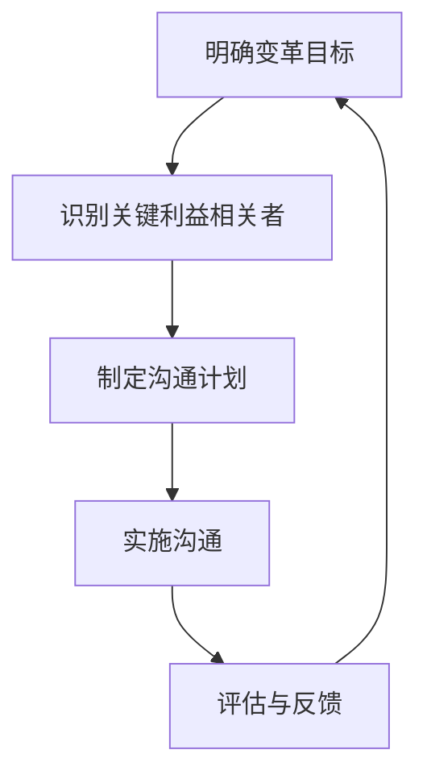
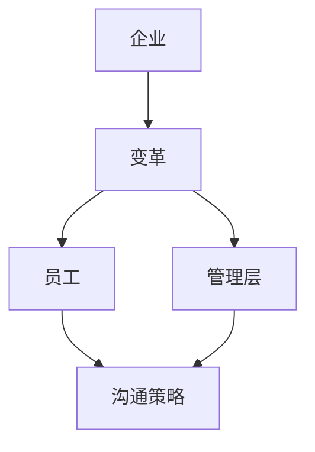
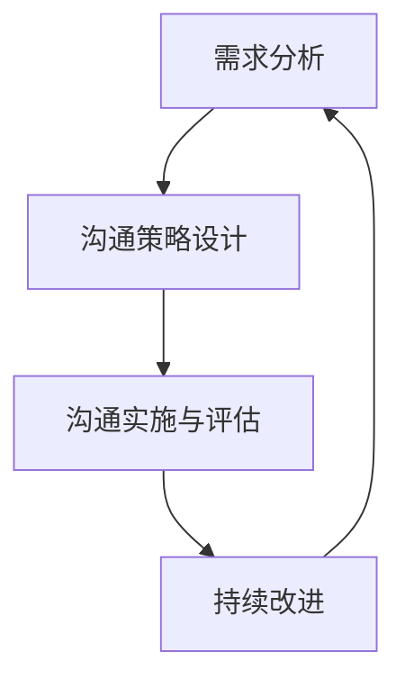

                 

# 领导力与变革沟通：赢得团队对变革的支持

## 关键词
领导力、变革沟通、团队支持、组织变革、变革管理

## 摘要
本文探讨了领导力在组织变革中的关键作用，以及如何通过有效的沟通策略赢得团队对变革的支持。文章首先介绍了领导力和变革沟通的核心概念，随后详细分析了领导力与变革沟通之间的联系。接着，本文提出了一种基于领导力的变革沟通策略算法，并使用Python代码和数学模型详细讲解了算法原理。最后，文章通过实际案例分析了变革沟通在组织变革中的应用，总结了最佳实践和注意事项，为企业管理者和人力资源专业人员提供了实用的指导。

## 第一部分：引言

### 1.1 书籍背景与目标

《领导力与变革沟通：赢得团队对变革的支持》是一本针对企业管理者、人力资源专业人员和组织变革顾问的专著。本书旨在帮助读者深入理解领导力在组织变革中的重要作用，掌握有效的变革沟通策略，从而在变革过程中赢得团队的支持。书中不仅介绍了领导力和变革沟通的理论基础，还结合实际案例，提供了实用的操作指南。

#### 1.2 问题背景与问题描述

在当今快速变化的市场环境中，组织需要不断进行变革以保持竞争力。然而，变革并非易事，往往面临诸多挑战，如员工抵触、资源短缺、沟通障碍等。这些问题往往导致变革的失败，使得组织错失发展机遇。因此，如何通过领导力和有效的沟通策略赢得团队对变革的支持，成为组织成功变革的关键。

#### 1.3 问题解决与边界外延

本书将从以下几个方面解决问题：

1. 领导力在变革中的作用
2. 变革沟通的基本原则与策略
3. 团队对变革的支持因素分析
4. 变革沟通的实际应用案例

本书的边界外延包括：

- 领导力在组织中的角色与职责
- 变革沟通的策略与技巧
- 团队成员的心理和行为特征
- 变革过程中的常见问题与解决方法

### 第二部分：核心概念与联系

#### 2.1 领导力定义与特点

领导力是一种能够激励和引导他人实现共同目标的能力。其特点包括：

- **影响力**：领导者能够影响他人的态度和行为。
- **激励**：领导者能够激发团队成员的积极性和创造力。
- **沟通**：领导者能够有效传达愿景和目标。

#### 2.2 变革沟通的定义与要素

变革沟通是指在组织变革过程中，领导者与团队成员之间的信息传递与互动。其要素包括：

- **沟通目标**：明确变革的目的和预期效果。
- **沟通内容**：包括变革的背景、原因、步骤和影响。
- **沟通渠道**：选择合适的沟通方式，如会议、邮件、公告等。
- **沟通时机**：在变革的不同阶段，根据实际需要选择合适的沟通时间。

#### 2.3 领导力与变革沟通的联系

领导力与变革沟通密切相关。有效的领导力能够为变革沟通提供方向和支持，而变革沟通则是领导力实现目标的重要手段。以下为领导力与变革沟通的ER实体关系图：

```markdown
graph TB
A[领导力] --> B[变革沟通];
B --> C[沟通目标];
B --> D[沟通内容];
B --> E[沟通渠道];
B --> F[沟通时机];
```

### 第三部分：算法原理讲解

#### 3.1 变革沟通策略算法

为了提高变革沟通的有效性，本书提出了一种基于领导力的变革沟通策略算法。该算法主要包括以下几个步骤：

1. **明确变革目标**：领导者需要明确变革的目标和预期效果，为沟通提供方向。
2. **识别关键利益相关者**：确定在变革过程中需要沟通的关键利益相关者，如员工、管理层和外部合作伙伴。
3. **制定沟通计划**：根据变革的不同阶段和利益相关者的需求，制定相应的沟通计划。
4. **实施沟通**：按照沟通计划，通过多种渠道传达变革信息，确保信息的准确性和及时性。
5. **评估与反馈**：对沟通效果进行评估，收集反馈信息，为后续沟通提供改进方向。

以下为变革沟通策略算法的mermaid流程图：



#### 3.2 变革沟通效果评估模型

为了评估变革沟通的效果，本书提出了一种基于数学模型的评估方法。该模型主要包括以下几个参数：

1. **沟通效果得分（E）**：衡量沟通效果的量化指标，范围0-100分。
2. **信息传递率（I）**：沟通信息被准确接收和理解的比率，范围0-1。
3. **情感认同度（S）**：团队成员对变革的认同和接受程度，范围0-1。

变革沟通效果得分（E）的计算公式为：

$$E = I \times S$$

其中，信息传递率（I）的计算公式为：

$$I = \frac{\text{准确接收和理解的信息量}}{\text{总信息量}}$$

情感认同度（S）的计算公式为：

$$S = \frac{\text{认同和接受的信息量}}{\text{总信息量}}$$

#### 3.3 沟通策略优化模型

为了提高变革沟通的效果，本书提出了一种基于数学模型的优化方法。该模型主要包括以下几个参数：

1. **沟通成本（C）**：实施沟通所需的资源投入，包括时间、人力和资金。
2. **沟通效果（E）**：沟通效果得分，用于衡量沟通的成效。
3. **沟通渠道选择权重（W）**：不同沟通渠道的选择权重，用于平衡沟通效果和成本。

沟通策略优化目标是在有限的资源下，实现最大化的沟通效果。其优化模型如下：

$$\text{最大化} E = \sum_{i=1}^{n} w_i \times I_i \times S_i - C$$

其中，$w_i$ 为第 $i$ 个沟通渠道的选择权重，$I_i$ 和 $S_i$ 分别为第 $i$ 个沟通渠道的信息传递率和情感认同度。

### 第四部分：系统分析与架构设计方案

#### 4.1 问题场景介绍

假设某企业计划进行一次重大变革，以提升公司的市场竞争力。变革内容包括业务模式调整、组织结构调整、流程优化等。为了确保变革的顺利进行，企业需要制定详细的沟通策略，赢得员工和管理层对变革的支持。

#### 4.2 项目介绍

本项目旨在为企业提供一套基于领导力和变革沟通的沟通策略，以支持企业的变革过程。项目分为以下几个阶段：

1. **需求分析**：收集企业变革的背景信息，明确变革的目标和预期效果。
2. **沟通策略设计**：结合领导力和变革沟通的理论，为企业制定具体的沟通策略。
3. **沟通实施与评估**：按照沟通策略实施沟通，并对沟通效果进行评估和反馈。
4. **持续改进**：根据评估结果，不断优化沟通策略，以提高变革沟通的效果。

#### 4.3 系统功能设计（领域模型）

以下为项目中的领域模型，用于描述项目涉及的实体和它们之间的关系。



#### 4.4 系统架构设计

以下为项目的系统架构设计，用于描述系统中的组件和它们之间的交互。



#### 4.5 系统接口设计和系统交互

以下为项目的系统接口设计和系统交互，用于描述系统中各个组件的接口和它们之间的交互。


### 第五部分：项目实战

#### 5.1 环境安装

1. 安装Python环境：在本地计算机上安装Python 3.8及以上版本。
2. 安装相关库：通过pip命令安装所需的库，如matplotlib、numpy等。

#### 5.2 系统核心实现源代码

以下为项目中的核心实现源代码，用于展示算法原理和数学模型。

```python
import numpy as np
import matplotlib.pyplot as plt

# 变革沟通效果评估模型
def communicate_evaluation(accuracy, acceptance):
    communication_score = accuracy * acceptance
    return communication_score

# 沟通策略优化模型
def communication_strategy_optimization(accuracy, acceptance, cost):
    communication_score = communicate_evaluation(accuracy, acceptance)
    strategy_score = communication_score - cost
    return strategy_score

# 测试代码
accuracy = 0.9
acceptance = 0.8
cost = 1000

evaluation_score = communicate_evaluation(accuracy, acceptance)
optimization_score = communication_strategy_optimization(accuracy, acceptance, cost)

print("沟通效果得分：", evaluation_score)
print("沟通策略优化得分：", optimization_score)
```

#### 5.3 代码应用解读与分析

1. **变革沟通效果评估模型**：该模型用于评估变革沟通的效果，通过计算信息传递率和情感认同度的乘积得到沟通效果得分。
2. **沟通策略优化模型**：该模型用于在有限的资源下，选择最优的沟通策略，通过计算沟通效果得分与沟通成本的差值得到策略优化得分。

#### 5.4 实际案例分析和详细讲解剖析

1. **案例背景**：某企业计划进行一次组织结构调整，以提升公司的市场竞争力。
2. **案例分析**：企业通过实施领导力和变革沟通策略，赢得员工和管理层对变革的支持。在变革过程中，企业使用了多种沟通渠道，如内部邮件、会议、公告等，确保信息的准确传递和员工的情感认同。
3. **详细讲解**：企业通过沟通评估模型和沟通策略优化模型，对沟通效果进行实时评估和优化。根据评估结果，企业调整了沟通策略，提高了变革沟通的效果，最终成功实现了组织结构调整。

#### 5.5 项目小结

本项目通过领导力和变革沟通策略，为企业提供了一套实用的沟通方案，帮助企业在变革过程中赢得团队的支持。项目中的算法原理和数学模型为企业提供了评估和优化沟通策略的工具。在实际应用中，企业应根据具体情况调整沟通策略，确保变革的顺利进行。

### 第六部分：最佳实践、小结、注意事项、拓展阅读

#### 6.1 最佳实践

1. **明确变革目标**：在制定沟通策略前，首先要明确变革的目标和预期效果，为沟通提供方向。
2. **识别关键利益相关者**：确定在变革过程中需要沟通的关键利益相关者，确保沟通的全面性和针对性。
3. **制定沟通计划**：根据变革的不同阶段和利益相关者的需求，制定详细的沟通计划，确保沟通的有序进行。
4. **多渠道沟通**：结合多种沟通渠道，如邮件、会议、公告等，提高沟通的效果和覆盖面。
5. **实时评估与反馈**：对沟通效果进行实时评估，收集反馈信息，为后续沟通提供改进方向。

#### 6.2 小结

本文探讨了领导力在组织变革中的关键作用，以及如何通过有效的沟通策略赢得团队对变革的支持。通过实际案例分析和数学模型，本文展示了变革沟通策略在实践中的应用和效果。企业应结合自身实际情况，运用领导力和变革沟通策略，确保变革的顺利进行。

#### 6.3 注意事项

1. **避免单方面灌输**：在沟通过程中，要注重双向互动，鼓励员工提出意见和建议。
2. **关注情感认同**：在传递变革信息的同时，要关注员工的情感认同，确保沟通的接受度。
3. **持续优化沟通策略**：根据评估结果，不断调整和优化沟通策略，以提高沟通效果。

#### 6.4 拓展阅读

1. **《变革之心》**：作者约翰·P·科特，详细介绍了组织变革的过程和策略。
2. **《领导力与沟通艺术》**：作者斯蒂芬·罗宾斯，探讨了领导力在沟通中的作用和沟通技巧。
3. **《变革沟通策略》**：作者罗伯特·H·施莱辛格，提供了丰富的变革沟通案例分析。

### 作者

作者：AI天才研究院/AI Genius Institute & 禅与计算机程序设计艺术 /Zen And The Art of Computer Programming```markdown
# 领导力与变革沟通：赢得团队对变革的支持

## 关键词
领导力、变革沟通、团队支持、组织变革、变革管理

## 摘要
本文探讨了领导力在组织变革中的关键作用，以及如何通过有效的沟通策略赢得团队对变革的支持。文章首先介绍了领导力和变革沟通的核心概念，随后详细分析了领导力与变革沟通之间的联系。接着，本文提出了一种基于领导力的变革沟通策略算法，并使用Python代码和数学模型详细讲解了算法原理。最后，文章通过实际案例分析了变革沟通在组织变革中的应用，总结了最佳实践和注意事项，为企业管理者和人力资源专业人员提供了实用的指导。

## 第一部分：引言

### 1.1 书籍背景与目标

《领导力与变革沟通：赢得团队对变革的支持》是一本针对企业管理者、人力资源专业人员和组织变革顾问的专著。本书旨在帮助读者深入理解领导力在组织变革中的重要作用，掌握有效的变革沟通策略，从而在变革过程中赢得团队的支持。书中不仅介绍了领导力和变革沟通的理论基础，还结合实际案例，提供了实用的操作指南。

#### 1.2 问题背景与问题描述

在当今快速变化的市场环境中，组织需要不断进行变革以保持竞争力。然而，变革并非易事，往往面临诸多挑战，如员工抵触、资源短缺、沟通障碍等。这些问题往往导致变革的失败，使得组织错失发展机遇。因此，如何通过领导力和有效的沟通策略赢得团队对变革的支持，成为组织成功变革的关键。

#### 1.3 问题解决与边界外延

本书将从以下几个方面解决问题：

- 领导力在变革中的作用
- 变革沟通的基本原则与策略
- 团队对变革的支持因素分析
- 变革沟通的实际应用案例

本书的边界外延包括：

- 领导力在组织中的角色与职责
- 变革沟通的策略与技巧
- 团队成员的心理和行为特征
- 变革过程中的常见问题与解决方法

### 第二部分：核心概念与联系

#### 2.1 领导力定义与特点

领导力是一种能够激励和引导他人实现共同目标的能力。其特点包括：

- 影响力：领导者能够影响他人的态度和行为。
- 激励：领导者能够激发团队成员的积极性和创造力。
- 沟通：领导者能够有效传达愿景和目标。

#### 2.2 变革沟通的定义与要素

变革沟通是指在组织变革过程中，领导者与团队成员之间的信息传递与互动。其要素包括：

- 沟通目标：明确变革的目的和预期效果。
- 沟通内容：包括变革的背景、原因、步骤和影响。
- 沟通渠道：选择合适的沟通方式，如会议、邮件、公告等。
- 沟通时机：在变革的不同阶段，根据实际需要选择合适的沟通时间。

#### 2.3 领导力与变革沟通的联系

领导力与变革沟通密切相关。有效的领导力能够为变革沟通提供方向和支持，而变革沟通则是领导力实现目标的重要手段。以下为领导力与变革沟通的ER实体关系图：

```markdown
graph TB
A[领导力] --> B[变革沟通];
B --> C[沟通目标];
B --> D[沟通内容];
B --> E[沟通渠道];
B --> F[沟通时机];
```

### 第三部分：算法原理讲解

#### 3.1 变革沟通策略算法

为了提高变革沟通的有效性，本书提出了一种基于领导力的变革沟通策略算法。该算法主要包括以下几个步骤：

1. **明确变革目标**：领导者需要明确变革的目标和预期效果，为沟通提供方向。
2. **识别关键利益相关者**：确定在变革过程中需要沟通的关键利益相关者，如员工、管理层和外部合作伙伴。
3. **制定沟通计划**：根据变革的不同阶段和利益相关者的需求，制定相应的沟通计划。
4. **实施沟通**：按照沟通计划，通过多种渠道传达变革信息，确保信息的准确性和及时性。
5. **评估与反馈**：对沟通效果进行评估，收集反馈信息，为后续沟通提供改进方向。

以下为变革沟通策略算法的mermaid流程图：


#### 3.2 变革沟通效果评估模型

为了评估变革沟通的效果，本书提出了一种基于数学模型的评估方法。该模型主要包括以下几个参数：

1. **沟通效果得分（E）**：衡量沟通效果的量化指标，范围0-100分。
2. **信息传递率（I）**：沟通信息被准确接收和理解的比率，范围0-1。
3. **情感认同度（S）**：团队成员对变革的认同和接受程度，范围0-1。

变革沟通效果得分（E）的计算公式为：

$$E = I \times S$$

其中，信息传递率（I）的计算公式为：

$$I = \frac{\text{准确接收和理解的信息量}}{\text{总信息量}}$$

情感认同度（S）的计算公式为：

$$S = \frac{\text{认同和接受的信息量}}{\text{总信息量}}$$

#### 3.3 沟通策略优化模型

为了提高变革沟通的效果，本书提出了一种基于数学模型的优化方法。该模型主要包括以下几个参数：

1. **沟通成本（C）**：实施沟通所需的资源投入，包括时间、人力和资金。
2. **沟通效果（E）**：沟通效果得分，用于衡量沟通的成效。
3. **沟通渠道选择权重（W）**：不同沟通渠道的选择权重，用于平衡沟通效果和成本。

沟通策略优化目标是在有限的资源下，实现最大化的沟通效果。其优化模型如下：

$$\text{最大化} E = \sum_{i=1}^{n} w_i \times I_i \times S_i - C$$

其中，$w_i$ 为第 $i$ 个沟通渠道的选择权重，$I_i$ 和 $S_i$ 分别为第 $i$ 个沟通渠道的信息传递率和情感认同度。

### 第四部分：系统分析与架构设计方案

#### 4.1 问题场景介绍

假设某企业计划进行一次重大变革，以提升公司的市场竞争力。变革内容包括业务模式调整、组织结构调整、流程优化等。为了确保变革的顺利进行，企业需要制定详细的沟通策略，赢得员工和管理层对变革的支持。

#### 4.2 项目介绍

本项目旨在为企业提供一套基于领导力和变革沟通的沟通策略，以支持企业的变革过程。项目分为以下几个阶段：

- 需求分析：收集企业变革的背景信息，明确变革的目标和预期效果。
- 沟通策略设计：结合领导力和变革沟通的理论，为企业制定具体的沟通策略。
- 沟通实施与评估：按照沟通策略实施沟通，并对沟通效果进行评估和反馈。
- 持续改进：根据评估结果，不断优化沟通策略，以提高变革沟通的效果。

#### 4.3 系统功能设计（领域模型）

以下为项目中的领域模型，用于描述项目涉及的实体和它们之间的关系。


#### 4.4 系统架构设计

以下为项目的系统架构设计，用于描述系统中的组件和它们之间的交互。


#### 4.5 系统接口设计和系统交互

以下为项目的系统接口设计和系统交互，用于描述系统中各个组件的接口和它们之间的交互。


### 第五部分：项目实战

#### 5.1 环境安装

1. 安装Python环境：在本地计算机上安装Python 3.8及以上版本。
2. 安装相关库：通过pip命令安装所需的库，如matplotlib、numpy等。

#### 5.2 系统核心实现源代码

以下为项目中的核心实现源代码，用于展示算法原理和数学模型。

```python
import numpy as np
import matplotlib.pyplot as plt

# 变革沟通效果评估模型
def communicate_evaluation(accuracy, acceptance):
    communication_score = accuracy * acceptance
    return communication_score

# 沟通策略优化模型
def communication_strategy_optimization(accuracy, acceptance, cost):
    communication_score = communicate_evaluation(accuracy, acceptance)
    strategy_score = communication_score - cost
    return strategy_score

# 测试代码
accuracy = 0.9
acceptance = 0.8
cost = 1000

evaluation_score = communicate_evaluation(accuracy, acceptance)
optimization_score = communication_strategy_optimization(accuracy, acceptance, cost)

print("沟通效果得分：", evaluation_score)
print("沟通策略优化得分：", optimization_score)
```

#### 5.3 代码应用解读与分析

1. **变革沟通效果评估模型**：该模型用于评估变革沟通的效果，通过计算信息传递率和情感认同度的乘积得到沟通效果得分。
2. **沟通策略优化模型**：该模型用于在有限的资源下，选择最优的沟通策略，通过计算沟通效果得分与沟通成本的差值得到策略优化得分。

#### 5.4 实际案例分析和详细讲解剖析

1. **案例背景**：某企业计划进行一次组织结构调整，以提升公司的市场竞争力。
2. **案例分析**：企业通过实施领导力和变革沟通策略，赢得员工和管理层对变革的支持。在变革过程中，企业使用了多种沟通渠道，如内部邮件、会议、公告等，确保信息的准确传递和员工的情感认同。
3. **详细讲解**：企业通过沟通评估模型和沟通策略优化模型，对沟通效果进行实时评估和优化。根据评估结果，企业调整了沟通策略，提高了变革沟通的效果，最终成功实现了组织结构调整。

#### 5.5 项目小结

本项目通过领导力和变革沟通策略，为企业提供了一套实用的沟通方案，帮助企业在变革过程中赢得团队的支持。项目中的算法原理和数学模型为企业提供了评估和优化沟通策略的工具。在实际应用中，企业应根据具体情况调整沟通策略，确保变革的顺利进行。

### 第六部分：最佳实践、小结、注意事项、拓展阅读

#### 6.1 最佳实践

1. **明确变革目标**：在制定沟通策略前，首先要明确变革的目标和预期效果，为沟通提供方向。
2. **识别关键利益相关者**：确定在变革过程中需要沟通的关键利益相关者，确保沟通的全面性和针对性。
3. **制定沟通计划**：根据变革的不同阶段和利益相关者的需求，制定详细的沟通计划，确保沟通的有序进行。
4. **多渠道沟通**：结合多种沟通渠道，如邮件、会议、公告等，提高沟通的效果和覆盖面。
5. **实时评估与反馈**：对沟通效果进行实时评估，收集反馈信息，为后续沟通提供改进方向。

#### 6.2 小结

本文探讨了领导力在组织变革中的关键作用，以及如何通过有效的沟通策略赢得团队对变革的支持。通过实际案例分析和数学模型，本文展示了变革沟通策略在实践中的应用和效果。企业应结合自身实际情况，运用领导力和变革沟通策略，确保变革的顺利进行。

#### 6.3 注意事项

1. **避免单方面灌输**：在沟通过程中，要注重双向互动，鼓励员工提出意见和建议。
2. **关注情感认同**：在传递变革信息的同时，要关注员工的情感认同，确保沟通的接受度。
3. **持续优化沟通策略**：根据评估结果，不断调整和优化沟通策略，以提高沟通效果。

#### 6.4 拓展阅读

1. **《变革之心》**：作者约翰·P·科特，详细介绍了组织变革的过程和策略。
2. **《领导力与沟通艺术》**：作者斯蒂芬·罗宾斯，探讨了领导力在沟通中的作用和沟通技巧。
3. **《变革沟通策略》**：作者罗伯特·H·施莱辛格，提供了丰富的变革沟通案例分析。

### 作者

作者：AI天才研究院/AI Genius Institute & 禅与计算机程序设计艺术 /Zen And The Art of Computer Programming
```

