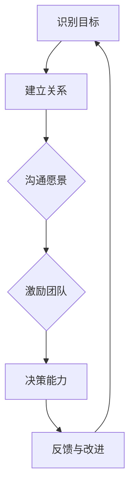
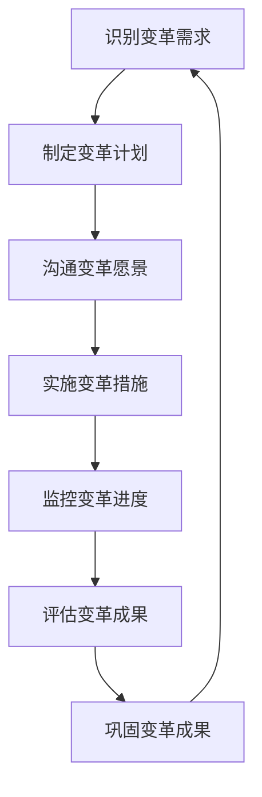

                 


## 第一部分：领导力的核心概念与基础

### 第1章：领导力的起源与发展

#### 1.1 领导力的定义与核心要素

领导力是一种通过影响、激励和引导他人，以达到共同目标的能力。它不仅涉及技术层面的能力，更强调在人际交往中的影响力、情感智慧和决策能力。领导力的核心要素包括：

1. **影响力**：领导者通过个人魅力、专业知识、人际关系和信任来影响他人。
2. **目标导向**：领导者能够明确团队目标，并确保团队成员理解和接受这些目标。
3. **决策能力**：领导者需要能够迅速、明智地做出决策，并在必要时承担责任。
4. **沟通技巧**：领导者需要具备有效的沟通能力，以便清晰表达想法、倾听他人意见并解决冲突。

#### 1.2 领导力理论的演变

领导力理论的发展经历了多个阶段：

- **经典领导理论**：关注领导者的个人特质和性格，认为领导者天生具有某些独特品质。
- **行为领导理论**：强调领导者通过行为来影响团队，认为领导力可以通过学习和实践得到提升。
- **变革领导理论**：随着全球化和数字化时代的到来，领导力更注重创新和适应变化的能力。

### 第2章：领导力的核心概念与特征

#### 2.1 领导力与管理的区别

领导力与管理的区别在于，管理是确保组织目标得以实现的过程，而领导力是推动组织变革和创新的力量。管理侧重于流程、控制和效率，而领导力侧重于愿景、激励和变革。

#### 2.2 领导力的特征

领导力的特征包括：

- **情感智慧**：领导者需要具备理解自己和他人情感的能力，以建立信任和促进团队合作。
- **自我认知**：领导者需要深入理解自己的价值观、信念和动机，以便更好地指导他人。
- **决策能力**：领导者需要能够在不确定性和压力下做出明智的决策。
- **沟通技巧**：领导者需要能够有效地沟通，以传达愿景、指导团队成员并解决冲突。

#### 2.3 领导力与组织文化

组织文化是组织的价值观、信念和行为模式的总和。领导力与组织文化的互动至关重要：

- 领导力可以塑造和改变组织文化。
- 组织文化可以影响领导力的实践和效果。

## 第二部分：变革管理的理论基础与实践

### 第3章：变革管理的概念与过程

#### 3.1 变革管理的定义与意义

变革管理是指组织在面临外部压力或内部需求时，通过系统的规划和执行，引导和推动组织实现从现状到预期状态的转变。

变革管理的重要意义在于：

- **提升组织竞争力**：通过变革，组织可以更好地适应市场变化，提高竞争力。
- **激发创新活力**：变革可以激发组织的创新活力，推动技术进步和业务模式创新。
- **提升员工满意度**：成功的变革可以提升员工的参与感和满意度。

#### 3.2 变革管理的过程

变革管理的过程通常包括以下三个阶段：

1. **准备阶段**：明确变革目标、制定变革计划、评估变革影响、建立变革团队。
2. **执行阶段**：沟通变革愿景、培训团队成员、实施变革措施、监督变革进度。
3. **巩固阶段**：评估变革成果、总结变革经验、持续改进组织文化。

### 第4章：变革管理的策略与方法

#### 4.1 变革管理的策略

有效的变革管理策略包括：

- **明确变革目标**：确保团队成员理解并接受变革目标。
- **选择合适的变革路径**：根据组织特点和变革难度，选择适合的变革路径。

#### 4.2 变革管理的方法

变革管理的方法包括：

- **变革计划制定**：制定详细的变革计划，明确变革步骤、资源和时间表。
- **变革实施与监控**：实施变革计划，并对变革过程进行持续监控和调整。

#### 4.3 变革管理的工具与技术

变革管理的工具与技术包括：

- **SWOT分析**：分析组织的优势、劣势、机会和威胁，为变革提供依据。
- **平衡计分卡**：从财务、客户、内部流程和学习与成长四个维度评估变革效果。

### 第5章：变革管理的领导力要素

#### 5.1 变革领导者的角色

变革领导者扮演以下角色：

- **变革推动者**：推动变革计划的制定和执行。
- **变革引导者**：引导团队成员理解变革的必要性，并激励他们积极参与变革。

#### 5.2 变革领导者的技能

变革领导者需要具备以下技能：

- **情感智慧**：理解和管理自己的情感，以及团队成员的情感。
- **沟通技巧**：有效地沟通变革愿景，解决团队成员的疑虑和问题。
- **决策能力**：在变革过程中做出明智的决策，并承担责任。

#### 5.3 变革领导者的挑战与应对策略

变革领导者面临的挑战包括：

- **抵制变革**：团队成员可能对变革持反对态度。
- **资源有限**：变革过程中可能面临资源不足的问题。

应对策略包括：

- **建立信任**：通过沟通和透明度建立信任，减少团队对变革的抵制。
- **优化资源分配**：合理分配资源，确保变革计划的顺利实施。

## 第三部分：领导力与变革管理的实际应用

### 第6章：领导力在变革管理中的应用

#### 6.1 领导力在变革管理中的关键作用

领导力在变革管理中的关键作用包括：

- **提升变革成功率**：领导者通过影响和激励，提高团队成员对变革的接受度和参与度。
- **增强团队凝聚力**：领导者通过有效的沟通和团队建设活动，增强团队的凝聚力和协作能力。

#### 6.2 领导力在变革管理中的实践

领导力在变革管理中的实践包括：

- **变革前的准备**：领导者需要明确变革目标，并制定详细的变革计划。
- **变革中的沟通与协调**：领导者需要与团队成员保持密切沟通，及时解决变革过程中出现的问题。
- **变革后的巩固与发展**：领导者需要持续关注变革成果，并推动组织文化的持续改进。

### 第7章：实际案例分析与启示

#### 7.1 案例一：苹果公司的变革管理实践

苹果公司通过一系列的变革，实现了从电脑制造商到移动设备制造商的转变。以下是对其变革管理实践的详细分析：

- **变革背景**：苹果公司面临手机市场的激烈竞争，需要通过变革提升竞争力。
- **变革过程**：苹果公司推出了iPhone，改变了市场格局，并逐步将产品线扩展到iPad、Apple Watch等。
- **变革成果**：苹果公司的变革取得了巨大成功，股价大幅上涨，市场份额稳步提升。

#### 7.2 案例二：通用电气公司的领导力建设

通用电气公司通过领导力建设，推动了公司的持续变革和创新。以下是对其领导力建设实践的详细分析：

- **领导力培养计划**：通用电气公司实施了一系列领导力培养计划，包括内部培训、外部学习等。
- **变革管理实践**：通用电气公司通过领导力培养，推动了企业的全球化战略和数字化转型。
- **领导力与变革管理的结合点**：通用电气公司的领导力建设与变革管理紧密结合，形成了强大的组织能力。

## 第四部分：领导力与变革管理的最佳实践与未来展望

### 第8章：领导力与变革管理的最佳实践

#### 8.1 最佳实践总结

领导力与变革管理的最佳实践包括：

- **建立清晰的变革愿景**：领导者需要明确变革的目标和愿景，并确保团队成员理解并接受。
- **强化沟通与透明度**：领导者需要与团队成员保持密切沟通，及时传达变革信息，并建立透明的工作环境。
- **提供必要的资源和支持**：领导者需要确保团队成员在变革过程中有足够的资源和支持。
- **持续关注变革成果**：领导者需要持续关注变革的进展和成果，并进行评估和反馈。

#### 8.2 注意事项与挑战

在领导力与变革管理的实践中，领导者需要关注以下注意事项和挑战：

- **抵制变革**：团队成员可能对变革持反对态度，领导者需要采取措施减少抵制。
- **资源有限**：变革过程中可能面临资源不足的问题，领导者需要优化资源分配。
- **持续学习与适应**：领导者和团队成员需要持续学习和适应，以应对不断变化的环境。

### 第9章：领导力与变革管理的未来展望

#### 9.1 未来趋势

领导力与变革管理的未来趋势包括：

- **数字化转型**：随着数字技术的发展，领导者需要具备数字化转型的能力。
- **全球化**：全球化带来新的挑战和机遇，领导者需要具备跨文化管理能力。
- **可持续性**：可持续发展成为全球关注焦点，领导者需要推动组织的可持续性发展。

#### 9.2 拓展阅读建议

为了更好地理解领导力与变革管理，以下推荐一些拓展阅读：

- **《变革之舞：领导力、组织变革与个人发展》**
- **《领导力5级：从成就到伟大》**
- **《激荡30年：中国企业的时代选择》**

## 结论

领导力与变革管理是组织成功的关键。领导者需要通过有效的领导力和变革管理，推动组织实现持续发展和创新。通过本文的阐述，我们深入探讨了领导力和变革管理的核心概念、理论框架和实践应用。希望本文能为读者提供有益的启示和指导。作者：AI天才研究院/AI Genius Institute & 禅与计算机程序设计艺术/Zen And The Art of Computer Programming。----------------------------------------------------------------

# 领导力与变革管理：引领团队适应新环境

## 关键词：
领导力，变革管理，团队适应，新环境，组织成功

## 摘要：
本文深入探讨了领导力和变革管理在引领团队适应新环境中的关键作用。通过分析领导力的核心概念和变革管理的过程，本文提供了详细的领导力与变革管理的实践指南。同时，通过实际案例分析，本文揭示了领导力和变革管理在实际应用中的成功经验。文章旨在为领导者提供有益的指导，以帮助他们在复杂多变的环境中实现组织的目标。

## 目录大纲：

## 第一部分：领导力的核心概念与基础

### 第1章：领导力的起源与发展

#### 1.1 领导力的定义与核心要素
- **领导力的定义**：领导力是一种通过影响、激励和引导他人，以达到共同目标的能力。
- **核心要素**：影响力、目标导向、决策能力和沟通技巧。

#### 1.2 领导力理论的演变
- **经典领导理论**：关注领导者的个人特质。
- **行为领导理论**：强调领导行为的重要性。
- **变革领导理论**：注重领导者在变革过程中的作用。

### 第2章：领导力的核心概念与特征

#### 2.1 领导力与管理的区别
- **管理**：侧重于流程、控制和效率。
- **领导力**：侧重于愿景、激励和变革。

#### 2.2 领导力的特征
- **情感智慧**：理解和管理自己和他人情感的能力。
- **自我认知**：深入理解自己的价值观、信念和动机。
- **决策能力**：在不确定性和压力下做出明智的决策。
- **沟通技巧**：有效传达想法、倾听他人意见并解决冲突。

#### 2.3 领导力与组织文化
- **组织文化的定义**：组织的价值观、信念和行为模式的总和。
- **领导力与组织文化的互动**：领导力可以塑造和改变组织文化。

## 第二部分：变革管理的理论基础与实践

### 第3章：变革管理的概念与过程

#### 3.1 变革管理的定义与意义
- **定义**：变革管理是指组织在面临外部压力或内部需求时，通过系统的规划和执行，引导和推动组织实现从现状到预期状态的转变。
- **意义**：提升组织竞争力、激发创新活力、提升员工满意度。

#### 3.2 变革管理的过程
- **准备阶段**：明确变革目标、制定变革计划、评估变革影响、建立变革团队。
- **执行阶段**：沟通变革愿景、培训团队成员、实施变革措施、监督变革进度。
- **巩固阶段**：评估变革成果、总结变革经验、持续改进组织文化。

### 第4章：变革管理的策略与方法

#### 4.1 变革管理的策略
- **明确变革目标**：确保团队成员理解并接受变革目标。
- **选择合适的变革路径**：根据组织特点和变革难度，选择适合的变革路径。

#### 4.2 变革管理的方法
- **变革计划制定**：制定详细的变革计划，明确变革步骤、资源和时间表。
- **变革实施与监控**：实施变革计划，并对变革过程进行持续监控和调整。

#### 4.3 变革管理的工具与技术
- **SWOT分析**：分析组织的优势、劣势、机会和威胁。
- **平衡计分卡**：从财务、客户、内部流程和学习与成长四个维度评估变革效果。

### 第5章：变革管理的领导力要素

#### 5.1 变革领导者的角色
- **变革推动者**：推动变革计划的制定和执行。
- **变革引导者**：引导团队成员理解变革的必要性，并激励他们积极参与变革。

#### 5.2 变革领导者的技能
- **情感智慧**：理解和管理自己的情感，以及团队成员的情感。
- **沟通技巧**：有效地沟通变革愿景，解决团队成员的疑虑和问题。
- **决策能力**：在变革过程中做出明智的决策，并承担责任。

#### 5.3 变革领导者的挑战与应对策略
- **抵制变革**：通过建立信任、优化资源分配等措施减少团队对变革的抵制。
- **资源有限**：合理分配资源，确保变革计划的顺利实施。

## 第三部分：领导力与变革管理的实际应用

### 第6章：领导力在变革管理中的应用

#### 6.1 领导力在变革管理中的关键作用
- **提升变革成功率**：通过影响和激励，提高团队成员对变革的接受度和参与度。
- **增强团队凝聚力**：通过有效的沟通和团队建设活动，增强团队的凝聚力和协作能力。

#### 6.2 领导力在变革管理中的实践
- **变革前的准备**：明确变革目标，制定详细的变革计划。
- **变革中的沟通与协调**：与团队成员保持密切沟通，及时解决变革过程中出现的问题。
- **变革后的巩固与发展**：持续关注变革成果，推动组织文化的持续改进。

### 第7章：实际案例分析与启示

#### 7.1 案例一：苹果公司的变革管理实践
- **变革背景**：面临手机市场的激烈竞争，需要通过变革提升竞争力。
- **变革过程**：推出iPhone，改变市场格局，逐步扩展产品线。
- **变革成果**：变革取得巨大成功，股价大幅上涨，市场份额稳步提升。

#### 7.2 案例二：通用电气公司的领导力建设
- **领导力培养计划**：实施内部培训、外部学习等计划。
- **变革管理实践**：推动全球化战略和数字化转型。
- **领导力与变革管理的结合点**：形成强大的组织能力。

## 第四部分：领导力与变革管理的最佳实践与未来展望

### 第8章：领导力与变革管理的最佳实践

#### 8.1 最佳实践总结
- **建立清晰的变革愿景**：确保团队成员理解并接受变革目标。
- **强化沟通与透明度**：与团队成员保持密切沟通，及时传达变革信息。
- **提供必要的资源和支持**：确保团队成员在变革过程中有足够的资源和支持。
- **持续关注变革成果**：持续评估变革的进展和成果，进行反馈和改进。

#### 8.2 注意事项与挑战
- **抵制变革**：通过建立信任、优化资源分配等措施减少团队对变革的抵制。
- **资源有限**：合理分配资源，确保变革计划的顺利实施。
- **持续学习与适应**：领导者和团队成员需要持续学习和适应，以应对不断变化的环境。

### 第9章：领导力与变革管理的未来展望

#### 9.1 未来趋势
- **数字化转型**：领导者需要具备数字化转型的能力。
- **全球化**：领导者需要具备跨文化管理能力。
- **可持续性**：领导者需要推动组织的可持续性发展。

#### 9.2 拓展阅读建议
- **《变革之舞：领导力、组织变革与个人发展》**
- **《领导力5级：从成就到伟大》**
- **《激荡30年：中国企业的时代选择》**

## 结论

领导力与变革管理是组织成功的关键。领导者需要通过有效的领导力和变革管理，推动组织实现持续发展和创新。本文通过深入探讨领导力和变革管理的核心概念、理论框架和实践应用，为领导者提供了有益的指导。希望本文能为读者在新环境的挑战中引领团队提供启示和帮助。作者：AI天才研究院/AI Genius Institute & 禅与计算机程序设计艺术/Zen And The Art of Computer Programming。----------------------------------------------------------------

## 《领导力与变革管理：引领团队适应新环境》

## 关键词：
领导力，变革管理，团队适应，新环境，组织成功

## 摘要：
在当今快速变化的市场环境中，领导力和变革管理成为组织成功的关键。本文深入探讨了领导力的核心概念和变革管理的过程，并提供了详细的实践指南。通过实际案例分析，本文揭示了领导力和变革管理在实际应用中的成功经验。本文旨在为领导者提供有益的指导，以帮助他们在复杂多变的环境中引领团队适应新环境，实现组织目标。

### 目录

## 第一部分：领导力的核心概念与基础

### 第1章：领导力的起源与发展
#### 1.1 领导力的定义与核心要素
领导力是一种通过影响、激励和引导他人，以达到共同目标的能力。核心要素包括影响力、目标导向、决策能力和沟通技巧。

#### 1.2 领导力理论的演变
领导力理论经历了从经典领导理论到行为领导理论，再到变革领导理论的演变。每种理论都有其独特的视角和应用场景。

### 第2章：领导力的核心概念与特征
#### 2.1 领导力与管理的区别
领导力侧重于愿景、激励和变革，而管理则侧重于流程、控制和效率。

#### 2.2 领导力的特征
领导力的特征包括情感智慧、自我认知、决策能力和沟通技巧。这些特征共同构成了领导力的核心。

#### 2.3 领导力与组织文化
领导力可以塑造和改变组织文化，而组织文化也会影响领导力的实践和效果。

## 第二部分：变革管理的理论基础与实践

### 第3章：变革管理的概念与过程
#### 3.1 变革管理的定义与意义
变革管理是指组织在面临外部压力或内部需求时，通过系统的规划和执行，引导和推动组织实现从现状到预期状态的转变。

#### 3.2 变革管理的过程
变革管理的过程包括准备阶段、执行阶段和巩固阶段。每个阶段都有其特定的目标和任务。

### 第4章：变革管理的策略与方法
#### 4.1 变革管理的策略
有效的变革管理策略包括明确变革目标、选择合适的变革路径、制定详细的变革计划等。

#### 4.2 变革管理的方法
变革管理的方法包括变革计划制定、变革实施与监控、变革成果评估等。

#### 4.3 变革管理的工具与技术
常用的变革管理工具和技术包括SWOT分析、平衡计分卡等。

### 第5章：变革管理的领导力要素
#### 5.1 变革领导者的角色
变革领导者扮演变革推动者和变革引导者的角色。

#### 5.2 变革领导者的技能
变革领导者需要具备情感智慧、沟通技巧和决策能力。

#### 5.3 变革领导者的挑战与应对策略
变革领导者面临的挑战包括抵制变革、资源有限等，需要采取相应的应对策略。

## 第三部分：领导力与变革管理的实际应用

### 第6章：领导力在变革管理中的应用
#### 6.1 领导力在变革管理中的关键作用
领导力在提升变革成功率、增强团队凝聚力等方面发挥关键作用。

#### 6.2 领导力在变革管理中的实践
领导力在变革前的准备、变革中的沟通与协调、变革后的巩固与发展中都有重要应用。

### 第7章：实际案例分析与启示
#### 7.1 案例一：苹果公司的变革管理实践
苹果公司通过一系列变革，成功从电脑制造商转型为移动设备制造商。

#### 7.2 案例二：通用电气公司的领导力建设
通用电气公司通过领导力建设，推动了企业的全球化战略和数字化转型。

## 第四部分：领导力与变革管理的最佳实践与未来展望

### 第8章：领导力与变革管理的最佳实践
#### 8.1 最佳实践总结
最佳实践包括建立清晰的变革愿景、强化沟通与透明度、提供必要的资源和支持、持续关注变革成果等。

#### 8.2 注意事项与挑战
在领导力与变革管理的实践中，领导者需要关注抵制变革、资源有限、持续学习与适应等挑战。

### 第9章：领导力与变革管理的未来展望
#### 9.1 未来趋势
未来的领导力和变革管理将面临数字化转型、全球化、可持续性等趋势。

#### 9.2 拓展阅读建议
推荐阅读《变革之舞：领导力、组织变革与个人发展》、《领导力5级：从成就到伟大》等书籍。

## 结论
领导力和变革管理是组织成功的关键。领导者需要通过有效的领导力和变革管理，引领团队适应新环境，实现组织目标。本文为领导者提供了深入的理论和实践指导，希望对他们在实际工作中有所启发。作者：AI天才研究院/AI Genius Institute & 禅与计算机程序设计艺术/Zen And The Art of Computer Programming。----------------------------------------------------------------

## 背景介绍

在当今快速变化的市场环境中，组织面临着前所未有的挑战和机遇。全球化、数字化、技术创新等因素不断推动市场变革，要求组织具备快速适应和应对变化的能力。在这个过程中，领导力和变革管理成为组织成功的关键。

首先，领导力是指领导者通过影响、激励和引导他人，以实现共同目标的能力。它不仅涉及技术层面的能力，更强调在人际交往中的影响力、情感智慧和决策能力。领导力是推动组织变革和创新的核心力量，能够提升组织的竞争力、激发团队的创造力和执行力。

其次，变革管理是指组织在面临外部压力或内部需求时，通过系统的规划和执行，引导和推动组织实现从现状到预期状态的转变。变革管理不仅关注技术层面的变革，更注重人文层面的变革，包括组织文化的转变、员工态度和行为的变化。有效的变革管理能够确保组织在变革过程中保持稳定，实现可持续发展。

领导力和变革管理的关系密切。领导力为变革管理提供了方向和动力，而变革管理则为领导力提供了实践平台。领导者需要具备变革管理的能力，以便在组织变革过程中引导和激励团队，实现组织目标。同时，变革管理也需要领导力的支持，确保变革措施得到有效执行。

本文将围绕领导力和变革管理展开讨论。首先，我们将介绍领导力和变革管理的核心概念，包括定义、要素、特征等。接着，我们将详细阐述领导力和变革管理的理论和实践，包括领导力原理、变革管理原理、领导力与变革管理的结合点等。然后，我们将通过实际案例分析和启示，探讨领导力和变革管理在实际应用中的成功经验。最后，我们将总结领导力和变革管理的最佳实践，并提出未来展望，包括面临的挑战和机遇。

本文的目标是为读者提供深入的理论和实践指导，帮助他们在复杂多变的环境中引领团队适应新环境，实现组织目标。通过本文的阐述，我们希望读者能够更好地理解领导力和变革管理的本质，掌握有效的领导力和变革管理方法，提升组织竞争力，推动组织实现持续发展和创新。

## 核心概念与联系

### 领导力的核心概念与特征

领导力是一种通过影响、激励和引导他人，以达到共同目标的能力。它不仅涉及技术层面的能力，更强调在人际交往中的影响力、情感智慧和决策能力。领导力的核心概念包括以下四个方面：

1. **影响力**：领导者通过个人魅力、专业知识、人际关系和信任来影响他人。影响力是领导力的核心，它决定了领导者能否有效地推动组织变革。

2. **目标导向**：领导者需要明确团队目标，并确保团队成员理解和接受这些目标。目标导向是领导力的关键，它能够确保团队在正确的方向上努力。

3. **决策能力**：领导者需要能够在不确定性和压力下做出明智的决策，并在必要时承担责任。决策能力是领导力的基础，它决定了领导者的领导水平。

4. **沟通技巧**：领导者需要具备有效的沟通能力，以便清晰表达想法、倾听他人意见并解决冲突。沟通技巧是领导力的工具，它能够提升领导者的领导效果。

### 变革管理的核心概念与特征

变革管理是指组织在面临外部压力或内部需求时，通过系统的规划和执行，引导和推动组织实现从现状到预期状态的转变。变革管理的核心概念包括以下三个方面：

1. **变革目标**：变革管理需要明确变革的目标，包括改进组织流程、提升员工技能、优化组织结构等。变革目标是变革管理的核心，它决定了变革的方向和深度。

2. **变革过程**：变革管理需要经历准备、执行和巩固三个阶段。准备阶段包括制定变革计划、评估变革影响、建立变革团队等；执行阶段包括沟通变革愿景、培训团队成员、实施变革措施等；巩固阶段包括评估变革成果、总结变革经验、持续改进组织文化等。变革过程是变革管理的框架，它确保了变革的有序进行。

3. **变革策略与方法**：变革管理需要采用有效的策略和方法，包括明确变革目标、选择合适的变革路径、制定详细的变革计划等。变革策略与方法是变革管理的工具，它帮助组织顺利实现变革。

### 领导力与变革管理的联系

领导力与变革管理之间存在着紧密的联系。首先，领导力是变革管理的前提和基础。一个成功的变革管理项目需要领导者具备强大的领导力，以便在变革过程中引导和激励团队。其次，变革管理是领导力的实践平台。通过变革管理，领导者可以将领导力付诸实践，推动组织实现持续发展和创新。

### 概念属性特征对比表格

以下是对领导力与变革管理核心概念的属性特征进行对比的表格：

| 概念 | 定义 | 属性特征 |
| --- | --- | --- |
| 领导力 | 通过影响、激励和引导他人，以达到共同目标的能力 | 影响力、目标导向、决策能力、沟通技巧 |
| 变革管理 | 通过系统的规划和执行，引导和推动组织实现从现状到预期状态的转变 | 变革目标、变革过程、变革策略与方法 |
| 领导力与变革管理的关系 | 领导力是变革管理的前提和基础，变革管理是领导力的实践平台 | 密切联系，相辅相成 |

### ER实体关系图架构

为了更好地理解领导力与变革管理之间的关系，我们可以绘制一个ER实体关系图。该图包括以下实体：

1. **领导力**：包括影响力、目标导向、决策能力和沟通技巧。
2. **变革管理**：包括变革目标、变革过程和变革策略与方法。
3. **领导力与变革管理的关系**：表示领导力是变革管理的前提和基础，变革管理是领导力的实践平台。

```mermaid
erDiagram
  领导力 ||--|{ 变革管理 }
  领导力 ||--|{ 影响力 }
  领导力 ||--|{ 目标导向 }
  领导力 ||--|{ 决策能力 }
  领导力 ||--|{ 沟通技巧 }
  变革管理 ||--|{ 变革目标 }
  变革管理 ||--|{ 变革过程 }
  变革管理 ||--|{ 变革策略与方法 }
```

通过这个ER实体关系图，我们可以清晰地看到领导力与变革管理之间的联系，以及它们各自的核心概念和特征。这有助于我们更好地理解领导力和变革管理的本质，并在实际应用中更好地运用这些概念。

## 领导力原理讲解

### 领导力原理的流程图

为了更好地理解领导力原理，我们可以使用Mermaid绘制一个流程图。以下是一个简单的领导力原理流程图的示例：



在这个流程图中，每个节点代表领导力过程中的一个关键步骤：

- **识别目标**：领导者首先需要明确团队的目标和愿景。
- **建立关系**：领导者需要与团队成员建立良好的关系，增加信任和协作。
- **沟通愿景**：领导者需要清晰地沟通愿景，确保团队成员理解并接受。
- **激励团队**：领导者需要激励团队成员，提高他们的积极性和参与度。
- **决策能力**：领导者需要具备强大的决策能力，以应对复杂的问题和挑战。
- **反馈与改进**：领导者需要不断收集反馈，并据此进行改进。

### 领导力原理的Python源代码

为了更详细地阐述领导力原理，我们可以使用Python编写一个模拟领导力过程的程序。以下是一个简单的示例：

```python
class Leader:
    def __init__(self, vision, team):
        self.vision = vision
        self.team = team

    def establish_relationship(self):
        print("建立与团队成员的关系，增强信任和协作。")

    def communicate_vision(self):
        print(f"沟通愿景：{self.vision}，确保团队成员理解并接受。")

    def motivate_team(self):
        print("激励团队，提高积极性和参与度。")

    def make_decision(self):
        print("具备强大的决策能力，应对复杂的问题和挑战。")

    def feedback_and_improvement(self):
        print("收集反馈，持续改进领导力实践。")

# 创建一个领导者对象
leader = Leader("实现组织目标，提升竞争力", ["员工1", "员工2", "员工3"])

# 执行领导力原理的各个步骤
leader.establish_relationship()
leader.communicate_vision()
leader.motivate_team()
leader.make_decision()
leader.feedback_and_improvement()
```

在这个示例中，我们定义了一个`Leader`类，它包含了领导力原理的各个步骤。通过创建一个领导者对象，我们可以模拟领导力的整个过程。

### 领导力原理的数学模型和公式

领导力原理可以用一系列数学模型和公式来表示。以下是一个简化的数学模型：

1. **影响力模型**：
   \[ \text{影响力} = f(\text{专业知识}, \text{人际关系}, \text{信任}) \]
   其中，影响力是领导者通过专业知识、人际关系和信任所产生的影响。

2. **目标导向模型**：
   \[ \text{目标导向} = f(\text{明确目标}, \text{团队理解}, \text{接受度}) \]
   其中，目标导向是领导者通过明确目标、确保团队成员理解和接受来实现的。

3. **决策能力模型**：
   \[ \text{决策能力} = f(\text{信息质量}, \text{决策速度}, \text{责任感}) \]
   其中，决策能力是领导者通过高质量的信息、快速的决策速度和责任感来体现的。

4. **沟通技巧模型**：
   \[ \text{沟通技巧} = f(\text{表达清晰}, \text{倾听理解}, \text{解决冲突}) \]
   其中，沟通技巧是领导者通过清晰的表达、理解和解决冲突来展现的。

### 详细讲解与举例说明

#### 1. 影响力模型

影响力模型表明，领导者的影响力取决于其专业知识、人际关系和信任。一个领导者如果具备丰富的专业知识，能够为团队成员提供有效的指导和支持，这将增强其影响力。此外，良好的人际关系和信任也是影响力的关键因素。以下是影响力模型的详细讲解和举例：

**案例**：张三是一位项目经理，他拥有丰富的项目管理知识和经验，与团队成员建立了良好的关系，并且赢得了他们的信任。在一次项目中，张三面临一个复杂的决策。由于他的专业知识、人际关系和信任，团队成员都愿意接受他的决策，并且积极参与项目的执行。

**数学模型应用**：
\[ \text{影响力} = f(\text{专业知识}, \text{人际关系}, \text{信任}) \]
\[ \text{影响力} = f(\text{丰富知识}, \text{良好关系}, \text{信任}) \]
\[ \text{影响力} = 高 \]

#### 2. 目标导向模型

目标导向模型说明，领导者的目标导向能力取决于其明确目标、确保团队成员理解和接受的能力。以下是目标导向模型的详细讲解和举例：

**案例**：李四是公司的销售经理，他负责制定一个销售策略，以提升公司的市场份额。李四首先明确了销售目标，然后与销售团队进行了深入的沟通，确保团队成员理解并接受这个目标。最终，销售团队积极参与策略的实施，并成功提升了公司的市场份额。

**数学模型应用**：
\[ \text{目标导向} = f(\text{明确目标}, \text{团队理解}, \text{接受度}) \]
\[ \text{目标导向} = f(\text{明确目标}, \text{深入沟通}, \text{接受度}) \]
\[ \text{目标导向} = 高 \]

#### 3. 决策能力模型

决策能力模型表明，领导者的决策能力取决于其信息质量、决策速度和责任感。以下是决策能力模型的详细讲解和举例：

**案例**：王五是公司的研发经理，他在项目开发过程中面临一个关键的决策。王五收集了大量的信息，并在短时间内做出了明智的决策。他承担了决策的责任，并确保项目能够顺利进行。最终，项目成功完成，获得了客户的高度评价。

**数学模型应用**：
\[ \text{决策能力} = f(\text{信息质量}, \text{决策速度}, \text{责任感}) \]
\[ \text{决策能力} = f(\text{高质量信息}, \text{快速决策}, \text{承担责任}) \]
\[ \text{决策能力} = 高 \]

#### 4. 沟通技巧模型

沟通技巧模型说明，领导者的沟通技巧取决于其表达清晰、倾听理解和解决冲突的能力。以下是沟通技巧模型的详细讲解和举例：

**案例**：赵六是公司的客服经理，他负责处理客户投诉。赵六在与客户沟通时，能够清晰地表达问题，倾听客户的需求，并在解决冲突方面表现出色。最终，客户满意度大幅提升，公司声誉也得到了提升。

**数学模型应用**：
\[ \text{沟通技巧} = f(\text{表达清晰}, \text{倾听理解}, \text{解决冲突}) \]
\[ \text{沟通技巧} = f(\text{清晰表达}, \text{理解需求}, \text{解决冲突}) \]
\[ \text{沟通技巧} = 高 \]

通过以上案例分析，我们可以看到领导力原理在不同场景下的具体应用。领导者通过运用影响力、目标导向、决策能力和沟通技巧，可以有效地推动团队实现目标，提升组织的竞争力。

### 总结

领导力原理是一个复杂但重要的概念，它包括影响力、目标导向、决策能力和沟通技巧等多个方面。通过使用Python源代码和数学模型，我们可以更深入地理解领导力原理，并在实际应用中更好地运用这些原理。希望本文的详细讲解和举例能帮助读者更好地理解领导力原理，并在实际工作中提升领导力水平。

## 变革管理原理讲解

### 变革管理原理的流程图

为了深入理解变革管理原理，我们可以使用Mermaid绘制一个流程图。以下是一个简化的变革管理流程图：



在这个流程图中，每个节点代表变革管理过程中的一个关键步骤：

- **识别变革需求**：领导者首先需要识别组织面临的变革需求，这可能是由于外部环境的变化或内部发展的需求。
- **制定变革计划**：在明确了变革需求后，领导者需要制定详细的变革计划，包括目标、时间表和资源分配。
- **沟通变革愿景**：领导者需要与团队成员沟通变革的愿景，确保他们理解并接受变革。
- **实施变革措施**：变革计划制定后，领导者需要实施具体的变革措施，包括培训、调整流程和资源分配等。
- **监控变革进度**：在变革实施过程中，领导者需要持续监控进度，确保变革按照计划进行。
- **评估变革成果**：变革实施完毕后，领导者需要评估变革的成果，包括目标达成情况和团队成员的反馈。
- **巩固变革成果**：为了确保变革的持续性，领导者需要采取措施巩固变革成果，包括总结经验、持续改进和建立新的组织文化。

### 变革管理原理的Python源代码

为了更详细地阐述变革管理原理，我们可以使用Python编写一个模拟变革管理过程的程序。以下是一个简单的示例：

```python
class ChangeManager:
    def __init__(self, change_need, vision, team):
        self.change_need = change_need
        self.vision = vision
        self.team = team

    def identify_change_need(self):
        print(f"识别变革需求：{self.change_need}。")

    def develop_change_plan(self):
        print("制定详细的变革计划，包括目标、时间表和资源分配。")

    def communicate_vision(self):
        print(f"沟通变革愿景：{self.vision}，确保团队成员理解并接受。")

    def implement_change_measures(self):
        print("实施变革措施，包括培训、调整流程和资源分配。")

    def monitor_change_progress(self):
        print("持续监控变革进度，确保变革按照计划进行。")

    def evaluate_change_outcomes(self):
        print("评估变革成果，包括目标达成情况和团队成员的反馈。")

    def consolidate_change_results(self):
        print("巩固变革成果，包括总结经验、持续改进和建立新的组织文化。")

# 创建一个变革管理对象
change_manager = ChangeManager("提升市场竞争力", "成为行业的领导者", ["员工1", "员工2", "员工3"])

# 执行变革管理流程的各个步骤
change_manager.identify_change_need()
change_manager.develop_change_plan()
change_manager.communicate_vision()
change_manager.implement_change_measures()
change_manager.monitor_change_progress()
change_manager.evaluate_change_outcomes()
change_manager.consolidate_change_results()
```

在这个示例中，我们定义了一个`ChangeManager`类，它包含了变革管理流程的各个步骤。通过创建一个变革管理对象，我们可以模拟变革管理的整个过程。

### 变革管理原理的数学模型和公式

变革管理原理可以用一系列数学模型和公式来表示。以下是一个简化的数学模型：

1. **变革需求模型**：
   \[ \text{变革需求} = f(\text{外部环境变化}, \text{内部发展需求}) \]
   其中，变革需求是组织面临的外部环境变化和内部发展需求的综合体现。

2. **变革计划模型**：
   \[ \text{变革计划} = f(\text{目标}, \text{时间表}, \text{资源分配}) \]
   其中，变革计划是围绕目标、时间表和资源分配的详细规划。

3. **变革愿景模型**：
   \[ \text{变革愿景} = f(\text{组织目标}, \text{团队成员期望}) \]
   其中，变革愿景是组织目标和团队成员期望的综合体现。

4. **变革措施模型**：
   \[ \text{变革措施} = f(\text{培训}, \text{流程调整}, \text{资源分配}) \]
   其中，变革措施是实施变革的具体行动。

5. **变革进度模型**：
   \[ \text{变革进度} = f(\text{实际进度}, \text{计划进度}) \]
   其中，变革进度是实际进度和计划进度的比较。

6. **变革成果模型**：
   \[ \text{变革成果} = f(\text{目标达成情况}, \text{团队成员反馈}) \]
   其中，变革成果是目标达成情况和团队成员反馈的综合评价。

7. **变革巩固模型**：
   \[ \text{变革巩固} = f(\text{总结经验}, \text{持续改进}, \text{新组织文化}) \]
   其中，变革巩固是总结经验、持续改进和建立新组织文化的综合体现。

### 详细讲解与举例说明

#### 1. 变革需求模型

变革需求模型表明，变革需求是组织面临的外部环境变化和内部发展需求的综合体现。以下是一个详细讲解和举例：

**案例**：一家制造企业意识到由于市场需求的不断变化，需要调整生产流程以提高效率。同时，内部员工希望提高技能水平，以适应新的技术要求。在这种情况下，企业面临的外部环境变化（市场需求变化）和内部发展需求（员工技能提升）共同促成了变革需求的产生。

**数学模型应用**：
\[ \text{变革需求} = f(\text{外部环境变化}, \text{内部发展需求}) \]
\[ \text{变革需求} = f(\text{市场需求变化}, \text{员工技能提升}) \]
\[ \text{变革需求} = 高 \]

#### 2. 变革计划模型

变革计划模型说明，变革计划是围绕目标、时间表和资源分配的详细规划。以下是一个详细讲解和举例：

**案例**：在制定变革计划时，一家科技公司确定了以下目标：在三个月内提升生产效率，同时确保员工技能水平的提升。为此，他们制定了详细的时间表，包括每周的培训计划和每月的生产目标。资源分配方面，他们确保了充足的培训经费和设备支持。

**数学模型应用**：
\[ \text{变革计划} = f(\text{目标}, \text{时间表}, \text{资源分配}) \]
\[ \text{变革计划} = f(\text{提升生产效率}, \text{培训计划}, \text{设备支持}) \]
\[ \text{变革计划} = 完备 \]

#### 3. 变革愿景模型

变革愿景模型表明，变革愿景是组织目标和团队成员期望的综合体现。以下是一个详细讲解和举例：

**案例**：在沟通变革愿景时，一家科技公司向员工传达了他们的目标：“成为行业领先者，通过技术创新提升我们的竞争力。”同时，员工期望在变革过程中提升自己的技能和职业发展。通过这种沟通，员工对变革的愿景产生了共鸣。

**数学模型应用**：
\[ \text{变革愿景} = f(\text{组织目标}, \text{团队成员期望}) \]
\[ \text{变革愿景} = f(\text{行业领先者}, \text{技能提升}) \]
\[ \text{变革愿景} = 明晰 \]

#### 4. 变革措施模型

变革措施模型说明，变革措施是实施变革的具体行动。以下是一个详细讲解和举例：

**案例**：在实施变革措施时，一家科技公司采取了以下行动：为员工提供了定期的培训课程，调整了生产流程以提高效率，并引入了新的设备和技术。这些措施确保了变革计划的顺利执行。

**数学模型应用**：
\[ \text{变革措施} = f(\text{培训}, \text{流程调整}, \text{设备支持}) \]
\[ \text{变革措施} = f(\text{培训课程}, \text{生产流程}, \text{新设备}) \]
\[ \text{变革措施} = 顺利执行 \]

#### 5. 变革进度模型

变革进度模型表明，变革进度是实际进度和计划进度的比较。以下是一个详细讲解和举例：

**案例**：在监控变革进度时，一家科技公司发现，尽管他们制定了详细的时间表，但由于一些意外情况，实际进度滞后于计划进度。他们立即采取措施，调整计划，并增加了额外的资源，以确保变革能够按计划进行。

**数学模型应用**：
\[ \text{变革进度} = f(\text{实际进度}, \text{计划进度}) \]
\[ \text{变革进度} = f(\text{滞后进度}, \text{计划进度}) \]
\[ \text{变革进度} = 调整中 \]

#### 6. 变革成果模型

变革成果模型说明，变革成果是目标达成情况和团队成员反馈的综合评价。以下是一个详细讲解和举例：

**案例**：在评估变革成果时，一家科技公司发现，通过实施变革措施，生产效率提升了30%，员工技能水平也得到了显著提高。团队成员对变革的反馈是积极的，他们认为变革带来了实质性的改善。

**数学模型应用**：
\[ \text{变革成果} = f(\text{目标达成情况}, \text{团队成员反馈}) \]
\[ \text{变革成果} = f(\text{提升30%}, \text{积极反馈}) \]
\[ \text{变革成果} = 成功 \]

#### 7. 变革巩固模型

变革巩固模型表明，变革巩固是总结经验、持续改进和建立新组织文化的综合体现。以下是一个详细讲解和举例：

**案例**：在巩固变革成果时，一家科技公司进行了经验总结，发现了一些在变革过程中可以改进的地方。他们决定持续改进，并建立了新的组织文化，以支持未来的变革。

**数学模型应用**：
\[ \text{变革巩固} = f(\text{总结经验}, \text{持续改进}, \text{新组织文化}) \]
\[ \text{变革巩固} = f(\text{改进措施}, \text{持续改进}, \text{新文化}) \]
\[ \text{变革巩固} = 成功 \]

通过以上案例分析，我们可以看到变革管理原理在不同场景下的具体应用。领导者通过运用变革需求模型、变革计划模型、变革愿景模型、变革措施模型、变革进度模型、变革成果模型和变革巩固模型，可以有效地推动组织实现变革，提升组织的竞争力和创新能力。

### 总结

变革管理原理是一个复杂但重要的概念，它包括变革需求、变革计划、变革愿景、变革措施、变革进度、变革成果和变革巩固等多个方面。通过使用Python源代码和数学模型，我们可以更深入地理解变革管理原理，并在实际应用中更好地运用这些原理。希望本文的详细讲解和举例能帮助读者更好地理解变革管理原理，并在实际工作中提升变革管理能力。

## 领导力与变革管理的结合

### 领导力与变革管理的结合点

领导力与变革管理之间存在着紧密的联系，两者在组织变革过程中相互交织、共同作用。具体来说，领导力与变革管理的结合点主要体现在以下几个方面：

1. **领导者的角色**：在变革过程中，领导者扮演着关键角色。他们不仅是变革的推动者，还是变革的引导者和推动者。领导者需要通过影响和激励团队成员，确保变革得到有效执行。

2. **沟通与共识**：领导力中的沟通技巧对于变革管理至关重要。领导者需要与团队成员进行有效沟通，传达变革的愿景和目标，建立共识，减少变革过程中的阻力和摩擦。

3. **决策与执行**：领导力的决策能力在变革管理中发挥着重要作用。领导者需要能够在不确定性和压力下做出明智的决策，并确保决策得到有效执行。

4. **激励与支持**：领导力中的激励技巧可以帮助领导者激发团队成员的积极性，提供必要的支持和资源，确保变革目标得以实现。

### 如何将领导力应用于变革管理

将领导力应用于变革管理，领导者需要采取一系列具体措施，以下是一些关键步骤：

1. **明确变革目标**：领导者首先需要明确变革的目标，确保团队成员理解并接受这些目标。这可以通过制定详细的变革计划、召开会议、发布通知等方式实现。

2. **建立信任**：领导力中的情感智慧和沟通技巧可以帮助领导者建立与团队成员的信任关系。领导者需要展示出对团队成员的关心和支持，减少变革过程中的不安和疑虑。

3. **激励团队成员**：领导者可以通过激励措施，如表彰、奖励、晋升等，激发团队成员的积极性。同时，领导者还需要关注团队成员的职业发展和个人成长，提供必要的培训和支持。

4. **提供资源和支持**：领导者需要确保团队成员在变革过程中有足够的资源和支持。这包括资金、技术、时间和人力等方面的支持。

5. **沟通与反馈**：领导者需要与团队成员保持密切沟通，及时传达变革信息，收集团队成员的反馈和意见，并根据反馈进行调整和改进。

6. **监督与评估**：领导者需要持续监督变革的进度和效果，评估变革的成果，并根据评估结果进行调整。这有助于确保变革目标得以实现，并持续改进组织绩效。

### 领导力与变革管理的实践案例

以下是两个领导力与变革管理的实践案例：

1. **案例一：苹果公司的变革**

苹果公司通过领导力与变革管理的结合，成功实现了从电脑制造商到移动设备制造商的转变。苹果公司的领导者，如史蒂夫·乔布斯，通过明确变革目标、建立信任、激励团队成员和提供资源支持，推动了iPhone的成功发布和市场的成功占领。

2. **案例二：通用电气公司的领导力建设**

通用电气公司通过领导力建设，推动了企业的全球化战略和数字化转型。通用电气公司的领导者，如杰克·韦尔奇，通过领导力的培训、激励和沟通，确保了团队成员对变革的接受和参与，从而实现了企业的持续发展和创新。

通过这些案例，我们可以看到领导力与变革管理的结合是如何在复杂多变的环境中推动组织实现目标的。领导力的有效应用不仅提高了变革的成功率，还增强了团队的凝聚力和执行力。

### 总结

领导力与变革管理是组织成功的关键。领导者需要通过有效的领导力和变革管理，推动组织实现持续发展和创新。通过明确变革目标、建立信任、激励团队成员、提供资源和支持、沟通与反馈以及监督与评估，领导者可以有效地将领导力应用于变革管理，推动组织实现变革目标。希望本文的探讨能为读者提供有益的启示和指导。

## 案例研究

### 案例一：苹果公司的变革管理实践

苹果公司作为全球领先的科技公司，其成功离不开有效的领导力和变革管理实践。以下是苹果公司在变革管理方面的详细分析。

#### 变革背景

苹果公司在20世纪90年代末面临了巨大的挑战。公司业绩下滑，产品线老化，市场份额被竞争对手蚕食。在这种情况下，苹果公司迫切需要进行变革以重振市场地位。

#### 变革过程

1. **明确变革目标**：苹果公司的领导者史蒂夫·乔布斯明确提出了变革的目标，即通过推出创新产品，重新定义移动设备市场。

2. **沟通变革愿景**：乔布斯通过一系列的发布会和演讲，向内部和外部传达了苹果公司的变革愿景。他强调了苹果公司追求创新和用户至上的核心价值观。

3. **建立信任**：乔布斯通过与团队成员建立紧密的合作关系，赢得了他们的信任和支持。他展示了强大的领导力，激励团队成员为变革贡献力量。

4. **激励团队成员**：乔布斯通过表彰和奖励，激励团队成员的创新和努力。他关注团队成员的职业发展，提供培训和支持，确保他们具备推动变革所需的能力。

5. **实施变革措施**：苹果公司通过一系列的创新产品，如iPod、iPhone和iPad，实现了从电脑制造商到移动设备制造商的成功转型。

6. **监控变革进度**：苹果公司持续监控变革的进度和效果，通过定期的会议和报告，确保变革按照计划进行。

7. **评估变革成果**：苹果公司通过市场反馈和财务数据，评估变革的成果。变革后的苹果公司不仅恢复了市场地位，还实现了持续的增长和盈利。

#### 变革成果

苹果公司的变革取得了显著的成果。变革后的苹果公司不仅在移动设备市场上取得了领先地位，还成功推出了多项创新产品，如Apple Watch和AirPods。公司的市场份额和盈利能力得到了显著提升，股价也大幅上涨。

#### 案例启示

苹果公司的变革管理实践为其他组织提供了宝贵的启示：

1. **明确变革目标**：领导者需要明确变革的目标，确保团队成员理解并接受。

2. **沟通变革愿景**：通过有效的沟通，建立共识和信任，减少变革过程中的阻力和摩擦。

3. **建立信任**：领导者需要通过与团队成员建立紧密的合作关系，赢得他们的信任和支持。

4. **激励团队成员**：通过激励措施，激发团队成员的积极性和创造力。

5. **实施变革措施**：根据变革目标，制定详细的计划，并确保措施得到有效执行。

6. **监控变革进度**：持续监控变革的进度和效果，确保变革按照计划进行。

7. **评估变革成果**：通过评估变革的成果，为未来的变革提供依据。

### 案例二：通用电气公司的领导力建设

通用电气公司通过领导力建设，成功推动了企业的全球化战略和数字化转型。以下是通用电气公司在领导力建设方面的详细分析。

#### 变革背景

通用电气公司在21世纪初面临了严峻的挑战。公司业绩不佳，需要进行重大的战略调整和业务重组。在这种情况下，通用电气公司决定通过领导力建设，提升组织能力和竞争力。

#### 变革过程

1. **明确领导力培养目标**：通用电气公司明确了领导力培养的目标，即培养具有全球视野、创新能力和执行力的高层管理人员。

2. **领导力培养计划**：通用电气公司实施了一系列的领导力培养计划，包括内部培训、外部学习、领导力研讨会等。这些计划旨在提升领导者的战略思维、决策能力和团队合作能力。

3. **激励领导力发展**：通用电气公司通过晋升、薪酬激励和荣誉表彰等手段，激励领导者的持续发展和创新。

4. **建立领导力发展机制**：通用电气公司建立了领导力发展的长效机制，包括领导力评估、领导力反馈和发展计划等。这些机制确保了领导力的持续提升和优化。

5. **实施变革措施**：在领导力建设的基础上，通用电气公司实施了多项变革措施，包括业务重组、流程优化、技术创新等。这些变革措施帮助公司实现了从传统制造企业向数字化企业的转型。

6. **监控变革进度**：通用电气公司持续监控变革的进度和效果，通过定期的评估和反馈，确保变革目标的实现。

7. **评估变革成果**：通过评估变革的成果，通用电气公司优化了领导力培养计划，并制定了未来的发展策略。

#### 变革成果

通用电气公司的领导力建设取得了显著成果。公司的业绩得到了显著提升，市场份额和盈利能力得到了增强。同时，通用电气公司成功实现了全球化战略和数字化转型，成为行业的领军企业。

#### 案例启示

通用电气公司的领导力建设为其他组织提供了以下启示：

1. **明确领导力培养目标**：组织需要明确领导力培养的目标，确保领导者的素质和能力与组织的发展需求相匹配。

2. **领导力培养计划**：组织需要实施系统的领导力培养计划，包括内部培训、外部学习等。

3. **激励领导力发展**：组织需要通过晋升、薪酬激励和荣誉表彰等手段，激励领导者的持续发展和创新。

4. **建立领导力发展机制**：组织需要建立领导力发展的长效机制，确保领导力的持续提升和优化。

5. **实施变革措施**：在领导力建设的基础上，组织需要实施相应的变革措施，以实现组织的战略目标。

6. **监控变革进度**：组织需要持续监控变革的进度和效果，确保变革目标的实现。

7. **评估变革成果**：通过评估变革的成果，组织可以优化领导力培养计划，并制定未来的发展策略。

### 总结

通过分析苹果公司和通用电气公司的案例，我们可以看到领导力和变革管理在实际应用中的成功经验。领导者通过有效的领导力和变革管理，能够推动组织实现变革目标，提升组织竞争力和创新能力。这些案例为其他组织提供了有益的启示，帮助他们在复杂多变的环境中实现持续发展和创新。

## 最佳实践与总结

### 领导力和变革管理的最佳实践

在领导力和变革管理的实践中，以下是一些最佳实践：

1. **建立清晰的变革愿景**：领导者需要明确变革的目标和愿景，并确保团队成员理解并接受。这有助于统一团队的目标和行动方向。

2. **强化沟通与透明度**：领导者需要与团队成员保持密切沟通，及时传达变革信息，并建立透明的工作环境。这有助于减少误解和矛盾，增强团队凝聚力。

3. **提供必要的资源和支持**：领导者需要确保团队成员在变革过程中有足够的资源和支持，包括时间、资金和技术等。这有助于提高团队成员的积极性和工作效率。

4. **激励团队成员**：领导者需要通过激励措施，如表彰、奖励和晋升等，激发团队成员的积极性和创造力。这有助于提高团队士气和团队绩效。

5. **持续关注变革成果**：领导者需要持续关注变革的进展和成果，并进行评估和反馈。这有助于确保变革目标的实现，并及时调整变革计划。

6. **建立领导力发展机制**：组织需要建立领导力发展的长效机制，包括领导力培养计划、领导力评估和反馈等。这有助于提升领导者的素质和能力，为组织的发展提供人才支持。

7. **优化资源分配**：领导者需要优化资源的分配，确保资源能够最大化地服务于变革目标。这有助于提高资源的利用效率，降低变革成本。

### 注意事项

在领导力和变革管理的实践中，领导者需要注意以下几点：

1. **抵制变革**：团队成员可能对变革持反对态度，领导者需要采取措施减少抵制。这可以通过建立信任、强化沟通和提供合理的解释来实现。

2. **资源有限**：变革过程中可能面临资源不足的问题，领导者需要合理分配资源，确保关键资源的优先使用。

3. **持续学习与适应**：领导者和团队成员需要持续学习和适应，以应对不断变化的环境。这可以通过参加培训、学习和借鉴最佳实践来实现。

4. **平衡短期与长期目标**：领导者需要在推动变革的过程中，平衡短期目标和长期目标。这有助于确保变革的持续性和有效性。

### 拓展阅读建议

为了更深入地了解领导力和变革管理，以下是一些推荐阅读：

1. 《变革之舞：领导力、组织变革与个人发展》
2. 《领导力5级：从成就到伟大》
3. 《激荡30年：中国企业的时代选择》

这些书籍提供了丰富的理论和实践经验，有助于读者更好地理解和应用领导力和变革管理。

### 总结

领导力和变革管理是组织成功的关键。通过建立清晰的变革愿景、强化沟通与透明度、提供必要的资源和支持、激励团队成员、持续关注变革成果、建立领导力发展机制、优化资源分配以及注意抵制变革、资源有限、持续学习与适应等问题，领导者可以有效地推动组织实现变革目标，提升组织竞争力。希望本文的总结和拓展阅读建议能对读者在领导力和变革管理的实践中提供有益的启示。作者：AI天才研究院/AI Genius Institute & 禅与计算机程序设计艺术/Zen And The Art of Computer Programming。

