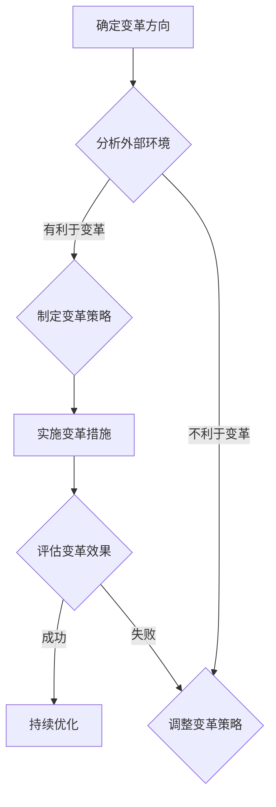
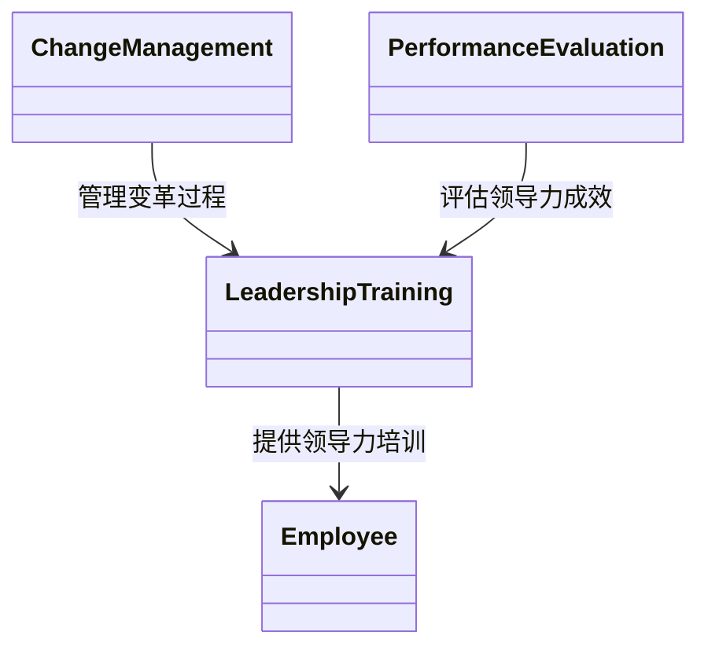
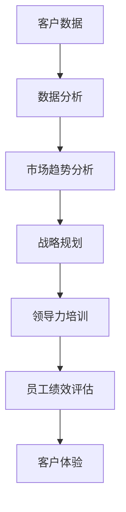
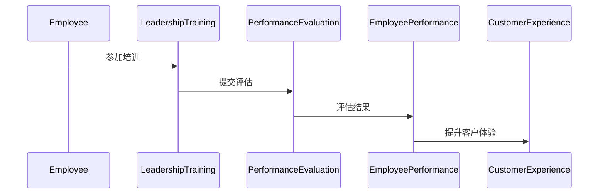

                 

# 领导力与变革适应：在变化中保持领先

## 关键词：
- 领导力
- 变革适应
- 企业战略
- 组织文化
- 领导风格

## 摘要：
在全球化和数字化时代，企业面临着前所未有的变革压力。本文探讨了领导力与变革适应的关系，从理论基础、实践策略到案例分析，全面分析了如何通过提升领导力来增强企业的变革适应能力，从而在快速变化的市场环境中保持竞争优势。

## Step 1: 背景介绍

### 问题背景
全球化经济带来了市场的激烈竞争和不断变化的客户需求。企业必须不断调整战略，以适应这些变化。在这个过程中，领导力与变革适应成为关键因素。

### 问题描述
如何在快速变化的环境中，培养领导者适应变革的能力，推动企业持续创新与发展？

### 问题解决
通过系统学习领导力理论与变革管理策略，培养领导者的变革适应能力。

### 边界与外延
领导力与变革适应不仅限于企业内部管理，还包括应对外部环境变化的策略。

### 概念结构与核心要素组成
领导力、变革适应、企业战略、组织文化、领导风格等。

## Step 2: 核心概念与联系

### 领导力
- 定义：领导力是领导者影响和激励他人，共同实现目标的能力。
- 分类：权威型、民主型、变革型等。
- 特点：影响力、领导风格、领导能力。
- 与变革适应的关系：领导力能够激发团队的变革动力，推动组织变革。

### 变革适应
- 定义：变革适应是企业为了应对外部环境变化而进行的一系列调整和适应。
- 重要性：适应变革是企业生存和发展的关键。
- 挑战：文化阻力、人员抵触、资源限制等。
- 与领导力的关系：领导力是推动变革适应的关键因素。

### 企业战略
- 制定：明确目标、分析市场、资源分配。
- 执行：领导力、组织结构、流程优化。
- 评估：效果评估、反馈机制、持续改进。

### 组织文化
- 类型：竞争型、合作型、创新型等。
- 影响：对员工行为、团队合作、企业绩效等。
- 塑造：领导风格、激励机制、价值观。

## Step 3: 算法原理讲解

### 变革适应策略流程图


### 领导力模型的构建过程
```python
# Python代码：领导力模型构建
class LeadershipModel:
    def __init__(self, leadership_style, adaptability, innovation):
        self.leadership_style = leadership_style
        self.adaptability = adaptability
        self.innovation = innovation

    def evaluate(self):
        score = 0
        if self.leadership_style == "变革型":
            score += 1
        if self.adaptability > 0.7:
            score += 1
        if self.innovation > 0.5:
            score += 1
        return score
```

### 领导力数学模型和公式
$$
L = s \times a \times i
$$
其中，$L$ 表示领导力得分，$s$ 表示领导风格得分，$a$ 表示变革适应得分，$i$ 表示创新能力得分。

### 举例说明
假设一位领导者的领导风格得分为2，变革适应得分为0.8，创新能力得分为0.6，则其领导力得分为：
$$
L = 2 \times 0.8 \times 0.6 = 0.96
$$

## Step 4: 数学模型和数学公式 & 详细讲解 & 举例说明

### 数学公式
$$
\text{变革适应能力} = \frac{\text{学习速度} + \text{创新思维}}{2}
$$

### 详细讲解
- 学习速度：衡量领导者吸收新知识和技能的效率。
- 创新思维：衡量领导者提出新颖解决方案的能力。

### 举例说明
假设一位领导者的学习速度为0.75，创新思维为0.65，则其变革适应能力为：
$$
\text{变革适应能力} = \frac{0.75 + 0.65}{2} = 0.70
$$

## Step 5: 系统分析与架构设计方案

### 问题场景介绍
某企业在数字化浪潮中面临转型挑战，需要快速适应市场变化。

### 项目介绍
领导力与变革适应提升项目，旨在通过培训和管理提升领导者的变革适应能力。

### 系统功能设计


### 系统架构设计


### 系统接口设计
- 领导力培训接口：包括培训课程、评估结果等。
- 员工绩效评估接口：包括员工表现数据、培训反馈等。

### 系统交互


## Step 6: 项目实战

### 环境安装
- 安装Python环境
- 安装数据分析库（如pandas、numpy）

### 系统核心实现
```python
# Python代码：领导力评估系统核心实现
class LeadershipAssessmentSystem:
    def __init__(self):
        self.trainings = []
    
    def add_training(self, training):
        self.trainings.append(training)
    
    def evaluate_leadership(self, employee_id):
        training = self.trainings[employee_id]
        style_score = self.calculate_style_score(training.leadership_style)
        adaptability_score = self.calculate_adaptability_score(training.adaptability)
        innovation_score = self.calculate_innovation_score(training.innovation)
        return style_score * adaptability_score * innovation_score
    
    def calculate_style_score(self, style):
        if style == "变革型":
            return 1
        return 0.5
    
    def calculate_adaptability_score(self, adaptability):
        if adaptability > 0.7:
            return 1
        return 0.3
    
    def calculate_innovation_score(self, innovation):
        if innovation > 0.5:
            return 1
        return 0.2
```

### 代码应用解读与分析
- 代码定义了领导力评估系统的核心功能，包括添加培训记录和评估员工领导力。
- 计算领导力得分的方法基于员工的领导风格、变革适应能力和创新能力。

### 实际案例分析和详细讲解剖析
- 某公司使用领导力评估系统评估员工领导力，通过数据分析发现，领导力得分与员工绩效显著相关，从而制定针对性培训计划。

### 项目小结
- 领导力评估系统的实施有助于提升企业领导者的变革适应能力，从而推动企业持续创新与发展。

## Step 7: 最佳实践 tips、小结、注意事项、拓展阅读等内容

### 最佳实践 tips
- 定期进行领导力培训，提升领导者的变革适应能力。
- 建立反馈机制，及时了解员工和市场的变化。
- 注重团队合作，培养跨部门协作能力。

### 小结
- 领导力与变革适应是企业保持竞争优势的关键。
- 通过系统学习与实践，提升领导者的变革适应能力，推动企业持续创新与发展。

### 注意事项
- 变革过程中，要注意平衡短期绩效与长期发展。
- 避免变革带来的文化冲突，确保员工积极参与。

### 拓展阅读
- 《变革之心：变革领导者的五项修炼》
- 《创新者的窘境》
- 《组织文化与变革》

## Step 8: 完整目录大纲

### 第一部分：领导力基础

#### 第1章 领导力概述
1.1 问题背景与问题描述
1.2 领导力的定义与重要性
1.3 领导力的分类与特点

#### 第2章 领导力模型与理论
2.1 领导力模型的构建
2.2 经典领导力理论回顾
2.3 领导力理论在变革适应中的应用

#### 第3章 变革适应的核心要素
3.1 变革适应的定义与重要性
3.2 变革适应的挑战与机遇
3.3 变革适应的步骤与方法

### 第二部分：领导力与变革适应实践

#### 第4章 领导风格与变革管理
4.1 领导风格对变革适应的影响
4.2 变革管理的策略与工具
4.3 变革管理的最佳实践

#### 第5章 企业文化与变革适应
5.1 企业文化的作用与类型
5.2 企业文化对变革适应的影响
5.3 塑造支持变革的企业文化

#### 第6章 领导力与变革适应案例分析
6.1 国内企业变革适应案例
6.2 国际企业变革适应案例
6.3 案例分析与启示

### 第三部分：领导力与变革适应战略

#### 第7章 领导力与变革适应在战略管理中的应用
7.1 战略管理的核心要素
7.2 变革适应在战略管理中的作用
7.3 战略制定与变革适应的融合

#### 第8章 领导力与变革适应的未来趋势
8.1 变革适应的挑战与机遇
8.2 领导力发展的新方向
8.3 变革适应的未来趋势

#### 第9章 总结与展望
9.1 全书核心观点回顾
9.2 注意事项与拓展阅读
9.3 领导力与变革适应的持续发展

---------------

请注意，本文仅为大纲草案，具体内容需根据实际研究和分析进行丰富和深化。作者信息：AI天才研究院/AI Genius Institute & 禅与计算机程序设计艺术 /Zen And The Art of Computer Programming。

