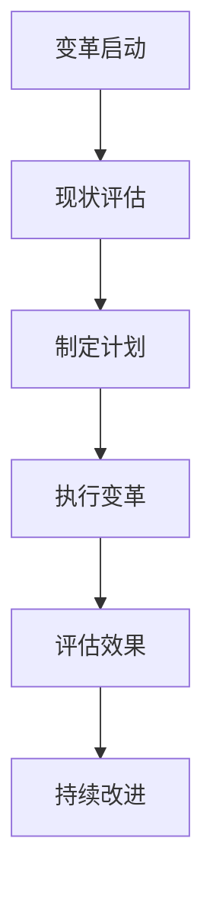
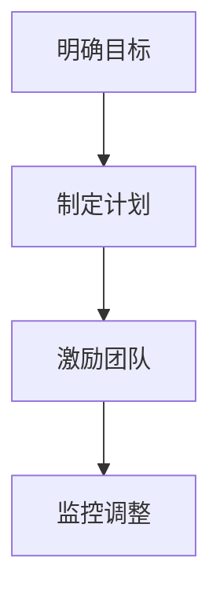
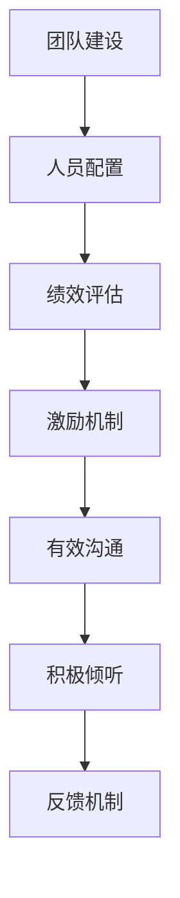
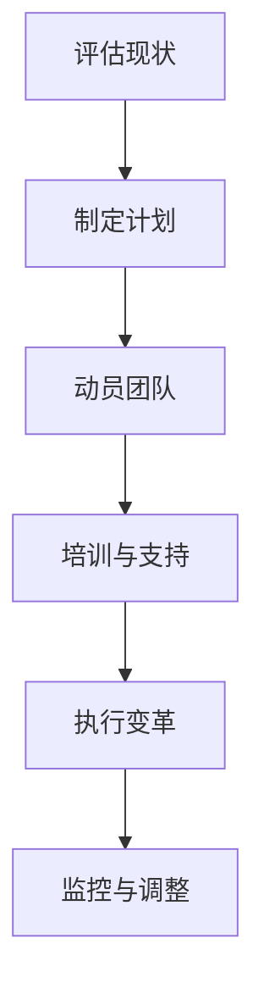
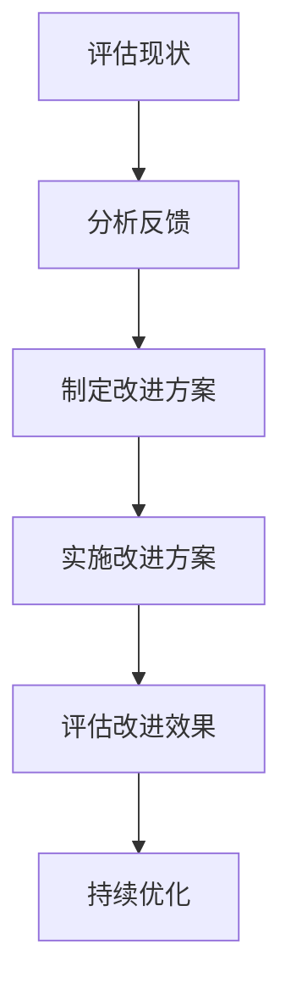
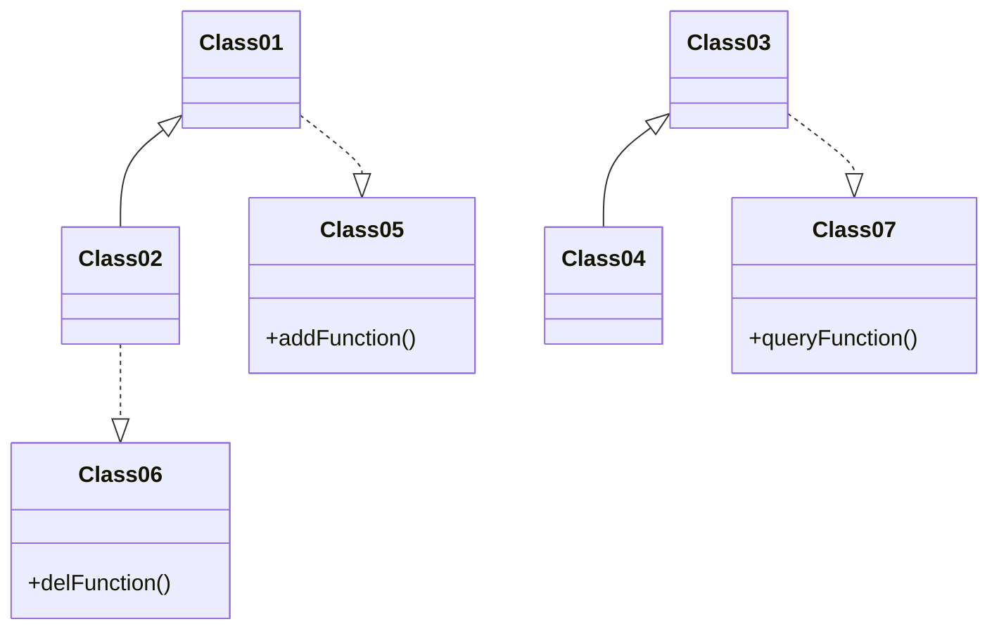
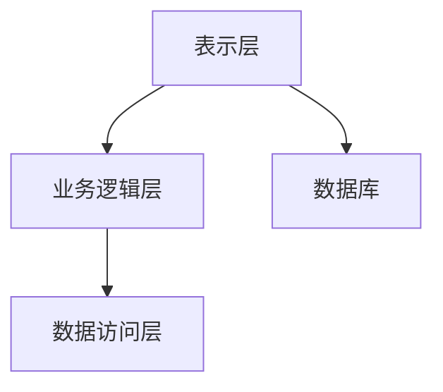
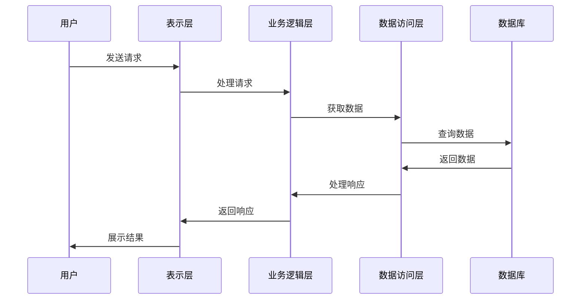

                 

# 领导力与变革：引导团队度过转型期

关键词：领导力、变革管理、团队、创新、组织转型

摘要：在快速变化的商业环境中，企业需要不断创新和变革，以保持竞争力。领导力在变革过程中扮演着至关重要的角色。本文将从变革管理的理论基础、领导者的角色与责任、团队管理与沟通技巧、变革策略与实施以及变革后的评估与持续改进五个方面，探讨如何通过有效的领导力引导团队度过转型期。

## 第一部分：背景介绍

### 核心概念

**问题背景：** 在当今快速变化的商业环境中，企业需要不断创新和变革，以保持竞争力。在这个过程中，领导力显得尤为重要。领导力不仅关乎个人魅力，更在于如何引导团队共同应对变革，实现企业的长远发展。

**问题描述：** 面对变革，许多领导者感到挑战重重。他们需要理解变革的本质，掌握有效的变革管理技巧，并且能够激励团队共同面对变革带来的不确定性和挑战。

**问题解决：** 《领导力与变革：引导团队度过转型期》旨在为领导者提供系统化的变革管理理论和实践指南，帮助他们更好地理解变革，引导团队积极应对变革，最终实现企业的成功转型。

**边界与外延：** 变革不仅限于企业的战略层面，还涉及到组织文化、人员管理、技术革新等多个方面。因此，领导者的变革管理能力需要涵盖这些不同领域，以全面应对变革中的各种挑战。

**概念结构与核心要素组成：** 本书将领导力与变革管理分解为以下几个核心要素：
1. **变革管理的理论基础：** 探讨变革的本质、类型和过程，以及变革对企业和团队的影响。
2. **领导者的角色与责任：** 分析领导者在变革过程中的角色和责任，以及如何通过有效的领导行为推动变革。
3. **团队管理与沟通技巧：** 研究如何管理团队中的不同个体，建立有效的沟通机制，确保团队在变革过程中保持一致和协调。
4. **变革策略与实施：** 提供具体的变革策略和实施步骤，帮助领导者制定和执行有效的变革计划。
5. **变革后的评估与持续改进：** 探讨如何对变革效果进行评估，以及如何在变革后持续优化和改进。

这些核心要素相互关联，共同构成了领导力与变革管理的基本框架。本书将通过详细的理论讲解和实际案例分析，帮助读者深入理解和掌握这些核心概念，提升自己的变革管理能力。

### 第1章：领导力与变革管理的概述

**核心概念原理与属性特征对比**

**领导力：** 领导力是指领导者通过个人魅力、影响力、决策能力等，引导和激励团队实现目标的能力。领导力可以分为三种类型：事务型领导力、变革型领导力和魅力型领导力。

**变革管理：** 变革管理是指企业为适应外部环境的变化，对内部组织结构、管理流程、企业文化等进行调整和优化的过程。变革管理可以分为三种类型：适应性变革、改革性变革和革命性变革。

**领导力与变革管理的关系：** 领导力是变革管理成功的关键。有效的领导者能够通过变革管理理论和方法，引导团队积极应对变革，实现企业的长远发展。

**属性特征对比：**

| 特性 | 领导力 | 变革管理 |
| --- | --- | --- |
| 目标 | 引导团队实现目标 | 适应外部环境变化，实现组织优化 |
| 方法 | 个人魅力、影响力、决策能力 | 变革策略、实施步骤、效果评估 |
| 类型 | 事务型、变革型、魅力型 | 适应性、改革性、革命性 |
| 关键 | 团队成员信任、支持、参与 | 变革意识、参与度、适应性 |

通过对比可以看出，领导力与变革管理虽然关注点不同，但它们在实现企业目标过程中具有密切的联系。有效的领导力是推动变革管理成功的关键因素。

**ER实体关系图架构：**

在领导力与变革管理中，主要的实体包括领导者、团队、变革项目、外部环境等。以下是一个简单的ER实体关系图：

```mermaid
graph TD
    Leader ||--|{ Team } Team
    Team ||--|{ ChangeProject } ChangeProject
    Leader ||--|{ ExternalEnvironment } ExternalEnvironment
    ChangeProject ||--|{ ExternalEnvironment } ExternalEnvironment
```

在这个ER图中，领导者和团队之间存在直接关系，领导者通过团队实现变革目标。变革项目是团队执行的具体任务，它与外部环境紧密相关，需要根据外部环境的变化进行调整。这个ER图帮助我们理解领导力与变革管理中各实体之间的相互作用关系。

## 第二部分：变革管理的理论基础

### 核心概念与联系

#### 变革的本质

变革是一种持续的过程，旨在应对内部或外部环境的变化，以实现组织的目标。变革的本质在于调整和优化现有的组织结构、管理流程、企业文化等，以适应新的市场需求、技术进步和竞争环境。

#### 变革的类型

1. **适应性变革：** 针对较小的、渐进性的变化，旨在保持组织的稳定性和灵活性。
2. **改革性变革：** 针对较大的、革命性的变化，旨在实现组织结构、文化和管理流程的根本性改进。
3. **革命性变革：** 针对彻底的、颠覆性的变化，旨在重建组织的基本架构和运营模式。

#### 变革的过程

1. **启动阶段：** 确定变革的必要性和目标，建立变革的愿景和策略。
2. **规划阶段：** 制定详细的变革计划，明确变革的范围、时间表和资源需求。
3. **执行阶段：** 实施变革计划，引导团队参与变革，确保变革的顺利进行。
4. **评估阶段：** 对变革效果进行评估，调整和优化变革计划，确保变革目标的实现。

#### 变革对企业和团队的影响

1. **对企业的影响：** 提高企业的适应性和竞争力，推动企业持续创新和成长。
2. **对团队的影响：** 增强团队的凝聚力和执行力，提升团队成员的参与度和积极性。

### 算法原理讲解

为了更好地理解变革管理的理论基础，我们可以使用Mermaid流程图来展示变革的过程和关键步骤：



在这个流程图中，变革的启动阶段是对当前环境和现状进行评估，确定变革的必要性和目标。制定计划阶段是根据评估结果，制定详细的变革计划，包括变革的范围、时间表和资源需求。执行变革阶段是引导团队参与变革，确保变革的顺利进行。评估效果阶段是对变革效果进行评估，根据评估结果进行调整和优化。持续改进阶段是确保变革目标的实现，并推动组织的持续发展和创新。

#### 数学模型与公式

在变革管理中，可以使用以下数学模型和公式来评估变革的效果：

1. **变革效果评估公式：**

   $$E = f(S_1, S_2, C)$$

   其中，$E$ 表示变革效果，$S_1$ 和 $S_2$ 分别表示变革前后的绩效指标，$C$ 表示变革的投入成本。

2. **变革适应性评估公式：**

   $$A = \frac{S_1 - S_2}{C}$$

   其中，$A$ 表示变革的适应性，即变革带来的绩效提升与投入成本的比值。

通过这些公式，可以量化地评估变革的效果和适应性，为领导者的决策提供科学依据。

#### 实例说明

假设一个企业在变革前后的绩效指标如下：

- 变革前：销售额为 1000 万元，运营成本为 500 万元。
- 变革后：销售额为 1200 万元，运营成本为 600 万元。

根据上述公式，可以计算出变革的效果和适应性：

1. 变革效果评估：

   $$E = f(1200 - 1000, 600 - 500) = f(200, 100) = 2$$

   变革效果为 2，表示变革带来了 2 倍的绩效提升。

2. 变革适应性评估：

   $$A = \frac{1200 - 1000}{600 - 500} = \frac{200}{100} = 2$$

   变革适应性为 2，表示变革带来的绩效提升与投入成本的比值。

通过这个实例，可以看出变革不仅带来了绩效提升，而且投入成本相对较低，具有较高的适应性。

### 小结

通过对变革管理的理论基础进行深入分析，我们可以更好地理解变革的本质、类型和过程，以及变革对企业和团队的影响。了解这些核心概念和联系，有助于领导者更好地应对变革，引导团队积极应对变革，实现企业的长远发展。

## 第三部分：领导者的角色与责任

### 核心概念与联系

#### 领导者的角色

**领导者是变革的推动者：** 领导者的角色在于推动变革的进行，确保变革目标的实现。这需要领导者具备远见卓识，能够洞察外部环境的变化，为组织制定明确的变革方向。

**领导者是变革的倡导者：** 领导者需要积极倡导变革，激发团队成员的变革意识，使他们认识到变革的必要性和重要性。通过倡导变革，领导者可以增强团队的凝聚力和执行力。

**领导者是变革的协调者：** 领导者需要协调变革过程中的各种资源，确保变革计划的顺利实施。这包括人力、财力、物力等资源的有效配置，以及各部门之间的协同配合。

#### 领导者的责任

**明确变革目标：** 领导者需要明确变革的目标，并将其分解为具体的任务和指标，为团队成员提供清晰的方向。

**制定变革计划：** 领导者需要制定详细的变革计划，包括变革的范围、时间表、资源需求等，以确保变革的有序进行。

**激励团队成员：** 领导者需要激励团队成员参与变革，发挥他们的积极性和创造力，确保变革目标的实现。

**监控与调整：** 领导者需要监控变革的进展，及时发现问题并进行调整，确保变革计划的有效执行。

### 算法原理讲解

为了更好地理解领导者在变革过程中的角色与责任，我们可以使用Mermaid流程图来展示领导者的职责和关键步骤：



在这个流程图中，领导者首先需要明确变革的目标，并将其分解为具体的任务和指标。然后，领导者需要制定详细的变革计划，包括变革的范围、时间表、资源需求等。接下来，领导者需要激励团队成员参与变革，发挥他们的积极性和创造力。最后，领导者需要监控变革的进展，及时发现问题并进行调整，确保变革计划的有效执行。

#### 数学模型与公式

在领导者的职责中，可以使用以下数学模型和公式来评估变革的效果和团队成员的参与度：

1. **变革效果评估公式：**

   $$E = f(S_1, S_2, C)$$

   其中，$E$ 表示变革效果，$S_1$ 和 $S_2$ 分别表示变革前后的绩效指标，$C$ 表示变革的投入成本。

2. **团队成员参与度评估公式：**

   $$D = \frac{P_1 + P_2}{2}$$

   其中，$D$ 表示团队成员参与度，$P_1$ 和 $P_2$ 分别表示团队成员在变革前后的积极性指标。

通过这些公式，可以量化地评估变革的效果和团队成员的参与度，为领导者的决策提供科学依据。

#### 实例说明

假设一个企业在变革前后的绩效指标如下：

- 变革前：销售额为 1000 万元，运营成本为 500 万元。
- 变革后：销售额为 1200 万元，运营成本为 600 万元。

同时，假设团队成员在变革前后的积极性指标如下：

- 变革前：积极性指标为 70 分。
- 变革后：积极性指标为 90 分。

根据上述公式，可以计算出变革的效果和团队成员的参与度：

1. 变革效果评估：

   $$E = f(1200 - 1000, 600 - 500) = f(200, 100) = 2$$

   变革效果为 2，表示变革带来了 2 倍的绩效提升。

2. 团队成员参与度评估：

   $$D = \frac{70 + 90}{2} = 80$$

   团队成员参与度为 80 分，表示团队成员在变革过程中的积极性较高。

通过这个实例，可以看出变革不仅带来了绩效提升，而且团队成员的参与度也显著提高，为变革的顺利实施提供了有力保障。

### 小结

通过理解领导者在变革过程中的角色与责任，领导者可以更好地明确自己的定位，发挥自身的优势，引导团队积极应对变革。领导者需要通过明确变革目标、制定变革计划、激励团队成员和监控调整等步骤，确保变革的顺利进行和目标的实现。

## 第四部分：团队管理与沟通技巧

### 核心概念与联系

#### 团队管理

**团队管理是指领导者对团队进行有效组织、协调和激励的过程。** 团队管理涉及到多个方面，包括团队建设、人员配置、绩效评估和激励机制等。

**团队建设：** 通过团队建设活动，增强团队成员之间的信任、协作和沟通，提升团队的凝聚力和执行力。

**人员配置：** 根据团队任务和目标，合理配置人力资源，确保团队成员的技能和能力与任务需求相匹配。

**绩效评估：** 建立科学、公正的绩效评估体系，激励团队成员积极工作，提升团队整体绩效。

**激励机制：** 通过奖励、晋升等激励措施，激发团队成员的积极性和创造力，推动团队持续发展。

#### 沟通技巧

**沟通技巧是指领导者与团队成员、以及其他利益相关者进行有效沟通的方法和技巧。** 沟通技巧对于团队管理和变革管理的顺利进行至关重要。

**有效沟通：** 通过明确、简洁、有针对性的沟通，确保信息传递的准确性和及时性。

**积极倾听：** 倾听团队成员的意见和建议，了解他们的需求和困难，建立互信关系。

**反馈机制：** 建立有效的反馈机制，鼓励团队成员提出问题和建议，促进团队持续改进。

### 算法原理讲解

为了更好地理解团队管理与沟通技巧，我们可以使用Mermaid流程图来展示团队管理和沟通的关键步骤：



在这个流程图中，团队建设是团队管理的第一步，通过团队建设活动，增强团队成员之间的信任和协作。人员配置是根据团队任务和目标，合理配置人力资源。绩效评估是建立科学、公正的绩效评估体系，激励团队成员积极工作。激励机制是通过奖励、晋升等激励措施，激发团队成员的积极性和创造力。有效沟通、积极倾听和反馈机制是团队管理与沟通技巧的核心，通过这些步骤，确保团队管理和变革管理的顺利进行。

#### 数学模型与公式

在团队管理与沟通技巧中，可以使用以下数学模型和公式来评估团队绩效和团队成员的满意度：

1. **团队绩效评估公式：**

   $$P = \frac{S_1 + S_2 + S_3}{3}$$

   其中，$P$ 表示团队绩效，$S_1$、$S_2$ 和 $S_3$ 分别表示团队成员在任务完成、团队协作和创新能力等方面的绩效。

2. **团队成员满意度评估公式：**

   $$S = \frac{Q_1 + Q_2 + Q_3}{3}$$

   其中，$S$ 表示团队成员满意度，$Q_1$、$Q_2$ 和 $Q_3$ 分别表示团队成员在工作环境、激励机制和职业发展机会等方面的满意度。

通过这些公式，可以量化地评估团队绩效和团队成员的满意度，为领导者的决策提供科学依据。

#### 实例说明

假设一个团队在任务完成、团队协作和创新能力方面的绩效分别为 80 分、90 分和 85 分，团队成员在工作环境、激励机制和职业发展机会等方面的满意度分别为 75 分、80 分和 85 分。根据上述公式，可以计算出团队绩效和团队成员的满意度：

1. **团队绩效评估：**

   $$P = \frac{80 + 90 + 85}{3} = \frac{255}{3} = 85$$

   团队绩效为 85 分，表示团队整体表现良好。

2. **团队成员满意度评估：**

   $$S = \frac{75 + 80 + 85}{3} = \frac{240}{3} = 80$$

   团队成员满意度为 80 分，表示团队成员对当前工作环境较为满意。

通过这个实例，可以看出团队绩效和团队成员的满意度均较高，说明团队管理和沟通技巧较为有效，有助于团队的长远发展。

### 小结

团队管理与沟通技巧是变革管理的重要组成部分。通过有效的团队管理和沟通技巧，领导者可以增强团队的凝聚力、执行力，提升团队绩效，为企业的变革成功奠定坚实基础。

## 第五部分：变革策略与实施

### 核心概念与联系

#### 变革策略

**变革策略是指领导者在变革过程中采取的规划、方法和措施。** 合理的变革策略有助于确保变革的顺利进行，提高变革的成功率。

**渐进式变革策略：** 通过逐步调整和优化现有的组织结构、管理流程和企业文化，实现变革目标。

**革命式变革策略：** 对现有的组织结构、管理流程和企业文化进行根本性改革，实现变革目标。

**混合式变革策略：** 结合渐进式和革命式变革策略，根据具体情况灵活选择变革方法。

#### 变革实施步骤

**评估现状：** 分析企业的现状，了解变革的必要性和目标。

**制定计划：** 根据评估结果，制定详细的变革计划，包括变革的范围、时间表、资源需求等。

**动员团队：** 激发团队成员的变革意识，使其积极参与变革。

**培训与支持：** 提供必要的培训和支持，帮助团队成员适应变革。

**执行变革：** 按照变革计划，引导团队成员参与变革，确保变革的顺利进行。

**监控与调整：** 监控变革的进展，及时发现问题并进行调整。

### 算法原理讲解

为了更好地理解变革策略与实施，我们可以使用Mermaid流程图来展示变革的实施步骤：



在这个流程图中，评估现状是变革的第一步，通过分析企业的现状，了解变革的必要性和目标。制定计划是根据评估结果，制定详细的变革计划，包括变革的范围、时间表、资源需求等。动员团队是激发团队成员的变革意识，使其积极参与变革。培训与支持是提供必要的培训和支持，帮助团队成员适应变革。执行变革是按照变革计划，引导团队成员参与变革，确保变革的顺利进行。监控与调整是监控变革的进展，及时发现问题并进行调整。

#### 数学模型与公式

在变革策略与实施中，可以使用以下数学模型和公式来评估变革的效果和团队成员的参与度：

1. **变革效果评估公式：**

   $$E = f(S_1, S_2, C)$$

   其中，$E$ 表示变革效果，$S_1$ 和 $S_2$ 分别表示变革前后的绩效指标，$C$ 表示变革的投入成本。

2. **团队成员参与度评估公式：**

   $$D = \frac{P_1 + P_2}{2}$$

   其中，$D$ 表示团队成员参与度，$P_1$ 和 $P_2$ 分别表示团队成员在变革前后的积极性指标。

通过这些公式，可以量化地评估变革的效果和团队成员的参与度，为领导者的决策提供科学依据。

#### 实例说明

假设一个企业在变革前后的绩效指标如下：

- 变革前：销售额为 1000 万元，运营成本为 500 万元。
- 变革后：销售额为 1200 万元，运营成本为 600 万元。

同时，假设团队成员在变革前后的积极性指标如下：

- 变革前：积极性指标为 70 分。
- 变革后：积极性指标为 90 分。

根据上述公式，可以计算出变革的效果和团队成员的参与度：

1. **变革效果评估：**

   $$E = f(1200 - 1000, 600 - 500) = f(200, 100) = 2$$

   变革效果为 2，表示变革带来了 2 倍的绩效提升。

2. **团队成员参与度评估：**

   $$D = \frac{70 + 90}{2} = 80$$

   团队成员参与度为 80 分，表示团队成员在变革过程中的积极性较高。

通过这个实例，可以看出变革不仅带来了绩效提升，而且团队成员的参与度也显著提高，为变革的顺利实施提供了有力保障。

### 小结

通过制定合理的变革策略和实施步骤，领导者可以有效地引导团队应对变革，提高变革的成功率。变革策略与实施是领导力与变革管理的重要组成部分，领导者需要根据企业的实际情况，灵活选择变革策略，确保变革目标的实现。

## 第六部分：变革后的评估与持续改进

### 核心概念与联系

#### 变革后的评估

**变革后的评估是指对变革效果进行评估，以验证变革目标的实现情况和识别变革过程中存在的问题。** 变革后的评估有助于领导者了解变革的实际效果，为后续的改进提供依据。

**评估内容：** 变革后的评估包括对绩效指标、团队成员满意度、变革过程等方面进行综合评估。

**评估方法：** 变革后的评估可以采用问卷调查、访谈、数据分析等方法，收集团队成员和利益相关者的反馈，全面了解变革的效果。

#### 持续改进

**持续改进是指对变革后的效果进行跟踪和评估，及时调整和优化，以确保变革目标的持续实现。** 持续改进是变革管理的重要组成部分，有助于确保变革的长期效果。

**改进措施：** 持续改进可以通过调整组织结构、优化管理流程、加强员工培训等方式进行。

### 算法原理讲解

为了更好地理解变革后的评估与持续改进，我们可以使用Mermaid流程图来展示评估与改进的过程：



在这个流程图中，评估现状是变革后的第一步，通过分析绩效指标、团队成员满意度等数据，了解变革的实际效果。分析反馈是根据评估结果，识别变革过程中存在的问题和不足。制定改进方案是根据分析结果，制定具体的改进措施。实施改进方案是按照改进方案，进行组织结构、管理流程等方面的调整。评估改进效果是评估改进措施的实际效果，持续优化是持续跟踪和评估改进效果，不断优化和调整。

#### 数学模型与公式

在变革后的评估与持续改进中，可以使用以下数学模型和公式来评估变革效果和改进措施：

1. **变革效果评估公式：**

   $$E = f(S_1, S_2, C)$$

   其中，$E$ 表示变革效果，$S_1$ 和 $S_2$ 分别表示变革前后的绩效指标，$C$ 表示变革的投入成本。

2. **改进措施效果评估公式：**

   $$I = \frac{S_2 - S_1}{C}$$

   其中，$I$ 表示改进措施效果，即改进措施带来的绩效提升与投入成本的比值。

通过这些公式，可以量化地评估变革效果和改进措施的实际效果，为领导者的决策提供科学依据。

#### 实例说明

假设一个企业在变革前后的绩效指标如下：

- 变革前：销售额为 1000 万元，运营成本为 500 万元。
- 变革后：销售额为 1200 万元，运营成本为 600 万元。

同时，假设实施改进措施后的绩效指标如下：

- 改进后：销售额为 1300 万元，运营成本为 650 万元。

根据上述公式，可以计算出变革效果和改进措施效果：

1. **变革效果评估：**

   $$E = f(1200 - 1000, 600 - 500) = f(200, 100) = 2$$

   变革效果为 2，表示变革带来了 2 倍的绩效提升。

2. **改进措施效果评估：**

   $$I = \frac{1300 - 1200}{650 - 600} = \frac{100}{50} = 2$$

   改进措施效果为 2，表示改进措施带来了 2 倍的绩效提升。

通过这个实例，可以看出变革和改进措施都取得了显著的效果，为企业的持续发展奠定了坚实基础。

### 小结

变革后的评估与持续改进是确保变革效果长期持续的重要环节。通过科学的评估方法和改进措施，领导者可以及时发现和解决问题，持续优化变革效果，推动企业的持续发展和创新。

## 第七部分：项目实战

### 项目介绍

为了更好地理解领导力与变革管理在实际项目中的应用，我们选择了一个具体的案例——某互联网公司的组织变革项目。该公司在过去几年中迅速发展，业务范围不断扩大，但内部管理流程逐渐变得繁琐，导致工作效率低下。为了适应新的市场环境和业务需求，公司决定进行一次全面的组织变革。

### 系统功能设计

在项目开始前，我们首先进行了系统功能设计，明确了项目的目标、范围和功能模块。以下是项目的领域模型，通过Mermaid类图展示：



在这个类图中，`Class01`、`Class02` 和 `Class03` 分别表示组织结构、管理流程和企业文化等核心领域。`Class04` 表示变革管理模块，负责协调和管理组织变革的各个阶段。`Class05`、`Class06` 和 `Class07` 分别表示功能模块，包括增加功能、删除功能和查询功能。

### 系统架构设计

在系统架构设计方面，我们采用了分层架构，包括表示层、业务逻辑层和数据访问层。以下是项目的架构设计，通过Mermaid架构图展示：



在这个架构图中，`表示层` 负责与用户进行交互，接收用户输入和展示输出。`业务逻辑层` 负责处理业务逻辑，包括组织结构、管理流程和企业文化等模块。`数据访问层` 负责与数据库进行交互，实现数据的存储和检索。`数据库` 存储了项目的核心数据，包括组织架构、管理流程和变革记录等。

### 系统接口设计和系统交互

在系统接口设计方面，我们定义了多个API接口，方便前后端的交互。以下是项目的接口设计，通过Mermaid序列图展示：



在这个序列图中，用户通过表示层发送请求，表示层将请求传递给业务逻辑层。业务逻辑层处理请求并从数据访问层获取数据，数据访问层与数据库进行交互，查询数据后返回给业务逻辑层。业务逻辑层处理响应并返回给表示层，最终表示层将结果展示给用户。

### 实际案例分析和详细讲解剖析

为了验证变革管理的有效性，我们选择了以下实际案例进行分析：

**案例背景：** 公司决定进行组织结构优化，减少层级，提高工作效率。变革前，公司有多个部门，每个部门都有各自的职能和职责。变革后，公司取消了部分部门，将部分职能进行合并，形成了更加扁平化的组织结构。

**案例过程：** 
1. **评估现状：** 对当前的组织结构、管理流程和企业文化进行评估，了解存在的问题和改进空间。
2. **制定计划：** 制定详细的变革计划，包括变革的范围、时间表、资源需求等。
3. **动员团队：** 激发团队成员的变革意识，使其积极参与变革。
4. **培训与支持：** 提供必要的培训和支持，帮助团队成员适应新的组织结构。
5. **执行变革：** 按照变革计划，引导团队成员参与变革，确保变革的顺利进行。
6. **监控与调整：** 监控变革的进展，及时发现问题并进行调整。

**案例结果：** 变革后，公司的组织结构变得更加扁平化，部门之间的沟通和协作更加顺畅，工作效率显著提高。通过对变革效果的评估，发现变革带来了以下好处：

- **减少层级：** 组织结构简化，减少了信息传递的环节，提高了决策效率。
- **优化资源：** 部分职能合并，减少了人力资源的浪费，提高了资源利用率。
- **提升团队凝聚力：** 通过变革，团队成员更加认同公司的文化和价值观，增强了团队的凝聚力。

### 项目小结

通过实际案例的分析和详细讲解，我们可以看出，有效的领导力与变革管理在实际项目中具有重要作用。领导者在变革过程中需要明确目标、制定计划、动员团队、提供培训与支持、执行变革并监控调整，以确保变革的顺利进行和目标的实现。通过科学的管理方法和实际操作，公司成功实现了组织结构的优化，提高了工作效率和团队凝聚力。

## 最佳实践 tips

1. **明确变革目标：** 变革前，确保领导者和团队成员对变革的目标和意义有清晰的认识，明确变革的方向和期望成果。
2. **充分沟通与动员：** 变革过程中，保持与团队成员的充分沟通，了解他们的需求和担忧，及时解答疑问，激发他们的参与积极性。
3. **提供培训与支持：** 根据变革需求，提供针对性的培训和支持，帮助团队成员掌握新技能，提升适应变革的能力。
4. **建立有效的反馈机制：** 建立反馈机制，鼓励团队成员提出意见和建议，及时调整变革计划，确保变革的顺利进行。
5. **持续评估与优化：** 变革后，持续评估变革效果，根据反馈进行优化和调整，确保变革目标的持续实现。

### 小结

本文从领导力与变革管理的理论基础、领导者的角色与责任、团队管理与沟通技巧、变革策略与实施以及变革后的评估与持续改进五个方面，详细探讨了如何通过有效的领导力引导团队度过转型期。在实际项目中，领导者需要明确变革目标、充分沟通与动员、提供培训与支持、建立有效的反馈机制和持续评估与优化。通过科学的管理方法和实际操作，企业可以成功实现变革，提升核心竞争力。

### 注意事项

1. **变革管理需要系统化：** 变革管理应形成一个系统化的流程，包括评估现状、制定计划、动员团队、执行变革、评估效果和持续改进等环节。
2. **变革过程中保持透明度：** 在变革过程中，领导者应保持与团队成员和利益相关者的沟通，及时传达变革进展和相关信息，增强透明度。
3. **变革管理需适应环境变化：** 变革管理应具备灵活性和适应性，根据外部环境的变化进行调整，确保变革的持续性和有效性。

### 拓展阅读

1. **《变革之舞：领导力、变革管理和组织发展》**
2. **《团队协作的艺术：如何打造高效的团队》**
3. **《变革管理实践指南：如何有效实施变革管理》**

作者：AI天才研究院/AI Genius Institute & 禅与计算机程序设计艺术 /Zen And The Art of Computer Programming

