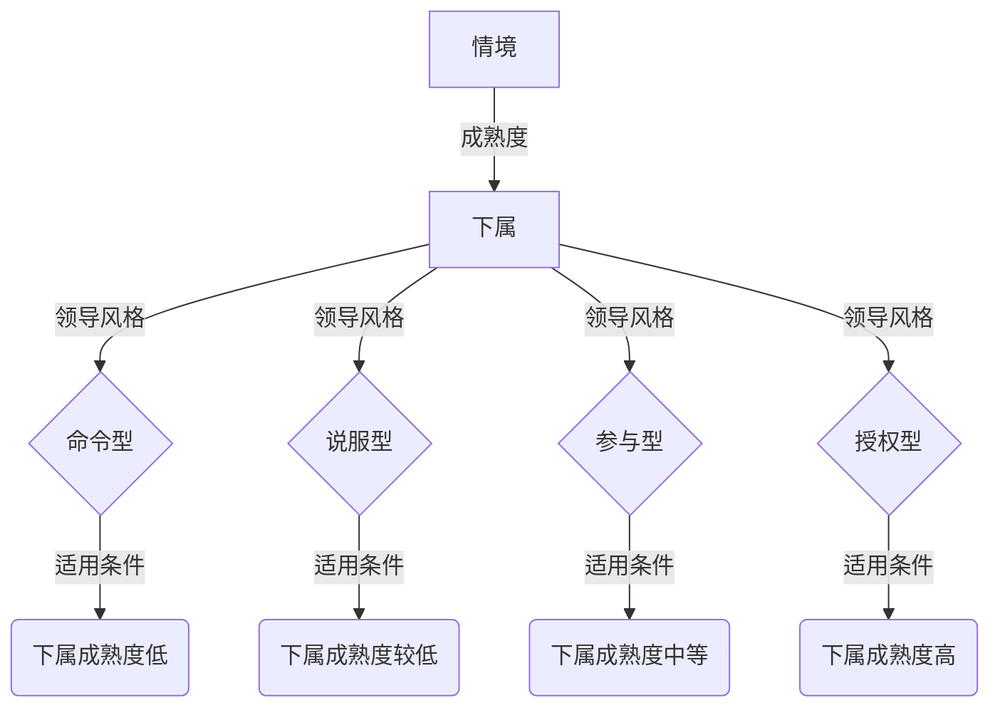
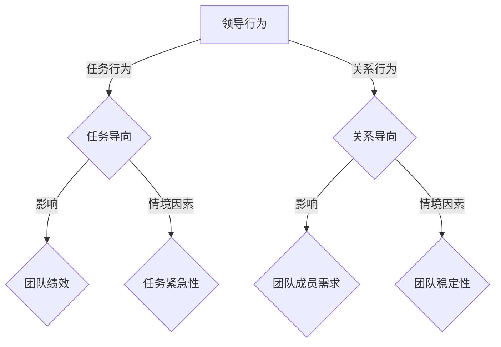
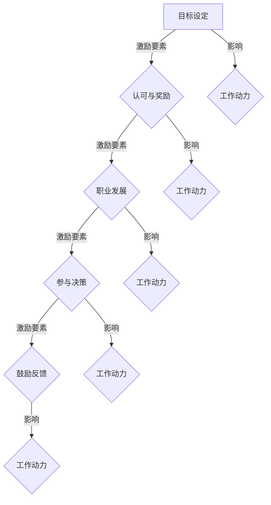

                 

### 第1章 引言

#### 1.1 问题背景

在当今快速变化的商业环境中，领导力与可持续发展显得尤为重要。随着全球化进程的加速，企业面临的市场环境变得更加复杂和多变。领导者不仅需要具备强大的业务管理能力，还需要具备战略远见和创新能力，以应对各种挑战。与此同时，环境问题、社会问题以及经济问题交织在一起，迫使企业重新审视其业务模式和运营方式。

可持续发展作为一种长期战略，强调企业在环境、社会和经济三方面的可持续性。它不仅关乎企业的社会责任，更关乎企业的长远发展。然而，在实际操作中，领导力与可持续发展常常面临冲突。如何在追求短期经济效益的同时，确保企业的长期可持续发展，成为许多领导者面临的难题。

**领导力的挑战**

- **复杂商业环境的应对**：领导者需要具备应对复杂商业环境的能力，包括市场变化、技术进步、法规政策等。
- **创新能力的培养**：领导者需要推动企业创新，以保持竞争优势。
- **团队协作的促进**：领导者需要激发团队成员的潜力，促进团队协作。

**可持续发展的挑战**

- **短期目标与长远影响的平衡**：企业在追求短期经济效益的同时，需要考虑长远的社会和环境责任。
- **资源的合理利用**：企业需要在资源有限的情况下，实现高效运营和可持续发展。
- **利益相关者的协调**：企业需要与利益相关者建立良好的合作关系，共同推动可持续发展。

#### 1.2 目的与内容

本书旨在探讨领导力与可持续发展之间的关系，并探讨如何在实践中平衡短期目标和长远影响。具体内容包括：

- **领导力与可持续发展的基本概念**：介绍领导力与可持续发展的核心概念，建立理论基础。
- **领导力在可持续发展中的作用**：分析领导力在推动可持续发展中的具体作用和策略。
- **可持续发展实践案例**：通过实际案例，探讨领导力与可持续发展的成功实践。
- **平衡短期目标和长远影响的策略**：提供平衡短期目标和长远影响的策略和方法。
- **领导力与可持续发展的整合**：探讨如何将领导力与可持续发展整合到企业战略中。

**1.3 本书结构**

本书分为五个部分，共11章：

- **第一部分**：问题背景与核心概念（第1章和第2章），介绍领导力与可持续发展的基本概念和背景。
- **第二部分**：领导力核心概念与联系（第3章至第5章），分析领导力的核心要素和理论。
- **第三部分**：可持续发展与短期目标（第6章至第7章），探讨可持续发展的定义、原则和关键领域。
- **第四部分**：领导力与可持续发展的最佳实践（第8章至第9章），总结领导力与可持续发展的最佳实践。
- **第五部分**：总结与展望（第10章和第11章），总结主要结论，提出面临的挑战和未来展望，并对读者提供建议。

**核心关键词**：领导力、可持续发展、短期目标、长远影响、平衡、战略、创新、团队协作、利益相关者。

**摘要**：

本文旨在探讨领导力与可持续发展之间的关系，以及如何在实践中平衡短期目标和长远影响。通过介绍领导力与可持续发展的基本概念，分析领导力在推动可持续发展中的作用，并结合实际案例，探讨如何在企业中实现领导力与可持续发展的整合。本文旨在为领导者提供实用的策略和方法，以实现企业的长期可持续发展。

----------------------------------------------------------------

### 第2章 问题背景

在深入探讨领导力与可持续发展的关系之前，我们需要对相关的核心概念进行明确的定义和阐述。本章将介绍领导力和可持续发展的核心概念，并分析当前问题背景和存在的问题。

#### 2.1 问题背景

**领导力的核心概念**

领导力是指通过影响和激励他人，以实现共同目标的能力。在组织管理中，领导力起着至关重要的作用。有效的领导力不仅能够提升团队的绩效，还能够促进企业的创新和变革。然而，领导力并非一成不变，它随着时代和环境的变化而演变。

- **传统领导力**：以权威和控制为核心，强调领导者的决策权和指挥能力。
- **现代领导力**：更注重团队合作、创新和变革，强调领导者与团队成员之间的互动和共同成长。

**可持续发展的核心概念**

可持续发展是指满足当前需求而不损害后代满足其需求的能力。它涉及环境、社会和经济三个方面的平衡和协调。可持续发展原则最早由1987年的《我们共同的未来》报告提出，并逐渐成为全球共识。

- **环境可持续性**：关注资源的合理利用和保护，减少污染和生态破坏。
- **社会可持续性**：关注社会公正、平等和社会福祉，减少贫困和不平等。
- **经济可持续性**：关注经济效益和长期稳定，确保企业的持续发展。

#### 2.2 问题描述

在当前的商业环境中，领导力与可持续发展之间的平衡问题日益突出。一方面，领导者往往面临短期业绩的压力，这使得他们倾向于采取短期效益明显的决策，如削减成本、提高市场份额等。另一方面，可持续发展需要长期的投入和战略规划，这对领导者的远见和耐心提出了更高的要求。

主要问题包括：

- **短期目标与长远影响的冲突**：如何在追求短期经济效益的同时，确保企业的长期可持续发展。
- **领导力不足**：许多领导者缺乏对可持续发展的理解和认识，无法有效地推动企业向可持续发展方向转型。
- **资源分配不均**：在资源有限的情况下，如何合理分配资源以实现可持续发展目标。
- **利益相关者协调**：如何与利益相关者建立合作关系，共同推动可持续发展。

#### 2.3 问题解决

为了解决上述问题，我们需要从以下几个方面着手：

- **提高领导力素养**：通过培训和教育，提升领导者的可持续发展意识和管理能力。
- **制定长期战略**：制定明确的可持续发展目标，并制定相应的战略和行动计划。
- **优化资源配置**：合理分配资源，确保可持续发展目标的实现。
- **建立合作伙伴关系**：与利益相关者建立合作关系，共同推动可持续发展。

#### 2.4 边界与外延

在探讨领导力与可持续发展的问题时，我们需要明确其边界和范围。领导力主要关注企业内部的管理和变革，而可持续发展则涉及到更广泛的环境和社会领域。

- **边界**：领导力主要关注企业的内部管理和变革，而可持续发展则包括环境、社会和经济三方面的平衡和协调。
- **外延**：领导力与可持续发展之间有密切的联系，但两者并非完全重叠。领导力可以推动企业实现可持续发展，但可持续发展也需要领导力的支持和推动。

#### 2.5 概念结构与核心要素组成

为了更好地理解领导力与可持续发展之间的关系，我们可以通过概念结构与核心要素组成来进行分析。

**领导力概念结构**

- **领导力的定义**：通过影响和激励他人，以实现共同目标的能力。
- **领导力的核心要素**：
  - **愿景**：明确企业的长远目标和使命。
  - **决策能力**：在复杂环境中做出明智的决策。
  - **沟通能力**：与团队成员和利益相关者进行有效沟通。
  - **变革管理**：推动企业的创新和变革。

**可持续发展概念结构**

- **可持续发展的定义**：满足当前需求而不损害后代满足其需求的能力。
- **可持续发展的核心要素**：
  - **环境可持续性**：保护环境和生态系统。
  - **社会可持续性**：促进社会公正和平等。
  - **经济可持续性**：实现经济效益和长期稳定。

通过以上分析，我们可以看出，领导力与可持续发展之间存在着密切的联系。领导力是推动企业实现可持续发展的重要力量，而可持续发展则是领导力的重要目标和责任。

**总结**

本章通过对领导力与可持续发展的核心概念和问题背景进行了详细的介绍，分析了当前存在的问题，并提出了可能的解决方案。在接下来的章节中，我们将进一步探讨领导力的核心要素和可持续发展的重要领域，为读者提供更深入的洞察和理解。

----------------------------------------------------------------

### 第3章 领导力概述

领导力是一种关键能力，它不仅影响个人的职业生涯，更对整个组织的发展产生深远影响。本章将深入探讨领导力的定义、历史演变、核心要素以及领导力与管理的区别与联系。

#### 3.1 领导力的定义

领导力是一个多维度的概念，不同学者对其有不同的定义。广义上，领导力可以被定义为通过影响和激励他人，以实现共同目标的能力。具体来说，领导力包括以下几个方面：

- **影响力**：领导者通过沟通、激励和示范，影响他人的思维和行为。
- **目标设定**：领导者明确组织的愿景和目标，并引导团队为之努力。
- **决策能力**：领导者需要在复杂和不确定的环境中做出明智的决策。
- **变革管理**：领导者推动组织创新和变革，以适应外部环境的变化。

#### 3.2 历史演变

领导力作为一个研究主题，其历史可以追溯到古希腊哲学家亚里士多德对统治者和领袖的探讨。随着时间的推移，领导力理论经历了多次演变：

- **传统领导理论**：强调领导者的个人品质和权力。
- **行为领导理论**：关注领导者的行为模式，认为领导风格对团队绩效有重要影响。
- **情境领导理论**：强调领导者应根据具体情境选择合适的领导风格。
- **变革领导理论**：强调领导者在推动组织变革中的作用。

#### 3.3 核心要素

领导力并非单一的能力，它由多个核心要素组成，这些要素相互作用，共同塑造领导者的风格和效果。以下是领导力的核心要素：

- **愿景**：领导者需要有一个明确的愿景，为团队指明方向。
- **沟通能力**：领导者需要与团队成员和利益相关者进行有效沟通。
- **决策能力**：领导者需要在复杂和不确定的环境中做出明智的决策。
- **激励能力**：领导者需要激发团队成员的潜力，提高团队士气。
- **变革管理能力**：领导者需要推动组织的创新和变革。
- **道德和诚信**：领导者的道德和诚信是建立信任和尊重的基础。

#### 3.4 领导力与管理的区别与联系

领导力和管理是两个密切相关但不同的概念。管理主要关注组织的日常运作和效率，而领导力则更关注组织的长期发展和变革。

- **区别**：
  - **焦点**：管理侧重于效率和流程，领导力侧重于创新和变革。
  - **时间范围**：管理关注短期目标，领导力关注长期目标和愿景。
  - **作用**：管理确保组织目标的实现，领导力推动组织超越现有边界。

- **联系**：
  - **互补性**：有效的领导力需要管理的支持和保障，而有效的管理也需要领导力的指引。
  - **相互促进**：领导力可以激发管理的创新潜力，而管理可以为领导力的实施提供必要的资源和条件。

**表格：领导力与管理的区别与联系**

| 特征         | 领导力          | 管理          |
|--------------|-----------------|---------------|
| 焦点         | 创新和变革       | 效率和流程     |
| 时间范围     | 长期目标        | 短期目标       |
| 作用         | 推动组织超越边界 | 确保目标实现   |
| 目标         | 激发潜能        | 提高效率       |
| 责任         | 领导和激励      | 管理和执行     |
| 衡量标准     | 长期影响        | 短期成果       |

**总结**

领导力是一种多维度的能力，它不仅影响个人的职业生涯，更对整个组织的发展产生深远影响。通过理解领导力的定义、历史演变、核心要素以及领导力与管理的区别与联系，领导者可以更好地发挥其作用，推动组织的可持续发展。

----------------------------------------------------------------

### 第4章 核心领导力概念

在深入探讨领导力的核心要素时，我们需要了解一些关键的理论模型，这些模型为我们提供了不同的视角来理解领导力。本章将介绍几种重要的领导力理论模型，包括情境领导理论、领导风格理论和领导行为理论。

#### 4.1 情境领导理论

情境领导理论由保罗·赫塞和肯尼斯·布兰查德提出，它强调领导者应根据不同的情境选择合适的领导风格。该理论基于以下假设：

- **领导效果取决于领导者与下属之间的关系**。
- **下属的成熟程度（能力、自我激励）影响领导效果**。

情境领导理论将领导风格分为四种，并根据下属的成熟度选择相应的领导风格：

- **命令型领导**（S1）：下属成熟度低，领导者提供明确的指导和监督。
- **说服型领导**（S2）：下属成熟度较低，领导者通过沟通和激励来影响下属。
- **参与型领导**（S3）：下属成熟度中等，领导者与下属共同决策。
- **授权型领导**（S4）：下属成熟度高，领导者给予下属自主权。

**情境领导理论的公式化表示**：

\[ L = f(M, S) \]

其中，\( L \) 代表领导风格，\( M \) 代表下属的成熟度，\( S \) 代表情境因素。

**ER实体关系图架构的Mermaid流程图**：

#### 4.2 领导风格理论

领导风格理论关注领导者如何通过不同的行为方式影响团队。赫塞和布兰查德提出的领导风格理论将领导风格分为三种：

- **专制型领导**（低L、低H）：领导者集中决策，控制团队行为。
- **民主型领导**（高L、高H）：领导者鼓励团队成员参与决策，提供支持和指导。
- **放任型领导**（低L、高H）：领导者提供较少的指导和支持，给予团队成员更多的自主权。

**领导风格理论的核心要素**：

- **领导者行为**：领导者如何分配决策权、提供指导和支持。
- **团队反应**：团队成员如何响应领导者的行为。

**对比表格**：

| 领导风格    | 专制型     | 民主型     | 放任型     |
|-------------|------------|------------|------------|
| 领导行为    | 低参与、低支持 | 高参与、高支持 | 低参与、高支持 |
| 团队反应    | 高依赖性、低满意度 | 中等依赖性、中等满意度 | 低依赖性、高满意度 |
| 适用情境    | 紧急任务、需要严格控制 | 团队成熟度高、需要协作 | 创新型团队、需要自我驱动 |

#### 4.3 领导行为理论

领导行为理论关注领导者的具体行为，而不是他们的风格或风格组合。该理论认为领导行为可以分为任务行为和关系行为：

- **任务行为**：领导者关注团队的绩效和目标的实现。
- **关系行为**：领导者关注团队成员的需求和情感。

**领导行为理论的公式化表示**：

\[ B = f(T, R) \]

其中，\( B \) 代表领导行为，\( T \) 代表任务行为，\( R \) 代表关系行为。

**ER实体关系图架构的Mermaid流程图**：

**总结**

情境领导理论、领导风格理论和领导行为理论为我们提供了不同的视角来理解领导力。情境领导理论强调领导者应根据情境和下属成熟度选择合适的领导风格；领导风格理论关注领导者如何通过不同的行为方式影响团队；领导行为理论则关注领导者的具体行为，包括任务行为和关系行为。通过理解和运用这些理论，领导者可以更好地应对不同的情境，提升团队绩效。

----------------------------------------------------------------

### 第5章 领导力与团队发展

在组织管理中，团队发展是领导力的重要组成部分。有效的领导力不仅能够提升团队绩效，还能够促进团队成员的个人成长和职业发展。本章将探讨团队建设的重要性，团队领导与团队效能的关系，以及领导者如何激励团队成员。

#### 5.1 团队建设的重要性

团队建设是指通过一系列活动和措施，提高团队成员之间的协作和沟通，以实现共同目标的过程。有效的团队建设对于组织的成功至关重要，原因如下：

- **提高工作效率**：团队成员之间的协作能够提高工作效率，缩短项目周期。
- **增强创新能力**：团队建设鼓励开放和分享，有利于创新思维的碰撞和产生。
- **提升员工满意度**：良好的团队氛围能够提高员工的满意度和忠诚度，降低员工流失率。
- **增强组织竞争力**：具有强大协作能力的团队能够在市场竞争中占据优势地位。

#### 5.2 团队领导与团队效能

团队领导在团队效能中起着至关重要的作用。一个优秀的团队领导能够：

- **明确目标**：为团队设定清晰的目标和愿景，确保团队成员共同朝着一个方向努力。
- **提供指导**：在团队面临困难和挑战时，团队领导能够提供及时的指导和支持，帮助团队成员克服困难。
- **激励团队成员**：通过激励措施激发团队成员的积极性和创造力，提高团队的整体表现。
- **促进沟通**：建立有效的沟通机制，确保团队成员之间的信息流畅，避免误解和冲突。

**团队效能的评估**：

团队效能可以从以下几个方面进行评估：

- **工作效率**：团队在既定时间内完成的工作量。
- **质量**：团队交付的工作成果的质量。
- **协作**：团队成员之间的协作程度和合作精神。
- **创新**：团队在项目中的创新表现和创新能力。

**表格：团队效能评估指标**

| 指标         | 工作效率 | 质量 | 协作 | 创新 |
|--------------|----------|------|------|------|
| 评估方式     | 完成任务时间 | 检查报告 | 团队会议反馈 | 创新报告 |
| 目标         | 提高生产效率 | 提高质量 | 增强团队合作 | 促进创新 |

#### 5.3 领导者如何激励团队成员

激励团队成员是团队领导的重要职责。以下是几种常见的激励方法：

- **目标设定**：为团队成员设定明确、可衡量的目标，并提供必要的资源和支持。
- **认可与奖励**：对团队成员的成就和努力给予认可和奖励，增强其工作动力。
- **职业发展**：为团队成员提供职业发展的机会，包括培训、晋升等。
- **参与决策**：鼓励团队成员参与团队决策，提高其责任感和参与度。
- **鼓励反馈**：建立开放和坦诚的沟通环境，鼓励团队成员提出意见和建议。

**激励模型**：

- **ER模型**：目标设定、认可与奖励、职业发展、参与决策和鼓励反馈是激励团队成员的核心要素，这些要素相互关联，形成一个闭环系统。

**ER实体关系图架构的Mermaid流程图**：

**总结**

团队建设是领导力的重要组成部分，它能够提高团队的工作效率和创新能力。团队领导在团队效能中起着关键作用，通过明确目标、提供指导、激励团队成员等方式，能够有效提升团队绩效。领导者需要运用多种激励方法，激发团队成员的积极性和创造力，以实现团队的目标和组织的可持续发展。

----------------------------------------------------------------

### 第6章 可持续发展概述

可持续发展作为一种战略，旨在实现环境、社会和经济三方面的平衡和协调。本章将详细探讨可持续发展的定义、原则、关键领域以及它在企业战略中的重要性。

#### 6.1 可持续发展的定义

可持续发展最早由1987年联合国环境与发展委员会在《我们共同的未来》报告中提出，它指的是满足当前需求而不损害后代满足其需求的能力。这一概念强调在满足当前人类需求的同时，要保护地球的自然环境，确保未来世代的生存和发展。

可持续发展不仅仅是环境保护的问题，它还涉及到社会公正和经济繁荣。因此，可持续发展的定义可以进一步扩展为：

- **环境可持续性**：合理利用和保护自然资源，减少污染和生态破坏。
- **社会可持续性**：促进社会公正、平等和社会福祉，减少贫困和不平等。
- **经济可持续性**：实现经济效益和长期稳定，确保企业的持续发展。

#### 6.2 可持续发展的原则

可持续发展的原则是指导企业在实践中实现可持续发展的基本准则。以下是可持续发展的主要原则：

- **公平性原则**：在资源分配和社会发展中要实现公平，确保所有人都能公平分享资源和机会。
- **公平性原则**：在资源分配和社会发展中要实现公平，确保所有人都能公平分享资源和机会。
- **可持续性原则**：在经济活动中要考虑环境承载力，确保资源的长期利用。
- **综合性原则**：在决策和行动中要综合考虑环境、社会和经济三方面的因素。
- **公众参与原则**：鼓励公众参与可持续发展决策过程，增强社会责任感和参与度。

#### 6.3 可持续发展的关键领域

可持续发展的关键领域包括环境保护、社会发展和经济繁荣。以下是这些领域的重要方面：

- **环境保护**：
  - **资源管理**：合理利用自然资源，减少浪费。
  - **污染控制**：采取措施减少工业和生活污染。
  - **生态保护**：保护生物多样性，维护生态平衡。

- **社会发展**：
  - **社会公正**：减少贫困和不平等，实现社会公正。
  - **教育和健康**：提高教育和健康水平，促进全面发展。
  - **社区参与**：鼓励社区参与决策过程，增强社会凝聚力。

- **经济繁荣**：
  - **创新和竞争力**：推动技术创新，提升企业竞争力。
  - **就业和收入**：创造就业机会，提高员工收入。
  - **可持续性投资**：鼓励长期投资，支持可持续发展项目。

#### 6.4 可持续发展与企业战略

可持续发展已经成为企业战略的重要组成部分。企业在制定战略时，需要考虑可持续发展的原则和关键领域，以确保长期成功。

- **企业社会责任**：企业需要承担社会责任，积极参与社会和环境治理。
- **战略规划**：在战略规划中融入可持续发展目标，制定相应的行动计划。
- **绩效评估**：建立可持续发展的绩效评估体系，跟踪进展和效果。
- **供应链管理**：优化供应链管理，确保供应链的可持续性。

**表格：可持续发展与企业战略的关系**

| 领域       | 企业战略的关系           |
|------------|--------------------------|
| 企业社会责任 | 作为企业战略的一部分       |
| 战略规划   | 集成可持续发展目标         |
| 绩效评估   | 建立可持续发展的绩效指标   |
| 供应链管理 | 优化供应链，确保可持续性   |

**总结**

可持续发展是一个涉及环境、社会和经济三方面的综合性战略。它要求企业在追求经济效益的同时，关注环境保护和社会责任。通过明确可持续发展的定义、原则和关键领域，企业可以制定有效的战略，实现长期可持续发展。

----------------------------------------------------------------

### 第7章 短期目标与长远影响的平衡

在企业管理中，短期目标与长远影响之间的平衡是一个复杂且重要的问题。企业需要在追求短期经济效益的同时，确保长期的可持续性。本章将探讨短期目标的重要性、长远影响的含义，以及如何在实际操作中平衡这两者。

#### 7.1 短期目标的重要性

短期目标对于企业来说至关重要，因为它们直接关系到企业的生存和增长。以下是短期目标的重要性：

- **市场响应**：通过设定短期目标，企业能够迅速响应市场变化，抓住商机。
- **财务表现**：短期目标有助于企业实现财务目标，如利润增长、市场份额提升等。
- **员工激励**：明确的短期目标可以激励员工为实现目标而努力，提高工作效率。
- **资源分配**：短期目标有助于企业合理分配资源，确保资源得到高效利用。

#### 7.2 长远影响的含义

长远影响指的是企业决策和行动对未来产生的长期效应。它包括以下几个方面：

- **环境影响**：企业的生产过程可能对环境造成长期污染和破坏。
- **社会影响**：企业的运营可能对社会造成长期的影响，如就业、社区发展、社会福利等。
- **经济影响**：企业的决策和行动可能对未来的经济环境产生长期的影响，如市场竞争、资源获取等。

#### 7.3 短期目标与长远影响的冲突

在企业管理中，短期目标与长远影响常常存在冲突。以下是这些冲突的几个方面：

- **资源分配**：为了实现短期目标，企业可能会过度投资于短期内回报明显的项目，而忽视长期发展所需的投资。
- **决策制定**：短期目标的追求可能导致企业采取短期行为，如削减成本、压缩研发等，这些行为可能会损害企业的长期利益。
- **战略规划**：在短期目标的驱动下，企业可能无法制定长期的战略规划，导致企业在面临长期挑战时缺乏应对能力。

#### 7.4 如何平衡短期目标和长远影响

为了在短期目标和长远影响之间实现平衡，企业可以采取以下策略：

- **设定长期愿景**：企业应明确其长期愿景和使命，确保短期目标与长期目标相一致。
- **综合绩效评估**：建立综合的绩效评估体系，不仅关注短期财务指标，还考虑长期的环境、社会和经济影响。
- **资源优化配置**：合理分配资源，确保既能满足短期需求，又能支持长期发展。
- **创新驱动**：鼓励创新，通过技术创新和商业模式创新，实现短期和长期目标的双赢。
- **合作伙伴关系**：与利益相关者建立良好的合作关系，共同推动可持续发展。

**表格：平衡短期目标和长远影响的策略**

| 策略        | 详细说明                                       |
|-------------|------------------------------------------------|
| 设定长期愿景 | 明确企业的发展方向和目标，确保短期目标与长期目标一致。 |
| 综合绩效评估 | 建立综合的绩效评估体系，考虑短期和长期的各种因素。     |
| 资源优化配置 | 合理规划资源，确保短期和长期目标都能得到满足。       |
| 创新驱动    | 通过技术创新和商业模式创新，实现短期和长期目标的双赢。 |
| 合作伙伴关系 | 与利益相关者建立合作关系，共同推动可持续发展。       |

**总结**

短期目标和长远影响在企业管理中既是机遇也是挑战。通过设定明确的长期愿景、建立综合的绩效评估体系、优化资源配置、鼓励创新和建立合作伙伴关系，企业可以在追求短期经济效益的同时，确保长期的可持续发展。这不仅是企业的责任，也是企业在复杂多变的环境中实现长期成功的必然选择。

----------------------------------------------------------------

### 第8章 领导力与可持续发展的整合

在现代社会，领导力与可持续发展已成为企业战略中不可或缺的组成部分。有效的领导力不仅是推动企业内部变革和发展的关键，也是实现可持续发展的基础。本章将探讨如何将领导力与可持续发展整合到企业战略中，以实现企业长期成功。

#### 8.1 领导力在可持续发展中的作用

领导力在可持续发展中发挥着至关重要的作用，主要体现在以下几个方面：

- **愿景设定**：领导者需要具备远见，明确企业的可持续发展目标，并将其融入企业的长期战略中。
- **策略制定**：领导者应制定具体的可持续发展策略，确保企业能够在环境、社会和经济三方面实现平衡。
- **资源调配**：领导者需要合理调配资源，确保可持续发展目标的实现，同时不损害短期利益。
- **文化塑造**：领导者通过塑造企业的可持续发展文化，提高员工对可持续发展的认识和责任感。

**领导力在可持续发展中的公式化表示**：

\[ \text{可持续发展} = f(\text{领导力}, \text{资源}, \text{文化}) \]

- **领导力**：设定愿景、制定策略、调配资源。
- **资源**：包括人力、财务、技术等。
- **文化**：企业内部的可持续发展价值观和理念。

#### 8.2 可持续发展在企业战略中的实施

将可持续发展纳入企业战略，需要以下步骤：

- **明确可持续发展目标**：企业应根据自身的业务特点和外部环境，设定具体的可持续发展目标。
- **制定可持续发展策略**：为实现这些目标，企业需要制定详细的策略和行动计划。
- **整合到企业战略中**：将可持续发展目标纳入企业的整体战略规划，确保它们与企业目标一致。
- **资源分配**：确保资源优先分配给可持续发展项目，特别是在财务和人力资源方面。
- **监督和评估**：建立可持续发展的监督和评估机制，确保可持续发展目标的实现，并根据实际情况进行调整。

**表格：可持续发展在企业战略中的实施步骤**

| 步骤       | 详细说明                                       |
|------------|------------------------------------------------|
| 明确目标   | 根据企业特点和外部环境，设定具体可持续发展目标。 |
| 制定策略   | 制定详细的策略和行动计划，确保目标实现。         |
| 整合战略   | 将可持续发展目标纳入企业整体战略规划。         |
| 资源分配   | 确保资源优先分配给可持续发展项目。             |
| 监督和评估 | 建立监督和评估机制，确保目标实现并作出调整。     |

#### 8.3 成功案例分享

以下是一些企业如何成功将领导力与可持续发展整合到其战略中的案例：

**案例一：联合利华**

- **愿景设定**：联合利华设定了“成为最可持续的消费品公司”的愿景。
- **策略制定**：制定了详细的可持续发展策略，包括减少碳排放、提高资源利用效率等。
- **资源调配**：通过增加投资和优化流程，实现了可持续发展目标。
- **文化塑造**：通过培训和文化建设，提高了员工对可持续发展的认识和参与度。

**案例二：苹果公司**

- **愿景设定**：苹果公司致力于通过创新技术实现可持续发展。
- **策略制定**：推出了“环境、社会责任和政府”（ESG）计划，涵盖了环境保护、供应链管理和社会责任等方面。
- **资源调配**：通过技术创新和资源优化，实现了可持续发展目标。
- **文化塑造**：通过内部培训和外部合作，推动了可持续发展文化的建设。

**案例三：星巴克**

- **愿景设定**：星巴克设定了“成为负责任的全球咖啡领袖”的愿景。
- **策略制定**：推出了“共享地球”计划，涵盖了农业可持续发展、水资源管理和社区发展等方面。
- **资源调配**：通过投资和合作伙伴关系，实现了可持续发展目标。
- **文化塑造**：通过员工参与和消费者教育，提高了对可持续发展的认识和参与度。

**总结**

将领导力与可持续发展整合到企业战略中，是实现企业长期成功的关键。通过设定明确的目标、制定详细的策略、优化资源调配和塑造可持续发展文化，企业可以在追求短期经济效益的同时，确保长期的可持续发展。这些成功案例表明，领导力和可持续发展不仅能够提高企业的竞争力，还能够为员工、社会和环境带来积极的影响。

----------------------------------------------------------------

### 第9章 案例分析

在本章中，我们将通过分析几个具体案例，来探讨领导力在可持续发展中的实际应用和成功实践。这些案例将帮助我们更好地理解如何在复杂的环境中，通过领导力实现短期目标和长期影响的平衡。

#### 9.1 案例一：企业社会责任与可持续发展

**案例简介**：可口可乐公司在其全球业务中积极推行企业社会责任（CSR）和可持续发展战略。

**领导力应用**：
- **愿景设定**：可口可乐的CEO詹姆斯·昆恩（James Quincey）明确提出了“成为全行业中最可持续的公司”的愿景。
- **策略制定**：公司制定了“加速器”计划，包括减少塑料使用、提高再生资源的使用率、减少碳排放等具体目标。
- **资源调配**：可口可乐投入大量资金用于研发环保包装材料和可再生能源项目。
- **文化塑造**：公司通过内部培训和外部宣传，增强了员工和消费者对可持续发展的认识。

**成功实践**：
- **减少塑料使用**：通过推广可回收塑料和生物降解塑料，可口可乐在全球范围内减少了数十万吨的塑料使用。
- **提高再生资源使用率**：公司在全球范围内使用再生纸和再生塑料，减少了对自然资源的需求。
- **碳排放减少**：通过采用可再生能源和优化供应链管理，可口可乐成功降低了其碳排放量。

**结论**：可口可乐通过强有力的领导力和战略规划，实现了短期市场表现和长期可持续发展的平衡。这一案例表明，领导力在推动企业社会责任和可持续发展方面具有重要作用。

#### 9.2 案例二：危机管理中的领导力与可持续发展

**案例简介**：在新冠疫情爆发期间，很多企业面临重大挑战，但也有一些企业通过领导力的有效应用，实现了危机管理中的可持续发展。

**领导力应用**：
- **快速响应**：亚马逊的CEO杰夫·贝索斯（Jeff Bezos）迅速调整业务策略，确保了物流和供应链的畅通，同时确保了员工的安全。
- **资源调配**：亚马逊增加了对医疗物资的采购和运输，并提供了数百万美元的疫情援助基金。
- **文化塑造**：公司通过加强内部沟通和员工支持计划，保持了团队的凝聚力。

**成功实践**：
- **供应链保障**：亚马逊在全球范围内调整供应链，确保了关键产品和医疗物资的供应。
- **技术创新**：公司加强了技术投入，开发了用于疫情监测和数据分析的工具。
- **社会责任**：亚马逊积极参与社区抗疫，为受疫情影响的社区提供援助。

**结论**：在危机管理中，领导力不仅能够帮助企业应对短期挑战，还能够为企业的长期可持续发展奠定基础。这一案例展示了领导力在危机中的关键作用。

#### 9.3 案例三：创新与领导力推动可持续发展

**案例简介**：特斯拉（Tesla）通过创新和领导力的结合，实现了在电动汽车领域的领导地位，并推动了可持续发展的进步。

**领导力应用**：
- **愿景设定**：特斯拉的CEO埃隆·马斯克（Elon Musk）提出了“加速世界向可持续能源转变”的愿景。
- **策略制定**：特斯拉通过研发高效能电动汽车和可再生能源解决方案，不断推出创新产品。
- **资源调配**：特斯拉在全球范围内投资建设充电网络和电池制造设施。
- **文化塑造**：公司鼓励创新思维和持续改进，形成了以创新为核心的企业文化。

**成功实践**：
- **技术创新**：特斯拉推出了多个革命性的电动汽车产品，如Model S、Model X和Model 3，并在电池技术、充电设施方面取得了突破。
- **市场领导**：特斯拉在电动汽车市场上的份额逐年增长，成为行业领军企业。
- **可持续发展**：特斯拉的电动汽车和太阳能解决方案，为全球可持续发展做出了积极贡献。

**结论**：通过创新和领导力的结合，特斯拉不仅实现了商业成功，也为可持续发展做出了巨大贡献。这一案例证明了领导力在推动创新和可持续发展中的重要性。

**总结**

通过以上案例分析，我们可以看到，领导力在实现短期目标和长期影响平衡中的关键作用。无论是通过企业社会责任、危机管理还是技术创新，领导力都是推动可持续发展的核心力量。这些案例为其他企业提供了宝贵的经验和启示，展示了如何在复杂环境中实现可持续发展。

----------------------------------------------------------------

### 第10章 小结

本章通过对领导力与可持续发展关系的深入探讨，总结出了一些主要结论。同时，我们也认识到在追求短期目标与平衡长远影响过程中面临的挑战，并对未来的发展方向进行了展望。

#### 10.1 主要结论

- **领导力是推动可持续发展的关键因素**：有效的领导力能够帮助企业设定明确的可持续发展目标，制定有效的策略，并调动资源实现这些目标。
- **短期目标与长远影响可以平衡**：通过合理的规划和资源配置，企业可以在追求短期经济效益的同时，确保长期可持续发展。
- **成功实践提供了宝贵的经验**：通过分析可口可乐、亚马逊和特斯拉等企业的案例，我们可以看到，领导力在推动可持续发展中的关键作用和成功实践。

#### 10.2 面临的挑战

- **资源分配的挑战**：在有限的资源下，如何在短期和长期目标之间进行优化配置，确保可持续发展目标的实现。
- **领导力不足**：许多领导者缺乏对可持续发展的理解和认识，无法有效地推动企业向可持续发展方向转型。
- **外部环境的压力**：市场变化、法规政策以及环境问题等外部因素，都可能对企业的可持续发展目标产生不利影响。

#### 10.3 未来展望

- **加强领导力培训**：通过培训和教育，提高领导者的可持续发展意识和能力，为企业的可持续发展奠定基础。
- **推动技术创新**：鼓励企业在技术创新方面投入更多资源，通过创新实现短期目标与长期影响的平衡。
- **建立合作伙伴关系**：与利益相关者建立紧密的合作关系，共同推动可持续发展，形成良好的社会和市场环境。
- **完善政策法规**：政府和社会应进一步完善政策法规，为企业提供有利的发展环境和制度保障。

#### 10.4 对读者的建议

- **增强可持续发展意识**：读者应关注企业社会责任和可持续发展，培养可持续发展的思维和理念。
- **学习领导力理论**：通过学习和实践领导力理论，提高自己在领导力和管理方面的能力。
- **积极参与实践**：结合自己的实际工作，尝试将领导力与可持续发展相结合，为组织的可持续发展贡献自己的力量。

**总结**

领导力与可持续发展是当今企业面临的重要议题。通过本章的学习，读者应深入理解领导力与可持续发展之间的关系，认识到平衡短期目标和长远影响的重要性，并积极探索和实践可持续发展。只有通过有效的领导力和可持续发展战略，企业才能在激烈的市场竞争中立于不败之地，并为社会和环境做出积极贡献。

----------------------------------------------------------------

### 第11章 注意事项与拓展阅读

在探讨领导力与可持续发展的过程中，我们需要关注一些关键点和注意事项，同时提供一些拓展阅读资源，以帮助读者更深入地理解和应用相关概念。

#### 11.1 注意事项

1. **领导力的实践性**：领导力不仅是一种理论知识，更是一种实践技能。在实际操作中，领导者需要结合具体情境，灵活运用不同的领导风格和策略。
2. **可持续发展的综合性**：可持续发展涉及环境、社会和经济三方面的平衡，需要企业从多个维度进行综合考虑。
3. **短期目标与长远影响的平衡**：企业应避免过度追求短期效益，忽视长期可持续发展。在制定决策时，需要综合考虑短期和长期的影响。
4. **资源优化配置**：在资源有限的情况下，企业需要合理调配资源，确保既能满足短期需求，又能支持长期发展。
5. **利益相关者参与**：企业应与利益相关者建立良好的沟通和合作关系，共同推动可持续发展。

#### 11.2 拓展阅读

1. **书籍推荐**：
   - 《第五项修炼：心智模式》（Peter Senge）
   - 《领导者的品质：变革时代的领导艺术》（John Kotter）
   - 《可持续发展的经济分析》（Meadows, Meadows, and Randers）
   - 《企业社会责任报告：评估与管理》（Edward Freeman）

2. **学术论文**：
   - “The Relationship Between Leadership and Corporate Sustainability Performance” by Nikos A. Koroneos and Kostas G. Koutroumpis
   - “The Role of Leadership in Sustainable Development” by Monika Kostera and Krystyna Czarnecka
   - “Corporate Sustainability: The Influence of Leadership on Organizational Performance” by Fariborz Damanpour and Dina F. Björkman

3. **报告与指南**：
   - 联合国环境规划署（UNEP）的《可持续发展的商业案例》
   - 国际可持续性标准委员会（ISSB）的《可持续性报告标准》
   - 世界经济论坛（WEF）的《全球风险报告》

4. **在线资源**：
   - 可持续发展联盟（Sustainable Development Goals，SDGs）的官方网站
   - 全球报告倡议组织（Global Reporting Initiative，GRI）的官方网站
   - 企业社会责任国际标准组织（International Standard Organization，ISO）的官方网站

通过阅读这些书籍、论文和报告，读者可以更深入地理解领导力与可持续发展的理论和实践，为自己的职业生涯和组织发展提供有益的指导。同时，不断关注最新的研究动态和政策变化，也是保持知识和技能更新的重要途径。

**总结**

领导力与可持续发展是现代企业管理中的重要议题。通过本章的注意事项和拓展阅读推荐，读者可以更好地理解和应用相关概念，为自己的实践提供指导和启示。希望读者能够将所学知识付诸实践，为组织的可持续发展和社会的进步贡献力量。作者：AI天才研究院/AI Genius Institute & 禅与计算机程序设计艺术 /Zen And The Art of Computer Programming。

----------------------------------------------------------------

### 结论

在本文中，我们深入探讨了领导力与可持续发展的关系，以及如何在实践中平衡短期目标和长远影响。通过分析领导力的核心概念、可持续发展的关键领域，以及成功企业的实际案例，我们得出以下结论：

1. **领导力是推动可持续发展的关键因素**：有效的领导力能够帮助企业设定明确的可持续发展目标，制定有效的策略，并调动资源实现这些目标。

2. **短期目标与长远影响可以平衡**：通过合理的规划和资源配置，企业可以在追求短期经济效益的同时，确保长期可持续发展。

3. **成功实践提供了宝贵的经验**：可口可乐、亚马逊和特斯拉等企业的案例展示了领导力在推动可持续发展中的关键作用和成功实践。

面对未来，企业需要进一步加强领导力培训，推动技术创新，建立合作伙伴关系，并完善政策法规，以实现可持续发展。同时，领导者应关注利益相关者的参与，通过实践不断提升自身领导力，为组织的可持续发展和社会的进步贡献力量。

本文旨在为读者提供系统性的理论框架和实践指导，帮助他们在实际工作中更好地平衡短期目标和长远影响，实现企业的长期成功。希望读者能够将所学知识付诸实践，为组织的可持续发展和社会的进步做出积极贡献。

作者：AI天才研究院/AI Genius Institute & 禅与计算机程序设计艺术 /Zen And The Art of Computer Programming。

