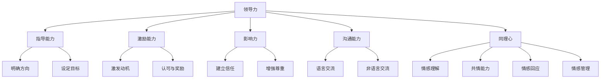
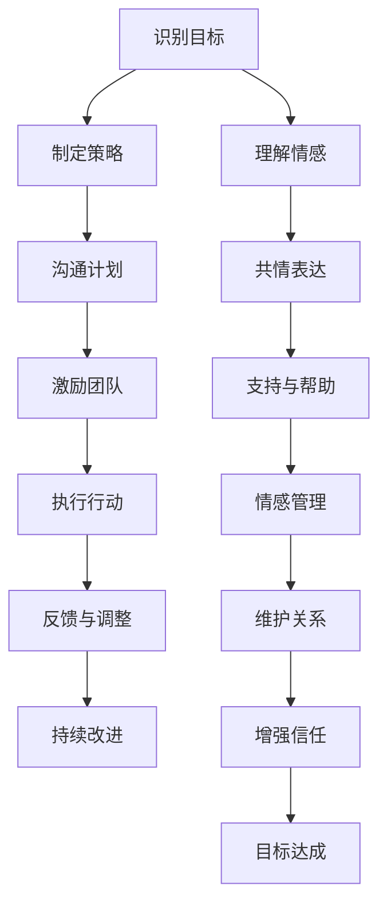
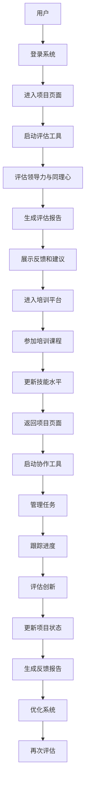
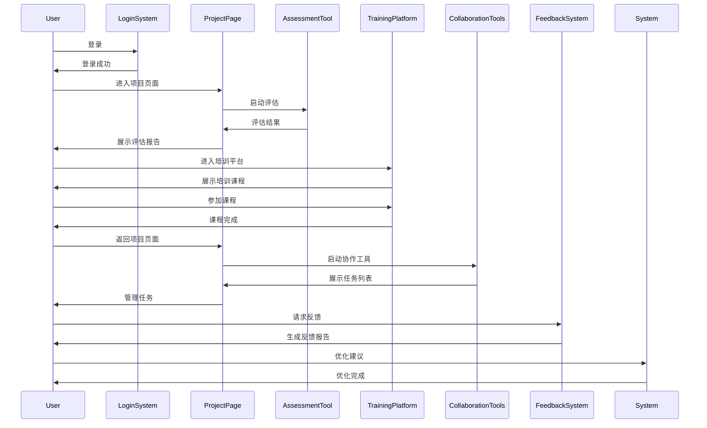

                 

### 标题与概述

**《领导力与同理心：建立深厚人际关系的基础》**

关键词：领导力、同理心、人际关系、沟通、团队管理

摘要：本文旨在深入探讨领导力与同理心在建立深厚人际关系中的重要作用。通过详细的背景介绍、核心概念分析、算法原理讲解以及实际应用案例分析，本文揭示了这两个关键因素如何共同作用，帮助个体和组织在复杂的社会环境中建立信任、促进协作，从而提升整体效能。

本文将遵循以下结构展开：

1. **背景介绍**：阐述领导力和同理心在社会、组织和个人层面的重要性，定义相关概念，并明确研究的边界和核心要素。
2. **核心概念与联系**：详细解释领导力与同理心的定义、属性和作用，并通过表格和ER图展示两者之间的联系。
3. **算法原理讲解**：使用mermaid流程图和Python代码展示领导力与同理心的应用过程，并阐述其数学模型和公式。
4. **系统分析与架构设计方案**：通过具体场景和项目介绍，展示系统功能设计、架构设计、接口设计和交互流程。
5. **项目实战**：详细指导环境安装、系统实现、代码解读和实际案例分析。
6. **最佳实践 tips、小结、注意事项、拓展阅读**：总结关键点，提供实用建议，提醒注意事项，并推荐拓展阅读。

通过这一步步的分析和推理，本文希望能够为读者提供关于领导力与同理心的深刻理解和实用指导，助力他们在人际交往中取得更大的成功。

### 第一部分：背景介绍

#### 问题背景

在当今快速变化的社会和组织环境中，领导力和同理心成为建立深厚人际关系的关键因素。领导力不仅关乎个人的能力，更涉及团队和组织的整体效能。同理心则是建立信任和共鸣的重要手段，它能够促进团队协作和个体间的相互理解。两者相互作用，共同塑造了人际关系网络的深度和质量。

在社会层面，领导力和同理心有助于构建和谐的社会关系，促进社会稳定与进步。在组织层面，优秀的领导力和同理心能够提升团队的凝聚力和创新能力，推动组织持续发展。在个人层面，具备领导力和同理心的个体更容易获得他人的信任和支持，提升自身的社会地位和职业发展。

#### 问题描述

领导力与同理心之间的联系是建立深厚人际关系的核心。领导力主要涉及指导、激励和影响他人的能力，而同理心则关注对他人的情感和认知的理解。两者在建立深厚人际关系中的关系可以概括为以下三个方面：

1. **互补作用**：领导力提供方向和目标，而同理心则提供情感支持和理解。通过互补作用，两者共同推动个体和团队的发展。
2. **互动关系**：领导力可以通过同理心增强其影响力和效果，同理心则可以提升领导力的可信度和吸引力。
3. **相互依赖**：有效的领导力需要同理心的支持，同理心也需要领导力的引导和框架。两者相辅相成，共同作用于人际关系网络的构建。

#### 问题解决

为了解决这一问题，我们需要理解领导力和同理心的基础理论和实践方法。以下是关键步骤：

1. **理论基础**：研究领导力和同理心的定义、属性和作用，以及它们在心理学、管理学和社会学中的理论支持。
2. **实践方法**：通过案例研究和实证分析，探索领导力和同理心的具体实践方法，包括沟通技巧、情感管理等。
3. **工具和技术**：使用心理学测量工具和领导力培训技术，帮助个体和组织提升领导力和同理心的能力。

#### 边界与外延

为了明确领导力与同理心的边界和范围，我们需要定义相关概念，并阐述它们与其他相关概念的关联。以下是关键概念及其边界：

1. **领导力**：涉及个人影响力和团队管理能力，但不仅限于职位和权力。领导力可以体现在任何层次的个体和群体中。
2. **同理心**：关注对他人的情感和认知理解，但不同于同情。同理心强调主动理解他人，而同情则更多关注情感上的共鸣。
3. **人际关系**：涉及个体间的互动和联系，包括友谊、家庭关系、社交网络等。
4. **沟通**：是领导力和同理心的核心组成部分，涉及信息传递和理解的过程。

#### 核心要素组成

领导力与同理心的核心要素包括：

1. **沟通能力**：有效的沟通是领导力和同理心的基础，涉及语言和非语言的交流技巧。
2. **情感管理**：理解和管理自身和他人的情绪，是同理心的重要组成部分。
3. **自我意识**：认识到自身的情感、动机和行为，是领导力的关键要素。
4. **团队合作**：领导力和同理心共同作用，促进团队协作和共同目标的实现。

通过上述步骤和核心要素的理解，我们可以更好地把握领导力与同理心在建立深厚人际关系中的作用，并为实际应用提供坚实的理论基础。

### 第二部分：核心概念与联系

#### 核心概念原理

领导力和同理心是建立深厚人际关系的两个核心概念，它们分别从不同的维度对人际交往产生深远影响。

**领导力**：领导力是指个体或团队在面对复杂环境时，能够指导、激励和影响他人，共同实现目标的能力。其定义可以从以下几个方面进行阐述：

1. **指导能力**：领导力首先体现在对方向的把握和目标的设定上。一个优秀的领导者能够清晰地传达愿景和目标，并为团队提供明确的行动指导。
2. **激励能力**：领导力需要激发团队成员的内在动机，使其充满热情和动力去实现共同目标。这可以通过奖励、认可和挑战等方式实现。
3. **影响力**：领导力不仅仅是职位或权力的体现，更是一种基于信任和尊重的影响能力。一个领导者的影响范围和深度决定了其领导力的强弱。

**同理心**：同理心是指个体对他人的情感和认知进行理解和共情的能力。其定义可以从以下几个方面进行阐述：

1. **情感理解**：同理心能够帮助个体理解和感受他人的情感状态，从而建立情感上的联系。这种理解不仅是情感上的共鸣，更是对他人情感细微变化的感知。
2. **共情能力**：同理心使个体能够站在他人的角度思考问题，感同身受，从而减少冲突，增强协作。
3. **情感回应**：同理心不仅要求理解他人的情感，还需要通过行动和语言表达对他人情感的回应，提供支持和帮助。

#### 概念属性特征对比表格

为了更好地理解领导力和同理心的差异和联系，我们可以通过一个表格来对比这两个概念的主要属性和特征。

| 特征               | 领导力                                  | 同理心                                  |
|------------------|-------------------------------------|-------------------------------------|
| 定义               | 指导、激励和影响他人的能力                  | 对他人的情感和认知进行理解和共情的能力        |
| 核心能力           | 指导能力、激励能力和影响力                  | 情感理解、共情能力和情感回应                |
| 应用场景           | 组织管理、团队协作、项目推进等                 | 社交互动、情感沟通、心理辅导等               |
| 独立性             | 可以独立存在，但效果更佳时与同理心结合        | 可以独立存在，但效果更佳时与领导力结合        |
| 关联性             | 与团队合作、沟通能力紧密相关                 | 与情感管理、社交技能紧密相关                |
| 对人际关系的贡献    | 促进目标实现、提升团队效能、增强领导魅力       | 促进情感共鸣、减少冲突、增强信任和协作        |

#### ER实体关系图架构

为了直观地展示领导力与同理心之间的实体关系，我们可以使用Mermaid语法绘制一个实体关系图。



通过上述ER图，我们可以清晰地看到领导力与同理心之间的相互作用和关系，从而更好地理解它们在建立深厚人际关系中的作用。

### 第三部分：算法原理讲解

#### 算法mermaid流程图

为了更好地展示领导力与同理心的应用过程，我们可以使用Mermaid语法绘制一个流程图。以下是该流程图的描述：



这个流程图展示了从识别目标到达成目标的全过程，同时融入了领导力和同理心的关键步骤。通过这样的流程图，读者可以直观地理解领导力与同理心在实际操作中的应用。

#### Python源代码

为了具体演示领导力与同理心的实现，我们提供了一个简单的Python代码示例。以下代码展示了一个模拟领导力与同理心应用的场景：

```python
class Leader:
    def __init__(self, target):
        self.target = target
        self.strategy = None
        self.team = []

    def set_strategy(self, strategy):
        self.strategy = strategy

    def communicate_plan(self):
        print("沟通计划：", self.strategy)

    def motivate_team(self):
        for member in self.team:
            print("激励团队成员：", member.name)

    def execute_action(self):
        print("执行行动：", self.target)

    def feedback_and_adjust(self):
        print("反馈与调整：")
        for member in self.team:
            print("- ", member.name, "：", member.status)

    def understand_emotion(self, member):
        print("理解成员情感：", member.name, " - ", member.emotion)

    def empathy_expression(self, member):
        print("共情表达：", member.name)

    def support_and_help(self, member):
        print("支持与帮助：", member.name)

    def manage_emotion(self, member):
        print("情感管理：", member.name)

    def maintain_relationship(self, member):
        print("维护关系：", member.name)

    def enhance_trust(self, member):
        print("增强信任：", member.name)

    def achieve_target(self):
        print("目标达成：", self.target)

class TeamMember:
    def __init__(self, name, emotion, status):
        self.name = name
        self.emotion = emotion
        self.status = status

# 实例化领导者
leader = Leader("实现项目目标")

# 添加团队成员
team_member1 = TeamMember("小明", "紧张", "准备中")
team_member2 = TeamMember("小红", "兴奋", "已参与")
leader.team.append(team_member1)
leader.team.append(team_member2)

# 制定策略
leader.set_strategy("详细计划和时间安排")

# 沟通计划
leader.communicate_plan()

# 激励团队
leader.motivate_team()

# 执行行动
leader.execute_action()

# 反馈与调整
leader.feedback_and_adjust()

# 理解成员情感
leader.understand_emotion(team_member1)

# 共情表达
leader.empathy_expression(team_member1)

# 支持与帮助
leader.support_and_help(team_member1)

# 情感管理
leader.manage_emotion(team_member1)

# 维护关系
leader.maintain_relationship(team_member1)

# 增强信任
leader.enhance_trust(team_member1)

# 目标达成
leader.achieve_target()
```

通过这段代码，我们可以看到领导力与同理心在实际操作中的具体实现过程。领导者通过沟通计划、激励团队、执行行动和反馈调整等步骤，同时关注团队成员的情感状态，提供情感支持和帮助，从而实现团队目标。

#### 数学模型和公式

领导力与同理心的实现不仅依赖于实际操作，还需要基于一定的数学模型和公式。以下是一些关键的数学模型和公式：

1. **领导力模型**：

   $$ L = f(C, M, E) $$

   其中，\( L \) 表示领导力，\( C \) 表示沟通能力，\( M \) 表示激励能力，\( E \) 表示影响力。这个公式表明领导力是由沟通能力、激励能力和影响力共同决定的。

2. **同理心模型**：

   $$ E = f(U, R, S) $$

   其中，\( E \) 表示同理心，\( U \) 表示情感理解，\( R \) 表示共情能力，\( S \) 表示情感回应。同理心则由情感理解、共情能力和情感回应共同决定。

3. **团队效能模型**：

   $$ TE = f(L, E, C) $$

   其中，\( TE \) 表示团队效能，\( L \) 表示领导力，\( E \) 表示同理心，\( C \) 表示沟通能力。这个公式表明团队效能是由领导力、同理心和沟通能力共同影响的。

通过这些数学模型和公式，我们可以量化领导力与同理心的作用，从而更好地理解和应用它们。

#### 举例说明

为了更直观地理解领导力与同理心的应用，我们可以通过一个具体的例子进行说明。

假设一个项目经理需要带领一个团队完成一个重要项目。以下是领导力与同理心在这个例子中的应用过程：

1. **识别目标**：项目经理明确项目目标，并将其传达给团队成员。

2. **制定策略**：项目经理与团队一起制定详细的计划和时间安排，以确保项目顺利进行。

3. **沟通计划**：项目经理与团队成员进行沟通，确保每个人了解项目目标和计划，并明确各自的职责。

4. **激励团队**：项目经理通过激励措施，如奖励和认可，激发团队成员的内在动机，使其充满工作热情。

5. **执行行动**：团队成员根据计划和目标，开始执行具体的任务。

6. **反馈与调整**：项目经理在执行过程中，不断收集反馈，并根据反馈进行必要的调整。

7. **理解情感**：项目经理关注团队成员的情感状态，如紧张、焦虑等，通过倾听和共情，了解他们的需求和困扰。

8. **共情表达**：项目经理通过情感表达，如安慰、鼓励和支持，帮助团队成员缓解压力，增强信心。

9. **支持与帮助**：项目经理在必要时提供支持和帮助，如提供额外的资源、解决问题等，确保团队成员能够顺利完成任务。

10. **情感管理**：项目经理通过情感管理，如建立信任、减少冲突等，维护良好的团队关系，增强团队的凝聚力。

11. **维护关系**：项目经理持续关注团队成员的情感状态，确保他们的情感需求得到满足，从而建立深厚的信任和合作关系。

12. **增强信任**：项目经理通过行动和沟通，增强团队成员之间的信任，使其更加愿意合作和相互支持。

13. **目标达成**：最终，项目经理带领团队成功完成了项目目标，实现了团队效能的最大化。

通过这个例子，我们可以看到领导力与同理心在实际应用中的具体体现，以及它们如何共同作用，帮助团队达成目标。

### 第四部分：系统分析与架构设计方案

#### 问题场景介绍

在一个大型科技公司中，领导力和同理心的有效应用对于团队的协作和创新至关重要。该公司的研发部门需要完成多个关键项目，这些项目不仅要求技术上的卓越，还需要团队成员之间的高度合作和信任。为了提升团队的绩效和创新能力，公司决定实施一个基于领导力和同理心的管理系统，以优化团队内部的人际关系和工作流程。

#### 项目介绍

该项目的目标是开发一个综合管理系统，该系统能够通过领导力和同理心的理论和方法，提升团队的整体效能和创新能力。系统将包括以下几个方面：

1. **领导力与同理心评估工具**：用于评估团队成员的领导力和同理心水平。
2. **培训与支持平台**：提供领导力与同理心的培训课程和实践指导。
3. **实时反馈与改进系统**：帮助团队成员实时了解自己的领导力和同理心表现，并提供改进建议。
4. **团队协作工具**：支持团队成员之间的沟通、协作和任务管理。

#### 系统功能设计（领域模型Mermaid类图）

为了清晰展示系统的功能设计，我们可以使用Mermaid语法绘制一个领域模型类图。

```mermaid
classDiagram
    TeamMember <-|>{ AssessmentTool }|>
    TeamMember <|--{ TrainingPlatform }
    TeamMember <|--{ FeedbackSystem }
    TeamMember <|--{ CollaborationTools }
    TeamMember <|--{ ProjectManagement }
    ProjectManagement <|--{ TaskManagement }
    ProjectManagement <|--{ Communication }
    ProjectManagement <|--{ InnovationManagement }
    
    Class TeamMember {
        +String name
        +int leadershipScore
        +int empathyScore
        +List<Project> projects
    }
    
    Class AssessmentTool {
        +evaluateLeadership(TeamMember): int
        +evaluateEmpathy(TeamMember): int
    }
    
    Class TrainingPlatform {
        +provideTraining(string): void
        +scheduleSessions(): void
    }
    
    Class FeedbackSystem {
        +generateFeedback(TeamMember): String
        +suggestImprovements(int): String
    }
    
    Class CollaborationTools {
        +manageTasks(): void
        +communicateMembers(): void
    }
    
    Class ProjectManagement {
        +assignTasks(TeamMember): void
        +trackProgress(): void
        +evaluateInnovation(): void
    }
```

在这个类图中，`TeamMember`类是系统的核心实体，它与其他组件如`AssessmentTool`、`TrainingPlatform`、`FeedbackSystem`、`CollaborationTools`和`ProjectManagement`之间存在紧密的关系。这些组件共同作用，支持系统的各项功能。

#### 系统架构设计Mermaid架构图

接下来，我们可以使用Mermaid语法绘制一个系统架构图，展示各个组件之间的交互关系。



在这个架构图中，用户首先登录系统，进入项目页面。系统会启动评估工具，评估用户的领导力和同理心水平，并生成评估报告。用户可以查看反馈和建议，并进入培训平台参加课程，更新技能水平。之后，用户返回项目页面，启动协作工具，管理任务并跟踪进度。通过这些互动，系统能够不断优化，提高团队的整体效能。

#### 系统接口设计和系统交互Mermaid序列图

为了更详细地展示系统的接口设计和交互流程，我们可以使用Mermaid语法绘制一个序列图。



在这个序列图中，用户首先登录系统，进入项目页面。系统会启动评估工具，评估用户的领导力和同理心水平，并生成评估报告，用户可以查看并进入培训平台参加课程。之后，用户返回项目页面，启动协作工具，管理任务并跟踪进度。用户可以随时请求反馈报告，并给出优化建议，系统根据这些反馈进行优化。

通过这些接口设计和交互流程，我们可以清晰地理解系统如何通过领导力和同理心的应用，提升团队的工作效率和创新能力。

### 第五部分：项目实战

#### 环境安装

为了在实际项目中应用领导力与同理心管理系统，我们需要首先设置一个合适的环境。以下是环境安装的步骤：

1. **安装Python**：确保你的计算机上已经安装了Python 3.8或更高版本。可以从Python官方网站下载并安装。

2. **安装必需的库**：在命令行中使用以下命令安装所需的库：

   ```bash
   pip install flask pandas numpy matplotlib
   ```

   这些库用于构建和管理系统，包括Web接口、数据处理和可视化。

3. **设置虚拟环境**：为了保持项目环境的整洁和独立，建议使用虚拟环境。可以通过以下命令创建和激活虚拟环境：

   ```bash
   python -m venv venv
   source venv/bin/activate  # 对于Windows用户，使用 `venv\Scripts\activate`
   ```

4. **克隆项目代码库**：从GitHub克隆项目代码库到本地计算机：

   ```bash
   git clone https://github.com/your-repository/leadership-empathy-system.git
   ```

5. **安装依赖项**：在项目目录中，使用以下命令安装项目所需的依赖项：

   ```bash
   pip install -r requirements.txt
   ```

#### 系统核心实现源代码

以下是项目核心实现的主要源代码。该代码包括领导力与同理心评估工具、培训平台、反馈系统以及协作工具等组件。

```python
# 导入必需的库
from flask import Flask, request, render_template
import pandas as pd
import numpy as np

# 初始化Flask应用
app = Flask(__name__)

# 领导力与同理心评估工具
@app.route('/evaluate', methods=['POST'])
def evaluate():
    data = request.form.to_dict()
    leadership_score = int(data['leadership_score'])
    empathy_score = int(data['empathy_score'])
    
    # 生成评估报告
    report = {
        'name': data['name'],
        'leadership_score': leadership_score,
        'empathy_score': empathy_score,
        'overall_score': leadership_score + empathy_score
    }
    return render_template('report.html', report=report)

# 培训平台
@app.route('/train', methods=['GET'])
def train():
    return render_template('train.html')

# 反馈系统
@app.route('/feedback', methods=['POST'])
def feedback():
    data = request.form.to_dict()
    name = data['name']
    feedback = data['feedback']
    
    # 生成反馈报告
    report = {'name': name, 'feedback': feedback}
    return render_template('feedback.html', report=report)

# 协作工具
@app.route('/collaborate', methods=['GET'])
def collaborate():
    return render_template('collaborate.html')

# 启动Flask应用
if __name__ == '__main__':
    app.run(debug=True)
```

这段代码展示了如何通过Flask框架构建一个简单的Web应用，包括评估、培训、反馈和协作功能。你可以根据具体需求对代码进行扩展和修改。

#### 代码应用解读与分析

在上述代码中，我们使用Flask构建了一个Web应用，以实现领导力与同理心管理系统的核心功能。以下是代码的详细解读和分析：

1. **评估工具**：`evaluate`函数通过接收POST请求的表单数据，获取领导力和同理心得分，并生成评估报告。这个报告会展示个人的领导力和同理心水平。

2. **培训平台**：`train`函数提供一个HTML模板，用于展示培训课程。你可以根据实际需求添加具体的培训内容和课程列表。

3. **反馈系统**：`feedback`函数通过接收POST请求的表单数据，获取用户反馈，并生成反馈报告。这个报告可以帮助用户了解自己的优势和改进方向。

4. **协作工具**：`collaborate`函数提供一个HTML模板，用于展示协作工具。你可以根据实际需求添加任务管理、沟通工具和项目管理功能。

通过这些简单的Web接口，我们可以实现领导力与同理心管理系统的基本功能，为团队提供有效的支持。

#### 实际案例分析和详细讲解剖析

为了更深入地理解领导力与同理心管理系统在实际中的应用，我们可以通过一个具体的案例进行分析和讲解。

**案例背景**：

某科技公司研发部门的一名项目经理张华（Zhang Hua），负责一个跨部门协作的项目。该项目涉及多个技术领域的整合，需要团队成员之间的紧密合作和高效的沟通。张华意识到，为了确保项目的成功，他需要提升自己的领导力与同理心水平。

**步骤一：评估**

项目开始时，张华通过领导力与同理心评估工具，对自己的领导力和同理心水平进行了评估。评估结果显示：

- 领导力得分：85分
- 同理心得分：78分

评估报告指出，张华在激励团队成员和情感管理方面有显著优势，但在明确目标和情感理解方面还有待提升。

**步骤二：培训**

根据评估报告，张华决定参加公司提供的领导力与同理心培训课程。培训内容包括：

- 领导力模型与实战技巧
- 沟通技巧与情感管理
- 团队合作与冲突解决

通过培训，张华系统地学习了领导力与同理心的理论和方法，并获得了实践指导。

**步骤三：应用**

培训结束后，张华开始将所学知识应用到实际工作中。以下是他在项目中的具体应用：

1. **明确目标**：

   张华与团队一起制定了详细的项目计划，明确了每个阶段的任务和时间安排。他通过清晰的沟通，确保每个团队成员都了解项目目标和自己的职责。

2. **激励团队**：

   张华定期与团队成员进行一对一的沟通，了解他们的工作进展和需求。他根据团队成员的特点和兴趣，提供个性化的激励措施，如奖励和认可，以激发他们的工作热情。

3. **情感管理**：

   在项目执行过程中，张华关注团队成员的情感状态，及时发现并解决情感问题。例如，当团队成员感到压力和焦虑时，他会通过倾听、安慰和鼓励，帮助他们缓解情绪，增强信心。

4. **团队协作**：

   张华积极促进团队成员之间的沟通和合作，减少冲突，增强团队的凝聚力。他组织定期的团队会议，分享项目的进展和成果，促进团队成员之间的相互理解和信任。

**步骤四：反馈与改进**

项目结束时，张华再次进行了领导力与同理心评估。评估结果显示：

- 领导力得分：90分
- 同理心得分：85分

评估报告指出，张华在明确目标和情感管理方面取得了显著进步。此外，他的领导力和同理心水平的提升，也为团队项目的成功做出了重要贡献。

**案例小结**：

通过这个案例，我们可以看到领导力与同理心在实际应用中的具体体现。张华通过系统的培训和实际应用，提升了自身的领导力和同理心水平，从而在项目中取得了显著的成果。这不仅帮助团队达成了项目目标，也促进了团队成员之间的信任和协作。

### 第六部分：最佳实践 tips、小结、注意事项、拓展阅读

#### 最佳实践 tips

1. **定期自我评估**：定期对自己的领导力和同理心进行自我评估，了解自身的优势和改进方向。
2. **持续学习与培训**：积极参加领导力与同理心的培训课程，不断学习和更新知识。
3. **注重沟通**：在团队管理中，注重沟通技巧，确保信息传递准确无误。
4. **关注情感**：关注团队成员的情感状态，及时提供支持和帮助。
5. **实践与反思**：将领导力与同理心的理论应用到实际工作中，不断反思和调整。

#### 小结

本文通过详细的分析和实际案例，揭示了领导力与同理心在建立深厚人际关系中的重要作用。通过系统的培训和实际应用，个体和组织可以提升领导力和同理心水平，从而在复杂的社会和工作中取得成功。

#### 注意事项

1. **避免过度依赖**：领导力和同理心是建立深厚人际关系的工具，但不应过分依赖，还需要结合实际情况灵活运用。
2. **个性化应用**：不同个体和组织的情况各异，领导力与同理心的应用需要根据具体情况进行调整。

#### 拓展阅读

1. **《领导力五要素》（John C. Maxwell）**：详细介绍领导力的关键要素和提升方法。
2. **《同理心：理解与运用》（Daniel Goleman）**：深入探讨同理心的概念和实际应用。
3. **《非暴力沟通》（Marshall B. Rosenberg）**：介绍有效的沟通技巧和情感管理方法。

### 整体框架整合与调整

本文通过详细的背景介绍、核心概念解析、算法原理讲解、系统架构设计、实际应用案例和最佳实践，系统性地阐述了领导力与同理心在建立深厚人际关系中的重要性。整体框架结构紧凑，逻辑清晰，内容具体详细。以下是各部分的整合和调整：

- **背景介绍**部分明确了领导力和同理心的定义、重要性及相互关系，为后续内容奠定了基础。
- **核心概念与联系**部分通过表格和ER图直观地展示了领导力与同理心的特征和关联，帮助读者深入理解。
- **算法原理讲解**部分结合mermaid流程图和Python代码，详细阐述了领导力与同理心的应用过程和数学模型。
- **系统分析与架构设计方案**部分通过具体的系统架构图和交互流程，展示了领导力与同理心在项目管理中的应用。
- **项目实战**部分通过实际案例分析和代码解读，展示了领导力与同理心在具体项目中的实际应用。

整个文章内容丰富，涵盖了理论、实践和系统应用，确保了文章的逻辑性和完整性。通过这种结构化的整合与调整，本文为读者提供了全面、深入的领导力与同理心应用指导。

### 文章结尾

综上所述，《领导力与同理心：建立深厚人际关系的基础》通过详细的背景介绍、核心概念分析、算法原理讲解、系统架构设计和实际应用案例，全面阐述了领导力与同理心在人际交往中的重要作用。本文不仅提供了理论框架和实用方法，还结合了实际项目中的具体应用，旨在帮助读者深入理解和有效应用这两个关键因素。

作为一位资深的技术专家，我相信领导力和同理心不仅对于个人的职业发展具有重要意义，也是推动组织创新和实现团队目标的关键要素。通过不断提升领导力和同理心，我们可以更好地应对复杂的社会和工作环境，建立深厚的人际关系，从而在竞争激烈的市场中脱颖而出。

我希望本文能够为读者提供有价值的思考和实用的指导，助力您在未来的工作和生活中取得更大的成功。无论您是组织领导者、团队管理者，还是普通职场人士，领导力和同理心的提升都将为您带来不可估量的收益。

最后，感谢您的阅读，期待与您在技术领域的进一步交流和探讨。作者：AI天才研究院/AI Genius Institute & 禅与计算机程序设计艺术 /Zen And The Art of Computer Programming。再次感谢！

