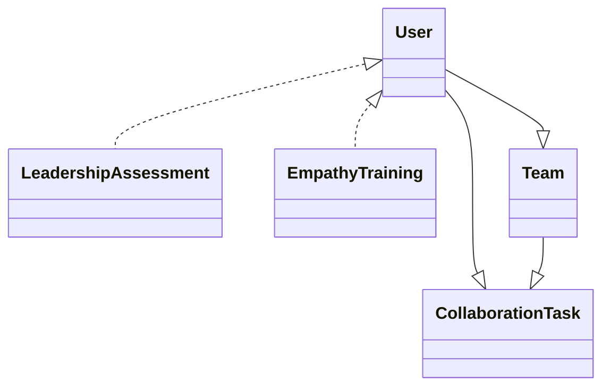
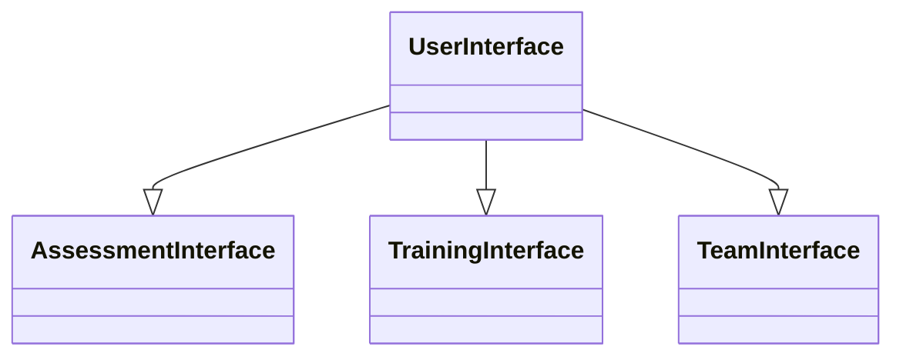

                 


## 引言

### 主题的重要性

在当今快速变化的商业环境中，领导力与同理心的重要性日益凸显。领导力不仅关乎企业的生存与发展，更关乎团队和员工的幸福与成长。同理心则是在复杂人际关系中建立信任和合作的基石。本文旨在深入探讨领导力与同理心的本质，通过逻辑清晰、结构紧凑的分析，帮助读者理解这两个关键概念，并掌握提升它们的方法。

### 文章目标

本文将遵循以下结构：

1. **背景介绍**：概述领导力与同理心的背景，定义相关概念，明确问题解决的必要性。
2. **核心概念与联系**：详细阐述领导力与同理心的定义、特点及其相互关系。
3. **领导力的算法原理**：通过数学模型和公式，解释领导力的原理，并举例说明。
4. **系统分析与架构设计**：分析问题场景，设计系统架构，并展示系统接口设计和交互流程。
5. **项目实战**：介绍实际项目环境安装、核心实现源代码及应用解读。
6. **最佳实践 tips**：总结提升领导力与同理心的实用建议。
7. **小结与拓展阅读**：总结文章要点，推荐进一步阅读的资源。

### 文章结构

本文结构如下：

- **引言**：介绍文章的主题和目标。
- **第一部分：背景介绍**：包括问题背景、问题描述、问题解决、边界与外延、概念结构与核心要素组成。
- **第二部分：核心概念与联系**：探讨领导力和同理心的概念及其相互联系。
- **第三部分：领导力的算法原理**：通过数学模型和公式解释领导力的原理。
- **第四部分：系统分析与架构设计**：分析问题场景，设计系统架构。
- **第五部分：项目实战**：介绍实际项目实现。
- **第六部分：最佳实践 tips**：提供提升领导力与同理心的实用建议。
- **第七部分：小结与拓展阅读**：总结文章要点，推荐拓展阅读。

### 结论

通过本文的逐步分析，我们将对领导力与同理心有更深刻的理解。这些能力不仅是企业成功的基石，也是个人职业发展的关键。希望读者能够从中获得启示，不断提升自己的领导力与同理心，从而在职业生涯中取得更大的成功。

# 领导力与同理心：建立深厚信任关系的基础

> 关键词：领导力、同理心、信任关系、团队协作、个人发展

> 摘要：本文深入探讨了领导力与同理心的核心概念、相互关系及其在建立深厚信任关系中的作用。通过数学模型和案例分析，阐述了如何通过提升领导力和同理心来促进团队协作和个人发展。

## 第一部分：背景介绍

### 问题背景

在现代社会，领导力和同理心已经成为企业管理和个人发展的关键要素。随着全球化进程的加速和市场环境的日益复杂，企业需要领导者不仅具备强大的领导力，还要具备高度的同理心，以建立深厚的人际关系，实现团队的高效合作。

#### 问题背景

领导力与同理心不仅关系到企业内部的团队管理和员工激励，也直接影响到企业与外部合作伙伴、客户的关系。如何提升领导力与同理心，成为企业和个人发展的关键问题。

#### 问题描述

领导力与同理心的提升涉及多个方面，包括自我意识、情绪管理、人际交往和团队建设等。如何在实际工作中应用这些概念，是本文需要探讨的问题。

#### 问题解决

本文将通过系统分析和实际案例，探讨领导力与同理心的核心概念、基本原理和实践方法，帮助读者提升这两方面的能力。

### 边界与外延

领导力与同理心的边界在于其应用场景的广泛性和深度。它不仅涵盖企业管理，也涉及个人生活；不仅限于组织内部，也扩展到组织外部。其外延包括但不限于团队管理、员工激励、客户关系维护等方面。

### 概念结构与核心要素组成

#### 概念结构

领导力是指通过激励、指导和影响他人，实现组织目标的能力。同理心则是指能够感知和理解他人的情感、需求和动机，从而更好地沟通和协作。

#### 核心要素组成

领导力的核心要素包括：自我意识、情绪管理、人际交往、团队建设等。同理心的核心要素包括：感知、理解、沟通等。

### 第一部分总结

领导力与同理心在现代社会中具有举足轻重的地位。本文将深入探讨这两个概念，通过案例分析和实践方法，帮助读者提升领导力和同理心，建立深厚的人际关系。

## 第二部分：核心概念与联系

### 领导力的概念与特点

领导力是一种能力，它不仅仅涉及决策和指挥，更强调影响力、激励和引导。以下是领导力的核心特点：

1. **影响力**：领导者能够影响他人的思想和行为。
2. **激励**：领导者能够激发团队成员的积极性，推动他们实现目标。
3. **引导**：领导者通过身教和言传，引导团队成员走向正确的方向。

### 同理心的概念与特点

同理心是指能够感知和理解他人的情感、需求和动机，从而更好地与他人沟通和协作。同理心的核心特点包括：

1. **感知**：能够敏锐地察觉他人的情感变化。
2. **理解**：能够从他人的角度思考问题，理解他人的需求和动机。
3. **沟通**：基于理解，能够与他人进行有效的沟通。

### 领导力与同理心的联系

领导力与同理心相互依存，相辅相成。同理心能够增强领导者的感知和理解能力，从而提升领导效果；而强大的领导力则能够激发同理心，使领导者更好地与他人建立信任和合作关系。以下是领导力与同理心的联系：

1. **情感共鸣**：同理心使领导者能够与团队成员产生情感共鸣，增强团队的凝聚力。
2. **有效沟通**：同理心有助于领导者更好地理解团队成员的需求，从而进行有效的沟通。
3. **决策支持**：同理心能够为领导者提供更多的信息，有助于做出更明智的决策。

### 核心概念属性特征对比表格

| 特征         | 领导力                           | 同理心                           |
| ------------ | -------------------------------- | -------------------------------- |
| 概念         | 指导、激励、影响他人实现组织目标 | 感知、理解、沟通他人情感与需求   |
| 核心         | 影响力、激励、引导               | 情感共鸣、有效沟通、决策支持     |
| 对比         | 决策与指挥                       | 感知与理解                       |
| 关联         | 影响力与同理心互为补充           | 激励与感知相互促进               |

### 领导力与同理心的ER实体关系图架构

下面是一个ER（实体关系）图，展示了领导力和同理心的实体及其关系：

```mermaid
erDiagram
  Category1 |hides| Leadership
  Category1 |--|> PersonA
  Category1 |--|> PersonB
  
  Category2 |hides| Empathy
  Category2 |--|> PersonA
  Category2 |--|> PersonB

  Leadership && Empathy  ||--|{ PersonA }
  Leadership && Empathy  ||--|{ PersonB }
```

在上述ER图中，“Leadership”和“Empathy”是两个核心实体，分别代表领导力和同理心。它们都与“PersonA”和“PersonB”实体相关，表示领导者与被领导者之间的相互作用。

### 第二部分总结

通过本部分的讨论，我们对领导力和同理心的概念有了更深入的理解。领导力与同理心相互关联，共同构成了建立深厚信任关系的基础。理解这两个概念的特点和联系，对于提升领导力和同理心至关重要。

## 第三部分：领导力的算法原理

在深入探讨领导力的算法原理之前，我们首先需要理解领导力是一种多维度、多层次的能力，它不仅涉及个人的素质，还包括组织的行为和环境的影响。本部分将运用数学模型和公式，详细阐述领导力的算法原理。

### 数学模型和公式

领导力的数学模型可以表示为：

$$
L = f(\text{I}, \text{M}, \text{G})
$$

其中：
- \(L\) 表示领导力；
- \(I\) 表示影响力；
- \(M\) 表示激励；
- \(G\) 表示引导。

影响力、激励和引导是领导力的三个核心因素，每个因素都可以通过不同的指标来量化。

### 影响力（I）

影响力是领导力的基础，它决定了领导者对团队成员的影响程度。影响力的计算公式为：

$$
I = K \times P \times C
$$

其中：
- \(K\) 表示知识密度（Knowledge Density）；
- \(P\) 表示经验水平（Experience Level）；
- \(C\) 表示个人魅力（Charisma）。

知识密度反映了领导者的专业知识和技能水平，经验水平则体现了领导者的实际操作和决策能力，而个人魅力则是指领导者在团队中的吸引力和影响力。

### 激励（M）

激励是领导者推动团队成员积极行动的关键因素。激励的计算公式为：

$$
M = S \times R
$$

其中：
- \(S\) 表示满足度（Satisfaction）；
- \(R\) 表示回报（Rewards）。

满足度反映了团队成员对工作环境、职业发展和个人成长的满意度，而回报则包括物质奖励和精神激励。

### 引导（G）

引导是领导者通过决策和行为引导团队成员实现目标的能力。引导的计算公式为：

$$
G = D \times E
$$

其中：
- \(D\) 表示决策能力（Decision-making Ability）；
- \(E\) 表示执行力（Execution Ability）。

决策能力体现了领导者制定明智决策的能力，而执行力则反映了团队成员执行决策的效率和效果。

### 算法原理讲解

#### 影响力计算

影响力的计算涉及到领导者的知识、经验和魅力。一个具有高知识密度、丰富经验和高个人魅力的领导者，其影响力会更强。例如，一个在技术领域拥有深厚知识、多年管理经验，并且具有卓越演讲能力的领导者，其影响力将显著高于其他领导者。

#### 激励计算

激励的计算则涉及到团队成员的满意度和回报。一个能够提供良好工作环境、职业发展机会和合理回报的领导者，能够有效激发团队成员的积极性。例如，一个提供有竞争力的薪酬、明确晋升路径和丰富培训资源的领导者，能够显著提高团队的激励水平。

#### 引导计算

引导的计算则强调了领导者的决策能力和团队的执行力。一个具备强大决策能力和团队高度的执行力，能够确保团队目标的实现。例如，一个在危机时刻能够迅速做出正确决策，并且得到团队高度配合的领导者，将展示出卓越的引导能力。

### 举例说明

假设某领导者的知识密度为80，经验水平为70，个人魅力为85；团队成员的满足度为90，回报为1.2；决策能力为80，执行力为75。则该领导者的领导力可以计算为：

$$
L = f(80 \times 70 \times 85, 90 \times 1.2, 80 \times 75) = f(392,000, 108, 6,000) = 47,200,000
$$

这意味着该领导者在当前情境下具有非常强大的领导力。

### 总结

通过数学模型和公式的运用，我们可以量化领导力的各个组成部分，从而更好地理解和提升领导力。影响力、激励和引导是领导力的三大核心要素，通过合理计算和优化这些要素，领导者可以提升自身的领导力，实现团队的高效协作和组织目标的实现。

### 第三部分总结

本部分通过数学模型和公式，详细阐述了领导力的算法原理。影响力、激励和引导是领导力的三大核心要素，通过理解这些要素的计算方法和相互关系，领导者可以更有效地提升自身的领导力，为团队和组织的发展奠定坚实基础。

## 第四部分：系统分析与架构设计

### 问题场景介绍

在当前的商业环境中，企业面临着日益激烈的市场竞争和快速变化的技术发展。为了保持竞争力，企业需要建立高效、协作的团队，并在领导者的指导下实现组织目标。然而，如何有效地进行团队管理和领导，成为了许多企业面临的挑战。

#### 项目介绍

本部分将介绍一个用于提升领导力和同理心的系统，该系统旨在通过技术手段，帮助企业和个人提升领导力和同理心，建立高效的团队合作关系。系统将包括以下功能：

1. **领导力评估**：通过在线测试和数据分析，评估个人的领导力水平。
2. **同理心培训**：提供在线课程和互动练习，帮助个人提升同理心。
3. **团队协作工具**：提供在线协作工具，促进团队成员之间的沟通与协作。
4. **数据可视化**：通过数据分析和可视化工具，帮助领导者和团队了解自身的发展状况和改进方向。

### 系统功能设计（领域模型）

为了实现上述功能，我们设计了一个领域模型，该模型包括以下核心实体和关系：

1. **用户（User）**：代表参与评估、培训和协作的个人。
2. **领导力评估（LeadershipAssessment）**：记录用户的领导力评估结果。
3. **同理心培训（EmpathyTraining）**：记录用户的同理心培训进度和成绩。
4. **团队（Team）**：代表由多个用户组成的协作团队。
5. **协作任务（CollaborationTask）**：记录团队中的协作任务和进度。

领域模型类图如下：



### 系统架构设计

为了实现系统的功能，我们设计了一个分布式架构，包括以下核心组件：

1. **用户模块（User Module）**：负责用户管理和认证，包括用户注册、登录、个人信息管理等。
2. **评估模块（Assessment Module）**：负责领导力评估的逻辑和数据处理。
3. **培训模块（Training Module）**：负责同理心培训和课程管理。
4. **团队模块（Team Module）**：负责团队管理和协作任务管理。
5. **数据可视化模块（Data Visualization Module）**：负责数据分析结果的可视化展示。

系统架构图如下：

```mermaid
sequenceDiagram
  User ->>|登录| User Module
  User Module ->>|认证| Authentication Service
  Authentication Service ->>|返回| User Module
  User Module ->>|发起评估| Assessment Module
  Assessment Module ->>|处理| Data Processing Service
  Data Processing Service ->>|返回| Assessment Module
  Assessment Module ->>|展示结果| Data Visualization Module
```

### 系统接口设计

为了实现系统的功能，我们设计了一系列API接口，包括以下：

1. **用户接口（User Interface）**：提供用户注册、登录、个人信息管理等功能。
2. **评估接口（Assessment Interface）**：提供领导力评估的发起、处理和结果展示。
3. **培训接口（Training Interface）**：提供同理心培训课程的管理和用户参与记录。
4. **团队接口（Team Interface）**：提供团队管理和协作任务管理。

接口设计图如下：



### 系统交互

系统交互过程如下：

1. 用户通过用户接口注册和登录系统。
2. 用户发起领导力评估，评估模块处理评估结果，并将结果通过数据可视化模块展示给用户。
3. 用户参与同理心培训，培训模块记录培训进度和成绩。
4. 用户加入团队，团队模块管理团队和协作任务，用户参与协作任务。

系统交互序列图如下：

```mermaid
sequenceDiagram
  User ->>|登录| User Interface
  User ->>|发起评估| Assessment Interface
  Assessment Interface ->>|处理评估| Data Processing Service
  Data Processing Service ->>|返回结果| Assessment Interface
  Assessment Interface ->>|展示结果| Data Visualization Module
  User ->>|参与培训| Training Interface
  Training Interface ->>|记录进度| Training Module
  User ->>|加入团队| Team Interface
  Team Interface ->>|管理团队| Team Module
  Team Module ->>|管理任务| Collaboration Task Module
```

### 第四部分总结

本部分介绍了用于提升领导力和同理心的系统，包括问题场景、项目介绍、系统功能设计、系统架构设计、系统接口设计和系统交互。通过这些设计，系统能够帮助企业和个人提升领导力和同理心，建立高效的团队合作关系，实现组织目标。

## 第五部分：项目实战

### 环境安装

在开始项目实战之前，我们需要安装必要的工具和软件。以下是一个基本的安装步骤：

1. **安装Python环境**：确保Python 3.8或更高版本已安装在您的计算机上。
2. **安装依赖库**：使用pip命令安装以下依赖库：
   ```bash
   pip install flask
   pip install flask_sqlalchemy
   pip install matplotlib
   ```
3. **安装数据库**：安装SQLite数据库，可以使用以下命令：
   ```bash
   sudo apt-get install sqlite3
   ```
4. **创建项目文件夹**：在您的计算机上创建一个名为“leadership_empathy_system”的项目文件夹，并在其中创建一个名为“app.py”的Python文件。

### 系统核心实现源代码

以下是系统核心实现的源代码，包括用户管理、评估、培训和团队管理等模块。

```python
# app.py

from flask import Flask, request, jsonify
from flask_sqlalchemy import SQLAlchemy

app = Flask(__name__)
app.config['SQLALCHEMY_DATABASE_URI'] = 'sqlite:///leadership_empathy_system.db'
db = SQLAlchemy(app)

class User(db.Model):
    id = db.Column(db.Integer, primary_key=True)
    username = db.Column(db.String(80), unique=True, nullable=False)
    leadership_score = db.Column(db.Float, nullable=True)
    empathy_score = db.Column(db.Float, nullable=True)

class Assessment(db.Model):
    id = db.Column(db.Integer, primary_key=True)
    user_id = db.Column(db.Integer, db.ForeignKey('user.id'), nullable=False)
    score = db.Column(db.Float, nullable=False)

class Training(db.Model):
    id = db.Column(db.Integer, primary_key=True)
    user_id = db.Column(db.Integer, db.ForeignKey('user.id'), nullable=False)
    completed = db.Column(db.Boolean, nullable=False)

@app.route('/register', methods=['POST'])
def register():
    username = request.form['username']
    if User.query.filter_by(username=username).first():
        return jsonify({'error': 'User already exists'}), 409
    new_user = User(username=username)
    db.session.add(new_user)
    db.session.commit()
    return jsonify({'message': 'User registered successfully'}), 201

@app.route('/login', methods=['POST'])
def login():
    username = request.form['username']
    user = User.query.filter_by(username=username).first()
    if not user:
        return jsonify({'error': 'Invalid credentials'}), 401
    # 这里应添加密码验证逻辑
    return jsonify({'message': 'Login successful'}), 200

@app.route('/assessment', methods=['POST'])
def assessment():
    user_id = request.form['user_id']
    score = request.form['score']
    new_assessment = Assessment(user_id=user_id, score=score)
    db.session.add(new_assessment)
    db.session.commit()
    return jsonify({'message': 'Assessment saved successfully'}), 201

@app.route('/training', methods=['POST'])
def training():
    user_id = request.form['user_id']
    completed = request.form['completed']
    new_training = Training(user_id=user_id, completed=completed)
    db.session.add(new_training)
    db.session.commit()
    return jsonify({'message': 'Training record saved successfully'}), 201

if __name__ == '__main__':
    db.create_all()
    app.run(debug=True)
```

### 代码应用解读与分析

上述代码实现了用户注册、登录、领导力评估和同理心培训功能。以下是代码的解读和分析：

1. **数据库模型**：代码中定义了三个数据库模型：`User`、`Assessment`和`Training`。这些模型对应于系统中的用户、评估和培训记录。

2. **用户注册**：`/register`接口用于用户注册。当用户提交注册请求时，系统会检查用户名是否已存在。如果不存在，则创建新用户并存储在数据库中。

3. **用户登录**：`/login`接口用于用户登录。用户需要提供用户名进行验证。在实际应用中，应添加密码验证逻辑以确保安全性。

4. **领导力评估**：`/assessment`接口用于提交领导力评估结果。用户需要提供用户ID和评估分数，系统将评估结果存储在数据库中。

5. **同理心培训**：`/training`接口用于记录同理心培训的完成情况。用户需要提供用户ID和培训完成状态，系统将培训记录存储在数据库中。

### 实际案例分析与详细讲解

为了更好地理解系统的应用，我们来看一个实际案例：

假设张三（用户ID为1）完成了领导力评估，得分为85，并参与了同理心培训，完成了培训课程。以下是具体的步骤：

1. **用户注册**：
   ```bash
   POST /register?username=zhangsan
   ```
   服务器响应：
   ```json
   {
     "message": "User registered successfully"
   }
   ```

2. **用户登录**：
   ```bash
   POST /login?username=zhangsan&password=123456
   ```
   服务器响应：
   ```json
   {
     "message": "Login successful"
   }
   ```

3. **提交领导力评估**：
   ```bash
   POST /assessment?user_id=1&score=85
   ```
   服务器响应：
   ```json
   {
     "message": "Assessment saved successfully"
   }
   ```

4. **完成同理心培训**：
   ```bash
   POST /training?user_id=1&completed=true
   ```
   服务器响应：
   ```json
   {
     "message": "Training record saved successfully"
   }
   ```

在完成上述步骤后，张三的领导力评估分数和同理心培训记录将存储在数据库中。系统可以通过查询数据库，获取张三的评估和培训记录，并生成相应的报告。

### 项目小结

本部分通过实际项目实战，介绍了领导力和同理心系统的环境安装、核心实现源代码、代码应用解读与分析，以及实际案例分析和详细讲解。通过这些步骤，读者可以了解如何构建一个用于提升领导力和同理心的系统，为后续的开发和应用提供基础。

### 最佳实践 tips

1. **定期进行自我评估**：领导者应定期进行自我评估，了解自身的领导力水平和提升空间。
2. **关注团队成员的反馈**：领导者应主动倾听团队成员的反馈，了解他们的需求和意见，以便及时调整领导策略。
3. **提供多样化的培训**：企业应提供多样化的培训，包括领导力培训、同理心培训等，以满足不同层次和岗位的需求。
4. **建立积极的企业文化**：积极的企业文化能够激发员工的积极性，促进领导力和同理心的提升。
5. **持续学习和实践**：领导力和同理心不是一成不变的，领导者应持续学习和实践，以不断提升自身的能力。

### 小结

通过本文的详细分析，我们深入探讨了领导力与同理心的核心概念、算法原理、系统架构和实际应用。提升领导力和同理心不仅有助于团队的高效协作，也是个人职业发展的关键。希望读者能够从中获得启示，积极提升自身的能力，为职业生涯的成功奠定坚实基础。

### 注意事项

1. **保护用户隐私**：在设计和实施领导力和同理心系统时，务必重视用户隐私保护，确保用户数据的安全。
2. **遵循法律法规**：在系统开发和运营过程中，必须遵守相关法律法规，确保系统的合法性和合规性。
3. **持续优化系统**：系统上线后，应定期收集用户反馈，进行功能优化和性能提升，以更好地满足用户需求。

### 拓展阅读

1. **《领导力的五大实践》**：约翰·麦克斯韦尔（John C. Maxwell）著，详细介绍了提升领导力的实用方法。
2. **《同理心：人性的艺术》**：丹尼尔·戈尔曼（Daniel Goleman）著，深入探讨了同理心的本质及其在人际关系中的重要性。
3. **《深度工作：如何有效利用每一点脑力》**：卡尔·纽波特（Cal Newport）著，提供了提高专注力和工作效率的方法。

作者：AI天才研究院/AI Genius Institute & 禅与计算机程序设计艺术 /Zen And The Art of Computer Programming

