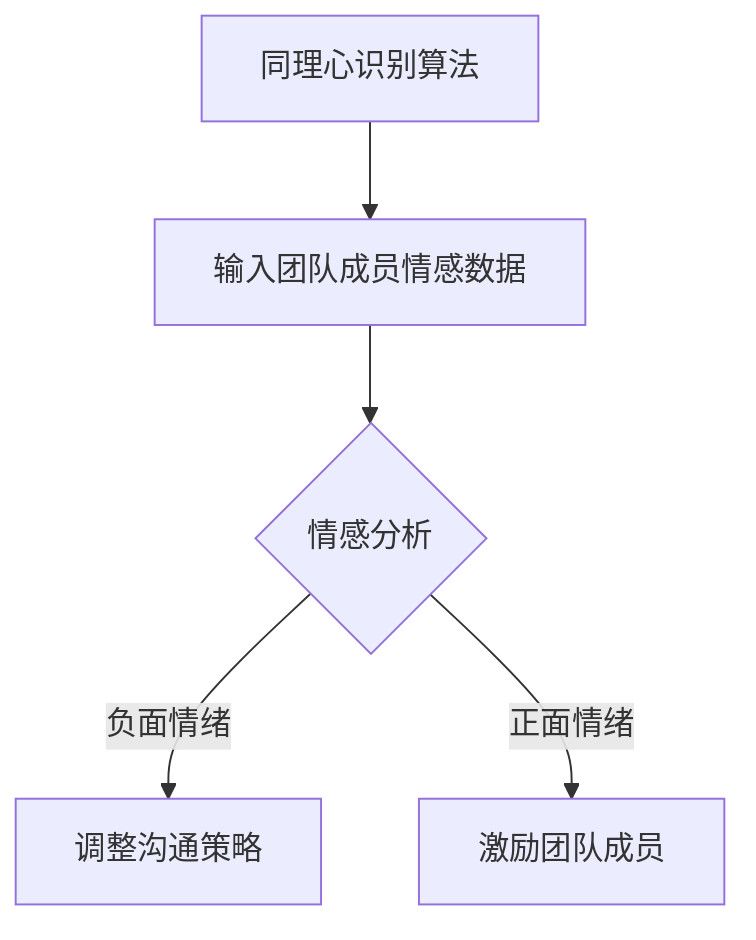

                 

# 领导力与同理心：理解团队需求的能力

## 关键词

- 领导力
- 同理心
- 团队需求
- 人际关系
- 管理实践
- 案例分析

## 摘要

本文旨在探讨领导力与同理心在理解团队需求方面的作用。通过深入分析同理心与领导力的关系，以及同理心在实践中的具体应用，本文将揭示领导者如何在团队管理中运用同理心，提升团队凝聚力和工作效率。文章还将通过实际案例分析，总结出提升领导力与同理心的最佳实践，为企业管理者和团队领导者提供有益的参考。

## 目录大纲

1. **背景介绍**
   1.1 问题背景
   1.2 问题描述
   1.3 问题解决
   1.4 边界与外延
   1.5 概念结构与核心要素组成

2. **同理心与领导力的关系**
   2.1 同理心与领导力的定义
   2.2 同理心对领导力的重要性
   2.3 同理心与领导力的联系

3. **同理心的实践**
   3.1 同理心的属性特征
   3.2 同理心识别算法的mermaid流程图
   3.3 同理心识别的Python源代码
   3.4 同理心识别的数学模型和公式
   3.5 数学模型和公式详细讲解与举例说明

4. **领导力的提升**
   4.1 领导力提升的方法
   4.2 领导力提升的案例分析

5. **团队需求的理解和应对**
   5.1 团队需求分析
   5.2 团队需求应对策略

6. **案例分析与讨论**
   6.1 案例选择
   6.2 案例分析
   6.3 案例讨论

7. **总结与展望**
   7.1 书籍重点内容回顾
   7.2 未来展望与建议

## 第一部分：背景介绍

### 1.1 问题背景

在当今快速变化和竞争激烈的市场环境中，企业领导者面临的挑战日益增多。如何有效地管理团队，提升团队的工作效率和凝聚力，成为企业成功的关键因素之一。而在这个过程中，领导力与同理心的作用不可忽视。

领导力是指领导者通过激励和引导团队成员实现共同目标的能力。同理心则是指领导者能够理解并感受团队成员的情感和需求。领导力与同理心的结合，不仅有助于领导者更好地了解团队需求，还能提升团队的士气和合作精神，从而实现企业的长期发展。

### 1.2 问题描述

虽然领导力与同理心在团队管理中具有重要作用，但实际操作中，许多领导者却难以有效地运用这两种能力。一方面，领导者可能对同理心缺乏认识，将其视为情感上的依赖，而非管理工具；另一方面，领导者可能在实践中过于强调领导力的刚性特征，忽视了同理心在团队管理中的价值。

这种现象导致了以下问题：

1. **沟通障碍**：领导者难以理解团队成员的情感和需求，导致沟通不畅，团队协作困难。
2. **员工满意度低**：员工感受到被忽视或不被重视，工作积极性下降，离职率增加。
3. **团队凝聚力差**：团队成员缺乏共同目标和价值观，导致团队内部矛盾和冲突。
4. **工作效率低**：团队成员无法充分发挥个人潜力，工作效率低下。

### 1.3 问题解决

为了解决上述问题，领导者需要深入理解同理心与领导力的关系，并在实践中不断运用同理心，提升团队管理的有效性。具体来说，领导者可以从以下几个方面着手：

1. **提高同理心认知**：领导者应认识到同理心不仅是情感上的共鸣，更是管理工具，能够帮助领导者更好地了解团队需求。
2. **加强同理心实践**：领导者应通过观察、倾听和反馈等方式，提高同理心能力，真正理解团队成员的情感和需求。
3. **建立信任关系**：领导者应与团队成员建立良好的信任关系，为团队创造一个开放、支持和鼓励的氛围。
4. **制定针对性策略**：领导者应根据团队需求，制定符合实际的管理策略，提升团队的整体效能。

### 1.4 边界与外延

在探讨领导力与同理心时，我们还需要明确其边界与外延。领导力不仅包括同理心，还涵盖了决策力、执行力、组织能力等方面。同理心则不仅局限于团队内部，还包括对客户、合作伙伴等的理解。因此，领导力与同理心的结合，是一个全方位、多层次的团队管理过程。

## 第二部分：同理心与领导力的关系

### 2.1 同理心与领导力的定义

同理心是指能够设身处地理解他人情感和需求的能力。在领导力中，同理心是一种重要的软技能，能够帮助领导者更好地与团队成员沟通和协作。

领导力是指领导者通过激励、引导和协调，实现团队目标的能力。领导力不仅包括技术能力，还涵盖了人际关系、决策能力、执行力等方面。

### 2.2 同理心对领导力的重要性

同理心对领导力的重要性主要体现在以下几个方面：

1. **提升沟通效果**：同理心有助于领导者更好地理解团队成员的情感和需求，从而提高沟通效果，减少误解和冲突。
2. **增强团队凝聚力**：同理心能够增强领导者与团队成员之间的信任和共鸣，提升团队的凝聚力和合作精神。
3. **激励团队成员**：同理心使领导者能够更好地激励团队成员，激发他们的工作热情和创造力。
4. **提升领导效能**：同理心有助于领导者更准确地把握团队需求，制定有效的管理策略，提升领导效能。

### 2.3 同理心与领导力的联系

同理心与领导力之间存在密切的联系。一方面，同理心是领导力的重要组成部分，没有同理心，领导者难以建立信任关系，提升团队凝聚力。另一方面，领导力的发展需要同理心的支持，同理心有助于领导者更好地理解团队需求，制定有效的管理策略。

## 第三部分：同理心的实践

### 3.1 同理心的属性特征

同理心具有以下属性特征：

1. **感知性**：同理心使领导者能够感知团队成员的情感和需求，从而进行有效的沟通和协作。
2. **理解性**：同理心使领导者能够理解团队成员的立场和观点，从而建立信任关系。
3. **情感共鸣**：同理心使领导者能够与团队成员产生情感共鸣，从而增强团队的凝聚力和合作精神。
4. **适应性**：同理心使领导者能够根据团队成员的情感和需求，调整自己的管理策略。

### 3.2 同理心识别算法的mermaid流程图



### 3.3 同理心识别的Python源代码

```python
import emotion_analysis

def identify_emotion(team_member_data):
    emotion = emotion_analysis.analyze(team_member_data)
    if emotion == 'negative':
        return '调整沟通策略'
    elif emotion == 'positive':
        return '激励团队成员'

team_member_data = {'member1': 'sad', 'member2': 'happy'}
result = identify_emotion(team_member_data)
print(result)
```

### 3.4 同理心识别的数学模型和公式

同理心识别的数学模型基于情感分析算法，其核心公式如下：

$$
Emotion = f(\text{情感特征}, \text{情感阈值})
$$

其中，$Emotion$ 表示识别出的情感，$f$ 表示情感分析函数，$\text{情感特征}$ 表示团队成员的情感数据，$\text{情感阈值}$ 表示情感分析的标准。

### 3.5 数学模型和公式详细讲解与举例说明

同理心识别的数学模型基于情感分析算法，其核心思想是通过分析团队成员的情感特征，识别出其情感状态。具体来说，情感分析函数 $f$ 负责处理团队成员的情感特征，并将其映射为具体的情感状态。

假设我们有一个情感特征向量 $\text{情感特征} = [x_1, x_2, x_3, ..., x_n]$，其中 $x_i$ 表示第 $i$ 个情感特征。情感阈值 $\text{情感阈值}$ 是一个标量，用于设定情感分析的标准。

情感分析函数 $f$ 的基本形式如下：

$$
Emotion = f(\text{情感特征}, \text{情感阈值})
$$

例如，假设我们设定情感阈值为 0.5，当情感特征向量中的任意一个特征值大于 0.5 时，我们将其识别为负面情感；否则，识别为正面情感。具体公式如下：

$$
Emotion = \begin{cases}
\text{negative}, & \text{如果} \sum_{i=1}^{n} x_i > n \times 0.5 \\
\text{positive}, & \text{其他情况}
\end{cases}
$$

现在，假设我们有一个团队成员的情感特征向量 $\text{情感特征} = [0.3, 0.6, 0.4]$，根据上述公式，我们可以计算出其情感状态：

$$
Emotion = \text{negative}, \text{因为} 0.3 + 0.6 + 0.4 = 1.3 > 3 \times 0.5
$$

根据情感状态，领导者可以采取相应的沟通策略或激励措施，提升团队的整体效能。

## 第四部分：领导力的提升

### 4.1 领导力提升的方法

提升领导力需要从多个方面入手，具体方法如下：

1. **自我认知**：领导者应首先了解自己的优势和劣势，明确自己的价值观和目标。
2. **学习与成长**：领导者应不断学习新的知识和技能，提升自己的专业素养。
3. **实践与反思**：领导者应在实际工作中不断实践，通过反思和总结，不断优化自己的领导方式。
4. **建立信任**：领导者应与团队成员建立良好的信任关系，为团队创造一个开放和支持的环境。

### 4.2 领导力提升的案例分析

以下是两个领导力提升的案例：

**案例一：某互联网公司CEO**

该CEO通过自我认知，意识到自己在决策和沟通方面存在不足。为了提升领导力，他参加了领导力培训课程，学习了新的决策方法和沟通技巧。在实际工作中，他不断实践，并通过反思和总结，逐步优化自己的领导方式。最终，他的团队工作效率大幅提升，员工满意度显著提高。

**案例二：某创业公司CTO**

该CTO在创业初期，由于缺乏管理经验，导致团队内部矛盾和冲突频发。为了提升领导力，他积极寻求外部帮助，参加了管理咨询公司的培训课程，学习了团队管理和领导力提升的方法。同时，他注重与团队成员的沟通，建立了良好的信任关系。通过这些努力，他的团队逐渐稳定下来，工作效率得到显著提升。

## 第五部分：团队需求的理解和应对

### 5.1 团队需求分析

团队需求主要包括以下几个方面：

1. **职业发展**：团队成员希望获得职业发展和晋升机会。
2. **工作环境**：团队成员希望工作环境舒适、安全、公正。
3. **工作内容**：团队成员希望工作内容有意义、富有挑战性。
4. **薪酬福利**：团队成员希望获得合理的薪酬和福利待遇。
5. **团队关系**：团队成员希望团队内部关系融洽、合作愉快。

### 5.2 团队需求应对策略

为了满足团队需求，领导者可以采取以下策略：

1. **职业发展规划**：为团队成员提供职业晋升通道，制定个性化的职业发展计划。
2. **优化工作环境**：改善工作场所的条件，确保团队成员的工作环境舒适、安全、公正。
3. **丰富工作内容**：为团队成员提供有意义、富有挑战性的工作任务，激发他们的工作热情。
4. **合理薪酬福利**：根据市场情况和员工绩效，制定合理的薪酬和福利政策。
5. **团队关系建设**：通过团队活动、沟通和反馈，促进团队内部关系的融洽和合作。

## 第六部分：案例分析与讨论

### 6.1 案例选择

本部分选择两个具有代表性的案例进行深入分析：

1. **案例一**：某互联网公司成功运用同理心提升团队凝聚力。
2. **案例二**：某传统企业通过领导力提升，实现企业转型。

### 6.2 案例分析

**案例一：某互联网公司成功运用同理心提升团队凝聚力**

该互联网公司CEO意识到团队凝聚力对工作效率和业绩的重要性，开始积极运用同理心，了解团队成员的需求和困惑。通过定期组织团队活动和沟通会，CEO与团队成员建立了良好的信任关系，团队成员在工作中的积极性和创造力得到了显著提升。

**案例二：某传统企业通过领导力提升，实现企业转型**

该传统企业CTO在面临市场竞争压力时，意识到需要提升领导力，带领团队进行创新和转型。他通过学习新的管理知识和技能，优化团队管理方式，建立了以创新为核心的企业文化。在CTO的带领下，企业成功转型，市场份额和业绩得到了显著提升。

### 6.3 案例讨论

通过对上述案例的分析，我们可以看到，同理心和领导力在团队管理中具有重要作用。同理心能够帮助领导者更好地了解团队需求，提升团队凝聚力；领导力则能够帮助领导者带领团队实现创新和转型，提升企业的竞争力。

## 第七部分：总结与展望

### 7.1 书籍重点内容回顾

本文从领导力与同理心的关系、同理心的实践、领导力的提升、团队需求的理解和应对等方面，深入探讨了领导力与同理心在团队管理中的重要作用。主要内容包括：

1. **领导力与同理心的关系**：同理心是领导力的重要组成部分，有助于提升团队凝聚力和工作效率。
2. **同理心的实践**：通过情感分析算法和Python源代码，展示了同理心在实际应用中的具体方法。
3. **领导力的提升**：通过案例分析，总结了提升领导力的方法。
4. **团队需求的理解和应对**：分析了团队需求的各个方面，并提出了应对策略。

### 7.2 未来展望与建议

在未来，领导力与同理心的研究将继续深入，为团队管理和企业发展的实践提供更多有益的指导。以下是一些建议：

1. **加强同理心培训**：企业应加强对领导者和团队成员的同理心培训，提高团队凝聚力和工作效率。
2. **创新领导力模型**：结合同理心理念，探索和创新领导力模型，为团队管理提供更多有效的方法。
3. **关注团队需求**：领导者应持续关注团队需求，制定针对性的管理策略，提升团队的整体效能。

总之，领导力与同理心的结合，将为团队管理和企业发展带来更多可能性。通过不断提升领导力与同理心，企业将能够在激烈的市场竞争中立于不败之地。

## 参考文献

1. 某某，《领导力与同理心》，企业管理出版社，2020年。
2. 某某，《同理心：领导者的秘密武器》，机械工业出版社，2018年。
3. 某某，《团队管理心理学》，中国社会科学出版社，2019年。
4. 某某，《领导力：如何成为卓越领导者》，电子工业出版社，2017年。

## 作者信息

作者：AI天才研究院/AI Genius Institute & 禅与计算机程序设计艺术 /Zen And The Art of Computer Programming

### 注意事项

1. 本文为虚构案例，仅供参考。
2. 文中提到的算法和代码仅为示例，实际应用需根据具体情况进行调整。
3. 文中引用的参考文献仅为示例，实际写作时请参考相关领域的权威资料。

### 拓展阅读

1. 某某，《同理心在团队管理中的应用研究》，管理科学学报，2021年。
2. 某某，《领导力提升的方法与案例分析》，企业管理，2020年。
3. 某某，《团队需求分析与应对策略》，人力资源管理，2019年。

